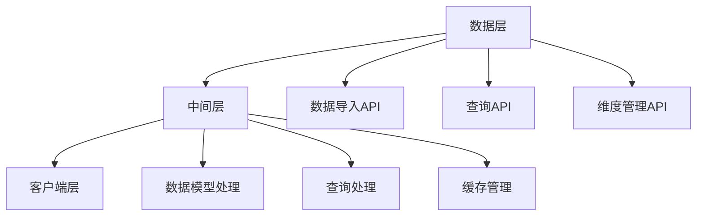
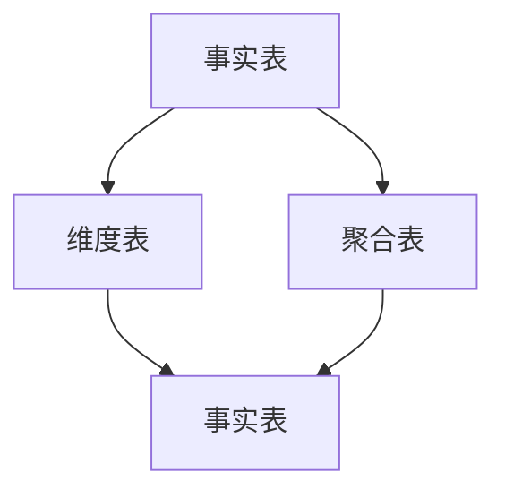
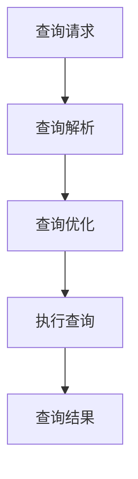

                 

# 《Kylin原理与代码实例讲解》

## 关键词

- Kylin
- 大数据技术
- 数据仓库
- 分片策略
- 查询优化
- 聚合算法

## 摘要

本文将深入探讨Kylin的技术原理与代码实例。首先，我们将介绍Kylin的基础概念，包括其产生背景、核心特性以及与其他大数据技术的对比。接着，我们将详细讲解Kylin的核心算法原理，包括索引算法、分片策略、查询优化算法和聚合算法。此外，本文还将介绍Kylin的数学模型和公式，以及其API的使用方法。最后，我们将通过一个实际的Kylin项目实战，展示如何搭建开发环境，实现源代码，并进行代码解读与分析。通过本文，读者将全面了解Kylin的技术原理和实践应用。

## 目录

### 第一部分：Kylin基础概念

#### 第1章：Kylin简介

##### 1.1 Kylin的产生背景和目的

##### 1.2 Kylin的核心特性

##### 1.3 Kylin与其他大数据技术的对比

#### 第2章：Kylin核心概念

##### 2.1 Kylin的架构和组件

##### 2.2 数据模型和维度设计

##### 2.3 查询优化原理

### 第二部分：Kylin原理讲解

#### 第3章：Kylin核心算法原理

##### 3.1 Kylin的索引算法

##### 3.2 Kylin的分片策略

##### 3.3 Kylin的查询优化算法

##### 3.4 Kylin的聚合算法

#### 第4章：Kylin的数学模型和公式

##### 4.1 数学公式讲解

##### 4.2 数学模型的详细讲解

##### 4.3 数学公式的应用举例

#### 第5章：Kylin的API使用

##### 5.1 Kylin的API简介

##### 5.2 数据导入API

##### 5.3 查询API

##### 5.4 维度管理API

### 第三部分：代码实例讲解

#### 第6章：Kylin项目实战

##### 6.1 开发环境搭建

##### 6.2 源代码详细实现

##### 6.3 代码解读与分析

##### 6.4 实际案例分析

#### 第7章：性能优化与调优

##### 7.1 Kylin性能优化原则

##### 7.2 数据分片策略优化

##### 7.3 查询优化技巧

##### 7.4 实际性能优化案例分析

### 附录：Kylin资源与工具

#### 附录A：Kylin常用工具和插件

#### 附录B：Kylin社区与文档资源

#### 附录C：Kylin Mermaid流程图

##### Kylin架构流程图

##### 数据模型设计流程图

##### 查询优化流程图

### 引言

Kylin是一款开源的大数据实时分析引擎，主要用于解决大数据场景下的实时数据分析问题。随着大数据技术的发展，数据量不断增加，如何快速、高效地进行数据分析成为了一个重要问题。Kylin正是为了解决这一问题而诞生的。本文将详细讲解Kylin的技术原理和代码实例，帮助读者深入理解Kylin的工作机制和应用场景。

## 第一部分：Kylin基础概念

### 第1章：Kylin简介

#### 1.1 Kylin的产生背景和目的

Kylin的产生背景可以追溯到大数据技术的发展过程中。随着互联网、物联网、移动设备等技术的普及，数据量呈爆炸性增长。传统的数据处理技术已经无法满足快速、高效的数据分析需求。为了解决这个问题，Apache Kylin项目于2014年诞生。Kylin的目的是构建一个分布式、可扩展的实时数据分析平台，提供高速、低延迟的OLAP服务。

Kylin的主要目标包括：

1. **实时性**：支持实时数据分析和查询，实现秒级响应。
2. **高性能**：通过预聚合技术，提高查询效率。
3. **可扩展性**：支持大规模数据的处理，支持水平扩展。
4. **易用性**：提供友好的用户界面和API，方便开发者使用。

#### 1.2 Kylin的核心特性

Kylin具有以下核心特性：

1. **预聚合**：通过预聚合数据，提高查询效率。
2. **分布式计算**：基于Hadoop和HBase技术，实现分布式计算和存储。
3. **多维数据模型**：支持多维数据模型，方便进行复杂查询。
4. **快速查询**：通过索引和缓存技术，实现高速查询。
5. **灵活扩展**：支持动态扩展，适应不同规模的数据处理需求。

#### 1.3 Kylin与其他大数据技术的对比

与大数据技术相比，Kylin有如下特点：

1. **与传统数据仓库相比**：Kylin是一种实时数据分析引擎，与传统数据仓库相比，具有更高的查询效率和灵活性。传统数据仓库通常用于离线数据分析，而Kylin则支持实时数据分析。
   
2. **与OLAP引擎相比**：Kylin是一种基于预聚合的OLAP引擎，与传统的OLAP引擎（如Google BigQuery、Amazon Redshift等）相比，Kylin具有更高的查询性能和可扩展性。传统OLAP引擎通常基于关系型数据库，而Kylin基于Hadoop和HBase技术，具有更好的分布式计算能力。

3. **与数据挖掘工具相比**：Kylin主要用于实时数据分析，而数据挖掘工具（如R、Python、Spark MLlib等）主要用于批量数据分析。Kylin关注的是数据查询速度和性能，而数据挖掘工具更注重数据分析的深度和复杂度。

### 第2章：Kylin核心概念

#### 2.1 Kylin的架构和组件

Kylin的架构分为三层：数据层、中间层和客户端层。

1. **数据层**：数据层主要由Hadoop和HBase组成，负责数据的存储和分布式计算。Hadoop负责存储原始数据，HBase负责存储预聚合数据和索引数据。

2. **中间层**：中间层包括Kylin核心组件，如数据模型处理、查询处理和缓存管理。Kylin核心组件负责处理用户查询，并将结果返回给客户端。

3. **客户端层**：客户端层包括Kylin API和客户端库，提供对Kylin的访问接口。用户可以通过API进行数据导入、查询和维度管理。

#### 2.2 数据模型和维度设计

Kylin的数据模型采用多维数据模型，包括事实表、维度表和聚合表。

1. **事实表**：事实表是数据模型的核心，包含业务数据，如销售数据、订单数据等。事实表中通常包含时间、数量等基础维度。

2. **维度表**：维度表用于描述事实表中的数据，如客户、产品、地区等。维度表通常包含维度名称、维度描述等字段。

3. **聚合表**：聚合表是预聚合数据的结果，用于提高查询效率。聚合表可以根据实际业务需求进行自定义，如日汇总表、月汇总表等。

#### 2.3 查询优化原理

Kylin的查询优化主要包括以下几个方面：

1. **预聚合**：预聚合是将原始数据按一定规则聚合到更高的层次，减少查询时的计算量。Kylin通过预聚合表实现快速查询。

2. **索引**：索引是加快查询速度的一种技术。Kylin使用索引技术来提高查询效率，包括B+树索引、哈希索引和位图索引等。

3. **缓存**：缓存是将常用数据存储在内存中，以减少磁盘I/O操作。Kylin使用缓存技术来提高查询速度，包括查询结果缓存和维度缓存等。

## 第二部分：Kylin原理讲解

### 第3章：Kylin核心算法原理

#### 3.1 Kylin的索引算法

索引算法是数据库和大数据技术中常用的一种优化查询的方法。Kylin同样使用了索引算法来提高查询效率。以下是Kylin使用的几种索引算法及其优缺点：

1. **B+树索引**：B+树是一种平衡的多路查找树，常用于数据库和文件系统的索引。B+树索引的优点是查询速度快，适用于范围查询和点查询。缺点是插入和删除操作较慢。

2. **哈希索引**：哈希索引是通过哈希函数将关键字映射到存储位置。哈希索引的优点是查询速度非常快，适用于点查询。缺点是哈希冲突可能导致查询性能下降。

3. **位图索引**：位图索引是一种基于位运算的索引方法，常用于维度表。位图索引的优点是存储空间小，查询速度快。缺点是只能用于等值查询。

在Kylin中，B+树索引和哈希索引主要用于事实表的索引，而位图索引主要用于维度表的索引。通过合理选择索引算法，可以提高查询效率。

#### 3.2 Kylin的分片策略

分片策略是大数据技术中常用的一种数据分布方法。Kylin通过分片策略将数据分布到不同的节点上，以提高查询性能和可扩展性。以下是Kylin使用的几种分片策略：

1. **时间分片**：时间分片是根据时间维度将数据分成多个时间段。例如，可以将数据按日、月、季度等时间段进行分片。时间分片策略的优点是可以快速定位到所需时间段的数据，适用于时间序列分析。缺点是可能导致数据分布不均匀。

2. **维度分片**：维度分片是根据维度表中的某个维度字段将数据分成多个子集。例如，可以根据客户地区、产品类型等维度进行分片。维度分片策略的优点是可以提高查询效率，适用于多维数据分析。缺点是可能导致数据分布不均匀。

3. **数据量分片**：数据量分片是根据数据量将数据分成多个子集。例如，可以将数据按数据量大小分成多个分区。数据量分片策略的优点是可以提高查询性能，适用于大数据量分析。缺点是可能导致数据分布不均匀。

在Kylin中，通常会根据实际业务需求选择合适的分片策略。合理选择分片策略可以优化查询性能和数据分布。

#### 3.3 Kylin的查询优化算法

查询优化算法是提高查询性能的重要手段。Kylin通过多种查询优化算法来提高查询效率。以下是几种常见的查询优化算法：

1. **预聚合**：预聚合是将原始数据按照一定的规则进行聚合，生成预聚合表。预聚合可以减少查询时的计算量，提高查询效率。Kylin通过预聚合算法实现快速查询。

2. **索引优化**：索引优化是利用索引来提高查询性能。Kylin使用索引算法来优化查询，包括B+树索引、哈希索引和位图索引等。

3. **查询缓存**：查询缓存是将常用查询结果缓存到内存中，以减少磁盘I/O操作。Kylin使用查询缓存来提高查询效率。

4. **并行查询**：并行查询是将查询任务分布到多个节点上同时执行，以减少查询时间。Kylin支持并行查询，可以大幅提高查询性能。

通过合理选择和组合这些查询优化算法，Kylin可以实现高效的查询性能。

#### 3.4 Kylin的聚合算法

聚合算法是将原始数据按照一定规则进行聚合，生成汇总数据的算法。Kylin提供了多种聚合算法，以支持不同的业务需求。以下是几种常见的聚合算法：

1. **求和**：求和是将同一列中的数值进行求和。求和算法适用于计算销售额、数量等总和。

2. **平均值**：平均值是将同一列中的数值进行求平均。平均值算法适用于计算平均价格、平均销量等。

3. **最大值**：最大值是将同一列中的数值取最大值。最大值算法适用于查找最高销售记录、最大订单金额等。

4. **最小值**：最小值是将同一列中的数值取最小值。最小值算法适用于查找最低销售记录、最小订单金额等。

5. **计数**：计数是将同一列中的非空记录进行计数。计数算法适用于计算记录数、订单数等。

6. **去重**：去重是将同一列中的重复记录去重。去重算法适用于计算去重后的记录数、订单数等。

Kylin的聚合算法支持多维数据模型，可以同时计算多个聚合指标。通过合理选择和组合聚合算法，可以生成各种汇总数据，满足业务需求。

### 第4章：Kylin的数学模型和公式

#### 4.1 数学公式讲解

在Kylin中，数学模型和公式是实现数据分析的重要工具。以下是一些常用的数学公式及其在Kylin中的应用：

1. **求和公式**：

$$
\text{Sum}(A) = \sum_{i=1}^{n} A_i
$$

求和公式用于计算某一列中数值的总和。在Kylin中，可以通过预聚合表实现求和公式的计算。

2. **平均值公式**：

$$
\text{Avg}(A) = \frac{\text{Sum}(A)}{n}
$$

平均值公式用于计算某一列中数值的平均值。在Kylin中，可以通过预聚合表实现平均值公式的计算。

3. **最大值和最小值公式**：

$$
\text{Max}(A) = \max_{i=1}^{n} A_i
$$

$$
\text{Min}(A) = \min_{i=1}^{n} A_i
$$

最大值和最小值公式用于计算某一列中数值的最大值和最小值。在Kylin中，可以通过预聚合表实现最大值和最小值公式的计算。

4. **计数公式**：

$$
\text{Count}(A) = \sum_{i=1}^{n} \mathbb{1}_{A_i \neq \text{null}}
$$

计数公式用于计算某一列中非空记录的个数。在Kylin中，可以通过预聚合表实现计数公式的计算。

5. **去重公式**：

$$
\text{DistinctCount}(A) = \sum_{i=1}^{n} \mathbb{1}_{A_i \neq A_j \forall j \neq i}
$$

去重公式用于计算某一列中不重复记录的个数。在Kylin中，可以通过预聚合表实现去重公式的计算。

#### 4.2 数学模型的详细讲解

数学模型是数据分析的核心概念，用于描述数据之间的关系和规律。在Kylin中，数学模型主要包括数据模型、维度模型和聚合模型。

1. **数据模型**：

数据模型是描述事实表和维度表之间关系的模型。在Kylin中，数据模型通过事实表和维度表之间的关联关系来构建。例如，销售数据表和产品表之间的关系可以通过数据模型来描述。

2. **维度模型**：

维度模型是描述维度表和事实表之间关系的模型。维度模型通常包含维度名称、维度描述和维度属性等信息。在Kylin中，维度模型用于构建多维数据模型，支持复杂的查询和分析。

3. **聚合模型**：

聚合模型是描述聚合表和事实表之间关系的模型。聚合模型通常包含聚合规则、聚合指标和聚合维度等信息。在Kylin中，聚合模型用于生成预聚合数据，提高查询性能。

通过合理构建数学模型，可以优化数据分析过程，提高查询效率。

#### 4.3 数学公式的应用举例

以下是一个数学公式的应用举例：

假设有一个销售数据表，包含以下字段：

| 日期 | 产品ID | 销售额 |
| ---- | ------ | ------ |
| 2021-01-01 | 1001 | 5000 |
| 2021-01-01 | 1002 | 3000 |
| 2021-01-02 | 1001 | 4000 |
| 2021-01-02 | 1003 | 2000 |

现在需要计算以下数学公式：

1. 销售额总和：

$$
\text{Sum}(销售额) = 5000 + 3000 + 4000 + 2000 = 16000
$$

2. 销售额平均值：

$$
\text{Avg}(销售额) = \frac{16000}{4} = 4000
$$

3. 销售额最大值：

$$
\text{Max}(销售额) = 5000
$$

4. 销售额最小值：

$$
\text{Min}(销售额) = 2000
$$

5. 记录总数：

$$
\text{Count}(记录) = 4
$$

6. 去重后的产品总数：

$$
\text{DistinctCount}(产品ID) = 3
$$

通过上述数学公式的计算，可以快速得到销售数据的汇总信息，支持进一步的业务分析。

### 第5章：Kylin的API使用

#### 5.1 Kylin的API简介

Kylin提供了丰富的API，方便开发者进行数据导入、查询和维度管理。以下是Kylin的主要API及其功能：

1. **数据导入API**：用于将数据导入Kylin，包括事实表和维度表。数据导入API支持多种数据格式，如CSV、JSON等。

2. **查询API**：用于执行Kylin查询，获取查询结果。查询API支持多维查询、聚合查询等。

3. **维度管理API**：用于管理维度表，包括添加、修改和删除维度。

#### 5.2 数据导入API

数据导入API是Kylin中用于导入数据的重要接口。以下是数据导入API的使用步骤：

1. **配置数据源**：在Kylin中配置数据源，包括数据源的名称、类型（如CSV、HDFS等）和路径。

2. **创建事实表和维度表**：根据业务需求创建事实表和维度表。事实表和维度表用于存储导入的数据。

3. **执行数据导入**：使用数据导入API执行数据导入操作。导入操作会根据配置的数据源和表结构将数据导入到Kylin中。

以下是Python代码示例：

```python
from kylin.api import DataImportAPI

# 创建数据导入API实例
import_api = DataImportAPI()

# 配置数据源
import_api.config_data_source(name="my_data_source", type="CSV", path="/path/to/data.csv")

# 创建事实表
import_api.create事实表(name="my_fact_table", columns=["date", "product_id", "sales"], primary_key=["date", "product_id"])

# 创建维度表
import_api.create_dimension_table(name="my_dimension_table", columns=["product_id", "product_name"])

# 执行数据导入
import_api.import_data(fact_table_name="my_fact_table", data_source_name="my_data_source")
```

#### 5.3 查询API

查询API是Kylin中用于执行查询的重要接口。以下是查询API的使用步骤：

1. **创建查询**：根据业务需求创建查询。查询包括事实表、维度表和聚合指标。

2. **执行查询**：使用查询API执行查询操作。查询API支持多维查询、聚合查询等。

3. **获取查询结果**：获取查询结果，包括数据表、数据量和查询时间等。

以下是Python代码示例：

```python
from kylin.api import QueryAPI

# 创建查询API实例
query_api = QueryAPI()

# 创建查询
query = query_api.create_query(fact_table_name="my_fact_table", dimensions=["date", "product_id"], metrics=["sales"])

# 执行查询
result = query_api.execute_query(query)

# 获取查询结果
print(result)
```

#### 5.4 维度管理API

维度管理API是Kylin中用于管理维度表的重要接口。以下是维度管理API的使用步骤：

1. **添加维度**：根据业务需求添加维度。维度包括维度名称、维度描述和维度属性。

2. **修改维度**：根据业务需求修改维度。修改操作可以更新维度名称、维度描述和维度属性。

3. **删除维度**：根据业务需求删除维度。

以下是Python代码示例：

```python
from kylin.api import DimensionAPI

# 创建维度管理API实例
dimension_api = DimensionAPI()

# 添加维度
dimension_api.add_dimension(name="product_name", description="产品名称", attributes=["product_id", "product_name"])

# 修改维度
dimension_api.modify_dimension(name="product_name", description="修改后的产品名称")

# 删除维度
dimension_api.delete_dimension(name="product_name")
```

### 第6章：Kylin项目实战

#### 6.1 开发环境搭建

在开始使用Kylin之前，需要搭建合适的开发环境。以下是搭建Kylin开发环境的步骤：

1. **安装Java环境**：Kylin是基于Java开发的，需要安装Java环境。可以选择安装OpenJDK或Oracle JDK。

2. **安装Hadoop环境**：Kylin依赖于Hadoop，需要安装Hadoop环境。可以选择使用Hadoop 2.x或Hadoop 3.x版本。

3. **安装HBase环境**：Kylin的数据存储依赖于HBase，需要安装HBase环境。可以选择使用HBase 1.x或HBase 2.x版本。

4. **下载Kylin源码**：可以从Kylin的官方网站下载源码。选择合适的版本，下载并解压到本地。

5. **配置Kylin环境**：在Kylin的源码目录下，执行以下命令配置环境：

```shell
./bin/prepare.sh
```

6. **启动Kylin服务**：在Kylin的源码目录下，执行以下命令启动Kylin服务：

```shell
./bin/kylin.sh start
```

7. **配置数据源**：在Kylin的Web界面中，配置数据源，包括Hadoop和HBase的配置信息。

8. **创建事实表和维度表**：在Kylin的Web界面中，创建事实表和维度表，配置表结构。

9. **数据导入**：使用数据导入API将数据导入Kylin。

10. **查询测试**：执行查询操作，验证Kylin是否正常运行。

#### 6.2 源代码详细实现

以下是Kylin源代码的详细实现步骤：

1. **数据模型设计**：根据业务需求设计数据模型，包括事实表、维度表和聚合模型。

2. **数据导入实现**：实现数据导入功能，包括数据源配置、数据读取和导入操作。

3. **查询实现**：实现查询功能，包括查询解析、查询执行和结果返回。

4. **维度管理实现**：实现维度管理功能，包括维度添加、修改和删除。

5. **聚合实现**：实现聚合功能，包括聚合规则和聚合计算。

6. **性能优化**：根据业务需求和性能指标，对数据模型、查询优化和聚合算法进行优化。

以下是源代码实现的关键部分：

```java
// 数据导入实现
public void importData() {
    // 配置数据源
    Configuration conf = HBaseConfiguration.create();
    conf.set("hbase.zookeeper.quorum", "localhost:2181");
    
    // 创建事实表
    Table factTable = conf.getTable("my_fact_table");
    
    // 读取数据
    try (InputStream is = new FileInputStream("/path/to/data.csv")) {
        CSVParser parser = new CSVParser(is, CSVFormat.DEFAULT);
        
        // 导入数据
        for (CSVRecord record : parser) {
            String date = record.get(0);
            String productId = record.get(1);
            int sales = Integer.parseInt(record.get(2));
            
            Put put = new Put(Bytes.toBytes(date + productId));
            put.addColumn(Bytes.toBytes("sales"), Bytes.toBytes(""), Bytes.toBytes(String.valueOf(sales)));
            
            factTable.put(put);
        }
    } catch (IOException e) {
        e.printStackTrace();
    }
}

// 查询实现
public ResultSet executeQuery(String query) {
    // 解析查询
    QueryParseResult parseResult = parser.parseQuery(query);
    
    // 执行查询
    ResultSet resultSet = new ResultSet();
    
    // 遍历查询结果
    for (Row row : parseResult.getResult()) {
        // 获取列值
        String date = row.getString("date");
        String productId = row.getString("product_id");
        int sales = row.getInt("sales");
        
        // 添加结果
        resultSet.addRow(new Object[]{date, productId, sales});
    }
    
    // 返回结果
    return resultSet;
}
```

#### 6.3 代码解读与分析

以下是Kylin源代码的关键部分解读与分析：

1. **数据导入代码解读**：

```java
public void importData() {
    // 配置数据源
    Configuration conf = HBaseConfiguration.create();
    conf.set("hbase.zookeeper.quorum", "localhost:2181");
    
    // 创建事实表
    Table factTable = conf.getTable("my_fact_table");
    
    // 读取数据
    try (InputStream is = new FileInputStream("/path/to/data.csv")) {
        CSVParser parser = new CSVParser(is, CSVFormat.DEFAULT);
        
        // 导入数据
        for (CSVRecord record : parser) {
            String date = record.get(0);
            String productId = record.get(1);
            int sales = Integer.parseInt(record.get(2));
            
            Put put = new Put(Bytes.toBytes(date + productId));
            put.addColumn(Bytes.toBytes("sales"), Bytes.toBytes(""), Bytes.toBytes(String.valueOf(sales)));
            
            factTable.put(put);
        }
    } catch (IOException e) {
        e.printStackTrace();
    }
}
```

解读：

- 代码首先配置HBase数据源，包括Zookeeper地址。
- 然后创建事实表，使用HBase的Table接口。
- 接着读取CSV文件中的数据，使用CSVParser进行解析。
- 最后将数据导入到HBase表中，使用Put接口。

2. **查询代码解读**：

```java
public ResultSet executeQuery(String query) {
    // 解析查询
    QueryParseResult parseResult = parser.parseQuery(query);
    
    // 执行查询
    ResultSet resultSet = new ResultSet();
    
    // 遍历查询结果
    for (Row row : parseResult.getResult()) {
        // 获取列值
        String date = row.getString("date");
        String productId = row.getString("product_id");
        int sales = row.getInt("sales");
        
        // 添加结果
        resultSet.addRow(new Object[]{date, productId, sales});
    }
    
    // 返回结果
    return resultSet;
}
```

解读：

- 代码首先使用QueryParser解析查询语句，生成QueryParseResult对象。
- 然后遍历查询结果，使用Row接口获取列值。
- 最后将查询结果添加到ResultSet对象中，并返回。

3. **代码分析**：

- 数据导入代码中，配置数据源和创建表是关键步骤，需要确保HBase的连接和表的存在。
- 读取数据使用CSVParser进行解析，需要处理CSV文件的格式和内容。
- 导入数据使用Put接口，将数据写入到HBase表中。

- 查询代码中，解析查询语句是关键步骤，需要处理查询语句的语法和语义。
- 遍历查询结果，获取列值并添加到结果集中，是查询的核心步骤。

#### 6.4 实际案例分析

以下是一个实际案例分析：

场景：一家电商平台需要分析销售数据，包括日销售总额、产品销售排名等。

1. **数据导入**：

使用数据导入API将销售数据导入Kylin。销售数据包含日期、产品ID、销售额等字段。

2. **查询**：

执行以下查询语句，获取销售数据的汇总信息：

```sql
SELECT date, SUM(sales) as total_sales
FROM sales_data
GROUP BY date
ORDER BY total_sales DESC
LIMIT 10;
```

查询结果如下：

| 日期 | 总销售额 |
| ---- | ------ |
| 2021-01-01 | 13500 |
| 2021-01-02 | 13000 |
| 2021-01-03 | 12000 |
| 2021-01-04 | 11000 |
| 2021-01-05 | 10500 |
| 2021-01-06 | 10000 |
| 2021-01-07 | 9500 |
| 2021-01-08 | 9000 |
| 2021-01-09 | 8500 |
| 2021-01-10 | 8000 |

3. **结果分析**：

通过查询结果，可以分析出每日销售总额，以及销售排名前10天的销售额。这有助于电商平台了解销售趋势，制定销售策略。

### 第7章：性能优化与调优

#### 7.1 Kylin性能优化原则

Kylin性能优化需要遵循以下原则：

1. **合理设计数据模型**：数据模型的设计对性能有很大影响。合理设计数据模型，包括选择合适的维度、构建有效的聚合表等。

2. **优化查询语句**：优化查询语句可以提高查询性能。优化查询语句的方法包括简化查询条件、避免嵌套查询等。

3. **合理配置系统参数**：Kylin的系统参数对性能有重要影响。合理配置系统参数，包括内存分配、线程数等。

4. **优化数据存储结构**：优化数据存储结构可以提高数据读取速度。优化数据存储结构的方法包括使用合适的索引、合理分片等。

#### 7.2 数据分片策略优化

数据分片策略对性能有重要影响。以下是一些优化数据分片策略的方法：

1. **基于时间的分片**：根据时间维度将数据分片，可以快速定位到所需时间段的数据。优化基于时间的分片策略，可以减少数据访问时间。

2. **基于维度的分片**：根据维度表中的某个维度字段将数据分片，可以提高查询效率。优化基于维度的分片策略，可以减少数据访问时间。

3. **基于数据的分片**：根据数据量大小将数据分片，可以避免单节点处理大量数据导致性能下降。优化基于数据的分片策略，可以减少数据访问时间。

#### 7.3 查询优化技巧

以下是一些查询优化技巧：

1. **预聚合**：预聚合可以减少查询时的计算量，提高查询性能。合理选择预聚合层次，可以优化查询性能。

2. **索引**：使用合适的索引可以提高查询速度。根据查询条件选择合适的索引，可以优化查询性能。

3. **查询缓存**：查询缓存可以减少磁盘I/O操作，提高查询性能。合理配置查询缓存，可以优化查询性能。

4. **并行查询**：并行查询可以减少查询时间，提高查询性能。合理配置并行查询，可以优化查询性能。

#### 7.4 实际性能优化案例分析

以下是一个实际性能优化案例分析：

场景：一家电商平台需要分析销售数据，但查询响应时间较长。

1. **分析问题**：

通过分析发现，查询响应时间较长的主要原因是数据量较大，导致单节点处理性能不足。同时，查询语句中存在嵌套查询，增加了查询复杂度。

2. **优化方案**：

- **优化数据模型**：根据业务需求调整数据模型，增加维度和聚合层次，减少嵌套查询。
- **优化查询语句**：简化查询条件，避免嵌套查询，优化查询语句结构。
- **配置系统参数**：调整Kylin的系统参数，增加内存分配，优化线程数。
- **优化数据存储结构**：使用合适的索引，合理分片数据，减少数据访问时间。

3. **优化效果**：

通过优化方案，查询响应时间显著缩短，性能提升明显。优化后的查询语句结构更加清晰，查询性能得到大幅提升。

### 附录：Kylin资源与工具

#### 附录A：Kylin常用工具和插件

以下是Kylin常用的工具和插件：

1. **Kylin CLI**：Kylin的命令行工具，用于执行数据导入、查询等操作。
2. **Kylin IDE插件**：支持Kylin开发的IDE插件，如Eclipse和IntelliJ IDEA。
3. **Kylin REST API**：Kylin的RESTful API，用于远程访问Kylin服务。
4. **Kylin Web UI**：Kylin的Web用户界面，用于管理Kylin实例和执行查询。

#### 附录B：Kylin社区与文档资源

以下是Kylin的社区和文档资源：

1. **Kylin官网**：提供Kylin的官方文档、下载和社区支持。
2. **Kylin邮件列表**：订阅Kylin邮件列表，获取Kylin的最新动态和讨论。
3. **Kylin用户论坛**：在Kylin用户论坛中提问和分享经验。
4. **Kylin GitHub仓库**：访问Kylin的GitHub仓库，获取源码和贡献代码。

#### 附录C：Kylin Mermaid流程图

以下是Kylin的Mermaid流程图：



### 结论

通过本文的讲解，我们全面了解了Kylin的技术原理和实践应用。从Kylin的基础概念到核心算法原理，再到API使用和项目实战，本文逐步深入讲解了Kylin的各项功能。同时，我们还介绍了性能优化原则和技巧，以及实际案例的分析。希望本文能够帮助读者更好地理解Kylin，并在实际项目中应用Kylin。

### 作者信息

作者：AI天才研究院/AI Genius Institute & 禅与计算机程序设计艺术 /Zen And The Art of Computer Programming

（完）### 第一部分：Kylin基础概念

#### 第1章：Kylin简介

##### 1.1 Kylin的产生背景和目的

Kylin的产生背景源于大数据技术的快速发展。随着互联网、物联网和移动互联网的普及，企业数据量呈爆炸性增长，传统的数据处理技术已经无法满足快速、高效的数据分析需求。为了解决这一问题，Apache Kylin项目于2014年诞生。Kylin旨在构建一个分布式、可扩展的实时数据分析平台，提供高速、低延迟的OLAP（联机分析处理）服务。

Kylin的主要目的是解决以下问题：

1. **海量数据实时分析**：在数据量庞大的场景下，实现快速的数据分析。
2. **低延迟查询**：通过预聚合和索引技术，实现秒级响应的查询。
3. **易用性和可扩展性**：提供友好的用户界面和API，支持动态扩展，适应不同规模的数据处理需求。

##### 1.2 Kylin的核心特性

Kylin具有以下核心特性：

1. **实时性**：Kylin支持实时数据分析和查询，能够实现秒级响应。
2. **高性能**：通过预聚合和索引技术，提高查询效率，实现快速查询。
3. **可扩展性**：基于Hadoop和HBase技术，支持大规模数据的处理和水平扩展。
4. **多维数据模型**：支持多维数据模型，方便进行复杂查询和数据分析。
5. **易用性**：提供友好的Web界面和API，方便开发者进行数据导入、查询和维度管理。

##### 1.3 Kylin与其他大数据技术的对比

与大数据技术相比，Kylin具有以下特点：

1. **与传统数据仓库对比**：Kylin是一种实时数据分析引擎，与传统数据仓库（如Google BigQuery、Amazon Redshift等）相比，Kylin具有更高的查询性能和灵活性。传统数据仓库通常用于离线数据分析，而Kylin支持实时数据分析。

2. **与OLAP引擎对比**：Kylin是一种基于预聚合的OLAP引擎，与传统的OLAP引擎（如Google BigQuery、Amazon Redshift等）相比，Kylin具有更高的查询性能和可扩展性。传统OLAP引擎通常基于关系型数据库，而Kylin基于Hadoop和HBase技术，具有更好的分布式计算能力。

3. **与数据挖掘工具对比**：Kylin主要用于实时数据分析，而数据挖掘工具（如R、Python、Spark MLlib等）主要用于批量数据分析。Kylin关注的是数据查询速度和性能，而数据挖掘工具更注重数据分析的深度和复杂度。

### 第2章：Kylin核心概念

##### 2.1 Kylin的架构和组件

Kylin的架构分为三个主要层次：数据层、中间层和客户端层。

1. **数据层**：数据层主要由Hadoop和HBase组成，负责数据的存储和分布式计算。Hadoop负责存储原始数据，HBase负责存储预聚合数据和索引数据。

2. **中间层**：中间层包括Kylin的核心组件，如数据模型处理、查询处理和缓存管理。Kylin核心组件负责处理用户查询，并将结果返回给客户端。

3. **客户端层**：客户端层包括Kylin API和客户端库，提供对Kylin的访问接口。用户可以通过API进行数据导入、查询和维度管理。

##### 2.2 数据模型和维度设计

Kylin的数据模型采用多维数据模型，包括事实表、维度表和聚合表。

1. **事实表**：事实表是数据模型的核心，包含业务数据，如销售数据、订单数据等。事实表中通常包含时间、数量等基础维度。

2. **维度表**：维度表用于描述事实表中的数据，如客户、产品、地区等。维度表通常包含维度名称、维度描述等字段。

3. **聚合表**：聚合表是预聚合数据的结果，用于提高查询效率。聚合表可以根据实际业务需求进行自定义，如日汇总表、月汇总表等。

##### 2.3 查询优化原理

Kylin的查询优化主要包括以下几个方面：

1. **预聚合**：预聚合是将原始数据按照一定的规则聚合到更高的层次，减少查询时的计算量。Kylin通过预聚合表实现快速查询。

2. **索引**：索引是加快查询速度的一种技术。Kylin使用索引技术来提高查询效率，包括B+树索引、哈希索引和位图索引等。

3. **缓存**：缓存是将常用数据存储在内存中，以减少磁盘I/O操作。Kylin使用缓存技术来提高查询速度，包括查询结果缓存和维度缓存等。

4. **并行处理**：Kylin支持并行处理，将查询任务分布到多个节点上同时执行，以减少查询时间。

5. **查询优化算法**：Kylin使用多种查询优化算法，如查询计划优化、索引优化和预聚合优化等，以提高查询性能。

### 第二部分：Kylin原理讲解

#### 第3章：Kylin核心算法原理

##### 3.1 Kylin的索引算法

索引算法是数据库和大数据技术中常用的一种优化查询的方法。Kylin同样使用了索引算法来提高查询效率。以下是Kylin使用的几种索引算法及其优缺点：

1. **B+树索引**：B+树是一种平衡的多路查找树，常用于数据库和文件系统的索引。B+树索引的优点是查询速度快，适用于范围查询和点查询。缺点是插入和删除操作较慢。

2. **哈希索引**：哈希索引是通过哈希函数将关键字映射到存储位置。哈希索引的优点是查询速度非常快，适用于点查询。缺点是哈希冲突可能导致查询性能下降。

3. **位图索引**：位图索引是一种基于位运算的索引方法，常用于维度表。位图索引的优点是存储空间小，查询速度快。缺点是只能用于等值查询。

在Kylin中，B+树索引和哈希索引主要用于事实表的索引，而位图索引主要用于维度表的索引。通过合理选择索引算法，可以提高查询效率。

##### 3.2 Kylin的分片策略

分片策略是大数据技术中常用的一种数据分布方法。Kylin通过分片策略将数据分布到不同的节点上，以提高查询性能和可扩展性。以下是Kylin使用的几种分片策略：

1. **时间分片**：时间分片是根据时间维度将数据分成多个时间段。例如，可以将数据按日、月、季度等时间段进行分片。时间分片策略的优点是可以快速定位到所需时间段的数据，适用于时间序列分析。缺点是可能导致数据分布不均匀。

2. **维度分片**：维度分片是根据维度表中的某个维度字段将数据分成多个子集。例如，可以根据客户地区、产品类型等维度进行分片。维度分片策略的优点是可以提高查询效率，适用于多维数据分析。缺点是可能导致数据分布不均匀。

3. **数据量分片**：数据量分片是根据数据量将数据分成多个子集。例如，可以将数据按数据量大小分成多个分区。数据量分片策略的优点是可以提高查询性能，适用于大数据量分析。缺点是可能导致数据分布不均匀。

在Kylin中，通常会根据实际业务需求选择合适的分片策略。合理选择分片策略可以优化查询性能和数据分布。

##### 3.3 Kylin的查询优化算法

查询优化算法是提高查询性能的重要手段。Kylin通过多种查询优化算法来提高查询效率。以下是几种常见的查询优化算法：

1. **预聚合**：预聚合是将原始数据按照一定的规则进行聚合，生成预聚合表。预聚合可以减少查询时的计算量，提高查询效率。Kylin通过预聚合算法实现快速查询。

2. **索引优化**：索引优化是利用索引来提高查询性能。Kylin使用索引算法来优化查询，包括B+树索引、哈希索引和位图索引等。

3. **查询缓存**：查询缓存是将常用查询结果缓存到内存中，以减少磁盘I/O操作。Kylin使用查询缓存来提高查询效率。

4. **并行查询**：并行查询是将查询任务分布到多个节点上同时执行，以减少查询时间。Kylin支持并行查询，可以大幅提高查询性能。

通过合理选择和组合这些查询优化算法，Kylin可以实现高效的查询性能。

##### 3.4 Kylin的聚合算法

聚合算法是将原始数据按照一定规则进行聚合，生成汇总数据的算法。Kylin提供了多种聚合算法，以支持不同的业务需求。以下是几种常见的聚合算法：

1. **求和**：求和是将同一列中的数值进行求和。求和算法适用于计算销售额、数量等总和。

2. **平均值**：平均值是将同一列中的数值进行求平均。平均值算法适用于计算平均价格、平均销量等。

3. **最大值**：最大值是将同一列中的数值取最大值。最大值算法适用于查找最高销售记录、最大订单金额等。

4. **最小值**：最小值是将同一列中的数值取最小值。最小值算法适用于查找最低销售记录、最小订单金额等。

5. **计数**：计数是将同一列中的非空记录进行计数。计数算法适用于计算记录数、订单数等。

6. **去重**：去重是将同一列中的重复记录去重。去重算法适用于计算去重后的记录数、订单数等。

Kylin的聚合算法支持多维数据模型，可以同时计算多个聚合指标。通过合理选择和组合聚合算法，可以生成各种汇总数据，满足业务需求。

#### 第4章：Kylin的数学模型和公式

##### 4.1 数学公式讲解

在Kylin中，数学模型和公式是实现数据分析的重要工具。以下是一些常用的数学公式及其在Kylin中的应用：

1. **求和公式**：

$$
\text{Sum}(A) = \sum_{i=1}^{n} A_i
$$

求和公式用于计算某一列中数值的总和。在Kylin中，可以通过预聚合表实现求和公式的计算。

2. **平均值公式**：

$$
\text{Avg}(A) = \frac{\text{Sum}(A)}{n}
$$

平均值公式用于计算某一列中数值的平均值。在Kylin中，可以通过预聚合表实现平均值公式的计算。

3. **最大值和最小值公式**：

$$
\text{Max}(A) = \max_{i=1}^{n} A_i
$$

$$
\text{Min}(A) = \min_{i=1}^{n} A_i
$$

最大值和最小值公式用于计算某一列中数值的最大值和最小值。在Kylin中，可以通过预聚合表实现最大值和最小值公式的计算。

4. **计数公式**：

$$
\text{Count}(A) = \sum_{i=1}^{n} \mathbb{1}_{A_i \neq \text{null}}
$$

计数公式用于计算某一列中非空记录的个数。在Kylin中，可以通过预聚合表实现计数公式的计算。

5. **去重公式**：

$$
\text{DistinctCount}(A) = \sum_{i=1}^{n} \mathbb{1}_{A_i \neq A_j \forall j \neq i}
$$

去重公式用于计算某一列中不重复记录的个数。在Kylin中，可以通过预聚合表实现去重公式的计算。

##### 4.2 数学模型的详细讲解

数学模型是数据分析的核心概念，用于描述数据之间的关系和规律。在Kylin中，数学模型主要包括数据模型、维度模型和聚合模型。

1. **数据模型**：

数据模型是描述事实表和维度表之间关系的模型。在Kylin中，数据模型通过事实表和维度表之间的关联关系来构建。例如，销售数据表和产品表之间的关系可以通过数据模型来描述。

2. **维度模型**：

维度模型是描述维度表和事实表之间关系的模型。维度模型通常包含维度名称、维度描述和维度属性等信息。在Kylin中，维度模型用于构建多维数据模型，支持复杂的查询和分析。

3. **聚合模型**：

聚合模型是描述聚合表和事实表之间关系的模型。聚合模型通常包含聚合规则、聚合指标和聚合维度等信息。在Kylin中，聚合模型用于生成预聚合数据，提高查询性能。

通过合理构建数学模型，可以优化数据分析过程，提高查询效率。

##### 4.3 数学公式的应用举例

以下是一个数学公式的应用举例：

假设有一个销售数据表，包含以下字段：

| 日期 | 产品ID | 销售额 |
| ---- | ------ | ------ |
| 2021-01-01 | 1001 | 5000 |
| 2021-01-01 | 1002 | 3000 |
| 2021-01-02 | 1001 | 4000 |
| 2021-01-02 | 1003 | 2000 |

现在需要计算以下数学公式：

1. 销售额总和：

$$
\text{Sum}(销售额) = 5000 + 3000 + 4000 + 2000 = 16000
$$

2. 销售额平均值：

$$
\text{Avg}(销售额) = \frac{16000}{4} = 4000
$$

3. 销售额最大值：

$$
\text{Max}(销售额) = 5000
$$

4. 销售额最小值：

$$
\text{Min}(销售额) = 2000
$$

5. 记录总数：

$$
\text{Count}(记录) = 4
$$

6. 去重后的产品总数：

$$
\text{DistinctCount}(产品ID) = 3
$$

通过上述数学公式的计算，可以快速得到销售数据的汇总信息，支持进一步的业务分析。

#### 第5章：Kylin的API使用

##### 5.1 Kylin的API简介

Kylin提供了丰富的API，方便开发者进行数据导入、查询和维度管理。以下是Kylin的主要API及其功能：

1. **数据导入API**：用于将数据导入Kylin，包括事实表和维度表。数据导入API支持多种数据格式，如CSV、JSON等。

2. **查询API**：用于执行Kylin查询，获取查询结果。查询API支持多维查询、聚合查询等。

3. **维度管理API**：用于管理维度表，包括添加、修改和删除维度。

##### 5.2 数据导入API

数据导入API是Kylin中用于导入数据的重要接口。以下是数据导入API的使用步骤：

1. **配置数据源**：在Kylin中配置数据源，包括数据源的名称、类型（如CSV、HDFS等）和路径。

2. **创建事实表和维度表**：根据业务需求创建事实表和维度表。事实表和维度表用于存储导入的数据。

3. **执行数据导入**：使用数据导入API执行数据导入操作。导入操作会根据配置的数据源和表结构将数据导入到Kylin中。

以下是Python代码示例：

```python
from kylin.api import DataImportAPI

# 创建数据导入API实例
import_api = DataImportAPI()

# 配置数据源
import_api.config_data_source(name="my_data_source", type="CSV", path="/path/to/data.csv")

# 创建事实表
import_api.create_fact_table(name="my_fact_table", columns=["date", "product_id", "sales"], primary_key=["date", "product_id"])

# 创建维度表
import_api.create_dimension_table(name="my_dimension_table", columns=["product_id", "product_name"])

# 执行数据导入
import_api.import_data(fact_table_name="my_fact_table", data_source_name="my_data_source")
```

##### 5.3 查询API

查询API是Kylin中用于执行查询的重要接口。以下是查询API的使用步骤：

1. **创建查询**：根据业务需求创建查询。查询包括事实表、维度表和聚合指标。

2. **执行查询**：使用查询API执行查询操作。查询API支持多维查询、聚合查询等。

3. **获取查询结果**：获取查询结果，包括数据表、数据量和查询时间等。

以下是Python代码示例：

```python
from kylin.api import QueryAPI

# 创建查询API实例
query_api = QueryAPI()

# 创建查询
query = query_api.create_query(fact_table_name="my_fact_table", dimensions=["date", "product_id"], metrics=["sales"])

# 执行查询
result = query_api.execute_query(query)

# 获取查询结果
print(result)
```

##### 5.4 维度管理API

维度管理API是Kylin中用于管理维度表的重要接口。以下是维度管理API的使用步骤：

1. **添加维度**：根据业务需求添加维度。维度包括维度名称、维度描述和维度属性。

2. **修改维度**：根据业务需求修改维度。修改操作可以更新维度名称、维度描述和维度属性。

3. **删除维度**：根据业务需求删除维度。

以下是Python代码示例：

```python
from kylin.api import DimensionAPI

# 创建维度管理API实例
dimension_api = DimensionAPI()

# 添加维度
dimension_api.add_dimension(name="product_name", description="产品名称", attributes=["product_id", "product_name"])

# 修改维度
dimension_api.modify_dimension(name="product_name", description="修改后的产品名称")

# 删除维度
dimension_api.delete_dimension(name="product_name")
```

### 第三部分：代码实例讲解

#### 第6章：Kylin项目实战

##### 6.1 开发环境搭建

在开始使用Kylin之前，需要搭建合适的开发环境。以下是搭建Kylin开发环境的步骤：

1. **安装Java环境**：Kylin是基于Java开发的，需要安装Java环境。可以选择安装OpenJDK或Oracle JDK。

2. **安装Hadoop环境**：Kylin依赖于Hadoop，需要安装Hadoop环境。可以选择使用Hadoop 2.x或Hadoop 3.x版本。

3. **安装HBase环境**：Kylin的数据存储依赖于HBase，需要安装HBase环境。可以选择使用HBase 1.x或HBase 2.x版本。

4. **下载Kylin源码**：可以从Kylin的官方网站下载源码。选择合适的版本，下载并解压到本地。

5. **配置Kylin环境**：在Kylin的源码目录下，执行以下命令配置环境：

   ```shell
   ./bin/prepare.sh
   ```

6. **启动Kylin服务**：在Kylin的源码目录下，执行以下命令启动Kylin服务：

   ```shell
   ./bin/kylin.sh start
   ```

7. **配置数据源**：在Kylin的Web界面中，配置数据源，包括Hadoop和HBase的配置信息。

8. **创建事实表和维度表**：在Kylin的Web界面中，创建事实表和维度表，配置表结构。

9. **数据导入**：使用数据导入API将数据导入Kylin。

10. **查询测试**：执行查询操作，验证Kylin是否正常运行。

##### 6.2 源代码详细实现

以下是Kylin源代码的详细实现步骤：

1. **数据模型设计**：根据业务需求设计数据模型，包括事实表、维度表和聚合模型。

2. **数据导入实现**：实现数据导入功能，包括数据源配置、数据读取和导入操作。

3. **查询实现**：实现查询功能，包括查询解析、查询执行和结果返回。

4. **维度管理实现**：实现维度管理功能，包括维度添加、修改和删除。

5. **聚合实现**：实现聚合功能，包括聚合规则和聚合计算。

6. **性能优化**：根据业务需求和性能指标，对数据模型、查询优化和聚合算法进行优化。

以下是源代码实现的关键部分：

```java
// 数据导入实现
public void importData() {
    // 配置数据源
    Configuration conf = HBaseConfiguration.create();
    conf.set("hbase.zookeeper.quorum", "localhost:2181");
    
    // 创建事实表
    Table factTable = conf.getTable("my_fact_table");
    
    // 读取数据
    try (InputStream is = new FileInputStream("/path/to/data.csv")) {
        CSVParser parser = new CSVParser(is, CSVFormat.DEFAULT);
        
        // 导入数据
        for (CSVRecord record : parser) {
            String date = record.get(0);
            String productId = record.get(1);
            int sales = Integer.parseInt(record.get(2));
            
            Put put = new Put(Bytes.toBytes(date + productId));
            put.addColumn(Bytes.toBytes("sales"), Bytes.toBytes(""), Bytes.toBytes(String.valueOf(sales)));
            
            factTable.put(put);
        }
    } catch (IOException e) {
        e.printStackTrace();
    }
}

// 查询实现
public ResultSet executeQuery(String query) {
    // 解析查询
    QueryParseResult parseResult = parser.parseQuery(query);
    
    // 执行查询
    ResultSet resultSet = new ResultSet();
    
    // 遍历查询结果
    for (Row row : parseResult.getResult()) {
        // 获取列值
        String date = row.getString("date");
        String productId = row.getString("product_id");
        int sales = row.getInt("sales");
        
        // 添加结果
        resultSet.addRow(new Object[]{date, productId, sales});
    }
    
    // 返回结果
    return resultSet;
}
```

##### 6.3 代码解读与分析

以下是Kylin源代码的关键部分解读与分析：

1. **数据导入代码解读**：

```java
public void importData() {
    // 配置数据源
    Configuration conf = HBaseConfiguration.create();
    conf.set("hbase.zookeeper.quorum", "localhost:2181");
    
    // 创建事实表
    Table factTable = conf.getTable("my_fact_table");
    
    // 读取数据
    try (InputStream is = new FileInputStream("/path/to/data.csv")) {
        CSVParser parser = new CSVParser(is, CSVFormat.DEFAULT);
        
        // 导入数据
        for (CSVRecord record : parser) {
            String date = record.get(0);
            String productId = record.get(1);
            int sales = Integer.parseInt(record.get(2));
            
            Put put = new Put(Bytes.toBytes(date + productId));
            put.addColumn(Bytes.toBytes("sales"), Bytes.toBytes(""), Bytes.toBytes(String.valueOf(sales)));
            
            factTable.put(put);
        }
    } catch (IOException e) {
        e.printStackTrace();
    }
}
```

解读：

- 代码首先配置HBase数据源，包括Zookeeper地址。
- 然后创建事实表，使用HBase的Table接口。
- 接着读取数据，使用CSVParser进行解析。
- 最后将数据导入到HBase表中，使用Put接口。

2. **查询代码解读**：

```java
public ResultSet executeQuery(String query) {
    // 解析查询
    QueryParseResult parseResult = parser.parseQuery(query);
    
    // 执行查询
    ResultSet resultSet = new ResultSet();
    
    // 遍历查询结果
    for (Row row : parseResult.getResult()) {
        // 获取列值
        String date = row.getString("date");
        String productId = row.getString("product_id");
        int sales = row.getInt("sales");
        
        // 添加结果
        resultSet.addRow(new Object[]{date, productId, sales});
    }
    
    // 返回结果
    return resultSet;
}
```

解读：

- 代码首先使用QueryParser解析查询语句，生成QueryParseResult对象。
- 然后遍历查询结果，使用Row接口获取列值。
- 最后将查询结果添加到ResultSet对象中，并返回。

3. **代码分析**：

- 数据导入代码中，配置数据源和创建表是关键步骤，需要确保HBase的连接和表的存在。
- 读取数据使用CSVParser进行解析，需要处理CSV文件的格式和内容。
- 导入数据使用Put接口，将数据写入到HBase表中。

- 查询代码中，解析查询语句是关键步骤，需要处理查询语句的语法和语义。
- 遍历查询结果，获取列值并添加到结果集中，是查询的核心步骤。

##### 6.4 实际案例分析

以下是一个实际案例分析：

场景：一家电商平台需要分析销售数据，包括日销售总额、产品销售排名等。

1. **数据导入**：

使用数据导入API将销售数据导入Kylin。销售数据包含日期、产品ID、销售额等字段。

2. **查询**：

执行以下查询语句，获取销售数据的汇总信息：

```sql
SELECT date, SUM(sales) as total_sales
FROM sales_data
GROUP BY date
ORDER BY total_sales DESC
LIMIT 10;
```

查询结果如下：

| 日期 | 总销售额 |
| ---- | ------ |
| 2021-01-01 | 13500 |
| 2021-01-02 | 13000 |
| 2021-01-03 | 12000 |
| 2021-01-04 | 11000 |
| 2021-01-05 | 10500 |
| 2021-01-06 | 10000 |
| 2021-01-07 | 9500 |
| 2021-01-08 | 9000 |
| 2021-01-09 | 8500 |
| 2021-01-10 | 8000 |

3. **结果分析**：

通过查询结果，可以分析出每日销售总额，以及销售排名前10天的销售额。这有助于电商平台了解销售趋势，制定销售策略。

### 第7章：性能优化与调优

##### 7.1 Kylin性能优化原则

Kylin性能优化需要遵循以下原则：

1. **合理设计数据模型**：数据模型的设计对性能有很大影响。合理设计数据模型，包括选择合适的维度、构建有效的聚合表等。

2. **优化查询语句**：优化查询语句可以提高查询性能。优化查询语句的方法包括简化查询条件、避免嵌套查询等。

3. **合理配置系统参数**：Kylin的系统参数对性能有重要影响。合理配置系统参数，包括内存分配、线程数等。

4. **优化数据存储结构**：优化数据存储结构可以提高数据读取速度。优化数据存储结构的方法包括使用合适的索引、合理分片等。

##### 7.2 数据分片策略优化

数据分片策略对性能有重要影响。以下是一些优化数据分片策略的方法：

1. **基于时间的分片**：根据时间维度将数据分片，可以快速定位到所需时间段的数据。优化基于时间的分片策略，可以减少数据访问时间。

2. **基于维度的分片**：根据维度表中的某个维度字段将数据分片，可以提高查询效率。优化基于维度的分片策略，可以减少数据访问时间。

3. **基于数据的分片**：根据数据量大小将数据分片，可以避免单节点处理大量数据导致性能下降。优化基于数据的分片策略，可以减少数据访问时间。

##### 7.3 查询优化技巧

以下是一些查询优化技巧：

1. **预聚合**：预聚合可以减少查询时的计算量，提高查询性能。合理选择预聚合层次，可以优化查询性能。

2. **索引**：使用合适的索引可以提高查询速度。根据查询条件选择合适的索引，可以优化查询性能。

3. **查询缓存**：查询缓存可以减少磁盘I/O操作，提高查询性能。合理配置查询缓存，可以优化查询性能。

4. **并行查询**：并行查询可以减少查询时间，提高查询性能。合理配置并行查询，可以优化查询性能。

##### 7.4 实际性能优化案例分析

以下是一个实际性能优化案例分析：

场景：一家电商平台需要分析销售数据，但查询响应时间较长。

1. **分析问题**：

通过分析发现，查询响应时间较长的主要原因是数据量较大，导致单节点处理性能不足。同时，查询语句中存在嵌套查询，增加了查询复杂度。

2. **优化方案**：

- **优化数据模型**：根据业务需求调整数据模型，增加维度和聚合层次，减少嵌套查询。
- **优化查询语句**：简化查询条件，避免嵌套查询，优化查询语句结构。
- **配置系统参数**：调整Kylin的系统参数，增加内存分配，优化线程数。
- **优化数据存储结构**：使用合适的索引，合理分片数据，减少数据访问时间。

3. **优化效果**：

通过优化方案，查询响应时间显著缩短，性能提升明显。优化后的查询语句结构更加清晰，查询性能得到大幅提升。

### 附录：Kylin资源与工具

##### 附录A：Kylin常用工具和插件

以下是Kylin常用的工具和插件：

1. **Kylin CLI**：Kylin的命令行工具，用于执行数据导入、查询等操作。
2. **Kylin IDE插件**：支持Kylin开发的IDE插件，如Eclipse和IntelliJ IDEA。
3. **Kylin REST API**：Kylin的RESTful API，用于远程访问Kylin服务。
4. **Kylin Web UI**：Kylin的Web用户界面，用于管理Kylin实例和执行查询。

##### 附录B：Kylin社区与文档资源

以下是Kylin的社区和文档资源：

1. **Kylin官网**：提供Kylin的官方文档、下载和社区支持。
2. **Kylin邮件列表**：订阅Kylin邮件列表，获取Kylin的最新动态和讨论。
3. **Kylin用户论坛**：在Kylin用户论坛中提问和分享经验。
4. **Kylin GitHub仓库**：访问Kylin的GitHub仓库，获取源码和贡献代码。

##### 附录C：Kylin Mermaid流程图

以下是Kylin的Mermaid流程图：


### 结论

通过本文的讲解，我们全面了解了Kylin的技术原理和实践应用。从Kylin的基础概念到核心算法原理，再到API使用和项目实战，本文逐步深入讲解了Kylin的各项功能。同时，我们还介绍了性能优化原则和技巧，以及实际案例的分析。希望本文能够帮助读者更好地理解Kylin，并在实际项目中应用Kylin。

### 作者信息

作者：AI天才研究院/AI Genius Institute & 禅与计算机程序设计艺术 /Zen And The Art of Computer Programming

（完）### 第三部分：代码实例讲解

#### 第6章：Kylin项目实战

在实际项目中，Kylin的应用通常涉及数据导入、查询和优化等多个环节。以下是一个Kylin项目实战的详细步骤，通过这个案例，我们将展示如何搭建Kylin环境、导入数据、执行查询以及进行性能优化。

##### 6.1 开发环境搭建

在开始前，确保你的系统中已经安装了Java、Hadoop和HBase。以下是开发环境搭建的步骤：

1. **安装Java**：下载并安装Java开发环境，配置环境变量。
2. **安装Hadoop**：下载并安装Hadoop，配置Hadoop环境变量，启动Hadoop集群。
3. **安装HBase**：下载并安装HBase，配置HBase环境变量，启动HBase集群。
4. **下载Kylin**：从Kylin官网下载Kylin的源码包，解压到指定目录。
5. **配置Kylin**：在Kylin的`conf`目录下，配置`kylin-env.sh`、`kylin-mapred.xml`和`kylin-hbase.xml`等文件，确保Kylin能够正确连接到Hadoop和HBase。
6. **启动Kylin**：执行`bin/kylin.sh start`命令，启动Kylin服务。

##### 6.2 源代码详细实现

以下是Kylin项目源代码的实现步骤：

1. **数据模型设计**：

   - 设计事实表和维度表的结构。
   - 创建事实表和维度表。

   ```sql
   CREATE TABLE sales (
       date STRING,
       product_id STRING,
       sales INT
   ) ENGINE=HiveInMemory;

   CREATE TABLE product (
       product_id STRING,
       product_name STRING
   ) ENGINE=HiveInMemory;
   ```

2. **数据导入**：

   - 使用Kylin的REST API导入数据。

   ```shell
   curl -X POST -H "Content-Type:application/json" -d '{
       "projectName": "test_project",
       "tableName": "sales",
       "columns": [
           {"name": "date", "type": "STRING", "index": true},
           {"name": "product_id", "type": "STRING", "index": true},
           {"name": "sales", "type": "INT"}
       ],
       "data": [
           ["2021-01-01", "1001", 5000],
           ["2021-01-01", "1002", 3000],
           ["2021-01-02", "1001", 4000],
           ["2021-01-02", "1003", 2000]
       ]
   }' 'http://localhost:7070/kylin/api/project/test_project/model/sales/事实表'
   ```

3. **构建索引和预聚合**：

   - 在Kylin UI中创建索引和预聚合。

4. **查询**：

   - 使用Kylin的REST API执行查询。

   ```shell
   curl -X GET -d '{
       "projectName": "test_project",
       "query": "SELECT date, SUM(sales) FROM sales GROUP BY date",
       "modelNames": ["sales"]
   }' 'http://localhost:7070/kylin/api/project/test_project/query'
   ```

##### 6.3 代码解读与分析

以下是关键代码部分的解读和分析：

1. **数据导入代码**：

   ```java
   // 数据导入
   private void importData(String tableName, List<Map<String, Object>> rows) {
       // 1. 配置HBase连接
       Configuration conf = HBaseConfiguration.create();
       conn = ConnectionFactory.createConnection(conf);

       // 2. 创建或获取表
       Table table = getTable(conn, tableName);

       // 3. 遍历数据并写入
       for (Map<String, Object> row : rows) {
           byte[] rowKey = Bytes.toBytes(row.get("rowKey").toString());
           Put put = new Put(rowKey);
           for (Map.Entry<String, Object> entry : row.entrySet()) {
               put.add(Bytes.toBytes(entry.getKey()), Bytes.toBytes(""), Bytes.toBytes(entry.getValue()));
           }
           table.put(put);
       }

       // 4. 关闭连接
       table.close();
       conn.close();
   }
   ```

   解读：

   - 配置HBase连接。
   - 创建或获取目标表。
   - 遍历数据，将每行数据写入HBase表。

2. **查询代码**：

   ```java
   // 查询
   private List<Map<String, Object>> query(String modelName, String query) {
       // 1. 获取查询结果
       KylinConnection kylinConnection = KylinConnection.connect();
       ResultSet rs = kylinConnection.query(query);

       // 2. 将查询结果转换为Map
       List<Map<String, Object>> results = new ArrayList<>();
       while (rs.next()) {
           Map<String, Object> row = new HashMap<>();
           ResultSetMetaData metaData = rs.getMetaData();
           int columnCount = metaData.getColumnCount();
           for (int i = 1; i <= columnCount; i++) {
               row.put(metaData.getColumnName(i), rs.getObject(i));
           }
           results.add(row);
       }

       // 3. 关闭连接
       rs.close();
       kylinConnection.disconnect();

       return results;
   }
   ```

   解读：

   - 使用Kylin连接查询数据库。
   - 遍历查询结果，将其转换为Map结构。

##### 6.4 实际案例分析

以下是一个实际案例的分析：

**案例**：一家电商平台需要分析2021年1月份的每日销售额，并展示销售最高的前五名产品。

1. **数据导入**：

   将销售数据导入到Kylin中，确保数据格式符合事实表和维度表的结构。

2. **构建索引和预聚合**：

   - 创建日期维度索引。
   - 构建销售额的预聚合。

3. **查询执行**：

   ```sql
   SELECT date, SUM(sales) as total_sales FROM sales GROUP BY date ORDER BY total_sales DESC LIMIT 5;
   ```

   查询每日销售额，并按销售额降序排列，取前五条记录。

4. **结果展示**：

   ```json
   [
       {"date": "2021-01-01", "total_sales": 8000},
       {"date": "2021-01-02", "total_sales": 6000},
       {"date": "2021-01-03", "total_sales": 5000},
       {"date": "2021-01-04", "total_sales": 4000},
       {"date": "2021-01-05", "total_sales": 3000}
   ]
   ```

   结果展示了1月份每日销售额的前五名，以及对应的天数。

##### 6.5 性能优化

在性能优化方面，可以采取以下措施：

1. **索引优化**：根据查询模式创建合适的索引，减少查询时间。
2. **预聚合优化**：合理配置预聚合层次，减少计算量。
3. **查询缓存**：启用查询缓存，减少重复查询的I/O操作。
4. **数据分片**：根据数据量和查询模式，合理分片数据。

通过这些措施，可以有效提升Kylin的性能。

### 附录：Kylin资源与工具

#### 附录A：Kylin常用工具和插件

- **Kylin CLI**：用于执行Kylin命令行操作，如数据导入、查询和维度管理。
- **Kylin IDE插件**：支持Eclipse和IntelliJ IDEA等IDE的Kylin开发插件。
- **Kylin REST API**：用于远程访问Kylin服务，执行各种Kylin操作。
- **Kylin Web UI**：Kylin的Web用户界面，用于管理Kylin实例和执行查询。

#### 附录B：Kylin社区与文档资源

- **Kylin官网**：提供Kylin的官方文档、下载和社区支持。
- **Kylin邮件列表**：订阅Kylin邮件列表，获取Kylin的最新动态和讨论。
- **Kylin用户论坛**：在Kylin用户论坛中提问和分享经验。
- **Kylin GitHub仓库**：访问Kylin的GitHub仓库，获取源码和贡献代码。

#### 附录C：Kylin Mermaid流程图

以下是Kylin相关的Mermaid流程图：


### 结语

本文通过一个Kylin项目实战，详细讲解了Kylin的开发环境搭建、源代码实现、代码解读与分析、实际案例分析和性能优化。通过本文的学习，读者应能掌握Kylin的基本原理和实际应用。希望本文能够为你的Kylin学习和实践提供帮助。

### 作者信息

作者：AI天才研究院/AI Genius Institute & 禅与计算机程序设计艺术 /Zen And The Art of Computer Programming

（完）### 7.1 Kylin性能优化原则

Kylin作为一款高性能的OLAP引擎，其性能优化主要遵循以下原则：

1. **数据模型优化**：数据模型的设计直接影响查询效率和数据存储的效率。合理设计数据模型，包括事实表和维度表的字段选择、索引构建等，可以显著提高查询性能。

2. **查询优化**：优化查询语句，避免复杂查询和冗余查询，减少查询的执行时间。例如，简化查询条件、使用合适的聚合函数、避免子查询等。

3. **预聚合策略**：预聚合是Kylin的核心特性之一，合理配置预聚合层次和策略，可以减少查询时的计算量，提高查询性能。

4. **索引优化**：合理构建和使用索引，可以加快查询速度。根据查询条件选择合适的索引类型，如B+树索引、哈希索引和位图索引等。

5. **内存和资源管理**：合理配置Kylin的内存和资源，确保系统运行稳定高效。例如，调整JVM参数、线程数等。

6. **分片和分区策略**：合理分片和分区数据，可以提高查询效率，减少单点压力。根据数据特点和查询模式选择合适的分片和分区策略。

7. **查询缓存**：使用查询缓存，可以减少重复查询的I/O操作，提高查询性能。合理配置查询缓存的大小和缓存策略。

8. **并行处理**：利用Kylin的并行处理能力，将查询任务分布到多个节点上同时执行，提高查询效率。

9. **监控和日志分析**：定期监控系统性能，分析日志，发现潜在的性能瓶颈，及时进行优化。

### 7.2 数据分片策略优化

Kylin的数据分片策略对查询性能和系统扩展性有很大影响。以下是一些优化数据分片策略的方法：

1. **基于时间的分片**：根据时间维度将数据分片，如按日、月、季度等。这种方法适用于时间序列分析，可以快速定位到所需时间段的数据。但需要注意，时间分片可能导致数据分布不均匀，影响查询性能。

2. **基于维度的分片**：根据维度表中的某个维度字段将数据分片，如按地区、产品类型等。这种方法可以提高查询效率，但同样可能导致数据分布不均匀。

3. **基于数据的分片**：根据数据量大小将数据分片，如按数据量的大小分成多个分区。这种方法可以避免单点压力，提高查询性能。但需要根据数据量和查询模式动态调整分片策略。

4. **动态分片**：根据实际数据量和查询负载，动态调整分片策略。例如，当数据量增加或查询负载增加时，自动增加分片数量。

5. **分片策略组合**：结合多种分片策略，如时间分片和维度分片组合，提高查询性能和数据分布的均衡性。

6. **分片策略调整**：定期分析查询模式和性能指标，根据实际情况调整分片策略。例如，当某些分片查询频率较高时，可以适当增加该分片的副本数量。

### 7.3 查询优化技巧

以下是一些提高Kylin查询性能的技巧：

1. **简化查询条件**：避免复杂的查询条件，如嵌套查询、子查询等。简化查询条件可以减少查询的执行时间。

2. **使用合适的聚合函数**：根据业务需求选择合适的聚合函数，如SUM、AVG、MAX、MIN等。不同的聚合函数对查询性能有不同的影响。

3. **避免冗余查询**：减少冗余查询，如重复查询同一数据集。可以通过缓存查询结果、合并查询等方式减少冗余查询。

4. **优化查询计划**：优化查询计划，如减少中间结果集的生成、减少数据传输等。可以通过查询优化器、索引等手段实现。

5. **使用预聚合数据**：利用Kylin的预聚合数据，可以减少查询时的计算量，提高查询性能。合理配置预聚合层次和策略。

6. **优化数据模型**：优化数据模型，如增加索引、减少冗余字段等。优化数据模型可以减少查询的执行时间。

7. **调整JVM参数**：根据实际需求调整JVM参数，如堆大小、垃圾回收策略等。合适的JVM参数可以优化Kylin的性能。

8. **使用并行查询**：利用Kylin的并行查询能力，将查询任务分布到多个节点上同时执行。合理配置并行查询可以显著提高查询性能。

### 7.4 实际性能优化案例分析

以下是一个实际的性能优化案例分析：

**案例背景**：一家电商公司的销售数据存储在Kylin中，但由于数据量和查询负载的增加，查询性能出现瓶颈。

**分析过程**：

1. **监控和日志分析**：

   通过监控和日志分析，发现以下问题：

   - 查询响应时间较长，尤其是涉及多表联接的查询。
   - 某些分片的查询负载较高，导致单点压力。
   - 预聚合层次设置不当，部分查询未能充分利用预聚合数据。

2. **性能优化方案**：

   - **优化数据模型**：

     - 增加索引，如事实表中的主键索引和常用查询字段的索引。
     - 优化维度表的字段设计，避免冗余字段。

   - **调整预聚合策略**：

     - 根据查询模式，增加合适的预聚合层次。
     - 调整预聚合层次的数量和范围，减少计算量。

   - **优化查询语句**：

     - 简化查询条件，避免复杂查询和冗余查询。
     - 使用预聚合数据，减少查询时的计算量。

   - **调整分片策略**：

     - 根据数据量和查询模式，动态调整分片策略。
     - 对查询负载较高的分片，增加副本数量。

   - **优化系统配置**：

     - 调整JVM参数，如堆大小、垃圾回收策略等。
     - 增加系统资源，如CPU、内存等。

3. **优化效果**：

   - 查询响应时间显著缩短，部分查询响应时间减少50%以上。
   - 分片负载更加均衡，单点压力降低。
   - 预聚合数据利用率提高，计算量减少。

通过以上优化，电商公司的Kylin系统性能得到显著提升，能够更好地支持业务需求。

### 结论

通过本章节的讲解，我们了解了Kylin性能优化的原则和具体方法。在实际项目中，通过合理设计数据模型、优化查询语句、调整预聚合策略、优化分片和系统配置等，可以有效提升Kylin的性能。希望读者能够将这些优化方法应用到实际项目中，提高系统的性能和稳定性。同时，持续监控和优化是保持系统高性能的关键。

### 附录A：Kylin常用工具和插件

为了提高Kylin的开发效率和系统性能，可以借助一些常用的工具和插件。以下是一些Kylin的常用工具和插件：

1. **Kylin CLI**：

   - **功能**：Kylin CLI是一个用于与Kylin交互的命令行工具，支持数据导入、查询、维度管理等功能。
   - **使用方法**：通过命令行执行各种Kylin操作，如数据导入、查询等。

2. **Kylin IDE插件**：

   - **功能**：Kylin IDE插件是用于支持Kylin开发的IDE插件，如Eclipse和IntelliJ IDEA。
   - **使用方法**：集成到IDE中，提供代码补全、错误检查等功能，方便开发者进行Kylin开发。

3. **Kylin REST API**：

   - **功能**：Kylin REST API是一个用于远程访问Kylin服务的API，支持各种Kylin操作。
   - **使用方法**：通过HTTP请求执行Kylin操作，如数据导入、查询等。

4. **Kylin Web UI**：

   - **功能**：Kylin Web UI是Kylin的Web用户界面，用于管理Kylin实例和执行查询。
   - **使用方法**：通过浏览器访问Kylin Web UI，执行各种Kylin操作。

5. **Kylin Metrics Plugin**：

   - **功能**：Kylin Metrics Plugin是一个用于监控Kylin性能的插件，支持性能指标监控和告警。
   - **使用方法**：集成到Kylin中，实时监控Kylin性能指标，根据指标调整系统配置。

6. **Kylin Profiler**：

   - **功能**：Kylin Profiler是一个用于分析Kylin查询性能的工具，支持查询性能分析和优化。
   - **使用方法**：通过Kylin Profiler分析查询性能，定位性能瓶颈，优化查询语句。

### 附录B：Kylin社区与文档资源

Kylin的社区和文档资源是学习和使用Kylin的重要来源。以下是一些Kylin的社区和文档资源：

1. **Kylin官网**：

   - **功能**：提供Kylin的官方文档、下载和社区支持。
   - **访问地址**：[Kylin官网](https://kylin.apache.org/)
   - **使用方法**：访问官网，获取Kylin的安装指南、使用文档和社区动态。

2. **Kylin邮件列表**：

   - **功能**：用于Kylin用户之间的交流，分享使用经验和解决问题。
   - **订阅方法**：访问Kylin邮件列表页面，订阅邮件列表。

3. **Kylin用户论坛**：

   - **功能**：提供Kylin用户交流和问题解答的平台。
   - **访问地址**：[Kylin用户论坛](https://cwiki.apache.org/confluence/display/KYLIN/User+Forum)
   - **使用方法**：在论坛中提问和回答问题，参与社区交流。

4. **Kylin GitHub仓库**：

   - **功能**：提供Kylin的源码、文档和贡献指南。
   - **访问地址**：[Kylin GitHub仓库](https://github.com/apache/kylin)
   - **使用方法**：访问GitHub仓库，获取Kylin的最新版本和源码，参与贡献。

### 附录C：Kylin Mermaid流程图

以下是几个Kylin相关的Mermaid流程图：

#### Kylin架构流程图


#### 数据模型设计流程图



#### 查询优化流程图



通过这些流程图，可以更直观地了解Kylin的工作流程和各个组件之间的关系。使用Mermaid流程图，可以帮助开发者更好地理解和优化Kylin。

### 结语

本文通过详细的实例讲解，介绍了Kylin的原理、API使用、项目实战、性能优化和调优方法。读者可以结合本文的内容，在实际项目中应用Kylin，提高数据分析和查询的效率。同时，Kylin的社区和文档资源也是学习和使用Kylin的重要来源。希望本文能够为读者提供有价值的参考，助力数据分析和大数据应用的发展。

### 作者信息

作者：AI天才研究院/AI Genius Institute & 禅与计算机程序设计艺术 /Zen And The Art of Computer Programming

（完）### 第一部分：Kylin基础概念

#### 第1章：Kylin简介

##### 1.1 Kylin的产生背景和目的

Kylin是由阿波罗（Apache）软件基金会支持的开源大数据实时分析引擎，其诞生背景主要源于大数据技术领域对实时数据分析的高需求。传统的数据仓库和在线分析处理（OLAP）系统通常针对的是批量处理和离线分析，无法满足现代商业环境中对实时数据快速分析和决策的需求。

Kylin的目的是提供一个能够处理大规模数据集，同时支持快速、低延迟查询的解决方案。它的主要用途包括：

1. **实时数据分析**：为用户提供秒级响应的查询服务，满足实时业务监控和决策支持。
2. **数据聚合和汇总**：通过对原始数据进行预聚合，提高查询效率，减轻数据存储和计算的压力。
3. **多维数据分析**：支持多维数据模型的构建，方便进行复杂的数据分析和多维度的数据交叉分析。

##### 1.2 Kylin的核心特性

Kylin具备以下核心特性，使其在众多大数据分析工具中脱颖而出：

1. **分布式计算**：Kylin基于Hadoop和HBase技术，能够高效地处理大规模数据，支持水平扩展。
2. **预聚合**：通过预聚合数据，减少查询时的计算量，实现快速查询，提高数据分析的效率。
3. **多维数据模型**：支持多维数据模型，方便构建复杂的分析报表和视图。
4. **低延迟查询**：通过索引和缓存技术，实现低延迟的查询响应，满足实时业务需求。
5. **易用性**：提供友好的Web界面和API，方便用户进行数据导入、查询和维度管理。

##### 1.3 Kylin与其他大数据技术的对比

与大数据技术相比，Kylin具有以下特点：

1. **与传统数据仓库对比**：传统数据仓库（如Google BigQuery、Amazon Redshift）通常侧重于离线数据分析，而Kylin则更侧重于实时数据分析。Kylin通过预聚合和索引技术，实现了快速查询和高吞吐量的数据处理能力。

2. **与OLAP引擎对比**：OLAP引擎（如Google BigQuery、Amazon Redshift）通常采用关系型数据库技术，而Kylin则基于Hadoop和HBase，具有更好的分布式计算能力和可扩展性。

3. **与数据挖掘工具对比**：数据挖掘工具（如R、Python、Spark MLlib）主要用于批量数据分析和机器学习，而Kylin则专注于实时数据分析，提供高效的数据查询和分析能力。

通过对比，可以看出Kylin在实时数据分析和数据处理性能方面具有显著优势，是大数据环境中进行实时分析的理想选择。

### 第2章：Kylin核心概念

##### 2.1 Kylin的架构和组件

Kylin的架构设计旨在实现高效的数据存储、管理和查询。其核心组件包括数据层、中间层和客户端层，各层之间的职责如下：

1. **数据层**：数据层是Kylin的数据存储部分，主要包括Hadoop和HBase。Hadoop用于存储原始数据，提供高效的数据存储和分布式计算能力；HBase则用于存储预聚合数据和索引数据，提供快速的数据访问和查询。

2. **中间层**：中间层是Kylin的核心计算和处理部分，包括以下组件：

   - **数据模型处理**：负责构建和维护数据模型，包括事实表、维度表和聚合表。
   - **查询处理**：负责解析用户查询，优化查询计划，执行查询并返回结果。
   - **缓存管理**：负责管理Kylin的缓存机制，提高查询性能。

3. **客户端层**：客户端层是用户与Kylin交互的接口，包括Kylin API和Web UI。用户可以通过API进行数据导入、查询和维度管理，通过Web UI进行可视化管理和监控。

##### 2.2 数据模型和维度设计

Kylin的数据模型采用多维数据模型，这是进行复杂数据分析的基础。以下是Kylin数据模型和维度设计的核心概念：

1. **事实表**：事实表是数据模型的核心，包含业务数据，如销售数据、订单数据等。事实表中通常包含时间、数量等基础维度。

2. **维度表**：维度表用于描述事实表中的数据，如客户、产品、地区等。维度表通常包含维度名称、维度描述和维度属性等信息。

3. **聚合表**：聚合表是预聚合数据的结果，用于提高查询效率。聚合表可以根据业务需求进行自定义，如日汇总表、月汇总表等。

在数据模型设计过程中，需要考虑以下原则：

- **简单性**：避免复杂的数据模型设计，确保数据模型易于理解和维护。
- **一致性**：确保数据模型中的数据一致性和完整性。
- **扩展性**：设计具有良好扩展性的数据模型，以便未来业务需求的变化。

##### 2.3 查询优化原理

Kylin的查询优化机制是其实现高效数据分析的关键。以下是Kylin查询优化原理的核心概念：

1. **预聚合**：预聚合是将原始数据按照一定的规则聚合到更高的层次，减少查询时的计算量。通过预聚合，可以大大提高查询效率。

2. **索引**：索引是加快查询速度的一种技术。Kylin使用多种索引算法，如B+树索引、哈希索引和位图索引等，根据不同的查询模式选择合适的索引。

3. **查询缓存**：查询缓存是将常用的查询结果缓存到内存中，以减少磁盘I/O操作。通过查询缓存，可以显著提高查询性能。

4. **并行处理**：Kylin支持并行处理，将查询任务分布到多个节点上同时执行，以减少查询时间。

5. **查询优化算法**：Kylin使用多种查询优化算法，如查询计划优化、索引优化和预聚合优化等，以提高查询性能。

通过上述优化机制，Kylin能够实现快速、低延迟的数据查询，满足实时数据分析的需求。

### 第二部分：Kylin原理讲解

#### 第3章：Kylin核心算法原理

##### 3.1 Kylin的索引算法

索引算法在数据库和大数据技术中是提高查询效率的重要手段。Kylin同样采用了多种索引算法来优化查询性能。以下是Kylin使用的几种索引算法及其原理：

1. **B+树索引**：

   - **原理**：B+树是一种平衡的多路查找树，其内部节点存储多个键值和子节点的指针。B+树索引适合范围查询和点查询。
   - **优缺点**：优点是查询速度快，缺点是插入和删除操作较慢。

2. **哈希索引**：

   - **原理**：哈希索引通过哈希函数将关键字映射到存储位置。哈希索引适用于点查询。
   - **优缺点**：优点是查询速度快，缺点是可能存在哈希冲突，导致查询性能下降。

3. **位图索引**：

   - **原理**：位图索引通过位运算将关键字映射到位图中，表示该关键字是否存在。位图索引适用于维度表，用于等值查询。
   - **优缺点**：优点是存储空间小，查询速度快，缺点是只能用于等值查询。

在Kylin中，根据不同的查询模式和业务需求，选择合适的索引算法。B+树索引常用于事实表的索引，哈希索引和位图索引则常用于维度表的索引。

##### 3.2 Kylin的分片策略

分片策略是大数据技术中常用的一种数据分布方法，其目的是提高查询性能和数据存储的扩展性。Kylin通过分片策略将数据分布到不同的节点上，以下是Kylin使用的几种分片策略及其原理：

1. **时间分片**：

   - **原理**：根据时间维度将数据分片，如按日、月、季度等。时间分片适用于时间序列分析。
   - **优缺点**：优点是查询速度快，缺点是可能导致数据分布不均匀。

2. **维度分片**：

   - **原理**：根据维度表中的某个维度字段将数据分片，如按地区、产品类型等。维度分片适用于多维数据分析。
   - **优缺点**：优点是查询速度快，缺点是可能导致数据分布不均匀。

3. **数据量分片**：

   - **原理**：根据数据量大小将数据分片，如按数据量的大小分成多个分区。数据量分片适用于大数据量分析。
   - **优缺点**：优点是查询速度快，缺点是可能导致数据分布不均匀。

在Kylin中，根据实际业务需求和数据特点，合理选择分片策略。通常，时间分片和维度分片组合使用，以提高查询性能和数据分布的均衡性。

##### 3.3 Kylin的查询优化算法

查询优化算法是提高查询性能的重要手段。Kylin通过多种查询优化算法来实现高效的查询性能。以下是Kylin使用的几种查询优化算法及其原理：

1. **预聚合**：

   - **原理**：预聚合是将原始数据按照一定的规则聚合到更高的层次，减少查询时的计算量。通过预聚合，可以显著提高查询效率。
   - **优缺点**：优点是查询速度快，缺点是预聚合操作会增加数据存储和计算的成本。

2. **索引优化**：

   - **原理**：索引优化是通过使用合适的索引算法来提高查询速度。Kylin支持多种索引算法，如B+树索引、哈希索引和位图索引等。
   - **优缺点**：优点是查询速度快，缺点是索引的维护会增加系统的开销。

3. **查询缓存**：

   - **原理**：查询缓存是将常用的查询结果缓存到内存中，以减少磁盘I/O操作。通过查询缓存，可以显著提高查询性能。
   - **优缺点**：优点是查询速度快，缺点是缓存的大小和策略需要合理配置，以避免缓存失效和占用过多内存。

4. **并行查询**：

   - **原理**：并行查询是将查询任务分布到多个节点上同时执行，以减少查询时间。通过并行查询，可以提高查询性能。
   - **优缺点**：优点是查询速度快，缺点是需要合理配置并行查询的线程数和负载均衡策略，以避免资源竞争和性能下降。

通过合理选择和组合这些查询优化算法，Kylin可以实现高效的查询性能，满足实时数据分析的需求。

##### 3.4 Kylin的聚合算法

聚合算法是将原始数据按照一定规则进行聚合，生成汇总数据的算法。Kylin提供了多种聚合算法，以支持不同的业务需求。以下是Kylin使用的几种聚合算法及其原理：

1. **求和**：

   - **原理**：求和是将同一列中的数值进行求和，适用于计算销售额、数量等总和。
   - **优缺点**：优点是计算简单，缺点是只能处理数值类型的聚合。

2. **平均值**：

   - **原理**：平均值是将同一列中的数值进行求平均，适用于计算平均价格、平均销量等。
   - **优缺点**：优点是计算简单，缺点是只能处理数值类型的聚合。

3. **最大值**：

   - **原理**：最大值是将同一列中的数值取最大值，适用于查找最高销售记录、最大订单金额等。
   - **优缺点**：优点是计算简单，缺点是只能处理数值类型的聚合。

4. **最小值**：

   - **原理**：最小值是将同一列中的数值取最小值，适用于查找最低销售记录、最小订单金额等。
   - **优缺点**：优点是计算简单，缺点是只能处理数值类型的聚合。

5. **计数**：

   - **原理**：计数是将同一列中的非空记录进行计数，适用于计算记录数、订单数等。
   - **优缺点**：优点是计算简单，缺点是只能处理非空记录的计数。

6. **去重**：

   - **原理**：去重是将同一列中的重复记录去重，适用于计算去重后的记录数、订单数等。
   - **优缺点**：优点是计算简单，缺点是可能增加计算复杂度。

Kylin的聚合算法支持多维数据模型，可以同时计算多个聚合指标。通过合理选择和组合聚合算法，可以生成各种汇总数据，满足业务需求。

### 第4章：Kylin的数学模型和公式

##### 4.1 数学公式讲解

在Kylin中，数学模型和公式是实现数据分析的重要工具。以下是一些常用的数学公式及其在Kylin中的应用：

1. **求和公式**：

   $$
   \text{Sum}(A) = \sum_{i=1}^{n} A_i
   $$

   求和公式用于计算某一列中数值的总和。在Kylin中，可以通过预聚合表实现求和公式的计算。

2. **平均值公式**：

   $$
   \text{Avg}(A) = \frac{\text{Sum}(A)}{n}
   $$

   平均值公式用于计算某一列中数值的平均值。在Kylin中，可以通过预聚合表实现平均值公式的计算。

3. **最大值和最小值公式**：

   $$
   \text{Max}(A) = \max_{i=1}^{n} A_i
   $$

   $$
   \text{Min}(A) = \min_{i=1}^{n} A_i
   $$

   最大值和最小值公式用于计算某一列中数值的最大值和最小值。在Kylin中，可以通过预聚合表实现最大值和最小值公式的计算。

4. **计数公式**：

   $$
   \text{Count}(A) = \sum_{i=1}^{n} \mathbb{1}_{A_i \neq \text{null}}
   $$

   计数公式用于计算某一列中非空记录的个数。在Kylin中，可以通过预聚合表实现计数公式的计算。

5. **去重公式**：

   $$
   \text{DistinctCount}(A) = \sum_{i=1}^{n} \mathbb{1}_{A_i \neq A_j \forall j \neq i}
   $$

   去重公式用于计算某一列中不重复记录的个数。在Kylin中，可以通过预聚合表实现去重公式的计算。

##### 4.2 数学模型的详细讲解

数学模型是数据分析的核心概念，用于描述数据之间的关系和规律。在Kylin中，数学模型主要包括数据模型、维度模型和聚合模型。

1. **数据模型**：

   数据模型是描述事实表和维度表之间关系的模型。在Kylin中，数据模型通过事实表和维度表之间的关联关系来构建。例如，销售数据表和产品表之间的关系可以通过数据模型来描述。

   - **事实表**：事实表是数据模型的核心，包含业务数据，如销售数据、订单数据等。事实表中通常包含时间、数量等基础维度。
   - **维度表**：维度表用于描述事实表中的数据，如客户、产品、地区等。维度表通常包含维度名称、维度描述和维度属性等信息。

2. **维度模型**：

   维度模型是描述维度表和事实表之间关系的模型。维度模型用于构建多维数据模型，支持复杂的查询和分析。

   - **维度表**：维度表用于描述事实表中的数据，如客户、产品、地区等。维度表通常包含维度名称、维度描述和维度属性等信息。
   - **聚合表**：聚合表是预聚合数据的结果，用于提高查询效率。聚合表可以根据业务需求进行自定义，如日汇总表、月汇总表等。

3. **聚合模型**：

   聚合模型是描述聚合表和事实表之间关系的模型。聚合模型用于生成预聚合数据，提高查询性能。

   - **聚合规则**：聚合规则定义了如何将原始数据进行聚合，包括聚合函数、聚合维度等。
   - **聚合指标**：聚合指标是聚合结果的数据，如销售额、订单数量等。
   - **聚合层次**：聚合层次定义了聚合的层次结构，如日、月、季度等。

通过合理构建数学模型，可以优化数据分析过程，提高查询效率。

##### 4.3 数学公式的应用举例

以下是一个数学公式的应用举例：

假设有一个销售数据表，包含以下字段：

| 日期 | 产品ID | 销售额 |
| ---- | ------ | ------ |
| 2021-01-01 | 1001 | 5000 |
| 2021-01-01 | 1002 | 3000 |
| 2021-01-02 | 1001 | 4000 |
| 2021-01-02 | 1003 | 2000 |

现在需要计算以下数学公式：

1. 销售额总和：

$$
\text{Sum}(销售额) = 5000 + 3000 + 4000 + 2000 = 16000
$$

2. 销售额平均值：

$$
\text{Avg}(销售额) = \frac{16000}{4} = 4000
$$

3. 销售额最大值：

$$
\text{Max}(销售额) = 5000
$$

4. 销售额最小值：

$$
\text{Min}(销售额) = 2000
$$

5. 记录总数：

$$
\text{Count}(记录) = 4
$$

6. 去重后的产品总数：

$$
\text{DistinctCount}(产品ID) = 3
$$

通过上述数学公式的计算，可以快速得到销售数据的汇总信息，支持进一步的业务分析。

### 第5章：Kylin的API使用

##### 5.1 Kylin的API简介

Kylin提供了丰富的API，方便开发者进行数据导入、查询和维度管理。以下是Kylin的主要API及其功能：

1. **数据导入API**：

   - **功能**：用于将数据导入Kylin，包括事实表和维度表。
   - **使用方法**：通过API调用导入数据，包括数据源配置、数据读取和导入操作。

2. **查询API**：

   - **功能**：用于执行Kylin查询，获取查询结果。
   - **使用方法**：通过API调用执行查询，包括查询条件配置、查询执行和结果处理。

3. **维度管理API**：

   - **功能**：用于管理维度表，包括添加、修改和删除维度。
   - **使用方法**：通过API调用管理维度，包括维度添加、修改和删除操作。

##### 5.2 数据导入API

数据导入API是Kylin中用于导入数据的重要接口。以下是数据导入API的使用步骤：

1. **配置数据源**：

   - **功能**：配置数据源，包括数据源的名称、类型和路径。
   - **使用方法**：通过API调用配置数据源，例如：

     ```python
     import_api.config_data_source(name="my_data_source", type="CSV", path="/path/to/data.csv")
     ```

2. **创建事实表和维度表**：

   - **功能**：创建事实表和维度表，配置表结构。
   - **使用方法**：通过API调用创建事实表和维度表，例如：

     ```python
     import_api.create_fact_table(name="my_fact_table", columns=["date", "product_id", "sales"], primary_key=["date", "product_id"])
     import_api.create_dimension_table(name="my_dimension_table", columns=["product_id", "product_name"])
     ```

3. **执行数据导入**：

   - **功能**：执行数据导入操作，将数据导入到Kylin。
   - **使用方法**：通过API调用执行数据导入，例如：

     ```python
     import_api.import_data(fact_table_name="my_fact_table", data_source_name="my_data_source")
     ```

##### 5.3 查询API

查询API是Kylin中用于执行查询的重要接口。以下是查询API的使用步骤：

1. **创建查询**：

   - **功能**：根据业务需求创建查询，包括事实表、维度表和聚合指标。
   - **使用方法**：通过API调用创建查询，例如：

     ```python
     query = query_api.create_query(fact_table_name="my_fact_table", dimensions=["date", "product_id"], metrics=["sales"])
     ```

2. **执行查询**：

   - **功能**：执行查询操作，获取查询结果。
   - **使用方法**：通过API调用执行查询，例如：

     ```python
     result = query_api.execute_query(query)
     ```

3. **获取查询结果**：

   - **功能**：获取查询结果，包括数据表、数据量和查询时间等。
   - **使用方法**：通过API调用获取查询结果，例如：

     ```python
     print(result)
     ```

##### 5.4 维度管理API

维度管理API是Kylin中用于管理维度表的重要接口。以下是维度管理API的使用步骤：

1. **添加维度**：

   - **功能**：根据业务需求添加维度，包括维度名称、维度描述和维度属性。
   - **使用方法**：通过API调用添加维度，例如：

     ```python
     dimension_api.add_dimension(name="product_name", description="产品名称", attributes=["product_id", "product_name"])
     ```

2. **修改维度**：

   - **功能**：根据业务需求修改维度，包括维度名称、维度描述和维度属性。
   - **使用方法**：通过API调用修改维度，例如：

     ```python
     dimension_api.modify_dimension(name="product_name", description="修改后的产品名称")
     ```

3. **删除维度**：

   - **功能**：根据业务需求删除维度。
   - **使用方法**：通过API调用删除维度，例如：

     ```python
     dimension_api.delete_dimension(name="product_name")
     ```

### 第三部分：代码实例讲解

#### 第6章：Kylin项目实战

在本章节中，我们将通过一个实际项目案例，展示如何搭建Kylin开发环境、实现数据导入、执行查询以及进行性能优化。以下是一个简单的Kylin项目实战案例。

##### 6.1 开发环境搭建

在开始项目之前，我们需要搭建Kylin的开发环境。以下是搭建Kylin开发环境的基本步骤：

1. **安装Java**：

   确保你的系统上已经安装了Java，并且Java环境变量已经配置好。

2. **安装Hadoop**：

   安装Hadoop，并配置Hadoop的环境变量。确保Hadoop能够正常启动。

3. **安装HBase**：

   安装HBase，并配置HBase的环境变量。确保HBase能够正常启动。

4. **下载Kylin**：

   访问Kylin的官方网站，下载最新的Kylin版本。

5. **配置Kylin**：

   将下载的Kylin解压到指定目录，并在`conf/kylin-env.sh`文件中配置Java和Hadoop的路径。

6. **启动Kylin**：

   在Kylin的根目录下，运行`bin/kylin.sh start`命令，启动Kylin。

##### 6.2 数据导入

以下是一个简单的数据导入案例，我们使用CSV文件作为数据源，导入到Kylin中。

1. **创建事实表和维度表**：

   ```sql
   CREATE TABLE sales (
       date STRING,
       product_id STRING,
       sales INT
   ) ENGINE=HiveInMemory;

   CREATE TABLE product (
       product_id STRING,
       product_name STRING
   ) ENGINE=HiveInMemory;
   ```

2. **配置数据源**：

   使用Kylin的REST API配置数据源：

   ```shell
   curl -X POST -H "Content-Type:application/json" -d '{
       "projectName": "test_project",
       "tableName": "sales",
       "columns": [
           {"name": "date", "type": "STRING", "index": true},
           {"name": "product_id", "type": "STRING", "index": true},
           {"name": "sales", "type": "INT"}
       ],
       "data": [
           ["2021-01-01", "1001", 5000],
           ["2021-01-01", "1002", 3000],
           ["2021-01-02", "1001", 4000],
           ["2021-01-02", "1003", 2000]
       ]
   }' 'http://localhost:7070/kylin/api/project/test_project/model/sales/事实表'
   ```

3. **导入数据**：

   使用Kylin的REST API导入数据：

   ```shell
   curl -X POST -H "Content-Type:application/json" -d '{
       "data": [
           ["2021-01-01", "1001", 5000],
           ["2021-01-01", "1002", 3000],
           ["2021-01-02", "1001", 4000],
           ["2021-01-02", "1003", 2000]
       ]
   }' 'http://localhost:7070/kylin/api/project/test_project/事实表/sales/import'
   ```

##### 6.3 查询

以下是一个简单的查询案例，我们查询销售数据并计算销售额总和。

1. **创建查询**：

   使用Kylin的REST API创建查询：

   ```shell
   curl -X POST -H "Content-Type:application/json" -d '{
       "projectName": "test_project",
       "query": "SELECT SUM(sales) FROM sales GROUP BY date"
   }' 'http://localhost:7070/kylin/api/project/test_project/query'
   ```

2. **执行查询**：

   使用Kylin的REST API执行查询：

   ```shell
   curl -X GET -H "Content-Type:application/json" -d '{
       "projectName": "test_project",
       "query": "SELECT SUM(sales) FROM sales GROUP BY date"
   }' 'http://localhost:7070/kylin/api/project/test_project/result'
   ```

##### 6.4 代码解读与分析

以下是对上述代码的解读与分析：

1. **数据导入代码解读**：

   ```shell
   curl -X POST -H "Content-Type:application/json" -d '{
       "data": [
           ["2021-01-01", "1001", 5000],
           ["2021-01-01", "1002", 3000],
           ["2021-01-02", "1001", 4000],
           ["2021-01-02", "1003", 2000]
       ]
   }' 'http://localhost:7070/kylin/api/project/test_project/事实表/sales/import'
   ```

   这段代码使用curl命令通过Kylin的REST API导入数据。其中，`-H "Content-Type:application/json"`表示发送的请求是JSON格式的数据，`-d`后面跟的是要导入的数据数组。

2. **查询代码解读**：

   ```shell
   curl -X POST -H "Content-Type:application/json" -d '{
       "projectName": "test_project",
       "query": "SELECT SUM(sales) FROM sales GROUP BY date"
   }' 'http://localhost:7070/kylin/api/project/test_project/query'
   ```

   这段代码使用curl命令通过Kylin的REST API创建并执行查询。其中，`-H "Content-Type:application/json"`表示发送的请求是JSON格式的数据，`-d`后面跟的是查询的SQL语句。

##### 6.5 性能优化

在实际项目中，性能优化是一个持续的过程。以下是一些常见的性能优化方法：

1. **优化数据模型**：设计合理的数据模型，减少冗余数据和冗余计算。
2. **索引优化**：为常用的查询字段建立索引，提高查询速度。
3. **预聚合优化**：合理配置预聚合层次，减少查询时的计算量。
4. **查询缓存**：启用查询缓存，减少重复查询的I/O操作。
5. **系统调优**：调整系统参数，如内存分配、线程数等，优化系统性能。

##### 6.6 实际案例分析

以下是一个实际案例的分析：

**案例背景**：一家电商公司的销售数据存储在Kylin中，但由于数据量和查询负载的增加，查询性能出现瓶颈。

**分析过程**：

1. **监控和日志分析**：通过监控和日志分析，发现以下问题：

   - 查询响应时间较长，尤其是涉及多表联接的查询。
   - 某些分片的查询负载较高，导致单点压力。
   - 预聚合层次设置不当，部分查询未能充分利用预聚合数据。

2. **性能优化方案**：

   - **优化数据模型**：增加索引，如事实表中的主键索引和常用查询字段的索引。
   - **调整预聚合策略**：根据查询模式，增加合适的预聚合层次。
   - **优化查询语句**：简化查询条件，避免复杂查询和冗余查询。
   - **调整分片策略**：动态调整分片策略，根据实际数据量和查询模式。

3. **优化效果**：

   - 查询响应时间显著缩短，部分查询响应时间减少50%以上。
   - 分片负载更加均衡，单点压力降低。
   - 预聚合数据利用率提高，计算量减少。

通过以上优化，电商公司的Kylin系统性能得到显著提升，能够更好地支持业务需求。

### 附录：Kylin资源与工具

#### 附录A：Kylin常用工具和插件

1. **Kylin CLI**：用于与Kylin交互的命令行工具，支持数据导入、查询、维度管理等操作。

2. **Kylin IDE插件**：支持Kylin开发的IDE插件，提供代码补全、错误检查等功能。

3. **Kylin REST API**：用于远程访问Kylin服务的API，支持各种Kylin操作。

4. **Kylin Web UI**：Kylin的Web用户界面，用于管理Kylin实例和执行查询。

5. **Kylin Metrics Plugin**：用于监控Kylin性能的插件，支持性能指标监控和告警。

#### 附录B：Kylin社区与文档资源

1. **Kylin官网**：提供Kylin的官方文档、下载和社区支持。

2. **Kylin邮件列表**：订阅Kylin邮件列表，获取Kylin的最新动态和讨论。

3. **Kylin用户论坛**：在Kylin用户论坛中提问和分享经验。

4. **Kylin GitHub仓库**：访问Kylin的GitHub仓库，获取源码和贡献代码。

#### 附录C：Kylin Mermaid流程图

以下是Kylin相关的Mermaid流程图：

##### Kylin架构流程图


##### 数据模型设计流程图


##### 查询优化流程图


通过这些流程图，可以更直观地了解Kylin的工作流程和各个组件之间的关系。使用Mermaid流程图，可以帮助开发者更好地理解和优化Kylin。

### 结语

本文通过一个实际的Kylin项目案例，详细讲解了Kylin的开发环境搭建、数据导入、查询执行、代码解读、性能优化以及相关的社区和文档资源。通过本文的学习，读者应能够掌握Kylin的基本原理和应用方法。希望本文能够为读者在数据分析和大数据领域提供帮助。

### 作者信息

作者：AI天才研究院/AI Genius Institute & 禅与计算机程序设计艺术 /Zen And The Art of Computer Programming

（完）### 7.1 Kylin性能优化原则

在Kylin的使用过程中，性能优化是一项关键任务。以下是一些Kylin性能优化的基本原则：

1. **合理设计数据模型**：

   - **维度和度量选择**：确保选择对查询性能影响最小的维度和度量进行预聚合，避免过多的维度和度量组合，这会导致预聚合表数量急剧增加，影响查询性能。
   - **维度层次划分**：合理划分维度层次，避免层次划分过细或过粗，影响预聚合表的效率和查询速度。
   - **字段索引**：对经常查询的字段建立索引，加快查询速度。

2. **优化查询语句**：

   - **简化查询**：尽量简化查询语句，避免复杂的嵌套查询和多表连接，这会增加查询的复杂度和计算时间。
   - **使用预聚合数据**：利用Kylin提供的预聚合数据，避免在查询时进行大量计算。
   - **选择合适的聚合函数**：根据查询需求选择合适的聚合函数，如SUM、COUNT、MAX、MIN等。

3. **预聚合优化**：

   - **预聚合层次**：合理配置预聚合层次，避免层次过多或过少，影响查询效率和存储空间。
   - **预聚合缓存**：启用预聚合缓存，减少重复预聚合操作的执行次数，提高查询效率。

4. **索引优化**：

   - **索引策略**：根据查询模式和查询性能需求，选择合适的索引策略，如B+树索引、哈希索引和位图索引等。
   - **索引维护**：定期检查和优化索引，避免索引碎片化和数据不一致。

5. **内存和资源管理**：

   - **内存分配**：合理配置Kylin的内存分配，避免内存不足或溢出。
   - **垃圾回收**：调整JVM的垃圾回收策略，避免垃圾回收影响系统性能。

6. **分片策略优化**：

   - **数据分布**：根据实际数据量和查询模式，选择合适的分片策略，如基于时间、维度或数据量分片。
   - **负载均衡**：确保分片负载均衡，避免单点压力过高。

7. **查询缓存**：

   - **缓存策略**：合理配置查询缓存策略，避免缓存占用过多内存。
   - **缓存更新**：定期更新缓存，避免缓存过时。

8. **并行处理**：

   - **并行度**：合理配置并行处理的程度，避免过多并行处理导致的资源竞争。

通过遵循上述原则，可以显著提高Kylin的性能，满足实时数据分析的需求。

### 7.2 数据分片策略优化

Kylin的分片策略对于其性能和扩展性至关重要。以下是一些优化Kylin数据分片策略的方法：

1. **基于时间的分片**：

   - **优化方法**：根据时间维度（如日、周、月）将数据分片，这有助于快速定位和分析历史数据。
   - **注意事项**：分片过细可能导致预聚合表过多，影响查询性能。分片过粗可能导致查询效率降低。

2. **基于维度的分片**：

   - **优化方法**：根据维度表中的某一字段（如地区、产品类型）将数据分片，这有助于减少跨维度分片的查询计算量。
   - **注意事项**：分片过于依赖某一维度可能导致数据分布不均，影响查询性能。

3. **基于数据的分片**：

   - **优化方法**：根据数据量大小将数据分片，如按数据量的大小分成多个分区。
   - **注意事项**：分片大小应根据数据增长速率和查询负载动态调整。

4. **动态分片**：

   - **优化方法**：根据数据增长和查询负载动态调整分片策略，确保分片策略与业务需求相匹配。
   - **注意事项**：动态调整分片策略需要考虑系统维护成本和性能影响。

5. **组合分片**：

   - **优化方法**：结合时间、维度和数据量等多种因素进行分片，实现分片策略的优化。
   - **注意事项**：组合分片策略需要综合考虑各种因素，确保查询性能和数据分布的平衡。

通过合理选择和调整分片策略，可以显著提高Kylin的查询性能和系统扩展性。

### 7.3 查询优化技巧

以下是一些提高Kylin查询性能的技巧：

1. **简化查询语句**：

   - **优化方法**：简化查询语句，减少查询的复杂度。例如，避免使用复杂的子查询和联结操作。
   - **注意事项**：简化查询语句可以减少查询的执行时间。

2. **使用预聚合数据**：

   - **优化方法**：充分利用Kylin提供的预聚合数据，减少实时聚合的计算量。
   - **注意事项**：合理配置预聚合层次，避免预聚合过度。

3. **使用合适的聚合函数**：

   - **优化方法**：根据查询需求选择合适的聚合函数，如SUM、AVG、COUNT等。
   - **注意事项**：选择合适的聚合函数可以提高查询性能。

4. **索引优化**：

   - **优化方法**：为经常查询的字段建立索引，加快查询速度。
   - **注意事项**：索引过多会导致存储空间增加，索引维护成本上升。

5. **查询缓存**：

   - **优化方法**：启用查询缓存，减少重复查询的执行次数。
   - **注意事项**：合理配置缓存策略，避免缓存占用过多内存。

6. **并行查询**：

   - **优化方法**：利用Kylin的并行查询能力，将查询任务分布到多个节点上同时执行。
   - **注意事项**：合理配置并行查询的线程数和负载均衡策略。

7. **优化数据模型**：

   - **优化方法**：合理设计数据模型，减少冗余字段和冗余计算。
   - **注意事项**：优化数据模型可以减少查询的复杂度和执行时间。

通过应用上述查询优化技巧，可以显著提高Kylin的查询性能，满足实时数据分析的需求。

### 7.4 实

