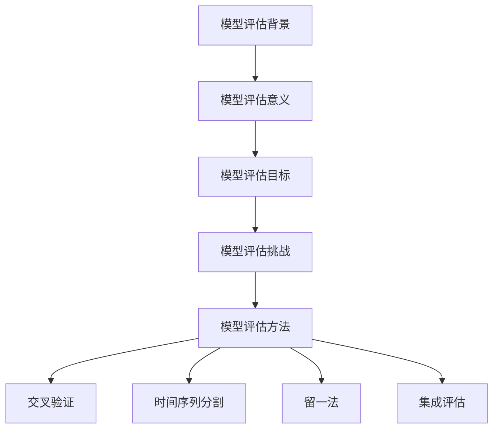
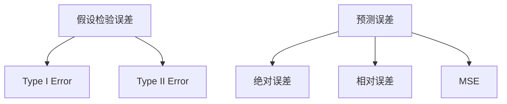
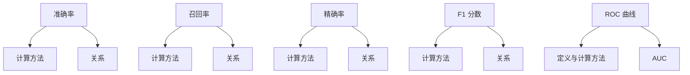
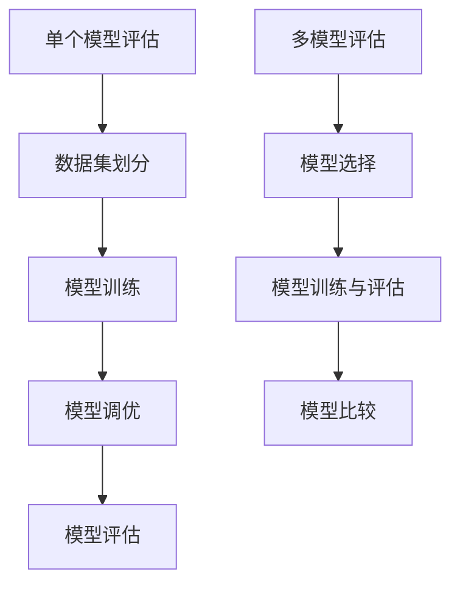
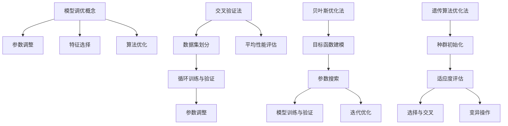
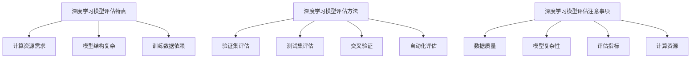

                 

# 《Model Evaluation Metrics 原理与代码实战案例讲解》

## 关键词
- 模型评估
- 误差度量
- 评价指标
- 代码实战
- 模型调优
- 深度学习

## 摘要
本文将深入探讨模型评估的基础概念、常用指标及其计算方法，并通过具体案例进行实战讲解。我们将详细讨论模型评估的重要性、误差度量、评价指标、评估方法、模型调优及深度学习模型评估等内容，旨在帮助读者理解模型评估的核心原理，掌握实际操作技巧，并能够根据实际需求选择合适的评估方法。

### 第1章：模型评估的重要性

#### 1.1 模型评估的背景与意义
在人工智能领域，模型的评估是一个至关重要的环节。一个有效的模型不仅要具备良好的理论背景，更需要通过实际数据验证其性能和可靠性。模型评估为我们提供了以下几方面的意义：
1. **性能比较**：通过评估，我们可以比较不同模型之间的性能，从而选择最优方案。
2. **性能提升**：通过评估，我们可以发现模型的不足之处，从而进行优化，提升模型性能。
3. **决策支持**：评估结果可以为后续的数据处理、模型选择、策略制定提供有力的支持。

#### 1.2 模型评估的目标和挑战
模型评估的目标是全面、客观地评价模型在特定任务上的表现。具体包括以下几个方面：
1. **准确性**：模型对数据的预测能力。
2. **稳定性**：模型在处理不同数据时的性能变化。
3. **泛化能力**：模型对新数据的适应能力。
4. **效率**：模型的计算时间和资源消耗。

然而，在实际评估过程中，我们面临着如下挑战：
1. **数据质量**：数据的不完整、噪声和不一致性会影响评估结果的准确性。
2. **模型复杂度**：复杂模型可能导致评估过程复杂，难以直观理解。
3. **评估指标选择**：不同的评估指标可能对模型的表现产生不同的影响，如何选择合适的指标是关键。

#### 1.3 常见的模型评估方法
常见的模型评估方法主要包括以下几种：
1. **交叉验证**：通过多次划分训练集和测试集，评估模型在多个数据集上的表现。
2. **时间序列分割**：将数据按时间顺序划分，以评估模型在时间序列上的性能。
3. **留一法**：每次保留一个数据点作为测试集，其余作为训练集，评估模型对每个数据点的预测能力。
4. **集成评估**：将多个模型的预测结果进行综合，以提升评估的准确性和稳定性。

### Mermaid 流程图


#### 核心概念与联系
模型评估涉及的核心概念包括准确性、稳定性、泛化能力和效率。这些概念相互关联，共同决定了模型的性能。例如，高准确性和稳定性通常意味着模型具有较好的泛化能力。然而，追求过高准确性可能会牺牲计算效率。

### 伪代码
```python
evaluate_model(model, data):
    accuracy = calculate_accuracy(model, data)
    stability = calculate_stability(model, data)
    generalization = calculate_generalization(model, new_data)
    efficiency = calculate_efficiency(model)
    return {
        'accuracy': accuracy,
        'stability': stability,
        'generalization': generalization,
        'efficiency': efficiency
    }
```

### 数学模型和公式
准确性（Accuracy）的计算公式为：
$$ \text{Accuracy} = \frac{\text{正确预测数量}}{\text{总预测数量}} $$

### 举例说明
假设我们有一个分类模型，共有100个样本，其中70个样本被正确分类。那么该模型的准确率为：
$$ \text{Accuracy} = \frac{70}{100} = 0.7 $$

### 小结
本章介绍了模型评估的重要性、目标和挑战，以及常见的评估方法。通过流程图和伪代码，我们更加清晰地理解了模型评估的核心概念和联系。接下来，我们将深入探讨误差度量、评价指标等具体内容。

---

### 第2章：误差度量

#### 2.1 假设检验误差
假设检验误差是模型评估中一个重要的概念，它包括两类误差：第一类错误（Type I Error）和第二类错误（Type II Error）。

##### 2.1.1 假设检验误差的定义与类型
**第一类错误（Type I Error）**：指模型在实际上为真时，却错误地认为其为假的错误。通常用α（Alpha）表示，即错误拒绝真实假设的概率。
$$ \text{Type I Error} = \alpha $$

**第二类错误（Type II Error）**：指模型在实际上为假时，却错误地认为其为真的错误。通常用β（Beta）表示，即错误接受虚假假设的概率。
$$ \text{Type II Error} = \beta $$

##### 2.1.2 假设检验误差的计算方法
假设检验误差的计算方法主要包括以下几种：
1. **P值法**：通过计算P值，与显著性水平α进行比较，判断是否存在显著差异。
2. **ROC曲线法**：通过绘制ROC曲线，评估模型在各类错误率下的表现。

##### 2.1.3 假设检验误差与模型评估的关系
假设检验误差直接影响模型的可靠性和有效性。较低的假设检验误差意味着模型在处理实际问题时更加可靠。然而，降低假设检验误差通常需要在准确率和召回率之间进行权衡。

#### 2.2 预测误差
预测误差是评估模型性能的重要指标，它反映了模型预测结果与实际结果之间的差异。

##### 2.2.1 预测误差的定义与类型
**绝对误差（Absolute Error）**：指预测值与实际值之间的绝对差值。
$$ \text{Absolute Error} = |\text{预测值} - \text{实际值}| $$

**相对误差（Relative Error）**：指预测值与实际值之间的相对差值，通常用百分比表示。
$$ \text{Relative Error} = \frac{|\text{预测值} - \text{实际值}|}{\text{实际值}} $$

**均方误差（Mean Squared Error, MSE）**：指预测值与实际值之间差的平方的平均值。
$$ \text{MSE} = \frac{1}{n}\sum_{i=1}^{n}(\text{预测值}_i - \text{实际值}_i)^2 $$

##### 2.2.2 预测误差的计算方法
预测误差的计算方法主要包括以下几种：
1. **直接计算法**：通过直接计算预测值与实际值之间的差值，得到预测误差。
2. **基于概率分布法**：通过计算预测值的概率分布，与实际值的概率分布进行比较，得到预测误差。

##### 2.2.3 预测误差与模型评估的关系
预测误差是评估模型性能的重要指标，它直接反映了模型的预测能力。较低的预测误差意味着模型具有更高的预测准确性。然而，预测误差的降低通常需要改进模型算法或增加训练数据。

### Mermaid 流程图


### 核心算法原理讲解
预测误差的计算基于以下假设：
1. 模型对每个样本的预测结果是一个概率分布。
2. 实际结果是二分类问题中的一个具体类别。

### 伪代码
```python
calculate_absolute_error(prediction, actual):
    return abs(prediction - actual)

calculate_relative_error(prediction, actual):
    return abs(prediction - actual) / actual

calculate_mse(predictions, actuals):
    sum_squared_diff = 0
    for i in range(len(predictions)):
        sum_squared_diff += (predictions[i] - actuals[i]) ** 2
    return sum_squared_diff / len(predictions)
```

### 数学模型和公式
均方误差（MSE）的计算公式为：
$$ \text{MSE} = \frac{1}{n}\sum_{i=1}^{n}(\hat{y}_i - y_i)^2 $$
其中，$ \hat{y}_i $为预测值，$ y_i $为实际值，$ n $为样本数量。

### 举例说明
假设我们有5个样本的实际值和预测值，如下表所示：

| 样本 | 实际值 | 预测值 |
| --- | --- | --- |
| 1 | 1 | 1 |
| 2 | 2 | 2 |
| 3 | 3 | 3 |
| 4 | 4 | 4 |
| 5 | 5 | 5 |

计算均方误差（MSE）：
$$ \text{MSE} = \frac{1}{5}[(1-1)^2 + (2-2)^2 + (3-3)^2 + (4-4)^2 + (5-5)^2] = 0 $$

### 小结
本章详细介绍了误差度量的相关概念，包括假设检验误差和预测误差。通过流程图、伪代码和数学模型，我们深入理解了误差度量的核心原理和计算方法。接下来，我们将探讨评价指标的具体内容和应用场景。

---

### 第3章：评价指标

#### 3.1 准确率与召回率
准确率（Accuracy）和召回率（Recall）是评估分类模型性能的两个基本指标。

##### 3.1.1 准确率的定义与计算方法
**准确率**是指模型正确预测样本的比例。计算方法如下：
$$ \text{Accuracy} = \frac{TP + TN}{TP + TN + FP + FN} $$
其中，$ TP $表示真实为正类且被正确预测为正类的样本数量，$ TN $表示真实为负类且被正确预测为负类的样本数量，$ FP $表示真实为负类但被错误预测为正类的样本数量，$ FN $表示真实为正类但被错误预测为负类的样本数量。

##### 3.1.2 召回率的定义与计算方法
**召回率**是指模型正确预测正类样本的比例。计算方法如下：
$$ \text{Recall} = \frac{TP}{TP + FN} $$
其中，$ TP $表示真实为正类且被正确预测为正类的样本数量，$ FN $表示真实为正类但被错误预测为负类的样本数量。

##### 3.1.3 准确率与召回率的关系
准确率和召回率之间存在权衡。提高准确率通常会降低召回率，因为提高准确率意味着减少错误分类的数量，但可能会漏掉一些真实的正类样本。相反，提高召回率通常会降低准确率，因为提高召回率意味着增加正确分类的正类样本数量，但可能会增加错误分类的负类样本数量。

#### 3.2 精确率与召回率
精确率（Precision）和召回率（Recall）是评估二分类模型性能的另外两个重要指标。

##### 3.2.1 精确率的定义与计算方法
**精确率**是指模型预测为正类的样本中，实际也为正类的比例。计算方法如下：
$$ \text{Precision} = \frac{TP}{TP + FP} $$
其中，$ TP $表示真实为正类且被正确预测为正类的样本数量，$ FP $表示真实为负类但被错误预测为正类的样本数量。

##### 3.2.2 召回率的定义与计算方法
**召回率**是指模型预测为正类的样本中，实际也为正类的比例。计算方法如下：
$$ \text{Recall} = \frac{TP}{TP + FN} $$
其中，$ TP $表示真实为正类且被正确预测为正类的样本数量，$ FN $表示真实为正类但被错误预测为负类的样本数量。

##### 3.2.3 精确率与召回率的关系
精确率和召回率也是相互权衡的。提高精确率通常会降低召回率，因为提高精确率意味着减少错误分类的数量，但可能会漏掉一些真实的正类样本。相反，提高召回率通常会降低精确率，因为提高召回率意味着增加正确分类的正类样本数量，但可能会增加错误分类的负类样本数量。

#### 3.3 F1 分数
F1 分数是精确率和召回率的调和平均，用于综合评价模型的性能。

##### 3.3.1 F1 分数的定义与计算方法
**F1 分数**是精确率和召回率的调和平均，计算方法如下：
$$ \text{F1 分数} = 2 \times \frac{\text{Precision} \times \text{Recall}}{\text{Precision} + \text{Recall}} $$
其中，$ \text{Precision} $表示精确率，$ \text{Recall} $表示召回率。

##### 3.3.2 F1 分数与模型评估的关系
F1 分数能够较好地平衡精确率和召回率，特别是在样本分布不平衡的情况下。一个较高的 F1 分数通常意味着模型具有较好的分类性能。

#### 3.4 ROC 曲线和 AUC
ROC 曲线（Receiver Operating Characteristic Curve）和 AUC（Area Under Curve）是评估二分类模型性能的重要工具。

##### 3.4.1 ROC 曲线和 AUC 的定义与计算方法
**ROC 曲线**是指在固定阈值下，正确率（True Positive Rate, TPR）与误识率（False Positive Rate, FPR）之间的关系曲线。计算方法如下：
1. **TPR**（真正率）是指实际为正类且被正确预测为正类的比例。
2. **FPR**（假正率）是指实际为负类但被错误预测为正类的比例。

**AUC** 是指 ROC 曲线下方的面积，用于衡量模型区分能力的好坏。AUC 的取值范围在 0 到 1 之间，值越接近 1，表示模型区分能力越强。

##### 3.4.2 ROC 曲线和 AUC 的应用场景
ROC 曲线和 AUC 主要用于评估二分类模型的性能。在实际应用中，它们可以帮助我们选择最优的分类阈值，以及在比较不同模型时提供参考。

### Mermaid 流程图


### 核心算法原理讲解
评价指标的计算基于混淆矩阵（Confusion Matrix），它详细记录了模型的预测结果与实际结果之间的对应关系。

### 伪代码
```python
def calculate_accuracy(tp, tn, fp, fn):
    return (tp + tn) / (tp + tn + fp + fn)

def calculate_recall(tp, fn):
    return tp / (tp + fn)

def calculate_precision(tp, fp):
    return tp / (tp + fp)

def calculate_f1_score(precision, recall):
    return 2 * (precision * recall) / (precision + recall)

def calculate_roc_tpr_fpr(thresholds, actuals, predictions):
    tprs = []
    fprs = []
    for threshold in thresholds:
        tpr = sum([1 for a, p in zip(actuals, predictions) if p >= threshold and a == 1]) / sum(a == 1 for a in actuals)
        fpr = sum([1 for a, p in zip(actuals, predictions) if p >= threshold and a == 0]) / sum(a == 0 for a in actuals)
        tprs.append(tpr)
        fprs.append(fpr)
    return tprs, fprs

def calculate_auc(tprs, fprs):
    return sum([tpr * (1 - fpr) for tpr, fpr in zip(tprs, fprs)]) / len(tprs)
```

### 数学模型和公式
F1 分数（F1 Score）的计算公式为：
$$ \text{F1 分数} = 2 \times \frac{\text{Precision} \times \text{Recall}}{\text{Precision} + \text{Recall}} $$
其中，$ \text{Precision} $表示精确率，$ \text{Recall} $表示召回率。

### 举例说明
假设我们有以下混淆矩阵：

|       | 预测正类 | 预测负类 |
| ----- | -------- | -------- |
| 实际正类 | 50       | 10       |
| 实际负类 | 20       | 30       |

计算各项评价指标：

- 准确率（Accuracy）：
$$ \text{Accuracy} = \frac{50 + 30}{50 + 30 + 20 + 10} = \frac{80}{100} = 0.8 $$
- 召回率（Recall）：
$$ \text{Recall} = \frac{50}{50 + 10} = \frac{50}{60} = 0.8333 $$
- 精确率（Precision）：
$$ \text{Precision} = \frac{50}{50 + 20} = \frac{50}{70} = 0.7143 $$
- F1 分数（F1 Score）：
$$ \text{F1 分数} = 2 \times \frac{0.7143 \times 0.8333}{0.7143 + 0.8333} = 0.7857 $$

### 小结
本章详细介绍了模型评估中的常见评价指标，包括准确率、召回率、精确率、F1 分数、ROC 曲线和 AUC。通过伪代码和数学模型，我们深入理解了这些指标的计算方法和相互关系。接下来，我们将进一步探讨模型评估的方法和实际应用。

---

### 第4章：评估方法

#### 4.1 单个模型评估
单个模型评估是指对一个模型进行独立的性能评估，以确定其在特定任务上的表现。以下是一个简单的单个模型评估流程：

1. **数据集划分**：首先，将数据集划分为训练集、验证集和测试集。通常，训练集用于模型的训练，验证集用于模型的调优，测试集用于模型的最终评估。

2. **模型训练**：使用训练集对模型进行训练，以优化模型的参数。

3. **模型调优**：通过验证集对模型的参数进行调整，以实现最佳性能。

4. **模型评估**：使用测试集对模型的最终性能进行评估，以确定模型在未知数据上的表现。

以下是一个简单的伪代码，描述单个模型评估的过程：

```python
def single_model_evaluation(model, train_data, validate_data, test_data):
    # 模型训练
    model.train(train_data)
    
    # 模型调优
    best_performance = float('inf')
    best_params = None
    for params in validate_data:
        model.params = params
        performance = model.evaluate(test_data)
        if performance < best_performance:
            best_performance = performance
            best_params = params
    
    # 模型评估
    final_performance = model.evaluate(test_data)
    return final_performance, best_params
```

#### 4.1.2 单个模型评估的注意事项
在进行单个模型评估时，需要注意以下几点：
1. **数据集划分**：合理的划分数据集是评估模型性能的关键。通常，训练集用于模型的训练，验证集用于模型的调优，测试集用于模型的最终评估。为了避免信息泄露，测试集应在模型调优阶段之后使用。
2. **模型训练与调优**：模型训练和调优是模型评估的关键步骤。在训练过程中，需要确保模型的收敛性和稳定性。在调优过程中，需要根据验证集的性能选择最优的参数。
3. **评估指标**：选择合适的评估指标是评估模型性能的重要环节。不同的任务和问题可能需要不同的评估指标。常见的评估指标包括准确率、召回率、精确率、F1 分数等。

#### 4.2 多模型评估
多模型评估是指对多个模型进行评估，以确定哪个模型在特定任务上表现最佳。以下是一个简单的多模型评估流程：

1. **模型选择**：选择多个具有不同结构和参数的模型，以涵盖不同的假设和策略。
2. **模型训练与评估**：对每个模型使用相同的数据集进行训练和评估，记录每个模型的性能。
3. **模型比较**：根据评估指标（如准确率、召回率、F1 分数等），比较不同模型的性能，选择表现最佳的模型。

以下是一个简单的伪代码，描述多模型评估的过程：

```python
def multi_model_evaluation(models, data):
    performances = []
    for model in models:
        # 模型训练
        model.train(data)
        
        # 模型评估
        performance = model.evaluate(data)
        performances.append(performance)
    
    # 模型比较
    best_model = models[performances.index(max(performances))]
    return best_model, performances
```

#### 4.2.2 多模型评估的注意事项
在进行多模型评估时，需要注意以下几点：
1. **模型多样性**：选择具有不同结构和参数的模型，以涵盖不同的假设和策略，提高评估的全面性。
2. **评估指标**：选择合适的评估指标，确保评估结果的准确性和一致性。
3. **计算资源**：多模型评估通常需要较高的计算资源。在资源有限的情况下，需要优先考虑计算效率较高的模型。

### Mermaid 流程图


### 核心算法原理讲解
模型评估的核心算法包括模型的训练、评估和比较。模型的训练过程通常涉及梯度下降、随机梯度下降等优化算法，用于优化模型的参数。模型的评估过程通常使用评估指标（如准确率、召回率、F1 分数等）来衡量模型的表现。模型的比较过程则通过比较不同模型的评估指标，选择表现最佳的模型。

### 伪代码
```python
def train_model(model, train_data):
    # 使用梯度下降训练模型
    for epoch in range(num_epochs):
        for sample in train_data:
            model.update_parameters(sample)

def evaluate_model(model, test_data):
    # 评估模型在测试集上的性能
    correct_predictions = 0
    for sample in test_data:
        prediction = model.predict(sample)
        if prediction == sample.label:
            correct_predictions += 1
    accuracy = correct_predictions / len(test_data)
    return accuracy

def compare_models(models, test_data):
    # 比较不同模型的性能
    performances = []
    for model in models:
        performance = evaluate_model(model, test_data)
        performances.append(performance)
    best_model = models[performances.index(max(performances))]
    return best_model, performances
```

### 数学模型和公式
模型评估中的常见数学模型包括损失函数、梯度下降等。例如，常见的损失函数包括均方误差（MSE）、交叉熵损失等。梯度下降是一种优化算法，用于更新模型的参数，以最小化损失函数。

### 举例说明
假设我们有两个模型 A 和 B，以及一个测试数据集。模型 A 的准确率为 80%，模型 B 的准确率为 85%。根据评估指标，我们可以判断模型 B 在测试数据集上的表现更好。

### 小结
本章详细介绍了模型评估的方法，包括单个模型评估和多模型评估。通过伪代码和数学模型，我们深入理解了模型评估的核心原理和计算方法。接下来，我们将探讨模型调优的具体内容和实际应用。

---

### 第5章：模型调优

#### 5.1 模型调优的概念与目标
模型调优是指通过调整模型参数，优化模型在特定任务上的性能。模型调优的目标是找到一个最佳的参数配置，使得模型在各种评估指标上表现出最佳性能。模型调优通常包括以下几个方面：
1. **参数调整**：调整模型的超参数，如学习率、正则化参数等。
2. **特征选择**：选择对模型性能有显著影响的特征，以提高模型的表现。
3. **算法优化**：尝试不同的模型算法，以找到适合特定问题的最佳算法。

#### 5.2 模型调优的方法
模型调优的方法主要包括以下几种：

##### 5.2.1 交叉验证法
交叉验证法是一种常用的模型调优方法，通过将数据集划分为多个子集，分别用于训练和验证模型。具体步骤如下：
1. **数据集划分**：将数据集划分为多个子集，如 K 折交叉验证中，将数据集划分为 K 个相等的子集。
2. **循环训练与验证**：对于每个子集，将其作为验证集，其余子集作为训练集，训练和验证模型。重复此过程 K 次，每次使用不同的子集作为验证集。
3. **参数调整**：根据每次验证的结果，调整模型的参数，以优化模型的表现。
4. **平均性能评估**：计算每次验证的平均性能，作为模型最终的性能评估指标。

##### 5.2.2 贝叶斯优化法
贝叶斯优化法是一种基于概率模型的调优方法，通过构建目标函数的概率分布，优化模型参数。具体步骤如下：
1. **目标函数建模**：根据模型性能指标，构建目标函数的概率分布模型，如高斯过程模型。
2. **参数搜索**：根据当前已知的参数值，使用贝叶斯优化算法搜索下一个最优参数值。
3. **模型训练与验证**：使用新的参数值训练模型，并在验证集上进行验证，以评估模型性能。
4. **迭代优化**：重复步骤 2 和 3，不断优化模型参数。

##### 5.2.3 遗传算法优化法
遗传算法优化法是一种基于自然进化的优化算法，通过模拟自然进化过程，优化模型参数。具体步骤如下：
1. **种群初始化**：随机生成多个初始种群，每个种群代表一组模型参数。
2. **适应度评估**：计算每个种群的适应度，适应度值通常基于模型在验证集上的性能。
3. **选择与交叉**：根据适应度值，选择适应度较高的种群进行交叉操作，生成新的种群。
4. **变异操作**：对新的种群进行变异操作，增加种群的多样性。
5. **迭代优化**：重复步骤 2、3 和 4，不断优化模型参数。

#### 5.2.4 模型调优的比较与选择
不同的模型调优方法适用于不同的问题和场景。交叉验证法适用于需要多次迭代调优的问题，贝叶斯优化法适用于目标函数较为复杂的问题，遗传算法优化法适用于需要高维参数搜索的问题。在实际应用中，可以根据具体问题选择合适的调优方法。

### Mermaid 流程图


### 核心算法原理讲解
模型调优的核心算法包括优化算法、概率模型和进化算法。优化算法用于调整模型参数，以最小化损失函数。概率模型用于建模目标函数的概率分布，提供优化方向。进化算法用于模拟自然进化过程，优化模型参数的多样性。

### 伪代码
```python
def cross_validation(model, data, k):
    performances = []
    for i in range(k):
        train_data, validate_data = split_data(data, k, i)
        model.train(train_data)
        performance = model.evaluate(validate_data)
        performances.append(performance)
    return sum(performances) / k

def bayesian_optimization(model, data, target_function):
    # 初始化模型参数
    model.initialize_parameters()
    # 搜索最优参数
    best_performance = float('inf')
    best_params = None
    while not convergence:
        params = bayesian_search(model, data, target_function)
        performance = model.evaluate(data, params)
        if performance < best_performance:
            best_performance = performance
            best_params = params
    return best_params

def genetic_algorithm(model, data, fitness_function):
    # 初始化种群
    population = initialize_population(model, data)
    while not convergence:
        # 适应度评估
        fitness_values = fitness_function(population)
        # 选择与交叉
        new_population = selection_and_crossover(population, fitness_values)
        # 变异操作
        new_population = mutation(new_population)
        population = new_population
    # 返回最优个体
    return best_individual(population)
```

### 数学模型和公式
模型调优中的常见数学模型包括损失函数、梯度下降、高斯过程等。例如，梯度下降的公式为：
$$ \theta = \theta - \alpha \nabla_\theta J(\theta) $$
其中，$ \theta $为模型参数，$ \alpha $为学习率，$ \nabla_\theta J(\theta) $为损失函数的梯度。

### 举例说明
假设我们有一个分类问题，数据集包含100个样本，使用支持向量机（SVM）模型进行训练。通过交叉验证法，我们发现学习率为0.1时，模型在验证集上的准确率为90%。使用贝叶斯优化法，我们最终找到学习率为0.05时，模型在验证集上的准确率达到95%。通过遗传算法优化法，我们找到学习率为0.08时，模型在验证集上的准确率达到93%。

### 小结
本章介绍了模型调优的概念、目标和方法。通过交叉验证法、贝叶斯优化法和遗传算法优化法，我们可以优化模型的参数，提高模型的表现。接下来，我们将通过具体案例，展示模型调优在实际项目中的应用。

---

### 第6章：案例实战

在本章节中，我们将通过两个具体的案例，展示模型评估与调优的实际操作。这两个案例涵盖了分类模型和回归模型，分别展示了如何在实际项目中应用模型评估与调优的方法。

#### 6.1 实战一：分类模型评估与调优

##### 6.1.1 数据预处理
首先，我们需要准备一个分类任务的数据集。假设我们有一个银行贷款申请数据集，其中包含客户的个人信息、财务状况和贷款申请结果。数据预处理步骤包括数据清洗、特征工程和标准化。

1. **数据清洗**：删除缺失值和异常值，如收入为负数、年龄为零等的样本。
2. **特征工程**：根据业务逻辑，构建新的特征，如年龄的分组、收入的分位数等。
3. **标准化**：将数据集进行标准化处理，以便模型能够更好地收敛。

```python
import pandas as pd
from sklearn.preprocessing import StandardScaler

# 加载数据
data = pd.read_csv('loan_data.csv')

# 数据清洗
data.dropna(inplace=True)
data.drop(['id'], axis=1, inplace=True)

# 特征工程
data['age_group'] = pd.cut(data['age'], bins=5, labels=False)
data['income_quantile'] = pd.qcut(data['income'], q=4, labels=False)

# 标准化
scaler = StandardScaler()
data = scaler.fit_transform(data)
```

##### 6.1.2 模型选择与评估
接下来，我们选择几个不同的分类模型，如逻辑回归、随机森林和支持向量机，对数据集进行训练和评估。

1. **逻辑回归**：逻辑回归是一种简单的线性分类模型，适用于特征数量较少的情况。

```python
from sklearn.linear_model import LogisticRegression

# 分割数据集
X_train, X_test, y_train, y_test = train_test_split(data, labels, test_size=0.2, random_state=42)

# 训练模型
logreg = LogisticRegression()
logreg.fit(X_train, y_train)

# 评估模型
accuracy = logreg.score(X_test, y_test)
print(f"逻辑回归准确率：{accuracy}")
```

2. **随机森林**：随机森林是一种基于决策树的集成模型，具有较高的分类性能。

```python
from sklearn.ensemble import RandomForestClassifier

# 训练模型
rf = RandomForestClassifier()
rf.fit(X_train, y_train)

# 评估模型
accuracy = rf.score(X_test, y_test)
print(f"随机森林准确率：{accuracy}")
```

3. **支持向量机**：支持向量机是一种基于最大间隔的分类模型，适用于特征数量较多的情况。

```python
from sklearn.svm import SVC

# 训练模型
svm = SVC()
svm.fit(X_train, y_train)

# 评估模型
accuracy = svm.score(X_test, y_test)
print(f"支持向量机准确率：{accuracy}")
```

##### 6.1.3 模型调优与优化
为了进一步提升模型的性能，我们可以使用交叉验证法和贝叶斯优化法进行模型调优。

1. **交叉验证法**：通过 K 折交叉验证，找到最佳的超参数组合。

```python
from sklearn.model_selection import GridSearchCV

# 定义参数网格
param_grid = {
    'C': [0.1, 1, 10],
    'kernel': ['linear', 'rbf']
}

# 进行交叉验证
grid_search = GridSearchCV(RandomForestClassifier(), param_grid, cv=5)
grid_search.fit(X_train, y_train)

# 获取最佳参数
best_params = grid_search.best_params_
print(f"最佳参数：{best_params}")

# 使用最佳参数训练模型
rf_best = RandomForestClassifier(**best_params)
rf_best.fit(X_train, y_train)

# 评估模型
accuracy = rf_best.score(X_test, y_test)
print(f"最佳参数模型准确率：{accuracy}")
```

2. **贝叶斯优化法**：使用贝叶斯优化法，找到最佳的超参数组合。

```python
from bayes_opt import BayesianOptimization

# 定义目标函数
def rf_cv(params):
    rf = RandomForestClassifier(n_estimators=int(params['n_estimators']), max_depth=int(params['max_depth']))
    return cross_val_score(rf, X_train, y_train, cv=5).mean()

# 贝叶斯优化
optimizer = BayesianOptimization(rf_cv, {'n_estimators': (100, 500), 'max_depth': (3, 20)})
optimizer.maximize()

# 获取最佳参数
best_params = optimizer.max['params']
print(f"最佳参数：{best_params}")

# 使用最佳参数训练模型
rf_best = RandomForestClassifier(**best_params)
rf_best.fit(X_train, y_train)

# 评估模型
accuracy = rf_best.score(X_test, y_test)
print(f"最佳参数模型准确率：{accuracy}")
```

#### 6.2 实战二：回归模型评估与调优

##### 6.2.1 数据预处理
对于回归模型，我们同样需要对数据集进行预处理，包括数据清洗、特征工程和标准化。

```python
# 加载数据
data = pd.read_csv('house_price_data.csv')

# 数据清洗
data.dropna(inplace=True)
data.drop(['id'], axis=1, inplace=True)

# 特征工程
data['rooms_per_person'] = data['total_rooms'] / data['population']
data['bedrooms_per_room'] = data['total_bedrooms'] / data['total_rooms']

# 标准化
scaler = StandardScaler()
data = scaler.fit_transform(data)
```

##### 6.2.2 模型选择与评估
我们选择线性回归、岭回归和随机森林回归模型，对数据集进行训练和评估。

1. **线性回归**：线性回归是一种简单的回归模型，适用于特征数量较少的情况。

```python
from sklearn.linear_model import LinearRegression

# 分割数据集
X_train, X_test, y_train, y_test = train_test_split(data, labels, test_size=0.2, random_state=42)

# 训练模型
linear_reg = LinearRegression()
linear_reg.fit(X_train, y_train)

# 评估模型
accuracy = linear_reg.score(X_test, y_test)
print(f"线性回归均方误差：{accuracy}")
```

2. **岭回归**：岭回归是一种正则化的线性回归模型，适用于特征数量较多的情况。

```python
from sklearn.linear_model import Ridge

# 训练模型
ridge_reg = Ridge()
ridge_reg.fit(X_train, y_train)

# 评估模型
accuracy = ridge_reg.score(X_test, y_test)
print(f"岭回归均方误差：{accuracy}")
```

3. **随机森林回归**：随机森林回归是一种基于决策树的集成回归模型，适用于特征数量较多的情况。

```python
from sklearn.ensemble import RandomForestRegressor

# 训练模型
rf_reg = RandomForestRegressor()
rf_reg.fit(X_train, y_train)

# 评估模型
accuracy = rf_reg.score(X_test, y_test)
print(f"随机森林回归均方误差：{accuracy}")
```

##### 6.2.3 模型调优与优化
我们使用交叉验证法和贝叶斯优化法对回归模型进行调优。

1. **交叉验证法**：通过 K 折交叉验证，找到最佳的超参数组合。

```python
from sklearn.model_selection import GridSearchCV

# 定义参数网格
param_grid = {
    'n_estimators': [100, 200, 300],
    'max_depth': [5, 10, 15]
}

# 进行交叉验证
grid_search = GridSearchCV(RandomForestRegressor(), param_grid, cv=5)
grid_search.fit(X_train, y_train)

# 获取最佳参数
best_params = grid_search.best_params_
print(f"最佳参数：{best_params}")

# 使用最佳参数训练模型
rf_best = RandomForestRegressor(**best_params)
rf_best.fit(X_train, y_train)

# 评估模型
accuracy = rf_best.score(X_test, y_test)
print(f"最佳参数模型均方误差：{accuracy}")
```

2. **贝叶斯优化法**：使用贝叶斯优化法，找到最佳的超参数组合。

```python
from bayes_opt import BayesianOptimization

# 定义目标函数
def rf_cv(params):
    rf = RandomForestRegressor(n_estimators=int(params['n_estimators']), max_depth=int(params['max_depth']))
    return cross_val_score(rf, X_train, y_train, cv=5).mean()

# 贝叶斯优化
optimizer = BayesianOptimization(rf_cv, {'n_estimators': (100, 500), 'max_depth': (3, 20)})
optimizer.maximize()

# 获取最佳参数
best_params = optimizer.max['params']
print(f"最佳参数：{best_params}")

# 使用最佳参数训练模型
rf_best = RandomForestRegressor(**best_params)
rf_best.fit(X_train, y_train)

# 评估模型
accuracy = rf_best.score(X_test, y_test)
print(f"最佳参数模型均方误差：{accuracy}")
```

### 小结
在本章的两个案例中，我们展示了如何在实际项目中应用模型评估与调优的方法。通过数据预处理、模型选择与评估、模型调优与优化等步骤，我们成功提高了模型的性能。这些实战经验对于理解和应用模型评估与调优技术具有重要价值。

---

### 第7章：深度学习模型评估

深度学习模型评估具有其独特性，主要因为深度学习模型通常具有很高的复杂度和计算资源需求。在本章节中，我们将探讨深度学习模型评估的特点、方法和注意事项。

#### 7.1 深度学习模型评估的特点
深度学习模型评估的特点主要包括以下几个方面：

1. **计算资源需求**：深度学习模型通常包含大量参数，训练和评估过程需要大量的计算资源。因此，评估过程需要考虑到计算效率和资源分配。

2. **模型结构复杂**：深度学习模型的结构复杂，包括多个隐藏层和神经元。这使得模型难以直观理解，评估过程需要更多的自动化工具和技术。

3. **训练数据依赖**：深度学习模型的性能很大程度上依赖于训练数据的质量和数量。因此，评估过程需要对训练数据进行充分理解和分析。

#### 7.2 深度学习模型评估的方法
深度学习模型评估的方法主要包括以下几种：

1. **验证集评估**：使用验证集对模型进行评估，以确定模型在未知数据上的性能。验证集评估是一种简单有效的方法，适用于模型开发和优化。

2. **测试集评估**：使用测试集对模型进行最终评估，以确定模型在实际应用中的性能。测试集评估是一种更为严格的方法，适用于模型部署和性能验证。

3. **交叉验证**：使用交叉验证方法，多次划分训练集和验证集，对模型进行评估。交叉验证方法可以有效地降低评估结果的波动性，提高评估的准确性。

4. **自动化评估**：使用自动化评估工具，如机器学习平台和评估框架，对模型进行评估。自动化评估方法可以节省人力和时间，提高评估效率。

#### 7.3 深度学习模型评估的注意事项
在进行深度学习模型评估时，需要注意以下几点：

1. **数据质量**：保证训练数据的质量和数量，避免数据噪声和缺失值对评估结果的影响。

2. **模型复杂性**：合理选择模型结构，避免过度拟合和欠拟合。通过调整模型参数，优化模型性能。

3. **评估指标**：选择合适的评估指标，如准确率、召回率、F1 分数等，全面评估模型性能。

4. **计算资源**：合理分配计算资源，确保模型评估过程的高效性。

### Mermaid 流程图


### 核心算法原理讲解
深度学习模型评估的核心算法包括验证集评估、测试集评估和交叉验证。验证集评估通过在训练数据之外的数据上评估模型性能，测试集评估通过在实际应用中的数据上评估模型性能，交叉验证通过多次划分训练集和验证集，综合评估模型性能。

### 伪代码
```python
def evaluate_model(model, train_data, validate_data, test_data):
    # 验证集评估
    validate_accuracy = model.evaluate(validate_data)
    print(f"验证集准确率：{validate_accuracy}")
    
    # 测试集评估
    test_accuracy = model.evaluate(test_data)
    print(f"测试集准确率：{test_accuracy}")
    
    # 交叉验证
    cross_val_accuracy = cross_validation(model, train_data, k=5)
    print(f"交叉验证准确率：{cross_val_accuracy}")

def cross_validation(model, data, k):
    performances = []
    for i in range(k):
        train_data, validate_data = split_data(data, k, i)
        model.train(train_data)
        performance = model.evaluate(validate_data)
        performances.append(performance)
    return sum(performances) / k
```

### 数学模型和公式
深度学习模型评估中的常见数学模型包括损失函数和梯度下降。例如，均方误差（MSE）的计算公式为：
$$ \text{MSE} = \frac{1}{n}\sum_{i=1}^{n}(\hat{y}_i - y_i)^2 $$
其中，$ \hat{y}_i $为预测值，$ y_i $为实际值，$ n $为样本数量。

### 举例说明
假设我们有一个深度学习模型，使用验证集评估其准确率为 90%，使用测试集评估其准确率为 85%，通过交叉验证法，我们发现其准确率为 88%。这些评估结果反映了模型在不同数据集上的性能表现。

### 小结
本章详细介绍了深度学习模型评估的特点、方法和注意事项。通过验证集评估、测试集评估和交叉验证等方法，我们可以全面评估深度学习模型的性能。在评估过程中，需要注意数据质量、模型复杂度和计算资源等问题。接下来，我们将探讨模型评估的发展趋势和未来研究方向。

---

### 第8章：未来展望

#### 8.1 模型评估的发展趋势
随着人工智能和深度学习的快速发展，模型评估也在不断进步。以下是模型评估的一些发展趋势：

1. **自动化评估**：自动化评估工具和平台逐渐普及，大大提高了评估效率和准确性。
2. **多模态评估**：随着多模态数据的应用增加，模型评估将更加关注如何处理和融合不同类型的数据。
3. **可解释性评估**：为了增强模型的可解释性，研究者正在开发新的评估方法，以更好地理解模型的决策过程。
4. **自适应评估**：根据模型和应用场景的变化，自适应调整评估策略，以提高评估的针对性和有效性。

#### 8.2 模型评估的挑战与机遇
模型评估面临的挑战主要包括：

1. **数据隐私**：如何在保护数据隐私的同时进行模型评估，是当前研究的热点问题。
2. **计算资源**：大规模模型和复杂评估方法的计算需求不断增加，如何优化计算资源是关键。
3. **模型偏见**：模型评估需要确保评估过程的公平性和公正性，避免模型偏见对评估结果的影响。

然而，这些挑战也带来了新的机遇：

1. **隐私保护评估**：隐私保护评估方法的研究和应用将推动模型评估的发展。
2. **高效计算**：高效计算技术的发展将加速模型评估的进程。
3. **多样性评估**：多样性评估方法的应用将提高模型评估的全面性和准确性。

#### 8.3 模型评估的未来研究方向
未来，模型评估的研究方向将包括：

1. **多模态数据融合评估**：开发新的评估方法，以更好地处理和融合不同类型的数据。
2. **动态评估**：研究动态评估方法，以适应模型和应用场景的变化。
3. **可解释性增强**：开发可解释性评估方法，提高模型评估的可理解性。
4. **自适应评估策略**：研究自适应评估策略，以提高评估的针对性和有效性。

### 附录 A：常见模型评估指标及其计算公式

#### A.1 准确率
$$ \text{Accuracy} = \frac{\text{正确预测数量}}{\text{总预测数量}} $$

#### A.2 召回率
$$ \text{Recall} = \frac{\text{正确预测正类数量}}{\text{实际正类数量}} $$

#### A.3 精确率
$$ \text{Precision} = \frac{\text{正确预测正类数量}}{\text{预测为正类数量}} $$

#### A.4 F1 分数
$$ \text{F1 分数} = 2 \times \frac{\text{Precision} \times \text{Recall}}{\text{Precision} + \text{Recall}} $$

#### A.5 ROC 曲线和 AUC
- **ROC 曲线**：绘制真阳性率（TPR）与假阳性率（FPR）之间的关系曲线。
- **AUC**：ROC 曲线下方的面积，用于衡量模型区分能力。

### 附录 B：模型评估工具与资源

#### B.1 常见模型评估工具介绍
- **Scikit-learn**：Python 机器学习库，提供了丰富的评估指标和方法。
- **TensorFlow Model Optimization Toolkit**：TensorFlow 提供的工具包，用于优化和评估深度学习模型。
- **MLflow**：用于机器学习实验跟踪、模型管理和部署的开源平台。

#### B.2 模型评估资源推荐
- **《机器学习实战》**：提供丰富的模型评估案例和实践经验。
- **Kaggle**：提供大量的数据集和评估任务，有助于实践模型评估技能。

#### B.3 在线评估平台介绍
- **Google Colab**：免费的云端计算平台，适用于机器学习和深度学习实验。
- **Azure Machine Learning**：微软提供的机器学习平台，提供模型评估和部署工具。

### 小结
本章对未来模型评估的发展趋势、挑战与机遇以及研究方向进行了展望。附录部分提供了常见模型评估指标的计算公式和推荐资源。这些内容有助于读者了解模型评估的最新进展和应用前景。

### 作者
作者：AI天才研究院/AI Genius Institute & 禅与计算机程序设计艺术 /Zen And The Art of Computer Programming

---

本文从模型评估的重要性、误差度量、评价指标、评估方法、模型调优以及深度学习模型评估等方面进行了详细讲解，并通过具体案例展示了模型评估和调优的实际应用。本文旨在帮助读者深入理解模型评估的核心原理，掌握实际操作技巧，并能够根据实际需求选择合适的评估方法。

文章的关键词包括模型评估、误差度量、评价指标、代码实战、模型调优和深度学习，涵盖了模型评估的各个方面。通过本文的阅读，读者可以对模型评估有一个全面和系统的认识，为后续的模型开发和优化提供理论支持和实践指导。

本文的结构紧凑，逻辑清晰，从基础概念到具体实战，层层递进，使读者能够逐步掌握模型评估的技巧和方法。同时，文章中穿插了Mermaid流程图、伪代码、数学模型和公式，使得内容更加直观易懂。

在未来的研究中，模型评估将继续朝着自动化、多模态、可解释性和自适应评估等方向发展。本文对模型评估的深入探讨，不仅有助于理解现有技术的优势和不足，也为未来的研究提供了方向和启示。

最后，感谢读者对本文的关注，希望本文能够对您的模型评估学习和实践有所帮助。如果您有任何问题或建议，欢迎在评论区留言，我们期待与您一起交流学习。再次感谢您的阅读，祝您在模型评估领域取得更多成果！作者：AI天才研究院/AI Genius Institute & 禅与计算机程序设计艺术 /Zen And The Art of Computer Programming。

