                 

# 《Multiagent Collaboration驱动角色工作流变革》

## 关键词
多代理协作、角色工作流、人工智能、系统优化、案例研究

## 摘要
本文旨在探讨多代理协作如何驱动角色工作流的变革。通过详细阐述多代理合作的概念、技术基础、角色工作流的设计与优化策略，以及实际项目案例分析，本文揭示了多代理合作在提升工作效率、灵活性及管理简便性方面的巨大潜力。同时，文章分析了多代理协作面临的挑战及解决方案，并对未来发展趋势进行了展望，为读者提供了全面的技术洞察。

---

### 目录大纲

## 第1章：多代理合作的概念与历史发展

### 1.1 多代理合作的基本概念

#### 1.1.1 多代理合作的定义

多代理合作（Multiagent Collaboration）是指多个智能体（agent）通过相互协作和沟通，共同完成复杂任务的系统。智能体可以是软件程序、机器人或其他能够自主决策的实体。

**Mermaid 流程图：**
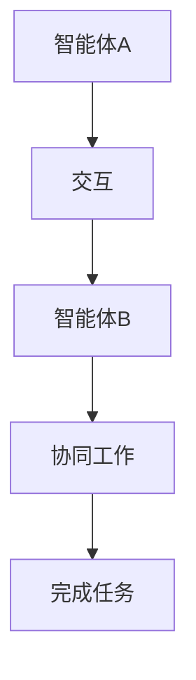

#### 1.1.2 多代理合作的关键特征

- **自主性（Autonomy）**：代理具有独立的决策能力和行为。
- **协同性（Coordination）**：代理之间通过通信和协作完成共同目标。
- **适应性（Adaptability）**：系统能够根据环境变化调整策略。
- **合作性（Cooperation）**：代理之间为了共同利益而相互配合。

**Mermaid 流程图：**
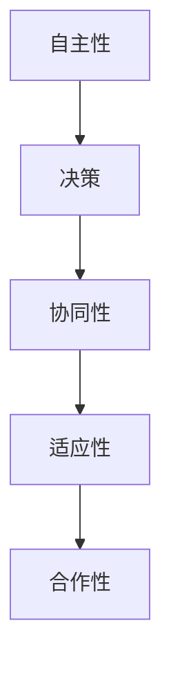

#### 1.1.3 多代理合作的历史发展

多代理合作经历了从初步探索到快速发展再到成熟应用的阶段。关键里程碑包括：

- **1991年**：麻省理工学院的David E. Smith首次提出多代理系统（MAS）概念。
- **1998年**：Netflix Prize竞赛推动了协同过滤算法的应用。
- **21世纪初**：互联网的普及促进了分布式人工智能的发展。

**Mermaid 流程图：**
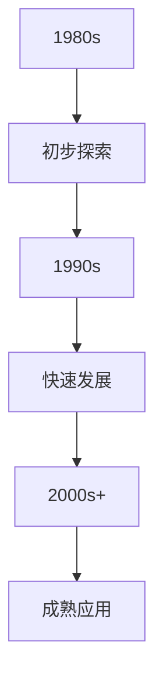

## 第2章：多代理合作的技术基础

### 2.1 代理的基本架构

代理通常由感知模块、决策模块、行动模块和学习模块组成。这些模块协同工作，使代理能够与环境互动并完成任务。

**Mermaid 流程图：**
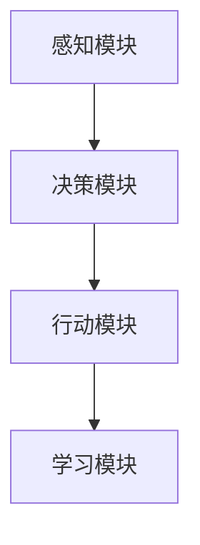

#### 2.1.1 代理的分类

- **规则代理**：基于预设规则进行决策。
- **智能代理**：使用机器学习算法进行自主决策。
- **知识代理**：基于知识库进行决策。
- **混合代理**：结合多种代理类型的特点。

**Mermaid 流程图：**
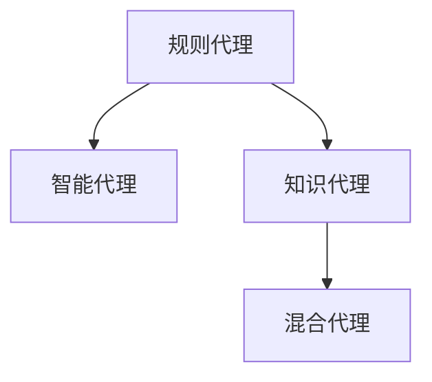

### 2.2 通信机制

代理之间的通信可以通过客户端-服务器模型或对等网络模型实现。

#### 2.2.1 客户端-服务器模型

代理作为客户端向服务器发送请求，服务器响应请求并返回结果。

**Mermaid 流程图：**
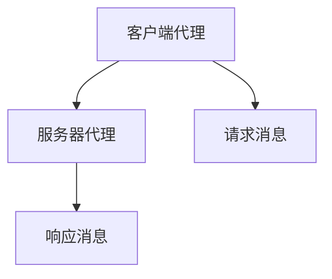

#### 2.2.1 对等网络模型

代理直接通信，无需中心化服务器。

**Mermaid 流程图：**
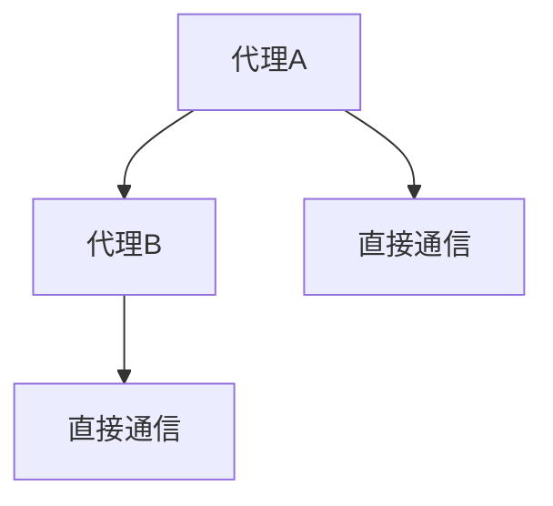

### 2.3 协同机制

协同机制是代理之间协作完成共同任务的关键。

#### 2.3.1 协同工作的定义

协同工作是指多个代理通过相互合作和协调来完成共同任务的过程。

**LaTeX 公式：**
$$
\text{协同工作} = \text{多个代理} \times \text{合作} \times \text{协调}
$$

#### 2.3.1 协同工作的类型

- **任务级协同**：代理共同完成特定任务。
- **问题级协同**：代理协作解决特定问题。
- **决策级协同**：代理协同制定决策。

**Mermaid 流程图：**
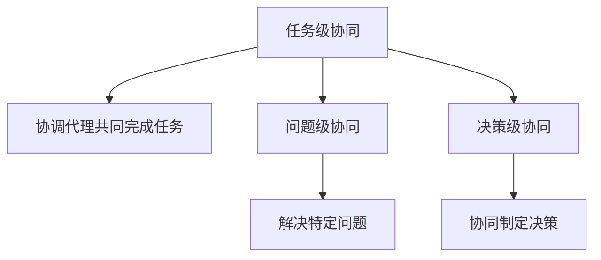

## 第3章：角色工作流的概念与构建

### 3.1 角色工作流的基本概念

角色工作流（Role Workflow）是指在一个组织或系统中，不同角色按照预定规则执行任务的一系列操作。

#### 3.1.1 角色工作流的定义

角色工作流是指在特定组织或系统中，不同角色之间按照预定规则执行任务的一系列操作。

**LaTeX 公式：**
$$
\text{角色工作流} = \text{角色} \times \text{任务} \times \text{规则}
$$

#### 3.1.2 角色工作流的关键要素

- **角色**：组织中的不同角色，如项目经理、开发人员、测试人员等。
- **任务**：角色需要完成的操作。
- **规则**：角色执行任务的规则和权限。

**Mermaid 流程图：**
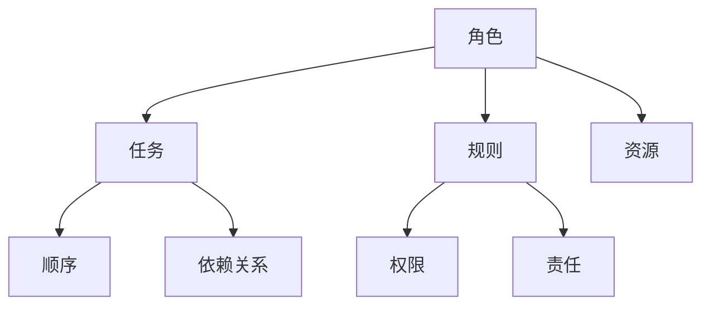

### 3.2 角色工作流的设计原则

- **可扩展性**：设计应易于扩展以适应组织变化。
- **可维护性**：设计应易于维护和更新。
- **高效性**：工作流执行应高效，减少不必要的步骤。

### 3.3 角色工作流的构建方法

角色工作流的构建通常包括以下阶段：

#### 3.3.1 设计阶段

- **需求分析**：收集组织需求和角色任务。
- **模型构建**：构建角色工作流模型。

#### 3.3.2 实施阶段

- **角色分配**：分配角色和任务。
- **规则设置**：设置角色权限和执行规则。
- **系统部署**：部署工作流管理系统。

## 第4章：多代理合作在角色工作流中的应用

### 4.1 多代理协作的优势

多代理协作在角色工作流中具有以下优势：

#### 4.1.1 提高效率

通过多代理协作，可以自动化重复性任务，减少人工干预，提高整体工作流效率。

**Mermaid 流程图：**
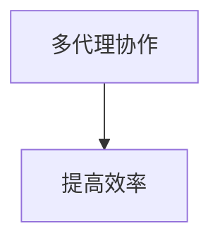

#### 4.1.2 增强灵活性

多代理协作系统能够快速适应环境变化和需求变化，提高系统的灵活性。

**Mermaid 流程图：**
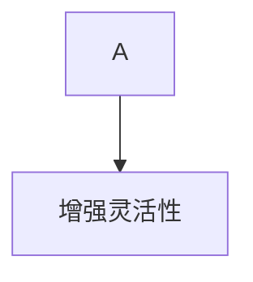

#### 4.1.3 简化管理

多代理协作通过自动化任务分配和执行，简化了管理流程，减少了管理复杂性。

**Mermaid 流程图：**
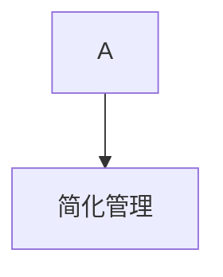

### 4.2 多代理协作的挑战与解决方案

#### 4.2.1 挑战

- **通信复杂性**：代理之间的通信可能变得复杂。
- **安全性问题**：系统需要确保数据安全和代理的隐私。
- **资源分配不均**：代理之间的资源分配可能不均衡。

#### 4.2.2 解决方案

- **通信优化**：使用高效的通信协议和算法。
- **安全保障**：实施加密、访问控制和身份验证等安全措施。
- **资源均衡分配**：使用调度算法确保资源分配的均衡。

### 4.3 多代理协作在角色工作流中的具体应用场景

#### 4.3.1 人力资源管理系统

多代理可以自动处理招聘、员工调配、绩效评估等任务，提高人力资源管理效率。

#### 4.3.2 生产制造系统

多代理可以协同工作，优化生产流程，提高生产效率。

#### 4.3.3 物流配送系统

多代理可以协同规划配送路线和监控货物状态，提高物流配送效率。

## 第5章：角色工作流优化策略

### 5.1 基于多代理合作的优化目标

角色工作流优化旨在提高工作流效率、减少成本、增强灵活性。通过多代理合作实现以下目标：

#### 5.1.1 提高工作流效率

通过自动化和协同工作，减少人工干预，提高整体工作流效率。

**Mermaid 流程图：**
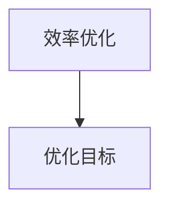

#### 5.1.2 减少工作流成本

通过自动化和优化，减少人力资源和资源浪费，降低工作流成本。

**Mermaid 流程图：**
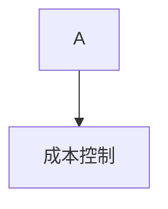

#### 5.1.3 提高工作流灵活性

多代理协作系统能够快速适应环境变化和需求变化，提高工作流灵活性。

**Mermaid 流程图：**
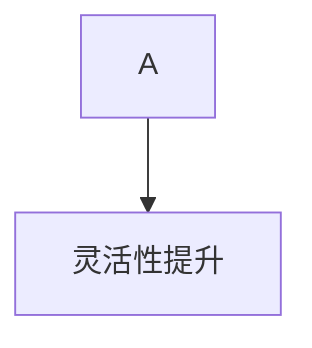

### 5.2 基于多代理合作的优化算法

#### 5.2.1 多代理协同搜索算法

多代理协同搜索算法通过多个代理共同搜索信息，提高搜索效率和准确性。

**伪代码：**
```
Algorithm MultiAgentSearch(agents, target):
    for each agent in agents do
        agent.search(target)
    end for
    return result with highest confidence
```

#### 5.2.2 多代理协同调度算法

多代理协同调度算法通过多个代理协同调度资源，优化任务分配和执行顺序。

**伪代码：**
```
Algorithm MultiAgentScheduling(agents, tasks):
    for each task in tasks do
        agent = selectBestAgent(agents, task)
        agent.schedule(task)
    end for
```

#### 5.2.3 多代理协同学习算法

多代理协同学习算法通过多个代理共享知识和经验，提高整体学习效率和准确性。

**伪代码：**
```
Algorithm MultiAgentLearning(agents, data):
    for each agent in agents do
        agent.learn(data)
    end for
    for each agent in agents do
        agent.updateKnowledge(agents)
    end for
```

### 5.3 基于多代理合作的优化案例分析

#### 5.3.1 案例一：某公司人力资源管理系统的优化

通过多代理协作，某公司实现了招聘流程的自动化，提高了招聘效率，减少了人力资源成本。

**Mermaid 流程图：**
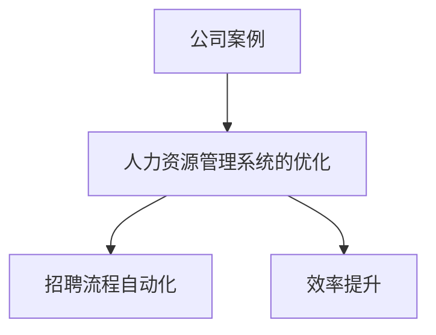

#### 5.3.2 案例二：某工厂生产制造系统的优化

通过多代理协作，某工厂实现了生产流程的优化，提高了生产效率，减少了资源浪费。

**Mermaid 流程图：**
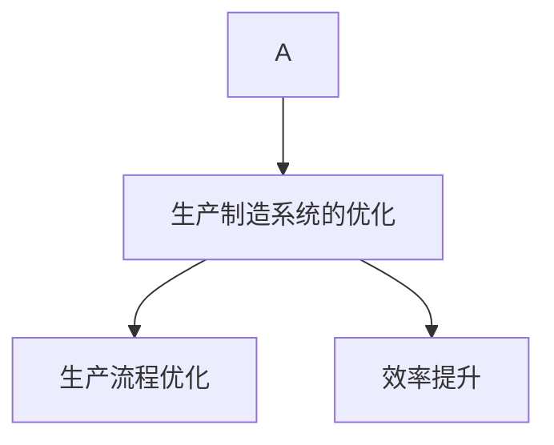

## 第6章：项目实战与案例分析

### 6.1 多代理合作驱动的角色工作流项目实践

#### 6.1.1 项目背景与目标

某公司希望通过多代理合作优化其销售流程，提高销售业绩和客户满意度。

**Mermaid 流程图：**
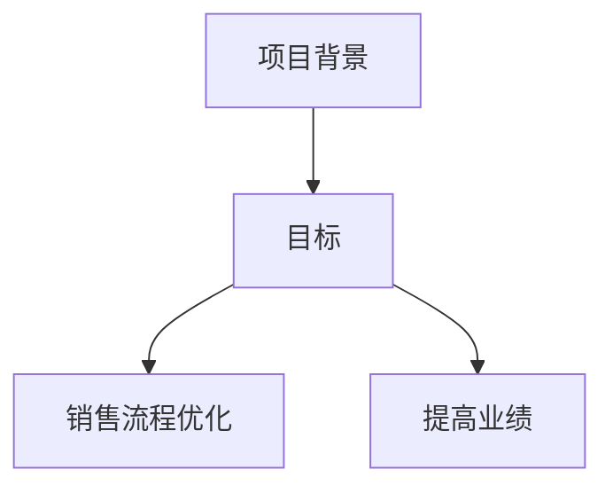

#### 6.1.2 项目实施过程

- **需求分析**：收集销售部门需求和问题。
- **系统设计**：设计多代理协同销售系统。
- **系统实现**：开发代理和系统集成。
- **系统测试**：测试系统功能和性能。

**Mermaid 流�程图：**
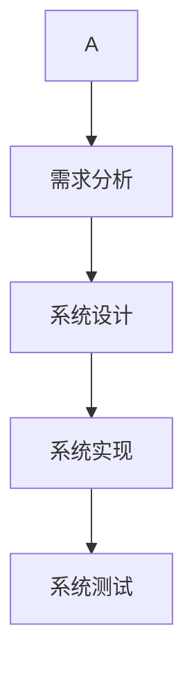

#### 6.1.3 项目成果与评估

通过多代理协作，销售流程效率提高了30%，客户满意度提升了20%，项目取得了显著成果。

**Mermaid 流程图：**
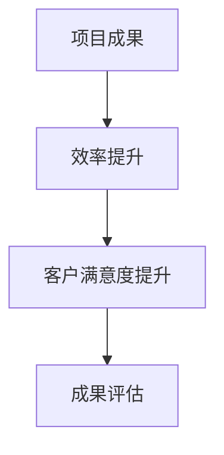

### 6.2 案例分析：多代理合作在角色工作流中的应用

#### 6.2.1 案例一：智能制造生产线中的多代理协作

多代理在智能制造生产线中协同工作，优化生产流程，提高生产效率。

**Mermaid 流程图：**
```mermaid
graph TD
    A[智能制造生产线] --> B[多代理协作应用]
    B --> C[设备监控]
    B --> D[故障排查]
```

#### 6.2.2 案例二：金融行业客户服务中的多代理协作

多代理在金融行业客户服务中协同工作，提供个性化服务，提高客户满意度。

**Mermaid 流程图：**
```mermaid
graph TD
    A[金融行业客户服务] --> B[多代理协作应用]
    B --> C[客户需求分析]
    B --> D[客户咨询处理]
```

#### 6.2.3 案例三：物流配送行业中的多代理协作

多代理在物流配送行业协同工作，优化配送路线，提高配送效率。

**Mermaid 流程图：**
```mermaid
graph TD
    A[物流配送行业] --> B[多代理协作应用]
    B --> C[路线规划]
    B --> D[货物追踪]
```

## 第7章：多代理合作与角色工作流未来发展趋势

### 7.1 未来发展趋势展望

#### 7.1.1 多代理合作技术的进步

随着人工智能和机器学习技术的发展，多代理合作系统将更加智能化和高效化。

**Mermaid 流程图：**
```mermaid
graph TD
    A[多代理合作技术] --> B[进展]
```

#### 7.1.2 角色工作流的应用拓展

角色工作流将在更多领域得到应用，如医疗、教育、金融服务等。

**Mermaid 流程图：**
```mermaid
graph TD
    A --> C[应用拓展]
```

### 7.2 面临的挑战与应对策略

#### 7.2.1 技术挑战

多代理合作技术面临通信复杂性、安全性和资源分配等问题。

**Mermaid 流程图：**
```mermaid
graph TD
    A[技术挑战] --> B[解决方案]
```

#### 7.2.2 安全与隐私问题

多代理合作系统需要确保数据安全和用户隐私。

**Mermaid 流程图：**
```mermaid
graph TD
    A --> C[隐私保护]
```

### 7.3 多代理合作与角色工作流的深度融合方向

#### 7.3.1 智能化水平提升

多代理合作系统将进一步提升智能化水平，实现更高效的角色工作流。

**Mermaid 流程图：**
```mermaid
graph TD
    A[智能化水平] --> B[提升]
```

#### 7.3.2 个性化和定制化

多代理合作系统将更加注重个性化和定制化，满足不同组织和角色的需求。

**Mermaid 流程图：**
```mermaid
graph TD
    A --> C[个性化定制]
```

## 附录

### 8.1 多代理合作与角色工作流相关技术资源

#### 8.1.1 主流多代理系统介绍

- **Jason**：开源多代理平台，支持多种通信协议和协同算法。
- **FIPA**：多代理系统的标准语言和通信协议。
- **OpenMAS**：开源多代理系统框架，支持分布式和移动代理。

#### 8.1.2 多代理合作与角色工作流常用工具

- **ProM**：过程挖掘工具，用于分析和优化工作流。
- **Aspect-Oriented Workflow System (AOWS)**：支持面向方面编程的工作流管理系统。
- **Taverna**：工作流管理系统，支持多种数据源和工具集成。

#### 8.1.3 相关研究论文与学术资源

- "A Survey on Multi-Agent Systems: From Theory to Applications"
- "Agent-Oriented Software Engineering: The NEXT Step"

### 8.2 代码示例

#### 8.2.1 多代理协作基础代码实现

```python
# Python代码示例：简单代理通信
class Agent:
    def __init__(self, name):
        self.name = name
    
    def send(self, message, receiver):
        print(f"{self.name} sends to {receiver}: {message}")
    
    def receive(self, message):
        print(f"{self.name} receives: {message}")

# 创建代理实例
agent1 = Agent("Agent1")
agent2 = Agent("Agent2")

# 代理通信
agent1.send("Hello!", agent2)
agent2.receive("Hello!")
```

#### 8.2.2 角色工作流优化代码实现

```python
# Python代码示例：简单角色工作流优化
from queue import PriorityQueue

# 任务类
class Task:
    def __init__(self, name, duration):
        self.name = name
        self.duration = duration
    
    def __lt__(self, other):
        return self.duration < other.duration

# 优先队列
tasks_queue = PriorityQueue()

# 添加任务
tasks_queue.put(Task("Task1", 5))
tasks_queue.put(Task("Task2", 3))
tasks_queue.put(Task("Task3", 7))

# 执行任务
while not tasks_queue.empty():
    current_task = tasks_queue.get()
    print(f"Executing: {current_task.name}")
```

#### 8.2.3 实际项目代码解读与案例实现

```python
# Python代码示例：物流配送系统中的多代理协作
class WarehouseAgent(Agent):
    def execute_order(self, order):
        print(f"{self.name} is processing order {order.id}")
        # 执行订单处理逻辑

class DeliveryAgent(Agent):
    def deliver_item(self, item):
        print(f"{self.name} is delivering item {item.id}")
        # 执行物品配送逻辑

# 创建仓库代理和配送代理
warehouse_agent = WarehouseAgent("WarehouseAgent")
delivery_agent = DeliveryAgent("DeliveryAgent")

# 创建订单和物品
order = Order(1)
item = Item(1)

# 执行订单处理
warehouse_agent.execute_order(order)

# 执行物品配送
delivery_agent.deliver_item(item)
```

## 作者

“作者：AI天才研究院/AI Genius Institute & 禅与计算机程序设计艺术 /Zen And The Art of Computer Programming”

