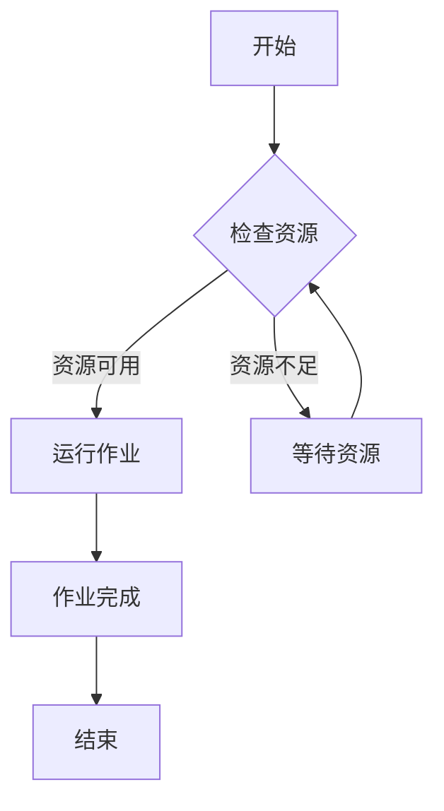

                 

# 文章标题: Oozie原理与代码实例讲解

> 关键词：Oozie, Hadoop, 作业调度，工作流，数据处理，实时处理

> 摘要：本文深入探讨了Oozie的原理及其在实际应用中的具体实现，通过详细讲解Oozie的工作原理、核心组件、调度算法以及项目实战，帮助读者全面理解Oozie，并掌握其在数据处理和实时处理中的使用方法。

---

## 第一部分: Oozie原理概述

### 第1章: Oozie基础概念

#### 1.1 Oozie简介

Oozie是一个开源的工作流调度引擎，主要用于处理和管理Hadoop作业。它支持多种数据源和作业类型，如MapReduce、Spark、Flink等，使得数据处理任务能够高效地执行和管理。

**Oozie概念解释**：Oozie是一种基于Hadoop生态系统的工作流调度工具，它允许用户通过定义工作流来调度和协调Hadoop作业的执行。

**Oozie与Hadoop的关系**：Oozie依赖于Hadoop生态系统，它能够与HDFS、MapReduce、YARN等组件无缝集成，实现复杂的数据处理任务。

**Oozie与其他作业调度工具对比**：与其他作业调度工具如Azkaban、Airflow相比，Oozie具有更好的可扩展性和灵活性，能够处理更复杂的工作流任务。

#### 1.2 Oozie架构

**Oozie核心组件**：Oozie主要由三个核心组件组成：Workflow、Coordinator和Bundle。

**Oozie工作流程**：Oozie通过定义工作流来管理作业的执行，工作流由一系列作业节点组成，每个节点代表一个具体的任务。

**Oozie与YARN的集成**：Oozie可以通过YARN与Hadoop生态系统集成，实现作业的动态资源分配和调度。

#### 1.3 Oozie工作原理

**Oozie作业调度流程**：Oozie通过定义工作流来调度作业，作业的执行顺序、依赖关系和工作流的状态都由Oozie进行管理。

**Oozie工作流执行顺序**：Oozie根据工作流中的节点定义来执行作业，节点可以是顺序执行，也可以是并行执行。

**Oozie作业状态监控**：Oozie能够实时监控作业的执行状态，并提供详细的日志和报告。

#### 1.4 Oozie应用场景

**大数据处理场景**：Oozie适用于大规模数据处理的场景，如数据采集、数据清洗、数据转换和数据存储。

**数据处理流水线**：Oozie能够构建复杂的数据处理流水线，实现数据的连续处理和流转。

**实时数据处理**：Oozie支持实时数据处理，适用于需要实时处理和分析数据的应用场景。

---

### 第2章: Oozie核心组件详解

#### 第2章-2.1: Workflow组件

##### 2.1.1 Workflow基本概念

**Workflow定义**：Workflow是Oozie中的一种工作流定义，用于描述一系列作业的执行顺序和依赖关系。

**Workflow特点**：Workflow具有灵活性和可扩展性，能够处理复杂的数据处理任务，并且与Hadoop生态系统紧密集成。

##### 2.1.2 Workflow结构

**Workflow基本结构**：Workflow由一个开始节点、多个作业节点和一个结束节点组成。

**Workflow节点类型**：Workflow节点可以是顺序节点、分支节点、并行节点等，每种节点都有不同的执行方式和功能。

##### 2.1.3 Workflow语法与规则

**Workflow语法说明**：Workflow的语法包括节点定义、属性定义和关系定义等，用于描述工作流的执行逻辑。

**Workflow规则说明**：Workflow的规则包括节点执行条件、依赖关系和错误处理等，用于确保工作流的正确执行。

---

##### 第2章-2.2: Coordinator组件

##### 2.2.1 Coordinator基本概念

**Coordinator定义**：Coordinator是Oozie中的一种协调器组件，用于管理周期性作业的执行。

**Coordinator特点**：Coordinator支持周期性作业的调度和执行，能够根据定义的规则自动触发作业的执行。

##### 2.2.2 Coordinator结构

**Coordinator基本结构**：Coordinator由一个开始节点、多个周期节点和一个结束节点组成。

**Coordinator节点类型**：Coordinator节点可以是定时节点、触发节点和循环节点等，每种节点都有不同的执行方式和功能。

##### 2.2.3 Coordinator工作原理

**Coordinator启动与执行**：Coordinator通过配置文件启动，并根据定义的规则自动触发作业的执行。

**Coordinator依赖关系**：Coordinator支持节点间的依赖关系，确保作业的正确执行。

---

##### 第2章-2.3: Bundle组件

##### 2.3.1 Bundle基本概念

**Bundle定义**：Bundle是Oozie中的一种打包组件，用于将多个作业打包成一个整体进行管理和调度。

**Bundle特点**：Bundle支持作业的打包和分布式执行，能够提高作业的执行效率和可靠性。

##### 2.3.2 Bundle结构

**Bundle基本结构**：Bundle由一个开始节点、多个作业节点和一个结束节点组成。

**Bundle节点类型**：Bundle节点可以是顺序节点、分支节点、并行节点等，每种节点都有不同的执行方式和功能。

##### 2.3.3 Bundle工作原理

**Bundle启动与执行**：Bundle通过配置文件启动，并根据定义的规则执行作业。

**Bundle依赖关系**：Bundle支持节点间的依赖关系，确保作业的正确执行。

---

## 第二部分: Oozie核心算法原理

### 第3章: Oozie调度算法

##### 3.1.1 资源依赖调度算法

**资源依赖概念**：资源依赖是指作业执行所需的资源（如内存、CPU等）之间的依赖关系。

**资源依赖类型**：资源依赖可以分为硬依赖和软依赖，硬依赖要求依赖资源必须完全可用，而软依赖则允许部分资源可用。

**基于资源依赖的调度策略**：

1. **优先级调度策略**：根据作业的优先级进行调度，优先级高的作业优先执行。
2. **负载均衡调度策略**：根据系统的负载情况，合理分配资源，确保系统资源利用率最大化。

**调度算法实现**：

1. **伪代码说明**：
```python
function schedule_jobs(jobs):
    while not all_jobs_finished(jobs):
        available_resources = get_available_resources()
        for job in jobs:
            if job.requires(available_resources):
                run_job(job)
```
2. **调度算法流程图**：



##### 3.1.2 并行与串行调度算法

**并行与串行概念**：

1. **并行执行**：多个作业同时执行，能够提高作业的执行效率。
2. **串行执行**：多个作业依次执行，确保作业的执行顺序和依赖关系。

**并行调度策略**：

1. **任务并行调度**：将多个作业同时提交到集群执行，适用于任务间没有依赖关系或依赖关系可以并行处理的情况。
2. **数据并行调度**：对大量数据进行分区处理，每个分区由不同的作业处理，适用于数据处理场景。

**串行调度策略**：

1. **任务串行调度**：每个作业依次提交执行，确保作业按照预定顺序执行。
2. **数据串行调度**：对数据流进行逐条处理，确保数据的顺序处理。

**调度算法对比**：

1. **并行调度**：适用于处理大量数据和快速执行任务。
2. **串行调度**：适用于保证任务执行顺序和依赖关系。

---

## 第三部分: Oozie项目实战

### 第4章: Oozie在数据处理中的应用

##### 4.1 数据处理流程设计

**数据处理需求分析**：

- **数据处理目标**：实现对大规模数据的采集、清洗、转换和存储。
- **数据处理流程**：数据采集 -> 数据清洗 -> 数据转换 -> 数据存储。

**数据处理流程设计**：

1. **数据采集**：使用Flume进行数据采集，将数据导入HDFS。
2. **数据清洗**：使用MapReduce进行数据清洗，去除重复数据和错误数据。
3. **数据转换**：使用Spark进行数据转换，实现数据的格式转换和归一化处理。
4. **数据存储**：将处理后的数据存储到HDFS或其他数据存储系统。

---

##### 4.2 数据清洗与转换

**数据清洗技术**：

1. **数据清洗步骤**：
   - **数据验证**：检查数据是否完整、有效。
   - **去重**：去除重复数据。
   - **错误修正**：修正错误数据。

2. **数据清洗算法**：
   - **哈希去重**：使用哈希函数判断数据是否重复。
   - **规则去重**：根据预设规则去除重复数据。

**数据转换技术**：

1. **数据转换步骤**：
   - **数据解析**：解析原始数据，提取有用信息。
   - **格式转换**：将数据转换为统一的格式。
   - **归一化处理**：对数据进行归一化处理。

2. **数据转换算法**：
   - **映射转换**：将一种数据格式转换为另一种格式。
   - **归一化公式**：
   $$ normalized\_value = \frac{original\_value - min\_value}{max\_value - min\_value} $$

---

##### 4.3 数据存储与查询

**数据存储技术**：

1. **数据存储方案**：将处理后的数据存储到HDFS，并使用HBase进行实时查询。

2. **数据存储优化**：
   - **数据压缩**：使用数据压缩算法减小存储空间。
   - **索引构建**：构建数据索引，提高查询效率。

**数据查询技术**：

1. **数据查询方案**：使用HBase进行实时查询，支持SQL查询和MapReduce查询。

2. **数据查询优化**：
   - **缓存查询结果**：缓存查询结果，减少查询时间。
   - **分布式查询**：将查询任务分发到多个节点，提高查询效率。

---

## 第5章: Oozie在实时数据处理中的应用

##### 5.1 实时数据处理需求分析

**实时数据处理目标**：实现对实时数据的快速处理和分析，提供实时数据报表。

**实时数据处理架构**：数据采集 -> 数据预处理 -> 数据存储 -> 数据分析 -> 报表生成。

---

##### 5.2 实时数据处理流程设计

**流数据处理组件**：

1. **数据采集**：使用Flume进行实时数据采集，将数据发送到Kafka队列。

2. **数据预处理**：使用Storm进行实时数据处理，包括数据清洗、转换和格式化。

3. **数据存储**：使用Kafka将实时数据存储到HDFS，并使用HBase进行实时查询。

4. **数据分析**：使用Spark进行实时数据分析，生成实时报表。

5. **报表生成**：使用生成器生成实时报表，并通过Web界面展示。

---

##### 5.3 实时数据处理性能优化

**系统性能瓶颈分析**：

1. **数据采集瓶颈**：实时数据量过大，导致采集速度过慢。
2. **数据处理瓶颈**：实时数据处理任务过多，导致处理速度过慢。
3. **数据存储瓶颈**：实时数据存储容量不足，导致存储速度过慢。

**性能优化策略**：

1. **资源调整**：增加采集节点和处理节点的资源，提高处理速度。
2. **算法优化**：优化数据采集、预处理和存储算法，减少处理时间。

## 第四部分: Oozie实践案例

### 第6章: Oozie在电商数据处理中的应用

##### 6.1 电商数据处理流程设计

**电商数据处理需求**：

- **数据处理目标**：实现电商数据的采集、清洗、转换和存储。
- **数据处理流程**：数据采集 -> 数据清洗 -> 数据转换 -> 数据存储。

**电商数据处理架构**：

1. **数据采集**：使用Flume进行数据采集，将电商交易数据导入Kafka队列。
2. **数据清洗**：使用Spark进行数据清洗，去除重复数据和错误数据。
3. **数据转换**：使用Hive进行数据转换，将数据转换为统一的格式。
4. **数据存储**：将清洗和转换后的数据存储到HDFS，并使用HBase进行实时查询。

---

##### 6.2 电商数据处理实战

**数据采集与清洗**：

1. **数据采集方案**：使用Flume采集电商交易数据，将数据发送到Kafka队列。
2. **数据清洗过程**：使用Spark进行数据清洗，包括数据验证、去重和错误修正。

**数据分析与应用**：

1. **数据分析方法**：使用Spark进行数据分析，包括用户行为分析、交易数据分析等。
2. **数据分析结果与应用**：将分析结果存储到HBase，并生成实时报表，为电商平台提供决策支持。

---

### 第7章: Oozie在其他领域中的应用

##### 7.1 Oozie在金融数据处理中的应用

**金融数据处理需求**：

- **数据处理目标**：实现金融数据的采集、清洗、转换和存储。
- **数据处理流程**：数据采集 -> 数据清洗 -> 数据转换 -> 数据存储。

**金融数据处理架构**：

1. **数据采集**：使用Flume进行数据采集，将金融交易数据导入Kafka队列。
2. **数据清洗**：使用Spark进行数据清洗，去除重复数据和错误数据。
3. **数据转换**：使用Hive进行数据转换，将数据转换为统一的格式。
4. **数据存储**：将清洗和转换后的数据存储到HDFS，并使用HBase进行实时查询。

---

##### 7.2 Oozie在医疗数据处理中的应用

**医疗数据处理需求**：

- **数据处理目标**：实现医疗数据的采集、清洗、转换和存储。
- **数据处理流程**：数据采集 -> 数据清洗 -> 数据转换 -> 数据存储。

**医疗数据处理架构**：

1. **数据采集**：使用Flume进行数据采集，将医疗数据导入Kafka队列。
2. **数据清洗**：使用Spark进行数据清洗，去除重复数据和错误数据。
3. **数据转换**：使用Hive进行数据转换，将数据转换为统一的格式。
4. **数据存储**：将清洗和转换后的数据存储到HDFS，并使用HBase进行实时查询。

---

## 附录

### 附录A: Oozie开发工具与资源

##### 附录A-1: Oozie开发工具

**Oozie开发环境搭建**：

1. **开发环境要求**：安装Java开发工具包（JDK）、Apache ZooKeeper、Hadoop等。
2. **环境搭建步骤**：
   - 安装JDK
   - 安装ZooKeeper
   - 安装Hadoop
   - 配置Oozie环境

**Oozie常用命令行工具**：

1. **Oozie命令行工具功能**：用于启动、停止、监控Oozie服务。
2. **Oozie命令行工具使用方法**：
   - `oozie admin --bootstrap`：初始化Oozie服务
   - `oozie admin --start`：启动Oozie服务
   - `oozie admin --stop`：停止Oozie服务

---

##### 附录A-2: Oozie资源链接

**Oozie官方文档**：

- **官方文档链接**：[Oozie官方文档](https://oozie.apache.org/docs/latest/)
- **文档内容概览**：包括Oozie安装、配置、使用方法等。

**Oozie社区资源**：

- **社区论坛链接**：[Oozie社区论坛](https://community.apache.org/)
- **社区资源分享**：包括Oozie使用技巧、最佳实践等。

---

### 附录B: Oozie相关术语解释

**Oozie术语解释**：

1. **Workflow**：工作流，用于定义一系列作业的执行顺序和依赖关系。
2. **Coordinator**：协调器，用于管理周期性作业的执行。
3. **Bundle**：打包组件，用于将多个作业打包成一个整体进行管理和调度。
4. **Node**：节点，表示工作流中的一个作业或任务。
5. **Action**：动作，表示工作流中的一个具体操作。
6. **Trigger**：触发器，用于触发作业的执行。
7. **Scheduler**：调度器，用于调度作业的执行。

---

### 附录C: Oozie常见问题与解决方案

**Oozie常见问题与解决方案**：

1. **问题1**：Oozie启动失败
   - **解决方案**：检查Java环境、ZooKeeper和Hadoop配置，确保所有组件正常运行。

2. **问题2**：Oozie作业执行失败
   - **解决方案**：检查作业配置、依赖关系和系统资源，确保作业可以正确执行。

3. **问题3**：Oozie监控数据丢失
   - **解决方案**：检查Oozie日志文件，确保日志记录正确。

---

## 参考文献

1. Apache Oozie官方文档
2. 《Hadoop权威指南》
3. 《大数据处理技术与实践》
4. 《实时数据处理技术》

---

### 作者信息

作者：AI天才研究院/AI Genius Institute & 禅与计算机程序设计艺术 /Zen And The Art of Computer Programming

