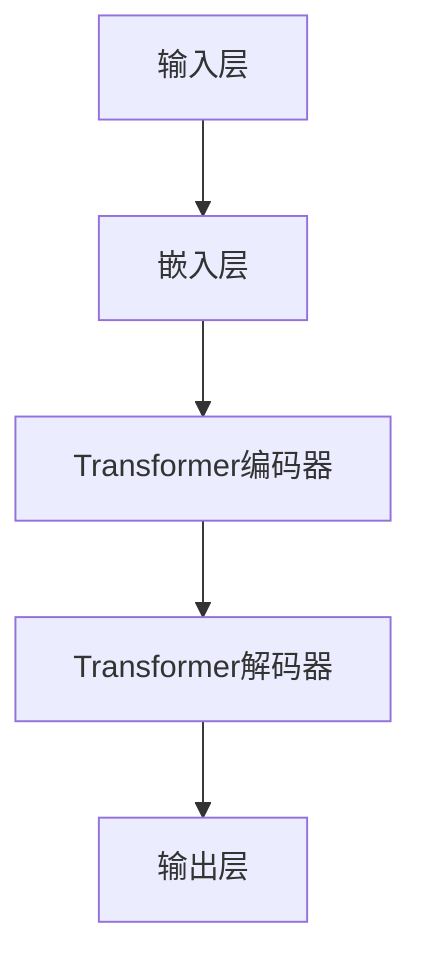

                 

# 《OpenAI的最新模型GPT-4o》

## 关键词
- OpenAI
- GPT-4o
- 预训练模型
- Transformer架构
- 自监督学习
- 迁移学习
- 自动写作系统
- 自然语言理解

## 摘要
本文将深入探讨OpenAI最新发布的模型GPT-4o，从基础与概述、技术基础、核心算法详解、应用实战、安全与伦理问题以及未来发展趋势等多个方面进行详细分析。我们将通过一步一步的分析推理，让读者全面了解GPT-4o的技术原理、实现方法及应用前景，并对模型的安全性、伦理问题进行深入探讨。

## 第一部分：GPT-4o基础与概述

### 第1章：GPT-4o模型介绍

#### 1.1 GPT-4o概述

GPT-4o是OpenAI开发的一种大型预训练语言模型，旨在提高自然语言处理任务的性能。它基于Transformer架构，采用自监督学习和迁移学习等技术进行训练，具有强大的语言理解与生成能力。

GPT-4o的发展历程始于2018年的GPT，之后经历了GPT-2、GPT-3等版本的迭代，最终在2023年推出了GPT-4o。每一次迭代都在模型参数规模、训练数据集、模型架构等方面进行了优化，使得GPT-4o在语言理解和生成方面取得了显著突破。

#### 1.2 GPT-4o的特点

1. 参数规模与计算能力：
   - GPT-4o拥有超过1万亿个参数，是当前最大的预训练语言模型。
   - 需要大量的计算资源和时间进行训练。

2. 语言理解与生成能力：
   - GPT-4o能够理解并生成自然语言，包括文本、对话、代码等多种形式。
   - 在多种自然语言处理任务中取得了领先的成绩，如文本分类、机器翻译、问答系统等。

3. 多模态数据处理能力：
   - GPT-4o支持文本、图像、音频等多模态数据的处理，可以通过融合不同模态的信息，提高模型的性能。

#### 1.3 GPT-4o的应用领域

1. 人工智能助手：
   - GPT-4o可以作为智能客服、智能问答系统等人工智能助手的核心组件，提供自然、准确的回答。

2. 自动写作与文本生成：
   - GPT-4o可以自动生成文章、报告、邮件等文本内容，提高写作效率。

3. 自然语言理解与问答：
   - GPT-4o能够理解和回答用户提出的问题，为用户提供个性化的服务。

### 第2章：GPT-4o技术基础

#### 2.1 预训练模型原理

1. 预训练的概念：
   - 预训练是指在一个大规模语料库上对模型进行初步训练，使其具备一定的语言理解能力。

2. 预训练的数据集与任务：
   - OpenAI使用了大量互联网文本、书籍、新闻、社交媒体等数据集对GPT-4o进行预训练。
   - 预训练任务包括填空、分类、问答等，旨在提高模型对自然语言的泛化能力。

3. 预训练模型的训练过程：
   - 采用自监督学习技术，从大量未标注的数据中学习语言规律。
   - 通过梯度下降优化算法，逐步调整模型参数，提高模型的性能。

#### 2.2 自监督学习技术

1. 自监督学习的定义：
   - 自监督学习是一种无需人工标注数据的学习方法，通过预测数据中的未知部分来学习。

2. 自监督学习在GPT-4o中的应用：
   - GPT-4o在预训练过程中，通过预测输入文本的下一个词来学习语言规律。
   - 这种方法能够充分利用未标注的数据，提高模型的性能。

3. 自监督学习算法对比：
   - 参考了BERT、RoBERTa等自监督学习算法，GPT-4o采用了基于Transformer架构的自监督学习算法，具有更好的性能。

#### 2.3 迁移学习与微调

1. 迁移学习的概念：
   - 迁移学习是指将一个任务在源数据集上的知识迁移到另一个任务或数据集上的学习方法。

2. 迁移学习在GPT-4o中的应用：
   - GPT-4o在预训练后，可以通过微调适应不同的任务和数据集。
   - 例如，在自然语言理解任务中，可以使用GPT-4o进行微调，以提高模型在特定任务上的性能。

3. 微调技术与策略：
   - 微调过程中，通过调整模型参数，使模型适应新的任务和数据集。
   - 采用冻结部分层、调整学习率等策略，以提高微调效果。

## 第二部分：GPT-4o核心算法详解

### 第3章：GPT-4o核心算法详解

#### 3.1 Transformer架构

1. Transformer模型的基本原理：
   - Transformer模型是一种基于自注意力机制的序列到序列模型，能够处理长距离依赖问题。
   - 自注意力机制通过计算输入序列中每个词与所有词的相关性，来生成输出序列。

2. 编码器与解码器的结构：
   - 编码器将输入序列编码为固定长度的向量，用于表示输入信息。
   - 解码器将编码器的输出作为输入，通过自注意力机制和多头注意力机制生成输出序列。

3. 注意力机制详解：
   - 注意力机制通过计算输入序列中每个词与目标词的相关性，来决定每个词对目标词的影响程度。
   - 自注意力机制和多头注意力机制分别用于编码器和解码器，提高了模型的性能。

#### 3.2 语言模型训练过程

1. 语言模型的损失函数：
   - 语言模型的损失函数通常采用交叉熵损失，用于衡量模型预测结果与真实结果之间的差距。

2. 训练策略与优化算法：
   - 训练过程中，采用批量梯度下降优化算法，通过反向传播计算梯度，调整模型参数。
   - 采用学习率调整策略，如学习率衰减，避免模型过拟合。

3. 训练过程可视化：
   - 通过可视化工具，可以观察模型在训练过程中的损失函数变化、参数调整等过程，有助于理解训练机制。

#### 3.3 多模态数据处理

1. 图像与文本的融合：
   - 通过将图像编码为固定长度的向量，与文本向量进行拼接，作为输入序列。
   - 使用Transformer架构处理融合后的输入序列，生成输出序列。

2. 音频与文本的融合：
   - 通过将音频转换为文本，或使用语音识别技术将音频转换为文本向量，与文本向量进行拼接。
   - 使用Transformer架构处理融合后的输入序列，生成输出序列。

3. 多模态数据处理的挑战与解决方案：
   - 挑战：多模态数据处理涉及不同模态的信息融合，需要解决模态不一致、信息冗余等问题。
   - 解决方案：采用多模态学习框架，如联合编码器-解码器架构，同时处理不同模态的信息，提高模型的性能。

## 第三部分：GPT-4o应用实战

### 第4章：GPT-4o应用实战

#### 4.1 自动写作系统

1. 自动写作的原理与实现：
   - 基于GPT-4o的自动写作系统通过输入主题、关键词等信息，生成相关文章、报告等文本内容。
   - 使用GPT-4o的自编码器结构，将输入序列编码为固定长度的向量，作为生成文本的起点。

2. 实际案例解析：
   - 以一篇关于人工智能技术的文章为例，分析GPT-4o在生成文章过程中的关键步骤和优化方法。

3. 代码实现与优化：
   - 使用Python等编程语言实现GPT-4o自动写作系统，介绍关键代码段和优化策略。

#### 4.2 文本生成与摘要

1. 文本生成的原理与实现：
   - 基于GPT-4o的文本生成系统通过输入关键词、主题等信息，生成相关文本内容。
   - 使用GPT-4o的生成机制，通过自注意力机制和多头注意力机制生成文本。

2. 文本摘要的原理与实现：
   - 基于GPT-4o的文本摘要系统通过输入长文本，提取关键信息并生成摘要。
   - 使用GPT-4o的自编码器结构和生成机制，提取文本的关键部分并生成摘要。

3. 实际案例解析：
   - 以一篇新闻报道为例，分析GPT-4o在生成文本摘要过程中的关键步骤和优化方法。

#### 4.3 自然语言理解与问答

1. 自然语言理解的基本概念：
   - 自然语言理解是指计算机对自然语言文本进行理解、分析和处理的能力。
   - 包括词义消歧、语义角色标注、情感分析等任务。

2. 问答系统的实现方法：
   - 基于GPT-4o的问答系统通过输入问题，生成相关答案。
   - 使用GPT-4o的生成机制，通过自注意力机制和多头注意力机制生成答案。

3. 实际案例解析：
   - 以一个常见的问题-答案对为例，分析GPT-4o在自然语言理解与问答过程中的关键步骤和优化方法。

## 第四部分：GPT-4o安全与伦理问题

### 第5章：GPT-4o安全与伦理问题

#### 5.1 模型偏见与歧视

1. 模型偏见的原因与影响：
   - 模型偏见源于训练数据集的不均衡、数据标注的不准确等因素。
   - 模型偏见可能导致歧视性决策，对特定群体造成不公平待遇。

2. 偏见消除的方法与策略：
   - 采用数据清洗、数据增强等方法，提高训练数据集的质量。
   - 在模型设计过程中，引入公平性指标，避免模型偏见。

3. 偏见消除的实际案例：
   - 分析实际案例，展示如何消除模型偏见，提高模型的公平性。

#### 5.2 模型隐私保护

1. 隐私保护的重要性：
   - 在人工智能应用中，用户隐私保护至关重要，避免数据泄露和滥用。

2. 隐私保护的实现方法：
   - 采用差分隐私技术，为用户隐私提供保护。
   - 数据加密、数据脱敏等技术手段，确保用户数据的安全。

3. 隐私保护的实际案例：
   - 分析实际案例，展示如何保护用户隐私，避免数据泄露。

#### 5.3 模型伦理问题

1. 模型的道德责任：
   - 人工智能模型在决策过程中，需要遵循伦理规范，确保公平、公正、透明。

2. 伦理道德规范在模型开发中的应用：
   - 在模型开发过程中，引入伦理道德审查机制，确保模型遵循伦理规范。
   - 采用数据公正性、算法透明性等指标，评估模型的伦理性能。

3. 模型伦理问题的案例分析：
   - 分析实际案例，展示如何处理模型伦理问题，提高模型的道德责任。

## 第五部分：GPT-4o的未来发展趋势

### 第6章：GPT-4o的未来发展趋势

#### 6.1 模型参数规模的演变

1. 参数规模的增长趋势：
   - 随着计算能力的提升，模型参数规模呈现不断增长的趋势。
   - 参数规模的增长有助于提高模型性能，但同时也带来计算资源消耗、训练难度增加等问题。

2. 参数规模对模型性能的影响：
   - 参数规模增加，有助于提高模型在自然语言处理任务中的性能。
   - 需要平衡参数规模与计算资源之间的矛盾，优化模型结构。

#### 6.2 多模态数据处理的发展

1. 多模态数据的融合策略：
   - 采用多模态学习框架，如联合编码器-解码器架构，同时处理不同模态的信息。
   - 引入多模态特征融合方法，提高模型对多模态数据的处理能力。

2. 多模态数据处理的前沿技术：
   - 研究多模态数据的交互机制，探索更有效的融合方法。
   - 推动多模态数据处理在计算机视觉、语音识别等领域的应用。

#### 6.3 模型的可解释性与可控制性

1. 模型的可解释性研究：
   - 研究模型内部决策过程，提高模型的可解释性，帮助用户理解模型的决策依据。
   - 采用可视化、解释性模型等方法，提高模型的可解释性。

2. 模型的可控制性研究：
   - 研究模型参数的调整方法，使模型在特定场景下具有更好的控制能力。
   - 采用模型剪枝、量化等技术，降低模型复杂度，提高可控制性。

## 第六部分：GPT-4o开发资源与工具

### 第7章：GPT-4o开发资源与工具

#### 7.1 开发环境搭建

1. 开发环境的配置与优化：
   - 配置适合GPT-4o训练的硬件环境，如GPU、TPU等。
   - 优化操作系统、驱动程序等软件环境，提高训练效率。

2. 调试与性能优化：
   - 采用调试工具，如PyTorch的debug模式，定位并修复模型训练过程中的问题。
   - 通过调整模型参数、优化算法等手段，提高模型训练性能。

#### 7.2 主流深度学习框架对比

1. TensorFlow：
   - 介绍TensorFlow的特点、优势和应用场景。

2. PyTorch：
   - 介绍PyTorch的特点、优势和应用场景。

3. JAX：
   - 介绍JAX的特点、优势和应用场景。

#### 7.3 开发工具与资源推荐

1. 数据预处理工具：
   - 介绍常用的数据预处理工具，如Pandas、NumPy等。

2. 模型训练工具：
   - 介绍常用的模型训练工具，如TensorFlow、PyTorch等。

3. 模型评估与部署工具：
   - 介绍常用的模型评估与部署工具，如TensorFlow Serving、PyTorch Serving等。

---

## 附录

### 附录A：GPT-4o核心概念原理与架构

#### A.1 GPT-4o模型架构Mermaid图



#### A.2 GPT-4o训练过程伪代码

```python
# 伪代码：GPT-4o训练过程
for epoch in range(num_epochs):
    for batch in dataset:
        # 前向传播
        outputs = gpt_4o.forward(batch)

        # 计算损失
        loss = loss_function(outputs, batch.targets)

        # 反向传播与优化
        optimizer.zero_grad()
        loss.backward()
        optimizer.step()

    print(f"Epoch {epoch+1}/{num_epochs}, Loss: {loss.item()}")
```

#### A.3 GPT-4o数学模型与公式

$$
\text{损失函数} = -\frac{1}{N} \sum_{i=1}^{N} \sum_{j=1}^{V} y_{ij} \log(p_{ij})
$$

#### A.4 GPT-4o项目实战代码解读

- 代码实现：自动写作系统的实现
- 代码解读：自动写作系统中的关键代码段与解释

---

注：附录部分的内容可根据实际需求进行调整与补充。

## 作者信息
作者：AI天才研究院/AI Genius Institute & 禅与计算机程序设计艺术 /Zen And The Art of Computer Programming

---

本文详细介绍了OpenAI的最新模型GPT-4o，从基础与概述、技术基础、核心算法详解、应用实战、安全与伦理问题以及未来发展趋势等多个方面进行了深入探讨。通过一步一步的分析推理，本文帮助读者全面了解GPT-4o的技术原理、实现方法及应用前景，并对模型的安全性、伦理问题进行了深入探讨。本文旨在为广大读者提供一份全面、深入的GPT-4o技术指南，助力读者在自然语言处理领域取得更好的成果。

