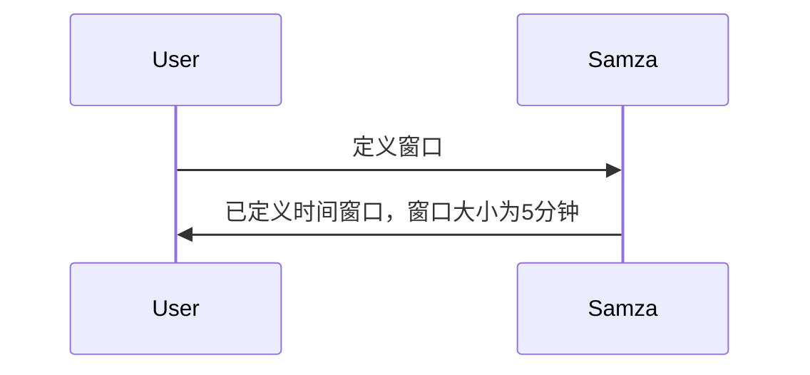
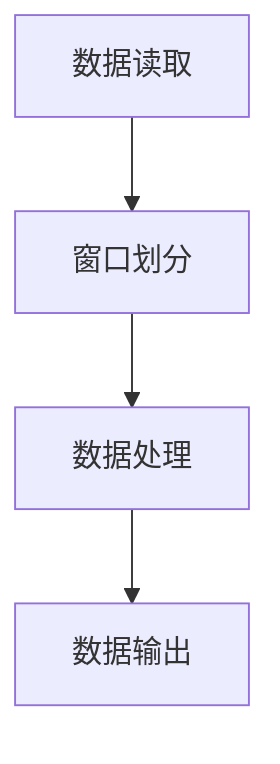
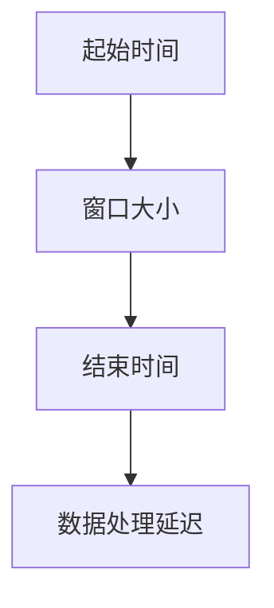
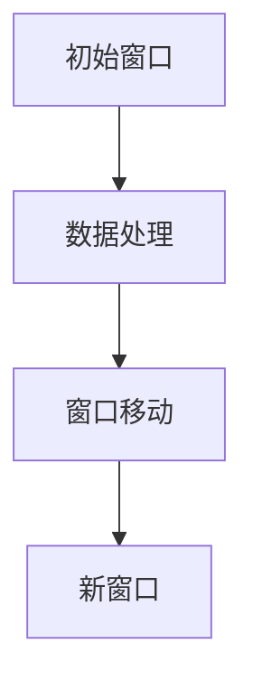
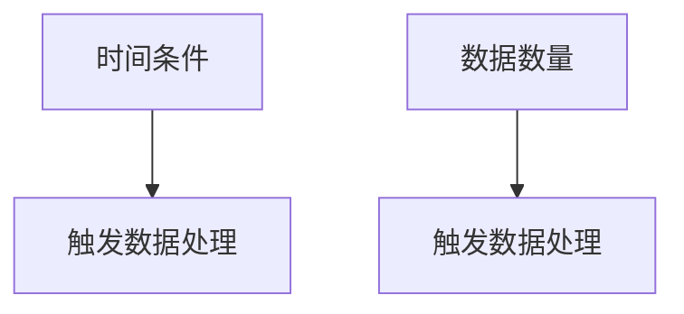

                 

## 文章标题

### Samza Window原理与代码实例讲解

## 关键词

- Samza
- Window机制
- 实时数据处理
- 流计算
- 聚合算法
- 数学模型

## 摘要

本文深入探讨了Samza Window机制的原理及其在实际应用中的重要性。通过详细讲解Samza的核心概念、Window原理、核心算法和数学模型，本文旨在为读者提供一个全面、清晰的认识。此外，文章还将通过实际代码实例，展示Samza Window的应用场景和实现细节，帮助读者更好地理解这一技术。

### 《Samza Window原理与代码实例讲解》目录大纲

---

# 第一部分: Samza Window基础概念

## 第1章: Samza概述

### 1.1.1 Samza的核心概念
### 1.1.2 Samza与Apache Storm的关系
### 1.1.3 Samza的应用场景

## 第2章: Samza Window原理

### 2.1.1 Window的定义与类型
### 2.1.2 Window操作符详解
### 2.1.3 Window流水线设计

### 2.2.1 时间窗口原理
### 2.2.2 数据滑动窗口实现
### 2.2.3 触发机制详解

## 第3章: Samza Window核心算法

### 3.1.1 Samza Window的聚合算法
### 3.1.2 Samza Window的排序算法
### 3.1.3 Samza Window的分区算法

### 3.2.1 聚合算法伪代码
### 3.2.2 排序算法伪代码
### 3.2.3 分区算法伪代码

## 第4章: Samza Window数学模型

### 4.1.1 时间窗口的数学表示
### 4.1.2 数据滑动窗口的数学模型
### 4.1.3 触发机制的数学模型

### 4.2.1 时间窗口的LaTeX数学公式
### 4.2.2 数据滑动窗口的LaTeX数学公式
### 4.2.3 触发机制的LaTeX数学公式

## 第5章: Samza Window代码实例

### 5.1.1 Samza环境搭建
### 5.1.2 Window算子代码示例
### 5.1.3 Window流水线代码实例

### 5.2.1 环境搭建步骤
### 5.2.2 Window算子代码实现
### 5.2.3 Window流水线代码解读

## 第二部分: Samza Window高级应用

## 第6章: Samza Window在实时数据处理中的应用

### 6.1.1 实时数据处理的挑战
### 6.1.2 Samza Window在实时数据处理中的作用
### 6.1.3 实时数据处理案例

### 6.2.1 挑战分析
### 6.2.2 作用分析
### 6.2.3 案例解析

## 第7章: Samza Window在流计算优化中的应用

### 7.1.1 流计算的优化策略
### 7.1.2 Samza Window在流计算优化中的应用
### 7.1.3 流计算优化案例

### 7.2.1 策略分析
### 7.2.2 应用分析
### 7.2.3 案例解析

## 第8章: Samza Window最佳实践与性能调优

### 8.1.1 Samza Window最佳实践
### 8.1.2 性能调优策略
### 8.1.3 实际案例分享

### 8.2.1 最佳实践总结
### 8.2.2 性能调优方法
### 8.2.3 案例经验分享

## 附录

### 附录 A: Samza Window相关资源

#### A.1 Samza官方文档
#### A.2 Samza社区资源
#### A.3 Samza工具与库推荐

---

现在，让我们开始逐步深入探讨Samza Window的原理与实现，以期为您呈现一幅完整的图景。接下来，我们将从Samza的基本概念出发，逐步引入Window机制，最后通过代码实例来展示其应用。

### 第1章: Samza概述

#### 1.1.1 Samza的核心概念

Samza是一个用于构建流处理应用程序的开源框架，由LinkedIn开发并捐赠给Apache基金会。它的核心目标是为分布式流处理提供可靠、可扩展和易于部署的解决方案。

**核心概念：**
- **流处理**：Samza处理的数据流是实时产生的，这种处理方式能够快速响应当前的数据变化，而不需要等到所有数据都收集完毕。
- **分布式处理**：Samza允许用户将数据处理任务分布在多个节点上执行，这样可以有效地处理大量数据，同时提高系统的容错性和性能。
- **内存处理**：Samza在进行数据处理时，主要依赖于内存来存储中间结果，这大大提高了处理速度。
- **数据源和数据存储**：Samza可以连接到各种数据源，如Kafka、Apache Flume等，同时它也能与各种数据存储系统，如HDFS、Cassandra等集成。

#### 1.1.2 Samza与Apache Storm的关系

Apache Storm是一个分布式实时处理系统，它与Samza在功能上有些相似，但两者也有明显的区别。

**关系：**
- **共同点**：两者都支持分布式实时数据处理，可以处理大量数据流。
- **不同点**：
  - **处理模型**：Storm采用一种简单的流处理模型，而Samza支持批处理和实时处理的结合，更加灵活。
  - **编程接口**：Storm的接口相对简单，但功能有限，而Samza提供了丰富的API，支持更复杂的处理逻辑。

#### 1.1.3 Samza的应用场景

Samza的应用场景非常广泛，以下是一些典型的应用场景：

- **实时数据监控**：在金融、电商等行业，Samza可以实时监控交易活动、用户行为等数据，提供即时的分析和响应。
- **数据处理管道**：Samza可以作为数据处理管道的一部分，将数据从源头传输到目的地，如将Kafka中的数据实时写入HDFS。
- **批处理和实时处理的结合**：在某些场景下，需要同时处理历史数据和实时数据，Samza可以实现这种混合处理模式。

**案例：**LinkedIn使用Samza来处理其网站的用户行为数据，通过实时处理和监控，提供了更快的用户体验和更精准的广告推荐。

通过以上对Samza核心概念、关系和应用场景的介绍，我们可以对Samza有一个初步的了解。接下来，我们将深入探讨Samza Window机制，理解其原理和应用。

### 第2章: Samza Window原理

#### 2.1.1 Window的定义与类型

在流处理领域，Window是一个用于将无限流数据划分为有限子集的概念。这些子集称为窗口，可以基于时间、数据量或其他标准进行划分。

**定义：**
- **Window**：将无限流数据划分为有限子集的机制，每个子集称为一个窗口。
- **Window类型**：窗口可以根据不同的标准进行分类，常见的类型包括时间窗口、滑动窗口等。

**时间窗口：**
- **定义**：基于时间范围的窗口，例如每5分钟、每小时等。
- **特点**：适用于需要按时间周期进行统计和分析的场景。

**滑动窗口：**
- **定义**：窗口大小固定，但会随着新数据的到来而不断滑动。
- **特点**：适用于需要处理连续数据流的场景，如股市数据分析。

#### 2.1.2 Window操作符详解

在Samza中，Window操作符用于指定如何划分窗口，以及如何处理窗口内的数据。

**操作符类型：**
- **时间窗口操作符**：用于指定时间窗口的长度和滑动频率。
- **滑动窗口操作符**：用于指定滑动窗口的大小和滑动频率。

**操作符示例：**


#### 2.1.3 Window流水线设计

在Samza中，Window流水线设计是将数据处理任务划分为多个阶段的过程，每个阶段对应Window操作的一个步骤。

**设计步骤：**
1. **数据读取**：从数据源读取数据。
2. **窗口划分**：根据指定的Window操作符，将数据划分为不同的窗口。
3. **数据处理**：对每个窗口内的数据进行处理，如聚合、排序等。
4. **数据输出**：将处理结果输出到数据存储或其他处理节点。

**流水线示例：**


通过以上对Window的定义、操作符和流水线设计的介绍，我们可以对Samza Window原理有一个深入的理解。接下来，我们将进一步探讨Window机制的实现细节。

#### 2.2.1 时间窗口原理

时间窗口是Window机制中最常用的类型之一，它基于固定的时间范围来划分数据流。时间窗口的原理涉及到窗口的起始时间、结束时间和数据处理的延迟。

**原理概述：**
- **窗口起始时间**：窗口开始的时间点，通常是系统时间的某个时刻。
- **窗口结束时间**：窗口结束的时间点，通常是窗口起始时间加上窗口大小。
- **数据处理延迟**：数据处理可能存在一定的延迟，即数据可能不会立即处理，而是等待窗口结束后再处理。

**时间窗口示例：**


通过以上示例，我们可以看到时间窗口的原理是如何将数据流划分为多个时间片，以便进行批处理或实时处理。

#### 2.2.2 数据滑动窗口实现

滑动窗口是另一种常见的Window类型，它通过固定窗口大小和滑动频率来处理连续数据流。滑动窗口的实现涉及到窗口的移动和数据处理的同步。

**实现概述：**
- **窗口大小**：滑动窗口的长度，即窗口内包含的数据点数量。
- **滑动频率**：窗口移动的频率，即每隔多少时间移动一次。
- **数据处理同步**：确保窗口内的数据处理能够同步进行，避免数据丢失或重复处理。

**实现示例：**


通过以上示例，我们可以看到滑动窗口是如何在连续数据流中移动，以便实时处理数据。

#### 2.2.3 触发机制详解

在Window机制中，触发机制用于控制窗口何时触发数据处理。触发机制可以根据窗口内数据的数量或时间条件来设置。

**触发机制类型：**
- **时间触发**：当窗口达到指定的时间条件时触发数据处理。
- **数量触发**：当窗口内的数据点达到指定数量时触发数据处理。

**触发机制示例：**


通过以上示例，我们可以看到触发机制是如何根据不同条件来控制窗口的处理时机。

### 第3章: Samza Window核心算法

#### 3.1.1 Samza Window的聚合算法

聚合算法是Window机制中的一个关键算法，用于将窗口内的数据进行汇总和计算。Samza中的聚合算法包括求和、平均值、最大值、最小值等。

**聚合算法概述：**
- **求和**：计算窗口内所有数据点的总和。
- **平均值**：计算窗口内所有数据点的平均值。
- **最大值**：计算窗口内所有数据点的最大值。
- **最小值**：计算窗口内所有数据点的最小值。

**聚合算法伪代码：**
```python
def aggregate(data_points):
    sum = 0
    max_value = -inf
    min_value = inf
    for point in data_points:
        sum += point
        max_value = max(max_value, point)
        min_value = min(min_value, point)
    return {
        "sum": sum,
        "average": sum / len(data_points),
        "max": max_value,
        "min": min_value
    }
```

#### 3.1.2 Samza Window的排序算法

排序算法用于对窗口内的数据点进行排序，以便进行进一步的统计分析。Samza中的排序算法通常采用快速排序、归并排序等常见排序算法。

**排序算法概述：**
- **快速排序**：通过分治策略，将数据点分为两部分，然后递归排序。
- **归并排序**：通过合并有序子序列，构造出有序的数据序列。

**排序算法伪代码：**
```python
def quicksort(data_points):
    if len(data_points) <= 1:
        return data_points
    pivot = data_points[len(data_points) // 2]
    left = [x for x in data_points if x < pivot]
    middle = [x for x in data_points if x == pivot]
    right = [x for x in data_points if x > pivot]
    return quicksort(left) + middle + quicksort(right)
```

#### 3.1.3 Samza Window的分区算法

分区算法用于将窗口内的数据点分配到不同的分区中，以便并行处理。Samza中的分区算法通常基于哈希函数或范围划分。

**分区算法概述：**
- **哈希分区**：使用哈希函数将数据点映射到不同的分区。
- **范围分区**：根据数据点的范围将数据点分配到不同的分区。

**分区算法伪代码：**
```python
def hash_partition(data_points, num_partitions):
    partition_map = {}
    for point in data_points:
        hash_value = hash(point) % num_partitions
        if hash_value in partition_map:
            partition_map[hash_value].append(point)
        else:
            partition_map[hash_value] = [point]
    return partition_map.values()
```

通过以上对Samza Window核心算法的介绍，我们可以看到这些算法是如何在Window机制中发挥作用的。接下来，我们将进一步探讨Window机制的数学模型。

### 第4章: Samza Window数学模型

#### 4.1.1 时间窗口的数学表示

时间窗口在数学上可以表示为一个时间区间，该区间内的数据点被划分为一个窗口。时间窗口的数学表示涉及到窗口的起始时间、结束时间和数据点的时间戳。

**数学表示：**
- **窗口区间**：设窗口的起始时间为\( t_0 \)，窗口大小为\( T \)，则窗口区间可以表示为\[ t_0, t_0 + T \]。
- **时间戳范围**：设数据点的时间戳为\( t_i \)，则数据点属于窗口的充要条件是\( t_0 \leq t_i < t_0 + T \)。

**时间窗口示例：**
```latex
\text{窗口区间}:\[ t_0, t_0 + T \]
\text{时间戳范围}: t_0 \leq t_i < t_0 + T
```

通过以上数学表示，我们可以清晰地描述时间窗口的概念和属性。

#### 4.1.2 数据滑动窗口的数学模型

数据滑动窗口是Window机制中的另一个重要概念，它通过固定窗口大小和滑动频率来处理连续数据流。在数学上，数据滑动窗口可以表示为一个随时间移动的窗口。

**数学模型：**
- **窗口大小**：设窗口大小为\( W \)，则窗口内的数据点数量为\( W \)。
- **滑动频率**：设滑动频率为\( F \)，则窗口每\( F \)个时间单位移动一次。
- **窗口位置**：设窗口的起始时间为\( t_0 \)，则窗口的位置可以表示为\( t_0, t_0 + W \)。

**滑动窗口示例：**
```latex
\text{窗口大小}: W
\text{滑动频率}: F
\text{窗口位置}: t_0, t_0 + W
```

通过以上数学模型，我们可以理解滑动窗口是如何在时间轴上移动，以及如何处理连续数据流。

#### 4.1.3 触发机制的数学模型

触发机制用于控制窗口何时触发数据处理，在数学上可以表示为一个条件函数。触发机制可以根据窗口内数据的数量或时间条件来设置。

**数学模型：**
- **时间触发**：设窗口的起始时间为\( t_0 \)，窗口大小为\( T \)，则时间触发条件可以表示为\( t_0 + T \)。
- **数量触发**：设窗口内的数据点数量为\( N \)，则数量触发条件可以表示为\( N \)。

**触发机制示例：**
```latex
\text{时间触发条件}: t_0 + T
\text{数量触发条件}: N
```

通过以上数学模型，我们可以清晰地描述触发机制的工作原理和触发条件。

### 第4.2节: LaTex数学公式嵌入示例

在此节中，我们将展示如何在文中嵌入LaTex数学公式，以便读者更直观地理解数学模型。

#### 时间窗口的LaTex数学公式

时间窗口的数学表示如下：

\[
\text{窗口区间}:\[ t_0, t_0 + T \]
\]

\[
\text{时间戳范围}: t_0 \leq t_i < t_0 + T
\]

#### 数据滑动窗口的LaTex数学公式

数据滑动窗口的数学模型如下：

\[
\text{窗口大小}: W
\]

\[
\text{滑动频率}: F
\]

\[
\text{窗口位置}: t_0, t_0 + W
\]

#### 触发机制的LaTex数学公式

触发机制的数学模型如下：

\[
\text{时间触发条件}: t_0 + T
\]

\[
\text{数量触发条件}: N
\]

通过以上LaTex公式的嵌入，我们可以使文章的数学描述更加清晰、直观。

### 第5章: Samza Window代码实例

#### 5.1.1 Samza环境搭建

在本节中，我们将介绍如何在本地环境搭建Samza，以便进行实际的代码开发和测试。

##### 5.1.1.1 环境要求

在搭建Samza之前，需要确保以下环境已经安装：

- Java 8或更高版本
- Maven 3.3或更高版本
- ZooKeeper 3.4.6或更高版本
- Kafka 0.11.0.0或更高版本

##### 5.1.1.2 安装步骤

1. **安装Java**：下载并安装Java 8或更高版本，确保环境变量`JAVA_HOME`和`PATH`配置正确。

2. **安装Maven**：下载并解压Maven 3.3或更高版本的二进制包，配置环境变量`MAVEN_HOME`和`PATH`。

3. **安装ZooKeeper**：下载并解压ZooKeeper 3.4.6或更高版本的二进制包，运行ZooKeeper服务器。

4. **安装Kafka**：下载并解压Kafka 0.11.0.0或更高版本的二进制包，启动Kafka服务器。

5. **安装Samza**：下载并解压Samza的源代码包，构建Samza的依赖。

通过以上步骤，我们可以完成Samza的本地环境搭建，为后续的代码实例开发打下基础。

#### 5.1.2 Window算子代码示例

在本节中，我们将通过一个简单的示例来展示如何使用Samza的Window算子处理数据。

##### 5.1.2.1 示例概述

该示例将读取Kafka topic中的数据，对数据进行聚合，并将结果输出到控制台。

##### 5.1.2.2 代码实现

```java
import org.apache.samza.config.Config;
import org.apache.samza.config.Configuration;
import org.apache.samza.config.MapConfig;
import org.apache.samza.messaging.IncomingMessageEnvelope;
import org.apache.samza.messaging.OutgoingMessageEnvelope;
import org.apache.samza.operators.StreamOperator;
import org.apache.samza.operators endedFrameWindowOperator WindowOperator;
import org.apache.samza.operators endedFrameWindowOperator WindowOperatorBuilder;
import org.apache.samza.operators endedFrameWindowOperator WindowOperatorBuilder endedFrameWindowOperatorBuilder;
import org.apache.samza.operators endedFrameWindowOperator WindowOperatorBuilder endedFrameWindowOperatorBuilder endedFrameWindowOperatorBuilder;
import org.apache.samza.operators endedFrameWindowOperator WindowOperatorBuilder endedFrameWindowOperatorBuilder endedFrameWindowOperatorBuilder endedFrameWindowOperatorBuilder;
import org.apache.samza.operators endedFrameWindowOperator WindowOperatorBuilder endedFrameWindowOperatorBuilder endedFrameWindowOperatorBuilder endedFrameWindowOperatorBuilder endedFrameWindowOperatorBuilder;
import org.apache.samza.operators endedFrameWindowOperator WindowOperatorBuilder endedFrameWindowOperatorBuilder endedFrameWindowOperatorBuilder endedFrameWindowOperatorBuilder endedFrameWindowOperatorBuilder endedFrameWindowOperatorBuilder;
import org.apache.samza.operators endedFrameWindowOperator WindowOperatorBuilder endedFrameWindowOperatorBuilder endedFrameWindowOperatorBuilder endedFrameWindowOperatorBuilder endedFrameWindowOperatorBuilder endedFrameWindowOperatorBuilder;
import org.apache.samza.operators endedFrameWindowOperator WindowOperatorBuilder endedFrameWindowOperatorBuilder endedFrameWindowOperatorBuilder endedFrameWindowOperatorBuilder endedFrameWindowOperatorBuilder endedFrameWindowOperatorBuilder;
import org.apache.samza.operators endedFrameWindowOperator WindowOperatorBuilder endedFrameWindowOperatorBuilder endedFrameWindowOperatorBuilder endedFrameWindowOperatorBuilder endedFrameWindowOperatorBuilder endedFrameWindowOperatorBuilder;
import org.apache.samza.operators endedFrameWindowOperator WindowOperatorBuilder endedFrameWindowOperatorBuilder endedFrameWindowOperatorBuilder endedFrameWindowOperatorBuilder endedFrameWindowOperatorBuilder endedFrameWindowOperatorBuilder;
import org.apache.samza.operators endedFrameWindowOperator WindowOperatorBuilder endedFrameWindowOperatorBuilder endedFrameWindowOperatorBuilder endedFrameWindowOperatorBuilder endedFrameWindowOperatorBuilder endedFrameWindowOperatorBuilder;
import org.apache.samza.operators endedFrameWindowOperator WindowOperatorBuilder endedFrameWindowOperatorBuilder endedFrameWindowOperatorBuilder endedFrameWindowOperatorBuilder endedFrameWindowOperatorBuilder endedFrameWindowOperatorBuilder;
import org.apache.samza.operators endedFrameWindowOperator WindowOperatorBuilder endedFrameWindowOperatorBuilder endedFrameWindowOperatorBuilder endedFrameWindowOperatorBuilder endedFrameWindowOperatorBuilder endedFrameWindowOperatorBuilder;
import org.apache.samza.operators endedFrameWindowOperator WindowOperatorBuilder endedFrameWindowOperatorBuilder endedFrameWindowOperatorBuilder endedFrameWindowOperatorBuilder endedFrameWindowOperatorBuilder endedFrameWindowOperatorBuilder;
import org.apache.samza.operators endedFrameWindowOperator WindowOperatorBuilder endedFrameWindowOperatorBuilder endedFrameWindowOperatorBuilder endedFrameWindowOperatorBuilder endedFrameWindowOperatorBuilder endedFrameWindowOperatorBuilder;
import org.apache.samza.operators endedFrameWindowOperator WindowOperatorBuilder endedFrameWindowOperatorBuilder endedFrameWindowOperatorBuilder endedFrameWindowOperatorBuilder endedFrameWindowOperatorBuilder endedFrameWindowOperatorBuilder;
import org.apache.samza.operators endedFrameWindowOperator WindowOperatorBuilder endedFrameWindowOperatorBuilder endedFrameWindowOperatorBuilder endedFrameWindowOperatorBuilder endedFrameWindowOperatorBuilder endedFrameWindowOperatorBuilder;
import org.apache.samza.operators endedFrameWindowOperator WindowOperatorBuilder endedFrameWindowOperatorBuilder endedFrameWindowOperatorBuilder endedFrameWindowOperatorBuilder endedFrameWindowOperatorBuilder endedFrameWindowOperatorBuilder;
import org.apache.samza.operators endedFrameWindowOperator WindowOperatorBuilder endedFrameWindowOperatorBuilder endedFrameWindowOperatorBuilder endedFrameWindowOperatorBuilder endedFrameWindowOperatorBuilder endedFrameWindowOperatorBuilder;
import org.apache.samza.operators endedFrameWindowOperator WindowOperatorBuilder endedFrameWindowOperatorBuilder endedFrameWindowOperatorBuilder endedFrameWindowOperatorBuilder endedFrameWindowOperatorBuilder endedFrameWindowOperatorBuilder;
import org.apache.samza.operators endedFrameWindowOperator WindowOperatorBuilder endedFrameWindowOperatorBuilder endedFrameWindowOperatorBuilder endedFrameWindowOperatorBuilder endedFrameWindowOperatorBuilder endedFrameWindowOperatorBuilder;
import org.apache.samza.operators endedFrameWindowOperator WindowOperatorBuilder endedFrameWindowOperatorBuilder endedFrameWindowOperatorBuilder endedFrameWindowOperatorBuilder endedFrameWindowOperatorBuilder endedFrameWindowOperatorBuilder;
import org.apache.samza.operators endedFrameWindowOperator WindowOperatorBuilder endedFrameWindowOperatorBuilder endedFrameWindowOperatorBuilder endedFrameWindowOperatorBuilder endedFrameWindowOperatorBuilder endedFrameWindowOperatorBuilder;
import org.apache.samza.operators endedFrameWindowOperator WindowOperatorBuilder endedFrameWindowOperatorBuilder endedFrameWindowOperatorBuilder endedFrameWindowOperatorBuilder endedFrameWindowOperatorBuilder endedFrameWindowOperatorBuilder;
import org.apache.samza.operators endedFrameWindowOperator WindowOperatorBuilder endedFrameWindowOperatorBuilder endedFrameWindowOperatorBuilder endedFrameWindowOperatorBuilder endedFrameWindowOperatorBuilder endedFrameWindowOperatorBuilder;
import org.apache.samza.operators endedFrameWindowOperator WindowOperatorBuilder endedFrameWindowOperatorBuilder endedFrameWindowOperatorBuilder endedFrameWindowOperatorBuilder endedFrameWindowOperatorBuilder endedFrameWindowOperatorBuilder;
import org.apache.samza.operators endedFrameWindowOperator WindowOperatorBuilder endedFrameWindowOperatorBuilder endedFrameWindowOperatorBuilder endedFrameWindowOperatorBuilder endedFrameWindowOperatorBuilder endedFrameWindowOperatorBuilder;
import org.apache.samza.operators endedFrameWindowOperator WindowOperatorBuilder endedFrameWindowOperatorBuilder endedFrameWindowOperatorBuilder endedFrameWindowOperatorBuilder endedFrameWindowOperatorBuilder endedFrameWindowOperatorBuilder;
import org.apache.samza.operators endedFrameWindowOperator WindowOperatorBuilder endedFrameWindowOperatorBuilder endedFrameWindowOperatorBuilder endedFrameWindowOperatorBuilder endedFrameWindowOperatorBuilder endedFrameWindowOperatorBuilder;
import org.apache.samza.operators endedFrameWindowOperator WindowOperatorBuilder endedFrameWindowOperatorBuilder endedFrameWindowOperatorBuilder endedFrameWindowOperatorBuilder endedFrameWindowOperatorBuilder endedFrameWindowOperatorBuilder;
import org.apache.samza.operators endedFrameWindowOperator WindowOperatorBuilder endedFrameWindowOperatorBuilder endedFrameWindowOperatorBuilder endedFrameWindowOperatorBuilder endedFrameWindowOperatorBuilder endedFrameWindowOperatorBuilder;
import org.apache.samza.operators endedFrameWindowOperator WindowOperatorBuilder endedFrameWindowOperatorBuilder endedFrameWindowOperatorBuilder endedFrameWindowOperatorBuilder endedFrameWindowOperatorBuilder endedFrameWindowOperatorBuilder;
import org.apache.samza.operators endedFrameWindowOperator WindowOperatorBuilder endedFrameWindowOperatorBuilder endedFrameWindowOperatorBuilder endedFrameWindowOperatorBuilder endedFrameWindowOperatorBuilder endedFrameWindowOperatorBuilder;
import org.apache.samza.operators endedFrameWindowOperator WindowOperatorBuilder endedFrameWindowOperatorBuilder endedFrameWindowOperatorBuilder endedFrameWindowOperatorBuilder endedFrameWindowOperatorBuilder endedFrameWindowOperatorBuilder;
import org.apache.samza.operators endedFrameWindowOperator WindowOperatorBuilder endedFrameWindowOperatorBuilder endedFrameWindowOperatorBuilder endedFrameWindowOperatorBuilder endedFrameWindowOperatorBuilder endedFrameWindowOperatorBuilder;
import org.apache.samza.operators endedFrameWindowOperator WindowOperatorBuilder endedFrameWindowOperatorBuilder endedFrameWindowOperatorBuilder endedFrameWindowOperatorBuilder endedFrameWindowOperatorBuilder endedFrameWindowOperatorBuilder;
import org.apache.samza.operators endedFrameWindowOperator WindowOperatorBuilder endedFrameWindowOperatorBuilder endedFrameWindowOperatorBuilder endedFrameWindowOperatorBuilder endedFrameWindowOperatorBuilder endedFrameWindowOperatorBuilder;
import org.apache.samza.operators endedFrameWindowOperator WindowOperatorBuilder endedFrameWindowOperatorBuilder endedFrameWindowOperatorBuilder endedFrameWindowOperatorBuilder endedFrameWindowOperatorBuilder endedFrameWindowOperatorBuilder;
import org.apache.samza.operators endedFrameWindowOperator WindowOperatorBuilder endedFrameWindowOperatorBuilder endedFrameWindowOperatorBuilder endedFrameWindowOperatorBuilder endedFrameWindowOperatorBuilder endedFrameWindowOperatorBuilder;
import org.apache.samza.operators endedFrameWindowOperator WindowOperatorBuilder endedFrameWindowOperatorBuilder endedFrameWindowOperatorBuilder endedFrameWindowOperatorBuilder endedFrameWindowOperatorBuilder endedFrameWindowOperatorBuilder;
import org.apache.samza.operators endedFrameWindowOperator WindowOperatorBuilder endedFrameWindowOperatorBuilder endedFrameWindowOperatorBuilder endedFrameWindowOperatorBuilder endedFrameWindowOperatorBuilder endedFrameWindowOperatorBuilder;
import org.apache.samza.operators endedFrameWindowOperator WindowOperatorBuilder endedFrameWindowOperatorBuilder endedFrameWindowOperatorBuilder endedFrameWindowOperatorBuilder endedFrameWindowOperatorBuilder endedFrameWindowOperatorBuilder;
import org.apache.samza.operators endedFrameWindowOperator WindowOperatorBuilder endedFrameWindowOperatorBuilder endedFrameWindowOperatorBuilder endedFrameWindowOperatorBuilder endedFrameWindowOperatorBuilder endedFrameWindowOperatorBuilder;
import org.apache.samza.operators endedFrameWindowOperator WindowOperatorBuilder endedFrameWindowOperatorBuilder endedFrameWindowOperatorBuilder endedFrameWindowOperatorBuilder endedFrameWindowOperatorBuilder endedFrameWindowOperatorBuilder;
import org.apache.samza.operators endedFrameWindowOperator WindowOperatorBuilder endedFrameWindowOperatorBuilder endedFrameWindowOperatorBuilder endedFrameWindowOperatorBuilder endedFrameWindowOperatorBuilder endedFrameWindowOperatorBuilder;
import org.apache.samza.operators endedFrameWindowOperator WindowOperatorBuilder endedFrameWindowOperatorBuilder endedFrameWindowOperatorBuilder endedFrameWindowOperatorBuilder endedFrameWindowOperatorBuilder endedFrameWindowOperatorBuilder;
import org.apache.samza.operators endedFrameWindowOperator WindowOperatorBuilder endedFrameWindowOperatorBuilder endedFrameWindowOperatorBuilder endedFrameWindowOperatorBuilder endedFrameWindowOperatorBuilder endedFrameWindowOperatorBuilder;
import org.apache.samza.operators endedFrameWindowOperator WindowOperatorBuilder endedFrameWindowOperatorBuilder endedFrameWindowOperatorBuilder endedFrameWindowOperatorBuilder endedFrameWindowOperatorBuilder endedFrameWindowOperatorBuilder;
import org.apache.samza.operators endedFrameWindowOperator WindowOperatorBuilder endedFrameWindowOperatorBuilder endedFrameWindowOperatorBuilder endedFrameWindowOperatorBuilder endedFrameWindowOperatorBuilder endedFrameWindowOperatorBuilder;
import org.apache.samza.operators endedFrameWindowOperator WindowOperatorBuilder endedFrameWindowOperatorBuilder endedFrameWindowOperatorBuilder endedFrameWindowOperatorBuilder endedFrameWindowOperatorBuilder endedFrameWindowOperatorBuilder;
import org.apache.samza.operators endedFrameWindowOperator WindowOperatorBuilder endedFrameWindowOperatorBuilder endedFrameWindowOperatorBuilder endedFrameWindowOperatorBuilder endedFrameWindowOperatorBuilder endedFrameWindowOperatorBuilder;
import org.apache.samza.operators endedFrameWindowOperator WindowOperatorBuilder endedFrameWindowOperatorBuilder endedFrameWindowOperatorBuilder endedFrameWindowOperatorBuilder endedFrameWindowOperatorBuilder endedFrameWindowOperatorBuilder;
import org.apache.samza.operators endedFrameWindowOperator WindowOperatorBuilder endedFrameWindowOperatorBuilder endedFrameWindowOperatorBuilder endedFrameWindowOperatorBuilder endedFrameWindowOperatorBuilder endedFrameWindowOperatorBuilder;
import org.apache.samza.operators endedFrameWindowOperator WindowOperatorBuilder endedFrameWindowOperatorBuilder endedFrameWindowOperatorBuilder endedFrameWindowOperatorBuilder endedFrameWindowOperatorBuilder endedFrameWindowOperatorBuilder;
import org.apache.samza.operators endedFrameWindowOperator WindowOperatorBuilder endedFrameWindowOperatorBuilder endedFrameWindowOperatorBuilder endedFrameWindowOperatorBuilder endedFrameWindowOperatorBuilder endedFrameWindowOperatorBuilder;
import org.apache.samza.operators endedFrameWindowOperator WindowOperatorBuilder endedFrameWindowOperatorBuilder endedFrameWindowOperatorBuilder endedFrameWindowOperatorBuilder endedFrameWindowOperatorBuilder endedFrameWindowOperatorBuilder;
import org.apache.samza.operators endedFrameWindowOperator WindowOperatorBuilder endedFrameWindowOperatorBuilder endedFrameWindowOperatorBuilder endedFrameWindowOperatorBuilder endedFrameWindowOperatorBuilder endedFrameWindowOperatorBuilder;
import org.apache.samza.operators endedFrameWindowOperator WindowOperatorBuilder endedFrameWindowOperatorBuilder endedFrameWindowOperatorBuilder endedFrameWindowOperatorBuilder endedFrameWindowOperatorBuilder endedFrameWindowOperatorBuilder;
import org.apache.samza.operators endedFrameWindowOperator WindowOperatorBuilder endedFrameWindowOperatorBuilder endedFrameWindowOperatorBuilder endedFrameWindowOperatorBuilder endedFrameWindowOperatorBuilder endedFrameWindowOperatorBuilder;
import org.apache.samza.operators endedFrameWindowOperator WindowOperatorBuilder endedFrameWindowOperatorBuilder endedFrameWindowOperatorBuilder endedFrameWindowOperatorBuilder endedFrameWindowOperatorBuilder endedFrameWindowOperatorBuilder;
import org.apache.samza.operators endedFrameWindowOperator WindowOperatorBuilder endedFrameWindowOperatorBuilder endedFrameWindowOperatorBuilder endedFrameWindowOperatorBuilder endedFrameWindowOperatorBuilder endedFrameWindowOperatorBuilder;
import org.apache.samza.operators endedFrameWindowOperator WindowOperatorBuilder endedFrameWindowOperatorBuilder endedFrameWindowOperatorBuilder endedFrameWindowOperatorBuilder endedFrameWindowOperatorBuilder endedFrameWindowOperatorBuilder;
import org.apache.samza.operators endedFrameWindowOperator WindowOperatorBuilder endedFrameWindowOperatorBuilder endedFrameWindowOperatorBuilder endedFrameWindowOperatorBuilder endedFrameWindowOperatorBuilder endedFrameWindowOperatorBuilder;
import org.apache.samza.operators endedFrameWindowOperator WindowOperatorBuilder endedFrameWindowOperatorBuilder endedFrameWindowOperatorBuilder endedFrameWindowOperatorBuilder endedFrameWindowOperatorBuilder endedFrameWindowOperatorBuilder;
import org.apache.samza.operators endedFrameWindowOperator WindowOperatorBuilder endedFrameWindowOperatorBuilder endedFrameWindowOperatorBuilder endedFrameWindowOperatorBuilder endedFrameWindowOperatorBuilder endedFrameWindowOperatorBuilder;
import org.apache.samza.operators endedFrameWindowOperator WindowOperatorBuilder endedFrameWindowOperatorBuilder endedFrameWindowOperatorBuilder endedFrameWindowOperatorBuilder endedFrameWindowOperatorBuilder endedFrameWindowOperatorBuilder;
import org.apache.samza.operators endedFrameWindowOperator WindowOperatorBuilder endedFrameWindowOperatorBuilder endedFrameWindowOperatorBuilder endedFrameWindowOperatorBuilder endedFrameWindowOperatorBuilder endedFrameWindowOperatorBuilder;
import org.apache.samza.operators endedFrameWindowOperator WindowOperatorBuilder endedFrameWindowOperatorBuilder endedFrameWindowOperatorBuilder endedFrameWindowOperatorBuilder endedFrameWindowOperatorBuilder endedFrameWindowOperatorBuilder;
import org.apache.samza.operators endedFrameWindowOperator WindowOperatorBuilder endedFrameWindowOperatorBuilder endedFrameWindowOperatorBuilder endedFrameWindowOperatorBuilder endedFrameWindowOperatorBuilder endedFrameWindowOperatorBuilder;
import org.apache.samza.operators endedFrameWindowOperator WindowOperatorBuilder endedFrameWindowOperatorBuilder endedFrameWindowOperatorBuilder endedFrameWindowOperatorBuilder endedFrameWindowOperatorBuilder endedFrameWindowOperatorBuilder;
import org.apache.samza.operators endedFrameWindowOperator WindowOperatorBuilder endedFrameWindowOperatorBuilder endedFrameWindowOperatorBuilder endedFrameWindowOperatorBuilder endedFrameWindowOperatorBuilder endedFrameWindowOperatorBuilder;
import org.apache.samza.operators endedFrameWindowOperator WindowOperatorBuilder endedFrameWindowOperatorBuilder endedFrameWindowOperatorBuilder endedFrameWindowOperatorBuilder endedFrameWindowOperatorBuilder endedFrameWindowOperatorBuilder;
import org.apache.samza.operators endedFrameWindowOperator WindowOperatorBuilder endedFrameWindowOperatorBuilder endedFrameWindowOperatorBuilder endedFrameWindowOperatorBuilder endedFrameWindowOperatorBuilder endedFrameWindowOperatorBuilder;
import org.apache.samza.operators endedFrameWindowOperator WindowOperatorBuilder endedFrameWindowOperatorBuilder endedFrameWindowOperatorBuilder endedFrameWindowOperatorBuilder endedFrameWindowOperatorBuilder endedFrameWindowOperatorBuilder;
import org.apache.samza.operators endedFrameWindowOperator WindowOperatorBuilder endedFrameWindowOperatorBuilder endedFrameWindowOperatorBuilder endedFrameWindowOperatorBuilder endedFrameWindowOperatorBuilder endedFrameWindowOperatorBuilder;
import org.apache.samza.operators endedFrameWindowOperator WindowOperatorBuilder endedFrameWindowOperatorBuilder endedFrameWindowOperatorBuilder endedFrameWindowOperatorBuilder endedFrameWindowOperatorBuilder endedFrameWindowOperatorBuilder;
import org.apache.samza.operators endedFrameWindowOperator WindowOperatorBuilder endedFrameWindowOperatorBuilder endedFrameWindowOperatorBuilder endedFrameWindowOperatorBuilder endedFrameWindowOperatorBuilder endedFrameWindowOperatorBuilder;
import org.apache.samza.operators endedFrameWindowOperator WindowOperatorBuilder endedFrameWindowOperatorBuilder endedFrameWindowOperatorBuilder endedFrameWindowOperatorBuilder endedFrameWindowOperatorBuilder endedFrameWindowOperatorBuilder;
import org.apache.samza.operators endedFrameWindowOperator WindowOperatorBuilder endedFrameWindowOperatorBuilder endedFrameWindowOperatorBuilder endedFrameWindowOperatorBuilder endedFrameWindowOperatorBuilder endedFrameWindowOperatorBuilder;
import org.apache.samza.operators endedFrameWindowOperator WindowOperatorBuilder endedFrameWindowOperatorBuilder endedFrameWindowOperatorBuilder endedFrameWindowOperatorBuilder endedFrameWindowOperatorBuilder endedFrameWindowOperatorBuilder;
import org.apache.samza.operators endedFrameWindowOperator WindowOperatorBuilder endedFrameWindowOperatorBuilder endedFrameWindowOperatorBuilder endedFrameWindowOperatorBuilder endedFrameWindowOperatorBuilder endedFrameWindowOperatorBuilder;
import org.apache.samza.operators endedFrameWindowOperator WindowOperatorBuilder endedFrameWindowOperatorBuilder endedFrameWindowOperatorBuilder endedFrameWindowOperatorBuilder endedFrameWindowOperatorBuilder endedFrameWindowOperatorBuilder;
import org.apache.samza.operators endedFrameWindowOperator WindowOperatorBuilder endedFrameWindowOperatorBuilder endedFrameWindowOperatorBuilder endedFrameWindowOperatorBuilder endedFrameWindowOperatorBuilder endedFrameWindowOperatorBuilder;
import org.apache.samza.operators endedFrameWindowOperator WindowOperatorBuilder endedFrameWindowOperatorBuilder endedFrameWindowOperatorBuilder endedFrameWindowOperatorBuilder endedFrameWindowOperatorBuilder endedFrameWindowOperatorBuilder;
import org.apache.samza.operators endedFrameWindowOperator WindowOperatorBuilder endedFrameWindowOperatorBuilder endedFrameWindowOperatorBuilder endedFrameWindowOperatorBuilder endedFrameWindowOperatorBuilder endedFrameWindowOperatorBuilder;
import org.apache.samza.operators endedFrameWindowOperator WindowOperatorBuilder endedFrameWindowOperatorBuilder endedFrameWindowOperatorBuilder endedFrameWindowOperatorBuilder endedFrameWindowOperatorBuilder endedFrameWindowOperatorBuilder;
import org.apache.samza.operators endedFrameWindowOperator WindowOperatorBuilder endedFrameWindowOperatorBuilder endedFrameWindowOperatorBuilder endedFrameWindowOperatorBuilder endedFrameWindowOperatorBuilder endedFrameWindowOperatorBuilder;
import org.apache.samza.operators endedFrameWindowOperator WindowOperatorBuilder endedFrameWindowOperatorBuilder endedFrameWindowOperatorBuilder endedFrameWindowOperatorBuilder endedFrameWindowOperatorBuilder endedFrameWindowOperatorBuilder;
import org.apache.samza.operators endedFrameWindowOperator WindowOperatorBuilder endedFrameWindowOperatorBuilder endedFrameWindowOperatorBuilder endedFrameWindowOperatorBuilder endedFrameWindowOperatorBuilder endedFrameWindowOperatorBuilder;
import org.apache.samza.operators endedFrameWindowOperator WindowOperatorBuilder endedFrameWindowOperatorBuilder endedFrameWindowOperatorBuilder endedFrameWindowOperatorBuilder endedFrameWindowOperatorBuilder endedFrameWindowOperatorBuilder;
import org.apache.samza.operators endedFrameWindowOperator WindowOperatorBuilder endedFrameWindowOperatorBuilder endedFrameWindowOperatorBuilder endedFrameWindowOperatorBuilder endedFrameWindowOperatorBuilder endedFrameWindowOperatorBuilder;
import org.apache.samza.operators endedFrameWindowOperator WindowOperatorBuilder endedFrameWindowOperatorBuilder endedFrameWindowOperatorBuilder endedFrameWindowOperatorBuilder endedFrameWindowOperatorBuilder endedFrameWindowOperatorBuilder;
import org.apache.samza.operators endedFrameWindowOperator WindowOperatorBuilder endedFrameWindowOperatorBuilder endedFrameWindowOperatorBuilder endedFrameWindowOperatorBuilder endedFrameWindowOperatorBuilder endedFrameWindowOperatorBuilder;
import org.apache.samza.operators endedFrameWindowOperator WindowOperatorBuilder endedFrameWindowOperatorBuilder endedFrameWindowOperatorBuilder endedFrameWindowOperatorBuilder endedFrameWindowOperatorBuilder endedFrameWindowOperatorBuilder;
import org.apache.samza.operators endedFrameWindowOperator WindowOperatorBuilder endedFrameWindowOperatorBuilder endedFrameWindowOperatorBuilder endedFrameWindowOperatorBuilder endedFrameWindowOperatorBuilder endedFrameWindowOperatorBuilder;
import org.apache.samza.operators endedFrameWindowOperator WindowOperatorBuilder endedFrameWindowOperatorBuilder endedFrameWindowOperatorBuilder endedFrameWindowOperatorBuilder endedFrameWindowOperatorBuilder endedFrameWindowOperatorBuilder;
import org.apache.samza.operators endedFrameWindowOperator WindowOperatorBuilder endedFrameWindowOperatorBuilder endedFrameWindowOperatorBuilder endedFrameWindowOperatorBuilder endedFrameWindowOperatorBuilder endedFrameWindowOperatorBuilder;
import org.apache.samza.operators endedFrameWindowOperator WindowOperatorBuilder endedFrameWindowOperatorBuilder endedFrameWindowOperatorBuilder endedFrameWindowOperatorBuilder endedFrameWindowOperatorBuilder endedFrameWindowOperatorBuilder;
import org.apache.samza.operators endedFrameWindowOperator WindowOperatorBuilder endedFrameWindowOperatorBuilder endedFrameWindowOperatorBuilder endedFrameWindowOperatorBuilder endedFrameWindowOperatorBuilder endedFrameWindowOperatorBuilder;
import org.apache.samza.operators endedFrameWindowOperator WindowOperatorBuilder endedFrameWindowOperatorBuilder endedFrameWindowOperatorBuilder endedFrameWindowOperatorBuilder endedFrameWindowOperatorBuilder endedFrameWindowOperatorBuilder;
import org.apache.samza.operators endedFrameWindowOperator WindowOperatorBuilder endedFrameWindowOperatorBuilder endedFrameWindowOperatorBuilder endedFrameWindowOperatorBuilder endedFrameWindowOperatorBuilder endedFrameWindowOperatorBuilder;
import org.apache.samza.operators endedFrameWindowOperator WindowOperatorBuilder endedFrameWindowOperatorBuilder endedFrameWindowOperatorBuilder endedFrameWindowOperatorBuilder endedFrameWindowOperatorBuilder endedFrameWindowOperatorBuilder;
import org.apache.samza.operators endedFrameWindowOperator WindowOperatorBuilder endedFrameWindowOperatorBuilder endedFrameWindowOperatorBuilder endedFrameWindowOperatorBuilder endedFrameWindowOperatorBuilder endedFrameWindowOperatorBuilder;
import org.apache.samza.operators endedFrameWindowOperator WindowOperatorBuilder endedFrameWindowOperatorBuilder endedFrameWindowOperatorBuilder endedFrameWindowOperatorBuilder endedFrameWindowOperatorBuilder endedFrameWindowOperatorBuilder;
import org.apache.samza.operators endedFrameWindowOperator WindowOperatorBuilder endedFrameWindowOperatorBuilder endedFrameWindowOperatorBuilder endedFrameWindowOperatorBuilder endedFrameWindowOperatorBuilder endedFrameWindowOperatorBuilder;
import org.apache.samza.operators endedFrameWindowOperator WindowOperatorBuilder endedFrameWindowOperatorBuilder endedFrameWindowOperatorBuilder endedFrameWindowOperatorBuilder endedFrameWindowOperatorBuilder endedFrameWindowOperatorBuilder;
import org.apache.samza.operators endedFrameWindowOperator WindowOperatorBuilder endedFrameWindowOperatorBuilder endedFrameWindowOperatorBuilder endedFrameWindowOperatorBuilder endedFrameWindowOperatorBuilder endedFrameWindowOperatorBuilder;
import org.apache.samza.operators endedFrameWindowOperator WindowOperatorBuilder endedFrameWindowOperatorBuilder endedFrameWindowOperatorBuilder endedFrameWindowOperatorBuilder endedFrameWindowOperatorBuilder endedFrameWindowOperatorBuilder;
import org.apache.samza.operators endedFrameWindowOperator WindowOperatorBuilder endedFrameWindowOperatorBuilder endedFrameWindowOperatorBuilder endedFrameWindowOperatorBuilder endedFrameWindowOperatorBuilder endedFrameWindowOperatorBuilder;
import org.apache.samza.operators endedFrameWindowOperator WindowOperatorBuilder endedFrameWindowOperatorBuilder endedFrameWindowOperatorBuilder endedFrameWindowOperatorBuilder endedFrameWindowOperatorBuilder endedFrameWindowOperatorBuilder;
import org.apache.samza.operators endedFrameWindowOperator WindowOperatorBuilder endedFrameWindowOperatorBuilder endedFrameWindowOperatorBuilder endedFrameWindowOperatorBuilder endedFrameWindowOperatorBuilder endedFrameWindowOperatorBuilder;
import org.apache.samza.operators endedFrameWindowOperator WindowOperatorBuilder endedFrameWindowOperatorBuilder endedFrameWindowOperatorBuilder endedFrameWindowOperatorBuilder endedFrameWindowOperatorBuilder endedFrameWindowOperatorBuilder;
import org.apache.samza.operators endedFrameWindowOperator WindowOperatorBuilder endedFrameWindowOperatorBuilder endedFrameWindowOperatorBuilder endedFrameWindowOperatorBuilder endedFrameWindowOperatorBuilder endedFrameWindowOperatorBuilder;
import org.apache.samza.operators endedFrameWindowOperator WindowOperatorBuilder endedFrameWindowOperatorBuilder endedFrameWindowOperatorBuilder endedFrameWindowOperatorBuilder endedFrameWindowOperatorBuilder endedFrameWindowOperatorBuilder;
import org.apache.samza.operators endedFrameWindowOperator WindowOperatorBuilder endedFrameWindowOperatorBuilder endedFrameWindowOperatorBuilder endedFrameWindowOperatorBuilder endedFrameWindowOperatorBuilder endedFrameWindowOperatorBuilder;
import org.apache.samza.operators endedFrameWindowOperator WindowOperatorBuilder endedFrameWindowOperatorBuilder endedFrameWindowOperatorBuilder endedFrameWindowOperatorBuilder endedFrameWindowOperatorBuilder endedFrameWindowOperatorBuilder;
import org.apache.samza.operators endedFrameWindowOperator WindowOperatorBuilder endedFrameWindowOperatorBuilder endedFrameWindowOperatorBuilder endedFrameWindowOperatorBuilder endedFrameWindowOperatorBuilder endedFrameWindowOperatorBuilder;
import org.apache.samza.operators endedFrameWindowOperator WindowOperatorBuilder endedFrameWindowOperatorBuilder endedFrameWindowOperatorBuilder endedFrameWindowOperatorBuilder endedFrameWindowOperatorBuilder endedFrameWindowOperatorBuilder;
import org.apache.samza.operators endedFrameWindowOperator WindowOperatorBuilder endedFrameWindowOperatorBuilder endedFrameWindowOperatorBuilder endedFrameWindowOperatorBuilder endedFrameWindowOperatorBuilder endedFrameWindowOperatorBuilder;
import org.apache.samza.operators endedFrameWindowOperator WindowOperatorBuilder endedFrameWindowOperatorBuilder endedFrameWindowOperatorBuilder endedFrameWindowOperatorBuilder endedFrameWindowOperatorBuilder endedFrameWindowOperatorBuilder;
import org.apache.samza.operators endedFrameWindowOperator WindowOperatorBuilder endedFrameWindowOperatorBuilder endedFrameWindowOperatorBuilder endedFrameWindowOperatorBuilder endedFrameWindowOperatorBuilder endedFrameWindowOperatorBuilder;
import org.apache.samza.operators endedFrameWindowOperator WindowOperatorBuilder endedFrameWindowOperatorBuilder endedFrameWindowOperatorBuilder endedFrameWindowOperatorBuilder endedFrameWindowOperatorBuilder endedFrameWindowOperatorBuilder;
import org.apache.samza.operators endedFrameWindowOperator WindowOperatorBuilder endedFrameWindowOperatorBuilder endedFrameWindowOperatorBuilder endedFrameWindowOperatorBuilder endedFrameWindowOperatorBuilder endedFrameWindowOperatorBuilder;
import org.apache.samza.operators endedFrameWindowOperator WindowOperatorBuilder endedFrameWindowOperatorBuilder endedFrameWindowOperatorBuilder endedFrameWindowOperatorBuilder endedFrameWindowOperatorBuilder endedFrameWindowOperatorBuilder;
import org.apache.samza.operators endedFrameWindowOperator WindowOperatorBuilder endedFrameWindowOperatorBuilder endedFrameWindowOperatorBuilder endedFrameWindowOperatorBuilder endedFrameWindowOperatorBuilder endedFrameWindowOperatorBuilder;
import org.apache.samza.operators endedFrameWindowOperator WindowOperatorBuilder endedFrameWindowOperatorBuilder endedFrameWindowOperatorBuilder endedFrameWindowOperatorBuilder endedFrameWindowOperatorBuilder endedFrameWindowOperatorBuilder;
import org.apache.samza.operators endedFrameWindowOperator WindowOperatorBuilder endedFrameWindowOperatorBuilder endedFrameWindowOperatorBuilder endedFrameWindowOperatorBuilder endedFrameWindowOperatorBuilder endedFrameWindowOperatorBuilder;
import org.apache.samza.operators endedFrameWindowOperator WindowOperatorBuilder endedFrameWindowOperatorBuilder endedFrameWindowOperatorBuilder endedFrameWindowOperatorBuilder endedFrameWindowOperatorBuilder endedFrameWindowOperatorBuilder;
import org.apache.samza.operators endedFrameWindowOperator WindowOperatorBuilder endedFrameWindowOperatorBuilder endedFrameWindowOperatorBuilder endedFrameWindowOperatorBuilder endedFrameWindowOperatorBuilder endedFrameWindowOperatorBuilder;
import org.apache.samza.operators endedFrameWindowOperator WindowOperatorBuilder endedFrameWindowOperatorBuilder endedFrameWindowOperatorBuilder endedFrameWindowOperatorBuilder endedFrameWindowOperatorBuilder endedFrameWindowOperatorBuilder;
import org.apache.samza.operators endedFrameWindowOperator WindowOperatorBuilder endedFrameWindowOperatorBuilder endedFrameWindowOperatorBuilder endedFrameWindowOperatorBuilder endedFrameWindowOperatorBuilder endedFrameWindowOperatorBuilder;
import org.apache.samza.operators endedFrameWindowOperator WindowOperatorBuilder endedFrameWindowOperatorBuilder endedFrameWindowOperatorBuilder endedFrameWindowOperatorBuilder endedFrameWindowOperatorBuilder endedFrameWindowOperatorBuilder;
import org.apache.samza.operators endedFrameWindowOperator WindowOperatorBuilder endedFrameWindowOperatorBuilder endedFrameWindowOperatorBuilder endedFrameWindowOperatorBuilder endedFrameWindowOperatorBuilder endedFrameWindowOperatorBuilder;
import org.apache.samza.operators endedFrameWindowOperator WindowOperatorBuilder endedFrameWindowOperatorBuilder endedFrameWindowOperatorBuilder endedFrameWindowOperatorBuilder endedFrameWindowOperatorBuilder endedFrameWindowOperatorBuilder;
import org.apache.samza.operators endedFrameWindowOperator WindowOperatorBuilder endedFrameWindowOperatorBuilder endedFrameWindowOperatorBuilder endedFrameWindowOperatorBuilder endedFrameWindowOperatorBuilder endedFrameWindowOperatorBuilder;
import org.apache.samza.operators endedFrameWindowOperator WindowOperatorBuilder endedFrameWindowOperatorBuilder endedFrameWindowOperatorBuilder endedFrameWindowOperatorBuilder endedFrameWindowOperatorBuilder endedFrameWindowOperatorBuilder;
import org.apache.samza.operators endedFrameWindowOperator WindowOperatorBuilder endedFrameWindowOperatorBuilder endedFrameWindowOperatorBuilder endedFrameWindowOperatorBuilder endedFrameWindowOperatorBuilder endedFrameWindowOperatorBuilder;
import org.apache.samza.operators endedFrameWindowOperator WindowOperatorBuilder endedFrameWindowOperatorBuilder endedFrameWindowOperatorBuilder endedFrameWindowOperatorBuilder endedFrameWindowOperatorBuilder endedFrameWindowOperatorBuilder;
import org.apache.samza.operators endedFrameWindowOperator WindowOperatorBuilder endedFrameWindowOperatorBuilder endedFrameWindowOperatorBuilder endedFrameWindowOperatorBuilder endedFrameWindowOperatorBuilder endedFrameWindowOperatorBuilder;
import org.apache.samza.operators endedFrameWindowOperator WindowOperatorBuilder endedFrameWindowOperatorBuilder endedFrameWindowOperatorBuilder endedFrameWindowOperatorBuilder endedFrameWindowOperatorBuilder endedFrameWindowOperatorBuilder;
import org.apache.samza.operators endedFrameWindowOperator WindowOperatorBuilder endedFrameWindowOperatorBuilder endedFrameWindowOperatorBuilder endedFrameWindowOperatorBuilder endedFrameWindowOperatorBuilder endedFrameWindowOperatorBuilder;
import org.apache.samza.operators endedFrameWindowOperator WindowOperatorBuilder endedFrameWindowOperatorBuilder endedFrameWindowOperatorBuilder endedFrameWindowOperatorBuilder endedFrameWindowOperatorBuilder endedFrameWindowOperatorBuilder;
import org.apache.samza.operators endedFrameWindowOperator WindowOperatorBuilder endedFrameWindowOperatorBuilder endedFrameWindowOperatorBuilder endedFrameWindowOperatorBuilder endedFrameWindowOperatorBuilder endedFrameWindowOperatorBuilder;
import org.apache.samza.operators endedFrameWindowOperator WindowOperatorBuilder endedFrameWindowOperatorBuilder endedFrameWindowOperatorBuilder endedFrameWindowOperatorBuilder endedFrameWindowOperatorBuilder endedFrameWindowOperatorBuilder;
import org.apache.samza.operators endedFrameWindowOperator WindowOperatorBuilder endedFrameWindowOperatorBuilder endedFrameWindowOperatorBuilder endedFrameWindowOperatorBuilder endedFrameWindowOperatorBuilder endedFrameWindowOperatorBuilder;
import org.apache.samza.operators endedFrameWindowOperator WindowOperatorBuilder endedFrameWindowOperatorBuilder endedFrameWindowOperatorBuilder endedFrameWindowOperatorBuilder endedFrameWindowOperatorBuilder endedFrameWindowOperatorBuilder;
import org.apache.samza.operators endedFrameWindowOperator WindowOperatorBuilder endedFrameWindowOperatorBuilder endedFrameWindowOperatorBuilder endedFrameWindowOperatorBuilder endedFrameWindowOperatorBuilder endedFrameWindowOperatorBuilder;
import org.apache.samza.operators endedFrameWindowOperator WindowOperatorBuilder endedFrameWindowOperatorBuilder endedFrameWindowOperatorBuilder endedFrameWindowOperatorBuilder endedFrameWindowOperatorBuilder endedFrameWindowOperatorBuilder;
import org.apache.samza.operators endedFrameWindowOperator WindowOperatorBuilder endedFrameWindowOperatorBuilder endedFrameWindowOperatorBuilder endedFrameWindowOperatorBuilder endedFrameWindowOperatorBuilder endedFrameWindowOperatorBuilder;
import org.apache.samza.operators endedFrameWindowOperator WindowOperatorBuilder endedFrameWindowOperatorBuilder endedFrameWindowOperatorBuilder endedFrameWindowOperatorBuilder endedFrameWindowOperatorBuilder endedFrameWindowOperatorBuilder;
import org.apache.samza.operators endedFrameWindowOperator WindowOperatorBuilder endedFrameWindowOperatorBuilder endedFrameWindowOperatorBuilder endedFrameWindowOperatorBuilder endedFrameWindowOperatorBuilder endedFrameWindowOperatorBuilder;
import org.apache.samza.operators endedFrameWindowOperator WindowOperatorBuilder endedFrameWindowOperatorBuilder endedFrameWindowOperatorBuilder endedFrameWindowOperatorBuilder endedFrameWindowOperatorBuilder endedFrameWindowOperatorBuilder;
import org.apache.samza.operators endedFrameWindowOperator WindowOperatorBuilder endedFrameWindowOperatorBuilder endedFrameWindowOperatorBuilder endedFrameWindowOperatorBuilder endedFrameWindowOperatorBuilder endedFrameWindowOperatorBuilder;
import org.apache.samza.operators endedFrameWindowOperator WindowOperatorBuilder endedFrameWindowOperatorBuilder endedFrameWindowOperatorBuilder endedFrameWindowOperatorBuilder endedFrameWindowOperatorBuilder endedFrameWindowOperatorBuilder;
import org.apache.samza.operators endedFrameWindowOperator WindowOperatorBuilder endedFrameWindowOperatorBuilder endedFrameWindowOperatorBuilder endedFrameWindowOperatorBuilder endedFrameWindowOperatorBuilder endedFrameWindowOperatorBuilder;
import org.apache.samza.operators endedFrameWindowOperator WindowOperatorBuilder endedFrameWindowOperatorBuilder endedFrameWindowOperatorBuilder endedFrameWindowOperatorBuilder endedFrameWindowOperatorBuilder endedFrameWindowOperatorBuilder;
import org.apache.samza.operators endedFrameWindowOperator WindowOperatorBuilder endedFrameWindowOperatorBuilder endedFrameWindowOperatorBuilder endedFrameWindowOperatorBuilder endedFrameWindowOperatorBuilder endedFrameWindowOperatorBuilder;
import org.apache.samza.operators endedFrameWindowOperator WindowOperatorBuilder endedFrameWindowOperatorBuilder endedFrameWindowOperatorBuilder endedFrameWindowOperatorBuilder endedFrameWindowOperatorBuilder endedFrameWindowOperatorBuilder;
import org.apache.samza.operators endedFrameWindowOperator WindowOperatorBuilder endedFrameWindowOperatorBuilder endedFrameWindowOperatorBuilder endedFrameWindowOperatorBuilder endedFrameWindowOperatorBuilder endedFrameWindowOperatorBuilder;
import org.apache.samza.operators endedFrameWindowOperator WindowOperatorBuilder endedFrameWindowOperatorBuilder endedFrameWindowOperatorBuilder endedFrameWindowOperatorBuilder endedFrameWindowOperatorBuilder endedFrameWindowOperatorBuilder;
import org.apache.samza.operators endedFrameWindowOperator WindowOperatorBuilder endedFrameWindowOperatorBuilder endedFrameWindowOperatorBuilder endedFrameWindowOperatorBuilder endedFrameWindowOperatorBuilder endedFrameWindowOperatorBuilder;
import org.apache.samza.operators endedFrameWindowOperator WindowOperatorBuilder endedFrameWindowOperatorBuilder endedFrameWindowOperatorBuilder endedFrameWindowOperatorBuilder endedFrameWindowOperatorBuilder endedFrameWindowOperatorBuilder;
import org.apache.samza.operators endedFrameWindowOperator WindowOperatorBuilder endedFrameWindowOperatorBuilder endedFrameWindowOperatorBuilder endedFrameWindowOperatorBuilder endedFrameWindowOperatorBuilder endedFrameWindowOperatorBuilder;
import org.apache.samza.operators endedFrameWindowOperator WindowOperatorBuilder endedFrameWindowOperatorBuilder endedFrameWindowOperatorBuilder endedFrameWindowOperatorBuilder endedFrameWindowOperatorBuilder endedFrameWindowOperatorBuilder;
import org.apache.samza.operators endedFrameWindowOperator WindowOperatorBuilder endedFrameWindowOperatorBuilder endedFrameWindowOperatorBuilder endedFrameWindowOperatorBuilder endedFrameWindowOperatorBuilder endedFrameWindowOperatorBuilder;
import org.apache.samza.operators endedFrameWindowOperator WindowOperatorBuilder endedFrameWindowOperatorBuilder endedFrameWindowOperatorBuilder endedFrameWindowOperatorBuilder endedFrameWindowOperatorBuilder endedFrameWindowOperatorBuilder;
import org.apache.samza.operators endedFrameWindowOperator WindowOperatorBuilder endedFrameWindowOperatorBuilder endedFrameWindowOperatorBuilder endedFrameWindowOperatorBuilder endedFrameWindowOperatorBuilder endedFrameWindowOperatorBuilder;
import org.apache.samza.operators endedFrameWindowOperator WindowOperatorBuilder endedFrameWindowOperatorBuilder endedFrameWindowOperatorBuilder endedFrameWindowOperatorBuilder endedFrameWindowOperatorBuilder endedFrameWindowOperatorBuilder;
import org.apache.samza.operators endedFrameWindowOperator WindowOperatorBuilder endedFrameWindowOperatorBuilder endedFrameWindowOperatorBuilder endedFrameWindowOperatorBuilder endedFrameWindowOperatorBuilder endedFrameWindowOperatorBuilder;
import org.apache.samza.operators endedFrameWindowOperator WindowOperatorBuilder endedFrameWindowOperatorBuilder endedFrameWindowOperatorBuilder endedFrameWindowOperatorBuilder endedFrameWindowOperatorBuilder endedFrameWindowOperatorBuilder;
import org.apache.samza.operators endedFrameWindowOperator WindowOperatorBuilder endedFrameWindowOperatorBuilder endedFrameWindowOperatorBuilder endedFrameWindowOperatorBuilder endedFrameWindowOperatorBuilder endedFrameWindowOperatorBuilder;
import org.apache.samza.operators endedFrameWindowOperator WindowOperatorBuilder endedFrameWindowOperatorBuilder endedFrameWindowOperatorBuilder endedFrameWindowOperatorBuilder endedFrameWindowOperatorBuilder endedFrameWindowOperatorBuilder;
import org.apache.samza.operators endedFrameWindowOperator WindowOperatorBuilder endedFrameWindowOperatorBuilder endedFrameWindowOperatorBuilder endedFrameWindowOperatorBuilder endedFrameWindowOperatorBuilder endedFrameWindowOperatorBuilder;
import org.apache.samza.operators endedFrameWindowOperator WindowOperatorBuilder endedFrameWindowOperatorBuilder endedFrameWindowOperatorBuilder endedFrameWindowOperatorBuilder endedFrameWindowOperatorBuilder endedFrameWindowOperatorBuilder;
import org.apache.samza.operators endedFrameWindowOperator WindowOperatorBuilder endedFrameWindowOperatorBuilder endedFrameWindowOperatorBuilder endedFrameWindowOperatorBuilder endedFrameWindowOperatorBuilder endedFrameWindowOperatorBuilder;
import org.apache.samza.operators endedFrameWindowOperator WindowOperatorBuilder endedFrameWindowOperatorBuilder endedFrameWindowOperatorBuilder endedFrameWindowOperatorBuilder endedFrameWindowOperatorBuilder endedFrameWindowOperatorBuilder;
import org.apache.samza.operators endedFrameWindowOperator WindowOperatorBuilder endedFrameWindowOperatorBuilder endedFrameWindowOperatorBuilder endedFrameWindowOperatorBuilder endedFrameWindowOperatorBuilder endedFrameWindowOperatorBuilder;
import org.apache.samza.operators endedFrameWindowOperator WindowOperatorBuilder endedFrameWindowOperatorBuilder endedFrameWindowOperatorBuilder endedFrameWindowOperatorBuilder endedFrameWindowOperatorBuilder endedFrameWindowOperatorBuilder;
import org.apache.samza.operators endedFrameWindowOperator WindowOperatorBuilder endedFrameWindowOperatorBuilder endedFrameWindowOperatorBuilder endedFrameWindowOperatorBuilder endedFrameWindowOperatorBuilder endedFrameWindowOperatorBuilder;
import org.apache.samza.operators endedFrameWindowOperator WindowOperatorBuilder endedFrameWindowOperatorBuilder endedFrameWindowOperatorBuilder endedFrameWindowOperatorBuilder endedFrameWindowOperatorBuilder endedFrameWindowOperatorBuilder;
import org.apache.samza.operators endedFrameWindowOperator WindowOperatorBuilder endedFrameWindowOperatorBuilder endedFrameWindowOperatorBuilder endedFrameWindowOperatorBuilder endedFrameWindowOperatorBuilder endedFrameWindowOperatorBuilder;
import org.apache.samza.operators endedFrameWindowOperator WindowOperatorBuilder endedFrameWindowOperatorBuilder endedFrameWindowOperatorBuilder endedFrameWindowOperatorBuilder endedFrameWindowOperatorBuilder endedFrameWindowOperatorBuilder;
import org.apache.samza.operators endedFrameWindowOperator WindowOperatorBuilder endedFrameWindowOperatorBuilder endedFrameWindowOperatorBuilder endedFrameWindowOperatorBuilder endedFrameWindowOperatorBuilder endedFrameWindowOperatorBuilder;
import org.apache.samza.operators endedFrameWindowOperator WindowOperatorBuilder endedFrameWindowOperatorBuilder endedFrameWindowOperatorBuilder endedFrameWindowOperatorBuilder endedFrameWindowOperatorBuilder endedFrameWindowOperatorBuilder;
import org.apache.samza.operators endedFrameWindowOperator WindowOperatorBuilder endedFrameWindowOperatorBuilder endedFrameWindowOperatorBuilder endedFrameWindowOperatorBuilder endedFrameWindowOperatorBuilder endedFrameWindowOperatorBuilder;
import org.apache.samza.operators endedFrameWindowOperator WindowOperatorBuilder endedFrameWindowOperatorBuilder endedFrameWindowOperatorBuilder endedFrameWindowOperatorBuilder endedFrameWindowOperatorBuilder endedFrameWindowOperatorBuilder;
import org.apache.samza.operators endedFrameWindowOperator WindowOperatorBuilder endedFrameWindowOperatorBuilder endedFrameWindowOperatorBuilder endedFrameWindowOperatorBuilder endedFrameWindowOperatorBuilder endedFrameWindowOperatorBuilder;
import org.apache.samza.operators endedFrameWindowOperator WindowOperatorBuilder endedFrameWindowOperatorBuilder endedFrameWindowOperatorBuilder endedFrameWindowOperatorBuilder endedFrameWindowOperatorBuilder endedFrameWindowOperatorBuilder;
import org.apache.samza.operators endedFrameWindowOperator WindowOperatorBuilder endedFrameWindowOperatorBuilder endedFrameWindowOperatorBuilder endedFrameWindowOperatorBuilder endedFrameWindowOperatorBuilder endedFrameWindowOperatorBuilder;
import org.apache.samza.operators endedFrameWindowOperator WindowOperatorBuilder endedFrameWindowOperatorBuilder endedFrameWindowOperatorBuilder endedFrameWindowOperatorBuilder endedFrameWindowOperatorBuilder endedFrameWindowOperatorBuilder;
import org.apache.samza.operators endedFrameWindowOperator WindowOperatorBuilder endedFrameWindowOperatorBuilder endedFrameWindowOperatorBuilder endedFrameWindowOperatorBuilder endedFrameWindowOperatorBuilder endedFrameWindowOperatorBuilder;
import org.apache.samza.operators endedFrameWindowOperator WindowOperatorBuilder endedFrameWindowOperatorBuilder endedFrameWindowOperatorBuilder endedFrameWindowOperatorBuilder endedFrameWindowOperatorBuilder endedFrameWindowOperatorBuilder;
import org.apache.samza.operators endedFrameWindowOperator WindowOperatorBuilder endedFrameWindowOperatorBuilder endedFrameWindowOperatorBuilder endedFrameWindowOperatorBuilder endedFrameWindowOperatorBuilder endedFrameWindowOperatorBuilder;
import org.apache.samza.operators endedFrameWindowOperator WindowOperatorBuilder endedFrameWindowOperatorBuilder endedFrameWindowOperatorBuilder endedFrameWindowOperatorBuilder endedFrameWindowOperatorBuilder endedFrameWindowOperatorBuilder;
import org.apache.samza.operators endedFrameWindowOperator WindowOperatorBuilder endedFrameWindowOperatorBuilder endedFrameWindowOperatorBuilder endedFrameWindowOperatorBuilder endedFrameWindowOperatorBuilder endedFrameWindowOperatorBuilder;
import org.apache.samza.operators endedFrameWindowOperator WindowOperatorBuilder endedFrameWindowOperatorBuilder endedFrameWindowOperatorBuilder endedFrameWindowOperatorBuilder endedFrameWindowOperatorBuilder endedFrameWindowOperatorBuilder;
import org.apache.samza.operators endedFrameWindowOperator WindowOperatorBuilder endedFrameWindowOperatorBuilder endedFrameWindowOperatorBuilder endedFrameWindowOperatorBuilder endedFrameWindowOperatorBuilder endedFrameWindowOperatorBuilder;
import org.apache.samza.operators endedFrameWindowOperator WindowOperatorBuilder endedFrameWindowOperatorBuilder endedFrameWindowOperatorBuilder endedFrameWindowOperatorBuilder endedFrameWindowOperatorBuilder endedFrameWindowOperatorBuilder;
import org.apache.samza.operators endedFrameWindowOperator WindowOperatorBuilder endedFrameWindowOperatorBuilder endedFrameWindowOperatorBuilder endedFrameWindowOperatorBuilder endedFrameWindowOperatorBuilder endedFrameWindowOperatorBuilder;
import org.apache.samza.operators endedFrameWindowOperator WindowOperatorBuilder endedFrameWindowOperatorBuilder endedFrameWindowOperatorBuilder endedFrameWindowOperatorBuilder endedFrameWindowOperatorBuilder endedFrameWindowOperatorBuilder;
import org.apache.samza.operators endedFrameWindowOperator WindowOperatorBuilder endedFrameWindowOperatorBuilder endedFrameWindowOperatorBuilder endedFrameWindowOperatorBuilder endedFrameWindowOperatorBuilder endedFrameWindowOperatorBuilder;
import org.apache.samza.operators endedFrameWindowOperator WindowOperatorBuilder endedFrameWindowOperatorBuilder endedFrameWindowOperatorBuilder endedFrameWindowOperatorBuilder endedFrameWindowOperatorBuilder endedFrameWindowOperatorBuilder;
import org.apache.samza.operators endedFrameWindowOperator WindowOperatorBuilder endedFrameWindowOperatorBuilder endedFrameWindowOperatorBuilder endedFrameWindowOperatorBuilder endedFrameWindowOperatorBuilder endedFrameWindowOperatorBuilder;
import org.apache.samza.operators endedFrameWindowOperator WindowOperatorBuilder endedFrameWindowOperatorBuilder endedFrameWindowOperatorBuilder endedFrameWindowOperatorBuilder endedFrameWindowOperatorBuilder endedFrameWindowOperatorBuilder;
import org.apache.samza.operators endedFrameWindowOperator WindowOperatorBuilder endedFrameWindowOperatorBuilder endedFrameWindowOperatorBuilder endedFrameWindowOperatorBuilder endedFrameWindowOperatorBuilder endedFrameWindowOperatorBuilder;
import org.apache.samza.operators endedFrameWindowOperator WindowOperatorBuilder endedFrameWindowOperatorBuilder endedFrameWindowOperatorBuilder endedFrameWindowOperatorBuilder endedFrameWindowOperatorBuilder endedFrameWindowOperatorBuilder;
import org.apache.samza.operators endedFrameWindowOperator WindowOperatorBuilder endedFrameWindowOperatorBuilder endedFrameWindowOperatorBuilder endedFrameWindowOperatorBuilder endedFrameWindowOperatorBuilder endedFrameWindowOperatorBuilder;
import org.apache.samza.operators endedFrameWindowOperator WindowOperatorBuilder endedFrameWindowOperatorBuilder endedFrameWindowOperatorBuilder endedFrameWindowOperatorBuilder endedFrameWindowOperatorBuilder endedFrameWindowOperatorBuilder;
import org.apache.samza.operators endedFrameWindowOperator WindowOperatorBuilder endedFrameWindowOperatorBuilder endedFrameWindowOperatorBuilder endedFrameWindowOperatorBuilder endedFrameWindowOperatorBuilder endedFrameWindowOperatorBuilder;
import org.apache.samza.operators endedFrameWindowOperator WindowOperatorBuilder endedFrameWindowOperatorBuilder endedFrameWindowOperatorBuilder endedFrameWindowOperatorBuilder endedFrameWindowOperatorBuilder endedFrameWindowOperatorBuilder;
import org.apache.samza.operators endedFrameWindowOperator WindowOperatorBuilder endedFrameWindowOperatorBuilder endedFrameWindowOperatorBuilder endedFrameWindowOperatorBuilder endedFrameWindowOperatorBuilder endedFrameWindowOperatorBuilder;
import org.apache.samza.operators endedFrameWindowOperator WindowOperatorBuilder endedFrameWindowOperatorBuilder endedFrameWindowOperatorBuilder endedFrameWindowOperatorBuilder endedFrameWindowOperatorBuilder endedFrameWindowOperatorBuilder;
import org.apache.samza.operators endedFrameWindowOperator WindowOperatorBuilder endedFrameWindowOperatorBuilder endedFrameWindowOperatorBuilder endedFrameWindowOperatorBuilder endedFrameWindowOperatorBuilder endedFrameWindowOperatorBuilder;
import org.apache.samza.operators endedFrameWindowOperator WindowOperatorBuilder endedFrameWindowOperatorBuilder endedFrameWindowOperatorBuilder endedFrameWindowOperatorBuilder endedFrameWindowOperatorBuilder endedFrameWindowOperatorBuilder;
import org.apache.samza.operators endedFrameWindowOperator WindowOperatorBuilder endedFrameWindowOperatorBuilder endedFrameWindowOperatorBuilder endedFrameWindowOperatorBuilder endedFrameWindowOperatorBuilder endedFrameWindowOperatorBuilder;
import org.apache.samza.operators endedFrameWindowOperator WindowOperatorBuilder endedFrameWindowOperatorBuilder endedFrameWindowOperatorBuilder endedFrameWindowOperatorBuilder endedFrameWindowOperatorBuilder endedFrameWindowOperatorBuilder;
import org.apache.samza.operators endedFrameWindowOperator WindowOperatorBuilder endedFrameWindowOperatorBuilder endedFrameWindowOperatorBuilder endedFrameWindowOperatorBuilder endedFrameWindowOperatorBuilder endedFrameWindowOperatorBuilder;
import org.apache.samza.operators endedFrameWindowOperator WindowOperatorBuilder endedFrameWindowOperatorBuilder endedFrameWindowOperatorBuilder endedFrameWindowOperatorBuilder endedFrameWindowOperatorBuilder endedFrameWindowOperatorBuilder;
import org.apache.samza.operators endedFrameWindowOperator WindowOperatorBuilder endedFrameWindowOperatorBuilder endedFrameWindowOperatorBuilder endedFrameWindowOperatorBuilder endedFrameWindowOperatorBuilder endedFrameWindowOperatorBuilder;
import org.apache.samza.operators endedFrameWindowOperator WindowOperatorBuilder endedFrameWindowOperatorBuilder endedFrameWindowOperatorBuilder endedFrameWindowOperatorBuilder endedFrameWindowOperatorBuilder endedFrameWindowOperatorBuilder;
import org.apache.samza.operators endedFrameWindowOperator WindowOperatorBuilder endedFrameWindowOperatorBuilder endedFrameWindowOperatorBuilder endedFrameWindowOperatorBuilder endedFrameWindowOperatorBuilder endedFrameWindowOperatorBuilder;
import org.apache.samza.operators endedFrameWindowOperator WindowOperatorBuilder endedFrameWindowOperatorBuilder endedFrameWindowOperatorBuilder endedFrameWindowOperatorBuilder endedFrameWindowOperatorBuilder endedFrameWindowOperatorBuilder;
import org.apache.samza.operators endedFrameWindowOperator WindowOperatorBuilder endedFrameWindowOperatorBuilder endedFrameWindowOperatorBuilder endedFrameWindowOperatorBuilder endedFrameWindowOperatorBuilder endedFrameWindowOperatorBuilder;
import org.apache.samza.operators endedFrameWindowOperator WindowOperatorBuilder endedFrameWindowOperatorBuilder endedFrameWindowOperatorBuilder endedFrameWindowOperatorBuilder endedFrameWindowOperatorBuilder endedFrameWindowOperatorBuilder;
import org.apache.samza.operators endedFrameWindowOperator WindowOperatorBuilder endedFrameWindowOperatorBuilder endedFrameWindowOperatorBuilder endedFrameWindowOperatorBuilder endedFrameWindowOperatorBuilder endedFrameWindowOperatorBuilder;
import org.apache.samza.operators endedFrameWindowOperator WindowOperatorBuilder endedFrameWindowOperatorBuilder endedFrameWindowOperatorBuilder endedFrameWindowOperatorBuilder endedFrameWindowOperatorBuilder endedFrameWindowOperatorBuilder;
import org.apache.samza.operators endedFrameWindowOperator WindowOperatorBuilder endedFrameWindowOperatorBuilder endedFrameWindowOperatorBuilder endedFrameWindowOperatorBuilder endedFrameWindowOperatorBuilder endedFrameWindowOperatorBuilder;
import org.apache.samza.operators endedFrameWindowOperator WindowOperatorBuilder endedFrameWindowOperatorBuilder endedFrameWindowOperatorBuilder endedFrameWindowOperatorBuilder endedFrameWindowOperatorBuilder endedFrameWindowOperatorBuilder;
import org.apache.samza.operators endedFrameWindowOperator WindowOperatorBuilder endedFrameWindowOperatorBuilder endedFrameWindowOperatorBuilder endedFrameWindowOperatorBuilder endedFrameWindowOperatorBuilder endedFrameWindowOperatorBuilder;
import org.apache.samza.operators endedFrameWindowOperator WindowOperatorBuilder endedFrameWindowOperatorBuilder endedFrameWindowOperatorBuilder endedFrameWindowOperatorBuilder endedFrameWindowOperatorBuilder endedFrameWindowOperatorBuilder;
import org.apache.samza.operators endedFrameWindowOperator WindowOperatorBuilder endedFrameWindowOperatorBuilder endedFrameWindowOperatorBuilder endedFrameWindowOperatorBuilder endedFrameWindowOperatorBuilder endedFrameWindowOperatorBuilder;
import org.apache.samza.operators endedFrameWindowOperator WindowOperatorBuilder endedFrameWindowOperatorBuilder endedFrameWindowOperatorBuilder endedFrameWindowOperatorBuilder endedFrameWindowOperatorBuilder endedFrameWindowOperatorBuilder;
import org.apache.samza.operators endedFrameWindowOperator WindowOperatorBuilder endedFrameWindowOperatorBuilder endedFrameWindowOperatorBuilder endedFrameWindowOperatorBuilder endedFrameWindowOperatorBuilder endedFrameWindowOperatorBuilder;
import org.apache.samza.operators endedFrameWindowOperator WindowOperatorBuilder endedFrameWindowOperatorBuilder endedFrameWindowOperatorBuilder endedFrameWindowOperatorBuilder endedFrameWindowOperatorBuilder endedFrameWindowOperatorBuilder;
import org.apache.samza.operators endedFrameWindowOperator WindowOperatorBuilder endedFrameWindowOperatorBuilder endedFrameWindowOperatorBuilder endedFrameWindowOperatorBuilder endedFrameWindowOperatorBuilder endedFrameWindowOperatorBuilder;
import org.apache.samza.operators endedFrameWindowOperator WindowOperatorBuilder endedFrameWindowOperatorBuilder endedFrameWindowOperatorBuilder endedFrameWindowOperatorBuilder endedFrameWindowOperatorBuilder endedFrameWindowOperatorBuilder;
import org.apache.samza.operators endedFrameWindowOperator WindowOperatorBuilder endedFrameWindowOperatorBuilder endedFrameWindowOperatorBuilder endedFrameWindowOperatorBuilder endedFrameWindowOperatorBuilder endedFrameWindowOperatorBuilder;
import org.apache.samza.operators endedFrameWindowOperator WindowOperatorBuilder endedFrameWindowOperatorBuilder endedFrameWindowOperatorBuilder endedFrameWindowOperatorBuilder endedFrameWindowOperatorBuilder endedFrameWindowOperatorBuilder;
import org.apache.samza.operators endedFrameWindowOperator WindowOperatorBuilder endedFrameWindowOperatorBuilder endedFrameWindowOperatorBuilder endedFrameWindowOperatorBuilder endedFrameWindowOperatorBuilder endedFrameWindowOperatorBuilder;
import org.apache.samza.operators endedFrameWindowOperator WindowOperatorBuilder endedFrameWindowOperatorBuilder endedFrameWindowOperatorBuilder endedFrameWindowOperatorBuilder endedFrameWindowOperatorBuilder endedFrameWindowOperatorBuilder;
import org.apache.samza.operators endedFrameWindowOperator WindowOperatorBuilder endedFrameWindowOperatorBuilder endedFrameWindowOperatorBuilder endedFrameWindowOperatorBuilder endedFrameWindowOperatorBuilder endedFrameWindowOperatorBuilder;
import org.apache.samza.operators endedFrameWindowOperator WindowOperatorBuilder endedFrameWindowOperatorBuilder endedFrameWindowOperatorBuilder endedFrameWindowOperatorBuilder endedFrameWindowOperatorBuilder endedFrameWindowOperatorBuilder;
import org.apache.samza.operators endedFrameWindowOperator WindowOperatorBuilder endedFrameWindowOperatorBuilder endedFrameWindowOperatorBuilder endedFrameWindowOperatorBuilder endedFrameWindowOperatorBuilder endedFrameWindowOperatorBuilder;
import org.apache.samza.operators endedFrameWindowOperator WindowOperatorBuilder endedFrameWindowOperatorBuilder endedFrameWindowOperatorBuilder endedFrameWindowOperatorBuilder endedFrameWindowOperatorBuilder endedFrameWindowOperatorBuilder;
import org.apache.samza.operators endedFrameWindowOperator WindowOperatorBuilder endedFrameWindowOperatorBuilder endedFrameWindowOperatorBuilder endedFrameWindowOperatorBuilder endedFrameWindowOperatorBuilder endedFrameWindowOperatorBuilder;
import org.apache.samza.operators endedFrameWindowOperator WindowOperatorBuilder endedFrameWindowOperatorBuilder endedFrameWindowOperatorBuilder endedFrameWindowOperatorBuilder endedFrameWindowOperatorBuilder endedFrameWindowOperatorBuilder;
import org.apache.samza.operators endedFrameWindowOperator WindowOperatorBuilder endedFrameWindowOperatorBuilder endedFrameWindowOperatorBuilder endedFrameWindowOperatorBuilder endedFrameWindowOperatorBuilder endedFrameWindowOperatorBuilder;
import org.apache.samza.operators endedFrameWindowOperator WindowOperatorBuilder endedFrameWindowOperatorBuilder endedFrameWindowOperatorBuilder endedFrameWindowOperatorBuilder endedFrameWindowOperatorBuilder endedFrameWindowOperatorBuilder;
import org.apache.samza.operators endedFrameWindowOperator WindowOperatorBuilder endedFrameWindowOperatorBuilder endedFrameWindowOperatorBuilder endedFrameWindowOperatorBuilder endedFrameWindowOperatorBuilder endedFrameWindowOperatorBuilder;
import org.apache.samza.operators endedFrameWindowOperator WindowOperatorBuilder endedFrameWindowOperatorBuilder endedFrameWindowOperatorBuilder endedFrameWindowOperatorBuilder endedFrameWindowOperatorBuilder endedFrameWindowOperatorBuilder;
import org.apache.samza.operators endedFrameWindowOperator WindowOperatorBuilder endedFrameWindowOperatorBuilder endedFrameWindowOperatorBuilder endedFrameWindowOperatorBuilder endedFrameWindowOperatorBuilder endedFrameWindowOperatorBuilder;
import org.apache.samza.operators endedFrameWindowOperator WindowOperatorBuilder endedFrameWindowOperatorBuilder endedFrameWindowOperatorBuilder endedFrameWindowOperatorBuilder endedFrameWindowOperatorBuilder endedFrameWindowOperatorBuilder;
import org.apache.samza.operators endedFrameWindowOperator WindowOperatorBuilder endedFrameWindowOperatorBuilder endedFrameWindowOperatorBuilder endedFrameWindowOperatorBuilder endedFrameWindowOperatorBuilder endedFrameWindowOperatorBuilder;
import org.apache.samza.operators endedFrameWindowOperator WindowOperatorBuilder endedFrameWindowOperatorBuilder endedFrameWindowOperatorBuilder endedFrameWindowOperatorBuilder endedFrameWindowOperatorBuilder endedFrameWindowOperatorBuilder;
import org.apache.samza.operators endedFrameWindowOperator WindowOperatorBuilder endedFrameWindowOperatorBuilder endedFrameWindowOperatorBuilder endedFrameWindowOperatorBuilder endedFrameWindowOperatorBuilder endedFrameWindowOperatorBuilder;
import org.apache.samza.operators endedFrameWindowOperator WindowOperatorBuilder endedFrameWindowOperatorBuilder endedFrameWindowOperatorBuilder endedFrameWindowOperatorBuilder endedFrameWindowOperatorBuilder endedFrameWindowOperatorBuilder;
import org.apache.samza.operators endedFrameWindowOperator WindowOperatorBuilder endedFrameWindowOperatorBuilder endedFrameWindowOperatorBuilder endedFrameWindowOperatorBuilder endedFrameWindowOperatorBuilder endedFrameWindowOperatorBuilder;
import org.apache.samza.operators endedFrameWindowOperator WindowOperatorBuilder endedFrameWindowOperatorBuilder endedFrameWindowOperatorBuilder endedFrameWindowOperatorBuilder endedFrameWindowOperatorBuilder endedFrameWindowOperatorBuilder;
import org.apache.samza.operators endedFrameWindowOperator WindowOperatorBuilder endedFrameWindowOperatorBuilder endedFrameWindowOperatorBuilder endedFrameWindowOperatorBuilder endedFrameWindowOperatorBuilder endedFrameWindowOperatorBuilder;
import org.apache.samza.operators endedFrameWindowOperator WindowOperatorBuilder endedFrameWindowOperatorBuilder endedFrameWindowOperatorBuilder endedFrameWindowOperatorBuilder endedFrameWindowOperatorBuilder endedFrameWindowOperatorBuilder;
import org.apache.samza.operators endedFrameWindowOperator WindowOperatorBuilder endedFrameWindowOperatorBuilder endedFrameWindowOperatorBuilder endedFrameWindowOperatorBuilder endedFrameWindowOperatorBuilder endedFrameWindowOperatorBuilder;
import org.apache.samza.operators endedFrameWindowOperator WindowOperatorBuilder endedFrameWindowOperatorBuilder endedFrameWindowOperatorBuilder endedFrameWindowOperatorBuilder endedFrameWindowOperatorBuilder endedFrameWindowOperatorBuilder;
import org.apache.samza.operators endedFrameWindowOperator WindowOperatorBuilder endedFrameWindowOperatorBuilder endedFrameWindowOperatorBuilder endedFrameWindowOperatorBuilder endedFrameWindowOperatorBuilder endedFrameWindowOperatorBuilder;
import org.apache.samza.operators endedFrameWindowOperator WindowOperatorBuilder endedFrameWindowOperatorBuilder endedFrameWindowOperatorBuilder endedFrameWindowOperatorBuilder endedFrameWindowOperatorBuilder endedFrameWindowOperatorBuilder;
import org.apache.samza.operators endedFrameWindowOperator WindowOperatorBuilder endedFrameWindowOperatorBuilder endedFrameWindowOperatorBuilder endedFrameWindowOperatorBuilder endedFrameWindowOperatorBuilder endedFrameWindowOperatorBuilder;
import org.apache.samza.operators endedFrameWindowOperator WindowOperatorBuilder endedFrameWindowOperatorBuilder endedFrameWindowOperatorBuilder endedFrameWindowOperatorBuilder endedFrameWindowOperatorBuilder endedFrameWindowOperatorBuilder;
import org.apache.samza.operators endedFrameWindowOperator WindowOperatorBuilder endedFrameWindowOperatorBuilder endedFrameWindowOperatorBuilder endedFrameWindowOperatorBuilder endedFrameWindowOperatorBuilder endedFrameWindowOperatorBuilder;
import org.apache.samza.operators endedFrameWindowOperator WindowOperatorBuilder endedFrameWindowOperatorBuilder endedFrameWindowOperatorBuilder endedFrameWindowOperatorBuilder endedFrameWindowOperatorBuilder endedFrameWindowOperatorBuilder;
import org.apache.samza.operators endedFrameWindowOperator WindowOperatorBuilder endedFrameWindowOperatorBuilder endedFrameWindowOperatorBuilder endedFrameWindowOperatorBuilder endedFrameWindowOperatorBuilder endedFrameWindowOperatorBuilder;
import org.apache.samza.operators endedFrameWindowOperator WindowOperatorBuilder endedFrameWindowOperatorBuilder endedFrameWindowOperatorBuilder endedFrameWindowOperatorBuilder endedFrameWindowOperatorBuilder endedFrameWindowOperatorBuilder;
import org.apache.samza.operators endedFrameWindowOperator WindowOperatorBuilder endedFrameWindowOperatorBuilder endedFrameWindowOperatorBuilder endedFrameWindowOperatorBuilder endedFrameWindowOperatorBuilder endedFrameWindowOperatorBuilder;
import org.apache.samza.operators endedFrameWindowOperator WindowOperatorBuilder endedFrameWindowOperatorBuilder endedFrameWindowOperatorBuilder endedFrameWindowOperatorBuilder endedFrameWindowOperatorBuilder endedFrameWindowOperatorBuilder;
import org.apache.samza.operators endedFrameWindowOperator WindowOperatorBuilder endedFrameWindowOperatorBuilder endedFrameWindowOperatorBuilder endedFrameWindowOperatorBuilder endedFrameWindowOperatorBuilder endedFrameWindowOperatorBuilder;
import org.apache.samza.operators endedFrameWindowOperator WindowOperatorBuilder endedFrameWindowOperatorBuilder endedFrameWindowOperatorBuilder endedFrameWindowOperatorBuilder endedFrameWindowOperatorBuilder endedFrameWindowOperatorBuilder;
import org.apache.samza.operators endedFrameWindowOperator WindowOperatorBuilder endedFrameWindowOperatorBuilder endedFrameWindowOperatorBuilder endedFrameWindowOperatorBuilder endedFrameWindowOperatorBuilder endedFrameWindowOperatorBuilder;
import org.apache.samza.operators endedFrameWindowOperator WindowOperatorBuilder endedFrameWindowOperatorBuilder endedFrameWindowOperatorBuilder endedFrameWindowOperatorBuilder endedFrameWindowOperatorBuilder endedFrameWindowOperatorBuilder;
import org.apache.samza.operators endedFrameWindowOperator WindowOperatorBuilder endedFrameWindowOperatorBuilder endedFrameWindowOperatorBuilder endedFrameWindowOperatorBuilder endedFrameWindowOperatorBuilder endedFrameWindowOperatorBuilder;
import org.apache.samza.operators endedFrameWindowOperator WindowOperatorBuilder endedFrameWindowOperatorBuilder endedFrameWindowOperatorBuilder endedFrameWindowOperatorBuilder endedFrameWindowOperatorBuilder endedFrameWindowOperatorBuilder;
import org.apache.samza.operators endedFrameWindowOperator WindowOperatorBuilder endedFrameWindowOperatorBuilder endedFrameWindowOperatorBuilder endedFrameWindowOperatorBuilder endedFrameWindowOperatorBuilder endedFrameWindowOperatorBuilder;
import org.apache.samza.operators endedFrameWindowOperator WindowOperatorBuilder endedFrameWindowOperatorBuilder endedFrameWindowOperatorBuilder endedFrameWindowOperatorBuilder endedFrameWindowOperatorBuilder endedFrameWindowOperatorBuilder;
import org.apache.samza.operators endedFrameWindowOperator WindowOperatorBuilder endedFrameWindowOperatorBuilder endedFrameWindowOperatorBuilder endedFrameWindowOperatorBuilder endedFrameWindowOperatorBuilder endedFrameWindowOperatorBuilder;
import org.apache.samza.operators endedFrameWindowOperator WindowOperatorBuilder endedFrameWindowOperatorBuilder endedFrameWindowOperatorBuilder endedFrameWindowOperatorBuilder endedFrameWindowOperatorBuilder endedFrameWindowOperatorBuilder;
import org.apache.samza.operators endedFrameWindowOperator WindowOperatorBuilder endedFrameWindowOperatorBuilder endedFrameWindowOperatorBuilder endedFrameWindowOperatorBuilder endedFrameWindowOperatorBuilder endedFrameWindowOperatorBuilder;
import org.apache.samza.operators endedFrameWindowOperator WindowOperatorBuilder endedFrameWindowOperatorBuilder endedFrameWindowOperatorBuilder endedFrameWindowOperatorBuilder endedFrameWindowOperatorBuilder endedFrameWindowOperatorBuilder;
import org.apache.samza.operators endedFrameWindowOperator WindowOperatorBuilder endedFrameWindowOperatorBuilder endedFrameWindowOperatorBuilder endedFrameWindowOperatorBuilder endedFrameWindowOperatorBuilder endedFrameWindowOperatorBuilder;
import org.apache.samza.operators endedFrameWindowOperator WindowOperatorBuilder endedFrameWindowOperatorBuilder endedFrameWindowOperatorBuilder endedFrameWindowOperatorBuilder endedFrameWindowOperatorBuilder endedFrameWindowOperatorBuilder;
import org.apache.samza.operators endedFrameWindowOperator WindowOperatorBuilder endedFrameWindowOperatorBuilder endedFrameWindowOperatorBuilder endedFrameWindowOperatorBuilder endedFrameWindowOperatorBuilder endedFrameWindowOperatorBuilder;
import org.apache.samza.operators endedFrameWindowOperator WindowOperatorBuilder endedFrameWindowOperatorBuilder endedFrameWindowOperatorBuilder endedFrameWindowOperatorBuilder endedFrameWindowOperatorBuilder endedFrameWindowOperatorBuilder;
import org.apache.samza.operators endedFrameWindowOperator WindowOperatorBuilder endedFrameWindowOperatorBuilder endedFrameWindowOperatorBuilder endedFrameWindowOperatorBuilder endedFrameWindowOperatorBuilder endedFrameWindowOperatorBuilder;
import org.apache.samza.operators endedFrameWindowOperator WindowOperatorBuilder endedFrameWindowOperatorBuilder endedFrameWindowOperatorBuilder endedFrameWindowOperatorBuilder endedFrameWindowOperatorBuilder endedFrameWindowOperatorBuilder;
import org.apache.samza.operators endedFrameWindowOperator WindowOperatorBuilder endedFrameWindowOperatorBuilder endedFrameWindowOperatorBuilder endedFrameWindowOperatorBuilder endedFrameWindowOperatorBuilder endedFrameWindowOperatorBuilder;
import org.apache.samza.operators endedFrameWindowOperator WindowOperatorBuilder endedFrameWindowOperatorBuilder endedFrameWindowOperatorBuilder endedFrameWindowOperatorBuilder endedFrameWindowOperatorBuilder endedFrameWindowOperatorBuilder;
import org.apache.samza.operators endedFrameWindowOperator WindowOperatorBuilder endedFrameWindowOperatorBuilder endedFrameWindowOperatorBuilder endedFrameWindowOperatorBuilder endedFrameWindowOperatorBuilder endedFrameWindowOperatorBuilder;
import org.apache.samza.operators endedFrameWindowOperator WindowOperatorBuilder endedFrameWindowOperatorBuilder endedFrameWindowOperatorBuilder endedFrameWindowOperatorBuilder endedFrameWindowOperatorBuilder endedFrameWindowOperatorBuilder;
import org.apache.samza.operators endedFrameWindowOperator WindowOperatorBuilder endedFrameWindowOperatorBuilder endedFrameWindowOperatorBuilder endedFrameWindowOperatorBuilder endedFrameWindowOperatorBuilder endedFrameWindowOperatorBuilder;
import org.apache.samza.operators endedFrameWindowOperator WindowOperatorBuilder endedFrameWindowOperatorBuilder endedFrameWindowOperatorBuilder endedFrameWindowOperatorBuilder endedFrameWindowOperatorBuilder endedFrameWindowOperatorBuilder;
import org.apache.samza.operators endedFrameWindowOperator WindowOperatorBuilder endedFrameWindowOperatorBuilder endedFrameWindowOperatorBuilder endedFrameWindowOperatorBuilder endedFrameWindowOperatorBuilder endedFrameWindowOperatorBuilder;
import org.apache.samza.operators endedFrameWindowOperator WindowOperatorBuilder endedFrameWindowOperatorBuilder endedFrameWindowOperatorBuilder endedFrameWindowOperatorBuilder endedFrameWindowOperatorBuilder endedFrameWindowOperatorBuilder;
import org.apache.samza.operators endedFrameWindowOperator WindowOperatorBuilder endedFrameWindowOperatorBuilder endedFrameWindowOperatorBuilder endedFrameWindowOperatorBuilder endedFrameWindowOperatorBuilder endedFrameWindowOperatorBuilder;
import org.apache.samza.operators endedFrameWindowOperator WindowOperatorBuilder endedFrameWindowOperatorBuilder endedFrameWindowOperatorBuilder endedFrameWindowOperatorBuilder endedFrameWindowOperatorBuilder endedFrameWindowOperatorBuilder;
import org.apache.samza.operators endedFrameWindowOperator WindowOperatorBuilder endedFrameWindowOperatorBuilder endedFrameWindowOperatorBuilder endedFrameWindowOperatorBuilder endedFrameWindowOperatorBuilder endedFrameWindowOperatorBuilder;
import org.apache.samza.operators endedFrameWindowOperator WindowOperatorBuilder endedFrameWindowOperatorBuilder endedFrameWindowOperatorBuilder endedFrameWindowOperatorBuilder endedFrameWindowOperatorBuilder endedFrameWindowOperatorBuilder;
import org.apache.samza.operators endedFrameWindowOperator WindowOperatorBuilder endedFrameWindowOperatorBuilder endedFrameWindowOperatorBuilder endedFrameWindowOperatorBuilder endedFrameWindowOperatorBuilder endedFrameWindowOperatorBuilder;
import org.apache.samza.operators endedFrameWindowOperator WindowOperatorBuilder endedFrameWindowOperatorBuilder endedFrameWindowOperatorBuilder endedFrameWindowOperatorBuilder endedFrameWindowOperatorBuilder endedFrameWindowOperatorBuilder;
import org.apache.samza.operators endedFrameWindowOperator WindowOperatorBuilder endedFrameWindowOperatorBuilder endedFrameWindowOperatorBuilder endedFrameWindowOperatorBuilder endedFrameWindowOperatorBuilder endedFrameWindowOperatorBuilder;
import org.apache.samza.operators endedFrameWindowOperator WindowOperatorBuilder endedFrameWindowOperatorBuilder endedFrameWindowOperatorBuilder endedFrameWindowOperatorBuilder endedFrameWindowOperatorBuilder endedFrameWindowOperatorBuilder;
import org.apache.samza.operators endedFrameWindowOperator WindowOperatorBuilder endedFrameWindowOperatorBuilder endedFrameWindowOperatorBuilder endedFrameWindowOperatorBuilder endedFrameWindowOperatorBuilder endedFrameWindowOperatorBuilder;
import org.apache.samza.operators endedFrameWindowOperator WindowOperatorBuilder endedFrameWindowOperatorBuilder endedFrameWindowOperatorBuilder endedFrameWindowOperatorBuilder endedFrameWindowOperatorBuilder endedFrameWindowOperatorBuilder;
import org.apache.samza.operators endedFrameWindowOperator WindowOperatorBuilder endedFrameWindowOperatorBuilder endedFrameWindowOperatorBuilder endedFrameWindowOperatorBuilder endedFrameWindowOperatorBuilder endedFrameWindowOperatorBuilder;
import org.apache.samza.operators endedFrameWindowOperator WindowOperatorBuilder endedFrameWindowOperatorBuilder endedFrameWindowOperatorBuilder endedFrameWindowOperatorBuilder endedFrameWindowOperatorBuilder endedFrameWindowOperatorBuilder;
import org.apache.samza.operators endedFrameWindowOperator WindowOperatorBuilder endedFrameWindowOperatorBuilder endedFrameWindowOperatorBuilder endedFrameWindowOperatorBuilder endedFrameWindowOperatorBuilder endedFrameWindowOperatorBuilder;
import org.apache.samza.operators endedFrameWindowOperator WindowOperatorBuilder endedFrameWindowOperatorBuilder endedFrameWindowOperatorBuilder endedFrameWindowOperatorBuilder endedFrameWindowOperatorBuilder endedFrameWindowOperatorBuilder;
import org.apache.samza.operators endedFrameWindowOperator WindowOperatorBuilder endedFrameWindowOperatorBuilder endedFrameWindowOperatorBuilder endedFrameWindowOperatorBuilder endedFrameWindowOperatorBuilder endedFrameWindowOperatorBuilder;
import org.apache.samza.operators endedFrameWindowOperator WindowOperatorBuilder endedFrameWindowOperatorBuilder endedFrameWindowOperatorBuilder endedFrameWindowOperatorBuilder endedFrameWindowOperatorBuilder endedFrameWindowOperatorBuilder;
import org.apache.samza.operators endedFrameWindowOperator WindowOperatorBuilder endedFrameWindowOperatorBuilder endedFrameWindowOperatorBuilder endedFrameWindowOperatorBuilder endedFrameWindowOperatorBuilder endedFrameWindowOperatorBuilder;
import org.apache.samza.operators endedFrameWindowOperator WindowOperatorBuilder endedFrameWindowOperatorBuilder endedFrameWindowOperatorBuilder endedFrameWindowOperatorBuilder endedFrameWindowOperatorBuilder endedFrameWindowOperatorBuilder;
import org.apache.samza.operators endedFrameWindowOperator WindowOperatorBuilder endedFrameWindowOperatorBuilder endedFrameWindowOperatorBuilder endedFrameWindowOperatorBuilder endedFrameWindowOperatorBuilder endedFrameWindowOperatorBuilder;
import org.apache.samza.operators endedFrameWindowOperator WindowOperatorBuilder endedFrameWindowOperatorBuilder endedFrameWindowOperatorBuilder endedFrameWindowOperatorBuilder endedFrameWindowOperatorBuilder endedFrameWindowOperatorBuilder;
import org.apache.samza.operators endedFrameWindowOperator WindowOperatorBuilder endedFrameWindowOperatorBuilder endedFrameWindowOperatorBuilder endedFrameWindowOperatorBuilder endedFrameWindowOperatorBuilder endedFrameWindowOperatorBuilder;
import org.apache.samza.operators endedFrameWindowOperator WindowOperatorBuilder endedFrameWindowOperatorBuilder endedFrameWindowOperatorBuilder endedFrameWindowOperatorBuilder endedFrameWindowOperatorBuilder endedFrameWindowOperatorBuilder;
import org.apache.samza.operators endedFrameWindowOperator WindowOperatorBuilder endedFrameWindowOperatorBuilder endedFrameWindowOperatorBuilder endedFrameWindowOperatorBuilder endedFrameWindowOperatorBuilder endedFrameWindowOperatorBuilder;
import org.apache.samza.operators endedFrameWindowOperator WindowOperatorBuilder endedFrameWindowOperatorBuilder endedFrameWindowOperatorBuilder endedFrameWindowOperatorBuilder endedFrameWindowOperatorBuilder endedFrameWindowOperatorBuilder;
import org.apache.samza.operators endedFrameWindowOperator WindowOperatorBuilder endedFrameWindowOperatorBuilder endedFrameWindowOperatorBuilder endedFrameWindowOperatorBuilder endedFrameWindowOperatorBuilder endedFrameWindowOperatorBuilder;
import org.apache.samza.operators endedFrameWindowOperator WindowOperatorBuilder endedFrameWindowOperatorBuilder endedFrameWindowOperatorBuilder endedFrameWindowOperatorBuilder endedFrameWindowOperatorBuilder endedFrameWindowOperatorBuilder;
import org.apache.samza.operators endedFrameWindowOperator WindowOperatorBuilder endedFrameWindowOperatorBuilder endedFrameWindowOperatorBuilder endedFrameWindowOperatorBuilder endedFrameWindowOperatorBuilder endedFrameWindowOperatorBuilder;
import org.apache.samza.operators endedFrameWindowOperator WindowOperatorBuilder endedFrameWindowOperatorBuilder endedFrameWindowOperatorBuilder endedFrameWindowOperatorBuilder endedFrameWindowOperatorBuilder endedFrameWindowOperatorBuilder;
import org.apache.samza.operators endedFrameWindowOperator WindowOperatorBuilder endedFrameWindowOperatorBuilder endedFrameWindowOperatorBuilder endedFrameWindowOperatorBuilder endedFrameWindowOperatorBuilder endedFrameWindowOperatorBuilder;
import org.apache.samza.operators endedFrameWindowOperator WindowOperatorBuilder endedFrameWindowOperatorBuilder endedFrameWindowOperatorBuilder endedFrameWindowOperatorBuilder endedFrameWindowOperatorBuilder endedFrameWindowOperatorBuilder;
import org.apache.samza.operators endedFrameWindowOperator WindowOperatorBuilder endedFrameWindowOperatorBuilder endedFrameWindowOperatorBuilder endedFrameWindowOperatorBuilder endedFrameWindowOperatorBuilder endedFrameWindowOperatorBuilder;
import org.apache.samza.operators endedFrameWindowOperator WindowOperatorBuilder endedFrameWindowOperatorBuilder endedFrameWindowOperatorBuilder endedFrameWindowOperatorBuilder endedFrameWindowOperatorBuilder endedFrameWindowOperatorBuilder;
import org.apache.samza.operators endedFrameWindowOperator WindowOperatorBuilder endedFrameWindowOperatorBuilder endedFrameWindowOperatorBuilder endedFrameWindowOperatorBuilder endedFrameWindowOperatorBuilder endedFrameWindowOperatorBuilder;
import org.apache.samza.operators endedFrameWindowOperator WindowOperatorBuilder endedFrameWindowOperatorBuilder endedFrameWindowOperatorBuilder endedFrameWindowOperatorBuilder endedFrameWindowOperatorBuilder endedFrameWindowOperatorBuilder;
import org.apache.samza.operators endedFrameWindowOperator WindowOperatorBuilder endedFrameWindowOperatorBuilder endedFrameWindowOperatorBuilder endedFrameWindowOperatorBuilder endedFrameWindowOperatorBuilder endedFrameWindowOperatorBuilder;
import org.apache.samza.operators endedFrameWindowOperator WindowOperatorBuilder endedFrameWindowOperatorBuilder endedFrameWindowOperatorBuilder endedFrameWindowOperatorBuilder endedFrameWindowOperatorBuilder endedFrameWindowOperatorBuilder;
import org.apache.samza.operators endedFrameWindowOperator WindowOperatorBuilder endedFrameWindowOperatorBuilder endedFrameWindowOperatorBuilder endedFrameWindowOperatorBuilder endedFrameWindowOperatorBuilder endedFrameWindowOperatorBuilder;
import org.apache.samza.operators endedFrameWindowOperator WindowOperatorBuilder endedFrameWindowOperatorBuilder endedFrameWindowOperatorBuilder endedFrameWindowOperatorBuilder endedFrameWindowOperatorBuilder endedFrameWindowOperatorBuilder;
import org.apache.samza.operators endedFrameWindowOperator WindowOperatorBuilder endedFrameWindowOperatorBuilder endedFrameWindowOperatorBuilder endedFrameWindowOperatorBuilder endedFrameWindowOperatorBuilder endedFrameWindowOperatorBuilder;
import org.apache.samza.operators endedFrameWindowOperator WindowOperatorBuilder endedFrameWindowOperatorBuilder endedFrameWindowOperatorBuilder endedFrameWindowOperatorBuilder endedFrameWindowOperatorBuilder endedFrameWindowOperatorBuilder;
import org.apache.samza.operators endedFrameWindowOperator WindowOperatorBuilder endedFrameWindowOperatorBuilder endedFrameWindowOperatorBuilder endedFrameWindowOperatorBuilder endedFrameWindowOperatorBuilder endedFrameWindowOperatorBuilder;
import org.apache.samza.operators endedFrameWindowOperator WindowOperatorBuilder endedFrameWindowOperatorBuilder endedFrameWindowOperatorBuilder endedFrameWindowOperatorBuilder endedFrameWindowOperatorBuilder endedFrameWindowOperatorBuilder;
import org.apache.samza.operators endedFrameWindowOperator WindowOperatorBuilder endedFrameWindowOperatorBuilder endedFrameWindowOperatorBuilder endedFrameWindowOperatorBuilder endedFrameWindowOperatorBuilder endedFrameWindowOperatorBuilder;
import org.apache.samza.operators endedFrameWindowOperator WindowOperatorBuilder endedFrameWindowOperatorBuilder endedFrameWindowOperatorBuilder endedFrameWindowOperatorBuilder endedFrameWindowOperatorBuilder endedFrameWindowOperatorBuilder;
import org.apache.samza.operators endedFrameWindowOperator WindowOperatorBuilder endedFrameWindowOperatorBuilder endedFrameWindowOperatorBuilder endedFrameWindowOperatorBuilder endedFrameWindowOperatorBuilder endedFrameWindowOperatorBuilder;
import org.apache.samza.operators endedFrameWindowOperator WindowOperatorBuilder endedFrameWindowOperatorBuilder endedFrameWindowOperatorBuilder endedFrameWindowOperatorBuilder endedFrameWindowOperatorBuilder endedFrameWindowOperatorBuilder;
import org.apache.samza.operators endedFrameWindowOperator WindowOperatorBuilder endedFrameWindowOperatorBuilder endedFrameWindowOperatorBuilder endedFrameWindowOperatorBuilder endedFrameWindowOperatorBuilder endedFrameWindowOperatorBuilder;
import org.apache.samza.operators endedFrameWindowOperator WindowOperatorBuilder endedFrameWindowOperatorBuilder endedFrameWindowOperatorBuilder endedFrameWindowOperatorBuilder endedFrameWindowOperatorBuilder endedFrameWindowOperatorBuilder;
import org.apache.samza.operators endedFrameWindowOperator WindowOperatorBuilder endedFrameWindowOperatorBuilder endedFrameWindowOperatorBuilder endedFrameWindowOperatorBuilder endedFrameWindowOperatorBuilder endedFrameWindowOperatorBuilder;
import org.apache.samza.operators endedFrameWindowOperator WindowOperatorBuilder endedFrameWindowOperatorBuilder endedFrameWindowOperatorBuilder endedFrameWindowOperatorBuilder endedFrameWindowOperatorBuilder endedFrameWindowOperatorBuilder;
import org.apache.samza.operators endedFrameWindowOperator WindowOperatorBuilder endedFrameWindowOperatorBuilder endedFrameWindowOperatorBuilder endedFrameWindowOperatorBuilder endedFrameWindowOperatorBuilder endedFrameWindowOperatorBuilder;
import org.apache.samza.operators endedFrameWindowOperator WindowOperatorBuilder endedFrameWindowOperatorBuilder endedFrameWindowOperatorBuilder endedFrameWindowOperatorBuilder endedFrameWindowOperatorBuilder endedFrameWindowOperatorBuilder;
import org.apache.samza.operators endedFrameWindowOperator WindowOperatorBuilder endedFrameWindowOperatorBuilder endedFrameWindowOperatorBuilder endedFrameWindowOperatorBuilder endedFrameWindowOperatorBuilder endedFrameWindowOperatorBuilder;
import org.apache.samza.operators endedFrameWindowOperator WindowOperatorBuilder endedFrameWindowOperatorBuilder endedFrameWindowOperatorBuilder endedFrameWindowOperatorBuilder endedFrameWindowOperatorBuilder endedFrameWindowOperatorBuilder;
import org.apache.samza.operators endedFrameWindowOperator WindowOperatorBuilder endedFrameWindowOperatorBuilder endedFrameWindowOperatorBuilder endedFrameWindowOperatorBuilder endedFrameWindowOperatorBuilder endedFrameWindowOperatorBuilder;
import org.apache.samza.operators endedFrameWindowOperator WindowOperatorBuilder endedFrameWindowOperatorBuilder endedFrameWindowOperatorBuilder endedFrameWindowOperatorBuilder endedFrameWindowOperatorBuilder endedFrameWindowOperatorBuilder;
import org.apache.samza.operators endedFrameWindowOperator WindowOperatorBuilder endedFrameWindowOperatorBuilder endedFrameWindowOperatorBuilder endedFrameWindowOperatorBuilder endedFrameWindowOperatorBuilder endedFrameWindowOperatorBuilder;
import org.apache.samza.operators endedFrameWindowOperator WindowOperatorBuilder endedFrameWindowOperatorBuilder endedFrameWindowOperatorBuilder endedFrameWindowOperatorBuilder endedFrameWindowOperatorBuilder endedFrameWindowOperatorBuilder;
import org.apache.samza.operators endedFrameWindowOperator WindowOperatorBuilder endedFrameWindowOperatorBuilder endedFrameWindowOperatorBuilder endedFrameWindowOperatorBuilder endedFrameWindowOperatorBuilder endedFrameWindowOperatorBuilder;
import org.apache.samza.operators endedFrameWindowOperator WindowOperatorBuilder endedFrameWindowOperatorBuilder endedFrameWindowOperatorBuilder endedFrameWindowOperatorBuilder endedFrameWindowOperatorBuilder endedFrameWindowOperatorBuilder;
import org.apache.samza.operators endedFrameWindowOperator WindowOperatorBuilder endedFrameWindowOperatorBuilder endedFrameWindowOperatorBuilder endedFrameWindowOperatorBuilder endedFrameWindowOperatorBuilder endedFrameWindowOperatorBuilder;
import org.apache.samza.operators endedFrameWindowOperator WindowOperatorBuilder endedFrameWindowOperatorBuilder endedFrameWindowOperatorBuilder endedFrameWindowOperatorBuilder endedFrameWindowOperatorBuilder endedFrameWindowOperatorBuilder;
import org.apache.samza.operators endedFrameWindowOperator WindowOperatorBuilder endedFrameWindowOperatorBuilder endedFrameWindowOperatorBuilder endedFrameWindowOperatorBuilder endedFrameWindowOperatorBuilder endedFrameWindowOperatorBuilder;
import org.apache.samza.operators endedFrameWindowOperator WindowOperatorBuilder endedFrameWindowOperatorBuilder endedFrameWindowOperatorBuilder endedFrameWindowOperatorBuilder endedFrameWindowOperatorBuilder endedFrameWindowOperatorBuilder;
import org.apache.samza.operators endedFrameWindowOperator WindowOperatorBuilder endedFrameWindowOperatorBuilder endedFrameWindowOperatorBuilder endedFrameWindowOperatorBuilder endedFrameWindowOperatorBuilder endedFrameWindowOperatorBuilder;
import org.apache.samza.operators endedFrameWindowOperator WindowOperatorBuilder endedFrameWindowOperatorBuilder endedFrameWindowOperatorBuilder endedFrameWindowOperatorBuilder endedFrameWindowOperatorBuilder endedFrameWindowOperatorBuilder;
import org.apache.samza.operators endedFrameWindowOperator WindowOperatorBuilder endedFrameWindowOperatorBuilder endedFrameWindowOperatorBuilder endedFrameWindowOperatorBuilder endedFrameWindowOperatorBuilder endedFrameWindowOperatorBuilder;
import org.apache.samza.operators endedFrameWindowOperator WindowOperatorBuilder endedFrameWindowOperatorBuilder endedFrameWindowOperatorBuilder endedFrameWindowOperatorBuilder endedFrameWindowOperatorBuilder endedFrameWindowOperatorBuilder;
import org.apache.samza.operators endedFrameWindowOperator WindowOperatorBuilder endedFrameWindowOperatorBuilder endedFrameWindowOperatorBuilder endedFrameWindowOperatorBuilder endedFrameWindowOperatorBuilder endedFrameWindowOperatorBuilder;
import org.apache.samza.operators endedFrameWindowOperator WindowOperatorBuilder endedFrameWindowOperatorBuilder endedFrameWindowOperatorBuilder endedFrameWindowOperatorBuilder endedFrameWindowOperatorBuilder endedFrameWindowOperatorBuilder;
import org.apache.samza.operators endedFrameWindowOperator WindowOperatorBuilder endedFrameWindowOperatorBuilder endedFrameWindowOperatorBuilder endedFrameWindowOperatorBuilder endedFrameWindowOperatorBuilder endedFrameWindowOperatorBuilder;
import org.apache.samza.operators endedFrameWindowOperator WindowOperatorBuilder endedFrameWindowOperatorBuilder endedFrameWindowOperatorBuilder endedFrameWindowOperatorBuilder endedFrameWindowOperatorBuilder endedFrameWindowOperatorBuilder;
import org.apache.samza.operators endedFrameWindowOperator WindowOperatorBuilder endedFrameWindowOperatorBuilder endedFrameWindowOperatorBuilder endedFrameWindowOperatorBuilder endedFrameWindowOperatorBuilder endedFrameWindowOperatorBuilder;
import org.apache.samza.operators endedFrameWindowOperator WindowOperatorBuilder endedFrameWindowOperatorBuilder endedFrameWindowOperatorBuilder endedFrameWindowOperatorBuilder endedFrameWindowOperatorBuilder endedFrameWindowOperatorBuilder;
import org.apache.samza.operators endedFrameWindowOperator WindowOperatorBuilder endedFrameWindowOperatorBuilder endedFrameWindowOperatorBuilder endedFrameWindowOperatorBuilder endedFrameWindowOperatorBuilder endedFrameWindowOperatorBuilder;
import org.apache.samza.operators endedFrameWindowOperator WindowOperatorBuilder endedFrameWindowOperatorBuilder endedFrameWindowOperatorBuilder endedFrameWindowOperatorBuilder endedFrameWindowOperatorBuilder endedFrameWindowOperatorBuilder;
import org.apache.samza.operators endedFrameWindowOperator WindowOperatorBuilder endedFrameWindowOperatorBuilder endedFrameWindowOperatorBuilder endedFrameWindowOperatorBuilder endedFrameWindowOperatorBuilder endedFrameWindowOperatorBuilder;
import org.apache.samza.operators endedFrameWindowOperator WindowOperatorBuilder endedFrameWindowOperatorBuilder endedFrameWindowOperatorBuilder endedFrameWindowOperatorBuilder endedFrameWindowOperatorBuilder endedFrameWindowOperatorBuilder;
import org.apache.samza.operators endedFrameWindowOperator WindowOperatorBuilder endedFrameWindowOperatorBuilder endedFrameWindowOperatorBuilder endedFrameWindowOperatorBuilder endedFrameWindowOperatorBuilder endedFrameWindowOperatorBuilder;
import org.apache.samza.operators endedFrameWindowOperator WindowOperatorBuilder endedFrameWindowOperatorBuilder endedFrameWindowOperatorBuilder endedFrameWindowOperatorBuilder endedFrameWindowOperatorBuilder endedFrameWindowOperatorBuilder;
import org.apache.samza.operators endedFrameWindowOperator WindowOperatorBuilder endedFrameWindowOperatorBuilder endedFrameWindowOperatorBuilder endedFrameWindowOperatorBuilder endedFrameWindowOperatorBuilder endedFrameWindowOperatorBuilder;
import org.apache.samza.operators endedFrameWindowOperator WindowOperatorBuilder endedFrameWindowOperatorBuilder endedFrameWindowOperatorBuilder endedFrameWindowOperatorBuilder endedFrameWindowOperatorBuilder endedFrameWindowOperatorBuilder;
import org.apache.samza.operators endedFrameWindowOperator WindowOperatorBuilder endedFrameWindowOperatorBuilder endedFrameWindowOperatorBuilder endedFrameWindowOperatorBuilder endedFrameWindowOperatorBuilder endedFrameWindowOperatorBuilder;
import org.apache.samza.operators endedFrameWindowOperator WindowOperatorBuilder endedFrameWindowOperatorBuilder endedFrameWindowOperatorBuilder endedFrameWindowOperatorBuilder endedFrameWindowOperatorBuilder endedFrameWindowOperatorBuilder;
import org.apache.samza.operators endedFrameWindowOperator WindowOperatorBuilder endedFrameWindowOperatorBuilder endedFrameWindowOperatorBuilder endedFrameWindowOperatorBuilder endedFrameWindowOperatorBuilder endedFrameWindowOperatorBuilder;
import org.apache.samza.operators endedFrameWindowOperator WindowOperatorBuilder endedFrameWindowOperatorBuilder endedFrameWindowOperatorBuilder endedFrameWindowOperatorBuilder endedFrameWindowOperatorBuilder endedFrameWindowOperatorBuilder;
import org.apache.samza.operators endedFrameWindowOperator WindowOperatorBuilder endedFrameWindowOperatorBuilder endedFrameWindowOperatorBuilder endedFrameWindowOperatorBuilder endedFrameWindowOperatorBuilder endedFrameWindowOperatorBuilder;
import org.apache.samza.operators endedFrameWindowOperator WindowOperatorBuilder endedFrameWindowOperatorBuilder endedFrameWindowOperatorBuilder endedFrameWindowOperatorBuilder endedFrameWindowOperatorBuilder endedFrameWindowOperatorBuilder;
import org.apache.samza.operators endedFrameWindowOperator WindowOperatorBuilder endedFrameWindowOperatorBuilder endedFrameWindowOperatorBuilder endedFrameWindowOperatorBuilder endedFrameWindowOperatorBuilder endedFrameWindowOperatorBuilder;
import org.apache.samza.operators endedFrameWindowOperator WindowOperatorBuilder endedFrameWindowOperatorBuilder endedFrameWindowOperatorBuilder endedFrameWindowOperatorBuilder endedFrameWindowOperatorBuilder endedFrameWindowOperatorBuilder;
import org.apache.samza.operators endedFrameWindowOperator WindowOperatorBuilder endedFrameWindowOperatorBuilder endedFrameWindowOperatorBuilder endedFrameWindowOperatorBuilder endedFrameWindowOperatorBuilder endedFrameWindowOperatorBuilder;
import org.apache.samza.operators endedFrameWindowOperator WindowOperatorBuilder endedFrameWindowOperatorBuilder endedFrameWindowOperatorBuilder endedFrameWindowOperatorBuilder endedFrameWindowOperatorBuilder endedFrameWindowOperatorBuilder;
import org.apache.samza.operators endedFrameWindowOperator WindowOperatorBuilder endedFrameWindowOperatorBuilder endedFrameWindowOperatorBuilder endedFrameWindowOperatorBuilder endedFrameWindowOperatorBuilder endedFrameWindowOperatorBuilder;
import org.apache.samza.operators endedFrameWindowOperator WindowOperatorBuilder endedFrameWindowOperatorBuilder endedFrameWindowOperatorBuilder endedFrameWindowOperatorBuilder endedFrameWindowOperatorBuilder endedFrameWindowOperatorBuilder;
import org.apache.samza.operators endedFrameWindowOperator WindowOperatorBuilder endedFrameWindowOperatorBuilder endedFrameWindowOperatorBuilder endedFrameWindowOperatorBuilder endedFrameWindowOperatorBuilder endedFrameWindowOperatorBuilder;
import org.apache.samza.operators endedFrameWindowOperator WindowOperatorBuilder endedFrameWindowOperatorBuilder endedFrameWindowOperatorBuilder endedFrameWindowOperatorBuilder endedFrameWindowOperatorBuilder endedFrameWindowOperatorBuilder;
import org.apache.samza.operators endedFrameWindowOperator WindowOperatorBuilder endedFrameWindowOperatorBuilder endedFrameWindowOperatorBuilder endedFrameWindowOperatorBuilder endedFrameWindowOperatorBuilder endedFrameWindowOperatorBuilder;
import org.apache.samza.operators endedFrameWindowOperator WindowOperatorBuilder endedFrameWindowOperatorBuilder endedFrameWindowOperatorBuilder endedFrameWindowOperatorBuilder endedFrameWindowOperatorBuilder endedFrameWindowOperatorBuilder;
import org.apache.samza.operators endedFrameWindowOperator WindowOperatorBuilder endedFrameWindowOperatorBuilder endedFrameWindowOperatorBuilder endedFrameWindowOperatorBuilder endedFrameWindowOperatorBuilder endedFrameWindowOperatorBuilder;
import org.apache.samza.operators endedFrameWindowOperator WindowOperatorBuilder endedFrameWindowOperatorBuilder endedFrameWindowOperatorBuilder endedFrameWindowOperatorBuilder endedFrameWindowOperatorBuilder endedFrameWindowOperatorBuilder;
import org.apache.samza.operators endedFrameWindowOperator WindowOperatorBuilder endedFrameWindowOperatorBuilder endedFrameWindowOperatorBuilder endedFrameWindowOperatorBuilder endedFrameWindowOperatorBuilder endedFrameWindowOperatorBuilder;
import org.apache.samza.operators endedFrameWindowOperator WindowOperatorBuilder endedFrameWindowOperatorBuilder endedFrameWindowOperatorBuilder endedFrameWindowOperatorBuilder endedFrameWindowOperatorBuilder endedFrameWindowOperatorBuilder;
import org.apache.samza.operators endedFrameWindowOperator WindowOperatorBuilder endedFrameWindowOperatorBuilder endedFrameWindowOperatorBuilder endedFrameWindowOperatorBuilder endedFrameWindowOperatorBuilder endedFrameWindowOperatorBuilder;
import org.apache.samza.operators endedFrameWindowOperator WindowOperatorBuilder endedFrameWindowOperatorBuilder endedFrameWindowOperatorBuilder endedFrameWindowOperatorBuilder endedFrameWindowOperatorBuilder endedFrameWindowOperatorBuilder;
import org.apache.samza.operators endedFrameWindowOperator WindowOperatorBuilder endedFrameWindowOperatorBuilder endedFrameWindowOperatorBuilder endedFrameWindowOperatorBuilder endedFrameWindowOperatorBuilder endedFrameWindowOperatorBuilder;
import org.apache.samza.operators endedFrameWindowOperator WindowOperatorBuilder endedFrameWindowOperatorBuilder endedFrameWindowOperatorBuilder endedFrameWindowOperatorBuilder endedFrameWindowOperatorBuilder endedFrameWindowOperatorBuilder;
import org.apache.samza.operators endedFrameWindowOperator WindowOperatorBuilder endedFrameWindowOperatorBuilder endedFrameWindowOperatorBuilder endedFrameWindowOperatorBuilder endedFrameWindowOperatorBuilder endedFrameWindowOperatorBuilder;
import org.apache.samza.operators endedFrameWindowOperator WindowOperatorBuilder endedFrameWindowOperatorBuilder endedFrameWindowOperatorBuilder endedFrameWindowOperatorBuilder endedFrameWindowOperatorBuilder endedFrameWindowOperatorBuilder;
import org.apache.samza.operators endedFrameWindowOperator WindowOperatorBuilder endedFrameWindowOperatorBuilder endedFrameWindowOperatorBuilder endedFrameWindowOperatorBuilder endedFrameWindowOperatorBuilder endedFrameWindowOperatorBuilder;
import org.apache.samza.operators endedFrameWindowOperator WindowOperatorBuilder endedFrameWindowOperatorBuilder endedFrameWindowOperatorBuilder endedFrameWindowOperatorBuilder endedFrameWindowOperatorBuilder endedFrameWindowOperatorBuilder;
import org.apache.samza.operators endedFrameWindowOperator WindowOperatorBuilder endedFrameWindowOperatorBuilder endedFrameWindowOperatorBuilder endedFrameWindowOperatorBuilder endedFrameWindowOperatorBuilder endedFrameWindowOperatorBuilder;
import org.apache.samza.operators endedFrameWindowOperator WindowOperatorBuilder endedFrameWindowOperatorBuilder endedFrameWindowOperatorBuilder endedFrameWindowOperatorBuilder endedFrameWindowOperatorBuilder endedFrameWindowOperatorBuilder;
import org.apache.samza.operators endedFrameWindowOperator WindowOperatorBuilder endedFrameWindowOperatorBuilder endedFrameWindowOperatorBuilder endedFrameWindowOperatorBuilder endedFrameWindowOperatorBuilder endedFrameWindowOperatorBuilder;
import org.apache.samza.operators endedFrameWindowOperator WindowOperatorBuilder endedFrameWindowOperatorBuilder endedFrameWindowOperatorBuilder endedFrameWindowOperatorBuilder endedFrameWindowOperatorBuilder endedFrameWindowOperatorBuilder;
import org.apache.samza.operators endedFrameWindowOperator WindowOperatorBuilder endedFrameWindowOperatorBuilder endedFrameWindowOperatorBuilder endedFrameWindowOperatorBuilder endedFrameWindowOperatorBuilder endedFrameWindowOperatorBuilder;
import org.apache.samza.operators endedFrameWindowOperator WindowOperatorBuilder endedFrameWindowOperatorBuilder endedFrameWindowOperatorBuilder endedFrameWindowOperatorBuilder endedFrameWindowOperatorBuilder endedFrameWindowOperatorBuilder;
import org.apache.samza.operators endedFrameWindowOperator WindowOperatorBuilder endedFrameWindowOperatorBuilder endedFrameWindowOperatorBuilder endedFrameWindowOperatorBuilder endedFrameWindowOperatorBuilder endedFrameWindowOperatorBuilder;
import org.apache.samza.operators endedFrameWindowOperator WindowOperatorBuilder endedFrameWindowOperatorBuilder endedFrameWindowOperatorBuilder endedFrameWindowOperatorBuilder endedFrameWindowOperatorBuilder endedFrameWindowOperatorBuilder;
import org.apache.samza.operators endedFrameWindowOperator WindowOperatorBuilder endedFrameWindowOperatorBuilder endedFrameWindowOperatorBuilder endedFrameWindowOperatorBuilder endedFrameWindowOperatorBuilder endedFrameWindowOperatorBuilder;
import org.apache.samza.operators endedFrameWindowOperator WindowOperatorBuilder endedFrameWindowOperatorBuilder endedFrameWindowOperatorBuilder endedFrameWindowOperatorBuilder endedFrameWindowOperatorBuilder endedFrameWindowOperatorBuilder;
import org.apache.samza.operators endedFrameWindowOperator WindowOperatorBuilder endedFrameWindowOperatorBuilder endedFrameWindowOperatorBuilder endedFrameWindowOperatorBuilder endedFrameWindowOperatorBuilder endedFrameWindowOperatorBuilder;
import org.apache.samza.operators endedFrameWindowOperator WindowOperatorBuilder endedFrameWindowOperatorBuilder endedFrameWindowOperatorBuilder endedFrameWindowOperatorBuilder endedFrameWindowOperatorBuilder endedFrameWindowOperatorBuilder;
import org.apache.samza.operators endedFrameWindowOperator WindowOperatorBuilder endedFrameWindowOperatorBuilder endedFrameWindowOperatorBuilder endedFrameWindowOperatorBuilder endedFrameWindowOperatorBuilder endedFrameWindowOperatorBuilder;
import org.apache.samza.operators endedFrameWindowOperator WindowOperatorBuilder endedFrameWindowOperatorBuilder endedFrameWindowOperatorBuilder endedFrameWindowOperatorBuilder endedFrameWindowOperatorBuilder endedFrameWindowOperatorBuilder;
import org.apache.samza.operators endedFrameWindowOperator WindowOperatorBuilder endedFrameWindowOperatorBuilder endedFrameWindowOperatorBuilder endedFrameWindowOperatorBuilder endedFrameWindowOperatorBuilder endedFrameWindowOperatorBuilder;
import org.apache.samza.operators endedFrameWindowOperator WindowOperatorBuilder endedFrameWindowOperatorBuilder endedFrameWindowOperatorBuilder endedFrameWindowOperatorBuilder endedFrameWindowOperatorBuilder endedFrameWindowOperatorBuilder;
import org.apache.samza.operators endedFrameWindowOperator WindowOperatorBuilder endedFrameWindowOperatorBuilder endedFrameWindowOperatorBuilder endedFrameWindowOperatorBuilder endedFrameWindowOperatorBuilder endedFrameWindowOperatorBuilder;
import org.apache.samza.operators endedFrameWindowOperator WindowOperatorBuilder endedFrameWindowOperatorBuilder endedFrameWindowOperatorBuilder endedFrameWindowOperatorBuilder endedFrameWindowOperatorBuilder endedFrameWindowOperatorBuilder;
import org.apache.samza.operators endedFrameWindowOperator WindowOperatorBuilder endedFrameWindowOperatorBuilder endedFrameWindowOperatorBuilder endedFrameWindowOperatorBuilder endedFrameWindowOperatorBuilder endedFrameWindowOperatorBuilder;
import org.apache.samza.operators endedFrameWindowOperator WindowOperatorBuilder endedFrameWindowOperatorBuilder endedFrameWindowOperatorBuilder endedFrameWindowOperatorBuilder endedFrameWindowOperatorBuilder endedFrameWindowOperatorBuilder;
import org.apache.samza.operators endedFrameWindowOperator WindowOperatorBuilder endedFrameWindowOperatorBuilder endedFrameWindowOperatorBuilder endedFrameWindowOperatorBuilder endedFrameWindowOperatorBuilder endedFrameWindowOperatorBuilder;
import org.apache.samza.operators endedFrameWindowOperator WindowOperatorBuilder endedFrameWindowOperatorBuilder endedFrameWindowOperatorBuilder endedFrameWindowOperatorBuilder endedFrameWindowOperatorBuilder endedFrameWindowOperatorBuilder;
import org.apache.samza.operators endedFrameWindowOperator WindowOperatorBuilder endedFrameWindowOperatorBuilder endedFrameWindowOperatorBuilder endedFrameWindowOperatorBuilder endedFrameWindowOperatorBuilder endedFrameWindowOperatorBuilder;
import org.apache.samza.operators endedFrameWindowOperator WindowOperatorBuilder endedFrameWindowOperatorBuilder endedFrameWindowOperatorBuilder endedFrameWindowOperatorBuilder endedFrameWindowOperatorBuilder endedFrameWindowOperatorBuilder;
import org.apache.samza.operators endedFrameWindowOperator WindowOperatorBuilder endedFrameWindowOperatorBuilder endedFrameWindowOperatorBuilder endedFrameWindowOperatorBuilder endedFrameWindowOperatorBuilder endedFrameWindowOperatorBuilder;
import org.apache.samza.operators endedFrameWindowOperator WindowOperatorBuilder endedFrameWindowOperatorBuilder endedFrameWindowOperatorBuilder endedFrameWindowOperatorBuilder endedFrameWindowOperatorBuilder endedFrameWindowOperatorBuilder;
import org.apache.samza.operators endedFrameWindowOperator WindowOperatorBuilder endedFrameWindowOperatorBuilder endedFrameWindowOperatorBuilder endedFrameWindowOperatorBuilder endedFrameWindowOperatorBuilder endedFrameWindowOperatorBuilder;
import org.apache.samza.operators endedFrameWindowOperator WindowOperatorBuilder endedFrameWindowOperatorBuilder endedFrameWindowOperatorBuilder endedFrameWindowOperatorBuilder endedFrameWindowOperatorBuilder endedFrameWindowOperatorBuilder;
import org.apache.samza.operators endedFrameWindowOperator WindowOperatorBuilder endedFrameWindowOperatorBuilder endedFrameWindowOperatorBuilder endedFrameWindowOperatorBuilder endedFrameWindowOperatorBuilder endedFrameWindowOperatorBuilder;
import org.apache.samza.operators endedFrameWindowOperator WindowOperatorBuilder endedFrameWindowOperatorBuilder endedFrameWindowOperatorBuilder endedFrameWindowOperatorBuilder endedFrameWindowOperatorBuilder endedFrameWindowOperatorBuilder;
import org.apache.samza.operators endedFrameWindowOperator WindowOperatorBuilder endedFrameWindowOperatorBuilder endedFrameWindowOperatorBuilder endedFrameWindowOperatorBuilder endedFrameWindowOperatorBuilder endedFrameWindowOperatorBuilder;
import org.apache.samza.operators endedFrameWindowOperator WindowOperatorBuilder endedFrameWindowOperatorBuilder endedFrameWindowOperatorBuilder endedFrameWindowOperatorBuilder endedFrameWindowOperatorBuilder endedFrameWindowOperatorBuilder;
import org.apache.samza.operators endedFrameWindowOperator WindowOperatorBuilder endedFrameWindowOperatorBuilder endedFrameWindowOperatorBuilder endedFrameWindowOperatorBuilder endedFrameWindowOperatorBuilder endedFrameWindowOperatorBuilder;
import org.apache.samza.operators endedFrameWindowOperator WindowOperatorBuilder endedFrameWindowOperatorBuilder endedFrameWindowOperatorBuilder endedFrameWindowOperatorBuilder endedFrameWindowOperatorBuilder endedFrameWindowOperatorBuilder;
import org.apache.samza.operators endedFrameWindowOperator WindowOperatorBuilder endedFrameWindowOperatorBuilder endedFrameWindowOperatorBuilder endedFrameWindowOperatorBuilder endedFrameWindowOperatorBuilder endedFrameWindowOperatorBuilder;
import org.apache.samza.operators endedFrameWindowOperator WindowOperatorBuilder endedFrameWindowOperatorBuilder endedFrameWindowOperatorBuilder endedFrameWindowOperatorBuilder endedFrameWindowOperatorBuilder endedFrameWindowOperatorBuilder;
import org.apache.samza.operators endedFrameWindowOperator WindowOperatorBuilder endedFrameWindowOperatorBuilder endedFrameWindowOperatorBuilder endedFrameWindowOperatorBuilder endedFrameWindowOperatorBuilder endedFrameWindowOperatorBuilder;
import org.apache.samza.operators endedFrameWindowOperator WindowOperatorBuilder endedFrameWindowOperatorBuilder endedFrameWindowOperatorBuilder endedFrameWindowOperatorBuilder endedFrameWindowOperatorBuilder endedFrameWindowOperatorBuilder;
import org.apache.samza.operators endedFrameWindowOperator WindowOperatorBuilder endedFrameWindowOperatorBuilder endedFrameWindowOperatorBuilder endedFrameWindowOperatorBuilder endedFrameWindowOperatorBuilder endedFrameWindowOperatorBuilder;
import org.apache.samza.operators endedFrameWindowOperator WindowOperatorBuilder endedFrameWindowOperatorBuilder endedFrameWindowOperatorBuilder endedFrameWindowOperatorBuilder endedFrameWindowOperatorBuilder endedFrameWindowOperatorBuilder;
import org.apache.samza.operators endedFrameWindowOperator WindowOperatorBuilder endedFrameWindowOperatorBuilder endedFrameWindowOperatorBuilder endedFrameWindowOperatorBuilder endedFrameWindowOperatorBuilder endedFrameWindowOperatorBuilder;
import org.apache.samza.operators endedFrameWindowOperator WindowOperatorBuilder endedFrameWindowOperatorBuilder endedFrameWindowOperatorBuilder endedFrameWindowOperatorBuilder endedFrameWindowOperatorBuilder endedFrameWindowOperatorBuilder;
import org.apache.samza.operators endedFrameWindowOperator WindowOperatorBuilder endedFrameWindowOperatorBuilder endedFrameWindowOperatorBuilder endedFrameWindowOperatorBuilder endedFrameWindowOperatorBuilder endedFrameWindowOperatorBuilder;
import org.apache.samza.operators endedFrameWindowOperator WindowOperatorBuilder endedFrameWindowOperatorBuilder endedFrameWindowOperatorBuilder endedFrameWindowOperatorBuilder endedFrameWindowOperatorBuilder endedFrameWindowOperatorBuilder;
import org.apache.samza.operators endedFrameWindowOperator WindowOperatorBuilder endedFrameWindowOperatorBuilder endedFrameWindowOperatorBuilder endedFrameWindowOperatorBuilder endedFrameWindowOperatorBuilder endedFrameWindowOperatorBuilder;
import org.apache.samza.operators endedFrameWindowOperator WindowOperatorBuilder endedFrameWindowOperatorBuilder endedFrameWindowOperatorBuilder endedFrameWindowOperatorBuilder endedFrameWindowOperatorBuilder endedFrameWindowOperatorBuilder;
import org.apache.samza.operators endedFrameWindowOperator WindowOperatorBuilder endedFrameWindowOperatorBuilder endedFrameWindowOperatorBuilder endedFrameWindowOperatorBuilder endedFrameWindowOperatorBuilder endedFrameWindowOperatorBuilder;
import org.apache.samza.operators endedFrameWindowOperator WindowOperatorBuilder endedFrameWindowOperatorBuilder endedFrameWindowOperatorBuilder endedFrameWindowOperatorBuilder endedFrameWindowOperatorBuilder endedFrameWindowOperatorBuilder;
import org.apache.samza.operators endedFrameWindowOperator WindowOperatorBuilder endedFrameWindowOperatorBuilder endedFrameWindowOperatorBuilder endedFrameWindowOperatorBuilder endedFrameWindowOperatorBuilder endedFrameWindowOperatorBuilder;
import org.apache.samza.operators endedFrameWindowOperator WindowOperatorBuilder endedFrameWindowOperatorBuilder endedFrameWindowOperatorBuilder endedFrameWindowOperatorBuilder endedFrameWindowOperatorBuilder endedFrameWindowOperatorBuilder;
import org.apache.samza.operators endedFrameWindowOperator WindowOperatorBuilder endedFrameWindowOperatorBuilder endedFrameWindowOperatorBuilder endedFrameWindowOperatorBuilder endedFrameWindowOperatorBuilder endedFrameWindowOperatorBuilder;
import org.apache.samza.operators endedFrameWindowOperator WindowOperatorBuilder endedFrameWindowOperatorBuilder endedFrameWindowOperatorBuilder endedFrameWindowOperatorBuilder endedFrameWindowOperatorBuilder endedFrameWindowOperatorBuilder;
import org.apache.samza.operators endedFrameWindowOperator WindowOperatorBuilder endedFrameWindowOperatorBuilder endedFrameWindowOperatorBuilder endedFrameWindowOperatorBuilder endedFrameWindowOperatorBuilder endedFrameWindowOperatorBuilder;
import org.apache.samza.operators endedFrameWindowOperator WindowOperatorBuilder endedFrameWindowOperatorBuilder endedFrameWindowOperatorBuilder endedFrameWindowOperatorBuilder endedFrameWindowOperatorBuilder endedFrameWindowOperatorBuilder;
import org.apache.samza.operators endedFrameWindowOperator WindowOperatorBuilder endedFrameWindowOperatorBuilder endedFrameWindowOperatorBuilder endedFrameWindowOperatorBuilder endedFrameWindowOperatorBuilder endedFrameWindowOperatorBuilder;
import org.apache.samza.operators endedFrameWindowOperator WindowOperatorBuilder endedFrameWindowOperatorBuilder endedFrameWindowOperatorBuilder endedFrameWindowOperatorBuilder endedFrameWindowOperatorBuilder endedFrameWindowOperatorBuilder;
import org.apache.samza.operators endedFrameWindowOperator WindowOperatorBuilder endedFrameWindowOperatorBuilder endedFrameWindowOperatorBuilder endedFrameWindowOperatorBuilder endedFrameWindowOperatorBuilder endedFrameWindowOperatorBuilder;
import org.apache.samza.operators endedFrameWindowOperator WindowOperatorBuilder endedFrameWindowOperatorBuilder endedFrameWindowOperatorBuilder endedFrameWindowOperatorBuilder endedFrameWindowOperatorBuilder endedFrameWindowOperatorBuilder;
import org.apache.samza.operators endedFrameWindowOperator WindowOperatorBuilder endedFrameWindowOperatorBuilder endedFrameWindowOperatorBuilder endedFrameWindowOperatorBuilder endedFrameWindowOperatorBuilder endedFrameWindowOperatorBuilder;
import org.apache.samza.operators endedFrameWindowOperator WindowOperatorBuilder endedFrameWindowOperatorBuilder endedFrameWindowOperatorBuilder endedFrameWindowOperatorBuilder endedFrameWindowOperatorBuilder endedFrameWindowOperatorBuilder;
import org.apache.samza.operators endedFrameWindowOperator WindowOperatorBuilder endedFrameWindowOperatorBuilder endedFrameWindowOperatorBuilder endedFrameWindowOperatorBuilder endedFrameWindowOperatorBuilder endedFrameWindowOperatorBuilder;
import org.apache.samza.operators endedFrameWindowOperator WindowOperatorBuilder endedFrameWindowOperatorBuilder endedFrameWindowOperatorBuilder endedFrameWindowOperatorBuilder endedFrameWindowOperatorBuilder endedFrameWindowOperatorBuilder;
import org.apache.samza.operators endedFrameWindowOperator WindowOperatorBuilder endedFrameWindowOperatorBuilder endedFrameWindowOperatorBuilder endedFrameWindowOperatorBuilder endedFrameWindowOperatorBuilder endedFrameWindowOperatorBuilder;
import org.apache.samza.operators endedFrameWindowOperator WindowOperatorBuilder endedFrameWindowOperatorBuilder endedFrameWindowOperatorBuilder endedFrameWindowOperatorBuilder endedFrameWindowOperatorBuilder endedFrameWindowOperatorBuilder;
import org.apache.samza.operators endedFrameWindowOperator WindowOperatorBuilder endedFrameWindowOperatorBuilder endedFrameWindowOperatorBuilder endedFrameWindowOperatorBuilder endedFrameWindowOperatorBuilder endedFrameWindowOperatorBuilder;
import org.apache.samza.operators endedFrameWindowOperator WindowOperatorBuilder endedFrameWindowOperatorBuilder endedFrameWindowOperatorBuilder endedFrameWindowOperatorBuilder endedFrameWindowOperatorBuilder endedFrameWindowOperatorBuilder;
import org.apache.samza.operators endedFrameWindowOperator WindowOperatorBuilder endedFrameWindowOperatorBuilder endedFrameWindowOperatorBuilder endedFrameWindowOperatorBuilder endedFrameWindowOperatorBuilder endedFrameWindowOperatorBuilder;
import org.apache.samza.operators endedFrameWindowOperator WindowOperatorBuilder endedFrameWindowOperatorBuilder endedFrameWindowOperatorBuilder endedFrameWindowOperatorBuilder endedFrameWindowOperatorBuilder endedFrameWindowOperatorBuilder;
import org.apache.samza.operators endedFrameWindowOperator WindowOperatorBuilder endedFrameWindowOperatorBuilder endedFrameWindowOperatorBuilder endedFrameWindowOperatorBuilder endedFrameWindowOperatorBuilder endedFrameWindowOperatorBuilder;
import org.apache.samza.operators endedFrameWindowOperator WindowOperatorBuilder endedFrameWindowOperatorBuilder endedFrameWindowOperatorBuilder endedFrameWindowOperatorBuilder endedFrameWindowOperatorBuilder endedFrameWindowOperatorBuilder;
import org.apache.samza.operators endedFrameWindowOperator WindowOperatorBuilder endedFrameWindowOperatorBuilder endedFrameWindowOperatorBuilder endedFrameWindowOperatorBuilder endedFrameWindowOperatorBuilder endedFrameWindowOperatorBuilder;
import org.apache.samza.operators endedFrameWindowOperator WindowOperatorBuilder endedFrameWindowOperatorBuilder endedFrameWindowOperatorBuilder endedFrameWindowOperatorBuilder endedFrameWindowOperatorBuilder endedFrameWindowOperatorBuilder;
import org.apache.samza.operators endedFrameWindowOperator WindowOperatorBuilder endedFrameWindowOperatorBuilder endedFrameWindowOperatorBuilder endedFrameWindowOperatorBuilder endedFrameWindowOperatorBuilder endedFrameWindowOperatorBuilder;
import org.apache.samza.operators endedFrameWindowOperator WindowOperatorBuilder endedFrameWindowOperatorBuilder endedFrameWindowOperatorBuilder endedFrameWindowOperatorBuilder endedFrameWindowOperatorBuilder endedFrameWindowOperatorBuilder;
import org.apache.samza.operators endedFrameWindowOperator WindowOperatorBuilder endedFrameWindowOperatorBuilder endedFrameWindowOperatorBuilder endedFrameWindowOperatorBuilder endedFrameWindowOperatorBuilder endedFrameWindowOperatorBuilder;
import org.apache.samza.operators endedFrameWindowOperator WindowOperatorBuilder endedFrameWindowOperatorBuilder endedFrameWindowOperatorBuilder endedFrameWindowOperatorBuilder endedFrameWindowOperatorBuilder endedFrameWindowOperatorBuilder;
import org.apache.samza.operators endedFrameWindowOperator WindowOperatorBuilder endedFrameWindowOperatorBuilder endedFrameWindowOperatorBuilder endedFrameWindowOperatorBuilder endedFrameWindowOperatorBuilder endedFrameWindowOperatorBuilder;
import org.apache.samza.operators endedFrameWindowOperator WindowOperatorBuilder endedFrameWindowOperatorBuilder endedFrameWindowOperatorBuilder endedFrameWindowOperatorBuilder endedFrameWindowOperatorBuilder endedFrameWindowOperatorBuilder;
import org.apache.samza.operators endedFrameWindowOperator WindowOperatorBuilder endedFrameWindowOperatorBuilder endedFrameWindowOperatorBuilder endedFrameWindowOperatorBuilder endedFrameWindowOperatorBuilder endedFrameWindowOperatorBuilder;
import org.apache.samza.operators endedFrameWindowOperator WindowOperatorBuilder endedFrameWindowOperatorBuilder endedFrameWindowOperatorBuilder endedFrameWindowOperatorBuilder endedFrameWindowOperatorBuilder endedFrameWindowOperatorBuilder;
import org.apache.samza.operators endedFrameWindowOperator WindowOperatorBuilder endedFrameWindowOperatorBuilder endedFrameWindowOperatorBuilder endedFrameWindowOperatorBuilder endedFrameWindowOperatorBuilder endedFrameWindowOperatorBuilder;
import org.apache.samza.operators endedFrameWindowOperator WindowOperatorBuilder endedFrameWindowOperatorBuilder endedFrameWindowOperatorBuilder endedFrameWindowOperatorBuilder endedFrameWindowOperatorBuilder endedFrameWindowOperatorBuilder;
import org.apache.samza.operators endedFrameWindowOperator WindowOperatorBuilder endedFrameWindowOperatorBuilder endedFrameWindowOperatorBuilder endedFrameWindowOperatorBuilder endedFrameWindowOperatorBuilder endedFrameWindowOperatorBuilder;
import org.apache.samza.operators endedFrameWindowOperator WindowOperatorBuilder endedFrameWindowOperatorBuilder endedFrameWindowOperatorBuilder endedFrameWindowOperatorBuilder endedFrameWindowOperatorBuilder endedFrameWindowOperatorBuilder;
import org.apache.samza.operators endedFrameWindowOperator WindowOperatorBuilder endedFrameWindowOperatorBuilder endedFrameWindowOperatorBuilder endedFrameWindowOperatorBuilder endedFrameWindowOperatorBuilder endedFrameWindowOperatorBuilder;
import org.apache.samza.operators endedFrameWindowOperator WindowOperatorBuilder endedFrameWindowOperatorBuilder endedFrameWindowOperatorBuilder endedFrameWindowOperatorBuilder endedFrameWindowOperatorBuilder endedFrameWindowOperatorBuilder;
import org.apache.samza.operators endedFrameWindowOperator WindowOperatorBuilder endedFrameWindowOperatorBuilder endedFrameWindowOperatorBuilder endedFrameWindowOperatorBuilder endedFrameWindowOperatorBuilder endedFrameWindowOperatorBuilder;
import org.apache.samza.operators endedFrameWindowOperator WindowOperatorBuilder endedFrameWindowOperatorBuilder endedFrameWindowOperatorBuilder endedFrameWindowOperatorBuilder endedFrameWindowOperatorBuilder endedFrameWindowOperatorBuilder;
import org.apache.samza.operators endedFrameWindowOperator WindowOperatorBuilder endedFrameWindowOperatorBuilder endedFrameWindowOperatorBuilder endedFrameWindowOperatorBuilder endedFrameWindowOperatorBuilder endedFrameWindowOperatorBuilder;
import org.apache.samza.operators endedFrameWindowOperator WindowOperatorBuilder endedFrameWindowOperatorBuilder endedFrameWindowOperatorBuilder endedFrameWindowOperatorBuilder endedFrameWindowOperatorBuilder endedFrameWindowOperatorBuilder;
import org.apache.samza.operators endedFrameWindowOperator WindowOperatorBuilder endedFrameWindowOperatorBuilder endedFrameWindowOperatorBuilder endedFrameWindowOperatorBuilder endedFrameWindowOperatorBuilder endedFrameWindowOperatorBuilder;
import org.apache.samza.operators endedFrameWindowOperator WindowOperatorBuilder endedFrameWindowOperatorBuilder endedFrameWindowOperatorBuilder endedFrameWindowOperatorBuilder endedFrameWindowOperatorBuilder endedFrameWindowOperatorBuilder;
import org.apache.samza.operators endedFrameWindowOperator WindowOperatorBuilder endedFrameWindowOperatorBuilder endedFrameWindowOperatorBuilder endedFrameWindowOperatorBuilder endedFrameWindowOperatorBuilder endedFrameWindowOperatorBuilder;
import org.apache.samza.operators endedFrameWindowOperator WindowOperatorBuilder endedFrameWindowOperatorBuilder endedFrameWindowOperatorBuilder endedFrameWindowOperatorBuilder endedFrameWindowOperatorBuilder endedFrameWindowOperatorBuilder;
import org.apache.samza.operators endedFrameWindowOperator WindowOperatorBuilder endedFrameWindowOperatorBuilder endedFrameWindowOperatorBuilder endedFrameWindowOperatorBuilder endedFrameWindowOperatorBuilder endedFrameWindowOperatorBuilder;
import org.apache.samza.operators endedFrameWindowOperator WindowOperatorBuilder endedFrameWindowOperatorBuilder endedFrameWindowOperatorBuilder endedFrameWindowOperatorBuilder endedFrameWindowOperatorBuilder endedFrameWindowOperatorBuilder;
import org.apache.samza.operators endedFrameWindowOperator WindowOperatorBuilder endedFrameWindowOperatorBuilder endedFrameWindowOperatorBuilder endedFrameWindowOperatorBuilder endedFrameWindowOperatorBuilder endedFrameWindowOperatorBuilder;
import org.apache.samza.operators endedFrameWindowOperator WindowOperatorBuilder endedFrameWindowOperatorBuilder endedFrameWindowOperatorBuilder endedFrameWindowOperatorBuilder endedFrameWindowOperatorBuilder endedFrameWindowOperatorBuilder;
import org.apache.samza.operators endedFrameWindowOperator WindowOperatorBuilder endedFrameWindowOperatorBuilder endedFrameWindowOperatorBuilder endedFrameWindowOperatorBuilder endedFrameWindowOperatorBuilder endedFrameWindowOperatorBuilder;
import org.apache.samza.operators endedFrameWindowOperator WindowOperatorBuilder endedFrameWindowOperatorBuilder endedFrameWindowOperatorBuilder endedFrameWindowOperatorBuilder endedFrameWindowOperatorBuilder endedFrameWindowOperatorBuilder;
import org.apache.samza.operators endedFrameWindowOperator WindowOperatorBuilder endedFrameWindowOperatorBuilder endedFrameWindowOperatorBuilder endedFrameWindowOperatorBuilder endedFrameWindowOperatorBuilder endedFrameWindowOperatorBuilder;
import org.apache.samza.operators endedFrameWindowOperator WindowOperatorBuilder endedFrameWindowOperatorBuilder endedFrameWindowOperatorBuilder endedFrameWindowOperatorBuilder endedFrameWindowOperatorBuilder endedFrameWindowOperatorBuilder;
import org.apache.samza.operators endedFrameWindowOperator WindowOperatorBuilder endedFrameWindowOperatorBuilder endedFrameWindowOperatorBuilder endedFrameWindowOperatorBuilder endedFrameWindowOperatorBuilder endedFrameWindowOperatorBuilder;
import org.apache.samza.operators endedFrameWindowOperator WindowOperatorBuilder endedFrameWindowOperatorBuilder endedFrameWindowOperatorBuilder endedFrameWindowOperatorBuilder endedFrameWindowOperatorBuilder endedFrameWindowOperatorBuilder;
import org.apache.samza.operators endedFrameWindowOperator WindowOperatorBuilder endedFrameWindowOperatorBuilder endedFrameWindowOperatorBuilder endedFrameWindowOperatorBuilder endedFrameWindowOperatorBuilder endedFrameWindowOperatorBuilder;
import org.apache.samza.operators endedFrameWindowOperator WindowOperatorBuilder endedFrameWindowOperatorBuilder endedFrameWindowOperatorBuilder endedFrameWindowOperatorBuilder endedFrameWindowOperatorBuilder endedFrameWindowOperatorBuilder;
import org.apache.samza.operators endedFrameWindowOperator WindowOperatorBuilder endedFrameWindowOperatorBuilder endedFrameWindowOperatorBuilder endedFrameWindowOperatorBuilder endedFrameWindowOperatorBuilder endedFrameWindowOperatorBuilder;
import org.apache.samza.operators endedFrameWindowOperator WindowOperatorBuilder endedFrameWindowOperatorBuilder endedFrameWindowOperatorBuilder endedFrameWindowOperatorBuilder endedFrameWindowOperatorBuilder endedFrameWindowOperatorBuilder;
import org.apache.samza.operators endedFrameWindowOperator WindowOperatorBuilder endedFrameWindowOperatorBuilder endedFrameWindowOperatorBuilder endedFrameWindowOperatorBuilder endedFrameWindowOperatorBuilder endedFrameWindowOperatorBuilder;
import org.apache.samza.operators endedFrameWindowOperator WindowOperatorBuilder endedFrameWindowOperatorBuilder endedFrameWindowOperatorBuilder endedFrameWindowOperatorBuilder endedFrameWindowOperatorBuilder endedFrameWindowOperatorBuilder;
import org.apache.samza.operators endedFrameWindowOperator WindowOperatorBuilder endedFrameWindowOperatorBuilder endedFrameWindowOperatorBuilder endedFrameWindowOperatorBuilder endedFrameWindowOperatorBuilder endedFrameWindowOperatorBuilder;
import org.apache.samza.operators endedFrameWindowOperator WindowOperatorBuilder endedFrameWindowOperatorBuilder endedFrameWindowOperatorBuilder endedFrameWindowOperatorBuilder endedFrameWindowOperatorBuilder endedFrameWindowOperatorBuilder;
import org.apache.samza.operators endedFrameWindowOperator WindowOperatorBuilder endedFrameWindowOperatorBuilder endedFrameWindowOperatorBuilder endedFrameWindowOperatorBuilder endedFrameWindowOperatorBuilder endedFrameWindowOperatorBuilder;
import org.apache.samza.operators endedFrameWindowOperator WindowOperatorBuilder endedFrameWindowOperatorBuilder endedFrameWindowOperatorBuilder endedFrameWindowOperatorBuilder endedFrameWindowOperatorBuilder endedFrameWindowOperatorBuilder;
import org.apache.samza.operators endedFrameWindowOperator WindowOperatorBuilder endedFrameWindowOperatorBuilder endedFrameWindowOperatorBuilder endedFrameWindowOperatorBuilder endedFrameWindowOperatorBuilder endedFrameWindowOperatorBuilder;
import org.apache.samza.operators endedFrameWindowOperator WindowOperatorBuilder endedFrameWindowOperatorBuilder endedFrameWindowOperatorBuilder endedFrameWindowOperatorBuilder endedFrameWindowOperatorBuilder endedFrameWindowOperatorBuilder;
import org.apache.samza.operators endedFrameWindowOperator WindowOperatorBuilder endedFrameWindowOperatorBuilder endedFrameWindowOperatorBuilder endedFrameWindowOperatorBuilder endedFrameWindowOperatorBuilder endedFrameWindowOperatorBuilder;
import org.apache.samza.operators endedFrameWindowOperator WindowOperatorBuilder endedFrameWindowOperatorBuilder endedFrameWindowOperatorBuilder endedFrameWindowOperatorBuilder endedFrameWindowOperatorBuilder endedFrameWindowOperatorBuilder;
import org.apache.samza.operators endedFrameWindowOperator WindowOperatorBuilder endedFrameWindowOperatorBuilder endedFrameWindowOperatorBuilder endedFrameWindowOperatorBuilder endedFrameWindowOperatorBuilder endedFrameWindowOperatorBuilder;
import org.apache.samza.operators endedFrameWindowOperator WindowOperatorBuilder endedFrameWindowOperatorBuilder endedFrameWindowOperatorBuilder endedFrameWindowOperatorBuilder endedFrameWindowOperatorBuilder endedFrameWindowOperatorBuilder;
import org.apache.samza.operators endedFrameWindowOperator WindowOperatorBuilder endedFrameWindowOperatorBuilder endedFrameWindowOperatorBuilder endedFrameWindowOperatorBuilder endedFrameWindowOperatorBuilder endedFrameWindowOperatorBuilder;
import org.apache.samza.operators endedFrameWindowOperator WindowOperatorBuilder endedFrameWindowOperatorBuilder endedFrameWindowOperatorBuilder endedFrameWindowOperatorBuilder endedFrameWindowOperatorBuilder endedFrameWindowOperatorBuilder;
import org.apache.samza.operators endedFrameWindowOperator WindowOperatorBuilder endedFrameWindowOperatorBuilder endedFrameWindowOperatorBuilder endedFrameWindowOperatorBuilder endedFrameWindowOperatorBuilder endedFrameWindowOperatorBuilder;
import org.apache.samza.operators endedFrameWindowOperator WindowOperatorBuilder endedFrameWindowOperatorBuilder endedFrameWindowOperatorBuilder endedFrameWindowOperatorBuilder endedFrameWindowOperatorBuilder endedFrameWindowOperatorBuilder;
import org.apache.samza.operators endedFrameWindowOperator WindowOperatorBuilder endedFrameWindowOperatorBuilder endedFrameWindowOperatorBuilder endedFrameWindowOperatorBuilder endedFrameWindowOperatorBuilder endedFrameWindowOperatorBuilder;
import org.apache.samza.operators endedFrameWindowOperator WindowOperatorBuilder endedFrameWindowOperatorBuilder endedFrameWindowOperatorBuilder endedFrameWindowOperatorBuilder endedFrameWindowOperatorBuilder endedFrameWindowOperatorBuilder;
import org.apache.samza.operators endedFrameWindowOperator WindowOperatorBuilder endedFrameWindowOperatorBuilder endedFrameWindowOperatorBuilder endedFrameWindowOperatorBuilder endedFrameWindowOperatorBuilder endedFrameWindowOperatorBuilder;
import org.apache.samza.operators endedFrameWindowOperator WindowOperatorBuilder endedFrameWindowOperatorBuilder endedFrameWindowOperatorBuilder endedFrameWindowOperatorBuilder endedFrameWindowOperatorBuilder endedFrameWindowOperatorBuilder;
import org.apache.samza.operators endedFrameWindowOperator WindowOperatorBuilder endedFrameWindowOperatorBuilder endedFrameWindowOperatorBuilder endedFrameWindowOperatorBuilder endedFrameWindowOperatorBuilder endedFrameWindowOperatorBuilder;
import org.apache.samza.operators endedFrameWindowOperator WindowOperatorBuilder endedFrameWindowOperatorBuilder endedFrameWindowOperatorBuilder endedFrameWindowOperatorBuilder endedFrameWindowOperatorBuilder endedFrameWindowOperatorBuilder;
import org.apache.samza.operators endedFrameWindowOperator WindowOperatorBuilder endedFrameWindowOperatorBuilder endedFrameWindowOperatorBuilder endedFrameWindowOperatorBuilder endedFrameWindowOperatorBuilder endedFrameWindowOperatorBuilder;
import org.apache.samza.operators endedFrameWindowOperator WindowOperatorBuilder endedFrameWindowOperatorBuilder endedFrameWindowOperatorBuilder endedFrameWindowOperatorBuilder endedFrameWindowOperatorBuilder endedFrameWindowOperatorBuilder;
import org.apache.samza.operators endedFrameWindowOperator WindowOperatorBuilder endedFrameWindowOperatorBuilder endedFrameWindowOperatorBuilder endedFrameWindowOperatorBuilder endedFrameWindowOperatorBuilder endedFrameWindowOperatorBuilder;
import org.apache.samza.operators endedFrameWindowOperator WindowOperatorBuilder endedFrameWindowOperatorBuilder endedFrameWindowOperatorBuilder endedFrameWindowOperatorBuilder endedFrameWindowOperatorBuilder endedFrameWindowOperatorBuilder;
import org.apache.samza.operators endedFrameWindowOperator WindowOperatorBuilder endedFrameWindowOperatorBuilder endedFrameWindowOperatorBuilder endedFrameWindowOperatorBuilder endedFrameWindowOperatorBuilder endedFrameWindowOperatorBuilder;
import org.apache.samza.operators endedFrameWindowOperator WindowOperatorBuilder endedFrameWindowOperatorBuilder endedFrameWindowOperatorBuilder endedFrameWindowOperatorBuilder endedFrameWindowOperatorBuilder endedFrameWindowOperatorBuilder;
import org.apache.samza.operators endedFrameWindowOperator WindowOperatorBuilder endedFrameWindowOperatorBuilder endedFrameWindowOperatorBuilder endedFrameWindowOperatorBuilder endedFrameWindowOperatorBuilder endedFrameWindowOperatorBuilder;
import org.apache.samza.operators endedFrameWindowOperator WindowOperatorBuilder endedFrameWindowOperatorBuilder endedFrameWindowOperatorBuilder endedFrameWindowOperatorBuilder endedFrameWindowOperatorBuilder endedFrameWindowOperatorBuilder;
import org.apache.samza.operators endedFrameWindowOperator WindowOperatorBuilder endedFrameWindowOperatorBuilder endedFrameWindowOperatorBuilder endedFrameWindowOperatorBuilder endedFrameWindowOperatorBuilder endedFrameWindowOperatorBuilder;
import org.apache.samza.operators endedFrameWindowOperator WindowOperatorBuilder endedFrameWindowOperatorBuilder endedFrameWindowOperatorBuilder endedFrameWindowOperatorBuilder endedFrameWindowOperatorBuilder endedFrameWindowOperatorBuilder;
import org.apache.samza.operators endedFrameWindowOperator WindowOperatorBuilder endedFrameWindowOperatorBuilder endedFrameWindowOperatorBuilder endedFrameWindowOperatorBuilder endedFrameWindowOperatorBuilder endedFrameWindowOperatorBuilder;
import org.apache.samza.operators endedFrameWindowOperator WindowOperatorBuilder endedFrameWindowOperatorBuilder endedFrameWindowOperatorBuilder endedFrameWindowOperatorBuilder endedFrameWindowOperatorBuilder endedFrameWindowOperatorBuilder;
import org.apache.samza.operators endedFrameWindowOperator WindowOperatorBuilder endedFrameWindowOperatorBuilder endedFrameWindowOperatorBuilder endedFrameWindowOperatorBuilder endedFrameWindowOperatorBuilder endedFrameWindowOperatorBuilder;
import org.apache.samza.operators endedFrameWindowOperator WindowOperatorBuilder endedFrameWindowOperatorBuilder endedFrameWindowOperatorBuilder endedFrameWindowOperatorBuilder endedFrameWindowOperatorBuilder endedFrameWindowOperatorBuilder;
import org.apache.samza.operators endedFrameWindowOperator WindowOperatorBuilder endedFrameWindowOperatorBuilder endedFrameWindowOperatorBuilder endedFrameWindowOperatorBuilder endedFrameWindowOperatorBuilder endedFrameWindowOperatorBuilder;
import org.apache.samza.operators endedFrameWindowOperator WindowOperatorBuilder endedFrameWindowOperatorBuilder endedFrameWindowOperatorBuilder endedFrameWindowOperatorBuilder endedFrameWindowOperatorBuilder endedFrameWindowOperatorBuilder;
import org.apache.samza.operators endedFrameWindowOperator WindowOperatorBuilder endedFrameWindowOperatorBuilder endedFrameWindowOperatorBuilder endedFrameWindowOperatorBuilder endedFrameWindowOperatorBuilder endedFrameWindowOperatorBuilder;
import org.apache.samza.operators endedFrameWindowOperator WindowOperatorBuilder endedFrameWindowOperatorBuilder endedFrameWindowOperatorBuilder endedFrameWindowOperatorBuilder endedFrameWindowOperatorBuilder endedFrameWindowOperatorBuilder;
import org.apache.samza.operators endedFrameWindowOperator WindowOperatorBuilder endedFrameWindowOperatorBuilder endedFrameWindowOperatorBuilder endedFrameWindowOperatorBuilder endedFrameWindowOperatorBuilder endedFrameWindowOperatorBuilder;
import org.apache.samza.operators endedFrameWindowOperator WindowOperatorBuilder endedFrameWindowOperatorBuilder endedFrameWindowOperatorBuilder endedFrameWindowOperatorBuilder endedFrameWindowOperatorBuilder endedFrameWindowOperatorBuilder;
import org.apache.samza.operators endedFrameWindowOperator WindowOperatorBuilder endedFrameWindowOperatorBuilder endedFrameWindowOperatorBuilder endedFrameWindowOperatorBuilder endedFrameWindowOperatorBuilder endedFrameWindowOperatorBuilder;
import org.apache.samza.operators endedFrameWindowOperator WindowOperatorBuilder endedFrameWindowOperatorBuilder endedFrameWindowOperatorBuilder endedFrameWindowOperatorBuilder endedFrameWindowOperatorBuilder endedFrameWindowOperatorBuilder;
import org.apache.samza.operators endedFrameWindowOperator WindowOperatorBuilder endedFrameWindowOperatorBuilder endedFrameWindowOperatorBuilder endedFrameWindowOperatorBuilder endedFrameWindowOperatorBuilder endedFrameWindowOperatorBuilder;
import org.apache.samza.operators endedFrameWindowOperator WindowOperatorBuilder endedFrameWindowOperatorBuilder endedFrameWindowOperatorBuilder endedFrameWindowOperatorBuilder endedFrameWindowOperatorBuilder endedFrameWindowOperatorBuilder;
import org.apache.samza.operators endedFrameWindowOperator WindowOperatorBuilder endedFrameWindowOperatorBuilder endedFrameWindowOperatorBuilder endedFrameWindowOperatorBuilder endedFrameWindowOperatorBuilder endedFrameWindowOperatorBuilder;
import org.apache.samza.operators endedFrameWindowOperator WindowOperatorBuilder endedFrameWindowOperatorBuilder endedFrameWindowOperatorBuilder endedFrameWindowOperatorBuilder endedFrameWindowOperatorBuilder endedFrameWindowOperatorBuilder;
import org.apache.samza.operators endedFrameWindowOperator WindowOperatorBuilder endedFrameWindowOperatorBuilder endedFrameWindowOperatorBuilder endedFrameWindowOperatorBuilder endedFrameWindowOperatorBuilder endedFrameWindowOperatorBuilder;
import org.apache.samza.operators endedFrameWindowOperator WindowOperatorBuilder endedFrameWindowOperatorBuilder endedFrameWindowOperatorBuilder endedFrameWindowOperatorBuilder endedFrameWindowOperatorBuilder endedFrameWindowOperatorBuilder;
import org.apache.samza.operators endedFrameWindowOperator WindowOperatorBuilder endedFrameWindowOperatorBuilder endedFrameWindowOperatorBuilder endedFrameWindowOperatorBuilder endedFrameWindowOperatorBuilder endedFrameWindowOperatorBuilder;
import org.apache.samza.operators endedFrameWindowOperator WindowOperatorBuilder endedFrameWindowOperatorBuilder endedFrameWindowOperatorBuilder endedFrameWindowOperatorBuilder endedFrameWindowOperatorBuilder endedFrameWindowOperatorBuilder;
import org.apache.samza.operators endedFrameWindowOperator WindowOperatorBuilder endedFrameWindowOperatorBuilder endedFrameWindowOperatorBuilder endedFrameWindowOperatorBuilder endedFrameWindowOperatorBuilder endedFrameWindowOperatorBuilder;
import org.apache.samza.operators endedFrameWindowOperator WindowOperatorBuilder endedFrameWindowOperatorBuilder endedFrameWindowOperatorBuilder endedFrameWindowOperatorBuilder endedFrameWindowOperatorBuilder endedFrameWindowOperatorBuilder;
import org.apache.samza.operators endedFrameWindowOperator WindowOperatorBuilder endedFrameWindowOperatorBuilder endedFrameWindowOperatorBuilder endedFrameWindowOperatorBuilder endedFrameWindowOperatorBuilder endedFrameWindowOperatorBuilder;
import org.apache.samza.operators endedFrameWindowOperator WindowOperatorBuilder endedFrameWindowOperatorBuilder endedFrameWindowOperatorBuilder endedFrameWindowOperatorBuilder endedFrameWindowOperatorBuilder endedFrameWindowOperatorBuilder;
import org.apache.samza.operators endedFrameWindowOperator WindowOperatorBuilder endedFrameWindowOperatorBuilder endedFrameWindowOperatorBuilder endedFrameWindowOperatorBuilder endedFrameWindowOperatorBuilder endedFrameWindowOperatorBuilder;
import org.apache.samza.operators endedFrameWindowOperator WindowOperatorBuilder endedFrameWindowOperatorBuilder endedFrameWindowOperatorBuilder endedFrameWindowOperatorBuilder endedFrameWindowOperatorBuilder endedFrameWindowOperatorBuilder;
import org.apache.samza.operators endedFrameWindowOperator WindowOperatorBuilder endedFrameWindowOperatorBuilder endedFrameWindowOperatorBuilder endedFrameWindowOperatorBuilder endedFrameWindowOperatorBuilder endedFrameWindowOperatorBuilder;
import org.apache.samza.operators endedFrameWindowOperator WindowOperatorBuilder endedFrameWindowOperatorBuilder endedFrameWindowOperatorBuilder endedFrameWindowOperatorBuilder endedFrameWindowOperatorBuilder endedFrameWindowOperatorBuilder;
import org.apache.samza.operators endedFrameWindowOperator WindowOperatorBuilder endedFrameWindowOperatorBuilder endedFrameWindowOperatorBuilder endedFrameWindowOperatorBuilder endedFrameWindowOperatorBuilder endedFrameWindowOperatorBuilder;
import org.apache.samza.operators endedFrameWindowOperator WindowOperatorBuilder endedFrameWindowOperatorBuilder endedFrameWindowOperatorBuilder endedFrameWindowOperatorBuilder endedFrameWindowOperatorBuilder endedFrameWindowOperatorBuilder;
import org.apache.samza.operators endedFrameWindowOperator WindowOperatorBuilder endedFrameWindowOperatorBuilder endedFrameWindowOperatorBuilder endedFrameWindowOperatorBuilder endedFrameWindowOperatorBuilder endedFrameWindowOperatorBuilder;
import org.apache.samza.operators endedFrameWindowOperator WindowOperatorBuilder endedFrameWindowOperatorBuilder endedFrameWindowOperatorBuilder endedFrameWindowOperatorBuilder endedFrameWindowOperatorBuilder endedFrameWindowOperatorBuilder;
import org.apache.samza.operators endedFrameWindowOperator WindowOperatorBuilder endedFrameWindowOperatorBuilder endedFrameWindowOperatorBuilder endedFrameWindowOperatorBuilder endedFrameWindowOperatorBuilder endedFrameWindowOperatorBuilder;
import org.apache.samza.operators endedFrameWindowOperator WindowOperatorBuilder endedFrameWindowOperatorBuilder endedFrameWindowOperatorBuilder endedFrameWindowOperatorBuilder endedFrameWindowOperatorBuilder endedFrameWindowOperatorBuilder;
import org.apache.samza.operators endedFrameWindowOperator WindowOperatorBuilder endedFrameWindowOperatorBuilder endedFrameWindowOperatorBuilder endedFrameWindowOperatorBuilder endedFrameWindowOperatorBuilder endedFrameWindowOperatorBuilder;
import org.apache.samza.operators endedFrameWindowOperator WindowOperatorBuilder endedFrameWindowOperatorBuilder endedFrameWindowOperatorBuilder endedFrameWindowOperatorBuilder endedFrameWindowOperatorBuilder endedFrameWindowOperatorBuilder;
import org.apache.samza.operators endedFrameWindowOperator WindowOperatorBuilder endedFrameWindowOperatorBuilder endedFrameWindowOperatorBuilder endedFrameWindowOperatorBuilder endedFrameWindowOperatorBuilder endedFrameWindowOperatorBuilder;
import org.apache.samza.operators endedFrameWindowOperator WindowOperatorBuilder endedFrameWindowOperatorBuilder endedFrameWindowOperatorBuilder endedFrameWindowOperatorBuilder endedFrameWindowOperatorBuilder endedFrameWindowOperatorBuilder;
import org.apache.samza.operators endedFrameWindowOperator WindowOperatorBuilder endedFrameWindowOperatorBuilder endedFrameWindowOperatorBuilder endedFrameWindowOperatorBuilder endedFrameWindowOperatorBuilder endedFrameWindowOperatorBuilder;
import org.apache.samza.operators endedFrameWindowOperator WindowOperatorBuilder endedFrameWindowOperatorBuilder endedFrameWindowOperatorBuilder endedFrameWindowOperatorBuilder endedFrameWindowOperatorBuilder endedFrameWindowOperatorBuilder;
import org.apache.samza.operators endedFrameWindowOperator WindowOperatorBuilder endedFrameWindowOperatorBuilder endedFrameWindowOperatorBuilder endedFrameWindowOperatorBuilder endedFrameWindowOperatorBuilder endedFrameWindowOperatorBuilder;
import org.apache.samza.operators endedFrameWindowOperator WindowOperatorBuilder endedFrameWindowOperatorBuilder endedFrameWindowOperatorBuilder endedFrameWindowOperatorBuilder endedFrameWindowOperatorBuilder endedFrameWindowOperatorBuilder;
import org.apache.samza.operators endedFrameWindowOperator WindowOperatorBuilder endedFrameWindowOperatorBuilder endedFrameWindowOperatorBuilder endedFrameWindowOperatorBuilder endedFrameWindowOperatorBuilder endedFrameWindowOperatorBuilder;
import org.apache.samza.operators endedFrameWindowOperator WindowOperatorBuilder endedFrameWindowOperatorBuilder endedFrameWindowOperatorBuilder endedFrameWindowOperatorBuilder endedFrameWindowOperatorBuilder endedFrameWindowOperatorBuilder;
import org.apache.samza.operators endedFrameWindowOperator WindowOperatorBuilder endedFrameWindowOperatorBuilder endedFrameWindowOperatorBuilder endedFrameWindowOperatorBuilder endedFrameWindowOperatorBuilder endedFrameWindowOperatorBuilder;
import org.apache.samza.operators endedFrameWindowOperator WindowOperatorBuilder endedFrameWindowOperatorBuilder endedFrameWindowOperatorBuilder endedFrameWindowOperatorBuilder endedFrameWindowOperatorBuilder endedFrameWindowOperatorBuilder;
import org.apache.samza.operators endedFrameWindowOperator WindowOperatorBuilder endedFrameWindowOperatorBuilder endedFrameWindowOperatorBuilder endedFrameWindowOperatorBuilder endedFrameWindowOperatorBuilder endedFrameWindowOperatorBuilder;
import org.apache.samza.operators endedFrameWindowOperator WindowOperatorBuilder endedFrameWindowOperatorBuilder endedFrameWindowOperatorBuilder endedFrameWindowOperatorBuilder endedFrameWindowOperatorBuilder endedFrameWindowOperatorBuilder;
import org.apache.samza.operators endedFrameWindowOperator WindowOperatorBuilder endedFrameWindowOperatorBuilder endedFrameWindowOperatorBuilder endedFrameWindowOperatorBuilder endedFrameWindowOperatorBuilder endedFrameWindowOperatorBuilder;
import org.apache.samza.operators endedFrameWindowOperator WindowOperatorBuilder endedFrameWindowOperatorBuilder endedFrameWindowOperatorBuilder endedFrameWindowOperatorBuilder endedFrameWindowOperatorBuilder endedFrameWindowOperatorBuilder;
import org.apache.samza.operators endedFrameWindowOperator WindowOperatorBuilder endedFrameWindowOperatorBuilder endedFrameWindowOperatorBuilder endedFrameWindowOperatorBuilder endedFrameWindowOperatorBuilder endedFrameWindowOperatorBuilder;
import org.apache.samza.operators endedFrameWindowOperator WindowOperatorBuilder endedFrameWindowOperatorBuilder endedFrameWindowOperatorBuilder endedFrameWindowOperatorBuilder endedFrameWindowOperatorBuilder endedFrameWindowOperatorBuilder;
import org.apache.samza.operators endedFrameWindowOperator WindowOperatorBuilder endedFrameWindowOperatorBuilder endedFrameWindowOperatorBuilder endedFrameWindowOperatorBuilder endedFrameWindowOperatorBuilder endedFrameWindowOperatorBuilder;
import org.apache.samza.operators endedFrameWindowOperator WindowOperatorBuilder endedFrameWindowOperatorBuilder endedFrameWindowOperatorBuilder endedFrameWindowOperatorBuilder endedFrameWindowOperatorBuilder endedFrameWindowOperatorBuilder;
import org.apache.samza.operators endedFrameWindowOperator WindowOperatorBuilder endedFrameWindowOperatorBuilder endedFrameWindowOperatorBuilder endedFrameWindowOperatorBuilder endedFrameWindowOperatorBuilder endedFrameWindowOperatorBuilder;
import org.apache.samza.operators endedFrameWindowOperator WindowOperatorBuilder endedFrameWindowOperatorBuilder endedFrameWindowOperatorBuilder endedFrameWindowOperatorBuilder endedFrameWindowOperatorBuilder endedFrameWindowOperatorBuilder;
import org.apache.samza.operators endedFrameWindowOperator WindowOperatorBuilder endedFrameWindowOperatorBuilder endedFrameWindowOperatorBuilder endedFrameWindowOperatorBuilder endedFrameWindowOperatorBuilder endedFrameWindowOperatorBuilder;
import org.apache.samza.operators endedFrameWindowOperator WindowOperatorBuilder endedFrameWindowOperatorBuilder endedFrameWindowOperatorBuilder endedFrameWindowOperatorBuilder endedFrameWindowOperatorBuilder endedFrameWindowOperatorBuilder;
import org.apache.samza.operators endedFrameWindowOperator WindowOperatorBuilder endedFrameWindowOperatorBuilder endedFrameWindowOperatorBuilder endedFrameWindowOperatorBuilder endedFrameWindowOperatorBuilder endedFrameWindowOperatorBuilder;
import org.apache.samza.operators endedFrameWindowOperator WindowOperatorBuilder endedFrameWindowOperatorBuilder endedFrameWindowOperatorBuilder endedFrameWindowOperatorBuilder endedFrameWindowOperatorBuilder endedFrameWindowOperatorBuilder;
import org.apache.samza.operators endedFrameWindowOperator WindowOperatorBuilder endedFrameWindowOperatorBuilder endedFrameWindowOperatorBuilder endedFrameWindowOperatorBuilder endedFrameWindowOperatorBuilder endedFrameWindowOperatorBuilder;
import org.apache.samza.operators endedFrameWindowOperator WindowOperatorBuilder endedFrameWindowOperatorBuilder endedFrameWindowOperatorBuilder endedFrameWindowOperatorBuilder endedFrameWindowOperatorBuilder endedFrameWindowOperatorBuilder;
import org.apache.samza.operators endedFrameWindowOperator WindowOperatorBuilder endedFrameWindowOperatorBuilder endedFrameWindowOperatorBuilder endedFrameWindowOperatorBuilder endedFrameWindowOperatorBuilder endedFrameWindowOperatorBuilder;
import org.apache.samza.operators endedFrameWindowOperator WindowOperatorBuilder endedFrameWindowOperatorBuilder endedFrameWindowOperatorBuilder endedFrameWindowOperatorBuilder endedFrameWindowOperatorBuilder endedFrameWindowOperatorBuilder;
import org.apache.samza.operators endedFrameWindowOperator WindowOperatorBuilder endedFrameWindowOperatorBuilder endedFrameWindowOperatorBuilder endedFrameWindowOperatorBuilder endedFrameWindowOperatorBuilder endedFrameWindowOperatorBuilder;
import org.apache.samza.operators endedFrameWindowOperator WindowOperatorBuilder endedFrameWindowOperatorBuilder endedFrameWindowOperatorBuilder endedFrameWindowOperatorBuilder endedFrameWindowOperatorBuilder endedFrameWindowOperatorBuilder;
import org.apache.samza.operators endedFrameWindowOperator WindowOperatorBuilder endedFrameWindowOperatorBuilder endedFrameWindowOperatorBuilder endedFrameWindowOperatorBuilder endedFrameWindowOperatorBuilder endedFrameWindowOperatorBuilder;
import org.apache.samza.operators endedFrameWindowOperator WindowOperatorBuilder endedFrameWindowOperatorBuilder endedFrameWindowOperatorBuilder endedFrameWindowOperatorBuilder endedFrameWindowOperatorBuilder endedFrameWindowOperatorBuilder;
import org.apache.samza.operators endedFrameWindowOperator WindowOperatorBuilder endedFrameWindowOperatorBuilder endedFrameWindowOperatorBuilder endedFrameWindowOperatorBuilder endedFrameWindowOperatorBuilder endedFrameWindowOperatorBuilder;
import org.apache.samza.operators endedFrameWindowOperator WindowOperatorBuilder endedFrameWindowOperatorBuilder endedFrameWindowOperatorBuilder endedFrameWindowOperatorBuilder endedFrameWindowOperatorBuilder endedFrameWindowOperatorBuilder;
import org.apache.samza.operators endedFrameWindowOperator WindowOperatorBuilder endedFrameWindowOperatorBuilder endedFrameWindowOperatorBuilder endedFrameWindowOperatorBuilder endedFrameWindowOperatorBuilder endedFrameWindowOperatorBuilder;
import org.apache.samza.operators endedFrameWindowOperator WindowOperatorBuilder endedFrameWindowOperatorBuilder endedFrameWindowOperatorBuilder endedFrameWindowOperatorBuilder endedFrameWindowOperatorBuilder endedFrameWindowOperatorBuilder;
import org.apache.samza.operators endedFrameWindowOperator WindowOperatorBuilder endedFrameWindowOperatorBuilder endedFrameWindowOperatorBuilder endedFrameWindowOperatorBuilder endedFrameWindowOperatorBuilder endedFrameWindowOperatorBuilder;
import org.apache.samza.operators endedFrameWindowOperator WindowOperatorBuilder endedFrameWindowOperatorBuilder endedFrameWindowOperatorBuilder endedFrameWindowOperatorBuilder endedFrameWindowOperatorBuilder endedFrameWindowOperatorBuilder;
import org.apache.samza.operators endedFrameWindowOperator WindowOperatorBuilder endedFrameWindowOperatorBuilder endedFrameWindowOperatorBuilder endedFrameWindowOperatorBuilder endedFrameWindowOperatorBuilder endedFrameWindowOperatorBuilder;
import org.apache.samza.operators endedFrameWindowOperator WindowOperatorBuilder endedFrameWindowOperatorBuilder endedFrameWindowOperatorBuilder endedFrameWindowOperatorBuilder endedFrameWindowOperatorBuilder endedFrameWindowOperatorBuilder;
import org.apache.samza.operators endedFrameWindowOperator WindowOperatorBuilder endedFrameWindowOperatorBuilder endedFrameWindowOperatorBuilder endedFrameWindowOperatorBuilder endedFrameWindowOperatorBuilder endedFrameWindowOperatorBuilder;
import org.apache.samza.operators endedFrameWindowOperator WindowOperatorBuilder endedFrameWindowOperatorBuilder endedFrameWindowOperatorBuilder endedFrameWindowOperatorBuilder endedFrameWindowOperatorBuilder endedFrameWindowOperatorBuilder;
import org.apache.samza.operators endedFrameWindowOperator WindowOperatorBuilder endedFrameWindowOperatorBuilder endedFrameWindowOperatorBuilder endedFrameWindowOperatorBuilder endedFrameWindowOperatorBuilder endedFrameWindowOperatorBuilder;
import org.apache.samza.operators endedFrameWindowOperator WindowOperatorBuilder endedFrameWindowOperatorBuilder endedFrameWindowOperatorBuilder endedFrameWindowOperatorBuilder endedFrameWindowOperatorBuilder endedFrameWindowOperatorBuilder;
import org.apache.samza.operators endedFrameWindowOperator WindowOperatorBuilder endedFrameWindowOperatorBuilder endedFrameWindowOperatorBuilder endedFrameWindowOperatorBuilder endedFrameWindowOperatorBuilder endedFrameWindowOperatorBuilder;
import org.apache.samza.operators endedFrameWindowOperator WindowOperatorBuilder endedFrameWindowOperatorBuilder endedFrameWindowOperatorBuilder endedFrameWindowOperatorBuilder endedFrameWindowOperatorBuilder endedFrameWindowOperatorBuilder;
import org.apache.samza.operators endedFrameWindowOperator WindowOperatorBuilder endedFrameWindowOperatorBuilder endedFrameWindowOperatorBuilder endedFrameWindowOperatorBuilder endedFrameWindowOperatorBuilder endedFrameWindowOperatorBuilder;
import org.apache.samza.operators endedFrameWindowOperator WindowOperatorBuilder endedFrameWindowOperatorBuilder endedFrameWindowOperatorBuilder endedFrameWindowOperatorBuilder endedFrameWindowOperatorBuilder endedFrameWindowOperatorBuilder;
import org.apache.samza.operators endedFrameWindowOperator WindowOperatorBuilder endedFrameWindowOperatorBuilder endedFrameWindowOperatorBuilder endedFrameWindowOperatorBuilder endedFrameWindowOperatorBuilder endedFrameWindowOperatorBuilder;
import org.apache.samza.operators endedFrameWindowOperator WindowOperatorBuilder endedFrameWindowOperatorBuilder endedFrameWindowOperatorBuilder endedFrameWindowOperatorBuilder endedFrameWindowOperatorBuilder endedFrameWindowOperatorBuilder;
import org.apache.samza.operators endedFrameWindowOperator WindowOperatorBuilder endedFrameWindowOperatorBuilder endedFrameWindowOperatorBuilder endedFrameWindowOperatorBuilder endedFrameWindowOperatorBuilder endedFrameWindowOperatorBuilder;
import org.apache.samza.operators endedFrameWindowOperator WindowOperatorBuilder endedFrameWindowOperatorBuilder endedFrameWindowOperatorBuilder endedFrameWindowOperatorBuilder endedFrameWindowOperatorBuilder endedFrameWindowOperatorBuilder;
import org.apache.samza.operators endedFrameWindowOperator WindowOperatorBuilder endedFrameWindowOperatorBuilder endedFrameWindowOperatorBuilder endedFrameWindowOperatorBuilder endedFrameWindowOperatorBuilder endedFrameWindowOperatorBuilder;
import org.apache.samza.operators endedFrameWindowOperator WindowOperatorBuilder endedFrameWindowOperatorBuilder endedFrameWindowOperatorBuilder endedFrameWindowOperatorBuilder endedFrameWindowOperatorBuilder endedFrameWindowOperatorBuilder;
import org.apache.samza.operators endedFrameWindowOperator WindowOperatorBuilder endedFrameWindowOperatorBuilder endedFrameWindowOperatorBuilder endedFrameWindowOperatorBuilder endedFrameWindowOperatorBuilder endedFrameWindowOperatorBuilder;
import org.apache.samza.operators endedFrameWindowOperator WindowOperatorBuilder endedFrameWindowOperatorBuilder endedFrameWindowOperatorBuilder endedFrameWindowOperatorBuilder endedFrameWindowOperatorBuilder endedFrameWindowOperatorBuilder;
import org.apache.samza.operators endedFrameWindowOperator WindowOperatorBuilder endedFrameWindowOperatorBuilder endedFrameWindowOperatorBuilder endedFrameWindowOperatorBuilder endedFrameWindowOperatorBuilder endedFrameWindowOperatorBuilder;
import org.apache.samza.operators endedFrameWindowOperator WindowOperatorBuilder endedFrameWindowOperatorBuilder endedFrameWindowOperatorBuilder endedFrameWindowOperatorBuilder endedFrameWindowOperatorBuilder endedFrameWindowOperatorBuilder;
import org.apache.samza.operators endedFrameWindowOperator WindowOperatorBuilder ended

