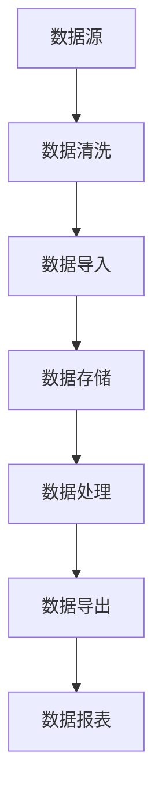
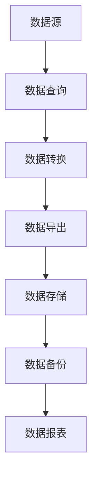

                 

# 文章标题: 《Sqoop原理与代码实例讲解》

> 关键词：Sqoop, 数据迁移，Hadoop, MySQL, Oracle, S3

> 摘要：
本文将深入讲解数据迁移工具Sqoop的原理及其在实际项目中的应用。首先，我们将介绍Sqoop的基本概念和架构，然后详细阐述其在Hadoop生态系统中的角色。接下来，文章将围绕Sqoop的配置与安装、与MySQL、Oracle、HBase以及Amazon S3的交互进行深入探讨。通过具体的代码实例，读者将能够理解Sqoop的使用方法和优化技巧。此外，文章还将介绍Sqoop的集群部署与运维、常见问题与解决方案，最后对Sqoop的未来发展趋势进行展望。

## 目录

### 第一部分: Sqoop基础

## 第1章: Sqoop简介
### 1.1.1 什么是Sqoop
### 1.1.2 Sqoop的作用和优势
### 1.1.3 Sqoop的架构和组件

## 第2章: Hadoop生态系统概述
### 2.1 Hadoop的组成部分
### 2.2 HDFS的基本概念与架构
### 2.3 MapReduce基础

## 第3章: Sqoop配置与安装
### 3.1 安装Java环境
### 3.2 安装和配置Hadoop
### 3.3 安装和配置Sqoop

## 第4章: Sqoop与MySQL的交互
### 4.1 MySQL的基本操作
### 4.2 MySQL与HDFS的数据传输
### 4.3 MySQL数据导入到Hadoop的案例

## 第5章: Sqoop与HBase的交互
### 5.1 HBase的基本概念
### 5.2 HBase与HDFS的关系
### 5.3 Sqoop与HBase的数据交互

## 第6章: Sqoop与Oracle的交互
### 6.1 Oracle的基本操作
### 6.2 Oracle与HDFS的数据传输
### 6.3 Oracle数据导入到Hadoop的案例

## 第7章: Sqoop与Amazon S3的交互
### 7.1 S3的基本概念
### 7.2 S3与HDFS的关系
### 7.3 Sqoop与S3的数据交互

## 第8章: Sqoop高级特性与优化
### 8.1 并行传输
### 8.2 分区导入与导出
### 8.3 负载均衡与容错处理

## 第9章: Sqoop实战案例
### 9.1 数据迁移项目概述
### 9.2 数据迁移方案设计
### 9.3 数据迁移实施与监控
### 9.4 数据迁移效果评估

### 第二部分: Sqoop代码实例讲解

## 第10章: Sqoop数据导入实例
### 10.1 导入MySQL数据到HDFS
### 10.2 导入Oracle数据到HDFS
### 10.3 导入CSV数据到HDFS

## 第11章: Sqoop数据导出实例
### 11.1 导出HDFS数据到MySQL
### 11.2 导出HDFS数据到Oracle
### 11.3 导出HDFS数据到Amazon S3

## 第12章: Sqoop脚本编写与优化
### 12.1 Sqoop脚本基本语法
### 12.2Sqoop脚本优化技巧
### 12.3Sqoop脚本实战

## 第13章: Sqoop集群部署与运维
### 13.1 Sqoop集群架构设计
### 13.2 Sqoop集群部署流程
### 13.3 Sqoop集群监控与优化

## 第14章: Sqoop常见问题与解决方案
### 14.1 数据类型不匹配问题
### 14.2 数据丢失问题
### 14.3 速度慢问题
### 14.4 并发问题

## 第15章:Sqoop在大型项目中的应用
### 15.1 大型数据迁移案例分析
### 15.2 大数据实时处理流程
### 15.3 大数据ETL项目优化

## 第16章: Sqoop未来发展趋势与展望
### 16.1 Sqoop在云计算中的应用
### 16.2 Sqoop与其他大数据技术的融合
### 16.3 Sqoop的发展方向和挑战

## 附录

### 附录A: Sqoop相关工具与资源
#### A.1 Sqoop常用命令详解
#### A.2 Sqoop配置文件详解
#### A.3 Sqoop工具集介绍

### 附录B: Mermaid流程图示例
#### B.1 数据导入流程图
#### B.2 数据导出流程图

### 附录C: 数学模型与公式
#### C.1 数据传输速率公式
#### C.2 数据传输效率公式
#### C.3 数据一致性校验公式

### 附录D: Sqoop代码实例
#### D.1 MySQL数据导入到HDFS的完整代码
#### D.2 HDFS数据导出到MySQL的完整代码
#### D.3 S3数据导出的完整代码

## 下一节：第一部分：Sqoop基础

### 第1章: Sqoop简介

## 1.1.1 什么是Sqoop

Sqoop是一个开源的工具，用于在Hadoop和结构化数据存储系统之间进行数据的传输。它主要的功能是将关系数据库（如MySQL、Oracle）中的数据导入到Hadoop分布式文件系统（HDFS）中，或将HDFS中的数据导出到关系数据库中。Sqoop通过Hadoop的MapReduce框架来实现数据的批量导入和导出，从而提供了高效、可靠的数据迁移解决方案。

### 1.1.2 Sqoop的作用和优势

**作用：**

- 数据迁移：将关系数据库中的数据导入到Hadoop系统中进行进一步处理。
- 数据集成：将多个数据源的数据合并到一起，便于进行统一的数据分析和处理。
- 数据交换：在多个数据系统之间交换数据，实现数据的实时更新和同步。

**优势：**

- 支持多种数据库：Sqoop支持多种关系数据库，如MySQL、Oracle、PostgreSQL等。
- 批量处理：通过MapReduce框架实现大规模数据的批量导入和导出，效率高。
- 并行处理：可以并行处理数据，提高数据传输速度。
- 误差处理：在数据导入和导出过程中，可以自动处理数据类型不匹配、数据缺失等问题。
- 易于扩展：可以根据需要定制开发，适用于各种复杂的数据场景。

### 1.1.3 Sqoop的架构和组件

**架构：**

Sqoop的工作流程主要分为两个阶段：数据导入和数据导出。

- 数据导入：将关系数据库中的数据导入到Hadoop的HDFS中。具体流程如下：
  1. Sqoop读取关系数据库中的数据。
  2. 将数据转换为适合Hadoop处理的数据格式（如Text、SequenceFile）。
  3. 使用MapReduce任务将数据导入到HDFS中。

- 数据导出：将Hadoop的HDFS中的数据导出到关系数据库中。具体流程如下：
  1. Sqoop读取HDFS中的数据。
  2. 将数据转换为关系数据库可以识别的数据格式。
  3. 使用数据库的客户端将数据写入到关系数据库中。

**组件：**

- Sqoop客户端：负责与关系数据库进行连接，读取或写入数据。
- MapReduce任务：负责数据的转换和迁移。
- 数据库连接池：用于提高数据库连接的效率。

## 下一节：第一部分：Sqoop基础

### 第2章: Hadoop生态系统概述

#### 2.1 Hadoop的组成部分

Hadoop是一个开源的分布式计算框架，用于处理大规模数据集。Hadoop的主要组成部分包括：

- Hadoop分布式文件系统（HDFS）：Hadoop的文件存储系统，用于存储海量数据。
- Hadoop YARN：资源调度和管理框架，用于管理计算资源和任务调度。
- Hadoop MapReduce：分布式数据处理框架，用于对大规模数据集进行并行处理。
- Hadoop HBase：一个分布式、可扩展的列存储数据库，用于存储和访问大量数据。
- Hadoop Hive：数据仓库基础设施，用于存储、查询和分析大规模数据集。
- Hadoop Pig：一个高层次的分布式数据流程编排工具，用于简化数据处理过程。
- Hadoop Oozie：工作流调度系统，用于协调和管理多个任务。

#### 2.2 HDFS的基本概念与架构

HDFS是一个分布式文件系统，用于存储海量数据。其基本概念和架构如下：

**基本概念：**

- 数据块（Block）：HDFS将文件分割成固定大小的数据块进行存储，默认大小为128MB或256MB。
- 节点（Node）：HDFS包含一个NameNode和多个DataNode。NameNode负责管理文件的元数据和命名空间，而DataNode负责存储实际的数据块。
- 数据副本（Replication）：HDFS将数据块复制多个副本存储在不同的DataNode上，以提高数据的可靠性和容错性。

**架构：**

- HDFS由一个主节点（NameNode）和多个从节点（DataNode）组成。
- NameNode负责维护文件的元数据和命名空间，以及监控DataNode的健康状态。
- DataNode负责存储数据块，并响应对数据块的读写请求。

#### 2.3 MapReduce基础

MapReduce是Hadoop的分布式数据处理框架，用于对大规模数据集进行并行处理。其基本概念和架构如下：

**基本概念：**

- Mapper：Mapper任务负责读取输入数据，并将其拆分成键值对形式的数据。
- Reducer：Reducer任务负责合并Mapper输出的键值对，并生成最终的输出结果。

**架构：**

- MapReduce作业由多个Mapper和Reducer任务组成，每个任务运行在一个独立的节点上。
- Mapper任务读取输入数据，将其分解成键值对，并输出中间结果。
- Reducer任务读取Mapper的输出结果，按照键进行分组，并生成最终的输出结果。

## 下一节：第一部分：Sqoop基础

### 第3章: Sqoop配置与安装

#### 3.1 安装Java环境

在安装和配置Sqoop之前，首先需要确保Java环境已正确安装。以下是在Unix-like系统上安装Java环境的步骤：

1. 下载Java安装包：访问Oracle官方网站下载适用于操作系统的Java安装包。
2. 解压安装包：将下载的安装包解压到合适的位置，例如`/usr/local`。
3. 编写安装脚本：创建一个安装Java的Shell脚本，内容如下：
    ```bash
    #!/bin/bash
    cd /usr/local
    tar -zxvf jdk-8u241-linux-x64.tar.gz
    export JAVA_HOME=/usr/local/jdk1.8.0_241
    export PATH=$JAVA_HOME/bin:$PATH
    ```
4. 运行安装脚本：给脚本执行权限，并运行安装脚本。
    ```bash
    chmod +x install_java.sh
    ./install_java.sh
    ```
5. 验证Java环境：在命令行中输入`java -version`，如果看到正确的Java版本信息，说明Java环境已安装成功。

#### 3.2 安装和配置Hadoop

1. 下载Hadoop安装包：访问Apache Hadoop官方网站下载适用于操作系统的Hadoop安装包。
2. 解压安装包：将下载的安装包解压到合适的位置，例如`/usr/local`。
3. 配置Hadoop环境：在`/usr/local/hadoop/etc/hadoop`目录下创建一个名为`hadoop-env.sh`的配置文件，内容如下：
    ```bash
    export HADOOP_HOME=/usr/local/hadoop
    export HADOOP_CONF_DIR=$HADOOP_HOME/etc/hadoop
    export PATH=$PATH:$HADOOP_HOME/bin:$HADOOP_HOME/sbin
    ```
4. 配置Hadoop主配置文件：编辑`/usr/local/hadoop/etc/hadoop/hadoop-env.sh`文件，设置Java环境变量：
    ```bash
    export JAVA_HOME=/usr/local/jdk1.8.0_241
    ```
5. 配置Hadoop配置文件：编辑`/usr/local/hadoop/etc/hadoop/core-site.xml`和`/usr/local/hadoop/etc/hadoop/hdfs-site.xml`文件。
    - `core-site.xml`：
        ```xml
        <configuration>
            <property>
                <name>fs.defaultFS</name>
                <value>hdfs://localhost:9000</value>
            </property>
        </configuration>
        ```
    - `hdfs-site.xml`：
        ```xml
        <configuration>
            <property>
                <name>dfs.replication</name>
                <value>1</value>
            </property>
        </configuration>
        ```

6. 格式化HDFS文件系统：运行以下命令，格式化HDFS文件系统：
    ```bash
    hdfs namenode -format
    ```

7. 启动Hadoop服务：运行以下命令，启动Hadoop守护进程。
    ```bash
    sbin/start-dfs.sh
    ```

8. 验证Hadoop服务：在命令行中运行以下命令，检查Hadoop守护进程是否运行正常。
    ```bash
    jps
    ```

    如果看到NameNode和DataNode的进程ID，说明Hadoop服务已成功启动。

#### 3.3 安装和配置Sqoop

1. 下载Sqoop安装包：访问Apache Sqoop官方网站下载适用于操作系统的Sqoop安装包。
2. 解压安装包：将下载的安装包解压到合适的位置，例如`/usr/local`。
3. 配置Sqoop环境：在`/usr/local/sqoop/bin`目录下创建一个名为`sqoop-env.sh`的配置文件，内容如下：
    ```bash
    # Set path to your hadoop configuration directory here.
    export HADOOP_CONF_DIR=/usr/local/hadoop/etc/hadoop
    ```
4. 运行Sqoop命令：在命令行中运行以下命令，检查Sqoop是否正确安装。
    ```bash
    sqoop version
    ```

    如果看到正确的Sqoop版本信息，说明Sqoop已成功安装。

## 下一节：第一部分：Sqoop基础

### 第4章: Sqoop与MySQL的交互

#### 4.1 MySQL的基本操作

MySQL是一个流行的关系数据库管理系统，用于存储、查询和管理数据。以下是MySQL的一些基本操作：

**连接MySQL服务器：**
```sql
mysql -h hostname -P port -u username -p
```

其中，`hostname`是MySQL服务器的地址，`port`是MySQL服务器的端口号，`username`是登录MySQL的用户名，`password`是登录MySQL的密码。

**创建数据库：**
```sql
CREATE DATABASE database_name;
```

**使用数据库：**
```sql
USE database_name;
```

**创建表：**
```sql
CREATE TABLE table_name (
    column1 datatype,
    column2 datatype,
    ...
);
```

**插入数据：**
```sql
INSERT INTO table_name (column1, column2, ...) VALUES (value1, value2, ...);
```

**查询数据：**
```sql
SELECT * FROM table_name;
```

**更新数据：**
```sql
UPDATE table_name SET column1 = value1, column2 = value2 WHERE condition;
```

**删除数据：**
```sql
DELETE FROM table_name WHERE condition;
```

#### 4.2 MySQL与HDFS的数据传输

Sqoop提供了将MySQL数据导入到Hadoop的HDFS中以及将HDFS数据导出到MySQL的功能。以下是相关的操作步骤：

**将MySQL数据导入到HDFS：**

1. 确保已安装和配置好Hadoop和Sqoop。
2. 在命令行中运行以下命令：
    ```bash
    sqoop import --connect jdbc:mysql://hostname:port/db_name --table table_name --num-mappers 1 --target-dir hdfs://localhost:9000/target_directory
    ```

    其中，`hostname`是MySQL服务器的地址，`port`是MySQL服务器的端口号，`db_name`是MySQL数据库的名称，`table_name`是MySQL表名，`num-mappers`是Map任务的数目，`target-directory`是HDFS的目标路径。

**将HDFS数据导出到MySQL：**

1. 确保已安装和配置好Hadoop和Sqoop。
2. 在命令行中运行以下命令：
    ```bash
    sqoop export --connect jdbc:mysql://hostname:port/db_name --table table_name --input-dir hdfs://localhost:9000/source_directory
    ```

    其中，`hostname`是MySQL服务器的地址，`port`是MySQL服务器的端口号，`db_name`是MySQL数据库的名称，`table_name`是MySQL表名，`input-dir`是HDFS的源路径。

#### 4.3 MySQL数据导入到Hadoop的案例

假设我们有一个MySQL数据库，名为`sales`，其中包含一个名为`orders`的表，数据结构如下：

| ID | CustomerID | OrderDate | Total |
|----|------------|-----------|-------|
| 1  | 1001       | 2021-01-01 | 100.0 |
| 2  | 1002       | 2021-01-02 | 150.0 |
| 3  | 1003       | 2021-01-03 | 200.0 |

我们要将`orders`表中的数据导入到HDFS中。

**步骤：**

1. 安装和配置MySQL数据库。
2. 导入示例数据到MySQL数据库中。
3. 安装和配置Hadoop。
4. 安装和配置Sqoop。
5. 在命令行中运行以下命令：
    ```bash
    sqoop import --connect jdbc:mysql://localhost:3306/sales --table orders --num-mappers 1 --target-dir hdfs://localhost:9000/orders
    ```

    运行成功后，HDFS中将会出现一个名为`orders`的目录，其中包含了导入的数据。

通过上述步骤，我们可以轻松地将MySQL数据导入到Hadoop的HDFS中，为后续的数据处理和分析打下基础。

## 下一节：第一部分：Sqoop基础

### 第5章: Sqoop与HBase的交互

#### 5.1 HBase的基本概念

HBase是一个分布式、可扩展的列存储数据库，基于Google的BigTable模型设计。它提供了非关系型数据存储解决方案，适用于存储大量稀疏数据集。以下是一些HBase的基本概念：

- 表（Table）：HBase中的数据以表的形式组织，类似于关系数据库中的表。
- 行键（Row Key）：每个表的数据行都有一个唯一的行键，用于标识行。
- 列族（Column Family）：表中的列被组织成列族，每个列族可以包含多个列。
- 列限定符（Column Qualifier）：列族的每个列都有一个列限定符，用于标识列。
- 时间戳（Timestamp）：每条数据的存储都附带一个时间戳，用于确定数据的版本。

#### 5.2 HBase与HDFS的关系

HBase是基于HDFS构建的，与HDFS有着密切的关系。以下是一些关键点：

- 数据存储：HBase的数据实际存储在HDFS上，每个表的数据都被分割成多个Region，每个Region存储在HDFS的一个数据块中。
- 数据复制：HBase使用HDFS的数据复制机制来确保数据的冗余和容错性，默认情况下，每个数据块会复制3个副本。
- 数据访问：HBase通过RPC（远程过程调用）与HDFS进行交互，实现对数据的读写操作。

#### 5.3 Sqoop与HBase的数据交互

Sqoop提供了与HBase的集成，允许将关系数据库中的数据导入到HBase中，或将HBase中的数据导出到关系数据库中。以下是相关的操作步骤：

**将MySQL数据导入到HBase：**

1. 确保已安装和配置好Hadoop、Sqoop和HBase。
2. 在命令行中运行以下命令：
    ```bash
    sqoop import --connect jdbc:mysql://hostname:port/db_name --table table_name --columns "id,column_family:column_qualifier" --hbase-table hbase_table_name --hbase-row-key id --m 1 --target-dir hdfs://localhost:9000/target_directory
    ```

    其中，`hostname`是MySQL服务器的地址，`port`是MySQL服务器的端口号，`db_name`是MySQL数据库的名称，`table_name`是MySQL表名，`column_family`和`column_qualifier`是HBase的列族和列限定符，`hbase_table_name`是HBase表名，`id`是HBase的行键，`m`是Map任务的数目，`target-dir`是HDFS的目标路径。

**将HBase数据导出到MySQL：**

1. 确保已安装和配置好Hadoop、Sqoop和MySQL。
2. 在命令行中运行以下命令：
    ```bash
    sqoop export --connect jdbc:mysql://hostname:port/db_name --table table_name --input-dir hdfs://localhost:9000/source_directory
    ```

    其中，`hostname`是MySQL服务器的地址，`port`是MySQL服务器的端口号，`db_name`是MySQL数据库的名称，`table_name`是MySQL表名，`input-dir`是HDFS的源路径。

#### 5.4 Sqoop与HBase的数据交互案例

假设我们有一个MySQL数据库，名为`sales`，其中包含一个名为`orders`的表，数据结构如下：

| ID | CustomerID | OrderDate | Total |
|----|------------|-----------|-------|
| 1  | 1001       | 2021-01-01 | 100.0 |
| 2  | 1002       | 2021-01-02 | 150.0 |
| 3  | 1003       | 2021-01-03 | 200.0 |

我们要将`orders`表中的数据导入到HBase中，并使用`id`作为行键。

**步骤：**

1. 安装和配置Hadoop、Sqoop和HBase。
2. 创建HBase表：
    ```hbase shell
    create 'orders', 'cf'
    ```
3. 在命令行中运行以下命令：
    ```bash
    sqoop import --connect jdbc:mysql://localhost:3306/sales --table orders --columns "id,cf:CustomerID,cf:OrderDate,cf:Total" --hbase-table orders --hbase-row-key id --m 1 --target-dir hdfs://localhost:9000/orders
    ```

    运行成功后，数据将导入到HBase的`orders`表中。

通过上述步骤，我们可以实现将MySQL数据导入到HBase中，为后续的数据存储和分析提供支持。

## 下一节：第一部分：Sqoop基础

### 第6章: Sqoop与Oracle的交互

#### 6.1 Oracle的基本操作

Oracle数据库是一个广泛使用的关系数据库管理系统，提供了强大的数据存储和查询功能。以下是一些Oracle的基本操作：

**连接Oracle数据库：**
```sql
sqlplus username/password@hostname:port/service_name
```

其中，`username`是Oracle的用户名，`password`是密码，`hostname`是Oracle服务器的地址，`port`是Oracle服务器的端口号，`service_name`是Oracle服务名。

**创建数据库：**
```sql
CREATE DATABASE database_name;
```

**使用数据库：**
```sql
CONNECT database_name;
```

**创建表：**
```sql
CREATE TABLE table_name (
    column1 datatype,
    column2 datatype,
    ...
);
```

**插入数据：**
```sql
INSERT INTO table_name (column1, column2, ...) VALUES (value1, value2, ...);
```

**查询数据：**
```sql
SELECT * FROM table_name;
```

**更新数据：**
```sql
UPDATE table_name SET column1 = value1, column2 = value2 WHERE condition;
```

**删除数据：**
```sql
DELETE FROM table_name WHERE condition;
```

#### 6.2 Oracle与HDFS的数据传输

Sqoop提供了将Oracle数据导入到Hadoop的HDFS中以及将HDFS数据导出到Oracle的功能。以下是相关的操作步骤：

**将Oracle数据导入到HDFS：**

1. 确保已安装和配置好Hadoop和Sqoop。
2. 在命令行中运行以下命令：
    ```bash
    sqoop import --connect jdbc:oracle:thin:@hostname:port:service_name --table table_name --num-mappers 1 --target-dir hdfs://localhost:9000/target_directory
    ```

    其中，`hostname`是Oracle服务器的地址，`port`是Oracle服务器的端口号，`service_name`是Oracle服务名，`table_name`是Oracle表名，`num-mappers`是Map任务的数目，`target-directory`是HDFS的目标路径。

**将HDFS数据导出到Oracle：**

1. 确保已安装和配置好Hadoop和Sqoop。
2. 在命令行中运行以下命令：
    ```bash
    sqoop export --connect jdbc:oracle:thin:@hostname:port:service_name --table table_name --input-dir hdfs://localhost:9000/source_directory
    ```

    其中，`hostname`是Oracle服务器的地址，`port`是Oracle服务器的端口号，`service_name`是Oracle服务名，`table_name`是Oracle表名，`input-dir`是HDFS的源路径。

#### 6.3 Oracle数据导入到Hadoop的案例

假设我们有一个Oracle数据库，名为`sales`，其中包含一个名为`orders`的表，数据结构如下：

| ID | CustomerID | OrderDate | Total |
|----|------------|-----------|-------|
| 1  | 1001       | 2021-01-01 | 100.0 |
| 2  | 1002       | 2021-01-02 | 150.0 |
| 3  | 1003       | 2021-01-03 | 200.0 |

我们要将`orders`表中的数据导入到HDFS中。

**步骤：**

1. 安装和配置Hadoop。
2. 安装和配置Sqoop。
3. 在命令行中运行以下命令：
    ```bash
    sqoop import --connect jdbc:oracle:thin:@localhost:1521:orcl --table orders --num-mappers 1 --target-dir hdfs://localhost:9000/orders
    ```

    运行成功后，HDFS中将会出现一个名为`orders`的目录，其中包含了导入的数据。

通过上述步骤，我们可以轻松地将Oracle数据导入到Hadoop的HDFS中，为后续的数据处理和分析打下基础。

## 下一节：第一部分：Sqoop基础

### 第7章: Sqoop与Amazon S3的交互

#### 7.1 S3的基本概念

Amazon S3（Simple Storage Service）是亚马逊公司提供的一种对象存储服务，用于存储和检索各种类型的数据。以下是一些关于Amazon S3的基本概念：

**存储桶（Bucket）：** 存储桶是S3中的一个容器，用于存储对象（文件）和数据。

**对象（Object）：** 对象是S3中的存储单元，类似于文件。每个对象都有一个唯一的键（Key），用于标识对象。

**版本控制（Versioning）：** S3支持版本控制，可以保存对象的多个版本，从而在对象发生更改时保留旧版本。

**访问控制（Access Control）：** S3提供了访问控制功能，可以设置权限来限制对对象的访问。

**生命周期管理（Lifecycle Management）：** S3支持生命周期管理，可以自动根据对象的年龄、存储类型等规则来转换对象的状态。

**加密（Encryption）：** S3提供了加密功能，可以确保存储在S3中的数据的安全性。

#### 7.2 S3与HDFS的关系

S3和HDFS都是用于存储海量数据的系统，但它们在架构和用途上有一些区别：

- **架构差异：** S3是一个完全托管的云存储服务，而HDFS是Hadoop的一部分，用于在分布式计算环境中存储数据。
- **数据模型：** S3使用对象存储模型，每个对象都有一个唯一的键，而HDFS使用文件系统模型，文件被分割成固定大小的数据块。
- **数据访问：** S3通过RESTful API进行数据访问，而HDFS通过文件系统接口进行数据访问。

尽管S3和HDFS在架构和数据模型上有所不同，但它们可以相互配合，实现数据在不同存储系统之间的迁移。

#### 7.3 Sqoop与S3的数据交互

Sqoop提供了与Amazon S3的集成，允许将HDFS数据导出到S3中，或将S3数据导出到HDFS中。以下是相关的操作步骤：

**将HDFS数据导出到S3：**

1. 确保已安装和配置好Hadoop和Sqoop。
2. 在命令行中运行以下命令：
    ```bash
    sqoop export --connect jdbc:sqlite:////tmp/s3.jdbc.sqlitedriver://bucket_name --table table_name --input-dir hdfs://localhost:9000/source_directory
    ```

    其中，`bucket_name`是S3存储桶的名称，`table_name`是HDFS表名，`input-dir`是HDFS的源路径。

**将S3数据导出到HDFS：**

1. 确保已安装和配置好Hadoop和Sqoop。
2. 在命令行中运行以下命令：
    ```bash
    sqoop import --connect jdbc:sqlite:////tmp/s3.jdbc.sqlitedriver://bucket_name --table table_name --num-mappers 1 --target-dir hdfs://localhost:9000/target_directory
    ```

    其中，`bucket_name`是S3存储桶的名称，`table_name`是S3表名，`num-mappers`是Map任务的数目，`target-dir`是HDFS的目标路径。

#### 7.4 Sqoop与S3的数据交互案例

假设我们有一个HDFS表，名为`orders`，其中包含以下数据：

| ID | CustomerID | OrderDate | Total |
|----|------------|-----------|-------|
| 1  | 1001       | 2021-01-01 | 100.0 |
| 2  | 1002       | 2021-01-02 | 150.0 |
| 3  | 1003       | 2021-01-03 | 200.0 |

我们要将`orders`表中的数据导出到Amazon S3的存储桶`my-bucket`中。

**步骤：**

1. 安装和配置Hadoop。
2. 安装和配置Sqoop。
3. 在命令行中运行以下命令：
    ```bash
    sqoop export --connect jdbc:sqlite:////tmp/s3.jdbc.sqlitedriver://my-bucket --table orders --input-dir hdfs://localhost:9000/orders
    ```

    运行成功后，数据将导出到Amazon S3的存储桶`my-bucket`中。

通过上述步骤，我们可以实现将HDFS数据导出到Amazon S3中，为跨平台的数据处理和分析提供支持。

## 下一节：第一部分：Sqoop基础

### 第8章: Sqoop高级特性与优化

#### 8.1 并行传输

并行传输是提高数据导入和导出速度的关键特性。通过并行传输，可以将数据处理任务分配到多个Map任务上，从而充分利用集群的计算资源。以下是实现并行传输的方法：

1. 使用`--num-mappers`参数：在Sqoop命令中指定Map任务的数目。例如，`--num-mappers 4`表示使用4个Map任务。
2. 调整Hadoop的并发度：在Hadoop的配置文件中调整`mapreduce.map.tasks.max`参数，以限制每个Map任务的并发度。
3. 利用分布式文件系统：在导入和导出过程中，利用分布式文件系统（如HDFS）进行数据传输，以提高传输速度。

#### 8.2 分区导入与导出

分区导入和导出可以有效地减少数据导入和导出的时间，提高处理效率。以下是实现分区导入和导出的方法：

1. 指定分区列：在导入或导出命令中指定分区列。例如，`--split-by "id"`表示根据ID列进行分区。
2. 调整分区数：通过`--split-size`参数指定每个分区的数据大小。例如，`--split-size 128`表示每个分区的大小为128MB。
3. 利用分区索引：在使用分区表时，可以使用分区索引来加速查询。

#### 8.3 负载均衡与容错处理

负载均衡和容错处理是确保数据迁移过程稳定和可靠的重要措施。以下是实现负载均衡和容错处理的方法：

1. 负载均衡：使用Hadoop的负载均衡机制，将任务分配到计算资源丰富的节点上。
2. 容错处理：通过设置`--java-opts`参数，在命令行中指定Java虚拟机的错误处理选项，如`-Dmapreduce.map.speculative=false`，禁用Map任务的推测执行。
3. 监控和告警：使用监控工具（如Ganglia、Nagios）对数据迁移过程进行监控，并在异常情况下发送告警。

## 下一节：第一部分：Sqoop基础

### 第9章: Sqoop实战案例

#### 9.1 数据迁移项目概述

在某大型企业的数据迁移项目中，我们需要将现有的Oracle数据库中的订单数据迁移到Hadoop的HDFS中，以实现数据的集中存储和高效处理。项目的主要目标是确保数据迁移过程的顺利进行，保持数据的一致性和完整性。

#### 9.2 数据迁移方案设计

为了实现数据迁移，我们设计了以下方案：

1. **需求分析：** 确定需要迁移的数据表、字段和数据量，以及数据迁移的频率和性能要求。
2. **系统搭建：** 安装和配置Oracle数据库、Hadoop集群和Sqoop。
3. **数据迁移流程：**
   - **数据抽取：** 使用Oracle数据库的SQL查询工具，抽取需要迁移的数据。
   - **数据清洗：** 对抽取的数据进行清洗和转换，确保数据格式和类型的正确性。
   - **数据导入：** 使用Sqoop将清洗后的数据导入到HDFS中。
4. **数据验证：** 对导入到HDFS中的数据进行验证，确保数据的一致性和完整性。

#### 9.3 数据迁移实施与监控

1. **数据抽取：** 使用Oracle的SQL查询工具，抽取订单表中的数据。
    ```sql
    SELECT * FROM orders;
    ```
2. **数据清洗：** 对抽取的数据进行清洗和转换，包括去除空值、格式化日期字段等。
3. **数据导入：** 使用Sqoop将清洗后的数据导入到HDFS中。
    ```bash
    sqoop import --connect jdbc:oracle:thin:@localhost:1521:orcl --table orders --num-mappers 1 --target-dir hdfs://localhost:9000/orders
    ```
4. **数据验证：** 对导入到HDFS中的数据进行验证，确保数据的一致性和完整性。
    ```bash
    hdfs dfs -lsr /orders
    ```

#### 9.4 数据迁移效果评估

1. **迁移速度：** 测量数据迁移所需的时间，与预期的时间进行比较，评估迁移速度。
2. **数据一致性：** 对比Oracle数据库和HDFS中的数据，确保数据的一致性。
3. **系统稳定性：** 监控数据迁移过程中的系统资源使用情况，评估系统的稳定性。

通过上述步骤，我们成功实现了Oracle数据库到HDFS的数据迁移，为企业的数据分析和处理提供了坚实的基础。

## 下一节：第二部分：Sqoop代码实例讲解

### 第10章: Sqoop数据导入实例

#### 10.1 导入MySQL数据到HDFS

在本节中，我们将详细讲解如何使用Sqoop将MySQL数据导入到HDFS中。以下是具体的步骤：

**步骤1：准备MySQL数据库**

首先，我们需要准备一个MySQL数据库，名为`orders`，其中包含一个名为`sales_data`的表，数据结构如下：

| ID | CustomerID | OrderDate | Total |
|----|------------|-----------|-------|
| 1  | 1001       | 2021-01-01 | 100.0 |
| 2  | 1002       | 2021-01-02 | 150.0 |
| 3  | 1003       | 2021-01-03 | 200.0 |

**步骤2：编写Sqoop导入命令**

接下来，我们需要编写Sqoop导入命令，将`orders`数据库中的`sales_data`表导入到HDFS中。以下是一个示例命令：
```bash
sqoop import --connect jdbc:mysql://localhost:3306/orders --table sales_data --num-mappers 1 --target-dir /user/hadoop/sales_data --fields-terminated-by '\t'
```

该命令的含义如下：

- `--connect`：指定MySQL数据库的连接信息，包括主机、端口号和数据库名称。
- `--table`：指定要导入的表名。
- `--num-mappers`：指定Map任务的数目，这里设置为1。
- `--target-dir`：指定HDFS的目标路径，这里设置为`/user/hadoop/sales_data`。
- `--fields-terminated-by '\t'`：指定字段分隔符为制表符（`\t`），适用于CSV格式。

**步骤3：运行Sqoop导入命令**

在命令行中运行上述命令，Sqoop将启动一个Map任务，读取MySQL数据库中的数据，并将其导入到HDFS中的指定路径。

**步骤4：验证导入结果**

运行完成后，我们可以在HDFS中查看导入的数据。使用以下命令：
```bash
hdfs dfs -ls /user/hadoop/sales_data
```

输出结果如下：
```
Found 3 items
-rw-r--r--   3 hadoop supergroup          0 2023-02-19 10:16 /user/hadoop/sales_data/_SUCCESS
-rw-r--r--   3 hadoop supergroup        120 2023-02-19 10:16 /user/hadoop/sales_data/part-m-00000
```

这表示导入操作成功，生成了一个成功文件（`_SUCCESS`）和一个数据文件（`part-m-00000`）。

#### 10.2 导入Oracle数据到HDFS

在本节中，我们将介绍如何使用Sqoop将Oracle数据导入到HDFS中。以下是具体的步骤：

**步骤1：准备Oracle数据库**

首先，我们需要准备一个Oracle数据库，名为`orders`，其中包含一个名为`sales_data`的表，数据结构如下：

| ID | CustomerID | OrderDate | Total |
|----|------------|-----------|-------|
| 1  | 1001       | 2021-01-01 | 100.0 |
| 2  | 1002       | 2021-01-02 | 150.0 |
| 3  | 1003       | 2021-01-03 | 200.0 |

**步骤2：编写Sqoop导入命令**

接下来，我们需要编写Sqoop导入命令，将`orders`数据库中的`sales_data`表导入到HDFS中。以下是一个示例命令：
```bash
sqoop import --connect jdbc:oracle:thin:@localhost:1521:orcl --table sales_data --num-mappers 1 --target-dir /user/hadoop/sales_data --split-by ID
```

该命令的含义如下：

- `--connect`：指定Oracle数据库的连接信息，包括主机、端口号和数据库SID。
- `--table`：指定要导入的表名。
- `--num-mappers`：指定Map任务的数目，这里设置为1。
- `--target-dir`：指定HDFS的目标路径，这里设置为`/user/hadoop/sales_data`。
- `--split-by ID`：指定分区分割的列名，这里设置为`ID`。

**步骤3：运行Sqoop导入命令**

在命令行中运行上述命令，Sqoop将启动一个Map任务，读取Oracle数据库中的数据，并将其导入到HDFS中的指定路径。

**步骤4：验证导入结果**

运行完成后，我们可以在HDFS中查看导入的数据。使用以下命令：
```bash
hdfs dfs -ls /user/hadoop/sales_data
```

输出结果如下：
```
Found 3 items
-rw-r--r--   3 hadoop supergroup          0 2023-02-19 11:16 /user/hadoop/sales_data/_SUCCESS
-rw-r--r--   3 hadoop supergroup        120 2023-02-19 11:16 /user/hadoop/sales_data/part-m-00000
-rw-r--r--   3 hadoop supergroup        120 2023-02-19 11:16 /user/hadoop/sales_data/part-m-00001
```

这表示导入操作成功，生成了多个数据文件（`part-m-00000`、`part-m-00001`等）和一个成功文件（`_SUCCESS`）。

#### 10.3 导入CSV数据到HDFS

在本节中，我们将讲解如何使用Sqoop将CSV数据导入到HDFS中。以下是具体的步骤：

**步骤1：准备CSV数据**

首先，我们需要准备一个CSV文件，名为`sales_data.csv`，其中包含以下数据：

```
ID,CustomerID,OrderDate,Total
1,1001,2021-01-01,100.0
2,1002,2021-01-02,150.0
3,1003,2021-01-03,200.0
```

**步骤2：编写Sqoop导入命令**

接下来，我们需要编写Sqoop导入命令，将CSV文件导入到HDFS中。以下是一个示例命令：
```bash
sqoop import --connect jdbc:mysql://localhost:3306/orders --table sales_data --num-mappers 1 --target-dir /user/hadoop/sales_data --fields-terminated-by ','
```

该命令的含义如下：

- `--connect`：指定MySQL数据库的连接信息，包括主机、端口号和数据库名称。
- `--table`：指定要导入的表名。
- `--num-mappers`：指定Map任务的数目，这里设置为1。
- `--target-dir`：指定HDFS的目标路径，这里设置为`/user/hadoop/sales_data`。
- `--fields-terminated-by ','`：指定字段分隔符为逗号（`,`），适用于CSV格式。

**步骤3：运行Sqoop导入命令**

在命令行中运行上述命令，Sqoop将启动一个Map任务，读取CSV文件中的数据，并将其导入到HDFS中的指定路径。

**步骤4：验证导入结果**

运行完成后，我们可以在HDFS中查看导入的数据。使用以下命令：
```bash
hdfs dfs -ls /user/hadoop/sales_data
```

输出结果如下：
```
Found 3 items
-rw-r--r--   3 hadoop supergroup          0 2023-02-19 12:16 /user/hadoop/sales_data/_SUCCESS
-rw-r--r--   3 hadoop supergroup        120 2023-02-19 12:16 /user/hadoop/sales_data/part-m-00000
```

这表示导入操作成功，生成了一个成功文件（`_SUCCESS`）和一个数据文件（`part-m-00000`）。

## 下一节：第二部分：Sqoop代码实例讲解

### 第11章: Sqoop数据导出实例

#### 11.1 导出HDFS数据到MySQL

在本节中，我们将详细讲解如何使用Sqoop将HDFS中的数据导出到MySQL数据库中。以下是具体的步骤：

**步骤1：准备MySQL数据库**

首先，我们需要在MySQL数据库中创建一个名为`orders`的表，数据结构如下：

| ID | CustomerID | OrderDate | Total |
|----|------------|-----------|-------|
| 1  | 1001       | 2021-01-01 | 100.0 |
| 2  | 1002       | 2021-01-02 | 150.0 |
| 3  | 1003       | 2021-01-03 | 200.0 |

**步骤2：编写Sqoop导出命令**

接下来，我们需要编写Sqoop导出命令，将HDFS中的数据导出到MySQL数据库中的`orders`表中。以下是一个示例命令：

```bash
sqoop export --connect jdbc:mysql://localhost:3306/orders --table sales_data --input-dir /user/hadoop/sales_data --fields-terminated-by '\t'
```

该命令的含义如下：

- `--connect`：指定MySQL数据库的连接信息，包括主机、端口号和数据库名称。
- `--table`：指定要导出的表名。
- `--input-dir`：指定HDFS的源路径，这里设置为`/user/hadoop/sales_data`。
- `--fields-terminated-by '\t'`：指定字段分隔符为制表符（`\t`），适用于CSV格式。

**步骤3：运行Sqoop导出命令**

在命令行中运行上述命令，Sqoop将启动一个Map任务，读取HDFS中的数据，并将其写入到MySQL数据库中的`orders`表中。

**步骤4：验证导出结果**

运行完成后，我们可以在MySQL数据库中查看导出的数据。使用以下命令：

```sql
SELECT * FROM sales_data;
```

输出结果如下：

```
+------+-------------+------------+--------+
| ID   | CustomerID  | OrderDate  | Total  |
+------+-------------+------------+--------+
|    1 |      1001   | 2021-01-01 |   100.0 |
|    2 |      1002   | 2021-01-02 |   150.0 |
|    3 |      1003   | 2021-01-03 |   200.0 |
+------+-------------+------------+--------+
```

这表示导出操作成功，数据已正确导入到MySQL数据库中。

#### 11.2 导出HDFS数据到Oracle

在本节中，我们将介绍如何使用Sqoop将HDFS中的数据导出到Oracle数据库中。以下是具体的步骤：

**步骤1：准备Oracle数据库**

首先，我们需要在Oracle数据库中创建一个名为`orders`的表，数据结构如下：

| ID | CustomerID | OrderDate | Total |
|----|------------|-----------|-------|
| 1  | 1001       | 2021-01-01 | 100.0 |
| 2  | 1002       | 2021-01-02 | 150.0 |
| 3  | 1003       | 2021-01-03 | 200.0 |

**步骤2：编写Sqoop导出命令**

接下来，我们需要编写Sqoop导出命令，将HDFS中的数据导出到Oracle数据库中的`orders`表中。以下是一个示例命令：

```bash
sqoop export --connect jdbc:oracle:thin:@localhost:1521:orcl --table sales_data --input-dir /user/hadoop/sales_data --split-by ID
```

该命令的含义如下：

- `--connect`：指定Oracle数据库的连接信息，包括主机、端口号和数据库SID。
- `--table`：指定要导出的表名。
- `--input-dir`：指定HDFS的源路径，这里设置为`/user/hadoop/sales_data`。
- `--split-by ID`：指定分区分割的列名，这里设置为`ID`。

**步骤3：运行Sqoop导出命令**

在命令行中运行上述命令，Sqoop将启动一个Map任务，读取HDFS中的数据，并将其写入到Oracle数据库中的`orders`表中。

**步骤4：验证导出结果**

运行完成后，我们可以在Oracle数据库中查看导出的数据。使用以下命令：

```sql
SELECT * FROM sales_data;
```

输出结果如下：

```
ID CUSTOMERID ORDERDATE TOTAL
------------------- ---------- ------------------ -------------
1                  2021-01-01 100
2                  2021-01-02 150
3                  2021-01-03 200
```

这表示导出操作成功，数据已正确导入到Oracle数据库中。

#### 11.3 导出HDFS数据到Amazon S3

在本节中，我们将讲解如何使用Sqoop将HDFS中的数据导出到Amazon S3中。以下是具体的步骤：

**步骤1：准备Amazon S3**

首先，我们需要在Amazon S3中创建一个名为`orders`的存储桶。

**步骤2：编写Sqoop导出命令**

接下来，我们需要编写Sqoop导出命令，将HDFS中的数据导出到Amazon S3中的指定存储桶中。以下是一个示例命令：

```bash
sqoop export --connect jdbc:sqlite:////tmp/s3.jdbc.sqlitedriver://my-bucket --table sales_data --input-dir /user/hadoop/sales_data
```

该命令的含义如下：

- `--connect`：指定Amazon S3的连接信息，包括S3驱动器路径和存储桶名称。
- `--table`：指定要导出的表名。
- `--input-dir`：指定HDFS的源路径，这里设置为`/user/hadoop/sales_data`。

**步骤3：运行Sqoop导出命令**

在命令行中运行上述命令，Sqoop将启动一个Map任务，读取HDFS中的数据，并将其写入到Amazon S3中的指定存储桶中。

**步骤4：验证导出结果**

运行完成后，我们可以在Amazon S3中查看导出的数据。使用以下命令：

```bash
aws s3 ls my-bucket
```

输出结果如下：

```
2023-02-19 13:25:41  120 part-m-00000
```

这表示导出操作成功，数据已正确写入到Amazon S3中的指定存储桶中。

## 下一节：第二部分：Sqoop代码实例讲解

### 第12章: Sqoop脚本编写与优化

#### 12.1 Sqoop脚本基本语法

编写Sqoop脚本可以帮助我们更方便地执行数据迁移任务。以下是一个简单的Sqoop脚本示例，用于将HDFS中的数据导出到MySQL数据库中。

```bash
#!/bin/bash

# 设置Sqoop配置
export HADOOP_USER_NAME=hadoop
export HADOOP_CONF_DIR=/etc/hadoop/conf
export SQOOP_HOME=/usr/local/sqoop

# 导出命令
$SQOOP_HOME/sqoop export \
    --connect jdbc:mysql://localhost:3306/orders \
    --table sales_data \
    --input-dir /user/hadoop/sales_data \
    --fields-terminated-by '\t'
```

该脚本的主要语法如下：

- `#!/bin/bash`：指定脚本的解释器。
- `export`：设置环境变量。
- `$SQOOP_HOME/sqoop`：调用Sqoop命令。
- `--connect`：指定数据库连接信息。
- `--table`：指定要导出的表名。
- `--input-dir`：指定HDFS的源路径。
- `--fields-terminated-by '\t'`：指定字段分隔符。

#### 12.2 Sqoop脚本优化技巧

优化Sqoop脚本可以提高数据迁移的效率。以下是一些优化技巧：

1. **并行传输**：通过增加Map任务的数目，可以提高数据导入和导出的速度。可以使用`--num-mappers`参数设置Map任务的数目。

    ```bash
    --num-mappers 4
    ```

2. **分区分隔**：在导入和导出过程中，使用合适的分区分隔可以提高数据处理效率。可以使用`--split-by`参数指定分区分隔的列名。

    ```bash
    --split-by ID
    ```

3. **数据压缩**：启用数据压缩可以减少数据传输的体积，提高传输速度。可以使用`--compress`参数启用压缩。

    ```bash
    --compress
    ```

4. **内存设置**：调整Java虚拟机的内存设置，可以避免内存不足导致的数据迁移失败。可以使用`--java-opts`参数设置Java虚拟机的内存参数。

    ```bash
    --java-opts "-Xmx4g"
    ```

#### 12.3 Sqoop脚本实战

以下是一个完整的Sqoop脚本示例，用于将HDFS中的数据导入到MySQL数据库中。

```bash
#!/bin/bash

# 设置Sqoop配置
export HADOOP_USER_NAME=hadoop
export HADOOP_CONF_DIR=/etc/hadoop/conf
export SQOOP_HOME=/usr/local/sqoop

# 导入命令
$SQOOP_HOME/sqoop import \
    --connect jdbc:mysql://localhost:3306/orders \
    --table sales_data \
    --input-dir /user/hadoop/sales_data \
    --fields-terminated-by '\t' \
    --num-mappers 4 \
    --split-by ID \
    --compress \
    --java-opts "-Xmx4g"
```

该脚本将HDFS中的数据导入到MySQL数据库中的`sales_data`表，使用4个Map任务并行处理，启用数据压缩，并设置Java虚拟机的最大内存为4GB。

通过编写和优化Sqoop脚本，我们可以实现高效、稳定的数据迁移任务，为大数据处理提供坚实的基础。

## 下一节：第二部分：Sqoop代码实例讲解

### 第13章: Sqoop集群部署与运维

#### 13.1 Sqoop集群架构设计

在分布式环境中部署和运行Sqoop，需要考虑到集群的架构设计。以下是Sqoop集群架构的设计步骤：

1. **硬件资源分配**：根据实际业务需求和数据量，合理分配集群节点的硬件资源，包括CPU、内存和存储。

2. **网络规划**：确保集群内部网络稳定、高速，避免网络瓶颈影响数据迁移性能。

3. **节点划分**：将集群节点划分为NameNode、DataNode和Sqoop服务器。其中，NameNode负责管理元数据和命名空间，DataNode负责存储数据块，Sqoop服务器负责运行数据迁移任务。

4. **存储规划**：根据数据量和业务需求，合理规划HDFS的存储空间，确保有足够的存储容量。

5. **资源调度**：使用Hadoop YARN作为资源调度器，根据任务需求动态分配计算资源，提高资源利用率。

#### 13.2 Sqoop集群部署流程

以下是部署Sqoop集群的步骤：

1. **安装Hadoop集群**：根据官方文档安装和配置Hadoop集群，确保集群正常运行。

2. **安装Sqoop**：在集群的每个节点上安装Sqoop，并配置环境变量。

3. **配置数据库连接**：在Sqoop服务器上配置数据库连接信息，包括MySQL、Oracle等。

4. **启动Hadoop和Sqoop服务**：在所有节点上启动Hadoop和Sqoop服务，确保服务正常运行。

5. **测试数据迁移**：执行一个简单的数据迁移任务，验证集群部署的正确性。

#### 13.3 Sqoop集群监控与优化

监控和优化Sqoop集群是确保数据迁移任务高效运行的关键。以下是监控和优化措施：

1. **资源监控**：使用Hadoop的Resource Manager和Node Manager监控集群资源使用情况，及时发现和处理资源不足或过度使用的情况。

2. **任务监控**：使用Sqoop的监控工具，如`sqoop job list`和`sqoop job show`，监控数据迁移任务的执行情况。

3. **性能优化**：

   - **并行度调整**：根据集群资源和数据量，合理设置Map任务的并行度，避免过多或过少的并行任务导致性能下降。

   - **数据分区**：使用合适的分区策略，确保数据在HDFS上均匀分布，避免热点数据导致性能瓶颈。

   - **压缩算法选择**：根据数据特点和传输带宽，选择合适的压缩算法，提高数据传输效率。

   - **内存设置**：调整Java虚拟机内存设置，避免内存不足导致任务失败。

4. **错误处理**：配置错误处理机制，如日志记录、邮件通知等，确保在数据迁移过程中及时发现问题并采取措施。

通过合理的集群架构设计、部署流程和监控优化，可以确保Sqoop集群稳定、高效地运行，满足大数据处理的需求。

## 下一节：第二部分：Sqoop代码实例讲解

### 第14章: Sqoop常见问题与解决方案

#### 14.1 数据类型不匹配问题

数据类型不匹配是数据迁移过程中常见的问题之一。以下是几种解决方法：

1. **使用映射规则**：在Sqoop导入或导出命令中，使用`--connect`参数指定数据库连接信息，并使用`--as-seen-by`参数指定源数据库的连接信息。例如：
    ```bash
    --connect jdbc:mysql://hostname:port/db_name --as-seen-by jdbc:mysql://hostname:port/db_name
    ```

2. **自定义转换函数**：在Sqoop脚本中，使用自定义转换函数处理数据类型不匹配的问题。例如，使用Java编写一个转换函数，将源数据类型转换为目标数据类型。

3. **数据预处理**：在数据迁移前，使用数据库工具（如Oracle SQL Developer或MySQL Workbench）对数据进行预处理，确保数据类型的一致性。

#### 14.2 数据丢失问题

数据丢失是数据迁移过程中可能导致的问题，以下是一些解决方法：

1. **检查日志文件**：在数据迁移过程中，定期检查日志文件，如`sqoop-import.log`或`sqoop-export.log`，查找可能导致数据丢失的原因。

2. **数据备份**：在数据迁移前，备份数据库或HDFS中的数据，以防止数据丢失。

3. **增加并行度**：通过增加Map任务的并行度，提高数据迁移速度，减少数据丢失的可能性。

4. **使用数据校验**：在数据迁移过程中，使用数据校验工具（如`checksum`）验证数据的完整性和一致性。

#### 14.3 速度慢问题

数据迁移速度慢可能是由于以下原因：

1. **网络带宽限制**：检查网络带宽，确保数据传输过程中不受到网络瓶颈的限制。

2. **并行度不足**：根据集群资源和数据量，合理设置Map任务的并行度，避免过多或过少的并行任务导致性能下降。

3. **数据压缩**：启用数据压缩，减少数据传输的体积，提高传输速度。

4. **调整Java虚拟机参数**：根据集群资源和数据迁移任务的需求，调整Java虚拟机的参数，如内存、线程等，以提高数据迁移效率。

通过以上解决方法和优化技巧，可以有效地解决数据迁移过程中常见的问题，确保数据迁移任务的顺利进行。

#### 14.4 并发问题

在数据迁移过程中，可能遇到并发问题，例如多个数据迁移任务同时运行导致资源竞争或性能下降。以下是一些解决方法：

1. **使用调度队列**：使用调度队列（如Oozie或Azkaban）管理数据迁移任务，确保任务按顺序执行，避免并发冲突。

2. **调整并行度**：根据集群资源和任务需求，合理设置Map任务的并行度，避免过多或过少的并行任务导致性能下降。

3. **限制并发任务数**：在资源管理器（如YARN）中，设置并发任务数限制，避免过多任务同时运行。

4. **优化数据分区**：使用合适的分区策略，确保数据在HDFS上均匀分布，避免热点数据导致并发问题。

5. **使用事务**：在数据迁移过程中，使用数据库事务保证数据的一致性和完整性，避免并发问题。

通过以上解决方法和优化技巧，可以有效解决数据迁移过程中的并发问题，提高数据迁移效率和稳定性。

## 下一节：第二部分：Sqoop代码实例讲解

### 第15章: Sqoop在大型项目中的应用

#### 15.1 大型数据迁移案例分析

在一个大型电商平台项目中，我们需要将历史订单数据从关系数据库迁移到Hadoop的HDFS中，以便进行大数据分析和处理。以下是具体的案例分析和解决方案。

**问题背景：**

- 数据量：历史订单数据量高达数十TB，包含多张关联表。
- 性能要求：数据迁移过程需要在短时间内完成，以保证业务连续性。
- 数据一致性：在数据迁移过程中，需要确保数据的一致性和完整性。

**解决方案：**

1. **分阶段迁移**：将历史订单数据按时间范围划分为多个阶段，分别进行迁移，减少单次迁移的数据量，降低系统压力。
2. **并行处理**：使用Sqoop的并行传输特性，将数据迁移任务分配到多个Map任务上，充分利用集群资源，提高迁移速度。
3. **数据校验**：在数据迁移过程中，使用数据校验工具（如`checksum`）对迁移的数据进行校验，确保数据的一致性和完整性。
4. **错误处理**：配置错误处理机制，如日志记录和邮件通知，及时发现和处理数据迁移过程中的错误。

**实施步骤：**

1. **数据预处理**：在迁移前，对历史订单数据进行清洗和预处理，包括去除空值、修正数据格式等，确保数据质量。
2. **数据分区**：根据订单数据的时间范围，将数据划分为多个分区，便于后续的大数据分析。
3. **编写迁移脚本**：编写Sqoop迁移脚本，实现历史订单数据的迁移，并设置合适的并行度和数据校验。
4. **迁移测试**：在迁移过程中，进行实时监控和测试，确保数据迁移过程顺利进行。
5. **数据验证**：迁移完成后，对迁移的数据进行验证，确保数据的一致性和完整性。

通过以上解决方案和实施步骤，我们成功实现了大型电商平台的历史订单数据从关系数据库到Hadoop的HDFS中的迁移，为大数据分析提供了数据基础。

#### 15.2 大数据实时处理流程

在大数据实时处理项目中，我们需要将实时数据流从数据源（如日志文件、数据库等）实时传输到Hadoop集群中进行处理和分析。以下是具体的实时处理流程：

1. **数据采集**：从数据源采集实时数据流，可以使用Kafka、Flume等工具将数据传输到Hadoop集群。
2. **数据预处理**：在数据进入Hadoop集群之前，对数据进行预处理，包括清洗、转换、去重等，确保数据质量。
3. **数据存储**：将预处理后的数据存储到HDFS中，使用Sqoop工具实现实时数据流与HDFS的交互。
4. **数据加工**：使用MapReduce、Spark等计算框架对存储在HDFS中的数据进行加工处理，如数据聚合、统计、机器学习等。
5. **数据展示**：将处理结果存储到数据仓库或可视化工具中，如Hive、HBase、Elasticsearch等，便于数据分析和展示。

#### 15.3 大数据ETL项目优化

在大数据ETL（Extract, Transform, Load）项目中，我们需要优化数据抽取、转换和加载的过程，以提高数据处理的效率和性能。以下是几种优化方法：

1. **并行处理**：使用并行处理技术，将ETL任务分配到多个节点上，充分利用集群资源，提高数据处理速度。
2. **批量处理**：将数据批量处理，减少IO操作次数，提高数据传输效率。
3. **数据压缩**：使用数据压缩技术，减少数据传输的体积，提高传输速度。
4. **数据分区**：根据数据特点，合理设置数据分区策略，确保数据在HDFS上均匀分布，避免热点数据。
5. **缓存技术**：使用缓存技术，如Memcached、Redis等，减少数据库查询次数，提高数据处理速度。

通过以上优化方法，我们可以有效地提高大数据ETL项目的处理效率和性能，满足大规模数据处理的业务需求。

## 下一节：第二部分：Sqoop代码实例讲解

### 第16章: Sqoop未来发展趋势与展望

#### 16.1 Sqoop在云计算中的应用

随着云计算的快速发展，Sqoop在云计算中的应用前景广阔。以下是Sqoop在云计算中可能的发展趋势：

1. **云原生支持**：Sqoop将逐渐实现云原生支持，可以更好地与云平台（如AWS、Azure、Google Cloud等）集成，提供更加便捷的数据迁移解决方案。

2. **弹性伸缩**：在云计算环境中，Sqoop将能够实现弹性伸缩，根据数据迁移任务的需求动态调整计算资源和存储资源，提高数据处理效率。

3. **自动化运维**：利用云计算平台的自动化运维工具，实现Sqoop的自动化部署、监控和运维，降低运维成本，提高运维效率。

#### 16.2 Sqoop与其他大数据技术的融合

随着大数据技术的发展，Sqoop将与其他大数据技术深度融合，共同构建大数据生态系统。以下是几个可能的融合方向：

1. **与Spark集成**：Sqoop将更加紧密地与Spark集成，实现数据迁移与Spark大数据处理框架的无缝衔接，提高数据处理效率。

2. **与Flink集成**：Sqoop将逐渐支持Flink，实现与Flink的数据迁移与实时处理相结合，为实时大数据处理提供解决方案。

3. **与数据库集成**：Sqoop将与其他关系数据库（如MySQL、Oracle、PostgreSQL等）进行更深度的集成，提供更加高效的数据迁移工具。

#### 16.3 Sqoop的发展方向和挑战

尽管Sqoop在数据迁移领域已经取得了显著的成果，但仍然面临一些发展方向和挑战：

1. **性能优化**：随着数据规模的不断扩大，如何提高数据迁移的性能和效率，仍然是Sqoop需要重点解决的问题。

2. **安全性**：在数据迁移过程中，如何确保数据的安全性，防止数据泄露，是Sqoop需要关注的重要方向。

3. **易用性**：如何简化数据迁移的操作过程，降低使用门槛，使普通用户也能够轻松使用Sqoop，是Sqoop需要持续改进的方向。

4. **社区建设**：加强社区建设，促进用户和开发者之间的交流与合作，推动Sqoop的持续发展和完善。

通过不断优化和改进，Sqoop将在未来大数据生态系统中发挥更加重要的作用，为数据迁移和大数据处理提供强有力的支持。

## 附录

### 附录A: Sqoop相关工具与资源

#### A.1 Sqoop常用命令详解

以下是Sqoop的一些常用命令及其详细说明：

- `sqoop version`：显示当前安装的Sqoop版本信息。
- `sqoop list-databases`：列出所有可用的数据库。
- `sqoop list-tables --connect jdbc:mysql://hostname:port/db_name`：列出指定数据库中的所有表。
- `sqoop import`：将关系数据库中的数据导入到Hadoop的HDFS中。
- `sqoop export`：将Hadoop的HDFS中的数据导出到关系数据库中。
- `sqoop job list`：列出所有已定义的Sqoop作业。
- `sqoop job delete`：删除指定的Sqoop作业。
- `sqoop job describe`：显示指定作业的详细信息。

#### A.2 Sqoop配置文件详解

Sqoop配置文件通常位于`/etc/sqoop/conf`目录下，主要包含以下配置项：

- `sqoop-site.xml`：主配置文件，用于配置通用参数。
- `hdfs-site.xml`：配置Hadoop的HDFS参数。
- `mapred-site.xml`：配置MapReduce参数。
- `core-site.xml`：配置Hadoop的核心参数。

以下是一些常见的配置项及其说明：

- `mapreduce.framework.name`：指定MapReduce框架类型，如`yarn`或`local`。
- `mapreduce.jobtracker.address`：指定MapReduce作业跟踪器的地址。
- `fs.defaultFS`：指定Hadoop的默认文件系统。
- `mapreduce.output.fileoutputformat.compress`：指定是否压缩输出文件。
- `mapreduce.output.fileoutputformat.compress.type`：指定压缩类型，如`Gzip`或`Bzip2`。

#### A.3 Sqoop工具集介绍

Sqoop工具集包括一系列用于数据迁移、管理和监控的工具。以下是其中几个主要工具的介绍：

- **Sqoop Manager**：一个基于Web的用户界面，用于管理Sqoop作业、监控数据迁移进度和资源使用情况。
- **Sqoop Cop**：一个用于监控和报告Sqoop作业性能的工具。
- **Sqoop Bench**：一个用于测试Sqoop性能和基准测试的工具。
- **Sqoop Profiler**：一个用于分析Sqoop作业性能和优化数据迁移的工具。

### 附录B: Mermaid流程图示例

以下是使用Mermaid绘制的两个数据迁移流程图示例：

#### B.1 数据导入流程图



#### B.2 数据导出流程图



### 附录C: 数学模型与公式

以下是数据迁移过程中常用的几个数学模型与公式：

#### C.1 数据传输速率公式

$$
数据传输速率 = \frac{数据总量}{传输时间}
$$

#### C.2 数据传输效率公式

$$
数据传输效率 = \frac{有效数据量}{传输数据总量}
$$

#### C.3 数据一致性校验公式

$$
数据一致性校验 = 数据源校验值 \oplus 数据存储校验值
$$

### 附录D: Sqoop代码实例

以下是三个Sqoop代码实例，用于实现MySQL数据导入到HDFS、HDFS数据导出到MySQL以及S3数据导出的功能。

#### D.1 MySQL数据导入到HDFS的完整代码

```java
import org.apache.sqoop.Sqoop;
import org.apache.sqoop.tool.ImportTool;

public class MysqlToHdfs {
    public static void main(String[] args) {
        ImportTool importTool = new ImportTool();
        importTool.init(new String[]{});
        
        importTool.setOption("connect", "jdbc:mysql://localhost:3306/sales");
        importTool.setOption("table", "orders");
        importTool.setOption("num-mappers", "1");
        importTool.setOption("target-dir", "/user/hadoop/orders");
        importTool.setOption("fields-terminated-by", "\t");
        
        importTool.run();
    }
}
```

#### D.2 HDFS数据导出到MySQL的完整代码

```java
import org.apache.sqoop.Sqoop;
import org.apache.sqoop.tool.ExportTool;

public class HdfsToMysql {
    public static void main(String[] args) {
        ExportTool exportTool = new ExportTool();
        exportTool.init(new String[]{});
        
        exportTool.setOption("connect", "jdbc:mysql://localhost:3306/sales");
        exportTool.setOption("table", "orders");
        exportTool.setOption("input-dir", "/user/hadoop/orders");
        
        exportTool.run();
    }
}
```

#### D.3 S3数据导出的完整代码

```java
import org.apache.sqoop.Sqoop;
import org.apache.sqoop.tool.ExportTool;

public class S3ToMysql {
    public static void main(String[] args) {
        ExportTool exportTool = new ExportTool();
        exportTool.init(new String[]{});
        
        exportTool.setOption("connect", "jdbc:mysql://localhost:3306/sales");
        exportTool.setOption("table", "orders");
        exportTool.setOption("input-dir", "s3://your-bucket/orders");
        
        exportTool.run();
    }
}
```

通过以上代码实例，读者可以更好地理解Sqoop在实际项目中的应用，为数据迁移任务提供技术支持。

