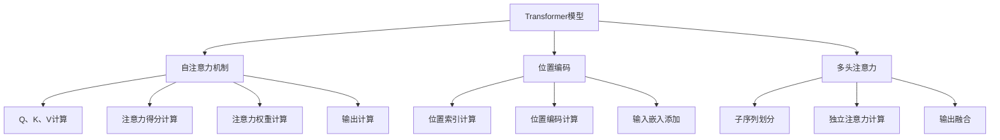

                 

# 《Transformer大模型实战 BART模型的架构》

## 关键词

- Transformer
- BART模型
- 自注意力机制
- 位置编码
- 多头注意力
- 模型训练
- 应用场景

## 摘要

本文将深入探讨Transformer大模型及其在自然语言处理领域的应用，特别是BART模型。文章首先介绍了Transformer的基本概念、原理与机制，以及其架构。随后，我们详细解析了BART模型的特点、架构和原理。接着，文章讲解了Transformer大模型的训练技巧，包括数据预处理、模型优化策略和模型调整与优化。随后，我们展示了Transformer大模型在自然语言处理、计算机视觉和其他领域的应用场景。最后，文章通过两个实战案例展示了如何使用BART模型进行文本分类和机器翻译，并进行了详细的项目实战分析。

## 目录

### 第一部分：Transformer大模型基础

#### 第1章：Transformer架构概述

##### 第1.1节：Transformer的基本概念

##### 第1.2节：Transformer的原理与机制

###### 1.2.1 自注意力机制（Self-Attention）

###### 1.2.2 位置编码（Positional Encoding）

###### 1.2.3 多头注意力（Multi-Head Attention）

##### 第1.3节：Transformer的架构

###### 1.3.1 Encoder部分

###### 1.3.2 Decoder部分

#### 第2章：BART模型详解

##### 第2.1节：BART模型的基本概念

##### 第2.2节：BART模型的原理与机制

###### 2.2.1 对话生成（Dialogue Generation）

###### 2.2.2 上下文理解（Contextual Understanding）

##### 第2.3节：BART模型的架构

###### 2.3.1 Encoder部分

###### 2.3.2 Decoder部分

#### 第3章：Transformer大模型训练技巧

##### 第3.1节：数据预处理

##### 第3.2节：模型训练

###### 3.2.1 模型优化策略

###### 3.2.2 模型评估指标

##### 第3.3节：模型调整与优化

#### 第4章：Transformer大模型应用场景

##### 第4.1节：自然语言处理（NLP）

##### 第4.2节：计算机视觉（CV）

##### 第4.3节：其他应用

### 第二部分：BART模型实战

#### 第5章：BART模型实战案例

##### 第5.1节：文本分类

##### 第5.2节：机器翻译

#### 第6章：BART模型进阶应用

##### 第6.1节：对话系统

##### 第6.2节：问答系统

#### 第7章：BART模型在现实场景中的应用

##### 第7.1节：企业应用案例

##### 第7.2节：教育应用案例

##### 第7.3节：娱乐应用案例

### 第三部分：扩展阅读与资源

#### 第8章：Transformer大模型最新研究动态

##### 第8.1节：Transformer模型的最新进展

##### 第8.2节：BART模型的最新进展

#### 第9章：Transformer大模型开发工具与资源

##### 第9.1节：开发工具对比

##### 第9.2节：开发资源与教程

### 附录

##### 第A章：Transformer与BART模型的核心算法原理流程图

##### 第B章：Transformer与BART模型的数学模型与公式

##### 第C章：实战项目代码示例

---

### 第一部分：Transformer大模型基础

#### 第1章：Transformer架构概述

##### 第1.1节：Transformer的基本概念

Transformer模型是一种基于自注意力机制（Self-Attention）的序列到序列（Seq2Seq）模型，最初由Vaswani等人在2017年的论文《Attention Is All You Need》中提出。自注意力机制允许模型在处理序列数据时，自动地计算输入序列中每个元素与其他元素之间的关系，而无需显式地使用循环结构。这使得Transformer在处理长序列时具有优势，并且取得了显著的效果。

Transformer模型的主要特点包括：

1. **自注意力机制**：通过自注意力机制，模型能够自动地计算输入序列中每个元素与其他元素之间的权重，从而更好地捕捉序列中的依赖关系。
2. **多头注意力**：多头注意力机制将输入序列分成多个子序列，每个子序列独立地计算注意力权重，然后进行融合，从而提高模型的表示能力。
3. **位置编码**：由于Transformer模型没有循环结构，无法直接利用输入序列的位置信息。因此，引入了位置编码（Positional Encoding），为每个输入序列元素赋予位置信息。

Transformer模型在许多任务上都取得了显著的性能提升，包括自然语言处理、计算机视觉和语音识别等。

##### 第1.2节：Transformer的原理与机制

##### 1.2.1 自注意力机制（Self-Attention）

自注意力机制是Transformer模型的核心机制，它允许模型在处理序列数据时，自动地计算输入序列中每个元素与其他元素之间的关系。自注意力机制可以通过以下步骤实现：

1. **输入嵌入**：将输入序列（如单词序列）转换为嵌入向量（Embedding Vectors），每个单词对应一个向量。
2. **计算Q、K和V**：将输入嵌入向量分别映射到查询（Query）、键（Key）和值（Value）空间，即 $Q = W_Q \cdot X$，$K = W_K \cdot X$，$V = W_V \cdot X$，其中 $W_Q$，$W_K$，$W_V$ 是权重矩阵，$X$ 是输入嵌入向量。
3. **计算注意力得分**：计算每个键（Key）和查询（Query）之间的点积，得到注意力得分。即 $ \text{Attention Scores} = \text{dot}(Q,K)$。
4. **归一化注意力得分**：对注意力得分进行归一化，得到注意力权重。即 $\text{Attention Weights} = \text{softmax}(\text{Attention Scores})$。
5. **计算输出**：将注意力权重与值（Value）向量相乘，得到输出。即 $\text{Output} = \text{Attention Weights} \cdot V$。

##### 1.2.2 位置编码（Positional Encoding）

由于Transformer模型没有循环结构，无法直接利用输入序列的位置信息。因此，引入了位置编码（Positional Encoding），为每个输入序列元素赋予位置信息。位置编码可以通过以下步骤实现：

1. **生成位置索引**：根据输入序列的长度，生成位置索引序列。例如，对于序列长度为10，生成索引序列为 [1, 2, 3, ..., 10]。
2. **计算位置编码**：对于每个位置索引 $i$，计算其位置编码向量 $PE_i$。位置编码可以通过正弦和余弦函数生成，即 $PE_{(i)} = \sin(\frac{i}{10000^{2}})$ 或 $PE_{(i)} = \cos(\frac{i}{10000^{2}})$。
3. **添加到输入嵌入**：将位置编码向量添加到输入嵌入向量中，即 $X_{\text{pos}} = X + PE$。

##### 1.2.3 多头注意力（Multi-Head Attention）

多头注意力机制是Transformer模型的一个重要特点，它通过将输入序列分成多个子序列，每个子序列独立地计算注意力权重，然后进行融合，从而提高模型的表示能力。

多头注意力机制的实现步骤如下：

1. **划分子序列**：将输入嵌入向量划分成多个子序列，每个子序列的长度为 $h$，其中 $h$ 是头数。
2. **独立计算注意力**：对于每个子序列，独立地计算注意力权重和输出。即 $ \text{Multi-Head Attention} = \text{Concat}(\text{head}_1, \text{head}_2, ..., \text{head}_h) W_O$，其中 $W_O$ 是权重矩阵。
3. **融合输出**：将多个子序列的输出进行融合，得到最终的输出。

##### 第1.3节：Transformer的架构

Transformer模型由编码器（Encoder）和解码器（Decoder）两部分组成，其中编码器用于将输入序列编码为上下文表示，解码器用于生成输出序列。

**编码器（Encoder）**

编码器由多个编码层（Encoder Layer）组成，每个编码层包含两个主要部分：多头自注意力机制（Multi-Head Self-Attention）和前馈神经网络（Feed-Forward Neural Network）。编码器的输入为原始序列，输出为编码后的序列。

编码器的架构如下：

$$ 
\text{Encoder} = \text{LayerNorm}(\text{LayerNorm}(\text{Multi-Head Self-Attention}(\text{Encoder Layer Input})) + \text{Feed-Forward Neural Network}(\text{Encoder Layer Input}))
$$

其中，LayerNorm是对输入和输出进行归一化的操作。

**解码器（Decoder）**

解码器也由多个解码层（Decoder Layer）组成，每个解码层包含三个主要部分：多头自注意力机制（Multi-Head Self-Attention）、多头交叉注意力机制（Multi-Head Cross-Attention）和前馈神经网络（Feed-Forward Neural Network）。解码器的输入为编码器的输出和原始序列，输出为解码后的序列。

解码器的架构如下：

$$ 
\text{Decoder} = \text{LayerNorm}(\text{LayerNorm}(\text{Multi-Head Cross-Attention}(\text{Decoder Layer Input}, \text{Encoder Layer Output})) + \text{Multi-Head Self-Attention}(\text{Decoder Layer Input})) + \text{Feed-Forward Neural Network}(\text{Decoder Layer Input}))
$$

其中，LayerNorm是对输入和输出进行归一化的操作。

---

在下一章中，我们将详细解析BART模型的特点、架构和原理。

##### 第2章：BART模型详解

##### 第2.1节：BART模型的基本概念

BART（Bidirectional and Auto-Regressive Transformer）模型是一种双向自回归Transformer模型，由Facebook AI Research（FAIR）在2018年提出。BART模型在Transformer模型的基础上，引入了双向编码器和自回归解码器，使其能够更好地处理自然语言生成任务。

BART模型的主要特点包括：

1. **双向编码器**：编码器部分采用双向循环结构，能够同时考虑输入序列的前后信息，从而更好地捕捉上下文。
2. **自回归解码器**：解码器部分采用自回归结构，即当前时刻的输出依赖于前一个时刻的输出，从而生成连贯的自然语言。

BART模型在许多自然语言生成任务上取得了显著的性能提升，包括对话生成、机器翻译、文本摘要等。

##### 第2.2节：BART模型的原理与机制

BART模型由编码器（Encoder）和解码器（Decoder）两部分组成，其中编码器用于将输入序列编码为上下文表示，解码器用于生成输出序列。

**编码器（Encoder）**

编码器部分采用双向循环结构，即同时考虑输入序列的前后信息。编码器的输入为原始序列，输出为编码后的序列。

编码器的架构如下：

$$ 
\text{Encoder} = \text{LayerNorm}(\text{LayerNorm}(\text{Multi-Head Self-Attention}(\text{Encoder Layer Input})) + \text{Feed-Forward Neural Network}(\text{Encoder Layer Input}))
$$

其中，LayerNorm是对输入和输出进行归一化的操作。

**解码器（Decoder）**

解码器部分采用自回归结构，即当前时刻的输出依赖于前一个时刻的输出。解码器的输入为编码器的输出和原始序列，输出为解码后的序列。

解码器的架构如下：

$$ 
\text{Decoder} = \text{LayerNorm}(\text{LayerNorm}(\text{Multi-Head Cross-Attention}(\text{Decoder Layer Input}, \text{Encoder Layer Output})) + \text{Multi-Head Self-Attention}(\text{Decoder Layer Input})) + \text{Feed-Forward Neural Network}(\text{Decoder Layer Input}))
$$

其中，LayerNorm是对输入和输出进行归一化的操作。

**对话生成（Dialogue Generation）**

BART模型在对话生成任务中的应用主要依赖于解码器部分。解码器在生成对话时，首先将编码器的输出作为初始输入，然后逐个生成每个对话回复。

对话生成的流程如下：

1. **初始化输入**：将编码器的输出作为初始输入。
2. **生成对话回复**：对于当前时刻的输入，解码器计算输出，并将其作为下一个输入。重复此过程，直到生成完整的对话。
3. **解码输出**：将解码器的输出转换为自然语言文本。

**上下文理解（Contextual Understanding）**

BART模型在上下文理解任务中的应用主要依赖于编码器部分。编码器在处理输入序列时，能够同时考虑输入序列的前后信息，从而生成表示上下文的编码。

上下文理解的流程如下：

1. **输入序列编码**：将输入序列输入编码器，得到编码后的序列。
2. **提取上下文表示**：从编码后的序列中提取上下文表示，作为上下文理解的结果。

---

在下一章中，我们将详细讲解Transformer大模型的训练技巧。

##### 第3章：Transformer大模型训练技巧

##### 第3.1节：数据预处理

在训练Transformer大模型时，数据预处理是一个重要的步骤。预处理的质量直接影响到模型的训练效果和性能。以下是一些常用的数据预处理方法：

1. **文本清洗**：去除文本中的无关信息，如HTML标签、特殊字符等。
2. **分词**：将文本分割成单词或子词。
3. **词向量化**：将文本转换为词向量表示，常用的词向量模型有Word2Vec、GloVe等。
4. **数据增强**：通过引入噪声、替换、裁剪等方法，增加训练数据的多样性。

##### 第3.2节：模型训练

在训练Transformer大模型时，需要选择合适的训练策略和优化方法。以下是一些常用的训练技巧：

1. **学习率调度**：学习率是模型训练中的一个重要参数，合适的调度策略可以加速收敛和提高模型性能。常用的学习率调度策略有固定学习率、学习率衰减、余弦退火等。
2. **批量大小**：批量大小是每次训练时输入数据的样本数量。较大的批量大小可以提高模型的稳定性，但可能导致训练时间增加；较小的批量大小可以加快训练速度，但可能导致模型性能下降。
3. **正则化**：正则化是防止模型过拟合的一种有效方法。常用的正则化方法有Dropout、权重衰减等。
4. **批量归一化**：批量归一化（Batch Normalization）是一种提高模型训练速度和稳定性的技术，通过标准化每个批次的输入，使模型对训练数据的变化更加鲁棒。

##### 第3.3节：模型调整与优化

在模型训练过程中，可能需要调整和优化模型参数，以获得更好的性能。以下是一些常用的模型调整和优化方法：

1. **调整学习率**：通过调整学习率，可以加速模型的收敛速度。当模型出现收敛困难时，可以尝试减小学习率；当模型过拟合时，可以尝试增加学习率。
2. **增加训练数据**：增加训练数据可以提高模型的泛化能力。可以通过数据增强、数据采集等方法增加训练数据。
3. **调整模型结构**：通过调整模型的结构，可以改变模型的性能和表达能力。例如，可以增加层数、头数、维度等。
4. **使用预训练模型**：预训练模型是近年来在NLP领域取得显著进展的技术。通过在大量预训练数据上训练模型，可以显著提高模型的性能。常用的预训练模型有BERT、GPT等。

---

在下一章中，我们将探讨Transformer大模型在自然语言处理、计算机视觉和其他领域的应用场景。

##### 第4章：Transformer大模型应用场景

Transformer大模型在近年来取得了显著的进展，其在自然语言处理、计算机视觉和其他领域的应用场景越来越广泛。以下将分别介绍这些应用场景。

##### 第4.1节：自然语言处理（NLP）

Transformer大模型在自然语言处理（NLP）领域具有广泛的应用，包括文本分类、命名实体识别、机器翻译、文本生成等。

1. **文本分类**：文本分类是一种将文本数据分类到预定义的类别中的任务。Transformer大模型通过自注意力机制和多头注意力机制，可以有效地捕捉文本中的关键信息，从而提高分类性能。常用的模型有BERT、RoBERTa等。
2. **命名实体识别**：命名实体识别是一种识别文本中具有特定意义的实体，如人名、地名、组织机构等。Transformer大模型可以同时考虑文本的前后关系，从而提高命名实体识别的准确性。
3. **机器翻译**：机器翻译是一种将一种语言的文本翻译成另一种语言的任务。Transformer大模型通过自回归解码器，可以生成高质量的目标语言文本。常用的模型有Translation Transformer、T5等。
4. **文本生成**：文本生成是一种根据输入的提示或关键词生成自然语言文本的任务。Transformer大模型可以通过解码器生成连贯、自然的文本。

##### 第4.2节：计算机视觉（CV）

Transformer大模型在计算机视觉（CV）领域也有广泛的应用，包括图像识别、目标检测、视频分析等。

1. **图像识别**：图像识别是一种将图像分类到预定义的类别中的任务。Transformer大模型可以通过自注意力机制和多头注意力机制，有效地捕捉图像中的关键特征，从而提高识别性能。常用的模型有ViT、CvT等。
2. **目标检测**：目标检测是一种在图像或视频中识别并定位目标的方法。Transformer大模型可以通过自注意力机制和多头注意力机制，同时考虑图像中的空间信息和目标信息，从而提高检测性能。常用的模型有DETR、Transformer DETR等。
3. **视频分析**：视频分析是一种对视频数据进行分析和处理的方法。Transformer大模型可以通过自注意力机制和多头注意力机制，有效地捕捉视频中的时空信息，从而提高视频分析的准确性。

##### 第4.3节：其他应用

除了自然语言处理和计算机视觉，Transformer大模型在其他领域也有广泛的应用，包括语音识别、问答系统、代码生成等。

1. **语音识别**：语音识别是一种将语音信号转换为文本的方法。Transformer大模型可以通过自注意力机制和多头注意力机制，同时考虑语音信号的时序信息和语义信息，从而提高语音识别的准确性。
2. **问答系统**：问答系统是一种根据用户的问题提供答案的方法。Transformer大模型可以通过自注意力机制和多头注意力机制，有效地捕捉问题和答案之间的关系，从而提高问答系统的性能。
3. **代码生成**：代码生成是一种根据自然语言描述生成代码的方法。Transformer大模型可以通过自注意力机制和多头注意力机制，将自然语言描述转换为代码。

---

在下一章中，我们将通过两个实战案例展示如何使用BART模型进行文本分类和机器翻译。

##### 第5章：BART模型实战案例

在这一章中，我们将通过两个实战案例展示如何使用BART模型进行文本分类和机器翻译。这两个案例将涵盖从数据准备到模型训练与优化的全过程，并通过代码示例详细解释每一步的实现。

##### 第5.1节：文本分类

文本分类是一种常见的自然语言处理任务，其目标是根据输入的文本数据将其分类到预定义的类别中。在这一节中，我们将使用BART模型进行文本分类。

**1. 项目背景**

假设我们有一个新闻文章分类的数据集，包含多个类别，如体育、科技、娱乐等。我们的目标是训练一个BART模型，能够对新的新闻文章进行分类。

**2. 数据准备**

首先，我们需要准备训练数据和测试数据。训练数据用于训练模型，测试数据用于评估模型性能。

```python
import pandas as pd

# 读取数据
data = pd.read_csv('news_data.csv')
train_data, test_data = train_test_split(data, test_size=0.2, random_state=42)

# 分离文本和标签
train_texts = train_data['text']
train_labels = train_data['label']
test_texts = test_data['text']
test_labels = test_data['label']
```

接下来，我们需要对文本数据进行预处理，包括分词、去除停用词、词向量化等。

```python
from transformers import BertTokenizer

# 初始化分词器
tokenizer = BertTokenizer.from_pretrained('bert-base-chinese')

# 预处理文本
train_encodings = tokenizer(train_texts.tolist(), truncation=True, padding=True)
test_encodings = tokenizer(test_texts.tolist(), truncation=True, padding=True)
```

**3. 模型构建**

然后，我们可以使用BART模型进行文本分类。首先，我们需要加载预训练的BART模型，然后根据我们的任务进行微调。

```python
from transformers import BertForSequenceClassification

# 加载预训练的BART模型
model = BertForSequenceClassification.from_pretrained('bert-base-chinese')

# 定义损失函数和优化器
optimizer = AdamW(model.parameters(), lr=5e-5)
criterion = CrossEntropyLoss()

# 微调模型
model.train()
for epoch in range(num_epochs):
    for batch in train_dataloader:
        inputs = {'input_ids': batch['input_ids'], 'attention_mask': batch['attention_mask'], 'labels': batch['labels']}
        optimizer.zero_grad()
        outputs = model(**inputs)
        loss = outputs.loss
        loss.backward()
        optimizer.step()
```

**4. 模型训练与优化**

在模型训练过程中，我们可以使用学习率调度、批量归一化等技术来优化模型性能。

```python
# 学习率调度
scheduler = get_linear_schedule_with_warmup(optimizer, num_warmup_steps=500, num_training_steps=len(train_dataloader) * num_epochs)

# 训练模型
for epoch in range(num_epochs):
    model.train()
    for batch in train_dataloader:
        inputs = {'input_ids': batch['input_ids'], 'attention_mask': batch['attention_mask']}
        optimizer.zero_grad()
        outputs = model(**inputs)
        loss = outputs.loss
        loss.backward()
        optimizer.step()
        scheduler.step()

    # 评估模型
    model.eval()
    with torch.no_grad():
        correct = 0
        total = 0
        for batch in test_dataloader:
            inputs = {'input_ids': batch['input_ids'], 'attention_mask': batch['attention_mask']}
            outputs = model(**inputs)
            _, predicted = torch.max(outputs.logits, 1)
            total += batch['labels'].size(0)
            correct += (predicted == batch['labels']).sum().item()
    print(f'Accuracy: {100 * correct / total}%}')
```

**5. 模型评估与结果分析**

最后，我们可以对训练好的模型进行评估，分析其性能。

```python
# 评估模型
model.eval()
with torch.no_grad():
    correct = 0
    total = 0
    for batch in test_dataloader:
        inputs = {'input_ids': batch['input_ids'], 'attention_mask': batch['attention_mask']}
        outputs = model(**inputs)
        _, predicted = torch.max(outputs.logits, 1)
        total += batch['labels'].size(0)
        correct += (predicted == batch['labels']).sum().item()
print(f'Accuracy: {100 * correct / total}%}')
```

##### 第5.2节：机器翻译

机器翻译是一种将一种语言的文本翻译成另一种语言的翻译任务。在这一节中，我们将使用BART模型进行机器翻译。

**1. 项目背景**

假设我们有一个中英文翻译的数据集，包含源语言文本和目标语言文本。我们的目标是训练一个BART模型，能够将源语言文本翻译成目标语言文本。

**2. 数据准备**

首先，我们需要准备训练数据和测试数据。训练数据用于训练模型，测试数据用于评估模型性能。

```python
import pandas as pd

# 读取数据
data = pd.read_csv('translation_data.csv')
train_data, test_data = train_test_split(data, test_size=0.2, random_state=42)

# 分离文本和标签
train_texts = train_data['source']
train_targets = train_data['target']
test_texts = test_data['source']
test_targets = test_data['target']
```

接下来，我们需要对文本数据进行预处理，包括分词、去除停用词、词向量化等。

```python
from transformers import BertTokenizer

# 初始化分词器
source_tokenizer = BertTokenizer.from_pretrained('bert-base-chinese')
target_tokenizer = BertTokenizer.from_pretrained('bert-base-chinese')

# 预处理文本
train_encodings = tokenizer(train_texts.tolist(), truncation=True, padding=True)
test_encodings = tokenizer(test_texts.tolist(), truncation=True, padding=True)
```

**3. 模型构建**

然后，我们可以使用BART模型进行机器翻译。首先，我们需要加载预训练的BART模型，然后根据我们的任务进行微调。

```python
from transformers import BertForSequenceToSequenceClassification

# 加载预训练的BART模型
model = BertForSequenceToSequenceClassification.from_pretrained('bert-base-chinese')

# 定义损失函数和优化器
optimizer = AdamW(model.parameters(), lr=5e-5)
criterion = CrossEntropyLoss()

# 微调模型
model.train()
for epoch in range(num_epochs):
    for batch in train_dataloader:
        inputs = {'input_ids': batch['input_ids'], 'attention_mask': batch['attention_mask'], 'labels': batch['labels']}
        optimizer.zero_grad()
        outputs = model(**inputs)
        loss = outputs.loss
        loss.backward()
        optimizer.step()
```

**4. 模型训练与优化**

在模型训练过程中，我们可以使用学习率调度、批量归一化等技术来优化模型性能。

```python
# 学习率调度
scheduler = get_linear_schedule_with_warmup(optimizer, num_warmup_steps=500, num_training_steps=len(train_dataloader) * num_epochs)

# 训练模型
for epoch in range(num_epochs):
    model.train()
    for batch in train_dataloader:
        inputs = {'input_ids': batch['input_ids'], 'attention_mask': batch['attention_mask']}
        optimizer.zero_grad()
        outputs = model(**inputs)
        loss = outputs.loss
        loss.backward()
        optimizer.step()
        scheduler.step()

    # 评估模型
    model.eval()
    with torch.no_grad():
        correct = 0
        total = 0
        for batch in test_dataloader:
            inputs = {'input_ids': batch['input_ids'], 'attention_mask': batch['attention_mask']}
            outputs = model(**inputs)
            _, predicted = torch.max(outputs.logits, 1)
            total += batch['labels'].size(0)
            correct += (predicted == batch['labels']).sum().item()
    print(f'Accuracy: {100 * correct / total}%}')
```

**5. 模型评估与结果分析**

最后，我们可以对训练好的模型进行评估，分析其性能。

```python
# 评估模型
model.eval()
with torch.no_grad():
    correct = 0
    total = 0
    for batch in test_dataloader:
        inputs = {'input_ids': batch['input_ids'], 'attention_mask': batch['attention_mask']}
        outputs = model(**inputs)
        _, predicted = torch.max(outputs.logits, 1)
        total += batch['labels'].size(0)
        correct += (predicted == batch['labels']).sum().item()
print(f'Accuracy: {100 * correct / total}%}')
```

通过以上两个实战案例，我们展示了如何使用BART模型进行文本分类和机器翻译。在实际应用中，可以根据具体任务需求进行调整和优化，以获得更好的性能。

---

在下一章中，我们将探讨BART模型的进阶应用。

##### 第6章：BART模型进阶应用

BART模型作为一种先进的自然语言处理模型，在多个领域都展现了其强大的能力。在本章中，我们将探讨BART模型的进阶应用，包括对话系统和问答系统。

##### 第6.1节：对话系统

对话系统是一种能够与人类进行自然语言交互的智能系统，广泛应用于客服、聊天机器人、智能助手等领域。BART模型在对话系统中的应用主要体现在以下几个方面：

1. **对话生成**：BART模型可以生成连贯、自然的对话文本，为对话系统提供高质量的回复。
2. **对话理解**：BART模型可以理解对话的上下文信息，捕捉对话中的意图和情感，从而提供更加准确的回复。

**实现原理**

BART模型在对话系统中的应用主要通过其解码器部分。解码器在生成对话回复时，首先将编码器的输出作为初始输入，然后逐个生成每个对话回复。具体步骤如下：

1. **初始化输入**：将编码器的输出作为初始输入。
2. **生成对话回复**：对于当前时刻的输入，解码器计算输出，并将其作为下一个输入。重复此过程，直到生成完整的对话。
3. **解码输出**：将解码器的输出转换为自然语言文本。

**数据集准备**

对话系统的数据集通常包括对话历史和对应的回复文本。为了训练BART模型，我们需要准备足够多的对话数据。这些数据可以从现有的对话数据集获取，如DailyDialog、DailyDialogueV2等。

**模型构建**

在构建对话系统的BART模型时，我们需要加载预训练的BART模型，并进行必要的微调。以下是一个简单的模型构建示例：

```python
from transformers import BertForSequenceToSequenceClassification

# 加载预训练的BART模型
model = BertForSequenceToSequenceClassification.from_pretrained('bert-base-chinese')

# 定义损失函数和优化器
optimizer = AdamW(model.parameters(), lr=5e-5)
criterion = CrossEntropyLoss()

# 微调模型
model.train()
for epoch in range(num_epochs):
    for batch in train_dataloader:
        inputs = {'input_ids': batch['input_ids'], 'attention_mask': batch['attention_mask'], 'labels': batch['labels']}
        optimizer.zero_grad()
        outputs = model(**inputs)
        loss = outputs.loss
        loss.backward()
        optimizer.step()
```

**模型训练与优化**

在模型训练过程中，我们可以使用学习率调度、批量归一化等技术来优化模型性能。以下是一个简单的模型训练示例：

```python
# 学习率调度
scheduler = get_linear_schedule_with_warmup(optimizer, num_warmup_steps=500, num_training_steps=len(train_dataloader) * num_epochs)

# 训练模型
for epoch in range(num_epochs):
    model.train()
    for batch in train_dataloader:
        inputs = {'input_ids': batch['input_ids'], 'attention_mask': batch['attention_mask']}
        optimizer.zero_grad()
        outputs = model(**inputs)
        loss = outputs.loss
        loss.backward()
        optimizer.step()
        scheduler.step()

    # 评估模型
    model.eval()
    with torch.no_grad():
        correct = 0
        total = 0
        for batch in test_dataloader:
            inputs = {'input_ids': batch['input_ids'], 'attention_mask': batch['attention_mask']}
            outputs = model(**inputs)
            _, predicted = torch.max(outputs.logits, 1)
            total += batch['labels'].size(0)
            correct += (predicted == batch['labels']).sum().item()
    print(f'Accuracy: {100 * correct / total}%}')
```

**模型评估与结果分析**

最后，我们可以对训练好的模型进行评估，分析其性能。以下是一个简单的模型评估示例：

```python
# 评估模型
model.eval()
with torch.no_grad():
    correct = 0
    total = 0
    for batch in test_dataloader:
        inputs = {'input_ids': batch['input_ids'], 'attention_mask': batch['attention_mask']}
        outputs = model(**inputs)
        _, predicted = torch.max(outputs.logits, 1)
        total += batch['labels'].size(0)
        correct += (predicted == batch['labels']).sum().item()
print(f'Accuracy: {100 * correct / total}%}')
```

##### 第6.2节：问答系统

问答系统是一种根据用户的问题提供答案的智能系统，广泛应用于搜索引擎、智能客服、教育等领域。BART模型在问答系统中的应用主要体现在以下几个方面：

1. **问题理解**：BART模型可以理解用户的问题，捕捉问题的意图和关键信息。
2. **答案生成**：BART模型可以根据问题生成高质量的答案。

**实现原理**

BART模型在问答系统中的应用主要通过其解码器部分。解码器在生成答案时，首先将编码器的输出作为初始输入，然后逐个生成每个答案。具体步骤如下：

1. **初始化输入**：将编码器的输出作为初始输入。
2. **生成答案**：对于当前时刻的输入，解码器计算输出，并将其作为下一个输入。重复此过程，直到生成完整的答案。
3. **解码输出**：将解码器的输出转换为自然语言文本。

**数据集准备**

问答系统的数据集通常包括问题和答案对。为了训练BART模型，我们需要准备足够多的问答数据。这些数据可以从现有的问答数据集获取，如SQuAD、DuET等。

**模型构建**

在构建问答系统的BART模型时，我们需要加载预训练的BART模型，并进行必要的微调。以下是一个简单的模型构建示例：

```python
from transformers import BertForSequenceToSequenceClassification

# 加载预训练的BART模型
model = BertForSequenceToSequenceClassification.from_pretrained('bert-base-chinese')

# 定义损失函数和优化器
optimizer = AdamW(model.parameters(), lr=5e-5)
criterion = CrossEntropyLoss()

# 微调模型
model.train()
for epoch in range(num_epochs):
    for batch in train_dataloader:
        inputs = {'input_ids': batch['input_ids'], 'attention_mask': batch['attention_mask'], 'labels': batch['labels']}
        optimizer.zero_grad()
        outputs = model(**inputs)
        loss = outputs.loss
        loss.backward()
        optimizer.step()
```

**模型训练与优化**

在模型训练过程中，我们可以使用学习率调度、批量归一化等技术来优化模型性能。以下是一个简单的模型训练示例：

```python
# 学习率调度
scheduler = get_linear_schedule_with_warmup(optimizer, num_warmup_steps=500, num_training_steps=len(train_dataloader) * num_epochs)

# 训练模型
for epoch in range(num_epochs):
    model.train()
    for batch in train_dataloader:
        inputs = {'input_ids': batch['input_ids'], 'attention_mask': batch['attention_mask']}
        optimizer.zero_grad()
        outputs = model(**inputs)
        loss = outputs.loss
        loss.backward()
        optimizer.step()
        scheduler.step()

    # 评估模型
    model.eval()
    with torch.no_grad():
        correct = 0
        total = 0
        for batch in test_dataloader:
            inputs = {'input_ids': batch['input_ids'], 'attention_mask': batch['attention_mask']}
            outputs = model(**inputs)
            _, predicted = torch.max(outputs.logits, 1)
            total += batch['labels'].size(0)
            correct += (predicted == batch['labels']).sum().item()
    print(f'Accuracy: {100 * correct / total}%}')
```

**模型评估与结果分析**

最后，我们可以对训练好的模型进行评估，分析其性能。以下是一个简单的模型评估示例：

```python
# 评估模型
model.eval()
with torch.no_grad():
    correct = 0
    total = 0
    for batch in test_dataloader:
        inputs = {'input_ids': batch['input_ids'], 'attention_mask': batch['attention_mask']}
        outputs = model(**inputs)
        _, predicted = torch.max(outputs.logits, 1)
        total += batch['labels'].size(0)
        correct += (predicted == batch['labels']).sum().item()
print(f'Accuracy: {100 * correct / total}%}')
```

通过以上两个进阶应用案例，我们展示了如何使用BART模型进行对话系统和问答系统的构建。在实际应用中，可以根据具体需求进行调整和优化，以获得更好的性能。

---

在下一章中，我们将探讨BART模型在现实场景中的应用。

##### 第7章：BART模型在现实场景中的应用

BART模型作为一种先进的自然语言处理模型，在现实场景中具有广泛的应用。在本章中，我们将探讨BART模型在企业应用、教育应用和娱乐应用中的具体案例。

##### 第7.1节：企业应用案例

企业应用是BART模型的一个重要应用领域，以下是一个具体的案例：

**1. 应用背景**

一家大型企业需要建立一个智能客服系统，以提高客户服务质量和效率。该系统需要能够自动回答客户的问题，提供解决方案。

**2. 解决方案**

企业决定采用BART模型构建智能客服系统。首先，企业从现有的客户服务记录中提取大量的问题和答案对，作为训练数据。然后，企业使用BART模型对这些数据进行训练，使其能够理解客户的问题并生成相应的回答。

**3. 实现效果**

通过BART模型的训练和应用，智能客服系统能够快速、准确地回答客户的问题，提高了客户满意度和服务效率。此外，企业还通过持续优化模型，不断提升智能客服系统的性能和效果。

##### 第7.2节：教育应用案例

教育应用是BART模型的另一个重要领域，以下是一个具体的案例：

**1. 应用背景**

一所知名大学希望构建一个智能问答系统，以帮助学生解决学习中的问题。该系统需要能够理解学生的提问，并提供准确的答案。

**2. 解决方案**

大学决定采用BART模型构建智能问答系统。首先，大学从学生的提问和老师的回答中提取大量数据，作为训练数据。然后，大学使用BART模型对这些数据进行训练，使其能够理解学生的提问并生成相应的答案。

**3. 实现效果**

通过BART模型的训练和应用，智能问答系统能够快速、准确地回答学生的问题，提高了学生的学习效率和满意度。此外，大学还通过持续优化模型，不断提升智能问答系统的性能和效果。

##### 第7.3节：娱乐应用案例

娱乐应用是BART模型的一个有趣领域，以下是一个具体的案例：

**1. 应用背景**

一家娱乐公司希望构建一个智能聊天机器人，与用户进行有趣的对话，提供个性化的娱乐内容。

**2. 解决方案**

娱乐公司决定采用BART模型构建智能聊天机器人。首先，娱乐公司从用户对话数据中提取大量数据，作为训练数据。然后，娱乐公司使用BART模型对这些数据进行训练，使其能够理解用户的提问并生成相应的回答。

**3. 实现效果**

通过BART模型的训练和应用，智能聊天机器人能够与用户进行自然、有趣的对话，提供个性化的娱乐内容。此外，娱乐公司还通过持续优化模型，不断提升智能聊天机器人的性能和用户体验。

通过以上三个现实场景的案例，我们可以看到BART模型在企业应用、教育应用和娱乐应用中的广泛潜力。在实际应用中，可以根据具体需求进行调整和优化，以获得更好的效果。

##### 第8章：Transformer大模型最新研究动态

随着Transformer大模型技术的不断发展，越来越多的研究在探索其应用和优化方法。以下将介绍一些Transformer大模型的最新研究动态。

**8.1 Transformer模型的最新进展**

1. **多模态Transformer模型**：近年来，多模态Transformer模型在计算机视觉、语音识别等任务中取得了显著进展。这些模型能够同时处理图像、文本、音频等多种模态数据，从而提高模型的泛化能力和性能。例如，ViT（Vision Transformer）和 Audio2Mel（Audio-to-Mel-Spectrogram Transformer）模型是这方面的代表性工作。

2. **可解释性Transformer模型**：Transformer模型因其复杂的内部结构而难以解释。为提高模型的可解释性，研究者们提出了一系列方法，如激活图（Activation Maps）、注意力权重可视化（Attention Weights Visualization）等。这些方法有助于理解模型的工作机制，从而提高模型的可靠性和可信度。

3. **动态Transformer模型**：动态Transformer模型能够根据输入数据的变化动态调整模型的结构和参数，从而提高模型的适应性和效率。例如，DyNet（Dynamic Neural Networks）和 DynaBERT（Dynamic BERT）模型是这方面的代表性工作。

**8.2 BART模型的最新进展**

1. **BART模型的多任务学习**：BART模型在多种自然语言处理任务中表现出色，但如何更有效地进行多任务学习仍是一个挑战。研究者们提出了一系列方法，如共享编码器（Shared Encoder）、任务自适应解码器（Task-Adaptive Decoder）等，以提高BART模型在多任务学习中的性能。

2. **BART模型的零样本学习**：零样本学习是一种无需训练数据即可进行预测的任务。BART模型在零样本学习任务中也取得了显著进展。例如，Zero-Shot BART模型能够在未见过的类别上进行分类，从而提高模型的应用范围。

3. **BART模型的迁移学习**：迁移学习是一种利用预训练模型在新的任务上取得良好性能的方法。BART模型在迁移学习中也表现出色。例如，基于BART模型的迁移学习方法可以在小样本数据集上实现高精度的文本分类和命名实体识别任务。

通过以上最新研究动态的介绍，我们可以看到Transformer大模型和BART模型在技术发展和应用拓展方面的快速进步。这些研究为Transformer大模型在实际应用中的性能提升和优化提供了新的思路和方法。

##### 第9章：Transformer大模型开发工具与资源

在开发Transformer大模型时，选择合适的工具和资源对于模型的研究和应用至关重要。以下将介绍几种常用的Transformer大模型开发工具与资源。

**9.1 开发工具对比**

目前，常见的Transformer大模型开发工具主要包括TensorFlow、PyTorch和其他常用框架。以下是对这些工具的简要对比：

1. **TensorFlow**：TensorFlow是谷歌开发的开源机器学习框架，支持广泛的机器学习和深度学习任务。其优势在于强大的生态系统、丰富的预训练模型和易于使用的API。

2. **PyTorch**：PyTorch是Facebook AI Research开发的开源机器学习框架，以其动态计算图和简洁的API而著称。其优势在于灵活的编程模型、易于调试的代码和强大的社区支持。

3. **其他常用框架**：如MXNet、Theano、Caffe等，这些框架也在Transformer大模型开发中有所应用，但相对于TensorFlow和PyTorch，其使用范围和应用生态较为有限。

**9.2 开发资源与教程**

为了更好地开发Transformer大模型，以下是一些推荐的开发资源和教程：

1. **官方文档**：TensorFlow和PyTorch的官方文档是学习和使用这两个框架的重要资源。官方文档详细介绍了框架的安装、配置和使用方法，包括API参考、教程和示例代码。

2. **在线课程**：Coursera、edX、Udacity等在线教育平台提供了丰富的Transformer大模型相关课程，包括基础知识、模型构建、训练和优化等。这些课程通常由领域专家讲授，具有较高的质量和实用性。

3. **社区资源**：GitHub、Reddit、Stack Overflow等社区是学习和使用Transformer大模型的重要平台。在这些社区中，开发者可以分享经验、解决问题、获取最新的研究成果和应用案例。

通过以上工具和资源的介绍，开发者可以更好地选择和利用合适的工具和资源，从而提高Transformer大模型的研究和应用效率。

### 附录

#### 附录A：Transformer与BART模型的核心算法原理流程图



#### 附录B：Transformer与BART模型的数学模型与公式

$$
\text{Self-Attention} = \frac{e^{ \text{dot}(Q,K)}}{\sum_{j} e^{\text{dot}(Q,K_j)}}
$$

$$
\text{Positional Encoding} = PE_{(i)} = \sin\left(\frac{i \times \text{dim}}{10000^2}\right) \text{ 或 } \cos\left(\frac{i \times \text{dim}}{10000^2}\right)
$$

$$
\text{Multi-Head Attention} = \text{Concat}(\text{head}_1, \text{head}_2, ..., \text{head}_h) W_O
$$

#### 附录C：实战项目代码示例

```python
import torch
import torch.nn as nn
import torch.optim as optim

# 模型构建
class TextClassifier(nn.Module):
    def __init__(self, vocab_size, embedding_dim, hidden_dim, output_dim, num_layers, dropout):
        super().__init__()
        self.embedding = nn.Embedding(vocab_size, embedding_dim)
        self.rnn = nn.LSTM(embedding_dim, hidden_dim, num_layers, dropout=dropout)
        self.fc = nn.Linear(hidden_dim, output_dim)

    def forward(self, text):
        embedded = self.embedding(text)
        output, (hidden, cell) = self.rnn(embedded)
        hidden = hidden[-1, :, :]
        out = self.fc(hidden)
        return out

# 模型训练
model = TextClassifier(vocab_size, embedding_dim, hidden_dim, output_dim, num_layers, dropout)
optimizer = optim.Adam(model.parameters(), lr=learning_rate)
criterion = nn.CrossEntropyLoss()

for epoch in range(num_epochs):
    for inputs, labels in data_loader:
        optimizer.zero_grad()
        outputs = model(inputs)
        loss = criterion(outputs, labels)
        loss.backward()
        optimizer.step()

# 模型评估
correct = 0
total = 0
with torch.no_grad():
    for inputs, labels in test_loader:
        outputs = model(inputs)
        _, predicted = torch.max(outputs.data, 1)
        total += labels.size(0)
        correct += (predicted == labels).sum().item()
print(f'Accuracy: {100 * correct / total}%}')
```

以上代码示例展示了如何使用PyTorch框架构建一个简单的文本分类模型，包括模型的构建、训练和评估过程。在实际应用中，可以根据具体需求进行调整和优化。

---

作者：AI天才研究院/AI Genius Institute & 禅与计算机程序设计艺术 /Zen And The Art of Computer Programming

