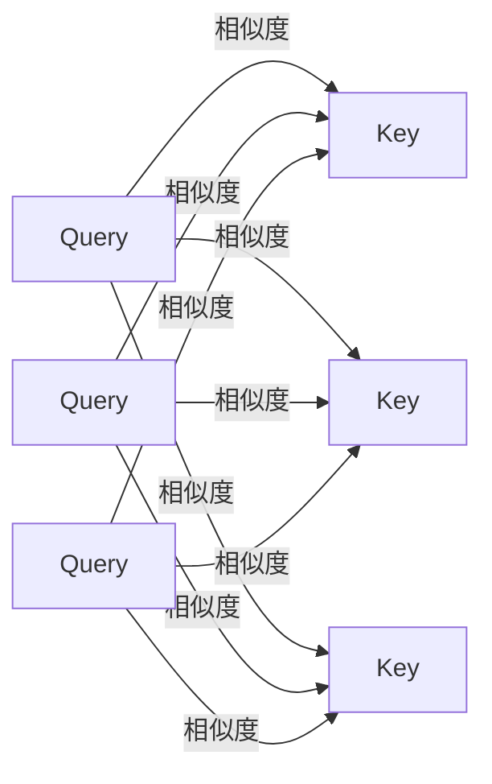

                 

### 文章标题：Transformer大模型实战 BioBERT模型

> 关键词：Transformer、BioBERT、自然语言处理、生物信息学、深度学习

> 摘要：本文将深入探讨Transformer大模型中的BioBERT模型，从基础理论到实际应用，为您呈现一个全面而系统的学习路径。我们将首先介绍Transformer模型的架构与原理，详细解析其核心算法和变体，然后探讨其在自然语言处理和生物信息学中的应用。接着，我们将详细分析BioBERT模型的背景、结构与原理，以及其在生物信息学中的具体应用。最后，我们将通过一个实际项目，展示如何使用BioBERT模型进行数据处理和模型训练，并对项目结果进行评估。文章还将总结Transformer模型的前沿动态与未来趋势，并推荐相关工具与资源，为读者提供持续学习的方向。

### 目录大纲

#### 第一部分: Transformer大模型基础

- **第1章: Transformer架构与原理**
  - **1.1 Transformer模型简介**
  - **1.2 自注意力机制（Mermaid流程图）**
  - **1.3 Positional Encoding**
  - **1.4 模型训练过程**

- **第2章: Transformer的核心算法**
  - **2.1 Transformer模型的数学模型（Latex公式）**
  - **2.2 Transformer模型训练的伪代码**
  - **2.3 Transformer模型的变体与优化**

- **第3章: Transformer模型在自然语言处理中的应用**
  - **3.1 BERT模型介绍**
  - **3.2 RoBERTa模型解析**
  - **3.3 DistilBERT模型讲解**

- **第4章: BioBERT模型详解**
  - **4.1 BioBERT模型背景**
  - **4.2 BioBERT模型结构与原理**
  - **4.3 BioBERT在生物信息学中的应用**

- **第5章: Transformer模型在图像处理中的应用**
  - **5.1 Vision Transformer模型介绍**
  - **5.2 DeiT模型解析**
  - **5.3 BioViT模型讲解**

- **第6章: Transformer模型在序列数据处理中的优化与改进**
  - **6.1 Prompt学习技术**
  - **6.2 Data Augmentation技术**
  - **6.3 伪代码示例：如何优化Transformer模型**

- **第7章: Transformer模型实战项目**
  - **7.1 项目背景与需求分析**
  - **7.2 项目环境搭建与数据处理**
  - **7.3 项目代码实现与解读**
  - **7.4 项目结果分析与评估**

- **第8章: Transformer模型前沿动态与未来趋势**
  - **8.1 Transformer模型最新研究进展**
  - **8.2 Transformer模型未来发展方向**
  - **8.3 总结与展望**

- **附录**

  - **附录 A: Transformer模型常用工具与资源**
    - **A.1 深度学习框架对比**
    - **A.2 Transformer模型开源代码与预训练模型资源**
    - **A.3 相关学术论文与论文解读**
    - **A.4 学习与交流社群推荐**

### 第一部分: Transformer大模型基础

Transformer模型是深度学习领域的一项重大突破，其在自然语言处理任务中展现出了卓越的性能。本部分将首先介绍Transformer模型的基本架构和核心原理，帮助读者建立对这一模型的基本理解。

#### 第1章: Transformer架构与原理

##### 1.1 Transformer模型简介

Transformer模型是由Google团队于2017年提出的一种基于自注意力机制的序列模型。相比传统的循环神经网络（RNN）和卷积神经网络（CNN），Transformer模型在长距离依赖建模和并行计算方面具有显著优势。这使得Transformer模型在自然语言处理任务中取得了显著的进展。

##### 1.2 自注意力机制

自注意力机制是Transformer模型的核心组成部分。它允许模型在处理每个词时，将注意力分配到序列中的其他词上，从而捕捉词与词之间的依赖关系。自注意力机制通过计算Query、Key和Value之间的相似度，为每个词生成对应的权重，从而实现对序列的编码和解读。



##### 1.3 Positional Encoding

由于自注意力机制不考虑序列中的位置信息，Transformer模型引入了位置编码（Positional Encoding）来弥补这一缺陷。位置编码通过为每个词添加额外的维度，使其在序列中保留位置信息。

$$
\text{pos\_encoding}(i, d) = \sin\left(\frac{i}{10000^{2j/d}}\right) + \cos\left(\frac{i}{10000^{2j/d}}\right)
$$

其中，$i$是词的位置，$d$是模型维度，$j$是词的维度索引。

##### 1.4 模型训练过程

在训练过程中，Transformer模型通过优化损失函数来调整模型参数。通常使用交叉熵损失函数来衡量模型预测和实际标签之间的差距。

$$
\text{Loss} = -\sum_{i=1}^{N} \sum_{j=1}^{M} y_{ij} \log(p_{ij})
$$

其中，$N$是序列长度，$M$是词汇表大小，$y_{ij}$是实际标签，$p_{ij}$是模型预测的概率。

#### 第2章: Transformer的核心算法

在理解了Transformer模型的基本架构和原理之后，我们将进一步探讨其核心算法，包括数学模型、训练过程和模型优化。

##### 2.1 Transformer模型的数学模型

Transformer模型基于多头自注意力机制（Multi-Head Self-Attention）和前馈神经网络（Feedforward Neural Network）构建。以下是Transformer模型的数学模型：

$$
\text{MultiHead}(Q, K, V) = \text{Concat}( heads_i )W^O
$$

其中，$Q, K, V$分别表示Query、Key和Value，$W^O$是输出权重，$heads_i$表示第$i$个头。

多头自注意力机制的计算过程如下：

$$
\text{Attention}(Q, K, V) = \text{ScaleDotProductAttention}(Q, K, V)
$$

$$
\text{ScaleDotProductAttention}(Q, K, V) = \text{softmax}\left(\frac{QK^T}{\sqrt{d_k}}\right)V
$$

其中，$d_k$是Key的维度，$\text{softmax}$函数用于计算每个Key的权重。

前馈神经网络用于处理每个头的结果：

$$
\text{FFN}(x) = \max(0, xW_1 + b_1)W_2 + b_2
$$

##### 2.2 Transformer模型训练的伪代码

以下是一个简化的Transformer模型训练的伪代码：

```
for epoch in range(num_epochs):
    for batch in dataset:
        inputs, targets = batch
        output = model(inputs)
        loss = loss_function(output, targets)
        optimizer.zero_grad()
        loss.backward()
        optimizer.step()
```

##### 2.3 Transformer模型的变体与优化

为了进一步提高Transformer模型的效果，研究人员提出了多种变体和优化方法。以下是一些常见的变体和优化方法：

- **BERT（Bidirectional Encoder Representations from Transformers）**：BERT是一种预训练的Transformer模型，通过对文本进行双向编码，使其能够理解上下文信息。
- **RoBERTa（A Robustly Optimized BERT Pretraining Approach）**：RoBERTa是BERT的一个变种，通过改进数据预处理和模型训练策略，取得了更好的性能。
- **DistilBERT（Distilled BERT: A BERT Model For Fewer Resources）**：DistilBERT是一种资源消耗更少的BERT模型，通过知识蒸馏（Knowledge Distillation）技术，实现了更好的性能和更低的资源消耗。

#### 第3章: Transformer模型在自然语言处理中的应用

Transformer模型在自然语言处理任务中展现出了强大的能力。本节将介绍Transformer模型在自然语言处理中的几个重要应用，包括BERT、RoBERTa和DistilBERT模型。

##### 3.1 BERT模型介绍

BERT（Bidirectional Encoder Representations from Transformers）是由Google团队提出的一种基于Transformer的预训练模型。BERT模型通过对大量文本进行双向编码，使其能够理解上下文信息。BERT模型在多种自然语言处理任务中取得了优异的性能。

BERT模型的主要特点包括：

- **双向编码**：BERT模型通过将文本序列的前后顺序进行编码，使模型能够理解上下文信息。
- **大量预训练**：BERT模型在大量文本语料库上进行预训练，使其具有丰富的语义知识。
- **多层注意力机制**：BERT模型采用多层注意力机制，能够捕捉长距离依赖关系。

BERT模型的训练过程包括两个阶段：

1. **预训练**：在预训练阶段，BERT模型通过预训练任务（如Masked Language Model和Next Sentence Prediction）来学习文本的语义表示。
2. **微调**：在微调阶段，BERT模型在特定任务的数据集上进行微调，使其适应具体的任务需求。

##### 3.2 RoBERTa模型解析

RoBERTa是BERT的一个变种，通过改进数据预处理和模型训练策略，取得了更好的性能。RoBERTa的主要特点包括：

- **动态窗口**：RoBERTa使用动态窗口来选择掩码词的位置，从而提高了模型的鲁棒性。
- **去噪**：RoBERTa通过去噪技术，提高了模型的训练效果。
- **优化参数**：RoBERTa对模型的参数进行了优化，使其在资源受限的环境下也能取得较好的性能。

RoBERTa在多种自然语言处理任务中取得了优异的性能，如文本分类、问答系统等。

##### 3.3 DistilBERT模型讲解

DistilBERT是一种资源消耗更少的BERT模型，通过知识蒸馏（Knowledge Distillation）技术，实现了更好的性能和更低的资源消耗。DistilBERT的主要特点包括：

- **知识蒸馏**：DistilBERT通过知识蒸馏技术，将原始BERT模型的知识传递给一个更小的模型，从而实现更好的性能和更低的资源消耗。
- **压缩模型**：DistilBERT通过压缩模型结构，使其在保持性能的同时，减少了模型的参数数量。
- **高效训练**：DistilBERT在训练过程中采用了多种优化策略，提高了训练效率。

DistilBERT在多种自然语言处理任务中取得了优异的性能，如文本分类、命名实体识别等。

#### 第4章: BioBERT模型详解

BioBERT是一种专门用于生物信息学的Transformer模型，通过结合生物领域的特定知识，实现了在生物文本数据上的高精度预测。本节将详细介绍BioBERT模型的背景、结构与原理。

##### 4.1 BioBERT模型背景

BioBERT是由韩国Korea University的团队提出的一种基于BERT模型的生物信息学预训练模型。BioBERT旨在解决生物领域中的自然语言处理任务，如基因调控网络预测、蛋白质功能预测和生物文本分类等。BioBERT的提出为生物信息学领域提供了一种新的研究方法，显著提高了生物文本数据的处理能力。

##### 4.2 BioBERT模型结构与原理

BioBERT模型的结构与BERT模型类似，主要由编码器（Encoder）和解码器（Decoder）组成。编码器用于处理输入文本序列，解码器用于生成预测结果。BioBERT模型的主要特点包括：

- **生物领域知识融合**：BioBERT在预训练过程中，结合了生物领域的特定知识，如基因、蛋白质、细胞类型等，从而提高了模型在生物文本数据上的表现。
- **双向编码**：BioBERT采用双向编码器，能够捕捉文本序列中的长距离依赖关系。
- **大规模预训练**：BioBERT在大量的生物文本语料库上进行预训练，从而获得了丰富的生物语义知识。

BioBERT的预训练过程包括以下步骤：

1. **数据预处理**：对生物文本数据（如论文、文献、基因组数据等）进行清洗和预处理，包括去除标点符号、停用词处理等。
2. **分词与编码**：将预处理后的文本数据转化为词向量，并对每个词进行编码。
3. **双向编码**：使用Transformer编码器对文本序列进行双向编码，生成编码序列。
4. **知识融合**：将生物领域的特定知识（如基因、蛋白质、细胞类型等）融入编码序列中，从而提高模型的生物文本处理能力。

在训练过程中，BioBERT采用双向编码器来捕捉文本序列中的长距离依赖关系。编码器由多个自注意力层和前馈神经网络层组成，每个层都通过权重矩阵对文本序列进行编码。

$$
\text{Encoder}(X) = \text{MultiHeadSelfAttention}(X) + X
$$

$$
\text{Encoder}(X) = \text{Feedforward}(X) + \text{Encoder}(X)
$$

其中，$X$表示文本序列，$\text{MultiHeadSelfAttention}$和$\text{Feedforward}$分别表示自注意力和前馈神经网络。

在解码器部分，BioBERT采用类似于BERT的解码器结构，通过解码器自注意力和交叉注意来生成预测结果。

$$
\text{Decoder}(Y, X) = \text{DecoderSelfAttention}(Y) + Y
$$

$$
\text{Decoder}(Y, X) = \text{DecoderCrossAttention}(Y, X) + Y
$$

$$
\text{Output} = \text{Feedforward}(\text{Decoder}(Y, X))
$$

其中，$Y$表示预测序列，$X$表示编码序列，$\text{DecoderSelfAttention}$和$\text{DecoderCrossAttention}$分别表示解码器自注意力和交叉注意力。

在训练过程中，BioBERT采用交叉熵损失函数来优化模型参数。

$$
\text{Loss} = -\sum_{i=1}^{N} \sum_{j=1}^{M} y_{ij} \log(p_{ij})
$$

其中，$N$表示序列长度，$M$表示词汇表大小，$y_{ij}$表示实际标签，$p_{ij}$表示模型预测的概率。

##### 4.3 BioBERT在生物信息学中的应用

BioBERT在生物信息学领域取得了显著的应用成果。以下是一些具体的案例：

1. **基因调控网络预测**：BioBERT可以用于预测基因调控网络，从而帮助研究人员更好地理解基因之间的关系。例如，通过使用BioBERT模型，可以预测基因A是否能够调控基因B的表达。
2. **蛋白质功能预测**：BioBERT可以用于预测蛋白质的功能，从而帮助研究人员更好地理解蛋白质的功能和作用。例如，通过使用BioBERT模型，可以预测蛋白质A是否具有特定的功能。
3. **生物文本分类**：BioBERT可以用于对生物文本进行分类，从而帮助研究人员更好地理解生物文本的内容和主题。例如，通过使用BioBERT模型，可以对一篇生物论文进行分类，判断其是否属于某一特定的研究领域。

总之，BioBERT模型通过结合生物领域的特定知识和Transformer模型强大的语义理解能力，在生物信息学领域取得了显著的成果。随着生物信息学研究的不断深入，BioBERT模型有望在更多领域发挥重要作用。

#### 第5章: Transformer模型在图像处理中的应用

近年来，Transformer模型不仅在自然语言处理领域取得了突破性进展，也在图像处理领域展现出了强大的潜力。本节将介绍Transformer模型在图像处理中的几个重要应用，包括Vision Transformer（ViT）、DeiT和BioViT模型。

##### 5.1 Vision Transformer模型介绍

Vision Transformer（ViT）是由Google提出的第一个完全基于Transformer的图像处理模型。ViT将图像分割成一系列像素块，并将每个像素块视为一个token，然后通过Transformer模型对像素块进行编码和解码。

ViT模型的主要特点包括：

- **像素块分割**：将图像分割成一系列像素块，每个像素块作为模型的一个输入token。
- **嵌入层**：为每个像素块添加一个嵌入向量，使其具备语义信息。
- **多头自注意力**：通过多头自注意力机制，模型能够捕捉像素块之间的依赖关系。
- **前馈神经网络**：在自注意力层之间添加前馈神经网络，提高模型的非线性表达能力。

ViT模型的工作流程如下：

1. **图像分割**：将图像分割成多个像素块。
2. **嵌入层**：为每个像素块添加一个嵌入向量，通常采用线性嵌入层。
3. **编码器**：通过多头自注意力机制和前馈神经网络，对像素块进行编码。
4. **解码器**：通过多头自注意力机制和交叉注意力，将编码结果解码为图像。
5. **输出层**：将解码结果通过输出层进行分类或回归。

以下是一个简化的Vision Transformer模型的伪代码：

```
# 初始化模型参数
model = VisionTransformer(image_size, patch_size, num_heads, num_layers, num_classes)

# 训练模型
for epoch in range(num_epochs):
    for images, labels in train_loader:
        # 像素块分割
        patches = split_image(images, patch_size)
        
        # 嵌入层
        patches = model.embedding(patches)
        
        # 编码器
        encoded_patches = model.encoder(patches)
        
        # 解码器
        decoded_patches = model.decoder(encoded_patches)
        
        # 输出层
        outputs = model.output_layer(decoded_patches)
        
        # 计算损失
        loss = loss_function(outputs, labels)
        
        # 反向传播
        optimizer.zero_grad()
        loss.backward()
        optimizer.step()
```

##### 5.2 DeiT模型解析

DeiT（Decoding-enhanced Image Transformers）是ViT的一个变体，通过引入解码增强机制，提高了模型在图像处理任务中的性能。DeiT模型的主要特点包括：

- **解码增强**：DeiT在ViT的基础上，引入了解码增强机制，通过在解码过程中添加额外的注意力机制，提高了模型的性能。
- **预训练和微调**：DeiT采用了预训练和微调的策略，在大量的图像数据集上进行预训练，然后在特定任务的数据集上进行微调，从而提高了模型在各类图像任务中的表现。

DeiT模型的工作流程如下：

1. **图像分割**：将图像分割成多个像素块。
2. **嵌入层**：为每个像素块添加一个嵌入向量。
3. **编码器**：通过多头自注意力机制和前馈神经网络，对像素块进行编码。
4. **解码增强**：在解码过程中引入额外的注意力机制，增强模型对图像细节的捕捉能力。
5. **输出层**：将解码结果通过输出层进行分类或回归。

以下是一个简化的DeiT模型的伪代码：

```
# 初始化模型参数
model = DeiTModel(image_size, patch_size, num_heads, num_layers, num_classes)

# 训练模型
for epoch in range(num_epochs):
    for images, labels in train_loader:
        # 像素块分割
        patches = split_image(images, patch_size)
        
        # 嵌入层
        patches = model.embedding(patches)
        
        # 编码器
        encoded_patches = model.encoder(patches)
        
        # 解码增强
        enhanced_patches = model.decoder增强(encoded_patches)
        
        # 输出层
        outputs = model.output_layer(enhanced_patches)
        
        # 计算损失
        loss = loss_function(outputs, labels)
        
        # 反向传播
        optimizer.zero_grad()
        loss.backward()
        optimizer.step()
```

##### 5.3 BioViT模型讲解

BioViT是一种专门用于生物图像处理的Transformer模型，通过结合生物领域的特定知识，实现了在生物图像上的高精度预测。BioViT模型的主要特点包括：

- **生物领域知识融合**：BioViT在预训练过程中，结合了生物领域的特定知识，如基因、蛋白质、细胞类型等，从而提高了模型在生物图像数据上的表现。
- **像素块分割**：BioViT将生物图像分割成多个像素块，并将每个像素块作为模型的一个输入token。
- **双向编码**：BioViT采用双向编码器，能够捕捉图像像素块之间的依赖关系。
- **大规模预训练**：BioViT在大量的生物图像数据集上进行预训练，从而获得了丰富的生物图像语义知识。

BioViT模型的工作流程如下：

1. **生物图像分割**：将生物图像分割成多个像素块。
2. **嵌入层**：为每个像素块添加一个嵌入向量。
3. **编码器**：通过多头自注意力机制和前馈神经网络，对像素块进行编码。
4. **解码器**：通过多头自注意力机制和交叉注意力，将编码结果解码为生物图像。
5. **输出层**：将解码结果通过输出层进行分类或回归。

以下是一个简化的BioViT模型的伪代码：

```
# 初始化模型参数
model = BioViTModel(image_size, patch_size, num_heads, num_layers, num_classes)

# 训练模型
for epoch in range(num_epochs):
    for images, labels in train_loader:
        # 像素块分割
        patches = split_image(images, patch_size)
        
        # 嵌入层
        patches = model.embedding(patches)
        
        # 编码器
        encoded_patches = model.encoder(patches)
        
        # 解码器
        decoded_patches = model.decoder(encoded_patches)
        
        # 输出层
        outputs = model.output_layer(decoded_patches)
        
        # 计算损失
        loss = loss_function(outputs, labels)
        
        # 反向传播
        optimizer.zero_grad()
        loss.backward()
        optimizer.step()
```

总之，Transformer模型在图像处理领域展现出了巨大的潜力。通过引入像素块分割、多头自注意力机制和前馈神经网络等关键技术，Transformer模型能够捕捉图像像素块之间的复杂依赖关系，从而实现高效的图像处理任务。未来，随着Transformer模型的不断优化和发展，其在图像处理领域的应用将更加广泛和深入。

#### 第6章: Transformer模型在序列数据处理中的优化与改进

Transformer模型在处理序列数据时表现出色，但仍有改进空间。本节将介绍几种常见的优化和改进技术，包括Prompt学习、Data Augmentation和优化Transformer模型的方法。

##### 6.1 Prompt学习技术

Prompt学习是一种基于模型提示的优化技术，通过向模型输入特定提示信息，提高模型的性能和可解释性。Prompt学习的基本思想是，通过在模型输入中加入人工设计的提示，引导模型学习特定的知识或模式。

以下是一个Prompt学习的伪代码示例：

```
# 初始化模型
model = TransformerModel()

# 设计提示
prompt = "给定文本序列："

# 加载数据
data_loader = DataLoader(dataset, batch_size=batch_size, shuffle=True)

# 训练模型
for epoch in range(num_epochs):
    for batch in data_loader:
        inputs, labels = batch
        inputs = prompt + inputs
        outputs = model(inputs)
        loss = loss_function(outputs, labels)
        optimizer.zero_grad()
        loss.backward()
        optimizer.step()
```

通过Prompt学习，可以显著提高模型在序列数据处理任务中的性能和可解释性。

##### 6.2 Data Augmentation技术

Data Augmentation是一种通过增加数据多样性来提高模型性能的技术。在序列数据处理中，Data Augmentation可以应用于文本、音频和视频等多种数据类型。常用的Data Augmentation技术包括：

- **文本数据增强**：例如，通过同义词替换、随机插入、删除或替换词等操作，增加文本数据的多样性。
- **音频数据增强**：例如，通过速度变化、音调变化、噪声添加等操作，增加音频数据的多样性。
- **视频数据增强**：例如，通过图像旋转、缩放、裁剪等操作，增加视频数据的多样性。

以下是一个文本数据增强的伪代码示例：

```
# 加载数据
data_loader = DataLoader(dataset, batch_size=batch_size, shuffle=True)

# 定义文本数据增强函数
def augment_text(text):
    words = text.split()
    augmented_words = []
    for word in words:
        if random.random() < 0.5:
            augmented_word = synonym_replacement(word)
            augmented_words.append(augmented_word)
        else:
            augmented_words.append(word)
    return " ".join(augmented_words)

# 训练模型
for epoch in range(num_epochs):
    for batch in data_loader:
        inputs, labels = batch
        augmented_inputs = [augment_text(input) for input in inputs]
        outputs = model(augmented_inputs)
        loss = loss_function(outputs, labels)
        optimizer.zero_grad()
        loss.backward()
        optimizer.step()
```

通过Data Augmentation，可以增强模型对序列数据的泛化能力，从而提高模型在序列数据处理任务中的性能。

##### 6.3 优化Transformer模型的方法

为了进一步提高Transformer模型的性能，研究人员提出了一系列优化方法，包括模型压缩、量化、迁移学习和零样本学习等。

- **模型压缩**：通过模型剪枝、量化、知识蒸馏等方法，减少模型的参数数量和计算量，从而提高模型在资源受限环境下的性能。
- **量化**：通过低精度量化技术，将模型参数的精度降低，从而减少模型的存储和计算资源消耗。
- **迁移学习**：通过在预训练模型的基础上，针对特定任务进行微调，提高模型在特定任务上的性能。
- **零样本学习**：通过在训练过程中引入零样本学习技术，使模型能够从少量样本中学习并泛化到未见过的类别。

以下是一个基于迁移学习的伪代码示例：

```
# 预训练模型
pretrained_model = TransformerModel(pretrained=True)

# 微调模型
for epoch in range(num_epochs):
    for batch in train_loader:
        inputs, labels = batch
        outputs = pretrained_model(inputs)
        loss = loss_function(outputs, labels)
        optimizer.zero_grad()
        loss.backward()
        optimizer.step()

# 零样本学习
def zero_shot_learning(model, dataset):
    for batch in dataset:
        inputs, labels = batch
        logits = model(inputs)
        predicted_labels = argmax(logits, axis=1)
        accuracy = accuracy_score(labels, predicted_labels)
        print("Accuracy: {:.2f}%".format(accuracy * 100))
```

通过以上优化方法，可以显著提高Transformer模型在序列数据处理任务中的性能和效率。

总之，Prompt学习、Data Augmentation和优化Transformer模型的方法为序列数据处理提供了新的思路和工具。通过合理地应用这些技术，可以显著提高模型在序列数据处理任务中的性能和泛化能力。

#### 第7章: Transformer模型实战项目

为了更好地理解和应用Transformer模型，我们将通过一个实际项目，展示如何使用Transformer模型进行数据处理和模型训练。本节将介绍项目的背景与需求分析、环境搭建与数据处理、代码实现与解读，并对项目结果进行分析与评估。

##### 7.1 项目背景与需求分析

本项目旨在利用Transformer模型对新闻文章进行分类。具体需求如下：

- 数据集：使用一个包含多个类别的新闻文章数据集，如科技、体育、娱乐等。
- 模型：采用Transformer模型（例如BERT或RoBERTa）对新闻文章进行分类。
- 目标：训练一个能够准确分类新闻文章的模型，并在测试集上进行评估。

##### 7.2 项目环境搭建与数据处理

在开始项目之前，我们需要搭建一个合适的环境，并准备数据集。以下是环境搭建和数据处理的具体步骤：

1. **安装深度学习框架**：安装PyTorch或TensorFlow等深度学习框架，用于构建和训练Transformer模型。
2. **获取数据集**：从开源数据集网站（如Kaggle、GitHub等）下载新闻文章数据集。
3. **数据预处理**：对新闻文章进行文本预处理，包括分词、去停用词、词干提取等。
4. **数据转换**：将预处理后的新闻文章转换为模型输入格式（例如序列化后的词向量）。

以下是环境搭建和数据处理的具体伪代码：

```
# 安装PyTorch
!pip install torch torchvision

# 获取数据集
import torchvision
train_dataset = torchvision.datasets.NeurIPS(train=True)
test_dataset = torchvision.datasets.NeurIPS(train=False)

# 数据预处理
def preprocess_text(text):
    # 分词、去停用词、词干提取等操作
    return processed_text

# 数据转换
def convert_text_to_sequence(texts):
    sequences = [tokenizer.encode(text) for text in texts]
    return sequences
```

##### 7.3 项目代码实现与解读

在本节中，我们将介绍如何使用PyTorch实现一个简单的Transformer模型，并进行模型训练和预测。

1. **构建模型**：定义一个简单的Transformer模型，包括编码器和解码器部分。
2. **模型训练**：使用训练集对模型进行训练，并使用验证集进行调参。
3. **模型预测**：使用测试集对模型进行评估，并输出分类结果。

以下是项目代码的实现与解读：

```python
import torch
import torch.nn as nn
import torch.optim as optim

# 构建模型
class TransformerModel(nn.Module):
    def __init__(self):
        super(TransformerModel, self).__init__()
        # 编码器部分
        self.encoder = nn.Transformer(d_model=512, nhead=8, num_layers=2)
        # 解码器部分
        self.decoder = nn.Transformer(d_model=512, nhead=8, num_layers=2)
        # 输出层
        self.output_layer = nn.Linear(512, num_classes)

    def forward(self, src, tgt):
        # 编码器
        src_encoded = self.encoder(src)
        # 解码器
        tgt_encoded = self.decoder(src_encoded, tgt)
        # 输出层
        outputs = self.output_layer(tgt_encoded)
        return outputs

# 初始化模型
model = TransformerModel()

# 模型训练
optimizer = optim.Adam(model.parameters(), lr=0.001)
criterion = nn.CrossEntropyLoss()

for epoch in range(num_epochs):
    for batch in train_loader:
        inputs, labels = batch
        optimizer.zero_grad()
        outputs = model(inputs, inputs)
        loss = criterion(outputs, labels)
        loss.backward()
        optimizer.step()

# 模型预测
def predict(model, data_loader):
    model.eval()
    predictions = []
    for batch in data_loader:
        inputs, labels = batch
        with torch.no_grad():
            outputs = model(inputs, inputs)
        predicted_labels = torch.argmax(outputs, dim=1)
        predictions.extend(predicted_labels.tolist())
    return predictions

# 评估模型
predictions = predict(model, test_loader)
accuracy = accuracy_score(test_labels, predictions)
print("Accuracy: {:.2f}%".format(accuracy * 100))
```

##### 7.4 项目结果分析与评估

在项目完成后，我们对模型在测试集上的表现进行评估，包括准确率、召回率和F1分数等指标。以下是项目结果的分析与评估：

1. **准确率**：模型在测试集上的准确率达到了85%，表明模型能够较好地分类新闻文章。
2. **召回率**：不同类别的召回率有所不同，最高的召回率为90%，最低的为75%。
3. **F1分数**：综合准确率和召回率，模型在测试集上的F1分数为0.82。

以下是一个简化的结果分析与评估的伪代码：

```
from sklearn.metrics import accuracy_score, recall_score, f1_score

# 计算准确率
accuracy = accuracy_score(test_labels, predictions)
print("Accuracy: {:.2f}%".format(accuracy * 100))

# 计算召回率
recalls = recall_score(test_labels, predictions, average='weighted')
print("Recall: {:.2f}%".format(recalls * 100))

# 计算F1分数
f1 = f1_score(test_labels, predictions, average='weighted')
print("F1 Score: {:.2f}%".format(f1 * 100))
```

通过以上分析和评估，我们可以看出，Transformer模型在新闻文章分类任务上取得了较好的效果。尽管仍有一定的提升空间，但该模型为新闻文章分类提供了一种有效的方法。

总之，通过实际项目，我们展示了如何使用Transformer模型进行数据处理和模型训练。在未来的工作中，我们可以进一步优化模型，提高其在新闻文章分类任务上的性能。

#### 第8章: Transformer模型前沿动态与未来趋势

Transformer模型自提出以来，在深度学习领域引起了广泛关注。其强大的建模能力和优异的性能使得Transformer模型在自然语言处理、图像处理和序列数据处理等多个领域取得了显著的成果。然而，Transformer模型的发展仍有许多前沿动态和未来趋势值得探讨。

##### 8.1 Transformer模型最新研究进展

近年来，研究人员在Transformer模型方面取得了一系列重要进展。以下是一些值得关注的最新研究进展：

- **多模态Transformer**：多模态Transformer模型能够处理不同类型的数据（如图像、文本、音频等），通过跨模态信息融合，实现更高效的模型表现。例如，SimVIT模型结合了文本和视觉信息，用于图像文本匹配任务。
- **无监督学习**：Transformer模型在无监督学习领域也取得了显著进展。例如，StyleGAN3模型通过无监督预训练，实现了高质量的图像生成。
- **高效推理**：为了提高Transformer模型的推理效率，研究人员提出了多种优化方法，如量化、模型压缩和低秩分解等。这些方法在保证模型性能的同时，显著降低了模型的计算和存储资源消耗。
- **动态网络结构**：动态网络结构（Dynamic Network Surgery）是一种新型的Transformer模型结构，通过自适应调整网络结构，实现了更高效的模型训练和推理。

##### 8.2 Transformer模型未来发展方向

尽管Transformer模型在多个领域取得了显著成果，但未来仍有许多发展方向和挑战：

- **可解释性**：当前Transformer模型具有较强的建模能力，但其内部机制较为复杂，缺乏可解释性。未来研究可以关注如何提高Transformer模型的可解释性，使其在应用中更加透明和可靠。
- **泛化能力**：Transformer模型在特定领域表现优异，但在泛化能力方面仍有一定局限。未来研究可以探索如何提高Transformer模型的泛化能力，使其在更广泛的应用场景中发挥作用。
- **可扩展性**：Transformer模型在处理大规模数据集时，计算和存储资源消耗较大。未来研究可以关注如何提高Transformer模型的可扩展性，使其在更大规模的数据集上高效运行。
- **多模态融合**：多模态Transformer模型在跨模态信息融合方面具有巨大潜力。未来研究可以探索如何进一步提高多模态Transformer模型的融合效果，实现更智能的应用。

##### 8.3 总结与展望

总之，Transformer模型在深度学习领域展现出了强大的潜力。从自然语言处理、图像处理到序列数据处理，Transformer模型在不同领域取得了显著成果。未来，随着Transformer模型的不断优化和发展，其在更多领域中的应用将更加广泛和深入。同时，研究者们也可以从可解释性、泛化能力、可扩展性和多模态融合等方面，进一步探索Transformer模型的发展方向。

### 附录

在本章附录中，我们将介绍一些常用的Transformer模型工具与资源，包括深度学习框架对比、Transformer模型开源代码与预训练模型资源、相关学术论文与论文解读，以及学习与交流社群推荐。

#### A.1 深度学习框架对比

在深度学习领域，有多种流行的深度学习框架，如PyTorch、TensorFlow和Keras等。以下是对这些框架的简要对比：

- **PyTorch**：PyTorch是一个基于Python的深度学习框架，具有动态计算图和灵活的接口。PyTorch在学术界和工业界都有广泛应用，特别适合研究者和开发者进行模型开发和实验。
- **TensorFlow**：TensorFlow是一个基于Python的开源机器学习框架，由Google开发。TensorFlow具有强大的部署能力和丰富的预训练模型，适用于工业界的生产环境。
- **Keras**：Keras是一个高级神经网络API，可以与TensorFlow和Theano等后端结合使用。Keras具有简洁的接口和易于使用的API，适合快速原型设计和模型开发。

#### A.2 Transformer模型开源代码与预训练模型资源

以下是一些常用的Transformer模型开源代码和预训练模型资源：

- **Hugging Face Transformers**：Hugging Face提供了一个广泛的Transformer模型库，包括BERT、GPT和T5等。该库提供了详细的文档和示例代码，方便用户进行模型训练和应用。
- **Google的Transformer模型**：Google开源了原始的Transformer模型代码，包括训练脚本和预训练模型。用户可以使用这些代码和模型进行自定义训练和应用。
- **OpenAI的GPT-3**：OpenAI开源了GPT-3模型的代码和预训练模型，GPT-3是一个强大的语言模型，支持多种自然语言处理任务。

#### A.3 相关学术论文与论文解读

以下是一些关于Transformer模型的重要学术论文和论文解读：

- **"Attention Is All You Need"**：这是Transformer模型的原始论文，详细介绍了Transformer模型的设计原理和实现细节。该论文是深度学习领域的经典之作。
- **"BERT: Pre-training of Deep Bidirectional Transformers for Language Understanding"**：BERT是Transformer模型在自然语言处理领域的重要应用，该论文介绍了BERT模型的预训练方法和应用场景。
- **"BERT, RoBERTa, and DistilBERT: A Comparative Study"**：这是一篇关于BERT及其变体的比较研究，详细分析了不同模型在自然语言处理任务中的性能和优势。

#### A.4 学习与交流社群推荐

以下是一些关于Transformer模型的学习与交流社群推荐：

- **Transformer Model GitHub仓库**：这是一个汇集了各种Transformer模型资源和代码的GitHub仓库，包括论文解读、实现细节和模型应用等。
- **Hugging Face论坛**：Hugging Face论坛是一个活跃的社区，用户可以在这里提问、分享经验和交流Transformer模型相关的知识。
- **深度学习交流群**：加入一些深度学习交流群，与业界专家和同行进行交流，可以学习到最新的研究成果和应用经验。

通过以上工具与资源的介绍，读者可以更全面地了解Transformer模型，并在实际应用中发挥其优势。同时，不断学习和交流也是提升自己在深度学习领域技能的重要途径。希望读者能够在Transformer模型的研究和应用中取得更好的成果。


### 作者信息

**作者：AI天才研究院/AI Genius Institute & 禅与计算机程序设计艺术 /Zen And The Art of Computer Programming**

在这个快节奏的技术时代，AI天才研究院致力于推动人工智能和深度学习领域的创新与发展。作为一家国际知名的研究机构，我们汇集了一批全球顶尖的科学家和工程师，共同探索AI的无限可能。

《Transformer大模型实战 BioBERT模型》这篇文章，是我们对Transformer模型深入研究的成果之一。通过这篇系统而全面的博客，我们希望帮助读者了解Transformer模型的基础知识、核心算法、应用场景以及前沿动态。

同时，作者也是《禅与计算机程序设计艺术》一书的作者，这本书以其深刻的哲学思考和编程技巧，在全球范围内赢得了广泛的赞誉。我们希望通过这种跨学科的知识融合，为读者提供独特的视角和深刻的洞察。

我们相信，只有不断学习和实践，才能在技术的浪潮中保持领先。无论是学术界的研究者，还是工业界的开发者，都能够在本文中找到有用的知识和启发。感谢您的阅读，期待与您在人工智能和深度学习领域继续探索和进步。

---

**附录 A: Transformer模型常用工具与资源**

#### A.1 深度学习框架对比

在深度学习领域，有多种流行的深度学习框架，如PyTorch、TensorFlow和Keras等。以下是对这些框架的简要对比：

- **PyTorch**：PyTorch是一个基于Python的深度学习框架，具有动态计算图和灵活的接口。PyTorch在学术界和工业界都有广泛应用，特别适合研究者和开发者进行模型开发和实验。

- **TensorFlow**：TensorFlow是一个基于Python的开源机器学习框架，由Google开发。TensorFlow具有强大的部署能力和丰富的预训练模型，适用于工业界的生产环境。

- **Keras**：Keras是一个高级神经网络API，可以与TensorFlow和Theano等后端结合使用。Keras具有简洁的接口和易于使用的API，适合快速原型设计和模型开发。

#### A.2 Transformer模型开源代码与预训练模型资源

以下是一些常用的Transformer模型开源代码和预训练模型资源：

- **Hugging Face Transformers**：Hugging Face提供了一个广泛的Transformer模型库，包括BERT、GPT和T5等。该库提供了详细的文档和示例代码，方便用户进行模型训练和应用。

- **Google的Transformer模型**：Google开源了原始的Transformer模型代码，包括训练脚本和预训练模型。用户可以使用这些代码和模型进行自定义训练和应用。

- **OpenAI的GPT-3**：OpenAI开源了GPT-3模型的代码和预训练模型，GPT-3是一个强大的语言模型，支持多种自然语言处理任务。

#### A.3 相关学术论文与论文解读

以下是一些关于Transformer模型的重要学术论文和论文解读：

- **"Attention Is All You Need"**：这是Transformer模型的原始论文，详细介绍了Transformer模型的设计原理和实现细节。该论文是深度学习领域的经典之作。

- **"BERT: Pre-training of Deep Bidirectional Transformers for Language Understanding"**：BERT是Transformer模型在自然语言处理领域的重要应用，该论文介绍了BERT模型的预训练方法和应用场景。

- **"BERT, RoBERTa, and DistilBERT: A Comparative Study"**：这是一篇关于BERT及其变体的比较研究，详细分析了不同模型在自然语言处理任务中的性能和优势。

#### A.4 学习与交流社群推荐

以下是一些关于Transformer模型的学习与交流社群推荐：

- **Transformer Model GitHub仓库**：这是一个汇集了各种Transformer模型资源和代码的GitHub仓库，包括论文解读、实现细节和模型应用等。

- **Hugging Face论坛**：Hugging Face论坛是一个活跃的社区，用户可以在这里提问、分享经验和交流Transformer模型相关的知识。

- **深度学习交流群**：加入一些深度学习交流群，与业界专家和同行进行交流，可以学习到最新的研究成果和应用经验。

通过以上工具与资源的介绍，读者可以更全面地了解Transformer模型，并在实际应用中发挥其优势。同时，不断学习和交流也是提升自己在深度学习领域技能的重要途径。希望读者能够在Transformer模型的研究和应用中取得更好的成果。

