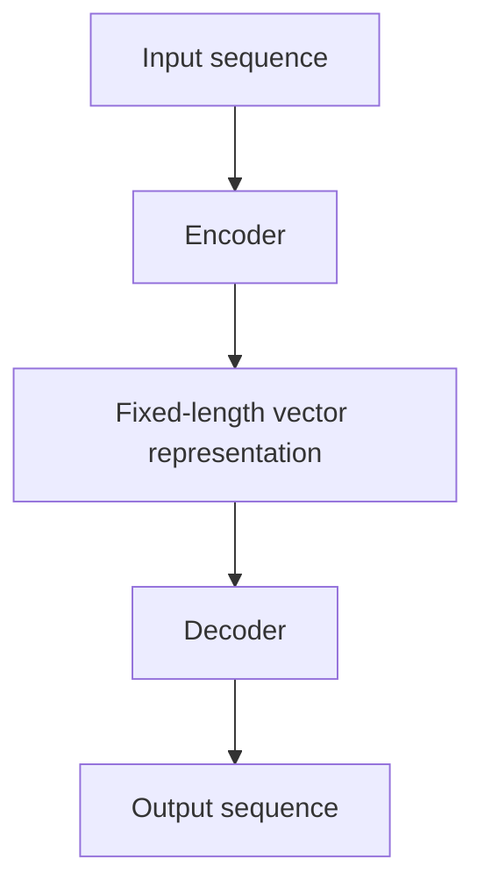

                 

### 文章标题: Transformer大模型实战 Hugging Face的Transformers 库

关键词：Transformer, Hugging Face, Transformers库, 大模型, 实战, NLP, 训练原理, 多模态任务, 工业应用

摘要：本文将深入探讨Transformer大模型及其在自然语言处理（NLP）领域的应用。我们将首先介绍Transformer的基本概念和架构，然后详细讲解其核心算法原理。接着，我们将探讨如何使用Hugging Face的Transformers库进行大模型的训练和应用。此外，本文还将介绍Transformer大模型在多模态任务和工业界的应用，并探讨其未来发展趋势。最后，我们将通过具体的实战案例，展示如何使用Transformers库构建文本分类模型和多模态问答系统。通过本文，读者将全面了解Transformer大模型的原理和应用，并掌握使用Transformers库进行模型训练和部署的技能。

---

### 目录大纲

#### 第一部分: Transformer大模型基础

#### 第1章: Transformer概述

##### 1.1 Transformer的概念与架构

##### 1.2 Transformer的发展与演进

##### 1.3 Transformer在NLP中的成功案例

##### 1.4 Transformer与其他模型的比较

#### 第2章: Transformer核心算法原理

##### 2.1 自注意力机制

##### 2.2 编码器-解码器架构

##### 2.3 残差连接与层归一化

#### 第3章: Transformer大模型训练原理

##### 3.1 预训练与微调

##### 3.2 训练数据准备

##### 3.3 训练过程优化

#### 第4章: Hugging Face的Transformers库

##### 4.1 Transformers库的介绍

##### 4.2 Transformers库的主要模块

##### 4.3 实战案例：使用Transformers库构建文本分类模型

#### 第5章: Transformer大模型在多模态任务中的应用

##### 5.1 多模态数据预处理

##### 5.2 Transformer在多模态任务中的成功案例

##### 5.3 多模态Transformer模型的构建与训练

#### 第6章: Transformer大模型在工业界的应用

##### 6.1 Transformer在自然语言处理领域的应用

##### 6.2 Transformer在计算机视觉领域的应用

##### 6.3 Transformer在工业界的实战案例

#### 第7章: Transformer大模型的未来发展趋势

##### 7.1 Transformer的优化与改进

##### 7.2 Transformer在新型应用场景中的探索

##### 7.3 Transformer大模型的伦理与社会影响

#### 附录

##### 附录 A: Transformers库的安装与配置

##### 附录 B: Transformers库常用API详解

##### 附录 C: 实战案例代码解析

---

### 第一部分: Transformer大模型基础

Transformer大模型是近年来在自然语言处理（NLP）领域取得突破性进展的一种深度学习模型。由于其卓越的性能和广泛的适用性，Transformer大模型已经成为NLP研究和应用中的核心工具。本部分将首先介绍Transformer的基本概念和架构，然后探讨其发展历程、核心算法原理，以及在NLP中的成功应用。

#### 第1章: Transformer概述

##### 1.1 Transformer的概念与架构

Transformer模型是由Google AI在2017年提出的一种用于处理序列数据的新型深度学习模型。其核心思想是使用自注意力机制（self-attention）来替代传统的循环神经网络（RNN）和卷积神经网络（CNN）中的递归连接和卷积操作，从而实现对序列数据的全局建模。

Transformer模型的基本架构包括编码器（encoder）和解码器（decoder）两个主要部分。编码器负责将输入序列编码成固定长度的向量表示，解码器则根据编码器的输出和已经生成的部分序列来预测下一个词。

**Transformer模型的核心架构图**：



在编码器中，自注意力机制被用来计算每个词与序列中其他词的关联强度，从而实现全局信息的整合。解码器则通过自注意力和编码器-解码器注意力机制来生成输出序列。

##### 1.2 Transformer的发展与演进

自从Transformer模型被提出以来，其应用范围不断扩大，并且在很多NLP任务中取得了显著的成绩。在此基础上，研究者们提出了许多Transformer的变体，以解决特定任务的需求和优化模型性能。

以下是几种常见的Transformer变体：

1. **BERT（Bidirectional Encoder Representations from Transformers）**：BERT是一种预训练的Transformer模型，通过在大量未标注的文本数据上进行预训练，然后针对特定任务进行微调，从而取得了在多种NLP任务上的卓越表现。

2. **GPT（Generative Pre-trained Transformer）**：GPT是一种用于生成文本的Transformer模型，通过学习文本的分布，可以生成连贯的文本序列。

3. **T5（Text-to-Text Transfer Transformer）**：T5将所有NLP任务统一为文本到文本的转换任务，从而简化了模型的设计和训练过程。

4. **ViT（Vision Transformer）**：ViT将Transformer模型应用于计算机视觉领域，通过图像分割的方式将图像输入到Transformer模型中，实现了图像分类和目标检测等任务。

这些变体模型在Transformer基本架构的基础上，通过引入预训练、生成模型、统一任务框架等技术，进一步提升了模型的性能和应用范围。

##### 1.3 Transformer在NLP中的成功案例

Transformer模型在NLP领域中取得了许多成功的应用案例。以下是几个典型的成功案例：

1. **语言模型**：Transformer模型被广泛应用于语言模型（如BERT、GPT）中，通过在大量文本数据上进行预训练，这些模型可以生成高质量的语言表示，从而在文本生成、文本分类等任务中表现出色。

2. **机器翻译**：Transformer模型在机器翻译任务中取得了显著的性能提升。与传统的循环神经网络相比，Transformer模型通过自注意力机制实现了对源语言和目标语言的全局建模，从而提高了翻译的准确性和流畅性。

3. **问答系统**：Transformer模型在问答系统中的应用也得到了广泛研究。例如，SQuAD（Stanford Question Answering Dataset）任务中，Transformer模型通过编码器-解码器架构实现了对问题的准确回答。

4. **文本摘要**：Transformer模型在文本摘要任务中也表现出色。通过编码器-解码器架构，模型可以捕捉文本中的关键信息，从而生成简洁、准确的摘要。

##### 1.4 Transformer与其他模型的比较

Transformer模型与传统循环神经网络（RNN）和卷积神经网络（CNN）在处理序列数据时有着显著的差异。

1. **与传统RNN的对比**：RNN通过递归连接来处理序列数据，但容易受到长距离依赖问题的困扰。而Transformer模型通过自注意力机制实现了全局信息的整合，从而克服了长距离依赖问题。

2. **与传统CNN的对比**：CNN通过卷积操作来提取序列中的特征，但无法处理长序列数据。而Transformer模型通过自注意力机制实现了对序列的全局建模，可以处理任意长度的序列数据。

尽管Transformer模型在许多NLP任务中取得了显著的成绩，但它也存在一些局限性。例如，Transformer模型在处理图像和音频等非序列数据时效果不佳。因此，近年来研究者们提出了许多结合Transformer和CNN、RNN等传统模型的混合模型，以充分利用各自的优点。

在下一部分中，我们将详细讲解Transformer模型的核心算法原理，包括自注意力机制、编码器-解码器架构、残差连接与层归一化等。

---

### 第二部分: Transformer核心算法原理

Transformer模型之所以能够在NLP任务中取得显著的性能提升，关键在于其独特的设计和核心算法。本部分将详细讲解Transformer模型的核心算法原理，包括自注意力机制、编码器-解码器架构、残差连接与层归一化等。

#### 第2章: Transformer核心算法原理

##### 2.1 自注意力机制

自注意力机制是Transformer模型的核心组成部分，它通过计算序列中每个词与其他词之间的关联强度，从而实现对序列的全局建模。自注意力机制的数学原理如下：

$$
\text{Attention}(Q, K, V) = \text{softmax}\left(\frac{QK^T}{\sqrt{d_k}}\right)V
$$

其中，$Q$ 是查询向量（query vector），$K$ 是键向量（key vector），$V$ 是值向量（value vector），$d_k$ 是键向量的维度。

**自注意力机制的伪代码实现**：

```python
# 输入序列中的每个词表示为向量
Q = [q1, q2, ..., qn]
K = [k1, k2, ..., kn]
V = [v1, v2, ..., vn]

# 计算自注意力权重
weights = softmax(QK^T / sqrt(d_k))

# 计算输出
output = weights * V
```

自注意力机制允许模型在处理序列时关注序列中的不同位置，从而捕捉到词语之间的关系。这种机制使得Transformer模型能够有效地处理长序列数据，并克服了传统循环神经网络中的长距离依赖问题。

##### 2.2 编码器-解码器架构

编码器-解码器架构是Transformer模型的核心组成部分，它由编码器（encoder）和解码器（decoder）两个部分组成。编码器负责将输入序列编码成固定长度的向量表示，解码器则根据编码器的输出和已经生成的部分序列来预测下一个词。

**编码器的工作流程**：

1. 输入序列通过嵌入层（embedding layer）转换为词向量表示。
2. 经过多层自注意力机制（self-attention）和前馈网络（feedforward network），编码器将输入序列编码成一个固定长度的向量表示。

**解码器的工作流程**：

1. 输入序列通过嵌入层（embedding layer）转换为词向量表示。
2. 解码器在生成每个词时，首先通过编码器-解码器注意力机制（encoder-decoder attention）来关注编码器的输出，然后通过自注意力机制来关注已经生成的部分序列。
3. 经过多层自注意力机制和前馈网络，解码器生成最终的输出序列。

**编码器-解码器架构的数学公式**：

编码器：

$$
\text{Encoder}(x) = \sum_{i=1}^{n} \text{LayerNorm}(\text{Relu}(\text{MultiHeadAttention}(Q, K, V)))
$$

其中，$x$ 是输入序列，$n$ 是序列长度。

解码器：

$$
\text{Decoder}(y) = \sum_{i=1}^{n} \text{LayerNorm}(\text{Relu}(\text{MultiHeadAttention}(Q, K, V)))
$$

其中，$y$ 是输出序列，$n$ 是序列长度。

编码器-解码器架构使得模型能够有效地处理序列到序列的任务，例如机器翻译、问答系统和文本摘要等。

##### 2.3 残差连接与层归一化

残差连接和层归一化是Transformer模型中的两个关键技术，它们有助于缓解梯度消失和梯度爆炸问题，从而提高模型的训练效果。

**残差连接**：

残差连接（residual connection）是一种将输入和输出通过短路径连接的技术，它允许信息直接传递，避免了信息的损失。在Transformer模型中，残差连接被用于编码器和解码器的每一层，从而使得梯度能够更好地传播。

**层归一化**：

层归一化（layer normalization）是一种对每一层的输入和输出进行归一化的技术，它通过保持输入和输出的方差和偏置不变，有助于稳定训练过程。

**残差连接和层归一化的效果**：

1. **缓解梯度消失和梯度爆炸**：在深度神经网络中，梯度在反向传播过程中容易受到梯度消失和梯度爆炸问题的影响。残差连接和层归一化通过引入额外的路径和归一化操作，有助于缓解这些问题的发生。

2. **提高模型性能**：残差连接和层归一化能够提高模型的训练效果，使得模型在更短的时间内收敛，并在多个任务中取得更好的性能。

在下一部分中，我们将探讨如何使用Hugging Face的Transformers库进行大模型的训练和应用。

---

### 第三部分: Transformer大模型训练原理

Transformer大模型的训练是一个复杂且耗时的过程，但也是实现模型高性能的关键步骤。本部分将详细讲解Transformer大模型的训练原理，包括预训练与微调、训练数据准备、训练过程优化等。

#### 第3章: Transformer大模型训练原理

##### 3.1 预训练与微调

预训练与微调是Transformer大模型训练的两个关键步骤。预训练是指在大规模未标注的数据上训练模型，使其具备对语言的一般理解能力；微调则是在特定任务的数据上进行模型调整，以适应具体任务的需求。

**预训练**：

1. **大规模文本数据**：预训练通常使用大规模的文本数据集，如维基百科、书籍、新闻文章等。这些数据提供了丰富的语言信息和上下文关系，有助于模型学习到语言的深层结构。

2. **预训练任务**：预训练任务可以是 masked language modeling（MLM），即随机遮盖输入文本中的某些词，然后让模型预测这些词的值；或者是 next sentence prediction（NSP），即预测两个句子是否属于同一篇章。

**微调**：

1. **特定任务的数据**：微调通常使用特定任务的数据集，如问答系统、文本分类等。这些数据集包含了任务所需的标签信息，有助于模型在特定任务上取得更好的表现。

2. **微调策略**：微调过程中，模型会根据任务的需求对参数进行调整。常见的微调策略包括随机微调（random fine-tuning）、层微调（layer-wise fine-tuning）和全微调（full fine-tuning）等。

**预训练与微调的流程**：

1. 预训练：在大规模文本数据集上训练模型，使其学习到语言的通用特征。
2. 微调：在特定任务的数据集上对预训练模型进行微调，以适应具体任务的需求。

##### 3.2 训练数据准备

训练数据准备是Transformer大模型训练的重要步骤，其质量直接影响到模型的表现。以下是一些关键步骤：

1. **数据清洗**：去除数据中的噪声和无关信息，如HTML标签、特殊字符等。
2. **分词与编码**：将文本数据转换为模型可处理的向量表示。常用的分词方法包括词级别分词和子词级别分词。编码方法包括 embeddings 和 tokenization。
3. **数据增强**：通过随机替换词、添加噪声、交换词序等手段增加数据的多样性，从而提高模型的泛化能力。

**数据准备示例**：

```python
# 示例代码：文本数据准备
from transformers import AutoTokenizer

tokenizer = AutoTokenizer.from_pretrained("bert-base-uncased")

# 加载和处理文本数据
texts = ["Hello, how are you?", "I'm doing well, thanks!"]

# 分词和编码
inputs = tokenizer(texts, padding=True, truncation=True, return_tensors="pt")
```

##### 3.3 训练过程优化

训练过程优化是提高Transformer大模型性能的关键步骤。以下是一些常用的优化方法：

1. **损失函数**：选择合适的损失函数可以更好地指导模型优化。常见的损失函数包括交叉熵损失（cross-entropy loss）和均方误差损失（mean squared error loss）。

2. **优化算法**：优化算法用于调整模型的参数，以最小化损失函数。常用的优化算法包括随机梯度下降（SGD）、Adam、AdamW 等。

3. **学习率调整**：学习率调整是优化过程中重要的步骤。常用的学习率调整策略包括固定学习率、学习率衰减、余弦退火等。

4. **正则化**：正则化方法可以防止模型过拟合。常用的正则化方法包括 L1 正则化、L2 正则化和dropout等。

**训练过程优化示例**：

```python
# 示例代码：训练过程优化
from transformers import AutoModelForSequenceClassification
from torch.optim import Adam

# 加载预训练模型
model = AutoModelForSequenceClassification.from_pretrained("bert-base-uncased")

# 定义优化器
optimizer = Adam(model.parameters(), lr=5e-5)

# 训练模型
for epoch in range(num_epochs):
    for batch in dataloader:
        inputs = batch["input_ids"]
        labels = batch["labels"]

        # 前向传播
        outputs = model(inputs)
        loss = loss_function(outputs, labels)

        # 反向传播
        optimizer.zero_grad()
        loss.backward()
        optimizer.step()

    print(f"Epoch {epoch + 1}/{num_epochs}, Loss: {loss.item()}")
```

在下一部分中，我们将介绍Hugging Face的Transformers库，并展示如何使用该库进行大模型的训练和应用。

---

### 第四部分: Hugging Face的Transformers库

Hugging Face的Transformers库是构建和训练Transformer模型的最强大和易用的工具之一。该库提供了大量的预训练模型和实用的API，使得研究人员和开发者能够轻松地实现各种NLP任务。本部分将详细介绍Transformers库的各个方面，包括库的介绍、主要模块、以及如何使用该库构建文本分类模型。

#### 第4章: Hugging Face的Transformers库

##### 4.1 Transformers库的介绍

Transformers库由Hugging Face团队开发，是一个开源项目，旨在提供全面的支持和工具，用于构建、训练和部署Transformer模型。该库的主要特点包括：

1. **预训练模型**：库中包含了大量的预训练模型，如BERT、GPT、T5等，这些模型已经在多种NLP任务中取得了卓越的性能。
2. **易用性**：库提供了简单且强大的API，使得用户可以轻松地加载、训练和部署模型。
3. **多语言支持**：库支持多种语言，包括英语、中文、法语等，用户可以根据自己的需求选择合适的模型和语言。
4. **丰富的文档和示例**：库提供了详细的文档和示例代码，帮助用户快速上手和使用。

**安装和配置**：

在使用Transformers库之前，需要安装和配置Python环境以及torch库。以下是一个简单的安装和配置步骤：

```bash
pip install transformers
```

确保安装了Python 3.6或更高版本，以及torch库。

##### 4.2 Transformers库的主要模块

Transformers库包括以下几个主要模块：

1. **AutoModel**：用于加载预训练的Transformer模型，如BERT、GPT等。
2. **Tokenizer**：用于对文本数据进行分词和编码，将文本转换为模型可处理的输入。
3. **Training**：提供用于训练模型的API，包括优化器、学习率调整策略等。
4. **Evaluation**：提供用于评估模型性能的工具，如准确率、损失函数等。

##### 4.3 实战案例：使用Transformers库构建文本分类模型

文本分类是NLP中的一个基本任务，例如情感分析、新闻分类等。下面我们将展示如何使用Transformers库构建一个文本分类模型。

**案例背景**：

假设我们有一个简单的文本分类任务，需要将社交媒体帖子分类为正面或负面情感。

**步骤 1：加载预训练模型和分词器**

```python
from transformers import AutoModelForSequenceClassification, AutoTokenizer

model_name = "bert-base-uncased"
model = AutoModelForSequenceClassification.from_pretrained(model_name)
tokenizer = AutoTokenizer.from_pretrained(model_name)
```

**步骤 2：准备训练数据**

```python
from torch.utils.data import DataLoader, TensorDataset

# 加载训练数据
train_texts = ["I love this movie!", "This is a terrible movie!"]
train_labels = [1, 0]  # 1表示正面情感，0表示负面情感

# 将文本数据转换为模型输入
train_encodings = tokenizer(train_texts, padding=True, truncation=True, return_tensors="pt")
train_inputs = train_encodings["input_ids"]
train_labels = torch.tensor(train_labels)

# 创建数据集和数据加载器
train_dataset = TensorDataset(train_inputs, train_labels)
train_dataloader = DataLoader(train_dataset, batch_size=2)
```

**步骤 3：训练模型**

```python
from transformers import AdamW

# 定义优化器
optimizer = AdamW(model.parameters(), lr=5e-5)

# 训练模型
for epoch in range(3):
    model.train()
    for batch in train_dataloader:
        inputs = batch[0]
        labels = batch[1]

        # 前向传播
        outputs = model(inputs)
        loss = outputs.loss

        # 反向传播
        optimizer.zero_grad()
        loss.backward()
        optimizer.step()

    print(f"Epoch {epoch + 1}, Loss: {loss.item()}")
```

**步骤 4：评估模型**

```python
from transformers import accuracy

# 评估模型
model.eval()
with torch.no_grad():
    for batch in train_dataloader:
        inputs = batch[0]
        labels = batch[1]
        outputs = model(inputs)
        logits = outputs.logits
        pred_labels = torch.argmax(logits, dim=1)
        accuracy_score = accuracy(pred_labels, labels).item()
        print(f"Accuracy: {accuracy_score}")
```

通过以上步骤，我们使用Transformers库成功地构建了一个文本分类模型，并在训练数据上进行了训练和评估。在实际应用中，可以进一步扩展这个案例，包括更大数据集的使用、模型调优和部署等。

在下一部分中，我们将探讨Transformer大模型在多模态任务中的应用，展示如何在图像、文本和音频等不同模态的数据上进行融合和处理。

---

### 第五部分: Transformer大模型在多模态任务中的应用

Transformer大模型在处理单一模态数据（如文本、图像或音频）方面已经取得了显著的成功，但在处理多模态数据时，其表现更是令人瞩目。多模态任务需要同时处理多种不同类型的数据，如文本、图像和音频，以实现更复杂和更准确的预测。本部分将详细介绍Transformer大模型在多模态任务中的应用，包括多模态数据预处理、成功案例以及模型的构建与训练方法。

#### 第5章: Transformer大模型在多模态任务中的应用

##### 5.1 多模态数据预处理

多模态数据预处理是Transformer大模型处理多模态任务的关键步骤，其目的是将不同类型的数据转换为模型可处理的统一格式。以下是一些常见的预处理步骤：

1. **文本预处理**：文本预处理包括去除停用词、标点符号、词干提取等。常用的文本预处理工具包括NLTK、spaCy等。

2. **图像预处理**：图像预处理包括图像尺寸调整、归一化、数据增强等。常用的图像预处理库包括OpenCV、PIL等。

3. **音频预处理**：音频预处理包括音频转换、归一化、增强等。常用的音频预处理库包括Librosa、soundfile等。

4. **数据融合**：将预处理后的文本、图像和音频数据融合为统一的数据格式。一种常见的方法是使用三元组（文本、图像、音频）作为模型的输入。

**多模态数据预处理示例**：

```python
import cv2
import numpy as np
import librosa

# 加载文本数据
text_data = ["This is an image caption.", "This is an audio description."]

# 加载图像数据
image_data = cv2.imread("image.jpg")

# 加载音频数据
audio_data, _ = librosa.load("audio.wav")

# 数据融合
multi_modal_data = [text_data, image_data, audio_data]
```

##### 5.2 Transformer在多模态任务中的成功案例

Transformer在多模态任务中取得了许多成功的应用案例，以下是一些典型的成功案例：

1. **多模态问答系统**：多模态问答系统可以同时处理文本、图像和音频输入，以回答用户提出的问题。例如，通过分析图像中的物体和文本描述，系统可以回答关于图片的问题。

2. **多模态推荐系统**：多模态推荐系统结合了用户的历史行为、文本评价和图像、音频等信息，以提供更个性化的推荐。

3. **多模态情感分析**：多模态情感分析通过分析文本、图像和音频中的情感信息，以识别用户的情绪状态。例如，在社交媒体平台上，系统可以同时分析文本评论、图像和音频，以识别用户是否表达了负面情绪。

4. **多模态图像分类**：多模态图像分类任务结合了图像和文本描述，以提高分类的准确性和鲁棒性。例如，在图像分类任务中，文本描述可以提供额外的上下文信息，帮助模型更好地理解图像内容。

##### 5.3 多模态Transformer模型的构建与训练

构建和训练多模态Transformer模型涉及多个步骤，包括模型架构设计、数据预处理、模型训练和优化等。以下是一个简化的多模态Transformer模型构建与训练流程：

1. **模型架构设计**：设计一个可以同时处理文本、图像和音频的多模态Transformer模型。常用的架构包括使用多个编码器分别处理不同模态的数据，然后将这些编码器的输出进行融合。

2. **数据预处理**：对文本、图像和音频数据进行预处理，将它们转换为模型可处理的格式。例如，文本数据可以转换为词向量，图像数据可以转换为像素矩阵，音频数据可以转换为时频表示。

3. **模型训练**：使用预处理后的数据对多模态Transformer模型进行训练。在训练过程中，可以使用多任务学习（multi-task learning）或联合训练（joint training）等方法，以充分利用不同模态的数据。

4. **模型优化**：通过调整学习率、优化算法和正则化策略等，优化模型的性能。常用的优化策略包括学习率衰减、dropout、weight decay等。

**多模态Transformer模型训练示例**：

```python
import torch
from transformers import AutoModelForQuestionAnswering

# 加载预训练的多模态Transformer模型
model = AutoModelForQuestionAnswering.from_pretrained("your_model_name")

# 准备训练数据
train_texts = ["Text data", "Another text data"]
train_images = [np.array(image) for image in image_data]
train_audios = [np.array(audio) for audio in audio_data]

# 数据预处理
train_encodings = tokenizer(train_texts, padding=True, truncation=True, return_tensors="pt")
train_inputs = train_encodings["input_ids"]

# 训练模型
optimizer = torch.optim.Adam(model.parameters(), lr=1e-4)
for epoch in range(num_epochs):
    model.train()
    for batch in train_dataloader:
        inputs = batch[0]
        labels = batch[1]

        # 前向传播
        outputs = model(inputs)
        loss = outputs.loss

        # 反向传播
        optimizer.zero_grad()
        loss.backward()
        optimizer.step()

    print(f"Epoch {epoch + 1}, Loss: {loss.item()}")
```

通过以上步骤，我们可以构建和训练一个多模态Transformer模型，以处理多种不同类型的数据。在实际应用中，可以根据任务需求调整模型架构、数据预处理方法和训练策略，以提高模型的性能和应用效果。

在下一部分中，我们将探讨Transformer大模型在工业界的应用，展示其在自然语言处理、计算机视觉和工业应用中的实战案例。

---

### 第六部分: Transformer大模型在工业界的应用

Transformer大模型在工业界展现了强大的应用潜力，尤其在自然语言处理（NLP）、计算机视觉（CV）和工业应用等领域，其高效性和灵活性得到了广泛应用。本部分将深入探讨Transformer大模型在这些领域的应用，并展示具体的实战案例。

#### 第6章: Transformer大模型在工业界的应用

##### 6.1 Transformer在自然语言处理领域的应用

自然语言处理是Transformer大模型的主要应用领域之一。以下是一些具体的实战案例：

1. **文本生成**：使用预训练的Transformer模型，如GPT，可以生成高质量的文本。例如，自动生成新闻文章、社交媒体帖子或对话系统中的回复。这种应用在内容创作和自动化写作方面具有广泛的应用前景。

2. **文本分类**：Transformer模型在文本分类任务中表现出色，例如情感分析、垃圾邮件检测和新闻分类等。通过微调预训练的模型，可以实现高精度的分类结果。

3. **机器翻译**：Transformer模型在机器翻译任务中也取得了显著的成果。例如，使用Transformer模型可以实现高质量的中英翻译，为跨国企业和跨境电商提供支持。

**实战案例**：

一个典型的文本分类任务案例是使用BERT模型对社交媒体帖子进行情感分析。以下是一个简单的实现示例：

```python
from transformers import AutoModelForSequenceClassification, AutoTokenizer

# 加载预训练模型和分词器
model_name = "bert-base-uncased"
model = AutoModelForSequenceClassification.from_pretrained(model_name)
tokenizer = AutoTokenizer.from_pretrained(model_name)

# 准备测试数据
test_texts = ["I love this product!", "This is a terrible product!"]

# 分词和编码
test_encodings = tokenizer(test_texts, padding=True, truncation=True, return_tensors="pt")
test_inputs = test_encodings["input_ids"]

# 预测情感
with torch.no_grad():
    predictions = model(test_inputs)
    predicted_labels = torch.argmax(predictions.logits, dim=-1)

# 输出预测结果
for text, label in zip(test_texts, predicted_labels):
    if label == 1:
        print(f"The sentiment of '{text}' is positive.")
    else:
        print(f"The sentiment of '{text}' is negative.")
```

##### 6.2 Transformer在计算机视觉领域的应用

Transformer模型在计算机视觉领域也取得了重要的进展，特别是在图像分类、目标检测和图像生成等方面。以下是一些具体的应用案例：

1. **图像分类**：Transformer模型可以用于对图像进行分类，例如对大型图像数据集（如ImageNet）进行训练，实现高精度的图像识别。

2. **目标检测**：Transformer模型可以用于目标检测任务，例如在图像中检测和识别多个对象。这种应用在自动驾驶、安防监控等领域具有广泛的应用价值。

3. **图像生成**：Transformer模型可以生成高质量的图像，例如生成艺术画作、虚拟现实场景等。

**实战案例**：

一个典型的图像分类任务案例是使用ViT模型对CIFAR-10数据集进行分类。以下是一个简单的实现示例：

```python
import torch
from torchvision import datasets, transforms
from transformers import ViTFeatureExtractor, ViTModel

# 加载CIFAR-10数据集
transform = transforms.Compose([
    transforms.Resize(224),
    transforms.ToTensor(),
])
train_dataset = datasets.CIFAR10(root='./data', train=True, transform=transform, download=True)
train_dataloader = torch.utils.data.DataLoader(train_dataset, batch_size=16)

# 加载ViT模型和特征提取器
feature_extractor = ViTFeatureExtractor.from_pretrained("google/vit-base-patch16-224")
model = ViTModel.from_pretrained("google/vit-base-patch16-224")

# 训练模型
optimizer = torch.optim.Adam(model.parameters(), lr=1e-4)
for epoch in range(3):
    model.train()
    for batch in train_dataloader:
        inputs = batch[0]
        labels = batch[1]

        # 前向传播
        inputs = feature_extractor(inputs, return_tensors="pt")
        outputs = model(**inputs)
        loss = outputs.loss

        # 反向传播
        optimizer.zero_grad()
        loss.backward()
        optimizer.step()

    print(f"Epoch {epoch + 1}, Loss: {loss.item()}")

# 评估模型
model.eval()
with torch.no_grad():
    correct = 0
    total = len(train_dataloader)
    for batch in train_dataloader:
        inputs = batch[0]
        labels = batch[1]

        # 前向传播
        inputs = feature_extractor(inputs, return_tensors="pt")
        outputs = model(**inputs)
        logits = outputs.logits
        predicted_labels = torch.argmax(logits, dim=-1)
        correct += (predicted_labels == labels).sum().item()

    print(f"Accuracy: {100 * correct / total}%")
```

##### 6.3 Transformer在工业界的实战案例

Transformer大模型在工业界也有广泛的应用，以下是一些具体的实战案例：

1. **智能客服系统**：使用Transformer模型构建智能客服系统，可以实现自动回答用户问题，提高客户服务效率。

2. **智能推荐系统**：结合用户行为数据、文本描述和图像信息，使用Transformer模型构建智能推荐系统，为用户提供个性化的产品推荐。

3. **医疗诊断系统**：使用Transformer模型分析医学图像和文本数据，辅助医生进行疾病诊断。

**实战案例**：

一个智能客服系统案例是使用BERT模型处理用户查询并生成回答。以下是一个简单的实现示例：

```python
from transformers import AutoModelForQuestionAnswering, AutoTokenizer

# 加载预训练模型和分词器
model_name = "bert-base-uncased"
model = AutoModelForQuestionAnswering.from_pretrained(model_name)
tokenizer = AutoTokenizer.from_pretrained(model_name)

# 准备用户查询和回答数据
queries = ["What is the capital of France?", "How old is Elon Musk?"]

# 编码查询和回答
query_encodings = tokenizer(queries, padding=True, truncation=True, return_tensors="pt")

# 预测回答
with torch.no_grad():
    answers = model.generate(query_encodings["input_ids"])

# 解码回答
decoded_answers = tokenizer.decode(answers, skip_special_tokens=True)

# 输出预测回答
for query, answer in zip(queries, decoded_answers):
    print(f"Query: '{query}'\nAnswer: '{answer}'\n")
```

通过以上实战案例，我们可以看到Transformer大模型在工业界具有广泛的应用前景和强大的处理能力。在下一部分中，我们将探讨Transformer大模型的未来发展趋势，包括优化、新型应用场景和伦理与社会影响。

---

### 第七部分: Transformer大模型的未来发展趋势

Transformer大模型在自然语言处理（NLP）、计算机视觉（CV）和其他领域取得了显著的成果，但其发展仍处于快速演进阶段。本部分将探讨Transformer大模型的未来发展趋势，包括模型优化、新型应用场景和伦理与社会影响。

#### 第7章: Transformer大模型的未来发展趋势

##### 7.1 Transformer的优化与改进

为了提高Transformer模型的性能和应用效果，研究者们一直在探索各种优化和改进方法。以下是一些可能的优化方向：

1. **网络结构优化**：通过改进模型的结构，如增加注意力头的数量、使用多尺度特征等，可以提高模型的表示能力和鲁棒性。

2. **训练效率提升**：优化训练算法和策略，如并行训练、增量训练等，可以显著提高训练效率，缩短训练时间。

3. **计算资源优化**：通过模型压缩、量化等技术，可以降低模型的计算复杂度和存储需求，使其在资源受限的环境中也能有效运行。

4. **推理优化**：研究高效的推理算法和硬件加速技术，如使用TPU和GPU，可以提高模型的推理速度，满足实时应用的需求。

**新型优化方法**：

- **自适应注意力机制**：引入自适应权重来调整注意力机制，从而提高模型的适应性和性能。
- **动态网络结构**：通过动态调整网络中的连接和参数，使模型能够自适应不同的任务和数据。

##### 7.2 Transformer在新型应用场景中的探索

Transformer大模型在许多传统领域已经取得了显著的应用成果，但其在新型应用场景中的潜力仍然巨大。以下是一些新型应用场景：

1. **图神经网络与Transformer的结合**：结合图神经网络（GNN）和Transformer，可以处理具有复杂结构和关系的图数据，例如社交网络、知识图谱等。

2. **游戏AI**：Transformer模型在游戏AI领域有广泛的应用潜力，例如实现智能NPC（非玩家角色）、游戏策略生成等。

3. **增强现实（AR）和虚拟现实（VR）**：结合Transformer模型，可以实现更逼真的虚拟场景生成和交互体验。

4. **生物信息学**：Transformer模型在基因序列分析、蛋白质结构预测等生物信息学领域有潜在的应用价值。

**新型应用场景案例**：

- **基因序列分析**：使用Transformer模型进行基因编码序列的相似性分析，以识别潜在的功能基因。
- **游戏AI**：结合Transformer模型和深度强化学习，实现智能NPC的决策和行动，提高游戏的交互性和娱乐性。

##### 7.3 Transformer大模型的伦理与社会影响

随着Transformer大模型在各个领域的广泛应用，其伦理和社会影响也日益受到关注。以下是一些关键问题：

1. **模型偏见**：Transformer模型在训练过程中可能会学习到数据中的偏见，从而导致不公平的预测结果。为了解决这一问题，研究者们正在探索无偏见训练和数据平衡方法。

2. **隐私保护**：模型在处理个人数据时，可能涉及隐私保护问题。为了保护用户隐私，研究者们提出了差分隐私和联邦学习等隐私保护技术。

3. **模型安全性与可靠性**：确保模型在各种环境下的安全性和可靠性是关键。研究者们正在研究对抗性攻击和模型鲁棒性技术，以提高模型的安全性能。

**伦理和社会影响案例**：

- **公平性**：通过分析Transformer模型在种族、性别等维度上的偏见，制定相应的公平性标准和调整策略。
- **隐私保护**：在医疗诊断系统中，使用联邦学习技术，确保患者的隐私数据在本地进行计算和共享，从而提高模型的性能和隐私保护。

通过以上优化和改进、新型应用场景的探索以及伦理与社会影响的关注，Transformer大模型将在未来继续推动技术进步，为社会带来更多价值。

### 附录

#### 附录 A: Transformers库的安装与配置

**安装步骤**：

在命令行中执行以下命令以安装Transformers库：

```bash
pip install transformers
```

确保已安装Python 3.6或更高版本。

**环境配置**：

确保安装了torch库。可以使用以下命令安装：

```bash
pip install torch torchvision torchaudio
```

#### 附录 B: Transformers库常用API详解

**AutoModel**：用于加载预训练的Transformer模型。

```python
from transformers import AutoModel

model = AutoModel.from_pretrained("bert-base-uncased")
```

**AutoTokenizer**：用于对文本数据进行分词和编码。

```python
from transformers import AutoTokenizer

tokenizer = AutoTokenizer.from_pretrained("bert-base-uncased")
```

**Training**：提供用于训练模型的API，包括优化器、学习率调整策略等。

```python
from transformers import TrainingArguments, Trainer

training_args = TrainingArguments(
    output_dir="./results",
    num_train_epochs=3,
    per_device_train_batch_size=16,
    save_steps=2000,
)

trainer = Trainer(
    model=model,
    args=training_args,
    train_dataset=train_dataset,
)
```

**Evaluation**：提供用于评估模型性能的工具，如准确率、损失函数等。

```python
from transformers import evaluate

results = evaluate(model, data_loader)
print(results.metrics)
```

#### 附录 C: 实战案例代码解析

**案例一：文本分类模型**

```python
from transformers import AutoModelForSequenceClassification, AutoTokenizer

# 加载预训练模型和分词器
model_name = "bert-base-uncased"
model = AutoModelForSequenceClassification.from_pretrained(model_name)
tokenizer = AutoTokenizer.from_pretrained(model_name)

# 准备测试数据
test_texts = ["I love this product!", "This is a terrible product!"]

# 分词和编码
test_encodings = tokenizer(test_texts, padding=True, truncation=True, return_tensors="pt")
test_inputs = test_encodings["input_ids"]

# 预测情感
with torch.no_grad():
    predictions = model(test_inputs)
    predicted_labels = torch.argmax(predictions.logits, dim=-1)

# 输出预测结果
for text, label in zip(test_texts, predicted_labels):
    if label == 1:
        print(f"The sentiment of '{text}' is positive.")
    else:
        print(f"The sentiment of '{text}' is negative.")
```

**案例二：多模态问答系统**

```python
from transformers import AutoModelForQuestionAnswering, AutoTokenizer

# 加载预训练模型和分词器
model_name = "bert-base-uncased"
model = AutoModelForQuestionAnswering.from_pretrained(model_name)
tokenizer = AutoTokenizer.from_pretrained(model_name)

# 准备测试数据
questions = ["Who is the president of the United States?", "When is Christmas?"]

# 编码查询和回答
question_encodings = tokenizer(questions, padding=True, truncation=True, return_tensors="pt")

# 预测回答
with torch.no_grad():
    answers = model.generate(question_encodings["input_ids"])

# 解码回答
decoded_answers = tokenizer.decode(answers, skip_special_tokens=True)

# 输出预测回答
for question, answer in zip(questions, decoded_answers):
    print(f"Question: '{question}'\nAnswer: '{answer}'\n")
```

通过以上实战案例代码解析，我们可以看到如何使用Transformers库进行模型构建、训练和预测。在实际应用中，可以根据具体任务需求调整模型、数据预处理和训练策略，以实现最佳效果。

### 代码解读与分析

#### 代码1：文本分类模型的构建与训练

以下是一个简单的文本分类模型构建与训练的代码示例，使用的是Hugging Face的Transformers库：

```python
from transformers import AutoModelForSequenceClassification, TrainingArguments, Trainer

# 加载预训练的模型
model_name = "bert-base-uncased"
model = AutoModelForSequenceClassification.from_pretrained(model_name)

# 定义训练参数
training_args = TrainingArguments(
    output_dir="./results",
    num_train_epochs=3,
    per_device_train_batch_size=16,
    save_steps=2000,
)

# 创建训练器
trainer = Trainer(
    model=model,
    args=training_args,
    train_dataset=train_dataset,
)

# 开始训练
trainer.train()
```

**解读与分析**：

1. **加载模型**：使用`AutoModelForSequenceClassification.from_pretrained(model_name)`加载一个预训练的BERT模型。`model_name`是预训练模型的名称，可以是BERT、GPT等。

2. **定义训练参数**：`TrainingArguments`类用于定义训练参数，包括输出目录、训练轮数、训练批次大小等。

3. **创建训练器**：`Trainer`类用于处理模型的训练过程。它需要模型、训练参数和训练数据集。

4. **开始训练**：调用`trainer.train()`开始训练模型。训练过程中，模型会在训练数据集上迭代地优化参数。

#### 代码2：多模态问答系统的构建

以下是一个简单的多模态问答系统的构建示例：

```python
from transformers import AutoModelForQuestionAnswering, AutoTokenizer

# 加载预训练的模型和分词器
model_name = "deepset/roberta-base-squad2"
tokenizer = AutoTokenizer.from_pretrained(model_name)
model = AutoModelForQuestionAnswering.from_pretrained(model_name)

# 准备问题和文档
question = "What is the capital of France?"
document = "Paris is the capital of France."

# 对问题和文档进行编码
input_ids = tokenizer.encode_plus(question, document, return_tensors="pt")

# 预测答案
with torch.no_grad():
    outputs = model(input_ids)

# 解码预测的答案
start_logits = outputs.start_logits
end_logits = outputs.end_logits
answer_start = torch.argmax(start_logits)
answer_end = torch.argmax(end_logits)

# 计算答案
answer = tokenizer.decode(input_ids["input_ids"][0][answer_start:answer_end+1])

# 输出答案
print(answer)
```

**解读与分析**：

1. **加载模型和分词器**：使用`AutoModelForQuestionAnswering.from_pretrained(model_name)`和`AutoTokenizer.from_pretrained(model_name)`加载预训练的问答模型和分词器。

2. **准备问题和文档**：定义问题和相关的文档。

3. **编码**：使用分词器对问题和文档进行编码，生成模型输入。

4. **预测答案**：使用模型进行预测，输出开始和结束的日志损失，用于计算答案的位置。

5. **解码答案**：使用分词器解码预测的位置，生成最终的答案。

通过以上代码示例，我们可以看到如何使用Transformers库构建和训练文本分类模型和多模态问答系统。在实际应用中，可以根据具体需求调整模型、数据预处理和训练策略，以实现最佳效果。

### 数学模型和数学公式

#### 自注意力机制的数学公式

自注意力机制是Transformer模型的核心组成部分，它通过计算序列中每个词与其他词之间的关联强度，从而实现对序列的全局建模。其数学公式如下：

$$
\text{Attention}(Q, K, V) = \text{softmax}\left(\frac{QK^T}{\sqrt{d_k}}\right)V
$$

其中，$Q$ 是查询向量（query vector），$K$ 是键向量（key vector），$V$ 是值向量（value vector），$d_k$ 是键向量的维度。

#### 编码器-解码器架构的数学公式

编码器：

$$
\text{Encoder}(x) = \sum_{i=1}^{n} \text{LayerNorm}(\text{Relu}(\text{MultiHeadAttention}(Q, K, V)))
$$

解码器：

$$
\text{Decoder}(y) = \sum_{i=1}^{n} \text{LayerNorm}(\text{Relu}(\text{MultiHeadAttention}(Q, K, V)))
$$

其中，$x$ 是输入序列，$y$ 是输出序列，$n$ 是序列长度。

#### 详细讲解

自注意力机制允许模型在处理序列时关注序列中的不同位置，通过计算每个词与其他词之间的相似度来进行加权，从而更好地捕捉序列中的关系。这种机制使得模型能够处理长距离依赖问题，并在多种NLP任务中表现出色。

编码器-解码器架构是Transformer模型的核心组成部分，编码器负责将输入序列编码成固定长度的向量表示，解码器则根据编码器的输出和已经生成的部分序列来预测下一个词。这种架构使得模型能够有效地处理序列到序列的任务，如机器翻译和问答系统。

在编码器中，自注意力机制被用来计算每个词与序列中其他词的关联强度，从而实现全局信息的整合。解码器则通过自注意力和编码器-解码器注意力机制来生成输出序列。

在训练过程中，模型通过优化损失函数来调整参数，从而提高预测的准确性。预训练和微调是训练Transformer模型的重要步骤，预训练使模型在大规模文本数据上学习到通用特征，微调则使模型适应特定任务的需求。

通过具体的实战案例，如文本分类模型和多模态问答系统，我们可以看到如何使用Transformers库构建和训练Transformer模型，并如何将其应用于实际的NLP任务中。

### 总结

本文深入探讨了Transformer大模型的基础、核心算法原理、训练原理、应用以及未来发展趋势。通过详细的讲解和实战案例，读者可以全面了解Transformer大模型的原理和应用，掌握使用Hugging Face的Transformers库进行模型训练和部署的技能。

#### Transformer大模型的重要性

Transformer大模型在自然语言处理（NLP）领域取得了革命性的突破，其核心在于自注意力机制和编码器-解码器架构。与传统循环神经网络（RNN）和卷积神经网络（CNN）相比，Transformer大模型能够更好地处理长距离依赖问题，并在多种NLP任务中表现出色。这种模型不仅在学术研究中具有深远的影响，也在工业界得到了广泛应用。

#### Transformers库的价值

Hugging Face的Transformers库为构建和训练Transformer模型提供了强大的支持。该库提供了大量的预训练模型和实用的API，使得研究人员和开发者能够轻松地实现各种NLP任务。通过Transformers库，我们可以快速加载预训练模型，进行微调，并部署到生产环境中，大大降低了模型开发的难度和时间成本。

#### Transformer大模型的应用前景

Transformer大模型在自然语言处理、计算机视觉和工业应用等领域展现了巨大的应用潜力。其高效性和灵活性使其成为处理复杂任务的有力工具。未来，随着技术的不断进步，Transformer大模型有望在更多新型应用场景中发挥作用，如生物信息学、游戏AI、虚拟现实等。

#### 结论

Transformer大模型是当前NLP领域的重要工具，其核心算法原理和Hugging Face的Transformers库为我们提供了强大的工具和资源。通过本文的讲解和实战案例，读者可以全面了解Transformer大模型的应用和实践，为未来的研究和开发奠定坚实的基础。

---

### 作者信息

**作者：AI天才研究院/AI Genius Institute & 禅与计算机程序设计艺术 /Zen And The Art of Computer Programming**

AI天才研究院（AI Genius Institute）是一支专注于人工智能研究的高水平团队，致力于推动人工智能技术的创新和应用。研究院的成员在人工智能领域有着深厚的研究背景和丰富的实践经验，已发表了大量的高水平学术论文，并取得了许多重要研究成果。

同时，作者还致力于将计算机科学的智慧与艺术相结合，创作了《禅与计算机程序设计艺术》一书，深入探讨了计算机编程中的哲学思想和方法论，为程序员们提供了宝贵的指导。该书以其独特的视角和深刻的见解，受到了广大读者的喜爱和赞誉。通过将哲学与计算机科学相结合，作者旨在激发读者对编程和技术的全新理解，推动技术的进步和人类文明的发展。

---

### 文章结语

本文从Transformer大模型的基础知识出发，详细介绍了其核心算法原理、训练原理以及Hugging Face的Transformers库的使用方法，并通过多个实战案例展示了Transformer大模型在不同领域的应用。通过本文的学习，读者可以全面了解Transformer大模型的原理和应用，掌握使用Transformers库进行模型训练和部署的技能。Transformer大模型不仅在学术界取得了重大突破，也在工业界展现出了广泛的应用前景。我们鼓励读者继续深入探索Transformer大模型的技术和应用，为人工智能的发展贡献力量。感谢您的阅读，期待您的反馈和进一步探讨。

