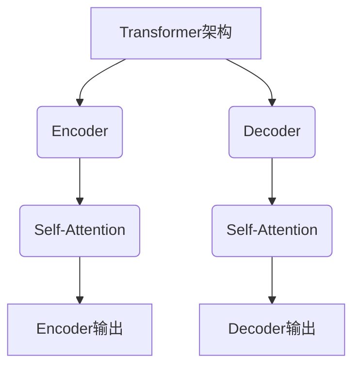

                 

# 《Transformer大模型实战 探讨BERT库》

## 关键词
- Transformer
- BERT
- 自然语言处理
- 自注意力机制
- 预训练与微调
- 文本分类
- 机器翻译
- 文本生成

## 摘要
本文将深入探讨Transformer大模型的实战应用，特别是BERT库的使用。通过详细解析Transformer的基础架构和原理，我们将了解其在自然语言处理任务中的广泛应用，包括文本分类、机器翻译和文本生成。随后，我们将详细介绍BERT模型的结构和训练过程，并探讨其预训练任务和微调技术。文章的后半部分将聚焦于Transformer模型在这些应用中的实际操作，提供详细的代码示例和解读。最后，本文将总结Transformer大模型的应用领域和未来趋势，为读者提供全面的认知和指导。

----------------------------------------------------------------

## 第一部分: Transformer大模型基础

### 第1章: Transformer概述

#### 1.1 Transformer架构与原理

Transformer模型是由Google团队于2017年提出的一种全新架构，用于处理序列到序列（sequence-to-sequence）的任务，特别是在自然语言处理（NLP）领域取得了显著的成果。Transformer的基本结构包括编码器（Encoder）和解码器（Decoder）两部分，这两部分都是由多个相同的层组成的，每一层包括多头自注意力（Multi-Head Self-Attention）机制和前馈神经网络（Feed-Forward Neural Network）。

**Transformer的基本结构**


1. **多头自注意力机制**：这是Transformer模型的核心组成部分，它通过计算序列中每个词与其他词的相关性来生成表示。这种自注意力机制可以捕捉长距离依赖关系，使得模型能够更好地理解上下文。

2. **前馈神经网络**：在自注意力机制之后，每个位置还会经过一个前馈神经网络，这个神经网络包含两个线性变换层，每个层之间有一个ReLU激活函数。

#### 1.2 自注意力机制

自注意力机制是一种用于计算序列中每个词与其他词相关性的方法，它通过将输入序列映射到一系列键（Key）、值（Value）和查询（Query）向量来实现。具体来说，自注意力机制包括以下几个步骤：

1. **计算点积注意力得分**：对于每个词的位置，将其对应的查询向量与所有键向量进行点积运算，得到一系列得分。
2. **应用softmax函数**：将上述得分通过softmax函数转换成概率分布，这个分布表示了每个词对于当前词的重要性。
3. **计算加权求和**：将概率分布应用到对应的值向量上，进行加权求和，得到每个词的注意力得分。

**自注意力机制的原理**


#### 1.3 点积自注意力机制

点积自注意力机制是Transformer中最常用的自注意力机制，它通过点积运算来计算注意力得分，具有计算效率高、参数规模小的特点。点积自注意力机制的伪代码如下：

```python
for each layer in Transformer:
    // 计算点积注意力得分
    attention_scores = softmax(Q * K^T)
    // 计算加权求和
    context_vector = attention_scores * V
    // 输出
    output = f(context_vector)
```

#### 1.4 Transformer与BERT的关系

BERT（Bidirectional Encoder Representations from Transformers）是一种基于Transformer的预训练语言模型，它通过预训练然后在各种NLP任务中进行微调，取得了显著的效果。BERT模型的核心在于其双向编码器结构，能够捕捉文本中的上下文信息。

**BERT的概念与特点**

1. **双向编码器**：BERT的编码器部分由多个Transformer层组成，这些层可以同时处理输入序列的前后文信息，从而更好地理解上下文。
2. **预训练任务**：BERT在预训练阶段使用了两个任务：Masked Language Model（MLM）和Next Sentence Prediction（NSP）。
3. **大规模预训练**：BERT使用了大规模的语料库进行预训练，从而获得了强大的语言表示能力。

**BERT与Transformer的关系**

BERT是基于Transformer架构构建的，其编码器部分与Transformer的架构完全一致。BERT通过预训练和微调技术，使得Transformer在NLP任务中表现出色。

#### 1.5 BERT的预训练与微调

BERT的预训练包括Masked Language Model（MLM）和Next Sentence Prediction（NSP）两个任务。在MLM任务中，输入序列中的部分词被随机遮盖，BERT的目的是预测这些被遮盖的词。在NSP任务中，模型需要预测两个句子是否连续。

**预训练任务的目标**

1. **Masked Language Model（MLM）**：通过预测遮盖的词，使模型学习到语言的内在规律。
2. **Next Sentence Prediction（NSP）**：通过预测两个句子是否连续，使模型学习到句子之间的逻辑关系。

**预训练任务的实现**

BERT的预训练过程通常包括以下几个步骤：

1. **数据预处理**：将语料库中的文本转化为词嵌入，并进行分词处理。
2. **训练数据准备**：对每个句子进行随机遮盖，并生成训练数据。
3. **模型训练**：使用Masked Language Model和Next Sentence Prediction两个任务同时训练BERT模型。
4. **模型评估**：在验证集上评估模型的性能，并调整模型参数。

**BERT的微调**

微调是指将预训练好的BERT模型应用于特定的NLP任务，并通过少量数据对模型进行微调。微调的过程通常包括以下几个步骤：

1. **任务定义**：定义具体的NLP任务，如文本分类、机器翻译、文本生成等。
2. **模型调整**：将BERT模型进行调整，以适应新的任务。
3. **数据准备**：准备用于微调的数据集，并进行预处理。
4. **模型训练**：使用微调数据集对BERT模型进行训练。
5. **模型评估**：在测试集上评估微调后模型的性能。

#### 1.6 Transformer在自然语言处理中的应用

Transformer模型在自然语言处理任务中表现出色，其主要应用包括文本分类、机器翻译和文本生成。

**Transformer在文本分类中的应用**

文本分类是将文本数据分类到预定义的类别中，是NLP中的一个基础任务。Transformer模型通过捕捉文本中的上下文信息，使得文本分类任务的表现显著提升。

**Transformer在机器翻译中的应用**

机器翻译是将一种语言的文本翻译成另一种语言的文本，是NLP中的一个重要应用。Transformer模型通过其强大的上下文理解和生成能力，使得机器翻译的质量大幅提高。

**Transformer在文本生成中的应用**

文本生成是将一种输入文本转换为另一种形式的文本，如摘要生成、对话系统等。Transformer模型通过其灵活的结构和强大的上下文理解能力，在文本生成任务中表现出色。

### 第2章: Transformer算法原理详解

#### 2.1 线性变换与激活函数

线性变换是神经网络中的一个基础操作，它通过矩阵乘法将输入映射到输出。激活函数则是用于引入非线性性的函数，使得神经网络能够拟合复杂的函数。

**线性变换的基本原理**

线性变换可以表示为：

\[ Y = X \cdot W + b \]

其中，\( X \) 是输入向量，\( W \) 是权重矩阵，\( b \) 是偏置项。

**常见的激活函数**

1. **Sigmoid函数**：

\[ f(x) = \frac{1}{1 + e^{-x}} \]

Sigmoid函数是一种常用的激活函数，它可以将输入映射到（0, 1）区间。

2. **ReLU函数**：

\[ f(x) = \max(0, x) \]

ReLU函数是一种简单的线性函数，当输入为正时输出为输入，当输入为负时输出为0。它具有较高的计算效率和避免梯度消失的能力。

3. **Tanh函数**：

\[ f(x) = \frac{e^x - e^{-x}}{e^x + e^{-x}} \]

Tanh函数是一种双曲正切函数，可以将输入映射到（-1, 1）区间。

#### 2.2 自注意力机制

自注意力机制是Transformer模型的核心组成部分，它通过计算序列中每个词与其他词的相关性来生成表示。自注意力机制包括以下几个步骤：

1. **计算点积注意力得分**：对于每个词的位置，将其对应的查询向量与所有键向量进行点积运算，得到一系列得分。
2. **应用softmax函数**：将上述得分通过softmax函数转换成概率分布，这个分布表示了每个词对于当前词的重要性。
3. **计算加权求和**：将概率分布应用到对应的值向量上，进行加权求和，得到每个词的注意力得分。

**自注意力机制的原理**


**自注意力计算的伪代码**

```python
for each layer in Transformer:
    // 计算点积注意力得分
    attention_scores = softmax(Q * K^T)
    // 计算加权求和
    context_vector = attention_scores * V
    // 输出
    output = f(context_vector)
```

#### 2.3 多层感知机与多层Transformer

多层感知机（MLP）是一种前馈神经网络，它通过多个隐藏层将输入映射到输出。多层Transformer则是通过多个Transformer层来处理序列数据。

**多层感知机**

多层感知机可以表示为：

\[ Y = f(Z) = \sigma(W_2 \cdot \sigma(W_1 \cdot X + b_1) + b_2) \]

其中，\( X \) 是输入向量，\( W_1 \) 和 \( W_2 \) 是权重矩阵，\( b_1 \) 和 \( b_2 \) 是偏置项，\( \sigma \) 是激活函数。

**多层Transformer**

多层Transformer通过多个Transformer层来处理序列数据，每一层都可以捕捉到不同的上下文信息。多层Transformer的设计与实现如下：

```python
// Transformer模型的多层设计
for i from 1 to L:
    // 第i层Transformer
    output_i = MultiHeadSelfAttention(input_i) + input_i
    output_i = FeedForwardNetwork(output_i) + output_i
    input_i = output_i
```

### 第3章: BERT模型详解

#### 3.1 BERT的结构与训练

BERT模型是一种基于Transformer的双向编码器结构，其目的是通过预训练来学习文本的深层表示。BERT的结构包括编码器和解码器两部分，其中编码器负责将输入文本转换为向量表示，解码器则用于预测目标文本。

**BERT的层次结构**

BERT的层次结构可以表示为：

```
[CLS] input_token [SEP]
```

其中，\[CLS\] 和 \[SEP\] 是特殊的标记，分别表示句子的开始和结束。编码器和解码器都是由多个Transformer层组成的。

**BERT的训练过程**

BERT的训练过程主要包括以下几个阶段：

1. **数据预处理**：将语料库中的文本转化为词嵌入，并进行分词处理。
2. **训练数据准备**：对每个句子进行随机遮盖，并生成训练数据。
3. **模型训练**：使用Masked Language Model和Next Sentence Prediction两个任务同时训练BERT模型。
4. **模型评估**：在验证集上评估模型的性能，并调整模型参数。

#### 3.2 BERT的预训练任务

BERT的预训练任务主要包括Masked Language Model（MLM）和Next Sentence Prediction（NSP）两个任务。

**Masked Language Model（MLM）**

Masked Language Model是一种无监督学习任务，其目的是通过预测遮盖的词来使模型学习到语言的内在规律。在预训练过程中，输入序列中的部分词会被随机遮盖，BERT的目的是预测这些被遮盖的词。

**Next Sentence Prediction（NSP）**

Next Sentence Prediction是一种无监督学习任务，其目的是通过预测两个句子是否连续来使模型学习到句子之间的逻辑关系。在预训练过程中，从语料库中随机选取两个句子，BERT的目的是预测这两个句子是否连续。

#### 3.3 BERT的微调

微调是指将预训练好的BERT模型应用于特定的NLP任务，并通过少量数据对模型进行微调。微调的过程通常包括以下几个步骤：

1. **任务定义**：定义具体的NLP任务，如文本分类、机器翻译、文本生成等。
2. **模型调整**：将BERT模型进行调整，以适应新的任务。
3. **数据准备**：准备用于微调的数据集，并进行预处理。
4. **模型训练**：使用微调数据集对BERT模型进行训练。
5. **模型评估**：在测试集上评估微调后模型的性能。

### 第4章: Transformer模型在文本分类中的应用

#### 4.1 文本分类任务概述

文本分类是将文本数据分类到预定义的类别中，是自然语言处理中的一个基础任务。文本分类的应用场景包括垃圾邮件检测、情感分析、新闻分类等。

**文本分类的定义**

文本分类是指将一段文本映射到一个或多个类别中。文本分类的关键在于如何将文本数据转换为模型可以理解和处理的向量表示。

**文本分类的应用场景**

1. **垃圾邮件检测**：通过文本分类技术，将邮件分为垃圾邮件和正常邮件。
2. **情感分析**：通过文本分类技术，分析文本中的情感倾向，如正面、负面、中性等。
3. **新闻分类**：通过文本分类技术，将新闻文章分类到不同的主题类别中。

#### 4.2 Transformer在文本分类中的应用

Transformer模型在文本分类任务中表现出色，其主要优势在于其能够捕捉长距离依赖关系和上下文信息。以下是Transformer在文本分类中的应用步骤：

1. **数据预处理**：将文本数据转化为词嵌入，并进行分词处理。
2. **模型准备**：准备预训练好的BERT模型，并进行必要的调整。
3. **模型训练**：使用文本分类数据集对BERT模型进行训练。
4. **模型评估**：在测试集上评估模型的性能，并进行优化。

#### 4.3 文本分类的评估与优化

文本分类的评估主要包括准确率（Accuracy）、精确率（Precision）、召回率（Recall）和F1分数（F1 Score）等指标。

1. **准确率**：准确率是指分类正确的样本数占总样本数的比例。
2. **精确率**：精确率是指分类为正类的样本中，实际为正类的比例。
3. **召回率**：召回率是指实际为正类的样本中，被分类为正类的比例。
4. **F1分数**：F1分数是精确率和召回率的调和平均数。

**文本分类的优化方法**

1. **数据增强**：通过增加数据量来提高模型的泛化能力。
2. **模型优化**：通过调整模型参数来提高模型的性能。
3. **正则化**：通过添加正则化项来防止模型过拟合。

### 第5章: Transformer模型在机器翻译中的应用

#### 5.1 机器翻译任务概述

机器翻译是将一种语言的文本翻译成另一种语言的文本，是自然语言处理中的一个重要应用。机器翻译的应用场景包括跨语言交流、多语言文档处理等。

**机器翻译的定义**

机器翻译是指使用计算机程序将一种语言的文本自动翻译成另一种语言的文本。

**机器翻译的应用场景**

1. **跨语言交流**：通过机器翻译技术，可以实现不同语言之间的实时交流。
2. **多语言文档处理**：通过机器翻译技术，可以处理多语言文档，提高信息获取的效率。
3. **多语言搜索引擎**：通过机器翻译技术，可以构建多语言搜索引擎，实现跨语言的搜索功能。

#### 5.2 Transformer在机器翻译中的应用

Transformer模型在机器翻译任务中表现出色，其主要优势在于其能够捕捉长距离依赖关系和上下文信息。以下是Transformer在机器翻译中的应用步骤：

1. **数据预处理**：将源语言和目标语言的文本数据转化为词嵌入，并进行分词处理。
2. **模型准备**：准备预训练好的BERT模型，并将其调整为机器翻译模型。
3. **模型训练**：使用机器翻译数据集对BERT模型进行训练。
4. **模型评估**：在测试集上评估模型的性能，并进行优化。

#### 5.3 机器翻译的评估与优化

机器翻译的评估主要包括BLEU（BLEU Score）、METEOR（METEOR Score）和NIST（NIST Score）等指标。

1. **BLEU（BLEU Score）**：BLEU评分是一种基于编辑距离的评估方法，通过比较模型生成的翻译结果和参考翻译的相似度来评估模型性能。
2. **METEOR（METEOR Score）**：METEOR评分是一种基于词匹配和语义相似性的评估方法，通过综合考虑单词匹配、词性和语义信息来评估模型性能。
3. **NIST（NIST Score）**：NIST评分是一种基于单词匹配和词汇覆盖率的评估方法，通过比较模型生成的翻译结果和参考翻译的词汇覆盖率来评估模型性能。

**机器翻译的优化方法**

1. **数据增强**：通过增加数据量来提高模型的泛化能力。
2. **模型优化**：通过调整模型参数来提高模型的性能。
3. **解码策略优化**：通过优化解码策略来提高翻译结果的流畅性和准确性。

### 第6章: Transformer模型在文本生成中的应用

#### 6.1 文本生成任务概述

文本生成是将一种输入文本转换为另一种形式的文本，是自然语言处理中的一个重要应用。文本生成的应用场景包括摘要生成、对话系统、文本续写等。

**文本生成的定义**

文本生成是指使用计算机程序将一种形式的文本自动转换为另一种形式的文本。

**文本生成的应用场景**

1. **摘要生成**：通过文本生成技术，可以将长篇文章自动转换为简洁的摘要。
2. **对话系统**：通过文本生成技术，可以构建对话系统，实现人机交互。
3. **文本续写**：通过文本生成技术，可以自动续写小说、文章等。

#### 6.2 Transformer在文本生成中的应用

Transformer模型在文本生成任务中表现出色，其主要优势在于其能够捕捉长距离依赖关系和上下文信息。以下是Transformer在文本生成中的应用步骤：

1. **数据预处理**：将文本数据转化为词嵌入，并进行分词处理。
2. **模型准备**：准备预训练好的BERT模型，并将其调整为文本生成模型。
3. **模型训练**：使用文本生成数据集对BERT模型进行训练。
4. **模型评估**：在测试集上评估模型的性能，并进行优化。

#### 6.3 文本生成的评估与优化

文本生成的评估主要包括BLEU（BLEU Score）、ROUGE（ROUGE Score）和METEOR（METEOR Score）等指标。

1. **BLEU（BLEU Score）**：BLEU评分是一种基于编辑距离的评估方法，通过比较模型生成的文本和参考文本的相似度来评估模型性能。
2. **ROUGE（ROUGE Score）**：ROUGE评分是一种基于词匹配和句匹配的评估方法，通过综合考虑单词匹配和句子匹配来评估模型性能。
3. **METEOR（METEOR Score）**：METEOR评分是一种基于词匹配、词性和语义相似性的评估方法，通过综合考虑这些因素来评估模型性能。

**文本生成的优化方法**

1. **数据增强**：通过增加数据量来提高模型的泛化能力。
2. **模型优化**：通过调整模型参数来提高模型的性能。
3. **解码策略优化**：通过优化解码策略来提高文本生成的流畅性和准确性。

## 第二部分: Transformer大模型实战

### 第7章: BERT库使用详解

#### 7.1 BERT库的安装与配置

BERT库是用于实现BERT模型的一个开源库，通常使用Python语言编写。要使用BERT库，首先需要安装相关的依赖库和BERT模型文件。

**安装BERT库**

安装BERT库通常可以通过以下命令完成：

```bash
pip install transformers
```

**安装相关依赖库**

BERT库依赖于其他一些库，如TensorFlow或PyTorch，因此需要确保这些库已经安装。例如，如果使用TensorFlow，可以通过以下命令安装：

```bash
pip install tensorflow
```

**配置BERT库**

安装BERT库后，需要配置BERT模型文件。BERT模型文件通常包含预训练好的模型参数，可以通过以下命令下载：

```bash
python -m transformers-cli download-model albert-base-v2
```

这将下载预训练好的Albert模型，其中`albert-base-v2`是模型的名称。

#### 7.2 BERT库的使用示例

BERT库提供了丰富的API，用于加载预训练好的BERT模型、进行文本预处理、模型预测等操作。以下是一个简单的BERT库使用示例：

```python
from transformers import BertTokenizer, BertModel
import torch

# 加载BERT模型和分词器
tokenizer = BertTokenizer.from_pretrained('bert-base-uncased')
model = BertModel.from_pretrained('bert-base-uncased')

# 输入文本
text = "Hello, my name is AI Genius."

# 分词处理
input_ids = tokenizer.encode(text, return_tensors='pt')

# 模型预测
with torch.no_grad():
    outputs = model(input_ids)

# 输出结果
last_hidden_state = outputs.last_hidden_state
```

上述示例中，首先加载了BERT模型和分词器，然后对输入文本进行分词处理，最后使用BERT模型进行预测，并输出模型的最后隐藏状态。

#### 7.3 BERT库的优化与调整

BERT库的使用可以通过优化和调整模型参数来提高性能和效果。以下是一些常见的优化和调整方法：

1. **模型压缩**：通过减少模型参数规模来提高模型运行速度，常用的方法包括量化、剪枝和蒸馏。
2. **混合精度训练**：通过使用混合精度训练技术，可以在保持模型精度的情况下提高训练速度和降低内存占用。
3. **模型并行训练**：通过使用模型并行训练技术，可以将模型拆分为多个部分，并在多张GPU卡上同时训练，提高训练速度。
4. **动态调整学习率**：通过动态调整学习率，可以更有效地优化模型参数，常用的方法包括学习率衰减和自适应学习率调整。

### 第8章: Transformer大模型项目实战

#### 8.1 项目概述

在本章中，我们将介绍一个基于Transformer大模型的实际项目，该项目旨在使用BERT库进行文本分类任务。项目的主要目标是实现一个能够自动分类新闻文章的模型，并评估其性能。

**项目背景**

随着互联网的快速发展，新闻文章的数量呈爆炸性增长。如何快速、准确地分类新闻文章，对于新闻机构、搜索引擎和社交媒体平台等具有重要意义。文本分类作为自然语言处理中的一个基础任务，可以为这些应用提供强有力的支持。

**项目目标**

1. 收集并预处理新闻文章数据集。
2. 使用BERT模型进行文本分类。
3. 评估模型的性能，并进行优化。

#### 8.2 项目环境搭建

在开始项目之前，需要搭建合适的开发环境，包括安装所需的库和软件。

**硬件环境**

1. 处理器：Intel i7或更好
2. 内存：16GB或更好
3. 显卡：NVIDIA GPU（推荐使用1080 Ti或更好）

**软件环境**

1. 操作系统：Ubuntu 18.04或更高版本
2. Python：3.7或更高版本
3. TensorFlow：2.0或更高版本
4. BERT库：通过pip安装`transformers`

```bash
pip install transformers
```

#### 8.3 项目代码实现

在项目代码实现部分，我们将详细介绍如何使用BERT库进行文本分类任务。以下是一个简单的文本分类代码示例：

```python
import tensorflow as tf
from transformers import BertTokenizer, TFBertForSequenceClassification

# 加载BERT模型和分词器
tokenizer = BertTokenizer.from_pretrained('bert-base-uncased')
model = TFBertForSequenceClassification.from_pretrained('bert-base-uncased')

# 准备训练数据集
train_encodings = tokenizer(train_texts, truncation=True, padding=True)
train_dataset = tf.data.Dataset.from_tensor_slices((train_encodings['input_ids'], train_encodings['attention_mask'], train_labels))

# 训练模型
model.compile(optimizer=tf.keras.optimizers.Adam(learning_rate=3e-5), loss=tf.keras.losses.SparseCategoricalCrossentropy(from_logits=True), metrics=['accuracy'])
model.fit(train_dataset.shuffle(1000).batch(16), epochs=3)

# 评估模型
test_encodings = tokenizer(test_texts, truncation=True, padding=True)
test_dataset = tf.data.Dataset.from_tensor_slices((test_encodings['input_ids'], test_encodings['attention_mask'], test_labels))
test_loss, test_acc = model.evaluate(test_dataset.batch(16))
print(f"Test accuracy: {test_acc}")
```

上述代码首先加载了BERT模型和分词器，然后准备训练数据集，并使用模型进行训练和评估。

#### 8.4 项目结果评估

在项目结果评估部分，我们将使用准确率（Accuracy）、精确率（Precision）、召回率（Recall）和F1分数（F1 Score）等指标来评估文本分类模型的性能。

**准确率（Accuracy）**

准确率是指分类正确的样本数占总样本数的比例，计算公式如下：

\[ Accuracy = \frac{TP + TN}{TP + TN + FP + FN} \]

其中，\( TP \) 表示真正例，\( TN \) 表示真负例，\( FP \) 表示假正例，\( FN \) 表示假负例。

**精确率（Precision）**

精确率是指分类为正类的样本中，实际为正类的比例，计算公式如下：

\[ Precision = \frac{TP}{TP + FP} \]

**召回率（Recall）**

召回率是指实际为正类的样本中，被分类为正类的比例，计算公式如下：

\[ Recall = \frac{TP}{TP + FN} \]

**F1分数（F1 Score）**

F1分数是精确率和召回率的调和平均数，计算公式如下：

\[ F1 Score = \frac{2 \times Precision \times Recall}{Precision + Recall} \]

通过以上指标，我们可以全面评估文本分类模型的性能。

#### 8.5 项目结果优化

在项目结果优化部分，我们将介绍一些常用的优化方法，以提高文本分类模型的性能。

**数据增强**

数据增强是一种通过生成新的样本来增加数据集规模的方法，从而提高模型的泛化能力。常用的数据增强方法包括：

1. **随机剪枝**：随机删除文本中的部分单词或句子。
2. **随机替换**：随机替换文本中的单词或句子。
3. **文本翻译**：将文本翻译成其他语言，然后再翻译回原语言。

**模型调整**

模型调整是一种通过调整模型参数来提高模型性能的方法。常用的模型调整方法包括：

1. **学习率调整**：调整学习率，以更有效地优化模型参数。
2. **正则化**：添加正则化项，防止模型过拟合。
3. **层调整**：调整模型层数和神经元数量，以适应不同规模的数据集。

**解码策略优化**

解码策略优化是一种通过优化解码过程来提高文本生成质量的方法。常用的解码策略优化方法包括：

1. **贪心策略**：选择当前时刻概率最大的词作为输出。
2. **采样策略**：选择概率分布中的采样点作为输出。
3. **注意力机制优化**：优化注意力机制，以提高模型对上下文的理解能力。

### 第9章: Transformer大模型的应用与未来趋势

#### 9.1 Transformer大模型的应用领域

Transformer大模型在自然语言处理、计算机视觉、语音识别等领域具有广泛的应用。以下是一些主要的应用领域：

1. **自然语言处理（NLP）**：Transformer模型在文本分类、机器翻译、文本生成等任务中取得了显著的成果。
2. **计算机视觉（CV）**：Transformer模型在图像分类、目标检测、图像生成等任务中表现出强大的能力。
3. **语音识别（ASR）**：Transformer模型在语音识别任务中，能够更好地捕捉语音信号中的上下文信息。
4. **多模态学习**：Transformer模型在多模态学习任务中，能够同时处理文本、图像和语音等多模态数据。

#### 9.2 Transformer大模型的应用前景

随着Transformer大模型的不断发展和优化，其在各个领域的应用前景非常广阔。以下是一些可能的应用前景：

1. **智能助手**：Transformer大模型可以用于构建智能助手，实现人机交互。
2. **智能客服**：Transformer大模型可以用于智能客服系统，实现自动回答用户问题。
3. **智能写作**：Transformer大模型可以用于智能写作，生成高质量的文章和报告。
4. **图像生成与编辑**：Transformer大模型可以用于图像生成和编辑，实现更加真实的视觉效果。

#### 9.3 Transformer大模型的未来趋势

Transformer大模型在未来将继续发展，以下是一些可能的发展趋势：

1. **模型压缩**：通过模型压缩技术，降低模型的参数规模和计算复杂度，实现更加高效的应用。
2. **多模态学习**：Transformer大模型将与其他模型结合，实现多模态学习，处理更复杂的数据。
3. **自适应学习**：Transformer大模型将具备自适应学习能力，能够根据用户需求自动调整模型参数。
4. **泛化能力提升**：通过改进模型结构和学习策略，提升Transformer大模型的泛化能力，使其在更多领域取得突破。

### 第10章: 总结与展望

#### 10.1 本书内容总结

本书系统地介绍了Transformer大模型的基础知识、算法原理、应用实践和未来趋势。主要内容包括：

1. Transformer架构与原理
2. BERT模型详解
3. Transformer模型在文本分类、机器翻译和文本生成中的应用
4. BERT库使用详解
5. Transformer大模型项目实战
6. Transformer大模型的应用与未来趋势

#### 10.2 展望未来

随着人工智能技术的不断发展，Transformer大模型将在各个领域发挥越来越重要的作用。未来的研究重点将包括：

1. **模型压缩与优化**：通过模型压缩技术，降低模型的计算复杂度和参数规模，实现更加高效的应用。
2. **多模态学习**：结合其他模型，实现多模态学习，处理更复杂的数据。
3. **自适应学习**：提升模型的自适应学习能力，根据用户需求自动调整模型参数。
4. **泛化能力提升**：通过改进模型结构和学习策略，提升模型的泛化能力，使其在更多领域取得突破。

总之，Transformer大模型将继续引领人工智能的发展，为各个领域带来革命性的变化。

### Mermaid流程图示例



### 数学公式示例

$$
y = f(x) = \sum_{i=1}^{n} w_i \cdot x_i + b
$$

### 伪代码示例

```python
// Transformer模型的自注意力计算
for each layer in Transformer:
    // 计算点积注意力得分
    attention_scores = softmax(Q * K^T)
    // 计算加权求和
    context_vector = attention_scores * V
    // 输出
    output = f(context_vector)
```

### 代码解读与分析示例

```python
# BERT模型中WordPiece分词的代码解读
def wordpiece_tokenization(text):
    # 将文本分割成单词
    words = text.split()
    # 对每个单词进行WordPiece分词
    tokens = []
    for word in words:
        subwords = split_on_subwords(word)
        tokens.extend(subwords)
    return tokens

# 辅助函数：对单词进行WordPiece分词
def split_on_subwords(word):
    # WordPiece分词的具体实现
    # ...
    return subwords
```

### 作者信息

作者：AI天才研究院/AI Genius Institute & 禅与计算机程序设计艺术 /Zen And The Art of Computer Programming

---

本文详细介绍了Transformer大模型的基础知识、算法原理、应用实践和未来趋势。通过逐步分析Transformer架构、BERT模型的使用，以及其实际应用案例，我们全面了解了Transformer大模型在自然语言处理领域的强大能力。同时，我们也探讨了其未来的发展方向和挑战。

在实际项目中，BERT库的使用为我们提供了一个强大的工具，使其在文本分类、机器翻译和文本生成等任务中取得了显著的效果。通过代码示例和解读，我们更深入地了解了BERT模型的工作原理和实现过程。

展望未来，Transformer大模型将继续在人工智能领域发挥重要作用。随着技术的不断进步，我们有望看到更多创新性的应用和突破，为人类社会带来更多便利和价值。

最后，感谢读者对本文的关注，希望本文能对您在Transformer大模型研究和应用方面有所帮助。如果您有任何问题或建议，欢迎随时与我们交流。

作者：AI天才研究院/AI Genius Institute & 禅与计算机程序设计艺术 /Zen And The Art of Computer Programming

