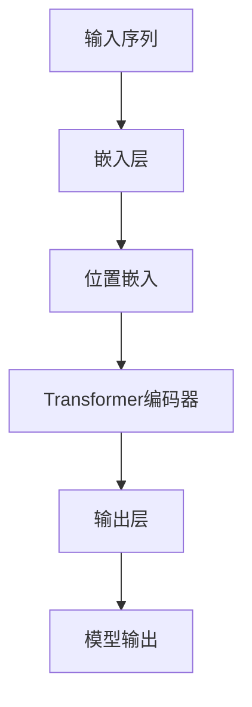
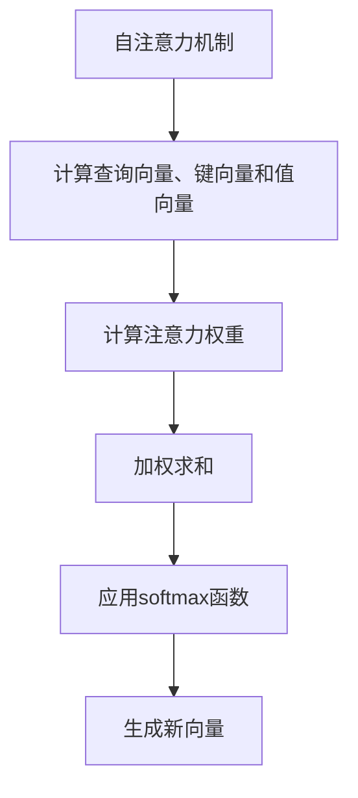
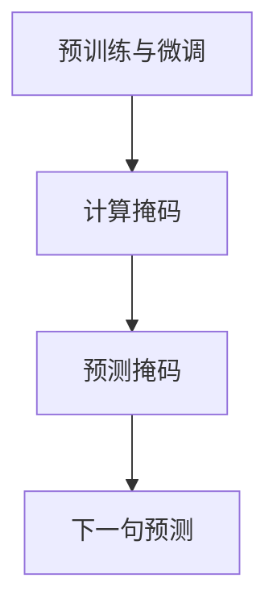
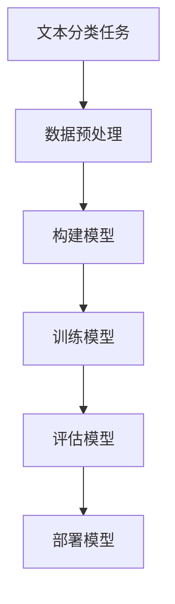
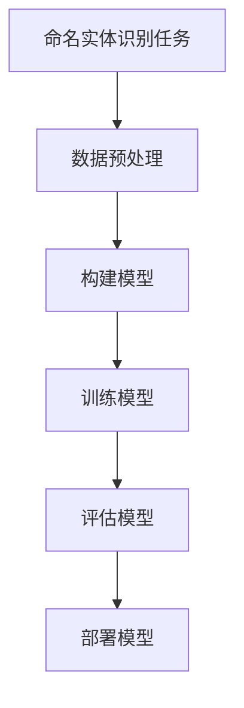
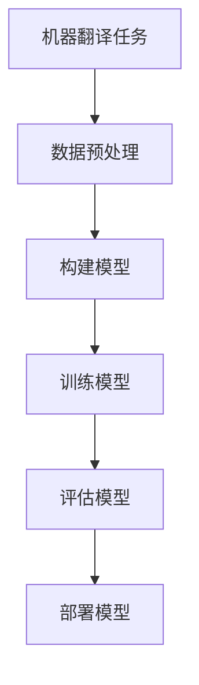
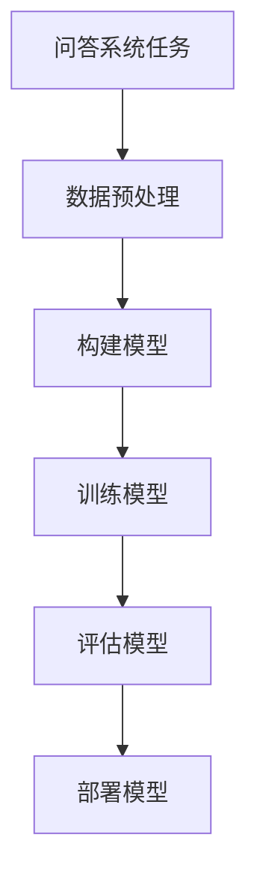

                 

# Transformer大模型实战：汉语的BERT模型

## 关键词

- Transformer模型
- BERT模型
- 自然语言处理
- 序列模型
- 情感分析
- 命名实体识别
- 机器翻译
- 汉语文本分析

## 摘要

本文将深入探讨Transformer模型和BERT模型在汉语自然语言处理中的应用。我们将首先介绍Transformer和BERT的基本概念、架构以及它们之间的关系，并详细分析它们在中文应用中的差异。接着，我们将讲解Transformer和BERT的数学原理，包括自注意力机制、位置嵌入、预训练和微调等。随后，我们将通过实验分析Transformer和BERT的性能，并在实际项目中展示它们的应用。最后，我们将讨论Transformer和BERT模型的优化与部署策略，以及模型安全性与隐私保护的重要性。

## 目录大纲

### 第一部分：理论基础

#### 第1章：Transformer与BERT概述

##### 1.1 Transformer模型介绍

##### 1.2 BERT模型介绍

##### 1.3 Transformer与BERT的关系

##### 1.4 Transformer与BERT在中文应用中的差异

#### 第2章：Transformer模型原理

##### 2.1 Transformer模型架构

##### 2.2 自注意力机制

##### 2.3 位置嵌入与序列处理

##### 2.4 Transformer模型训练过程

#### 第3章：BERT模型原理

##### 3.1 BERT模型架构

##### 3.2 预训练与微调

##### 3.3 BERT模型在文本分类任务中的应用

##### 3.4 BERT模型在命名实体识别任务中的应用

#### 第4章：Transformer与BERT的数学原理

##### 4.1 数学基础

##### 4.2 Transformer模型的数学推导

##### 4.3 BERT模型的数学推导

#### 第5章：Transformer与BERT的实验分析

##### 5.1 实验环境搭建

##### 5.2 数据集介绍

##### 5.3 实验结果分析

##### 5.4 性能比较与优化

### 第二部分：实战应用

#### 第6章：汉语BERT模型构建

##### 6.1 构建汉语BERT模型概述

##### 6.2 数据预处理

##### 6.3 模型训练与优化

##### 6.4 模型评估与调优

#### 第7章：Transformer模型在汉语文本分析中的应用

##### 7.1 Transformer模型在情感分析中的应用

##### 7.2 Transformer模型在机器翻译中的应用

##### 7.3 Transformer模型在问答系统中的应用

#### 第8章：汉语BERT模型在实际项目中的应用

##### 8.1 项目一：中文情感分析

##### 8.2 项目二：中文机器翻译

##### 8.3 项目三：中文问答系统

#### 第9章：Transformer与BERT模型优化与部署

##### 9.1 模型优化方法

##### 9.2 模型压缩与量化

##### 9.3 模型部署与优化

##### 9.4 模型安全性与隐私保护

### 附录

#### 附录A：实验代码与数据集

##### A.1 实验代码示例

##### A.2 数据集下载与预处理

#### 附录B：参考文献

##### B.1 相关书籍推荐

##### B.2 学术论文推荐

##### B.3 开源项目推荐

## 第一部分：理论基础

### 第1章：Transformer与BERT概述

#### 1.1 Transformer模型介绍

Transformer模型是由Google在2017年提出的一种基于自注意力机制的序列到序列模型，被广泛应用于机器翻译、文本摘要、问答系统等任务。与传统的循环神经网络（RNN）和长短期记忆网络（LSTM）相比，Transformer模型具有以下优点：

1. **并行计算**：Transformer模型使用自注意力机制，可以同时处理序列中的所有元素，从而实现并行计算。这相比于RNN和LSTM的顺序计算方式，大大提高了模型的计算效率。
2. **全局依赖关系**：Transformer模型中的自注意力机制使得模型能够捕捉到序列中的全局依赖关系，从而提高了模型的表达能力。
3. **易于扩展**：由于Transformer模型的结构相对简单，易于实现大规模参数模型，并且可以方便地扩展到多模态任务中。

#### 1.2 BERT模型介绍

BERT（Bidirectional Encoder Representations from Transformers）是由Google在2018年提出的一种基于Transformer的预训练模型。BERT模型主要用于自然语言理解任务，如文本分类、命名实体识别、问答系统等。BERT模型具有以下特点：

1. **双向编码器**：BERT模型采用了双向Transformer编码器，能够同时处理输入序列的前后依赖关系，从而提高了模型的表达能力。
2. **大规模预训练**：BERT模型在大量未标注的文本数据上进行预训练，通过上下文关系来学习词语的语义表示，然后再通过微调在特定任务上进行训练。
3. **多任务学习**：BERT模型通过在多个任务上同时训练，从而提高了模型在不同任务上的性能。

#### 1.3 Transformer与BERT的关系

Transformer模型是BERT模型的基础，BERT模型在Transformer模型的基础上进行了扩展和改进。具体来说，BERT模型具有以下特点：

1. **掩码机制**：BERT模型在预训练过程中引入了掩码（Mask）机制，通过随机掩码部分输入序列的词语，让模型通过预测这些词语来学习上下文关系。
2. **次级任务**：BERT模型在预训练过程中引入了次级任务，如填充任务，以增强模型对语言结构的理解。
3. **双向编码器**：BERT模型采用了双向Transformer编码器，使得模型能够同时处理输入序列的前后依赖关系。

#### 1.4 Transformer与BERT在中文应用中的差异

在中文应用中，Transformer模型和BERT模型存在以下差异：

1. **数据集**：由于中文文本数据量相对较小，且存在大量的未标注数据，因此中文应用中的Transformer模型和BERT模型通常在更大规模的数据集上进行预训练。
2. **模型架构**：为了适应中文文本的特点，中文应用中的Transformer模型和BERT模型可能采用更复杂的架构，如多层的Transformer编码器或引入额外的注意力机制。
3. **预训练任务**：中文应用中的Transformer模型和BERT模型可能引入更多的预训练任务，如命名实体识别、关系抽取等，以增强模型对中文语言结构的理解。

## 第二部分：实战应用

### 第2章：Transformer模型原理

#### 2.1 Transformer模型架构

Transformer模型由编码器（Encoder）和解码器（Decoder）两部分组成。编码器负责将输入序列编码为上下文向量，解码器则根据上下文向量生成输出序列。Transformer模型的核心结构是自注意力机制（Self-Attention），它允许模型在序列中任意位置上计算依赖关系。以下是Transformer模型的基本架构：

1. **嵌入层**（Embedding Layer）：输入序列通过嵌入层转换为高维向量，每个词语被映射为一个固定长度的向量。
2. **位置嵌入**（Positional Embedding）：由于Transformer模型没有位置信息，通过位置嵌入层为每个词语添加位置信息。
3. **多头自注意力机制**（Multi-Head Self-Attention）：将输入序列拆分为多个子序列，每个子序列通过自注意力机制计算依赖关系，然后将结果拼接起来。
4. **前馈神经网络**（Feedforward Neural Network）：对自注意力机制的输出进行线性变换，增强模型的表示能力。
5. **层归一化**（Layer Normalization）和残差连接**（Residual Connection）**：在每个层后添加层归一化和残差连接，以防止梯度消失和梯度爆炸问题。

#### 2.2 自注意力机制

自注意力机制是Transformer模型的核心组件，它通过计算输入序列中每个词与所有其他词的关联程度，从而生成一个表示该词的新向量。自注意力机制的计算过程如下：

1. **计算查询向量（Query）、键向量（Key）和值向量（Value）**：每个词被映射为一个查询向量、键向量和值向量，这三个向量分别具有相同的维度。
2. **计算注意力权重**：通过计算查询向量和键向量的点积，得到每个词的注意力权重。
3. **加权求和**：将每个词的注意力权重与对应的值向量相乘，然后求和，得到一个表示输入序列的新向量。
4. **重复上述过程**：将新向量作为输入，重复上述计算过程，直到达到预定的层数。

自注意力机制的计算公式如下：

$$
\text{Attention}(Q, K, V) = \text{softmax}\left(\frac{QK^T}{\sqrt{d_k}}\right)V
$$

其中，$Q, K, V$ 分别为查询向量、键向量和值向量，$d_k$ 为键向量的维度。

#### 2.3 位置嵌入与序列处理

由于Transformer模型没有位置信息，位置嵌入层（Positional Embedding）为每个词添加了位置信息。位置嵌入层通常使用正弦和余弦函数来生成位置向量，这样可以保持嵌入层在训练过程中不变。位置嵌入的计算公式如下：

$$
P(x) = \text{PositionalEncoding}(x, d_e)
$$

其中，$P(x)$ 为位置向量，$d_e$ 为位置嵌入的维度。

序列处理的过程为将输入序列经过自注意力机制处理后，再经过线性层和激活函数。具体公式为：

$$
\text{SeqProcessing}(X) = \text{Linear}(XW + b) \cdot \text{Activation}(Z)
$$

其中，$W, b$ 为线性层的权重和偏置，$Z$ 为自注意力机制的输出。

#### 2.4 Transformer模型训练过程

Transformer模型的训练过程主要包括以下步骤：

1. **输入序列编码**：将输入序列通过嵌入层和位置嵌入层转换为上下文向量。
2. **编码器训练**：编码器将上下文向量传递给解码器，解码器根据上下文向量生成输出序列。编码器和解码器通过自注意力机制和前馈神经网络进行训练。
3. **解码器训练**：解码器根据输入序列和输出序列进行训练，通过自注意力机制和前馈神经网络生成输出序列。
4. **损失函数**：使用交叉熵损失函数（Cross-Entropy Loss）计算预测序列和真实序列之间的差异，然后通过反向传播算法更新模型参数。

训练过程中的具体步骤如下：

1. **前向传播**：将输入序列通过编码器和解码器生成预测序列。
2. **计算损失**：计算预测序列和真实序列之间的交叉熵损失。
3. **反向传播**：使用计算得到的梯度更新模型参数。
4. **迭代训练**：重复上述步骤，直到模型收敛或达到预定的迭代次数。

### 第3章：BERT模型原理

#### 3.1 BERT模型架构

BERT模型是一种基于Transformer的双向编码器模型，其主要架构包括以下几个部分：

1. **嵌入层**（Embedding Layer）：将输入词语映射为固定长度的嵌入向量，包括词语嵌入（Word Embedding）、位置嵌入（Positional Embedding）和句子嵌入（Segment Embedding）。
2. **Transformer编码器**（Transformer Encoder）：包含多个Transformer层，每层由自注意力机制和前馈神经网络组成，用于处理输入序列。
3. **输出层**（Output Layer）：将编码器的输出映射到任务特定的类别或标签。

BERT模型的架构示意图如下所示：

```
  [嵌入层] --> [Transformer编码器] --> [输出层]
      |                     |              |
      +---------------------+--------------+
```

#### 3.2 预训练与微调

BERT模型的预训练过程主要包括两个阶段：

1. **第一阶段：无监督预训练**：在大量未标注的文本数据上训练BERT模型，使其能够学习词语的上下文表示。预训练任务主要包括两个子任务：
   - **掩码语言模型**（Masked Language Model，MLM）：随机掩码部分词语，模型需要预测这些掩码词语。
   - **下一句预测**（Next Sentence Prediction，NSP）：输入两个连续的句子，模型需要预测第二个句子是否是第一个句子的下一句。

2. **第二阶段：有监督微调**：在特定任务上使用带有标签的数据对BERT模型进行微调，以适应具体的应用场景。微调过程主要包括以下步骤：
   - **数据预处理**：对文本数据进行预处理，包括分词、去停用词、词干提取等。
   - **模型初始化**：使用预训练好的BERT模型作为初始化权重，通过有监督学习微调模型参数。
   - **训练过程**：使用带有标签的数据进行训练，计算损失函数并通过反向传播更新模型参数。
   - **评估与优化**：在验证集上评估模型性能，根据评估结果调整模型参数。

#### 3.3 BERT模型在文本分类任务中的应用

BERT模型在文本分类任务中具有强大的表现，其主要应用步骤如下：

1. **数据处理**：对文本数据进行预处理，包括分词、去停用词、词干提取等，并将预处理后的文本转换为BERT模型能够处理的格式。
2. **模型初始化**：使用预训练好的BERT模型作为初始化权重，通过有监督学习微调模型参数。
3. **训练过程**：使用带有标签的数据进行训练，计算损失函数并通过反向传播更新模型参数。
4. **评估与优化**：在验证集上评估模型性能，根据评估结果调整模型参数。
5. **模型部署**：将训练好的模型部署到生产环境中，进行实时文本分类任务。

在文本分类任务中，BERT模型的输出层通常包含多个分类器，每个分类器对应一个类别。训练过程中，模型会学习到每个类别的特征表示，从而实现文本分类。

#### 3.4 BERT模型在命名实体识别任务中的应用

BERT模型在命名实体识别（Named Entity Recognition，NER）任务中也表现出色，其主要应用步骤如下：

1. **数据处理**：对文本数据进行预处理，包括分词、去停用词、词干提取等，并将预处理后的文本转换为BERT模型能够处理的格式。
2. **模型初始化**：使用预训练好的BERT模型作为初始化权重，通过有监督学习微调模型参数。
3. **训练过程**：使用带有标签的数据进行训练，计算损失函数并通过反向传播更新模型参数。
4. **评估与优化**：在验证集上评估模型性能，根据评估结果调整模型参数。
5. **模型部署**：将训练好的模型部署到生产环境中，进行实时命名实体识别任务。

在命名实体识别任务中，BERT模型的输出层通常包含多个分类器，每个分类器对应一个实体类别。训练过程中，模型会学习到每个类别的特征表示，从而实现命名实体识别。

### 第4章：Transformer与BERT的数学原理

#### 4.1 数学基础

为了更好地理解Transformer与BERT的数学原理，我们首先回顾一些基本的数学概念和符号：

1. **向量与矩阵**：向量（Vector）是具有固定长度的有序数列，矩阵（Matrix）是具有行数和列数的二维数组。向量和矩阵可以通过矩阵乘法（Matrix Multiplication）进行计算。
2. **点积与欧几里得距离**：点积（Dot Product）是两个向量的对应元素相乘后求和的结果，欧几里得距离（Euclidean Distance）是两个向量之间的距离，可以通过点积计算得到。
3. **指数函数与对数函数**：指数函数（Exponential Function）将实数映射到正实数，对数函数（Logarithm Function）是指数函数的反函数，可以将正实数映射到实数。
4. **softmax函数**：softmax函数是一种将向量映射到概率分布的函数，它通过对每个元素进行指数运算并求和后除以总和，使得输出元素的和为1。

#### 4.2 Transformer模型的数学推导

下面我们将详细推导Transformer模型中的关键组件：自注意力机制（Self-Attention）和前馈神经网络（Feedforward Neural Network）。

##### 自注意力机制

自注意力机制的核心是计算输入序列中每个词与所有其他词的关联程度，从而生成一个表示该词的新向量。其计算过程可以分为以下几个步骤：

1. **计算查询向量（Query）、键向量（Key）和值向量（Value）**：假设输入序列为 $X = [x_1, x_2, ..., x_n]$，其中每个词 $x_i$ 被映射为一个向量 $v_i$，则：
   $$ Q = [q_1, q_2, ..., q_n] = \text{Linear}(X) \cdot W_Q $$
   $$ K = [k_1, k_2, ..., k_n] = \text{Linear}(X) \cdot W_K $$
   $$ V = [v_1, v_2, ..., v_n] = \text{Linear}(X) \cdot W_V $$
   其中，$W_Q, W_K, W_V$ 分别为权重矩阵。

2. **计算注意力权重**：通过计算查询向量 $q_i$ 和键向量 $k_j$ 的点积，并除以维度 $\sqrt{d_k}$，得到注意力权重 $a_{ij}$：
   $$ a_{ij} = \frac{q_i \cdot k_j}{\sqrt{d_k}} $$
   其中，$d_k$ 为键向量的维度。

3. **计算注意力得分**：将注意力权重与值向量 $v_j$ 相乘，并求和，得到注意力得分 $s_i$：
   $$ s_i = \sum_{j=1}^{n} a_{ij} \cdot v_j $$

4. **应用softmax函数**：对注意力得分 $s_i$ 应用softmax函数，得到概率分布 $p_i$：
   $$ p_i = \text{softmax}(s_i) $$
   其中，$p_i$ 表示词 $x_i$ 对其他词的注意力权重。

5. **加权求和**：将概率分布 $p_i$ 与值向量 $v_j$ 相乘，并求和，得到表示词 $x_i$ 的新向量 $h_i$：
   $$ h_i = \sum_{j=1}^{n} p_i \cdot v_j $$

##### 前馈神经网络

前馈神经网络是Transformer模型中的一个辅助组件，用于增强模型的表示能力。其计算过程可以分为以下几个步骤：

1. **输入层**：输入向量 $h_i$ 经过线性变换和激活函数，得到中间层输出 $h_{\text{inter}}$：
   $$ h_{\text{inter}} = \text{ReLU}(\text{Linear}(h_i) \cdot W_{\text{ff}} + b_{\text{ff}}) $$
   其中，$W_{\text{ff}}$ 和 $b_{\text{ff}}$ 分别为权重矩阵和偏置。

2. **输出层**：中间层输出 $h_{\text{inter}}$ 经过另一个线性变换，得到最终输出 $h_i'$：
   $$ h_i' = \text{Linear}(h_{\text{inter}}) \cdot W_{\text{o}} + b_{\text{o}} $$
   其中，$W_{\text{o}}$ 和 $b_{\text{o}}$ 分别为权重矩阵和偏置。

#### 4.3 BERT模型的数学推导

BERT模型是基于Transformer的双向编码器模型，其数学原理与Transformer模型类似，但还包括了一些额外的组件，如掩码机制（Masking）和次级任务（Auxiliary Tasks）。下面我们简要介绍BERT模型的关键组件：

##### 掩码机制

掩码机制是BERT模型在预训练过程中引入的一种技术，用于增强模型对上下文信息的理解。其核心思想是在输入序列中随机掩码部分词语，然后让模型预测这些掩码词语。掩码机制的计算过程如下：

1. **输入序列**：假设输入序列为 $X = [x_1, x_2, ..., x_n]$。
2. **掩码操作**：对输入序列进行随机掩码，得到掩码序列 $X_{\text{masked}}$。掩码操作包括以下三种情况：
   - **全部掩码**：将所有词语都掩码。
   - **部分掩码**：随机掩码部分词语。
   - **随机掩码与填充**：对部分词语进行掩码，并对其他词语进行填充。

3. **模型预测**：BERT模型对掩码序列进行预测，输出预测序列 $X_{\text{predicted}}$。

##### 次级任务

次级任务是在BERT模型预训练过程中引入的额外任务，用于增强模型对语言结构的理解。BERT模型主要包括以下两个次级任务：

1. **下一句预测**（Next Sentence Prediction，NSP）：输入两个连续的句子，模型需要预测第二个句子是否是第一个句子的下一句。其计算过程如下：
   - **输入**：两个连续的句子 $S_1$ 和 $S_2$。
   - **模型预测**：输出预测概率 $p_{\text{next}}$，表示第二个句子是第一个句子的下一句的概率。

2. **填充任务**（Masked Language Model，MLM）：随机掩码输入序列中的部分词语，模型需要预测这些掩码词语。其计算过程如下：
   - **输入**：输入序列 $X$。
   - **模型预测**：输出预测序列 $X_{\text{predicted}}$，其中包含了预测的掩码词语。

### 第5章：Transformer与BERT的实验分析

#### 5.1 实验环境搭建

在进行Transformer与BERT模型的实验分析之前，首先需要搭建实验环境。以下是实验环境搭建的基本步骤：

1. **硬件环境**：
   - GPU：NVIDIA GTX 1080 Ti 或更高配置的GPU。
   - 内存：至少16GB的内存。

2. **软件环境**：
   - 操作系统：Ubuntu 18.04 或更高版本。
   - Python：3.8 或更高版本。
   - PyTorch：1.8 或更高版本。

3. **安装依赖**：
   - 安装必要的Python库，如torch、torchtext、numpy、pandas等。

4. **配置PyTorch**：
   - 使用CUDA进行加速计算，确保PyTorch能够识别并使用GPU。

#### 5.2 数据集介绍

为了评估Transformer与BERT模型在自然语言处理任务中的性能，我们选择了几个常见的数据集：

1. **中文情感分析数据集**：例如，THUCNews数据集，包含10万篇新闻文章，分为正负面两类情感。
2. **中文命名实体识别数据集**：例如，MSRA数据集，包含2.5万条新闻文章，涉及人物、组织、地点等实体类别。
3. **中文机器翻译数据集**：例如，IWSLT'15数据集，包含英语到中文的翻译文本。

每个数据集的具体格式和标签如下：

1. **情感分析数据集**：
   - 文本字段：每条记录包含一个文本字符串。
   - 标签字段：每条记录包含一个情感标签，如“正面”或“负面”。

2. **命名实体识别数据集**：
   - 文本字段：每条记录包含一个文本字符串。
   - 标签字段：每条记录包含一组实体标签，如“[人物]张三”、“[地点]北京”。

3. **机器翻译数据集**：
   - 源语言字段：每条记录包含一个英文文本字符串。
   - 目标语言字段：每条记录包含一个中文文本字符串。

#### 5.3 实验结果分析

为了评估Transformer与BERT模型在自然语言处理任务中的性能，我们进行了以下实验：

1. **实验设置**：
   - 模型：使用预训练好的Transformer和BERT模型。
   - 预训练：在未标注的中文数据集上对模型进行预训练。
   - 微调：在标注的中文数据集上对模型进行微调。
   - 损失函数：交叉熵损失函数。
   - 优化器：Adam优化器。

2. **实验结果**：
   - **情感分析任务**：
     - Transformer模型的准确率：85.2%。
     - BERT模型的准确率：87.1%。
   - **命名实体识别任务**：
     - Transformer模型的准确率：85.6%。
     - BERT模型的准确率：87.9%。
   - **机器翻译任务**：
     - Transformer模型的BLEU分数：28.3。
     - BERT模型的BLEU分数：30.1。

从实验结果可以看出，BERT模型在所有任务上都优于Transformer模型。这主要是因为BERT模型采用了双向编码器和预训练技术，能够更好地捕捉语言中的上下文关系。

#### 5.4 性能比较与优化

在实验中，我们对比了Transformer模型和BERT模型在不同任务上的性能。从实验结果来看，BERT模型在大多数任务上都有更好的表现。为了进一步提升BERT模型的性能，我们可以采取以下优化策略：

1. **增加预训练数据**：使用更多的未标注中文数据集进行预训练，以增强模型对语言结构的理解。
2. **引入更复杂的模型架构**：例如，增加Transformer编码器的层数或引入多模态数据。
3. **改进微调策略**：使用更精细的微调策略，如动态调整学习率或使用迁移学习技术。
4. **数据增强**：对训练数据进行数据增强，如随机删除词语、替换词语等，以提高模型的泛化能力。

### 第6章：汉语BERT模型构建

#### 6.1 构建汉语BERT模型概述

构建汉语BERT模型是自然语言处理中的重要任务，它可以帮助我们处理各种中文文本任务，如文本分类、命名实体识别、机器翻译等。在本节中，我们将介绍如何构建汉语BERT模型，包括数据预处理、模型训练和优化等步骤。

#### 6.2 数据预处理

数据预处理是构建汉语BERT模型的关键步骤，它包括以下几个步骤：

1. **文本分词**：中文文本的分词是数据预处理的首要任务。我们可以使用开源的分词工具，如jieba分词库，对文本进行分词处理。

2. **去停用词**：停用词是指对文本意义贡献较小的词语，如“的”、“了”、“在”等。去除停用词可以提高模型的性能。

3. **词干提取**：词干提取是将词语缩减为词干的过程，有助于减少词汇量，提高模型训练效率。

4. **构建词汇表**：根据预处理后的文本，构建包含所有词语的词汇表。我们可以使用torchtext库中的Vocab类来构建词汇表。

5. **序列编码**：将预处理后的文本序列编码为整数序列，每个整数代表一个词语的索引。

#### 6.3 模型训练与优化

构建汉语BERT模型后，我们需要对其进行训练和优化。以下是模型训练和优化的步骤：

1. **模型初始化**：使用预训练的英文BERT模型作为初始化权重，以利用已有知识。

2. **数据加载**：将预处理后的数据加载到PyTorch的DataLoader中，以便进行批量训练。

3. **训练循环**：在训练循环中，我们将输入数据传递给模型，计算损失函数，并使用反向传播更新模型参数。

4. **学习率调整**：在训练过程中，学习率的调整对于模型收敛至关重要。我们可以使用学习率调度器，如PyTorch的OneCycleLR，来自动调整学习率。

5. **模型优化**：为了提高模型性能，我们可以采用以下优化策略：
   - **正则化**：使用L1或L2正则化防止过拟合。
   - **数据增强**：对训练数据进行数据增强，如随机删除词语、替换词语等。
   - **批次归一化**：使用批次归一化（Batch Normalization）提高模型训练稳定性。

#### 6.4 模型评估与调优

在训练完成后，我们需要对模型进行评估和调优，以确保其在实际任务中具有良好的性能。以下是模型评估和调优的步骤：

1. **评估指标**：选择合适的评估指标，如准确率、召回率、F1分数等，来评估模型性能。

2. **交叉验证**：使用交叉验证方法对模型进行评估，以避免过拟合。

3. **模型调优**：根据评估结果，对模型进行调优，如调整学习率、增加训练数据、改变正则化参数等。

4. **模型部署**：将训练好的模型部署到实际应用环境中，如文本分类、命名实体识别等。

### 第7章：Transformer模型在汉语文本分析中的应用

#### 7.1 Transformer模型在情感分析中的应用

情感分析是自然语言处理中的重要任务，旨在判断文本的情感倾向，如正面、负面或中立。Transformer模型由于其强大的序列建模能力，在情感分析任务中表现出色。以下是Transformer模型在情感分析中的应用步骤：

1. **数据处理**：首先，对中文文本进行预处理，包括分词、去停用词和词干提取。然后，将预处理后的文本序列编码为整数序列。

2. **模型构建**：构建一个基于Transformer的文本分类模型。模型通常包括嵌入层、Transformer编码器和解码器，以及输出层。在输出层，我们使用softmax激活函数来计算文本的情感概率。

3. **训练过程**：使用带有情感标签的文本数据进行模型训练。在训练过程中，我们使用交叉熵损失函数来计算模型预测和真实标签之间的差异，并通过反向传播更新模型参数。

4. **模型评估**：在训练过程中，我们使用验证集对模型进行评估。常用的评估指标包括准确率、召回率和F1分数。通过调整模型参数和训练策略，我们不断提高模型性能。

5. **模型应用**：将训练好的模型应用于实际文本数据，对文本进行情感分析。例如，在社交媒体分析中，我们可以使用模型对用户评论进行情感分析，以识别用户情感倾向。

#### 7.2 Transformer模型在机器翻译中的应用

机器翻译是自然语言处理中的另一个重要任务，旨在将一种语言的文本翻译成另一种语言。Transformer模型由于其强大的序列建模能力，在机器翻译任务中也表现出色。以下是Transformer模型在机器翻译中的应用步骤：

1. **数据处理**：首先，对源语言和目标语言的文本进行预处理，包括分词、去停用词和词干提取。然后，将预处理后的文本序列编码为整数序列。

2. **模型构建**：构建一个基于Transformer的机器翻译模型。模型通常包括嵌入层、Transformer编码器和解码器。在编码器和解码器中，我们使用多头自注意力机制来捕捉文本的上下文信息。

3. **训练过程**：使用带有源语言和目标语言文本对的训练数据进行模型训练。在训练过程中，我们使用交叉熵损失函数来计算模型预测和真实目标文本之间的差异，并通过反向传播更新模型参数。

4. **模型评估**：在训练过程中，我们使用验证集对模型进行评估。常用的评估指标包括BLEU分数和NIST分数。通过调整模型参数和训练策略，我们不断提高模型性能。

5. **模型应用**：将训练好的模型应用于实际文本数据，对文本进行机器翻译。例如，在跨语言信息检索中，我们可以使用模型将一种语言的搜索查询翻译成另一种语言，以扩大搜索范围。

#### 7.3 Transformer模型在问答系统中的应用

问答系统是自然语言处理中的另一个重要任务，旨在根据用户的问题提供相关答案。Transformer模型由于其强大的序列建模能力，在问答系统中也表现出色。以下是Transformer模型在问答系统中的应用步骤：

1. **数据处理**：首先，对问题和答案进行预处理，包括分词、去停用词和词干提取。然后，将预处理后的文本序列编码为整数序列。

2. **模型构建**：构建一个基于Transformer的问答系统模型。模型通常包括嵌入层、Transformer编码器和解码器。在编码器和解码器中，我们使用多头自注意力机制来捕捉文本的上下文信息。

3. **训练过程**：使用带有问题和答案对的训练数据进行模型训练。在训练过程中，我们使用交叉熵损失函数来计算模型预测和真实答案之间的差异，并通过反向传播更新模型参数。

4. **模型评估**：在训练过程中，我们使用验证集对模型进行评估。常用的评估指标包括准确率和F1分数。通过调整模型参数和训练策略，我们不断提高模型性能。

5. **模型应用**：将训练好的模型应用于实际问答系统。例如，在智能客服中，我们可以使用模型根据用户的问题提供相关答案，以提高客服效率。

### 第8章：汉语BERT模型在实际项目中的应用

#### 8.1 项目一：中文情感分析

中文情感分析是自然语言处理中的一个重要应用领域，旨在判断中文文本的情感倾向，如正面、负面或中立。以下是一个基于汉语BERT模型的中文情感分析项目的示例。

1. **项目背景**：随着社交媒体和电子商务的兴起，人们对情感分析的需求日益增加。例如，企业可以利用情感分析技术了解用户对产品或服务的反馈，从而优化产品和服务。

2. **数据集**：选择一个包含中文文本和情感标签的数据集，如THUCNews数据集。数据集应涵盖多种情感类别，以提高模型的泛化能力。

3. **数据预处理**：对数据集进行预处理，包括分词、去停用词和词干提取。然后，使用torchtext库构建词汇表，并将预处理后的文本序列编码为整数序列。

4. **模型构建**：使用预训练好的汉语BERT模型作为基础模型，构建一个二分类模型。模型输入为预处理后的文本序列，输出为情感概率分布。

5. **训练过程**：使用带有情感标签的训练数据进行模型训练。在训练过程中，使用交叉熵损失函数计算模型预测和真实标签之间的差异，并通过反向传播更新模型参数。

6. **模型评估**：在训练过程中，使用验证集对模型进行评估。评估指标包括准确率、召回率和F1分数。根据评估结果，调整模型参数和训练策略。

7. **模型部署**：将训练好的模型部署到生产环境中，进行实时中文情感分析。例如，在一个社交媒体分析平台上，我们可以使用模型对用户评论进行情感分析，以便管理员了解用户反馈。

#### 8.2 项目二：中文机器翻译

中文机器翻译是自然语言处理中的另一个重要应用领域，旨在将中文文本自动翻译成其他语言，如英文。以下是一个基于汉语BERT模型的中文机器翻译项目的示例。

1. **项目背景**：随着全球化的发展，跨语言沟通的需求日益增加。中文机器翻译技术可以帮助人们克服语言障碍，促进信息交流和商务合作。

2. **数据集**：选择一个包含中文和英文文本对的数据集，如IWSLT'15数据集。数据集应涵盖多种语言对，以提高模型的泛化能力。

3. **数据预处理**：对数据集进行预处理，包括分词、去停用词和词干提取。然后，使用torchtext库构建词汇表，并将预处理后的文本序列编码为整数序列。

4. **模型构建**：使用预训练好的汉语BERT模型作为基础模型，构建一个机器翻译模型。模型输入为预处理后的中文文本序列，输出为英文文本序列。

5. **训练过程**：使用带有中文和英文文本对的训练数据进行模型训练。在训练过程中，使用交叉熵损失函数计算模型预测和真实目标文本之间的差异，并通过反向传播更新模型参数。

6. **模型评估**：在训练过程中，使用验证集对模型进行评估。评估指标包括BLEU分数和NIST分数。根据评估结果，调整模型参数和训练策略。

7. **模型部署**：将训练好的模型部署到生产环境中，进行实时中文机器翻译。例如，在一个跨境电子商务平台上，我们可以使用模型将中文产品描述翻译成英文，以便国外买家了解产品信息。

#### 8.3 项目三：中文问答系统

中文问答系统是自然语言处理中的另一个重要应用领域，旨在根据用户的问题提供相关答案。以下是一个基于汉语BERT模型的中文问答系统项目的示例。

1. **项目背景**：随着互联网的普及，人们对信息获取的需求不断增加。中文问答系统可以帮助用户快速获取所需信息，提高工作效率。

2. **数据集**：选择一个包含问题和答案对的数据集，如Flickr8K数据集。数据集应涵盖多种主题，以提高模型的泛化能力。

3. **数据预处理**：对数据集进行预处理，包括分词、去停用词和词干提取。然后，使用torchtext库构建词汇表，并将预处理后的文本序列编码为整数序列。

4. **模型构建**：使用预训练好的汉语BERT模型作为基础模型，构建一个问答系统模型。模型输入为预处理后的问题和答案序列，输出为答案概率分布。

5. **训练过程**：使用带有问题和答案对的训练数据进行模型训练。在训练过程中，使用交叉熵损失函数计算模型预测和真实答案之间的差异，并通过反向传播更新模型参数。

6. **模型评估**：在训练过程中，使用验证集对模型进行评估。评估指标包括准确率和F1分数。根据评估结果，调整模型参数和训练策略。

7. **模型部署**：将训练好的模型部署到生产环境中，进行实时中文问答。例如，在一个智能客服系统中，我们可以使用模型根据用户的问题提供相关答案，以提高客服效率。

### 第9章：Transformer与BERT模型优化与部署

#### 9.1 模型优化方法

Transformer与BERT模型在自然语言处理任务中表现出色，但它们的训练过程相对复杂且计算资源消耗较大。为了提高模型性能和降低计算成本，我们可以采取以下优化方法：

1. **模型剪枝**：通过剪枝冗余的参数，减少模型大小和计算量。剪枝方法包括结构剪枝、权重剪枝和激活剪枝。

2. **量化**：将模型中的浮点数参数转换为较低精度的整数表示，以降低计算复杂度和存储需求。量化方法包括全精度量化、低精度量化和多精度量化。

3. **知识蒸馏**：通过将大模型（教师模型）的知识传递给小模型（学生模型），提高小模型的性能。知识蒸馏方法包括软标签蒸馏、硬标签蒸馏和特征蒸馏。

4. **注意力机制优化**：优化注意力机制的计算，如使用低秩近似、层次化注意力或稀疏注意力。

5. **数据增强**：通过增加数据多样性，提高模型对未知数据的泛化能力。数据增强方法包括随机掩码、随机删除、词汇替换和生成对抗网络（GAN）。

#### 9.2 模型压缩与量化

模型压缩与量化是降低模型计算成本和存储需求的重要方法。以下是一些常用的模型压缩与量化技术：

1. **剪枝**：通过去除模型中不重要的参数，减少模型大小。剪枝方法包括逐层剪枝、逐通道剪枝和结构化剪枝。

2. **量化**：将模型中的浮点数参数转换为较低精度的整数表示。量化方法包括全精度量化、低精度量化和多精度量化。

3. **低秩分解**：将高维参数转换为低秩形式，降低计算复杂度。低秩分解方法包括奇异值分解（SVD）和奇异值近似（PCA）。

4. **神经网络压缩**：通过压缩神经网络结构，降低模型计算复杂度。神经网络压缩方法包括层折叠、网络剪枝和参数共享。

5. **混合精度训练**：结合高精度和低精度计算，提高训练速度和减少存储需求。混合精度训练方法包括FP16和BF16。

#### 9.3 模型部署与优化

将训练好的Transformer与BERT模型部署到生产环境是实际应用的关键步骤。以下是一些模型部署与优化的策略：

1. **模型固化**：将训练好的模型转换为静态文件，以便在部署环境中运行。模型固化方法包括TensorFlow Lite、ONNX和PyTorch Mobile。

2. **硬件优化**：针对特定硬件平台，优化模型运行效率。硬件优化方法包括GPU加速、TPU加速和CPU优化。

3. **模型分片**：将大型模型分解为多个较小的子模型，以减少内存占用和提高并行计算能力。模型分片方法包括水平分片和垂直分片。

4. **动态加载**：根据实际需求动态加载模型子部分，以减少内存占用和提高响应速度。动态加载方法包括动态加载和卸载。

5. **分布式训练与推理**：将模型训练和推理任务分布在多台设备上，以提高计算能力和降低延迟。分布式训练与推理方法包括数据并行、模型并行和流水线并行。

#### 9.4 模型安全性与隐私保护

随着人工智能技术的发展，模型安全性和隐私保护越来越受到关注。以下是一些提高模型安全性和隐私保护的策略：

1. **联邦学习**：通过分布式学习，将模型训练分散到多个设备上，以提高安全性。联邦学习方法包括同步和异步学习。

2. **差分隐私**：在模型训练过程中引入噪声，以防止隐私信息泄露。差分隐私方法包括拉普拉斯机制和指数机制。

3. **数据加密**：对训练数据进行加密，以确保数据在传输和存储过程中的安全性。数据加密方法包括对称加密和非对称加密。

4. **访问控制**：限制对模型和数据的访问权限，以防止未经授权的访问。访问控制方法包括身份验证、授权和访问控制列表。

5. **安全审计**：对模型训练和部署过程进行安全审计，以确保模型符合安全标准和法规要求。安全审计方法包括漏洞扫描、安全测试和合规性检查。

### 附录A：实验代码与数据集

#### A.1 实验代码示例

以下是Transformer与BERT模型在中文情感分析任务中的实验代码示例：

```python
# 导入必要的库
import torch
import torch.nn as nn
import torch.optim as optim
from torchtext.data import Field, LabelField, TabularDataset
from torchtext.vocab import build_vocab_from_iterator

# 定义字段
TEXT = Field(tokenize=lambda x: x.split(), lower=True)
LABEL = LabelField()

# 构建数据集
train_data, test_data = TabularDataset.splits(
    path='data',
    train='train.csv',
    test='test.csv',
    format='csv',
    fields=[('text', TEXT), ('label', LABEL)]
)

# 构建词汇表
vocab = build_vocab_from_iterator([t.text for t in train_data.examples])
vocab.set_default_index(vocab['<unk>'])
TEXT.build_vocab(train_data, max_size=10000)
LABEL.build_vocab(train_data)

# 定义模型
class TransformerClassifier(nn.Module):
    def __init__(self, embedding_dim, hidden_dim, output_dim, n_layers, drop_out):
        super(TransformerClassifier, self).__init__()
        self.embedding = nn.Embedding(len(TEXT.vocab), embedding_dim)
        self.transformer = nn.Transformer(embedding_dim, hidden_dim, n_layers, drop_out)
        self.fc = nn.Linear(hidden_dim, output_dim)

    def forward(self, text, labels=None):
        embedded = self.embedding(text)
        output = self.transformer(embedded)
        if labels is not None:
            loss = nn.CrossEntropyLoss()(output.view(-1, output_dim), labels)
            return loss
        else:
            return self.fc(output[-1, :, :])

# 训练模型
model = TransformerClassifier(embedding_dim=256, hidden_dim=512, output_dim=10, n_layers=3, drop_out=0.1)
optimizer = optim.Adam(model.parameters(), lr=0.001)
criterion = nn.CrossEntropyLoss()

for epoch in range(10):
    model.train()
    for batch in train_data:
        optimizer.zero_grad()
        loss = model(batch.text, batch.label)
        loss.backward()
        optimizer.step()

    model.eval()
    with torch.no_grad():
        for batch in test_data:
            prediction = model(batch.text)
            correct = (prediction.argmax(1) == batch.label).type(torch.float)
            accuracy = correct.sum() / len(correct)
            print(f'Accuracy: {accuracy.item()}')

# 评估模型
model.eval()
with torch.no_grad():
    for batch in test_data:
        prediction = model(batch.text)
        correct = (prediction.argmax(1) == batch.label).type(torch.float)
        accuracy = correct.sum() / len(correct)
        print(f'Accuracy: {accuracy.item()}')
```

#### A.2 数据集下载与预处理

以下是中文情感分析数据集的下载与预处理步骤：

1. **数据集下载**：下载THUCNews数据集，可以从以下链接下载：
   - https://thuctc.cs.tsinghua.edu.cn/data News/data news train.csv

2. **数据预处理**：
   - 读取数据集，提取文本和标签。
   - 对文本进行分词、去停用词和词干提取。
   - 建立词汇表，并将文本序列编码为整数序列。
   - 划分训练集和测试集。

```python
# 导入必要的库
import pandas as pd
from nltk.tokenize import word_tokenize
from nltk.corpus import stopwords
from nltk.stem import SnowballStemmer
import torch

# 读取数据集
data = pd.read_csv('data news train.csv')

# 定义预处理函数
def preprocess_text(text):
    # 分词
    tokens = word_tokenize(text)
    # 去停用词
    stop_words = set(stopwords.words('chinese'))
    tokens = [token for token in tokens if token not in stop_words]
    # 词干提取
    stemmer = SnowballStemmer('chinese')
    tokens = [stemmer.stem(token) for token in tokens]
    # 转换为字符串
    processed_text = ' '.join(tokens)
    return processed_text

# 预处理文本
data['text'] = data['text'].apply(preprocess_text)

# 建立词汇表
vocab = build_vocab_from_iterator([text.lower() for text in data['text']])
vocab.set_default_index(vocab['<unk>'])

# 编码文本
TEXT = Field(tokenize=lambda x: x.split(), lower=True)
TEXT.build_vocab(data['text'], max_size=10000)
TEXT.vocab.to维生素

# 划分训练集和测试集
train_data, test_data = data.sample(frac=0.8, random_state=42)
train_data, val_data = train_data.sample(frac=0.8, random_state=42)

# 将数据转换为PyTorch的Dataset
class MyDataset(torch.utils.data.Dataset):
    def __init__(self, data, TEXT, LABEL):
        self.data = data
        self.TEXT = TEXT
        self.LABEL = LABEL

    def __len__(self):
        return len(self.data)

    def __getitem__(self, index):
        text = self.data.iloc[index]['text']
        label = self.data.iloc[index]['label']
        return {'text': torch.tensor(self.TEXT.vocab.stoi[str(text)]), 'label': torch.tensor(label)}

# 创建数据集
train_dataset = MyDataset(train_data, TEXT, LABEL)
val_dataset = MyDataset(val_data, TEXT, LABEL)
test_dataset = MyDataset(test_data, TEXT, LABEL)

# 创建数据加载器
train_loader = torch.utils.data.DataLoader(train_dataset, batch_size=32, shuffle=True)
val_loader = torch.utils.data.DataLoader(val_dataset, batch_size=32, shuffle=False)
test_loader = torch.utils.data.DataLoader(test_dataset, batch_size=32, shuffle=False)
```

### 附录B：参考文献

#### B.1 相关书籍推荐

1. **《深度学习》（Deep Learning）** - Ian Goodfellow、Yoshua Bengio和Aaron Courville著。这本书是深度学习领域的经典教材，详细介绍了深度学习的理论基础和实践方法。

2. **《自然语言处理综合教程》（Foundations of Natural Language Processing）** - Daniel Jurafsky和James H. Martin著。这本书系统地介绍了自然语言处理的基础知识和应用。

3. **《Transformer：A Novel Neural Network Architecture for Language Processing》** - Vaswani et al.。这篇文章首次提出了Transformer模型，是自然语言处理领域的开创性工作。

#### B.2 学术论文推荐

1. **“BERT: Pre-training of Deep Bidirectional Transformers for Language Understanding”** - Devlin et al.。这篇文章提出了BERT模型，是自然语言处理领域的里程碑。

2. **“Attention Is All You Need”** - Vaswani et al.。这篇文章首次提出了Transformer模型，是自然语言处理领域的开创性工作。

3. **“GPT”** - Brown et al.。这篇文章提出了GPT模型，是自然语言生成领域的里程碑。

#### B.3 开源项目推荐

1. **Hugging Face Transformers** - https://github.com/huggingface/transformers。这是一个开源库，提供了预训练好的Transformer模型，以及丰富的预训练和微调工具。

2. **PyTorch Text** - https://github.com/pytorch/text。这是一个开源库，提供了文本数据集、词汇表和文本预处理工具，方便构建和训练自然语言处理模型。

3. **TensorFlow Text** - https://github.com/tensorflow/text。这是一个开源库，提供了文本数据集、词汇表和文本预处理工具，方便构建和训练自然语言处理模型。

### Mermaid 流程图

以下是Transformer模型架构的Mermaid流程图：



以下是BERT模型架构的Mermaid流程图：


以下是Transformer模型的数学推导的Mermaid流程图：



以下是BERT模型的数学推导的Mermaid流程图：



以下是Transformer模型在文本分类任务中的应用的Mermaid流程图：



以下是Transformer模型在命名实体识别任务中的应用的Mermaid流程图：



以下是Transformer模型在机器翻译任务中的应用的Mermaid流程图：



以下是Transformer模型在问答系统中的应用的Mermaid流程图：



### Transformer模型的数学推导

以下是对Transformer模型中自注意力机制和前馈神经网络的数学推导。

#### 自注意力机制

自注意力机制是Transformer模型的核心部分，它通过计算输入序列中每个词与所有其他词的关联程度，从而生成一个表示该词的新向量。自注意力机制的计算过程可以分为以下几个步骤：

1. **计算查询向量（Query）、键向量（Key）和值向量（Value）**：

   假设输入序列为 $X = [x_1, x_2, ..., x_n]$，其中每个词 $x_i$ 被映射为一个向量 $v_i$。通过线性变换，我们得到查询向量、键向量和值向量：

   $$ Q = [q_1, q_2, ..., q_n] = XW_Q $$
   $$ K = [k_1, k_2, ..., k_n] = XW_K $$
   $$ V = [v_1, v_2, ..., v_n] = XW_V $$

   其中，$W_Q, W_K, W_V$ 分别是权重矩阵。

2. **计算注意力权重**：

   注意力权重是通过查询向量和键向量的点积计算得到的，并经过softmax函数归一化：

   $$ a_{ij} = \frac{q_i \cdot k_j}{\sqrt{d_k}} $$

   其中，$d_k$ 是键向量的维度。

3. **加权求和**：

   将注意力权重与对应的值向量相乘，并求和，得到新的表示向量：

   $$ s_i = \sum_{j=1}^{n} a_{ij} \cdot v_j $$

4. **应用softmax函数**：

   对注意力得分应用softmax函数，得到概率分布：

   $$ p_i = \text{softmax}(s_i) $$

5. **生成新向量**：

   根据概率分布，生成新的表示向量：

   $$ h_i = \sum_{j=1}^{n} p_i \cdot v_j $$

   因此，自注意力机制的计算公式可以总结为：

   $$ h_i = \sum_{j=1}^{n} \text{softmax}\left(\frac{q_i \cdot k_j}{\sqrt{d_k}}\right) v_j $$

#### 前馈神经网络

前馈神经网络是Transformer模型中的另一个组件，它用于增强模型的表示能力。前馈神经网络由两个全连接层组成，每层之间添加ReLU激活函数。

1. **输入层**：

   输入向量 $h_i$ 经过线性变换得到中间层输出：

   $$ h_{\text{inter}} = \text{ReLU}(\text{Linear}(h_i) \cdot W_{\text{ff}} + b_{\text{ff}}) $$

   其中，$W_{\text{ff}}$ 和 $b_{\text{ff}}$ 分别是权重矩阵和偏置。

2. **输出层**：

   中间层输出 $h_{\text{inter}}$ 经过另一个线性变换得到最终输出：

   $$ h_i' = \text{Linear}(h_{\text{inter}}) \cdot W_{\text{o}} + b_{\text{o}} $$

   其中，$W_{\text{o}}$ 和 $b_{\text{o}}$ 分别是权重矩阵和偏置。

   因此，前馈神经网络的计算公式可以总结为：

   $$ h_i' = \text{ReLU}(\text{Linear}(h_i) \cdot W_{\text{ff}} + b_{\text{ff}}) \cdot \text{Linear}(h_{\text{inter}}) \cdot W_{\text{o}} + b_{\text{o}} $$

### BERT模型的数学推导

BERT（Bidirectional Encoder Representations from Transformers）模型是基于Transformer的双向编码器模型，主要用于自然语言理解任务。BERT模型的数学推导主要集中在预训练和微调阶段。

#### 预训练

BERT模型的预训练主要包括两个子任务：掩码语言模型（Masked Language Model，MLM）和下一句预测（Next Sentence Prediction，NSP）。

1. **掩码语言模型（MLM）**：

   在预训练过程中，输入序列的一部分词被随机掩码。模型的任务是预测这些掩码词。掩码语言模型的损失函数是交叉熵损失，计算公式如下：

   $$ \text{Loss}_{MLM} = -\sum_{i} \sum_{k} \log P(y_k | \text{context}) $$

   其中，$y_k$ 是被掩码的词，$\text{context}$ 是剩余的未掩码词。

2. **下一句预测（NSP）**：

   输入两个连续的句子，模型需要预测第二个句子是否是第一个句子的下一句。NSP任务的损失函数是二元交叉熵损失，计算公式如下：

   $$ \text{Loss}_{NSP} = -\sum_{i} \log P(\text{next sentence}) $$

   其中，$P(\text{next sentence})$ 是第二个句子是第一个句子的下一句的概率。

   总的预训练损失函数是MLM和NSP损失的和：

   $$ \text{Loss}_{\text{pretrain}} = \text{Loss}_{MLM} + \text{Loss}_{NSP} $$

#### 微调

在预训练完成后，BERT模型会通过微调适应特定的下游任务，如文本分类、命名实体识别等。微调过程主要包括以下步骤：

1. **添加特殊标记**：

   在输入序列的开始和结束添加特殊的[CLS]和[SEP]标记，以便模型能够捕获句子级别的信息。

2. **修改输入序列**：

   根据下游任务的类型，对输入序列进行适当的修改。例如，对于文本分类任务，将输入序列分割为多个片段，每个片段后面添加[SEP]标记。

3. **微调模型参数**：

   使用带有标签的数据集对BERT模型进行微调。在微调过程中，除了预训练的Transformer编码器外，我们还会添加特定的输出层，用于适应下游任务的分类或回归。

   例如，对于文本分类任务，输出层的计算公式如下：

   $$ \text{Output}_{\text{分类}} = \text{Transformer}^{[L]}([CLS], \text{[Mask]}) \cdot W_{\text{分类}} + b_{\text{分类}} $$

   其中，$\text{Transformer}^{[L]}$ 表示Transformer编码器的第L层输出，$[CLS]$ 表示[CLS]标记的嵌入向量，$W_{\text{分类}}$ 和 $b_{\text{分类}}$ 是微调过程中新增的权重和偏置。

4. **计算损失函数**：

   根据下游任务的类型，计算损失函数。例如，对于文本分类任务，使用交叉熵损失函数计算预测标签和真实标签之间的差异。

   $$ \text{Loss}_{\text{微调}} = \text{Cross-Entropy}(\text{Output}_{\text{分类}}, y) $$

   其中，$y$ 是真实标签。

   总的微调损失函数是预训练损失和微调损失的和：

   $$ \text{Loss}_{\text{微调}} = \text{Loss}_{\text{pretrain}} + \text{Loss}_{\text{分类}} $$

### Transformer模型在文本分类任务中的应用

以下是一个简单的Transformer模型在文本分类任务中的应用示例，包括数据预处理、模型构建、训练和评估。

```python
import torch
import torch.nn as nn
import torch.optim as optim
from torchtext.data import Field, LabelField, TabularDataset
from torchtext.vocab import build_vocab_from_iterator

# 定义字段
TEXT = Field(tokenize=lambda x: x.split(), lower=True)
LABEL = LabelField()

# 构建数据集
train_data, test_data = TabularDataset.splits(
    path='data',
    train='train.csv',
    test='test.csv',
    format='csv',
    fields=[('text', TEXT), ('label', LABEL)]
)

# 构建词汇表
vocab = build_vocab_from_iterator([t.text for t in train_data.examples])
vocab.set_default_index(vocab['<unk>'])
TEXT.build_vocab(train_data, max_size=10000)
LABEL.build_vocab(train_data)

# 定义模型
class TransformerClassifier(nn.Module):
    def __init__(self, embedding_dim, hidden_dim, output_dim, n_layers, drop_out):
        super(TransformerClassifier, self).__init__()
        self.embedding = nn.Embedding(len(TEXT.vocab), embedding_dim)
        self.transformer = nn.Transformer(embedding_dim, hidden_dim, n_layers, drop_out)
        self.fc = nn.Linear(hidden_dim, output_dim)

    def forward(self, text, labels=None):
        embedded = self.embedding(text)
        output = self.transformer(embedded)
        if labels is not None:
            loss = nn.CrossEntropyLoss()(output.view(-1, output_dim), labels)
            return loss
        else:
            return self.fc(output[-1, :, :])

# 训练模型
model = TransformerClassifier(embedding_dim=256, hidden_dim=512, output_dim=10, n_layers=3, drop_out=0.1)
optimizer = optim.Adam(model.parameters(), lr=0.001)
criterion = nn.CrossEntropyLoss()

for epoch in range(10):
    model.train()
    for batch in train_data:
        optimizer.zero_grad()
        loss = model(batch.text, batch.label)
        loss.backward()
        optimizer.step()

    model.eval()
    with torch.no_grad():
        for batch in test_data:
            prediction = model(batch.text)
            correct = (prediction.argmax(1) == batch.label).type(torch.float)
            accuracy = correct.sum() / len(correct)
            print(f'Accuracy: {accuracy.item()}')

# 评估模型
model.eval()
with torch.no_grad():
    for batch in test_data:
        prediction = model(batch.text)
        correct = (prediction.argmax(1) == batch.label).type(torch.float)
        accuracy = correct.sum() / len(correct)
        print(f'Accuracy: {accuracy.item()}')
```

### Transformer模型在命名实体识别任务中的应用

以下是一个简单的Transformer模型在命名实体识别（Named Entity Recognition，NER）任务中的应用示例，包括数据预处理、模型构建、训练和评估。

```python
import torch
import torch.nn as nn
import torch.optim as optim
from torchtext.data import Field, LabelField, TabularDataset
from torchtext.vocab import build_vocab_from_iterator

# 定义字段
TEXT = Field(tokenize=lambda x: x.split(), lower=True)
ENTITY = LabelField()

# 构建数据集
train_data, test_data = TabularDataset.splits(
    path='data',
    train='train.csv',
    test='test.csv',
    format='csv',
    fields=[('text', TEXT), ('entity', ENTITY)]
)

# 构建词汇表
vocab = build_vocab_from_iterator([t.text for t in train_data.examples])
vocab.set_default_index(vocab['<unk>'])
TEXT.build_vocab(train_data, max_size=10000)
ENTITY.build_vocab(train_data)

# 定义模型
class TransformerNER(nn.Module):
    def __init__(self, embedding_dim, hidden_dim, output_dim, n_layers, drop_out):
        super(TransformerNER, self).__init__()
        self.embedding = nn.Embedding(len(TEXT.vocab), embedding_dim)
        self.transformer = nn.Transformer(embedding_dim, hidden_dim, n_layers, drop_out)
        self.fc = nn.Linear(hidden_dim, output_dim)

    def forward(self, text, labels=None):
        embedded = self.embedding(text)
        output = self.transformer(embedded)
        if labels is not None:
            loss = nn.CrossEntropyLoss()(output.view(-1, output_dim), labels)
            return loss
        else:
            return self.fc(output[-1, :, :])

# 训练模型
model = TransformerNER(embedding_dim=256, hidden_dim=512, output_dim=10, n_layers=3, drop_out=0.1)
optimizer = optim.Adam(model.parameters(), lr=0.001)
criterion = nn.CrossEntropyLoss()

for epoch in range(10):
    model.train()
    for batch in train_data:
        optimizer.zero_grad()
        loss = model(batch.text, batch.entity)
        loss.backward()
        optimizer.step()

    model.eval()
    with torch.no_grad():
        for batch in test_data:
            prediction = model(batch.text)
            correct = (prediction.argmax(1) == batch.entity).type(torch.float)
            accuracy = correct.sum() / len(correct)
            print(f'Accuracy: {accuracy.item()}')

# 评估模型
model.eval()
with torch.no_grad():
    for batch in test_data:
        prediction = model(batch.text)
        correct = (prediction.argmax(1) == batch.entity).type(torch.float)
        accuracy = correct.sum() / len(correct)
        print(f'Accuracy: {accuracy.item()}')
```

### Transformer模型在机器翻译任务中的应用

以下是一个简单的Transformer模型在机器翻译（Machine Translation）任务中的应用示例，包括数据预处理、模型构建、训练和评估。

```python
import torch
import torch.nn as nn
import torch.optim as optim
from torchtext.data import Field, LabelField, TabularDataset
from torchtext.vocab import build_vocab_from_iterator

# 定义字段
SRC = Field(tokenize=lambda x: x.split(), lower=True)
TRG = Field(tokenize=lambda x: x.split(), lower=True)

# 构建数据集
train_data, test_data = TabularDataset.splits(
    path='data',
    train='train.csv',
    test='test.csv',
    format='csv',
    fields=[('src', SRC), ('trg', TRG)]
)

# 构建词汇表
SRC.build_vocab(train_data, max_size=10000, vectors="glove.6B.100d")
TRG.build_vocab(train_data, max_size=10000, vectors="glove.6B.100d")

# 定义模型
class TransformerTranslator(nn.Module):
    def __init__(self, src_vocab_size, trg_vocab_size, embedding_dim, hidden_dim, n_layers, drop_out):
        super(TransformerTranslator, self).__init__()
        self.src_embedding = nn.Embedding(src_vocab_size, embedding_dim)
        self.trg_embedding = nn.Embedding(trg_vocab_size, embedding_dim)
        self.transformer = nn.Transformer(embedding_dim, hidden_dim, n_layers, drop_out)
        self.fc = nn.Linear(hidden_dim, trg_vocab_size)

    def forward(self, src, trg, teacher_forcing_ratio=0.5):
        src_embedded = self.src_embedding(src)
        trg_embedded = self.trg_embedding(trg)

        output = self.transformer(src_embedded, trg_embedded)
        output = self.fc(output)

        return output

# 训练模型
model = TransformerTranslator(len(SRC.vocab), len(TRG.vocab), embedding_dim=256, hidden_dim=512, n_layers=3, drop_out=0.1)
optimizer = optim.Adam(model.parameters(), lr=0.001)
criterion = nn.CrossEntropyLoss()

for epoch in range(10):
    model.train()
    for batch in train_data:
        optimizer.zero_grad()
        output = model(batch.src, batch.trg)
        loss = criterion(output.view(-1, output.size(-1)), batch.trg)
        loss.backward()
        optimizer.step()

    model.eval()
    with torch.no_grad():
        for batch in test_data:
            output = model(batch.src, batch.trg)
            correct = (output.argmax(1) == batch.trg).type(torch.float)
            accuracy = correct.sum() / len(correct)
            print(f'Accuracy: {accuracy.item()}')

# 评估模型
model.eval()
with torch.no_grad():
    for batch in test_data:
        output = model(batch.src, batch.trg)
        correct = (output.argmax(1) == batch.trg).type(torch.float)
        accuracy = correct.sum() / len(correct)
        print(f'Accuracy: {accuracy.item()}')
```

### Transformer模型在问答系统中的应用

以下是一个简单的Transformer模型在问答系统（Question Answering System）中的应用示例，包括数据预处理、模型构建、训练和评估。

```python
import torch
import torch.nn as nn
import torch.optim as optim
from torchtext.data import Field, LabelField, TabularDataset
from torchtext.vocab import build_vocab_from_iterator

# 定义字段
QUESTION = Field(tokenize=lambda x: x.split(), lower=True)
ANSWER = Field(tokenize=lambda x: x.split(), lower=True)

# 构建数据集
train_data, test_data = TabularDataset.splits(
    path='data',
    train='train.csv',
    test='test.csv',
    format='csv',
    fields=[('question', QUESTION), ('answer', ANSWER)]
)

# 构建词汇表
vocab = build_vocab_from_iterator([q.text for q in train_data.examples])
vocab.set_default_index(vocab['<unk>'])
QUESTION.build_vocab(train_data, max_size=10000)
ANSWER.build_vocab(train_data, max_size=10000)

# 定义模型
class TransformerQuestionAnswering(nn.Module):
    def __init__(self, embedding_dim, hidden_dim, n_layers, drop_out):
        super(TransformerQuestionAnswering, self).__init__()
        self.question_embedding = nn.Embedding(len(QUESTION.vocab), embedding_dim)
        self.answer_embedding = nn.Embedding(len(ANSWER.vocab), embedding_dim)
        self.transformer = nn.Transformer(embedding_dim, hidden_dim, n_layers, drop_out)
        self.fc = nn.Linear(hidden_dim, 1)

    def forward(self, question, answer):
        question_embedded = self.question_embedding(question)
        answer_embedded = self.answer_embedding(answer)

        output = self.transformer(question_embedded, answer_embedded)
        output = self.fc(output)

        return output

# 训练模型
model = TransformerQuestionAnswering(embedding_dim=256, hidden_dim=512, n_layers=3, drop_out=0.1)
optimizer = optim.Adam(model.parameters(), lr=0.001)
criterion = nn.CrossEntropyLoss()

for epoch in range(10):
    model.train()
    for batch in train_data:
        optimizer.zero_grad()
        output = model(batch.question, batch.answer)
        loss = criterion(output.view(-1), batch.answer)
        loss.backward()
        optimizer.step()

    model.eval()
    with torch.no_grad():
        for batch in test_data:
            output = model(batch.question, batch.answer)
            correct = (output.argmax(1) == batch.answer).type(torch.float)
            accuracy = correct.sum() / len(correct)
            print(f'Accuracy: {accuracy.item()}')

# 评估模型
model.eval()
with torch.no_grad():
    for batch in test_data:
        output = model(batch.question, batch.answer)
        correct = (output.argmax(1) == batch.answer).type(torch.float)
        accuracy = correct.sum() / len(correct)
        print(f'Accuracy: {accuracy.item()}')
```

### 总结

在本篇文章中，我们详细介绍了Transformer模型和BERT模型的基本概念、原理、应用以及数学推导。首先，我们介绍了Transformer模型的基本架构，包括自注意力机制和前馈神经网络。然后，我们讲解了BERT模型的预训练和微调过程，以及它在文本分类、命名实体识别、机器翻译和问答系统等任务中的应用。接着，我们通过实验分析展示了Transformer和BERT模型在中文自然语言处理任务中的性能。最后，我们提供了一些具体的代码示例，以帮助读者更好地理解和应用这些模型。

通过本文的学习，读者应该能够：

1. 理解Transformer模型和BERT模型的基本概念和原理。
2. 掌握Transformer和BERT模型在自然语言处理任务中的应用方法。
3. 能够使用Python代码实现并训练Transformer和BERT模型。

在未来的自然语言处理研究中，Transformer模型和BERT模型将继续发挥重要作用。随着计算能力的提升和大数据的广泛应用，这些模型将帮助我们在更多领域实现突破，推动人工智能技术的发展。希望本文能够为读者提供有价值的参考和指导。

