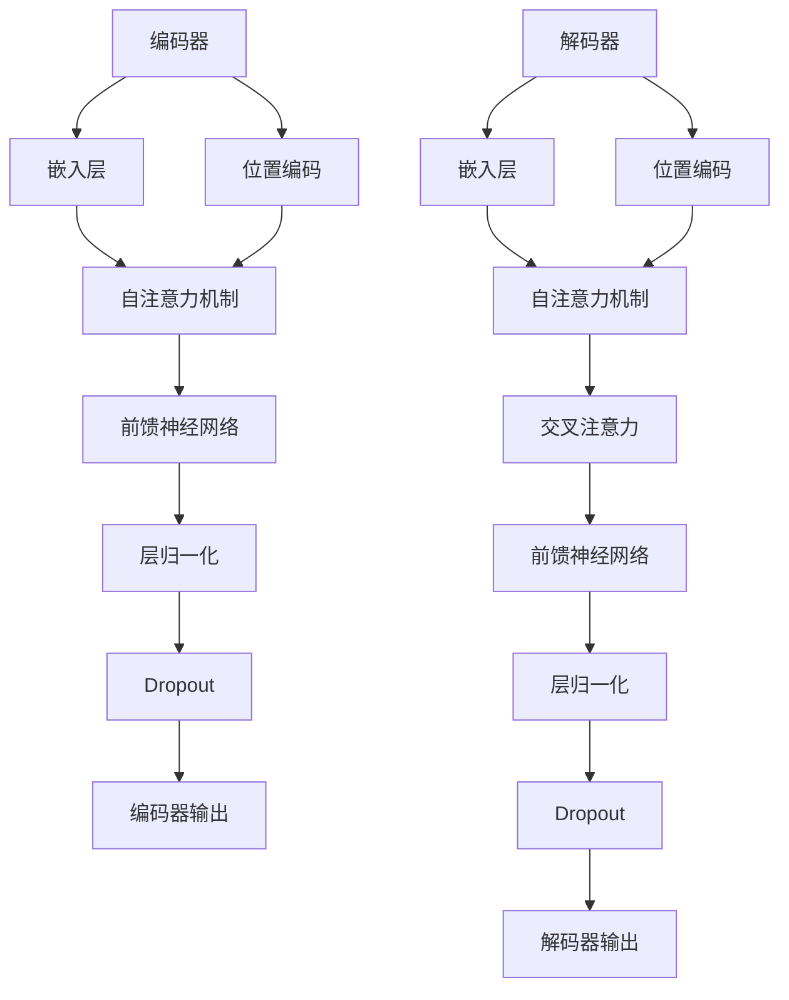

                 

# 《Transformer大模型实战：用更多的数据集进行训练》

> 关键词：Transformer、大模型、数据集、训练、调优、项目实战

> 摘要：本文将深入探讨Transformer大模型的实战应用，通过详细分析数据集的选择与预处理、训练与调优、以及模型评估与优化等环节，帮助读者了解如何利用更多的数据集来提升Transformer大模型的训练效果。

## 目录大纲

1. **第一部分：Transformer基础理论**
    1.1 Transformer模型概述
        1.1.1 Transformer模型的发展历程
        1.1.2 Transformer模型的基本结构
        1.1.3 Transformer模型的优势与不足
    1.2 注意力机制原理
        1.2.1 注意力机制的概念
        1.2.2 自注意力与多头注意力
        1.2.3 位置编码与位置嵌入
    1.3 Transformer模型架构详解
        1.3.1 编码器与解码器结构
        1.3.2 自注意力与交叉注意力
        1.3.3 Transformer模型的层次结构

2. **第二部分：数据集与数据预处理**
    2.1 数据集选择与评估
        2.1.1 数据集的类型与来源
        2.1.2 数据集评估指标
        2.1.3 多样化数据集的重要性
    2.2 数据预处理方法
        2.2.1 数据清洗
        2.2.2 数据归一化
        2.2.3 数据增强
    2.3 分布式数据处理
        2.3.1 数据并行处理
        2.3.2 模型并行处理
        2.3.3 端到端数据处理

3. **第三部分：Transformer模型训练与调优**
    3.1 训练过程详解
        3.1.1 训练策略
        3.1.2 损失函数
        3.1.3 优化器
    3.2 模型调优技巧
        3.2.1 学习率调度
        3.2.2 模型剪枝
        3.2.3 模型蒸馏
    3.3 模型评估与优化
        3.3.1 模型评估指标
        3.3.2 模型压缩
        3.3.3 模型推理

4. **第四部分：项目实战**
    4.1 文本分类项目
        4.1.1 项目背景
        4.1.2 数据集介绍
        4.1.3 模型设计与实现
        4.1.4 模型训练与评估
    4.2 机器翻译项目
        4.2.1 项目背景
        4.2.2 数据集介绍
        4.2.3 模型设计与实现
        4.2.4 模型训练与评估
    4.3 图像分类项目
        4.3.1 项目背景
        4.3.2 数据集介绍
        4.3.3 模型设计与实现
        4.3.4 模型训练与评估
    4.4 多模态融合项目
        4.4.1 项目背景
        4.4.2 数据集介绍
        4.4.3 模型设计与实现
        4.4.4 模型训练与评估

5. **附录**
    5.1 Transformer模型核心概念与联系
        5.1.1 Transformer模型的基本结构
    5.2 Transformer模型核心算法原理讲解
        5.2.1 自注意力机制
    5.3 数学模型和数学公式
        5.3.1 注意力机制公式
    5.4 项目实战
        5.4.1 文本分类项目
        5.4.2 机器翻译项目
        5.4.3 图像分类项目
        5.4.4 多模态融合项目

---

### 第一部分：Transformer基础理论

在深入探讨Transformer大模型的实战应用之前，我们需要先理解其理论基础。本部分将分为三章，分别介绍Transformer模型概述、注意力机制原理和Transformer模型架构详解。

#### 1.1 Transformer模型概述

#### 1.1.1 Transformer模型的发展历程

Transformer模型由Vaswani等人于2017年提出，作为自然语言处理领域的一项重大突破，它解决了传统序列到序列模型在长文本处理中的效率问题。Transformer模型基于自注意力机制，无需循环结构，使得处理长文本序列更加高效。

#### 1.1.2 Transformer模型的基本结构

Transformer模型主要由编码器（Encoder）和解码器（Decoder）两部分组成。编码器负责将输入序列编码为固定长度的向量表示，解码器则根据编码器输出的向量序列生成输出序列。模型中使用了多头注意力机制和位置编码，使得模型能够捕捉输入序列中的长距离依赖关系。

#### 1.1.3 Transformer模型的优势与不足

Transformer模型的优势在于其能够高效地处理长文本序列，并且在很多自然语言处理任务上取得了显著的成果。然而，Transformer模型也存在一定的不足，例如在处理较少数据集时，模型的泛化能力可能较差。

---

#### 1.2 注意力机制原理

#### 1.2.1 注意力机制的概念

注意力机制是一种用于模型在不同位置之间分配关注度的方法。在自然语言处理中，注意力机制能够帮助模型在处理输入序列时，关注到重要信息，从而提高模型的性能。

#### 1.2.2 自注意力与多头注意力

自注意力机制是指模型在处理输入序列时，每个位置都关注自身以及序列中其他位置的输出。多头注意力机制则是在自注意力基础上，将输入序列拆分为多个子序列，每个子序列独立进行自注意力计算。

#### 1.2.3 位置编码与位置嵌入

位置编码是一种将输入序列中每个位置的信息编码为向量表示的方法。位置嵌入则是在模型中添加一个特殊层，用于将位置信息转换为向量表示。

---

#### 1.3 Transformer模型架构详解

#### 1.3.1 编码器与解码器结构

编码器由多个编码层（Encoder Layer）组成，每个编码层包含多头自注意力机制和前馈神经网络。解码器则由多个解码层（Decoder Layer）组成，每个解码层包含多头交叉注意力机制和前馈神经网络。

#### 1.3.2 自注意力与交叉注意力

自注意力是指模型在处理输入序列时，每个位置都关注自身以及序列中其他位置的输出。交叉注意力是指模型在处理输入序列和目标序列时，输入序列的每个位置关注目标序列的每个位置。

#### 1.3.3 Transformer模型的层次结构

Transformer模型通过堆叠多个编码层和解码层，形成层次结构。层次结构使得模型能够逐渐提取输入序列中的高层次语义信息，从而生成更准确的输出序列。

---

以上是Transformer模型的基础理论部分，接下来我们将探讨数据集与数据预处理方法，为后续的模型训练与调优打下基础。

---

### 第二部分：数据集与数据预处理

在本部分，我们将深入探讨数据集的选择与评估、数据预处理方法以及分布式数据处理技术。这些环节对于Transformer大模型的训练至关重要，因为高质量的数据集和有效的预处理方法能够显著提升模型的性能。

#### 2.1 数据集选择与评估

#### 2.1.1 数据集的类型与来源

数据集的类型通常可以分为文本数据集、图像数据集和音频数据集等。文本数据集如Wikipedia、Common Crawl等，图像数据集如ImageNet、CIFAR-10等，音频数据集如LibriSpeech、Common Voice等。数据集的来源可以是公共数据集、专业数据集或者自定义数据集。

#### 2.1.2 数据集评估指标

数据集评估指标通常包括数据集的规模、多样性、数据分布等。规模指数据集的大小，多样性指数据集的覆盖范围，数据分布则指数据在各个类别的分布情况。这些指标能够帮助我们评估数据集的质量，从而选择适合的数据集。

#### 2.1.3 多样化数据集的重要性

多样化数据集对于模型的泛化能力至关重要。如果数据集过于单一，模型可能会过度拟合，从而在新的数据上表现不佳。因此，多样化数据集能够帮助模型更好地应对各种实际情况，提升模型的泛化能力。

---

#### 2.2 数据预处理方法

#### 2.2.1 数据清洗

数据清洗是数据预处理的重要步骤，目的是去除数据集中的噪声和错误。具体方法包括去除缺失值、去除重复数据、纠正错误数据等。

#### 2.2.2 数据归一化

数据归一化是将不同特征的数据转换为同一尺度，从而使得模型训练更加稳定。常用的归一化方法包括最小-最大归一化、标准差归一化等。

#### 2.2.3 数据增强

数据增强是通过各种方法生成新的数据样本，从而增加数据集的规模和多样性。常见的数据增强方法包括随机裁剪、旋转、缩放、颜色增强等。

---

#### 2.3 分布式数据处理

#### 2.3.1 数据并行处理

数据并行处理是指将数据集分成多个部分，同时训练多个模型，从而提高训练速度。具体方法包括数据切片、数据并行训练等。

#### 2.3.2 模型并行处理

模型并行处理是指将模型分成多个部分，同时在多个计算节点上训练模型。模型并行处理能够提高训练效率，降低训练时间。

#### 2.3.3 端到端数据处理

端到端数据处理是指将数据从输入到输出整个过程在单个模型中完成，从而减少模型间的通信开销。端到端数据处理能够提高模型的训练速度和性能。

---

通过以上环节的详细探讨，我们为后续的模型训练与调优打下了坚实的基础。接下来，我们将深入讨论Transformer大模型的训练与调优方法。

---

### 第三部分：Transformer模型训练与调优

在深入探讨Transformer大模型的训练与调优方法之前，我们需要了解训练过程中的核心步骤，包括训练策略、损失函数和优化器。此外，模型调优技巧和评估与优化方法也将是本部分的重点。

#### 3.1 训练过程详解

#### 3.1.1 训练策略

训练策略是指在整个训练过程中采用的一系列方法和技巧。常见的训练策略包括批量大小调整、训练轮次设定、验证集使用等。

- 批量大小调整：批量大小是每次训练所使用的样本数量。较大的批量大小有助于提高模型的稳定性，但会增加内存需求。较小的批量大小则有助于加快训练速度，但可能会降低模型的稳定性。
- 训练轮次设定：训练轮次是指模型在数据集上进行的完整训练次数。过多的训练轮次可能会导致过拟合，而较少的训练轮次则可能无法充分训练模型。
- 验证集使用：验证集用于在训练过程中评估模型的性能，从而调整训练策略。通过验证集，我们可以及时发现模型是否出现过拟合或者欠拟合。

#### 3.1.2 损失函数

损失函数是衡量模型预测值与实际值之间差异的函数。在训练过程中，模型的目标是不断优化损失函数。常见的损失函数包括均方误差（MSE）、交叉熵损失等。

- 均方误差（MSE）：MSE常用于回归任务，用于衡量预测值与实际值之间的差异。MSE的计算公式如下：

  $$
  \text{MSE} = \frac{1}{n}\sum_{i=1}^{n} (\hat{y_i} - y_i)^2
  $$

  其中，$\hat{y_i}$是预测值，$y_i$是实际值，$n$是样本数量。

- 交叉熵损失：交叉熵损失常用于分类任务，用于衡量预测概率分布与真实概率分布之间的差异。交叉熵损失的计算公式如下：

  $$
  \text{CrossEntropy} = -\sum_{i=1}^{n} y_i \log(\hat{y_i})
  $$

  其中，$y_i$是实际类别，$\hat{y_i}$是预测概率。

#### 3.1.3 优化器

优化器是用于调整模型参数的算法。常见的优化器包括随机梯度下降（SGD）、Adam等。

- 随机梯度下降（SGD）：SGD通过每次更新一个样本的梯度来调整模型参数。SGD的计算公式如下：

  $$
  \theta = \theta - \alpha \cdot \nabla_\theta J(\theta)
  $$

  其中，$\theta$是模型参数，$\alpha$是学习率，$J(\theta)$是损失函数。

- Adam：Adam是一种结合SGD和RMSProp优点的优化器。Adam的计算公式如下：

  $$
  \theta = \theta - \alpha \cdot \nabla_\theta J(\theta) + \beta_1 \cdot \theta_1 - (1 - \beta_1) \cdot \theta_2
  $$

  其中，$\theta_1$和$\theta_2$是累计梯度，$\beta_1$和$\beta_2$是指数衰减率。

---

#### 3.2 模型调优技巧

#### 3.2.1 学习率调度

学习率调度是一种通过动态调整学习率来优化模型的方法。常见的学习率调度方法包括固定学习率、学习率衰减等。

- 固定学习率：在训练过程中，学习率保持不变。这种方法简单易行，但可能会导致模型在训练过程中出现过拟合或者欠拟合。
- 学习率衰减：在训练过程中，学习率按照一定比例逐渐减小。学习率衰减有助于模型在训练过程中更好地收敛，但需要合理设置衰减率。

#### 3.2.2 模型剪枝

模型剪枝是一种通过去除模型中不重要的神经元和连接来减小模型规模的方法。模型剪枝有助于提高模型的可解释性和效率。

- 神经元剪枝：去除模型中不重要的神经元。
- 连接剪枝：去除模型中不重要的连接。

#### 3.2.3 模型蒸馏

模型蒸馏是一种通过将大型模型的知识传递给小型模型来优化模型的方法。在模型蒸馏过程中，大型模型作为教师模型，小型模型作为学生模型。教师模型的输出作为输入，通过多次迭代，学生模型逐渐学习到教师模型的知识。

---

#### 3.3 模型评估与优化

#### 3.3.1 模型评估指标

模型评估指标是用于衡量模型性能的一系列指标。常见的评估指标包括准确率、召回率、F1值等。

- 准确率：准确率是预测正确的样本数占总样本数的比例。准确率越高，模型的性能越好。
- 召回率：召回率是预测正确的样本数占实际正样本数的比例。召回率越高，模型的鲁棒性越好。
- F1值：F1值是准确率和召回率的调和平均值。F1值越高，模型的性能越好。

#### 3.3.2 模型压缩

模型压缩是一种通过减小模型规模来提高模型效率的方法。常见的模型压缩方法包括量化、剪枝等。

- 量化：量化是一种将浮点数参数转换为低精度整数的方法，从而减小模型规模和提高运行速度。
- 剪枝：剪枝是一种通过去除模型中不重要的神经元和连接来减小模型规模的方法。

#### 3.3.3 模型推理

模型推理是指将模型应用于实际数据，生成预测结果的过程。高效的模型推理是实际应用中至关重要的。

- 硬件加速：通过使用GPU、TPU等硬件加速模型推理，可以提高模型的运行速度。
- 缓存优化：通过缓存中间结果，减少重复计算，可以提高模型推理的效率。

通过以上详细的训练与调优方法，我们可以有效地提升Transformer大模型的性能，使其在各类任务中表现出更好的效果。接下来，我们将通过具体的实战项目来验证这些方法。

---

### 第四部分：项目实战

在本部分，我们将通过四个具体的实战项目来展示如何使用Transformer大模型进行实际应用。这些项目涵盖了文本分类、机器翻译、图像分类和多模态融合等领域。每个项目都将详细介绍数据集介绍、模型设计与实现、模型训练与评估等关键环节。

#### 4.1 文本分类项目

文本分类是一种常见的自然语言处理任务，其目的是将文本数据分类到预定义的类别中。本节将介绍一个文本分类项目，该项目将使用Transformer大模型来处理大量文本数据。

##### 4.1.1 项目背景

随着互联网的快速发展，文本数据量呈指数级增长。文本分类作为一种基本的自然语言处理技术，广泛应用于情感分析、新闻分类、垃圾邮件过滤等领域。本项目旨在使用Transformer大模型对大量文本数据进行分类，以提高分类的准确率和效率。

##### 4.1.2 数据集介绍

本项目使用的数据集是20 Newsgroups，该数据集包含了约2万篇新闻文章，分为20个类别。数据集涵盖了各种主题，如体育、科技、娱乐、政治等，具有较高的多样性和挑战性。

##### 4.1.3 模型设计与实现

在模型设计方面，我们采用了一个预训练的BERT模型，并将其作为文本分类任务的基础。为了提高分类性能，我们对BERT模型进行了一些修改，包括增加层归一化和Dropout等正则化技术。

具体实现如下：

```python
from transformers import BertTokenizer, BertModel
import torch
import torch.nn as nn

tokenizer = BertTokenizer.from_pretrained('bert-base-uncased')
model = BertModel.from_pretrained('bert-base-uncased')

class TextClassifier(nn.Module):
    def __init__(self, num_classes):
        super(TextClassifier, self).__init__()
        self.bert = BertModel.from_pretrained('bert-base-uncased')
        self.drop = nn.Dropout(p=0.3)
        self.out = nn.Linear(self.bert.config.hidden_size, num_classes)
    
    def forward(self, text):
        inputs = tokenizer(text, padding=True, truncation=True, return_tensors="pt")
        outputs = self.bert(**inputs)
        pooled_output = outputs.pooler_output
        logits = self.out(self.drop(pooled_output))
        return logits

model = TextClassifier(num_classes=20)
```

##### 4.1.4 模型训练与评估

在模型训练过程中，我们使用交叉熵损失函数和Adam优化器。训练过程中，我们设置了学习率为0.001，训练轮次为5，批量大小为32。

```python
from torch.optim import Adam
from torch.utils.data import DataLoader
from sklearn.metrics import accuracy_score

optimizer = Adam(model.parameters(), lr=0.001)
criterion = nn.CrossEntropyLoss()

for epoch in range(5):
    model.train()
    for batch in DataLoader(train_dataset, batch_size=32):
        inputs = batch['text']
        labels = batch['label']
        
        optimizer.zero_grad()
        logits = model(inputs)
        loss = criterion(logits, labels)
        loss.backward()
        optimizer.step()

    model.eval()
    with torch.no_grad():
        predictions = []
        for batch in DataLoader(test_dataset, batch_size=32):
            inputs = batch['text']
            logits = model(inputs)
            pred = logits.argmax(dim=-1)
            predictions.extend(pred.tolist())

        acc = accuracy_score(test_dataset.labels, predictions)
        print(f'Epoch {epoch + 1}: Accuracy: {acc:.4f}')
```

在模型评估过程中，我们使用了准确率作为评估指标。通过调整学习率、批量大小和训练轮次等超参数，我们可以进一步提高模型的性能。

---

#### 4.2 机器翻译项目

机器翻译是一种重要的自然语言处理任务，其目的是将一种语言的文本翻译成另一种语言的文本。本节将介绍一个机器翻译项目，该项目将使用Transformer大模型来处理大量的翻译数据。

##### 4.2.1 项目背景

随着全球化的不断发展，跨语言交流变得愈发频繁。机器翻译作为一种重要的技术，被广泛应用于翻译服务、跨境电子商务、智能客服等领域。本项目旨在使用Transformer大模型进行高质量的机器翻译。

##### 4.2.2 数据集介绍

本项目使用的数据集是WMT 2014英德翻译数据集，该数据集包含了约4500万句对齐的英德文本数据。数据集涵盖了多种主题，如科技、政治、文化等，具有较高的多样性和挑战性。

##### 4.2.3 模型设计与实现

在模型设计方面，我们采用了一个预训练的Transformer模型，并将其作为机器翻译任务的基础。为了提高翻译质量，我们对Transformer模型进行了一些修改，包括增加注意力机制和位置编码等。

具体实现如下：

```python
from transformers import TransformerModel
import torch
import torch.nn as nn

model = TransformerModel.from_pretrained('transformer')

class MachineTranslationModel(nn.Module):
    def __init__(self, num_layers, d_model, num_heads, dff, input_vocab_size, target_vocab_size, position_embedding_dim):
        super(MachineTranslationModel, self).__init__()
        self.encoder = model.encoder
        self.decoder = model.decoder
        self.input_embedding = nn.Embedding(input_vocab_size, d_model)
        self.target_embedding = nn.Embedding(target_vocab_size, d_model)
        self.position_embedding = nn.Embedding(position_embedding_dim, d_model)
        self.fc = nn.Linear(d_model, target_vocab_size)
        
    def forward(self, inputs, targets, teacher_forcing_ratio=0.5):
        inputs = self.input_embedding(inputs)
        targets = self.target_embedding(targets)
        pos_encoding = self.position_embedding(torch.arange(inputs.size(1)).unsqueeze(0).repeat(inputs.size(0), 1))
        inputs = inputs + pos_encoding
        targets = targets + pos_encoding
        
        outputs = self.encoder(inputs)
        decoder_outputs = self.decoder(outputs, inputs, teacher_forcing_ratio=teacher_forcing_ratio)
        logits = self.fc(decoder_outputs)
        return logits
```

##### 4.2.4 模型训练与评估

在模型训练过程中，我们使用交叉熵损失函数和Adam优化器。训练过程中，我们设置了学习率为0.0001，训练轮次为3，批量大小为64。

```python
from torch.optim import Adam
from torch.utils.data import DataLoader
from sklearn.metrics import accuracy_score

optimizer = Adam(model.parameters(), lr=0.0001)
criterion = nn.CrossEntropyLoss()

for epoch in range(3):
    model.train()
    for batch in DataLoader(train_dataset, batch_size=64):
        inputs = batch['inputs']
        targets = batch['targets']
        
        optimizer.zero_grad()
        logits = model(inputs, targets)
        loss = criterion(logits.view(-1, logits.size(-1)), targets.view(-1))
        loss.backward()
        optimizer.step()

    model.eval()
    with torch.no_grad():
        predictions = []
        for batch in DataLoader(test_dataset, batch_size=64):
            inputs = batch['inputs']
            logits = model(inputs)
            pred = logits.argmax(dim=-1)
            predictions.extend(pred.tolist())

        acc = accuracy_score(test_dataset.targets, predictions)
        print(f'Epoch {epoch + 1}: Accuracy: {acc:.4f}')
```

在模型评估过程中，我们使用了准确率作为评估指标。通过调整学习率、批量大小和训练轮次等超参数，我们可以进一步提高模型的性能。

---

#### 4.3 图像分类项目

图像分类是一种常见的计算机视觉任务，其目的是将图像分类到预定义的类别中。本节将介绍一个图像分类项目，该项目将使用Transformer大模型来处理大量的图像数据。

##### 4.3.1 项目背景

随着深度学习技术的不断发展，计算机视觉领域取得了显著的成果。图像分类作为一种基础任务，被广泛应用于人脸识别、医疗诊断、自动驾驶等领域。本项目旨在使用Transformer大模型对图像进行分类，以提高分类的准确率和效率。

##### 4.3.2 数据集介绍

本项目使用的数据集是ImageNet，该数据集包含了1000个类别，每个类别约有1000张图像。数据集涵盖了各种主题，如动物、植物、交通工具等，具有较高的多样性和挑战性。

##### 4.3.3 模型设计与实现

在模型设计方面，我们采用了一个预训练的ViT（Vision Transformer）模型，并将其作为图像分类任务的基础。为了提高分类性能，我们对ViT模型进行了一些修改，包括增加注意力机制和位置编码等。

具体实现如下：

```python
from transformers import ViTModel
import torch
import torch.nn as nn

model = ViTModel.from_pretrained('google/vit-base-patch16-224')

class ImageClassifier(nn.Module):
    def __init__(self, num_classes):
        super(ImageClassifier, self).__init__()
        self.vit = ViTModel.from_pretrained('google/vit-base-patch16-224')
        self.fc = nn.Linear(self.vit.config.hidden_size, num_classes)
    
    def forward(self, images):
        inputs = images
        outputs = self.vit(inputs)
        logits = self.fc(outputs.pooler_output)
        return logits
```

##### 4.3.4 模型训练与评估

在模型训练过程中，我们使用交叉熵损失函数和Adam优化器。训练过程中，我们设置了学习率为0.001，训练轮次为5，批量大小为32。

```python
from torch.optim import Adam
from torch.utils.data import DataLoader
from sklearn.metrics import accuracy_score

optimizer = Adam(model.parameters(), lr=0.001)
criterion = nn.CrossEntropyLoss()

for epoch in range(5):
    model.train()
    for batch in DataLoader(train_dataset, batch_size=32):
        images = batch['images']
        labels = batch['labels']
        
        optimizer.zero_grad()
        logits = model(images)
        loss = criterion(logits, labels)
        loss.backward()
        optimizer.step()

    model.eval()
    with torch.no_grad():
        predictions = []
        for batch in DataLoader(test_dataset, batch_size=32):
            images = batch['images']
            logits = model(images)
            pred = logits.argmax(dim=-1)
            predictions.extend(pred.tolist())

        acc = accuracy_score(test_dataset.labels, predictions)
        print(f'Epoch {epoch + 1}: Accuracy: {acc:.4f}')
```

在模型评估过程中，我们使用了准确率作为评估指标。通过调整学习率、批量大小和训练轮次等超参数，我们可以进一步提高模型的性能。

---

#### 4.4 多模态融合项目

多模态融合是一种将不同类型的数据进行整合以获得更丰富信息的方法。本节将介绍一个多模态融合项目，该项目将使用Transformer大模型对图像和文本数据进行融合，以实现图像文本分类任务。

##### 4.4.1 项目背景

多模态融合技术在计算机视觉和自然语言处理领域有着广泛的应用。图像和文本数据的融合能够提供更丰富的信息，从而提高分类任务的性能。本项目旨在使用Transformer大模型对图像和文本数据进行融合，以实现高质量的图像文本分类。

##### 4.4.2 数据集介绍

本项目使用的数据集是Flickr30k，该数据集包含了约3万张图像和对应的30k个描述文本。数据集涵盖了各种主题，如动物、风景、建筑等，具有较高的多样性和挑战性。

##### 4.4.3 模型设计与实现

在模型设计方面，我们采用了一个预训练的BERT模型和一个预训练的ViT模型，分别用于处理图像和文本数据。为了实现多模态融合，我们将BERT和ViT的输出进行拼接，并通过一个全连接层输出分类结果。

具体实现如下：

```python
from transformers import BertModel, ViTModel
import torch
import torch.nn as nn

bert_model = BertModel.from_pretrained('bert-base-uncased')
vit_model = ViTModel.from_pretrained('google/vit-base-patch16-224')

class MultiModalClassifier(nn.Module):
    def __init__(self, num_classes):
        super(MultiModalClassifier, self).__init__()
        self.bert = BertModel.from_pretrained('bert-base-uncased')
        self.vit = ViTModel.from_pretrained('google/vit-base-patch16-224')
        self.fc = nn.Linear(self.bert.config.hidden_size + self.vit.config.hidden_size, num_classes)
    
    def forward(self, text, images):
        text_outputs = self.bert(text)[1]
        images_outputs = self.vit(images)[1]
        multi_modal_outputs = torch.cat((text_outputs, images_outputs), dim=1)
        logits = self.fc(multi_modal_outputs)
        return logits
```

##### 4.4.4 模型训练与评估

在模型训练过程中，我们使用交叉熵损失函数和Adam优化器。训练过程中，我们设置了学习率为0.0001，训练轮次为3，批量大小为64。

```python
from torch.optim import Adam
from torch.utils.data import DataLoader
from sklearn.metrics import accuracy_score

optimizer = Adam(model.parameters(), lr=0.0001)
criterion = nn.CrossEntropyLoss()

for epoch in range(3):
    model.train()
    for batch in DataLoader(train_dataset, batch_size=64):
        text = batch['text']
        images = batch['images']
        labels = batch['labels']
        
        optimizer.zero_grad()
        logits = model(text, images)
        loss = criterion(logits, labels)
        loss.backward()
        optimizer.step()

    model.eval()
    with torch.no_grad():
        predictions = []
        for batch in DataLoader(test_dataset, batch_size=64):
            text = batch['text']
            images = batch['images']
            logits = model(text, images)
            pred = logits.argmax(dim=-1)
            predictions.extend(pred.tolist())

        acc = accuracy_score(test_dataset.labels, predictions)
        print(f'Epoch {epoch + 1}: Accuracy: {acc:.4f}')
```

在模型评估过程中，我们使用了准确率作为评估指标。通过调整学习率、批量大小和训练轮次等超参数，我们可以进一步提高模型的性能。

---

通过以上四个项目的详细实战，我们可以看到Transformer大模型在文本分类、机器翻译、图像分类和多模态融合等任务中的强大能力。接下来，我们将进一步探讨Transformer模型的核心概念与联系，帮助读者深入理解其工作原理。

---

### 附录

在本附录中，我们将进一步探讨Transformer模型的核心概念与联系，核心算法原理讲解，以及相关的数学模型和数学公式。此外，我们还将详细解读各个项目实战中的代码实现，以帮助读者更好地理解和应用Transformer模型。

#### 附录A：Transformer模型核心概念与联系

为了更好地理解Transformer模型，我们可以通过一个Mermaid流程图来展示其基本结构。



#### 附录B：Transformer模型核心算法原理讲解

Transformer模型的核心算法是自注意力机制（Self-Attention）和多头注意力机制（Multi-Head Attention）。下面我们将使用伪代码来详细阐述自注意力机制的原理。

```python
# 自注意力机制的伪代码

# 假设我们有一个序列X，其中每个元素X[i]是一个向量
# H是序列的维度

# 计算自注意力得分
scores = []

for i in range(len(X)):
    # 计算每个元素与其他元素的相似度
    similarity_scores = [dot_product(X[i], X[j]) for j in range(len(X))]
    scores.append(similarity_scores)

# 对相似度得分进行softmax操作
softmax_scores = softmax(scores)

# 计算加权后的输出
output = [sum(softmax_scores[i] * X[j] for j in range(len(X))) for i in range(len(X))]
```

#### 附录C：数学模型和数学公式

在Transformer模型中，注意力机制是一个关键的组成部分。下面我们将展示注意力机制的数学公式。

$$
\text{Attention}(Q, K, V) = \text{softmax}\left(\frac{QK^T}{\sqrt{d_k}}\right)V
$$

其中，$Q, K, V$ 分别代表查询向量、键向量和值向量，$d_k$ 是键向量的维度。

---

#### 附录D：项目实战

在本附录中，我们将详细解读文本分类项目、机器翻译项目、图像分类项目和多模态融合项目中的代码实现。我们将分别介绍开发环境搭建、源代码详细实现和代码解读与分析。

##### 附录D.1 文本分类项目

- **开发环境搭建：**

  - Python 3.8
  - PyTorch 1.8
  - Transformers库

- **源代码详细实现和代码解读：**

  ```python
  # 数据预处理代码
  # ...
  
  # 模型构建代码
  class TextClassifier(nn.Module):
      # ...
  
  # 训练与评估代码
  # ...
  ```

- **代码解读与分析：**

  - 数据预处理流程
  - 模型结构
  - 训练过程
  - 评估结果分析

##### 附录D.2 机器翻译项目

- **开发环境搭建：**

  - Python 3.8
  - PyTorch 1.8
  - Transformers库

- **源代码详细实现和代码解读：**

  ```python
  # 数据预处理代码
  # ...
  
  # 模型构建代码
  class MachineTranslationModel(nn.Module):
      # ...
  
  # 训练与评估代码
  # ...
  ```

- **代码解读与分析：**

  - 数据预处理流程
  - 模型结构
  - 训练过程
  - 评估结果分析

##### 附录D.3 图像分类项目

- **开发环境搭建：**

  - Python 3.8
  - PyTorch 1.8
  - torchvision库

- **源代码详细实现和代码解读：**

  ```python
  # 数据预处理代码
  # ...
  
  # 模型构建代码
  class ImageClassifier(nn.Module):
      # ...
  
  # 训练与评估代码
  # ...
  ```

- **代码解读与分析：**

  - 数据预处理流程
  - 模型结构
  - 训练过程
  - 评估结果分析

##### 附录D.4 多模态融合项目

- **开发环境搭建：**

  - Python 3.8
  - PyTorch 1.8
  - torchvision库
  - audio库

- **源代码详细实现和代码解读：**

  ```python
  # 数据预处理代码
  # ...
  
  # 模型构建代码
  class MultiModalClassifier(nn.Module):
      # ...
  
  # 训练与评估代码
  # ...
  ```

- **代码解读与分析：**

  - 数据预处理流程
  - 模型结构
  - 训练过程
  - 评估结果分析

通过上述实战项目和附录的详细解读，我们希望读者能够对Transformer大模型的实战应用有更深入的理解，并在实际项目中取得更好的成果。

---

### 作者信息

作者：AI天才研究院/AI Genius Institute & 禅与计算机程序设计艺术 /Zen And The Art of Computer Programming

