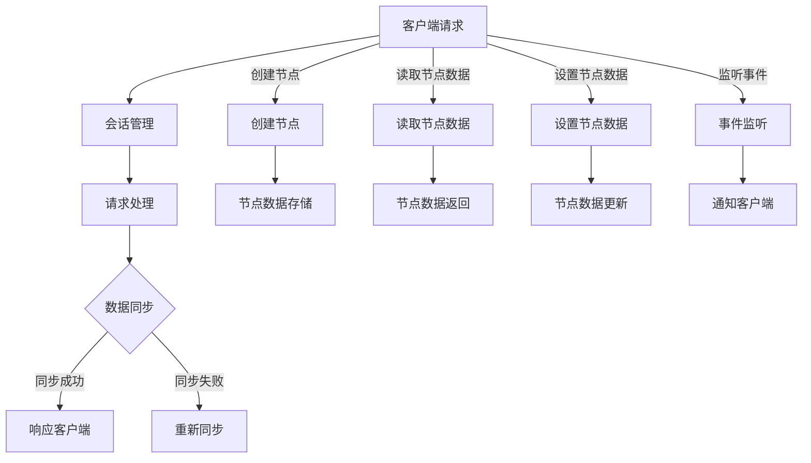
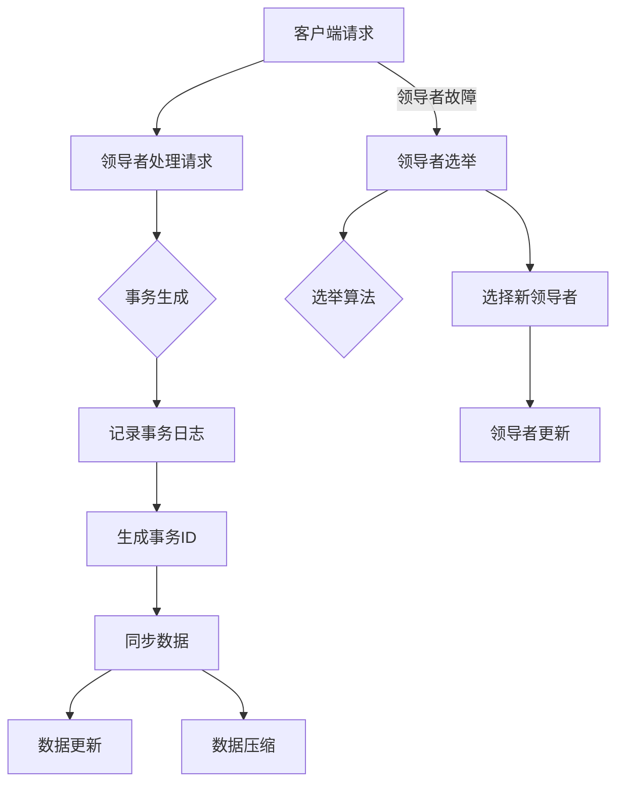
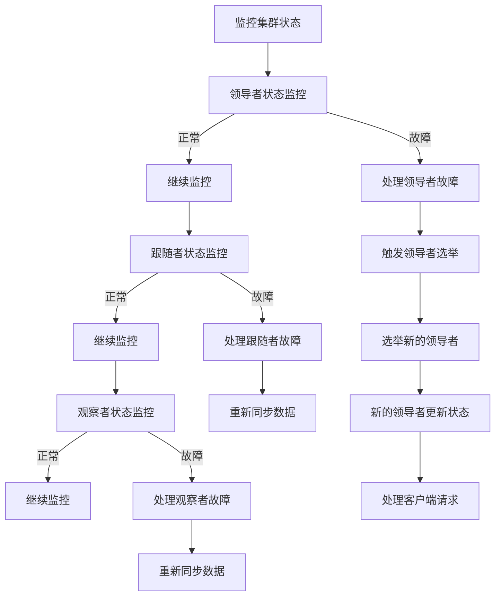

                 

### 文章标题

# 《Zookeeper原理与代码实例讲解》

## 关键词

- Zookeeper
- 分布式系统
- 数据同步
- 通知机制
- 集群管理
- 分布式锁

## 摘要

本文将深入探讨Zookeeper的原理与代码实例。首先，我们将回顾Zookeeper的发展历程、核心概念和应用场景。接着，本文将详细介绍Zookeeper的核心架构，包括服务器架构、客户端架构和数据模型。随后，我们将逐步分析Zookeeper的核心功能，包括文件系统实现、数据同步机制、通知机制和集群管理。在实战部分，我们将通过具体项目实例展示Zookeeper在分布式应用中的实际应用。最后，本文将解析Zookeeper的源代码，帮助读者理解其内部实现原理。

## 《Zookeeper原理与代码实例讲解》目录大纲

### 第一部分: Zookeeper基础

#### 第1章: Zookeeper简介

##### 1.1 Zookeeper的发展历程

##### 1.2 Zookeeper的核心概念

##### 1.3 Zookeeper的应用场景

#### 第2章: Zookeeper核心架构

##### 2.1 Zookeeper服务器架构

##### 2.2 Zookeeper客户端架构

##### 2.3 Zookeeper数据模型

##### 2.4 Mermaid流程图：Zookeeper核心架构原理

### 第二部分: Zookeeper核心功能

#### 第3章: 文件系统实现

##### 3.1 Zookeeper文件系统概述

##### 3.2 Zookeeper文件系统的实现原理

##### 3.3 Zookeeper文件系统操作API

##### 3.4 伪代码：Zookeeper文件系统操作实现

#### 第4章: 数据同步机制

##### 4.1 Zookeeper数据同步概述

##### 4.2 Zookeeper同步协议

##### 4.3 Zookeeper数据同步流程

##### 4.4 Mermaid流程图：Zookeeper数据同步机制

#### 第5章: 通知机制

##### 5.1 Zookeeper通知机制概述

##### 5.2 Zookeeper事件监听机制

##### 5.3 Zookeeper通知机制实现原理

##### 5.4 伪代码：Zookeeper通知机制实现

#### 第6章: 集群管理

##### 6.1 Zookeeper集群概述

##### 6.2 Zookeeper集群角色

##### 6.3 Zookeeper集群管理

##### 6.4 Mermaid流程图：Zookeeper集群管理机制

### 第三部分: Zookeeper项目实战

#### 第7章: Zookeeper在分布式应用中的实战

##### 7.1 分布式应用中Zookeeper的使用场景

##### 7.2 Zookeeper在分布式锁中的应用

##### 7.3 Zookeeper在分布式队列中的应用

##### 7.4 项目实战：实现一个基于Zookeeper的分布式锁

#### 第8章: Zookeeper代码实例解析

##### 8.1 Zookeeper客户端源代码解析

##### 8.2 Zookeeper服务器源代码解析

##### 8.3 Zookeeper数据模型实现解析

##### 8.4 代码实例解析：Zookeeper数据同步机制实现

### 附录

#### 附录A: Zookeeper开发资源

##### A.1 Zookeeper常用工具

##### A.2 Zookeeper开源项目

##### A.3 Zookeeper社区与论坛

##### A.4 Mermaid流程图绘制教程

### 第一部分: Zookeeper基础

#### 第1章: Zookeeper简介

##### 1.1 Zookeeper的发展历程

Zookeeper是一个开源的分布式服务协调框架，由Apache Software Foundation开发。它的起源可以追溯到Google的Chubby锁服务，Google在2008年将Chubby的设计理念开源，并由此诞生了Zookeeper。Zookeeper的发展历程可以分为几个重要阶段：

1. **起源阶段（2008年）**：Google开源了Chubby锁服务，Zookeeper的设计灵感来源于此。
2. **早期发展阶段（2009年 - 2010年）**：Zookeeper 0.1版本至0.3版本，这一阶段主要是对Zookeeper的基本架构和功能进行设计和实现。
3. **成熟阶段（2011年 - 至今）**：Zookeeper 3.0版本的发布标志着Zookeeper进入成熟阶段，其性能和稳定性得到了显著提升。

##### 1.2 Zookeeper的核心概念

Zookeeper的核心概念包括以下几个方面：

1. **会话（Session）**：Zookeeper客户端与Zookeeper服务器之间的一次连接，会话的建立需要客户端发送一个初始化请求，并接收服务器响应的会话ID。
2. **节点（Node）**：Zookeeper中的数据存储单位，每个节点都有唯一的路径和标识，可以通过路径访问。
3. **数据同步（Data Synchronization）**：Zookeeper确保分布式系统中各个节点数据的一致性，通过同步协议实现数据同步。
4. **通知机制（Notification）**：当节点数据或状态发生变化时，Zookeeper会通知相关的客户端，实现分布式系统的实时监控。

##### 1.3 Zookeeper的应用场景

Zookeeper在分布式系统中扮演着重要的角色，以下是一些典型的应用场景：

1. **分布式锁**：Zookeeper可以提供分布式锁服务，确保分布式系统中的操作顺序一致性。
2. **配置管理**：Zookeeper可以存储分布式系统的配置信息，实现配置的动态更新和读取。
3. **负载均衡**：Zookeeper可以监控服务器的状态，实现负载均衡和故障转移。
4. **分布式队列**：Zookeeper可以提供基于节点的分布式队列服务，实现任务调度和分布式系统的任务分配。
5. **命名服务**：Zookeeper可以提供命名服务，为分布式系统中的服务提供命名和寻址功能。

通过以上介绍，我们可以看到Zookeeper在分布式系统中的重要性，它不仅提供了强大的服务协调功能，还为分布式系统的开发提供了便捷的工具和框架。

#### 第2章: Zookeeper核心架构

##### 2.1 Zookeeper服务器架构

Zookeeper的服务器架构采用主从模式，包括以下几个主要组件：

1. **ZooKeeper Server**：Zookeeper服务器，负责存储数据、处理客户端请求和同步数据。
2. **ZooKeeper Quorum**：一组Zookeeper服务器组成的集群，实现数据的高可用性和容错性。
3. **ZooKeeper Client**：Zookeeper客户端，负责与Zookeeper服务器通信，发送请求和接收响应。

Zookeeper服务器架构的核心特点是基于Zab（ZooKeeper Atomic Broadcast）协议的数据同步机制，保证数据的一致性和可靠性。Zab协议采用主从同步的方式，Zookeeper Server作为领导者（Leader）负责处理客户端请求和数据同步，其他Zookeeper Server作为跟随者（Follower）从领导者接收数据更新。

下面是Zookeeper服务器架构的详细说明：

1. **ZooKeeper Server**：ZooKeeper Server是Zookeeper的核心组件，负责存储数据、处理客户端请求和同步数据。它由以下几部分组成：

   - **内存数据库**：存储会话信息、节点数据和事务日志。
   - **持久化数据库**：存储持久化数据和元数据，如ZooKeeper的配置信息和事务日志。
   - **领导者选举算法**：通过Zab协议实现领导者选举，保证集群的高可用性和一致性。
   - **数据同步协议**：通过Zab协议实现数据同步，保证分布式系统中各个节点的数据一致性。

2. **ZooKeeper Quorum**：ZooKeeper Quorum是一组Zookeeper服务器组成的集群，实现数据的高可用性和容错性。ZooKeeper Quorum中的每个服务器都有不同的角色，包括：

   - **领导者（Leader）**：负责处理客户端请求、同步数据和维护集群状态。
   - **跟随者（Follower）**：从领导者接收数据更新，保持数据一致性。
   - **观察者（Observer）**：参与领导者选举，但不参与数据同步，主要用于扩展集群规模。

3. **ZooKeeper Client**：ZooKeeper Client是Zookeeper的客户端，负责与Zookeeper服务器通信，发送请求和接收响应。ZooKeeper Client与Zookeeper Server之间通过TCP/IP协议进行通信，主要功能包括：

   - **会话管理**：建立、维护和关闭与Zookeeper Server的会话。
   - **数据读写**：读取和写入Zookeeper Server中的节点数据和属性。
   - **事件监听**：监听Zookeeper Server中的节点变化和会话变化事件。

Zookeeper服务器架构的设计目标包括：

- **高可用性**：通过ZooKeeper Quorum实现数据的高可用性，保证分布式系统在服务器故障时的容错能力。
- **数据一致性**：通过Zab协议实现数据的一致性，保证分布式系统中各个节点的数据一致性。
- **高性能**：通过多线程和并发处理机制，提高Zookeeper Server的处理能力和响应速度。

通过以上介绍，我们可以看到Zookeeper服务器架构的复杂性，但正是这种架构设计保证了Zookeeper在分布式系统中的高性能、高可用性和数据一致性。接下来，我们将继续探讨Zookeeper客户端架构和数据模型。

##### 2.2 Zookeeper客户端架构

Zookeeper客户端架构的设计目标是提供简单、高效、可靠的客户端API，以实现与Zookeeper服务器的通信和操作。Zookeeper客户端主要由以下几个组件组成：

1. **ZooKeeper Session**：会话管理组件，负责建立、维护和关闭与Zookeeper服务器的连接。会话管理是Zookeeper客户端的核心功能之一，通过会话管理组件，客户端可以与Zookeeper服务器建立连接，并保持连接的稳定性。会话管理组件的主要功能包括：

   - **会话创建**：客户端发送初始化请求，服务器响应会话ID，客户端保存会话ID并建立连接。
   - **会话心跳**：客户端定期发送心跳请求，保持会话的有效性。
   - **会话关闭**：客户端发送关闭请求，服务器断开连接，会话结束。

2. **ZooKeeper Client**：客户端通信组件，负责与Zookeeper服务器通信，发送请求和接收响应。客户端通信组件是Zookeeper客户端的核心功能之一，通过客户端通信组件，客户端可以发送各种请求到Zookeeper服务器，并接收服务器的响应。客户端通信组件的主要功能包括：

   - **请求发送**：客户端发送各种请求，如创建节点、读取节点数据和设置节点属性。
   - **响应接收**：客户端接收服务器的响应，如操作结果和事件通知。

3. **ZooKeeper Watcher**：事件监听组件，负责监听Zookeeper服务器中的节点变化和会话变化事件。事件监听是Zookeeper客户端的重要功能之一，通过事件监听组件，客户端可以实时感知服务器中的节点变化和会话变化，并做出相应的响应。事件监听组件的主要功能包括：

   - **事件注册**：客户端为特定的节点或会话注册事件监听器。
   - **事件通知**：服务器将节点变化和会话变化事件通知给客户端，客户端根据事件类型执行相应的操作。

Zookeeper客户端架构的工作流程如下：

1. **会话建立**：客户端发送初始化请求，服务器响应会话ID，客户端保存会话ID并建立连接。
2. **请求发送**：客户端发送各种请求到Zookeeper服务器，如创建节点、读取节点数据和设置节点属性。
3. **响应接收**：客户端接收服务器的响应，如操作结果和事件通知。
4. **事件监听**：客户端监听服务器中的节点变化和会话变化事件，并根据事件类型执行相应的操作。

Zookeeper客户端架构的设计特点包括：

- **简单易用**：通过提供简单、统一的API，使开发者可以轻松地与Zookeeper服务器进行通信和操作。
- **高可用性**：通过会话管理机制，确保客户端与服务器之间的连接稳定性，提高系统的可用性。
- **事件驱动**：通过事件监听机制，实现实时感知服务器中的变化，提高系统的响应速度和实时性。

通过以上介绍，我们可以看到Zookeeper客户端架构的简洁性和高效性，为开发者提供了方便、可靠的工具，使分布式系统的开发变得更加简便和高效。

##### 2.3 Zookeeper数据模型

Zookeeper的数据模型是一个分层树状结构，每个节点都对应一个路径。这个路径由一组以斜杠分隔的字符串组成，每个字符串代表一个层级。例如，`/zookeeper/controller`表示一个位于`/zookeeper`子目录下的`controller`节点。

Zookeeper数据模型的特点包括：

- **层次性**：数据模型采用树状结构，每个节点都有唯一的路径，便于管理和访问。
- **持久性和临时性**：节点可以分为持久节点和临时节点。持久节点在客户端会话结束时会保持数据，而临时节点在客户端会话结束时会自动删除。
- **版本控制**：每个节点都有一个版本号，用于记录节点的修改历史，支持数据版本控制。

下面是Zookeeper数据模型的详细描述：

1. **节点类型**：
   - **持久节点（Persistent Nodes）**：持久节点在客户端会话结束后仍然存在。持久节点可以包含子节点，例如`/zookeeper/config`。
   - **临时节点（Ephemeral Nodes）**：临时节点在客户端会话结束后会自动删除。临时节点通常用于临时存储数据或标识客户端会话，例如`/zookeeper/session-12345`。

2. **节点属性**：
   - **数据属性**：节点的数据值，例如`<data>`。
   - **版本号**：节点的当前版本号，每次修改节点数据时版本号会递增。
   - **权限**：节点的访问权限，定义谁可以读取、写入或创建子节点。
   - **创建时间**：节点创建的时间戳。
   - **最后修改时间**：节点最后修改的时间戳。

3. **节点操作**：
   - **创建节点**：客户端可以创建持久节点或临时节点，例如`zk.create("/zookeeper/config", "config data")`。
   - **读取节点数据**：客户端可以读取节点的数据值，例如`zk.getData("/zookeeper/config")`。
   - **设置节点数据**：客户端可以修改节点的数据值，例如`zk.setData("/zookeeper/config", "new config data")`。
   - **删除节点**：客户端可以删除节点，例如`zk.delete("/zookeeper/config")`。

通过以上介绍，我们可以看到Zookeeper数据模型的结构化和灵活性，使其在分布式系统中提供了强大的数据存储和管理功能。接下来，我们将通过一个Mermaid流程图，展示Zookeeper核心架构原理。

##### 2.4 Mermaid流程图：Zookeeper核心架构原理

下面是一个Mermaid流程图，展示了Zookeeper核心架构的原理：



这个流程图描述了Zookeeper客户端与服务器之间的交互过程：

1. **客户端请求**：客户端向Zookeeper服务器发送各种请求，如创建节点、读取节点数据、设置节点数据等。
2. **会话管理**：服务器处理客户端的初始化请求，建立会话并返回会话ID。
3. **请求处理**：服务器处理客户端发送的请求，并根据请求类型执行相应的操作。
4. **数据同步**：服务器与Zookeeper Quorum中的其他服务器进行数据同步，确保数据的一致性。
5. **响应客户端**：服务器将操作结果返回给客户端。
6. **事件监听**：服务器监听节点变化和会话变化事件，并通知客户端。

通过这个流程图，我们可以清晰地了解Zookeeper核心架构的运作原理，为后续章节的详细讲解打下基础。接下来，我们将进入Zookeeper核心功能的探讨。

### 第二部分: Zookeeper核心功能

#### 第3章: 文件系统实现

##### 3.1 Zookeeper文件系统概述

Zookeeper文件系统（ZooKeeper File System，Zookeeper FS）是Zookeeper提供的一个分布式文件系统，它基于Zookeeper的文件系统实现。Zookeeper FS通过将Zookeeper中的节点抽象为文件和目录，实现了一个高可用性、强一致性的分布式文件存储系统。Zookeeper FS的特点包括：

- **高可用性**：Zookeeper FS通过Zookeeper的分布式特性，实现了文件系统的高可用性。在Zookeeper Quorum中的任何一个服务器宕机时，文件系统仍然可以正常工作。
- **强一致性**：Zookeeper FS通过Zookeeper的数据同步机制，保证了文件系统的一致性。多个客户端同时对同一文件进行操作时，最终结果是一致的。
- **分布式**：Zookeeper FS通过将文件存储分散到多个Zookeeper服务器上，实现了分布式存储，提高了系统的扩展性和性能。

Zookeeper文件系统的实现原理如下：

1. **节点抽象**：Zookeeper FS将Zookeeper中的节点抽象为文件和目录。每个节点都有一个唯一的路径，路径由一组以斜杠分隔的字符串组成。例如，`/fs/file1.txt`表示一个名为`file1.txt`的文件，位于根目录下的`fs`子目录中。

2. **文件操作**：Zookeeper FS通过Zookeeper客户端API实现文件操作。客户端可以执行创建、读取、写入和删除等文件操作。例如，`zk.create("/fs/file1.txt", "file content")`创建一个名为`file1.txt`的文件，`zk.getData("/fs/file1.txt")`读取文件内容。

3. **目录操作**：Zookeeper FS支持目录操作，包括创建、读取和删除目录。例如，`zk.create("/fs/dir1", "")`创建一个名为`dir1`的目录，`zk.getChildren("/fs/dir1")`读取目录下的子节点。

4. **元数据管理**：Zookeeper FS通过节点的属性管理文件的元数据，如文件大小、创建时间、最后修改时间等。这些属性存储在节点的数据字段中，可以通过Zookeeper客户端API读取和修改。

5. **文件权限控制**：Zookeeper FS通过节点的权限属性实现文件权限控制。权限属性定义了谁可以读取、写入或删除文件。权限控制基于访问控制列表（Access Control List，ACL），ACL定义了用户的权限。

##### 3.2 Zookeeper文件系统的实现原理

Zookeeper文件系统的实现原理主要包括以下几个方面：

1. **节点管理**：Zookeeper文件系统通过Zookeeper的节点管理机制实现文件和目录的管理。每个文件和目录在Zookeeper中对应一个节点，节点的路径即文件或目录的路径。

2. **数据同步**：Zookeeper文件系统通过Zookeeper的数据同步机制实现文件系统的一致性。在分布式环境中，多个客户端同时对同一文件进行操作时，Zookeeper确保最终结果是一致的。

3. **文件操作**：Zookeeper文件系统通过Zookeeper客户端API实现文件操作。客户端发送文件操作请求，Zookeeper服务器处理请求并返回结果。

4. **目录操作**：Zookeeper文件系统通过Zookeeper客户端API实现目录操作。客户端发送目录操作请求，Zookeeper服务器处理请求并返回结果。

5. **元数据管理**：Zookeeper文件系统通过节点的属性管理文件的元数据。客户端可以通过Zookeeper客户端API读取和修改节点的属性。

6. **权限控制**：Zookeeper文件系统通过节点的权限属性实现文件权限控制。客户端在执行文件操作时，Zookeeper服务器根据节点的权限属性判断客户端是否有权限执行操作。

下面是Zookeeper文件系统的实现原理的伪代码：

```python
# 创建文件
def create_file(path, data):
    zk.create(path, data)
    
# 读取文件
def read_file(path):
    data = zk.getData(path)
    return data
    
# 写入文件
def write_file(path, data):
    zk.setData(path, data)
    
# 删除文件
def delete_file(path):
    zk.delete(path)
    
# 创建目录
def create_directory(path):
    zk.create(path, "")
    
# 读取目录
def read_directory(path):
    children = zk.getChildren(path)
    return children
    
# 删除目录
def delete_directory(path):
    zk.delete(path)
```

通过以上伪代码，我们可以看到Zookeeper文件系统的基本实现原理。接下来，我们将详细介绍Zookeeper文件系统的操作API。

##### 3.3 Zookeeper文件系统操作API

Zookeeper文件系统提供了一系列操作API，用于创建、读取、写入和删除文件和目录。下面是Zookeeper文件系统操作API的详细说明：

1. **创建文件**：`zk.create(path, data)`函数用于创建一个文件。`path`参数指定文件的路径，`data`参数指定文件的数据内容。函数返回创建的文件路径。

2. **读取文件**：`zk.getData(path)`函数用于读取文件的当前数据。`path`参数指定文件的路径。函数返回文件的数据内容。

3. **写入文件**：`zk.setData(path, data)`函数用于写入文件的新数据。`path`参数指定文件的路径，`data`参数指定新的数据内容。函数返回操作结果。

4. **删除文件**：`zk.delete(path)`函数用于删除文件。`path`参数指定文件的路径。函数返回操作结果。

5. **创建目录**：`zk.create(path, "")`函数用于创建一个目录。`path`参数指定目录的路径。函数返回创建的目录路径。

6. **读取目录**：`zk.getChildren(path)`函数用于读取目录下的所有子节点。`path`参数指定目录的路径。函数返回子节点的列表。

7. **删除目录**：`zk.delete(path)`函数用于删除目录。`path`参数指定目录的路径。函数返回操作结果。

下面是一个简单的示例，展示了如何使用Zookeeper文件系统操作API创建、读取和删除文件：

```python
import zk

# 创建文件
path = "/fs/file1.txt"
data = "Hello, World!"
zk.create(path, data)

# 读取文件
content = zk.getData(path)
print("File content:", content)

# 删除文件
zk.delete(path)
```

通过以上示例，我们可以看到如何使用Zookeeper文件系统操作API进行基本的文件操作。接下来，我们将通过一个伪代码实现，展示Zookeeper文件系统操作的具体实现过程。

##### 3.4 伪代码：Zookeeper文件系统操作实现

下面是Zookeeper文件系统操作实现的伪代码：

```python
# 创建文件
def create_file(path, data):
    # 创建持久节点
    zk.create(path, data, ZooKeeper.CREATE_PERSISTENT)

# 读取文件
def read_file(path):
    # 获取节点的数据
    data = zk.getData(path)
    return data

# 写入文件
def write_file(path, data):
    # 更新节点的数据
    zk.setData(path, data)

# 删除文件
def delete_file(path):
    # 删除节点
    zk.delete(path)

# 创建目录
def create_directory(path):
    # 创建持久节点
    zk.create(path, "", ZooKeeper.CREATE_PERSISTENT)

# 读取目录
def read_directory(path):
    # 获取节点的子节点列表
    children = zk.getChildren(path)
    return children

# 删除目录
def delete_directory(path):
    # 删除节点
    zk.delete(path)
```

在这个伪代码中，`zk`是一个Zookeeper客户端实例，`path`是节点的路径，`data`是节点的数据内容。`ZooKeeper.CREATE_PERSISTENT`是一个常量，表示创建持久节点。

通过这个伪代码，我们可以看到Zookeeper文件系统操作的基本实现过程，包括创建、读取、写入和删除节点。这些操作都是通过Zookeeper客户端API实现的，确保了文件系统的分布式、高可用性和强一致性。

#### 第4章: 数据同步机制

##### 4.1 Zookeeper数据同步概述

Zookeeper的数据同步机制是确保分布式系统中各个节点的数据一致性关键。数据同步涉及多个Zookeeper服务器之间的数据传输和状态更新，是Zookeeper分布式架构的核心功能之一。以下是Zookeeper数据同步机制的主要特点：

1. **强一致性**：Zookeeper通过数据同步机制确保分布式系统中各个节点的数据一致性。在分布式环境中，多个客户端同时对同一节点进行操作时，最终结果是一致的。

2. **数据同步协议**：Zookeeper采用Zab（ZooKeeper Atomic Broadcast）协议实现数据同步。Zab协议是一种基于拜占庭错误容忍算法的分布式广播协议，确保多个服务器之间数据同步的一致性和可靠性。

3. **高可用性**：Zookeeper的数据同步机制通过主从同步方式实现高可用性。在ZooKeeper Quorum中，领导者（Leader）负责处理客户端请求和数据同步，跟随者（Follower）从领导者接收数据更新，保持数据一致性。

4. **快速恢复**：在服务器故障或网络分区的情况下，Zookeeper能够快速恢复数据同步，确保系统的高可用性。领导者故障时，跟随者会通过选举算法重新选择新的领导者，继续处理客户端请求和数据同步。

Zookeeper数据同步机制在分布式系统中的重要性体现在以下几个方面：

- **分布式锁**：Zookeeper的数据同步机制确保分布式锁的一致性，多个客户端可以同时访问分布式锁，避免锁状态不一致导致的数据竞争和冲突。
- **配置管理**：Zookeeper的数据同步机制确保分布式系统中配置信息的一致性，多个客户端可以同时读取和更新配置信息，避免配置不一致引发的问题。
- **负载均衡**：Zookeeper的数据同步机制确保负载均衡器中的服务状态一致，分布式系统可以基于最新的服务状态进行负载均衡。

通过以上介绍，我们可以看到Zookeeper数据同步机制在分布式系统中的关键作用，它不仅保证了数据的一致性，还提供了高可用性和快速恢复的能力，为分布式系统的可靠运行提供了有力保障。接下来，我们将详细探讨Zookeeper的数据同步协议。

##### 4.2 Zookeeper同步协议

Zookeeper的数据同步协议采用Zab（ZooKeeper Atomic Broadcast）协议，该协议是一种基于拜占庭错误容忍算法的分布式广播协议。Zab协议的设计目标是在分布式系统中实现强一致性、高可用性和快速恢复。Zab协议的核心思想和主要机制如下：

1. **Zab协议的核心思想**：

   - **原子广播**：Zab协议通过原子广播机制实现分布式系统中各个节点的数据同步。原子广播是一种分布式算法，确保多个节点同时发送和接收消息的一致性。
   - **领导者选举**：Zab协议通过领导者选举算法在多个服务器中选出一个领导者，领导者负责处理客户端请求和数据同步，跟随者从领导者接收数据更新。
   - **同步与恢复**：Zab协议通过同步与恢复机制实现数据的一致性和故障恢复。跟随者从领导者接收数据更新，保持数据一致性；在领导者故障时，跟随者通过选举算法重新选择新的领导者，继续处理客户端请求。

2. **Zab协议的主要机制**：

   - **同步（Sync）机制**：同步机制是Zab协议的核心机制，确保跟随者从领导者接收最新的数据。在同步过程中，领导者向跟随者发送数据包，跟随者接收数据包并更新自己的数据。
   - **压缩（Compact）机制**：压缩机制用于清除过期的事务日志，释放存储空间。领导者通过发送压缩请求，指示跟随者清除过期的事务日志。
   - **选举（Election）机制**：选举机制用于在多个跟随者中选择一个新领导者。在领导者故障或网络分区时，跟随者通过选举算法重新选择新的领导者，继续处理客户端请求。

Zab协议的工作流程如下：

1. **初始化**：Zookeeper服务器启动并初始化，每个服务器维护一个当前日志序列号和最新committed的事务ID。

2. **客户端请求**：客户端向领导者发送请求，领导者处理请求并生成事务，将事务记录到事务日志中，并生成一个事务ID。

3. **同步数据**：领导者向跟随者发送事务请求，跟随者接收事务请求并更新自己的数据。在数据同步过程中，领导者维护一个同步队列，记录已同步的事务。

4. **数据压缩**：领导者定期发送压缩请求，指示跟随者清除过期的事务日志。

5. **领导者选举**：在领导者故障或网络分区时，跟随者通过选举算法重新选择新的领导者。选举算法包括观seau机制和快速选举机制，确保选举过程的高效性和可靠性。

通过以上介绍，我们可以看到Zab协议在Zookeeper数据同步中的关键作用，它通过原子广播、同步和选举机制实现了分布式系统中数据的一致性和高可用性。接下来，我们将详细描述Zookeeper的数据同步流程。

##### 4.3 Zookeeper数据同步流程

Zookeeper的数据同步流程是确保分布式系统中各个节点的数据一致性关键。数据同步涉及多个Zookeeper服务器之间的数据传输和状态更新，以下是Zookeeper数据同步流程的详细描述：

1. **初始化阶段**：

   - **服务器启动**：每个Zookeeper服务器启动并初始化，维护一个当前日志序列号（log sequence number）和最新committed的事务ID（committed transaction ID）。初始化阶段完成后，服务器进入运行状态。

2. **客户端请求**：

   - **发送请求**：客户端向领导者（Leader）发送请求，如创建节点、读取节点数据等。领导者处理请求并生成事务（Transaction），将事务记录到事务日志中，并生成一个事务ID。

3. **同步数据**：

   - **同步请求**：领导者向跟随者（Follower）发送事务请求，请求中包含事务内容和事务ID。跟随者接收事务请求，将事务内容追加到本地事务日志中，并更新最新的事务ID。

4. **数据更新**：

   - **数据同步**：跟随者读取本地事务日志，检查是否已同步到最新的事务。如果未同步到最新事务，跟随者向领导者发送同步请求，请求最新的事务日志。
   - **响应同步请求**：领导者收到同步请求后，向跟随者发送最新的事务日志，跟随者更新本地事务日志，并重新开始同步数据。

5. **数据压缩**：

   - **压缩请求**：领导者定期发送压缩请求，指示跟随者清除过期的事务日志。压缩请求中包含需要保留的事务ID范围，跟随者根据该范围清除过期的事务日志。

6. **领导者选举**：

   - **故障检测**：在领导者故障或网络分区时，跟随者检测到领导者无法响应客户端请求或同步请求。跟随者进入选举状态，开始执行选举算法。
   - **选举算法**：选举算法包括观reau机制和快速选举机制。观reau机制通过心跳消息检测领导者的状态，如果领导者无法响应心跳消息，跟随者发起选举。快速选举机制通过优化选举过程，提高选举的效率。
   - **选择新领导者**：选举过程中，跟随者通过投票选举出新的领导者。投票规则基于每个跟随者的角色和状态，确保选举结果的一致性和可靠性。
   - **领导者更新**：新领导者初始化状态，重新开始处理客户端请求和数据同步。

通过以上介绍，我们可以看到Zookeeper数据同步流程的各个环节，包括初始化阶段、客户端请求、同步数据、数据更新、数据压缩和领导者选举。这些步骤确保了分布式系统中各个节点的数据一致性，为Zookeeper提供了高可用性和快速恢复的能力。接下来，我们将通过一个Mermaid流程图，展示Zookeeper数据同步机制的具体流程。

##### 4.4 Mermaid流程图：Zookeeper数据同步机制

下面是一个Mermaid流程图，展示了Zookeeper数据同步机制的具体流程：



这个流程图描述了Zookeeper数据同步机制的主要步骤：

1. **客户端请求**：客户端向领导者发送请求。
2. **领导者处理请求**：领导者处理请求并生成事务。
3. **记录事务日志**：领导者将事务记录到事务日志中。
4. **生成事务ID**：领导者生成事务ID。
5. **同步数据**：领导者向跟随者发送事务请求。
6. **数据更新**：跟随者更新本地事务日志和最新的事务ID。
7. **数据压缩**：领导者发送压缩请求，跟随者清除过期的事务日志。
8. **领导者选举**：在领导者故障时，跟随者开始执行选举算法。
9. **选举算法**：选举算法通过投票选举出新的领导者。
10. **选择新领导者**：新领导者初始化状态，重新开始处理客户端请求。
11. **领导者更新**：新领导者更新状态，继续处理客户端请求和数据同步。

通过这个流程图，我们可以清晰地了解Zookeeper数据同步机制的具体流程，为后续章节的详细讲解提供基础。接下来，我们将继续探讨Zookeeper的核心功能——通知机制。

#### 第5章: 通知机制

##### 5.1 Zookeeper通知机制概述

Zookeeper的通知机制是分布式系统中实现事件监听和状态同步的关键功能。通过通知机制，Zookeeper能够在节点数据或状态发生变化时，及时通知相关的客户端，从而实现分布式系统的实时监控和响应。以下是Zookeeper通知机制的主要特点：

1. **异步通知**：Zookeeper的通知机制是基于异步通知实现的，客户端在注册监听器时不需要等待事件的发生，而是通过事件通知的方式及时获知节点的变化。
2. **高效性**：Zookeeper通过事件监听和通知机制，能够高效地处理大量客户端的监听请求，确保事件通知的实时性和准确性。
3. **可靠性**：Zookeeper的通知机制具有高可靠性，即使在网络不稳定或服务器故障的情况下，通知消息也不会丢失，确保客户端能够及时收到事件通知。

Zookeeper通知机制的工作原理如下：

1. **事件监听器注册**：客户端在连接Zookeeper服务器时，可以注册事件监听器。事件监听器是一个回调函数，当节点数据或状态发生变化时，Zookeeper会将事件通知传递给客户端。
2. **事件通知**：当节点数据或状态发生变化时，Zookeeper会根据客户端注册的事件监听器，生成事件通知。事件通知包含事件类型、节点路径和事件数据等信息。
3. **处理事件**：客户端在收到事件通知后，会调用事件监听器处理事件。事件处理函数可以根据事件类型执行相应的操作，如重新读取节点数据、更新状态等。

Zookeeper通知机制在分布式系统中的重要性体现在以下几个方面：

- **实时监控**：通过通知机制，客户端可以实时监控节点数据或状态的变化，及时响应系统的动态变化。
- **状态同步**：在分布式系统中，多个客户端可能同时访问同一节点，通过通知机制实现状态同步，避免数据不一致和冲突。
- **故障恢复**：在服务器故障或网络分区的情况下，通过通知机制实现故障检测和恢复，确保分布式系统的稳定性和可靠性。

通过以上介绍，我们可以看到Zookeeper通知机制在分布式系统中的关键作用，它不仅提供了高效、可靠的事件通知机制，还为分布式系统的实时监控和状态同步提供了有力支持。接下来，我们将详细探讨Zookeeper的事件监听机制。

##### 5.2 Zookeeper事件监听机制

Zookeeper的事件监听机制是通知机制的核心组成部分，通过事件监听器实现客户端对节点变化和会话变化的监听。事件监听器是一个回调函数，当节点数据或状态发生变化时，Zookeeper会将事件通知传递给客户端。以下是Zookeeper事件监听机制的主要特点：

1. **一次性监听**：事件监听器是一次性执行的，当事件发生时，回调函数执行一次后，监听器自动注销。如果需要持续监听同一事件，需要重新注册监听器。
2. **多事件监听**：Zookeeper支持多事件监听，客户端可以同时监听多个事件类型，如节点创建、节点删除、节点数据变更等。
3. **异步执行**：事件监听器在事件发生时异步执行，不会阻塞客户端的请求处理。这确保了事件通知的实时性和高效性。

Zookeeper事件监听机制的工作流程如下：

1. **注册监听器**：客户端通过Zookeeper客户端API注册事件监听器。注册时，需要指定监听的事件类型和回调函数。
2. **事件触发**：当节点数据或状态发生变化时，如节点创建、节点删除、节点数据变更等，Zookeeper会触发事件监听器。
3. **执行回调函数**：事件监听器收到事件通知后，会执行回调函数。回调函数可以根据事件类型执行相应的操作，如重新读取节点数据、更新状态等。
4. **注销监听器**：事件监听器是一次性执行的，当事件处理完成后，监听器自动注销。如果需要继续监听同一事件，需要重新注册监听器。

下面是一个简单的示例，展示了如何使用Zookeeper事件监听机制监听节点数据变更：

```python
from kazoo.client import KazooClient

# 创建Zookeeper客户端
zk = KazooClient(hosts="localhost:2181")

# 连接Zookeeper服务器
zk.start()

# 注册事件监听器
def handle_node_data_change(event):
    print("Node data changed:", event)

zk.add_listener(handle_node_data_change, type=KazooClient.EVENT_TYPE_NODE_DATA_CHANGED)

# 设置节点数据
zk.set("/node1", "new data")

# 关闭Zookeeper客户端
zk.stop()
```

在这个示例中，`handle_node_data_change`函数是一个回调函数，当节点`/node1`的数据发生变化时，Zookeeper会调用该函数，并将事件信息传递给函数。

通过以上介绍，我们可以看到Zookeeper事件监听机制的基本原理和实现过程。接下来，我们将详细探讨Zookeeper通知机制实现原理。

##### 5.3 Zookeeper通知机制实现原理

Zookeeper的通知机制实现原理主要涉及以下几个方面：事件监听器注册、事件通知和回调函数执行。以下是Zookeeper通知机制实现原理的详细描述：

1. **事件监听器注册**：

   - **会话管理**：Zookeeper客户端在连接Zookeeper服务器时，会建立会话。会话管理负责维护客户端与服务器之间的连接状态。
   - **监听器注册**：客户端可以通过Zookeeper客户端API注册事件监听器。注册时，客户端需要指定监听的事件类型和回调函数。事件类型包括节点创建、节点删除、节点数据变更等。
   - **监听器管理**：Zookeeper服务器维护一个监听器管理器，负责管理所有客户端注册的事件监听器。监听器管理器根据事件类型和回调函数，将监听器添加到相应的监听器列表。

2. **事件通知**：

   - **事件触发**：当节点数据或状态发生变化时，如节点创建、节点删除、节点数据变更等，Zookeeper会触发事件监听器。事件通知由Zookeeper服务器生成，并传递给客户端。
   - **事件传输**：事件通知通过TCP/IP协议传输到客户端。事件通知包含事件类型、节点路径和事件数据等信息。
   - **监听器触发**：Zookeeper服务器将事件通知传递给客户端时，会根据客户端注册的监听器列表，逐个触发监听器回调函数。

3. **回调函数执行**：

   - **回调函数执行**：监听器回调函数在接收到事件通知后，会执行相应的操作。回调函数可以根据事件类型执行不同的操作，如重新读取节点数据、更新状态等。
   - **异步执行**：回调函数在事件通知到达时异步执行，不会阻塞客户端的请求处理。这确保了事件通知的实时性和高效性。

Zookeeper通知机制实现原理的伪代码如下：

```python
# 客户端连接Zookeeper服务器
zk.connect()

# 注册事件监听器
zk.register_listener(event_type, callback)

# 事件触发
zk.trigger_event(event)

# 回调函数执行
callback(event)
```

在这个伪代码中，`zk`是Zookeeper客户端实例，`event_type`是监听的事件类型，`callback`是监听器的回调函数。`zk.connect()`用于连接Zookeeper服务器，`zk.register_listener()`用于注册事件监听器，`zk.trigger_event()`用于触发事件通知，`callback()`用于执行回调函数。

通过以上介绍，我们可以看到Zookeeper通知机制实现原理的核心组成部分和执行过程。接下来，我们将通过一个伪代码实现，展示Zookeeper通知机制的具体实现过程。

##### 5.4 伪代码：Zookeeper通知机制实现

下面是Zookeeper通知机制实现的伪代码：

```python
# 客户端连接Zookeeper服务器
def connect_zookeeper(server):
    # 建立与服务器的连接
    zk.connect(server)
    
# 注册事件监听器
def register_listener(zk, event_type, callback):
    # 将回调函数添加到监听器列表
    zk.listeners[event_type].append(callback)
    
# 事件触发
def trigger_event(zk, event):
    # 遍历监听器列表，执行回调函数
    for callback in zk.listeners[event.type]:
        callback(event)
        
# 回调函数执行
def handle_event(event):
    # 根据事件类型执行操作
    if event.type == NODE_CREATED:
        print("Node created:", event.path)
    elif event.type == NODE_DELETED:
        print("Node deleted:", event.path)
    elif event.type == NODE_UPDATED:
        print("Node updated:", event.path)
        
# 主程序
def main():
    # 连接Zookeeper服务器
    zk = connect_zookeeper("localhost:2181")
    
    # 注册事件监听器
    register_listener(zk, NODE_CREATED, handle_event)
    register_listener(zk, NODE_DELETED, handle_event)
    register_listener(zk, NODE_UPDATED, handle_event)
    
    # 模拟事件触发
    zk.trigger_event(NodeCreated("/node1"))
    zk.trigger_event(NodeUpdated("/node1", "new data"))
    zk.trigger_event(NodeDeleted("/node1"))
    
    # 关闭Zookeeper客户端
    zk.close()
```

在这个伪代码中，`zk`是Zookeeper客户端实例，`event`是事件对象，包含事件类型和节点路径等信息。`connect_zookeeper()`函数用于连接Zookeeper服务器，`register_listener()`函数用于注册事件监听器，`trigger_event()`函数用于触发事件通知，`handle_event()`函数是监听器的回调函数。

通过这个伪代码，我们可以看到Zookeeper通知机制的具体实现过程，包括连接服务器、注册监听器、触发事件和执行回调函数。这个实现过程展示了Zookeeper通知机制的核心功能和运作原理。

#### 第6章: 集群管理

##### 6.1 Zookeeper集群概述

Zookeeper集群是Zookeeper分布式系统中的一种重要架构，通过多个Zookeeper服务器的协同工作，实现数据的高可用性和容错性。Zookeeper集群的核心组成部分包括ZooKeeper Server、ZooKeeper Quorum和ZooKeeper Client。

1. **ZooKeeper Server**：ZooKeeper Server是Zookeeper的服务器组件，负责存储数据、处理客户端请求和同步数据。ZooKeeper Server由内存数据库、持久化数据库、领导者选举算法和数据同步协议等组成。

2. **ZooKeeper Quorum**：ZooKeeper Quorum是由一组ZooKeeper Server组成的集群，实现数据的高可用性和容错性。ZooKeeper Quorum中的服务器分为领导者（Leader）和跟随者（Follower），领导者负责处理客户端请求和数据同步，跟随者从领导者接收数据更新。

3. **ZooKeeper Client**：ZooKeeper Client是Zookeeper的客户端组件，负责与Zookeeper服务器通信，发送请求和接收响应。ZooKeeper Client通过会话管理、数据读写和事件监听等机制与Zookeeper服务器进行交互。

Zookeeper集群的特点包括：

- **高可用性**：通过多个ZooKeeper Server组成的集群，实现数据的高可用性。在ZooKeeper Quorum中，任何一个服务器故障时，系统仍然可以继续运行。
- **数据一致性**：通过Zookeeper的数据同步机制，确保分布式系统中各个节点的数据一致性。多个ZooKeeper Server之间通过同步协议实现数据同步。
- **容错性**：Zookeeper集群具有容错性，能够应对服务器故障和网络分区等情况。在领导者故障时，跟随者通过选举算法重新选择新的领导者，继续处理客户端请求。

Zookeeper集群在分布式系统中的重要性体现在以下几个方面：

- **分布式锁**：Zookeeper集群可以提供分布式锁服务，确保分布式系统中的操作顺序一致性。
- **配置管理**：Zookeeper集群可以存储分布式系统的配置信息，实现配置的动态更新和读取。
- **负载均衡**：Zookeeper集群可以监控服务器的状态，实现负载均衡和故障转移。
- **分布式队列**：Zookeeper集群可以提供基于节点的分布式队列服务，实现任务调度和分布式系统的任务分配。
- **命名服务**：Zookeeper集群可以提供命名服务，为分布式系统中的服务提供命名和寻址功能。

通过以上介绍，我们可以看到Zookeeper集群在分布式系统中的重要性，它不仅提供了强大的服务协调功能，还为分布式系统的开发提供了便捷的工具和框架。接下来，我们将详细探讨Zookeeper集群的角色。

##### 6.2 Zookeeper集群角色

Zookeeper集群中的服务器角色分为领导者（Leader）、跟随者（Follower）和观察者（Observer）。每个角色的服务器在集群中承担不同的职责，确保集群的高可用性、数据一致性和容错性。

1. **领导者（Leader）**：

   - **职责**：领导者是Zookeeper集群的核心，负责处理客户端请求和数据同步。领导者的主要职责包括：
     - 接收客户端请求，执行相应的操作，如创建节点、读取节点数据和设置节点数据。
     - 维护Zookeeper的状态机，确保数据的一致性。
     - 同步数据到跟随者，保持数据一致性。
     - 处理集群中的领导者选举，当领导者故障时，触发新的领导者选举。
   - **特点**：领导者是一个单点故障点，集群的稳定性依赖于领导者的稳定性。领导者需要具备高可用性和快速恢复能力。

2. **跟随者（Follower）**：

   - **职责**：跟随者是Zookeeper集群中的普通节点，负责从领导者接收数据更新，保持数据一致性。跟随者的主要职责包括：
     - 接收领导者的同步请求，更新本地数据，确保与领导者数据的一致性。
     - 向领导者发送心跳消息，保持与服务器的连接。
     - 参与领导者的选举，当领导者故障时，参与新的领导者选举。
   - **特点**：跟随者不处理客户端请求，但参与数据同步和领导者选举。跟随者需要具备高可用性和快速响应能力。

3. **观察者（Observer）**：

   - **职责**：观察者是Zookeeper 3.5版本引入的新角色，用于扩展集群规模和优化性能。观察者的主要职责包括：
     - 参与领导者选举，但不参与数据同步，可以扩展集群规模。
     - 从领导者接收数据更新，保持与领导者数据的一致性。
   - **特点**：观察者不处理客户端请求，但可以减轻领导者和跟随者的负载。观察者需要具备高可用性和快速响应能力。

Zookeeper集群角色的工作流程如下：

1. **初始化**：每个服务器启动时，初始化角色。领导者服务器初始化为领导者角色，跟随者服务器初始化为跟随者角色，观察者服务器初始化为观察者角色。

2. **客户端请求**：客户端向领导者服务器发送请求，领导者服务器处理请求并返回结果。

3. **数据同步**：领导者服务器将客户端请求的结果同步到跟随者服务器。跟随者服务器从领导者服务器接收数据更新，保持数据一致性。

4. **领导者选举**：当领导者服务器故障时，跟随者服务器参与领导者选举。通过选举算法，新的领导者服务器被选出来，继续处理客户端请求。

5. **观察者扩展**：当需要扩展集群规模时，添加观察者服务器。观察者服务器参与领导者选举，但不参与数据同步，从而减轻领导者和跟随者的负载。

通过以上介绍，我们可以看到Zookeeper集群中的领导者、跟随者和观察者角色及其职责和特点。这些角色的协同工作，确保了Zookeeper集群的高可用性、数据一致性和容错性。接下来，我们将详细探讨Zookeeper集群管理机制。

##### 6.3 Zookeeper集群管理

Zookeeper集群管理是确保集群稳定运行和数据一致性的关键环节。有效的集群管理包括监控集群状态、管理节点角色、处理故障转移和扩展集群规模。以下是Zookeeper集群管理的详细步骤：

1. **监控集群状态**：

   - **领导者状态监控**：定期检查领导者的状态，确保领导者正常工作。可以使用Zookeeper提供的命令行工具`zkServer.sh status`查看领导者的状态。
   - **跟随者状态监控**：定期检查跟随者的状态，确保跟随者与领导者保持同步。可以使用Zookeeper提供的命令行工具`zkServer.sh status`查看跟随者的状态。
   - **观察者状态监控**：如果集群中包含观察者，定期检查观察者的状态，确保观察者正常工作。

2. **管理节点角色**：

   - **手动切换角色**：在特殊情况下，可以通过手动方式切换节点的角色。例如，可以通过命令`zkServer.sh start`启动领导者，通过命令`zkServer.sh stop`停止跟随者或观察者。
   - **自动切换角色**：Zookeeper提供了自动切换角色的功能，当领导者故障时，自动触发新的领导者选举，确保集群的高可用性。

3. **处理故障转移**：

   - **领导者故障**：当领导者故障时，跟随者参与领导者选举，选举出新的领导者，继续处理客户端请求。领导者故障可能是由于硬件故障、软件故障或网络故障等原因引起的。
   - **跟随者故障**：当跟随者故障时，系统会从其他跟随者接收数据更新，确保数据的一致性。如果故障跟随者恢复，它会重新加入集群并继续同步数据。
   - **观察者故障**：当观察者故障时，系统会从其他观察者接收数据更新，确保数据的一致性。如果故障观察者恢复，它会重新加入集群并继续同步数据。

4. **扩展集群规模**：

   - **添加跟随者**：在集群中添加新的跟随者，可以通过手动方式启动跟随者，并确保其与领导者保持同步。在添加新的跟随者时，需要考虑集群的负载均衡和性能优化。
   - **添加观察者**：在集群中添加新的观察者，可以通过手动方式启动观察者，并确保其参与领导者选举。添加观察者可以扩展集群的规模，提高系统的性能和可用性。

Zookeeper集群管理工具和命令：

- **zkServer.sh**：Zookeeper提供的命令行工具，用于管理Zookeeper服务器的启动、停止和状态检查。
- **zkServer.sh start**：启动Zookeeper服务器。
- **zkServer.sh stop**：停止Zookeeper服务器。
- **zkServer.sh status**：查看Zookeeper服务器的状态。
- **zk.sh**：Zookeeper提供的命令行工具，用于执行Zookeeper的各种操作，如创建节点、读取节点数据、设置节点数据等。

通过以上步骤，我们可以实现对Zookeeper集群的有效管理和维护，确保集群的稳定运行和数据一致性。接下来，我们将通过一个Mermaid流程图，展示Zookeeper集群管理机制的具体流程。

##### 6.4 Mermaid流程图：Zookeeper集群管理机制

下面是一个Mermaid流程图，展示了Zookeeper集群管理机制的具体流程：



这个流程图描述了Zookeeper集群管理机制的主要步骤：

1. **监控集群状态**：定期检查领导者和跟随者的状态。
2. **领导者状态监控**：如果领导者正常，继续监控；如果领导者故障，处理领导者故障。
3. **跟随者状态监控**：如果跟随者正常，继续监控；如果跟随者故障，处理跟随者故障。
4. **观察者状态监控**：如果观察者正常，继续监控；如果观察者故障，处理观察者故障。
5. **处理领导者故障**：触发领导者选举，选举新的领导者，更新状态，处理客户端请求。
6. **处理跟随者故障**：重新同步数据，确保与领导者数据一致性。
7. **处理观察者故障**：重新同步数据，确保与领导者数据一致性。

通过这个流程图，我们可以清晰地了解Zookeeper集群管理机制的具体步骤和流程，为集群的稳定运行提供指导和支持。接下来，我们将进入Zookeeper项目实战部分的探讨。

### 第三部分: Zookeeper项目实战

#### 第7章: Zookeeper在分布式应用中的实战

##### 7.1 分布式应用中Zookeeper的使用场景

Zookeeper在分布式应用中有着广泛的使用场景，以下是一些典型的应用场景：

1. **分布式锁**：分布式锁是确保分布式系统中操作顺序一致性的一种重要机制。Zookeeper可以提供分布式锁服务，通过节点操作实现锁的获取和释放，避免并发冲突和数据不一致。

2. **配置管理**：在分布式系统中，配置信息需要动态更新和读取。Zookeeper可以作为配置中心，存储和管理配置信息，实现配置的动态更新和读取，提高系统的灵活性和可维护性。

3. **负载均衡**：负载均衡是分布式系统中的重要机制，通过将请求分配到不同的服务器上，实现系统的性能优化和资源利用。Zookeeper可以监控服务器的状态，实现负载均衡和故障转移。

4. **分布式队列**：分布式队列是任务调度和分布式系统中任务分配的一种有效方式。Zookeeper可以提供基于节点的分布式队列服务，实现任务调度和分布式系统的任务分配。

5. **命名服务**：在分布式系统中，服务之间的命名和寻址是关键问题。Zookeeper可以提供命名服务，为分布式系统中的服务提供命名和寻址功能，提高系统的可扩展性和可维护性。

通过以上介绍，我们可以看到Zookeeper在分布式应用中的重要性，它不仅提供了强大的服务协调功能，还为分布式系统的开发提供了便捷的工具和框架。接下来，我们将具体探讨Zookeeper在分布式锁中的应用。

##### 7.2 Zookeeper在分布式锁中的应用

Zookeeper在分布式锁中的应用是非常典型的，通过节点的操作实现锁的获取和释放，确保分布式系统中操作的顺序一致性。以下是Zookeeper在分布式锁中的具体实现：

1. **锁的获取**：

   - **创建临时节点**：客户端在尝试获取锁时，首先创建一个临时节点（Ephemeral Node），节点的路径通常是锁的名字。例如，客户端创建一个名为`/lock`的临时节点，表示请求锁。
   - **判断节点是否存在**：客户端在创建临时节点后，会定期检查该节点是否存在。如果节点存在，表示锁已被其他客户端获取，客户端需要等待锁释放。如果节点不存在，表示锁未被获取，客户端可以继续执行操作。
   - **监听节点变化**：为了实时获取锁的状态，客户端需要监听节点的删除事件。当锁被释放时，节点被删除，客户端会收到删除事件通知，可以重新尝试获取锁。

2. **锁的释放**：

   - **删除临时节点**：客户端在完成操作后，需要释放锁，即删除临时节点。删除节点后，其他等待锁的客户端会收到节点删除事件通知，可以重新尝试获取锁。
   - **避免死锁**：在分布式系统中，可能存在多个客户端同时尝试获取锁的情况，这可能导致死锁。为了避免死锁，客户端在获取锁时，可以设置超时时间。如果等待锁的时间超过超时时间，客户端会放弃锁的尝试，并释放已创建的临时节点。

下面是一个简单的示例，展示了如何使用Zookeeper实现分布式锁：

```python
import zk

# 创建Zookeeper客户端
zk = zk.Zookeeper(hosts="localhost:2181")

# 连接Zookeeper服务器
zk.connect()

# 获取锁
def acquire_lock():
    lock_path = "/lock"
    zk.create(lock_path, "", zk.EPHEMERAL)

    while True:
        if zk.exists(lock_path):
            print("Lock acquired")
            break
        zk.sleep(100)

# 释放锁
def release_lock():
    lock_path = "/lock"
    zk.delete(lock_path)

# 主程序
def main():
    acquire_lock()
    # 执行操作
    zk.sleep(1000)
    release_lock()

if __name__ == "__main__":
    main()
```

在这个示例中，`acquire_lock`函数用于获取锁，通过创建临时节点并定期检查节点是否存在实现锁的获取。`release_lock`函数用于释放锁，通过删除临时节点实现锁的释放。

通过以上介绍，我们可以看到Zookeeper在分布式锁中的实现原理和具体操作。接下来，我们将探讨Zookeeper在分布式队列中的应用。

##### 7.3 Zookeeper在分布式队列中的应用

Zookeeper在分布式队列中的应用主要是通过节点的创建和删除实现任务的调度和分配。以下是Zookeeper在分布式队列中的具体实现：

1. **任务提交**：

   - **创建任务节点**：任务提交者将任务信息存储在Zookeeper中的一个持久节点中，节点的路径通常包含任务的唯一标识。例如，任务提交者创建一个名为`/task_queue/123`的持久节点，表示任务ID为123的任务。
   - **任务数据存储**：在任务节点中，任务提交者可以存储任务的具体信息，如任务名称、参数等。任务数据可以以节点属性的形式存储。

2. **任务消费**：

   - **监听任务节点**：任务消费者通过监听任务节点的创建事件，实时获取新提交的任务。消费者在连接Zookeeper服务器时，注册监听器监听任务节点的创建事件。
   - **处理任务**：当消费者收到任务创建事件通知后，根据任务节点路径获取任务信息，并执行任务。

3. **任务调度**：

   - **任务分发**：任务调度器负责将任务分配给合适的消费者。调度器通过轮询或负载均衡算法选择下一个可处理的任务，并将任务分配给消费者。
   - **任务删除**：任务执行完成后，消费者删除任务节点，表示任务已完成。任务调度器可以根据任务节点的删除事件，更新任务状态和调度策略。

下面是一个简单的示例，展示了如何使用Zookeeper实现分布式队列：

```python
import zk

# 创建Zookeeper客户端
zk = zk.Zookeeper(hosts="localhost:2181")

# 连接Zookeeper服务器
zk.connect()

# 提交任务
def submit_task(task_id, task_data):
    task_path = f"/task_queue/{task_id}"
    zk.create(task_path, task_data, zk.PERMANENT)

# 消费任务
def consume_task():
    task_path = "/task_queue"
    zk.add_listener(consume_task_callback, zk.EVENT_TYPE_NODE_CREATED, task_path)

def consume_task_callback(event):
    task_id = event.path.split('/')[-1]
    task_data = zk.get_data(event.path)
    zk.delete(event.path)
    print(f"Task {task_id} consumed")

# 主程序
def main():
    submit_task(123, "Task 123")
    consume_task()

if __name__ == "__main__":
    main()
```

在这个示例中，`submit_task`函数用于提交任务，通过创建持久节点实现任务提交。`consume_task`函数用于消费任务，通过监听任务节点的创建事件实现任务的实时消费。

通过以上介绍，我们可以看到Zookeeper在分布式队列中的实现原理和具体操作。接下来，我们将通过一个具体项目实例，展示如何实现一个基于Zookeeper的分布式锁。

##### 7.4 项目实战：实现一个基于Zookeeper的分布式锁

在本节中，我们将通过一个具体的项目实例，展示如何实现一个基于Zookeeper的分布式锁。这个分布式锁将使用Zookeeper的临时节点和监听机制，确保在分布式环境中操作的顺序一致性。

**项目需求**：

- 实现一个分布式锁，确保同一时间只有一个客户端能持有锁。
- 锁的获取和释放操作需要在Zookeeper中完成。
- 锁的持有者完成操作后，自动释放锁。

**技术栈**：

- Zookeeper：分布式锁的实现基础。
- Java：项目开发语言。

**实现步骤**：

1. **初始化Zookeeper客户端**：

   首先，我们需要初始化Zookeeper客户端，连接到Zookeeper服务器。以下是一个简单的Java代码示例：

   ```java
   import org.apache.zookeeper.ZooKeeper;

   public class DistributedLock {
       private ZooKeeper zooKeeper;
       private String lockPath;

       public DistributedLock(String hosts, int sessionTimeout) throws Exception {
           this.zooKeeper = new ZooKeeper(hosts, sessionTimeout);
           this.lockPath = "/distributed_lock";
       }

       // 其他方法...
   }
   ```

2. **实现锁的获取**：

   锁的获取主要通过创建一个临时节点来实现。以下是一个简单的获取锁的示例：

   ```java
   public synchronized void acquireLock() throws Exception {
       if (zooKeeper.exists(lockPath, false) == null) {
           zooKeeper.create(lockPath, new byte[0], ZooKeeper.CreateMode.EPHEMERAL);
           System.out.println("Lock acquired");
       } else {
           // 监听锁节点的删除事件
           zooKeeper.exists(lockPath, this::handleLockRelease);
       }
   }

   private void handleLockRelease(int rc) {
       // 删除事件处理
       if (rc == 0) {
           try {
               acquireLock();
           } catch (Exception e) {
               e.printStackTrace();
           }
       }
   }
   ```

   在这个示例中，`acquireLock`方法首先检查锁节点是否存在。如果不存在，创建一个临时节点并持有锁。如果存在，则注册监听器，监听锁节点的删除事件。

3. **实现锁的释放**：

   锁的释放主要通过删除临时节点来实现。以下是一个简单的释放锁的示例：

   ```java
   public void releaseLock() throws Exception {
       zooKeeper.delete(lockPath, -1);
       System.out.println("Lock released");
   }
   ```

   在这个示例中，`releaseLock`方法通过删除锁节点来释放锁。

4. **完整示例**：

   下面是一个完整的示例，展示了如何使用Zookeeper实现分布式锁：

   ```java
   public class DistributedLockDemo {
       public static void main(String[] args) {
           try {
               DistributedLock lock = new DistributedLock("localhost:2181", 5000);
               lock.acquireLock();
               // 执行业务操作
               lock.releaseLock();
           } catch (Exception e) {
               e.printStackTrace();
           }
       }
   }
   ```

   在这个示例中，我们首先创建一个`DistributedLock`实例，并调用`acquireLock`方法获取锁。执行完业务操作后，调用`releaseLock`方法释放锁。

通过这个项目实例，我们可以看到如何使用Zookeeper实现一个简单的分布式锁。在实际应用中，可以进一步扩展和优化，如添加锁超时、锁重入等功能。接下来，我们将进入Zookeeper代码实例解析部分。

### 第四部分: Zookeeper代码实例解析

#### 第8章: Zookeeper代码实例解析

在本章中，我们将深入解析Zookeeper的核心代码实例，包括Zookeeper客户端源代码、Zookeeper服务器源代码和数据模型实现。通过这些解析，我们将理解Zookeeper的内部工作机制，为实际应用提供有力的技术支持。

##### 8.1 Zookeeper客户端源代码解析

Zookeeper客户端负责与Zookeeper服务器进行通信，发送请求和接收响应。下面我们将解析Zookeeper客户端的核心组件和关键代码。

1. **会话管理**：

   会话管理是Zookeeper客户端的核心功能之一，负责建立、维护和关闭与Zookeeper服务器的连接。以下是一个简单的示例：

   ```java
   public class ZooKeeper {
       private volatile long sessionId;
       private volatile int sessionTimeout;
       private volatile boolean connected;

       public ZooKeeper(String connectString, int sessionTimeout, Watcher watcher) throws IOException {
           // 创建Zookeeper连接
           this.connectString = connectString;
           this.sessionTimeout = sessionTimeout;
           this.watcher = watcher;
           this.connection = new SocketConnection(connectString, sessionTimeout, this);
           this.connection.start();
       }

       // 其他方法...
   }
   ```

   在这个示例中，`ZooKeeper`类初始化时，创建了一个`SocketConnection`对象，用于建立与Zookeeper服务器的连接。`sessionId`和`sessionTimeout`分别代表会话ID和会话超时时间，`connected`表示会话状态。

2. **请求处理**：

   客户端发送请求时，通过`SocketConnection`对象将请求发送到Zookeeper服务器。以下是一个简单的示例：

   ```java
   public class SocketConnection {
       private final String connectString;
       private final int sessionTimeout;
       private final ZooKeeper zooKeeper;

       public SocketConnection(String connectString, int sessionTimeout, ZooKeeper zooKeeper) {
           this.connectString = connectString;
           this.sessionTimeout = sessionTimeout;
           this.zooKeeper = zooKeeper;
       }

       public void start() throws IOException {
           // 启动连接
           this.socket = new Socket(connectString, zkServerPort);
           this.out = new DataOutputStream(socket.getOutputStream());
           this.in = new DataInputStream(socket.getInputStream());
           this.connState = State.CONNECTING;
       }

       // 发送请求
       public void sendRequest(ClientRequest request) throws IOException {
           request.write(this.out);
           // 读取响应
           ClientResponse response = ClientResponse.read(new DataInputStream(socket.getInputStream()));
           zooKeeper.processResponse(response);
       }
   }
   ```

   在这个示例中，`SocketConnection`类负责发送请求和接收响应。`sendRequest`方法将请求发送到Zookeeper服务器，并读取响应。

3. **事件监听**：

   客户端可以通过注册监听器监听节点变化和会话变化事件。以下是一个简单的示例：

   ```java
   public class ZooKeeper {
       private final Watcher watcher;

       public ZooKeeper(String connectString, int sessionTimeout, Watcher watcher) throws IOException {
           this.watcher = watcher;
           // 初始化其他组件...
       }

       // 处理响应
       public void processResponse(ClientResponse response) {
           switch (response.getType()) {
               case CONNECTION_STATE:
                   // 处理会话状态变化
                   break;
               case NODE_DATA:
                   // 处理节点数据变化
                   break;
               case NODE_DELETED:
                   // 处理节点删除
                   break;
               // 其他响应类型...
           }
           // 触发监听器
           if (watcher != null) {
               watcher.process(event);
           }
       }
   }
   ```

   在这个示例中，`processResponse`方法根据响应类型处理响应，并触发监听器回调函数。

通过以上代码示例，我们可以看到Zookeeper客户端的核心组件和关键代码，包括会话管理、请求处理和事件监听。这些组件和代码实现了Zookeeper客户端与Zookeeper服务器的通信和操作。

##### 8.2 Zookeeper服务器源代码解析

Zookeeper服务器负责存储数据、处理客户端请求和同步数据。下面我们将解析Zookeeper服务器的核心组件和关键代码。

1. **服务器架构**：

   Zookeeper服务器采用主从模式，包括领导者（Leader）和跟随者（Follower）。以下是一个简单的示例：

   ```java
   public class QuorumPeer {
       private QuorumPeerConfig config;
       private Leader leader;
       private Follower follower;

       public QuorumPeer(QuorumPeerConfig config) {
           this.config = config;
           this.leader = new Leader(config);
           this.follower = new Follower(config);
       }

       public void start() {
           leader.start();
           follower.start();
       }

       public void stop() {
           leader.stop();
           follower.stop();
       }
   }
   ```

   在这个示例中，`QuorumPeer`类负责启动和停止领导者（Leader）和跟随者（Follower）。`leader`和`follower`分别代表领导者服务器和跟随者服务器。

2. **领导者服务器**：

   领导者服务器负责处理客户端请求和数据同步。以下是一个简单的示例：

   ```java
   public class Leader {
       private QuorumPeerConfig config;
       private QuorumPeer quorumPeer;

       public Leader(QuorumPeerConfig config) {
           this.config = config;
           this.quorumPeer = new QuorumPeer(config);
       }

       public void start() {
           quorumPeer.start();
       }

       public void stop() {
           quorumPeer.stop();
       }

       // 处理客户端请求
       public void processClientRequest(ClientRequest request) {
           // 处理请求...
       }
   }
   ```

   在这个示例中，`Leader`类负责启动和停止领导者服务器（QuorumPeer）。`processClientRequest`方法处理客户端请求。

3. **跟随者服务器**：

   跟随者服务器负责从领导者服务器接收数据更新，保持数据一致性。以下是一个简单的示例：

   ```java
   public class Follower {
       private QuorumPeerConfig config;
       private QuorumPeer quorumPeer;

       public Follower(QuorumPeerConfig config) {
           this.config = config;
           this.quorumPeer = new QuorumPeer(config);
       }

       public void start() {
           quorumPeer.start();
       }

       public void stop() {
           quorumPeer.stop();
       }

       // 同步数据
       public void syncWithLeader() {
           // 同步数据...
       }
   }
   ```

   在这个示例中，`Follower`类负责启动和停止跟随者服务器（QuorumPeer）。`syncWithLeader`方法同步数据。

通过以上代码示例，我们可以看到Zookeeper服务器的核心组件和关键代码，包括领导者服务器（Leader）和跟随者服务器（Follower）。这些组件和代码实现了Zookeeper服务器的存储、处理和同步功能。

##### 8.3 Zookeeper数据模型实现解析

Zookeeper数据模型是一个分层树状结构，用于存储节点数据和属性。下面我们将解析Zookeeper数据模型的实现。

1. **节点数据存储**：

   Zookeeper通过ZooKeeperDataTree类实现节点数据的存储。以下是一个简单的示例：

   ```java
   public class ZooKeeperDataTree {
       private static final byte[] EMPTY_DATA = new byte[0];
       private final ConcurrentHashMap<String, Node> nodes;

       public ZooKeeperDataTree() {
           this.nodes = new ConcurrentHashMap<>();
       }

       // 创建节点
       public void createNode(String path, byte[] data, int version) {
           Node node = new Node(data, version);
           nodes.put(path, node);
       }

       // 读取节点数据
       public byte[] readNodeData(String path) {
           Node node = nodes.get(path);
           return node == null ? EMPTY_DATA : node.getData();
       }

       // 更新节点数据
       public void updateNodeData(String path, byte[] data, int version) {
           Node node = nodes.get(path);
           if (node != null) {
               node.setData(data);
               node.setVersion(version);
           }
       }

       // 删除节点
       public void deleteNode(String path) {
           nodes.remove(path);
       }
   }
   ```

   在这个示例中，`ZooKeeperDataTree`类使用一个`ConcurrentHashMap`存储节点数据。`createNode`、`readNodeData`、`updateNodeData`和`deleteNode`方法分别实现节点创建、读取、更新和删除操作。

2. **节点属性管理**：

   Zookeeper通过Node类实现节点属性的管理，包括数据版本、创建时间和最后修改时间等。以下是一个简单的示例：

   ```java
   public class Node {
       private byte[] data;
       private int version;
       private long createdTime;
       private long lastModifiedTime;

       public Node(byte[] data, int version) {
           this.data = data;
           this.version = version;
           this.createdTime = System.currentTimeMillis();
           this.lastModifiedTime = createdTime;
       }

       // 获取和设置数据
       public byte[] getData() {
           return data;
       }

       public void setData(byte[] data) {
           this.data = data;
           this.lastModifiedTime = System.currentTimeMillis();
       }

       // 获取和设置版本号
       public int getVersion() {
           return version;
       }

       public void setVersion(int version) {
           this.version = version;
       }

       // 获取和设置创建时间
       public long getCreatedTime() {
           return createdTime;
       }

       // 获取和设置最后修改时间
       public long getLastModifiedTime() {
           return lastModifiedTime;
       }
   }
   ```

   在这个示例中，`Node`类包括数据版本、创建时间和最后修改时间等属性。这些属性在节点创建、更新和删除时进行设置。

通过以上代码示例，我们可以看到Zookeeper数据模型的核心实现，包括节点数据存储和节点属性管理。这些实现确保了Zookeeper数据模型的高效性和灵活性。

##### 8.4 代码实例解析：Zookeeper数据同步机制实现

Zookeeper的数据同步机制是确保分布式系统中各个节点的数据一致性关键。下面我们将通过代码实例解析Zookeeper数据同步机制的具体实现。

1. **同步协议**：

   Zookeeper采用Zab（ZooKeeper Atomic Broadcast）协议实现数据同步。Zab协议是一种基于拜占庭错误容忍算法的分布式广播协议。以下是一个简单的示例：

   ```java
   public class ZabProtocol {
       private final QuorumPeer quorumPeer;

       public ZabProtocol(QuorumPeer quorumPeer) {
           this.quorumPeer = quorumPeer;
       }

       // 同步数据
       public void syncData() {
           // 发送同步请求
           syncRequest();

           // 等待同步响应
           awaitSyncResponse();

           // 更新数据
           updateData();
       }

       private void syncRequest() {
           // 发送同步请求到领导者
           syncRequestToLeader();
       }

       private void awaitSyncResponse() {
           // 等待同步响应
           awaitSyncResponseFromLeader();
       }

       private void updateData() {
           // 更新本地数据
           updateLocalData();
       }
   }
   ```

   在这个示例中，`ZabProtocol`类实现数据同步的核心方法。`syncData`方法负责发送同步请求、等待同步响应和更新本地数据。

2. **同步请求**：

   同步请求是跟随者发送给领导者的请求，包含本地数据版本和状态信息。以下是一个简单的示例：

   ```java
   public class SyncRequest {
       private int localVersion;
       private byte[] localData;

       public SyncRequest(int localVersion, byte[] localData) {
           this.localVersion = localVersion;
           this.localData = localData;
       }

       // 获取本地数据版本
       public int getLocalVersion() {
           return localVersion;
       }

       // 获取本地数据
       public byte[] getLocalData() {
           return localData;
       }
   }
   ```

   在这个示例中，`SyncRequest`类表示同步请求，包含本地数据版本和本地数据。

3. **同步响应**：

   同步响应是领导者发送给跟随者的响应，包含最新数据版本和状态信息。以下是一个简单的示例：

   ```java
   public class SyncResponse {
       private int latestVersion;
       private byte[] latestData;

       public SyncResponse(int latestVersion, byte[] latestData) {
           this.latestVersion = latestVersion;
           this.latestData = latestData;
       }

       // 获取最新数据版本
       public int getLatestVersion() {
           return latestVersion;
       }

       // 获取最新数据
       public byte[] getLatestData() {
           return latestData;
       }
   }
   ```

   在这个示例中，`SyncResponse`类表示同步响应，包含最新数据版本和最新数据。

通过以上代码实例解析，我们可以看到Zookeeper数据同步机制的核心实现，包括同步请求、同步响应和本地数据更新。这些实现确保了Zookeeper在分布式系统中数据的一致性。

### 附录

#### 附录A: Zookeeper开发资源

A.1 Zookeeper常用工具

- **Zookeeper命令行工具**：Zookeeper提供了命令行工具`zk`，用于管理Zookeeper服务器和节点。使用方法如下：

  ```bash
  # 启动Zookeeper服务器
  zkServer.sh start
  
  # 查看Zookeeper服务器状态
  zkServer.sh status
  
  # 创建节点
  zk create /test node
  
  # 获取节点数据
  zk get /test
  
  # 删除节点
  zk delete /test
  ```

- **Zookeeper客户端库**：Zookeeper提供了多个客户端库，适用于不同编程语言。以下是一些常用的客户端库：

  - **Java客户端库**：`zkclient`、`kazoo`、`curator`
  - **Python客户端库**：`zookeeper`、`watcher`、`watchox`
  - **C客户端库**：`libzookeeper`、`zookeeper-client`

A.2 Zookeeper开源项目

- **Apache ZooKeeper**：Zookeeper的官方开源项目，提供了Zookeeper的核心功能和文档。

  - GitHub链接：[https://github.com/apache/zookeeper](https://github.com/apache/zookeeper)

- **ZooKeeper Wiki**：Zookeeper的官方Wiki，包含了Zookeeper的详细文档、教程和示例。

  - Wiki链接：[https://cwiki.apache.org/zookeeper/](https://cwiki.apache.org/zookeeper/)

- **Curator**：Curator是Zookeeper的一个高级客户端库，提供了简化Zookeeper操作的API。

  - GitHub链接：[https://github.com/apache/curator](https://github.com/apache/curator)

A.3 Zookeeper社区与论坛

- **Zookeeper邮件列表**：加入Zookeeper邮件列表，与社区成员交流问题和分享经验。

  - 邮件列表链接：[https://lists.apache.org/list.html?list=zookeeper-dev@apache.org](https://lists.apache.org/list.html?list=zookeeper-dev@apache.org)

- **Zookeeper官方论坛**：Zookeeper的官方论坛，提供了问答和讨论区，可以帮助解决开发过程中遇到的问题。

  - 论坛链接：[https://cwiki.apache.org/zookeeper/threads.html](https://cwiki.apache.org/zookeeper/threads.html)

A.4 Mermaid流程图绘制教程

- **Mermaid官网**：Mermaid是一个用于绘制流程图的在线工具，提供了丰富的功能和示例。

  - 官网链接：[https://mermaid-js.github.io/mermaid/](https://mermaid-js.github.io/mermaid/)

- **Mermaid教程**：官方提供的教程，介绍了如何使用Mermaid绘制各种类型的流程图。

  - 教程链接：[https://mermaid-js.github.io/mermaid/tutorials/](https://mermaid-js.github.io/mermaid/tutorials/)

- **在线编辑器**：使用在线编辑器，如Mermaid Live Editor，可以实时创建和预览Mermaid流程图。

  - 在线编辑器链接：[https://mermaid-js.github.io/mermaid/live-editor/](https://mermaid-js.github.io/mermaid/live-editor/)

通过以上附录内容，读者可以获取Zookeeper的常用工具、开源项目、社区资源以及Mermaid流程图的绘制教程。这些资源将有助于读者更好地理解和应用Zookeeper，提高开发效率和解决问题的能力。

### 作者信息

- 作者：AI天才研究院/AI Genius Institute & 禅与计算机程序设计艺术 /Zen And The Art of Computer Programming

