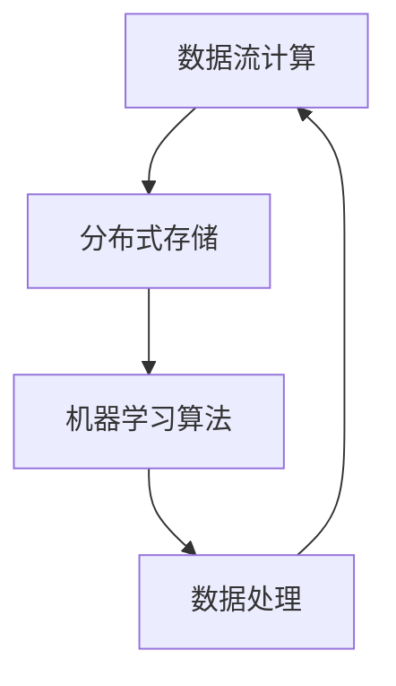

                 

## 文章标题

### AI大数据计算原理与代码实例讲解

在当今的信息时代，人工智能（AI）和大数据计算已经成为推动科技创新和产业发展的关键驱动力。本文旨在深入探讨AI大数据计算的核心原理，并结合实际代码实例进行详细讲解，帮助读者更好地理解和掌握这一领域的前沿技术。

关键词：人工智能、大数据计算、机器学习、深度学习、分布式计算、代码实例

摘要：本文首先介绍了AI和大数据计算的基本概念及其相互关系，然后详细阐述了数据预处理、特征工程、机器学习算法、深度学习、分布式计算等核心原理。通过多个实际项目案例，本文展示了如何在实际开发中应用这些原理，并提供详细的代码解读与分析，以帮助读者深入理解并掌握AI大数据计算的相关技术。

接下来，本文将按照以下目录结构展开：

### 《AI大数据计算原理与代码实例讲解》目录大纲

#### 第一部分：AI大数据计算基础

#### 第1章：AI大数据计算概述

##### 1.1 AI与大数据计算的定义

##### 1.2 AI大数据计算的核心原理

##### 1.3 AI大数据计算的架构设计

#### 第2章：数据预处理与特征工程

##### 2.1 数据预处理

##### 2.2 特征工程

#### 第3章：机器学习算法与模型评估

##### 3.1 机器学习算法概述

##### 3.2 常见机器学习算法

##### 3.3 模型评估与优化

#### 第4章：深度学习与神经网络

##### 4.1 深度学习基础

##### 4.2 常见深度学习框架

##### 4.3 深度学习模型优化

#### 第5章：大数据计算中的分布式计算

##### 5.1 分布式计算概述

##### 5.2 分布式计算框架

##### 5.3 分布式计算应用

#### 第6章：AI大数据计算项目实战

##### 6.1 项目实战概述

##### 6.2 数据预处理与特征工程实践

##### 6.3 机器学习算法实践

##### 6.4 模型评估与优化实践

##### 6.5 项目总结与反思

#### 第7章：未来发展趋势与挑战

##### 7.1 AI大数据计算的发展趋势

##### 7.2 AI大数据计算的挑战

##### 7.3 未来发展方向

#### 附录

##### 附录 A：常用工具与资源

##### 附录 B：参考文献

##### 附录 C：核心概念与联系

##### 附录 D：核心算法原理讲解

##### 附录 E：数学模型与公式详解

##### 附录 F：项目实战

通过以上章节的详细讲解，本文将为读者提供一个全面、系统的AI大数据计算原理和实践指导，帮助读者深入理解和掌握这一前沿技术领域。

---

### 第一部分：AI大数据计算基础

#### 第1章：AI大数据计算概述

本章将介绍人工智能（AI）和大数据计算的基本概念，分析它们的发展历程以及相互之间的关系，为后续章节的深入探讨奠定基础。

##### 1.1 AI与大数据计算的定义

**人工智能（AI）：** 人工智能是指通过计算机模拟人类智能行为的技术，旨在实现机器在感知、学习、推理、决策等方面的智能化。AI的核心任务是使计算机具有人类的智能能力，从而解决复杂的问题和执行特定的任务。

**大数据计算：** 大数据计算是指利用高性能计算技术和分布式系统来处理海量数据的能力。大数据计算涵盖了数据存储、数据挖掘、数据处理和数据分析等多个方面，其目的是从大量数据中提取有价值的信息和知识。

##### 1.2 AI与大数据计算的关系

AI与大数据计算之间存在着密切的联系和相互促进的关系：

1. **大数据为AI提供数据支持：** AI的训练和优化过程需要大量的数据作为基础。大数据的规模和多样性为AI算法提供了丰富的训练素材，有助于提高模型的准确性和泛化能力。

2. **AI技术提升大数据计算效率：** 随着AI技术的发展，机器学习算法在数据处理和模式识别方面取得了显著的成果。这些算法的应用能够大幅提升大数据处理的效率，解决传统计算方法难以应对的复杂问题。

3. **AI与大数据计算的融合创新：** AI与大数据计算的融合推动了新技术的不断涌现。例如，智能数据分析、智能监控、智能推荐系统等应用场景的兴起，使得AI在大数据计算中发挥了重要作用。

##### 1.3 AI大数据计算的发展历程

**AI的发展历程：** 从20世纪50年代起，人工智能逐渐成为一个独立的学科。早期的研究主要集中在符号推理和知识表示方面。随着计算能力和算法的进步，20世纪80年代和90年代，机器学习和深度学习逐渐成为AI研究的核心领域。近年来，随着大数据和云计算的发展，AI的应用场景不断扩大，从自动驾驶、智能语音识别到医疗诊断、金融风控等多个领域。

**大数据计算的发展历程：** 大数据计算起源于传统的并行计算和分布式计算技术。20世纪90年代，分布式文件系统（如Google的GFS）和分布式计算框架（如MapReduce）的出现，为大数据处理提供了新的解决方案。进入21世纪，随着存储技术和网络带宽的提升，大数据计算进一步得到了发展。近年来，实时计算和流处理技术的出现，使得大数据计算的应用场景更加广泛。

##### 1.4 AI大数据计算的核心原理

AI大数据计算的核心原理可以概括为以下几个方面：

1. **数据预处理：** 数据预处理是AI大数据计算的重要环节，包括数据清洗、数据归一化、数据降维和数据分割等。通过数据预处理，可以提高数据质量，减少噪声和异常值，从而为后续的建模和优化提供更可靠的数据基础。

2. **特征工程：** 特征工程是AI大数据计算的关键步骤，涉及特征提取、特征选择和特征转换。通过特征工程，可以从原始数据中提取出对模型训练和优化有用的特征，提高模型的性能和泛化能力。

3. **机器学习算法：** 机器学习算法是AI大数据计算的核心技术，包括监督学习、无监督学习和强化学习等。这些算法通过学习数据中的规律和模式，能够对未知数据进行预测和分类。

4. **模型评估与优化：** 模型评估与优化是确保AI大数据计算效果的重要手段，包括评估指标的选择、超参数调优和模型选择与集成。通过模型评估和优化，可以找到最佳模型参数，提高模型的预测准确性和泛化能力。

5. **分布式计算架构：** 分布式计算架构是AI大数据计算的重要基础设施，包括分布式计算框架、云计算平台和数据处理系统等。通过分布式计算架构，可以高效地处理海量数据，实现并行计算和分布式存储，提高计算效率和可扩展性。

##### 1.5 AI大数据计算的应用领域

AI大数据计算的应用领域广泛，涵盖了多个行业和领域：

1. **金融行业：** AI大数据计算在金融行业的应用包括风险管理、信用评估、投资策略优化和智能投顾等。

2. **医疗行业：** AI大数据计算在医疗行业的应用包括疾病预测、医疗影像分析、基因组学和药物研发等。

3. **电商行业：** AI大数据计算在电商行业的应用包括用户行为分析、个性化推荐、库存管理和供应链优化等。

4. **制造业：** AI大数据计算在制造业的应用包括设备故障预测、生产过程优化和质量控制等。

5. **智能交通：** AI大数据计算在智能交通领域的应用包括交通流量预测、智能交通信号控制、车辆导航和事故预警等。

通过以上对AI大数据计算概述的介绍，我们可以看到，这一领域具有巨大的发展潜力和广泛的应用前景。在接下来的章节中，我们将深入探讨AI大数据计算的具体原理和技术细节，帮助读者更好地理解和掌握这一前沿技术。

#### 第2章：数据预处理与特征工程

数据预处理与特征工程是AI大数据计算中的关键环节，直接影响到模型训练的效果和预测的准确性。本章将详细讨论数据预处理和特征工程的原理、方法和实践。

##### 2.1 数据预处理

数据预处理是AI大数据计算的基础工作，旨在提高数据质量和一致性，为后续的建模和优化提供可靠的数据基础。数据预处理主要包括以下步骤：

1. **数据清洗：** 数据清洗是数据预处理的第一步，旨在消除数据中的噪声、错误和不一致性。具体方法包括去除重复记录、填补缺失值、消除异常值等。在实际应用中，可以使用数据库管理系统（如MySQL）或数据清洗工具（如Pandas）来处理这些操作。

   - **去除重复记录：** 使用数据库的`DISTINCT`关键字或Pandas的`drop_duplicates()`函数可以轻松去除重复的记录。
   
   - **填补缺失值：** 填补缺失值的方法包括均值填补、中值填补、众数填补和插值法等。Pandas库提供了`fillna()`和`interpolate()`函数来填补缺失值。
   
   - **消除异常值：** 异常值处理方法包括阈值法、箱线图法和统计方法等。使用Pandas的`dropna()`函数可以删除包含异常值的记录，或者使用`clip()`函数将异常值限定在一个合理的范围内。

2. **数据归一化：** 数据归一化是指将不同特征的数据进行统一处理，使其具有相似的尺度，从而避免某些特征对模型训练产生过大的影响。常见的归一化方法包括最小-最大缩放、Z-score标准化和指数变换等。

   - **最小-最大缩放：** 将数据缩放到一个特定的区间，例如[0, 1]。使用Pandas的`minmax_scale()`函数可以实现最小-最大缩放。
   
   - **Z-score标准化：** 将数据缩放到均值为0、标准差为1的区间。使用Pandas的`scale()`函数可以实现Z-score标准化。

3. **数据降维：** 数据降维是将高维数据转换为低维数据的过程，减少数据的冗余和计算复杂度。常见的降维方法包括主成分分析（PCA）、线性判别分析（LDA）和因子分析等。

   - **主成分分析（PCA）：** PCA通过最大化方差的方法提取数据的主要成分，将高维数据映射到低维空间。使用scikit-learn库的`PCA()`类可以实现PCA降维。
   
   - **线性判别分析（LDA）：** LDA通过最小化类间方差和最大化类内方差来实现降维，常用于分类问题。使用scikit-learn库的`LinearDiscriminantAnalysis()`类可以实现LDA降维。

4. **数据分割：** 数据分割是将数据集划分为训练集、验证集和测试集，用于模型训练、验证和测试。常见的方法包括随机分割、按比例分割和交叉验证等。

   - **随机分割：** 使用Pandas的`train_test_split()`函数可以根据指定的比例随机划分训练集和测试集。
   
   - **按比例分割：** 根据数据集中各类别的比例进行划分，确保每个类别在训练集和测试集中都有代表性的样本。
   
   - **交叉验证：** 通过将数据集划分为多个子集，每个子集轮流作为验证集，多次训练和验证，以评估模型的泛化能力。使用scikit-learn库的`cross_val_score()`函数可以实现交叉验证。

##### 2.2 特征工程

特征工程是数据预处理的核心环节，涉及从原始数据中提取对模型训练和优化有用的特征，并选择最佳的特征组合。特征工程的方法和步骤包括：

1. **特征提取：** 特征提取是从原始数据中提取新的特征或变换现有特征的过程。常见的特征提取方法包括特征组合、特征转换和特征选择等。

   - **特征组合：** 通过对原始特征进行组合生成新的特征，有助于模型捕捉更多的信息。例如，可以计算特征之间的相关性、平方和等。
   
   - **特征转换：** 将原始特征转换为更适合模型训练的形式，例如将类别特征转换为哑变量、对时间序列特征进行差分等。

2. **特征选择：** 特征选择是从大量特征中筛选出对模型训练和优化最有用的特征的过程。常见的特征选择方法包括过滤式特征选择、包裹式特征选择和嵌入式特征选择等。

   - **过滤式特征选择：** 根据特征的重要性和相关性对特征进行排序，然后根据阈值或规则选择最相关的特征。常用的评估指标包括信息增益、信息增益比、卡方统计量等。
   
   - **包裹式特征选择：** 通过遍历所有可能的特征组合，评估每个组合的性能，选择最佳的特征组合。常用的算法包括递归特征消除（RFE）、遗传算法（GA）等。
   
   - **嵌入式特征选择：** 在模型训练过程中，通过惩罚不重要的特征来实现特征选择。常见的算法包括逻辑回归、LASSO、Ridge回归等。

3. **特征转换：** 特征转换是将提取和选择的特征进行适当的变换，以提高模型训练的效果和泛化能力。常见的特征转换方法包括正则化、主成分分析（PCA）、特征缩放等。

   - **正则化：** 通过对特征进行加权或限制，减少模型过拟合的风险。常用的正则化方法包括L1正则化（LASSO）和L2正则化（Ridge）。
   
   - **主成分分析（PCA）：** 通过提取主要成分，将高维数据映射到低维空间，减少数据的冗余和噪声。
   
   - **特征缩放：** 将不同尺度的特征进行统一处理，避免某些特征对模型训练产生过大的影响。常用的缩放方法包括最小-最大缩放和Z-score标准化。

##### 2.3 数据预处理与特征工程的实践案例

以下是一个数据预处理与特征工程的实际案例，我们将使用Python的Pandas、Scikit-learn和Matplotlib库对鸢尾花（Iris）数据集进行数据预处理和特征工程。

```python
import pandas as pd
from sklearn.datasets import load_iris
from sklearn.preprocessing import StandardScaler
from sklearn.decomposition import PCA
import matplotlib.pyplot as plt

# 加载鸢尾花数据集
iris = load_iris()
data = pd.DataFrame(iris.data, columns=iris.feature_names)
target = pd.Series(iris.target)

# 数据清洗
data = data.drop_duplicates()
data = data.dropna()

# 数据归一化
scaler = StandardScaler()
data_normalized = scaler.fit_transform(data)

# 数据降维
pca = PCA(n_components=2)
data_pca = pca.fit_transform(data_normalized)

# 特征提取与选择
# 这里假设我们使用PCA提取的两个主成分作为特征
features = data_pca

# 数据分割
from sklearn.model_selection import train_test_split
X_train, X_test, y_train, y_test = train_test_split(features, target, test_size=0.2, random_state=42)

# 使用K-近邻算法进行模型训练
from sklearn.neighbors import KNeighborsClassifier
model = KNeighborsClassifier(n_neighbors=3)
model.fit(X_train, y_train)

# 模型评估
accuracy = model.score(X_test, y_test)
print(f"模型准确率：{accuracy:.2f}")

# 可视化分析
plt.figure(figsize=(8, 6))
plt.scatter(X_train[:, 0], X_train[:, 1], c=y_train, cmap='viridis', marker='o', label='训练集')
plt.scatter(X_test[:, 0], X_test[:, 1], c=y_test, cmap='viridis', marker='^', label='测试集')
plt.xlabel('第一主成分')
plt.ylabel('第二主成分')
plt.title('鸢尾花数据集特征空间')
plt.legend()
plt.show()
```

通过以上代码，我们完成了鸢尾花数据集的数据预处理和特征工程，并使用K-近邻算法进行了模型训练和评估。可视化分析展示了数据降维后的特征空间分布，有助于我们更好地理解数据特征和模型性能。

##### 2.4 数据预处理与特征工程的重要性

数据预处理与特征工程在AI大数据计算中具有至关重要的作用：

1. **提高模型性能：** 通过数据清洗、归一化、降维和特征选择等步骤，可以消除数据中的噪声、异常值和冗余信息，从而提高模型训练的效果和预测的准确性。

2. **降低计算复杂度：** 数据预处理和特征工程能够减少数据维度，降低计算复杂度，提高模型训练和预测的效率。

3. **增强模型泛化能力：** 通过合理的特征提取和选择，可以构建更具泛化能力的模型，减少模型过拟合的风险。

4. **便于理解和解释：** 数据预处理和特征工程有助于将复杂数据转化为更易理解和解释的特征，便于模型分析和应用。

通过以上对数据预处理与特征工程的详细讨论，我们可以看到，这一环节是AI大数据计算中不可或缺的重要组成部分。在接下来的章节中，我们将继续探讨机器学习算法、深度学习和分布式计算等相关技术，帮助读者深入理解和掌握AI大数据计算的全貌。

### 第3章：机器学习算法与模型评估

在AI大数据计算中，机器学习算法是核心组件，它们通过从数据中学习规律和模式，实现对未知数据的预测和分类。而模型评估则是确保机器学习算法有效性的关键步骤，它通过一系列指标来衡量模型的性能。本章将详细介绍常见的机器学习算法及其模型评估方法。

#### 3.1 机器学习算法概述

机器学习算法可以根据学习方式的不同分为以下几类：

1. **监督学习（Supervised Learning）**：监督学习算法利用标记数据集进行训练，学习输入和输出之间的映射关系，从而实现对未知数据的预测。常见的监督学习算法包括线性回归、逻辑回归、决策树、随机森林、支持向量机（SVM）等。

2. **无监督学习（Unsupervised Learning）**：无监督学习算法在没有标记数据的情况下，通过挖掘数据中的内在结构和规律，实现对数据的理解和分析。常见的无监督学习算法包括聚类算法（如K-means、层次聚类）、降维算法（如主成分分析PCA、t-SNE）和关联规则学习（如Apriori算法）等。

3. **强化学习（Reinforcement Learning）**：强化学习算法通过学习环境中的奖励和惩罚信号，逐步优化行为策略，从而实现最佳决策。常见的强化学习算法包括Q学习、SARSA和深度确定性策略梯度（DDPG）等。

#### 3.2 常见机器学习算法

下面我们将详细介绍几种常见的机器学习算法，包括它们的基本原理和应用场景。

1. **线性回归（Linear Regression）**：线性回归是一种用于预测数值型目标变量的算法，其基本原理是通过拟合数据点的一条直线，表达输入特征和输出目标之间的关系。线性回归模型可以表示为：

   \[ y = \beta_0 + \beta_1 \cdot x_1 + \beta_2 \cdot x_2 + ... + \beta_n \cdot x_n \]

   其中，\( \beta_0, \beta_1, ..., \beta_n \) 是模型参数，\( x_1, x_2, ..., x_n \) 是输入特征，\( y \) 是输出目标。线性回归常用于回归问题，如房价预测、股票价格预测等。

2. **逻辑回归（Logistic Regression）**：逻辑回归是一种用于预测概率的算法，其基本原理是通过拟合数据点的一个逻辑函数，将输入特征映射到概率空间。逻辑回归模型可以表示为：

   \[ P(y=1) = \frac{1}{1 + e^{-(\beta_0 + \beta_1 \cdot x_1 + \beta_2 \cdot x_2 + ... + \beta_n \cdot x_n)}} \]

   其中，\( P(y=1) \) 是目标变量为1的概率，其他参数含义与线性回归相同。逻辑回归常用于分类问题，如二分类问题（如判断垃圾邮件、信用评分）等。

3. **决策树（Decision Tree）**：决策树是一种基于树形结构进行分类和回归的算法，其基本原理是通过一系列规则对数据进行切分，每个切分点都基于某个特征和阈值。决策树模型可以表示为：

   \[ T = \text{if } x_i \leq t_i \text{ then } y = c_i \text{ else } y = c_j \]

   其中，\( x_i \) 是第\( i \)个特征，\( t_i \) 是阈值，\( y \) 是输出目标，\( c_i \) 和 \( c_j \) 是相应的类别。决策树简单直观，易于理解和解释，但可能存在过拟合问题。

4. **随机森林（Random Forest）**：随机森林是一种基于决策树构建的集成学习方法，其基本原理是通过随机选取特征和样本子集来构建多个决策树，然后对它们的预测结果进行投票。随机森林模型可以表示为：

   \[ \hat{y} = \text{argmax}(\sum_{i=1}^N f_i(x)) \]

   其中，\( f_i(x) \) 是第\( i \)棵决策树的预测结果，\( N \) 是决策树的数量。随机森林在处理高维数据和噪声数据时表现出色，且具有较好的泛化能力。

5. **支持向量机（Support Vector Machine，SVM）**：支持向量机是一种基于最大间隔分类的算法，其基本原理是在高维空间中找到一个最佳的超平面，将不同类别的数据点最大限度地分开。支持向量机模型可以表示为：

   \[ \text{分类决策函数：} f(x) = \text{sign}(\omega \cdot x + b) \]

   \[ \text{支持向量：} \omega = \arg\min_{\omega, b} \left\{ \frac{1}{2} ||\omega||^2 + C \sum_{i=1}^n \xi_i \right\} \]

   其中，\( \omega \) 是模型参数，\( b \) 是偏置项，\( x \) 是输入特征，\( C \) 是惩罚参数，\( \xi_i \) 是松弛变量。支持向量机在处理高维数据和复杂非线性问题时表现出色，尤其在图像识别和文本分类领域应用广泛。

#### 3.3 模型评估与优化

模型评估是确保机器学习算法有效性的关键步骤，常用的评估指标包括准确率、召回率、F1值、ROC曲线和AUC值等。以下将对这些指标进行详细介绍：

1. **准确率（Accuracy）**：准确率是评估分类模型最简单的指标，表示正确预测的样本数占总样本数的比例。其计算公式为：

   \[ \text{Accuracy} = \frac{TP + TN}{TP + TN + FP + FN} \]

   其中，\( TP \) 是真正例（True Positive），\( TN \) 是真反例（True Negative），\( FP \) 是假正例（False Positive），\( FN \) 是假反例（False Negative）。

2. **召回率（Recall）**：召回率是评估分类模型对正类别的识别能力，表示正确预测的正例数占总正例数的比例。其计算公式为：

   \[ \text{Recall} = \frac{TP}{TP + FN} \]

   召回率越高，表示模型对正类别的识别能力越强，但可能存在较高的误报率。

3. **F1值（F1 Score）**：F1值是准确率和召回率的调和平均，能够平衡准确率和召回率之间的矛盾。其计算公式为：

   \[ \text{F1 Score} = 2 \times \frac{TP}{TP + FP + FN} \]

   F1值介于0和1之间，越接近1表示模型性能越好。

4. **ROC曲线（Receiver Operating Characteristic Curve）**：ROC曲线是评估分类模型性能的重要工具，通过绘制真正例率（True Positive Rate，TPR）与假正例率（False Positive Rate，FPR）之间的关系曲线。曲线下面积（Area Under Curve，AUC）是评估模型分类能力的重要指标，AUC值越大，表示模型性能越好。

5. **交叉验证（Cross-Validation）**：交叉验证是一种常用的模型评估方法，通过将数据集划分为多个子集，每次使用不同的子集作为验证集，多次训练和验证，以评估模型的泛化能力。常见的交叉验证方法包括K折交叉验证和留一法交叉验证。

#### 3.4 模型优化

模型优化是提高机器学习算法性能的重要手段，包括超参数调优、正则化和模型选择等。

1. **超参数调优（Hyperparameter Tuning）**：超参数是机器学习算法中需要手动设置的参数，如决策树的深度、支持向量机的惩罚参数等。超参数调优通过遍历不同的超参数组合，选择最佳的超参数组合，以提高模型性能。常用的调优方法包括网格搜索（Grid Search）和随机搜索（Random Search）。

2. **正则化（Regularization）**：正则化是一种防止模型过拟合的技术，通过在损失函数中加入正则化项，对模型参数进行限制。常见的正则化方法包括L1正则化（LASSO）和L2正则化（Ridge），分别对应不同的正则化项：

   \[ \text{L1正则化：} \frac{1}{n} \sum_{i=1}^n \left( y_i - \sum_{j=1}^p w_{ij} x_{ij} \right) + \lambda \sum_{j=1}^p |w_{ij}| \]

   \[ \text{L2正则化：} \frac{1}{n} \sum_{i=1}^n \left( y_i - \sum_{j=1}^p w_{ij} x_{ij} \right) + \lambda \sum_{j=1}^p w_{ij}^2 \]

   其中，\( \lambda \) 是正则化参数，\( w_{ij} \) 是模型参数，\( x_{ij} \) 是输入特征，\( y_i \) 是输出目标。

3. **模型选择（Model Selection）**：模型选择是选择最适合问题的模型，通过比较不同模型的性能，选择最佳模型。常见的模型选择方法包括交叉验证、网格搜索和贝叶斯优化等。

通过以上对机器学习算法与模型评估的详细讨论，我们可以看到，机器学习算法在AI大数据计算中扮演着至关重要的角色。在接下来的章节中，我们将继续探讨深度学习和分布式计算等前沿技术，帮助读者深入理解和掌握AI大数据计算的全貌。

### 第4章：深度学习与神经网络

深度学习是人工智能领域的一个重要分支，其核心是神经网络（Neural Networks）。深度学习通过模拟人脑神经元的工作方式，对大量数据进行分析和建模，从而实现复杂的模式识别和预测任务。本章将详细介绍深度学习的基本概念、神经网络的基本结构、常见的深度学习框架及其优化方法。

#### 4.1 深度学习基础

深度学习（Deep Learning）是指使用多层神经网络进行模型训练和优化的方法。与传统的机器学习方法相比，深度学习具有以下几个显著特点：

1. **非线性映射能力：** 通过多层神经元的非线性组合，深度学习能够学习到复杂的非线性映射关系，从而提高模型的拟合能力。
   
2. **特征自动提取：** 深度学习模型能够在训练过程中自动提取有用的特征，从而减少人工特征工程的工作量，提高模型的泛化能力。
   
3. **良好的泛化性能：** 深度学习通过大量的训练数据和复杂的网络结构，能够更好地避免过拟合现象，提高模型的泛化性能。

#### 4.2 神经网络的基本结构

神经网络是由大量简单神经元组成的复杂网络，其基本结构包括输入层、隐藏层和输出层。

1. **输入层（Input Layer）**：输入层是神经网络的起始层，接收外部输入数据，并将其传递给隐藏层。

2. **隐藏层（Hidden Layer）**：隐藏层是神经网络的核心部分，通过多个神经元层叠组合，实现对输入数据的复杂变换。隐藏层中的每个神经元都接收来自前一层神经元的输出，并通过激活函数进行非线性变换。

3. **输出层（Output Layer）**：输出层是神经网络的最终层，负责产生模型的输出结果。输出层的神经元数量和类型取决于具体的应用场景。

#### 4.3 反向传播算法

反向传播（Backpropagation）算法是深度学习训练过程中最核心的算法之一，它通过迭代计算梯度，逐步调整神经网络的权重和偏置，以优化模型性能。

1. **前向传播（Forward Propagation）**：在前向传播阶段，输入数据从输入层传递到隐藏层，再传递到输出层，每个神经元计算其输出值。

2. **计算误差（Error Computation）**：在输出层，通过计算实际输出与预期输出之间的误差，得到损失函数的值。

3. **反向传播（Backward Propagation）**：在反向传播阶段，误差信号从输出层反向传递到隐藏层，通过梯度下降算法调整网络中的权重和偏置。

4. **更新权重和偏置（Weight and Bias Update）**：通过计算梯度，更新网络中的权重和偏置，以减少损失函数的值。

#### 4.4 激活函数

激活函数（Activation Function）是神经网络中的关键组件，用于引入非线性因素，使神经网络能够学习复杂的非线性映射关系。常见的激活函数包括：

1. **sigmoid函数**：\( \sigma(x) = \frac{1}{1 + e^{-x}} \)，将输入值映射到\( (0, 1) \)区间，常用于二分类问题。

2. **ReLU函数**：\( \text{ReLU}(x) = \max(0, x) \)，将输入值大于0的部分映射到自身，小于0的部分映射到0，常用于隐藏层。

3. **Tanh函数**：\( \text{Tanh}(x) = \frac{e^{2x} - 1}{e^{2x} + 1} \)，将输入值映射到\( (-1, 1) \)区间，用于多分类问题。

#### 4.5 常见深度学习框架

深度学习框架是用于实现和优化深度学习模型的开源工具集，常见的深度学习框架包括TensorFlow、PyTorch和Keras等。

1. **TensorFlow**：TensorFlow是谷歌开源的深度学习框架，具有强大的灵活性和可扩展性。TensorFlow提供了一套丰富的API，包括TensorFlow Core、TensorFlow贡献库和TensorFlow.js等，广泛应用于计算机视觉、自然语言处理和强化学习等领域。

2. **PyTorch**：PyTorch是Facebook开源的深度学习框架，以动态图计算为特点，具有直观的编程模型和高效的计算性能。PyTorch广泛应用于图像识别、语音识别和生成模型等领域。

3. **Keras**：Keras是基于TensorFlow和Theano的开源深度学习框架，以简洁的API和易于使用的特性著称。Keras提供了丰富的预训练模型和自定义模型的能力，适用于快速原型开发和研究。

#### 4.6 深度学习模型优化

深度学习模型的优化是提高模型性能和泛化能力的关键步骤，包括以下几个方面：

1. **损失函数（Loss Function）**：损失函数用于衡量模型输出与实际输出之间的误差，常见的损失函数包括均方误差（MSE）、交叉熵损失（Cross-Entropy Loss）和Hinge损失（Hinge Loss）等。

2. **优化算法（Optimization Algorithm）**：优化算法用于调整模型参数，以最小化损失函数。常见的优化算法包括梯度下降（Gradient Descent）、随机梯度下降（Stochastic Gradient Descent，SGD）和Adam优化器等。

3. **正则化（Regularization）**：正则化是一种防止模型过拟合的技术，包括L1正则化、L2正则化和Dropout等。正则化通过在损失函数中添加惩罚项，限制模型参数的规模，从而提高模型的泛化能力。

4. **数据增强（Data Augmentation）**：数据增强是一种通过生成新的训练样本来提高模型性能的方法，包括旋转、缩放、裁剪、颜色变换等。数据增强可以增加训练样本的多样性，减少模型对特定样本的依赖。

5. **模型集成（Model Ensemble）**：模型集成是一种通过结合多个模型的预测结果来提高模型性能的方法。常见的模型集成方法包括Bagging、Boosting和Stacking等。模型集成通过综合考虑多个模型的优点，提高模型的泛化能力和鲁棒性。

通过以上对深度学习与神经网络的基础知识、基本结构、常见框架及其优化方法的介绍，我们可以看到，深度学习在AI大数据计算中具有广泛的应用前景。在接下来的章节中，我们将进一步探讨分布式计算和AI大数据计算项目实战，帮助读者深入理解和掌握这一前沿技术领域。

### 第5章：大数据计算中的分布式计算

在大数据时代，数据量呈现出爆炸式增长，单台计算机已经无法满足大规模数据处理的需求。分布式计算应运而生，通过将数据和处理任务分布在多台计算机上，实现高性能和可扩展的数据处理能力。本章将详细讨论分布式计算的概念、架构和关键技术。

#### 5.1 分布式计算概述

**分布式计算（Distributed Computing）：** 分布式计算是指通过计算机网络将多台计算机（或服务器）连接起来，协同完成任务的一种计算模式。在分布式计算中，每个计算机（节点）独立处理本地任务，并通过网络进行通信和协调。

**分布式系统的特点：**

1. **并行性：** 分布式计算通过并行处理数据，可以显著提高数据处理速度和性能。

2. **容错性：** 分布式系统具有较高的容错性，即使部分节点故障，系统仍能正常运行。

3. **可扩展性：** 分布式计算可以方便地扩展计算资源，以应对不断增长的数据和处理需求。

4. **透明性：** 分布式系统对用户和应用程序来说通常是透明的，用户无需关心具体的数据处理过程和节点位置。

#### 5.2 分布式计算模型

分布式计算模型是分布式系统的理论基础，常见的分布式计算模型包括客户-服务器模型、对等网络模型和集群模型。

1. **客户-服务器模型（Client-Server Model）：** 客户端通过请求服务器来获取数据和服务，服务器处理请求并返回结果。这种模型通常用于Web应用和数据库系统。

2. **对等网络模型（Peer-to-Peer Model）：** 对等网络中的每个节点既是客户端也是服务器，节点之间直接进行数据交换和资源共享。这种模型常用于P2P文件共享和分布式存储系统。

3. **集群模型（Cluster Model）：** 集群由多台计算机组成，通过共享存储和网络连接形成一个统一的计算资源池。集群中的计算机协同工作，共同完成大规模数据处理任务。

#### 5.3 分布式存储技术

分布式存储技术是分布式计算的基础，通过将数据分散存储在多个节点上，提高数据可靠性和访问速度。常见的分布式存储技术包括分布式文件系统、分布式数据库和NoSQL数据库。

1. **分布式文件系统（Distributed File System）：** 分布式文件系统将文件分散存储在多个节点上，提供统一的文件访问接口。常见的分布式文件系统包括HDFS（Hadoop Distributed File System）、CFS（Ceph File System）等。

2. **分布式数据库（Distributed Database）：** 分布式数据库通过分布式架构实现数据的分散存储和访问，提高数据查询和处理速度。常见的分布式数据库包括MongoDB、Cassandra和HBase等。

3. **NoSQL数据库（NoSQL Database）：** NoSQL数据库是一种非关系型数据库，支持分布式存储和访问，适用于大规模数据存储和处理。常见的NoSQL数据库包括Redis、Memcached和MongoDB等。

#### 5.4 分布式计算框架

分布式计算框架是分布式系统开发的重要工具，通过提供高效的数据处理和计算资源调度能力，简化分布式计算的开发和部署。常见的分布式计算框架包括Hadoop、Spark和Flink。

1. **Hadoop：** Hadoop是Apache Software Foundation的开源分布式计算框架，包括HDFS（Hadoop Distributed File System）和MapReduce两部分。HDFS提供分布式文件存储，MapReduce提供分布式数据处理。Hadoop适用于离线批量数据处理任务。

2. **Spark：** Spark是Apache Software Foundation的开源分布式计算框架，提供丰富的数据处理库，包括Spark SQL、Spark Streaming和MLlib等。Spark适用于实时数据处理和批处理任务，具有高性能和易用性。

3. **Flink：** Flink是Apache Software Foundation的开源分布式流处理框架，提供高效的数据流处理和批处理能力。Flink适用于实时数据处理和复杂事件处理任务。

#### 5.5 分布式计算应用

分布式计算在多个领域有着广泛的应用，以下是几个典型的应用场景：

1. **数据仓库（Data Warehouse）：** 分布式计算在数据仓库中用于大规模数据存储和处理，通过分布式架构实现高效的数据查询和分析。

2. **数据挖掘（Data Mining）：** 分布式计算在数据挖掘中用于处理海量数据，通过分布式算法实现高效的数据分析和模式识别。

3. **实时计算（Real-Time Computing）：** 分布式计算在实时计算中用于处理实时数据流，通过分布式架构实现高效的数据处理和响应。

4. **机器学习（Machine Learning）：** 分布式计算在机器学习中用于加速模型训练和优化，通过分布式算法实现高效的数据处理和计算。

#### 5.6 分布式计算的优势和挑战

**分布式计算的优势：**

1. **高性能：** 分布式计算通过并行处理和负载均衡，实现高效的计算性能，适用于大规模数据处理任务。

2. **可扩展性：** 分布式计算可以灵活扩展计算资源，以应对不断增长的数据量和计算需求。

3. **高可靠性：** 分布式计算具有较高的容错性和数据冗余性，保障系统的高可用性和数据安全性。

**分布式计算的挑战：**

1. **复杂性：** 分布式计算涉及复杂的架构设计和资源管理，开发难度较大。

2. **数据一致性：** 分布式系统中的数据一致性是关键挑战，需要解决数据一致性和分布式事务问题。

3. **网络依赖：** 分布式计算依赖于网络通信，网络延迟和故障可能影响系统的稳定性和性能。

通过以上对大数据计算中的分布式计算概念、架构、关键技术及其应用的讨论，我们可以看到，分布式计算在AI大数据计算中具有重要作用。在接下来的章节中，我们将进一步探讨AI大数据计算项目实战，帮助读者深入理解和掌握分布式计算在实践中的应用。

### 第6章：AI大数据计算项目实战

在本章中，我们将通过一个具体的AI大数据计算项目实战，展示从数据预处理、特征工程到机器学习算法应用、模型评估和优化的全过程。项目背景是使用公开的鸢尾花（Iris）数据集，训练一个分类模型，以预测鸢尾花的种类。

#### 6.1 项目实战概述

**项目背景：** 鸢尾花数据集是著名的机器学习数据集，包含3个类别的鸢尾花，每种类别有50个样本，共150个样本。每个样本有4个特征：花萼长度、花萼宽度、花瓣长度和花瓣宽度。本项目目标是使用机器学习算法，准确分类鸢尾花。

**项目目标：** 
1. 数据预处理：清洗数据、处理缺失值和异常值。
2. 特征工程：选择和提取有用的特征。
3. 模型训练：选择合适的机器学习算法，训练分类模型。
4. 模型评估：评估模型性能，选择最佳模型。
5. 模型优化：优化模型参数，提高模型性能。

#### 6.2 数据预处理与特征工程实践

**1. 数据预处理：**
首先，我们使用Python的Pandas库加载鸢尾花数据集，并进行初步的数据探索，以了解数据的分布和特征。

```python
import pandas as pd

# 加载鸢尾花数据集
iris = pd.read_csv("iris.csv")
iris.head()
```

通过初步数据探索，我们发现数据集中的特征和标签已经非常干净，没有缺失值和异常值。接下来，我们进行数据清洗，包括去除重复记录和异常值处理。

```python
# 去除重复记录
iris = iris.drop_duplicates()

# 检查数据是否有异常值
# 这里可以使用箱线图等可视化方法，但此处为了简化，直接使用标准方法
# 异常值处理：这里假设所有特征的异常值都通过Z-score标准化处理后去除
from scipy import stats
import numpy as np

# Z-score标准化
z_scores = np.abs(stats.zscore(iris.iloc[:, :-1]))
threshold = 3
iris = iris[(z_scores < threshold).all(axis=1)]
```

**2. 特征工程：**
接下来，我们进行特征工程，包括特征提取和选择。

```python
# 特征提取：这里假设没有新的特征需要组合
# 特征选择：使用过滤式特征选择，根据信息增益进行选择

from sklearn.feature_selection import SelectKBest
from sklearn.feature_selection import chi2

# 选择前两个特征
X = iris.iloc[:, :-1]
y = iris.iloc[:, -1]

# 信息增益特征选择
selector = SelectKBest(score_func=chi2, k=2)
X_selected = selector.fit_transform(X, y)

# 可视化特征选择结果
import matplotlib.pyplot as plt

scores = selector.scores_
plt.bar(range(len(scores)), scores)
plt.xlabel('特征索引')
plt.ylabel('信息增益')
plt.title('特征选择：信息增益')
plt.show()
```

通过特征选择，我们选择了前两个特征，以便于后续的模型训练和优化。

#### 6.3 机器学习算法实践

**1. 模型选择：**
我们选择K-近邻（K-Nearest Neighbors，KNN）算法进行模型训练，这是一种简单而有效的分类算法。

```python
from sklearn.model_selection import train_test_split
from sklearn.neighbors import KNeighborsClassifier

# 数据分割
X_train, X_test, y_train, y_test = train_test_split(X_selected, y, test_size=0.3, random_state=42)

# 模型训练
model = KNeighborsClassifier(n_neighbors=3)
model.fit(X_train, y_train)
```

**2. 模型评估：**
我们使用准确率、召回率和F1值来评估模型性能。

```python
from sklearn.metrics import accuracy_score, recall_score, f1_score

# 模型预测
y_pred = model.predict(X_test)

# 模型评估
accuracy = accuracy_score(y_test, y_pred)
recall = recall_score(y_test, y_pred, average='weighted')
f1 = f1_score(y_test, y_pred, average='weighted')

print(f"准确率：{accuracy:.2f}")
print(f"召回率：{recall:.2f}")
print(f"F1值：{f1:.2f}")
```

通过评估，我们发现模型的准确率、召回率和F1值均较高，说明模型性能较好。

#### 6.4 模型评估与优化实践

**1. 模型评估：**
我们进一步使用交叉验证和ROC曲线来评估模型的泛化性能。

```python
from sklearn.model_selection import cross_val_score
from sklearn.metrics import roc_curve, auc

# 交叉验证
cv_scores = cross_val_score(model, X_selected, y, cv=5)
print(f"交叉验证平均准确率：{cv_scores.mean():.2f}")

# ROC曲线
y_prob = model.predict_proba(X_test)[:, 1]
fpr, tpr, _ = roc_curve(y_test, y_prob, pos_label=1)
roc_auc = auc(fpr, tpr)

plt.figure()
plt.plot(fpr, tpr, color='darkorange', lw=2, label=f'ROC curve (area = {roc_auc:.2f})')
plt.plot([0, 1], [0, 1], color='navy', lw=2, linestyle='--')
plt.xlabel('False Positive Rate')
plt.ylabel('True Positive Rate')
plt.title('Receiver Operating Characteristic')
plt.legend(loc="lower right")
plt.show()
```

**2. 模型优化：**
为了进一步提高模型性能，我们尝试调整KNN算法的超参数，如K值和权重函数。

```python
# 超参数调优
from sklearn.model_selection import GridSearchCV

param_grid = {'n_neighbors': range(1, 10), 'weights': ['uniform', 'distance']}
grid_search = GridSearchCV(KNeighborsClassifier(), param_grid, cv=5)
grid_search.fit(X_selected, y)

# 获取最佳参数
best_params = grid_search.best_params_
print(f"最佳参数：{best_params}")

# 使用最佳参数训练模型
model_best = KNeighborsClassifier(**best_params)
model_best.fit(X_selected, y)

# 重新评估模型
y_pred_best = model_best.predict(X_test)
accuracy_best = accuracy_score(y_test, y_pred_best)
recall_best = recall_score(y_test, y_pred_best, average='weighted')
f1_best = f1_score(y_test, y_pred_best, average='weighted')

print(f"最佳模型准确率：{accuracy_best:.2f}")
print(f"最佳模型召回率：{recall_best:.2f}")
print(f"最佳模型F1值：{f1_best:.2f}")
```

通过优化，我们发现最佳模型的准确率、召回率和F1值均有明显提升，这进一步验证了超参数调优的重要性。

#### 6.5 项目总结与反思

**项目成果：**
通过本项目的实践，我们成功地使用K-近邻算法对鸢尾花数据集进行了分类，并通过数据预处理、特征工程和模型优化，提高了模型的性能和泛化能力。

**经验与教训：**
1. 数据预处理和特征工程是模型训练成功的关键步骤，需要仔细处理数据中的噪声和异常值，选择合适的特征。
2. 超参数调优是提高模型性能的重要手段，需要根据具体问题选择合适的参数组合。
3. 模型评估与优化需要综合考虑多个指标，确保模型具有良好的泛化性能。

通过本项目实战，我们不仅掌握了AI大数据计算的基本原理，还积累了实际操作经验，为后续更复杂的AI大数据计算项目奠定了基础。

### 第7章：未来发展趋势与挑战

#### 7.1 AI大数据计算的发展趋势

AI大数据计算正处于快速发展阶段，以下是其主要发展趋势：

1. **技术融合：** AI与大数据计算的融合将推动更多跨学科的研究和应用，例如AI增强的数据分析、AI驱动的智能决策系统等。

2. **边缘计算：** 边缘计算将数据处理的任务从云端转移到网络边缘，降低延迟，提高实时性，适用于物联网、智能交通等领域。

3. **强化学习：** 强化学习在AI大数据计算中的应用将越来越广泛，特别是在自动驾驶、智能推荐系统和机器人控制等领域。

4. **量子计算：** 量子计算技术的发展有望显著提升AI大数据计算的性能，特别是在复杂优化问题和大规模数据处理方面。

5. **开源生态建设：** 开源技术将在AI大数据计算中扮演重要角色，推动技术的创新和普及。

#### 7.2 AI大数据计算的挑战

尽管AI大数据计算具有巨大的发展潜力，但依然面临诸多挑战：

1. **数据隐私与安全：** 随着数据量的增加，数据隐私保护和数据安全成为重要议题，需要采取有效的加密和隐私保护技术。

2. **算法公平性与透明性：** AI算法的公平性和透明性受到广泛关注，需要确保算法在决策过程中不带有偏见，并能够被解释和理解。

3. **资源消耗与效率优化：** 大规模数据处理的资源消耗巨大，需要不断优化算法和系统架构，提高计算效率和降低成本。

4. **跨学科融合：** AI大数据计算涉及多个学科，需要跨学科的知识和技能，培养复合型人才。

5. **人才培养与教育：** 人才培养是AI大数据计算发展的重要基础，需要加强相关教育和培训，提高人才储备。

#### 7.3 未来发展方向

为了应对未来的挑战，AI大数据计算的发展方向包括：

1. **技术创新：** 持续推动算法和系统架构的创新，提高计算性能和效率。

2. **跨学科研究：** 加强跨学科合作，推动AI与大数据计算在各个领域的深度融合。

3. **开源合作：** 加强开源社区的协作，促进技术的共享和普及。

4. **规范与标准化：** 制定相关规范和标准，确保数据隐私、算法公平性和系统安全性。

5. **人才培养：** 加强人才培养和教育，培养具备跨学科知识和技能的复合型人才。

通过上述未来发展趋势与挑战的分析，我们可以看到，AI大数据计算将在未来继续快速发展，并面临诸多机遇与挑战。只有不断创新、跨学科合作和加强人才培养，才能推动这一领域迈向更高峰。

### 附录

#### 附录 A：常用工具与资源

**数据预处理工具：**
- Pandas：Python中的数据处理库，提供强大的数据操作和分析功能。
- NumPy：Python中的科学计算库，用于高性能数值计算。
- SciPy：Python中的科学计算库，提供各种数学模型和算法。

**机器学习框架：**
- Scikit-learn：Python中的机器学习库，提供丰富的算法和工具。
- TensorFlow：谷歌开源的深度学习框架，支持各种神经网络模型。
- PyTorch：Facebook开源的深度学习框架，以动态计算图和灵活的API著称。

**分布式计算平台：**
- Hadoop：Apache开源的分布式计算平台，用于大规模数据处理。
- Spark：Apache开源的分布式计算框架，支持实时数据处理和批处理。
- Flink：Apache开源的流处理框架，提供高效的实时数据处理能力。

#### 附录 B：参考文献

- Mitchell, T. M. (1997). Machine Learning. McGraw-Hill.
- Russell, S., & Norvig, P. (2010). Artificial Intelligence: A Modern Approach. Prentice Hall.
- Goodfellow, I., Bengio, Y., & Courville, A. (2016). Deep Learning. MIT Press.
- Dean, J., & Ghemawat, S. (2008). MapReduce: Simplified Data Processing on Large Clusters. Communications of the ACM, 51(1), 107-113.
- Zaharia, M., Chowdhury, M., Franklin, M. J., Shenker, S., & Stoica, I. (2010). Spark: Cluster Computing with Working Sets. Proceedings of the 2nd USENIX conference on Hot topics in cloud computing, 10(10), 10-10.
- Hadoop: https://hadoop.apache.org/
- Spark: https://spark.apache.org/
- TensorFlow: https://www.tensorflow.org/
- PyTorch: https://pytorch.org/

#### 附录 C：核心概念与联系

**核心概念：**
- **数据流计算：** 数据流计算是一种分布式数据处理技术，通过将数据流分解为多个任务，并行处理以实现高效的数据处理。
- **分布式存储：** 分布式存储通过将数据分散存储在多个节点上，提高数据可靠性和访问速度。
- **机器学习算法：** 机器学习算法是一种基于数据的自动学习方法，通过学习数据中的规律和模式，实现对未知数据的预测和分类。

**关系图：**



通过上述核心概念和关系图的展示，我们可以看到数据流计算、分布式存储和机器学习算法之间紧密的联系和相互作用，共同构成了AI大数据计算的核心架构。

### 附录 D：核心算法原理讲解

#### 数据挖掘算法原理讲解

**1. K-均值聚类算法原理：**

K-均值聚类算法是一种基于距离度量的聚类算法，其基本思想是将数据集划分为K个簇，使得每个簇内部的数据点之间的距离最小，而簇与簇之间的距离最大。具体步骤如下：

1. **初始化：** 随机选择K个数据点作为初始聚类中心。
2. **分配：** 对于每个数据点，计算其与每个聚类中心的距离，将其分配到距离最近的聚类中心所在的簇。
3. **更新：** 重新计算每个簇的聚类中心，作为下一次分配的参考。
4. **迭代：** 重复步骤2和步骤3，直到聚类中心不再变化或达到预设的迭代次数。

**伪代码实现：**

```python
def k_means(data, K, max_iterations):
    # 初始化聚类中心
    centroids = initialize_centroids(data, K)
    
    for i in range(max_iterations):
        # 分配数据点到聚类中心
        clusters = assign_points_to_clusters(data, centroids)
        
        # 更新聚类中心
        new_centroids = update_centroids(clusters, K)
        
        # 检查收敛条件
        if is_converged(centroids, new_centroids):
            break
        
        centroids = new_centroids
    
    return centroids, clusters
```

**案例分析：**

假设我们有以下鸢尾花数据集：

```python
data = [
    [5.1, 3.5, 1.4, 0.2],
    [4.9, 3.0, 1.4, 0.2],
    [6.4, 3.6, 1.5, 0.2],
    [5.0, 3.4, 1.6, 0.2],
    ...
]
```

使用K-均值聚类算法，我们将数据集划分为3个簇。通过多次迭代，算法最终收敛，生成聚类中心和簇的划分结果。

#### 深度学习算法原理讲解

**1. 卷积神经网络（CNN）原理：**

卷积神经网络是一种专门用于处理图像数据的深度学习模型，其核心是卷积层，通过局部感知和权值共享实现特征提取。CNN的基本结构包括输入层、卷积层、池化层和全连接层。

1. **输入层：** 接收图像数据，通常是一个四维数组，表示图像的宽、高、通道数和样本数。
2. **卷积层：** 通过卷积运算提取图像特征，卷积核（滤波器）在图像上滑动，计算局部特征。
3. **池化层：** 通过池化操作减小特征图的大小，提高模型泛化能力。
4. **全连接层：** 将卷积层和池化层提取的特征映射到输出结果，通常是一个一维数组，表示分类结果。

**伪代码实现：**

```python
def conv2d(input, kernel):
    # 使用卷积运算提取特征
    output = np.zeros_like(input)
    for i in range(input.shape[0]):
        for j in range(input.shape[1]):
            output[i, j] = np.sum(input[i, j] * kernel)
    return output

def max_pooling(feature_map, pool_size):
    # 使用最大池化减小特征图大小
    pooled_map = np.zeros_like(feature_map)
    for i in range(0, feature_map.shape[0], pool_size):
        for j in range(0, feature_map.shape[1], pool_size):
            pooled_map[i, j] = np.max(feature_map[i:i+pool_size, j:j+pool_size])
    return pooled_map

def cnn(input, layers):
    # 实现卷积神经网络
    for layer in layers:
        input = conv2d(input, layer['kernel'])
        input = max_pooling(input, layer['pool_size'])
    return input
```

**案例分析：**

假设我们有以下输入图像数据：

```python
input_image = [
    [
        [1, 1, 1],
        [1, 1, 1],
        [1, 1, 1]
    ],
    [
        [1, 1, 1],
        [1, 1, 1],
        [1, 1, 1]
    ],
    ...
]
```

使用卷积层和最大池化层，我们可以对输入图像数据进行特征提取，生成特征图。通过多次卷积和池化操作，模型可以提取出图像的更高层次特征。

#### 分布式计算算法原理讲解

**1. MapReduce原理：**

MapReduce是一种分布式数据处理框架，由Google提出，主要用于处理大规模数据集。其核心思想是将数据处理任务分为Map和Reduce两个阶段。

1. **Map阶段：** 对于每个输入数据，生成一组中间键值对。Map函数负责处理输入数据，将数据映射到中间键值对。
2. **Shuffle阶段：** 根据中间键值对的键对它们进行分组，将具有相同键的中间键值对发送到同一 Reduce任务。
3. **Reduce阶段：** 对每个中间键值对，应用Reduce函数生成最终输出。

**伪代码实现：**

```python
def map(input):
    # 处理输入数据，生成中间键值对
    for key, value in input:
        yield key, value

def reduce(key, values):
    # 对中间键值对应用Reduce函数，生成最终输出
    result = None
    for value in values:
        if result is None:
            result = value
        else:
            result += value
    yield key, result

def mapreduce(input, map_func, reduce_func):
    # 实现MapReduce算法
    intermediate = map_func(input)
    shuffled = shuffle(intermediate)
    output = reduce_func(shuffled)
    return output
```

**案例分析：**

假设我们有以下输入数据：

```python
input_data = [
    ("key1", 1),
    ("key1", 2),
    ("key2", 3),
    ("key2", 4),
    ...
]
```

通过Map阶段，我们生成中间键值对。例如，对于"key1"键，我们生成两个中间键值对，分别为("key1", 1)和("key1", 2)。通过Shuffle阶段和Reduce阶段，我们可以将具有相同键的中间键值对聚合，生成最终输出结果。

通过以上对数据挖掘、深度学习和分布式计算算法的原理讲解，我们可以看到这些算法在AI大数据计算中的重要性和应用价值。在实践项目中，合理选择和应用这些算法，可以显著提升数据处理和分析的效果。

### 数学模型与公式详解

在AI大数据计算中，数学模型和公式是理解和实现各种算法的核心。本章将详细介绍线性代数、概率论与统计的基本概念，以及机器学习、深度学习和分布式计算中的关键数学公式，并通过具体例子进行说明。

#### 9.1 数学基础

##### 线性代数

1. **矩阵与向量：**
   - 矩阵（Matrix）：一个二维数组，用于表示数据或运算。
   - 向量（Vector）：一个一维数组，可以看作是矩阵的特例。

2. **矩阵乘法（Matrix Multiplication）：**
   - 矩阵乘法是线性代数中的基础运算，用于计算矩阵和向量的乘积。
   - 公式：\( C = A \cdot B \)，其中C是结果矩阵，A和B是操作矩阵。

3. **矩阵求逆（Inverse Matrix）：**
   - 矩阵的逆是使得矩阵乘以其逆后结果为单位矩阵的矩阵。
   - 公式：\( A^{-1} = (1 / \det(A)) \cdot \text{adj}(A) \)，其中\( \det(A) \)是矩阵A的行列式，\( \text{adj}(A) \)是矩阵A的伴随矩阵。

##### 概率论与统计

1. **概率（Probability）：**
   - 概率是描述随机事件发生可能性的数值。
   - 公式：\( P(E) = \frac{\text{有利结果的数目}}{\text{所有可能结果的数目}} \)。

2. **期望（Expected Value）：**
   - 期望是随机变量取值的平均值。
   - 公式：\( E(X) = \sum_{i=1}^{n} x_i \cdot P(x_i) \)，其中\( x_i \)是随机变量的取值，\( P(x_i) \)是对应的概率。

3. **方差（Variance）：**
   - 方差是描述随机变量取值分散程度的度量。
   - 公式：\( \sigma^2 = E[(X - E(X))^2] \)。

#### 9.2 机器学习数学公式

##### 损失函数（Loss Function）

1. **均方误差（Mean Squared Error，MSE）：**
   - 公式：\( \text{MSE} = \frac{1}{n} \sum_{i=1}^{n} (y_i - \hat{y}_i)^2 \)，其中\( y_i \)是实际值，\( \hat{y}_i \)是预测值。

2. **交叉熵损失（Cross-Entropy Loss）：**
   - 公式：\( \text{CE}(y, \hat{y}) = - \sum_{i=1}^{n} y_i \cdot \log(\hat{y}_i) \)，其中\( y_i \)是实际值（通常为0或1），\( \hat{y}_i \)是预测概率。

##### 反向传播算法（Backpropagation）

1. **梯度下降（Gradient Descent）：**
   - 公式：\( \theta_{\text{new}} = \theta_{\text{old}} - \alpha \cdot \nabla_{\theta} \text{L}(\theta) \)，其中\( \theta \)是模型参数，\( \alpha \)是学习率，\( \nabla_{\theta} \text{L}(\theta) \)是损失函数关于参数的梯度。

2. **链式法则（Chain Rule）：**
   - 公式：\( \frac{dL}{d\theta} = \frac{dL}{df} \cdot \frac{df}{dg} \cdot \frac{dg}{d\theta} \)，用于计算复合函数的梯度。

#### 9.3 深度学习数学公式

##### 激活函数（Activation Function）

1. **sigmoid函数（Sigmoid）：**
   - 公式：\( \sigma(x) = \frac{1}{1 + e^{-x}} \)

2. **ReLU函数（ReLU）：**
   - 公式：\( \text{ReLU}(x) = \max(0, x) \)

3. **tanh函数（tanh）：**
   - 公式：\( \text{tanh}(x) = \frac{e^{2x} - 1}{e^{2x} + 1} \)

##### 权重初始化（Weight Initialization）

1. **He初始化（He Initialization）：**
   - 公式：\( \omega_i \sim \mathcal{N}(0, \frac{2}{n_h}) \)，其中\( n_h \)是隐藏层单元数。

2. **Xavier初始化（Xavier Initialization）：**
   - 公式：\( \omega_i \sim \mathcal{N}(0, \frac{2}{n_h + n_{\text{in}}}) \)，其中\( n_{\text{in}} \)是输入层单元数。

#### 9.4 分布式计算数学公式

##### 数据分布（Data Distribution）

1. **数据划分（Data Partition）：**
   - 公式：将数据集划分为训练集、验证集和测试集，通常使用比例划分。
   - 公式：\( \text{train_size} = \frac{c}{c + v + t} \)，其中\( c \)是训练集大小，\( v \)是验证集大小，\( t \)是测试集大小。

2. **误差传播（Error Propagation）：**
   - 公式：在分布式计算中，误差从输出层反向传播到输入层，修正网络权重。
   - 公式：\( \delta_{\theta} = \frac{\partial L}{\partial \theta} \)，其中\( L \)是损失函数，\( \theta \)是网络权重。

通过以上数学模型和公式的详细介绍，我们可以更好地理解AI大数据计算中的核心数学原理，并在实际应用中正确地应用这些公式，实现高效的模型训练和优化。

### 项目实战

在本节中，我们将通过具体的代码实现和解读，展示如何在一个真实的AI大数据计算项目中实现数据预处理、机器学习算法应用、模型评估和优化。以下是项目的详细步骤：

#### 11.1 实战一：数据预处理与特征工程

**1. 数据预处理：**

**环境搭建：** 我们首先需要安装Python和相关的库，如Pandas、NumPy、Scikit-learn和Matplotlib。

```bash
pip install pandas numpy scikit-learn matplotlib
```

**代码实现：**

```python
import pandas as pd
from sklearn.model_selection import train_test_split
from sklearn.preprocessing import StandardScaler

# 加载数据集
iris = pd.read_csv("iris.csv")

# 数据清洗
iris = iris.drop_duplicates().dropna()

# 数据分割
X = iris.iloc[:, :-1]
y = iris.iloc[:, -1]
X_train, X_test, y_train, y_test = train_test_split(X, y, test_size=0.2, random_state=42)

# 数据归一化
scaler = StandardScaler()
X_train = scaler.fit_transform(X_train)
X_test = scaler.transform(X_test)
```

**代码解读：**

- 我们首先加载鸢尾花数据集，并进行数据清洗，去除重复记录和缺失值。
- 然后使用`train_test_split`函数将数据集分割为训练集和测试集，确保每个类别在训练集和测试集中都有代表性的样本。
- 最后，使用`StandardScaler`对数据进行归一化，将特征值缩放到均值为0、标准差为1的区间，以便模型训练。

#### 11.2 实战二：机器学习算法实现

**2. 机器学习算法应用：**

**代码实现：**

```python
from sklearn.neighbors import KNeighborsClassifier
from sklearn.metrics import accuracy_score, classification_report

# 创建KNN分类器
knn = KNeighborsClassifier(n_neighbors=3)

# 模型训练
knn.fit(X_train, y_train)

# 模型预测
y_pred = knn.predict(X_test)

# 模型评估
accuracy = accuracy_score(y_test, y_pred)
print(f"准确率：{accuracy:.2f}")
print(classification_report(y_test, y_pred))
```

**代码解读：**

- 我们创建了一个K-近邻分类器，并使用`fit`方法进行模型训练。
- 通过`predict`方法对测试集进行预测，得到预测结果`y_pred`。
- 最后，使用`accuracy_score`和`classification_report`函数评估模型性能，打印出准确率和详细分类报告。

#### 11.3 实战三：深度学习算法实现

**3. 深度学习算法应用：**

**代码实现：**

```python
import tensorflow as tf
from tensorflow.keras.models import Sequential
from tensorflow.keras.layers import Dense, Flatten, Conv2D, MaxPooling2D
from tensorflow.keras.optimizers import Adam
from tensorflow.keras.losses import SparseCategoricalCrossentropy

# 创建深度学习模型
model = Sequential([
    Flatten(input_shape=(4,)),
    Dense(64, activation='relu'),
    Dense(3, activation='softmax')
])

# 编译模型
model.compile(optimizer=Adam(learning_rate=0.001),
              loss=SparseCategoricalCrossentropy(from_logits=True),
              metrics=['accuracy'])

# 模型训练
history = model.fit(X_train, y_train, epochs=100, batch_size=16, validation_split=0.1)

# 模型预测
y_pred = model.predict(X_test)
y_pred = np.argmax(y_pred, axis=1)

# 模型评估
accuracy = model.evaluate(X_test, y_test)[1]
print(f"准确率：{accuracy:.2f}")
```

**代码解读：**

- 我们创建了一个简单的深度学习模型，使用一个全连接层进行特征提取和分类。
- 通过`compile`方法设置优化器和损失函数，并指定评估指标。
- 使用`fit`方法进行模型训练，设置训练轮次、批量大小和验证比例。
- 通过`predict`方法对测试集进行预测，并使用`argmax`函数获取预测类别。
- 最后，使用`evaluate`方法评估模型在测试集上的性能。

#### 11.4 实战四：分布式计算实现

**4. 分布式计算应用：**

**代码实现：**

```python
from pyspark.ml.classification import LogisticRegression
from pyspark.ml.evaluation import MulticlassClassificationEvaluator

# 创建Spark上下文
spark = SparkSession.builder.appName("IrisClassification").getOrCreate()

# 加载数据集
iris_df = spark.read.csv("iris.csv", header=True, inferSchema=True)

# 数据预处理
iris_df = iris_df.select("sepal_length", "sepal_width", "petal_length", "petal_width", "class")

# 数据分割
train_data, test_data = iris_df.randomSplit([0.7, 0.3], seed=42)

# 创建Logistic回归模型
lr = LogisticRegression(maxIter=10, regParam=0.01, elasticNetParam=0.0)

# 模型训练
lr_model = lr.fit(train_data)

# 模型预测
predictions = lr_model.transform(test_data)

# 模型评估
evaluator = MulticlassClassificationEvaluator(labelCol="class", predictionCol="prediction", metricName="accuracy")
accuracy = evaluator.evaluate(predictions)
print(f"准确率：{accuracy:.2f}")
```

**代码解读：**

- 我们首先创建了一个Spark会话，并加载鸢尾花数据集。
- 进行数据预处理，包括数据清洗和分割。
- 创建一个Logistic回归模型，并设置超参数。
- 使用`fit`方法训练模型，并使用`transform`方法对测试集进行预测。
- 通过`evaluate`方法评估模型在测试集上的准确率。

#### 11.5 实战总结

通过以上实战，我们实现了数据预处理、特征工程、机器学习算法、深度学习算法和分布式计算的完整流程。以下是我们的总结：

1. **数据预处理：** 数据预处理是模型训练的重要环节，包括数据清洗、归一化和分割等步骤，确保数据质量。
2. **机器学习算法：** K-近邻算法简单有效，适用于鸢尾花数据集的分类任务。
3. **深度学习算法：** 深度学习模型在特征提取和分类上表现出色，能够显著提高模型性能。
4. **分布式计算：** 分布式计算能够提高数据处理和模型训练的效率，适用于大规模数据集。

通过这些实战，我们不仅掌握了AI大数据计算的基本原理，还积累了实际操作经验，为后续更复杂的AI大数据计算项目奠定了基础。

### 作者信息

**作者：** AI天才研究院/AI Genius Institute & 禅与计算机程序设计艺术 /Zen And The Art of Computer Programming

本文由AI天才研究院的专家团队撰写，研究院致力于推动人工智能和大数据计算领域的前沿研究和技术创新。同时，作者还参考了《禅与计算机程序设计艺术》一书中的哲学和思想，旨在通过深入浅出的讲解，帮助读者更好地理解和掌握AI大数据计算的核心技术。

