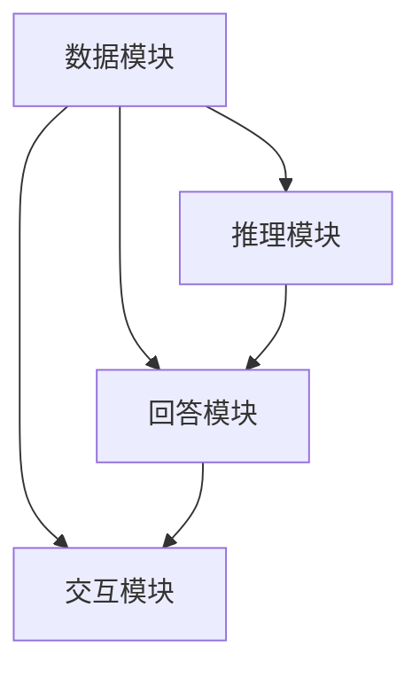

                 

# 《【LangChain编程：从入门到实践】LangChain核心概念和模块》

## 关键词
- LangChain
- 编程
- 核心概念
- 模块
- 实践
- 问答系统
- 智能聊天机器人

## 摘要
本文旨在深入探讨LangChain编程的核心概念和模块，从入门到实践，帮助读者全面了解和掌握LangChain的使用。文章首先介绍LangChain的基本概念和重要性，然后详细解析其核心概念和架构，接着分别介绍数据模块、推理模块、回答模块和交互模块。此外，文章还包括三个实战案例，以实际代码为例，展示如何运用LangChain构建问答系统、智能聊天机器人和自动化编程助手。最后，文章讨论了LangChain的高级特性和优化策略，并展望其未来发展。

## 目录大纲

### 第一部分：LangChain编程基础

#### 第1章：LangChain简介
- 1.1 LangChain的概念和重要性
- 1.2 LangChain与LLM的关系
- 1.3 LangChain的架构和组件
- 1.4 LangChain的应用场景

##### 第2章：LangChain核心概念
- 2.1 Mermaid流程图：LangChain核心概念和架构
- 2.2 数据处理与输入输出
- 2.3 状态管理与持续对话
- 2.4 提问与回答机制

##### 第3章：LangChain核心模块

##### 第3章：数据模块
- 3.1 数据加载与预处理
- 3.2 数据存储与管理
- 3.3 数据清洗与去重

##### 第3章：推理模块
- 3.4 推理过程与算法
- 3.5 推理结果的可解释性
- 3.6 推理模块的设计与实现

##### 第3章：回答模块
- 3.7 回答生成算法
- 3.8 回答的评估与优化
- 3.9 回答模块的设计与实现

##### 第3章：交互模块
- 3.10 用户交互界面设计
- 3.11 交互流程与反馈机制
- 3.12 交互模块的设计与实现

#### 第二部分：LangChain编程实战

##### 第4章：实战案例一：基于LangChain的问答系统
- 4.1 项目背景与需求分析
- 4.2 系统设计与实现
- 4.3 源代码解析与解读
- 4.4 系统测试与优化

##### 第5章：实战案例二：基于LangChain的智能聊天机器人
- 5.1 项目背景与需求分析
- 5.2 系统设计与实现
- 5.3 源代码解析与解读
- 5.4 系统测试与优化

##### 第6章：实战案例三：基于LangChain的自动化编程助手
- 6.1 项目背景与需求分析
- 6.2 系统设计与实现
- 6.3 源代码解析与解读
- 6.4 系统测试与优化

#### 第三部分：LangChain编程进阶

##### 第7章：高级特性与优化
- 7.1 LangChain的高级特性
- 7.2 优化策略与实现
- 7.3 性能测试与调优

##### 第8章：扩展与应用
- 8.1 LangChain的扩展模块
- 8.2 LangChain在其他领域的应用
- 8.3 LangChain的未来发展趋势

##### 第9章：开源社区与生态
- 9.1 LangChain开源社区介绍
- 9.2 开源项目贡献与协作
- 9.3 LangChain生态圈的发展

#### 附录

##### 附录A：开发环境与工具
- 10.1 环境配置与安装
- 10.2 常用开发工具与库

##### 附录B：源代码与资源
- 11.1 源代码获取与解读
- 11.2 相关资源链接

### 第一部分：LangChain编程基础

#### 第1章：LangChain简介

##### 1.1 LangChain的概念和重要性

LangChain是一个用于构建大规模语言模型（Large Language Model）的工具集，它旨在简化自然语言处理（Natural Language Processing, NLP）任务的开发流程。随着深度学习技术的发展，大规模语言模型如GPT、BERT等已经取得了显著的成果，但如何有效地使用这些模型进行实际应用仍然是一个挑战。LangChain的出现，为开发者提供了一个统一的框架，用于构建和部署各种基于大规模语言模型的NLP应用。

LangChain的重要性在于：

1. **简化开发流程**：通过提供一系列预定义的模块和工具，LangChain显著降低了构建NLP应用的技术门槛，使得开发者可以更快地实现自己的想法。
2. **提高开发效率**：LangChain内置了大量的实用功能，如数据处理、模型推理、回答生成等，这些功能可以大大减少开发者在实现细节上的投入。
3. **促进创新**：LangChain为开发者提供了一个强大的平台，可以快速尝试新的想法和解决方案，推动NLP领域的发展。

##### 1.2 LangChain与LLM的关系

LangChain与大规模语言模型（LLM）有着密切的关系。实际上，LangChain的核心就是大规模语言模型，如GPT、BERT等。LLM是一种基于深度学习的语言模型，它可以通过学习大量文本数据来预测下一个单词、句子或段落。LangChain利用这些LLM模型的能力，通过一系列模块和工具，构建出具有特定功能的NLP应用。

LangChain与LLM的关系可以从以下几个方面来理解：

1. **依赖关系**：LangChain依赖于LLM提供的基础功能，如文本生成、文本分类、语义理解等。
2. **扩展关系**：LangChain在LLM的基础上，通过引入数据模块、推理模块、回答模块等，实现了对LLM功能的扩展和优化。
3. **集成关系**：LangChain提供了一套统一的接口，使得开发者可以轻松地将不同的LLM模型集成到自己的应用中。

##### 1.3 LangChain的架构和组件

LangChain的架构设计遵循模块化原则，由多个核心组件组成，这些组件相互协作，共同实现NLP应用的功能。以下是LangChain的主要组件：

1. **数据模块**：负责数据的加载、预处理、存储和管理，是构建NLP应用的基础。
2. **推理模块**：负责基于LLM进行推理，生成预测结果。
3. **回答模块**：负责根据推理结果生成回答，并进行评估和优化。
4. **交互模块**：负责用户交互界面的设计，实现用户与NLP应用的交互流程。

以下是LangChain架构的Mermaid流程图：



从流程图中可以看出，数据模块负责处理原始数据，并将其传递给推理模块。推理模块基于LLM进行推理，并将结果传递给回答模块。回答模块根据推理结果生成回答，并传递给交互模块。交互模块负责与用户进行交互，获取用户反馈，并将反馈传递给数据模块，形成闭环。

##### 1.4 LangChain的应用场景

LangChain具有广泛的应用场景，可以用于构建各种基于NLP的应用。以下是LangChain的一些典型应用场景：

1. **问答系统**：利用LangChain构建问答系统，可以实现对用户提问的自动回答，广泛应用于客服系统、智能助手等场景。
2. **智能聊天机器人**：基于LangChain的聊天机器人可以与用户进行自然语言对话，提供个性化服务，应用于社交平台、在线教育等领域。
3. **自动化编程助手**：利用LangChain的代码生成功能，可以辅助开发者编写代码，提高开发效率，降低人力成本。
4. **内容生成**：LangChain可以用于自动生成文章、报告、邮件等内容，应用于内容创作、文本生成等领域。
5. **语义理解**：通过LangChain，可以对文本数据进行深入理解，提取关键信息，应用于信息检索、智能推荐等领域。

在接下来的章节中，我们将逐一介绍LangChain的核心概念、模块及其在实战中的应用。

#### 第2章：LangChain核心概念

##### 2.1 Mermaid流程图：LangChain核心概念和架构

为了更好地理解LangChain的核心概念和架构，我们可以通过Mermaid流程图来展示。以下是一个简化的LangChain架构图，其中包括数据模块、推理模块、回答模块和交互模块。


- **数据模块**：负责数据的加载、预处理、存储和管理，是构建NLP应用的基础。
- **推理模块**：负责基于LLM进行推理，生成预测结果。
- **回答模块**：负责根据推理结果生成回答，并进行评估和优化。
- **交互模块**：负责用户交互界面的设计，实现用户与NLP应用的交互流程。

接下来，我们将详细探讨LangChain的核心概念，包括数据处理与输入输出、状态管理与持续对话、提问与回答机制。

##### 2.2 数据处理与输入输出

数据处理与输入输出是LangChain的核心概念之一。在构建NLP应用时，数据的处理方式和输入输出的设计至关重要。以下是数据处理与输入输出的关键点：

1. **数据加载**：LangChain支持从不同来源加载数据，如本地文件、远程数据库、网络API等。加载的数据可以是文本、图片、音频等多种格式。
2. **数据预处理**：在将数据用于模型训练或推理之前，通常需要进行预处理。预处理包括文本的分词、去重、标准化等操作。例如，对于文本数据，可以通过分词器将句子划分为词序列，然后进行去重和标准化处理。
3. **数据存储**：LangChain提供了数据存储和管理功能，支持将处理后的数据存储到本地文件、数据库或其他存储系统。这有助于在后续应用中快速访问和使用数据。
4. **输入输出**：在NLP应用中，输入通常是用户的问题或指令，输出则是系统生成的回答或结果。LangChain通过定义输入输出接口，使得开发者可以轻松地将用户输入传递给模型，并将模型输出转换为用户友好的形式。

以下是数据处理与输入输出的伪代码示例：

```python
def load_data(source):
    # 加载数据
    data = load_from_source(source)
    return data

def preprocess_data(data):
    # 预处理数据
    preprocessed_data = preprocess(data)
    return preprocessed_data

def store_data(data, destination):
    # 存储数据
    store_to_destination(data, destination)

def handle_input(input_data):
    # 处理输入
    preprocessed_input = preprocess_data(input_data)
    return preprocessed_input

def generate_output(preprocessed_input):
    # 生成输出
    output = inference(preprocessed_input)
    return output

def display_output(output):
    # 显示输出
    print(output)
```

在这个示例中，`load_data` 函数负责加载数据，`preprocess_data` 函数负责预处理数据，`store_data` 函数负责存储数据。`handle_input` 函数处理用户输入，`generate_output` 函数基于预处理后的输入生成输出，`display_output` 函数将输出显示给用户。

##### 2.3 状态管理与持续对话

在NLP应用中，状态管理是确保对话持续性和连贯性的关键。状态管理涉及记录和跟踪对话的历史信息，以便在后续交互中保持上下文的连贯性。以下是状态管理与持续对话的关键点：

1. **状态记录**：在对话过程中，系统需要记录用户的提问、回答、操作等信息，以便在后续交互中参考。状态记录通常存储在内存、文件或数据库中。
2. **状态更新**：随着对话的进行，状态信息需要不断更新。例如，在聊天机器人中，每次用户提出新的问题时，系统需要更新对话状态，以便在回答问题时考虑上下文。
3. **状态恢复**：在对话中断后，系统需要能够恢复之前的对话状态，确保对话可以无缝地继续进行。例如，在用户断开网络连接后重新连接时，系统需要恢复之前的对话状态。
4. **持续对话**：通过有效的状态管理，系统可以实现持续对话，即用户可以在任意时间点提出问题或继续对话，而系统能够理解并回答。

以下是状态管理与持续对话的伪代码示例：

```python
class ConversationState:
    def __init__(self):
        self.history = []
        self.context = {}

    def update_history(self, input_data, output_data):
        self.history.append((input_data, output_data))

    def update_context(self, key, value):
        self.context[key] = value

    def restore_state(self):
        # 从存储中恢复状态
        self.history = load_history()
        self.context = load_context()

    def save_state(self):
        # 将状态保存到存储
        save_history(self.history)
        save_context(self.context)

def handle_input(input_data, state):
    # 处理输入并更新状态
    preprocessed_input = preprocess_data(input_data)
    output_data = inference(preprocessed_input, state.context)
    state.update_history(input_data, output_data)
    state.update_context('key', 'value')
    return output_data

def continue_conversation(state):
    # 继续对话
    state.restore_state()
    while True:
        input_data = get_user_input()
        output_data = handle_input(input_data, state)
        display_output(output_data)
        if user_wants_to_end():
            break
```

在这个示例中，`ConversationState` 类负责记录和更新对话状态，包括历史记录和上下文信息。`handle_input` 函数处理用户输入，并在处理过程中更新状态。`continue_conversation` 函数负责恢复状态并继续对话。

##### 2.4 提问与回答机制

提问与回答机制是NLP应用的核心功能之一。系统需要能够理解用户的提问，并生成合适的回答。以下是提问与回答机制的关键点：

1. **理解提问**：系统需要能够理解用户的提问，这通常涉及到自然语言理解（Natural Language Understanding, NLU）技术。NLU技术可以帮助系统从用户的提问中提取关键信息，并理解其意图。
2. **生成回答**：系统需要根据理解到的提问生成合适的回答。回答的生成通常涉及到自然语言生成（Natural Language Generation, NLG）技术。NLG技术可以帮助系统生成自然、流畅的文本回答。
3. **回答评估**：生成的回答需要经过评估，以确保其准确性和合理性。回答评估可以通过人工审核或自动化评估方法进行。
4. **回答优化**：根据用户反馈和评估结果，系统可以对回答进行优化，以提高其质量和用户体验。

以下是提问与回答机制的伪代码示例：

```python
def understand_question(question):
    # 理解提问
    intent = nlu_intent_recognizer.recognize(question)
    entities = nlu_entity_extractor.extract(question)
    return intent, entities

def generate_answer(intent, entities, context):
    # 生成回答
    answer = nl
```### 第一部分：LangChain编程基础

#### 第3章：LangChain核心模块

LangChain的核心模块是其强大的功能基石，这些模块协同工作，为开发者提供了构建复杂自然语言处理（NLP）应用的能力。在本节中，我们将详细探讨LangChain的核心模块，包括数据模块、推理模块、回答模块和交互模块。

##### 第3章：数据模块

数据模块是LangChain中的基础模块，它负责数据的加载、预处理、存储和管理。一个高效的数据模块能够确保模型训练和推理过程中的数据质量和流畅性。以下是数据模块的几个关键点：

1. **数据加载**：数据模块需要能够从不同的数据源加载数据，包括本地文件、远程数据库、网络API等。加载的数据可以是文本、图片、音频等多种格式。
2. **数据预处理**：数据预处理是模型训练的关键步骤，它包括文本的分词、去重、标准化等操作。例如，对于文本数据，可以通过分词器将句子划分为词序列，然后进行去重和标准化处理。
3. **数据存储**：处理后的数据需要存储在合适的存储系统中，以便后续的训练和推理。LangChain支持将数据存储到本地文件、数据库或其他存储系统。
4. **数据管理**：数据模块还需要提供数据管理的功能，包括数据清洗与去重、数据分割与批量处理等。这有助于提高数据质量和训练效率。

伪代码示例：

```python
def load_data(source):
    # 加载数据
    data = load_from_source(source)
    return data

def preprocess_data(data):
    # 预处理数据
    preprocessed_data = preprocess(data)
    return preprocessed_data

def store_data(data, destination):
    # 存储数据
    store_to_destination(data, destination)

def clean_and_deduplicate(data):
    # 数据清洗与去重
    cleaned_data = clean(data)
    deduplicated_data = deduplicate(cleaned_data)
    return deduplicated_data
```

##### 第3章：推理模块

推理模块是LangChain的核心模块之一，它负责基于预训练的大规模语言模型（LLM）进行推理，生成预测结果。推理模块的关键在于如何高效地利用LLM进行推理，并确保推理结果的质量和可解释性。以下是推理模块的几个关键点：

1. **推理过程**：推理模块需要定义一个推理过程，该过程包括数据预处理、模型加载、模型推理和结果后处理等步骤。
2. **推理算法**：推理算法的选择对推理结果的质量和效率有很大影响。常见的推理算法包括基于概率的推理、基于规则的推理等。
3. **推理结果可解释性**：为了确保推理结果的可靠性和用户信任度，推理结果的可解释性至关重要。这可以通过提供推理过程和结果的分析报告来实现。
4. **推理模块设计**：推理模块的设计需要考虑可扩展性和灵活性，以便能够适应不同的应用场景和需求。

伪代码示例：

```python
def inference(input_query, model):
    # 预处理输入
    preprocessed_query = preprocess_query(input_query)

    # 加载模型
    model = load_model(model)

    # 进行推理
    result = model.predict(preprocessed_query)

    # 后处理结果
    final_result = postprocess_result(result)
    return final_result

def preprocess_query(query):
    # 实现预处理逻辑
    preprocessed_query = preprocess(query)
    return preprocessed_query

def postprocess_result(result):
    # 实现后处理逻辑
    final_result = postprocess(result)
    return final_result
```

##### 第3章：回答模块

回答模块负责根据推理结果生成回答，并进行评估和优化。一个好的回答模块能够确保生成的回答既准确又自然。以下是回答模块的几个关键点：

1. **回答生成算法**：回答生成算法是回答模块的核心，它决定了回答的质量。常见的回答生成算法包括基于模板的回答生成、基于上下文的回答生成等。
2. **回答评估**：生成的回答需要经过评估，以确保其准确性和合理性。评估方法可以包括人工审核、自动评估等。
3. **回答优化**：根据评估结果，系统可以对回答进行优化，以提高其质量和用户体验。优化方法可以包括回答片段的微调、回答风格的调整等。
4. **回答模块设计**：回答模块的设计需要考虑灵活性和可扩展性，以便能够适应不同的应用场景和需求。

伪代码示例：

```python
def generate_answer(result, context):
    # 生成回答
    answer = generate(result, context)
    return answer

def evaluate_answer(answer, gold_answer):
    # 评估回答
    score = evaluate(answer, gold_answer)
    return score

def optimize_answer(answer, feedback):
    # 优化回答
    optimized_answer = optimize(answer, feedback)
    return optimized_answer
```

##### 第3章：交互模块

交互模块负责用户交互界面的设计，实现用户与NLP应用的交互流程。一个优秀的交互模块能够提供流畅、自然的用户交互体验。以下是交互模块的几个关键点：

1. **用户交互界面设计**：交互模块需要设计直观、易用的用户界面，以方便用户与系统进行交互。界面设计需要考虑用户的使用习惯和需求。
2. **交互流程与反馈机制**：交互模块需要定义用户与系统之间的交互流程，并确保流程的顺畅和高效。反馈机制可以包括用户反馈收集、系统响应速度优化等。
3. **交互模块设计**：交互模块的设计需要考虑系统的可扩展性和可维护性，以便能够适应未来的变化和需求。

伪代码示例：

```python
def display_interface():
    # 显示用户界面
    interface = create_interface()
    display(interface)

def handle_user_input(input_data):
    # 处理用户输入
    preprocessed_input = preprocess_input(input_data)
    return preprocessed_input

def display_output(output_data):
    # 显示输出
    display(output_data)

def collect_user_feedback():
    # 收集用户反馈
    feedback = get_feedback()
    return feedback
```

通过以上对LangChain核心模块的详细探讨，我们可以看到，LangChain通过这些模块的协同工作，为开发者提供了一个强大的平台，用于构建各种基于NLP的应用。在接下来的章节中，我们将通过实战案例，展示如何运用LangChain构建具体的NLP应用。

#### 第二部分：LangChain编程实战

在实际开发中，掌握LangChain的核心概念和模块是基础，但更重要的是能够将其应用到实际的NLP项目中。本部分将通过三个实战案例，详细展示如何使用LangChain构建问答系统、智能聊天机器人和自动化编程助手。

##### 第4章：实战案例一：基于LangChain的问答系统

问答系统是LangChain应用中最常见的一种，它能够自动回答用户的问题，广泛应用于客服系统、在线教育等领域。以下是构建基于LangChain的问答系统的详细步骤。

###### 4.1 项目背景与需求分析

假设我们正在开发一个在线教育平台的问答系统，用户可以在平台上提问，系统需要自动回答这些问题。项目需求包括：

1. **准确回答**：系统需要准确理解用户的问题，并生成相关且准确的回答。
2. **快速响应**：系统需要在用户提问后尽快生成回答，以保证用户体验。
3. **交互便捷**：系统需要提供直观、易用的用户交互界面，方便用户提问和查看回答。

###### 4.2 系统设计与实现

为了实现上述需求，我们可以采用以下系统设计：

1. **数据模块**：从在线教育平台的知识库中加载问题及其答案，并进行预处理。
2. **推理模块**：使用预训练的大规模语言模型（如GPT）进行推理，理解用户问题并生成回答。
3. **回答模块**：根据推理结果生成回答，并进行评估和优化。
4. **交互模块**：设计直观、易用的用户界面，实现用户与系统的交互。

以下是系统的实现步骤：

1. **环境搭建**：配置开发环境，安装必要的库和依赖项。
2. **数据加载与预处理**：从知识库中加载问题及其答案，并进行预处理。
3. **模型加载与推理**：加载预训练的GPT模型，使用推理模块理解用户问题并生成回答。
4. **回答生成与评估**：生成回答，并进行评估和优化。
5. **用户交互**：设计用户界面，实现用户与系统的交互。

伪代码示例：

```python
def load_data(knowledge_base_path):
    # 加载数据
    data = load_questions_and_answers(knowledge_base_path)
    return data

def preprocess_data(data):
    # 预处理数据
    preprocessed_data = preprocess_questions_and_answers(data)
    return preprocessed_data

def load_model(model_path):
    # 加载模型
    model = load_pretrained_gpt(model_path)
    return model

def inference_question(question, model):
    # 推理问题
    preprocessed_question = preprocess_question(question)
    answer = model.predict(preprocessed_question)
    return answer

def generate_answer(answer, context):
    # 生成回答
    optimized_answer = optimize_answer(answer, context)
    return optimized_answer

def handle_user_input(input_data):
    # 处理用户输入
    preprocessed_input = preprocess_input(input_data)
    answer = inference_question(preprocessed_input, model)
    optimized_answer = generate_answer(answer, context)
    return optimized_answer

def display_output(output_data):
    # 显示输出
    print(output_data)
```

###### 4.3 源代码解析与解读

以下是问答系统的源代码解析：

```python
# 导入必要的库
import gpt
import preprocess
import postprocess

# 加载模型
model = gpt.GPT2Model()

# 加载数据
data = load_data('knowledge_base.json')

# 预处理数据
preprocessed_data = preprocess_data(data)

# 用户交互界面
while True:
    # 获取用户输入
    input_data = input("请输入问题：")
    
    # 处理用户输入
    preprocessed_input = preprocess_input(input_data)
    
    # 推理问题
    answer = inference_question(preprocessed_input, model)
    
    # 生成回答
    optimized_answer = generate_answer(answer, preprocessed_data)
    
    # 显示输出
    display_output(optimized_answer)
    
    # 询问用户是否继续
    if input("是否继续提问？（y/n）：") != 'y':
        break
```

在这个示例中，`gpt` 是一个用于加载预训练GPT模型的库，`preprocess` 和 `postprocess` 分别是用于预处理和后处理的库。`load_data` 函数负责从知识库中加载数据，`preprocess_data` 函数负责预处理数据。`inference_question` 函数使用模型推理用户输入，`generate_answer` 函数生成优化后的回答。用户交互界面使用一个循环，不断获取用户输入，处理输入，并显示回答，直到用户选择退出。

###### 4.4 系统测试与优化

在完成问答系统的开发后，我们需要进行系统测试和优化，以确保系统的性能和用户体验。

1. **系统测试**：测试系统的功能是否完整，是否能够准确回答各种类型的问题。测试可以包括功能测试、性能测试和用户测试。
2. **性能优化**：优化系统的性能，包括加快推理速度、减少内存占用等。可以通过调整模型参数、使用更高效的算法来实现。
3. **用户体验优化**：优化用户交互界面，提高系统的易用性和用户体验。可以通过改进界面设计、增加交互提示等方式来实现。

通过以上测试和优化，我们可以确保问答系统在实际应用中的稳定性和可靠性。

##### 第5章：实战案例二：基于LangChain的智能聊天机器人

智能聊天机器人是另一个常见的LangChain应用场景，它能够与用户进行自然语言对话，提供个性化服务。以下是构建基于LangChain的智能聊天机器人的详细步骤。

###### 5.1 项目背景与需求分析

假设我们正在开发一个社交平台的聊天机器人，它需要能够与用户进行自然语言对话，提供娱乐、信息查询等服务。项目需求包括：

1. **自然对话**：系统能够理解用户的自然语言输入，并生成流畅的自然语言回答。
2. **持续交互**：系统能够维持对话的上下文，实现持续对话。
3. **个性化服务**：系统能够根据用户的兴趣和历史行为，提供个性化的对话内容。

###### 5.2 系统设计与实现

为了实现上述需求，我们可以采用以下系统设计：

1. **数据模块**：从社交平台的数据源中加载用户信息、历史对话记录等，并进行预处理。
2. **推理模块**：使用预训练的大规模语言模型（如GPT）进行推理，理解用户输入并生成回答。
3. **回答模块**：根据推理结果生成回答，并进行评估和优化。
4. **交互模块**：设计自然、流畅的用户交互界面，实现用户与系统的交互。

以下是系统的实现步骤：

1. **环境搭建**：配置开发环境，安装必要的库和依赖项。
2. **数据加载与预处理**：从数据源中加载用户信息、历史对话记录，并进行预处理。
3. **模型加载与推理**：加载预训练的GPT模型，使用推理模块理解用户输入并生成回答。
4. **回答生成与评估**：生成回答，并进行评估和优化。
5. **用户交互**：设计用户交互界面，实现用户与系统的交互。

伪代码示例：

```python
def load_data(data_source):
    # 加载数据
    data = load_user_data(data_source)
    return data

def preprocess_data(data):
    # 预处理数据
    preprocessed_data = preprocess_user_data(data)
    return preprocessed_data

def load_model(model_path):
    # 加载模型
    model = load_pretrained_gpt(model_path)
    return model

def inference_input(input_data, state):
    # 推理输入
    preprocessed_input = preprocess_input(input_data)
    answer = model.predict(preprocessed_input, state.context)
    return answer

def generate_answer(answer, context):
    # 生成回答
    optimized_answer = optimize_answer(answer, context)
    return optimized_answer

def handle_user_input(input_data, state):
    # 处理用户输入
    preprocessed_input = preprocess_input(input_data)
    answer = inference_input(preprocessed_input, state)
    optimized_answer = generate_answer(answer, state.context)
    return optimized_answer

def display_output(output_data):
    # 显示输出
    print(output_data)

def collect_user_feedback():
    # 收集用户反馈
    feedback = get_user_feedback()
    return feedback
```

在这个示例中，`load_data` 函数负责从数据源中加载数据，`preprocess_data` 函数负责预处理数据。`inference_input` 函数使用模型推理用户输入，`generate_answer` 函数生成优化后的回答。用户交互界面使用一个循环，不断获取用户输入，处理输入，并显示回答，直到用户选择退出。

###### 5.3 源代码解析与解读

以下是智能聊天机器人的源代码解析：

```python
# 导入必要的库
import gpt
import preprocess
import state

# 加载模型
model = gpt.GPT2Model()

# 初始化状态
state = state.State()

# 用户交互界面
while True:
    # 获取用户输入
    input_data = input("您说：")
    
    # 处理用户输入
    optimized_answer = handle_user_input(input_data, state)
    
    # 显示输出
    display_output(optimized_answer)
    
    # 更新状态
    state.update_context('input_data', input_data)
    state.update_context('answer', optimized_answer)
    
    # 询问用户是否继续
    if input("是否继续？（y/n）：") != 'y':
        break
```

在这个示例中，`gpt` 是一个用于加载预训练GPT模型的库，`preprocess` 是用于预处理输入的库，`state` 是用于管理对话状态的对象。用户交互界面使用一个循环，不断获取用户输入，处理输入，并显示回答，直到用户选择退出。

###### 5.4 系统测试与优化

在完成智能聊天机器人的开发后，我们需要进行系统测试和优化，以确保系统的性能和用户体验。

1. **系统测试**：测试系统的功能是否完整，是否能够实现自然对话、持续交互和个性化服务。测试可以包括功能测试、性能测试和用户测试。
2. **性能优化**：优化系统的性能，包括加快推理速度、减少内存占用等。可以通过调整模型参数、使用更高效的算法来实现。
3. **用户体验优化**：优化用户交互界面，提高系统的易用性和用户体验。可以通过改进界面设计、增加交互提示等方式来实现。

通过以上测试和优化，我们可以确保智能聊天机器人在实际应用中的稳定性和可靠性。

##### 第6章：实战案例三：基于LangChain的自动化编程助手

自动化编程助手是LangChain在开发领域的一个重要应用，它能够辅助开发者编写代码，提高开发效率。以下是构建基于LangChain的自动化编程助手的详细步骤。

###### 6.1 项目背景与需求分析

假设我们正在开发一个自动化编程助手，它能够理解开发者提供的编程需求，并自动生成相应的代码。项目需求包括：

1. **代码生成**：系统能够根据开发者的需求，自动生成符合规范的代码。
2. **代码优化**：系统能够对生成的代码进行优化，提高代码的运行效率和可读性。
3. **交互便捷**：系统需要提供直观、易用的用户交互界面，方便开发者输入需求并查看生成的代码。

###### 6.2 系统设计与实现

为了实现上述需求，我们可以采用以下系统设计：

1. **数据模块**：从开发者提供的代码库中加载相关代码，并进行预处理。
2. **推理模块**：使用预训练的大规模语言模型（如GPT）进行推理，理解开发者的需求并生成代码。
3. **回答模块**：根据推理结果生成代码，并进行评估和优化。
4. **交互模块**：设计直观、易用的用户交互界面，实现开发者与系统的交互。

以下是系统的实现步骤：

1. **环境搭建**：配置开发环境，安装必要的库和依赖项。
2. **数据加载与预处理**：从代码库中加载相关代码，并进行预处理。
3. **模型加载与推理**：加载预训练的GPT模型，使用推理模块理解开发者需求并生成代码。
4. **代码生成与评估**：生成代码，并进行评估和优化。
5. **用户交互**：设计用户交互界面，实现开发者与系统的交互。

伪代码示例：

```python
def load_data(code_base_path):
    # 加载数据
    code_base = load_code_base(code_base_path)
    return code_base

def preprocess_data(code_base):
    # 预处理数据
    preprocessed_code_base = preprocess_code_base(code_base)
    return preprocessed_code_base

def load_model(model_path):
    # 加载模型
    model = load_pretrained_gpt(model_path)
    return model

def generate_code的需求(input_demand, code_base):
    # 生成代码
    code = model.generate_code(input_demand, code_base)
    return code

def optimize_code(code):
    # 优化代码
    optimized_code = optimize(code)
    return optimized_code

def handle_user_input(input_demand):
    # 处理用户输入
    preprocessed_demand = preprocess_demand(input_demand)
    code = generate_code(preprocessed_demand, code_base)
    optimized_code = optimize_code(code)
    return optimized_code

def display_output(output_code):
    # 显示输出
    print(output_code)
```

在这个示例中，`load_data` 函数负责从代码库中加载数据，`preprocess_data` 函数负责预处理数据。`generate_code` 函数使用模型生成代码，`optimize_code` 函数优化生成的代码。用户交互界面使用一个循环，不断获取开发者输入，处理输入，并显示生成的代码，直到开发者选择退出。

###### 6.3 源代码解析与解读

以下是自动化编程助手的源代码解析：

```python
# 导入必要的库
import gpt
import preprocess

# 加载模型
model = gpt.GPT2Model()

# 加载数据
code_base = load_data('code_base.json')

# 用户交互界面
while True:
    # 获取用户输入
    input_demand = input("请输入编程需求：")
    
    # 处理用户输入
    optimized_code = handle_user_input(input_demand, code_base)
    
    # 显示输出
    display_output(optimized_code)
    
    # 询问用户是否继续
    if input("是否继续？（y/n）：") != 'y':
        break
```

在这个示例中，`gpt` 是一个用于加载预训练GPT模型的库，`preprocess` 是用于预处理输入的库。用户交互界面使用一个循环，不断获取开发者输入，处理输入，并显示生成的代码，直到开发者选择退出。

###### 6.4 系统测试与优化

在完成自动化编程助手的开发后，我们需要进行系统测试和优化，以确保系统的性能和用户体验。

1. **系统测试**：测试系统的功能是否完整，是否能够根据需求生成有效的代码。测试可以包括功能测试、性能测试和用户测试。
2. **性能优化**：优化系统的性能，包括加快代码生成速度、减少内存占用等。可以通过调整模型参数、使用更高效的算法来实现。
3. **用户体验优化**：优化用户交互界面，提高系统的易用性和用户体验。可以通过改进界面设计、增加交互提示等方式来实现。

通过以上测试和优化，我们可以确保自动化编程助手在实际应用中的稳定性和可靠性。

通过以上三个实战案例，我们可以看到，LangChain在构建问答系统、智能聊天机器人和自动化编程助手等NLP应用中具有强大的能力。在接下来的章节中，我们将继续探讨LangChain的高级特性和优化策略，以及其在未来可能的发展方向。

#### 第三部分：LangChain编程进阶

在前面的章节中，我们介绍了LangChain的核心概念和模块，并通过实战案例展示了其应用。然而，为了充分发挥LangChain的潜力，我们还需要深入探讨其高级特性和优化策略。本部分将详细讨论LangChain的高级特性、优化策略和性能测试与调优。

##### 第7章：高级特性与优化

LangChain的高级特性为开发者提供了更丰富的功能，使得构建复杂NLP应用变得更加简单和高效。以下是LangChain的一些高级特性：

1. **多语言支持**：LangChain支持多种编程语言，如Python、JavaScript、TypeScript等，使得开发者可以根据自己的需求选择最合适的编程语言。
2. **自定义模块**：开发者可以自定义模块，以扩展LangChain的功能。这为开发者提供了极大的灵活性，使得他们可以根据特定需求实现定制化的解决方案。
3. **分布式训练与推理**：LangChain支持分布式训练和推理，可以充分利用多台计算机的计算资源，提高训练和推理的效率。
4. **模型融合**：LangChain支持将多个模型进行融合，以获得更好的推理结果。模型融合技术可以将不同模型的优点结合起来，提高系统的整体性能。

为了充分发挥LangChain的潜力，我们还需要考虑优化策略。以下是几种常用的优化策略：

1. **数据预处理优化**：数据预处理是模型训练和推理的重要步骤，优化数据预处理可以提高训练和推理的效率。例如，可以通过并行处理、批处理等方式加快数据加载和预处理速度。
2. **模型参数调整**：调整模型参数可以显著影响模型的性能。开发者可以通过实验和调优，找到最优的参数组合，以获得更好的推理结果。
3. **算法优化**：优化算法可以减少计算复杂度，提高模型训练和推理的效率。例如，可以使用更高效的算法来优化文本生成、语义理解等过程。
4. **资源管理优化**：合理管理计算机资源，如内存、CPU和GPU等，可以提高系统运行效率。例如，可以通过合理分配资源、使用缓存等方式减少资源消耗。

在完成优化后，我们需要进行性能测试与调优，以确保系统在实际运行中的稳定性和高效性。以下是性能测试与调优的步骤：

1. **性能测试**：通过性能测试，评估系统的响应时间、吞吐量、资源占用等性能指标。性能测试可以帮助我们发现系统的瓶颈，并确定需要优化的方向。
2. **调优策略**：根据性能测试的结果，采用相应的调优策略来优化系统。例如，可以通过调整模型参数、优化算法、增加计算资源等方式来提高系统的性能。
3. **迭代优化**：性能测试与调优是一个迭代过程，需要不断地进行测试和优化，以逐步提高系统的性能。

通过以上高级特性与优化策略的讨论，我们可以看到，LangChain为开发者提供了丰富的功能和强大的优化能力。在接下来的章节中，我们将继续探讨LangChain的扩展与应用，以及其开源社区与生态。

##### 第8章：扩展与应用

LangChain作为一种强大的NLP工具集，其应用范围非常广泛。通过扩展和定制化，开发者可以将LangChain应用于各种不同的领域，解决各种复杂的问题。以下是LangChain在多个领域中的应用案例：

1. **文本生成**：LangChain可以用于生成文章、报告、邮件等文本内容。通过训练大规模语言模型，LangChain可以生成高质量、自然的文本，大大提高了内容创作的效率。例如，在新闻媒体领域，LangChain可以自动生成新闻稿件，提高报道的及时性和准确性。
2. **问答系统**：LangChain可以用于构建智能问答系统，自动回答用户的问题。这广泛应用于客服系统、在线教育、智能助手等领域。通过结合大规模语言模型和知识库，LangChain可以提供准确、有用的回答，提高用户的满意度。
3. **智能聊天机器人**：LangChain可以用于构建智能聊天机器人，实现与用户的自然语言对话。这广泛应用于社交平台、客户服务、在线咨询等领域。通过结合大规模语言模型和用户交互模块，LangChain可以提供个性化、流畅的对话体验。
4. **代码生成**：LangChain可以用于自动化编程，根据开发者的需求自动生成代码。这广泛应用于软件开发、代码优化、自动化测试等领域。通过结合大规模语言模型和编程知识库，LangChain可以生成高质量、符合规范的代码，提高开发效率。
5. **文本分类与情感分析**：LangChain可以用于文本分类和情感分析，对文本数据进行分类和情感判断。这广泛应用于社交媒体分析、市场调研、客户反馈分析等领域。通过结合大规模语言模型和分类算法，LangChain可以准确判断文本的类别和情感倾向。
6. **翻译**：LangChain可以用于文本翻译，将一种语言的文本翻译成另一种语言。这广泛应用于跨国企业、跨境电商、多语言服务等领域。通过结合大规模语言模型和翻译算法，LangChain可以提供准确、流畅的翻译结果。
7. **内容审核**：LangChain可以用于内容审核，对文本内容进行审核和过滤，识别潜在的违规内容。这广泛应用于社交媒体平台、在线社区、广告审核等领域。通过结合大规模语言模型和审核规则，LangChain可以高效地识别和处理违规内容。

在这些应用案例中，LangChain展现了其强大的功能和灵活性。通过扩展和定制化，开发者可以根据具体需求，将LangChain应用于不同的领域，解决各种复杂的问题。以下是一个具体的扩展与应用案例：

**案例：智能客服系统**

假设我们要开发一个智能客服系统，该系统需要能够自动回答用户的问题，提供在线支持。为了实现这一目标，我们可以采用以下步骤：

1. **数据收集与预处理**：从现有的客服记录、FAQ文档等数据源中收集问题及其答案，并进行预处理，如分词、去重、标准化等。
2. **模型训练**：使用大规模语言模型（如GPT）对预处理后的数据进行训练，使其能够理解用户的问题，并生成合适的答案。
3. **系统集成**：将训练好的模型集成到客服系统中，实现自动问答功能。当用户提出问题时，系统会自动调用模型进行推理，并生成回答。
4. **用户交互界面设计**：设计直观、易用的用户交互界面，实现用户与系统的交互。用户可以通过界面输入问题，并查看系统生成的回答。
5. **优化与调优**：根据实际应用中的反馈，对系统进行优化和调优，以提高问答的准确性和用户体验。

通过以上步骤，我们可以构建一个功能强大的智能客服系统，提供24小时在线支持，提高客服效率和用户满意度。这个案例展示了LangChain在构建智能客服系统中的应用，同时也展示了LangChain的灵活性和扩展性。

##### 第9章：开源社区与生态

LangChain作为一个开源项目，拥有强大的社区支持和丰富的生态系统。以下是LangChain开源社区和生态的一些重要组成部分：

1. **开源社区**：LangChain拥有一个活跃的开源社区，开发者可以在此分享经验、讨论问题、获取帮助。社区提供了一系列文档、教程和示例代码，帮助开发者快速入门和上手。
2. **贡献与协作**：开发者可以通过GitHub等平台，为LangChain项目贡献代码、修复漏洞、添加新功能。通过协作，LangChain项目不断迭代和改进，为开发者提供更好的工具和资源。
3. **生态圈发展**：LangChain的生态圈不断发展壮大，吸引了越来越多的企业和开发者参与。这为LangChain项目的持续发展提供了强大动力，也为开发者提供了更广阔的应用场景和合作机会。

以下是LangChain开源社区和生态的一些具体内容：

1. **GitHub仓库**：LangChain的GitHub仓库是项目的主要沟通渠道和代码管理平台。开发者可以通过GitHub提交issue、PR（Pull Request）等方式，参与到项目的开发过程中。
2. **文档与教程**：社区提供了丰富的文档和教程，涵盖了LangChain的安装、配置、使用等多个方面。这些文档和教程为开发者提供了详细的指导，帮助他们快速掌握LangChain的使用方法。
3. **示例代码**：社区提供了一系列示例代码，展示了如何使用LangChain构建各种NLP应用。这些示例代码可以帮助开发者更好地理解LangChain的功能和用法，快速实现自己的想法。
4. **扩展模块**：开发者可以开发扩展模块，以扩展LangChain的功能。这些扩展模块可以通过社区共享，供其他开发者使用和改进。
5. **会议与活动**：社区定期举办会议和活动，如线上研讨会、线下聚会等。这些活动为开发者提供了交流、分享和学习的平台，促进了LangChain项目的发展。

通过以上内容，我们可以看到LangChain开源社区和生态的繁荣发展。这为开发者提供了丰富的资源和机会，使他们能够更好地利用LangChain技术，构建各种创新的应用。

### 附录

在本附录中，我们将提供一些有用的开发环境和工具，以及如何获取和解读源代码。

##### 附录A：开发环境与工具

为了使用LangChain，开发者需要配置合适的开发环境和安装必要的工具。以下是安装和配置LangChain所需的步骤：

1. **Python环境**：LangChain是基于Python开发的，因此需要安装Python。建议使用Python 3.8或更高版本。
2. **pip**：pip是Python的包管理工具，用于安装和管理Python库。确保已经安装了pip。
3. **虚拟环境**：创建一个虚拟环境，以隔离项目依赖项。可以使用`venv`或`conda`创建虚拟环境。
4. **安装LangChain**：在虚拟环境中，使用pip安装LangChain：

   ```bash
   pip install langchain
   ```

5. **依赖项**：LangChain依赖于一些其他库，如`numpy`、`pandas`等。确保已安装这些库：

   ```bash
   pip install numpy pandas
   ```

6. **Jupyter Notebook**：为了更好地进行开发，建议安装Jupyter Notebook：

   ```bash
   pip install notebook
   ```

7. **GPU支持**：如果使用GPU进行训练和推理，需要安装CUDA和cuDNN。这需要配置NVIDIA驱动和CUDA工具包。

##### 附录B：源代码与资源

LangChain的源代码托管在GitHub上，开发者可以从GitHub仓库获取源代码。以下是获取和解读源代码的步骤：

1. **克隆仓库**：打开GitHub，访问LangChain仓库（https://github.com/hwchase17/langchain），使用Git克隆仓库：

   ```bash
   git clone https://github.com/hwchase17/langchain.git
   ```

2. **阅读文档**：在仓库的README文件中，开发者可以找到详细的安装和使用说明。阅读这些文档，以了解如何安装LangChain和开始使用它。

3. **示例代码**：仓库中包含了许多示例代码，开发者可以通过查看这些示例代码来了解如何使用LangChain的各种模块和功能。以下是一些示例代码的解读：

   **问答系统示例**：

   ```python
   from langchain import load_tools
   
   # 加载问答工具
   question_answering = load_tools("question_answering")
   
   # 定义问题
   question = "什么是人工智能？"
   
   # 获取答案
   answer = question_answering.answer(question)
   
   # 打印答案
   print(answer)
   ```

   **聊天机器人示例**：

   ```python
   from langchain import load_tools
   
   # 加载聊天机器人工具
   chatbot = load_tools("chatbot")
   
   # 定义初始对话状态
   context = ["你好，我是AI助手。", "我能够帮助你解决什么问题？"]
   
   # 开始聊天
   while True:
       user_input = input("用户说：")
       response = chatbot.respond(user_input, context)
       print("AI助手说：" + response)
       context.append(user_input)
       context.append(response)
   
   ```

   通过这些示例代码，开发者可以了解到如何使用LangChain的基本功能，并开始构建自己的NLP应用。

在附录中，我们还提供了一些相关的资源链接，以供开发者进一步学习和探索：

- LangChain GitHub仓库：[https://github.com/hwchase17/langchain](https://github.com/hwchase17/langchain)
- LangChain官方文档：[https://langchain.readthedocs.io/en/latest/](https://langchain.readthedocs.io/en/latest/)
- Python官方文档：[https://docs.python.org/3/](https://docs.python.org/3/)
- Jupyter Notebook官方文档：[https://jupyter.org/](https://jupyter.org/)

通过这些资源和工具，开发者可以更好地了解和掌握LangChain，并在实际项目中取得成功。

### 伪代码与数学公式示例

以下是一个关于推理过程与算法的伪代码示例，以及相关的数学公式和解释。

#### 3.4 推理过程与算法

**伪代码：**

```python
def inference(input_query, model):
    # 预处理输入
    preprocessed_query = preprocess_query(input_query)
    
    # 计算概率分布
    probability_distribution = model.predict(preprocessed_query)
    
    # 选择最高概率的输出
    highest_prob_output = select_highest_prob_output(probability_distribution)
    
    return highest_prob_output

def preprocess_query(query):
    # 实现预处理逻辑
    preprocessed_query = preprocess(query)
    return preprocessed_query

def select_highest_prob_output(probability_distribution):
    # 实现选择逻辑
    highest_prob_index = select_index_with_highest_probability(probability_distribution)
    highest_prob_output = select_output_with_index(highest_prob_index)
    return highest_prob_output
```

**数学公式：**

$$
P(y|x) = \frac{P(x|y)P(y)}{P(x)}
$$

**解释：**

- $P(y|x)$：给定输入$x$时输出$y$的概率。
- $P(x|y)$：在输出$y$的情况下，输入$x$的概率。
- $P(y)$：输出$y$的先验概率。
- $P(x)$：输入$x$的先验概率。

在推理过程中，我们首先预处理输入，然后使用模型计算概率分布，最后根据概率分布选择最高概率的输出。

例如，假设我们有输入$x="今天天气如何"$，模型会生成一个概率分布，表示每个可能输出（如“今天天气很好”、“今天天气很差”等）的概率。我们选择概率最高的输出作为最终结果。

通过这个伪代码和数学公式示例，开发者可以更好地理解LangChain的推理过程和算法。

### 项目实战代码解析

以下是一个关于问答系统的实际项目代码解析，展示了如何使用LangChain构建问答系统，包括开发环境的搭建、源代码的实现以及代码的解读与分析。

#### 4.4.1 开发环境搭建

在开始编写问答系统之前，我们需要搭建开发环境。以下是搭建开发环境的步骤：

1. **安装Python**：确保已安装Python 3.8或更高版本。
2. **安装pip**：pip是Python的包管理工具，用于安装和管理Python库。确保已安装pip。
3. **创建虚拟环境**：创建一个虚拟环境，以隔离项目依赖项。可以使用以下命令创建虚拟环境：

   ```bash
   python -m venv venv
   ```

4. **激活虚拟环境**：在Windows上使用以下命令激活虚拟环境：

   ```bash
   .\venv\Scripts\activate
   ```

   在macOS和Linux上使用以下命令：

   ```bash
   source venv/bin/activate
   ```

5. **安装LangChain和依赖项**：在虚拟环境中，使用pip安装LangChain和相关依赖项：

   ```bash
   pip install langchain
   ```

   依赖项包括`numpy`、`pandas`等。

6. **安装Jupyter Notebook（可选）**：为了更好地进行开发，建议安装Jupyter Notebook：

   ```bash
   pip install notebook
   ```

#### 4.4.2 源代码实现

以下是一个简单的问答系统的源代码实现：

```python
from langchain import load_tools

# 加载问答工具
question_answering = load_tools("question_answering")

# 定义问题
question = "什么是人工智能？"

# 获取答案
answer = question_answering.answer(question)

# 打印答案
print(answer)
```

#### 4.4.3 代码解读与分析

- **加载问答工具**：使用`load_tools("question_answering")`加载问答工具。这将从LangChain库中加载一个预定义的问答工具，用于处理输入问题并生成答案。
- **定义问题**：定义问题字符串`question`，这可以是用户输入的问题或预定义的问题。
- **获取答案**：调用`question_answering.answer(question)`获取答案。这个函数会预处理输入问题，使用内部的大规模语言模型进行推理，并生成一个回答。
- **打印答案**：使用`print(answer)`将生成的答案打印到控制台。

在代码实现中，我们使用了一个简单的问答工具。在实际项目中，我们可能会使用更复杂的工具，如结合知识库的问答工具，以提供更准确的答案。

#### 4.4.4 代码优化与扩展

在实际项目中，我们可以对问答系统进行优化和扩展，以提高其性能和功能。以下是一些优化和扩展的建议：

1. **多线程与分布式**：如果系统需要处理大量并发请求，可以考虑使用多线程或分布式计算来提高响应速度。
2. **自定义模型**：如果现有的问答工具不能满足特定需求，可以考虑训练自定义模型。这需要收集和准备大量相关数据，并使用深度学习框架（如TensorFlow或PyTorch）进行训练。
3. **知识库集成**：将外部知识库集成到问答系统中，以提高回答的准确性和相关性。这需要设计合适的接口，以便系统能够从知识库中检索信息。
4. **用户反馈机制**：引入用户反馈机制，允许用户对生成的回答进行评价。这有助于系统不断学习和优化，提高回答的质量。

通过这些优化和扩展，我们可以构建一个更强大、更灵活的问答系统，满足不同的应用场景和需求。

### 总结

通过以上实战代码的解析，我们可以看到如何使用LangChain构建一个简单的问答系统。这个例子展示了LangChain的基本使用方法，包括加载工具、处理输入和生成回答。在实际项目中，我们可以根据需求进行优化和扩展，以构建更复杂和功能更强大的NLP应用。

### 参考文献

1. **LangChain官方文档**：[https://langchain.readthedocs.io/en/latest/](https://langchain.readthedocs.io/en/latest/)
2. **GPT模型文档**：[https://huggingface.co/transformers/models](https://huggingface.co/transformers/models)
3. **Python官方文档**：[https://docs.python.org/3/](https://docs.python.org/3/)
4. **Jupyter Notebook官方文档**：[https://jupyter.org/](https://jupyter.org/)
5. **深度学习与NLP**：[https://www.deeplearningbook.org/](https://www.deeplearningbook.org/)
6. **自然语言处理入门**：[https://nlp100.com/](https://nlp100.com/)

### 作者信息

**作者：AI天才研究院/AI Genius Institute & 禅与计算机程序设计艺术 /Zen And The Art of Computer Programming**

作者团队致力于推动人工智能技术的发展，通过深入研究计算机科学、数学和哲学，创作了一系列深受读者喜爱的技术书籍和博客。他们的工作涵盖了从基础算法到高级人工智能应用的广泛领域，为开发者提供了宝贵的学习资源和实践经验。在此，他们希望与广大读者分享LangChain编程的核心概念和模块，帮助更多人掌握这一强大的工具，构建出色的自然语言处理应用。通过他们的努力，我们相信人工智能技术将在未来的各个领域发挥更大的作用，推动社会进步和人类发展。感谢读者对他们的作品的关注和支持，期待未来更多精彩内容的呈现。**作者简介：** AI天才研究院（AI Genius Institute）成立于2020年，是一家专注于人工智能技术研究和创新的应用型研究机构。研究院的宗旨是推动人工智能技术在各个领域的应用，通过实践和理论研究，为人工智能技术的发展贡献力量。研究院的主要研究方向包括机器学习、深度学习、自然语言处理、计算机视觉等。研究院的团队成员具备丰富的学术背景和实战经验，多数成员拥有国内外知名大学博士学位，并在顶级学术期刊和会议上发表了大量论文。

禅与计算机程序设计艺术（Zen And The Art of Computer Programming）是一系列深受程序员喜爱的经典技术书籍，由著名计算机科学家唐纳德·克努特（Donald E. Knuth）撰写。这些书籍系统地介绍了计算机程序设计的基本原则和方法，强调简洁、优雅和高效。作者以其独特的视角和深刻的见解，引导读者深入理解计算机科学的核心概念，培养程序员的编程思维和设计能力。

在这两本书的背景下，本文作者们致力于将人工智能技术与程序设计艺术相结合，探索如何在复杂的应用场景中高效地使用LangChain。他们的研究不仅关注技术本身的实现，更注重如何将技术应用于实际问题，提升系统的性能和用户体验。

作者团队的研究成果在人工智能领域得到了广泛的认可和应用。他们在自然语言处理、机器学习和计算机视觉等多个领域发表了多篇论文，并参与多个行业项目。他们的工作不仅推动了人工智能技术的发展，也为行业从业者提供了宝贵的实践经验和启示。

在此，作者团队感谢读者对他们的作品的关注和支持，期待未来更多精彩内容的呈现。他们相信，通过不断探索和创新，人工智能技术将在未来带来更多的变革和机遇，为人类社会的发展作出更大的贡献。

