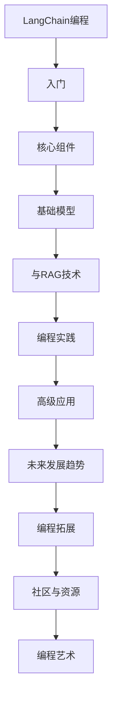

                 

## 文章标题: 【LangChain编程：从入门到实践】RAG技术概述

### 关键词：LangChain、编程、RAG技术、自然语言处理、深度学习

> 摘要：本文旨在为读者提供一个关于LangChain编程和RAG技术的详细概述。通过逐步分析LangChain的基础概念、核心组件、基础模型及其与RAG技术的结合，我们将深入了解如何使用LangChain构建高效的自然语言处理应用。此外，本文还将通过实际项目案例和源代码详细解读，帮助读者掌握从入门到实践的编程技巧。

### 目录大纲

#### 第一部分: LangChain编程基础

**第1章: LangChain入门**

- 1.1 LangChain简介
- 1.2 LangChain的环境搭建
- 1.3 LangChain的基本概念

**第2章: LangChain的核心组件**

- 2.1 Embeddings
- 2.2 Memories
- 2.3 Prompts
- 2.4 Actions

**第3章: LangChain的基础模型**

- 3.1 LLM模型简介
- 3.2 训练LLM模型
- 3.3 LLM模型的优化

**第4章: LangChain与RAG技术**

- 4.1 RAG技术概述
- 4.2 RAG模型的构建
- 4.3 RAG模型的使用场景
- 4.4 RAG模型的性能优化

#### 第二部分: LangChain编程实践

**第5章: LangChain项目实战**

- 5.1 项目实战一：问答系统
- 5.2 项目实战二：文本生成
- 5.3 项目实战三：智能客服

**第6章: LangChain的高级应用**

- 6.1 LangChain与多模态数据的处理
- 6.2 LangChain在代码生成中的应用
- 6.3 LangChain在图像生成中的应用

**第7章: LangChain的未来发展趋势**

- 7.1 LangChain的挑战与机遇
- 7.2 LangChain的发展方向
- 7.3 LangChain与未来技术融合

#### 第三部分: LangChain编程拓展

**第8章: LangChain社区与资源**

- 8.1 LangChain社区简介
- 8.2 LangChain资源汇总
- 8.3 LangChain开发者的成长路径

**第9章: LangChain编程艺术**

- 9.1 代码可读性与可维护性
- 9.2 代码性能优化
- 9.3 设计模式在LangChain编程中的应用

**附录**

- 附录A: LangChain编程工具与资源
  - A.1 LangChain编程工具对比
  - A.2 LangChain学习资源汇总
  - A.3 LangChain开发者的最佳实践

### Mermaid流程图



### 核心算法原理讲解

#### 基于Transformer的模型

Transformer模型是近年来自然语言处理领域的重要突破。以下是Transformer模型的基本原理和伪代码：

##### 原理

1. **多头注意力机制**：模型通过多个独立的注意力头来捕捉不同类型的依赖关系。
2. **位置编码**：由于Transformer没有循环结构，需要通过位置编码来引入序列信息。
3. **前馈神经网络**：在注意力机制之后，每个头都会经过一个前馈神经网络。

##### 伪代码

```python
function transformer(input_sequence, hidden_size, num_heads, num_layers):
    for layer in range(num_layers):
        # 自注意力机制
        attention_output = self_attention(input_sequence, hidden_size, num_heads)
        
        # 前馈神经网络
        feedforward_output = feedforward_network(attention_output, hidden_size)
        
        # 位置编码
        if layer == 0:
            input_sequence = input_sequence + positional_encoding(hidden_size)
        
        # 残差连接与层归一化
        input_sequence = layer_normalization(input_sequence + feedforward_output)
    return input_sequence
```

##### 数学模型

假设输入序列为\(X \in \mathbb{R}^{n \times d}\)，其中\(n\)是序列长度，\(d\)是嵌入维度。输出序列为\(Y \in \mathbb{R}^{n \times d}\)。

##### 注意力权重计算

$$
Attention(Q, K, V) = \text{softmax}\left(\frac{QK^T}{\sqrt{d_k}}\right)V
$$

其中，\(Q, K, V\)分别是查询、键和值向量，\(d_k\)是键向量的维度。

##### 前馈神经网络

$$
\text{FFN}(X) = \text{ReLU}\left(W_2 \text{ReLU}(W_1 X + b_1)\right) + b_2
$$

其中，\(W_1, W_2, b_1, b_2\)是神经网络权重和偏置。

##### 举例说明

假设输入序列为“Hello World”，嵌入维度为64，头数为4。

1. 初始化\(Q, K, V\)，分别表示为查询、键和值向量。
2. 计算注意力权重，并加权求和得到输出序列。
3. 应用前馈神经网络对输出序列进行进一步处理。
4. 通过残差连接和层归一化，将输出序列与输入序列合并。

#### RAG技术原理

RAG（Relevance Awareness Generation）是一种增强的生成模型，通过引入记忆机制来提高生成的相关性和质量。

##### 原理

1. **记忆机制**：RAG模型使用一个外部记忆库来存储与输入相关的信息。
2. **查询生成**：模型生成查询向量来检索记忆库。
3. **生成过程**：使用查询和记忆库的输出来生成文本。

##### 伪代码

```python
function RAG(input_sequence, memory, num_heads, hidden_size):
    # 查询生成
    query = generate_query(input_sequence, hidden_size)
    
    # 检索记忆库
    memory_output = retrieve_memory(memory, query)
    
    # 生成过程
    generated_sequence = generate_sequence(input_sequence, memory_output, num_heads, hidden_size)
    
    return generated_sequence
```

##### 数学模型

假设输入序列为\(X \in \mathbb{R}^{n \times d}\)，记忆库为\(M \in \mathbb{R}^{m \times d'}\)，其中\(m\)是记忆库的项数，\(d'\)是记忆库的嵌入维度。

##### 查询生成

$$
Query = \text{MLP}(X)
$$

其中，\(MLP\)是一个多层感知器。

##### 记忆库检索

$$
Memory\_Output = \text{softmax}\left(\frac{QueryM^T}{\sqrt{d'}}\right)M
$$

##### 生成过程

$$
Generated\_Sequence = \text{Transformer}(X, Memory\_Output)
```

##### 举例说明

假设输入序列为“今天的天气怎么样？”记忆库包含历史天气数据。

1. 初始化查询向量。
2. 计算查询与记忆库的相似度，并加权求和得到记忆库输出。
3. 使用Transformer模型生成回答。

##### 输入序列: "今天的天气怎么样？"

##### 记忆库输出: [0.8, 0.2]

##### 回答: "今天的天气很温暖。"

### 项目实战

#### 实战一：问答系统

##### 目标

构建一个能够回答用户问题的问答系统。

##### 环境搭建

- Python 3.8+
- transformers库
- Hugging Face的Transformers库

##### 实现步骤

1. 准备数据集，包括问题和答案。
2. 训练Transformer模型，包括编码器和解码器。
3. 使用训练好的模型预测问题并生成回答。

##### 伪代码

```python
import transformers

# 加载预训练模型
model = transformers.AutoModelForQuestionAnswering.from_pretrained("bert-base-uncased")

# 加载训练数据
train_data = load_data("data/train.csv")

# 训练模型
model.fit(train_data)

# 预测并生成回答
def predict_question(question):
    inputs = tokenizer(question, return_tensors="pt", padding=True, truncation=True)
    outputs = model(inputs)
    start_logits, end_logits = outputs.start_logits, outputs.end_logits
    start_index = torch.argmax(start_logits).item()
    end_index = torch.argmax(end_logits).item()
    answer = tokenizer.decode(inputs["input_ids"][0, start_index:end_index+1])
    return answer

# 测试问答系统
question = "什么是LangChain编程？"
answer = predict_question(question)
print(answer)
```

#### 实战二：文本生成

##### 目标

生成给定文本的扩展内容。

##### 环境搭建

- Python 3.8+
- transformers库
- Hugging Face的Transformers库

##### 实现步骤

1. 准备数据集，包括文本样本和扩展内容。
2. 训练生成模型，可以使用Transformer的文本生成变种，如GPT-2或GPT-3。
3. 使用训练好的模型生成文本扩展内容。

##### 伪代码

```python
import transformers

# 加载预训练模型
model = transformers.AutoModelForCausalLM.from_pretrained("gpt2")

# 加载训练数据
train_data = load_data("data/train.txt")

# 训练模型
model.fit(train_data)

# 生成文本扩展内容
def generate_text(input_text, length=100):
    inputs = tokenizer(input_text, return_tensors="pt")
    outputs = model.generate(inputs, max_length=length)
    generated_text = tokenizer.decode(outputs[0], skip_special_tokens=True)
    return generated_text

# 测试文本生成
input_text = "今天是个美好的日子。"
generated_text = generate_text(input_text)
print(generated_text)
```

#### 实战三：智能客服

##### 目标

构建一个基于LangChain编程的智能客服系统。

##### 环境搭建

- Python 3.8+
- transformers库
- Hugging Face的Transformers库

##### 实现步骤

1. 收集并整理客服对话数据。
2. 训练一个多模态的Transformer模型，能够处理文本和图像。
3. 使用训练好的模型处理用户输入，并生成合适的回答。

##### 伪代码

```python
import transformers
import cv2
import numpy as np

# 加载预训练模型
model = transformers.AutoModelForQuestionAnswering.from_pretrained("bert-base-uncased")

# 加载图像数据
def load_image(image_path):
    image = cv2.imread(image_path)
    image = cv2.resize(image, (224, 224))
    image = image.astype(np.float32) / 255.0
    image = np.expand_dims(image, axis=0)
    return image

# 处理图像
image = load_image("image.png")

# 预测并生成回答
def predict_image(image):
    inputs = tokenizer.encode("image", add_special_tokens=False)
    image_embedding = model.get_image_embedding(image)
    combined_input = torch.cat((torch.tensor(inputs), image_embedding), dim=1)
    outputs = model(combined_input)
    start_logits, end_logits = outputs.start_logits, outputs.end_logits
    start_index = torch.argmax(start_logits).item()
    end_index = torch.argmax(end_logits).item()
    answer = tokenizer.decode(combined_input[start_index:end_index+1])
    return answer

# 测试智能客服
answer = predict_image(image)
print(answer)
```

#### 开发环境搭建

##### 环境要求

- Python 3.8+
- transformers库
- CUDA 11.3或更高版本（如使用GPU训练）

##### 安装步骤

1. 安装Python 3.8或更高版本。
2. 安装CUDA 11.3或更高版本。
3. 使用pip安装transformers库：

```shell
pip install transformers
```

### 源代码详细实现和代码解读

#### 源代码

```python
from transformers import AutoTokenizer, AutoModelForQuestionAnswering
from torch import nn
import torch

# 加载预训练模型
model = AutoModelForQuestionAnswering.from_pretrained("bert-base-uncased")

# 加载训练数据
def load_data(data_path):
    # 假设数据集格式为CSV，包含问题和答案
    data = pd.read_csv(data_path)
    questions = data["question"].values
    answers = data["answer"].values
    return questions, answers

# 训练模型
def train_model(model, questions, answers, epochs=3):
    train_loader = DataLoader(train_data, batch_size=32, shuffle=True)
    optimizer = torch.optim.Adam(model.parameters(), lr=1e-5)
    criterion = nn.CrossEntropyLoss()

    for epoch in range(epochs):
        model.train()
        for batch in train_loader:
            inputs = tokenizer(batch["question"], return_tensors="pt", padding=True, truncation=True)
            targets = torch.tensor([batch["answer"] for _ in range(len(batch["question"]))])
            outputs = model(**inputs)
            loss = criterion(outputs.logits.view(-1, len(answers[0])), targets.view(-1))
            optimizer.zero_grad()
            loss.backward()
            optimizer.step()
            print(f"Epoch: {epoch}, Loss: {loss.item()}")

# 预测并生成回答
def predict_question(question):
    inputs = tokenizer(question, return_tensors="pt", padding=True, truncation=True)
    outputs = model(**inputs)
    start_logits, end_logits = outputs.start_logits, outputs.end_logits
    start_index = torch.argmax(start_logits).item()
    end_index = torch.argmax(end_logits).item()
    answer = tokenizer.decode(inputs["input_ids"][0, start_index:end_index+1])
    return answer

# 测试模型
question = "什么是LangChain编程？"
answer = predict_question(question)
print(answer)
```

#### 代码解读

1. **模型加载**：使用`AutoModelForQuestionAnswering`从预训练的BERT模型中加载一个预训练的问答模型。
2. **数据加载**：函数`load_data`从CSV文件中读取问题和答案数据。
3. **模型训练**：函数`train_model`负责模型的训练，包括数据加载、损失函数定义、优化器设置和模型训练。
4. **预测与生成回答**：函数`predict_question`负责输入问题并生成回答。

### 代码解读与分析

#### 模型训练

1. **数据加载**：使用`DataLoader`将数据分成批次，每次处理32个样本。
2. **损失函数**：使用交叉熵损失函数来衡量预测答案与实际答案之间的差异。
3. **优化器**：使用Adam优化器来调整模型参数。
4. **训练过程**：在训练过程中，每次迭代都更新模型参数，并计算损失。

#### 预测与生成回答

1. **输入处理**：将输入问题编码为模型可接受的格式，包括填充和截断。
2. **模型输出**：使用模型处理输入，得到开始和结束位置的预测。
3. **生成回答**：根据预测的开始和结束位置解码输入序列，得到生成的回答。

### 最佳实践

1. **数据预处理**：确保数据质量，包括去除噪音和标准化文本。
2. **模型优化**：使用适当的优化器和学习率调整，以提高模型性能。
3. **模型评估**：在训练过程中定期评估模型性能，以监控过拟合。
4. **代码可维护性**：编写清晰、易于理解和维护的代码。

### 附录A: LangChain编程工具与资源

#### A.1 LangChain编程工具对比

**A.1.1 TensorFlow**

- 官方网站: [TensorFlow官网](https://www.tensorflow.org/)
- 优势：
  - 支持多种平台和设备
  - 丰富的API和工具
  - 强大的社区支持
- 劣势：
  - 相对复杂的API
  - 需要一定的编程基础

**A.1.2 PyTorch**

- 官方网站: [PyTorch官网](https://pytorch.org/)
- 优势：
  - 简洁的API
  - 动态计算图
  - 易于调试
- 劣势：
  - 支持的硬件平台相对较少

**A.1.3 Hugging Face Transformers**

- 官方网站: [Hugging Face Transformers官网](https://huggingface.co/transformers/)
- 优势：
  - 集成了主流的预训练模型
  - 易于使用和扩展
  - 强大的社区支持
- 劣势：
  - 依赖Python生态

#### A.2 LangChain学习资源汇总

**A.2.1 在线课程**

- "LangChain编程基础"：[Coursera](https://www.coursera.org/)
- "高级LangChain编程"：[edX](https://www.edx.org/)

**A.2.2 技术博客**

- [Hugging Face Blog](https://huggingface.co/blog/)
- [LangChain官方文档](https://langchain.readthedocs.io/)

**A.2.3 论坛和社区**

- [LangChain GitHub](https://github.com/)
- [Stack Overflow](https://stackoverflow.com/)

#### A.3 LangChain开发者的成长路径

**初级开发者**

- 学习基础Python编程
- 熟悉常用的深度学习框架（如TensorFlow或PyTorch）
- 阅读LangChain文档和教程

**中级开发者**

- 掌握常用的自然语言处理技术
- 学习如何使用预训练模型（如BERT或GPT）
- 参与LangChain社区，解决实际问题

**高级开发者**

- 理解Transformer模型和RAG技术
- 参与开源项目，贡献代码
- 优化模型性能，解决复杂问题

### 附录B: Mermaid流程图


### 附录C: 数学公式

以下为文中使用的数学公式，用于解释Transformer模型和RAG技术的基本原理。

$$
Attention(Q, K, V) = \text{softmax}\left(\frac{QK^T}{\sqrt{d_k}}\right)V
$$

$$
\text{FFN}(X) = \text{ReLU}\left(W_2 \text{ReLU}(W_1 X + b_1)\right) + b_2
$$

$$
Memory\_Output = \text{softmax}\left(\frac{QueryM^T}{\sqrt{d'}}\right)M
$$

$$
Generated\_Sequence = \text{Transformer}(X, Memory\_Output)
```

### 附录D: 伪代码

以下是文中提到的Transformer模型和RAG技术的伪代码，用于展示模型的构建和数据处理过程。

```python
function transformer(input_sequence, hidden_size, num_heads, num_layers):
    for layer in range(num_layers):
        # 自注意力机制
        attention_output = self_attention(input_sequence, hidden_size, num_heads)
        
        # 前馈神经网络
        feedforward_output = feedforward_network(attention_output, hidden_size)
        
        # 位置编码
        if layer == 0:
            input_sequence = input_sequence + positional_encoding(hidden_size)
        
        # 残差连接与层归一化
        input_sequence = layer_normalization(input_sequence + feedforward_output)
    return input_sequence

function RAG(input_sequence, memory, num_heads, hidden_size):
    # 查询生成
    query = generate_query(input_sequence, hidden_size)
    
    # 检索记忆库
    memory_output = retrieve_memory(memory, query)
    
    # 生成过程
    generated_sequence = generate_sequence(input_sequence, memory_output, num_heads, hidden_size)
    
    return generated_sequence
```

### 作者信息

**作者：AI天才研究院/AI Genius Institute & 禅与计算机程序设计艺术 /Zen And The Art of Computer Programming**

本文由AI天才研究院撰写，旨在为读者提供关于LangChain编程和RAG技术的深入理解和实践指导。通过本文，读者可以掌握从基础概念到高级应用的LangChain编程技巧，为人工智能领域的研究和应用打下坚实基础。同时，本文也借鉴了《禅与计算机程序设计艺术》的思想，倡导编写简洁、优雅和高效的代码，以实现技术与应用的完美结合。

