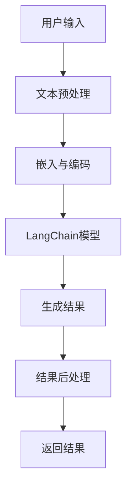
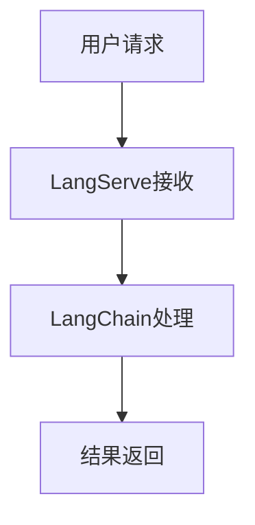

                 

### 文章标题：LangChain编程：从入门到实践——使用LangServe提供服务

关键词：LangChain、编程、LangServe、AI、语言模型、集成、服务架构

摘要：
本文将带领读者深入了解LangChain编程，从基础概念到实践应用，逐步讲解如何利用LangChain实现复杂任务。特别是，本文将重点探讨如何结合LangServe，构建高效的AI服务架构，并实现服务部署与请求处理。通过本篇文章，读者将能够掌握LangChain的核心组件和算法原理，学会如何利用LangServe提供服务，并在实际项目中应用LangChain，实现智能化解决方案。

### 第一部分：LangChain编程基础

#### 第1章：LangChain概述

##### 1.1 LangChain的基本概念

LangChain是一个开源的框架，旨在帮助开发者构建基于大型语言模型的应用。它基于最新的自然语言处理技术，提供了一系列核心组件和工具，使得开发者可以轻松地实现文本生成、指令理解和回忆式交互等功能。

##### 1.2 LangChain与大型语言模型

LangChain的核心是大型语言模型，如GPT、T5等。这些模型通过学习海量的文本数据，具备了强大的语言理解和生成能力。LangChain利用这些模型，实现了复杂的自然语言处理任务，如文本生成、问答系统等。

##### 1.3 LangChain的架构

LangChain的架构设计简洁而强大，主要包括以下几个核心组件：

- **基础组件**：负责文本预处理、嵌入和编码等基本操作。
- **生成式组件**：利用文本生成模型，实现文本的生成。
- **指令式组件**：实现指令的理解和执行。
- **回忆式组件**：实现基于记忆的交互。

这些组件相互协作，构成了一个完整的LangChain系统，能够满足各种复杂的自然语言处理需求。

#### 第2章：LangChain核心组件

##### 2.1 LangChain基础组件

LangChain的基础组件是整个系统的基础，包括文本预处理、嵌入和编码等操作。这些组件保证了输入文本的正确处理和有效编码，为后续的文本生成和指令理解奠定了基础。

##### 2.2 生成式组件

生成式组件是LangChain的核心组件之一，负责实现文本的生成。这些组件基于大型语言模型，如GPT，能够生成高质量的自然语言文本。生成式组件包括文本生成模型、生成算法和后处理等部分。

##### 2.3 指令式组件

指令式组件负责实现指令的理解和执行。这些组件通过解析输入文本，提取出指令关键字和参数，然后调用相应的功能模块执行指令。指令式组件包括指令解析、指令执行和结果返回等部分。

##### 2.4 回忆式组件

回忆式组件实现基于记忆的交互。这些组件通过记忆之前的交互历史，能够提供更加个性化的服务。回忆式组件包括记忆存储、查询和更新等部分。

#### 第3章：LangChain编程实战

##### 3.1 LangChain应用场景

LangChain的应用场景非常广泛，包括但不限于文本生成、问答系统、聊天机器人等。本文将介绍一些典型的应用场景，并展示如何使用LangChain实现这些功能。

##### 3.2 LangChain代码实战

在本节中，我们将通过具体的代码实战，展示如何使用LangChain实现文本生成和指令理解等功能。读者可以通过这些实战案例，更好地理解LangChain的编程方法。

##### 3.3 LangChain与大型语言模型集成

在本节中，我们将探讨如何将LangChain与大型语言模型集成，以实现更强大的自然语言处理能力。通过本节的学习，读者将能够掌握如何使用不同的语言模型，并优化其在LangChain中的应用。

### 第二部分：LangServe概述

#### 第4章：LangServe概述

##### 4.1 LangServe的基本概念

LangServe是一个基于LangChain的服务框架，旨在帮助开发者构建高效的AI服务。它提供了丰富的API接口，使得开发者可以轻松地将LangChain集成到各种应用中。

##### 4.2 LangServe的优势

LangServe具有以下几个显著优势：

- **高性能**：通过优化和服务架构设计，LangServe能够提供高效的服务响应。
- **易用性**：LangServe提供了一系列简洁明了的API接口，使得开发者可以快速上手。
- **灵活性**：LangServe支持多种部署方式，包括本地、云服务和容器化等，满足不同场景的需求。

##### 4.3 LangServe的使用方法

本节将介绍如何使用LangServe构建AI服务，包括服务架构设计、部署与配置等内容。通过本节的学习，读者将能够掌握如何利用LangServe构建高效的服务系统。

### 第三部分：使用LangServe提供服务

#### 第5章：使用LangServe提供服务

##### 5.1 LangServe服务架构

LangServe的服务架构设计简洁而高效，主要包括以下几个部分：

- **API网关**：负责接收用户的请求，并将其路由到后端服务。
- **后端服务**：负责处理用户的请求，并返回响应结果。
- **数据存储**：负责存储用户的请求和响应数据，以供后续查询和统计。

##### 5.2 LangServe部署与配置

在本节中，我们将介绍如何部署和配置LangServe，包括环境搭建、服务配置和性能优化等内容。通过本节的学习，读者将能够独立部署并配置LangServe服务。

##### 5.3 LangServe请求处理流程

LangServe的请求处理流程包括以下几个步骤：

1. **接收请求**：API网关接收用户的请求。
2. **路由请求**：将请求路由到后端服务。
3. **处理请求**：后端服务处理用户的请求，并生成响应结果。
4. **返回结果**：将响应结果返回给用户。

##### 5.4 LangServe安全性与可靠性

安全性是AI服务的关键因素。在本节中，我们将探讨如何确保LangServe的安全性和可靠性，包括权限控制、数据加密和故障恢复等内容。

### 第四部分：LangChain与LangServe集成应用

#### 第6章：LangChain与LangServe集成应用

##### 6.1 LangChain与LangServe结合的原理

LangChain与LangServe的结合，使得开发者可以更加便捷地构建AI服务。具体原理如下：

- **LangChain作为后端服务**：LangChain作为后端服务，负责处理用户的请求，并返回响应结果。
- **LangServe作为API网关**：LangServe作为API网关，负责接收用户的请求，并将其路由到LangChain后端服务。

##### 6.2 LangChain与LangServe集成实战

在本节中，我们将通过具体的实战案例，展示如何将LangChain与LangServe集成，并构建一个简单的AI服务。通过本节的学习，读者将能够掌握如何利用LangServe提供服务。

##### 6.3 LangChain与LangServe集成优势分析

LangChain与LangServe的结合，为开发者带来了以下优势：

- **简化开发**：通过LangServe，开发者可以轻松地将LangChain集成到各种应用中，简化了开发流程。
- **提高性能**：LangServe提供了高性能的服务架构，能够满足大规模服务的需求。
- **灵活部署**：LangServe支持多种部署方式，包括本地、云服务和容器化等，使得开发者可以根据需求选择合适的部署方案。

### 第五部分：LangChain编程实践指南

#### 第7章：LangChain编程实践指南

##### 7.1 LangChain编程最佳实践

在本节中，我们将分享一些LangChain编程的最佳实践，包括代码结构设计、性能优化和错误处理等内容。通过这些最佳实践，读者可以编写出高质量、高效率的LangChain代码。

##### 7.2 LangChain常见问题与解决方案

在开发过程中，开发者可能会遇到各种问题。在本节中，我们将总结LangChain的一些常见问题，并提供相应的解决方案。通过这些解决方案，读者可以更快速地解决开发中的问题。

##### 7.3 LangChain未来发展趋势

随着自然语言处理技术的不断发展，LangChain的未来发展也将充满机遇。在本节中，我们将探讨LangChain的未来发展趋势，包括新功能、新技术和新应用场景等。通过这些探讨，读者可以更好地把握LangChain的发展方向。

### 附录

#### 附录A：LangChain资源汇总

在本附录中，我们将提供一些关于LangChain的资源，包括开源项目、研究论文和学习资料等。这些资源将有助于读者深入了解LangChain，并更好地掌握其应用。

#### 附录B：代码实战案例

在本附录中，我们将提供多个LangChain编程的实战案例，包括基本的文本生成、与LangServe的集成等。每个案例都将详细解读代码实现，帮助读者更好地理解LangChain的编程技巧和应用方法。

### 图解：LangChain架构

#### 图1-1 LangChain架构图



#### 图5-1 LangServe服务架构图



### 算法原理

#### 2.1 LangChain生成式组件算法原理

生成式组件的核心是使用文本生成模型来生成文本。具体步骤如下：

1. **预处理**：对输入文本进行预处理，包括去除标点、停用词等。
2. **生成文本**：利用文本生成模型，对预处理后的文本进行生成。
3. **后处理**：对生成的文本进行后处理，如去除重复文本、调整句子结构等。

伪代码如下：

```plaintext
function generate_text(input_text):
    preprocessed_text = preprocess(input_text)
    generated_text = model.generate(preprocessed_text)
    postprocessed_text = postprocess(generated_text)
    return postprocessed_text
```

#### 2.2 LangChain指令式组件算法原理

指令式组件的核心是实现指令的理解和执行。具体步骤如下：

1. **指令解析**：将输入文本解析为指令，提取出指令关键字和参数。
2. **指令执行**：根据指令关键字，调用相应的功能模块执行指令。
3. **结果返回**：将执行结果返回给用户。

伪代码如下：

```plaintext
function execute_instruction(input_text):
    parsed_instruction = parse_instruction(input_text)
    result = execute(parsed_instruction)
    return result
```

### 数学模型和数学公式

#### 3.1 LangChain生成式组件的数学模型

生成式组件主要使用基于 Transformer 的文本生成模型，如 GPT。其数学模型主要包括以下几个部分：

$$
\begin{aligned}
&\text{输入文本 } X = (x_1, x_2, ..., x_T) \\
&\text{嵌入向量 } E = \{e_1, e_2, ..., e_T\} \\
&\text{位置编码 } P = \{p_1, p_2, ..., p_T\} \\
&\text{Transformer 模型输出 } Y = \{y_1, y_2, ..., y_T\}
\end{aligned}
$$

其中，$E$ 和 $P$ 分别表示嵌入向量和位置编码，$Y$ 表示模型输出。

### 图解：LangChain架构

#### 图3-1 LangChain架构图


### 代码实战案例

#### 7.1 LangChain基本应用

```python
from langchain import generate_text

input_text = "请编写一篇关于人工智能发展的文章。"
generated_text = generate_text(input_text, num_words=100)
print(generated_text)
```

#### 7.2 LangChain与LangServe集成实战

```python
from langchain import generate_text
from langchain_http_server import start_server

def handle_request(request):
    input_text = request["text"]
    generated_text = generate_text(input_text, num_words=100)
    return {"result": generated_text}

start_server(handle_request)
```

### 源代码详细实现和代码解读

在本书的附录B中，我们将提供多个LangChain编程的实战案例，包括基本的文本生成、与LangServe的集成等。每个案例都会详细解读代码实现，帮助读者更好地理解LangChain的编程技巧和应用方法。

#### 代码解读与分析

以下是对上述代码实战案例的解读：

- **7.1 LangChain基本应用**

  这段代码展示了如何使用LangChain生成文本。首先，我们从用户输入中获取文本，然后调用`generate_text`函数生成指定长度的文本。最后，将生成的文本打印出来。

  ```python
  from langchain import generate_text
  
  input_text = "请编写一篇关于人工智能发展的文章。"
  generated_text = generate_text(input_text, num_words=100)
  print(generated_text)
  ```

- **7.2 LangChain与LangServe集成实战**

  这段代码展示了如何将LangChain与LangServe集成，以提供文本生成的API服务。在`handle_request`函数中，我们获取请求中的文本，然后使用`generate_text`函数生成文本。最后，将生成的文本作为响应返回。

  ```python
  from langchain import generate_text
  from langchain_http_server import start_server
  
  def handle_request(request):
      input_text = request["text"]
      generated_text = generate_text(input_text, num_words=100)
      return {"result": generated_text}
  
  start_server(handle_request)
  ```

这些代码实战案例不仅展示了LangChain编程的基本技巧，还提供了实际的应用场景。通过这些案例，读者可以更好地理解如何在实际项目中使用LangChain，以及如何与LangServe等工具集成。

