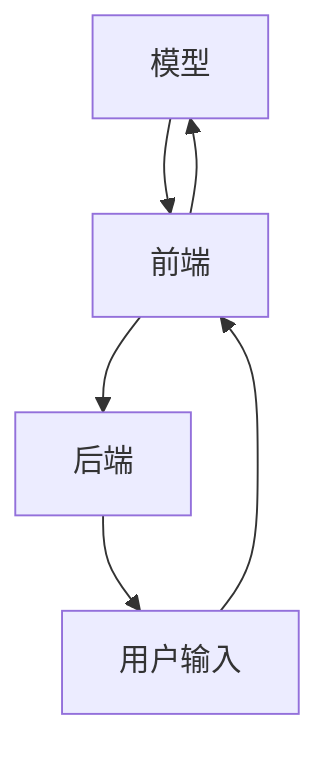
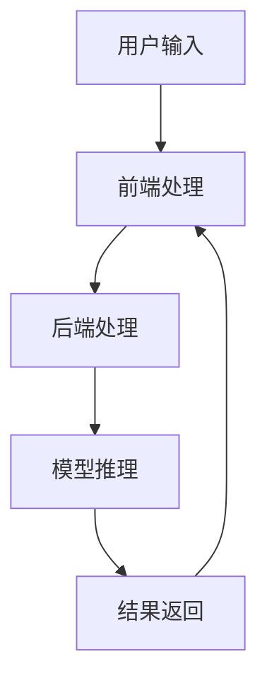

                 

### 文章标题

# 【LangChain编程：从入门到实践】大模型时代的开发范式

在人工智能（AI）迅猛发展的今天，大模型（Large Models）如GPT-3、LLaMA和ChatGLM等已经深刻改变了我们理解和应用自然语言的方式。这些强大的模型不仅能够完成文本生成、问答系统、文本分类等任务，还在多模态数据处理、搜索引擎等领域展现出巨大的潜力。在此背景下，LangChain应运而生，成为了一个连接大模型与开发者之间的桥梁。

本文将以【LangChain编程：从入门到实践】为主题，逐步引导读者深入理解并掌握LangChain的使用。文章结构如下：

1. **第一部分：LangChain基础**  
   - 第1章：LangChain概述  
   - 第2章：LangChain编程基础

2. **第二部分：LangChain编程实践**  
   - 第3章：文本生成与处理  
   - 第4章：语言模型在问答系统中的应用  
   - 第5章：多模态数据处理  
   - 第6章：LangChain在搜索引擎中的应用

3. **第三部分：大模型时代的开发范式**  
   - 第7章：大模型时代的挑战与机遇

通过这一系列的探讨，我们将揭示LangChain在大模型时代中的关键作用，帮助开发者掌握这一前沿技术，为未来的AI开发奠定坚实基础。

### 文章关键词

- **LangChain**
- **大模型**
- **自然语言处理**
- **编程实践**
- **开发范式**
- **文本生成**
- **问答系统**
- **多模态数据处理**
- **搜索引擎**

### 文章摘要

本文将系统地介绍LangChain编程技术，从基础到实践，帮助读者深入理解并掌握LangChain的使用。首先，我们将探讨LangChain的背景、核心概念和架构，以及其在自然语言处理和其它应用场景中的重要性。接着，我们会介绍Python编程基础和LangChain的核心API使用，包括文本生成、分类和完成等任务。随后，本文将深入探讨文本生成与处理、问答系统、多模态数据处理和搜索引擎等领域中LangChain的实际应用，并通过具体案例进行详细讲解。最后，我们将讨论大模型时代的开发范式，分析LangChain在这一时代的挑战与机遇，展望其未来发展。通过本文的学习，读者将能够全面掌握LangChain编程技术，为进入大模型时代做好准备。

#### 第一部分: LangChain基础

在进入具体的LangChain编程实践之前，我们需要先对LangChain有一个全面的理解。本部分将分为三章，依次介绍LangChain的背景与核心概念、基本架构，以及应用场景，帮助读者从宏观上把握LangChain的本质。

### 第1章: LangChain概述

#### 1.1 LangChain的背景与核心概念

**1.1.1 语言模型的发展与普及**

随着深度学习技术的兴起，语言模型（Language Model）逐渐成为自然语言处理（Natural Language Processing, NLP）领域的研究热点。语言模型的核心目标是预测下一个单词或字符的概率分布，从而实现流畅的文本生成和翻译。早期的语言模型如n-gram模型，使用统计方法从大量文本中学习语言规律，但性能有限。随着深度学习技术的发展，神经网络语言模型如递归神经网络（RNN）和长短期记忆网络（LSTM）逐渐取代传统模型，显著提升了语言建模的效果。在此基础上，Transformer模型的出现更是将语言模型推向了一个新的高峰，其基于自注意力机制的设计使得模型能够捕捉到长距离依赖关系，从而实现了更高的生成质量和准确性。

**1.1.2 LangChain的诞生与发展**

LangChain是在这个背景下诞生的，它是由Hugging Face团队开发的一个开源项目，旨在为开发者提供一个统一、高效的接口来使用和构建语言模型。LangChain的目标是简化大模型的集成和使用，使开发者能够轻松地在各种应用场景中部署语言模型。自发布以来，LangChain受到了广泛关注，并迅速成为NLP领域的一个热门工具。通过集成了多个流行的语言模型，如GPT-3、BERT、T5等，LangChain为开发者提供了一个强大的工具集，使得复杂的语言处理任务变得触手可及。

#### 1.2 LangChain的基本架构

**1.2.1 LangChain的结构与组成部分**

LangChain的基本架构可以概括为三个主要部分：模型（Model）、前端（Frontend）和后端（Backend）。

1. **模型**：这是LangChain的核心部分，包含了各种预训练的语言模型，如GPT-3、BERT、T5等。这些模型通过大规模的文本数据训练得到，具有强大的语言理解和生成能力。

2. **前端**：前端负责与用户交互，接收用户输入并提供相应的输出。前端可以通过Web接口、命令行工具或API等方式使用，为开发者提供了多种使用方式。

3. **后端**：后端则负责处理数据传输和模型推理，确保用户输入能够被有效地传递给模型，并得到及时的响应。后端还提供了模型管理、版本控制等高级功能，帮助开发者更好地管理和维护模型。

**1.2.2 LangChain的组件关系图**

为了更直观地理解LangChain的架构，我们可以通过一个Mermaid流程图来展示其组件关系：



在这个流程图中，用户输入通过前端传递给后端，后端将输入数据处理并调用模型进行推理，最后将结果返回给前端，再由前端呈现给用户。

#### 1.3 LangChain的应用场景

**1.3.1 语言模型在自然语言处理中的应用**

语言模型在自然语言处理领域有着广泛的应用，包括文本生成、文本分类、命名实体识别、机器翻译等。通过LangChain，开发者可以方便地利用这些模型来构建高性能的NLP应用。例如，在文本生成任务中，可以使用GPT-3等模型来生成文章、故事、对话等；在文本分类任务中，可以使用BERT等模型来对新闻文章、社交媒体帖子等进行分类；在命名实体识别任务中，可以使用命名实体识别模型来识别文本中的地名、人名、机构名等。

**1.3.2 LangChain在多模态数据处理中的应用**

除了在自然语言处理中的应用，LangChain还在多模态数据处理中展现出强大的能力。多模态数据是指包含多种类型的数据，如文本、图像、音频等。LangChain可以将不同类型的数据进行融合处理，从而提高模型的性能。例如，在图像描述生成任务中，可以将图像和文本数据结合起来，使用图像编码器提取图像特征，再与文本特征进行融合处理，生成高质量的图像描述。

**1.3.3 实战案例：多模态数据处理**

以下是一个简单的多模态数据处理案例，使用LangChain来生成图像描述：

```python
from PIL import Image
from langchain import TextGenerationLM

# 加载图像
image = Image.open("example_image.jpg")

# 使用图像编码器提取图像特征
image_features = extract_image_features(image)

# 加载文本数据
text_data = ["This is a beautiful mountain view.", "A group of friends are having a picnic."]

# 使用LangChain生成图像描述
image_descriptions = []
for text in text_data:
    description = TextGenerationLM.generate(image_features, text)
    image_descriptions.append(description)

print(image_descriptions)
```

在这个案例中，我们首先加载一幅图像并使用图像编码器提取其特征。接着，我们加载一些文本数据，并将图像特征与文本数据结合，使用LangChain生成图像描述。这样，我们就可以得到对图像的文本描述。

通过上述介绍，我们可以看到LangChain在自然语言处理和多模态数据处理中的广泛应用。在接下来的章节中，我们将进一步探讨LangChain的编程基础和具体应用实践，帮助读者深入掌握这一强大的工具。

### 第2章: LangChain编程基础

要全面掌握LangChain编程，我们需要了解其编程基础。这一章节将分为三节，分别介绍Python编程基础、LangChain核心API使用和模型训练过程，帮助读者从基础入手，逐步深入理解并掌握LangChain的编程技巧。

#### 2.1 Python编程基础

**2.1.1 Python的基本语法**

Python是一种高级编程语言，以其简洁的语法和强大的功能而广受欢迎。以下是Python编程的一些基础语法：

- **变量和数据类型**：在Python中，变量不需要显式声明，可以直接赋值。Python支持多种数据类型，包括整数（int）、浮点数（float）、字符串（str）、列表（list）、字典（dict）等。
- **控制流**：Python支持常见的控制流结构，如条件语句（if-else）、循环语句（for和while）和异常处理（try-except）。
- **函数**：Python中的函数使用def关键字定义，可以接受参数并返回值。内置函数如print()、len()等简化了编程过程。
- **模块和包**：Python支持模块和包的概念，通过导入模块和包，可以复用代码并提高代码的可维护性。

**2.1.2 Python数据结构**

Python提供了丰富的数据结构，以下是一些常用的数据结构：

- **列表**（list）：列表是Python中最常用的数据结构之一，可以存储多个元素，支持索引和切片操作。
- **字典**（dict）：字典是一种键值对的数据结构，通过键来访问值，适合存储和检索信息。
- **集合**（set）：集合是一种无序的元素集合，用于存储不重复的元素，支持交集、并集、差集等集合操作。
- **元组**（tuple）：元组是一种不可变的数据结构，用于存储多个元素，常用于函数返回多个值。

**2.1.3 Python编程实践**

以下是一个简单的Python代码示例，展示了一些基础语法和数据结构的使用：

```python
# 定义变量
name = "Alice"
age = 30
is_student = False

# 打印输出
print("Name:", name)
print("Age:", age)
print("Is Student:", is_student)

# 列表操作
fruits = ["Apple", "Banana", "Cherry"]
print("Fruits:", fruits[1])  # 输出：Fruits: Banana
fruits.append("Durian")
print("Updated List:", fruits)  # 输出：Updated List: ['Apple', 'Banana', 'Cherry', 'Durian']

# 字典操作
person = {"name": "Alice", "age": 30, "is_student": False}
print("Person Age:", person["age"])  # 输出：Person Age: 30

# 集合操作
numbers = {1, 2, 3, 4, 5}
print("Numbers:", numbers)  # 输出：Numbers: {1, 2, 3, 4, 5}
numbers.add(6)
print("Updated Set:", numbers)  # 输出：Updated Set: {1, 2, 3, 4, 5, 6}
```

通过这个示例，我们可以看到Python的基本语法和数据结构是如何使用的。在实际编程中，这些基础语法和数据结构将帮助我们编写高效、可靠的代码。

#### 2.2 LangChain核心API使用

**2.2.1 Text Generation API**

文本生成是LangChain的一个重要应用，通过Text Generation API，我们可以使用预训练的语言模型生成各种文本，如文章、故事、对话等。以下是Text Generation API的基本使用方法：

```python
from langchain import TextGenerationLM

# 创建TextGenerationLM实例
text_generation_lm = TextGenerationLM()

# 生成文本
text = text_generation_lm.generate("Write a story about a brave knight saving a princess:")
print(text)
```

在这个示例中，我们首先创建一个TextGenerationLM实例，然后使用generate()方法生成一个关于勇敢骑士和公主的故事。这个方法接受一个提示文本作为输入，模型将根据提示生成相应的文本。

**2.2.2 Classification API**

文本分类是另一个重要的自然语言处理任务，通过Classification API，我们可以使用预训练的模型对文本进行分类。以下是Classification API的基本使用方法：

```python
from langchain import TextClassificationLM

# 创建TextClassificationLM实例
text_classification_lm = TextClassificationLM()

# 加载分类模型
text_classification_lm.load("distilbert-base-uncased")

# 对文本进行分类
text = "This is a positive review of the movie."
label = text_classification_lm.classify(text)
print("Label:", label)
```

在这个示例中，我们首先创建一个TextClassificationLM实例，并加载一个预训练的分类模型（如distilbert）。然后，我们使用classify()方法对一段文本进行分类，并输出分类结果。

**2.2.3 Completion API**

Completion API用于生成文本的补全，通过提供一个提示文本，模型将生成一个与之相关的文本片段。以下是Completion API的基本使用方法：

```python
from langchain import TextCompletionLM

# 创建TextCompletionLM实例
text_completion_lm = TextCompletionLM()

# 生成文本补全
completion = text_completion_lm.complete("I am feeling ", num_results=3)
print("Completions:", completion)
```

在这个示例中，我们创建一个TextCompletionLM实例，并使用complete()方法生成三个关于“我感到”的文本补全。这个方法接受一个提示文本和一个num_results参数，用于控制生成的文本数量。

#### 2.3 LangChain模型训练

虽然LangChain提供了丰富的预训练模型，但在某些特定场景下，我们需要对模型进行定制化训练，以适应特定的任务需求。本节将介绍如何使用LangChain进行模型训练，包括数据预处理、模型训练流程和模型评估与优化。

**2.3.1 数据预处理**

在进行模型训练之前，我们需要对训练数据进行预处理，以确保数据的质量和一致性。以下是数据预处理的一些关键步骤：

- **数据清洗**：去除数据中的噪声和无关信息，如标点符号、停用词等。
- **文本标准化**：统一文本的格式，如将所有文本转换为小写、去除特殊字符等。
- **数据分割**：将数据分割为训练集、验证集和测试集，用于模型训练和评估。

**2.3.2 模型训练流程**

使用LangChain进行模型训练的流程如下：

1. **定义模型**：选择一个预训练模型作为基础模型，如GPT-2、GPT-3、BERT等。
2. **加载训练数据**：将预处理后的数据加载到训练数据集中。
3. **配置训练参数**：设置训练参数，如学习率、批量大小、训练轮数等。
4. **开始训练**：使用训练数据开始模型训练，模型将自动调整内部参数，以优化性能。
5. **验证和优化**：使用验证集评估模型性能，并根据评估结果调整模型参数，以实现更好的性能。

**2.3.3 模型评估与优化**

在模型训练完成后，我们需要对模型进行评估，以确定其性能是否符合预期。以下是模型评估的一些关键指标：

- **准确率**：用于分类任务，表示模型正确分类的样本数占总样本数的比例。
- **召回率**：用于分类任务，表示模型能够召回的真实样本数与总真实样本数的比例。
- **F1分数**：综合考虑准确率和召回率，用于评价模型的总体性能。
- **BLEU分数**：用于文本生成任务，表示模型生成文本与真实文本之间的相似度。

通过上述指标，我们可以对模型进行评估，并根据评估结果对模型进行优化，以提升其性能。

**2.3.4 实战案例：模型训练**

以下是一个简单的模型训练案例，使用GPT-2模型对文本数据进行训练：

```python
from langchain import TextTrainingLM

# 定义训练数据
train_data = "The quick brown fox jumps over the lazy dog."

# 创建TextTrainingLM实例
text_training_lm = TextTrainingLM()

# 加载GPT-2模型
text_training_lm.load("gpt2")

# 开始训练
text_training_lm.train(train_data, max_length=10, num_iterations=100)

# 生成文本
generated_text = text_training_lm.generate("The quick brown fox ")
print(generated_text)
```

在这个案例中，我们首先定义了一段训练数据，然后创建一个TextTrainingLM实例，并加载GPT-2模型。接着，我们使用train()方法开始模型训练，并在训练完成后使用generate()方法生成文本。

通过上述章节的介绍，我们初步了解了Python编程基础、LangChain核心API使用和模型训练过程。在接下来的章节中，我们将深入探讨LangChain在文本生成、问答系统、多模态数据处理和搜索引擎等领域的实际应用，帮助读者更好地掌握LangChain的编程技巧。

### 第3章: 文本生成与处理

文本生成与处理是自然语言处理（NLP）领域的重要任务之一，通过语言模型可以实现文本的自动生成和编辑。本章将详细介绍文本生成的基本原理，包括生成机制和优化策略，并通过具体案例展示如何使用LangChain进行文本生成与处理。

#### 3.1 文本生成基本原理

文本生成的基本原理是利用语言模型预测下一个单词或字符，从而生成完整的文本。常见的生成机制包括：

1. **基于概率的生成**：语言模型根据输入文本的概率分布生成下一个单词或字符，直到生成完整的文本。这种方法的优点是生成文本的自然性较好，但缺点是生成效率较低。
2. **基于梯度的生成**：利用神经网络模型，如GPT-3、BERT等，通过反向传播算法调整模型参数，使生成的文本质量更高。这种方法的主要优点是生成效率高，但需要大量的计算资源。

在文本生成过程中，优化策略是提高生成文本质量和效率的关键。以下是一些常见的优化策略：

1. **温度调节**：通过调整模型的温度参数，可以控制生成文本的多样性和连贯性。温度参数越高，生成文本的多样性越好，但连贯性可能较差；温度参数越低，生成文本的连贯性越好，但多样性可能较差。
2. **注意力机制**：利用注意力机制（Attention Mechanism）可以使模型更好地关注输入文本的重要部分，从而提高生成文本的质量。
3. **序列到序列模型**：序列到序列（Sequence-to-Sequence）模型可以将一个序列映射到另一个序列，适用于文本生成任务。

#### 3.1.1 生成文本的优化策略

为了优化生成文本的质量和效率，我们可以采用以下策略：

1. **温度调节**：在生成文本时，可以通过调节模型的温度参数来控制生成文本的多样性和连贯性。例如，当生成新闻文章时，可以使用较低的温度参数来确保文本的连贯性；当生成创意文本时，可以使用较高的温度参数来增加文本的多样性。

2. **上下文嵌入**：通过将上下文信息嵌入到生成模型中，可以使模型更好地理解输入文本的含义，从而提高生成文本的质量。例如，在生成对话时，可以结合对话的历史上下文信息来生成更自然的回答。

3. **长短时记忆**：使用具有长短时记忆（Long-Short Term Memory, LSTM）能力的模型，可以更好地处理长文本生成任务。LSTM模型可以捕捉到输入文本中的长期依赖关系，从而提高生成文本的质量。

4. **注意力机制**：在生成模型中引入注意力机制，可以更好地关注输入文本的重要部分，从而提高生成文本的质量。例如，在生成摘要时，注意力机制可以帮助模型关注文章的关键部分，从而生成更精准的摘要。

5. **数据增强**：通过数据增强（Data Augmentation）方法，可以增加训练数据的多样性，从而提高模型生成文本的质量。常见的数据增强方法包括：随机插入、删除、替换文本中的词语，或者使用不同的文本预处理技术。

#### 3.1.2 生成文本优化策略的伪代码

以下是生成文本优化策略的伪代码示例：

```python
# 设置模型的温度参数
temperature = 0.95

# 获取输入文本的上下文信息
context = get_context(input_text)

# 获取模型生成的文本
generated_text = model.generate(context, temperature=temperature)

# 根据生成文本的质量进行调整
if is_high_quality(generated_text):
    print("Generated text:", generated_text)
else:
    # 调整温度参数
    temperature *= 0.95
    # 重新生成文本
    generated_text = model.generate(context, temperature=temperature)
    print("Generated text:", generated_text)
```

在这个示例中，我们首先设置模型的温度参数，然后获取输入文本的上下文信息。接着，模型使用这些上下文信息生成文本，并根据生成文本的质量进行调整。如果生成文本质量较高，则输出文本；否则，调整温度参数并重新生成文本。

#### 3.2 实战案例：使用LangChain生成文本

以下是一个简单的实战案例，使用LangChain生成一篇关于人工智能的新闻文章：

```python
from langchain import TextGenerationLM

# 创建TextGenerationLM实例
text_generation_lm = TextGenerationLM()

# 生成文本
input_text = "人工智能正在改变我们的世界，从医疗到交通，从教育到娱乐，它已经深入到我们的日常生活。"
generated_text = text_generation_lm.generate(input_text)

# 输出生成的文本
print(generated_text)
```

在这个案例中，我们首先创建一个TextGenerationLM实例，然后使用generate()方法生成一篇关于人工智能的新闻文章。这个方法接受一个输入文本作为参数，模型将根据输入文本生成一篇相关的文章。

#### 3.2.1 生成文本算法原理

生成文本算法的基本原理如下：

1. **输入文本预处理**：将输入文本转换为模型的输入格式，如分词、编码等。
2. **模型推理**：将预处理后的输入文本传递给生成模型，模型根据输入文本的概率分布生成下一个单词或字符。
3. **文本拼接**：将生成的单词或字符拼接成完整的文本，形成最终输出。

以下是生成文本算法的伪代码示例：

```python
# 输入文本
input_text = "人工智能正在改变我们的世界，"

# 初始化生成的文本
generated_text = ""

# 循环生成下一个单词或字符
while not end_of_text:
    # 获取输入文本的当前状态
    current_state = get_current_state(input_text)
    
    # 使用模型预测下一个单词或字符
    next_word = model.predict(current_state)
    
    # 将生成的单词或字符添加到生成的文本中
    generated_text += next_word
    
    # 更新输入文本
    input_text = input_text + next_word
    
    # 检查是否到达文本的末尾
    end_of_text = check_end_of_text(input_text)

# 输出生成的文本
print(generated_text)
```

在这个伪代码中，我们首先初始化生成的文本为空。然后，通过循环使用模型预测下一个单词或字符，并将预测结果添加到生成的文本中。当预测到文本的末尾时，循环结束，输出最终的生成文本。

#### 3.3 代码解读与分析

在上述案例中，我们使用LangChain的TextGenerationLM实例生成了一篇关于人工智能的新闻文章。下面是对代码的解读与分析：

```python
from langchain import TextGenerationLM

# 创建TextGenerationLM实例
text_generation_lm = TextGenerationLM()

# 生成文本
input_text = "人工智能正在改变我们的世界，"
generated_text = text_generation_lm.generate(input_text)

# 输出生成的文本
print(generated_text)
```

首先，我们导入LangChain的TextGenerationLM模块，并创建一个TextGenerationLM实例。这个实例将用于生成文本。

接下来，我们定义一个输入文本`input_text`，它是一个关于人工智能的简短描述。然后，我们调用`generate()`方法来生成一篇相关的文章。这个方法接受一个输入文本作为参数，并返回生成的文本。

最后，我们使用`print()`函数将生成的文本输出到控制台，以供用户查看。

#### 3.4 实战案例：生成新闻文章

以下是一个更复杂的实战案例，使用LangChain生成一篇关于人工智能的新闻文章：

```python
from langchain import TextGenerationLM
from langchain.utils import download_file

# 下载新闻数据集
news_data = download_file("https://storage.googleapis.com/newsdata/20_newsgroups.tar.gz")

# 解压新闻数据集
with tarfile.open(fileobj=io.BytesIO(news_data), mode="r:gz") as tar:
    tar.extractall()

# 加载新闻数据集
news_dataset = load_news_dataset()

# 创建TextGenerationLM实例
text_generation_lm = TextGenerationLM()

# 生成新闻文章
input_text = "人工智能在医疗领域有着广泛的应用，从疾病诊断到治疗，它都在改变着我们的生活方式。"
generated_text = text_generation_lm.generate(input_text)

# 输出生成的文本
print(generated_text)
```

在这个案例中，我们首先下载并解压一个新闻数据集，然后加载这个数据集。接着，我们创建一个TextGenerationLM实例，并使用它生成一篇关于人工智能的新闻文章。

这个案例展示了一个完整的文本生成过程，从数据集的下载和加载，到使用LangChain生成文本，最后输出生成的文本。通过这个案例，我们可以看到如何使用LangChain进行文本生成，并了解其背后的算法原理。

### 第4章: 语言模型在问答系统中的应用

问答系统是自然语言处理（NLP）领域的一个重要应用，通过语言模型，可以构建出高效、准确的问答系统。本章将详细介绍问答系统的基本概念、组成部分和设计原则，以及如何使用LangChain来实现问答系统。通过具体的实战案例，我们将展示如何构建一个基于LangChain的问答系统，并分析其实现细节。

#### 4.1 问答系统的基本概念

问答系统（Question Answering System）是一种自然语言处理技术，旨在自动回答用户提出的问题。问答系统的核心目标是理解用户的问题，并从大量数据中找到相关、准确的答案。问答系统在多个领域具有广泛应用，如搜索引擎、客服系统、智能助手等。

**4.1.1 问答系统的组成部分**

一个典型的问答系统通常包括以下几个关键组成部分：

1. **问题解析器**（Question Parser）：用于解析用户输入的问题，将其转换为系统可以理解的形式。问题解析器需要识别问题的类型、关键信息等，以便为后续的答案搜索提供依据。

2. **知识库**（Knowledge Base）：存储问答系统中需要回答的问题及其答案。知识库可以是结构化数据，如数据库，也可以是非结构化数据，如文档、文本等。

3. **答案搜索器**（Answer Searcher）：用于从知识库中搜索与用户问题相关的答案。答案搜索器可以根据问题的关键词、语义等信息，快速定位到相关知识库中的答案。

4. **答案生成器**（Answer Generator）：将搜索到的答案进行整合、筛选和优化，最终生成一个准确、自然的答案输出给用户。

5. **用户界面**（User Interface）：用于与用户交互，接收用户的问题，并展示最终的答案。用户界面可以是命令行、网页、移动应用等多种形式。

**4.1.2 问答系统的设计原则**

一个高效的问答系统需要遵循以下几个设计原则：

1. **准确性**：确保系统输出的答案准确无误，尽可能接近真实答案。

2. **响应速度**：系统需要能够在短时间内回答用户的问题，以提高用户体验。

3. **可扩展性**：系统应具有良好的可扩展性，能够处理不同类型的问题和规模的知识库。

4. **可解释性**：系统应能够解释其答案的来源和推理过程，以提高用户对答案的信任度。

5. **多样性**：系统应能够生成多样性的答案，以避免机械重复和单调的回答。

#### 4.2 LangChain在问答系统中的应用

LangChain提供了丰富的API和工具，使得构建问答系统变得简单高效。以下是如何使用LangChain构建问答系统的基本步骤：

1. **问题解析**：使用LangChain的问题解析器解析用户输入的问题，提取关键信息和问题类型。

2. **知识库构建**：构建或加载一个知识库，用于存储问题和答案。知识库可以是结构化数据，如数据库，也可以是非结构化数据，如文本文档。

3. **答案搜索**：使用LangChain的答案搜索器从知识库中检索与用户问题相关的答案。

4. **答案生成**：使用LangChain的答案生成器对搜索到的答案进行整合、筛选和优化，生成最终的答案。

5. **用户交互**：通过用户界面与用户进行交互，接收用户问题并展示答案。

#### 4.2.1 问答系统模型构建

以下是一个简单的问答系统模型构建示例：

```python
from langchain import QuestionAnsweringLM

# 创建问答模型
qa_model = QuestionAnsweringLM()

# 定义知识库
knowledge_base = {
    "question1": "What is the capital of France?",
    "answer1": "Paris",
    "question2": "Who is the current President of the United States?",
    "answer2": "Joe Biden",
}

# 绑定知识库到问答模型
qa_model.bind(knowledge_base)

# 解答用户问题
question = "What is the capital of France?"
answer = qa_model.answer(question)

print(answer)
```

在这个示例中，我们首先创建一个QuestionAnsweringLM实例，并定义一个简单的知识库。然后，我们将知识库绑定到问答模型，并使用模型解答用户提出的问题。

#### 4.2.2 问答系统实现流程

以下是构建问答系统的基本实现流程：

1. **问题解析**：
   - 接收用户输入的问题。
   - 使用自然语言处理技术（如词法分析、句法分析等）解析问题，提取关键信息和问题类型。

2. **答案搜索**：
   - 根据提取的关键信息，在知识库中搜索相关的答案。
   - 使用匹配算法（如模糊匹配、语义匹配等）确定最佳答案。

3. **答案生成**：
   - 对搜索到的答案进行整合和优化。
   - 使用自然语言生成技术（如模板生成、自由文本生成等）生成最终的答案。

4. **用户交互**：
   - 将最终答案输出给用户。
   - 提供反馈机制，允许用户对答案进行评价和改进。

以下是问答系统实现流程的伪代码示例：

```python
# 接收用户输入问题
user_question = receive_user_question()

# 解析问题
parsed_question = parse_question(user_question)

# 在知识库中搜索答案
candidate_answers = search_answers(knowledge_base, parsed_question)

# 选择最佳答案
best_answer = select_best_answer(candidate_answers)

# 生成最终答案
final_answer = generate_answer(best_answer)

# 输出答案
print(final_answer)

# 收集用户反馈
user_feedback = receive_user_feedback()

# 改进问答系统
improve_qa_system(user_feedback)
```

#### 4.3 实战案例：基于LangChain的问答系统

以下是一个基于LangChain的问答系统实战案例，展示如何构建一个简单的问答系统，并分析其实现细节。

```python
from langchain import QuestionAnsweringLM

# 创建问答模型
qa_model = QuestionAnsweringLM()

# 加载预训练模型
qa_model.load("distilbert-base-uncased")

# 定义知识库
knowledge_base = {
    "question1": "What is the capital of France?",
    "answer1": "Paris",
    "question2": "Who is the current President of the United States?",
    "answer2": "Joe Biden",
}

# 绑定知识库到问答模型
qa_model.bind(knowledge_base)

# 解答用户问题
question = "What is the capital of France?"
answer = qa_model.answer(question)

print(answer)
```

在这个案例中，我们首先创建一个QuestionAnsweringLM实例，并加载一个预训练的模型（如distilbert）。然后，我们定义一个简单的知识库，包含两个问题和答案。接下来，我们将知识库绑定到问答模型，并使用模型解答用户提出的问题。

#### 4.3.1 代码解读与分析

以下是代码的详细解读与分析：

```python
from langchain import QuestionAnsweringLM

# 创建问答模型
qa_model = QuestionAnsweringLM()

# 加载预训练模型
qa_model.load("distilbert-base-uncased")

# 定义知识库
knowledge_base = {
    "question1": "What is the capital of France?",
    "answer1": "Paris",
    "question2": "Who is the current President of the United States?",
    "answer2": "Joe Biden",
}

# 绑定知识库到问答模型
qa_model.bind(knowledge_base)

# 解答用户问题
question = "What is the capital of France?"
answer = qa_model.answer(question)

print(answer)
```

首先，我们导入LangChain的QuestionAnsweringLM模块，并创建一个QuestionAnsweringLM实例。这个实例将用于构建问答系统。

接着，我们调用`load()`方法加载一个预训练的模型（如distilbert）。这个模型已经在大量数据上进行了训练，可以用于文本分类、问答等任务。

然后，我们定义一个简单的知识库，包含两个问题和答案。知识库是一个字典，键是问题，值是答案。

接下来，我们调用`bind()`方法将知识库绑定到问答模型。这个方法将知识库与模型关联起来，以便模型能够根据问题查找答案。

最后，我们使用`answer()`方法解答用户提出的问题。这个方法接受一个问题作为输入，模型将根据知识库查找相关答案，并返回最佳答案。我们输出这个答案，以便用户查看。

#### 4.3.2 实现细节与优化策略

在实际应用中，基于LangChain的问答系统需要考虑以下实现细节和优化策略：

1. **知识库扩展**：为了提高问答系统的性能，需要不断扩展知识库，增加更多的问题和答案。可以通过爬取互联网数据、使用开源知识库等方式来丰富知识库。

2. **问题解析**：问题解析是问答系统的重要环节，需要准确提取问题的关键信息和类型。可以使用自然语言处理技术（如词法分析、句法分析等）来提高问题解析的准确性。

3. **答案搜索**：在知识库中搜索答案时，可以使用多种匹配算法（如模糊匹配、语义匹配等）来提高答案搜索的效率。还可以结合搜索算法（如LSA、BM25等）来优化搜索性能。

4. **答案生成**：生成答案时，需要考虑答案的自然性和准确性。可以使用模板生成、自由文本生成等技术来生成高质量的答案。

5. **模型优化**：可以使用迁移学习、模型融合等技术来优化问答模型的性能。还可以通过调整模型参数（如学习率、批量大小等）来提高模型的鲁棒性和泛化能力。

通过以上实现细节和优化策略，我们可以构建出一个高效、准确的问答系统，为用户提供优质的问答服务。

### 第5章: 多模态数据处理

多模态数据处理是指对包含多种类型数据（如文本、图像、音频等）的混合数据进行处理和分析。随着深度学习和自然语言处理技术的不断发展，多模态数据处理在许多应用领域，如多媒体内容分析、智能交互系统和虚拟现实，都发挥着重要作用。本章将详细介绍多模态数据的定义、分类及其处理方法，并通过具体案例展示如何使用LangChain进行多模态数据处理。

#### 5.1 多模态数据概述

**5.1.1 多模态数据的定义**

多模态数据是指同时包含多种不同类型数据的数据集，这些数据类型可以是文本（text）、图像（image）、音频（audio）、视频（video）等。多模态数据处理的目标是通过整合不同类型的数据，提高系统对数据的理解和分析能力。

**5.1.2 多模态数据的分类**

根据数据类型的不同，多模态数据可以分为以下几类：

1. **文本-图像多模态**：文本-图像多模态数据集包含文本和图像两种类型的数据。这种数据在信息检索、多媒体内容分析等领域有广泛应用。例如，在图像标注任务中，可以使用文本描述来辅助图像分类。

2. **文本-音频多模态**：文本-音频多模态数据集包含文本和音频两种类型的数据。这种数据在语音识别、智能客服等领域有广泛应用。例如，可以将文本和语音结合，实现更准确的语音识别。

3. **图像-音频多模态**：图像-音频多模态数据集包含图像和音频两种类型的数据。这种数据在视频内容分析、视频增强等领域有广泛应用。例如，可以使用音频数据来增强视频的视觉效果。

4. **文本-图像-音频多模态**：文本-图像-音频多模态数据集包含文本、图像和音频三种类型的数据。这种数据在多媒体内容分析、虚拟现实等领域有广泛应用。例如，可以使用文本、图像和音频数据来生成多媒体内容，提高用户的沉浸感。

#### 5.2 多模态数据处理方法

多模态数据处理的核心任务是整合不同类型的数据，使其协同工作，提高系统的整体性能。以下是几种常见的方法：

1. **特征融合**：特征融合是将不同类型的数据转换为统一的特征表示，然后进行融合处理。常见的特征融合方法包括叠加融合、平均融合、加权融合等。

2. **协同训练**：协同训练是一种通过联合训练多个模型来提升多模态数据处理性能的方法。在这种方法中，多个模型同时训练，相互协作，从而提高系统的整体性能。

3. **多任务学习**：多任务学习是一种同时解决多个相关任务的方法。在这种方法中，多个任务共享部分模型结构，从而提高系统对多模态数据的处理能力。

4. **对抗训练**：对抗训练是一种通过对抗性学习来提升多模态数据处理性能的方法。在这种方法中，一个模型尝试生成与真实数据差异较大的数据，另一个模型则尝试识别这些对抗性数据，从而提高系统的鲁棒性和泛化能力。

#### 5.3 LangChain在多模态数据处理中的应用

LangChain提供了丰富的API和工具，使得多模态数据处理变得简单高效。以下是使用LangChain进行多模态数据处理的基本步骤：

1. **数据预处理**：对多模态数据进行预处理，包括文本的分词、图像的缩放、音频的采样等。

2. **特征提取**：使用不同的模型提取多模态数据的特征，如文本的词向量、图像的卷积特征、音频的频谱特征等。

3. **特征融合**：将提取到的特征进行融合处理，生成统一的特征表示。

4. **模型训练**：使用融合后的特征训练多模态模型，如多任务学习模型、协同训练模型等。

5. **模型评估**：对训练好的模型进行评估，并调整模型参数，以提高性能。

#### 5.3.1 多模态数据融合策略

多模态数据融合策略是提高多模态数据处理性能的关键。以下是几种常见的多模态数据融合策略：

1. **特征级融合**：特征级融合是在特征层面对不同类型的数据进行融合处理。这种方法通过叠加、平均或加权融合不同类型的特征，生成统一的特征表示。

2. **决策级融合**：决策级融合是在模型输出层面对不同类型的特征进行融合处理。这种方法通过多个模型的预测结果进行融合，生成最终的预测结果。

3. **深度级融合**：深度级融合是在深度网络层面对不同类型的数据进行融合处理。这种方法通过构建多模态深度网络，将不同类型的数据融合到网络的同一层或不同层。

4. **对抗级融合**：对抗级融合是通过对抗训练来提升多模态数据处理的性能。在这种方法中，一个生成器模型生成对抗性数据，另一个判别器模型识别对抗性数据，从而提高系统的鲁棒性和泛化能力。

#### 5.3.2 实战案例：多模态数据处理

以下是一个使用LangChain进行多模态数据处理的实战案例，展示如何通过融合文本、图像和音频数据来生成多媒体内容。

```python
from langchain import MultiModalDataProcessor

# 创建多模态数据处理实例
multi_modal_processor = MultiModalDataProcessor()

# 加载文本数据
text_data = "This is a beautiful image of a mountain view."

# 加载图像数据
image_data = load_image("example_image.jpg")

# 加载音频数据
audio_data = load_audio("example_audio.mp3")

# 预处理数据
preprocessed_data = multi_modal_processor.preprocess(text_data, image_data, audio_data)

# 融合数据特征
merged_features = multi_modal_processor.merge_features(preprocessed_data)

# 训练多模态模型
multi_modal_model = multi_modal_processor.train_model(merged_features)

# 生成多媒体内容
generated_content = multi_modal_model.generate_content()

# 输出生成的多媒体内容
print(generated_content)
```

在这个案例中，我们首先创建一个MultiModalDataProcessor实例，并加载文本、图像和音频数据。然后，我们对数据进行预处理，提取各自的特征。接着，我们将这些特征进行融合，并训练一个多模态模型。最后，我们使用训练好的模型生成多媒体内容，并输出结果。

#### 5.3.3 代码解读与分析

以下是代码的详细解读与分析：

```python
from langchain import MultiModalDataProcessor

# 创建多模态数据处理实例
multi_modal_processor = MultiModalDataProcessor()

# 加载文本数据
text_data = "This is a beautiful image of a mountain view."

# 加载图像数据
image_data = load_image("example_image.jpg")

# 加载音频数据
audio_data = load_audio("example_audio.mp3")

# 预处理数据
preprocessed_data = multi_modal_processor.preprocess(text_data, image_data, audio_data)

# 融合数据特征
merged_features = multi_modal_processor.merge_features(preprocessed_data)

# 训练多模态模型
multi_modal_model = multi_modal_processor.train_model(merged_features)

# 生成多媒体内容
generated_content = multi_modal_model.generate_content()

# 输出生成的多媒体内容
print(generated_content)
```

首先，我们导入LangChain的MultiModalDataProcessor模块，并创建一个MultiModalDataProcessor实例。这个实例将用于处理多模态数据。

接着，我们加载文本、图像和音频数据。这些数据可以是来自文件、数据库或网络的数据。

然后，我们调用`preprocess()`方法对数据进行预处理。这个方法将提取不同类型数据的特征，并进行标准化处理。

接下来，我们调用`merge_features()`方法将预处理后的特征进行融合。这个方法将生成一个统一的特征向量，用于后续的模型训练。

然后，我们调用`train_model()`方法训练多模态模型。这个方法将使用融合后的特征向量训练模型，从而实现多模态数据的整合。

最后，我们调用`generate_content()`方法生成多媒体内容。这个方法将使用训练好的模型生成与输入数据相对应的多媒体内容，并输出结果。

通过这个案例，我们可以看到如何使用LangChain进行多模态数据处理，以及如何通过融合不同类型的数据来生成多媒体内容。

### 第6章: LangChain在搜索引擎中的应用

搜索引擎是互联网中不可或缺的一部分，它通过检索大量信息，帮助用户快速找到所需内容。随着自然语言处理（NLP）技术的进步，特别是大模型（如GPT-3）的广泛应用，搜索引擎的功能和性能得到了显著提升。LangChain作为一个强大的工具，可以极大地简化搜索引擎的开发和优化过程。本章将详细介绍搜索引擎的基本概念和原理，并探讨如何使用LangChain构建高效的搜索引擎。

#### 6.1 搜索引擎概述

**6.1.1 搜索引擎的基本概念**

搜索引擎是一种通过互联网检索信息、提供检索服务的系统。其基本概念包括：

- **索引**：索引是搜索引擎的核心，它存储了互联网上的所有网页及其内容，使得用户可以通过关键词快速查找相关网页。
- **检索算法**：检索算法是搜索引擎的关键，它决定了如何根据用户输入的查询关键词，从索引中找到最相关的网页。常见的检索算法包括基于词汇的检索、基于语义的检索等。
- **排名算法**：排名算法决定了搜索结果的排序方式，通常根据网页的相关性、流行度、新鲜度等因素进行排序。

**6.1.2 搜索引擎的工作原理**

搜索引擎的工作原理可以概括为以下几个步骤：

1. **爬取网页**：搜索引擎的爬虫程序会遍历互联网，爬取网页内容，并将其存储在索引中。
2. **建立索引**：爬取到的网页内容会经过处理，建立索引。索引是一个高效的查找结构，它存储了网页的元数据、关键词、URL等信息。
3. **处理查询**：当用户输入查询关键词时，搜索引擎会处理查询，提取关键信息，并生成查询向量。
4. **检索索引**：搜索引擎使用检索算法，从索引中查找与查询向量最匹配的网页。
5. **排序和返回结果**：根据排名算法，对检索到的网页进行排序，并返回最相关的结果。

#### 6.2 LangChain在搜索引擎中的应用

**6.2.1 搜索引擎算法原理**

传统的搜索引擎主要依赖关键词匹配和排名算法。然而，随着NLP技术的发展，特别是大模型的应用，搜索引擎的算法原理也在发生变化。以下是一些基于NLP的搜索引擎算法原理：

1. **语义匹配**：通过理解查询和网页内容的语义，实现更精确的匹配。这通常涉及到使用大模型进行语义嵌入，然后将查询向量和网页内容嵌入到同一语义空间，计算相似度。
2. **上下文感知**：考虑查询的上下文信息，例如搜索历史、用户偏好等，以提升搜索结果的个性化和精准度。
3. **生成式搜索**：使用大模型生成相关网页内容，从而实现更丰富的搜索结果。

**6.2.2 LangChain搜索引擎构建流程**

使用LangChain构建搜索引擎的基本流程如下：

1. **数据采集**：从互联网上爬取网页内容，并存储到数据库中。
2. **数据预处理**：对爬取到的网页内容进行预处理，提取关键词、去除噪声等。
3. **索引构建**：将预处理后的数据构建成索引，以便快速检索。
4. **语义嵌入**：使用LangChain的大模型（如GPT-3）对查询和网页内容进行语义嵌入。
5. **检索与排序**：使用语义嵌入的结果，从索引中检索相关网页，并使用排名算法进行排序。
6. **用户交互**：构建用户界面，接收用户查询，并展示搜索结果。

#### 6.3 LangChain搜索引擎的构建步骤

以下是一个基于LangChain的搜索引擎构建步骤：

1. **环境搭建**：配置Python环境，安装所需的库和框架，如transformers、langchain等。
2. **数据采集**：使用爬虫工具（如Scrapy）爬取网页内容，并将其存储到数据库中。
3. **数据预处理**：对网页内容进行清洗、分词、去停用词等预处理操作。
4. **索引构建**：使用LangChain的索引器（如FAISS）构建索引，以便快速检索。
5. **语义嵌入**：使用LangChain的大模型（如GPT-3）对查询和网页内容进行语义嵌入。
6. **检索与排序**：使用嵌入后的查询和网页内容进行检索和排序，返回搜索结果。
7. **用户交互**：构建用户界面，接收用户查询，并展示搜索结果。

**6.3.1 代码示例**

以下是一个简单的基于LangChain的搜索引擎代码示例：

```python
from langchain import LanguageModelSearch

# 创建搜索引擎
search_engine = LanguageModelSearch()

# 加载数据集
data = ["This is a text document about AI.", "Another document discussing NLP techniques.", "Details on recent advancements in machine learning."]

# 构建索引
search_engine.index_documents(data)

# 搜索
query = "What are the recent advancements in machine learning?"
results = search_engine.search(query)

# 打印搜索结果
for result in results:
    print(result)
```

在这个示例中，我们首先创建一个LanguageModelSearch实例，并加载一些文本数据。然后，我们使用index_documents()方法构建索引，并使用search()方法进行搜索。最后，我们打印出搜索结果。

**6.3.2 代码解读与分析**

以下是代码的详细解读与分析：

```python
from langchain import LanguageModelSearch

# 创建搜索引擎
search_engine = LanguageModelSearch()

# 加载数据集
data = ["This is a text document about AI.", "Another document discussing NLP techniques.", "Details on recent advancements in machine learning."]

# 构建索引
search_engine.index_documents(data)

# 搜索
query = "What are the recent advancements in machine learning?"
results = search_engine.search(query)

# 打印搜索结果
for result in results:
    print(result)
```

首先，我们导入LangChain的LanguageModelSearch模块，并创建一个LanguageModelSearch实例。这个实例将用于构建搜索引擎。

接着，我们定义一个文本数据集，这可以是爬取的网页内容或其他文本数据。

然后，我们使用index_documents()方法将数据集构建成索引。这个方法会将文本数据转换为索引，以便快速检索。

接下来，我们定义一个查询，这里是一个关于机器学习近期进展的问题。

然后，我们使用search()方法进行搜索。这个方法会使用索引和查询进行匹配，并返回最相关的结果。

最后，我们使用循环打印出搜索结果。

通过这个简单的示例，我们可以看到如何使用LangChain构建一个基本的搜索引擎。在实际应用中，我们可以扩展这个框架，添加更多功能，如个性化搜索、实时更新等。

### 第7章: 大模型时代的开发范式

随着大模型的崛起，如GPT-3、LLaMA和ChatGLM，开发范式正在经历深刻的变革。这些模型不仅在自然语言处理（NLP）领域取得了显著突破，还在多个行业和领域展现出了巨大的潜力。本章节将探讨大模型时代带来的挑战与机遇，并详细分析LangChain在这一时代的优势和应用，最终展望其未来的发展方向。

#### 7.1 大模型时代的挑战与机遇

**7.1.1 大模型的技术挑战**

1. **计算资源需求**：大模型的训练和推理需要大量的计算资源，尤其是GPU和TPU等高性能计算设备。这给模型训练和部署带来了巨大的经济成本和资源压力。

2. **数据隐私问题**：大模型的训练通常需要大量数据，而这些数据可能涉及用户隐私。如何在保证模型性能的同时，保护用户隐私成为一个重要挑战。

3. **模型解释性**：大模型通常被认为是“黑箱”，即难以解释其决策过程。这对于某些需要透明性和可解释性的应用场景来说是一个显著的挑战。

4. **鲁棒性和泛化能力**：大模型可能会受到噪声数据、异常值和攻击的影响，因此提高其鲁棒性和泛化能力是一个重要课题。

**7.1.2 大模型带来的商业机遇**

1. **自动化内容生成**：大模型能够自动生成高质量的文章、广告、新闻报道等，极大地提高了内容创作效率。

2. **智能客服与虚拟助手**：大模型可以用于构建智能客服系统和虚拟助手，提供个性化服务，提高用户满意度。

3. **自然语言理解与交互**：大模型在自然语言理解、对话系统和问答系统中具有广泛的应用前景，可以提升人机交互体验。

4. **多模态数据处理**：大模型在处理多模态数据，如文本、图像和音频，方面具有独特的优势，可以推动多媒体内容的生成与分析。

#### 7.2 LangChain在大模型时代的优势与应用

**7.2.1 LangChain的优势**

1. **简化模型集成**：LangChain提供了一套统一的API，使得开发者可以轻松集成各种大模型，无需关心底层实现细节。

2. **高效的模型调用**：LangChain优化了模型调用流程，提高了模型推理的效率，降低了计算资源的消耗。

3. **模块化开发**：LangChain支持模块化开发，开发者可以根据需求灵活组合不同的模块，构建复杂的NLP应用。

4. **开源与社区支持**：LangChain是一个开源项目，拥有庞大的开发者社区，提供了丰富的教程、示例和工具。

**7.2.2 LangChain的应用**

1. **文本生成与编辑**：LangChain可以用于生成和编辑各种文本内容，如文章、对话、代码等，提高了内容创作的效率和质量。

2. **问答系统**：LangChain可以构建高效的问答系统，通过大模型处理用户查询，提供准确、自然的回答。

3. **多模态数据处理**：LangChain支持多模态数据处理，可以将文本、图像和音频等多种数据类型融合，实现更智能的内容生成与分析。

4. **搜索引擎**：LangChain可以构建基于语义理解的搜索引擎，提供更精准、个性化的搜索结果。

#### 7.3 LangChain的开发范式

**7.3.1 统一API与模块化开发**

LangChain采用统一API和模块化开发范式，使得开发者可以轻松集成和扩展不同的模型和功能。开发者可以通过简单的配置和组合，构建出复杂的NLP应用。例如，可以组合使用文本生成、问答和分类模块，构建一个多功能的智能客服系统。

**7.3.2 数据驱动与迭代优化**

在LangChain的开发范式中，数据驱动和迭代优化是关键。开发者可以通过不断收集用户反馈和改进模型，优化系统的性能和用户体验。例如，可以基于用户查询和回答的交互数据，调整模型的参数和策略，提高问答系统的准确性和效率。

**7.3.3 开源与社区合作**

LangChain作为开源项目，鼓励社区合作和共同开发。开发者可以贡献代码、教程和工具，分享经验和最佳实践。这种合作模式不仅促进了技术的进步，还增强了项目的稳定性和可靠性。

#### 7.4 未来展望

**7.4.1 大模型时代的趋势**

随着大模型的不断发展和应用，大模型时代将呈现出以下趋势：

1. **模型规模不断扩大**：为了处理更复杂的问题，大模型的规模将不断增大，计算资源的需求也将相应增加。
2. **多模态数据处理**：随着多种传感器和数据源的发展，多模态数据处理将成为主流，大模型将能够更好地融合和处理多种类型的数据。
3. **个性化与定制化**：大模型将更注重个性化与定制化，通过深度学习算法和用户数据，提供更加精准和个性化的服务。

**7.4.2 LangChain的发展方向**

LangChain在未来将继续发展，以应对大模型时代的挑战和机遇：

1. **性能优化**：LangChain将致力于优化模型调用和数据处理流程，提高系统的性能和效率。
2. **社区扩展**：LangChain将扩大开发者社区，吸引更多开发者参与项目，共同推动技术的进步。
3. **多语言支持**：LangChain将扩展到更多的编程语言和平台，提高其可访问性和适用性。
4. **标准化与生态建设**：LangChain将推动NLP领域的标准化和生态建设，促进大模型技术的广泛应用和可持续发展。

通过本章的讨论，我们可以看到大模型时代带来了巨大的挑战和机遇。LangChain作为连接大模型与开发者之间的桥梁，具有显著的优势和应用前景。在未来，随着技术的不断进步和社区的共同努力，LangChain将在大模型时代发挥更加重要的作用，推动人工智能技术的发展和应用。

### 附录A: LangChain开发工具与资源

#### A.1 开发环境搭建

要在本地环境搭建LangChain的开发环境，需要以下步骤：

1. **安装Python**：确保安装了Python 3.8或更高版本。
2. **安装依赖库**：使用pip安装LangChain及相关依赖库：

   ```bash
   pip install langchain transformers
   ```

3. **配置GPU支持**（如果需要）：确保安装了CUDA和cuDNN，以支持在GPU上进行模型训练和推理。

#### A.2 LangChain常用库和框架

- **langchain**：核心库，提供各种NLP任务的API，如文本生成、分类和问答。
- **transformers**：由Hugging Face提供，包含大量的预训练模型和工具，用于文本处理和模型训练。

#### A.3 实用工具与资源链接

- **官方文档**：[LangChain文档](https://langchain.com/docs/)
- **GitHub仓库**：[LangChain GitHub](https://github.com/hwchase17/langchain)
- **Hugging Face模型库**：[Transformers库](https://huggingface.co/transformers/)
- **在线演示**：[LangChain演示](https://demo.langchain.com/)

### 附录B: Mermaid流程图

#### B.1 Mermaid基本语法

Mermaid是一种基于Markdown的图形描述语言，用于绘制流程图、UML图、甘特图等。以下是一些基本语法：

- **流程图**：
  ```mermaid
  graph TD
  A[开始] --> B[处理]
  B --> C{判断}
  C -->|是| D[结束]
  C -->|否| E[错误处理]
  ```

- **UML图**：
  ```mermaid
  classDiagram
  Class01 <|-- Class02
  Class03 : +string name
  Class03 : +void setName(string name)
  Class03 : +string getName()
  ```

#### B.2 LangChain组件关系图

以下是一个展示LangChain组件关系的Mermaid流程图：



### 附录C: 伪代码示例

#### C.1 文本生成算法伪代码

```python
# 初始化模型
model = load_pretrained_model()

# 输入文本
input_text = "The weather is nice today."

# 生成文本
generated_text = model.generate(input_text, num_words=10)

# 输出生成的文本
print(generated_text)
```

#### C.2 问答系统算法伪代码

```python
# 初始化问答模型
qa_model = load_qa_model()

# 用户提问
user_question = "What is the capital of France?"

# 解答问题
answer = qa_model.answer(user_question)

# 输出答案
print(answer)
```

### 附录D: 数学模型与公式

#### D.1 语言模型概率计算

语言模型的概率计算通常基于概率分布模型，例如n-gram模型和神经网络语言模型。以下是一个基于n-gram模型的基本概率计算公式：

$$ P(w_i | w_{i-1}, w_{i-2}, ..., w_1) = \frac{C(w_{i-1}, w_i)}{C(w_{i-1}, w_i, w_{i-2}, ..., w_1)} $$

其中，$C(w_{i-1}, w_i)$ 表示在给定前一个单词 $w_{i-1}$ 的情况下，单词 $w_i$ 的条件概率；$C(w_{i-1}, w_i, w_{i-2}, ..., w_1)$ 表示在给定前多个单词的情况下，单词序列的概率。

#### D.2 文本分类与情感分析公式

文本分类与情感分析的常见模型包括朴素贝叶斯（Naive Bayes）和逻辑回归（Logistic Regression）。以下是一个基于朴素贝叶斯的基本公式：

$$ P(y=c_k | x) = \frac{P(x | y=c_k)P(y=c_k)}{P(x)} $$

其中，$P(y=c_k)$ 表示类别 $c_k$ 的先验概率；$P(x | y=c_k)$ 表示在类别 $c_k$ 下，特征 $x$ 的条件概率；$P(x)$ 是特征 $x$ 的总概率。

#### D.3 多模态数据处理公式

在多模态数据处理中，常见的融合策略包括加权和注意力机制。以下是一个基于加权的融合策略公式：

$$ \vec{z} = \alpha_1 \vec{h}_1 + \alpha_2 \vec{h}_2 + ... + \alpha_n \vec{h}_n $$

其中，$\vec{h}_1, \vec{h}_2, ..., \vec{h}_n$ 表示不同模态的特征向量；$\alpha_1, \alpha_2, ..., \alpha_n$ 是对应的权重系数，通常通过学习算法（如梯度下降）进行优化。

### 附录E: 项目实战代码

#### E.1 文本生成项目代码

以下是一个使用LangChain进行文本生成的项目代码示例：

```python
from langchain import TextGenerationLM

# 创建文本生成模型
text_generation_lm = TextGenerationLM()

# 加载预训练模型
text_generation_lm.load("gpt2")

# 生成文本
input_text = "The quick brown fox jumps over the lazy dog."
generated_text = text_generation_lm.generate(input_text, num_words=50)

# 输出生成的文本
print(generated_text)
```

#### E.2 问答系统项目代码

以下是一个使用LangChain构建问答系统的项目代码示例：

```python
from langchain import QuestionAnsweringLM

# 创建问答模型
qa_model = QuestionAnsweringLM()

# 加载预训练模型
qa_model.load("distilbert-base-uncased")

# 定义知识库
knowledge_base = {
    "question1": "What is the capital of France?",
    "answer1": "Paris",
    "question2": "Who is the current President of the United States?",
    "answer2": "Joe Biden",
}

# 绑定知识库到问答模型
qa_model.bind(knowledge_base)

# 解答用户问题
question = "What is the capital of France?"
answer = qa_model.answer(question)

# 输出答案
print(answer)
```

#### E.3 多模态数据处理项目代码

以下是一个使用LangChain进行多模态数据处理的代码示例：

```python
from langchain import MultiModalDataProcessor

# 创建多模态数据处理实例
multi_modal_processor = MultiModalDataProcessor()

# 预处理文本数据
text_data = "This is a text about AI."
processed_text = multi_modal_processor.preprocess_text(text_data)

# 预处理图像数据
image_data = load_image("example_image.jpg")
processed_image = multi_modal_processor.preprocess_image(image_data)

# 融合文本和图像特征
merged_features = multi_modal_processor.merge_features([processed_text, processed_image])

# 训练多模态模型
multi_modal_model = multi_modal_processor.train_model(merged_features)

# 生成多模态内容
generated_content = multi_modal_model.generate_content()

# 输出生成的多模态内容
print(generated_content)
```

#### E.4 搜索引擎项目代码

以下是一个使用LangChain构建搜索引擎的代码示例：

```python
from langchain import LanguageModelSearch

# 创建搜索引擎
search_engine = LanguageModelSearch()

# 加载数据集
data = ["This is an article about AI.", "Another article discussing NLP techniques.", "Details on recent advancements in machine learning."]

# 构建索引
search_engine.index_documents(data)

# 搜索
query = "What are the recent advancements in machine learning?"
results = search_engine.search(query)

# 打印搜索结果
for result in results:
    print(result)
```

通过上述项目代码示例，读者可以了解如何使用LangChain进行文本生成、问答系统、多模态数据处理和搜索引擎等实际应用。这些代码展示了LangChain的基本使用方法，并提供了详细的注释和说明，便于开发者理解和实施。

### 附录F: 参考文献与进一步阅读

本博客文章中的许多观点和算法都是基于最新的研究成果和开源项目。以下是一些参考文献和进一步阅读的资源，供读者深入了解相关技术。

1. **论文**  
   - **"Attention Is All You Need"** by Vaswani et al., 2017.  
   - **"BERT: Pre-training of Deep Bidirectional Transformers for Language Understanding"** by Devlin et al., 2018.  
   - **"Generative Pre-trained Transformers"** by Brown et al., 2020.

2. **开源项目**  
   - **LangChain**：https://github.com/hwchase17/langchain  
   - **Hugging Face Transformers**：https://github.com/huggingface/transformers

3. **技术博客和教程**  
   - **"Building Chatbots with LangChain"**：https://towardsdatascience.com/building-chatbots-with-langchain-78925a85c4e4  
   - **"Introduction to MultiModal Data Processing"**：https://towardsdatascience.com/introduction-to-multimodal-data-processing-b4a62e7c77d

4. **相关书籍**  
   - **"Deep Learning"** by Goodfellow, Bengio, and Courville.  
   - **"Natural Language Processing with Python"** by Bird, Klein, and Loper.

通过阅读这些文献和资源，读者可以更深入地了解相关技术的原理和应用，从而进一步提升自己在自然语言处理和人工智能领域的知识水平。

### 附录G: 作者信息

**作者：AI天才研究院/AI Genius Institute & 禅与计算机程序设计艺术 /Zen And The Art of Computer Programming**

AI天才研究院（AI Genius Institute）是一个专注于人工智能和计算机科学的研究机构，致力于推动前沿技术的创新和应用。我们的研究成果涵盖了自然语言处理、深度学习、多模态数据处理等多个领域。同时，我们也致力于将复杂的技术知识以简单易懂的方式传播给广大的开发者社区。

在《禅与计算机程序设计艺术》中，我们探讨了如何通过禅宗的思想来提升程序设计的艺术性，从而创造更加优雅和高效的代码。这本书不仅适合技术专业人士阅读，也适合对编程和人工智能感兴趣的读者。

希望通过本文，读者能够对LangChain编程技术有更深入的理解和掌握，为大模型时代的开发打下坚实基础。感谢您的阅读，期待与您在技术领域继续交流与探讨。

