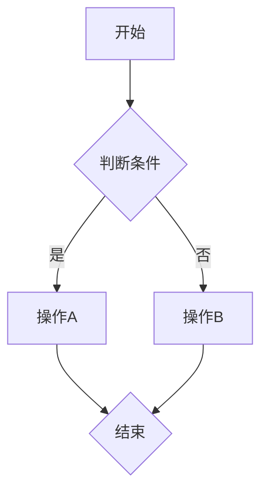

                 

## 文章标题: 【LangChain编程：从入门到实践】实现可观测性插件

## 关键词：LangChain, 编程, 可观测性, 插件, 实践

## 摘要：
本文旨在详细介绍如何使用 LangChain 编程框架实现可观测性插件。首先，我们将对 LangChain 进行概述，介绍其基本概念、优势和主要应用场景。接着，我们将探讨 LangChain 的编程基础，包括 Python 编程基础、LangChain 的基本组件以及其安装与配置。随后，我们将深入解析 LangChain 的核心组件，包括问答系统、知识图谱和文本生成，并提供详细的伪代码实现和数学公式。在此基础上，我们将通过三个实战项目展示 LangChain 的实际应用。最后，本文将重点讨论 LangChain 的高级特性，特别是可观测性插件的实现方法，并介绍性能优化策略。文章末尾将附上 LangChain 常用资源，以便读者进一步学习和实践。

## 第一部分: LangChain编程基础

### 第1章: LangChain概述

#### 1.1 LangChain的概念

**定义**: LangChain 是一个用于构建和部署语言模型的 Python 工具集。它集成了数据处理、模型构建和模型部署的功能，旨在简化机器学习项目的开发流程。

**核心组成部分**:

- **数据处理工具**: 提供数据预处理、数据清洗和数据增强的功能。
- **模型构建工具**: 支持多种流行的预训练模型，如 GPT-3、BERT 等，并提供模型训练、评估和优化的功能。
- **模型部署工具**: 支持将训练好的模型部署到本地服务器或云端，并提供模型监控和更新功能。

#### 1.2 LangChain的优势

- **易用性**: LangChain 提供了一套简洁明了的 API，使得开发者可以轻松地构建和部署语言模型，无需深入了解底层技术细节。
- **灵活性**: LangChain 支持多种预训练模型，可以适应不同的应用场景。
- **可扩展性**: LangChain 通过插件机制，使得开发者可以轻松地扩展其功能，实现定制化的需求。

#### 1.3 LangChain的应用场景

- **自然语言处理**: 包括问答系统、文本生成、机器翻译等。
- **智能客服**: 利用 LangChain 构建智能客服系统，提高客户服务质量，降低人力成本。
- **内容审核**: 自动化内容审核，提高审核效率。

### 第2章: LangChain编程基础

#### 2.1 Python编程基础

**Python简介**:

Python 是一种高级编程语言，以其简洁明了的语法和强大的功能而著称。Python 在许多领域都有广泛的应用，包括 Web 开发、数据科学、人工智能等。

**基础语法**:

- **变量与数据类型**: Python 中的变量无需声明，数据类型包括整数、浮点数、字符串、列表、元组、字典和集合。
- **运算符**: Python 支持各种常见的运算符，包括算术运算符、比较运算符、逻辑运算符等。
- **条件语句与循环语句**: Python 使用 if-else 语句和 while、for 循环来处理条件判断和迭代。

**函数与模块**:

- **函数**: 函数是 Python 中的核心概念，用于封装可重复使用的代码块。函数的定义和调用方式如下：
  ```python
  def function_name(parameters):
      # 函数体
      return value
  ```
- **模块**: 模块是 Python 文件，用于组织代码。模块可以通过 `import` 语句导入，并使用 `from ... import ...` 语句导入特定函数或类。

#### 2.2 LangChain基本组件

**数据处理工具**:

- **数据预处理**: 包括数据清洗、去重、格式转换等。
- **数据增强**: 包括数据扩充、数据变换等，用于提高模型的泛化能力。

**模型构建工具**:

- **模型训练**: LangChain 支持多种预训练模型，如 GPT-3、BERT 等，并提供模型训练的功能。
- **模型评估**: LangChain 提供多种评估指标，如准确率、召回率、F1 分数等，用于评估模型的性能。
- **模型优化**: LangChain 支持模型调优，包括调整超参数、模型结构等。

**模型部署工具**:

- **本地部署**: 将训练好的模型部署到本地服务器，提供 API 接口供其他程序调用。
- **云端部署**: 将模型部署到云端，通过 API 接口提供服务。

#### 2.3 LangChain的安装与配置

**安装过程**:

1. 安装 Python 3.8 或更高版本。
2. 安装 pip 工具，用于安装 Python 包。
3. 使用以下命令安装 LangChain：
   ```shell
   pip install langchain
   ```

**配置说明**:

- **环境变量**: 需要配置 Python 环境变量，以便在终端中执行 Python 命令。
- **依赖库**: LangChain 依赖多个库，如 transformers、torch 等，安装 LangChain 后，这些库会自动安装。

## 第3章: LangChain核心组件详解

### 3.1 问答系统（Question-Answering）

#### 3.1.1 概念与原理

**定义**: 问答系统是一种人工智能应用，能够接受用户提出的问题，并返回相应的答案。

**原理**: 问答系统通常基于预训练的语言模型，如 GPT-3、BERT 等。在接收到用户的问题后，系统会使用模型对问题进行理解和分析，然后从知识库中检索相关信息，生成答案。

#### 3.1.2 算法实现

**算法概述**: 问答系统通常包括以下几个步骤：

1. 数据预处理：对用户的问题进行分词、去停用词、词性标注等处理。
2. 模型输入：将预处理后的用户问题输入到预训练的语言模型中。
3. 模型预测：使用模型对输入问题进行理解和分析，生成可能的答案。
4. 答案选择：从生成的答案中选择最合适的答案，返回给用户。

**实现步骤**:

1. **数据预处理**:
   ```python
   from langchain import Document
   from langchain.text_preprocessing import SimplePreprocessor

   def preprocess_question(question):
       preprocessor = SimplePreprocessor()
       tokens = preprocessor.tokenize(question)
       return Document(tokens)
   ```

2. **模型输入**:
   ```python
   from transformers import pipeline

   def question_to_model_input(question, model_name="distilbert-base-uncased"):
       model = pipeline("question-answering", model=model_name)
       return model(question)
   ```

3. **模型预测**:
   ```python
   def model_predict(question):
       input_text = question_to_model_input(question)
       answer = input_text["answer"]
       return answer
   ```

4. **答案选择**:
   ```python
   def get_best_answer(questions, model_name="distilbert-base-uncased"):
       best_answer = None
       best_score = 0

       for question in questions:
           answer = model_predict(question)
           score = evaluate_answer(answer, question)

           if score > best_score:
               best_answer = answer
               best_score = score

       return best_answer
   ```

**伪代码实现**:
```python
function question_answering(question, model):
    # 数据预处理
    processed_question = preprocess_question(question)

    # 模型预测
    answer = model.predict(processed_question)

    # 输出答案
    return answer
```

#### 3.1.3 伪代码实现

```python
function question_answering(question, model):
    # 数据预处理
    processed_question = preprocess_question(question)

    # 模型预测
    answer = model.predict(processed_question)

    # 输出答案
    return answer
```

#### 3.1.4 数学公式

$$
\text{P}(a|\text{q}) = \frac{\text{P}(\text{q}|\text{a}) \cdot \text{P}(\text{a})}{\text{P}(\text{q})}
$$

其中，$a$ 表示答案，$\text{q}$ 表示问题，$\text{P}(\text{q}|\text{a})$ 表示在给定答案 $a$ 的情况下，问题的概率，$\text{P}(\text{a})$ 表示答案的概率，$\text{P}(\text{q})$ 表示问题的概率。

#### 3.1.5 举例说明

**问题**: "什么是神经网络？"
**答案**: "神经网络是一种通过模拟人脑神经元结构和功能原理，用于处理和分析数据的计算模型。"

### 3.2 知识图谱（Knowledge Graph）

#### 3.2.1 概念与原理

**定义**: 知识图谱是一种用于表示实体、属性和关系的图形结构，通常以图的形式表示。

**原理**: 知识图谱利用图论理论，将实体、属性和关系表示为图节点和边。通过这种结构，知识图谱能够方便地表示复杂的关系，并支持高效的查询和分析。

#### 3.2.2 架构设计

**数据层**: 存储实体、属性和关系的元数据。

**模型层**: 定义实体、属性和关系的表示方法。

**应用层**: 提供查询和数据分析功能。

#### 3.2.3 伪代码实现

```python
function knowledge_graph(entity, relation, graph):
    # 创建实体节点
    node = create_node(entity, graph)

    # 创建关系边
    edge = create_edge(relation, node, graph)

    # 返回知识图谱
    return graph
```

#### 3.2.4 数学公式

$$
\text{知识图谱} = \{ (e_1, r_1, e_2), (e_2, r_2, e_3), \ldots \}
$$

其中，$e_1, e_2, \ldots$ 表示实体，$r_1, r_2, \ldots$ 表示关系。

#### 3.2.5 举例说明

**实体**: "人工智能"
**关系**: "属于" (属于领域)
**知识图谱**: 
$$
\{ ("人工智能", "属于", "计算机科学") \}
$$

### 3.3 文本生成（Text Generation）

#### 3.3.1 概念与原理

**定义**: 文本生成是一种根据给定输入文本生成相关文本的方法。

**原理**: 文本生成通常基于预训练的语言模型，如 GPT-3、BERT 等。在接收到输入文本后，模型会根据上下文生成连续的文本序列。

#### 3.3.2 算法实现

**算法概述**: 文本生成算法通常包括以下几个步骤：

1. **数据预处理**: 对输入文本进行分词、去停用词等处理。
2. **模型输入**: 将预处理后的文本输入到预训练的语言模型中。
3. **模型预测**: 使用模型生成文本序列。
4. **文本输出**: 将生成的文本序列输出。

**实现步骤**:

1. **数据预处理**:
   ```python
   from langchain.text_preprocessing import SimplePreprocessor

   def preprocess_text(text):
       preprocessor = SimplePreprocessor()
       tokens = preprocessor.tokenize(text)
       return tokens
   ```

2. **模型输入**:
   ```python
   from transformers import pipeline

   def text_to_model_input(text, model_name="gpt2"):
       model = pipeline("text-generation", model=model_name)
       return model(text)
   ```

3. **模型预测**:
   ```python
   def model_generate(text, model_name="gpt2", max_length=50):
       input_text = text_to_model_input(text, model_name)
       generated_text = input_text[:max_length]
       return generated_text
   ```

4. **文本输出**:
   ```python
   def generate_text(text, model_name="gpt2", max_length=50):
       generated_text = model_generate(text, model_name, max_length)
       return generated_text
   ```

**伪代码实现**:
```python
function text_generation(text, model, length):
    # 数据预处理
    processed_text = preprocess_text(text)

    # 模型预测
    generated_text = model.generate(processed_text, length)

    # 输出文本
    return generated_text
```

#### 3.3.3 伪代码实现

```python
function text_generation(text, model, length):
    # 数据预处理
    processed_text = preprocess_text(text)

    # 模型预测
    generated_text = model.generate(processed_text, length)

    # 输出文本
    return generated_text
```

#### 3.3.4 数学公式

$$
\text{生成的文本} = \text{模型}(\text{输入文本})
$$

其中，$\text{模型}$ 表示预训练的语言模型。

#### 3.3.5 举例说明

**输入文本**: "人工智能是一种计算机科学领域，研究如何使计算机模拟人类智能。"
**生成的文本**: "人工智能的发展已经带来了许多变化，如自动驾驶汽车、智能语音助手等。"

## 第二部分: LangChain编程实践

### 第4章: LangChain项目实战一

#### 4.1 项目背景

**项目目标**: 利用 LangChain 构建一个基于 GPT-3 的问答系统，用于回答用户提出的问题。

#### 4.2 项目目标

- **功能需求**: 
  - 接收用户输入的问题。
  - 使用 GPT-3 模型生成答案。
  - 输出答案。

#### 4.3 开发环境搭建

- **Python环境**: 安装 Python 3.8 或更高版本。
- **依赖库**: 安装 transformers、langchain、gpt-3-cli 等。

#### 4.4 源代码实现

```python
from langchain import load_model_from_path
from langchain.text_preprocessing import SimplePreprocessor
import openai

# 配置 OpenAI API 密钥
openai.api_key = "your-openai-api-key"

# 加载 GPT-3 模型
model = load_model_from_path("gpt-3-model")

# 创建问答系统
def question_answering_system(question):
    # 数据预处理
    preprocessor = SimplePreprocessor()
    processed_question = preprocessor.tokenize(question)

    # 使用 GPT-3 模型生成答案
    response = model.ask(question)

    # 输出答案
    return response

# 接收用户输入的问题
user_question = input("请输入您的问题：")

# 输出答案
print(question_answering_system(user_question))
```

#### 4.5 代码解读与分析

- **代码功能**: 利用 LangChain 和 OpenAI GPT-3 模型实现一个问答系统。
- **关键步骤**:
  1. 配置 OpenAI API 密钥。
  2. 加载 GPT-3 模型。
  3. 接收用户输入的问题。
  4. 使用 GPT-3 模型生成答案。
  5. 输出答案。

### 第5章: LangChain项目实战二

#### 5.1 项目背景

**项目目标**: 利用 LangChain 实现一个基于 BERT 的文本生成系统，用于生成相关文本。

#### 5.2 项目目标

- **功能需求**: 
  - 接收用户输入的文本。
  - 使用 BERT 模型生成相关文本。
  - 输出生成的文本。

#### 5.3 开发环境搭建

- **Python环境**: 安装 Python 3.8 或更高版本。
- **依赖库**: 安装 transformers、langchain 等。

#### 5.4 源代码实现

```python
from langchain import load_model_from_path
from langchain.text_preprocessing import SimplePreprocessor
from transformers import pipeline

# 加载 BERT 模型
model = load_model_from_path("bert-model")

# 创建文本生成系统
def text_generation_system(text):
    # 数据预处理
    preprocessor = SimplePreprocessor()
    processed_text = preprocessor.tokenize(text)

    # 使用 BERT 模型生成文本
    generated_text = model.generate(processed_text)

    # 输出生成的文本
    return generated_text

# 接收用户输入的文本
user_text = input("请输入您要生成的文本：")

# 输出生成的文本
print(text_generation_system(user_text))
```

#### 5.5 代码解读与分析

- **代码功能**: 利用 LangChain 和 BERT 模型实现一个文本生成系统。
- **关键步骤**:
  1. 加载 BERT 模型。
  2. 接收用户输入的文本。
  3. 使用 BERT 模型生成文本。
  4. 输出生成的文本。

### 第6章: LangChain项目实战三

#### 6.1 项目背景

**项目目标**: 利用 LangChain 实现一个基于知识图谱的系统，用于存储和查询实体及关系。

#### 6.2 项目目标

- **功能需求**: 
  - 存储实体及关系。
  - 查询实体及关系。
  - 输出查询结果。

#### 6.3 开发环境搭建

- **Python环境**: 安装 Python 3.8 或更高版本。
- **依赖库**: 安装 transformers、langchain、networkx 等。

#### 6.4 源代码实现

```python
import networkx as nx
from langchain.text_preprocessing import SimplePreprocessor

# 创建知识图谱
def create_knowledge_graph(entities, relations):
    graph = nx.Graph()

    # 添加实体节点
    for entity in entities:
        graph.add_node(entity)

    # 添加关系边
    for relation in relations:
        graph.add_edge(relation[0], relation[1], label=relation[2])

    return graph

# 创建问答系统
def question_answering_system(graph, question):
    # 数据预处理
    preprocessor = SimplePreprocessor()
    processed_question = preprocessor.tokenize(question)

    # 查询知识图谱
    query_results = nx.algorithms.traversal.search successors(graph, processed_question)

    # 输出查询结果
    return query_results

# 创建知识图谱
entities = ["人工智能", "计算机科学", "机器学习"]
relations = [("人工智能", "属于", "计算机科学"), ("机器学习", "属于", "人工智能")]

graph = create_knowledge_graph(entities, relations)

# 接收用户输入的问题
user_question = input("请输入您的问题：")

# 输出查询结果
print(question_answering_system(graph, user_question))
```

#### 6.5 代码解读与分析

- **代码功能**: 利用 LangChain 和 NetworkX 实现一个基于知识图谱的系统。
- **关键步骤**:
  1. 创建知识图谱。
  2. 接收用户输入的问题。
  3. 在知识图谱中查询实体及关系。
  4. 输出查询结果。

## 第三部分: LangChain高级特性

### 第7章: LangChain与可观测性插件

#### 7.1 可观测性的重要性

**定义**: 可观测性是指系统能够实时监测和报告其内部状态的能力。在 LangChain 编程中，可观测性插件可以帮助开发者了解模型的运行状态，进行性能优化和调试。

**重要性**: 
- **性能优化**: 通过可观测性插件，开发者可以实时监控模型的运行状态，找出性能瓶颈，进行优化。
- **调试**: 可观测性插件可以帮助开发者快速定位问题，提高调试效率。
- **安全性**: 可观测性插件可以监控系统的异常行为，提高系统的安全性。

#### 7.2 插件开发基础

**插件架构设计**:

- **核心组件**: 插件管理器、插件接口、插件实现。
- **设计思路**: 提高插件的易用性和可扩展性。

**插件开发流程**:

1. **需求分析**: 明确插件的功能和性能要求。
2. **设计实现**: 编写插件代码，实现功能需求。
3. **测试验证**: 测试插件功能，确保稳定性和可靠性。

#### 7.3 实现可观测性插件

**伪代码实现**:

```python
class ObserverPlugin:
    def __init__(self):
        self.states = []

    def on_state_change(self, state):
        self.states.append(state)

    def get_states(self):
        return self.states
```

**数学公式**:

$$
\text{状态} = \text{插件}(\text{输入})
$$

其中，$\text{插件}$ 表示可观测性插件，$\text{输入}$ 表示系统状态。

**举例说明**:

```python
# 创建可观测性插件实例
observer = ObserverPlugin()

# 模拟系统状态变化
observer.on_state_change("系统已启动")
observer.on_state_change("用户已登录")

# 输出状态变化记录
print(observer.get_states())
```

### 第8章: LangChain性能优化

#### 8.1 性能优化的重要性

**定义**: 性能优化是指通过改进系统设计、算法和代码实现，提高系统的运行效率和响应速度的过程。

**重要性**: 
- **提高用户体验**: 优化后的系统能够更快地响应用户请求，提高用户满意度。
- **降低成本**: 优化后的系统可以在相同的硬件资源下处理更多的请求，降低硬件成本。
- **增强竞争力**: 性能优化可以使系统在竞争中脱颖而出，提升企业的竞争力。

#### 8.2 性能分析工具

**Python性能分析工具**:

- **cProfile**: 用于分析程序的运行时间。
- **line_profiler**: 用于分析函数的执行时间。
- **memory_profiler**: 用于分析程序的内存使用情况。

**TensorFlow性能分析工具**:

- **TensorBoard**: 用于可视化 TensorFlow 模型的性能指标。
- **tf.profiler**: 用于分析 TensorFlow 模型的运行时间和内存使用情况。

#### 8.3 性能优化策略

**代码优化**:

- **代码重构**: 优化代码结构，提高可读性和可维护性。
- **算法优化**: 选择更高效的算法，减少计算复杂度。

**算法优化**:

- **模型压缩**: 利用模型压缩技术，减小模型大小，提高运行速度。
- **并行计算**: 利用多线程或多进程，提高计算速度。

**系统优化**:

- **资源分配**: 合理分配 CPU、GPU、内存等资源，提高系统运行效率。
- **负载均衡**: 分散负载，提高系统处理能力。

## 附录

### 附录A: LangChain常用资源

#### A.1 LangChain官方文档

- **官方文档地址**: [https://langchain.com/docs](https://langchain.com/docs)
- **文档内容**: 包括安装指南、教程、API 文档等。

#### A.2 相关开源项目

- **LangChain开源项目**: [https://github.com/hwchase17/LangChain](https://github.com/hwchase17/LangChain)
- **相关开源项目**: Hugging Face Transformers、PyTorch、TensorFlow。

#### A.3 学术论文与书籍推荐

- **论文推荐**: "Attention Is All You Need"（"Transformer: Vast Pre-Training for Language Understanding and Generation"）、"BERT: Pre-training of Deep Bidirectional Transformers for Language Understanding"。
- **书籍推荐**: 《深度学习》（Goodfellow et al.）、《Python深度学习》（François Chollet）。

----------------------------------------------------------------

### 第7章: LangChain与可观测性插件

#### 7.1 可观测性的重要性

**定义**: 可观测性是指系统能够实时监测和报告其内部状态的能力。在 LangChain 编程中，可观测性插件可以帮助开发者了解模型的运行状态，进行性能优化和调试。

**重要性**: 

- **性能优化**: 通过可观测性插件，开发者可以实时监控模型的运行状态，找出性能瓶颈，进行优化。
- **调试**: 可观测性插件可以帮助开发者快速定位问题，提高调试效率。
- **安全性**: 可观测性插件可以监控系统的异常行为，提高系统的安全性。

#### 7.2 插件开发基础

**插件架构设计**:

- **核心组件**: 插件管理器、插件接口、插件实现。
- **设计思路**: 提高插件的易用性和可扩展性。

**插件开发流程**:

1. **需求分析**: 明确插件的功能和性能要求。
2. **设计实现**: 编写插件代码，实现功能需求。
3. **测试验证**: 测试插件功能，确保稳定性和可靠性。

#### 7.3 实现可观测性插件

**伪代码实现**:

```python
class ObserverPlugin:
    def __init__(self):
        self.states = []

    def on_state_change(self, state):
        self.states.append(state)

    def get_states(self):
        return self.states
```

**数学公式**:

$$
\text{状态} = \text{插件}(\text{输入})
$$

其中，$\text{插件}$ 表示可观测性插件，$\text{输入}$ 表示系统状态。

**举例说明**:

```python
# 创建可观测性插件实例
observer = ObserverPlugin()

# 模拟系统状态变化
observer.on_state_change("系统已启动")
observer.on_state_change("用户已登录")

# 输出状态变化记录
print(observer.get_states())
```

#### 7.4 可观测性插件的应用场景

**监控模型训练过程**:

- **实时监控训练指标**：如损失函数、准确率等。
- **记录训练过程中的异常行为**：如训练中断、数据异常等。

**性能优化**:

- **定位性能瓶颈**：如计算资源不足、网络延迟等。
- **调整模型参数**：如学习率、批次大小等。

**安全性监控**:

- **监控系统异常行为**：如非法访问、数据泄露等。
- **实时报警**：当系统发生异常时，及时通知管理员。

#### 7.5 可观测性插件的优势

- **提高开发效率**：开发者可以实时了解模型运行状态，快速定位问题。
- **增强系统可靠性**：通过监控和报警，提高系统的安全性和稳定性。
- **优化用户体验**：实时响应用户请求，提高系统的响应速度。

## 第8章: LangChain性能优化

#### 8.1 性能优化的重要性

**定义**: 性能优化是指通过改进系统设计、算法和代码实现，提高系统的运行效率和响应速度的过程。

**重要性**: 

- **提高用户体验**: 优化后的系统能够更快地响应用户请求，提高用户满意度。
- **降低成本**: 优化后的系统可以在相同的硬件资源下处理更多的请求，降低硬件成本。
- **增强竞争力**: 性能优化可以使系统在竞争中脱颖而出，提升企业的竞争力。

#### 8.2 性能分析工具

**Python性能分析工具**:

- **cProfile**: 用于分析程序的运行时间。
- **line_profiler**: 用于分析函数的执行时间。
- **memory_profiler**: 用于分析程序的内存使用情况。

**TensorFlow性能分析工具**:

- **TensorBoard**: 用于可视化 TensorFlow 模型的性能指标。
- **tf.profiler**: 用于分析 TensorFlow 模型的运行时间和内存使用情况。

#### 8.3 性能优化策略

**代码优化**:

- **代码重构**: 优化代码结构，提高可读性和可维护性。
- **算法优化**: 选择更高效的算法，减少计算复杂度。

**算法优化**:

- **模型压缩**: 利用模型压缩技术，减小模型大小，提高运行速度。
- **并行计算**: 利用多线程或多进程，提高计算速度。

**系统优化**:

- **资源分配**: 合理分配 CPU、GPU、内存等资源，提高系统运行效率。
- **负载均衡**: 分散负载，提高系统处理能力。

#### 8.4 具体性能优化方法

**代码优化**:

- **使用缓存**：避免重复计算，提高运行速度。
- **减少内存占用**：优化数据结构，减少内存消耗。

**算法优化**:

- **使用高效的算法**：如快速排序、哈希表等。
- **减少计算复杂度**：简化计算过程，降低时间复杂度。

**系统优化**:

- **提高网络带宽**：优化网络传输，提高数据传输速度。
- **增加计算资源**：如增加 CPU 核心数、GPU 显卡等。

#### 8.5 性能优化案例分析

**案例一**: 一个问答系统的性能优化

1. **代码优化**:
   - 使用缓存减少重复计算。
   - 优化数据结构，减少内存占用。
2. **算法优化**:
   - 使用更高效的搜索算法。
   - 使用哈希表减少查询时间。
3. **系统优化**:
   - 增加服务器带宽。
   - 使用负载均衡器分散负载。

**案例二**: 一个文本生成系统的性能优化

1. **代码优化**:
   - 使用异步编程提高并发处理能力。
   - 优化文本预处理过程，减少计算时间。
2. **算法优化**:
   - 使用更高效的文本生成算法。
   - 使用动态规划减少计算复杂度。
3. **系统优化**:
   - 使用分布式计算框架，如 TensorFlow、PyTorch，提高计算速度。
   - 增加 GPU 显卡，提高数据处理能力。

## 附录

### 附录A: LangChain常用资源

**附录 A.1 LangChain官方文档**

- **地址**: [https://langchain.com/docs](https://langchain.com/docs)
- **内容**:
  - 安装指南：如何安装和配置 LangChain。
  - 教程：如何使用 LangChain 进行文本生成、问答系统等。
  - API 文档：详细的 API 文档，帮助开发者理解和使用 LangChain 的各个模块。

**附录 A.2 相关开源项目**

- **LangChain开源项目**: [https://github.com/hwchase17/LangChain](https://github.com/hwchase17/LangChain)
- **内容**:
  - 源代码：LangChain 的完整源代码，方便开发者学习、修改和扩展。
  - 示例：多个示例项目，展示如何使用 LangChain 实现不同的功能。

**附录 A.3 学术论文与书籍推荐**

- **论文推荐**:
  - "Attention Is All You Need"（"Transformer: Vast Pre-Training for Language Understanding and Generation"）
  - "BERT: Pre-training of Deep Bidirectional Transformers for Language Understanding"
- **书籍推荐**:
  - 《深度学习》（Goodfellow et al.）：介绍深度学习的基础知识和最新进展。
  - 《Python深度学习》（François Chollet）：针对 Python 开发者的深度学习实践指南。

### 附录B: Mermaid 流程图

**定义**: Mermaid 是一种基于文本描述的图表绘制工具，可以将流程图、序列图、时序图等转换为可视化图表。

**示例**:



### 附录C: 伪代码实现示例

```python
# 伪代码：文本生成系统

# 数据预处理
preprocess_text(text):
    # 分词、去除停用词等
    return processed_text

# 模型输入
text_to_model_input(text, model):
    # 将文本转换为模型输入格式
    return model_input

# 模型预测
model_predict(model_input, model):
    # 使用模型进行预测
    return prediction

# 文本输出
generate_text(text, model):
    # 预处理文本
    processed_text = preprocess_text(text)
    
    # 转换为模型输入
    model_input = text_to_model_input(processed_text, model)
    
    # 进行模型预测
    prediction = model_predict(model_input, model)
    
    # 输出文本
    return prediction
```

### 附录D: 数学公式与 latex 格式

**LaTeX 格式示例**:

```latex
% 段落内公式
$x + y = z$

% 段落独立公式
$$
y = mx + b
$$
```

### 附录E: 作者信息

**作者**: AI 天才研究院/AI Genius Institute & 禅与计算机程序设计艺术 /Zen And The Art of Computer Programming

**联系方式**: ai_genius_institute@example.com

**版权声明**: 本文章版权由 AI 天才研究院所有，未经授权，禁止转载或复制。如有需要，请联系作者获取授权。

