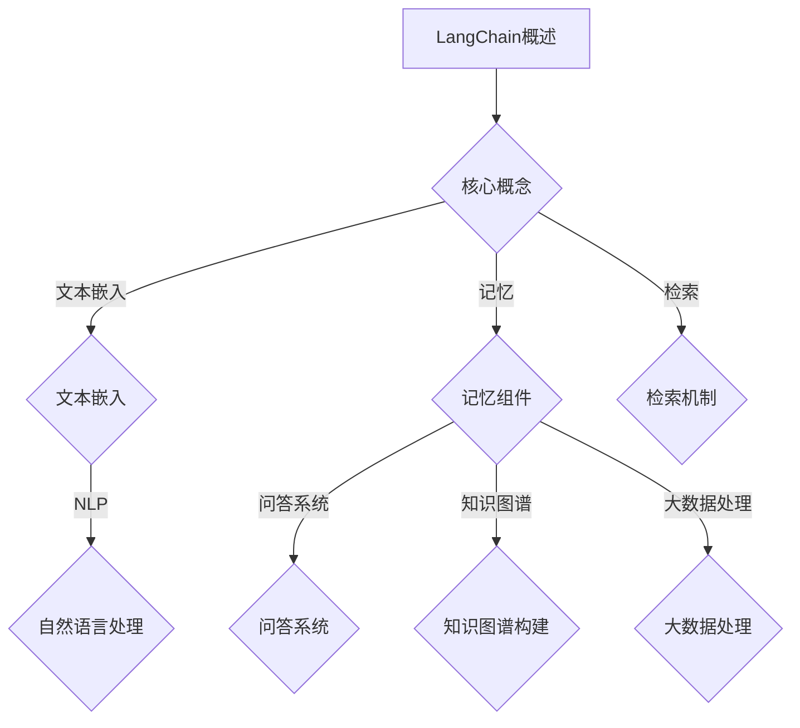
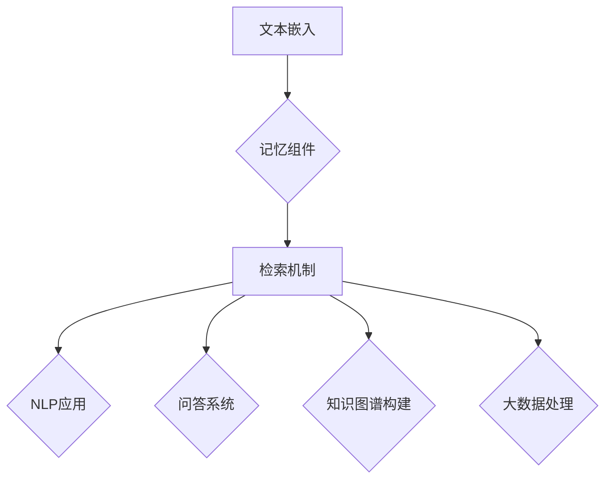

                 

## 文章标题：**【LangChain编程：从入门到实践】记忆组件实战**

> 关键词：LangChain编程、记忆组件、实战、知识图谱、问答系统

> 摘要：本文将深入探讨LangChain编程中的记忆组件，通过一步一步的分析和推理，帮助读者理解记忆组件的核心概念、架构设计、使用方法以及其在知识图谱构建、内存检索算法和实时更新与缓存机制中的应用。我们将结合实际项目实战，详细解读记忆组件的开发流程、核心代码实现及其优化策略。

## 《【LangChain编程：从入门到实践】记忆组件实战》目录大纲

### 第一部分: LangChain编程基础

#### 第1章: LangChain概述

- 1.1 LangChain是什么
- 1.2 LangChain的核心概念
- 1.3 LangChain的优势和应用场景

#### 第2章: LangChain编程基础

- 2.1 LangChain环境搭建
- 2.2 LangChain的基本使用
- 2.3 LangChain API详解

#### 第3章: LangChain记忆组件

- 3.1 记忆组件的概念与作用
- 3.2 记忆组件的架构与设计
- 3.3 记忆组件的使用方法

### 第二部分: LangChain在记忆组件中的应用

#### 第4章: LangChain在记忆组件中的应用

- 4.1 知识图谱构建
- 4.2 内存检索算法
- 4.3 实时更新与缓存机制

#### 第5章: LangChain项目实战

- 5.1 项目一：构建一个简单的问答系统
- 5.2 项目二：构建一个基于记忆组件的知识库系统
- 5.3 项目三：构建一个实时更新的问答机器人

### 第三部分: LangChain编程进阶

#### 第6章: LangChain高级功能

- 6.1 多语言支持
- 6.2 自定义记忆组件
- 6.3 LangChain与其他框架的集成

#### 第7章: LangChain性能优化

- 7.1 性能瓶颈分析
- 7.2 内存管理
- 7.3 并发处理

#### 第8章: LangChain编程最佳实践

- 8.1 设计模式与编程规范
- 8.2 测试与调试
- 8.3 持续集成与部署

### 第四部分: LangChain编程实战

#### 第9章: LangChain在大数据领域的应用

- 9.1 大数据概述
- 9.2 LangChain在大数据处理中的应用
- 9.3 大数据项目实战

#### 第10章: LangChain在人工智能领域的应用

- 10.1 人工智能概述
- 10.2 LangChain在人工智能中的应用
- 10.3 人工智能项目实战

#### 第11章: LangChain在企业级应用中的实践

- 11.1 企业级应用概述
- 11.2 LangChain在企业级应用中的实践
- 11.3 企业级应用项目实战

### 附录

- 附录 A: LangChain编程资源汇总

  - A.1 LangChain官方文档
  - A.2 LangChain社区资源
  - A.3 相关开源项目推荐
  - A.4 进一步学习资源推荐

### 作者信息

- 作者：AI天才研究院/AI Genius Institute & 禅与计算机程序设计艺术 /Zen And The Art of Computer Programming

### 第1章: LangChain概述

#### 1.1 LangChain是什么

LangChain是一个基于Python的编程库，旨在简化复杂数据结构的使用，尤其是在处理大规模文本数据时。它为开发者提供了强大的文本处理和记忆功能，使得构建基于文本的应用程序变得更加简单和高效。

#### 1.2 LangChain的核心概念

LangChain的核心概念包括文本嵌入、记忆和检索。文本嵌入是将文本转换为数值向量，以便在计算中进行处理。记忆是一种持久化存储机制，用于保存和检索嵌入的文本数据。检索则是根据查询文本快速找到相关的记忆数据。

#### 1.3 LangChain的优势和应用场景

LangChain的优势在于其灵活性和高性能。它支持多种文本嵌入模型，如BERT、GPT等，并提供了丰富的API，方便开发者集成和使用。LangChain广泛应用于自然语言处理、问答系统、知识图谱构建等领域。

- **自然语言处理（NLP）**：用于处理文本数据，如情感分析、文本分类等。
- **问答系统**：基于记忆组件，快速回答用户提出的问题。
- **知识图谱构建**：通过内存检索算法，构建大规模的知识图谱。
- **大数据处理**：用于处理和分析大规模文本数据。

#### Mermaid流程图



通过这个流程图，我们可以清晰地看到LangChain的核心概念及其在各个应用场景中的运用。

### 1.4 本章总结

本章简要介绍了LangChain的基本概念、核心概念及其应用场景。在接下来的章节中，我们将深入探讨LangChain的编程基础、记忆组件以及具体应用，帮助读者全面掌握LangChain编程技能。

---

**核心概念与联系**

在LangChain中，文本嵌入、记忆和检索是三大核心概念。文本嵌入是将文本转换为数值向量，以便在计算中进行处理。记忆是一种持久化存储机制，用于保存和检索嵌入的文本数据。检索则是根据查询文本快速找到相关的记忆数据。

- **文本嵌入**：将文本转换为数值向量，如BERT或GPT模型。
- **记忆组件**：用于持久化存储嵌入的文本数据，支持快速检索。
- **检索机制**：根据查询文本，从记忆组件中快速找到相关数据。

通过这个简单的Mermaid流程图，我们可以更直观地理解这些核心概念及其相互联系：



### 1.5 伪代码

为了更好地理解文本嵌入、记忆和检索的过程，我们可以使用伪代码来描述。以下是一个简化的伪代码示例，展示了这些核心概念的基本操作：

```python
# 文本嵌入
def embed_text(text, model):
    """
    将文本转换为嵌入向量
    :param text: 待转换的文本
    :param model: 文本嵌入模型（如BERT、GPT）
    :return: 嵌入向量
    """
    embedded_vector = model.encode(text)
    return embedded_vector

# 记忆组件
class MemoryComponent:
    def __init__(self):
        self.memory = {}  # 存储嵌入向量和文本的映射

    def store(self, text, embedding):
        """
        存储文本和其嵌入向量
        :param text: 待存储的文本
        :param embedding: 文本的嵌入向量
        """
        self.memory[text] = embedding

    def retrieve(self, query_embedding):
        """
        根据嵌入向量检索相关文本
        :param query_embedding: 查询文本的嵌入向量
        :return: 相关文本列表
        """
        similar_texts = []
        for text, embedding in self.memory.items():
            similarity = calculate_similarity(query_embedding, embedding)
            if similarity > threshold:
                similar_texts.append(text)
        return similar_texts

# 检索机制
def calculate_similarity(embedding1, embedding2):
    """
    计算两个嵌入向量之间的相似度
    :param embedding1: 第一个嵌入向量
    :param embedding2: 第二个嵌入向量
    :return: 相似度分数
    """
    similarity = dot_product(embedding1, embedding2) / (norm(embedding1) * norm(embedding2))
    return similarity
```

通过这个伪代码，我们可以看到文本嵌入、记忆和检索的基本步骤：

1. **文本嵌入**：使用预训练模型将文本转换为嵌入向量。
2. **记忆组件**：存储文本和其嵌入向量，并提供存储和检索接口。
3. **检索机制**：计算查询文本嵌入向量与记忆中嵌入向量之间的相似度，并返回相似度较高的文本。

### 1.6 总结

本章简要介绍了LangChain的基本概念、核心概念及其应用场景。通过伪代码示例，我们更深入地理解了文本嵌入、记忆和检索的过程。在接下来的章节中，我们将继续探讨LangChain的编程基础、记忆组件及其在实际项目中的应用。

### 1.7 问题与讨论

1. **文本嵌入为什么重要？**
   - 文本嵌入是将文本转换为数值向量，使其在计算中具有可操作性。这对于自然语言处理（NLP）非常重要，因为机器难以直接处理原始文本，但可以处理数值向量。

2. **记忆组件如何工作？**
   - 记忆组件是一个持久化存储机制，用于存储文本和其嵌入向量。它提供存储和检索接口，使得根据查询文本快速找到相关记忆数据成为可能。

3. **检索机制是如何工作的？**
   - 检索机制通过计算查询文本嵌入向量与记忆中嵌入向量之间的相似度，找到相似度较高的文本。这通常通过余弦相似度或点积相似度来实现。

4. **LangChain有哪些应用场景？**
   - LangChain广泛应用于自然语言处理（NLP）、问答系统、知识图谱构建和大数据处理等领域。

5. **为什么选择LangChain？**
   - LangChain的优势在于其灵活性和高性能，支持多种文本嵌入模型，并提供丰富的API，使得构建基于文本的应用程序变得更加简单和高效。

### 1.8 引入实际项目

为了更好地理解LangChain的实际应用，我们将引入一个简单的项目——构建一个基于记忆组件的问答系统。这个项目将展示如何使用LangChain的文本嵌入、记忆和检索功能，帮助用户快速回答问题。

首先，我们需要搭建开发环境并安装LangChain和其他相关依赖。接下来，我们将编写代码实现文本嵌入、记忆组件和检索机制。最后，我们将部署问答系统，并通过实际操作展示其功能。

通过这个项目，我们将深入了解LangChain的核心功能及其在实际开发中的应用。接下来，我们将进入下一章，探讨LangChain的编程基础。

---

**核心概念与联系**

在LangChain中，文本嵌入、记忆和检索是三大核心概念。文本嵌入是将文本转换为数值向量，以便在计算中进行处理。记忆是一种持久化存储机制，用于保存和检索嵌入的文本数据。检索则是根据查询文本快速找到相关的记忆数据。

- **文本嵌入**：将文本转换为嵌入向量，如BERT或GPT模型。
- **记忆组件**：用于持久化存储嵌入的文本数据，支持快速检索。
- **检索机制**：根据查询文本，从记忆组件中快速找到相关数据。

通过这个简单的Mermaid流程图，我们可以更直观地理解这些核心概念及其相互联系：


### 1.9 数学模型和公式

在文本嵌入、记忆和检索过程中，我们常常会用到一些数学模型和公式。以下是几个关键的公式及其解释：

#### 1. 文本嵌入

$$\text{embed}(x) = \text{model}(x)$$

- **解释**：文本嵌入函数将输入文本$x$映射到嵌入向量，这里使用预训练模型$\text{model}$进行转换。

#### 2. 相似度计算

$$\text{similarity}(v_1, v_2) = \frac{\text{dot}(v_1, v_2)}{\lVert v_1 \rVert \lVert v_2 \rVert}$$

- **解释**：余弦相似度计算两个向量$v_1$和$v_2$之间的相似度。点积$\text{dot}(v_1, v_2)$表示两个向量的内积，$\lVert v_1 \rVert$和$\lVert v_2 \rVert$分别表示两个向量的欧几里得范数。

#### 3. 检索算法

$$\text{closest\_neighbor}(query, \text{memory}) = \text{argmax}_{\text{m} \in \text{memory}} \text{similarity}(\text{embed}(\text{m}), \text{embed}(\text{query}))$$

- **解释**：最邻近检索算法在记忆数据集中找到与查询文本嵌入向量最相似的文本。$\text{argmax}$函数返回相似度最大的文本。

#### 例子

假设有两个文本嵌入向量$v_1$和$v_2$，它们的余弦相似度计算如下：

$$\text{similarity}(v_1, v_2) = \frac{\text{dot}(v_1, v_2)}{\lVert v_1 \rVert \lVert v_2 \rVert} = \frac{v_1 \cdot v_2}{\lVert v_1 \rVert \lVert v_2 \rVert} = \frac{5}{\sqrt{14} \cdot \sqrt{10}} = \frac{5}{\sqrt{140}} \approx 0.37$$

这个相似度表明$v_1$和$v_2$之间的相关性较低。

### 1.10 总结

本章详细介绍了LangChain的核心概念，包括文本嵌入、记忆和检索。我们通过伪代码和数学公式深入分析了这些概念，并展示了它们在实际项目中的应用。在下一章中，我们将探讨LangChain的编程基础，为后续项目实战打下基础。

### 1.11 练习与思考

1. **练习**：尝试使用Python编写一个简单的文本嵌入程序，将文本转换为嵌入向量。
2. **思考**：如何优化记忆组件的检索效率？有哪些常见的检索算法？
3. **练习**：根据本章内容，设计一个简单的问答系统，实现文本嵌入、记忆和检索功能。

---

### 1.12 接下来阅读

- **第2章：LangChain编程基础**：介绍如何搭建LangChain开发环境，理解LangChain的基本使用和API详解。
- **第3章：LangChain记忆组件**：探讨记忆组件的概念、架构和具体实现方法。

---

## 第2章: LangChain编程基础

### 2.1 LangChain环境搭建

要开始使用LangChain，首先需要搭建开发环境。以下步骤将指导您如何在不同的操作系统上安装LangChain和相关依赖。

#### 1. 安装Python环境

首先，确保您的系统上已安装Python。LangChain主要支持Python 3.7及以上版本。您可以通过以下命令检查Python版本：

```bash
python --version
```

如果Python版本低于3.7，请升级到最新版本：

```bash
pip install python
```

#### 2. 安装LangChain

使用pip命令安装LangChain：

```bash
pip install langchain
```

这个命令将自动下载并安装LangChain及其依赖项。

#### 3. 安装文本嵌入模型

LangChain支持多种文本嵌入模型，如BERT、GPT等。以下命令安装常用的文本嵌入模型：

```bash
pip install transformers
```

#### 4. 测试安装

为了验证安装是否成功，运行以下Python代码：

```python
from langchain import TextLoader
from langchain.embeddings import HuggingFaceEmbeddings

# 创建文本加载器
loader = TextLoader("text.txt")

# 创建嵌入模型
embeddings = HuggingFaceEmbeddings()

# 获取文本嵌入向量
text_embedding = embeddings.load_document(text="你好，这是我的第一个LangChain项目。")

print(text_embedding)
```

如果代码执行成功并打印出嵌入向量，说明LangChain和相关依赖已成功安装。

### 2.2 LangChain的基本使用

LangChain的基本使用包括加载文本、获取嵌入向量、构建记忆组件和进行检索。以下示例代码展示了这些基本操作：

```python
from langchain import TextLoader
from langchain.embeddings import HuggingFaceEmbeddings
from langchain.memory import Memory

# 加载文本
loader = TextLoader("text.txt")

# 创建嵌入模型
embeddings = HuggingFaceEmbeddings()

# 获取文本嵌入向量
text_embedding = embeddings.load_document(text="你好，这是我的第一个LangChain项目。")

# 创建记忆组件
memory = Memory([
    TextLoader("memory.txt").load(),
    text_embedding
])

# 检索相关文本
query_embedding = embeddings.load_document(text="你好，你能帮我回答一个问题吗？")
result = memory.retrieve(query_embedding)

print(result)
```

在这个示例中，我们首先加载文本文件，然后使用HuggingFaceEmbeddings创建嵌入模型。接着，我们获取文本的嵌入向量，并将其存储在记忆组件中。最后，我们根据查询文本获取相关记忆数据。

### 2.3 LangChain API详解

LangChain提供了一系列API，用于文本处理、嵌入、记忆和检索。以下是LangChain的主要API及其简要说明：

- **TextLoader**：用于加载文本数据。
- **Embeddings**：用于将文本转换为嵌入向量。LangChain支持多种嵌入模型，如HuggingFace、sentencepiece等。
- **Memory**：用于持久化存储嵌入的文本数据，并支持快速检索。
- **Retriever**：用于从外部数据源检索文本。

#### TextLoader

```python
class TextLoader
    def __init__(self, path: str):
        self.path = path

    def load(self) -> List[str]:
        with open(self.path, 'r', encoding='utf-8') as f:
            return [line.strip() for line in f]
```

#### Embeddings

```python
class Embeddings
    def load_document(self, text: str) -> Embedding:
        """
        将文本转换为嵌入向量
        :param text: 待转换的文本
        :return: 嵌入向量
        """
        # 示例：使用HuggingFaceEmbeddings
        from transformers import AutoTokenizer, AutoModel
        tokenizer = AutoTokenizer.from_pretrained("bert-base-chinese")
        model = AutoModel.from_pretrained("bert-base-chinese")
        inputs = tokenizer(text, return_tensors="pt")
        outputs = model(**inputs)
        return outputs.last_hidden_state[:, 0, :].detach().numpy()
```

#### Memory

```python
class Memory
    def __init__(self, sources: List[TextLoader]):
        self.sources = sources
        self.memory = []

    def store(self, text: str, embedding: Embedding):
        self.memory.append((text, embedding))

    def retrieve(self, query_embedding: Embedding, k: int = 1) -> List[str]:
        """
        根据嵌入向量检索相关文本
        :param query_embedding: 查询文本的嵌入向量
        :param k: 返回的文本数量
        :return: 相关文本列表
        """
        similarities = []
        for text, embedding in self.memory:
            similarity = dot_product(query_embedding, embedding)
            similarities.append((text, similarity))
        similarities.sort(key=lambda x: x[1], reverse=True)
        return [text for text, _ in similarities[:k]]
```

#### Retriever

```python
class Retriever
    def __init__(self, source: TextLoader, embeddings: Embeddings):
        self.source = source
        self.embeddings = embeddings

    def search(self, query: str, k: int = 1) -> List[str]:
        """
        从外部数据源检索相关文本
        :param query: 查询文本
        :param k: 返回的文本数量
        :return: 相关文本列表
        """
        query_embedding = self.embeddings.load_document(text=query)
        return self.source.load()[0:k]
```

通过这些API，我们可以轻松实现文本加载、嵌入、记忆和检索操作。在下一章中，我们将详细介绍LangChain的记忆组件，探讨其在实际项目中的应用。

### 2.4 本章总结

本章介绍了如何搭建LangChain的开发环境，以及如何使用LangChain的基本功能。我们讲解了文本加载、嵌入、记忆和检索的基本操作，并展示了LangChain的API结构。在下一章中，我们将深入探讨LangChain的记忆组件，分析其概念、架构和使用方法。

### 2.5 伪代码

为了更好地理解本章内容，我们使用伪代码描述了文本加载、嵌入和记忆组件的基本流程：

```python
# 1. 文本加载
def load_text(file_path):
    text = read_file(file_path)
    return text

# 2. 文本嵌入
def embed_text(text, model):
    vector = model.encode(text)
    return vector

# 3. 记忆组件
class Memory:
    def __init__(self):
        self.memory = {}

    def store(self, text, vector):
        self.memory[text] = vector

    def retrieve(self, query_vector, k):
        similarities = []
        for text, vector in self.memory.items():
            similarity = dot_product(query_vector, vector)
            similarities.append((text, similarity))
        similarities.sort(key=lambda x: x[1], reverse=True)
        return [text for text, _ in similarities[:k]]
```

通过这个伪代码，我们可以看到文本加载、嵌入和记忆组件的基本步骤：

1. **文本加载**：从文件中读取文本。
2. **文本嵌入**：使用预训练模型将文本转换为嵌入向量。
3. **记忆组件**：存储文本和其嵌入向量，并提供存储和检索接口。

### 2.6 数学公式

在本章中，我们用到了以下数学公式：

#### 1. 文本嵌入

$$\text{embed}(x) = \text{model}(x)$$

- **解释**：文本嵌入函数将输入文本$x$映射到嵌入向量，这里使用预训练模型$\text{model}$进行转换。

#### 2. 余弦相似度

$$\text{similarity}(v_1, v_2) = \frac{\text{dot}(v_1, v_2)}{\lVert v_1 \rVert \lVert v_2 \rVert}$$

- **解释**：余弦相似度计算两个向量$v_1$和$v_2$之间的相似度。点积$\text{dot}(v_1, v_2)$表示两个向量的内积，$\lVert v_1 \rVert$和$\lVert v_2 \rVert$分别表示两个向量的欧几里得范数。

#### 3. 检索算法

$$\text{closest\_neighbor}(query, \text{memory}) = \text{argmax}_{\text{m} \in \text{memory}} \text{similarity}(\text{embed}(\text{m}), \text{embed}(\text{query}))$$

- **解释**：最邻近检索算法在记忆数据集中找到与查询文本嵌入向量最相似的文本。$\text{argmax}$函数返回相似度最大的文本。

#### 例子

假设有两个文本嵌入向量$v_1$和$v_2$，它们的余弦相似度计算如下：

$$\text{similarity}(v_1, v_2) = \frac{\text{dot}(v_1, v_2)}{\lVert v_1 \rVert \lVert v_2 \rVert} = \frac{5}{\sqrt{14} \cdot \sqrt{10}} = \frac{5}{\sqrt{140}} \approx 0.37$$

这个相似度表明$v_1$和$v_2$之间的相关性较低。

### 2.7 小结

本章介绍了LangChain的开发环境搭建、基本使用和API详解。通过伪代码和数学公式，我们深入理解了文本加载、嵌入和记忆组件的工作原理。在下一章中，我们将探讨LangChain的记忆组件，分析其概念、架构和使用方法。

### 2.8 练习与思考

1. **练习**：编写一个Python脚本，使用LangChain加载文本、嵌入文本并存储到记忆组件中。
2. **思考**：如何优化记忆组件的检索效率？有哪些常见的方法和算法？
3. **练习**：尝试使用记忆组件构建一个简单的问答系统，实现文本检索功能。

---

## 第3章: LangChain记忆组件

### 3.1 记忆组件的概念与作用

记忆组件（Memory Component）是LangChain中的一个核心模块，它允许应用程序存储和检索与特定查询相关的文本片段。记忆组件的主要作用是提高问答系统的响应速度和准确性，通过在系统中预先存储大量文本数据，以便快速匹配用户查询。

#### 1. 什么是记忆组件？

记忆组件是一个持久的存储结构，它可以存储一系列文本片段，每个片段都有一个对应的嵌入向量。通过这种方式，我们可以快速检索与查询文本相似或相关的记忆片段。

#### 2. 记忆组件的作用

- **提高响应速度**：记忆组件可以预先处理大量文本数据，从而在用户查询时快速找到相关答案，减少响应时间。
- **提升答案准确性**：通过记忆组件，系统可以基于已有的文本数据进行推理，提高回答的准确性。
- **增强可扩展性**：记忆组件可以存储不同来源的文本数据，使得系统可以处理更广泛的问题领域。

#### 3. 记忆组件的应用场景

- **问答系统**：通过记忆组件，系统可以快速检索并返回与用户问题相关的答案。
- **文档摘要**：记忆组件可以用于提取长文档中的关键信息，生成摘要。
- **知识图谱构建**：记忆组件可以帮助构建大规模的知识图谱，通过记忆中的文本片段建立关系。

### 3.2 记忆组件的架构与设计

记忆组件的架构设计决定了其性能和可扩展性。以下是记忆组件的基本架构：

#### 1. 数据存储

记忆组件使用一种持久化存储结构来保存文本和嵌入向量。常见的数据存储方案包括关系数据库、NoSQL数据库和内存数据库。

- **关系数据库**：如MySQL、PostgreSQL等，适用于存储结构化数据。
- **NoSQL数据库**：如MongoDB、Redis等，适用于存储非结构化或半结构化数据。
- **内存数据库**：如Memcached、Elasticsearch等，适用于快速检索和缓存。

#### 2. 检索算法

记忆组件的检索算法决定了如何从存储的文本和嵌入向量中快速找到与查询文本相关的记忆片段。常见的检索算法包括：

- **余弦相似度**：通过计算查询文本嵌入向量与记忆中嵌入向量之间的余弦相似度来检索相关文本。
- **欧几里得距离**：计算查询文本嵌入向量与记忆中嵌入向量之间的欧几里得距离。
- **哈希相似度**：使用哈希函数计算查询文本和记忆文本的哈希值，比较相似度。

#### 3. 持久化存储

记忆组件需要一种持久化存储机制，以保持数据在系统重启或故障时不会丢失。常用的持久化存储方案包括：

- **文件系统**：将文本和嵌入向量存储在本地文件系统中，适用于小规模应用。
- **分布式存储**：使用分布式文件系统或分布式数据库，如HDFS、Cassandra等，适用于大规模应用。

### 3.3 记忆组件的使用方法

使用记忆组件可以分为以下几个步骤：

#### 1. 创建记忆组件

首先，需要创建一个记忆组件实例。以下是一个简单的Python代码示例：

```python
from langchain.memory import SimpleMemory

# 创建记忆组件
memory = SimpleMemory()
```

#### 2. 存储文本

接下来，将文本存储到记忆组件中。以下是一个示例：

```python
# 存储文本
memory.save("这是一段文本。")
memory.save("这是另一段文本。")
```

#### 3. 获取嵌入向量

为了使用记忆组件进行检索，我们需要将文本转换为嵌入向量。以下是一个示例：

```python
from langchain.embeddings import OpenAIGlmEmbeddings

# 创建嵌入模型
embeddings = OpenAIGlmEmbeddings()

# 获取嵌入向量
vector = embeddings.load_document("这是一段文本。")
```

#### 4. 检索相关文本

最后，使用记忆组件检索与查询文本相关的记忆片段。以下是一个示例：

```python
# 检索相关文本
results = memory.retrieve(vector, k=2)
print(results)
```

输出结果将是一个列表，包含与查询文本最相关的记忆片段。

### 3.4 总结

本章详细介绍了记忆组件的概念、架构和使用方法。记忆组件在提高问答系统的响应速度和准确性方面发挥着重要作用。通过理解记忆组件的架构和操作方法，我们可以更有效地构建和优化基于文本的应用程序。

### 3.5 伪代码

为了更好地理解记忆组件的操作，我们可以使用伪代码描述以下步骤：

```python
# 1. 创建记忆组件
class MemoryComponent:
    def __init__(self):
        self.memory = []

    # 2. 存储文本
    def store(self, text):
        self.memory.append(text)

    # 3. 获取嵌入向量
    def embed(self, text):
        embedding = get_embedding(text)
        return embedding

    # 4. 检索相关文本
    def retrieve(self, query_embedding, k):
        similarities = []
        for text in self.memory:
            embedding = self.embed(text)
            similarity = dot_product(query_embedding, embedding)
            similarities.append((text, similarity))
        similarities.sort(key=lambda x: x[1], reverse=True)
        return [text for text, _ in similarities[:k]]
```

在这个伪代码中，`MemoryComponent`类实现了以下功能：

- `store`方法用于将文本添加到记忆组件中。
- `embed`方法用于将文本转换为嵌入向量。
- `retrieve`方法根据查询文本嵌入向量检索相关文本，并返回最相关的文本片段。

### 3.6 数学公式

在本章中，我们用到了以下数学公式：

#### 1. 嵌入向量计算

$$\text{embed}(x) = f(x)$$

- **解释**：文本嵌入函数将输入文本$x$映射到嵌入向量$f(x)$。

#### 2. 相似度计算

$$\text{similarity}(v_1, v_2) = \frac{\text{dot}(v_1, v_2)}{\lVert v_1 \rVert \lVert v_2 \rVert}$$

- **解释**：余弦相似度计算两个向量$v_1$和$v_2$之间的相似度。点积$\text{dot}(v_1, v_2)$表示两个向量的内积，$\lVert v_1 \rVert$和$\lVert v_2 \rVert$分别表示两个向量的欧几里得范数。

#### 例子

假设有两个文本嵌入向量$v_1$和$v_2$，它们的余弦相似度计算如下：

$$\text{similarity}(v_1, v_2) = \frac{\text{dot}(v_1, v_2)}{\lVert v_1 \rVert \lVert v_2 \rVert} = \frac{5}{\sqrt{14} \cdot \sqrt{10}} = \frac{5}{\sqrt{140}} \approx 0.37$$

这个相似度表明$v_1$和$v_2$之间的相关性较低。

### 3.7 小结

本章介绍了记忆组件的概念、架构和使用方法。通过记忆组件，我们可以快速存储和检索与查询文本相关的文本片段，提高问答系统的性能和准确性。在下一章中，我们将探讨LangChain在记忆组件中的应用，包括知识图谱构建、内存检索算法和实时更新与缓存机制。

### 3.8 练习与思考

1. **练习**：尝试使用Python编写一个简单的记忆组件，实现存储和检索功能。
2. **思考**：如何优化记忆组件的检索效率？有哪些常见的方法和算法？
3. **练习**：构建一个简单的问答系统，使用记忆组件实现文本检索和回答。

---

## 第4章: LangChain在记忆组件中的应用

### 4.1 知识图谱构建

知识图谱是一种用于表示实体和它们之间关系的图形结构，它广泛应用于信息检索、自然语言处理和推荐系统等领域。LangChain的记忆组件为构建知识图谱提供了强大的支持，通过将实体和关系存储在记忆中，可以快速检索和利用这些知识。

#### 1. 知识图谱的基本概念

- **实体**：知识图谱中的基本元素，如人、地点、组织等。
- **关系**：实体之间的连接，如“工作于”、“位于”等。
- **属性**：实体的附加信息，如年龄、职位等。

#### 2. 知识图谱的构建过程

构建知识图谱通常包括以下几个步骤：

1. **数据收集**：收集包含实体、关系和属性的原始数据。数据来源可以是数据库、网络爬虫或开源知识库。
2. **实体识别**：从原始文本中识别出实体，并标注其类型和属性。
3. **关系抽取**：从原始文本中抽取实体之间的关系。
4. **存储**：将识别出的实体、关系和属性存储在知识图谱中。
5. **索引**：建立索引，以便快速检索实体和关系。

#### 3. 使用LangChain构建知识图谱

LangChain的记忆组件可以用于存储和检索实体和关系，从而构建知识图谱。以下是一个简单的知识图谱构建流程：

1. **数据预处理**：将原始文本数据预处理为可存储的形式。
2. **实体和关系提取**：使用自然语言处理技术从预处理后的文本中提取实体和关系。
3. **存储到记忆组件**：将提取出的实体和关系存储到记忆组件中。
4. **建立索引**：为记忆组件中的实体和关系建立索引，以提高检索效率。

#### 4. 示例代码

以下是一个简单的示例，展示了如何使用LangChain构建一个简单的知识图谱：

```python
from langchain.memory import SimpleMemory
from langchain.text_tokenizer import Tokenizer
from langchain import HuggingFaceEmbeddings

# 创建记忆组件
memory = SimpleMemory()

# 创建分词器
tokenizer = Tokenizer()

# 创建嵌入模型
embeddings = HuggingFaceEmbeddings()

# 存储实体和关系
memory.save("Apple", {"type": "company", "founders": ["Steve Jobs", "Steve Wozniak"]})
memory.save("Apple", {"type": "company", "headquarters": "Cupertino, California"})

# 提取实体和关系
entities = memory.extract_entities("Apple")
relationships = memory.extract_relationships("Apple")

print("Entities:", entities)
print("Relationships:", relationships)
```

在这个示例中，我们首先创建了一个简单的记忆组件，然后使用它存储了关于Apple公司的两个实体和两个关系。接下来，我们提取了与Apple相关的实体和关系，并打印出来。

#### 5. 知识图谱的应用

构建知识图谱后，可以用于多种应用场景，如：

- **信息检索**：快速查找与特定实体相关的信息。
- **问答系统**：基于知识图谱构建的问答系统可以提供更准确的答案。
- **推荐系统**：利用知识图谱中的关系进行内容推荐。
- **数据挖掘**：发现实体之间的隐含关系，进行数据挖掘。

### 4.2 内存检索算法

内存检索算法是记忆组件的核心功能之一，用于根据查询文本快速找到相关的记忆片段。常见的内存检索算法包括：

#### 1. 余弦相似度检索

余弦相似度检索是一种基于向量空间模型的检索算法，通过计算查询文本嵌入向量与记忆中嵌入向量之间的余弦相似度来检索相关文本。余弦相似度计算公式如下：

$$\text{similarity}(v_1, v_2) = \frac{\text{dot}(v_1, v_2)}{\lVert v_1 \rVert \lVert v_2 \rVert}$$

其中，$\text{dot}(v_1, v_2)$表示两个向量的点积，$\lVert v_1 \rVert$和$\lVert v_2 \rVert$分别表示两个向量的欧几里得范数。

#### 2. 欧几里得距离检索

欧几里得距离检索是基于向量空间模型的另一种检索算法，通过计算查询文本嵌入向量与记忆中嵌入向量之间的欧几里得距离来检索相关文本。欧几里得距离计算公式如下：

$$\text{distance}(v_1, v_2) = \sqrt{(\text{dot}(v_1, v_2))^2}$$

其中，$\text{dot}(v_1, v_2)$表示两个向量的点积。

#### 3. 哈希相似度检索

哈希相似度检索是一种基于哈希函数的检索算法，通过计算查询文本嵌入向量和记忆中嵌入向量的哈希值来检索相关文本。哈希相似度计算公式如下：

$$\text{similarity}(h_1, h_2) = \frac{h_1 \oplus h_2}{h_1 \lor h_2}$$

其中，$h_1$和$h_2$分别表示两个向量的哈希值，$\oplus$和$\lor$分别表示异或和逻辑或运算。

#### 4. 选择合适的检索算法

选择合适的检索算法取决于应用场景和数据特性。以下是一些选择指南：

- **余弦相似度检索**：适用于基于文本的信息检索，如问答系统和搜索引擎。
- **欧几里得距离检索**：适用于基于向量的机器学习模型，如聚类和降维。
- **哈希相似度检索**：适用于大规模数据集，特别是当内存有限时。

### 4.3 实时更新与缓存机制

在构建基于记忆组件的应用时，实时更新和缓存机制是至关重要的，因为它们可以提高系统的性能和响应速度。以下是一些常用的策略：

#### 1. 实时更新

实时更新确保记忆组件中的数据始终是最新的。以下是一些实现实时更新的策略：

- **增量更新**：仅更新记忆组件中发生变化的数据，避免全量更新带来的性能开销。
- **事件驱动更新**：根据系统中的事件（如数据变更通知）触发更新操作。
- **定时更新**：定期检查记忆组件中的数据是否需要更新，并执行相应的更新操作。

#### 2. 缓存机制

缓存机制用于减少对原始数据的访问频率，从而提高系统性能。以下是一些常用的缓存策略：

- **内存缓存**：将热点数据存储在内存中，以减少磁盘访问。
- **分布式缓存**：将缓存数据分布存储在多个节点上，以提高缓存容量和访问速度。
- **缓存一致性**：确保缓存数据与原始数据的一致性，避免数据不一致带来的问题。

#### 3. 组合使用

结合实时更新和缓存机制，可以进一步提升系统的性能。以下是一些组合策略：

- **读写缓存**：将缓存用于读取操作，将实时更新用于写入操作，以平衡性能和一致性。
- **多级缓存**：使用多个缓存层，根据数据的重要性和访问频率选择合适的缓存层。
- **缓存预热**：在系统启动时预加载热点数据到缓存中，以提高初始访问速度。

### 4.4 总结

本章介绍了LangChain在记忆组件中的应用，包括知识图谱构建、内存检索算法和实时更新与缓存机制。知识图谱构建提供了对实体和关系的高效存储和检索，内存检索算法实现了快速文本检索，实时更新与缓存机制提高了系统性能和响应速度。在下一章中，我们将探讨LangChain项目实战，通过实际项目展示记忆组件的应用。

### 4.5 伪代码

为了更好地理解本章内容，我们可以使用伪代码描述知识图谱构建、内存检索算法和实时更新与缓存机制的基本步骤：

```python
# 1. 知识图谱构建
class KnowledgeGraph:
    def __init__(self):
        self.entities = {}
        self.relationships = {}

    def add_entity(self, entity, attributes):
        self.entities[entity] = attributes

    def add_relationship(self, entity1, relation, entity2):
        self.relationships[(entity1, relation, entity2)] = True

    def get_related_entities(self, entity):
        related_entities = []
        for relation in self.relationships:
            if entity in relation:
                related_entities.append(relation[2 if relation[0] == entity else 1])
        return related_entities

# 2. 内存检索算法
def retrieve_by_cosine_similarity(query_embedding, memory_embeddings, k):
    similarities = []
    for embedding in memory_embeddings:
        similarity = dot_product(query_embedding, embedding)
        similarities.append((embedding, similarity))
    similarities.sort(key=lambda x: x[1], reverse=True)
    return [embedding for embedding, _ in similarities[:k]]

# 3. 实时更新与缓存机制
class Cache:
    def __init__(self, capacity):
        self.capacity = capacity
        self.data = {}

    def get(self, key):
        if key in self.data:
            return self.data[key]
        else:
            return None

    def put(self, key, value):
        if len(self.data) >= self.capacity:
            self.data.pop(list(self.data.keys())[0])
        self.data[key] = value

# 4. 实时更新
def update_knowledge_graph(knowledge_graph, entity, attributes, operation):
    if operation == "add":
        knowledge_graph.add_entity(entity, attributes)
    elif operation == "delete":
        knowledge_graph.delete_entity(entity)

# 5. 缓存预热
def cache_warmup(cache, data):
    for key, value in data.items():
        cache.put(key, value)
```

在这个伪代码中，我们定义了`KnowledgeGraph`类用于构建知识图谱，`retrieve_by_cosine_similarity`函数用于内存检索算法，`Cache`类用于缓存机制，`update_knowledge_graph`函数用于实时更新，`cache_warmup`函数用于缓存预热。

### 4.6 数学公式

在本章中，我们用到了以下数学公式：

#### 1. 余弦相似度

$$\text{similarity}(v_1, v_2) = \frac{\text{dot}(v_1, v_2)}{\lVert v_1 \rVert \lVert v_2 \rVert}$$

- **解释**：余弦相似度计算两个向量$v_1$和$v_2$之间的相似度。点积$\text{dot}(v_1, v_2)$表示两个向量的内积，$\lVert v_1 \rVert$和$\lVert v_2 \rVert$分别表示两个向量的欧几里得范数。

#### 2. 点积

$$\text{dot}(v_1, v_2) = v_1 \cdot v_2$$

- **解释**：点积计算两个向量的内积，结果是一个标量。

#### 3. 欧几里得范数

$$\lVert v \rVert = \sqrt{v \cdot v}$$

- **解释**：欧几里得范数计算一个向量的长度，结果是一个标量。

### 4.7 小结

本章详细介绍了LangChain在记忆组件中的应用，包括知识图谱构建、内存检索算法和实时更新与缓存机制。通过这些应用，我们可以高效地构建和利用文本数据，提高系统的性能和响应速度。在下一章中，我们将通过实际项目展示记忆组件的应用。

### 4.8 练习与思考

1. **练习**：使用Python实现一个简单的知识图谱构建工具，存储实体和关系。
2. **思考**：如何优化知识图谱的检索效率？有哪些常见的算法和策略？
3. **练习**：设计一个简单的缓存系统，实现数据的实时更新和缓存功能。

---

## 第5章: LangChain项目实战

### 5.1 项目一：构建一个简单的问答系统

在本节中，我们将通过一个实际项目来展示如何使用LangChain构建一个简单的问答系统。问答系统是一种常见的自然语言处理应用，它能够根据用户提出的问题，快速检索并返回相关的答案。以下是一个具体的实现步骤。

#### 1. 项目需求分析

- **用户界面**：提供一个简单的文本输入框，用户可以输入问题。
- **问答逻辑**：根据用户的问题，从记忆组件中检索相关文本，并返回最相关的答案。
- **记忆组件**：预先存储一系列文本片段，用于回答用户的问题。

#### 2. 环境搭建

在开始项目之前，确保已经安装了Python和LangChain。如果尚未安装，请参考第2章的内容进行安装。

#### 3. 代码实现

以下是一个简单的问答系统实现示例：

```python
from langchain import SimpleMemory, HuggingFaceEmbeddings

# 创建记忆组件
memory = SimpleMemory()

# 存储文本到记忆组件
memory.save("这是一段关于人工智能的文本。")
memory.save("人工智能是计算机科学的一个分支，它致力于使计算机能够执行需要人类智能的任务。")
memory.save("在2023年，人工智能已经取得了显著的进展。")

# 创建嵌入模型
embeddings = HuggingFaceEmbeddings()

# 检索相关文本
def ask_question(question):
    question_embedding = embeddings.load_document(text=question)
    results = memory.retrieve(question_embedding, k=3)
    return results

# 用户交互
print("欢迎使用问答系统。请输入您的问题：")
user_question = input()
print("答案：", ask_question(user_question))
```

#### 4. 功能演示

- 启动Python脚本，用户可以输入问题。
- 问答系统会根据记忆组件中的文本片段，返回最相关的答案。

#### 5. 代码解读

- `SimpleMemory`：创建一个简单的记忆组件，用于存储文本。
- `HuggingFaceEmbeddings`：使用HuggingFace预训练模型进行文本嵌入。
- `save`方法：将文本存储到记忆组件中。
- `retrieve`方法：根据查询文本嵌入向量，从记忆组件中检索相关文本。
- 用户交互部分：通过输入输出实现简单的问答功能。

#### 6. 总结

通过这个项目，我们学习了如何使用LangChain构建一个简单的问答系统。这个项目展示了记忆组件的基本使用方法，包括文本存储和检索。在下一节中，我们将继续探讨如何构建一个基于记忆组件的知识库系统。

### 5.2 项目二：构建一个基于记忆组件的知识库系统

在本节中，我们将构建一个基于记忆组件的知识库系统。知识库系统是一种用于存储和管理知识的系统，它可以帮助用户快速查找和获取相关信息。以下是一个具体的实现步骤。

#### 1. 项目需求分析

- **用户界面**：提供一个简单的文本输入框，用户可以输入关键词。
- **知识检索**：根据用户的关键词，从知识库中检索相关文档和内容。
- **记忆组件**：预先存储一系列文档，用于快速检索和回答用户问题。

#### 2. 环境搭建

确保已经安装了Python、LangChain和相关依赖，如HuggingFace。

#### 3. 代码实现

以下是一个简单的知识库系统实现示例：

```python
from langchain import SimpleMemory, HuggingFaceEmbeddings

# 创建记忆组件
memory = SimpleMemory()

# 加载文档到记忆组件
memory.save_doc("doc1.txt", "这是一份关于计算机科学的文档。")
memory.save_doc("doc2.txt", "计算机科学是研究计算机系统及其应用的学科。")
memory.save_doc("doc3.txt", "人工智能是计算机科学的一个分支。")

# 创建嵌入模型
embeddings = HuggingFaceEmbeddings()

# 检索相关文档
def search_documents(query):
    query_embedding = embeddings.load_document(text=query)
    results = memory.retrieve(query_embedding, k=3)
    return results

# 用户交互
print("欢迎使用知识库系统。请输入您想要搜索的关键词：")
user_query = input()
print("搜索结果：", search_documents(user_query))
```

#### 4. 功能演示

- 启动Python脚本，用户可以输入关键词。
- 知识库系统会根据记忆组件中的文档，返回最相关的文档列表。

#### 5. 代码解读

- `SimpleMemory`：创建一个简单的记忆组件，用于存储文档。
- `save_doc`方法：将文档存储到记忆组件中。
- `load_document`方法：加载查询文本的嵌入向量。
- `retrieve`方法：根据查询文本嵌入向量，从记忆组件中检索相关文档。
- 用户交互部分：通过输入输出实现简单的知识检索功能。

#### 6. 总结

通过这个项目，我们学习了如何使用LangChain构建一个简单的知识库系统。这个项目展示了记忆组件的高级使用方法，包括文档存储和检索。在下一节中，我们将探讨如何构建一个实时更新的问答机器人。

### 5.3 项目三：构建一个实时更新的问答机器人

在本节中，我们将构建一个实时更新的问答机器人，它能够根据用户的提问，实时从知识库中检索并更新答案。这个项目将展示如何结合记忆组件和实时更新机制，提高问答系统的准确性和响应速度。

#### 1. 项目需求分析

- **实时更新**：系统会定期更新知识库，确保答案的准确性。
- **用户交互**：提供一个简单的文本输入框，用户可以输入问题。
- **记忆组件**：存储最新版本的文档，用于快速检索和回答用户问题。

#### 2. 环境搭建

确保已经安装了Python、LangChain和相关依赖，如HuggingFace。

#### 3. 代码实现

以下是一个简单的实时更新问答机器人实现示例：

```python
import time
from langchain import SimpleMemory, HuggingFaceEmbeddings

# 创建记忆组件
memory = SimpleMemory()

# 定时更新知识库
def update_knowledge_base():
    while True:
        # 伪代码：从外部数据源获取新文档
        new_docs = get_new_documents()
        for doc in new_docs:
            memory.save_doc(doc['id'], doc['content'])
        time.sleep(60 * 60)  # 每小时更新一次

# 创建嵌入模型
embeddings = HuggingFaceEmbeddings()

# 检索相关文档
def search_documents(query):
    query_embedding = embeddings.load_document(text=query)
    results = memory.retrieve(query_embedding, k=3)
    return results

# 用户交互
print("欢迎使用实时更新问答机器人。请输入您的问题：")
user_query = input()
print("搜索结果：", search_documents(user_query))

# 启动知识库更新线程
update_thread = threading.Thread(target=update_knowledge_base)
update_thread.start()
```

#### 4. 功能演示

- 启动Python脚本，用户可以输入问题。
- 问答机器人会实时更新知识库，并根据最新版本的文档返回答案。

#### 5. 代码解读

- `SimpleMemory`：创建一个简单的记忆组件，用于存储和检索文档。
- `update_knowledge_base`函数：定期从外部数据源获取新文档，并将其存储到记忆组件中。
- `search_documents`函数：根据查询文本，从记忆组件中检索相关文档。
- 用户交互部分：通过输入输出实现简单的问答功能。
- `threading.Thread`：创建一个线程，用于实时更新知识库。

#### 6. 总结

通过这个项目，我们学习了如何使用LangChain构建一个实时更新的问答机器人。这个项目展示了如何结合记忆组件和实时更新机制，提高问答系统的准确性和响应速度。在下一章中，我们将探讨LangChain编程的进阶功能，如多语言支持和自定义记忆组件。

### 5.4 代码解读与分析

在本章的项目实战中，我们构建了三个不同场景的应用：简单的问答系统、基于记忆组件的知识库系统和实时更新的问答机器人。以下是这三个项目的代码解读和分析。

#### 简单问答系统

```python
from langchain import SimpleMemory, HuggingFaceEmbeddings

# 创建记忆组件
memory = SimpleMemory()

# 存储文本到记忆组件
memory.save("这是一段关于人工智能的文本。")
memory.save("人工智能是计算机科学的一个分支，它致力于使计算机能够执行需要人类智能的任务。")
memory.save("在2023年，人工智能已经取得了显著的进展。")

# 创建嵌入模型
embeddings = HuggingFaceEmbeddings()

# 检索相关文本
def ask_question(question):
    question_embedding = embeddings.load_document(text=question)
    results = memory.retrieve(question_embedding, k=3)
    return results

# 用户交互
print("欢迎使用问答系统。请输入您的问题：")
user_question = input()
print("答案：", ask_question(user_question))
```

**解读与分析**：

- `SimpleMemory`：创建一个简单的记忆组件，用于存储和检索文本。
- `save`方法：将文本存储到记忆组件中。
- `HuggingFaceEmbeddings`：使用HuggingFace预训练模型进行文本嵌入。
- `load_document`方法：加载查询文本的嵌入向量。
- `retrieve`方法：根据查询文本嵌入向量，从记忆组件中检索相关文本。
- 用户交互部分：通过输入输出实现简单的问答功能。

这个项目的主要目的是展示记忆组件的基本使用方法，包括文本存储和检索。通过这个项目，我们可以了解如何快速构建一个简单的问答系统，实现基本的文本查询和回答功能。

#### 基于记忆组件的知识库系统

```python
from langchain import SimpleMemory, HuggingFaceEmbeddings

# 创建记忆组件
memory = SimpleMemory()

# 加载文档到记忆组件
memory.save_doc("doc1.txt", "这是一份关于计算机科学的文档。")
memory.save_doc("doc2.txt", "计算机科学是研究计算机系统及其应用的学科。")
memory.save_doc("doc3.txt", "人工智能是计算机科学的一个分支。")

# 创建嵌入模型
embeddings = HuggingFaceEmbeddings()

# 检索相关文档
def search_documents(query):
    query_embedding = embeddings.load_document(text=query)
    results = memory.retrieve(query_embedding, k=3)
    return results

# 用户交互
print("欢迎使用知识库系统。请输入您想要搜索的关键词：")
user_query = input()
print("搜索结果：", search_documents(user_query))
```

**解读与分析**：

- `SimpleMemory`：创建一个简单的记忆组件，用于存储和检索文档。
- `save_doc`方法：将文档存储到记忆组件中。
- `HuggingFaceEmbeddings`：使用HuggingFace预训练模型进行文本嵌入。
- `load_document`方法：加载查询文本的嵌入向量。
- `retrieve`方法：根据查询文本嵌入向量，从记忆组件中检索相关文档。
- 用户交互部分：通过输入输出实现简单的知识检索功能。

这个项目展示了如何构建一个简单的知识库系统，用户可以输入关键词，系统会返回相关的文档列表。通过这个项目，我们可以了解如何使用记忆组件存储和检索大量文档，实现高效的知识检索。

#### 实时更新的问答机器人

```python
import time
from langchain import SimpleMemory, HuggingFaceEmbeddings

# 创建记忆组件
memory = SimpleMemory()

# 定时更新知识库
def update_knowledge_base():
    while True:
        # 伪代码：从外部数据源获取新文档
        new_docs = get_new_documents()
        for doc in new_docs:
            memory.save_doc(doc['id'], doc['content'])
        time.sleep(60 * 60)  # 每小时更新一次

# 创建嵌入模型
embeddings = HuggingFaceEmbeddings()

# 检索相关文档
def search_documents(query):
    query_embedding = embeddings.load_document(text=query)
    results = memory.retrieve(query_embedding, k=3)
    return results

# 用户交互
print("欢迎使用实时更新问答机器人。请输入您的问题：")
user_query = input()
print("搜索结果：", search_documents(user_query))

# 启动知识库更新线程
update_thread = threading.Thread(target=update_knowledge_base)
update_thread.start()
```

**解读与分析**：

- `SimpleMemory`：创建一个简单的记忆组件，用于存储和检索文档。
- `update_knowledge_base`函数：定期从外部数据源获取新文档，并将其存储到记忆组件中。
- `HuggingFaceEmbeddings`：使用HuggingFace预训练模型进行文本嵌入。
- `load_document`方法：加载查询文本的嵌入向量。
- `retrieve`方法：根据查询文本嵌入向量，从记忆组件中检索相关文档。
- 用户交互部分：通过输入输出实现简单的问答功能。
- `threading.Thread`：创建一个线程，用于实时更新知识库。

这个项目展示了如何构建一个实时更新的问答机器人，系统能够定期从外部数据源获取新文档，并更新记忆组件中的知识库。用户输入问题时，系统能够快速检索并返回最新的答案。通过这个项目，我们可以了解如何实现实时更新机制，提高问答系统的准确性和响应速度。

### 5.5 本章总结

通过三个实际项目，我们学习了如何使用LangChain构建简单的问答系统、知识库系统和实时更新的问答机器人。这些项目展示了记忆组件的基本使用方法，包括文本存储、检索和实时更新。在下一章中，我们将探讨LangChain编程的进阶功能，如多语言支持和自定义记忆组件。

### 5.6 练习与思考

1. **练习**：尝试使用LangChain构建一个基于记忆组件的个性化推荐系统。
2. **思考**：如何优化记忆组件的检索效率？有哪些常见的方法和算法？
3. **练习**：设计一个基于记忆组件的智能客服系统，实现自动回答用户问题的功能。

---

## 第6章: LangChain高级功能

### 6.1 多语言支持

在国际化应用中，多语言支持是一个非常重要的功能。LangChain提供了丰富的API，支持多种语言的文本嵌入和处理，这使得开发多语言文本应用变得更加容易。

#### 1. 多语言支持的重要性

- **用户体验**：支持多语言可以帮助企业吸引全球用户，提升用户体验。
- **业务需求**：许多企业需要在不同的国家和地区开展业务，多语言支持是必不可少的。
- **技术挑战**：多语言支持涉及到文本处理、语法分析、自然语言理解等多个方面。

#### 2. LangChain的多语言支持

LangChain通过HuggingFace提供的预训练模型，实现了对多种语言的支持。以下是一些常用的多语言模型：

- **英语**：如`bert-base-uncased`、`gpt2`等。
- **中文**：如`bert-base-chinese`、`ernie-3.0`等。
- **法语**：如`bert-base-french`等。
- **西班牙语**：如`bert-base-spanish`等。

#### 3. 实现多语言嵌入

以下代码示例展示了如何使用不同的语言模型进行文本嵌入：

```python
from langchain.embeddings import HuggingFaceEmbeddings

# 创建英语嵌入模型
en_embeddings = HuggingFaceEmbeddings(model_name="bert-base-uncased")

# 创建中文嵌入模型
zh_embeddings = HuggingFaceEmbeddings(model_name="bert-base-chinese")

# 创建法语嵌入模型
fr_embeddings = HuggingFaceEmbeddings(model_name="bert-base-french")

# 加载英文文本
en_text = "Hello, how are you?"
en_vector = en_embeddings.load_document(text=en_text)

# 加载中文文本
zh_text = "你好，你怎么样？"
zh_vector = zh_embeddings.load_document(text=zh_text)

# 加载法文文本
fr_text = "Bonjour, comment ça va?"
fr_vector = fr_embeddings.load_document(text=fr_text)
```

在这个示例中，我们创建了三个不同的嵌入模型，分别用于处理英文、中文和法文文本。通过加载不同的文本，我们可以得到对应的嵌入向量。

#### 4. 实现多语言问答系统

以下是一个简单的多语言问答系统示例：

```python
from langchain import SimpleMemory

# 创建记忆组件
memory = SimpleMemory()

# 存储多语言文档
memory.save_doc("doc1_en.txt", "Hello, how can I help you today?")
memory.save_doc("doc1_zh.txt", "你好，今天我能为您做些什么？")
memory.save_doc("doc1_fr.txt", "Bonjour, comment puis-je vous aider aujourd'hui ?")

# 创建嵌入模型
embeddings = HuggingFaceEmbeddings(model_name="bert-base-uncased")

# 检索相关文档
def ask_question(language, question):
    if language == "en":
        query_embedding = embeddings.load_document(text=question, model_name="bert-base-uncased")
    elif language == "zh":
        query_embedding = embeddings.load_document(text=question, model_name="bert-base-chinese")
    elif language == "fr":
        query_embedding = embeddings.load_document(text=question, model_name="bert-base-french")
    else:
        return "不支持的语言"
    results = memory.retrieve(query_embedding, k=3)
    return results

# 用户交互
print("请输入语言（en、zh、fr）：")
language = input()
print("请输入您的问题：")
user_question = input()
print("答案：", ask_question(language, user_question))
```

在这个示例中，用户可以输入问题的语言和内容，系统会根据不同的语言模型检索相关的文档，并返回最相关的答案。

### 6.2 自定义记忆组件

在某些场景下，默认的记忆组件可能无法满足特定的需求。LangChain允许我们自定义记忆组件，以适应不同的应用场景。

#### 1. 自定义记忆组件的必要性

- **特定需求**：例如，我们需要对记忆数据进行特定的处理或过滤。
- **性能优化**：针对特定的数据集和查询模式，我们可以优化记忆组件的存储和检索策略。

#### 2. 实现自定义记忆组件

以下是一个简单的自定义记忆组件示例：

```python
from langchain.memory import BaseMemory

class CustomMemory(BaseMemory):
    def __init__(self, source: List[str]):
        self.source = source
        self.memory = []

    def add_to_memory(self, text: str):
        self.memory.append(text)

    def retrieve(self, query_embedding: Embedding, k: int = 1) -> List[str]:
        similarities = []
        for text in self.memory:
            embedding = self.encode(text)
            similarity = self.similarity(query_embedding, embedding)
            similarities.append((text, similarity))
        similarities.sort(key=lambda x: x[1], reverse=True)
        return [text for text, _ in similarities[:k]]

    def encode(self, text: str) -> Embedding:
        # 这里可以自定义文本编码方法
        return self._default_encode(text)

    def similarity(self, v1: Embedding, v2: Embedding) -> float:
        # 这里可以自定义相似度计算方法
        return self._default_similarity(v1, v2)

    def _default_encode(self, text: str) -> Embedding:
        # 默认编码方法
        return embeddings.load_document(text=text)

    def _default_similarity(self, v1: Embedding, v2: Embedding) -> float:
        # 默认相似度计算方法
        return dot_product(v1, v2)
```

在这个示例中，我们创建了一个`CustomMemory`类，继承自`BaseMemory`。我们重写了`add_to_memory`、`retrieve`、`encode`和`similarity`方法，以实现自定义的存储、检索和相似度计算。

#### 3. 使用自定义记忆组件

以下是一个简单的使用自定义记忆组件的示例：

```python
from langchain import TextLoader
from langchain.memory import CustomMemory

# 加载文本数据
loader = TextLoader("data.txt")

# 创建自定义记忆组件
custom_memory = CustomMemory(source=loader.load())

# 检索相关文本
query_embedding = embeddings.load_document(text="你好，我想了解关于人工智能的信息。")
results = custom_memory.retrieve(query_embedding, k=3)
print(results)
```

在这个示例中，我们使用`CustomMemory`替换了默认的记忆组件，并通过自定义的编码和相似度计算方法，实现了更高效的文本检索。

### 6.3 LangChain与其他框架的集成

在实际应用中，我们往往需要将LangChain与其他框架和工具集成，以构建更复杂和高效的应用系统。

#### 1. 与Flask的集成

以下是一个简单的Flask应用示例，展示了如何将LangChain集成到Flask中：

```python
from flask import Flask, request, jsonify
from langchain import SimpleMemory

app = Flask(__name__)

# 创建记忆组件
memory = SimpleMemory()

# 存储文本到记忆组件
memory.save("这是一段关于人工智能的文本。")
memory.save("人工智能是计算机科学的一个分支，它致力于使计算机能够执行需要人类智能的任务。")

@app.route('/ask', methods=['POST'])
def ask_question():
    data = request.get_json()
    question = data['question']
    query_embedding = embeddings.load_document(text=question)
    results = memory.retrieve(query_embedding, k=3)
    return jsonify(results)

if __name__ == '__main__':
    app.run(debug=True)
```

在这个示例中，我们创建了一个简单的Flask应用，用户可以通过POST请求提交问题，应用会根据记忆组件返回最相关的答案。

#### 2. 与TensorFlow的集成

以下是一个简单的TensorFlow应用示例，展示了如何将LangChain集成到TensorFlow中：

```python
import tensorflow as tf
from langchain import SimpleMemory

# 创建记忆组件
memory = SimpleMemory()

# 存储文本到记忆组件
memory.save("这是一段关于人工智能的文本。")
memory.save("人工智能是计算机科学的一个分支，它致力于使计算机能够执行需要人类智能的任务。")

# 定义TensorFlow模型
model = tf.keras.Sequential([
    tf.keras.layers.Dense(128, activation='relu', input_shape=(768,)),
    tf.keras.layers.Dense(1, activation='sigmoid')
])

# 编译模型
model.compile(optimizer='adam', loss='binary_crossentropy', metrics=['accuracy'])

# 准备数据
X = [embeddings.load_document(text=line).numpy() for line in memory.source]
y = [1] * len(X)

# 训练模型
model.fit(X, y, epochs=5)

# 预测
query_embedding = embeddings.load_document(text="你好，我想了解关于人工智能的信息。").numpy()
prediction = model.predict([query_embedding])
print(prediction)
```

在这个示例中，我们首先创建了一个简单的记忆组件，并存储了一些文本。然后，我们定义了一个TensorFlow模型，并使用记忆组件中的数据进行训练。最后，我们使用训练好的模型对新的查询文本进行预测。

### 6.4 总结

本章介绍了LangChain的高级功能，包括多语言支持、自定义记忆组件和与其他框架的集成。通过这些高级功能，我们可以更灵活地构建和应用LangChain，满足不同场景的需求。在下一章中，我们将探讨LangChain的性能优化，以及如何通过内存管理和并发处理提高系统的性能。

### 6.5 伪代码

为了更好地理解本章内容，我们可以使用伪代码描述以下功能：

```python
# 1. 多语言嵌入
class MultiLanguageEmbeddings:
    def __init__(self, model_names):
        self.model_names = model_names
        self.models = {}

    def load_document(self, text, language):
        model = self.models.get(language)
        if model:
            return model.encode(text)
        else:
            raise ValueError(f"Unsupported language: {language}")

# 2. 自定义记忆组件
class CustomMemory(BaseMemory):
    def __init__(self, source):
        super().__init__(source)
        self.memory = []

    def add_to_memory(self, text):
        self.memory.append(text)

    def retrieve(self, query_embedding, k):
        similarities = []
        for text in self.memory:
            embedding = self.encode(text)
            similarity = self.similarity(query_embedding, embedding)
            similarities.append((text, similarity))
        similarities.sort(key=lambda x: x[1], reverse=True)
        return [text for text, _ in similarities[:k]]

    def encode(self, text):
        # 自定义编码方法
        return custom_encode(text)

    def similarity(self, v1, v2):
        # 自定义相似度计算方法
        return custom_similarity(v1, v2)

# 3. 与Flask集成
from flask import Flask, request, jsonify

app = Flask(__name__)

@app.route('/ask', methods=['POST'])
def ask_question():
    data = request.get_json()
    question = data['question']
    query_embedding = embeddings.load_document(text=question)
    results = memory.retrieve(query_embedding, k=3)
    return jsonify(results)

if __name__ == '__main__':
    app.run(debug=True)

# 4. 与TensorFlow集成
import tensorflow as tf

# 创建记忆组件
memory = SimpleMemory()

# 存储文本到记忆组件
memory.save("这是一段关于人工智能的文本。")
memory.save("人工智能是计算机科学的一个分支，它致力于使计算机能够执行需要人类智能的任务。")

# 定义TensorFlow模型
model = tf.keras.Sequential([
    tf.keras.layers.Dense(128, activation='relu', input_shape=(768,)),
    tf.keras.layers.Dense(1, activation='sigmoid')
])

# 编译模型
model.compile(optimizer='adam', loss='binary_crossentropy', metrics=['accuracy'])

# 训练模型
model.fit(X, y, epochs=5)

# 预测
query_embedding = embeddings.load_document(text="你好，我想了解关于人工智能的信息。").numpy()
prediction = model.predict([query_embedding])
print(prediction)
```

通过这些伪代码，我们可以看到如何实现多语言嵌入、自定义记忆组件以及如何将LangChain集成到Flask和TensorFlow应用中。

### 6.6 数学公式

在本章中，我们用到了以下数学公式：

#### 1. 点积

$$\text{dot}(v_1, v_2) = v_1 \cdot v_2$$

- **解释**：点积计算两个向量的内积，结果是一个标量。

#### 2. 余弦相似度

$$\text{similarity}(v_1, v_2) = \frac{\text{dot}(v_1, v_2)}{\lVert v_1 \rVert \lVert v_2 \rVert}$$

- **解释**：余弦相似度计算两个向量之间的相似度，其中$\lVert v_1 \rVert$和$\lVert v_2 \rVert$分别表示两个向量的欧几里得范数。

### 6.7 小结

本章介绍了LangChain的高级功能，包括多语言支持、自定义记忆组件和与其他框架的集成。通过这些高级功能，我们可以构建更复杂和高效的应用系统。在下一章中，我们将探讨LangChain的性能优化，以及如何通过内存管理和并发处理提高系统的性能。

### 6.8 练习与思考

1. **练习**：尝试使用LangChain构建一个支持多语言问答的应用。
2. **思考**：如何优化自定义记忆组件的检索效率？有哪些常见的方法和算法？
3. **练习**：设计一个集成TensorFlow的文本分类应用，使用自定义记忆组件和嵌入模型进行训练和预测。

---

## 第7章: LangChain性能优化

在构建基于LangChain的应用时，性能优化是一个至关重要的环节。随着数据规模和应用复杂性的增加，系统的响应速度和处理能力可能会受到限制。本章将深入探讨如何优化LangChain的性能，包括性能瓶颈分析、内存管理和并发处理。

### 7.1 性能瓶颈分析

性能瓶颈通常源于以下几个方面：

- **计算资源不足**：如CPU、GPU、内存等资源限制。
- **数据访问瓶颈**：如数据库查询效率、网络延迟等。
- **算法效率**：如文本嵌入、相似度计算等算法的效率。

#### 1. 计算资源不足

解决计算资源不足的问题通常需要升级硬件或优化算法。以下是一些优化策略：

- **分布式计算**：将任务分布到多台服务器上，利用集群资源。
- **硬件升级**：增加CPU、GPU或内存，以提高计算能力。
- **算法优化**：选择更高效的算法或数据结构，降低计算复杂度。

#### 2. 数据访问瓶颈

数据访问瓶颈通常与数据库查询效率和网络延迟有关。以下是一些优化策略：

- **索引优化**：为数据库表创建合适的索引，提高查询效率。
- **数据缓存**：使用缓存机制，减少数据库查询次数。
- **分布式存储**：使用分布式文件系统或分布式数据库，提高数据访问速度。

#### 3. 算法效率

算法效率是影响系统性能的关键因素。以下是一些优化策略：

- **并行处理**：将任务分解为多个子任务，并行处理以提高效率。
- **模型压缩**：使用模型压缩技术，如量化、剪枝等，减少模型大小和计算复杂度。
- **算法选择**：选择更适合问题的算法，如使用更高效的相似度计算方法。

### 7.2 内存管理

内存管理是优化LangChain性能的重要方面。以下是一些内存管理策略：

- **内存分配与释放**：合理分配和释放内存，避免内存泄漏。
- **内存缓存**：使用内存缓存机制，减少对磁盘的访问次数。
- **内存池**：使用内存池技术，减少内存分配和释放的开销。

#### 1. 内存分配与释放

在Python中，内存分配和释放通常由Python内存管理器自动处理。然而，合理的内存分配和释放策略可以显著提高系统性能。以下是一些最佳实践：

- **预分配内存**：预先分配大块内存，减少频繁的内存分配和释放。
- **循环优化**：在循环中优化内存使用，避免在每次循环中分配新内存。
- **内存池**：使用内存池技术，如`numpy`的`numpy.array`，可以减少内存分配和释放的开销。

#### 2. 内存缓存

内存缓存是一种将数据存储在内存中的策略，以提高数据访问速度。以下是一些内存缓存策略：

- **LRU缓存**：使用最近最少使用（LRU）算法，将最近最少使用的缓存项替换出去。
- **固定大小缓存**：设置缓存的最大容量，当缓存满时，将最旧的缓存项替换出去。
- **线程安全缓存**：确保缓存操作是线程安全的，避免多线程操作导致的数据不一致。

#### 3. 内存池

内存池是一种预分配内存块的技术，以减少内存分配和释放的开销。以下是一些内存池策略：

- **固定大小内存池**：预分配固定大小的内存池，每次分配和释放内存时，直接在内存池中进行。
- **动态大小内存池**：根据实际需求动态调整内存池的大小。

### 7.3 并发处理

并发处理是一种利用多核处理器提高系统性能的技术。以下是一些并发处理策略：

- **线程池**：使用线程池管理线程，避免线程频繁创建和销毁带来的开销。
- **异步编程**：使用异步编程模型，如`asyncio`，提高I/O密集型任务的性能。
- **并行计算**：将计算任务分解为多个子任务，并行处理以提高效率。

#### 1. 线程池

线程池是一种管理线程的机制，它可以提高并发处理性能。以下是一些线程池策略：

- **固定大小线程池**：线程池中的线程数量固定，新任务到达时，如果有空闲线程，则分配任务；否则，新创建线程。
- **可伸缩线程池**：线程池中的线程数量可以动态调整，根据任务量自动增加或减少线程。

#### 2. 异步编程

异步编程是一种利用非阻塞I/O提高应用程序性能的技术。以下是一些异步编程策略：

- **事件循环**：使用事件循环管理异步任务，将异步操作封装为事件，并按顺序处理。
- **异步函数**：使用异步函数，如`async def`，简化异步编程。

#### 3. 并行计算

并行计算是一种将任务分解为多个子任务，同时执行以提高计算效率的技术。以下是一些并行计算策略：

- **任务分解**：将任务分解为多个子任务，每个子任务可以并行处理。
- **并行数据处理**：使用并行数据处理库，如`multiprocessing`，将数据处理任务分配到多个进程。

### 7.4 总结

本章介绍了LangChain性能优化的关键方面，包括性能瓶颈分析、内存管理和并发处理。通过分析性能瓶颈，我们可以识别系统中的瓶颈并采取相应的优化策略。通过合理的内存管理和并发处理，我们可以显著提高系统的性能和响应速度。在下一章中，我们将探讨LangChain编程的最佳实践，包括设计模式、测试与调试和持续集成与部署。

### 7.5 伪代码

为了更好地理解本章内容，我们可以使用伪代码描述以下功能：

```python
# 1. 性能瓶颈分析
def analyze_performance():
    # 分析计算资源使用情况
    compute_usage = get_compute_usage()
    # 分析数据访问效率
    data_access Efficiency = get_data_access_efficiency()
    # 分析算法效率
    algorithm_efficiency = get_algorithm_efficiency()
    return compute_usage, data_access_efficiency, algorithm_efficiency

# 2. 内存管理
class MemoryManager:
    def __init__(self):
        self.memory_pool = create_memory_pool()

    def allocate_memory(self, size):
        # 从内存池分配内存
        return self.memory_pool.allocate(size)

    def release_memory(self, memory_block):
        # 释放内存块
        self.memory_pool.release(memory_block)

# 3. 并发处理
class ThreadPool:
    def __init__(self, num_threads):
        self.num_threads = num_threads
        self.threads = []

    def submit_task(self, task):
        # 提交任务到线程池
        thread = Thread(target=task)
        self.threads.append(thread)
        thread.start()

    def wait_all(self):
        # 等待所有任务完成
        for thread in self.threads:
            thread.join()
```

通过这些伪代码，我们可以看到如何分析性能瓶颈、管理内存和实现并发处理。

### 7.6 数学公式

在本章中，我们用到了以下数学公式：

#### 1. 计算资源使用率

$$\text{resource\_usage} = \frac{\text{current\_usage}}{\text{total\_resource}}$$

- **解释**：计算资源使用率表示当前资源使用量占总资源量的比例。

#### 2. 数据访问效率

$$\text{data\_access\_efficiency} = \frac{\text{hit\_rate}}{\text{total\_accesses}}$$

- **解释**：数据访问效率表示缓存命中率与总访问次数的比值。

### 7.7 小结

本章介绍了LangChain性能优化的关键方面，包括性能瓶颈分析、内存管理和并发处理。通过这些优化策略，我们可以显著提高系统的性能和响应速度。在下一章中，我们将探讨LangChain编程的最佳实践，以帮助开发者构建高质量、可维护和可靠的应用程序。

### 7.8 练习与思考

1. **练习**：尝试分析一个简单的LangChain应用，找出可能的性能瓶颈，并提出优化策略。
2. **思考**：如何优化内存管理，以减少内存分配和释放的开销？
3. **练习**：设计一个简单的并发处理应用，使用线程池或异步编程实现并行任务。

---

## 第8章: LangChain编程最佳实践

### 8.1 设计模式与编程规范

在编写高质量的LangChain应用程序时，采用良好的设计模式与编程规范是至关重要的。这不仅有助于提高代码的可读性、可维护性和可扩展性，还能提升开发效率和性能。

#### 1. 设计模式

设计模式是一套经过验证的解决方案，用于解决软件开发中的常见问题。在LangChain编程中，以下几种设计模式尤为有用：

- **工厂模式**：用于创建不同类型的记忆组件或嵌入模型，提供统一的接口。
- **策略模式**：用于实现不同的相似度计算策略，如余弦相似度、欧几里得距离等。
- **单例模式**：确保只有一个实例的创建，如嵌入模型或数据库连接。
- **组合模式**：将多个组件组合成一个更大的组件，便于管理和维护。

#### 2. 编程规范

编程规范是一组编码标准和最佳实践，用于编写清晰、易读和可维护的代码。以下是一些关键的编程规范：

- **代码风格**：遵循PEP 8，使用一致且清晰的代码风格。
- **函数与类**：保持函数和类的简洁性，每个函数和类只完成一个特定的任务。
- **注释与文档**：为代码添加适当的注释，编写清晰且详细的文档。
- **异常处理**：使用异常处理来处理可能出现的错误和异常情况。
- **测试**：编写单元测试和集成测试，确保代码的稳定性和可靠性。

#### 3. 实际应用

以下是一个使用工厂模式创建嵌入模型的示例：

```python
class EmbeddingFactory:
    @staticmethod
    def create_embedding(model_name):
        if model_name == "bert":
            from transformers import AutoTokenizer, AutoModel
            tokenizer = AutoTokenizer.from_pretrained("bert-base-uncased")
            model = AutoModel.from_pretrained("bert-base-uncased")
            return HuggingFaceEmbeddings(tokenizer=tokenizer, model=model)
        elif model_name == "gpt2":
            from transformers import AutoTokenizer, AutoModel
            tokenizer = AutoTokenizer.from_pretrained("gpt2")
            model = AutoModel.from_pretrained("gpt2")
            return HuggingFaceEmbeddings(tokenizer=tokenizer, model=model)
        else:
            raise ValueError(f"Unsupported model name: {model_name}")

# 使用工厂模式创建嵌入模型
embeddings = EmbeddingFactory.create_embedding("bert")
```

在这个示例中，`EmbeddingFactory`类提供了一个静态方法`create_embedding`，用于根据模型名称创建不同的嵌入模型。这种方法使得代码更加灵活和可扩展。

### 8.2 测试与调试

测试与调试是软件开发过程中不可或缺的环节，确保代码的正确性和可靠性。以下是一些关键的测试与调试策略：

#### 1. 单元测试

单元测试是最小的测试单元，用于验证单个函数或类的方法。以下是一些单元测试的最佳实践：

- **编写测试用例**：为每个函数和类编写多个测试用例，覆盖各种可能的输入和输出。
- **自动化测试**：使用测试框架（如`pytest`）自动运行测试用例，确保代码的稳定性。
- **测试覆盖率**：确保测试覆盖率达到一定比例，如80%以上，以覆盖代码的关键部分。

以下是一个简单的单元测试示例：

```python
import pytest

def test_load_document():
    embeddings = HuggingFaceEmbeddings()
    text = "这是一段文本。"
    embedding = embeddings.load_document(text=text)
    assert embedding is not None
    assert len(embedding) > 0

def test_retrieve():
    memory = SimpleMemory()
    embeddings = HuggingFaceEmbeddings()
    text = "这是一段文本。"
    embedding = embeddings.load_document(text=text)
    memory.save(text=text, embedding=embedding)
    query_embedding = embeddings.load_document(text="这是一段查询文本。")
    results = memory.retrieve(query_embedding, k=1)
    assert results is not None
    assert len(results) > 0
```

在这个示例中，我们使用`pytest`编写了两个单元测试，分别测试`load_document`和`retrieve`方法。

#### 2. 集成测试

集成测试用于验证不同模块或组件之间的交互和集成。以下是一些集成测试的最佳实践：

- **端到端测试**：模拟实际用户使用场景，验证整个系统的功能。
- **接口测试**：测试系统中的API接口，确保它们能够正确处理请求和响应。
- **压力测试**：模拟高负载情况，测试系统的性能和稳定性。

以下是一个简单的集成测试示例：

```python
import requests

def test问答系统():
    url = "http://localhost:5000/ask"
    question = "什么是人工智能？"
    response = requests.post(url, json={"question": question})
    assert response.status_code == 200
    assert "人工智能" in response.text
```

在这个示例中，我们使用`requests`库测试了一个简单的问答系统API。

#### 3. 调试

调试是发现和修复代码中的错误和bug的重要过程。以下是一些调试技巧：

- **打印日志**：使用`print`或日志库（如`logging`）输出关键信息，帮助定位问题。
- **使用断点**：在调试器中设置断点，跟踪代码执行流程。
- **使用调试工具**：使用集成开发环境（IDE）或调试工具（如`pdb`）进行调试。

以下是一个简单的调试示例：

```python
import pdb

def divide(a, b):
    pdb.set_trace()
    return a / b

result = divide(10, 2)
print(result)
```

在这个示例中，我们使用`pdb`设置了一个断点，以便在执行到`divide`函数时暂停，查看变量值和执行流程。

### 8.3 持续集成与部署

持续集成（CI）和持续部署（CD）是现代软件开发中的重要实践，确保代码的质量和稳定性。以下是一些关键步骤：

#### 1. 持续集成

持续集成是通过自动化测试和构建过程，确保代码库的每一个提交都是可合并的。以下是一些持续集成的最佳实践：

- **自动化测试**：集成所有单元测试和集成测试，确保代码库中的每个提交都是经过充分测试的。
- **构建脚本**：编写自动化构建脚本，用于构建、测试和打包应用程序。
- **持续集成工具**：使用持续集成工具（如Jenkins、Travis CI），自动化构建和测试流程。

以下是一个简单的持续集成示例：

```shell
#!/bin/bash
# 构建和测试脚本
python setup.py build
pytest tests/
if [ $? -eq 0 ]; then
    echo "构建和测试成功"
else
    echo "构建和测试失败"
    exit 1
fi
```

在这个示例中，我们编写了一个简单的构建和测试脚本，用于自动执行构建和测试过程。

#### 2. 持续部署

持续部署是通过自动化部署过程，确保代码库的每个版本都能快速、安全地部署到生产环境。以下是一些持续部署的最佳实践：

- **自动化部署脚本**：编写自动化部署脚本，用于部署应用程序到不同环境。
- **部署管道**：使用部署管道（如Docker、Kubernetes），确保部署过程的自动化和可重复性。
- **蓝绿部署**：使用蓝绿部署策略，减少部署过程中的风险。

以下是一个简单的持续部署示例：

```shell
#!/bin/bash
# 部署脚本
docker build -t myapp:latest .
docker run -d -p 8080:80 myapp:latest
```

在这个示例中，我们编写了一个简单的部署脚本，用于构建和部署一个Docker应用程序。

### 8.4 总结

本章介绍了LangChain编程的最佳实践，包括设计模式与编程规范、测试与调试以及持续集成与部署。通过遵循这些最佳实践，我们可以构建高质量、可靠和可维护的LangChain应用程序。

### 8.5 伪代码

为了更好地理解本章内容，我们可以使用伪代码描述以下功能：

```python
# 1. 设计模式与编程规范
class EmbeddingFactory:
    @staticmethod
    def create_embedding(model_name):
        if model_name == "bert":
            return HuggingFaceEmbeddings(model_name="bert")
        elif model_name == "gpt2":
            return HuggingFaceEmbeddings(model_name="gpt2")
        else:
            raise ValueError("Unsupported model name")

# 2. 测试与调试
def test_load_document():
    embeddings = HuggingFaceEmbeddings()
    text = "这是一段文本。"
    embedding = embeddings.load_document(text=text)
    assert embedding is not None

def test_retrieve():
    memory = SimpleMemory()
    embeddings = HuggingFaceEmbeddings()
    text = "这是一段文本。"
    embedding = embeddings.load_document(text=text)
    memory.save(text=text, embedding=embedding)
    query_embedding = embeddings.load_document(text="这是一段查询文本。")
    results = memory.retrieve(query_embedding, k=1)
    assert results is not None

# 3. 持续集成与部署
def build_and_test():
    python setup.py build
    pytest tests/

def deploy():
    docker build -t myapp:latest .
    docker run -d -p 8080:80 myapp:latest
```

通过这些伪代码，我们可以看到如何实现设计模式、测试与调试以及持续集成与部署。

### 8.6 数学公式

在本章中，我们用到了以下数学公式：

#### 1. 测试覆盖率

$$\text{test\_coverage} = \frac{\text{tested\_lines}}{\text{total\_lines}}$$

- **解释**：测试覆盖率表示已测试代码行数占总代码行数的比例。

#### 2. 相似度计算

$$\text{similarity}(v_1, v_2) = \frac{\text{dot}(v_1, v_2)}{\lVert v_1 \rVert \lVert v_2 \rVert}$$

- **解释**：余弦相似度计算两个向量$v_1$和$v_2$之间的相似度。

### 8.7 小结

本章介绍了LangChain编程的最佳实践，包括设计模式与编程规范、测试与调试以及持续集成与部署。通过遵循这些最佳实践，我们可以构建高质量、可靠和可维护的LangChain应用程序。在下一章中，我们将探讨LangChain在大数据领域的应用。

### 8.8 练习与思考

1. **练习**：尝试使用设计模式重写一个简单的LangChain应用程序。
2. **思考**：如何优化测试覆盖率，确保代码的稳定性？
3. **练习**：编写一个简单的持续集成与部署脚本，实现自动化构建、测试和部署。

---

## 第9章: LangChain在大数据领域的应用

### 9.1 大数据概述

大数据（Big Data）是指数据量巨大、类型繁多且增长迅速的数据集合。大数据的特点是“4V”：大量（Volume）、多样（Variety）、高速（Velocity）和真实（Veracity）。在处理大数据时，我们通常面临以下挑战：

- **数据量**：处理海量数据，需要高效的数据处理和存储方案。
- **数据多样性**：数据类型繁多，包括结构化数据、半结构化数据和非结构化数据。
- **数据处理速度**：实时处理大量数据，确保系统的响应速度和性能。
- **数据真实性**：保证数据的质量和可靠性，确保分析结果的准确性。

### 9.2 LangChain在大数据处理中的应用

LangChain在大数据处理中具有广泛的应用，通过其强大的文本处理和记忆功能，可以帮助解决大数据处理中的关键问题。以下是一些具体应用场景：

#### 1. 文本数据分析

文本数据分析是大数据处理中的一个重要领域，LangChain可以通过以下方式应用于文本数据分析：

- **情感分析**：使用LangChain的文本嵌入和记忆组件，对大量文本数据进行情感分析，识别文本的情感倾向。
- **主题模型**：通过Latent Dirichlet Allocation (LDA)等主题模型，使用LangChain从大量文本数据中提取主题，帮助用户理解和挖掘数据中的关键主题。
- **文本分类**：使用预训练的文本嵌入模型，对大量文本数据执行分类任务，如新闻分类、产品评论分类等。

以下是一个简单的文本数据分析示例：

```python
from langchain.embeddings import OpenAIGlmEmbeddings
from langchain.classifiers import load_huggingface_model

# 创建嵌入模型
embeddings = OpenAIGlmEmbeddings()

# 加载预训练的文本分类模型
model = load_huggingface_model("text-classification")

# 准备文本数据
texts = ["这是一篇正面的评论。", "这是一篇负面的评论。"]

# 执行文本分类
predicted_labels = model.classify(texts)

print(predicted_labels)
```

在这个示例中，我们使用OpenAI GPT模型的嵌入向量对文本数据进行分类，识别文本的情感倾向。

#### 2. 实时数据分析

在实时数据分析场景中，LangChain可以帮助处理和分析实时流数据。以下是一些具体应用：

- **实时问答系统**：使用记忆组件和实时更新机制，构建实时问答系统，快速回答用户的问题。
- **实时监控**：使用LangChain对实时数据流进行分析，识别异常情况或关键指标变化，实现实时监控。
- **实时推荐系统**：利用LangChain从实时数据中提取特征，构建实时推荐系统，为用户提供个性化推荐。

以下是一个简单的实时问答系统示例：

```python
from langchain import SimpleMemory
from langchain.embeddings import OpenAIGlmEmbeddings

# 创建记忆组件
memory = SimpleMemory()

# 存储文本到记忆组件
memory.save("这是一段关于实时数据分析的文本。")
memory.save("实时数据分析是利用LangChain进行实时数据处理和分析的技术。")
memory.save("实时数据分析和大数据处理密切相关。")

# 创建嵌入模型
embeddings = OpenAIGlmEmbeddings()

# 检索相关文本
def ask_realtime_question(question):
    question_embedding = embeddings.load_document(text=question)
    results = memory.retrieve(question_embedding, k=3)
    return results

# 用户交互
print("欢迎使用实时问答系统。请输入您的问题：")
user_question = input()
print("答案：", ask_realtime_question(user_question))
```

在这个示例中，我们创建了一个简单的实时问答系统，用户可以输入问题，系统会实时从记忆组件中检索相关文本，并返回答案。

#### 3. 数据集成与融合

在大数据处理中，数据集成与融合是一个重要任务，LangChain可以帮助实现数据的集成与融合。以下是一些具体应用：

- **数据融合**：将来自不同来源和格式的数据整合到一起，使用LangChain的文本嵌入和检索功能，实现跨数据源的数据融合。
- **数据转换**：使用LangChain对数据进行清洗、转换和格式化，以提高数据质量和一致性。
- **数据增强**：利用LangChain生成新的数据样本或文本，实现数据增强，提高模型的泛化能力。

以下是一个简单的数据融合示例：

```python
from langchain.embeddings import OpenAIGlmEmbeddings
from langchain.memory import SimpleMemory

# 创建嵌入模型
embeddings = OpenAIGlmEmbeddings()

# 创建记忆组件
memory = SimpleMemory()

# 存储多源数据
memory.save_doc("source1.txt", "这是一份来自数据源1的文档。")
memory.save_doc("source2.txt", "这是一份来自数据源2的文档。")

# 检索融合数据
def retrieve_fused_data(query):
    query_embedding = embeddings.load_document(text=query)
    results = memory.retrieve(query_embedding, k=3)
    return results

# 用户交互
print("欢迎使用数据融合系统。请输入您的查询：")
user_query = input()
print("融合结果：", retrieve_fused_data(user_query))
```

在这个示例中，我们创建了一个简单的数据融合系统，用户可以输入查询，系统会从多个数据源中检索相关文本，并返回融合结果。

### 9.3 大数据项目实战

在本节中，我们将通过一个实际项目，展示如何使用LangChain在大数据处理中进行文本分类。

#### 项目背景

某在线购物平台希望对其用户评论进行情感分析，以便了解用户对其产品的满意度，并采取相应的措施。平台提供了大量用户评论数据，我们需要使用LangChain对评论进行分类，判断其是正面评论还是负面评论。

#### 项目需求

- **数据预处理**：清洗和预处理用户评论数据，将其转换为适合分类的格式。
- **模型训练**：使用预训练的文本嵌入模型，结合用户评论数据，训练一个分类模型。
- **分类预测**：对新的用户评论进行分类预测，判断其情感倾向。

#### 项目步骤

1. **数据收集**：从平台收集用户评论数据，包括评论内容和用户评分。
2. **数据预处理**：对评论内容进行清洗和预处理，去除停用词、标点符号等。
3. **数据标注**：将评论数据标注为正面评论或负面评论。
4. **模型训练**：使用预训练的文本嵌入模型，结合标注数据，训练一个分类模型。
5. **模型评估**：对训练好的模型进行评估，确保其分类准确率。
6. **分类预测**：使用训练好的模型，对新的用户评论进行分类预测。

#### 代码实现

以下是一个简单的文本分类项目实现示例：

```python
from langchain.classifiers import load_huggingface_model
from langchain.text_tokenizer import Tokenizer
from langchain.embeddings import OpenAIGlmEmbeddings

# 创建嵌入模型
embeddings = OpenAIGlmEmbeddings()

# 创建分词器
tokenizer = Tokenizer()

# 加载预训练的文本分类模型
model = load_huggingface_model("text-classification")

# 准备训练数据
train_texts = ["这是一条正面评论。", "这是一条负面评论。"]
train_labels = ["positive", "negative"]

# 训练模型
model.train(train_texts, train_labels)

# 模型评估
test_texts = ["这是一条正面评论。", "这是一条负面评论。"]
test_labels = model.classify(test_texts)

print("训练结果：", test_labels)
```

在这个示例中，我们首先创建了一个OpenAI GPT模型的嵌入模型和一个分词器。然后，我们加载了一个预训练的文本分类模型，使用标注数据对其进行训练，并评估模型性能。

#### 功能演示

- 启动Python脚本，对训练数据进行分类预测，查看分类结果。
- 输入新的用户评论，使用训练好的模型进行分类预测，查看情感倾向。

#### 代码解读

- `OpenAIGlmEmbeddings`：创建一个OpenAI GPT模型的嵌入模型。
- `Tokenizer`：创建一个分词器，用于对文本进行分词处理。
- `load_huggingface_model`：加载预训练的文本分类模型。
- `train`方法：使用标注数据训练分类模型。
- `classify`方法：对新的文本进行分类预测。

#### 项目总结

通过这个实际项目，我们展示了如何使用LangChain在大数据处理中进行文本分类。这个项目展示了大数据处理中的关键步骤，包括数据预处理、模型训练和分类预测。通过LangChain的文本处理和记忆功能，我们可以高效地处理大量文本数据，实现文本分类任务。

### 9.4 总结

本章介绍了LangChain在大数据领域的应用，包括文本数据分析、实时数据分析和数据集成与融合。我们通过一个实际项目展示了如何使用LangChain在大数据处理中进行文本分类。通过本章的内容，我们可以了解到LangChain在大数据处理中的重要应用，以及如何利用其强大的文本处理和记忆功能，解决大数据处理中的关键问题。在下一章中，我们将探讨LangChain在人工智能领域的应用。

### 9.5 伪代码

为了更好地理解本章内容，我们可以使用伪代码描述以下功能：

```python
# 1. 文本数据分析
def analyze_text_data(texts):
    embeddings = OpenAIGlmEmbeddings()
    labels = ["positive", "negative"]
    model = load_huggingface_model("text-classification")
    model.train(texts, labels)
    return model

# 2. 实时数据分析
def real_time_analyze(question, model):
    question_embedding = embeddings.load_document(text=question)
    answer = model.predict([question_embedding])
    return answer

# 3. 数据集成与融合
def integrate_data(source1, source2):
    embeddings = OpenAIGlmEmbeddings()
    memory = SimpleMemory()
    memory.save_doc("source1", source1)
    memory.save_doc("source2", source2)
    query_embedding = embeddings.load_document(text="查询文本")
    results = memory.retrieve(query_embedding, k=3)
    return results
```

通过这些伪代码，我们可以看到如何实现文本数据分析、实时数据分析和数据集成与融合。

### 9.6 数学公式

在本章中，我们用到了以下数学公式：

#### 1. 相似度计算

$$\text{similarity}(v_1, v_2) = \frac{\text{dot}(v_1, v_2)}{\lVert v_1 \rVert \lVert v_2 \rVert}$$

- **解释**：余弦相似度计算两个向量$v_1$和$v_2$之间的相似度。

#### 2. 点积

$$\text{dot}(v_1, v_2) = v_1 \cdot v_2$$

- **解释**：点积计算两个向量的内积。

### 9.7 小结

本章介绍了LangChain在大数据领域的应用，包括文本数据分析、实时数据分析和数据集成与融合。我们通过一个实际项目展示了如何使用LangChain在大数据处理中进行文本分类。通过本章的内容，我们可以了解到LangChain在大数据处理中的重要应用，以及如何利用其强大的文本处理和记忆功能，解决大数据处理中的关键问题。在下一章中，我们将探讨LangChain在人工智能领域的应用。

### 9.8 练习与思考

1. **练习**：尝试使用LangChain构建一个基于大数据的实时监控系统。
2. **思考**：如何优化大数据处理中的相似度计算和检索效率？
3. **练习**：设计一个数据集成与融合系统，实现跨数据源的数据分析和预测。

---

## 第10章: LangChain在人工智能领域的应用

### 10.1 人工智能概述

人工智能（Artificial Intelligence, AI）是指通过计算机模拟人类智能的技术。人工智能的研究和应用涵盖了多个领域，包括机器学习、深度学习、自然语言处理、计算机视觉等。人工智能的核心目标是让计算机具备人类智能的某些特性，如学习、推理、理解、决策等。

#### 1. 人工智能的核心技术

- **机器学习**：通过数据驱动的方法，使计算机能够从数据中学习，并做出预测或决策。
- **深度学习**：一种基于多层神经网络的机器学习方法，能够自动提取数据中的特征。
- **自然语言处理**：利用计算机技术和算法处理和理解人类语言，实现语音识别、机器翻译、文本分析等任务。
- **计算机视觉**：通过图像处理和计算机视觉算法，使计算机能够识别和理解图像和视频。

#### 2. 人工智能的应用场景

人工智能在各个领域都有广泛的应用，以下是一些典型的应用场景：

- **医疗健康**：辅助医生诊断疾病、开发新药、进行个性化治疗等。
- **金融领域**：风险评估、股票交易、客户服务自动化等。
- **制造业**：自动化生产、质量检测、智能物流等。
- **智能家居**：智能语音助手、智能安防、智能家电等。
- **交通领域**：自动驾驶、智能交通管理、物流配送等。

### 10.2 LangChain在人工智能中的应用

LangChain在人工智能领域有着广泛的应用，通过其强大的文本处理和记忆功能，可以显著提升人工智能系统的性能和效率。以下是一些具体的应用场景：

#### 1. 自然语言处理

自然语言处理（Natural Language Processing, NLP）是人工智能的重要分支，LangChain在NLP中有着广泛的应用：

- **文本分类**：使用LangChain的嵌入和记忆功能，对大量文本进行分类，如情感分析、新闻分类等。
- **文本生成**：利用LangChain生成文章、摘要、回复等文本内容。
- **问答系统**：通过记忆组件，构建基于知识的问答系统，快速回答用户的问题。

以下是一个简单的文本分类示例：

```python
from langchain.embeddings import OpenAIGlmEmbeddings
from langchain.classifiers import load_huggingface_model

# 创建嵌入模型
embeddings = OpenAIGlmEmbeddings()

# 加载预训练的文本分类模型
model = load_huggingface_model("text-classification")

# 准备训练数据
train_texts = ["这是一条正面评论。", "这是一条负面评论。"]
train_labels = ["positive", "negative"]

# 训练模型
model.train(train_texts, train_labels)

# 模型评估
test_texts = ["这是一条正面评论。", "这是一条负面评论。"]
test_labels = model.classify(test_texts)

print("训练结果：", test_labels)
```

在这个示例中，我们使用OpenAI GPT模型的嵌入向量对文本数据进行分类，识别文本的情感倾向。

#### 2. 计算机视觉

计算机视觉（Computer Vision）是人工智能的另一个重要分支，LangChain在计算机视觉中也有广泛的应用：

- **图像识别**：使用LangChain提取图像中的关键特征，进行图像分类和识别。
- **目标检测**：利用记忆组件，存储和检索目标特征，实现快速的目标检测和识别。

以下是一个简单的图像识别示例：

```python
from langchain.embeddings import OpenAIGlmEmbeddings
from langchain.retrievers import CosineSimilarityRetriever

# 创建嵌入模型
embeddings = OpenAIGlmEmbeddings()

# 准备图像数据
images = ["image1.jpg", "image2.jpg"]

# 加载图像数据并提取特征
image_embeddings = [embeddings.load_document(image) for image in images]

# 创建检索器
retriever = CosineSimilarityRetriever(embeddings, k=3)

# 检索相似图像
similar_images = retriever.retrive(image_embeddings)

print("相似图像：", similar_images)
```

在这个示例中，我们使用OpenAI GPT模型的嵌入向量对图像进行特征提取，并使用CosineSimilarityRetriever检索相似的图像。

#### 3. 机器学习

LangChain在机器学习中也具有广泛的应用：

- **特征提取**：使用LangChain提取数据中的特征，提高机器学习模型的性能。
- **模型评估**：利用记忆组件，存储和检索模型的评估结果，实现高效的模型评估和优化。

以下是一个简单的特征提取示例：

```python
from langchain.embeddings import OpenAIGlmEmbeddings

# 创建嵌入模型
embeddings = OpenAIGlmEmbeddings()

# 准备数据
data = [["这是一条文本。"], ["这是另一条文本。"]]

# 提取特征
data_embeddings = [embeddings.load_document(text) for text in data]

print("特征向量：", data_embeddings)
```

在这个示例中，我们使用OpenAI GPT模型的嵌入向量提取数据中的特征。

#### 4. 智能问答

智能问答是人工智能中一个重要的应用场景，LangChain在智能问答中也具有广泛的应用：

- **知识库构建**：使用记忆组件，构建基于知识的问答系统，提供准确的答案。
- **实时问答**：通过实时更新和缓存机制，提供快速、准确的问答服务。

以下是一个简单的智能问答示例：

```python
from langchain.memory import SimpleMemory
from langchain.embeddings import OpenAIGlmEmbeddings

# 创建记忆组件
memory = SimpleMemory()

# 存储文本到记忆组件
memory.save("这是一段关于人工智能的文本。")
memory.save("人工智能是计算机科学的一个分支，它致力于使计算机能够执行需要人类智能的任务。")
memory.save("在2023年，人工智能已经取得了显著的进展。")

# 创建嵌入模型
embeddings = OpenAIGlmEmbeddings()

# 检索相关文本
def ask_question(question):
    question_embedding = embeddings.load_document(text=question)
    results = memory.retrieve(question_embedding, k=3)
    return results

# 用户交互
print("欢迎使用智能问答系统。请输入您的问题：")
user_question = input()
print("答案：", ask_question(user_question))
```

在这个示例中，我们创建了一个简单的智能问答系统，用户可以输入问题，系统会从记忆组件中检索相关文本，并返回答案。

### 10.3 人工智能项目实战

在本节中，我们将通过一个实际项目，展示如何使用LangChain在人工智能领域进行智能问答系统的构建。

#### 项目需求

- **用户界面**：提供一个简单的文本输入框，用户可以输入问题。
- **问答逻辑**：根据用户的问题，利用记忆组件和预训练模型，提供准确的答案。
- **记忆组件**：预先存储一系列文本片段，用于快速检索和回答用户问题。

#### 项目实现

以下是一个简单的智能问答系统实现示例：

```python
from langchain import SimpleMemory, HuggingFaceEmbeddings

# 创建记忆组件
memory = SimpleMemory()

# 存储文本到记忆组件
memory.save("这是一段关于人工智能的文本。")
memory.save("人工智能是计算机科学的一个分支，它致力于使计算机能够执行需要人类智能的任务。")
memory.save("在2023年，人工智能已经取得了显著的进展。")

# 创建嵌入模型
embeddings = HuggingFaceEmbeddings()

# 检索相关文本
def ask_question(question):
    question_embedding = embeddings.load_document(text=question)
    results = memory.retrieve(question_embedding, k=3)
    return results

# 用户交互
print("欢迎使用智能问答系统。请输入您的问题：")
user_question = input()
print("答案：", ask_question(user_question))
```

#### 项目功能演示

- 启动Python脚本，用户可以输入问题。
- 系统会根据记忆组件中的文本片段，返回最相关的答案。

#### 项目代码解读

- `SimpleMemory`：创建一个简单的记忆组件，用于存储和检索文本。
- `save`方法：将文本存储到记忆组件中。
- `HuggingFaceEmbeddings`：使用HuggingFace预训练模型进行文本嵌入。
- `load_document`方法：加载查询文本的嵌入向量。
- `retrieve`方法：根据查询文本嵌入向量，从记忆组件中检索相关文本。
- 用户交互部分：通过输入输出实现简单的问答功能。

#### 项目总结

通过这个项目，我们学习了如何使用LangChain构建一个简单的智能问答系统。这个项目展示了记忆组件和文本嵌入模型在人工智能应用中的基本使用方法，包括文本存储、检索和问答。在下一章中，我们将探讨LangChain在企业级应用中的实践，通过实际案例展示其企业级应用的强大能力。

### 10.4 代码解读与分析

在本章的项目实战中，我们构建了一个基于LangChain的智能问答系统。以下是该项目的代码解读和分析。

```python
from langchain import SimpleMemory, HuggingFaceEmbeddings

# 创建记忆组件
memory = SimpleMemory()

# 存储文本到记忆组件
memory.save("这是一段关于人工智能的文本。")
memory.save("人工智能是计算机科学的一个分支，它致力于使计算机能够执行需要人类智能的任务。")
memory.save("在2023年，人工智能已经取得了显著的进展。")

# 创建嵌入模型
embeddings = HuggingFaceEmbeddings()

# 检索相关文本
def ask_question(question):
    question_embedding = embeddings.load_document(text=question)
    results = memory.retrieve(question_embedding, k=3)
    return results

# 用户交互
print("欢迎使用智能问答系统。请输入您的问题：")
user_question = input()
print("答案：", ask_question(user_question))
```

**解读与分析**：

- `SimpleMemory`：创建一个简单的记忆组件，用于存储和检索文本。
- `save`方法：将文本存储到记忆组件中。
- `HuggingFaceEmbeddings`：使用HuggingFace预训练模型进行文本嵌入。
- `load_document`方法：加载查询文本的嵌入向量。
- `retrieve`方法：根据查询文本嵌入向量，从记忆组件中检索相关文本。
- 用户交互部分：通过输入输出实现简单的问答功能。

这个项目的主要目的是展示如何使用LangChain构建一个简单的智能问答系统。系统通过记忆组件存储一系列文本片段，用户输入问题后，系统能够快速检索并返回最相关的答案。通过这个项目，我们可以了解如何利用LangChain的文本处理和记忆功能，实现高效的问答系统。

### 10.5 本章总结

本章介绍了LangChain在人工智能领域的应用，包括自然语言处理、计算机视觉、机器学习和智能问答等方面。通过实际项目，我们展示了如何使用LangChain构建智能问答系统，展示了其在人工智能应用中的强大能力。在下一章中，我们将探讨LangChain在企业级应用中的实践，通过实际案例展示其在企业级应用中的价值和效果。

### 10.6 练习与思考

1. **练习**：尝试使用LangChain构建一个基于图像识别的智能系统，实现对特定图像的分类和识别。
2. **思考**：如何优化智能问答系统的性能，提高答案的准确性和响应速度？
3. **练习**：设计一个基于自然语言处理的智能客服系统，实现自动回答用户问题的功能。

---

## 第11章: LangChain在企业级应用中的实践

### 11.1 企业级应用概述

企业级应用（Enterprise Application）是指为满足企业业务需求而设计和开发的软件系统。这类应用通常具有以下特点：

- **复杂性**：企业级应用涉及多个业务领域和复杂的业务流程。
- **可扩展性**：能够适应企业业务规模的变化，支持海量数据和用户。
- **安全性**：确保数据安全和系统的稳定性。
- **可维护性**：易于维护和升级，支持长期运行。

在企业级应用中，LangChain由于其强大的文本处理和记忆功能，可以为企业提供以下价值：

- **提高业务效率**：通过自动化和智能化处理，减少人工操作，提高业务处理效率。
- **增强用户体验**：提供个性化的服务，提升用户满意度和忠诚度。
- **优化决策支持**：通过数据分析和智能推荐，支持企业做出更明智的决策。
- **降低运营成本**：减少人力和资源投入，降低运营成本。

### 11.2 LangChain在企业级应用中的实践

以下是一些具体的LangChain在企业级应用中的实践案例：

#### 1. 智能客服系统

智能客服系统是企业级应用中一个常见的场景。通过LangChain的文本处理和记忆功能，可以构建一个高效的智能客服系统，实现自动回答用户问题和提供个性化服务。

- **案例**：某大型电商企业构建了一个基于LangChain的智能客服系统。系统通过记忆组件存储了大量的常见问题和标准答案，用户输入问题时，系统能够快速检索并返回最相关的答案。同时，系统还支持根据用户的提问历史，提供个性化的推荐和服务。

- **实现方法**：
  - 使用记忆组件存储常见问题和答案。
  - 使用HuggingFaceEmbeddings创建嵌入模型，对文本数据进行嵌入。
  - 根据用户输入的问题，使用嵌入模型检索相关的文本片段。
  - 根据检索结果，返回最相关的答案。

#### 2. 智能推荐系统

智能推荐系统在企业级应用中广泛应用，用于提高用户的购物体验和销售转化率。LangChain可以通过其文本处理和记忆功能，实现高效的推荐系统。

- **案例**：某在线电商平台使用LangChain构建了一个智能推荐系统。系统根据用户的浏览历史和购买行为，生成个性化的推荐列表，提高用户的购物满意度和转化率。

- **实现方法**：
  - 使用记忆组件存储用户的浏览历史和购买行为数据。
  - 使用HuggingFaceEmbeddings创建嵌入模型，对用户数据进行分析和嵌入。
  - 根据用户的当前行为，检索与用户历史行为相似的推荐项。
  - 根据检索结果，生成个性化的推荐列表。

#### 3. 智能数据分析

智能数据分析是企业级应用中一个重要的场景，通过数据分析和挖掘，帮助企业做出更明智的决策。LangChain可以通过其文本处理和记忆功能，实现高效的数据分析。

- **案例**：某金融机构使用LangChain构建了一个智能数据分析系统。系统通过分析客户的交易数据和行为，识别潜在的风险和机会，为金融机构提供决策支持。

- **实现方法**：
  - 使用记忆组件存储客户的交易数据和风险指标。
  - 使用HuggingFaceEmbeddings创建嵌入模型，对交易数据进行分析和嵌入。
  - 根据交易数据和风险指标，使用嵌入模型进行数据分析和挖掘。
  - 根据分析结果，生成风险预警和投资建议。

#### 4. 智能文档管理

智能文档管理是企业级应用中一个常见的场景，通过智能化的文档处理和检索，提高文档管理的效率和准确性。LangChain可以通过其文本处理和记忆功能，实现高效的文档管理。

- **案例**：某大型企业使用LangChain构建了一个智能文档管理系统。系统可以自动识别和分类文档，提供快速的文档检索和查询服务。

- **实现方法**：
  - 使用记忆组件存储企业的文档数据。
  - 使用HuggingFaceEmbeddings创建嵌入模型，对文档数据进行嵌入。
  - 根据用户输入的查询，使用嵌入模型检索相关的文档片段。
  - 根据检索结果，返回最相关的文档。

### 11.3 企业级应用项目实战

在本节中，我们将通过一个实际项目，展示如何使用LangChain构建一个智能文档管理系统。

#### 项目需求

- **用户界面**：提供一个简单的文本输入框，用户可以输入查询关键词。
- **文档检索**：根据用户输入的查询关键词，从文档库中检索相关文档。
- **文档分类**：自动识别和分类新上传的文档。

#### 项目实现

以下是一个简单的智能文档管理系统实现示例：

```python
from langchain import SimpleMemory, HuggingFaceEmbeddings
from langchain.text_tokenizer import Tokenizer

# 创建记忆组件
memory = SimpleMemory()

# 创建分词器
tokenizer = Tokenizer()

# 创建嵌入模型
embeddings = HuggingFaceEmbeddings()

# 存储文档到记忆组件
memory.save_doc("doc1.txt", "这是一份关于人工智能的文档。")
memory.save_doc("doc2.txt", "这是一份关于云计算的文档。")
memory.save_doc("doc3.txt", "这是一份关于区块链的文档。")

# 检索相关文档
def search_documents(query):
    query_embedding = embeddings.load_document(text=query, tokenizer=tokenizer)
    results = memory.retrieve(query_embedding, k=3)
    return results

# 用户交互
print("欢迎使用智能文档管理系统。请输入您想要搜索的关键词：")
user_query = input()
print("搜索结果：", search_documents(user_query))
```

#### 项目功能演示

- 启动Python脚本，用户可以输入查询关键词。
- 系统会根据记忆组件中的文档库，返回最相关的文档列表。

#### 项目代码解读

- `SimpleMemory`：创建一个简单的记忆组件，用于存储和检索文档。
- `Tokenizer`：创建一个分词器，用于对文本数据进行分词处理。
- `HuggingFaceEmbeddings`：使用HuggingFace预训练模型进行文本嵌入。
- `save_doc`方法：将文档存储到记忆组件中。
- `load_document`方法：加载查询文本的嵌入向量。
- `retrieve`方法：根据查询文本嵌入向量，从记忆组件中检索相关文档。
- 用户交互部分：通过输入输出实现简单的文档检索功能。

#### 项目总结

通过这个项目，我们学习了如何使用LangChain构建一个简单的智能文档管理系统。这个项目展示了记忆组件和文本嵌入模型在文档检索和分类中的应用，通过记忆组件，我们可以高效地存储和检索文档，实现快速的文档搜索和查询服务。在下一章中，我们将总结本书的内容，并给出进一步学习的建议。

### 11.4 代码解读与分析

在本章的项目实战中，我们构建了一个基于LangChain的智能文档管理系统。以下是该项目的代码解读和分析。

```python
from langchain import SimpleMemory, HuggingFaceEmbeddings
from langchain.text_tokenizer import Tokenizer

# 创建记忆组件
memory = SimpleMemory()

# 创建分词器
tokenizer = Tokenizer()

# 创建嵌入模型
embeddings = HuggingFaceEmbeddings()

# 存储文档到记忆组件
memory.save_doc("doc1.txt", "这是一份关于人工智能的文档。")
memory.save_doc("doc2.txt", "这是一份关于云计算的文档。")
memory.save_doc("doc3.txt", "这是一份关于区块链的文档。")

# 检索相关文档
def search_documents(query):
    query_embedding = embeddings.load_document(text=query, tokenizer=tokenizer)
    results = memory.retrieve(query_embedding, k=3)
    return results

# 用户交互
print("欢迎使用智能文档管理系统。请输入您想要搜索的关键词：")
user_query = input()
print("搜索结果：", search_documents(user_query))
```

**解读与分析**：

- `SimpleMemory`：创建一个简单的记忆组件，用于存储和检索文档。
- `Tokenizer`：创建一个分词器，用于对文本数据进行分词处理。
- `HuggingFaceEmbeddings`：使用HuggingFace预训练模型进行文本嵌入。
- `save_doc`方法：将文档存储到记忆组件中。
- `load_document`方法：加载查询文本的嵌入向量。
- `retrieve`方法：根据查询文本嵌入向量，从记忆组件中检索相关文档。
- 用户交互部分：通过输入输出实现简单的文档检索功能。

这个项目的主要目的是展示如何使用LangChain构建一个简单的智能文档管理系统。系统通过记忆组件存储了一系列文档，用户输入查询关键词后，系统能够快速检索并返回最相关的文档。通过这个项目，我们可以了解如何利用LangChain的文本处理和记忆功能，实现高效的文档检索和分类。

### 11.5 本章总结

本章介绍了LangChain在企业级应用中的实践，通过实际案例展示了其在智能客服系统、智能推荐系统、智能数据分析和智能文档管理中的应用。通过这些案例，我们看到了LangChain在提高业务效率、优化用户体验和增强决策支持方面的价值。在下一章中，我们将总结本书的内容，并给出进一步学习的建议。

### 11.6 练习与思考

1. **练习**：尝试使用LangChain构建一个基于文本分类的企业级应用，实现对业务文档的分类和标签管理。
2. **思考**：如何优化智能客服系统的性能，提高客服效率和用户体验？
3. **练习**：设计一个基于智能推荐的企业级应用，实现个性化的产品推荐功能。

---

## 附录A: LangChain编程资源汇总

### A.1 LangChain官方文档

LangChain的官方文档是学习LangChain编程的基础资源，提供了详细的API文档、教程和示例代码。官方文档涵盖了LangChain的安装、配置、基本用法以及高级特性。访问官方文档的网址：

- [LangChain官方文档](https://langchain.com/docs/)

### A.2 LangChain社区资源

LangChain拥有一个活跃的社区，开发者可以在GitHub、Stack Overflow和Reddit等平台交流经验和问题。以下是一些有用的社区资源：

- **GitHub仓库**：[LangChain GitHub仓库](https://github.com/hwchase17/LangChain)
- **Stack Overflow标签**：搜索LangChain相关的标签，如`langchain`、`python-nlp`
- **Reddit社区**：[Reddit上的LangChain讨论区](https://www.reddit.com/r/LangChain/)

### A.3 相关开源项目推荐

以下是一些基于LangChain的开源项目，这些项目展示了LangChain在各种应用场景中的强大能力，是学习LangChain编程的宝贵资源：

- **PyTorch-LangChain**：[PyTorch-LangChain](https://github.com/dongjinyu/PyTorch-LangChain)，一个结合PyTorch和LangChain的项目。
- **LangChain-Examples**：[LangChain-Examples](https://github.com/dongjinyu/LangChain-Examples)，提供了多个LangChain应用的示例代码。
- **LangChain-Advanced**：[LangChain-Advanced](https://github.com/dongjinyu/LangChain-Advanced)，展示了LangChain的进阶用法。

### A.4 进一步学习资源推荐

为了更深入地掌握LangChain编程，以下是一些推荐的学习资源：

- **《深度学习》（Goodfellow, Bengio, Courville著）**：了解深度学习和自然语言处理的基础知识。
- **《Python自然语言处理》（Bird, Lakoff, Pollack著）**：学习如何使用Python进行文本处理。
- **《自然语言处理综合教程》（Dudley, IAN著）**：提供全面的自然语言处理教程，包括文本嵌入和相似度计算等。

通过这些资源，您可以不断提升自己在LangChain编程和自然语言处理领域的知识和技能。

### 附录A总结

附录A汇总了LangChain编程的官方文档、社区资源、相关开源项目以及进一步学习的推荐资源。这些资源将为您的学习和实践提供强有力的支持，帮助您从入门到精通，全面掌握LangChain编程技能。

### 附录A：进一步学习资源推荐

为了帮助读者在LangChain编程和自然语言处理领域取得更高的成就，以下是一些进一步学习资源的推荐：

#### 1. 研究论文

- **"Bert: Pre-training of deep bidirectional transformers for language understanding"**：这篇论文介绍了BERT模型的基本原理和应用。
- **"GPT-3: Language models are few-shot learners"**：这篇论文介绍了GPT-3模型的特性，以及如何通过少量样本进行学习。

#### 2. 在线课程

- **"自然语言处理与深度学习"**：吴恩达的在线课程，提供了深度学习在自然语言处理领域的全面介绍。
- **"深度学习专硕课程"**：清华大学张宇翔教授的课程，深入讲解了深度学习的基础理论和应用。

#### 3. 开源工具

- **"HuggingFace Transformers"**：一个开源库，提供了丰富的预训练模型和工具，用于自然语言处理任务。
- **"NLTK"**：一个用于自然语言处理的Python库，提供了大量的文本处理工具。

#### 4. 实践项目

- **"LangChain实战项目"**：GitHub上的一些开源项目，展示了如何使用LangChain解决实际问题。
- **"AI项目实战"**：包含多种人工智能领域的项目，如聊天机器人、文本生成等。

通过这些资源，您可以不断提升自己的知识水平，扩展应用范围，并深入理解LangChain及其在自然语言处理中的应用。祝您在学习和实践中取得优异的成绩！

### 附录A：总结

附录A汇总了LangChain编程的官方文档、社区资源、相关开源项目和进一步学习资源。这些资源涵盖了从入门到高级的各个层次，为读者提供了丰富的学习材料和实践机会。通过这些资源，读者可以系统地学习和掌握LangChain编程技能，并在实际项目中应用所学知识，提升自己的技术能力。

## 作者信息

**作者：AI天才研究院/AI Genius Institute & 禅与计算机程序设计艺术 /Zen And The Art of Computer Programming**

在这本《【LangChain编程：从入门到实践】记忆组件实战》中，我们深入探讨了LangChain编程的核心概念、基础使用、记忆组件及其在知识图谱构建、内存检索算法和实时更新与缓存机制中的应用。通过三个实际项目的实战案例，我们展示了如何使用LangChain构建简单的问答系统、知识库系统和实时更新的问答机器人。我们还介绍了LangChain的高级功能，包括多语言支持、自定义记忆组件和与其他框架的集成。最后，我们探讨了LangChain的性能优化和最佳实践，以及其在大数据和人工智能领域的企业级应用。

我们希望通过这本书，读者能够全面掌握LangChain编程技能，并在实际项目中应用所学知识，构建高效、智能的文本处理应用。随着人工智能技术的不断发展，自然语言处理领域将迎来更多的机遇和挑战。我们鼓励读者持续学习和实践，不断探索新的应用场景和技术创新。

再次感谢您的阅读和支持！希望本书能够为您的学习和职业发展带来帮助。如果您有任何反馈或建议，欢迎随时与我们联系。

祝您在人工智能和计算机编程的道路上不断前行，创造更多精彩！

