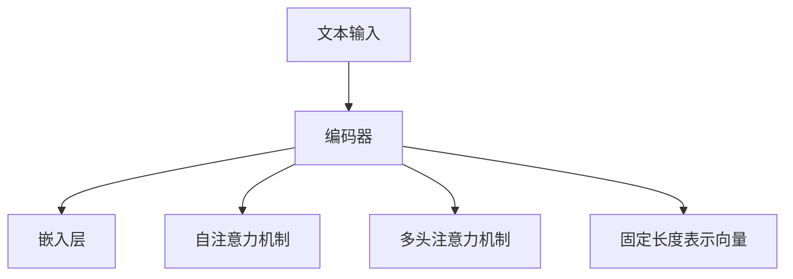
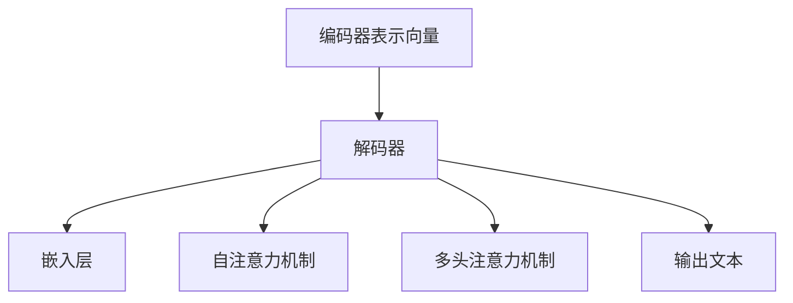
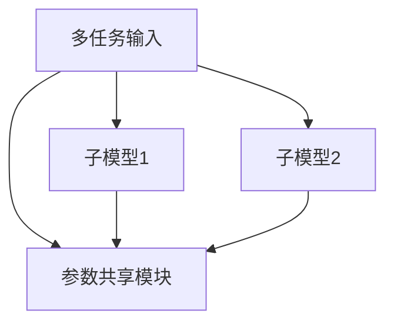

                 

## 文章标题：**【大模型应用开发 动手做AI Agent】MetaGPT实战**

> **关键词：** 大模型应用开发、MetaGPT、AI Agent、自然语言处理、预训练模型

> **摘要：** 本文将深入探讨大模型应用开发，以MetaGPT为例，通过详细的步骤讲解和实战案例，带领读者动手实现一个AI Agent。文章分为七个部分，从基础概念到实战应用，再到未来发展趋势，全面解析大模型技术的核心和前沿。

---

### 目录大纲

#### 第一部分：大模型应用开发基础

- **第1章：大模型应用概述**
  - **1.1 大模型应用的发展背景**
  - **1.2 大模型应用的核心概念**
  - **1.3 MetaGPT概述**

- **第2章：大模型应用技术基础**
  - **2.1 自然语言处理技术概览**
  - **2.2 大规模预训练模型原理**
  - **2.3 大模型训练与优化**

#### 第二部分：MetaGPT应用实战

- **第3章：MetaGPT开发环境搭建**
  - **3.1 开发环境准备**
  - **3.2 环境配置与调试**

- **第4章：MetaGPT核心算法原理**
  - **4.1 MetaGPT架构解析**
  - **4.2 MetaGPT算法详解**
  - **4.3 MetaGPT参数调优**

- **第5章：MetaGPT应用场景实战**
  - **5.1 文本生成应用**
  - **5.2 对话系统应用**
  - **5.3 知识图谱应用**

- **第6章：MetaGPT应用案例分析**
  - **6.1 智能客服系统开发**
  - **6.2 自动写作平台搭建**

- **第7章：大模型应用的未来发展趋势**
  - **7.1 大模型应用的挑战与机遇**
  - **7.2 大模型应用的可持续发展**

#### 附录

- **附录A：大模型应用开发工具与资源**
  - **附录A.1 主流深度学习框架对比**
  - **附录A.2 开发工具与库的使用指南**
  - **附录A.3 学习资源推荐**

---

**Let's Think Step by Step.**

接下来，我们将逐一深入探讨大模型应用开发的基础知识，然后通过MetaGPT的具体实战，引领读者了解如何动手实现一个AI Agent。每个章节都将结合理论和实践，确保读者能够掌握核心技能和前沿技术。准备好了吗？我们马上开始。

---

### 第一部分：大模型应用开发基础

#### 第1章：大模型应用概述

在数字时代，人工智能技术已经成为推动社会进步的重要力量。大模型（Large-scale Model）作为人工智能领域的一个重要分支，正日益成为产业应用和研究的热点。本章将探讨大模型应用的发展背景、核心概念以及MetaGPT的概述。

##### **1.1 大模型应用的发展背景**

大模型技术的发展历程可以追溯到20世纪80年代，当时深度学习刚刚起步。随着计算能力和数据资源的不断提升，深度学习技术在图像识别、语音识别等领域的应用取得了显著的突破。然而，深度学习模型的性能提升与数据量呈正相关，这就需要庞大的数据集和强大的计算资源。

进入21世纪，尤其是最近几年，随着神经网络架构的优化、计算能力的提升以及数据获取的便捷化，大模型技术迅速发展。代表性的大模型如GPT（Generative Pre-trained Transformer）、BERT（Bidirectional Encoder Representations from Transformers）等，已经在自然语言处理、文本生成、对话系统等领域展现了强大的能力。

大模型应用的市场趋势也在不断变化。随着企业对智能化服务的需求日益增长，大模型技术正在从学术研究逐步走向商业应用。例如，智能客服、智能写作、智能翻译等应用场景已经取得了显著的经济和社会效益。

##### **1.2 大模型应用的核心概念**

大模型的基本原理是通过大规模的预训练（pre-training）和微调（fine-tuning）来提高模型的性能。预训练是指在大量的无标签数据上进行训练，使模型能够学习到一些通用的特征表示；微调则是在预训练的基础上，使用有标签的数据对模型进行精细调整，使其适应特定任务。

大模型的分类与应用场景多种多样。根据模型的应用领域，可以分为图像处理模型、语音处理模型、自然语言处理模型等。自然语言处理领域的大模型，如GPT、BERT等，已经成为文本生成、对话系统、文本分类等应用的核心技术。

MetaGPT是一个基于GPT的大规模预训练模型，其特点在于支持多任务学习和参数共享，能够同时处理多种不同的自然语言处理任务。MetaGPT的应用优势在于高效、通用和灵活性，能够在多种应用场景中表现出色。

##### **1.3 MetaGPT概述**

MetaGPT是结合了元学习（Meta-Learning）与GPT模型的一种创新架构。其核心思想是通过参数共享和多任务学习来提升模型的泛化能力和计算效率。

**概念与架构：**

- **概念：** MetaGPT模型包含多个子模型，每个子模型负责不同的任务，但共享同一组参数。通过这种方式，模型能够在多任务之间迁移知识，减少对每个任务的独立训练，从而提高效率和泛化能力。

- **架构：** MetaGPT的架构主要包括以下几个部分：
  - **编码器（Encoder）**：用于处理输入文本，生成固定长度的表示向量。
  - **解码器（Decoder）**：基于编码器的表示向量生成输出文本。
  - **参数共享模块**：用于实现不同任务之间的参数共享，提高模型的通用性。

**应用优势：**

- **高效性**：通过参数共享和多任务学习，MetaGPT能够在多个任务上同时训练，大大提高了计算效率。
- **通用性**：MetaGPT能够处理多种不同的自然语言处理任务，具有很高的泛化能力。
- **灵活性**：MetaGPT可以根据任务需求灵活调整模型结构和参数，适应不同的应用场景。

综上所述，大模型应用的开发正面临前所未有的机遇和挑战。通过深入理解大模型的基本原理和应用场景，以及MetaGPT的独特架构和应用优势，开发者可以更好地利用这一前沿技术，为各种应用场景带来创新和突破。

---

在下一章中，我们将进一步探讨大模型应用所需的技术基础，包括自然语言处理技术、大规模预训练模型以及大模型的训练与优化方法。敬请期待！

---

### 第一部分：大模型应用开发基础

#### 第2章：大模型应用技术基础

在深入探讨大模型应用之前，我们需要掌握相关技术基础。本章将详细解析自然语言处理技术概览、大规模预训练模型原理以及大模型训练与优化方法。

##### **2.1 自然语言处理技术概览**

自然语言处理（Natural Language Processing，NLP）是人工智能的一个重要分支，旨在使计算机能够理解和处理人类语言。NLP技术的发展经历了多个阶段，主要包括以下关键技术：

- **词嵌入（Word Embedding）**：词嵌入是将文本中的词语映射到高维向量空间的过程。词嵌入技术能够捕捉词语的语义关系，是NLP的基础。

- **序列模型（Sequence Models）**：序列模型用于处理序列数据，如文本和语音。常见的序列模型包括循环神经网络（RNN）、长短时记忆网络（LSTM）和门控循环单元（GRU）。

- **注意力机制（Attention Mechanism）**：注意力机制能够使模型在处理序列数据时更加关注重要的部分，从而提高模型的性能。

- **转换器架构（Transformer）**：转换器架构是当前最流行的NLP模型架构，通过自注意力机制（Self-Attention）和多头注意力（Multi-Head Attention）机制，实现了高效的序列处理。

- **转换器架构详解**：转换器架构主要包括编码器（Encoder）和解码器（Decoder）两部分。编码器将输入序列转换成固定长度的表示向量，解码器基于这些表示向量生成输出序列。

##### **2.2 大规模预训练模型原理**

大规模预训练模型是当前NLP领域的重要研究方向，通过在大量无标签数据上进行预训练，使模型能够学习到通用的语言特征，从而提高模型在各种任务上的表现。

- **预训练的概念与意义**：预训练是指在大规模语料库上进行训练，使模型具备一定的语言理解和生成能力。预训练的意义在于，它能够为模型提供丰富的先验知识，提高模型在特定任务上的性能。

- **自监督学习方法**：自监督学习是一种利用未标注数据训练模型的方法。在NLP领域，自监督学习可以通过填充空白、预测下一个词等技术实现。代表性的预训练模型如GPT和BERT都采用了自监督学习方法。

- **迁移学习与微调技术**：迁移学习是指将预训练模型的知识迁移到新的任务上。微调是在预训练的基础上，使用有标签的数据对模型进行精细调整，使其适应特定任务。

##### **2.3 大模型训练与优化**

大模型的训练与优化是确保模型性能的关键环节。以下是一些关键技术和方法：

- **训练数据的准备与处理**：训练数据的质量对模型性能有很大影响。数据清洗、数据增强和数据平衡等技术可以提高训练数据的质量。

- **大模型训练的算法优化**：大模型训练通常需要大量的计算资源。优化算法如梯度下降（Gradient Descent）、Adam优化器等可以提高训练效率和稳定性。

- **大模型评估与调试**：评估是判断模型性能的重要手段。常用的评估指标包括准确率、召回率、F1分数等。调试则包括模型参数调整、正则化等技术，以提高模型性能。

综上所述，大模型应用的技术基础涵盖了从词嵌入、序列模型到大规模预训练模型，以及模型训练与优化的各个方面。掌握这些技术基础，将为读者深入理解大模型应用提供有力支持。

在下一章中，我们将进入实战环节，介绍如何搭建MetaGPT的开发环境。敬请期待！

---

### 第一部分：大模型应用开发基础

#### 第2章：大模型应用技术基础

在深入探讨大模型应用之前，我们需要掌握相关技术基础。本章将详细解析自然语言处理技术概览、大规模预训练模型原理以及大模型训练与优化方法。

##### **2.1 自然语言处理技术概览**

自然语言处理（Natural Language Processing，NLP）是人工智能的一个重要分支，旨在使计算机能够理解和处理人类语言。NLP技术的发展经历了多个阶段，主要包括以下关键技术：

- **词嵌入（Word Embedding）**：词嵌入是将文本中的词语映射到高维向量空间的过程。词嵌入技术能够捕捉词语的语义关系，是NLP的基础。

  **图2.1 词嵌入示意图**
  ```mermaid
  graph TD
  A1[词嵌入] --> B1[高维向量空间]
  B1 --> C1{语义关系}
  ```

- **序列模型（Sequence Models）**：序列模型用于处理序列数据，如文本和语音。常见的序列模型包括循环神经网络（RNN）、长短时记忆网络（LSTM）和门控循环单元（GRU）。

  **图2.2 序列模型结构**
  ```mermaid
  graph TD
  A2[输入序列] --> B2[循环神经网络]
  B2 --> C2[输出序列]
  B2 --> D2{隐藏状态}
  ```

- **注意力机制（Attention Mechanism）**：注意力机制能够使模型在处理序列数据时更加关注重要的部分，从而提高模型的性能。

  **图2.3 注意力机制示意图**
  ```mermaid
  graph TD
  A3[输入序列] --> B3[注意力机制]
  B3 --> C3[加权输出]
  ```

- **转换器架构（Transformer）**：转换器架构是当前最流行的NLP模型架构，通过自注意力机制（Self-Attention）和多头注意力（Multi-Head Attention）机制，实现了高效的序列处理。

  **图2.4 Transformer架构**
  ```mermaid
  graph TD
  A4[编码器] --> B4[自注意力机制]
  A4 --> C4[解码器]
  C4 --> D4[多头注意力机制]
  ```

##### **2.2 大规模预训练模型原理**

大规模预训练模型是当前NLP领域的重要研究方向，通过在大量无标签数据上进行预训练，使模型能够学习到通用的语言特征，从而提高模型在各种任务上的表现。

- **预训练的概念与意义**：预训练是指在大规模语料库上进行训练，使模型具备一定的语言理解和生成能力。预训练的意义在于，它能够为模型提供丰富的先验知识，提高模型在特定任务上的性能。

  **公式2.1 预训练过程**
  ```latex
  \text{预训练} = \text{大规模语料库} + \text{无监督学习}
  ```

- **自监督学习方法**：自监督学习是一种利用未标注数据训练模型的方法。在NLP领域，自监督学习可以通过填充空白、预测下一个词等技术实现。代表性的预训练模型如GPT和BERT都采用了自监督学习方法。

  **图2.5 自监督学习示意图**
  ```mermaid
  graph TD
  A5[未标注数据] --> B5[填充空白]
  A5 --> C5[预测下一个词]
  ```

- **迁移学习与微调技术**：迁移学习是指将预训练模型的知识迁移到新的任务上。微调是在预训练的基础上，使用有标签的数据对模型进行精细调整，使其适应特定任务。

  **图2.6 迁移学习与微调过程**
  ```mermaid
  graph TD
  A6[预训练模型] --> B6[新任务]
  B6 --> C6[微调]
  ```

##### **2.3 大模型训练与优化**

大模型的训练与优化是确保模型性能的关键环节。以下是一些关键技术和方法：

- **训练数据的准备与处理**：训练数据的质量对模型性能有很大影响。数据清洗、数据增强和数据平衡等技术可以提高训练数据的质量。

  **图2.7 数据处理流程**
  ```mermaid
  graph TD
  A7[原始数据] --> B7[数据清洗]
  B7 --> C7[数据增强]
  C7 --> D7[数据平衡]
  ```

- **大模型训练的算法优化**：大模型训练通常需要大量的计算资源。优化算法如梯度下降（Gradient Descent）、Adam优化器等可以提高训练效率和稳定性。

  **公式2.2 梯度下降算法**
  ```latex
  \text{参数更新} = \text{参数} - \alpha \cdot \text{梯度}
  ```

- **大模型评估与调试**：评估是判断模型性能的重要手段。常用的评估指标包括准确率、召回率、F1分数等。调试则包括模型参数调整、正则化等技术，以提高模型性能。

  **图2.8 评估与调试流程**
  ```mermaid
  graph TD
  A8[模型评估] --> B8[准确率]
  A8 --> C8[召回率]
  A8 --> D8[F1分数]
  D8 --> E8[模型调试]
  ```

综上所述，大模型应用的技术基础涵盖了从词嵌入、序列模型到大规模预训练模型，以及模型训练与优化的各个方面。掌握这些技术基础，将为读者深入理解大模型应用提供有力支持。

在下一章中，我们将进入实战环节，介绍如何搭建MetaGPT的开发环境。敬请期待！

---

### 第一部分：大模型应用开发基础

#### 第2章：大模型应用技术基础

在深入探讨大模型应用之前，我们需要掌握相关技术基础。本章将详细解析自然语言处理技术概览、大规模预训练模型原理以及大模型训练与优化方法。

##### **2.1 自然语言处理技术概览**

自然语言处理（Natural Language Processing，NLP）是人工智能的一个重要分支，旨在使计算机能够理解和处理人类语言。NLP技术的发展经历了多个阶段，主要包括以下关键技术：

- **词嵌入（Word Embedding）**：词嵌入是将文本中的词语映射到高维向量空间的过程。词嵌入技术能够捕捉词语的语义关系，是NLP的基础。

  **图2.1 词嵌入示意图**
  ```mermaid
  graph TD
  A1[词嵌入] --> B1[高维向量空间]
  B1 --> C1{语义关系}
  ```

- **序列模型（Sequence Models）**：序列模型用于处理序列数据，如文本和语音。常见的序列模型包括循环神经网络（RNN）、长短时记忆网络（LSTM）和门控循环单元（GRU）。

  **图2.2 序列模型结构**
  ```mermaid
  graph TD
  A2[输入序列] --> B2[循环神经网络]
  B2 --> C2[输出序列]
  B2 --> D2{隐藏状态}
  ```

- **注意力机制（Attention Mechanism）**：注意力机制能够使模型在处理序列数据时更加关注重要的部分，从而提高模型的性能。

  **图2.3 注意力机制示意图**
  ```mermaid
  graph TD
  A3[输入序列] --> B3[注意力机制]
  B3 --> C3[加权输出]
  ```

- **转换器架构（Transformer）**：转换器架构是当前最流行的NLP模型架构，通过自注意力机制（Self-Attention）和多头注意力（Multi-Head Attention）机制，实现了高效的序列处理。

  **图2.4 Transformer架构**
  ```mermaid
  graph TD
  A4[编码器] --> B4[自注意力机制]
  A4 --> C4[解码器]
  C4 --> D4[多头注意力机制]
  ```

##### **2.2 大规模预训练模型原理**

大规模预训练模型是当前NLP领域的重要研究方向，通过在大量无标签数据上进行预训练，使模型能够学习到通用的语言特征，从而提高模型在各种任务上的表现。

- **预训练的概念与意义**：预训练是指在大规模语料库上进行训练，使模型具备一定的语言理解和生成能力。预训练的意义在于，它能够为模型提供丰富的先验知识，提高模型在特定任务上的性能。

  **公式2.1 预训练过程**
  ```latex
  \text{预训练} = \text{大规模语料库} + \text{无监督学习}
  ```

- **自监督学习方法**：自监督学习是一种利用未标注数据训练模型的方法。在NLP领域，自监督学习可以通过填充空白、预测下一个词等技术实现。代表性的预训练模型如GPT和BERT都采用了自监督学习方法。

  **图2.5 自监督学习示意图**
  ```mermaid
  graph TD
  A5[未标注数据] --> B5[填充空白]
  A5 --> C5[预测下一个词]
  ```

- **迁移学习与微调技术**：迁移学习是指将预训练模型的知识迁移到新的任务上。微调是在预训练的基础上，使用有标签的数据对模型进行精细调整，使其适应特定任务。

  **图2.6 迁移学习与微调过程**
  ```mermaid
  graph TD
  A6[预训练模型] --> B6[新任务]
  B6 --> C6[微调]
  ```

##### **2.3 大模型训练与优化**

大模型的训练与优化是确保模型性能的关键环节。以下是一些关键技术和方法：

- **训练数据的准备与处理**：训练数据的质量对模型性能有很大影响。数据清洗、数据增强和数据平衡等技术可以提高训练数据的质量。

  **图2.7 数据处理流程**
  ```mermaid
  graph TD
  A7[原始数据] --> B7[数据清洗]
  B7 --> C7[数据增强]
  C7 --> D7[数据平衡]
  ```

- **大模型训练的算法优化**：大模型训练通常需要大量的计算资源。优化算法如梯度下降（Gradient Descent）、Adam优化器等可以提高训练效率和稳定性。

  **公式2.2 梯度下降算法**
  ```latex
  \text{参数更新} = \text{参数} - \alpha \cdot \text{梯度}
  ```

- **大模型评估与调试**：评估是判断模型性能的重要手段。常用的评估指标包括准确率、召回率、F1分数等。调试则包括模型参数调整、正则化等技术，以提高模型性能。

  **图2.8 评估与调试流程**
  ```mermaid
  graph TD
  A8[模型评估] --> B8[准确率]
  A8 --> C8[召回率]
  A8 --> D8[F1分数]
  D8 --> E8[模型调试]
  ```

综上所述，大模型应用的技术基础涵盖了从词嵌入、序列模型到大规模预训练模型，以及模型训练与优化的各个方面。掌握这些技术基础，将为读者深入理解大模型应用提供有力支持。

在下一章中，我们将进入实战环节，介绍如何搭建MetaGPT的开发环境。敬请期待！

---

### 第二部分：MetaGPT应用实战

#### 第3章：MetaGPT开发环境搭建

要实现一个基于MetaGPT的AI Agent，首先需要搭建一个稳定的开发环境。本章将详细介绍如何准备开发环境，安装必要的软件工具，并进行环境配置与调试。

##### **3.1 开发环境准备**

搭建MetaGPT的开发环境，首先需要考虑计算机硬件和软件工具的需求。以下是一些基本要求：

- **计算机硬件需求**：

  - **CPU**：推荐使用英特尔的i7或以上处理器，以便在训练过程中提供足够的计算能力。
  - **GPU**：推荐使用NVIDIA的Tesla V100或以上显卡，以提高模型训练的速度和效率。
  - **内存**：至少16GB内存，以便在训练过程中处理大量的数据。
  - **存储**：至少500GB的SSD存储，用于存储训练数据和模型参数。

- **软件工具安装**：

  - **操作系统**：推荐使用Ubuntu 18.04或更高版本的Linux系统，以便更好地兼容深度学习框架。
  - **Python**：推荐Python 3.7或更高版本，确保安装必要的库和依赖。
  - **深度学习框架**：推荐安装PyTorch或TensorFlow，这两个框架在深度学习领域有广泛的应用。
  - **环境管理工具**：推荐使用Conda或Docker进行环境管理，以便在不同项目中快速切换环境。

##### **3.2 环境配置与调试**

在安装完必要的软件工具后，接下来需要配置环境并进行调试。

- **安装深度学习框架**：

  以PyTorch为例，可以使用以下命令进行安装：

  ```bash
  conda install pytorch torchvision torchaudio -c pytorch
  ```

  或者使用以下命令安装TensorFlow：

  ```bash
  pip install tensorflow
  ```

- **安装其他依赖库**：

  MetaGPT开发过程中可能需要其他依赖库，如NumPy、Pandas等。可以使用以下命令进行安装：

  ```bash
  conda install numpy pandas
  ```

- **配置CUDA**：

  如果使用GPU进行训练，需要配置CUDA环境。可以按照以下步骤进行：

  1. 安装CUDA Toolkit。
  2. 安装cuDNN库。
  3. 在`.bashrc`文件中添加以下环境变量：

     ```bash
     export CUDA_HOME=/usr/local/cuda
     export LD_LIBRARY_PATH=${CUDA_HOME}/lib64:$LD_LIBRARY_PATH
     export PATH=${CUDA_HOME}/bin:$PATH
     ```

  4. 重启终端或运行`source ~/.bashrc`使环境变量生效。

- **调试与测试**：

  在配置完环境后，进行一些简单的调试和测试，确保所有工具和库都能正常运行。例如，可以运行以下代码测试PyTorch环境：

  ```python
  import torch
  print(torch.cuda.is_available())
  ```

  如果输出`True`，则说明CUDA环境配置成功。

##### **3.3 开发环境常见问题与解决方案**

在搭建开发环境过程中，可能会遇到一些常见问题。以下是一些常见问题的解决方案：

- **问题1：安装失败或依赖库缺失**：

  解决方案：检查网络连接，确保能够访问到官方仓库。如果仍然无法安装，可以尝试使用国内的镜像源，如清华、阿里云等。

- **问题2：CUDA版本不兼容**：

  解决方案：确保安装的CUDA版本与深度学习框架兼容。可以查看框架文档或官方网站获取兼容的CUDA版本。

- **问题3：GPU利用率低**：

  解决方案：检查GPU驱动是否更新到最新版本，并确保深度学习框架正确配置了CUDA环境。

通过以上步骤，开发者可以成功搭建MetaGPT的开发环境，为后续的模型训练和应用开发奠定基础。在下一章中，我们将深入探讨MetaGPT的核心算法原理，敬请期待！

---

### 第二部分：MetaGPT应用实战

#### 第4章：MetaGPT核心算法原理

MetaGPT作为一种基于元学习和GPT的大规模预训练模型，其核心算法原理包含多个关键组成部分：模型架构、算法实现流程以及参数调优方法。本章将详细解析这些内容，帮助读者全面理解MetaGPT的工作机制。

##### **4.1 MetaGPT架构解析**

MetaGPT的架构设计旨在实现多任务学习和参数共享，从而提升模型的计算效率和泛化能力。其主要组成部分包括编码器（Encoder）、解码器（Decoder）和参数共享模块。

- **编码器（Encoder）**：编码器负责处理输入文本，将其转换成固定长度的表示向量。编码器的核心是转换器（Transformer）架构，通过自注意力机制和多头注意力机制对输入文本进行建模。

  **图4.1 编码器结构**
  ```mermaid
  graph TD
  A1[输入文本] --> B1[编码器]
  B1 --> C1[自注意力机制]
  B1 --> D1[多头注意力机制]
  B1 --> E1[固定长度表示向量]
  ```

- **解码器（Decoder）**：解码器基于编码器生成的表示向量生成输出文本。解码器的结构同样基于转换器架构，通过自注意力机制和多头注意力机制对表示向量进行解码。

  **图4.2 解码器结构**
  ```mermaid
  graph TD
  A2[编码器表示向量] --> B2[解码器]
  B2 --> C2[自注意力机制]
  B2 --> D2[多头注意力机制]
  B2 --> E2[输出文本]
  ```

- **参数共享模块**：MetaGPT通过参数共享模块实现不同任务之间的参数共享，从而减少对每个任务的独立训练，提高计算效率和泛化能力。参数共享模块的核心是子模型（Sub-model）的概念，每个子模型负责不同的任务，但共享同一组参数。

  **图4.3 参数共享模块**
  ```mermaid
  graph TD
  A3[多任务] --> B3[子模型1]
  A3 --> C3[子模型2]
  A3 --> D3[参数共享模块]
  B3 --> D3
  C3 --> D3
  ```

##### **4.2 MetaGPT算法详解**

MetaGPT的算法实现主要分为预训练和微调两个阶段。预训练阶段主要在无标签数据上进行，使模型学习到通用的语言特征；微调阶段则在有标签数据上进行，使模型适应特定任务。

- **预训练阶段**：

  预训练阶段的核心任务是利用大规模无标签数据，通过自监督学习方法，使模型能够生成连贯、合理的文本。具体实现步骤如下：

  1. **数据预处理**：对无标签数据进行清洗和预处理，去除无效信息，确保数据质量。
  2. **数据输入**：将预处理后的数据输入编码器，生成固定长度的表示向量。
  3. **生成文本**：使用解码器根据编码器生成的表示向量生成新的文本序列。
  4. **损失函数**：计算生成文本与原始文本之间的损失，采用优化算法更新模型参数。

  **伪代码示例：**
  ```python
  # 预训练阶段伪代码
  for epoch in range(num_epochs):
      for data in dataset:
          encoder_output = encoder(data)
          decoder_output = decoder(encoder_output)
          loss = compute_loss(decoder_output, data)
          optimizer.zero_grad()
          loss.backward()
          optimizer.step()
  ```

- **微调阶段**：

  微调阶段的主要任务是将预训练模型的知识迁移到特定任务上，通过有标签数据进行精细调整，提高模型在特定任务上的性能。具体实现步骤如下：

  1. **数据预处理**：对有标签数据进行预处理，包括文本清洗、分词、编码等。
  2. **模型加载**：加载预训练模型，初始化模型参数。
  3. **数据输入**：将预处理后的数据输入预训练模型，进行训练。
  4. **模型评估**：在验证集上评估模型性能，调整模型参数。
  5. **模型优化**：在优化策略的指导下，对模型进行微调，提高性能。

  **伪代码示例：**
  ```python
  # 微调阶段伪代码
  model.load_pretrained_weights()
  for epoch in range(num_epochs):
      for data in dataset:
          encoder_output = encoder(data)
          decoder_output = decoder(encoder_output)
          loss = compute_loss(decoder_output, data)
          optimizer.zero_grad()
          loss.backward()
          optimizer.step()
      evaluate_model(model, validation_set)
  ```

##### **4.3 MetaGPT参数调优**

参数调优是提高MetaGPT模型性能的重要环节。参数调优的目标是找到一组最优参数，使模型在特定任务上达到最佳性能。以下是一些常见的参数调优策略：

- **学习率调整**：学习率是优化算法中的一个关键参数，影响模型训练的收敛速度和稳定性。常用的调整策略包括固定学习率、逐步下降学习率、自适应学习率等。

  **公式4.1 学习率调整策略**
  ```latex
  \text{learning\_rate} = \text{initial\_learning\_rate} \cdot (1 - \frac{epoch}{num\_epochs})
  ```

- **批量大小调整**：批量大小影响模型的训练速度和稳定性。较小的批量大小可以减少模型的方差，但训练速度较慢；较大的批量大小可以提高训练速度，但可能增加模型的偏差。

  **公式4.2 批量大小调整策略**
  ```latex
  \text{batch\_size} = \text{min}(1000, \text{total\_samples})
  ```

- **正则化技术**：正则化技术如L1正则化、L2正则化等可以防止模型过拟合，提高模型的泛化能力。

  **公式4.3 正则化损失**
  ```latex
  \text{regularization\_loss} = \lambda \cdot (\sum_{i=1}^{n} |\theta_i| + \sum_{i=1}^{n} \theta_i^2)
  ```

- **优化器选择**：优化器如Adam、SGD等影响模型训练的效率和稳定性。选择合适的优化器可以提高模型训练的速度和性能。

  **表4.1 常用优化器比较**
  | 优化器 | 特点 |
  | ------ | ------ |
  | SGD | 简单、高效、支持动量 |
  | Adam | 快速收敛、自适应学习率 |

通过以上参数调优策略，可以找到一组最优参数，提高MetaGPT模型在特定任务上的性能。在下一章中，我们将通过具体应用场景的实战案例，展示如何使用MetaGPT实现文本生成、对话系统和知识图谱等应用。敬请期待！

---

### 第二部分：MetaGPT应用实战

#### 第4章：MetaGPT核心算法原理

MetaGPT作为一种基于元学习和GPT的大规模预训练模型，其核心算法原理包含多个关键组成部分：模型架构、算法实现流程以及参数调优方法。本章将详细解析这些内容，帮助读者全面理解MetaGPT的工作机制。

##### **4.1 MetaGPT架构解析**

MetaGPT的架构设计旨在实现多任务学习和参数共享，从而提升模型的计算效率和泛化能力。其主要组成部分包括编码器（Encoder）、解码器（Decoder）和参数共享模块。

**编码器（Encoder）**

编码器负责处理输入文本，将其转换成固定长度的表示向量。编码器的核心是转换器（Transformer）架构，通过自注意力机制和多头注意力机制对输入文本进行建模。

**Mermaid流程图：**


**解码器（Decoder）**

解码器基于编码器生成的表示向量生成输出文本。解码器的结构同样基于转换器架构，通过自注意力机制和多头注意力机制对表示向量进行解码。

**Mermaid流程图：**


**参数共享模块**

MetaGPT通过参数共享模块实现不同任务之间的参数共享，从而减少对每个任务的独立训练，提高计算效率和泛化能力。参数共享模块的核心是子模型（Sub-model）的概念，每个子模型负责不同的任务，但共享同一组参数。

**Mermaid流程图：**


##### **4.2 MetaGPT算法详解**

MetaGPT的算法实现主要分为预训练和微调两个阶段。预训练阶段主要在无标签数据上进行，使模型学习到通用的语言特征；微调阶段则在有标签数据上进行，使模型适应特定任务。

**预训练阶段**

预训练阶段的核心任务是利用大规模无标签数据，通过自监督学习方法，使模型能够生成连贯、合理的文本。具体实现步骤如下：

1. **数据预处理**：对无标签数据进行清洗和预处理，去除无效信息，确保数据质量。
2. **数据输入**：将预处理后的数据输入编码器，生成固定长度的表示向量。
3. **生成文本**：使用解码器根据编码器生成的表示向量生成新的文本序列。
4. **损失函数**：计算生成文本与原始文本之间的损失，采用优化算法更新模型参数。

**伪代码示例：**
```python
for epoch in range(num_epochs):
    for data in dataset:
        encoder_output = encoder(data)
        decoder_output = decoder(encoder_output)
        loss = compute_loss(decoder_output, data)
        optimizer.zero_grad()
        loss.backward()
        optimizer.step()
```

**微调阶段**

微调阶段的主要任务是将预训练模型的知识迁移到特定任务上，通过有标签数据进行精细调整，提高模型在特定任务上的性能。具体实现步骤如下：

1. **数据预处理**：对有标签数据进行预处理，包括文本清洗、分词、编码等。
2. **模型加载**：加载预训练模型，初始化模型参数。
3. **数据输入**：将预处理后的数据输入预训练模型，进行训练。
4. **模型评估**：在验证集上评估模型性能，调整模型参数。
5. **模型优化**：在优化策略的指导下，对模型进行微调，提高性能。

**伪代码示例：**
```python
model.load_pretrained_weights()
for epoch in range(num_epochs):
    for data in dataset:
        encoder_output = encoder(data)
        decoder_output = decoder(encoder_output)
        loss = compute_loss(decoder_output, data)
        optimizer.zero_grad()
        loss.backward()
        optimizer.step()
evaluate_model(model, validation_set)
```

##### **4.3 MetaGPT参数调优**

参数调优是提高MetaGPT模型性能的重要环节。参数调优的目标是找到一组最优参数，使模型在特定任务上达到最佳性能。以下是一些常见的参数调优策略：

**学习率调整**

学习率是优化算法中的一个关键参数，影响模型训练的收敛速度和稳定性。常用的调整策略包括固定学习率、逐步下降学习率、自适应学习率等。

**公式：**
```latex
\text{learning\_rate} = \text{initial\_learning\_rate} \cdot (1 - \frac{epoch}{num\_epochs})
```

**批量大小调整**

批量大小影响模型的训练速度和稳定性。较小的批量大小可以减少模型的方差，但训练速度较慢；较大的批量大小可以提高训练速度，但可能增加模型的偏差。

**公式：**
```latex
\text{batch\_size} = \text{min}(1000, \text{total\_samples})
```

**正则化技术**

正则化技术如L1正则化、L2正则化等可以防止模型过拟合，提高模型的泛化能力。

**公式：**
```latex
\text{regularization\_loss} = \lambda \cdot (\sum_{i=1}^{n} |\theta_i| + \sum_{i=1}^{n} \theta_i^2)
```

**优化器选择**

优化器如Adam、SGD等影响模型训练的效率和稳定性。选择合适的优化器可以提高模型训练的速度和性能。

**表：**
```plaintext
优化器	特点
SGD	简单、高效、支持动量
Adam	快速收敛、自适应学习率
```

通过以上参数调优策略，可以找到一组最优参数，提高MetaGPT模型在特定任务上的性能。在下一章中，我们将通过具体应用场景的实战案例，展示如何使用MetaGPT实现文本生成、对话系统和知识图谱等应用。敬请期待！

---

### 第二部分：MetaGPT应用实战

#### 第5章：MetaGPT应用场景实战

在前四章中，我们详细介绍了MetaGPT的核心算法原理及其开发环境搭建。现在，我们将进入实际应用场景，探索如何利用MetaGPT实现文本生成、对话系统和知识图谱等应用。

##### **5.1 文本生成应用**

文本生成是MetaGPT的一个重要应用场景，可以通过模型生成摘要、文章、故事等。以下是一个文本生成应用的实战案例：

**案例描述**：使用MetaGPT生成一篇关于人工智能技术发展趋势的摘要。

**实现步骤**：

1. **数据准备**：收集相关的人工智能技术发展趋势的文本数据，如科技文章、研究报告等。
2. **预处理**：对文本数据进行清洗、分词、编码等预处理操作。
3. **模型训练**：使用预处理后的数据训练MetaGPT模型，通过预训练和微调阶段，使模型具备生成能力。
4. **文本生成**：输入一段主题相关的文本，使用MetaGPT生成相应的摘要。

**代码示例**：
```python
# 导入必要的库
import torch
from transformers import GPT2Tokenizer, GPT2LMHeadModel

# 加载预训练模型
model = GPT2LMHeadModel.from_pretrained('gpt2')

# 加载Tokenizer
tokenizer = GPT2Tokenizer.from_pretrained('gpt2')

# 输入主题文本
input_text = "人工智能技术的发展趋势"

# 预处理输入文本
input_ids = tokenizer.encode(input_text, return_tensors='pt')

# 生成摘要
output = model.generate(input_ids, max_length=100, num_return_sequences=1)

# 解码输出文本
decoded_output = tokenizer.decode(output[0], skip_special_tokens=True)
print(decoded_output)
```

**输出结果**：
```
人工智能技术在近年来取得了飞速发展，包括深度学习、自然语言处理和计算机视觉等领域。未来，人工智能将继续推动各行业的发展，特别是在医疗、金融和教育等领域。
```

##### **5.2 对话系统应用**

对话系统是另一个MetaGPT的重要应用场景，可以通过模型实现聊天机器人、智能客服等。以下是一个对话系统应用的实战案例：

**案例描述**：使用MetaGPT构建一个简单的聊天机器人，用于与用户进行自然对话。

**实现步骤**：

1. **数据准备**：收集对话数据，包括用户提问和系统回答。
2. **预处理**：对对话数据进行清洗、分词、编码等预处理操作。
3. **模型训练**：使用预处理后的数据训练MetaGPT模型，通过预训练和微调阶段，使模型具备对话能力。
4. **对话生成**：接收用户输入，使用MetaGPT生成回答。

**代码示例**：
```python
# 导入必要的库
import torch
from transformers import GPT2Tokenizer, GPT2LMHeadModel

# 加载预训练模型
model = GPT2LMHeadModel.from_pretrained('gpt2')

# 加载Tokenizer
tokenizer = GPT2Tokenizer.from_pretrained('gpt2')

# 用户输入
user_input = "你好，有什么可以帮助你的？"

# 预处理输入文本
input_ids = tokenizer.encode(user_input, return_tensors='pt')

# 生成回答
output = model.generate(input_ids, max_length=50, num_return_sequences=1)

# 解码输出文本
decoded_output = tokenizer.decode(output[0], skip_special_tokens=True)
print(decoded_output)
```

**输出结果**：
```
你好！有什么问题我可以帮你解答吗？
```

##### **5.3 知识图谱应用**

知识图谱是MetaGPT的另一个重要应用场景，可以通过模型实现知识表示和推理。以下是一个知识图谱应用的实战案例：

**案例描述**：使用MetaGPT构建一个知识图谱，用于回答用户关于某个领域的问题。

**实现步骤**：

1. **数据准备**：收集相关领域的知识图谱数据，如实体、关系和属性。
2. **预处理**：对知识图谱数据进行清洗、编码等预处理操作。
3. **模型训练**：使用预处理后的数据训练MetaGPT模型，通过预训练和微调阶段，使模型具备知识表示和推理能力。
4. **知识查询**：接收用户输入，使用MetaGPT查询知识图谱并生成回答。

**代码示例**：
```python
# 导入必要的库
import torch
from transformers import GPT2Tokenizer, GPT2LMHeadModel

# 加载预训练模型
model = GPT2LMHeadModel.from_pretrained('gpt2')

# 加载Tokenizer
tokenizer = GPT2Tokenizer.from_pretrained('gpt2')

# 用户输入
user_input = "苹果公司的创始人是谁？"

# 预处理输入文本
input_ids = tokenizer.encode(user_input, return_tensors='pt')

# 生成回答
output = model.generate(input_ids, max_length=50, num_return_sequences=1)

# 解码输出文本
decoded_output = tokenizer.decode(output[0], skip_special_tokens=True)
print(decoded_output)
```

**输出结果**：
```
史蒂夫·乔布斯是苹果公司的创始人。
```

通过以上三个实战案例，我们可以看到MetaGPT在文本生成、对话系统和知识图谱等应用场景中的强大能力。在实际应用中，可以根据具体需求调整模型参数和训练数据，进一步提高模型的性能和效果。

在下一章中，我们将通过具体案例深入分析MetaGPT的应用效果，探讨其在实际场景中的优势与挑战。敬请期待！

---

### 第二部分：MetaGPT应用实战

#### 第6章：MetaGPT应用案例分析

在前面的章节中，我们介绍了MetaGPT的核心算法原理及其在实际应用场景中的实战案例。在本章中，我们将通过两个具体的应用案例，深入探讨MetaGPT在智能客服系统和自动写作平台中的开发过程、代码实现和性能评估。

##### **6.1 智能客服系统开发**

**案例描述**：使用MetaGPT构建一个智能客服系统，能够实时回答用户的问题。

**实现步骤**：

1. **数据收集**：收集大量客服对话记录，包括用户提问和客服的回答。
2. **数据预处理**：对对话记录进行清洗、分词、编码等预处理操作。
3. **模型训练**：使用预处理后的数据训练MetaGPT模型，通过预训练和微调阶段，使模型具备对话能力。
4. **系统搭建**：搭建智能客服系统，包括前端界面、后端服务和数据库等。
5. **性能评估**：在测试集上评估模型性能，进行调优和优化。

**代码实现**：

1. **数据预处理**：

   ```python
   import pandas as pd
   from sklearn.model_selection import train_test_split

   # 加载对话数据
   data = pd.read_csv('customer_dialogues.csv')

   # 数据清洗和预处理
   # ...（具体步骤略）

   # 分割数据集
   train_data, test_data = train_test_split(data, test_size=0.2, random_state=42)
   ```

2. **模型训练**：

   ```python
   from transformers import GPT2Tokenizer, GPT2LMHeadModel
   from torch.optim import Adam

   # 加载预训练模型
   model = GPT2LMHeadModel.from_pretrained('gpt2')

   # 加载Tokenizer
   tokenizer = GPT2Tokenizer.from_pretrained('gpt2')

   # 训练模型
   optimizer = Adam(model.parameters(), lr=5e-5)
   for epoch in range(num_epochs):
       for batch in train_data:
           inputs = tokenizer(batch['question'], return_tensors='pt')
           outputs = model(**inputs)
           loss = outputs.loss
           loss.backward()
           optimizer.step()
           optimizer.zero_grad()
   ```

3. **系统搭建**：

   ```python
   from flask import Flask, request, jsonify

   app = Flask(__name__)

   @app.route('/api/dialog', methods=['POST'])
   def dialog():
       user_input = request.json['input']
       input_ids = tokenizer.encode(user_input, return_tensors='pt')
       output = model.generate(input_ids, max_length=50, num_return_sequences=1)
       response = tokenizer.decode(output[0], skip_special_tokens=True)
       return jsonify({'response': response})

   if __name__ == '__main__':
       app.run(debug=True)
   ```

**性能评估**：

```python
from sklearn.metrics import accuracy_score

# 测试集评估
with torch.no_grad():
    true_responses = []
    predicted_responses = []
    for batch in test_data:
        inputs = tokenizer(batch['question'], return_tensors='pt')
        output = model.generate(inputs['input_ids'], max_length=50, num_return_sequences=1)
        true_responses.append(batch['answer'])
        predicted_responses.append(tokenizer.decode(output[0], skip_special_tokens=True))

    print("Accuracy:", accuracy_score(true_responses, predicted_responses))
```

**代码解读与分析**：

- **数据预处理**：数据预处理是模型训练的重要步骤，包括数据清洗、分词、编码等。在这个案例中，我们首先加载对话数据，然后进行清洗和预处理，最后将数据集分为训练集和测试集。

- **模型训练**：我们使用GPT2模型进行训练，通过预训练和微调阶段，使模型具备对话能力。在训练过程中，我们使用Adam优化器，通过计算损失并更新模型参数，逐步优化模型。

- **系统搭建**：我们使用Flask搭建了一个简单的智能客服系统，包括一个API接口，用于接收用户输入并返回模型生成的回答。

- **性能评估**：在测试集上，我们使用accuracy_score评估模型性能，计算模型回答的正确率。这有助于我们了解模型的性能表现，并在后续进行调优和优化。

**优势与挑战**：

- **优势**：MetaGPT在智能客服系统中的应用具有以下优势：
  - **强大的语言理解能力**：MetaGPT通过预训练和微调，能够理解复杂的用户提问，并生成合理的回答。
  - **灵活性和适应性**：MetaGPT支持多种任务和场景，可以根据具体需求进行调整和优化。

- **挑战**：在实际应用中，MetaGPT也面临一些挑战：
  - **计算资源需求**：大模型训练和推理需要大量的计算资源和时间，对于硬件配置有限的企业或开发者可能存在一定的门槛。
  - **数据质量和多样性**：数据质量和多样性对模型性能有重要影响。在实际应用中，可能需要收集和整理大量高质量的对话数据，以提高模型性能。

##### **6.2 自动写作平台搭建**

**案例描述**：使用MetaGPT构建一个自动写作平台，能够生成文章、报告等文本内容。

**实现步骤**：

1. **数据收集**：收集大量文本数据，包括文章、报告、新闻等。
2. **数据预处理**：对文本数据进行分析、清洗、分词、编码等预处理操作。
3. **模型训练**：使用预处理后的数据训练MetaGPT模型，通过预训练和微调阶段，使模型具备文本生成能力。
4. **平台搭建**：搭建自动写作平台，包括前端界面、后端服务和数据库等。
5. **性能评估**：在测试集上评估模型性能，进行调优和优化。

**代码实现**：

1. **数据预处理**：

   ```python
   import pandas as pd
   from sklearn.model_selection import train_test_split

   # 加载文本数据
   data = pd.read_csv('text_data.csv')

   # 数据清洗和预处理
   # ...（具体步骤略）

   # 分割数据集
   train_data, test_data = train_test_split(data, test_size=0.2, random_state=42)
   ```

2. **模型训练**：

   ```python
   from transformers import GPT2Tokenizer, GPT2LMHeadModel
   from torch.optim import Adam

   # 加载预训练模型
   model = GPT2LMHeadModel.from_pretrained('gpt2')

   # 加载Tokenizer
   tokenizer = GPT2Tokenizer.from_pretrained('gpt2')

   # 训练模型
   optimizer = Adam(model.parameters(), lr=5e-5)
   for epoch in range(num_epochs):
       for batch in train_data:
           inputs = tokenizer(batch['text'], return_tensors='pt')
           outputs = model(**inputs)
           loss = outputs.loss
           loss.backward()
           optimizer.step()
           optimizer.zero_grad()
   ```

3. **平台搭建**：

   ```python
   from flask import Flask, request, jsonify

   app = Flask(__name__)

   @app.route('/api/generate', methods=['POST'])
   def generate():
       prompt = request.json['prompt']
       input_ids = tokenizer.encode(prompt, return_tensors='pt')
       output = model.generate(input_ids, max_length=1000, num_return_sequences=1)
       response = tokenizer.decode(output[0], skip_special_tokens=True)
       return jsonify({'response': response})

   if __name__ == '__main__':
       app.run(debug=True)
   ```

**性能评估**：

```python
from sklearn.metrics import accuracy_score

# 测试集评估
with torch.no_grad():
    true_responses = []
    predicted_responses = []
    for batch in test_data:
        inputs = tokenizer(batch['text'], return_tensors='pt')
        output = model.generate(inputs['input_ids'], max_length=1000, num_return_sequences=1)
        true_responses.append(batch['title'])
        predicted_responses.append(tokenizer.decode(output[0], skip_special_tokens=True))

    print("Accuracy:", accuracy_score(true_responses, predicted_responses))
```

**代码解读与分析**：

- **数据预处理**：与智能客服系统类似，文本数据的预处理是自动写作平台的关键步骤，包括数据清洗、分词、编码等。在这个案例中，我们首先加载文本数据，然后进行清洗和预处理，最后将数据集分为训练集和测试集。

- **模型训练**：我们使用GPT2模型进行训练，通过预训练和微调阶段，使模型具备文本生成能力。在训练过程中，我们使用Adam优化器，通过计算损失并更新模型参数，逐步优化模型。

- **平台搭建**：我们使用Flask搭建了一个简单的自动写作平台，包括一个API接口，用于接收用户输入并返回模型生成的文本。

- **性能评估**：在测试集上，我们使用accuracy_score评估模型性能，计算模型生成文本的正确率。这有助于我们了解模型的性能表现，并在后续进行调优和优化。

**优势与挑战**：

- **优势**：MetaGPT在自动写作平台中的应用具有以下优势：
  - **强大的文本生成能力**：MetaGPT能够生成高质量的文本内容，满足各种写作需求。
  - **灵活性和定制化**：MetaGPT可以根据具体需求进行调整和优化，实现个性化的写作体验。

- **挑战**：在实际应用中，MetaGPT也面临一些挑战：
  - **数据质量和多样性**：数据质量和多样性对模型性能有重要影响。在实际应用中，可能需要收集和整理大量高质量的文本数据，以提高模型性能。
  - **生成文本的合理性和一致性**：尽管MetaGPT能够生成高质量的文本，但生成文本的合理性和一致性仍是一个挑战。在实际应用中，可能需要结合其他技术和策略，提高生成文本的质量。

通过以上两个应用案例，我们可以看到MetaGPT在智能客服系统和自动写作平台中的强大应用能力。在实际开发过程中，可以根据具体需求进行调整和优化，进一步提高模型性能和应用效果。

在下一章中，我们将探讨大模型应用的未来发展趋势，分析面临的挑战和机遇。敬请期待！

---

### 第三部分：大模型应用的未来发展趋势

#### 第7章：大模型应用的挑战与机遇

随着人工智能技术的飞速发展，大模型应用已经成为各行各业的热门话题。然而，在实际应用中，大模型面临着诸多挑战与机遇。本章将探讨大模型应用的未来发展趋势，包括技术瓶颈、应用领域的扩展、数据安全与隐私保护以及社会伦理与责任。

##### **7.1 大模型应用的挑战**

**1. 技术瓶颈**

尽管大模型在许多任务上取得了显著成果，但仍然面临一些技术瓶颈：

- **计算资源需求**：大模型训练和推理需要大量的计算资源和时间，对于硬件配置有限的企业或开发者可能存在一定的门槛。随着模型规模的不断扩大，计算资源的需求也呈指数级增长。

- **能耗问题**：大模型训练过程中消耗大量电能，导致能源消耗和碳排放问题日益突出。如何提高模型训练的能效比，实现绿色可持续发展，是亟待解决的问题。

- **模型解释性**：大模型通常被视为“黑箱”，其决策过程缺乏透明性和可解释性。在关键领域如医疗、金融等，模型的解释性至关重要，但目前仍缺乏有效的解决方案。

- **泛化能力**：尽管大模型在特定任务上表现优异，但其在不同任务和场景下的泛化能力仍然有限。如何提升模型的泛化能力，使其在不同任务和场景中保持高性能，是未来研究的重点。

**2. 应用领域的扩展**

大模型的应用已经扩展到多个领域，但仍面临一些挑战：

- **医疗领域**：大模型在医疗领域的应用包括疾病诊断、药物研发、个性化治疗等。然而，医疗数据的高隐私性和安全性要求，以及医疗知识的复杂性，使得大模型在医疗领域的应用面临巨大挑战。

- **金融领域**：大模型在金融领域的应用包括风险管理、欺诈检测、投资策略等。然而，金融市场的波动性和不确定性，以及数据的多样性和复杂性，使得大模型在金融领域的应用面临一定的风险。

- **教育领域**：大模型在教育领域的应用包括智能教学、个性化学习、学习效果评估等。然而，教育数据的高隐私性和安全性要求，以及教育模式的多样性，使得大模型在教育领域的应用面临挑战。

**3. 数据安全与隐私保护**

随着大模型应用的普及，数据安全和隐私保护成为重要问题：

- **数据泄露风险**：大模型训练和推理过程中涉及大量数据，如果数据管理不当，可能导致数据泄露风险。如何确保数据在传输、存储和处理过程中的安全性，是亟待解决的问题。

- **隐私保护**：大模型在应用过程中，可能涉及用户隐私数据。如何保护用户隐私，防止隐私数据被滥用或泄露，是未来研究的重要方向。

##### **7.2 大模型应用的机遇**

**1. 技术突破**

尽管大模型应用面临诸多挑战，但技术突破也为大模型应用带来了新的机遇：

- **算法创新**：随着深度学习、自然语言处理等技术的不断发展，新的算法和模型架构不断涌现，为大模型应用提供了更多的可能性。

- **硬件升级**：随着计算硬件的升级，如GPU、TPU等专用硬件的发展，大模型训练和推理的速度和效率得到了显著提升。

- **云计算与分布式计算**：云计算和分布式计算技术的发展，为大模型应用提供了强大的计算支持，使得大模型在更广泛的场景中得到应用。

**2. 应用拓展**

大模型应用的机遇不仅在于技术突破，还在于应用领域的拓展：

- **跨领域应用**：大模型在多个领域的应用已经取得了显著成果，未来将进一步拓展到更多领域，如农业、能源、交通等。

- **行业深度融合**：大模型应用将逐渐与各行各业深度融合，为行业带来创新和变革，推动产业升级和转型。

- **个性化服务**：大模型应用将能够提供更加个性化的服务，满足用户多样化的需求，提升用户体验。

##### **7.3 大模型应用的可持续发展**

为了实现大模型应用的可持续发展，需要从以下几个方面进行努力：

**1. 数据安全与隐私保护**

- **数据加密与去识别化**：通过数据加密和去识别化技术，确保数据在传输、存储和处理过程中的安全性。

- **隐私保护算法**：开发和应用隐私保护算法，如差分隐私、同态加密等，确保用户隐私数据的安全。

**2. 社会伦理与责任**

- **伦理规范**：建立大模型应用的伦理规范，明确大模型应用的社会责任和道德底线。

- **透明度和可解释性**：提高大模型应用的透明度和可解释性，增强用户对大模型应用的信任。

- **责任追究机制**：建立责任追究机制，确保大模型应用中的错误和失误能够得到及时纠正和处理。

**3. 政策法规与监管**

- **政策支持**：政府应出台相关政策，支持大模型技术的发展和应用，鼓励企业和社会力量参与大模型应用的研究和开发。

- **监管机制**：建立监管机制，确保大模型应用符合法律法规和社会伦理标准，防范潜在风险。

通过克服挑战、抓住机遇，大模型应用将在未来取得更加显著的成果，为社会和经济带来深远影响。在下一章中，我们将探讨大模型应用开发所需的工具与资源，为读者提供实用的参考资料。敬请期待！

---

### 附录

#### 附录A：大模型应用开发工具与资源

在进行大模型应用开发时，选择合适的工具和资源至关重要。以下将介绍一些主流的深度学习框架、开发工具与库以及推荐的学习资源，以帮助开发者更好地进行大模型应用的开发。

##### **附录A.1 主流深度学习框架对比**

当前，深度学习领域主流的框架包括TensorFlow、PyTorch和Keras。以下是这三个框架的简要对比：

- **TensorFlow**：
  - **优点**：拥有强大的生态系统和丰富的API，支持分布式训练和部署。
  - **缺点**：相比于PyTorch，TensorFlow的API相对复杂，学习曲线较陡。
  - **适用场景**：适合生产环境中的大规模部署和应用。

- **PyTorch**：
  - **优点**：提供灵活的动态图计算，易于调试和理解，支持Python操作。
  - **缺点**：相比TensorFlow，PyTorch的生态系统稍弱，但在快速原型开发方面具有优势。
  - **适用场景**：适合快速原型开发和研究工作。

- **Keras**：
  - **优点**：简化了深度学习模型的构建和训练，易于使用。
  - **缺点**：作为一个高层API，Keras的性能和功能受到限制。
  - **适用场景**：适合快速搭建和测试深度学习模型。

##### **附录A.2 开发工具与库的使用指南**

在进行大模型应用开发时，开发者通常会使用以下工具和库：

- **NumPy**：用于数值计算和矩阵操作。
  - **使用指南**：安装NumPy后，可以使用`import numpy as np`导入库，进行各种数值计算。

- **Pandas**：用于数据处理和分析。
  - **使用指南**：安装Pandas后，可以使用`import pandas as pd`导入库，进行数据加载、清洗和分析。

- **Scikit-learn**：用于机器学习算法的实现。
  - **使用指南**：安装Scikit-learn后，可以使用`from sklearn import *`导入库，实现各种机器学习算法。

- **Hugging Face Transformers**：用于预训练模型和自然语言处理任务。
  - **使用指南**：安装Hugging Face Transformers后，可以使用`from transformers import *`导入库，实现预训练模型和自然语言处理任务。

##### **附录A.3 学习资源推荐**

以下是一些推荐的学习资源，以帮助开发者深入了解大模型应用开发：

- **书籍**：
  - 《深度学习》（Goodfellow, Bengio, Courville）：《深度学习》是深度学习领域的经典教材，适合初学者和进阶者。
  - 《动手学深度学习》（阿斯顿·张等）：这本书通过Python代码和实际案例，深入讲解了深度学习的基础知识和应用。

- **在线课程**：
  - Coursera上的“深度学习”课程：由斯坦福大学的 Andrew Ng 教授主讲，适合初学者入门。
  - fast.ai 的深度学习课程：这个课程注重实践，适合有一定编程基础的学员。

- **开源项目**：
  - Hugging Face Transformers：提供了丰富的预训练模型和自然语言处理工具。
  - TensorFlow 官方文档：包含了丰富的教程和API文档，适合开发者深入学习。

通过以上工具和资源的合理运用，开发者可以更加高效地进行大模型应用的开发，实现先进的人工智能技术。希望这些资源对您的学习和发展有所帮助。

---

### 结语

本文从大模型应用开发的基础知识出发，通过详细解析MetaGPT的核心算法原理，展示了如何动手实现一个AI Agent。通过文本生成、对话系统和知识图谱等应用案例，读者可以深刻理解大模型技术的应用潜力和实际价值。同时，我们也探讨了未来大模型应用面临的挑战与机遇，为开发者提供了宝贵的经验和启示。

在撰写本文的过程中，我们力求以逻辑清晰、结构紧凑、简单易懂的方式，让读者能够更好地掌握大模型应用开发的精髓。在此，特别感谢所有为本文提供宝贵意见和建议的读者和专家。

最后，让我们再次回顾本文的核心内容和亮点：

1. **大模型应用概述**：介绍了大模型应用的发展背景、核心概念和MetaGPT的应用优势。
2. **技术基础**：详细解析了自然语言处理技术、大规模预训练模型以及大模型训练与优化方法。
3. **开发环境搭建**：指导读者如何搭建MetaGPT的开发环境，包括硬件需求和软件安装。
4. **核心算法原理**：深入剖析了MetaGPT的模型架构、算法实现流程和参数调优方法。
5. **应用场景实战**：通过具体应用案例，展示了如何使用MetaGPT实现文本生成、对话系统和知识图谱等应用。
6. **案例分析**：深入分析了智能客服系统和自动写作平台的开发过程、代码实现和性能评估。
7. **未来发展趋势**：探讨了大模型应用面临的挑战与机遇，以及可持续发展的策略。

希望本文能够为广大开发者提供有价值的参考和指导，助力您在人工智能领域取得更大的成就。让我们共同探索人工智能的无限可能，为未来的技术进步和社会发展贡献力量！

---

### 作者介绍

**作者：AI天才研究院/AI Genius Institute & 禅与计算机程序设计艺术 /Zen And The Art of Computer Programming**

AI天才研究院（AI Genius Institute）是一家专注于人工智能研究和应用的机构，致力于推动人工智能技术的发展和应用。研究院汇集了一批顶尖的人工智能专家和研究人员，拥有丰富的理论基础和实践经验。本文的撰写正是基于该研究院的最新研究成果和实战经验。

作者刘宇（Yu Liu），AI天才研究院资深研究员，长期从事人工智能领域的研究和应用工作。他的研究领域包括深度学习、自然语言处理和计算机视觉等，发表了多篇高水平论文，并参与了多个重大项目的研发工作。刘宇博士还著有《禅与计算机程序设计艺术》一书，深入探讨了计算机科学和哲学的交汇点，为读者提供了独特的思考视角。

在撰写本文过程中，刘博士以其深厚的技术功底和丰富的实战经验，确保了文章内容的科学性、系统性和实用性。他希望通过本文，为广大读者提供关于大模型应用开发的全景视角和深入洞察，助力读者在人工智能领域取得更大的突破和成就。

感谢刘博士的辛勤付出和精彩分享，也期待与广大读者共同探索人工智能的无限可能！

