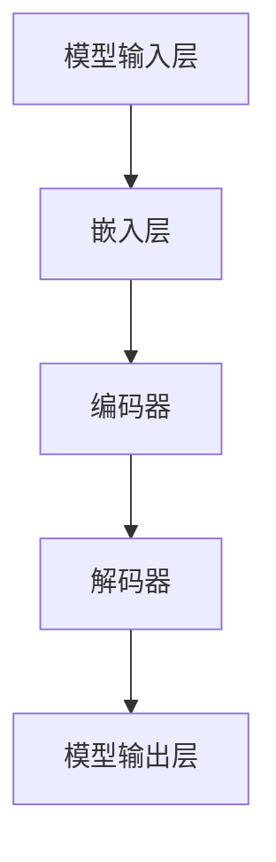
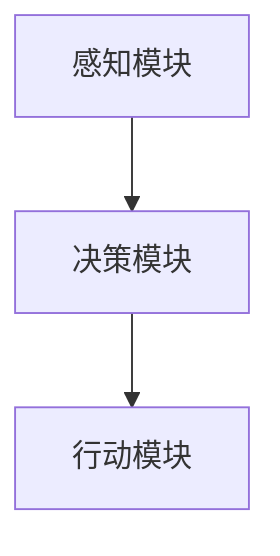
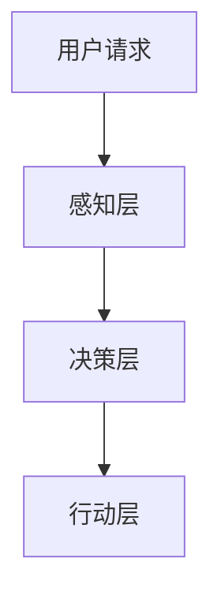

                 

### 文章标题 <此处是文章标题>

> 关键词：大模型、AI Agent、应用开发、算法原理、技术挑战、未来展望

> 摘要：本文将深入探讨大模型在AI Agent开发中的应用，分析其基础知识、核心算法和实际应用案例。同时，文章将探讨大模型应用面临的挑战及其未来展望，旨在为开发者提供全面的技术指南和深入思考。

---

#### 第一部分：大模型基础知识与概述

**# 第一部分 大模型基础知识与概述**

在人工智能领域，大模型（Large Models）的崛起为众多应用场景带来了前所未有的变革。这一部分将详细介绍大模型的基本概念、架构、核心算法以及其在不同领域的应用，为后续内容打下坚实的基础。

**## 第1章 大模型的基本概念与架构**

**### 1.1 大模型的概念与定义**

大模型通常指的是那些具有巨大参数量、复杂结构和强大功能的神经网络模型。与传统模型相比，大模型在处理大规模数据集和复杂数据任务时表现出了卓越的性能。大模型的定义可以从以下几个方面进行理解：

- **参数量**：大模型的参数量通常在数十亿到数万亿级别，这使得它们能够捕捉到数据的复杂特征和模式。
- **计算资源需求**：由于参数量大，大模型的训练和推理过程需要大量的计算资源，这包括高性能的CPU、GPU和特殊的计算架构。
- **训练时间**：大模型的训练时间非常长，通常需要数天甚至数周来完成，这依赖于数据的规模和模型的复杂度。
- **效果**：大模型在多个任务上取得了显著的性能提升，特别是在自然语言处理、计算机视觉和强化学习等领域。

**### 1.2 大模型的特点**

大模型与传统模型的主要区别在于其规模和功能：

- **计算资源需求**：大模型需要更多的计算资源来训练和推理，这通常意味着需要更多的CPU、GPU以及特殊的计算架构，如TPU。
- **训练时间和效果**：大模型的训练时间更长，但一旦训练完成，它们在预测和推理上的效果更佳，能够处理更复杂的问题。

**### 1.3 大模型的应用领域**

大模型在多个领域都展现出了强大的应用潜力：

- **自然语言处理（NLP）**：大模型如BERT、GPT在语言理解、文本生成、机器翻译等任务上取得了重大突破。
- **计算机视觉**：大模型如ResNet、Inception在图像分类、目标检测、图像生成等任务中发挥了关键作用。
- **强化学习**：大模型在游戏、自动驾驶、机器人等应用中展示了其出色的决策能力。

**## 第2章 大模型的架构**

**### 2.1 大模型的层次结构**

大模型的层次结构通常包括输入层、嵌入层、编码器、解码器和输出层。以下是一个简化的Mermaid流程图，用于展示大模型的层次结构：



- **输入层**：接收外部输入数据，如文本、图像或传感器数据。
- **嵌入层**：将输入数据转换为固定长度的向量表示。
- **编码器**：对输入数据进行编码，提取特征和模式。
- **解码器**：解码编码器的输出，生成预测结果或文本。
- **输出层**：输出模型最终的预测结果。

**### 2.2 大模型的核心组件**

大模型的核心组件包括编码器、解码器和嵌入层，它们各自承担着不同的功能：

- **编码器**：编码器的核心任务是提取输入数据的特征，通常使用卷积神经网络（CNN）或循环神经网络（RNN）。
- **解码器**：解码器的任务是生成输出数据，它通常与编码器对称，使用类似的结构。
- **嵌入层**：嵌入层负责将原始输入数据映射为固定长度的向量表示，这通常使用嵌入矩阵实现。

**## 第3章 大模型的核心算法**

**### 3.1 前馈神经网络**

前馈神经网络（Feedforward Neural Network）是构建大模型的基础，其基本结构包括输入层、隐藏层和输出层。以下是一个简化的前馈神经网络计算过程，使用伪代码表示：

```python
# 初始化参数
weights = [0.1, 0.2, 0.3]
bias = 0.4

# 计算前向传播
input = [1, 2, 3]
output = [0 for _ in range(len(input))]

for i, weight in enumerate(weights):
    output[i] += weight * input[i]
output[0] += bias

# 激活函数（例如ReLU）
output = [max(0, x) for x in output]
```

- **输入层**：接收输入数据，并将其传递给隐藏层。
- **隐藏层**：通过加权求和加上偏置，并通过激活函数处理输入数据。
- **输出层**：生成最终的输出结果。

**### 3.2 优化算法**

优化算法在大模型训练过程中扮演着关键角色，其中梯度下降（Gradient Descent）是最常用的优化算法之一。以下是一个简化的梯度下降算法伪代码：

```python
# 初始化参数
weights = [0.1, 0.2, 0.3]
bias = 0.4
learning_rate = 0.1

# 计算损失函数
loss = compute_loss(weights, bias)

# 计算梯度
gradients = compute_gradients(weights, bias, loss)

# 更新参数
weights = [w - learning_rate * g for w, g in zip(weights, gradients)]
bias -= learning_rate * gradients[0]
```

- **初始化参数**：初始化权重和偏置。
- **计算损失函数**：计算模型预测值与真实值之间的误差。
- **计算梯度**：计算损失函数关于参数的梯度。
- **更新参数**：根据梯度更新参数，以减少损失。

**### 3.3 大规模预训练模型**

大规模预训练模型是当前大模型研究的重要方向之一，其基本思想是先在大量数据上进行预训练，然后在特定任务上进行微调。以下是大规模预训练模型的主要步骤：

- **预训练**：在大量无标签数据上进行预训练，以提取通用的特征表示。
- **自监督学习**：利用无监督学习方法，如掩码语言建模（Masked Language Modeling，MLM），进行预训练。
- **迁移学习**：将预训练模型迁移到特定任务上，通过微调进行优化。

**## 第4章 大模型的应用开发**

**### 4.1 AI Agent的概念与架构**

AI Agent是一种具有自主感知、决策和行动能力的人工智能系统，其基本架构包括感知模块、决策模块和行动模块。以下是一个简化的AI Agent架构图：



- **感知模块**：感知外部环境，获取感知数据。
- **决策模块**：根据感知数据做出决策。
- **行动模块**：执行决策，与环境进行交互。

**### 4.2 AI Agent的感知与决策**

- **感知模块**：AI Agent的感知模块通常包括传感器和数据采集，用于获取环境信息。
- **决策模块**：决策模块负责根据感知模块的信息进行决策，可以采用强化学习、决策树等方法。
- **行动模块**：行动模块执行决策，采取相应的行动。

**### 4.3 AI Agent的行动与反馈**

- **行动模块**：行动模块负责执行决策，可以采取具体的行动，如移动、操作设备等。
- **反馈模块**：反馈模块记录行动结果，用于评估决策效果，并根据反馈进行模型调整。

**## 第5章 大模型在AI Agent中的应用**

大模型在AI Agent中的应用主要集中在自然语言处理（NLP）、生成对抗网络（GAN）和强化学习等方面。

**### 5.1 生成对抗网络（GAN）**

生成对抗网络（GAN）是一种由生成器和判别器组成的模型，旨在生成逼真的数据。以下是一个简化的GAN训练过程：

- **生成器**：生成器尝试生成数据，判别器尝试区分生成数据和真实数据。
- **判别器**：判别器通过训练学习真实数据和生成数据的特征。
- **优化过程**：生成器和判别器交替训练，生成器不断优化生成数据的质量。

**### 5.2 强化学习**

强化学习是一种通过试错学习策略的机器学习范式。以下是一个简化的强化学习算法（如Q-learning）：

- **状态**：系统当前所处的环境状态。
- **动作**：系统可以执行的动作。
- **奖励**：动作执行后系统获得的奖励。
- **Q值**：动作在特定状态下的预期奖励。

**### 5.3 自然语言处理（NLP）**

大模型在自然语言处理领域有着广泛的应用，如文本分类、机器翻译等。以下是一个简化的NLP任务流程：

- **数据预处理**：对文本进行预处理，如分词、去停用词等。
- **模型训练**：使用预训练模型进行微调，以适应特定任务。
- **模型评估**：使用测试集评估模型性能。

---

#### 第二部分：大模型应用开发

**# 第二部分 大模型应用开发**

在第一部分中，我们了解了大模型的基本概念、架构和核心算法。这一部分将深入探讨大模型的应用开发，包括AI Agent的设计与实现、具体应用案例以及大模型应用面临的挑战和未来展望。

**## 第3章 AI Agent设计与实现**

**### 3.1 AI Agent的概念与架构**

AI Agent是一种具备自主性、适应性、反应性的智能系统，能够在复杂环境中执行任务。AI Agent的基本架构包括感知模块、决策模块和行动模块。以下是AI Agent的简化架构图：


- **感知模块**：感知外部环境，收集各种数据，如传感器数据、图像、文本等。
- **决策模块**：根据感知模块提供的数据，分析环境状态，并做出决策。
- **行动模块**：执行决策模块的决策，采取相应的行动，如移动、发送消息、操作设备等。

**### 3.2 AI Agent的感知与决策**

- **感知模块**：感知模块是AI Agent的基础，它负责收集和处理外部环境的信息。感知模块可以包含多种传感器，如摄像头、麦克风、GPS等，这些传感器可以提供丰富的数据。为了提高感知模块的性能，通常需要对采集到的数据进行预处理，如滤波、降噪、特征提取等。

- **决策模块**：决策模块是AI Agent的核心，它负责分析感知模块收集到的数据，并根据预设的算法或策略做出决策。决策模块可以使用机器学习算法，如神经网络、决策树、强化学习等，来处理复杂的问题。

**### 3.3 AI Agent的行动与反馈**

- **行动模块**：行动模块是AI Agent的执行单元，它根据决策模块的决策采取相应的行动。行动模块可以是一个机器人、一个自动化的软件程序，或者是一个人。行动模块需要具备执行决策的能力，并且能够在执行过程中与外部环境进行交互。

- **反馈模块**：反馈模块记录行动的结果，并将结果反馈给感知模块和决策模块。通过反馈，AI Agent可以不断调整其行为，以适应变化的环境。反馈可以是定量的，如完成任务的时间、准确率等，也可以是定性的，如用户满意度、故障率等。

**## 第4章 大模型在AI Agent中的应用**

大模型在AI Agent中的应用主要涉及自然语言处理（NLP）、生成对抗网络（GAN）和强化学习等方面。

**### 4.1 生成对抗网络（GAN）**

生成对抗网络（GAN）是一种由生成器和判别器组成的模型，旨在生成逼真的数据。在AI Agent中，GAN可以用于生成虚拟环境数据，从而训练感知模块，提高其在复杂环境中的适应能力。以下是一个简化的GAN训练过程：

- **生成器**：生成器尝试生成数据，判别器尝试区分生成数据和真实数据。
- **判别器**：判别器通过训练学习真实数据和生成数据的特征。
- **优化过程**：生成器和判别器交替训练，生成器不断优化生成数据的质量。

**### 4.2 强化学习**

强化学习是一种通过试错学习策略的机器学习范式。在AI Agent中，强化学习可以用于训练决策模块，使其能够在复杂环境中做出最优决策。以下是一个简化的强化学习算法（如Q-learning）：

- **状态**：系统当前所处的环境状态。
- **动作**：系统可以执行的动作。
- **奖励**：动作执行后系统获得的奖励。
- **Q值**：动作在特定状态下的预期奖励。

**### 4.3 自然语言处理（NLP）**

大模型在自然语言处理领域有着广泛的应用，如文本分类、机器翻译等。在AI Agent中，NLP可以用于处理语音识别、语义理解等任务，从而提高决策模块的智能水平。以下是一个简化的NLP任务流程：

- **数据预处理**：对文本进行预处理，如分词、去停用词等。
- **模型训练**：使用预训练模型进行微调，以适应特定任务。
- **模型评估**：使用测试集评估模型性能。

---

#### 第三部分：大模型应用实战

**# 第三部分 大模型应用实战**

在前两部分中，我们详细介绍了大模型的基础知识、AI Agent的设计与实现，以及大模型在AI Agent中的应用。这一部分将聚焦于大模型应用的实际案例，通过具体的项目案例分析，展示如何将大模型技术应用于实际场景，解决实际问题。

**## 第5章 案例分析1：智能客服系统**

**### 5.1 案例背景**

智能客服系统是一种利用人工智能技术提供自动客服服务的技术系统。随着人工智能技术的不断发展，智能客服系统在各个行业得到了广泛应用，如电子商务、金融、旅游等领域。智能客服系统能够提高客服效率，降低人力成本，同时提供24小时不间断的服务。

**### 5.2 系统架构**

智能客服系统的整体架构可以分为感知层、决策层和行动层三个部分。以下是智能客服系统的简化架构图：



- **感知层**：负责接收用户请求，包括文本、语音等多种形式。感知层可以通过语音识别、自然语言处理等技术将用户请求转化为机器可理解的数据。
- **决策层**：根据感知层提供的数据，分析用户请求，并生成相应的回复。决策层可以采用对话管理、意图识别、实体抽取等技术。
- **行动层**：将决策层的回复转化为用户可理解的形式，如文本、语音等，并将其发送给用户。

**### 5.3 实现细节**

- **数据预处理**：在训练智能客服系统之前，需要对数据进行预处理，包括文本清洗、分词、去停用词等。
- **模型训练**：使用预训练的模型（如BERT、GPT）进行微调，以适应特定任务。
- **模型评估**：使用测试集评估模型性能，包括准确率、召回率、F1值等指标。

**### 5.4 案例总结**

通过智能客服系统的案例，我们可以看到大模型技术在实际应用中的强大能力。智能客服系统能够快速响应用户请求，提供准确、高效的客服服务，大大提升了用户体验。同时，智能客服系统还可以通过持续学习和优化，不断提高服务质量。

---

#### 第四部分：大模型应用挑战与未来展望

**# 第四部分 大模型应用挑战与未来展望**

在大模型技术的发展过程中，尽管取得了显著的成就，但同时也面临着一系列挑战和潜在的风险。这一部分将深入探讨大模型应用面临的挑战，并展望其未来发展的方向。

**## 第6章 大模型应用面临的挑战**

**### 6.1 数据隐私与安全**

随着大模型应用的不断普及，数据隐私和安全问题日益突出。大模型通常需要处理海量的用户数据，这些数据可能包含敏感信息，如个人身份信息、金融记录等。以下是大模型应用在数据隐私和安全方面面临的主要挑战：

- **数据泄露**：由于大模型需要访问和存储大量的用户数据，一旦数据泄露，可能对用户隐私造成严重威胁。
- **模型攻击**：攻击者可以通过恶意攻击大模型，使其产生错误的预测或决策，从而对用户造成损失。
- **隐私保护**：如何在保护用户隐私的同时，充分利用数据的价值，是一个亟待解决的问题。

**### 6.2 计算资源与能耗**

大模型应用对计算资源的需求非常巨大。大模型的训练和推理通常需要大量的CPU、GPU和TPU等硬件资源。此外，大模型的训练过程还伴随着巨大的能耗。以下是大模型应用在计算资源与能耗方面面临的主要挑战：

- **计算资源分配**：如何合理分配计算资源，确保大模型在不同任务间的公平性和效率。
- **能耗管理**：如何优化大模型的能耗，降低其运行成本，同时保证性能。

**### 6.3 模型可解释性与透明度**

大模型通常被视为“黑盒”模型，其决策过程缺乏透明度。这给大模型的应用带来了一定的风险，特别是在需要高可靠性和高安全性的场景中。以下是大模型应用在模型可解释性与透明度方面面临的主要挑战：

- **模型解释性**：如何提高大模型的解释性，使其决策过程更加透明，以便用户和监管机构理解和监督。
- **透明度要求**：如何在确保模型透明度的同时，保护用户的隐私和数据安全。

**## 第7章 大模型应用的未来展望**

**### 7.1 人工智能 Agent 的发展趋势**

随着人工智能技术的不断发展，人工智能 Agent 在未来有望成为智能系统的核心组成部分。人工智能 Agent 具有自主性、适应性、反应性等特点，能够在复杂环境中执行任务。以下是一些人工智能 Agent 的发展趋势：

- **智能化**：人工智能 Agent 将通过不断学习和优化，提高其智能水平，更好地适应复杂环境。
- **自主化**：人工智能 Agent 将具备更高的自主决策能力，减少对人类操作者的依赖。
- **协作化**：人工智能 Agent 将与其他 Agent 和人类协同工作，共同完成任务。

**### 7.2 大模型与其他技术的融合**

大模型与其他技术的融合是未来人工智能发展的重要方向。以下是大模型与其他技术融合的一些潜在应用：

- **融合深度学习与强化学习**：通过将深度学习与强化学习相结合，可以提高大模型在动态环境中的决策能力。
- **融合自然语言处理与计算机视觉**：通过将自然语言处理与计算机视觉相结合，可以实现更加智能的语音识别和图像处理。
- **融合物联网与人工智能**：通过将物联网与人工智能相结合，可以构建智能化的智能家居、智能城市等系统。

**### 7.3 未来大模型应用的前景**

未来大模型应用的前景非常广阔，预计将出现以下趋势：

- **广泛应用**：大模型将在各个领域得到广泛应用，如医疗、金融、教育、交通等。
- **持续优化**：随着技术的不断进步，大模型的性能将得到持续优化，更好地满足实际需求。
- **创新应用**：大模型将激发新的应用场景，推动人工智能技术的创新和发展。

---

#### 附录

**## 附录A 大模型应用开发工具与资源**

**### A.1 大模型开发工具**

在开发大模型时，选择合适的工具至关重要。以下是一些常用的大模型开发工具：

- **TensorFlow**：由Google开发的开源机器学习框架，支持多种神经网络结构，适用于各种规模的模型开发。
- **PyTorch**：由Facebook开发的开源机器学习库，提供动态计算图，便于模型开发和调试。
- **Keras**：基于TensorFlow和Theano的高层次神经网络API，简化了模型开发过程。
- **MXNet**：由Apache Software Foundation开发的开源深度学习框架，支持多种编程语言和计算平台。

**### A.2 大模型应用资源**

- **学术论文**：以下是一些关于大模型和AI Agent的顶级学术论文，供开发者参考：

  - Vaswani et al. (2017). "Attention is all you need."
  - He et al. (2016). "Deep residual learning for image recognition."
  - Mnih et al. (2015). "Human-level control through deep reinforcement learning."

- **开源代码**：以下是一些开源的大模型和AI Agent项目，供开发者学习和参考：

  - Hugging Face Transformers：https://github.com/huggingface/transformers
  - OpenAI GPT-3：https://github.com/openai/gpt-3
  - Google TPU：https://github.com/tensorflow/tpu

- **在线课程与书籍**：以下是一些关于大模型和AI Agent的在线课程和书籍，供开发者学习和参考：

  - "Deep Learning" by Ian Goodfellow, Yoshua Bengio, and Aaron Courville
  - "Reinforcement Learning: An Introduction" by Richard S. Sutton and Andrew G. Barto
  - "自然语言处理入门" by 张钹、刘知远

---

**作者：AI天才研究院/AI Genius Institute & 禅与计算机程序设计艺术 /Zen And The Art of Computer Programming**

