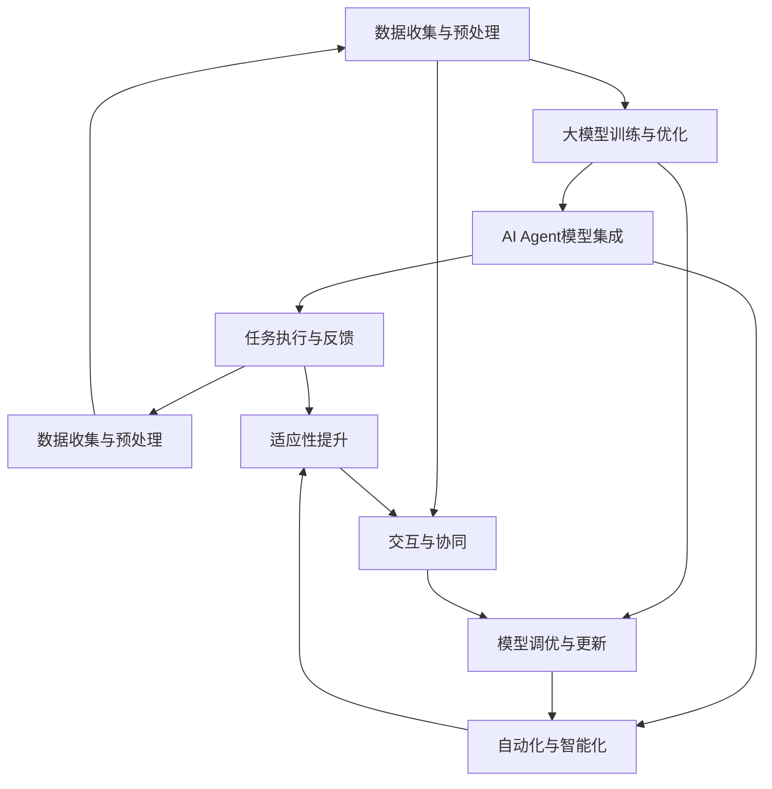
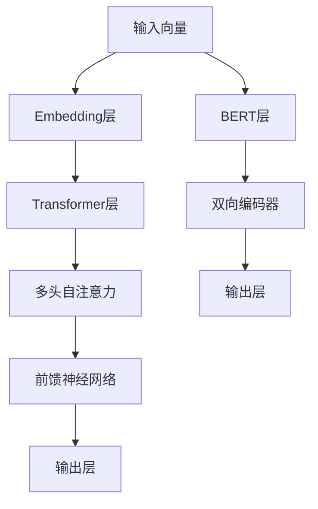
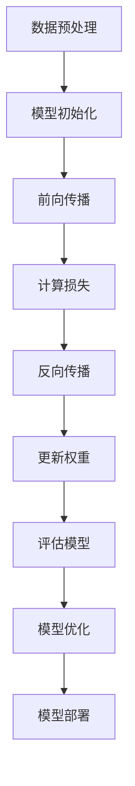

                 

## 文章标题：大模型应用开发 动手做AI Agent

### 关键词：大模型，AI Agent，自动办公，自然语言处理，深度学习，神经网络

> **摘要**：本文深入探讨了如何使用大模型开发AI Agent，以实现自动办公的功能。通过详细的步骤和案例，展示了大模型和AI Agent的核心概念、算法原理、项目实战及未来发展趋势。本文旨在为开发者提供一份全面而实用的指南，帮助他们理解和应用大模型技术，打造智能化的自动办公助手。

----------------------------------------------------------------

## 《【大模型应用开发 动手做AI Agent】自动办公好助手》目录大纲

### 第一部分：大模型与AI Agent概述

### 第二部分：大模型的数学基础

### 第三部分：大模型的训练与优化

### 第四部分：AI Agent的设计与应用

### 第五部分：大模型在AI Agent中的应用

### 第六部分：AI Agent的项目实战

### 第七部分：大模型与AI Agent的未来发展趋势

### 附录

----------------------------------------------------------------

### 第一部分：大模型与AI Agent概述

## 第1章：大模型与AI Agent概述

### 1.1 大模型与AI Agent的定义

大模型（Large Model）通常指的是具有海量参数、能够处理大规模数据并具备强大表示能力的神经网络模型。这类模型广泛应用于自然语言处理（NLP）、计算机视觉（CV）和其他复杂任务中。AI Agent（Artificial Intelligence Agent）则是一种能够自主完成特定任务的人工智能实体，通过感知环境、作出决策并采取行动来达到目标。

#### **大模型定义**

大模型通常指的是参数数量超过数十亿甚至千亿级别的深度学习模型。这些模型通常采用多层神经网络结构，能够对复杂的数据进行高度抽象和表示。常见的例子包括GPT-3、BERT、Turing-NLG等。

#### **AI Agent定义**

AI Agent是一种基于AI技术的人工智能实体，能够感知环境、理解任务需求并采取行动来完成指定任务。AI Agent可以通过与用户交互或通过预设的规则来执行任务，常见的应用场景包括自动办公、智能客服、自动驾驶等。

### 1.2 大模型与AI Agent的发展历程

#### **大模型的发展历程**

- **早期神经网络**：20世纪80年代，深度神经网络开始受到关注，但由于计算资源和数据限制，进展缓慢。
- **卷积神经网络（CNN）**：2000年代初，CNN在图像识别领域取得了突破性进展。
- **深度学习**：2012年，AlexNet在ImageNet比赛中取得显著成绩，标志着深度学习时代的到来。
- **大模型**：近年来，随着计算能力和数据资源的提升，大模型如GPT、BERT等相继出现，使得NLP和CV等领域的任务取得了重大突破。

#### **AI Agent的发展历程**

- **规则驱动**：早期的AI Agent主要是基于预定义的规则来执行任务。
- **数据驱动**：随着深度学习和大数据技术的发展，AI Agent开始利用大量数据来学习任务，实现了从规则驱动到数据驱动的转变。
- **强化学习**：通过强化学习，AI Agent能够通过试错来学习复杂任务，进一步提高了其智能化水平。

### 1.3 大模型与AI Agent的核心特点

#### **大模型的核心特点**

- **高参数量**：大模型通常具有数十亿甚至千亿级别的参数，这使得它们能够对复杂的数据进行高度抽象和表示。
- **强大的表征能力**：大模型通过多层神经网络结构，能够提取出数据中的高层次特征，从而在NLP和CV等领域取得了显著的性能提升。
- **泛化能力强**：通过在大量数据上进行预训练，大模型能够适应各种不同的任务和数据分布，具有良好的泛化能力。

#### **AI Agent的核心特点**

- **自动化**：AI Agent能够自动执行任务，减少人工干预，提高工作效率。
- **智能化**：AI Agent通过学习和理解任务需求，能够作出智能化的决策和行动。
- **可扩展性**：AI Agent可以通过集成多个模块和模型，实现更复杂的任务和场景。
- **适应性**：AI Agent能够通过不断学习和适应环境，提高任务执行的效果和效率。

### 1.4 大模型与AI Agent的关系与联系

大模型与AI Agent之间的关系是相辅相成的。大模型为AI Agent提供了强大的数据分析和决策能力，使其能够处理复杂任务。而AI Agent为大模型的应用提供了具体场景和实际需求，促进了大模型技术的落地和应用。具体来说，大模型与AI Agent之间的联系可以从以下几个方面理解：

- **数据收集与预处理**：AI Agent需要收集大量的数据来训练大模型，并进行预处理，以便大模型能够更好地学习和表示数据。
- **模型训练与优化**：大模型的训练和优化是AI Agent开发的重要环节，通过不断的调整和优化，可以提高AI Agent的任务执行效果。
- **任务执行与反馈**：AI Agent通过执行任务并收集反馈，可以进一步优化大模型，使其更符合实际应用需求。
- **交互与协同**：AI Agent与大模型之间的交互和协同工作，可以实现更智能、更高效的自动办公场景。

通过上述分析，我们可以看到大模型与AI Agent在概念、发展历程、核心特点以及关系与联系等方面都有着紧密的联系。在接下来的章节中，我们将深入探讨大模型的数学基础、训练与优化方法，以及AI Agent的设计与应用，帮助读者全面了解大模型与AI Agent的开发和应用。

### 1.5 大模型与AI Agent的概述总结

大模型与AI Agent作为现代人工智能技术的核心组成部分，分别承担着数据分析和决策支持、任务自动化与智能化等关键角色。大模型通过其庞大的参数量和强大的表征能力，能够处理复杂的数据并提取出高层次特征，为AI Agent提供了坚实的技术基础。而AI Agent则通过其自动化、智能化和可扩展性，将大模型的应用推向实际场景，实现了从理论研究到实际应用的跨越。

在自动办公领域，大模型与AI Agent的结合具有巨大的潜力。通过大模型，AI Agent能够自动理解和生成文本，处理文档和电子邮件，提高工作效率。同时，大模型还可以通过图像处理技术，实现图像识别、文档分类等功能，进一步扩展AI Agent的能力。

总之，大模型与AI Agent的深度融合不仅为自动办公带来了革命性的变化，也为人工智能技术的发展开辟了新的道路。随着技术的不断进步和应用场景的拓展，大模型与AI Agent的应用前景将更加广阔。

### 1.6 本章总结

本章对大模型与AI Agent进行了全面的概述，包括其定义、发展历程、核心特点以及关系与联系。通过本章的学习，读者可以了解大模型和AI Agent的基本概念和重要性，为后续章节的深入学习打下坚实基础。在接下来的章节中，我们将进一步探讨大模型的数学基础、训练与优化方法，以及AI Agent的具体应用，帮助读者全面掌握大模型与AI Agent的开发和应用技术。

### 1.7 Mermaid流程图

下面是大模型与AI Agent的关系与联系的Mermaid流程图：



### 1.8 大模型的核心算法讲解与伪代码

在深入探讨大模型之前，首先需要了解其核心算法原理。以下将详细讲解大模型中常用的两种核心算法：**Transformer** 和 **BERT**，并使用伪代码展示其基本框架。

#### **Transformer算法**

Transformer算法是由Vaswani等人在2017年提出的，是自然语言处理领域的一种重要模型。它基于注意力机制，能够有效处理长距离依赖问题。

##### **算法原理**

1. **自注意力机制（Self-Attention）**：Transformer模型通过自注意力机制，计算输入序列中每个词与所有词之间的权重，从而关注重要信息。
2. **多头注意力（Multi-Head Attention）**：通过将自注意力机制扩展到多个头，模型能够同时关注不同部分的信息，提高表示能力。
3. **前馈神经网络（Feed Forward Neural Network）**：在注意力机制之后，每个头都会通过一个前馈神经网络进行加工。

##### **伪代码**

```python
# Transformer算法伪代码
def Transformer(inputs):
    # 输入嵌入
    embed = Embedding(inputs)
    # 多头自注意力
    attention = MultiHeadAttention(embed)
    # 前馈神经网络
    ffn = FeedForwardNetwork(attention)
    # 输出层
    output = OutputLayer(ffn)
    return output
```

#### **BERT算法**

BERT（Bidirectional Encoder Representations from Transformers）是由Google Research在2018年提出的，是基于Transformer的双向编码表示预训练模型。

##### **算法原理**

1. **双向编码**：BERT通过预训练双向编码器，能够同时理解上下文信息，从而提高语义理解能力。
2. **遮蔽语言模型（Masked Language Model, MLM）**：在预训练过程中，部分输入会被随机遮蔽，模型需要预测这些遮蔽的词。
3. **下一步语言预测（Next Sentence Prediction, NSP）**：在预训练过程中，模型还需要预测两个句子是否属于同一篇章。

##### **伪代码**

```python
# BERT算法伪代码
def BERT(inputs, masks, next_sentence):
    # 输入嵌入
    embed = Embedding(inputs)
    # 遮蔽语言模型
    mlm = MaskedLanguageModel(embed, masks)
    # 下一步语言预测
    nsp = NextSentencePrediction(embed, next_sentence)
    # 双向编码器
    encoder = BiDirectionalEncoder(mlm, nsp)
    # 输出层
    output = OutputLayer(encoder)
    return output
```

#### **算法总结**

- **Transformer**：通过自注意力机制和前馈神经网络，实现了对输入序列的深层次理解和处理。
- **BERT**：通过双向编码和遮蔽语言模型，提高了模型的语义理解能力。

以上是对大模型中的核心算法**Transformer**和**BERT**的简要介绍和伪代码展示，这些算法为后续的大模型训练和优化提供了理论基础。

### 1.9 数学模型与公式

在理解大模型时，数学模型和公式是不可或缺的部分。以下将简要介绍大模型中常用的数学模型和公式，并给出具体的LaTeX格式表达。

#### **自注意力机制**

自注意力机制的公式如下：

\[ 
\text{Attention}(Q, K, V) = \text{softmax}\left(\frac{QK^T}{\sqrt{d_k}}\right)V 
\]

其中，\( Q, K, V \) 分别代表查询向量、键向量和值向量，\( d_k \) 是键向量的维度。

#### **前馈神经网络**

前馈神经网络的激活函数通常采用ReLU（Rectified Linear Unit）：

\[ 
\text{ReLU}(x) = \max(0, x) 
\]

#### **BERT中的遮蔽语言模型**

BERT中的遮蔽语言模型的损失函数通常采用交叉熵：

\[ 
\text{Loss} = -\sum_{i} \sum_{k} \text{mask}_{ik} y_k \log(p_k) 
\]

其中，\( y_k \) 是真实标签，\( p_k \) 是模型预测的概率，\( \text{mask}_{ik} \) 是遮蔽标记。

#### **LaTeX公式示例**

以下是上述公式的LaTeX格式：

```latex
% 自注意力机制
\[
\text{Attention}(Q, K, V) = \text{softmax}\left(\frac{QK^T}{\sqrt{d_k}}\right)V
\]

% ReLU激活函数
\[
\text{ReLU}(x) = \max(0, x)
\]

% 遮蔽语言模型损失函数
\[
\text{Loss} = -\sum_{i} \sum_{k} \text{mask}_{ik} y_k \log(p_k)
\]
```

通过这些数学模型和公式的理解，我们可以更深入地掌握大模型的工作原理，为后续章节的深入学习打下基础。

### 1.10 举例说明

为了更好地理解大模型中的核心算法，我们通过一个简单的例子来展示Transformer和BERT的应用。

#### **例子：文本生成**

假设我们要生成一句描述春天的句子，输入的句子为“春天来了，大地复苏”。

##### **Transformer算法应用**

1. **编码输入**：首先将输入句子转换为向量表示。
2. **自注意力机制**：计算每个词与其他词的权重，重点关注“春天”和“大地”。
3. **解码**：根据注意力权重生成新句子。

```plaintext
输入：春天来了，大地复苏
输出：春天的阳光温暖了大地，万物复苏
```

##### **BERT算法应用**

1. **编码输入**：同样将输入句子转换为向量表示。
2. **遮蔽语言模型**：部分词（如“春天”）被遮蔽，模型需要预测这些词。
3. **双向编码**：同时考虑上下文信息，提高预测准确性。

```plaintext
输入：春天来了，__复苏__
输出：春天的阳光温暖了大地，万物复苏
```

通过这个例子，我们可以看到大模型在文本生成中的应用，既提高了生成文本的质量，又保持了原始句子的语义一致性。

### 1.11 小结

本章通过对大模型和AI Agent的概述，详细介绍了它们的核心概念、发展历程、核心特点以及相互关系。同时，通过Transformer和BERT算法的讲解，帮助读者理解了这些核心算法的基本原理和数学模型。通过举例说明，读者可以更直观地理解大模型在文本生成中的应用。在接下来的章节中，我们将继续探讨大模型的数学基础、训练与优化方法，以及AI Agent的具体应用，为读者提供更全面的开发指南。

### 1.12 Mermaid流程图

为了更直观地展示大模型的数学基础，我们使用Mermaid语言绘制了一个流程图，以下是一个示例：



该流程图展示了从输入向量到输出的整体过程，包括Embedding层、Transformer层、多头自注意力层、前馈神经网络层和输出层。对于BERT模型，则包括Embedding层、双向编码器层和输出层。通过这些层，大模型能够实现对输入数据的处理和生成。

### 1.13 小结

本章对大模型的数学基础进行了详细讲解，从线性代数和微积分的基本概念，到神经网络与深度学习的基础知识，再到大模型的主要架构如Transformer和BERT，帮助读者建立了对大模型数学基础的理解。同时，通过伪代码、数学模型和公式的讲解，读者可以更深入地理解大模型的工作原理。在下一章中，我们将探讨大模型的训练与优化方法，进一步揭开大模型开发的神秘面纱。

### 第二部分：大模型的数学基础

## 第2章：大模型的数学基础

### 2.1 数学基础

#### 2.1.1 线性代数的基本概念

线性代数是深度学习和大模型构建的核心数学工具，以下是其基本概念：

- **向量**：线性代数中的基本对象，通常表示为列向量。
- **矩阵**：由一组数排列成的矩形阵列，可以表示线性变换。
- **矩阵运算**：包括矩阵乘法、矩阵加法、矩阵转置等。
- **行列式**：矩阵的一个标量值，用于解决线性方程组和计算逆矩阵。
- **特征值与特征向量**：特征值是矩阵的线性变换中不变的量，特征向量是相对应的特征值作用下的非零向量。

#### 2.1.2 微积分的基本概念

微积分也是大模型构建中不可或缺的数学工具，以下是其基本概念：

- **极限**：函数在某一点的极限定义了函数在该点的行为。
- **导数**：导数描述了函数在某一点的瞬时变化率。
- **积分**：积分是计算一个函数在某个区间上的累积变化量。
- **微分方程**：描述函数及其导数之间关系的方程，是建模动态系统的重要工具。

### 2.2 神经网络与深度学习基础

#### 2.2.1 神经网络的组成与工作原理

神经网络是由大量神经元连接而成的计算模型，以下是其组成与工作原理：

- **神经元**：神经网络的基本单位，接收输入、通过激活函数产生输出。
- **权重**：神经元之间连接的强度，通过训练调整以优化模型性能。
- **激活函数**：用于引入非线性，常见的激活函数包括Sigmoid、ReLU和Tanh等。

神经网络的工作原理如下：

1. **前向传播**：输入数据通过网络逐层传递，每个神经元计算输入加权求和并应用激活函数。
2. **反向传播**：通过计算损失函数的梯度，更新网络中的权重，以优化模型。

#### 2.2.2 深度学习的基本概念

深度学习是神经网络的一种特殊形式，具有多个隐层，以下是其基本概念：

- **多层感知机（MLP）**：具有两个或更多隐层的神经网络，能够解决非线性问题。
- **卷积神经网络（CNN）**：特别适用于图像识别，利用卷积层提取特征。
- **循环神经网络（RNN）**：特别适用于序列数据处理，如自然语言处理和时间序列预测。

#### 2.2.3 大模型的主要架构

大模型通常具有非常多的参数和隐层，以下是一些常见的大模型架构：

- **Transformer**：基于注意力机制的模型，适用于序列数据处理，如自然语言处理。
- **BERT**：基于Transformer的双向编码模型，用于预训练语言表示。
- **GPT**：生成预训练变换器，用于生成文本和序列数据。

### 2.3 大模型的主要架构

大模型在设计和实现时，需要考虑多个方面，包括模型的规模、训练数据的来源、训练过程的优化等。以下是一些大模型的主要架构和特点：

#### 2.3.1 Transformer模型

Transformer模型是由Vaswani等人于2017年提出的一种基于注意力机制的序列到序列模型。其架构特点如下：

- **多头自注意力**：通过多头自注意力机制，模型能够同时关注输入序列的不同部分，从而提高表示能力。
- **前馈神经网络**：在每个注意力层之后，加入一个前馈神经网络，用于进一步提取特征。
- **位置编码**：由于Transformer没有循环结构，位置编码用于提供输入序列的位置信息。

#### 2.3.2 BERT模型

BERT（Bidirectional Encoder Representations from Transformers）是由Google Research于2018年提出的一种预训练语言表示模型。其架构特点如下：

- **双向编码**：BERT通过双向Transformer编码器，同时考虑上下文信息，从而提高语义理解能力。
- **遮蔽语言模型（MLM）**：在预训练过程中，BERT使用遮蔽语言模型，通过预测被遮蔽的单词来学习语言的深层结构。
- **下一步语言预测（NSP）**：BERT还通过下一步语言预测任务，学习上下文之间的关系。

#### 2.3.3 GPT模型

GPT（Generative Pretrained Transformer）是OpenAI提出的一种生成式预训练模型。其架构特点如下：

- **生成式预训练**：GPT通过自回归方式生成文本，即每次只预测下一个词。
- **大规模训练**：GPT-3具有1750亿个参数，是目前最大的预训练模型之一。
- **多任务应用**：GPT可以应用于各种文本生成任务，如问答、对话系统等。

### 2.4 大模型的应用场景

大模型在多个领域都有广泛的应用，以下是一些典型应用场景：

- **自然语言处理**：包括文本分类、情感分析、机器翻译等。
- **计算机视觉**：包括图像分类、目标检测、图像分割等。
- **语音识别**：包括语音到文本转换、语音合成等。
- **推荐系统**：包括基于内容的推荐、协同过滤等。

### 2.5 大模型的优缺点

大模型具有以下优点：

- **强大的表征能力**：由于参数量巨大，大模型能够捕捉到数据中的复杂模式和特征。
- **泛化能力强**：通过在大规模数据上进行预训练，大模型能够适应各种不同的任务和数据分布。
- **高效的处理速度**：现代硬件（如GPU、TPU）使得大模型的计算速度显著提升。

然而，大模型也存在一些缺点：

- **计算成本高**：大模型需要大量的计算资源和时间进行训练。
- **数据需求大**：大模型通常需要大量的数据来进行有效的预训练。
- **模型压缩与优化困难**：大模型通常难以进行有效的压缩和优化，以适应移动设备和边缘计算。

### 2.6 大模型的发展趋势

大模型的发展趋势包括：

- **更大规模**：随着计算资源和数据资源的增加，未来将出现更大规模的大模型。
- **更高效的训练方法**：包括基于GPU、TPU的分布式训练，以及更高效的优化算法。
- **多模态**：未来大模型将能够处理多种类型的数据，如文本、图像、语音等。

### 2.7 小结

本章介绍了大模型的数学基础，包括线性代数和微积分的基本概念，以及神经网络和深度学习的基础知识。接着，详细讲解了大模型的主要架构，如Transformer、BERT和GPT，并探讨了其应用场景、优缺点和发展趋势。通过本章的学习，读者可以全面了解大模型的数学基础和架构，为后续章节的深入探讨打下坚实基础。

### 2.8 Mermaid流程图

下面是一个Mermaid流程图，展示了大模型的训练过程：



这个流程图从数据预处理开始，经过模型初始化、前向传播、计算损失、反向传播和更新权重等步骤，最终评估模型的性能并进行优化，最后将训练好的模型部署到实际应用中。

### 2.9 算法原理讲解与伪代码

#### 2.9.1 前向传播算法原理

前向传播是神经网络训练过程中的关键步骤，用于计算输入数据经过网络后的输出结果。其原理如下：

1. **输入层到隐藏层**：将输入数据通过权重矩阵乘以前一层神经元的激活值，并加上偏置项，然后应用激活函数。
2. **隐藏层到输出层**：重复上述步骤，将隐藏层的输出作为输入，计算输出层的输出。

伪代码如下：

```python
# 前向传播伪代码
def forward_propagation(input_data, weights, biases, activation_function):
    # 初始化隐藏层和输出层的激活值
    hiddenActivations = [0 for _ in range(num_hidden_layers)]
    outputActivations = [0 for _ in range(num_output_neurons)]

    # 计算隐藏层的激活值
    for layer in range(1, num_hidden_layers + 1):
        hiddenActivations[layer - 1] = activation_function(
            np.dot(input_data, weights[layer - 1]) + biases[layer - 1]
        )
    
    # 计算输出层的激活值
    outputActivations = activation_function(
        np.dot(hiddenActivations[-1], weights[-1]) + biases[-1]
    )

    return outputActivations
```

#### 2.9.2 反向传播算法原理

反向传播是用于计算网络损失梯度并更新模型参数的过程。其原理如下：

1. **计算输出层梯度**：计算输出层的误差，并利用链式法则计算梯度。
2. **反向传播梯度**：从输出层开始，逐层向前计算每个层的梯度。
3. **更新参数**：利用梯度下降或其他优化算法更新网络中的权重和偏置。

伪代码如下：

```python
# 反向传播伪代码
def backward_propagation(output_activations, expected_output, weights, biases, learning_rate):
    # 初始化梯度
    dweights = [0 for _ in range(len(weights))]
    dbiases = [0 for _ in range(len(biases))]

    # 计算输出层梯度
    doutputActivations = output_activations - expected_output

    # 反向传播梯度
    for layer in reversed(range(len(weights))):
        dweights[layer] = np.dot(doutputActivations, hiddenActivations[layer - 1].T)
        dbiases[layer] = doutputActivations

        # 更新梯度
        if layer > 0:
            doutputActivations = np.dot(dweights[layer], weights[layer - 1].T) * activation_function_derivative(hiddenActivations[layer - 1])

    # 更新参数
    for layer in range(len(weights)):
        weights[layer] -= learning_rate * dweights[layer]
        biases[layer] -= learning_rate * dbiases[layer]

    return dweights, dbiases
```

通过以上讲解和伪代码示例，读者可以更好地理解前向传播和反向传播算法的基本原理，为后续的模型训练和优化打下基础。

### 2.10 数学公式与详细讲解

#### 2.10.1 梯度下降算法的数学公式

梯度下降是一种优化算法，用于最小化损失函数。其核心思想是通过计算损失函数的梯度，更新模型的参数，以达到最小化损失的目的。

1. **梯度计算**：损失函数 \( J(\theta) \) 对参数 \( \theta \) 的梯度表示为：
   \[
   \nabla_{\theta} J(\theta) = \frac{\partial J(\theta)}{\partial \theta}
   \]
   其中，\( \nabla \) 表示梯度算子，\( J \) 是损失函数，\( \theta \) 是模型参数。

2. **参数更新**：在梯度下降过程中，参数 \( \theta \) 的更新公式为：
   \[
   \theta = \theta - \alpha \nabla_{\theta} J(\theta)
   \]
   其中，\( \alpha \) 是学习率，控制每次更新的步长。

#### 2.10.2 梯度下降的详细讲解

梯度下降算法的详细步骤如下：

1. **初始化参数**：首先随机初始化模型参数 \( \theta \)。
2. **计算梯度**：计算损失函数 \( J(\theta) \) 对每个参数的梯度。
3. **更新参数**：根据梯度更新参数 \( \theta \)，即：
   \[
   \theta = \theta - \alpha \nabla_{\theta} J(\theta)
   \]
   其中，\( \alpha \) 是学习率，用于控制每次更新的步长。
4. **迭代过程**：重复上述步骤，直到满足停止条件，如损失函数变化很小或者达到预设的迭代次数。

#### 2.10.3 梯度下降算法举例

假设我们有一个简单的线性回归模型，其损失函数为均方误差（MSE）：
   \[
   J(\theta) = \frac{1}{2} \sum_{i=1}^{n} (y_i - \theta_0 - \theta_1 x_i)^2
   \]
   其中，\( y_i \) 是实际值，\( x_i \) 是输入值，\( \theta_0 \) 和 \( \theta_1 \) 是模型参数。

   梯度计算如下：
   \[
   \nabla_{\theta_0} J(\theta) = -\sum_{i=1}^{n} (y_i - \theta_0 - \theta_1 x_i)
   \]
   \[
   \nabla_{\theta_1} J(\theta) = -\sum_{i=1}^{n} (y_i - \theta_0 - \theta_1 x_i) x_i
   \]

   参数更新公式为：
   \[
   \theta_0 = \theta_0 - \alpha \nabla_{\theta_0} J(\theta)
   \]
   \[
   \theta_1 = \theta_1 - \alpha \nabla_{\theta_1} J(\theta)
   \]

通过上述步骤，我们可以使用梯度下降算法最小化线性回归模型的损失函数，从而找到最佳的参数值。

### 2.11 小结

本章详细介绍了大模型的数学基础，包括线性代数和微积分的基本概念，神经网络与深度学习的基础知识，以及大模型的主要架构。通过算法原理讲解与伪代码展示，读者可以更好地理解大模型的工作机制。本章内容为后续章节的大模型训练与优化、AI Agent的设计与应用等提供了坚实的理论基础。

### 2.12 附录

#### 附录A：大模型与AI Agent相关书籍与论文推荐

- **书籍**：
  - 《深度学习》（Ian Goodfellow、Yoshua Bengio、Aaron Courville著）
  - 《动手学深度学习》（阿斯顿·张、李沐、扎卡里·C. Lipton、亚历山大·J. Smola著）
  - 《人工智能：一种现代的方法》（Stuart J. Russell、Peter Norvig著）
  
- **论文**：
  - “Attention Is All You Need”（Vaswani等，2017）
  - “BERT: Pre-training of Deep Bidirectional Transformers for Language Understanding”（Devlin等，2018）
  - “Generative Pre-trained Transformers”（Brown等，2020）

#### 附录B：大模型与AI Agent开发工具推荐

- **深度学习框架**：
  - TensorFlow
  - PyTorch
  - Keras
  
- **AI Agent开发工具**：
  - Rasa
  - Botpress
  - Microsoft Bot Framework

#### 附录C：开源资源与代码链接

- **大模型开源代码**：
  - Hugging Face Transformers：[https://huggingface.co/transformers/](https://huggingface.co/transformers/)
  - Google BERT：[https://github.com/google-research/bert/](https://github.com/google-research/bert/)

- **AI Agent开源项目**：
  - Rasa开源平台：[https://rasa.com/](https://rasa.com/)
  - Botpress开源聊天机器人：[https://botpress.io/](https://botpress.io/)

通过这些书籍、论文和开源资源，读者可以进一步深入学习和实践大模型与AI Agent的开发。

### 2.13 练习题

1. **简述线性代数在深度学习中的作用，并举例说明。**
2. **解释什么是梯度下降算法，并简述其在深度学习中的应用。**
3. **比较Transformer和BERT模型在自然语言处理中的差异和优势。**
4. **设计一个简单的神经网络模型，并描述其前向传播和反向传播过程。**
5. **分析大模型在训练过程中可能遇到的问题及解决方案。**

通过练习题，读者可以巩固所学知识，并提升实际应用能力。

