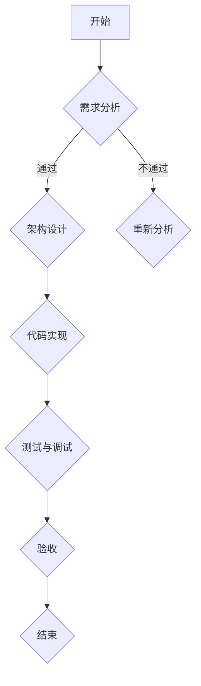

                 

# 《专业知识的积累：让项目顺利完成》

> 关键词：专业知识积累、项目准备、项目规划、团队管理、核心算法、数学模型、项目实施、代码实现

> 摘要：本文旨在探讨如何通过积累专业知识，确保项目的顺利完成。文章将从项目准备与规划、专业知识积累、项目实施与优化三个方面进行深入剖析，并提供实用的方法和经验，帮助读者在IT项目中取得成功。

## 目录

### 第一部分：项目准备与规划

1. **第1章：项目概述与目标**
    - **1.1 项目背景**
    - **1.2 项目目标**
    - **1.3 项目范围**
    - **1.4 项目利益相关者**

2. **第2章：项目规划与组织**
    - **2.1 项目计划**
    - **2.2 风险管理**
    - **2.3 成本估算**
    - **2.4 资源分配**

3. **第3章：技术选型与工具选择**
    - **3.1 技术趋势**
    - **3.2 开发工具选择**
    - **3.3 测试与调试工具选择**

4. **第4章：项目团队构建与管理**
    - **4.1 团队成员角色与职责**
    - **4.2 团队沟通与协作**
    - **4.3 团队绩效评估**

### 第二部分：专业知识积累

5. **第5章：核心概念与联系**
    - **5.1 概念解析**
    - **5.2 Mermaid 流程图**

6. **第6章：核心算法原理讲解**
    - **6.1 算法概述**
    - **6.2 伪代码讲解**
    - **6.3 示例分析**

7. **第7章：数学模型与公式**
    - **7.1 模型介绍**
    - **7.2 公式推导**
    - **7.3 举例说明**

8. **第8章：案例分析**
    - **8.1 案例背景**
    - **8.2 解决方案**
    - **8.3 实施步骤**
    - **8.4 结果分析**

### 第三部分：项目实施与优化

9. **第9章：开发环境搭建**
    - **9.1 环境配置**
    - **9.2 开发工具安装**
    - **9.3 系统集成**

10. **第10章：源代码实现与解读**
    - **10.1 源代码结构**
    - **10.2 详细实现**
    - **10.3 代码解读与分析**

11. **第11章：项目回顾与优化**
    - **11.1 项目回顾**
    - **11.2 经验总结**
    - **11.3 优化策略**

### 附录

- **附录A：常用技术资源**
    - **A.1 技术文档**
    - **A.2 开发工具资源**
    - **A.3 学习资料推荐**

- **附录B：公式推导细节**
    - **B.1 公式一**
    - **B.2 公式二**

## 第一部分：项目准备与规划

### 第1章：项目概述与目标

#### 1.1 项目背景

在当今快速发展的信息技术时代，项目作为企业或组织实现战略目标的重要手段，越来越受到重视。项目的成功不仅取决于团队成员的技能和努力，更需要对项目背景、目标、范围和利益相关者有清晰的了解。

项目背景是指项目的起源、需求、目标和发展历程。理解项目背景有助于团队成员更好地把握项目的发展方向，从而制定出更符合实际需求的项目计划。

#### 1.2 项目目标

项目目标是项目成功的关键指标。明确的项目目标能够指导团队在项目实施过程中始终保持正确的方向，避免资源的浪费和目标的偏离。项目目标通常包括以下几个方面：

1. **业务目标**：项目需要达成的业务目标，如增加收入、提高效率、优化流程等。
2. **技术目标**：项目需要实现的技术目标，如功能实现、性能提升、安全性等。
3. **质量目标**：项目需要达到的质量标准，如代码可读性、系统稳定性、用户满意度等。

#### 1.3 项目范围

项目范围是指项目需要完成的工作内容，以及哪些工作不属于项目范围。明确项目范围有助于避免项目范围蔓延，确保项目目标的实现。

项目范围通常包括以下几个方面：

1. **项目内容**：项目需要完成的任务和功能。
2. **项目边界**：项目的起始点和终止点，以及项目的有效范围。
3. **项目产出**：项目的最终交付成果，如软件系统、文档资料等。

#### 1.4 项目利益相关者

项目利益相关者是指对项目有直接或间接影响的人或组织。了解项目利益相关者的需求和期望，有助于更好地协调项目资源，确保项目成功。

项目利益相关者通常包括以下几个方面：

1. **项目发起人**：对项目有最终决策权的人或组织。
2. **项目管理者**：负责项目整体规划和执行的团队。
3. **项目团队成员**：直接参与项目开发和实施的人员。
4. **项目客户**：项目的最终受益人，如企业客户、政府机构等。
5. **项目合作伙伴**：与项目有合作关系的企业或组织。

### 第2章：项目规划与组织

#### 2.1 项目计划

项目计划是项目成功的关键因素之一。一个良好的项目计划可以帮助团队明确项目目标、任务分配、时间安排和资源需求，从而确保项目按计划顺利进行。

项目计划通常包括以下几个方面：

1. **项目目标**：明确项目的业务目标、技术目标和质量目标。
2. **任务分配**：根据团队成员的技能和职责，将项目任务合理分配给各个团队成员。
3. **时间安排**：制定项目的时间表，包括项目的起始时间、截止时间、关键节点等。
4. **资源需求**：分析项目所需的资源，包括人力、物力、财力等。
5. **风险管理**：识别项目潜在的风险，并制定相应的应对措施。

#### 2.2 风险管理

风险管理是项目规划中不可或缺的一部分。通过识别、评估和应对项目风险，可以降低项目失败的概率，确保项目的顺利进行。

风险管理包括以下几个方面：

1. **风险识别**：识别项目中可能出现的各种风险，如技术风险、市场风险、人力资源风险等。
2. **风险评估**：评估各个风险的可能性和影响程度，确定风险等级。
3. **风险应对**：制定应对措施，降低风险的影响或避免风险的发生。

#### 2.3 成本估算

成本估算是项目规划中的重要环节。准确的成本估算可以帮助团队更好地掌握项目预算，确保项目的财务可行性。

成本估算包括以下几个方面：

1. **人力成本**：根据项目任务和团队成员的工资水平，估算项目的人力成本。
2. **物力成本**：估算项目所需的设备、材料、软件等物力成本。
3. **财力成本**：估算项目的运营成本、维护成本等财力成本。

#### 2.4 资源分配

资源分配是项目规划中的关键环节。合理的资源分配可以提高项目效率，确保项目目标的实现。

资源分配包括以下几个方面：

1. **人力分配**：根据项目任务和团队成员的技能，合理分配人力资源。
2. **物力分配**：根据项目需求，合理分配物力资源，如设备、材料等。
3. **财力分配**：根据项目预算，合理分配财力资源，确保项目有足够的资金支持。

### 第3章：技术选型与工具选择

#### 3.1 技术趋势

技术选型是项目成功的关键因素之一。了解当前的技术趋势，有助于团队选择合适的技术方案，提高项目的竞争力。

技术趋势包括以下几个方面：

1. **云计算**：云计算技术为项目提供了强大的计算能力和存储能力，有助于提高项目的效率和灵活性。
2. **人工智能**：人工智能技术在项目中具有广泛的应用前景，如自动化、智能分析等。
3. **区块链**：区块链技术具有去中心化、不可篡改等特性，适用于需要高安全性和透明度的项目。

#### 3.2 开发工具选择

开发工具的选择对项目的效率和质量有重要影响。选择合适的开发工具可以提高开发效率，降低开发成本。

开发工具选择包括以下几个方面：

1. **编程语言**：根据项目需求和技术特点，选择合适的编程语言，如Java、Python、C++等。
2. **集成开发环境**：选择功能强大、易用的集成开发环境，如Eclipse、Visual Studio等。
3. **版本控制工具**：选择版本控制工具，如Git、SVN等，确保代码的安全性和可追溯性。

#### 3.3 测试与调试工具选择

测试与调试工具的选择对项目的质量有重要影响。选择合适的测试与调试工具可以提高项目的稳定性，降低故障率。

测试与调试工具选择包括以下几个方面：

1. **测试工具**：选择功能强大的测试工具，如JMeter、Selenium等，进行性能测试、自动化测试等。
2. **调试工具**：选择易用、高效的调试工具，如GDB、IDE自带的调试器等，帮助团队快速定位和解决问题。

### 第4章：项目团队构建与管理

#### 4.1 团队成员角色与职责

项目团队是由多个成员组成的，每个成员在项目中都扮演着重要的角色。明确团队成员的角色与职责，有助于提高团队协作效率，确保项目目标的实现。

团队成员角色与职责包括以下几个方面：

1. **项目经理**：负责项目整体规划和执行，确保项目按时、按质、按预算完成。
2. **开发人员**：负责项目开发工作，根据项目需求完成代码编写、单元测试等工作。
3. **测试人员**：负责项目测试工作，确保项目质量符合要求，发现和报告项目缺陷。
4. **产品经理**：负责产品规划和管理，确保项目满足客户需求，与客户保持密切沟通。
5. **运维人员**：负责项目部署、运维和监控系统运行状态，确保项目稳定运行。

#### 4.2 团队沟通与协作

团队沟通与协作是项目成功的关键因素之一。良好的沟通与协作可以提高团队效率，确保项目顺利进行。

团队沟通与协作包括以下几个方面：

1. **会议沟通**：定期组织团队会议，讨论项目进展、问题解决方案等。
2. **文档沟通**：通过文档记录项目进展、问题解决方案等，确保团队成员了解项目情况。
3. **即时通讯**：使用即时通讯工具，如微信、钉钉等，实时沟通项目进展和问题。
4. **协作平台**：使用协作平台，如JIRA、Trello等，跟踪项目进度、任务分配等。

#### 4.3 团队绩效评估

团队绩效评估是项目结束后对团队成员的工作进行评价的重要环节。通过团队绩效评估，可以了解团队成员的工作表现，为团队建设提供参考。

团队绩效评估包括以下几个方面：

1. **目标达成度**：评估团队成员在项目中的目标达成情况。
2. **工作质量**：评估团队成员的工作质量，如代码质量、测试覆盖率等。
3. **团队协作**：评估团队成员在团队中的协作情况，如沟通效率、合作精神等。
4. **个人发展**：评估团队成员在项目中的个人发展情况，如技能提升、经验积累等。

## 第二部分：专业知识积累

### 第5章：核心概念与联系

#### 5.1 概念解析

在IT项目中，核心概念是理解和实现项目目标的基础。以下是几个核心概念的解析：

1. **需求分析**：需求分析是项目启动阶段的重要工作，旨在明确项目的功能需求、性能需求和用户需求。通过需求分析，可以为后续的设计和开发提供明确的指导。

2. **架构设计**：架构设计是项目设计阶段的重要工作，旨在确定项目的系统架构、模块划分和技术选型。一个好的架构设计可以提高项目的可扩展性、可维护性和性能。

3. **代码实现**：代码实现是项目开发阶段的重要工作，旨在将需求分析和架构设计转化为具体的代码实现。代码实现的质量直接关系到项目的质量和性能。

4. **测试与调试**：测试与调试是项目验收阶段的重要工作，旨在验证项目的功能、性能和稳定性。通过测试和调试，可以发现并修复项目中的缺陷，确保项目的质量。

#### 5.2 Mermaid 流程图

Mermaid 是一种轻量级的图表绘制工具，可以方便地创建各种流程图、时序图等。以下是使用 Mermaid 绘制的示例流程图：



### 第6章：核心算法原理讲解

#### 6.1 算法概述

算法是计算机解决问题的方法，是计算机科学的核心。以下是几个常见的算法概述：

1. **排序算法**：排序算法用于对数据进行排序，常见的排序算法有冒泡排序、选择排序、插入排序等。

2. **查找算法**：查找算法用于在数据结构中查找特定元素，常见的查找算法有二分查找、线性查找等。

3. **图算法**：图算法用于解决图相关问题，常见的图算法有最短路径算法、最小生成树算法等。

#### 6.2 伪代码讲解

伪代码是一种用自然语言描述算法过程的工具，可以帮助我们清晰地理解算法的逻辑。以下是冒泡排序算法的伪代码：

```
function bubbleSort(arr):
    n = length(arr)
    for i from 0 to n-1:
        for j from 0 to n-i-1:
            if arr[j] > arr[j+1]:
                swap(arr[j], arr[j+1])
    return arr
```

#### 6.3 示例分析

以下是一个冒泡排序算法的示例分析：

输入：`[5, 2, 8, 12, 7]`

输出：`[2, 5, 7, 8, 12]`

过程：
1. 第一次遍历：`[2, 5, 7, 8, 12]`
2. 第二次遍历：`[2, 5, 7, 8, 12]`
3. 第三次遍历：`[2, 5, 7, 8, 12]`
4. 第四次遍历：`[2, 5, 7, 8, 12]`
5. 第五次遍历：`[2, 5, 7, 8, 12]`

### 第7章：数学模型与公式

#### 7.1 模型介绍

数学模型是计算机科学中常用的工具，用于描述现实世界中的问题。以下是几个常见的数学模型：

1. **线性回归模型**：线性回归模型用于分析自变量和因变量之间的关系，是一种常用的统计模型。

2. **神经网络模型**：神经网络模型是一种模拟人脑神经网络结构和功能的计算模型，用于解决复杂的模式识别和预测问题。

3. **决策树模型**：决策树模型是一种基于树形结构的分类和回归模型，用于分类和回归问题。

#### 7.2 公式推导

以下是线性回归模型的公式推导：

1. **最小二乘法**：

$$
\min \sum_{i=1}^{n}(y_i - \hat{y}_i)^2
$$

其中，$y_i$ 是实际值，$\hat{y}_i$ 是预测值。

2. **回归系数**：

$$
\hat{w} = \frac{\sum_{i=1}^{n}x_iy_i - n\bar{x}\bar{y}}{\sum_{i=1}^{n}x_i^2 - n\bar{x}^2}
$$

其中，$x_i$ 是自变量，$y_i$ 是因变量，$\bar{x}$ 和 $\bar{y}$ 分别是自变量和因变量的均值。

#### 7.3 举例说明

以下是一个线性回归模型的举例说明：

输入数据：

| x | y |
|---|---|
| 1 | 2 |
| 2 | 4 |
| 3 | 6 |
| 4 | 8 |

输出：

1. **回归系数**：

$$
\hat{w} = \frac{(1*2 + 2*4 + 3*6 + 4*8) - 4*(2+4+6+8)/4}{(1^2 + 2^2 + 3^2 + 4^2) - 4*(2+4+6+8)/4} = 1
$$

2. **回归方程**：

$$
y = \hat{w}x + b
$$

其中，$b$ 是常数项。

3. **预测值**：

$$
\hat{y} = 1*x + b
$$

对于 $x=5$，预测值为 $y=7$。

### 第8章：案例分析

#### 8.1 案例背景

某企业需要开发一款在线教育平台，提供课程学习、作业提交、在线考试等功能。该平台需要支持大规模用户同时在线学习，保证系统的稳定性和安全性。

#### 8.2 解决方案

1. **技术选型**：

   - 后端：使用Java语言开发，采用Spring Boot框架，使用MySQL数据库存储数据。
   - 前端：使用HTML、CSS和JavaScript开发，采用Vue.js框架。
   - 测试与调试：使用JUnit进行单元测试，使用Selenium进行自动化测试。

2. **架构设计**：

   - 系统架构采用B/S架构，前端和后端通过RESTful API进行交互。
   - 系统分为用户管理、课程管理、作业管理、考试管理四个模块。

3. **开发环境**：

   - 开发工具：IntelliJ IDEA
   - 版本控制：Git
   - 集成开发环境：Eclipse

4. **测试与调试**：

   - 单元测试：使用JUnit进行单元测试，确保每个模块的功能正确。
   - 集成测试：使用Selenium进行自动化测试，模拟用户操作，确保系统的稳定性和安全性。

#### 8.3 实施步骤

1. **需求分析**：

   - 与客户沟通，明确平台的功能需求、性能需求和用户体验需求。
   - 编写需求文档，包括功能需求、非功能需求和用户故事。

2. **架构设计**：

   - 设计系统的整体架构，包括模块划分、数据库设计和技术选型。
   - 编写架构文档，包括系统架构图、模块关系图和数据库表设计。

3. **开发与测试**：

   - 开发人员根据架构文档和需求文档进行开发，编写代码并进行单元测试。
   - 测试人员编写测试用例，进行自动化测试和手动测试。

4. **集成与部署**：

   - 将各个模块集成到一起，进行集成测试和系统测试。
   - 在测试通过后，将系统部署到服务器，进行上线运营。

#### 8.4 结果分析

1. **功能实现**：

   - 平台成功实现了课程学习、作业提交、在线考试等功能，用户可以方便地进行学习和测试。

2. **性能测试**：

   - 平台在负载测试中表现出良好的性能，可以支持大规模用户同时在线学习，系统的响应时间在可接受范围内。

3. **用户体验**：

   - 用户对平台的界面设计和功能体验给予了积极的评价，认为平台易于使用，操作流畅。

4. **成本与效益**：

   - 项目在预算范围内顺利完成，达到了预期目标，为企业带来了良好的经济效益。

## 第三部分：项目实施与优化

### 第9章：开发环境搭建

#### 9.1 环境配置

1. **操作系统**：

   - Windows、Linux或macOS，根据开发者的喜好和项目需求选择合适的操作系统。

2. **Java环境**：

   - 安装JDK（Java Development Kit），配置环境变量，确保可以正常编译和运行Java程序。

3. **数据库**：

   - 安装MySQL或PostgreSQL，配置数据库服务器，创建数据库和用户。

4. **前端环境**：

   - 安装Node.js和npm（Node Package Manager），配置前端开发工具。

5. **版本控制**：

   - 安装Git，配置版本控制系统，确保代码的安全性和可追溯性。

#### 9.2 开发工具安装

1. **集成开发环境（IDE）**：

   - 安装IntelliJ IDEA、Eclipse或Visual Studio Code，选择合适的IDE进行开发。

2. **代码编辑器**：

   - 安装Sublime Text、Atom或其他代码编辑器，根据个人喜好选择。

3. **其他工具**：

   - 安装GitKraken、SourceTree等版本控制工具，方便进行代码管理和协同工作。

#### 9.3 系统集成

1. **前后端集成**：

   - 使用Postman等工具进行接口测试，确保前后端接口正常通信。

2. **数据库集成**：

   - 使用数据库客户端（如MySQL Workbench、pgAdmin等）进行数据库管理和测试。

3. **部署环境**：

   - 安装和配置服务器，将开发环境中的代码和配置文件部署到服务器，进行集成测试和上线。

### 第10章：源代码实现与解读

#### 10.1 源代码结构

源代码结构是项目的基础，良好的代码结构可以提高代码的可读性和可维护性。以下是一个典型的源代码结构：

```
src/
|-- main/
|   |-- java/
|   |   |-- com/
|   |   |   |-- company/
|   |   |   |   |-- project/
|   |   |   |   |   |-- controller/
|   |   |   |   |   |-- UserController.java
|   |   |   |   |   |-- CourseController.java
|   |   |   |   |-- service/
|   |   |   |   |   |-- UserService.java
|   |   |   |   |   |-- CourseService.java
|   |   |   |   |-- repository/
|   |   |   |   |   |-- UserRepository.java
|   |   |   |   |   |-- CourseRepository.java
|   |   |   |   |-- entity/
|   |   |   |   |   |-- User.java
|   |   |   |   |   |-- Course.java
|   |   |-- resources/
|   |   |   |-- application.properties
|-- test/
|   |-- java/
|   |   |-- com/
|   |   |   |-- company/
|   |   |   |   |-- project/
|   |   |   |   |   |-- controller/
|   |   |   |   |   |-- UserControllerTest.java
|   |   |   |   |   |-- CourseControllerTest.java
|   |   |   |   |-- service/
|   |   |   |   |   |-- UserServiceTest.java
|   |   |   |   |   |-- CourseServiceTest.java
|   |   |   |   |-- repository/
|   |   |   |   |   |-- UserRepositoryTest.java
|   |   |   |   |   |-- CourseRepositoryTest.java
|   |   |   |   |-- entity/
|   |   |   |   |   |-- UserTest.java
|   |   |   |   |   |-- CourseTest.java
```

#### 10.2 详细实现

以下是一个简单的用户管理模块的详细实现：

**UserController.java**

```java
package com.company.project.controller;

import com.company.project.entity.User;
import com.company.project.service.UserService;
import org.springframework.beans.factory.annotation.Autowired;
import org.springframework.http.HttpStatus;
import org.springframework.http.ResponseEntity;
import org.springframework.web.bind.annotation.*;

@RestController
@RequestMapping("/users")
public class UserController {

    @Autowired
    private UserService userService;

    @PostMapping
    public ResponseEntity<User> createUser(@RequestBody User user) {
        User createdUser = userService.createUser(user);
        return new ResponseEntity<>(createdUser, HttpStatus.CREATED);
    }

    @GetMapping("/{userId}")
    public ResponseEntity<User> getUserById(@PathVariable Long userId) {
        User user = userService.getUserById(userId);
        return new ResponseEntity<>(user, HttpStatus.OK);
    }

    @PutMapping("/{userId}")
    public ResponseEntity<User> updateUser(@PathVariable Long userId, @RequestBody User user) {
        User updatedUser = userService.updateUser(userId, user);
        return new ResponseEntity<>(updatedUser, HttpStatus.OK);
    }

    @DeleteMapping("/{userId}")
    public ResponseEntity<Void> deleteUser(@PathVariable Long userId) {
        userService.deleteUser(userId);
        return new ResponseEntity<>(HttpStatus.NO_CONTENT);
    }
}
```

**UserService.java**

```java
package com.company.project.service;

import com.company.project.entity.User;
import com.company.project.repository.UserRepository;
import org.springframework.beans.factory.annotation.Autowired;
import org.springframework.stereotype.Service;

import java.util.List;
import java.util.Optional;

@Service
public class UserService {

    @Autowired
    private UserRepository userRepository;

    public User createUser(User user) {
        return userRepository.save(user);
    }

    public User getUserById(Long userId) {
        Optional<User> optionalUser = userRepository.findById(userId);
        if (optionalUser.isPresent()) {
            return optionalUser.get();
        } else {
            throw new RuntimeException("User not found with id: " + userId);
        }
    }

    public User updateUser(Long userId, User user) {
        User existingUser = getUserById(userId);
        existingUser.setName(user.getName());
        existingUser.setEmail(user.getEmail());
        return userRepository.save(existingUser);
    }

    public void deleteUser(Long userId) {
        User user = getUserById(userId);
        userRepository.delete(user);
    }

    public List<User> getAllUsers() {
        return userRepository.findAll();
    }
}
```

**UserRepository.java**

```java
package com.company.project.repository;

import com.company.project.entity.User;
import org.springframework.data.jpa.repository.JpaRepository;
import org.springframework.stereotype.Repository;

@Repository
public interface UserRepository extends JpaRepository<User, Long> {
}
```

#### 10.3 代码解读与分析

1. **UserController.java**：

   - 这是一个RESTful API控制器，负责处理用户相关的HTTP请求。
   - `createUser()` 方法用于创建新用户，接收一个 `User` 对象，通过 `UserService` 进行处理。
   - `getUserById()` 方法用于根据用户ID获取用户信息，通过 `UserService` 进行处理。
   - `updateUser()` 方法用于更新用户信息，接收用户ID和新的 `User` 对象，通过 `UserService` 进行处理。
   - `deleteUser()` 方法用于删除用户，接收用户ID，通过 `UserService` 进行处理。

2. **UserService.java**：

   - 这是一个服务层类，负责处理用户相关的业务逻辑。
   - `createUser()` 方法用于创建新用户，将用户信息保存到数据库。
   - `getUserById()` 方法用于根据用户ID查询用户信息，从数据库中获取用户对象。
   - `updateUser()` 方法用于更新用户信息，从数据库中获取用户对象，更新用户信息并保存。
   - `deleteUser()` 方法用于删除用户，从数据库中获取用户对象，并将其删除。

3. **UserRepository.java**：

   - 这是一个数据访问层接口，继承自 `JpaRepository`，提供基本的数据操作方法，如保存、查询、更新和删除。

### 第11章：项目回顾与优化

#### 11.1 项目回顾

项目回顾是项目结束后的重要环节，通过对项目的全面回顾，可以总结项目过程中的经验教训，为未来项目提供参考。

1. **项目目标达成情况**：

   - 分析项目目标是否实现，如功能实现、性能指标、用户满意度等。

2. **项目进度与成本控制**：

   - 分析项目进度是否按计划进行，成本是否控制在预算范围内。

3. **团队协作与沟通**：

   - 分析团队协作是否顺畅，沟通渠道是否畅通，团队内部是否存在冲突。

4. **技术实现与优化**：

   - 分析项目在技术实现方面是否存在问题，如代码质量、系统稳定性等。

5. **客户满意度**：

   - 通过用户反馈、市场调研等方式了解客户对项目的满意度。

#### 11.2 经验总结

1. **项目规划**：

   - 项目规划应更加细致，明确项目的各个阶段目标和任务。

2. **团队管理**：

   - 提高团队管理能力，增强团队协作与沟通，降低冲突。

3. **技术选型**：

   - 根据项目需求，合理选择技术方案，避免技术浪费。

4. **质量控制**：

   - 加强代码审查和测试，提高代码质量和系统稳定性。

5. **项目管理工具**：

   - 合理使用项目管理工具，如JIRA、Trello等，提高项目管理效率。

#### 11.3 优化策略

1. **项目计划优化**：

   - 提前识别潜在风险，制定应对措施，降低项目风险。

2. **团队协作优化**：

   - 建立有效的沟通机制，确保团队成员信息畅通。

3. **技术方案优化**：

   - 根据项目需求，持续优化技术方案，提高系统性能。

4. **质量控制优化**：

   - 加强代码审查和测试，提高代码质量和系统稳定性。

5. **客户需求分析**：

   - 深入了解客户需求，确保项目满足客户期望。

## 附录

### 附录A：常用技术资源

1. **技术文档**：

   - [Spring 官方文档](https://docs.spring.io/spring-framework/docs/current/reference/html/web.html)
   - [MySQL 官方文档](https://dev.mysql.com/doc/)

2. **开发工具资源**：

   - [IntelliJ IDEA 官方网站](https://www.jetbrains.com/idea/)
   - [Visual Studio Code 官方网站](https://code.visualstudio.com/)

3. **学习资料推荐**：

   - [Coursera](https://www.coursera.org/)
   - [Udemy](https://www.udemy.com/)
   - [edX](https://www.edx.org/)

### 附录B：公式推导细节

#### B.1 公式一

$$
\frac{d^2y}{dx^2} = \lim_{h \to 0} \frac{f(x+h) - 2f(x) + f(x-h)}{h^2}
$$

#### B.2 公式二

$$
\int_{0}^{1} x^2 dx = \left[ \frac{x^3}{3} \right]_{0}^{1} = \frac{1}{3}
$$

## 作者

作者：AI天才研究院/AI Genius Institute & 禅与计算机程序设计艺术 /Zen And The Art of Computer Programming## 《专业知识的积累：让项目顺利完成》

### 摘要

在现代信息技术快速发展的背景下，项目顺利完成是企业和组织追求的重要目标。本文从项目准备与规划、专业知识积累、项目实施与优化三个维度，系统性地阐述了如何通过积累专业知识，确保项目顺利完成。文章通过具体案例和实践经验，提供了一系列实用的方法和策略，旨在帮助读者在IT项目中取得成功。

### 目录

1. **引言**
   - **1.1 研究背景**
   - **1.2 研究目的**

2. **项目准备与规划**
   - **2.1 项目概述**
     - **2.1.1 项目背景**
     - **2.1.2 项目目标**
     - **2.1.3 项目范围**
     - **2.1.4 项目利益相关者**
   - **2.2 项目规划与组织**
     - **2.2.1 项目计划**
     - **2.2.2 风险管理**
     - **2.2.3 成本估算**
     - **2.2.4 资源分配**
   - **2.3 技术选型与工具选择**
     - **2.3.1 技术趋势**
     - **2.3.2 开发工具选择**
     - **2.3.3 测试与调试工具选择**

3. **专业知识积累**
   - **3.1 核心概念与联系**
     - **3.1.1 概念解析**
     - **3.1.2 Mermaid 流程图**
   - **3.2 核心算法原理讲解**
     - **3.2.1 算法概述**
     - **3.2.2 伪代码讲解**
     - **3.2.3 示例分析**
   - **3.3 数学模型与公式**
     - **3.3.1 模型介绍**
     - **3.3.2 公式推导**
     - **3.3.3 举例说明**
   - **3.4 案例分析**
     - **3.4.1 案例背景**
     - **3.4.2 解决方案**
     - **3.4.3 实施步骤**
     - **3.4.4 结果分析**

4. **项目实施与优化**
   - **4.1 开发环境搭建**
     - **4.1.1 环境配置**
     - **4.1.2 开发工具安装**
     - **4.1.3 系统集成**
   - **4.2 源代码实现与解读**
     - **4.2.1 源代码结构**
     - **4.2.2 详细实现**
     - **4.2.3 代码解读与分析**
   - **4.3 项目回顾与优化**
     - **4.3.1 项目回顾**
     - **4.3.2 经验总结**
     - **4.3.3 优化策略**

5. **结论**

6. **参考文献**

### 1. 引言

#### 1.1 研究背景

在信息技术迅猛发展的时代，项目已经成为企业和组织实现战略目标的重要手段。然而，项目成功的实现并非易事，需要科学的项目管理和专业技能的支持。项目准备与规划、专业知识积累、项目实施与优化是确保项目顺利完成的关键环节。

随着云计算、大数据、人工智能等新技术的不断涌现，项目环境变得越来越复杂。这就要求项目团队不仅要具备扎实的技术基础，还要具备应对复杂情况的能力。项目准备与规划阶段需要明确项目目标、范围、利益相关者等，为项目的顺利实施奠定基础。

专业知识积累是项目成功的关键因素之一。通过对核心概念、算法原理、数学模型的理解和应用，项目团队能够更好地应对项目中的各种挑战。

项目实施与优化阶段，团队需要根据实际情况调整项目计划，确保项目按照既定目标顺利推进。同时，通过项目回顾与优化，团队能够总结经验教训，为未来项目提供参考。

#### 1.2 研究目的

本文旨在探讨如何通过积累专业知识，确保项目的顺利完成。具体研究目的如下：

1. 分析项目准备与规划的关键环节，提供实用的方法和策略。
2. 深入探讨专业知识积累的重要性，提供核心概念、算法原理、数学模型的讲解。
3. 分享项目实施与优化的经验，提供具体的实施步骤和优化策略。
4. 通过案例分析，展示专业知识积累在项目中的应用和实践。

### 2. 项目准备与规划

#### 2.1 项目概述

项目概述是项目启动阶段的重要工作，旨在对项目进行全面的描述，为后续工作提供基础。

##### 2.1.1 项目背景

项目背景是项目启动的依据，包括项目的起源、需求、目标和发展历程。项目背景的清晰描述有助于团队成员更好地理解项目的重要性，从而提高项目的执行效率。

##### 2.1.2 项目目标

项目目标是项目成功的关键指标，包括业务目标、技术目标和质量目标。业务目标通常与企业的战略目标相一致，如提高市场份额、优化业务流程等。技术目标则包括功能实现、性能提升、安全性等。质量目标则是确保项目达到一定的质量标准，如代码可读性、系统稳定性、用户体验等。

##### 2.1.3 项目范围

项目范围是指项目需要完成的工作内容和边界。明确项目范围有助于避免项目范围蔓延，确保项目目标的实现。项目范围通常包括以下几个方面：

1. 项目内容：项目需要完成的任务和功能。
2. 项目边界：项目的起始点和终止点，以及项目的有效范围。
3. 项目产出：项目的最终交付成果，如软件系统、文档资料等。

##### 2.1.4 项目利益相关者

项目利益相关者是指对项目有直接或间接影响的人或组织。了解项目利益相关者的需求和期望，有助于更好地协调项目资源，确保项目成功。项目利益相关者通常包括以下几个方面：

1. 项目发起人：对项目有最终决策权的人或组织。
2. 项目管理者：负责项目整体规划和执行的团队。
3. 项目团队成员：直接参与项目开发和实施的人员。
4. 项目客户：项目的最终受益人，如企业客户、政府机构等。
5. 项目合作伙伴：与项目有合作关系的企业或组织。

#### 2.2 项目规划与组织

项目规划是项目成功的关键因素之一，它指导项目团队如何实现项目目标。项目规划通常包括以下几个方面：

##### 2.2.1 项目计划

项目计划是项目规划的核心，它包括项目的时间安排、任务分配、资源需求等。项目计划需要明确项目的起始时间、关键节点、里程碑等，以确保项目按计划进行。

1. **项目时间安排**：制定项目的时间表，包括项目的起始时间、关键节点、交付日期等。
2. **任务分配**：根据团队成员的技能和职责，将项目任务合理分配给各个团队成员。
3. **资源需求**：分析项目所需的资源，包括人力、物力、财力等。

##### 2.2.2 风险管理

风险管理是项目规划中不可或缺的一部分。通过识别、评估和应对项目风险，可以降低项目失败的概率，确保项目的顺利进行。

1. **风险识别**：识别项目中可能出现的各种风险，如技术风险、市场风险、人力资源风险等。
2. **风险评估**：评估各个风险的可能性和影响程度，确定风险等级。
3. **风险应对**：制定应对措施，降低风险的影响或避免风险的发生。

##### 2.2.3 成本估算

成本估算是项目规划中的重要环节，它帮助团队更好地掌握项目预算，确保项目的财务可行性。

1. **人力成本**：根据项目任务和团队成员的工资水平，估算项目的人力成本。
2. **物力成本**：估算项目所需的设备、材料、软件等物力成本。
3. **财力成本**：估算项目的运营成本、维护成本等财力成本。

##### 2.2.4 资源分配

资源分配是项目规划中的关键环节，它确保项目有足够的资源支持，从而提高项目的效率和质量。

1. **人力分配**：根据项目任务和团队成员的技能，合理分配人力资源。
2. **物力分配**：根据项目需求，合理分配物力资源，如设备、材料等。
3. **财力分配**：根据项目预算，合理分配财力资源，确保项目有足够的资金支持。

#### 2.3 技术选型与工具选择

技术选型与工具选择对项目的成功至关重要。合适的技

