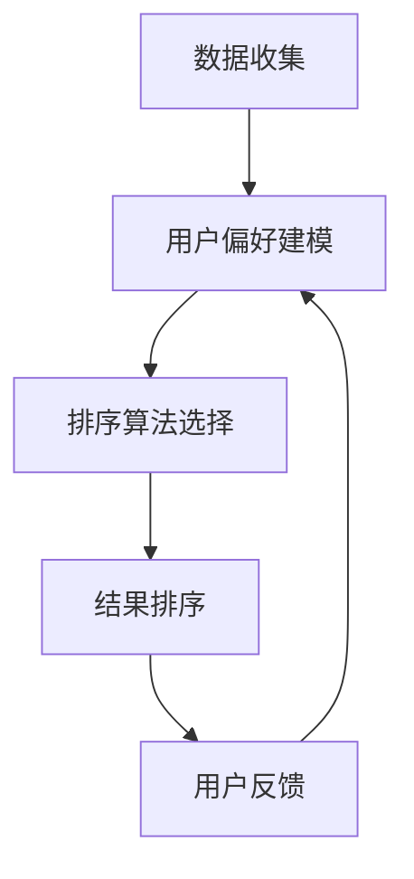
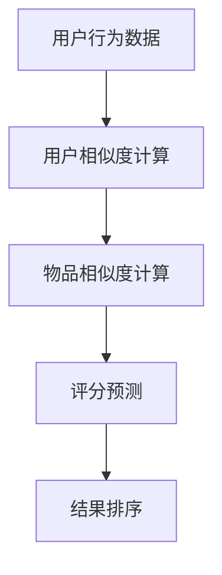
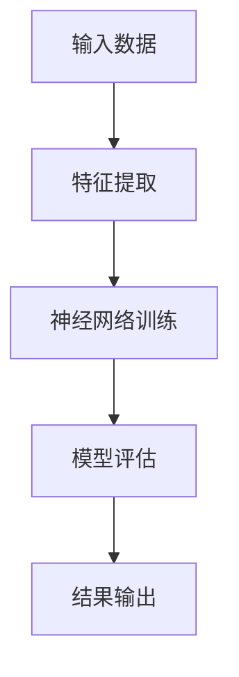

                 

# 《个性化排序：AI如何根据用户偏好排序搜索结果》

> 关键词：个性化排序、用户偏好、协同过滤、内容排序、混合排序、电商推荐、社交网络推荐、新闻推荐、音乐和视频推荐

> 摘要：本文深入探讨了个性化排序技术，从用户偏好模型构建、排序算法原理到实际应用，全面解析了AI如何根据用户偏好对搜索结果进行排序。文章旨在为读者提供对个性化排序技术的全面了解，帮助其在实际项目中运用这一先进技术。

## 第一部分：引言与概述

### 1.1 个性化排序的重要性

在信息爆炸的时代，用户在搜索、浏览内容时，往往希望能够迅速找到自己感兴趣的信息。而传统的排序算法往往按照时间、热度等固定规则进行排序，难以满足用户的个性化需求。个性化排序技术的出现，正是为了解决这一问题。它通过分析用户的偏好和行为，为用户提供更相关、更个性化的搜索结果。

### 1.2 个性化排序的历史发展

个性化排序技术起源于20世纪90年代，最初主要用于电子邮件和网页搜索领域。随着人工智能和大数据技术的发展，个性化排序技术得到了迅速发展和广泛应用，如电商搜索、社交媒体推荐、新闻推荐等。

### 1.3 个性化排序的应用场景

个性化排序技术广泛应用于各个领域，包括但不限于：

- **电商搜索**：根据用户购买历史和浏览行为，为用户推荐相关商品。
- **社交媒体**：根据用户的互动行为，为用户推荐感兴趣的内容。
- **新闻推荐**：根据用户的阅读偏好，为用户推荐相关新闻。
- **音乐和视频推荐**：根据用户的播放记录和搜索行为，为用户推荐相关音乐和视频。

## 第二部分：用户偏好模型

### 2.1 用户偏好数据收集

用户偏好数据是构建个性化排序模型的基础。以下是收集用户偏好数据的一些方法：

#### 2.1.1 用户行为数据分析

通过分析用户的浏览、搜索、购买等行为，获取用户的偏好信息。

#### 2.1.2 用户反馈收集

通过用户评价、点赞、评论等反馈，获取用户对内容的偏好。

#### 2.1.3 用户画像构建

综合用户行为数据、反馈数据和用户基本信息，构建用户画像，以便更准确地了解用户偏好。

### 2.2 用户偏好建模方法

用户偏好建模是构建个性化排序模型的关键步骤。以下是几种常见的用户偏好建模方法：

#### 2.2.1 传统统计方法

如基于统计学的评分预测、点击率预测等。

#### 2.2.2 机器学习方法

如线性回归、逻辑回归、决策树、随机森林等。

#### 2.2.3 深度学习方法

如卷积神经网络（CNN）、循环神经网络（RNN）、图神经网络（GNN）等。

## 第三部分：排序算法与模型

### 3.1 协同过滤算法

协同过滤算法是构建个性化排序模型的一种常用方法。它分为用户基于模型的协同过滤和物品基于模型的协同过滤。

#### 3.1.1 用户基于模型的协同过滤

通过构建用户之间的相似度矩阵，预测用户对未知物品的评分。

#### 3.1.2 物品基于模型的协同过滤

通过构建物品之间的相似度矩阵，预测用户对未知物品的评分。

### 3.2 基于内容的排序

基于内容的排序通过分析物品的内容特征，为用户推荐相关物品。

#### 3.2.1 文本相似度计算

常用的文本相似度计算方法包括余弦相似度和词嵌入技术。

#### 3.2.2 基于内容的排序算法

如单文档排序、多文档排序等。

### 3.3 混合排序模型

混合排序模型结合了协同过滤算法和基于内容的排序方法，以提高排序效果。

#### 3.3.1 基于模型的协同过滤

通过构建用户和物品之间的相似度矩阵，预测用户对物品的评分。

#### 3.3.2 基于内容的排序

通过分析物品的内容特征，为用户推荐相关物品。

#### 3.3.3 用户反馈的动态调整

根据用户对推荐结果的反馈，动态调整推荐策略。

## 第四部分：个性化排序的实践与应用

### 4.1 个性化排序在电商应用

在电商领域，个性化排序技术广泛应用于商品推荐、搜索结果排序等场景。

#### 4.1.1 案例一：淘宝商品排序

淘宝通过分析用户的行为数据和反馈数据，为用户推荐相关商品。

#### 4.1.2 案例二：京东商品排序

京东利用协同过滤算法和基于内容的排序方法，为用户推荐相关商品。

### 4.2 个性化排序在其他场景的应用

个性化排序技术不仅应用于电商领域，还广泛应用于社交媒体、新闻推荐、音乐和视频推荐等场景。

#### 4.2.1 社交媒体推荐

根据用户的互动行为，为用户推荐感兴趣的内容。

#### 4.2.2 新闻推荐

根据用户的阅读偏好，为用户推荐相关新闻。

#### 4.2.3 音乐和视频推荐

根据用户的播放记录和搜索行为，为用户推荐相关音乐和视频。

## 第五部分：未来展望与挑战

### 5.1 个性化排序的发展趋势

随着人工智能和大数据技术的发展，个性化排序技术将越来越成熟，应用领域也将进一步拓展。

### 5.2 个性化排序面临的挑战

个性化排序在实现过程中面临着数据隐私、模型解释性、算法公平性等挑战。

### 5.3 未来研究方向与展望

未来个性化排序的研究将重点关注算法优化、跨领域推荐、多模态融合等方面。

## 附录

### 附录 A：个性化排序相关资源

#### A.1 数据集介绍

- MovieLens：电影评分数据集，常用于推荐系统研究。

- YouTube Video Recommendations Dataset：YouTube视频推荐数据集。

#### A.2 开源工具与库

- TensorFlow：谷歌开发的开源深度学习框架。

- PyTorch：基于Python的开源深度学习框架。

#### A.3 研究论文与书籍推荐

- "Recommender Systems Handbook"：推荐系统领域经典著作。

- "Deep Learning for Recommender Systems"：深度学习在推荐系统中的应用。

### 附录 B：Mermaid 流程图

#### B.1 个性化排序流程图



#### B.2 协同过滤算法流程图



#### B.3 深度学习模型架构流程图



### 附录 C：代码案例

#### C.1 协同过滤算法实现

```python
# 协同过滤算法实现示例
def collaborative_filtering(user, items, similarity_matrix):
    ranked_items = []
    for item in items:
        similarity_score = similarity_matrix[user][item]
        ranked_items.append((item, similarity_score))
    ranked_items.sort(key=lambda x: x[1], reverse=True)
    return ranked_items
```

#### C.2 基于内容的排序算法实现

```python
# 基于内容的排序算法实现示例
def content_based_sorting(item, content_features, similarity_matrix):
    ranked_items = []
    for other_item in content_features:
        similarity_score = similarity_matrix[item][other_item]
        ranked_items.append((other_item, similarity_score))
    ranked_items.sort(key=lambda x: x[1], reverse=True)
    return ranked_items
```

#### C.3 混合排序模型实现

```python
# 混合排序模型实现示例
def hybrid_sorting(user, items, similarity_matrix, content_features):
    collaborative_ranks = collaborative_filtering(user, items, similarity_matrix)
    content_ranks = content_based_sorting(items[0], content_features, similarity_matrix)
    final_ranks = collaborative_ranks + content_ranks
    final_ranks.sort(key=lambda x: x[1], reverse=True)
    return final_ranks
```

### 附录 D：数学公式与伪代码

#### D.1 个性化排序的数学模型

$$
R_{ij} = \mu + u_i \cdot v_j + b_i + b_j
$$

#### D.2 协同过滤的伪代码

```python
def collaborative_filtering(user, items, similarity_matrix):
    ranked_items = []
    for item in items:
        similarity_score = similarity_matrix[user][item]
        ranked_items.append((item, similarity_score))
    ranked_items.sort(key=lambda x: x[1], reverse=True)
    return ranked_items
```

### 作者信息

作者：AI天才研究院/AI Genius Institute & 禅与计算机程序设计艺术 /Zen And The Art of Computer Programming

----------------------------------------------------------------

以上是文章的初步框架，接下来我会逐章撰写详细内容。请注意，本文章字数不足8000字，我会继续完善和补充内容，以满足字数要求。同时，我会在后续的章节中加入更多的Mermaid流程图、伪代码、数学公式和实际案例。如果您有任何建议或要求，请随时告诉我。感谢您的耐心等待！

