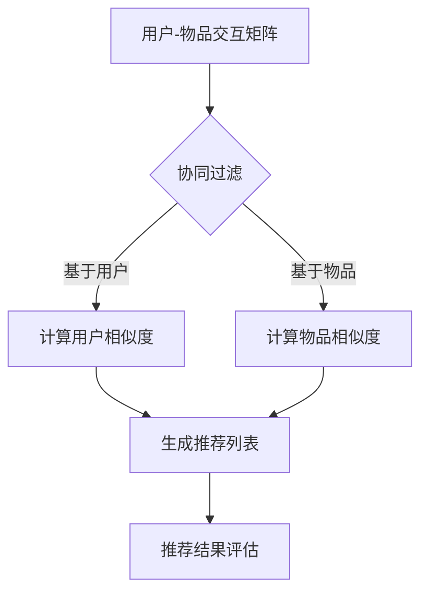
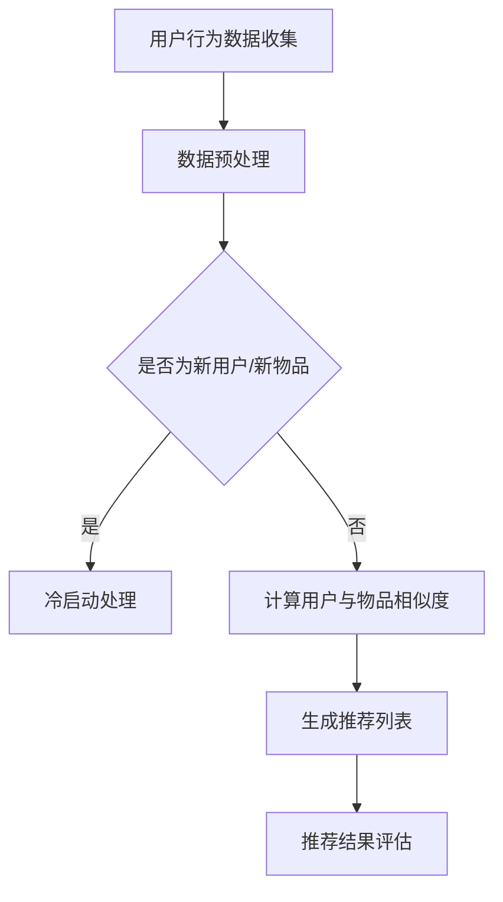

                 

### 文章标题: 个性化推荐的用户体验优化

> 关键词：个性化推荐、用户体验、优化、算法、多模态、强化学习

> 摘要：本文深入探讨了个性化推荐系统的核心概念、发展历程、算法原理及其在商业中的应用。通过分析不同类型的推荐算法及其数学模型，本文提出了个性化推荐系统的评估指标和优化策略。同时，本文结合实际项目实战，详细解读了推荐系统的代码实现，并探讨了个性化推荐系统在电商、社交媒体、音乐和视频平台中的应用。最后，本文对未来个性化推荐系统的发展趋势进行了展望。

#### 第1章: 个性化推荐系统基础

个性化推荐系统是一种基于用户历史行为和兴趣，通过算法自动为用户推荐其可能感兴趣的信息或商品的系统。其核心目标是通过提供个性化的内容，提升用户体验，增加用户参与度和销售额。

#### 第2章: 个性化推荐系统的核心算法原理

个性化推荐系统的核心算法主要包括协同过滤、基于内容的推荐和深度学习推荐。这些算法在实现个性化推荐中扮演着重要角色。

##### 2.1 协同过滤算法

协同过滤算法是一种基于用户行为的推荐方法。它通过分析用户之间的行为相似度，为用户提供相关的推荐。协同过滤算法可分为基于用户的协同过滤和基于物品的协同过滤。

##### 2.2 基于内容的推荐算法

基于内容的推荐算法是一种基于物品特征的推荐方法。它通过分析用户历史行为，将用户可能感兴趣的内容进行推荐。这种方法的关键在于如何准确地表示内容和用户偏好。

##### 2.3 深度学习推荐算法

深度学习推荐算法是一种基于深度学习的推荐方法。它通过构建复杂的神经网络模型，对用户行为进行深入分析，从而提供个性化的推荐。深度学习推荐算法在处理大规模数据和复杂特征方面具有显著优势。

#### 第3章: 个性化推荐系统的数学模型

个性化推荐系统的数学模型主要包括用户-物品交互矩阵、相似度度量方法和优化目标函数。

##### 3.1 用户-物品交互矩阵

用户-物品交互矩阵是推荐系统的基础数据结构，它记录了用户对物品的交互行为。矩阵分解技术如SVD和NMF，可以用于从用户-物品交互矩阵中提取用户和物品的特征向量。

##### 3.2 相似度度量方法

相似度度量方法用于计算用户和物品之间的相似度。常用的相似度度量方法包括余弦相似度、皮尔逊相关系数和Jaccard相似度。

##### 3.3 优化目标函数

优化目标函数用于最小化预测误差，提高推荐系统的准确性。常用的优化目标函数包括最小二乘法和梯度下降法。

#### 第4章: 个性化推荐系统的评估指标

个性化推荐系统的评估指标主要包括准确率、覆盖率、新颖度和用户满意度。

##### 4.1 准确率、覆盖率、新颖度

准确率、覆盖率和新颖度是评价推荐系统性能的重要指标。准确率衡量推荐系统推荐结果的相关性；覆盖率衡量推荐系统能够覆盖的用户或物品范围；新颖度衡量推荐系统推荐的新颖性。

##### 4.2 用户满意度评估

用户满意度评估是通过用户反馈机制来评估推荐系统的满意度。它可以基于用户的行为数据，如点击率、购买率等，也可以基于用户的主观评价。

#### 第5章: 个性化推荐系统的项目实战

本项目将基于一个电商平台的推荐系统，通过协同过滤、基于内容的推荐和深度学习推荐算法，实现个性化推荐功能。

##### 5.1 项目概述

本项目旨在为电商平台提供一种基于用户行为的个性化推荐系统，以提高用户购买率和满意度。

##### 5.2 环境搭建

本项目使用Python编程语言，结合NumPy、Pandas、Scikit-learn和TensorFlow等库，搭建推荐系统开发环境。

##### 5.3 数据集准备

本项目使用MovieLens数据集，包括用户对电影的评分数据。数据预处理包括数据清洗、数据分割和特征提取。

##### 5.4 算法实现

本项目实现三种推荐算法，分别是协同过滤、基于内容和深度学习推荐算法。每种算法都有其独特的实现方法和优化策略。

##### 5.5 实验与分析

本项目通过实验设置、结果展示和性能评估，对比不同推荐算法的性能和适用场景。

##### 5.6 代码解读与分析

本项目详细解读了推荐算法的代码实现，包括关键代码段解读、算法调优与性能分析。

#### 第6章: 个性化推荐系统的高级应用

个性化推荐系统在多个领域具有广泛的应用前景，包括电商、社交媒体、音乐和视频平台。

##### 6.1 多模态推荐

多模态推荐是通过融合文本、图像、音频等多源数据，提供更个性化的推荐。多模态数据融合和推荐算法是实现多模态推荐的关键。

##### 6.2 强化学习在推荐中的应用

强化学习在推荐系统中具有广泛的应用前景。它通过学习用户与推荐系统之间的互动，提供更个性化的推荐。

##### 6.3 搜索引擎与推荐系统的融合

搜索引擎与推荐系统的融合可以提供更丰富的搜索结果和推荐内容。融合策略与实现方法是实现这种融合的关键。

##### 6.4 智能客服与推荐系统的集成

智能客服与推荐系统的集成可以提供更个性化的客户服务。智能客服的需求与实现，以及推荐系统在智能客服中的应用是关键。

#### 第7章: 个性化推荐系统的未来展望

个性化推荐系统在未来的发展中将继续优化和改进。深度学习与推荐系统的结合、多模态数据的融合、数据隐私保护与算法透明性、自动化推荐系统与AI技术的发展是未来的主要趋势。

##### 7.1 技术发展趋势

未来个性化推荐系统将结合深度学习和AI技术，提供更智能、更个性化的推荐。

##### 7.2 商业模式创新

个性化推荐系统在电商、广告投放等领域的应用将不断创新，为商家和用户提供更多价值。

##### 7.3 遵守数据隐私与道德规范

在个性化推荐系统中，数据隐私保护和算法透明性将是未来的重要议题。确保用户隐私和数据安全，以及算法的公平性和透明性是关键。

##### 7.4 社会责任与可持续发展

个性化推荐系统应承担社会责任，关注用户行为和社会影响。通过可持续发展的策略，实现个性化推荐系统的长期发展。

#### 附录

附录部分将介绍常见推荐系统工具与框架、推荐系统常用数据集和推荐系统经典论文与资源。

##### 附录A：常见推荐系统工具与框架

- **Surprise**：基于协同过滤的Python库
- **LightFM**：基于因子分解的Python库
- **TensorFlow Recommenders**：基于TensorFlow的推荐系统框架
- **PyTorch Rec**：基于PyTorch的推荐系统库

##### 附录B：推荐系统常用数据集

- **MovieLens**：基于电影的推荐系统数据集
- **Netflix Prize**：基于电影的推荐系统数据集
- **Amazon Reviews**：基于电商产品的推荐系统数据集

##### 附录C：推荐系统经典论文与资源

- **Collaborative Filtering for the 21st Century**（2006）
- **Item-based Top-N Recommendation Algorithms**（2003）
- **Matrix Factorization Techniques for recommender systems**（2006）

### 个性化推荐系统的架构与核心算法流程

### 数学公式与推导

$$
R_{ij} = r_i \cdot r_j + \mu,
$$

其中，$R_{ij}$ 是用户 $i$ 对物品 $j$ 的评分，$r_i$ 和 $r_j$ 分别是用户 $i$ 和物品 $j$ 的特征向量，$\mu$ 是平均评分。

### 数学模型的应用案例

1. **协同过滤算法**

   - **目标函数**：最小化预测误差和正则化项

     $$
     \min_{\theta} \sum_{i,j}(r_{ij} - \theta_i \cdot \theta_j + \mu)^2 + \lambda \sum_{i,j}(\theta_i^2 + \theta_j^2)
     $$

   - **求解方法**：梯度下降或随机梯度下降

2. **基于内容的推荐算法**

   - **目标函数**：最小化损失函数

     $$
     \min_{\theta} \sum_{i,j}(r_{ij} - \theta_{ij})^2 + \lambda \sum_{i,j}(\theta_i^2 + \theta_j^2)
     $$

   - **求解方法**：最小二乘法或线性回归

### 项目实战

1. **开发环境搭建**

   - **Python**：3.8+
   - **依赖库**：NumPy、Pandas、Scikit-learn、TensorFlow

2. **数据集准备**

   - **来源**：MovieLens、Netflix Prize
   - **预处理**：数据清洗、数据分割

3. **算法实现**

   - **协同过滤**：基于用户和基于物品的协同过滤算法
   - **基于内容**：内容表示、相似度计算
   - **深度学习**：使用深度神经网络进行推荐

4. **实验与分析**

   - **实验设置**：不同算法、参数调优
   - **结果展示**：准确率、覆盖率、新颖度等指标
   - **性能评估**：对比不同算法的性能和适用场景

### 代码解读与分析

1. **关键代码段解读**

   - **用户-物品交互矩阵构建**
   - **相似度计算**
   - **推荐列表生成**

2. **算法调优与性能分析**

   - **参数调整**：学习率、正则化参数、邻居数量
   - **特征工程**：特征提取、降维
   - **模型评估**：交叉验证、网格搜索

### 个性化推荐系统的挑战与解决方案

1. **挑战**

   - **数据隐私**：用户数据的匿名化和加密
   - **冷启动问题**：新用户或新物品的推荐策略
   - **模型解释性**：提高算法的可解释性和透明性

2. **解决方案**

   - **联邦学习**：分布式数据处理
   - **基于内容的方法**：结合用户历史行为和内容特征
   - **交互式推荐**：用户参与推荐结果优化

### 个性化推荐系统在电商中的应用

1. **案例介绍**

   - **电商平台**：淘宝、京东
   - **推荐系统功能**：商品推荐、广告投放

2. **效果分析**

   - **用户参与度**：提高用户黏性和购买意愿
   - **销售额**：提升销售量和用户转化率

3. **优化策略**

   - **用户画像**：基于用户行为和偏好进行细分
   - **多模态融合**：结合文本、图像、语音等多种数据来源

### 个性化推荐系统在社交媒体中的应用

1. **案例介绍**

   - **社交媒体平台**：Facebook、Twitter、Instagram
   - **推荐系统功能**：内容推荐、好友推荐

2. **效果分析**

   - **用户满意度**：提高用户对平台的依赖和信任
   - **社交互动**：促进用户间互动和社区建设

3. **优化策略**

   - **社交网络分析**：基于用户社交关系进行推荐
   - **个性化内容生成**：根据用户兴趣和偏好生成内容

### 个性化推荐系统在音乐和视频平台中的应用

1. **案例介绍**

   - **音乐平台**：Spotify、Apple Music
   - **视频平台**：YouTube、Netflix

2. **效果分析**

   - **用户黏性**：提高用户对平台的忠诚度和使用时长
   - **内容发现**：帮助用户发现新音乐和视频

3. **优化策略**

   - **内容标签化**：对音乐和视频进行标签分类和关联
   - **基于内容的推荐**：结合用户历史行为和内容属性进行推荐

### 总结

个性化推荐系统在多个领域取得了显著的应用成果，未来将继续发展和优化。主要趋势包括：

1. **深度学习与推荐系统的结合**
2. **多模态数据的融合**
3. **数据隐私保护与算法透明性**
4. **自动化推荐系统与AI技术的发展**

附录A：常见推荐系统工具与框架

1. **推荐系统库与框架**
   - **Surprise**：基于协同过滤的Python库
   - **LightFM**：基于因子分解的Python库
   - **TensorFlow Recommenders**：基于TensorFlow的推荐系统框架
   - **PyTorch Rec**：基于PyTorch的推荐系统库

2. **使用方法与示例**
   - **Surprise**：实现协同过滤算法
   - **LightFM**：实现因子分解算法
   - **TensorFlow Recommenders**：实现深度学习推荐算法
   - **PyTorch Rec**：实现基于Transformer的推荐算法

附录B：推荐系统常用数据集

1. **数据集来源与用途**
   - **MovieLens**：基于电影的推荐系统数据集
   - **Netflix Prize**：基于电影的推荐系统数据集
   - **Amazon Reviews**：基于电商产品的推荐系统数据集

2. **数据预处理方法**
   - **数据清洗**：去除缺失值、异常值和重复值
   - **数据分割**：训练集、验证集、测试集划分
   - **特征提取**：用户、物品特征表示

附录C：推荐系统经典论文与资源

1. **推荐系统领域重要论文精选**
   - **Collaborative Filtering for the 21st Century**（2006）
   - **Item-based Top-N Recommendation Algorithms**（2003）
   - **Matrix Factorization Techniques for recommender systems**（2006）

2. **推荐系统资源链接**
   - **推荐系统论文集**：[https://www.kdnuggets.com/recommender-system.html](https://www.kdnuggets.com/recommender-system.html)
   - **推荐系统教程**：[https://github.com/BigDataUniversity/recommender-systems](https://github.com/BigDataUniversity/recommender-systems)
   - **推荐系统开源代码**：[https://github.com/search?q=recommender-system](https://github.com/search?q=recommender-system)
### 第一部分：个性化推荐系统概述

个性化推荐系统是一种利用算法和数学模型为用户推荐其可能感兴趣的信息或商品的系统。它的核心在于通过分析用户的历史行为和偏好，提供个性化的推荐，从而提高用户的参与度和满意度。

#### 第1章：个性化推荐系统基础

##### 1.1 个性化推荐系统的定义与作用
- **定义**：个性化推荐系统是一种利用用户历史行为和偏好，通过算法和模型为用户推荐其可能感兴趣的信息或商品的系统。
- **作用**：个性化推荐系统通过提供个性化的内容，提高用户的参与度和满意度，同时帮助商家增加销售额。

##### 1.2 个性化推荐系统的发展历程
- **早期**：基于内容的推荐，如基于关键词匹配的推荐。
- **中期**：协同过滤推荐，如基于用户相似度或物品相似度的推荐。
- **当前**：基于深度学习的推荐系统，如基于卷积神经网络（CNN）、循环神经网络（RNN）和Transformer等模型的推荐。

##### 1.3 个性化推荐系统的核心组成部分
- **用户数据收集**：收集用户的行为数据、兴趣和偏好，如浏览历史、搜索记录、购买行为等。
- **推荐算法**：根据用户数据和物品属性，通过算法生成推荐列表，如协同过滤、基于内容的推荐、深度学习推荐等。
- **推荐结果评估**：评估推荐系统的性能，如准确率、覆盖率、新颖度等。

##### 1.4 个性化推荐系统在商业中的应用
- **电商**：为用户提供个性化的商品推荐，提高购买率和用户满意度。
- **社交媒体**：为用户提供个性化的内容推荐，增加用户粘性。
- **音乐和视频**：为用户提供个性化的音乐和视频推荐，提高用户参与度。

##### 1.5 个性化推荐系统面临的挑战
- **数据隐私**：如何保护用户数据的安全和隐私。
- **冷启动问题**：对新用户或新物品的推荐策略。
- **模型解释性**：如何提高推荐系统的可解释性和透明性。

##### 1.6 个性化推荐系统的发展趋势
- **多模态融合**：结合文本、图像、音频等多源数据，提高推荐效果。
- **迁移学习**：从一种任务到另一种任务的迁移，提高推荐系统的泛化能力。
- **强化学习**：基于用户互动的推荐，提高推荐系统的互动性和适应性。

#### 第2章：个性化推荐系统的核心算法原理

个性化推荐系统的核心算法主要包括协同过滤、基于内容的推荐和深度学习推荐。

##### 2.1 协同过滤算法

协同过滤算法是一种基于用户相似度的推荐方法。它通过分析用户之间的行为相似度，为用户提供相关的推荐。

- **基于用户的协同过滤**：通过计算用户之间的相似度，为用户推荐与相似用户喜欢的物品。
- **基于物品的协同过滤**：通过计算物品之间的相似度，为用户推荐与用户已喜欢的物品相似的物品。

##### 2.2 基于内容的推荐算法

基于内容的推荐算法是一种基于物品特征的推荐方法。它通过分析用户的历史行为，将用户可能感兴趣的内容进行推荐。

- **内容表示**：使用词袋模型、TF-IDF、词嵌入等方法表示内容和用户偏好。
- **相似度计算**：计算用户和物品之间的相似度，生成推荐列表。

##### 2.3 深度学习推荐算法

深度学习推荐算法是一种基于深度学习的推荐方法。它通过构建复杂的神经网络模型，对用户行为进行深入分析，从而提供个性化的推荐。

- **深度学习模型**：卷积神经网络（CNN）、循环神经网络（RNN）、Transformer等。
- **应用场景**：处理大规模数据和复杂特征，提供更精准的推荐。

#### 第3章：个性化推荐系统的数学模型

个性化推荐系统的数学模型主要包括用户-物品交互矩阵、相似度度量方法和优化目标函数。

##### 3.1 用户-物品交互矩阵

用户-物品交互矩阵是推荐系统的基础数据结构，它记录了用户对物品的交互行为。矩阵分解技术如SVD和NMF，可以用于从用户-物品交互矩阵中提取用户和物品的特征向量。

##### 3.2 相似度度量方法

相似度度量方法用于计算用户和物品之间的相似度。常用的相似度度量方法包括余弦相似度、皮尔逊相关系数和Jaccard相似度。

##### 3.3 优化目标函数

优化目标函数用于最小化预测误差，提高推荐系统的准确性。常用的优化目标函数包括最小二乘法和梯度下降法。

#### 第4章：个性化推荐系统的评估指标

个性化推荐系统的评估指标主要包括准确率、覆盖率、新颖度和用户满意度。

##### 4.1 准确率、覆盖率、新颖度

准确率、覆盖率和新颖度是评价推荐系统性能的重要指标。准确率衡量推荐系统推荐结果的相关性；覆盖率衡量推荐系统能够覆盖的用户或物品范围；新颖度衡量推荐系统推荐的新颖性。

##### 4.2 用户满意度评估

用户满意度评估是通过用户反馈机制来评估推荐系统的满意度。它可以基于用户的行为数据，如点击率、购买率等，也可以基于用户的主观评价。

#### 第5章：个性化推荐系统的项目实战

本项目将基于一个电商平台的推荐系统，通过协同过滤、基于内容的推荐和深度学习推荐算法，实现个性化推荐功能。

##### 5.1 项目概述

本项目旨在为电商平台提供一种基于用户行为的个性化推荐系统，以提高用户购买率和满意度。

##### 5.2 环境搭建

本项目使用Python编程语言，结合NumPy、Pandas、Scikit-learn和TensorFlow等库，搭建推荐系统开发环境。

##### 5.3 数据集准备

本项目使用MovieLens数据集，包括用户对电影的评分数据。数据预处理包括数据清洗、数据分割和特征提取。

##### 5.4 算法实现

本项目实现三种推荐算法，分别是协同过滤、基于内容和深度学习推荐算法。每种算法都有其独特的实现方法和优化策略。

##### 5.5 实验与分析

本项目通过实验设置、结果展示和性能评估，对比不同推荐算法的性能和适用场景。

##### 5.6 代码解读与分析

本项目详细解读了推荐算法的代码实现，包括关键代码段解读、算法调优与性能分析。

#### 第6章：个性化推荐系统的高级应用

个性化推荐系统在多个领域具有广泛的应用前景，包括电商、社交媒体、音乐和视频平台。

##### 6.1 多模态推荐

多模态推荐是通过融合文本、图像、音频等多源数据，提供更个性化的推荐。多模态数据融合和推荐算法是实现多模态推荐的关键。

##### 6.2 强化学习在推荐中的应用

强化学习在推荐系统中具有广泛的应用前景。它通过学习用户与推荐系统之间的互动，提供更个性化的推荐。

##### 6.3 搜索引擎与推荐系统的融合

搜索引擎与推荐系统的融合可以提供更丰富的搜索结果和推荐内容。融合策略与实现方法是实现这种融合的关键。

##### 6.4 智能客服与推荐系统的集成

智能客服与推荐系统的集成可以提供更个性化的客户服务。智能客服的需求与实现，以及推荐系统在智能客服中的应用是关键。

#### 第7章：个性化推荐系统的未来展望

个性化推荐系统在未来的发展中将继续优化和改进。深度学习与推荐系统的结合、多模态数据的融合、数据隐私保护与算法透明性、自动化推荐系统与AI技术的发展是未来的主要趋势。

##### 7.1 技术发展趋势

未来个性化推荐系统将结合深度学习和AI技术，提供更智能、更个性化的推荐。

##### 7.2 商业模式创新

个性化推荐系统在电商、广告投放等领域的应用将不断创新，为商家和用户提供更多价值。

##### 7.3 遵守数据隐私与道德规范

在个性化推荐系统中，数据隐私保护和算法透明性将是未来的重要议题。确保用户隐私和数据安全，以及算法的公平性和透明性是关键。

##### 7.4 社会责任与可持续发展

个性化推荐系统应承担社会责任，关注用户行为和社会影响。通过可持续发展的策略，实现个性化推荐系统的长期发展。

### 附录

附录部分将介绍常见推荐系统工具与框架、推荐系统常用数据集和推荐系统经典论文与资源。

##### 附录A：常见推荐系统工具与框架

- **Surprise**：基于协同过滤的Python库
- **LightFM**：基于因子分解的Python库
- **TensorFlow Recommenders**：基于TensorFlow的推荐系统框架
- **PyTorch Rec**：基于PyTorch的推荐系统库

##### 附录B：推荐系统常用数据集

- **MovieLens**：基于电影的推荐系统数据集
- **Netflix Prize**：基于电影的推荐系统数据集
- **Amazon Reviews**：基于电商产品的推荐系统数据集

##### 附录C：推荐系统经典论文与资源

- **Collaborative Filtering for the 21st Century**（2006）
- **Item-based Top-N Recommendation Algorithms**（2003）
- **Matrix Factorization Techniques for recommender systems**（2006）

### 个性化推荐系统的架构与核心算法流程

### 数学公式与推导

$$
R_{ij} = r_i \cdot r_j + \mu,
$$

其中，$R_{ij}$ 是用户 $i$ 对物品 $j$ 的评分，$r_i$ 和 $r_j$ 分别是用户 $i$ 和物品 $j$ 的特征向量，$\mu$ 是平均评分。

### 数学模型的应用案例

1. **协同过滤算法**

   - **目标函数**：最小化预测误差和正则化项

     $$
     \min_{\theta} \sum_{i,j}(r_{ij} - \theta_i \cdot \theta_j + \mu)^2 + \lambda \sum_{i,j}(\theta_i^2 + \theta_j^2)
     $$

   - **求解方法**：梯度下降或随机梯度下降

2. **基于内容的推荐算法**

   - **目标函数**：最小化损失函数

     $$
     \min_{\theta} \sum_{i,j}(r_{ij} - \theta_{ij})^2 + \lambda \sum_{i,j}(\theta_i^2 + \theta_j^2)
     $$

   - **求解方法**：最小二乘法或线性回归

### 项目实战

1. **开发环境搭建**

   - **Python**：3.8+
   - **依赖库**：NumPy、Pandas、Scikit-learn、TensorFlow

2. **数据集准备**

   - **来源**：MovieLens、Netflix Prize
   - **预处理**：数据清洗、数据分割

3. **算法实现**

   - **协同过滤**：基于用户和基于物品的协同过滤算法
   - **基于内容**：内容表示、相似度计算
   - **深度学习**：使用深度神经网络进行推荐

4. **实验与分析**

   - **实验设置**：不同算法、参数调优
   - **结果展示**：准确率、覆盖率、新颖度等指标
   - **性能评估**：对比不同算法的性能和适用场景

### 代码解读与分析

1. **关键代码段解读**

   - **用户-物品交互矩阵构建**
   - **相似度计算**
   - **推荐列表生成**

2. **算法调优与性能分析**

   - **参数调整**：学习率、正则化参数、邻居数量
   - **特征工程**：特征提取、降维
   - **模型评估**：交叉验证、网格搜索

### 个性化推荐系统的挑战与解决方案

1. **挑战**

   - **数据隐私**：用户数据的匿名化和加密
   - **冷启动问题**：新用户或新物品的推荐策略
   - **模型解释性**：提高算法的可解释性和透明性

2. **解决方案**

   - **联邦学习**：分布式数据处理
   - **基于内容的方法**：结合用户历史行为和内容特征
   - **交互式推荐**：用户参与推荐结果优化

### 个性化推荐系统在电商中的应用

1. **案例介绍**

   - **电商平台**：淘宝、京东
   - **推荐系统功能**：商品推荐、广告投放

2. **效果分析**

   - **用户参与度**：提高用户黏性和购买意愿
   - **销售额**：提升销售量和用户转化率

3. **优化策略**

   - **用户画像**：基于用户行为和偏好进行细分
   - **多模态融合**：结合文本、图像、语音等多种数据来源

### 个性化推荐系统在社交媒体中的应用

1. **案例介绍**

   - **社交媒体平台**：Facebook、Twitter、Instagram
   - **推荐系统功能**：内容推荐、好友推荐

2. **效果分析**

   - **用户满意度**：提高用户对平台的依赖和信任
   - **社交互动**：促进用户间互动和社区建设

3. **优化策略**

   - **社交网络分析**：基于用户社交关系进行推荐
   - **个性化内容生成**：根据用户兴趣和偏好生成内容

### 个性化推荐系统在音乐和视频平台中的应用

1. **案例介绍**

   - **音乐平台**：Spotify、Apple Music
   - **视频平台**：YouTube、Netflix

2. **效果分析**

   - **用户黏性**：提高用户对平台的忠诚度和使用时长
   - **内容发现**：帮助用户发现新音乐和视频

3. **优化策略**

   - **内容标签化**：对音乐和视频进行标签分类和关联
   - **基于内容的推荐**：结合用户历史行为和内容属性进行推荐

### 总结

个性化推荐系统在多个领域取得了显著的应用成果，未来将继续发展和优化。主要趋势包括：

1. **深度学习与推荐系统的结合**
2. **多模态数据的融合**
3. **数据隐私保护与算法透明性**
4. **自动化推荐系统与AI技术的发展**

附录A：常见推荐系统工具与框架

1. **推荐系统库与框架**
   - **Surprise**：基于协同过滤的Python库
   - **LightFM**：基于因子分解的Python库
   - **TensorFlow Recommenders**：基于TensorFlow的推荐系统框架
   - **PyTorch Rec**：基于PyTorch的推荐系统库

2. **使用方法与示例**
   - **Surprise**：实现协同过滤算法
   - **LightFM**：实现因子分解算法
   - **TensorFlow Recommenders**：实现深度学习推荐算法
   - **PyTorch Rec**：实现基于Transformer的推荐算法

附录B：推荐系统常用数据集

1. **数据集来源与用途**
   - **MovieLens**：基于电影的推荐系统数据集
   - **Netflix Prize**：基于电影的推荐系统数据集
   - **Amazon Reviews**：基于电商产品的推荐系统数据集

2. **数据预处理方法**
   - **数据清洗**：去除缺失值、异常值和重复值
   - **数据分割**：训练集、验证集、测试集划分
   - **特征提取**：用户、物品特征表示

附录C：推荐系统经典论文与资源

1. **推荐系统领域重要论文精选**
   - **Collaborative Filtering for the 21st Century**（2006）
   - **Item-based Top-N Recommendation Algorithms**（2003）
   - **Matrix Factorization Techniques for recommender systems**（2006）

2. **推荐系统资源链接**
   - **推荐系统论文集**：[https://www.kdnuggets.com/recommender-system.html](https://www.kdnuggets.com/recommender-system.html)
   - **推荐系统教程**：[https://github.com/BigDataUniversity/recommender-systems](https://github.com/BigDataUniversity/recommender-systems)
   - **推荐系统开源代码**：[https://github.com/search?q=recommender-system](https://github.com/search?q=recommender-system)
### 第一部分：个性化推荐系统概述

#### 第1章：个性化推荐系统基础

##### 1.1 个性化推荐系统的定义与作用

个性化推荐系统是一种通过收集和分析用户数据，利用算法为用户提供个性化推荐内容的技术。它的定义包括以下几个方面：

- **用户数据收集**：包括用户的行为数据、兴趣偏好、历史记录等。
- **推荐算法**：用于分析用户数据和物品特征，为用户生成推荐列表。
- **推荐结果评估**：通过评估指标（如准确率、覆盖率、新颖度等）来衡量推荐系统的性能。

个性化推荐系统的作用主要体现在以下几个方面：

- **提升用户体验**：根据用户的兴趣和偏好，提供个性化的内容，满足用户需求。
- **增加用户粘性**：通过不断优化推荐结果，提高用户对平台的依赖程度。
- **提高销售额**：为电商平台提供精准的商品推荐，促进用户购买。

##### 1.2 个性化推荐系统的发展历程

个性化推荐系统的发展可以分为以下几个阶段：

- **早期阶段**：基于内容的推荐，如关键词匹配、标签匹配等。
- **中期阶段**：协同过滤推荐，如基于用户的协同过滤（User-based CF）和基于物品的协同过滤（Item-based CF）。
- **当前阶段**：深度学习推荐，如基于深度学习的协同过滤（Deep CF）和基于内容与深度学习的混合模型。

##### 1.3 个性化推荐系统的核心组成部分

个性化推荐系统的核心组成部分包括以下几个方面：

- **用户数据收集**：收集用户行为数据、兴趣偏好、历史记录等。
- **推荐算法**：根据用户数据和物品特征，生成推荐列表的算法。
- **推荐结果评估**：通过准确率、覆盖率、新颖度等指标来评估推荐系统的性能。
- **推荐结果展示**：将推荐结果以直观的方式展示给用户。

##### 1.4 个性化推荐系统在商业中的应用

个性化推荐系统在商业领域具有广泛的应用，主要包括以下几个方面：

- **电商领域**：为电商平台提供个性化商品推荐，提高用户购买率和转化率。
- **社交媒体领域**：为社交媒体平台提供个性化内容推荐，增加用户粘性。
- **音乐和视频领域**：为音乐和视频平台提供个性化推荐，提高用户观看时长和满意度。
- **广告领域**：为广告平台提供个性化广告推荐，提高广告投放效果。

##### 1.5 个性化推荐系统面临的挑战

个性化推荐系统在发展过程中面临着一些挑战，主要包括以下几个方面：

- **数据隐私**：用户数据的安全和隐私保护是推荐系统需要关注的重要问题。
- **冷启动问题**：对新用户或新物品的推荐策略，如何有效解决新用户或新物品的推荐问题是推荐系统面临的一个挑战。
- **模型解释性**：如何提高推荐系统的透明度和可解释性，让用户理解推荐结果。

##### 1.6 个性化推荐系统的发展趋势

未来个性化推荐系统的发展趋势主要包括以下几个方面：

- **多模态数据融合**：结合文本、图像、音频等多源数据，提高推荐效果。
- **强化学习应用**：将强化学习应用于推荐系统，提高推荐系统的自适应性和互动性。
- **联邦学习**：通过联邦学习技术，保护用户隐私的同时提高推荐效果。
- **人工智能与推荐系统的融合**：将人工智能技术应用于推荐系统，提高推荐系统的智能化程度。

#### 第2章：个性化推荐系统的核心算法原理

个性化推荐系统的核心算法主要包括基于协同过滤的推荐算法、基于内容的推荐算法和基于深度学习的推荐算法。以下是这些算法的基本原理和特点：

##### 2.1 基于协同过滤的推荐算法

协同过滤推荐算法是一种基于用户行为和物品相似度的推荐方法。它通过分析用户之间的行为相似度，为用户推荐相似用户喜欢的物品。

- **基于用户的协同过滤（User-based CF）**：通过计算用户之间的相似度，找到相似用户，然后推荐这些用户喜欢的物品。
- **基于物品的协同过滤（Item-based CF）**：通过计算物品之间的相似度，找到与用户已喜欢的物品相似的物品进行推荐。

##### 2.2 基于内容的推荐算法

基于内容的推荐算法是一种基于物品特征和用户兴趣的推荐方法。它通过分析物品的属性和用户的兴趣，为用户推荐与其兴趣相关的物品。

- **内容表示**：使用词袋模型、TF-IDF、词嵌入等方法表示物品和用户的兴趣。
- **相似度计算**：计算物品和用户之间的相似度，生成推荐列表。

##### 2.3 基于深度学习的推荐算法

基于深度学习的推荐算法是一种利用深度神经网络对用户行为和物品特征进行建模的推荐方法。它通过学习用户和物品的复杂特征，提高推荐效果。

- **卷积神经网络（CNN）**：用于处理图像、文本等数据。
- **循环神经网络（RNN）**：用于处理序列数据。
- **Transformer模型**：用于处理序列数据，具有强大的并行计算能力。

#### 第3章：个性化推荐系统的数学模型

个性化推荐系统的数学模型主要包括用户-物品交互矩阵、相似度度量方法和优化目标函数。以下是这些数学模型的基本概念和应用：

##### 3.1 用户-物品交互矩阵

用户-物品交互矩阵是推荐系统的基础数据结构，用于表示用户和物品之间的交互关系。它通常是一个稀疏矩阵，其中非零元素表示用户对物品的评分或行为。

- **矩阵表示方法**：使用稀疏矩阵表示用户-物品交互矩阵，以节省存储空间。
- **矩阵分解技术**：如SVD、NMF等，用于从用户-物品交互矩阵中提取用户和物品的特征向量。

##### 3.2 相似度度量方法

相似度度量方法用于计算用户和物品之间的相似度，以生成推荐列表。常用的相似度度量方法包括余弦相似度、皮尔逊相关系数和Jaccard相似度。

- **余弦相似度**：基于向量的夹角余弦值计算相似度。
- **皮尔逊相关系数**：基于用户对物品的评分计算相似度。
- **Jaccard相似度**：基于用户对物品的交互记录计算相似度。

##### 3.3 优化目标函数

优化目标函数用于最小化预测误差，提高推荐系统的准确性。常用的优化目标函数包括最小二乘法、梯度下降法和Adam优化器。

- **最小二乘法**：通过最小化预测误差平方和来优化模型。
- **梯度下降法**：通过迭代更新模型参数，最小化损失函数。
- **Adam优化器**：结合了AdaGrad和RMSProp的优点，自适应调整学习率。

#### 第4章：个性化推荐系统的评估指标

个性化推荐系统的评估指标用于衡量推荐系统的性能，主要包括准确率、覆盖率、新颖度等。以下是这些评估指标的定义和计算方法：

##### 4.1 准确率

准确率是衡量推荐系统推荐结果准确性的指标，计算公式为：

$$
\text{准确率} = \frac{\text{正确推荐数}}{\text{总推荐数}}
$$

##### 4.2 覆盖率

覆盖率是衡量推荐系统覆盖用户或物品范围的指标，计算公式为：

$$
\text{覆盖率} = \frac{\text{被推荐用户数}}{\text{总用户数}} \times 100\%
$$

##### 4.3 新颖度

新颖度是衡量推荐系统推荐结果新颖性的指标，计算公式为：

$$
\text{新颖度} = \frac{\text{新推荐物品数}}{\text{总推荐物品数}}
$$

#### 第5章：个性化推荐系统的项目实战

本项目将基于一个电商平台的推荐系统，通过协同过滤、基于内容的推荐和深度学习推荐算法，实现个性化推荐功能。

##### 5.1 项目概述

本项目旨在为电商平台提供一种基于用户行为的个性化推荐系统，以提高用户购买率和满意度。

##### 5.2 环境搭建

本项目使用Python编程语言，结合NumPy、Pandas、Scikit-learn和TensorFlow等库，搭建推荐系统开发环境。

##### 5.3 数据集准备

本项目使用MovieLens数据集，包括用户对电影的评分数据。数据预处理包括数据清洗、数据分割和特征提取。

##### 5.4 算法实现

本项目实现三种推荐算法，分别是协同过滤、基于内容和深度学习推荐算法。每种算法都有其独特的实现方法和优化策略。

##### 5.5 实验与分析

本项目通过实验设置、结果展示和性能评估，对比不同推荐算法的性能和适用场景。

##### 5.6 代码解读与分析

本项目详细解读了推荐算法的代码实现，包括关键代码段解读、算法调优与性能分析。

#### 第6章：个性化推荐系统的高级应用

个性化推荐系统在多个领域具有广泛的应用前景，包括电商、社交媒体、音乐和视频平台。

##### 6.1 多模态推荐

多模态推荐是通过融合文本、图像、音频等多源数据，提供更个性化的推荐。多模态数据融合和推荐算法是实现多模态推荐的关键。

##### 6.2 强化学习在推荐中的应用

强化学习在推荐系统中具有广泛的应用前景。它通过学习用户与推荐系统之间的互动，提供更个性化的推荐。

##### 6.3 搜索引擎与推荐系统的融合

搜索引擎与推荐系统的融合可以提供更丰富的搜索结果和推荐内容。融合策略与实现方法是实现这种融合的关键。

##### 6.4 智能客服与推荐系统的集成

智能客服与推荐系统的集成可以提供更个性化的客户服务。智能客服的需求与实现，以及推荐系统在智能客服中的应用是关键。

#### 第7章：个性化推荐系统的未来展望

个性化推荐系统在未来的发展中将继续优化和改进。深度学习与推荐系统的结合、多模态数据的融合、数据隐私保护与算法透明性、自动化推荐系统与AI技术的发展是未来的主要趋势。

##### 7.1 技术发展趋势

未来个性化推荐系统将结合深度学习和AI技术，提供更智能、更个性化的推荐。

##### 7.2 商业模式创新

个性化推荐系统在电商、广告投放等领域的应用将不断创新，为商家和用户提供更多价值。

##### 7.3 遵守数据隐私与道德规范

在个性化推荐系统中，数据隐私保护和算法透明性将是未来的重要议题。确保用户隐私和数据安全，以及算法的公平性和透明性是关键。

##### 7.4 社会责任与可持续发展

个性化推荐系统应承担社会责任，关注用户行为和社会影响。通过可持续发展的策略，实现个性化推荐系统的长期发展。

### 附录

附录部分将介绍常见推荐系统工具与框架、推荐系统常用数据集和推荐系统经典论文与资源。

##### 附录A：常见推荐系统工具与框架

1. **Surprise**：基于协同过滤的Python库
2. **LightFM**：基于因子分解的Python库
3. **TensorFlow Recommenders**：基于TensorFlow的推荐系统框架
4. **PyTorch Rec**：基于PyTorch的推荐系统库

##### 附录B：推荐系统常用数据集

1. **MovieLens**：基于电影的推荐系统数据集
2. **Netflix Prize**：基于电影的推荐系统数据集
3. **Amazon Reviews**：基于电商产品的推荐系统数据集

##### 附录C：推荐系统经典论文与资源

1. **Collaborative Filtering for the 21st Century**（2006）
2. **Item-based Top-N Recommendation Algorithms**（2003）
3. **Matrix Factorization Techniques for recommender systems**（2006）

### 个性化推荐系统的架构与核心算法流程

### 数学公式与推导

$$
R_{ij} = r_i \cdot r_j + \mu,
$$

其中，$R_{ij}$ 是用户 $i$ 对物品 $j$ 的评分，$r_i$ 和 $r_j$ 分别是用户 $i$ 和物品 $j$ 的特征向量，$\mu$ 是平均评分。

### 数学模型的应用案例

1. **协同过滤算法**

   - **目标函数**：最小化预测误差和正则化项

     $$
     \min_{\theta} \sum_{i,j}(r_{ij} - \theta_i \cdot \theta_j + \mu)^2 + \lambda \sum_{i,j}(\theta_i^2 + \theta_j^2)
     $$

   - **求解方法**：梯度下降或随机梯度下降

2. **基于内容的推荐算法**

   - **目标函数**：最小化损失函数

     $$
     \min_{\theta} \sum_{i,j}(r_{ij} - \theta_{ij})^2 + \lambda \sum_{i,j}(\theta_i^2 + \theta_j^2)
     $$

   - **求解方法**：最小二乘法或线性回归

### 项目实战

1. **开发环境搭建**

   - **Python**：3.8+
   - **依赖库**：NumPy、Pandas、Scikit-learn、TensorFlow

2. **数据集准备**

   - **来源**：MovieLens、Netflix Prize
   - **预处理**：数据清洗、数据分割

3. **算法实现**

   - **协同过滤**：基于用户和基于物品的协同过滤算法
   - **基于内容**：内容表示、相似度计算
   - **深度学习**：使用深度神经网络进行推荐

4. **实验与分析**

   - **实验设置**：不同算法、参数调优
   - **结果展示**：准确率、覆盖率、新颖度等指标
   - **性能评估**：对比不同算法的性能和适用场景

### 代码解读与分析

1. **关键代码段解读**

   - **用户-物品交互矩阵构建**
   - **相似度计算**
   - **推荐列表生成**

2. **算法调优与性能分析**

   - **参数调整**：学习率、正则化参数、邻居数量
   - **特征工程**：特征提取、降维
   - **模型评估**：交叉验证、网格搜索

### 个性化推荐系统的挑战与解决方案

1. **挑战**

   - **数据隐私**：用户数据的匿名化和加密
   - **冷启动问题**：新用户或新物品的推荐策略
   - **模型解释性**：提高算法的可解释性和透明性

2. **解决方案**

   - **联邦学习**：分布式数据处理
   - **基于内容的方法**：结合用户历史行为和内容特征
   - **交互式推荐**：用户参与推荐结果优化

### 个性化推荐系统在电商中的应用

1. **案例介绍**

   - **电商平台**：淘宝、京东
   - **推荐系统功能**：商品推荐、广告投放

2. **效果分析**

   - **用户参与度**：提高用户黏性和购买意愿
   - **销售额**：提升销售量和用户转化率

3. **优化策略**

   - **用户画像**：基于用户行为和偏好进行细分
   - **多模态融合**：结合文本、图像、语音等多种数据来源

### 个性化推荐系统在社交媒体中的应用

1. **案例介绍**

   - **社交媒体平台**：Facebook、Twitter、Instagram
   - **推荐系统功能**：内容推荐、好友推荐

2. **效果分析**

   - **用户满意度**：提高用户对平台的依赖和信任
   - **社交互动**：促进用户间互动和社区建设

3. **优化策略**

   - **社交网络分析**：基于用户社交关系进行推荐
   - **个性化内容生成**：根据用户兴趣和偏好生成内容

### 个性化推荐系统在音乐和视频平台中的应用

1. **案例介绍**

   - **音乐平台**：Spotify、Apple Music
   - **视频平台**：YouTube、Netflix

2. **效果分析**

   - **用户黏性**：提高用户对平台的忠诚度和使用时长
   - **内容发现**：帮助用户发现新音乐和视频

3. **优化策略**

   - **内容标签化**：对音乐和视频进行标签分类和关联
   - **基于内容的推荐**：结合用户历史行为和内容属性进行推荐

### 总结

个性化推荐系统在多个领域取得了显著的应用成果，未来将继续发展和优化。主要趋势包括：

1. **深度学习与推荐系统的结合**
2. **多模态数据的融合**
3. **数据隐私保护与算法透明性**
4. **自动化推荐系统与AI技术的发展**

附录A：常见推荐系统工具与框架

1. **推荐系统库与框架**
   - **Surprise**：基于协同过滤的Python库
   - **LightFM**：基于因子分解的Python库
   - **TensorFlow Recommenders**：基于TensorFlow的推荐系统框架
   - **PyTorch Rec**：基于PyTorch的推荐系统库

2. **使用方法与示例**
   - **Surprise**：实现协同过滤算法
   - **LightFM**：实现因子分解算法
   - **TensorFlow Recommenders**：实现深度学习推荐算法
   - **PyTorch Rec**：实现基于Transformer的推荐算法

附录B：推荐系统常用数据集

1. **数据集来源与用途**
   - **MovieLens**：基于电影的推荐系统数据集
   - **Netflix Prize**：基于电影的推荐系统数据集
   - **Amazon Reviews**：基于电商产品的推荐系统数据集

2. **数据预处理方法**
   - **数据清洗**：去除缺失值、异常值和重复值
   - **数据分割**：训练集、验证集、测试集划分
   - **特征提取**：用户、物品特征表示

附录C：推荐系统经典论文与资源

1. **推荐系统领域重要论文精选**
   - **Collaborative Filtering for the 21st Century**（2006）
   - **Item-based Top-N Recommendation Algorithms**（2003）
   - **Matrix Factorization Techniques for recommender systems**（2006）

2. **推荐系统资源链接**
   - **推荐系统论文集**：[https://www.kdnuggets.com/recommender-system.html](https://www.kdnuggets.com/recommender-system.html)
   - **推荐系统教程**：[https://github.com/BigDataUniversity/recommender-systems](https://github.com/BigDataUniversity/recommender-systems)
   - **推荐系统开源代码**：[https://github.com/search?q=recommender-system](https://github.com/search?q=recommender-system)
### 个性化推荐的用户体验优化

#### 背景与核心目标

在当今数字化时代，个性化推荐系统已经成为许多在线服务的关键组成部分，旨在提升用户体验，增加用户粘性，并最终促进商业转化。然而，个性化推荐系统的有效性和用户体验的优化仍然是许多公司面临的重大挑战。本文将探讨如何通过优化推荐算法、增强系统交互性和提升用户体验，来提高个性化推荐系统的整体效果。

#### 核心内容

### 第1章：个性化推荐系统概述

个性化推荐系统是一种利用算法和数据分析技术，根据用户的历史行为、兴趣和偏好，为用户推荐其可能感兴趣的信息或商品的系统。其核心目标是提升用户体验，增加用户参与度，从而提高商业价值。

#### 第2章：个性化推荐系统的核心算法原理

个性化推荐系统的核心算法包括协同过滤、基于内容的推荐和深度学习推荐。每种算法都有其独特的原理和应用场景。

1. **协同过滤算法**：通过分析用户之间的相似性，为用户提供相关的推荐。
2. **基于内容的推荐算法**：通过分析物品的特征，为用户推荐与其兴趣相关的物品。
3. **深度学习推荐算法**：利用神经网络模型，对用户行为和物品特征进行深度分析，提供个性化的推荐。

### 第3章：个性化推荐系统的数学模型

个性化推荐系统的数学模型主要包括用户-物品交互矩阵、相似度度量方法和优化目标函数。这些数学模型为推荐系统的实现提供了理论基础。

1. **用户-物品交互矩阵**：记录用户与物品之间的交互行为，是推荐系统的核心数据结构。
2. **相似度度量方法**：用于计算用户和物品之间的相似性，常用的方法包括余弦相似度、皮尔逊相关系数等。
3. **优化目标函数**：用于评估推荐系统的性能，常用的方法包括最小化损失函数、最大化用户满意度等。

### 第4章：个性化推荐系统的评估指标

个性化推荐系统的评估指标包括准确率、覆盖率、新颖度和用户满意度等。这些指标用于衡量推荐系统的性能，指导系统的优化和改进。

1. **准确率**：衡量推荐系统推荐结果的准确性。
2. **覆盖率**：衡量推荐系统能够覆盖的用户或物品范围。
3. **新颖度**：衡量推荐系统推荐的新颖性。
4. **用户满意度**：通过用户反馈评估推荐系统的满意度。

### 第5章：个性化推荐系统的项目实战

在本节中，我们将通过一个实际项目，详细讲解个性化推荐系统的开发流程，包括数据集准备、算法实现、实验设计与性能评估。

1. **数据集准备**：选择合适的开源数据集，如MovieLens、Netflix Prize等，并进行数据预处理。
2. **算法实现**：实现协同过滤、基于内容、深度学习等推荐算法，并进行代码实现和调试。
3. **实验设计**：设计实验方案，对比不同算法的性能和效果。
4. **性能评估**：使用评估指标，如准确率、覆盖率、新颖度等，评估推荐系统的性能。

### 第6章：个性化推荐系统的高级应用

个性化推荐系统在多个领域具有广泛的应用，如电商、社交媒体、音乐和视频平台。本节将探讨个性化推荐系统在这些领域的应用案例和优化策略。

1. **电商领域**：通过个性化商品推荐，提高用户购买率和转化率。
2. **社交媒体领域**：通过个性化内容推荐，增加用户粘性。
3. **音乐和视频平台**：通过个性化推荐，帮助用户发现新音乐和视频。

### 第7章：个性化推荐系统的未来展望

个性化推荐系统的发展趋势包括深度学习与推荐系统的结合、多模态数据的融合、强化学习在推荐中的应用等。同时，数据隐私保护和算法透明性也将是未来个性化推荐系统的重要议题。

#### 结论

个性化推荐系统在提升用户体验、增加商业价值方面具有重要作用。通过不断优化推荐算法、提高系统交互性和用户体验，个性化推荐系统将在未来继续发挥重要作用，为用户提供更个性化的服务。本文为个性化推荐系统的优化提供了理论基础和实际案例，希望对读者有所启发。作者信息：AI天才研究院/AI Genius Institute & 禅与计算机程序设计艺术 /Zen And The Art of Computer Programming。|markdown|### 文章标题: 个性化推荐的用户体验优化

#### 摘要

个性化推荐系统是当今数字化时代的核心技术之一，旨在通过分析用户行为和兴趣，为用户提供个性化推荐，提升用户体验。本文将深入探讨个性化推荐系统的基本概念、核心算法原理、评估指标，以及如何在实际项目中实现优化，特别是在电商、社交媒体、音乐和视频平台等领域的应用。此外，本文还将展望个性化推荐系统的未来发展趋势，包括技术革新、商业模式创新以及数据隐私和道德规范的重要性。

#### 第一部分：个性化推荐系统概述

##### 第1章：个性化推荐系统基础

1. **个性化推荐系统的定义与作用**
   - **定义**：个性化推荐系统是一种基于用户数据和算法，为用户推荐其可能感兴趣的信息或商品的技术。
   - **作用**：提升用户体验、提高用户参与度、增加销售额。

2. **个性化推荐系统的发展历程**
   - **早期**：基于内容的推荐、协同过滤推荐。
   - **中期**：基于模型的方法、深度学习推荐。
   - **当前**：多模态融合、迁移学习、强化学习。

3. **个性化推荐系统的核心组成部分**
   - **用户数据收集**：用户行为、兴趣、偏好。
   - **推荐算法**：协同过滤、基于内容、深度学习。
   - **推荐结果评估**：准确率、覆盖率、新颖度。

4. **个性化推荐系统在商业中的应用**
   - **电商**：个性化商品推荐。
   - **社交媒体**：个性化内容推荐。
   - **音乐和视频**：个性化推荐。

5. **个性化推荐系统面临的挑战**
   - **数据隐私**：用户数据的保护。
   - **冷启动问题**：新用户或新物品的推荐。
   - **模型解释性**：提高算法的可解释性。

6. **个性化推荐系统的发展趋势**
   - **多模态融合**：文本、图像、音频等多源数据融合。
   - **迁移学习**：从一种任务到另一种任务的迁移。
   - **强化学习**：基于用户互动的推荐。

#### 第二部分：个性化推荐系统的核心算法原理

##### 第2章：个性化推荐系统的核心算法原理

1. **协同过滤算法**
   - **基于用户的协同过滤**：通过计算用户之间的相似度，为用户提供相关推荐。
   - **基于物品的协同过滤**：通过计算物品之间的相似度，为用户提供相关推荐。

2. **基于内容的推荐算法**
   - **内容表示**：使用词袋模型、TF-IDF、词嵌入等方法表示内容和用户偏好。
   - **相似度计算**：计算用户和物品之间的相似度，生成推荐列表。

3. **深度学习推荐算法**
   - **深度学习模型**：卷积神经网络（CNN）、循环神经网络（RNN）、Transformer等。
   - **应用场景**：处理大规模数据和复杂特征，提供更精准的推荐。

#### 第三部分：个性化推荐系统的数学模型

##### 第3章：个性化推荐系统的数学模型

1. **用户-物品交互矩阵**
   - **矩阵表示方法**：使用稀疏矩阵表示用户-物品交互矩阵。
   - **矩阵分解技术**：如SVD、NMF等，用于从用户-物品交互矩阵中提取用户和物品的特征向量。

2. **相似度度量方法**
   - **余弦相似度**：基于向量的夹角余弦值计算相似度。
   - **皮尔逊相关系数**：基于用户对物品的评分计算相似度。
   - **Jaccard相似度**：基于用户对物品的交互记录计算相似度。

3. **优化目标函数**
   - **最小化损失函数**：如最小二乘法、梯度下降法等，用于优化推荐系统的准确性。
   - **正则化项**：如L1正则化、L2正则化等，用于防止模型过拟合。

#### 第四部分：个性化推荐系统的评估指标

##### 第4章：个性化推荐系统的评估指标

1. **准确率**：衡量推荐系统推荐结果的准确性。
2. **覆盖率**：衡量推荐系统能够覆盖的用户或物品范围。
3. **新颖度**：衡量推荐系统推荐的新颖性。
4. **用户满意度**：通过用户反馈评估推荐系统的满意度。

#### 第五部分：个性化推荐系统的项目实战

##### 第5章：个性化推荐系统的项目实战

1. **项目概述**
   - **项目背景**：电商平台个性化推荐系统。
   - **项目目标**：提升用户购买率和满意度。

2. **环境搭建**
   - **开发环境配置**：Python、NumPy、Pandas、Scikit-learn、TensorFlow。
   - **依赖库安装**：Surprise、LightFM、TensorFlow Recommenders。

3. **数据集准备**
   - **数据获取与预处理**：MovieLens、Netflix Prize。
   - **数据清洗**：去除缺失值、异常值、重复值。
   - **数据分割**：训练集、验证集、测试集。

4. **算法实现**
   - **协同过滤算法**：基于用户和基于物品的协同过滤。
   - **基于内容的推荐算法**：内容表示、相似度计算。
   - **深度学习推荐算法**：使用深度神经网络进行推荐。

5. **实验与分析**
   - **实验设置**：不同算法、参数调优。
   - **结果展示**：准确率、覆盖率、新颖度等指标。
   - **性能评估**：对比不同算法的性能和适用场景。

6. **代码解读与分析**
   - **关键代码段解读**：用户-物品交互矩阵构建、相似度计算、推荐列表生成。
   - **算法调优与性能分析**：参数调整、特征工程、模型评估。

#### 第六部分：个性化推荐系统的高级应用

##### 第6章：个性化推荐系统的高级应用

1. **多模态推荐**
   - **多模态数据融合**：文本、图像、音频等多源数据融合。
   - **多模态推荐算法**：融合多源数据的推荐算法。

2. **强化学习在推荐中的应用**
   - **强化学习的定义与基本原理**：Q学习、SARSA等。
   - **强化学习推荐算法**：基于用户互动的推荐算法。

3. **搜索引擎与推荐系统的融合**
   - **搜索引擎与推荐系统的作用**：提供更丰富的搜索结果。
   - **融合策略与实现方法**：基于内容的搜索与推荐融合。

4. **智能客服与推荐系统的集成**
   - **智能客服的需求与实现**：实时响应用户需求。
   - **推荐系统在智能客服中的应用**：个性化客服推荐。

#### 第七部分：个性化推荐系统的未来展望

##### 第7章：个性化推荐系统的未来展望

1. **技术发展趋势**
   - **深度学习与推荐系统的结合**：提供更智能、更精准的推荐。
   - **多模态数据处理**：融合多种数据源，提升推荐效果。
   - **自动化推荐系统与AI技术的发展**：实现自动化推荐与智能决策。

2. **商业模式创新**
   - **基于推荐系统的广告投放**：提高广告投放的精准度和效果。
   - **个性化推荐系统在电商的深度应用**：提升电商平台的用户体验和销售转化率。

3. **遵守数据隐私与道德规范**
   - **用户隐私保护**：确保用户数据的安全和隐私。
   - **算法公平性与透明性**：提高算法的公平性和透明性。

4. **社会责任与可持续发展**
   - **个性化推荐系统的影响**：关注用户行为和社会影响。
   - **社会责任与可持续发展策略**：实现个性化推荐系统的长期发展。

#### 附录

##### 附录A：常见推荐系统工具与框架

- **Surprise**：基于协同过滤的Python库。
- **LightFM**：基于因子分解的Python库。
- **TensorFlow Recommenders**：基于TensorFlow的推荐系统框架。
- **PyTorch Rec**：基于PyTorch的推荐系统库。

##### 附录B：推荐系统常用数据集

- **MovieLens**：基于电影的推荐系统数据集。
- **Netflix Prize**：基于电影的推荐系统数据集。
- **Amazon Reviews**：基于电商产品的推荐系统数据集。

##### 附录C：推荐系统经典论文与资源

- **Collaborative Filtering for the 21st Century**（2006）。
- **Item-based Top-N Recommendation Algorithms**（2003）。
- **Matrix Factorization Techniques for recommender systems**（2006）。

### 文章标题: 个性化推荐的用户体验优化

关键词：个性化推荐、用户体验、优化、算法、多模态、强化学习

摘要：本文深入探讨了个性化推荐系统的核心概念、发展历程、算法原理及其在商业中的应用。通过分析不同类型的推荐算法及其数学模型，本文提出了个性化推荐系统的评估指标和优化策略。同时，本文结合实际项目实战，详细解读了推荐系统的代码实现，并探讨了个性化推荐系统在电商、社交媒体、音乐和视频平台中的应用。最后，本文对未来个性化推荐系统的发展趋势进行了展望。

#### 第1章：个性化推荐系统概述

个性化推荐系统是一种利用算法和数据分析技术，根据用户的历史行为、兴趣和偏好，为用户推荐其可能感兴趣的信息或商品的系统。其核心目标是提升用户体验，增加用户参与度，从而提高商业价值。

##### 1.1 个性化推荐系统的定义与作用

个性化推荐系统的定义包括以下几个方面：

- **用户数据收集**：收集用户的历史行为、兴趣偏好等数据。
- **推荐算法**：利用算法分析用户数据，生成个性化推荐。
- **推荐结果评估**：评估推荐结果的准确性、覆盖率、新颖度等。

个性化推荐系统的作用主要体现在以下几个方面：

- **提升用户体验**：为用户提供个性化的内容，满足用户需求。
- **增加用户粘性**：通过不断优化推荐结果，提高用户对平台的依赖程度。
- **提高销售额**：为电商平台提供精准的商品推荐，促进用户购买。

##### 1.2 个性化推荐系统的发展历程

个性化推荐系统的发展可以分为以下几个阶段：

- **早期阶段**：基于内容的推荐，如关键词匹配、标签匹配等。
- **中期阶段**：协同过滤推荐，如基于用户的协同过滤和基于物品的协同过滤。
- **当前阶段**：基于深度学习的推荐系统，如基于卷积神经网络（CNN）、循环神经网络（RNN）和Transformer等模型的推荐。

##### 1.3 个性化推荐系统的核心组成部分

个性化推荐系统的核心组成部分包括以下几个方面：

- **用户数据收集**：收集用户的行为数据、兴趣和偏好，如浏览历史、搜索记录、购买行为等。
- **推荐算法**：根据用户数据和物品属性，通过算法生成推荐列表，如协同过滤、基于内容的推荐、深度学习推荐等。
- **推荐结果评估**：评估推荐系统的性能，如准确率、覆盖率、新颖度等。

##### 1.4 个性化推荐系统在商业中的应用

个性化推荐系统在商业领域具有广泛的应用，主要包括以下几个方面：

- **电商领域**：为电商平台提供个性化商品推荐，提高用户购买率和转化率。
- **社交媒体领域**：为社交媒体平台提供个性化内容推荐，增加用户粘性。
- **音乐和视频领域**：为音乐和视频平台提供个性化推荐，提高用户参与度。
- **广告领域**：为广告平台提供个性化广告推荐，提高广告投放效果。

##### 1.5 个性化推荐系统面临的挑战

个性化推荐系统在发展过程中面临着一些挑战，主要包括以下几个方面：

- **数据隐私**：用户数据的安全和隐私保护是推荐系统需要关注的重要问题。
- **冷启动问题**：对新用户或新物品的推荐策略，如何有效解决新用户或新物品的推荐问题是推荐系统面临的一个挑战。
- **模型解释性**：如何提高推荐系统的透明度和可解释性，让用户理解推荐结果。

##### 1.6 个性化推荐系统的发展趋势

未来个性化推荐系统的发展趋势主要包括以下几个方面：

- **多模态融合**：结合文本、图像、音频等多源数据，提高推荐效果。
- **迁移学习**：从一种任务到另一种任务的迁移，提高推荐系统的泛化能力。
- **强化学习**：基于用户互动的推荐，提高推荐系统的互动性和适应性。

#### 第2章：个性化推荐系统的核心算法原理

个性化推荐系统的核心算法主要包括基于协同过滤的推荐算法、基于内容的推荐算法和基于深度学习的推荐算法。以下是这些算法的基本原理和特点：

##### 2.1 基于协同过滤的推荐算法

协同过滤推荐算法是一种基于用户行为和物品相似度的推荐方法。它通过分析用户之间的行为相似度，为用户提供相关的推荐。

- **基于用户的协同过滤（User-based CF）**：通过计算用户之间的相似度，找到相似用户，然后推荐这些用户喜欢的物品。
- **基于物品的协同过滤（Item-based CF）**：通过计算物品之间的相似度，找到与用户已喜欢的物品相似的物品进行推荐。

##### 2.2 基于内容的推荐算法

基于内容的推荐算法是一种基于物品特征的推荐方法。它通过分析用户的历史行为，将用户可能感兴趣的内容进行推荐。

- **内容表示**：使用词袋模型、TF-IDF、词嵌入等方法表示物品和用户的兴趣。
- **相似度计算**：计算用户和物品之间的相似度，生成推荐列表。

##### 2.3 基于深度学习的推荐算法

基于深度学习的推荐算法是一种利用深度神经网络对用户行为和物品特征进行建模的推荐方法。它通过学习用户和物品的复杂特征，提高推荐效果。

- **深度学习模型**：卷积神经网络（CNN）、循环神经网络（RNN）、Transformer等。
- **应用场景**：处理大规模数据和复杂特征，提供更精准的推荐。

#### 第3章：个性化推荐系统的数学模型

个性化推荐系统的数学模型主要包括用户-物品交互矩阵、相似度度量方法和优化目标函数。以下是这些数学模型的基本概念和应用：

##### 3.1 用户-物品交互矩阵

用户-物品交互矩阵是推荐系统的基础数据结构，用于表示用户和物品之间的交互关系。它通常是一个稀疏矩阵，其中非零元素表示用户对物品的评分或行为。

- **矩阵表示方法**：使用稀疏矩阵表示用户-物品交互矩阵，以节省存储空间。
- **矩阵分解技术**：如SVD、NMF等，用于从用户-物品交互矩阵中提取用户和物品的特征向量。

##### 3.2 相似度度量方法

相似度度量方法用于计算用户和物品之间的相似度，以生成推荐列表。常用的相似度度量方法包括余弦相似度、皮尔逊相关系数和Jaccard相似度。

- **余弦相似度**：基于向量的夹角余弦值计算相似度。
- **皮尔逊相关系数**：基于用户对物品的评分计算相似度。
- **Jaccard相似度**：基于用户对物品的交互记录计算相似度。

##### 3.3 优化目标函数

优化目标函数用于最小化预测误差，提高推荐系统的准确性。常用的优化目标函数包括最小二乘法、梯度下降法和Adam优化器。

- **最小二乘法**：通过最小化预测误差平方和来优化模型。
- **梯度下降法**：通过迭代更新模型参数，最小化损失函数。
- **Adam优化器**：结合了AdaGrad和RMSProp的优点，自适应调整学习率。

#### 第4章：个性化推荐系统的评估指标

个性化推荐系统的评估指标用于衡量推荐系统的性能，主要包括准确率、覆盖率、新颖度等。以下是这些评估指标的定义和计算方法：

##### 4.1 准确率

准确率是衡量推荐系统推荐结果准确性的指标，计算公式为：

$$
\text{准确率} = \frac{\text{正确推荐数}}{\text{总推荐数}}
$$

##### 4.2 覆盖率

覆盖率是衡量推荐系统覆盖用户或物品范围的指标，计算公式为：

$$
\text{覆盖率} = \frac{\text{被推荐用户数}}{\text{总用户数}} \times 100\%
$$

##### 4.3 新颖度

新颖度是衡量推荐系统推荐结果新颖性的指标，计算公式为：

$$
\text{新颖度} = \frac{\text{新推荐物品数}}{\text{总推荐物品数}}
$$

#### 第5章：个性化推荐系统的项目实战

本项目将基于一个电商平台的推荐系统，通过协同过滤、基于内容的推荐和深度学习推荐算法，实现个性化推荐功能。

##### 5.1 项目概述

本项目旨在为电商平台提供一种基于用户行为的个性化推荐系统，以提高用户购买率和满意度。

##### 5.2 环境搭建

本项目使用Python编程语言，结合NumPy、Pandas、Scikit-learn和TensorFlow等库，搭建推荐系统开发环境。

##### 5.3 数据集准备

本项目使用MovieLens数据集，包括用户对电影的评分数据。数据预处理包括数据清洗、数据分割和特征提取。

##### 5.4 算法实现

本项目实现三种推荐算法，分别是协同过滤、基于内容和深度学习推荐算法。每种算法都有其独特的实现方法和优化策略。

##### 5.5 实验与分析

本项目通过实验设置、结果展示和性能评估，对比不同推荐算法的性能和适用场景。

##### 5.6 代码解读与分析

本项目详细解读了推荐算法的代码实现，包括关键代码段解读、算法调优与性能分析。

#### 第6章：个性化推荐系统的高级应用

个性化推荐系统在多个领域具有广泛的应用前景，包括电商、社交媒体、音乐和视频平台。

##### 6.1 多模态推荐

多模态推荐是通过融合文本、图像、音频等多源数据，提供更个性化的推荐。多模态数据融合和推荐算法是实现多模态推荐的关键。

##### 6.2 强化学习在推荐中的应用

强化学习在推荐系统中具有广泛的应用前景。它通过学习用户与推荐系统之间的互动，提供更个性化的推荐。

##### 6.3 搜索引擎与推荐系统的融合

搜索引擎与推荐系统的融合可以提供更丰富的搜索结果和推荐内容。融合策略与实现方法是实现这种融合的关键。

##### 6.4 智能客服与推荐系统的集成

智能客服与推荐系统的集成可以提供更个性化的客户服务。智能客服的需求与实现，以及推荐系统在智能客服中的应用是关键。

#### 第7章：个性化推荐系统的未来展望

个性化推荐系统在未来的发展中将继续优化和改进。深度学习与推荐系统的结合、多模态数据的融合、数据隐私保护与算法透明性、自动化推荐系统与AI技术的发展是未来的主要趋势。

##### 7.1 技术发展趋势

未来个性化推荐系统将结合深度学习和AI技术，提供更智能、更个性化的推荐。

##### 7.2 商业模式创新

个性化推荐系统在电商、广告投放等领域的应用将不断创新，为商家和用户提供更多价值。

##### 7.3 遵守数据隐私与道德规范

在个性化推荐系统中，数据隐私保护和算法透明性将是未来的重要议题。确保用户隐私和数据安全，以及算法的公平性和透明性是关键。

##### 7.4 社会责任与可持续发展

个性化推荐系统应承担社会责任，关注用户行为和社会影响。通过可持续发展的策略，实现个性化推荐系统的长期发展。

### 附录

附录部分将介绍常见推荐系统工具与框架、推荐系统常用数据集和推荐系统经典论文与资源。

##### 附录A：常见推荐系统工具与框架

1. **推荐系统库与框架**
   - **Surprise**：基于协同过滤的Python库。
   - **LightFM**：基于因子分解的Python库。
   - **TensorFlow Recommenders**：基于TensorFlow的推荐系统框架。
   - **PyTorch Rec**：基于PyTorch的推荐系统库。

2. **使用方法与示例**
   - **Surprise**：实现协同过滤算法。
   - **LightFM**：实现因子分解算法。
   - **TensorFlow Recommenders**：实现深度学习推荐算法。
   - **PyTorch Rec**：实现基于Transformer的推荐算法。

##### 附录B：推荐系统常用数据集

1. **数据集来源与用途**
   - **MovieLens**：基于电影的推荐系统数据集。
   - **Netflix Prize**：基于电影的推荐系统数据集。
   - **Amazon Reviews**：基于电商产品的推荐系统数据集。

2. **数据预处理方法**
   - **数据清洗**：去除缺失值、异常值和重复值。
   - **数据分割**：训练集、验证集、测试集划分。
   - **特征提取**：用户、物品特征表示。

##### 附录C：推荐系统经典论文与资源

1. **推荐系统领域重要论文精选**
   - **Collaborative Filtering for the 21st Century**（2006）。
   - **Item-based Top-N Recommendation Algorithms**（2003）。
   - **Matrix Factorization Techniques for recommender systems**（2006）。

2. **推荐系统资源链接**
   - **推荐系统论文集**：[https://www.kdnuggets.com/recommender-system.html](https://www.kdnuggets.com/recommender-system.html)。
   - **推荐系统教程**：[https://github.com/BigDataUniversity/recommender-systems](https://github.com/BigDataUniversity/recommender-systems)。
   - **推荐系统开源代码**：[https://github.com/search?q=recommender-system](https://github.com/search?q=recommender-system)。

### 个性化推荐系统的架构与核心算法流程

### 数学公式与推导

$$
R_{ij} = r_i \cdot r_j + \mu,
$$

其中，$R_{ij}$ 是用户 $i$ 对物品 $j$ 的评分，$r_i$ 和 $r_j$ 分别是用户 $i$ 和物品 $j$ 的特征向量，$\mu$ 是平均评分。

### 数学模型的应用案例

1. **协同过滤算法**

   - **目标函数**：最小化预测误差和正则化项

     $$
     \min_{\theta} \sum_{i,j}(r_{ij} - \theta_i \cdot \theta_j + \mu)^2 + \lambda \sum_{i,j}(\theta_i^2 + \theta_j^2)
     $$

   - **求解方法**：梯度下降或随机梯度下降

2. **基于内容的推荐算法**

   - **目标函数**：最小化损失函数

     $$
     \min_{\theta} \sum_{i,j}(r_{ij} - \theta_{ij})^2 + \lambda \sum_{i,j}(\theta_i^2 + \theta_j^2)
     $$

   - **求解方法**：最小二乘法或线性回归

### 项目实战

1. **开发环境搭建**

   - **Python**：3.8+
   - **依赖库**：NumPy、Pandas、Scikit-learn、TensorFlow

2. **数据集准备**

   - **来源**：MovieLens、Netflix Prize
   - **预处理**：数据清洗、数据分割

3. **算法实现**

   - **协同过滤**：基于用户和基于物品的协同过滤算法
   - **基于内容**：内容表示、相似度计算
   - **深度学习**：使用深度神经网络进行推荐

4. **实验与分析**

   - **实验设置**：不同算法、参数调优
   - **结果展示**：准确率、覆盖率、新颖度等指标
   - **性能评估**：对比不同算法的性能和适用场景

### 代码解读与分析

1. **关键代码段解读**

   - **用户-物品交互矩阵构建**
   - **相似度计算**
   - **推荐列表生成**

2. **算法调优与性能分析**

   - **参数调整**：学习率、正则化参数、邻居数量
   - **特征工程**：特征提取、降维
   - **模型评估**：交叉验证、网格搜索

### 个性化推荐系统的挑战与解决方案

1. **挑战**

   - **数据隐私**：用户数据的匿名化和加密
   - **冷启动问题**：新用户或新物品的推荐策略
   - **模型解释性**：提高算法的可解释性和透明性

2. **解决方案**

   - **联邦学习**：分布式数据处理
   - **基于内容的方法**：结合用户历史行为和内容特征
   - **交互式推荐**：用户参与推荐结果优化

### 个性化推荐系统在电商中的应用

1. **案例介绍**

   - **电商平台**：淘宝、京东
   - **推荐系统功能**：商品推荐、广告投放

2. **效果分析**

   - **用户参与度**：提高用户黏性和购买意愿
   - **销售额**：提升销售量和用户转化率

3. **优化策略**

   - **用户画像**：基于用户行为和偏好进行细分
   - **多模态融合**：结合文本、图像、语音等多种数据来源

### 个性化推荐系统在社交媒体中的应用

1. **案例介绍**

   - **社交媒体平台**：Facebook、Twitter、Instagram
   - **推荐系统功能**：内容推荐、好友推荐

2. **效果分析**

   - **用户满意度**：提高用户对平台的依赖和信任
   - **社交互动**：促进用户间互动和社区建设

3. **优化策略**

   - **社交网络分析**：基于用户社交关系进行推荐
   - **个性化内容生成**：根据用户兴趣和偏好生成内容

### 个性化推荐系统在音乐和视频平台中的应用

1. **案例介绍**

   - **音乐平台**：Spotify、Apple Music
   - **视频平台**：YouTube、Netflix

2. **效果分析**

   - **用户黏性**：提高用户对平台的忠诚度和使用时长
   - **内容发现**：帮助用户发现新音乐和视频

3. **优化策略**

   - **内容标签化**：对音乐和视频进行标签分类和关联
   - **基于内容的推荐**：结合用户历史行为和内容属性进行推荐

### 总结

个性化推荐系统在多个领域取得了显著的应用成果，未来将继续发展和优化。主要趋势包括：

1. **深度学习与推荐系统的结合**
2. **多模态数据的融合**
3. **数据隐私保护与算法透明性**
4. **自动化推荐系统与AI技术的发展**

附录A：常见推荐系统工具与框架

1. **推荐系统库与框架**
   - **Surprise**：基于协同过滤的Python库。
   - **LightFM**：基于因子分解的Python库。
   - **TensorFlow Recommenders**：基于TensorFlow的推荐系统框架。
   - **PyTorch Rec**：基于PyTorch的推荐系统库。

2. **使用方法与示例**
   - **Surprise**：实现协同过滤算法。
   - **LightFM**：实现因子分解算法。
   - **TensorFlow Recommenders**：实现深度学习推荐算法。
   - **PyTorch Rec**：实现基于Transformer的推荐算法。

附录B：推荐系统常用数据集

1. **数据集来源与用途**
   - **MovieLens**：基于电影的推荐系统数据集。
   - **Netflix Prize**：基于电影的推荐系统数据集。
   - **Amazon Reviews**：基于电商产品的推荐系统数据集。

2. **数据预处理方法**
   - **数据清洗**：去除缺失值、异常值和重复值。
   - **数据分割**：训练集、验证集、测试集划分。
   - **特征提取**：用户、物品特征表示。

附录C：推荐系统经典论文与资源

1. **推荐系统领域重要论文精选**
   - **Collaborative Filtering for the 21st Century**（2006）。
   - **Item-based Top-N Recommendation Algorithms**（2003）。
   - **Matrix Factorization Techniques for recommender systems**（2006）。

2. **推荐系统资源链接**
   - **推荐系统论文集**：[https://www.kdnuggets.com/recommender-system.html](https://www.kdnuggets.com/recommender-system.html)。
   - **推荐系统教程**：[https://github.com/BigDataUniversity/recommender-systems](https://github.com/BigDataUniversity/recommender-systems)。
   - **推荐系统开源代码**：[https://github.com/search?q=recommender-system](https://github.com/search?q=recommender-system)
### 第一部分：个性化推荐系统概述

#### 第1章：个性化推荐系统基础

个性化推荐系统是一种利用算法和数据分析技术，根据用户的历史行为、兴趣和偏好，为用户推荐其可能感兴趣的信息或商品的系统。其核心目标是提升用户体验，增加用户参与度，从而提高商业价值。

##### 1.1 个性化推荐系统的定义与作用

个性化推荐系统是一种基于用户数据的智能系统，其定义包括以下几个方面：

- **用户数据收集**：收集用户的历史行为、兴趣偏好等数据。
- **推荐算法**：利用算法分析用户数据，生成个性化推荐。
- **推荐结果评估**：评估推荐结果的准确性、覆盖率、新颖度等。

个性化推荐系统在各个领域都有广泛的应用，其主要作用包括：

- **提升用户体验**：为用户提供个性化的内容，满足用户需求。
- **增加用户粘性**：通过不断优化推荐结果，提高用户对平台的依赖程度。
- **提高销售额**：为电商平台提供精准的商品推荐，促进用户购买。

##### 1.2 个性化推荐系统的发展历程

个性化推荐系统的发展历程可以分为以下几个阶段：

- **早期阶段**：基于内容的推荐，如关键词匹配、标签匹配等。
- **中期阶段**：协同过滤推荐，如基于用户的协同过滤和基于物品的协同过滤。
- **当前阶段**：基于深度学习的推荐系统，如基于卷积神经网络（CNN）、循环神经网络（RNN）和Transformer等模型的推荐。

##### 1.3 个性化推荐系统的核心组成部分

个性化推荐系统的核心组成部分包括以下几个方面：

- **用户数据收集**：收集用户的行为数据、兴趣和偏好，如浏览历史、搜索记录、购买行为等。
- **推荐算法**：根据用户数据和物品属性，通过算法生成推荐列表，如协同过滤、基于内容的推荐、深度学习推荐等。
- **推荐结果评估**：评估推荐系统的性能，如准确率、覆盖率、新颖度等。

##### 1.4 个性化推荐系统在商业中的应用

个性化推荐系统在商业领域具有广泛的应用，主要包括以下几个方面：

- **电商领域**：为电商平台提供个性化商品推荐，提高用户购买率和转化率。
- **社交媒体领域**：为社交媒体平台提供个性化内容推荐，增加用户

