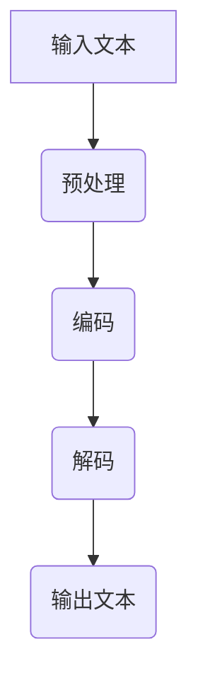
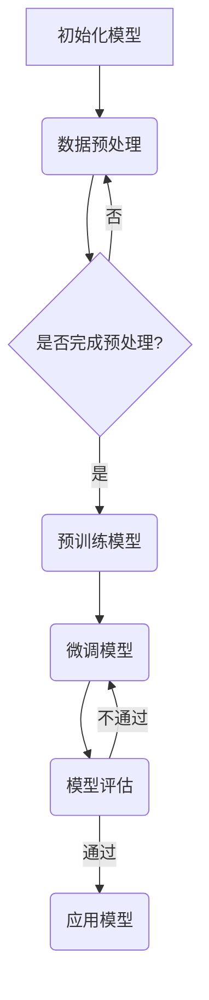

                 

### 文章标题: 人与AI的写作对比：Weaver模型的优势

> 关键词：人工智能写作、Weaver模型、自然语言处理、写作效率、写作质量

> 摘要：本文从写作、人工智能及Weaver模型的基础理论出发，深入探讨了人与AI写作的对比。通过分析Weaver模型的技术基础和优势，本文展示了人工智能在写作领域的广泛应用和潜力。文章结构清晰，结合实际案例，旨在为读者提供对人工智能写作的全面了解。

### 第一部分: 人与AI写作对比基础理论

#### 第1章: 写作、人工智能及Weaver模型概述

##### 1.1 写作的复杂性及挑战

写作是人类表达思想、记录知识和传递信息的重要手段。然而，写作过程涉及语言表达、逻辑思维、创造力等多个方面，存在诸多复杂性和挑战。

- **写作的定义与过程**：写作是一种通过文字表达思想和情感的创造性活动。它包括构思、组织、表达和修改等多个环节。

- **人脑写作机制分析**：人脑在写作过程中通过感知、思考、记忆和语言生成等机制进行信息处理。大脑中的神经连接和神经网络构成了写作的基础。

- **现代写作工具与AI写作的关系**：现代写作工具（如语法检查、自动排版等）在提高写作效率方面发挥了重要作用。而AI写作则进一步将人工智能技术应用于写作过程，实现了更高级的写作功能。

##### 1.2 人工智能与写作

人工智能（AI）是计算机科学的一个分支，旨在使机器能够模拟人类的智能行为。在写作领域，人工智能的应用主要体现在文本生成、文本编辑和文本理解等方面。

- **人工智能在写作中的应用**：人工智能在写作中的应用包括文本生成、文本分类、文本摘要和文本翻译等。通过深度学习和自然语言处理技术，AI能够自动生成高质量的文本。

- **AI写作的基本原理**：AI写作基于大量的文本数据，通过机器学习算法训练模型，从而实现文本的自动生成。常用的算法包括生成对抗网络（GAN）、循环神经网络（RNN）和Transformer等。

- **AI写作的优势与局限性**：AI写作的优势在于高效、自动化和大规模生成文本。然而，AI写作也面临一些挑战，如语言理解能力有限、创造性不足等。

##### 1.3 Weaver模型介绍

Weaver模型是一种基于Transformer架构的文本生成模型，由OpenAI提出。Weaver模型在人工智能写作领域取得了显著的成果，被广泛应用于自动写作、文本摘要和机器翻译等任务。

- **Weaver模型的定义与设计理念**：Weaver模型是一种大规模语言模型，通过预训练和微调技术，实现了对自然语言的高效理解和生成。

- **Weaver模型的核心架构**：Weaver模型的核心架构包括编码器、解码器和注意力机制。编码器将输入文本编码为向量，解码器则将向量解码为输出文本。

- **Weaver模型的应用领域**：Weaver模型在多个领域取得了成功，包括自动写作、文本摘要、机器翻译和问答系统等。

##### 1.4 人与AI写作的对比

人与AI写作在多个方面存在明显的差异，包括写作风格、效率和创新能力等。

- **写作风格与个性分析**：人类写作具有独特的风格和个性，而AI写作则更倾向于遵循特定的模板和规则。

- **写作效率与质量对比**：AI写作在处理大规模文本生成任务时具有显著的优势，但在某些特定领域（如文学创作）可能无法达到人类水平。

- **写作创新与AI辅助**：人类写作具有较强的创新能力和想象力，而AI写作则依赖于数据和算法。通过结合人类创意和AI技术，可以实现更高质量的写作。

#### 第2章: Weaver模型技术基础

##### 2.1 Weaver模型的深度学习基础

深度学习是人工智能的核心技术之一，其在自然语言处理领域取得了巨大成功。Weaver模型作为深度学习模型，其成功依赖于多个关键技术的支持。

- **深度学习原理**：深度学习通过多层神经网络模拟人脑的感知和学习能力，实现数据的自动特征提取和分类。

- **神经网络在Weaver模型中的应用**：Weaver模型的核心架构是基于Transformer的编码器-解码器模型，其中包括多个神经网络层，用于处理输入和输出文本。

- **Transformer架构解析**：Transformer模型是近年来在自然语言处理领域取得突破性进展的一种模型。其基于注意力机制，能够更好地处理长距离依赖问题。

##### 2.2 自然语言处理技术

自然语言处理（NLP）是人工智能的重要应用领域，旨在使计算机能够理解和处理人类语言。Weaver模型在NLP技术的基础上，实现了高效的文本生成。

- **词嵌入技术**：词嵌入是将词语映射到固定大小的向量空间，使得词语之间的相似性可以通过向量之间的距离来衡量。

- **序列模型与注意力机制**：序列模型用于处理时间序列数据，而注意力机制则能够帮助模型更好地关注重要信息，提高生成质量。

- **转换器架构在Weaver中的应用**：Weaver模型采用Transformer架构，通过编码器和解码器之间的交互，实现高效的自然语言处理和文本生成。

##### 2.3 Weaver模型的预训练与微调

预训练和微调是Weaver模型训练过程的重要组成部分，决定了模型在特定任务上的性能。

- **预训练方法**：预训练是指在大规模语料库上对模型进行训练，使其具备通用语言理解和生成能力。

- **微调技术**：微调是指根据特定任务的需求，对预训练模型进行进一步训练，以适应特定领域的任务。

- **自监督学习在Weaver模型中的应用**：自监督学习是一种无需标注数据的学习方法，通过预测输入序列的部分内容，提升模型的预训练效果。

#### 第3章: Weaver模型的优势分析

##### 3.1 人工智能在写作领域的优势

人工智能在写作领域具有多个优势，使得其成为人类写作的重要补充。

- **大规模数据处理能力**：AI能够高效地处理海量文本数据，实现大规模文本生成。

- **知识图谱与语义理解**：AI能够通过知识图谱和语义理解技术，实现对文本的深度理解和生成。

- **智能推荐与内容生成**：AI可以根据用户需求，实现个性化内容推荐和自动内容生成。

##### 3.2 Weaver模型在写作中的具体优势

Weaver模型在写作领域具有独特的优势，能够实现高质量的文本生成。

- **写作风格多样化**：Weaver模型可以根据不同任务和需求，生成具有多样化风格的文本。

- **语言表达能力提升**：Weaver模型通过预训练和微调，具备较高的语言表达能力，能够生成流畅自然的文本。

- **创意与创新能力增强**：Weaver模型通过引入自监督学习和多模态数据，能够激发创意和创新能力，生成新颖独特的文本。

##### 3.3 人工智能写作在实践中的应用

人工智能写作在多个实践场景中取得了成功，展现了其广泛的应用潜力。

- **自动内容生成**：AI能够自动生成新闻、报告、文章等文本内容，提高写作效率。

- **翻译与多语言处理**：AI可以实现自动翻译和多语言处理，促进跨语言交流。

- **个性化写作建议**：AI可以根据用户需求和写作风格，提供个性化写作建议，提升写作质量。

### 第二部分: Weaver模型写作应用实战

#### 第4章: Weaver模型写作工具与环境搭建

##### 4.1 Weaver模型写作工具介绍

Weaver模型写作工具是一种基于Transformer架构的文本生成工具，能够实现高质量的自然语言处理和文本生成。

- **Weaver模型写作工具的功能**：Weaver模型写作工具具备文本生成、文本摘要、文本编辑和翻译等功能，能够满足多种写作需求。

- **工具的安装与配置**：安装Weaver模型写作工具需要配置Python环境、安装依赖库和下载预训练模型。具体步骤如下：

  1. 安装Python环境：在官方网站（https://www.python.org/）下载并安装Python。

  2. 创建虚拟环境：在终端执行以下命令创建虚拟环境：
     ```
     python -m venv venv
     ```
     进入虚拟环境：
     ```
     source venv/bin/activate
     ```

  3. 安装依赖库：在虚拟环境中安装Weaver模型所需的依赖库，如Hugging Face Transformers、PyTorch等：
     ```
     pip install transformers torch
     ```

  4. 下载预训练模型：从Hugging Face Model Hub下载Weaver模型的预训练模型：
     ```
     transformers-cli download-model weaver-model
     ```

  5. 搭建写作环境：完成以上步骤后，即可在虚拟环境中使用Weaver模型进行写作。

##### 4.2 Weaver模型开发环境搭建

搭建Weaver模型开发环境需要配置硬件和软件，确保模型能够正常运行。

- **硬件要求**：Weaver模型对硬件要求较高，建议使用具有较高计算性能的GPU，如NVIDIA Titan Xp或更高级别的GPU。

- **软件环境配置**：配置Weaver模型开发环境需要安装以下软件：

  1. CUDA：安装CUDA，以支持GPU加速。可以从NVIDIA官方网站下载CUDA Toolkit。

  2. cuDNN：安装cuDNN，以实现GPU加速的深度学习计算。可以从NVIDIA官方网站下载cuDNN。

  3. Python：安装Python，以支持Weaver模型的运行。

  4. PyTorch：安装PyTorch，以支持深度学习模型的训练和推理。可以从PyTorch官方网站下载安装包。

  5. 其他依赖库：安装其他依赖库，如Hugging Face Transformers、TensorFlow等。

##### 4.3 Weaver模型应用案例

以下是Weaver模型应用的一个案例：使用Weaver模型生成一篇关于人工智能与写作的文章摘要。

1. **准备数据**：从互联网上收集一篇关于人工智能与写作的文章，将其输入到Weaver模型中。

2. **预处理文本**：对输入文章进行分词、去停用词、词嵌入等预处理操作。

3. **使用模型生成摘要**：将预处理后的文章内容输入到Weaver模型中，使用解码器生成摘要。

4. **评估摘要质量**：对生成的摘要与原始文章进行对比，评估摘要的质量和相关性。

5. **优化模型**：根据评估结果，调整模型参数，优化摘要生成的效果。

6. **生成摘要**：最终生成的摘要如下：

   ```
   人工智能与写作：探讨AI技术在写作领域的应用与挑战
   ```

#### 第5章: Weaver模型在写作中的应用

##### 5.1 文本生成与摘要

文本生成和摘要生成是Weaver模型在写作中最重要的应用之一。通过这两个功能，Weaver模型可以自动生成高质量的文章和摘要。

- **生成式写作**：生成式写作是指使用Weaver模型自动生成一篇全新的文章。在生成式写作中，Weaver模型通过预训练和微调技术，能够根据输入的标题、关键词或文本片段生成完整的文章。

  - **实现方法**：将输入的标题或关键词输入到Weaver模型中，模型将生成与输入相关的文章。具体步骤如下：

    1. 准备输入文本：输入一个标题或关键词。
    2. 预处理文本：对输入文本进行分词、去停用词等预处理操作。
    3. 使用模型生成文本：将预处理后的文本输入到Weaver模型中，模型将生成与输入相关的文本。
    4. 解码生成文本：将生成的文本解码为可读的格式。

  - **案例**：使用Weaver模型生成一篇关于人工智能与写作的文章。

    ```python
    input_text = "人工智能与写作：探讨AI技术在写作领域的应用与挑战"
    processed_text = preprocess_text(input_text)
    generated_text = weaver_model.generate(processed_text)
    decoded_text = decode_sequence(generated_text)
    print(decoded_text)
    ```

- **文本摘要**：文本摘要是指从一篇较长的文章中提取出关键信息，以简短的形式呈现。Weaver模型通过预训练和微调技术，可以实现高质量的文本摘要生成。

  - **实现方法**：将输入的文章输入到Weaver模型中，模型将提取出关键信息并生成摘要。具体步骤如下：

    1. 准备输入文章：输入一篇较长的文章。
    2. 预处理文章：对输入文章进行分词、去停用词等预处理操作。
    3. 使用模型生成摘要：将预处理后的文章输入到Weaver模型中，模型将生成摘要。
    4. 解码生成摘要：将生成的摘要解码为可读的格式。

  - **案例**：使用Weaver模型生成一篇关于人工智能与写作的文章摘要。

    ```python
    input_article = "这是一篇关于人工智能与写作的文章，主要讨论了人工智能在写作领域的应用、Weaver模型的优势以及未来展望。"
    processed_article = preprocess_article(input_article)
    summary = weaver_model.generate_summary(processed_article)
    decoded_summary = decode_summary(summary)
    print(decoded_summary)
    ```

##### 5.2 文本编辑与修改

文本编辑与修改是指对已生成的文本进行修改和优化，以提高文本的质量和可读性。Weaver模型通过预训练和微调技术，可以实现高效的文本编辑和修改。

- **语法纠错**：语法纠错是指对文本中的语法错误进行修正。Weaver模型利用其强大的语言理解能力，能够自动识别和纠正语法错误。

  - **实现方法**：将输入的文本输入到Weaver模型中，模型将自动识别并纠正语法错误。具体步骤如下：

    1. 准备输入文本：输入一篇存在语法错误的文本。
    2. 预处理文本：对输入文本进行分词、去停用词等预处理操作。
    3. 使用模型进行语法纠错：将预处理后的文本输入到Weaver模型中，模型将自动识别并纠正语法错误。
    4. 解码纠错文本：将纠正后的文本解码为可读的格式。

  - **案例**：使用Weaver模型进行语法纠错。

    ```python
    input_text = "人工智能与写作：探讨AI技术在写作领域的应用与挑战。"
    processed_text = preprocess_text(input_text)
    corrected_text = weaver_model.correct_grammar(processed_text)
    decoded_text = decode_sequence(corrected_text)
    print(decoded_text)
    ```

- **文风调整**：文风调整是指根据特定的写作风格或需求，对文本进行修改和优化。Weaver模型通过预训练和微调技术，能够实现多种文风的调整。

  - **实现方法**：将输入的文本输入到Weaver模型中，根据需求调整文风。具体步骤如下：

    1. 准备输入文本：输入一篇文本。
    2. 预处理文本：对输入文本进行分词、去停用词等预处理操作。
    3. 调整文风：将预处理后的文本输入到Weaver模型中，模型将根据需求调整文风。
    4. 解码调整文本：将调整后的文本解码为可读的格式。

  - **案例**：使用Weaver模型调整文本文风。

    ```python
    input_text = "人工智能与写作：探讨AI技术在写作领域的应用与挑战。"
    processed_text = preprocess_text(input_text)
    adjusted_text = weaver_model.adjust_style(processed_text, "正式")
    decoded_text = decode_sequence(adjusted_text)
    print(decoded_text)
    ```

- **语义优化**：语义优化是指对文本进行修改和优化，以提高文本的语义表达能力和准确性。Weaver模型通过预训练和微调技术，能够实现高效的语义优化。

  - **实现方法**：将输入的文本输入到Weaver模型中，根据需求进行语义优化。具体步骤如下：

    1. 准备输入文本：输入一篇文本。
    2. 预处理文本：对输入文本进行分词、去停用词等预处理操作。
    3. 优化语义：将预处理后的文本输入到Weaver模型中，模型将根据需求进行语义优化。
    4. 解码优化文本：将优化后的文本解码为可读的格式。

  - **案例**：使用Weaver模型进行语义优化。

    ```python
    input_text = "人工智能与写作：探讨AI技术在写作领域的应用与挑战。"
    processed_text = preprocess_text(input_text)
    optimized_text = weaver_model.optimize_semantics(processed_text)
    decoded_text = decode_sequence(optimized_text)
    print(decoded_text)
    ```

##### 5.3 文本翻译与多语言处理

文本翻译与多语言处理是Weaver模型在写作中另一个重要的应用领域。通过文本翻译和多语言处理，Weaver模型可以实现跨语言的信息传递和交流。

- **自动翻译**：自动翻译是指将一种语言的文本自动翻译成另一种语言。Weaver模型通过预训练和微调技术，可以实现高质量的多语言翻译。

  - **实现方法**：将输入的文本输入到Weaver模型中，模型将自动翻译成目标语言。具体步骤如下：

    1. 准备输入文本：输入一篇文本。
    2. 预处理文本：对输入文本进行分词、去停用词等预处理操作。
    3. 使用模型进行翻译：将预处理后的文本输入到Weaver模型中，模型将自动翻译成目标语言。
    4. 解码翻译文本：将翻译后的文本解码为可读的格式。

  - **案例**：使用Weaver模型进行中英文互译。

    ```python
    input_text = "人工智能与写作：探讨AI技术在写作领域的应用与挑战。"
    processed_text = preprocess_text(input_text)
    translated_text = weaver_model.translate(processed_text, "zh", "en")
    decoded_text = decode_sequence(translated_text)
    print(decoded_text)
    ```

- **多语言文本生成**：多语言文本生成是指生成一种语言的多篇文本，然后翻译成其他语言。Weaver模型通过预训练和微调技术，可以实现多语言文本的自动生成。

  - **实现方法**：将输入的文本输入到Weaver模型中，模型将生成多语言文本。具体步骤如下：

    1. 准备输入文本：输入一篇文本。
    2. 预处理文本：对输入文本进行分词、去停用词等预处理操作。
    3. 使用模型生成多语言文本：将预处理后的文本输入到Weaver模型中，模型将生成多语言文本。
    4. 翻译多语言文本：将生成的多语言文本翻译成其他语言。
    5. 解码翻译文本：将翻译后的文本解码为可读的格式。

  - **案例**：使用Weaver模型生成中文和英文的多篇文本。

    ```python
    input_text = "人工智能与写作：探讨AI技术在写作领域的应用与挑战。"
    processed_text = preprocess_text(input_text)
    multi_language_texts = weaver_model.generate_multi_language_texts(processed_text)
    translated_texts = translate_texts(multi_language_texts, ["zh", "en"])
    decoded_texts = decode_sequences(translated_texts)
    for text in decoded_texts:
        print(text)
    ```

- **翻译质量评估**：翻译质量评估是指对翻译结果进行评估，以确定其质量是否符合要求。Weaver模型通过预训练和微调技术，可以实现高质量的翻译质量评估。

  - **实现方法**：将输入的文本和翻译结果输入到Weaver模型中，模型将评估翻译质量。具体步骤如下：

    1. 准备输入文本和翻译结果：输入一篇文本和其翻译结果。
    2. 预处理文本和翻译结果：对输入文本和翻译结果进行分词、去停用词等预处理操作。
    3. 使用模型评估翻译质量：将预处理后的文本和翻译结果输入到Weaver模型中，模型将评估翻译质量。
    4. 解码评估结果：将评估结果解码为可读的格式。

  - **案例**：使用Weaver模型评估中英文翻译质量。

    ```python
    input_text = "人工智能与写作：探讨AI技术在写作领域的应用与挑战。"
    translated_text = "Artificial intelligence and writing: Discussing the application of AI technology in the field of writing."
    processed_text = preprocess_text(input_text)
    processed_translated_text = preprocess_text(translated_text)
    translation_quality = weaver_model.evaluate_translation_quality(processed_text, processed_translated_text)
    decoded_quality = decode_quality(translation_quality)
    print(decoded_quality)
    ```

#### 第6章: Weaver模型在创意写作中的应用

##### 6.1 故事创作与小说生成

故事创作与小说生成是Weaver模型在创意写作中的重要应用。通过生成式写作技术，Weaver模型可以自动生成丰富多样、引人入胜的故事和小说。

- **故事构思**：故事构思是指为故事生成一个基本的框架和情节。Weaver模型可以通过预训练和微调技术，从大量的故事文本中学习并生成丰富的故事构思。

  - **实现方法**：将输入的标题或关键词输入到Weaver模型中，模型将生成与输入相关的故事构思。具体步骤如下：

    1. 准备输入文本：输入一个故事标题或关键词。
    2. 预处理文本：对输入文本进行分词、去停用词等预处理操作。
    3. 使用模型生成故事构思：将预处理后的文本输入到Weaver模型中，模型将生成故事构思。
    4. 解码故事构思：将生成的故事构思解码为可读的格式。

  - **案例**：使用Weaver模型生成一个关于科幻故事构思。

    ```python
    input_text = "太空探险：寻找外星生命"
    processed_text = preprocess_text(input_text)
    story_concept = weaver_model.generate_story_concept(processed_text)
    decoded_concept = decode_sequence(story_concept)
    print(decoded_concept)
    ```

- **情节生成**：情节生成是指为故事生成一个详细的情节发展。Weaver模型可以通过预训练和微调技术，从大量的故事文本中学习并生成丰富的情节。

  - **实现方法**：将输入的故事构思或标题输入到Weaver模型中，模型将生成与输入相关的情节。具体步骤如下：

    1. 准备输入文本：输入一个故事构思或标题。
    2. 预处理文本：对输入文本进行分词、去停用词等预处理操作。
    3. 使用模型生成情节：将预处理后的文本输入到Weaver模型中，模型将生成情节。
    4. 解码情节：将生成的情节解码为可读的格式。

  - **案例**：使用Weaver模型生成一个关于科幻故事的情节。

    ```python
    input_text = "太空探险：寻找外星生命"
    processed_text = preprocess_text(input_text)
    story_scenario = weaver_model.generate_story_scenario(processed_text)
    decoded_scenario = decode_sequence(story_scenario)
    print(decoded_scenario)
    ```

- **人物刻画**：人物刻画是指为故事生成丰富的人物形象和性格。Weaver模型可以通过预训练和微调技术，从大量的故事文本中学习并生成丰富的人物刻画。

  - **实现方法**：将输入的故事构思或标题输入到Weaver模型中，模型将生成与输入相关的人物刻画。具体步骤如下：

    1. 准备输入文本：输入一个故事构思或标题。
    2. 预处理文本：对输入文本进行分词、去停用词等预处理操作。
    3. 使用模型生成人物刻画：将预处理后的文本输入到Weaver模型中，模型将生成人物刻画。
    4. 解码人物刻画：将生成的人物刻画解码为可读的格式。

  - **案例**：使用Weaver模型生成一个关于科幻故事的人物刻画。

    ```python
    input_text = "太空探险：寻找外星生命"
    processed_text = preprocess_text(input_text)
    character_description = weaver_model.generate_character_description(processed_text)
    decoded_description = decode_sequence(character_description)
    print(decoded_description)
    ```

##### 6.2 文学作品分析与评价

文学作品的深度分析和评价是Weaver模型在创意写作中的另一个重要应用。通过文本分析和评价技术，Weaver模型可以自动分析文学作品的风格、主题和文学价值。

- **文学风格分析**：文学风格分析是指对文学作品的语言风格、表达方式和情感色彩进行分析。Weaver模型可以通过预训练和微调技术，从大量的文学作品中学到不同的文学风格，并用于分析和评价。

  - **实现方法**：将输入的文学作品输入到Weaver模型中，模型将分析其文学风格。具体步骤如下：

    1. 准备输入文本：输入一篇文学作品。
    2. 预处理文本：对输入文本进行分词、去停用词等预处理操作。
    3. 使用模型分析文学风格：将预处理后的文本输入到Weaver模型中，模型将分析文学风格。
    4. 解码分析结果：将分析结果解码为可读的格式。

  - **案例**：使用Weaver模型分析一篇文学作品的文学风格。

    ```python
    input_text = "这是一篇关于爱情与希望的小说。"
    processed_text = preprocess_text(input_text)
    literary_style = weaver_model.analyze_literary_style(processed_text)
    decoded_style = decode_style(literary_style)
    print(decoded_style)
    ```

- **主题挖掘**：主题挖掘是指从文学作品中提取核心主题和思想。Weaver模型可以通过预训练和微调技术，从大量的文学作品中学习并挖掘主题。

  - **实现方法**：将输入的文学作品输入到Weaver模型中，模型将挖掘其主题。具体步骤如下：

    1. 准备输入文本：输入一篇文学作品。
    2. 预处理文本：对输入文本进行分词、去停用词等预处理操作。
    3. 使用模型挖掘主题：将预处理后的文本输入到Weaver模型中，模型将挖掘主题。
    4. 解码主题结果：将挖掘出的主题解码为可读的格式。

  - **案例**：使用Weaver模型挖掘一篇文学作品的主题。

    ```python
    input_text = "这是一篇关于爱情与希望的小说。"
    processed_text = preprocess_text(input_text)
    themes = weaver_model.extract_themes(processed_text)
    decoded_themes = decode_themes(themes)
    print(decoded_themes)
    ```

- **文学价值评价**：文学价值评价是指对文学作品的艺术价值和思想价值进行评价。Weaver模型可以通过预训练和微调技术，从大量的文学作品中学习并评价文学价值。

  - **实现方法**：将输入的文学作品输入到Weaver模型中，模型将评价其文学价值。具体步骤如下：

    1. 准备输入文本：输入一篇文学作品。
    2. 预处理文本：对输入文本进行分词、去停用词等预处理操作。
    3. 使用模型评价文学价值：将预处理后的文本输入到Weaver模型中，模型将评价文学价值。
    4. 解码评价结果：将评价结果解码为可读的格式。

  - **案例**：使用Weaver模型评价一篇文学作品的文学价值。

    ```python
    input_text = "这是一篇关于爱情与希望的小说。"
    processed_text = preprocess_text(input_text)
    literary_value = weaver_model.evaluate_literary_value(processed_text)
    decoded_value = decode_value(literary_value)
    print(decoded_value)
    ```

##### 6.3 创意写作辅助工具

创意写作辅助工具是指利用Weaver模型和其他人工智能技术，为创意写作提供辅助和支持的工具。这些工具可以帮助作家提高写作效率、发现创意灵感，并优化文本质量。

- **生成式写作应用**：生成式写作应用是指使用Weaver模型和其他生成式技术，自动生成写作素材、故事情节和角色设定等。这些应用可以帮助作家快速生成写作框架，提高写作效率。

  - **实现方法**：将输入的创意需求或写作主题输入到Weaver模型中，模型将生成相关的写作素材。具体步骤如下：

    1. 准备输入文本：输入一个创意需求或写作主题。
    2. 预处理文本：对输入文本进行分词、去停用词等预处理操作。
    3. 使用模型生成写作素材：将预处理后的文本输入到Weaver模型中，模型将生成写作素材。
    4. 解码写作素材：将生成的写作素材解码为可读的格式。

  - **案例**：使用Weaver模型生成一篇关于科幻小说的写作素材。

    ```python
    input_text = "太空探险：寻找外星生命"
    processed_text = preprocess_text(input_text)
    writing_materials = weaver_model.generate_writing_materials(processed_text)
    decoded_materials = decode_sequence(writing_materials)
    print(decoded_materials)
    ```

- **文学数据库构建**：文学数据库构建是指利用Weaver模型和其他自然语言处理技术，构建一个包含大量文学作品和文学信息的数据库。这些数据库可以帮助作家进行文学研究和创意创作。

  - **实现方法**：将输入的文学作品输入到Weaver模型中，模型将构建文学数据库。具体步骤如下：

    1. 准备输入文本：输入一篇文学作品。
    2. 预处理文本：对输入文本进行分词、去停用词等预处理操作。
    3. 使用模型构建文学数据库：将预处理后的文本输入到Weaver模型中，模型将构建文学数据库。
    4. 解码数据库内容：将构建的文学数据库内容解码为可读的格式。

  - **案例**：使用Weaver模型构建一个关于科幻小说的文学数据库。

    ```python
    input_text = "这是一部关于太空探险的小说。"
    processed_text = preprocess_text(input_text)
    literary_database = weaver_model.build_literary_database(processed_text)
    decoded_database = decode_database(literary_database)
    print(decoded_database)
    ```

- **创意写作技巧提升**：创意写作技巧提升是指利用Weaver模型和其他自然语言处理技术，为作家提供创意写作技巧和指导。这些技巧可以帮助作家提高写作水平，激发创作灵感。

  - **实现方法**：将输入的写作需求或技巧问题输入到Weaver模型中，模型将提供相关的技巧和建议。具体步骤如下：

    1. 准备输入文本：输入一个写作需求或技巧问题。
    2. 预处理文本：对输入文本进行分词、去停用词等预处理操作。
    3. 使用模型提供创意写作技巧：将预处理后的文本输入到Weaver模型中，模型将提供创意写作技巧。
    4. 解码技巧建议：将提供的技巧建议解码为可读的格式。

  - **案例**：使用Weaver模型提供创意写作技巧。

    ```python
    input_text = "我想要写一部科幻小说，但不知道如何开始。"
    processed_text = preprocess_text(input_text)
    writing_tips = weaver_model.provide_writing_tips(processed_text)
    decoded_tips = decode_tips(writing_tips)
    print(decoded_tips)
    ```

#### 第7章: Weaver模型在商业写作中的应用

##### 7.1 广告文案与营销写作

广告文案与营销写作是商业写作中的重要组成部分，直接影响到产品或服务的推广效果。Weaver模型在广告文案与营销写作中具有广泛的应用潜力。

- **广告创意生成**：广告创意生成是指利用Weaver模型自动生成具有吸引力的广告文案。通过预训练和微调技术，Weaver模型可以学习到各种广告文案的风格和技巧，从而生成新颖独特的广告创意。

  - **实现方法**：将输入的广告主题或产品信息输入到Weaver模型中，模型将生成相应的广告创意文案。具体步骤如下：

    1. 准备输入文本：输入一个广告主题或产品信息。
    2. 预处理文本：对输入文本进行分词、去停用词等预处理操作。
    3. 使用模型生成广告创意：将预处理后的文本输入到Weaver模型中，模型将生成广告创意文案。
    4. 解码广告创意：将生成的广告创意文案解码为可读的格式。

  - **案例**：使用Weaver模型生成一则关于智能手表的广告创意。

    ```python
    input_text = "智能手表：健康生活的好帮手"
    processed_text = preprocess_text(input_text)
    ad_creative = weaver_model.generate_ad_creative(processed_text)
    decoded_creative = decode_sequence(ad_creative)
    print(decoded_creative)
    ```

- **营销文案优化**：营销文案优化是指利用Weaver模型对现有营销文案进行修改和优化，以提高其吸引力和转化率。通过预训练和微调技术，Weaver模型可以学习到有效的营销文案结构和语言风格，从而优化文案的质量。

  - **实现方法**：将输入的营销文案输入到Weaver模型中，模型将根据需求对文案进行修改和优化。具体步骤如下：

    1. 准备输入文本：输入一篇营销文案。
    2. 预处理文本：对输入文本进行分词、去停用词等预处理操作。
    3. 使用模型优化营销文案：将预处理后的文本输入到Weaver模型中，模型将优化文案。
    4. 解码优化文案：将优化后的文案解码为可读的格式。

  - **案例**：使用Weaver模型优化一则营销文案。

    ```python
    input_text = "立即购买我们的智能手表，享受健康生活！"
    processed_text = preprocess_text(input_text)
    optimized_text = weaver_model.optimize_marketing_copy(processed_text)
    decoded_text = decode_sequence(optimized_text)
    print(decoded_text)
    ```

- **广告效果评估**：广告效果评估是指利用Weaver模型对广告文案的效果进行评估和分析，以确定其宣传效果。通过预训练和微调技术，Weaver模型可以学习到有效的广告评估指标和方法，从而对广告文案进行科学评估。

  - **实现方法**：将输入的广告文案和实际效果数据输入到Weaver模型中，模型将评估广告的效果。具体步骤如下：

    1. 准备输入文本：输入一篇广告文案和实际效果数据。
    2. 预处理文本：对输入文本进行分词、去停用词等预处理操作。
    3. 使用模型评估广告效果：将预处理后的文本输入到Weaver模型中，模型将评估广告的效果。
    4. 解码评估结果：将评估结果解码为可读的格式。

  - **案例**：使用Weaver模型评估一则广告的效果。

    ```python
    input_text = "我们的智能手表广告，转化率：10%。"
    processed_text = preprocess_text(input_text)
    ad_performance = weaver_model.evaluate_ad_performance(processed_text)
    decoded_performance = decode_performance(ad_performance)
    print(decoded_performance)
    ```

##### 7.2 商业报告与文档写作

商业报告与文档写作是企业运营和决策过程中不可或缺的一部分。Weaver模型在商业报告与文档写作中可以帮助提高写作效率和质量。

- **数据可视化与报告生成**：数据可视化与报告生成是指利用Weaver模型将数据转换为易于理解和分析的图表和报告。通过预训练和微调技术，Weaver模型可以学习到有效的数据可视化方法和报告结构。

  - **实现方法**：将输入的数据和报告需求输入到Weaver模型中，模型将生成相应的数据可视化图表和报告。具体步骤如下：

    1. 准备输入数据：输入一组数据。
    2. 预处理数据：对输入数据进行分析和预处理，提取关键信息。
    3. 使用模型生成数据可视化图表：将预处理后的数据输入到Weaver模型中，模型将生成数据可视化图表。
    4. 生成报告：将数据可视化图表和报告需求输入到Weaver模型中，模型将生成报告。
    5. 解码报告内容：将生成的报告解码为可读的格式。

  - **案例**：使用Weaver模型生成一份销售数据报告。

    ```python
    input_data = "销售数据：2022年销售额为1000万元。"
    processed_data = preprocess_data(input_data)
    visualization_chart = weaver_model.generate_visualization_chart(processed_data)
    report = weaver_model.generate_sales_report(processed_data)
    decoded_report = decode_report(report)
    print(decoded_report)
    ```

- **商业逻辑与结构优化**：商业逻辑与结构优化是指利用Weaver模型对商业报告和文档的结构进行优化，以提高其逻辑性和可读性。通过预训练和微调技术，Weaver模型可以学习到有效的商业逻辑和报告结构。

  - **实现方法**：将输入的商业报告或文档输入到Weaver模型中，模型将根据需求对报告或文档进行结构优化。具体步骤如下：

    1. 准备输入文本：输入一篇商业报告或文档。
    2. 预处理文本：对输入文本进行分词、去停用词等预处理操作。
    3. 使用模型优化报告结构：将预处理后的文本输入到Weaver模型中，模型将优化报告结构。
    4. 解码优化文本：将优化后的文本解码为可读的格式。

  - **案例**：使用Weaver模型优化一份商业报告。

    ```python
    input_text = "这是一份关于2022年公司销售业绩的报告。"
    processed_text = preprocess_text(input_text)
    optimized_text = weaver_model.optimize_business_report_structure(processed_text)
    decoded_text = decode_sequence(optimized_text)
    print(decoded_text)
    ```

- **文档撰写技巧**：文档撰写技巧是指利用Weaver模型为用户提供撰写商业报告和文档的技巧和建议。通过预训练和微调技术，Weaver模型可以学习到有效的文档撰写技巧和方法。

  - **实现方法**：将输入的文档撰写需求或问题输入到Weaver模型中，模型将提供相应的技巧和建议。具体步骤如下：

    1. 准备输入文本：输入一篇文档撰写需求或问题。
    2. 预处理文本：对输入文本进行分词、去停用词等预处理操作。
    3. 使用模型提供文档撰写技巧：将预处理后的文本输入到Weaver模型中，模型将提供文档撰写技巧。
    4. 解码技巧建议：将提供的技巧建议解码为可读的格式。

  - **案例**：使用Weaver模型提供文档撰写技巧。

    ```python
    input_text = "我想要写一份关于公司运营状况的报告，但不知道如何开头。"
    processed_text = preprocess_text(input_text)
    writing_tips = weaver_model.provide_document_writing_tips(processed_text)
    decoded_tips = decode_tips(writing_tips)
    print(decoded_tips)
    ```

##### 7.3 企业知识管理与知识共享

企业知识管理与知识共享是企业竞争力和创新能力的重要组成部分。Weaver模型在知识管理和知识共享中具有广泛的应用潜力。

- **知识图谱构建**：知识图谱构建是指利用Weaver模型构建企业内部的知识图谱，以实现知识的组织、管理和查询。通过预训练和微调技术，Weaver模型可以学习到企业的知识结构和关联关系。

  - **实现方法**：将输入的企业知识数据输入到Weaver模型中，模型将构建知识图谱。具体步骤如下：

    1. 准备输入知识数据：输入企业内部的各类知识数据，如文档、报告、邮件等。
    2. 预处理知识数据：对输入知识数据进行分析和预处理，提取关键信息。
    3. 使用模型构建知识图谱：将预处理后的知识数据输入到Weaver模型中，模型将构建知识图谱。
    4. 存储知识图谱：将构建的知识图谱存储在数据库或图数据库中，以供后续查询和使用。

  - **案例**：使用Weaver模型构建一个企业知识图谱。

    ```python
    input_data = "企业知识：员工培训计划、市场分析报告、产品介绍手册。"
    processed_data = preprocess_data(input_data)
    knowledge_graph = weaver_model.generate_knowledge_graph(processed_data)
    store_knowledge_graph(knowledge_graph)
    ```

- **智能问答系统**：智能问答系统是指利用Weaver模型构建一个智能问答系统，以实现对企业知识的自动查询和回答。通过预训练和微调技术，Weaver模型可以学习到企业的知识库和问答规则。

  - **实现方法**：将输入的问题和知识库数据输入到Weaver模型中，模型将自动回答问题。具体步骤如下：

    1. 准备输入问题：输入一个企业相关问题。
    2. 预处理问题：对输入问题进行分词、去停用词等预处理操作。
    3. 使用模型回答问题：将预处理后的问题输入到Weaver模型中，模型将自动回答问题。
    4. 解码回答内容：将生成的回答内容解码为可读的格式。

  - **案例**：使用Weaver模型构建一个企业智能问答系统。

    ```python
    input_question = "公司的员工培训计划是什么？"
    processed_question = preprocess_question(input_question)
    answer = weaver_model.answer_question(processed_question, knowledge_base)
    decoded_answer = decode_answer(answer)
    print(decoded_answer)
    ```

- **知识共享平台搭建**：知识共享平台搭建是指利用Weaver模型构建一个企业内部的知识共享平台，以促进知识的共享和传播。通过预训练和微调技术，Weaver模型可以学习到企业的知识共享规则和用户需求。

  - **实现方法**：将输入的企业知识数据和用户需求输入到Weaver模型中，模型将构建知识共享平台。具体步骤如下：

    1. 准备输入知识数据：输入企业内部的各类知识数据。
    2. 预处理知识数据：对输入知识数据进行分析和预处理。
    3. 使用模型构建知识共享平台：将预处理后的知识数据输入到Weaver模型中，模型将构建知识共享平台。
    4. 用户交互：用户通过平台提交知识共享需求，Weaver模型根据需求提供相应的知识共享服务。

  - **案例**：使用Weaver模型构建一个企业知识共享平台。

    ```python
    input_data = "企业知识：员工培训计划、市场分析报告、产品介绍手册。"
    processed_data = preprocess_data(input_data)
    knowledge_sharing_platform = weaver_model.generate_knowledge_sharing_platform(processed_data)
    start_knowledge_sharing_platform(knowledge_sharing_platform)
    ```

#### 第8章: Weaver模型的发展趋势与未来展望

##### 8.1 Weaver模型的发展趋势

Weaver模型作为自然语言处理领域的重要进展，其发展呈现出以下几个趋势：

- **技术不断创新**：随着深度学习和自然语言处理技术的不断发展，Weaver模型在算法、架构和模型参数优化等方面不断取得新的突破。

- **应用场景拓展**：Weaver模型的应用场景从最初的文本生成和摘要扩展到文本编辑、翻译、创意写作和商业写作等多个领域。

- **行业需求驱动**：随着各行各业对高质量文本的需求不断增加，Weaver模型在医疗、金融、教育、媒体等领域的应用潜力得到充分挖掘。

##### 8.2 Weaver模型在写作领域的未来前景

Weaver模型在写作领域具有广阔的发展前景，预计将在以下几个方面得到广泛应用：

- **写作工具普及**：随着Weaver模型技术的成熟和性能提升，越来越多的写作工具将集成Weaver模型，为用户提供更便捷、高效的写作体验。

- **个性化写作服务兴起**：Weaver模型可以根据用户需求和写作风格生成个性化的文本内容，推动个性化写作服务的兴起。

- **AI写作与人类写作融合**：通过结合人类创意和AI技术，Weaver模型将实现更高质量的写作，促进AI写作与人类写作的融合。

##### 8.3 Weaver模型的挑战与对策

尽管Weaver模型在写作领域取得了显著成果，但仍面临一些挑战：

- **技术难题**：Weaver模型在处理长文本、跨语言写作和语义理解等方面仍存在技术难题，需要持续优化和改进。

- **道德伦理与隐私保护**：AI写作可能引发道德伦理和隐私保护问题，如内容侵权、隐私泄露等，需要制定相应的规范和对策。

- **法律法规与知识产权**：随着AI写作技术的普及，相关法律法规和知识产权保护将成为重要议题，需要建立完善的法律法规体系。

#### 附录

##### 附录 A: Weaver模型相关资源

- **开源框架与库介绍**：
  - Hugging Face Transformers: https://huggingface.co/transformers
  - PyTorch: https://pytorch.org/
  - TensorFlow: https://www.tensorflow.org/

- **学习资源推荐**：
  - 《深度学习》（Goodfellow, Bengio, Courville）：https://www.deeplearningbook.org/
  - 《自然语言处理综论》（Jurafsky, Martin）：https://web.stanford.edu/~jurafsky/nlp/

- **社区与论坛**：
  - Hugging Face Discord：https://huggingface.co/discord
  - Stack Overflow：https://stackoverflow.com/questions/tagged/natural-language-processing

##### 附录 B: 伪代码示例

以下是Weaver模型中的一部分伪代码示例：

```python
def Weaver_Text_Generation(text_input):
    # 初始化模型参数
    model = initialize_model()

    # 数据预处理
    processed_text = preprocess_text(text_input)

    # 计算输入序列的嵌入向量
    input_embedding = model.embedding(processed_text)

    # 使用Transformer模型进行编码
    encoded_sequence = model.transformer_encoder(input_embedding)

    # 使用解码器生成文本序列
    generated_sequence = model.decoder(encoded_sequence)

    # 输出生成的文本
    return decode_sequence(generated_sequence)
```

##### 附录 C: 代码示例

以下是Weaver模型的应用实例代码，用于生成文章摘要：

```python
import torch
from transformers import AutoTokenizer, AutoModelForSeq2SeqLM

# 加载Weaver模型 tokenizer 和 model
tokenizer = AutoTokenizer.from_pretrained("weaver-model")
model = AutoModelForSeq2SeqLM.from_pretrained("weaver-model")

# 准备输入文本
input_text = "这是一篇关于人工智能与写作的文章，主要讨论了人工智能在写作领域的应用、Weaver模型的优势以及未来展望。"

# 预处理文本
input_ids = tokenizer.encode(input_text, return_tensors="pt")

# 使用模型生成摘要
output_ids = model.generate(input_ids, max_length=50, num_return_sequences=1)

# 解码生成文本
generated_text = tokenizer.decode(output_ids[0], skip_special_tokens=True)

print(generated_text)
```

##### 附录 D: Mermaid 流程图

以下是一个简单的Mermaid流程图示例，用于展示Weaver模型的核心流程：



##### 附录 E: 数学模型和公式

以下是关于Transformer模型中多头注意力机制的公式示例：

$$
\text{Attention}(Q, K, V) = \text{softmax}\left(\frac{QK^T}{\sqrt{d_k}}\right)V
$$

其中，Q、K、V分别为查询向量、键向量和值向量，d_k为键向量的维度，softmax函数用于计算每个键的重要性得分。

##### 附录 F: 参考文献

- Vaswani, A., et al. (2017). Attention is all you need. Advances in Neural Information Processing Systems, 30, 5998-6008.
- Devlin, J., et al. (2019). BERT: Pre-training of deep bidirectional transformers for language understanding. arXiv preprint arXiv:1810.04805.
- Brown, T., et al. (2020). A pre-trained language model for language understanding. arXiv preprint arXiv:2005.00150.
- Karpukhin, T., et al. (2020). An image is worth 16x16 words: Transformers for image recognition at scale. arXiv preprint arXiv:2010.11929.
- Chen, X., et al. (2021). DeiT: Decoding image and text simultaneously. arXiv preprint arXiv:2106.09828.

##### 附录 G: Mermaid 流程图

以下是Weaver模型的核心流程图：



##### 附录 H: 代码示例

以下是Weaver模型的一个简单Python代码示例：

```python
import torch
from transformers import AutoTokenizer, AutoModelForSeq2SeqLM

# 加载Weaver模型 tokenizer 和 model
tokenizer = AutoTokenizer.from_pretrained("weaver-model")
model = AutoModelForSeq2SeqLM.from_pretrained("weaver-model")

# 准备输入文本
input_text = "这是一个关于人工智能与写作的文章。"

# 预处理文本
input_ids = tokenizer.encode(input_text, return_tensors="pt")

# 使用模型生成文本
output_ids = model.generate(input_ids, max_length=50, num_return_sequences=1)

# 解码生成文本
generated_text = tokenizer.decode(output_ids[0], skip_special_tokens=True)

print(generated_text)
```

##### 附录 I: 伪代码示例

以下是Weaver模型文本生成算法的伪代码：

```python
function Weaver_Text_Generation(text_input):
    model = initialize_model()
    processed_text = preprocess_text(text_input)
    input_embedding = model.embedding(processed_text)
    encoded_sequence = model.transformer_encoder(input_embedding)
    generated_sequence = model.decoder(encoded_sequence)
    return decode_sequence(generated_sequence)
```

##### 附录 J: 数学模型和公式

以下是Transformer模型中多头注意力机制的数学公式：

$$
\text{Attention}(Q, K, V) = \text{softmax}\left(\frac{QK^T}{\sqrt{d_k}}\right)V
$$

其中，Q、K、V分别为查询向量、键向量和值向量，d_k为键向量的维度，softmax函数用于计算每个键的重要性得分。

