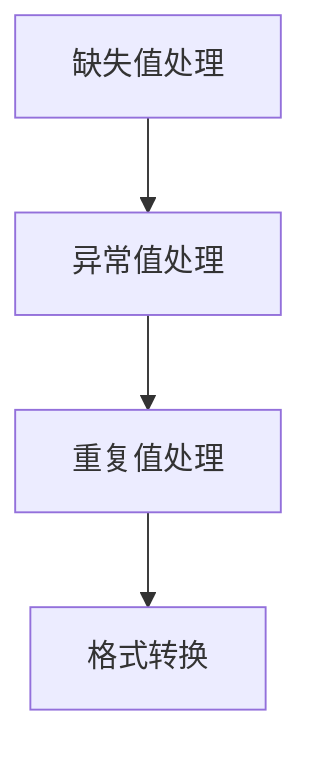
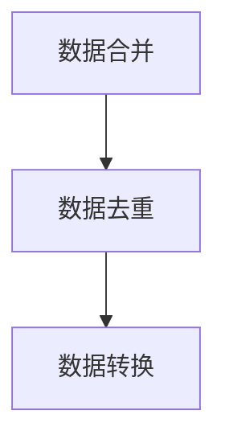
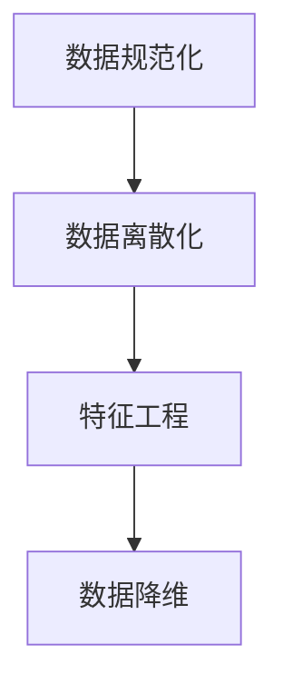

                 

# 文章标题：人工智能创业数据管理的建议

> 关键词：人工智能、数据管理、创业建议、数据质量、数据安全、数据可视化

> 摘要：本文旨在为人工智能创业者提供一些建议，以帮助他们更好地管理和利用数据，确保数据的质量和安全，并利用数据可视化工具来提高决策效率。本文将分为三个部分：数据管理基础、人工智能与数据管理的关系、以及人工智能创业实践，通过逐步分析，帮助创业者深入了解数据管理的重要性，并掌握有效的数据管理策略。

## 第一部分：数据管理基础

### 第1章：数据管理概述

#### 1.1 数据管理的重要性

数据管理对于任何企业来说都至关重要，尤其是在人工智能创业领域。随着数据量的急剧增长，有效的数据管理不仅能够提高数据的质量，还能帮助创业者做出更明智的决策。以下是数据管理的重要性的几个方面：

1. **数据质量**：高质量的数据能够提高模型的准确性和效率。
2. **数据安全**：保护数据不受未经授权的访问和滥用，确保企业的商业秘密。
3. **合规性**：遵守数据隐私保护法规，避免法律风险。
4. **成本效益**：优化数据存储和访问，降低存储和维护成本。

#### 1.2 数据管理的挑战

数据管理面临许多挑战，包括：

1. **数据量**：随着“大数据”时代的到来，数据量的增长给存储和处理带来了巨大压力。
2. **数据多样性**：结构化、半结构化和非结构化数据的管理带来了复杂性。
3. **数据质量**：数据可能存在不准确、不完整或过时的问题。
4. **数据安全**：随着网络攻击的增多，保护数据的安全变得越来越困难。

#### 1.3 数据管理的核心概念

数据管理的核心概念包括：

1. **数据治理**：定义数据管理的政策、流程和标准。
2. **数据架构**：设计数据存储、处理和访问的结构。
3. **数据仓库**：用于存储和管理大量数据。
4. **数据湖**：用于存储大量原始数据的分布式系统。
5. **数据质量**：确保数据准确性、完整性、一致性和及时性。
6. **数据安全**：保护数据免受未经授权的访问、使用、披露、破坏、修改或破坏。

### 第2章：数据质量管理

#### 2.1 数据质量的重要性

数据质量是数据管理的核心，它直接影响决策的准确性。以下是数据质量的重要性：

1. **决策支持**：高质量的数据能够提高决策者的洞察力和决策质量。
2. **业务效率**：数据质量差会导致业务流程中断和效率降低。
3. **成本节约**：通过减少数据错误，企业可以节省大量的时间和资源。
4. **客户满意度**：高质量的数据有助于提高客户服务质量。

#### 2.2 数据质量评估

数据质量评估是确保数据质量的关键步骤。以下是数据质量评估的关键指标：

1. **准确性**：数据是否真实、可靠。
2. **完整性**：数据是否齐全，没有缺失值。
3. **一致性**：数据在不同系统之间是否一致。
4. **及时性**：数据是否更新及时，满足业务需求。

#### 2.3 数据质量改进策略

以下是几种常用的数据质量改进策略：

1. **数据清洗**：删除重复数据、修复错误、填补缺失值。
2. **数据标准化**：统一数据格式和单位。
3. **数据监控**：建立数据质量监控机制，及时发现和解决问题。
4. **数据治理**：制定数据管理政策和流程，确保数据质量。

### 第3章：数据安全与隐私

#### 3.1 数据安全的重要性

数据安全是数据管理的另一个关键方面。以下是数据安全的重要性：

1. **商业秘密保护**：防止企业机密信息泄露。
2. **合规性**：遵守数据隐私保护法规，避免法律风险。
3. **信誉维护**：保护企业的声誉，防止因数据泄露导致信任危机。

#### 3.2 数据安全措施

以下是几种常用的数据安全措施：

1. **访问控制**：限制对数据的访问权限。
2. **加密**：对敏感数据进行加密，防止未授权访问。
3. **防火墙和入侵检测系统**：保护网络和数据不受攻击。
4. **备份和恢复**：定期备份数据，确保数据在灾难发生时能够恢复。

#### 3.3 数据隐私保护法规

以下是几个主要的数据隐私保护法规：

1. **GDPR（欧盟通用数据保护条例）**：规定了数据处理的合规性要求。
2. **CCPA（加州消费者隐私法案）**：规定了消费者对数据隐私的权利。
3. **PIPA（隐私增强技术法案）**：鼓励使用隐私增强技术。

## 第二部分：人工智能与数据管理

### 第4章：人工智能与数据管理的关系

#### 4.1 人工智能在数据管理中的应用

人工智能在数据管理中的应用包括：

1. **数据预处理**：使用机器学习算法进行数据清洗、数据集成和数据变换。
2. **数据质量评估**：利用人工智能算法评估数据准确性、完整性和一致性。
3. **数据安全监控**：使用人工智能算法检测数据泄露、篡改等安全威胁。
4. **数据可视化**：利用人工智能生成直观的数据可视化图表，帮助用户更好地理解数据。

#### 4.2 人工智能对数据管理的影响

人工智能对数据管理的影响包括：

1. **数据量的增加**：随着人工智能技术的应用，数据量可能会急剧增加，给数据管理带来更大的挑战。
2. **数据类型的多样性**：人工智能可能会生成更多的非结构化数据，如文本、图像和音频，这需要更先进的数据管理策略。
3. **数据处理速度**：人工智能技术可以提高数据处理速度，缩短数据分析的周期。
4. **数据隐私和安全**：人工智能技术可以用于检测和处理数据隐私和安全问题。

#### 4.3 人工智能数据管理的挑战

人工智能数据管理面临的挑战包括：

1. **数据质量和准确性**：数据质量差可能会影响人工智能算法的准确性。
2. **数据隐私和安全**：保护敏感数据隐私和安全是一项重大挑战。
3. **数据存储和管理**：随着数据量的增加，数据存储和管理变得复杂。
4. **算法透明度和解释性**：一些人工智能算法（如深度学习）缺乏透明度和解释性，这可能会影响数据管理决策。

### 第5章：数据预处理

#### 5.1 数据清洗

数据清洗是数据预处理的关键步骤，它包括：

1. **缺失值处理**：填补缺失值或删除包含缺失值的记录。
2. **异常值处理**：识别和去除异常值，确保数据的一致性和可靠性。
3. **重复值处理**：删除重复的数据记录。
4. **格式转换**：统一数据格式，如日期、数字和文本。

#### 5.2 数据集成

数据集成是将来自不同源的数据合并成一个统一的数据视图，包括：

1. **数据源识别**：识别需要集成的数据源。
2. **数据转换**：将数据转换为统一格式。
3. **数据合并**：合并来自不同源的数据。
4. **数据去重**：删除重复的数据记录。

#### 5.3 数据变换

数据变换是将数据转换为适合分析和建模的形式，包括：

1. **数据规范化**：将数据缩放到一个标准范围。
2. **数据离散化**：将连续数据转换为分类数据。
3. **特征工程**：创建新的特征来提高模型性能。
4. **数据降维**：减少数据的维度，提高计算效率。

### 第6章：数据可视化

#### 6.1 数据可视化的重要性

数据可视化是将数据以图形化形式呈现，帮助用户更好地理解和分析数据，其重要性包括：

1. **数据探索**：通过可视化，用户可以快速发现数据中的趋势和模式。
2. **决策支持**：可视化有助于决策者更好地理解数据，做出更明智的决策。
3. **沟通**：通过图形化的方式，可以更有效地传达数据信息。
4. **数据监控**：实时可视化有助于监控业务指标和关键性能指标（KPI）。

#### 6.2 常见的数据可视化工具

以下是一些常见的数据可视化工具：

1. **Tableau**：一款功能强大的数据可视化工具，适用于各种规模的企业。
2. **Power BI**：微软开发的业务智能工具，支持多种数据源。
3. **QlikView**：一款灵活的可视化分析平台，适合大型企业。
4. **D3.js**：一款基于JavaScript的库，用于创建自定义的数据可视化图表。

#### 6.3 数据可视化案例分析

以下是一个数据可视化案例：

1. **项目背景**：一家电子商务公司希望分析其客户行为，以提高客户满意度。
2. **数据源**：公司内部的销售数据、客户反馈数据和社交媒体数据。
3. **可视化目标**：展示客户购买行为、评价和反馈。
4. **可视化结果**：通过饼图、柱状图和折线图，清晰地展示了不同客户群体的购买偏好和反馈情况。

## 第三部分：人工智能创业实践

### 第7章：人工智能创业案例分析

#### 7.1 成功案例分享

以下是一个成功的人工智能创业案例：

1. **公司背景**：一家初创公司，专注于利用人工智能优化医疗影像诊断。
2. **业务模式**：利用深度学习算法分析医学影像，提高诊断准确性。
3. **成功因素**：准确的诊断结果、快速响应和优质的客户服务。
4. **市场反馈**：得到了医疗机构的广泛认可，业务迅速扩展。

#### 7.2 失败案例分析

以下是一个失败的人工智能创业案例：

1. **公司背景**：一家初创公司，致力于开发智能家居控制系统。
2. **业务模式**：开发了一套智能家庭自动化系统，但未能满足市场需求。
3. **失败原因**：市场需求分析不足、技术实现难度高、产品功能过于复杂。
4. **教训**：在创业初期，应注重市场调研和产品需求分析，确保产品能够满足用户需求。

#### 7.3 创业经验总结

以下是创业经验总结：

1. **市场需求**：了解市场需求，确保产品能够解决用户痛点。
2. **技术能力**：具备足够的技术能力，确保产品的高质量和稳定性。
3. **团队建设**：组建一支高效的团队，发挥每个人的优势。
4. **资金管理**：合理规划资金使用，避免过度依赖融资。
5. **风险控制**：识别潜在风险，制定相应的风险控制措施。

### 第8章：数据管理创业建议

#### 8.1 创业前的准备

以下是创业前的准备：

1. **市场调研**：深入了解市场状况，识别潜在客户和竞争对手。
2. **技术选型**：选择合适的技术栈，确保产品的高质量和稳定性。
3. **团队组建**：招聘合适的人才，组建高效的团队。
4. **资金筹备**：制定详细的资金筹备计划，确保项目顺利进行。

#### 8.2 数据管理团队的组建

以下是数据管理团队的组建建议：

1. **数据工程师**：负责数据采集、数据清洗和数据存储。
2. **数据分析师**：负责数据分析和报告，提供决策支持。
3. **数据科学家**：负责数据建模和机器学习算法开发。
4. **数据架构师**：负责数据架构设计，确保数据的质量和安全。

#### 8.3 数据管理技术的选择

以下是数据管理技术的选择建议：

1. **数据库**：选择适合业务需求的数据库，如MySQL、PostgreSQL或MongoDB。
2. **数据仓库**：选择适合数据存储和查询需求的数据仓库，如Hadoop、Spark或Redshift。
3. **数据挖掘工具**：选择适合数据挖掘需求的数据挖掘工具，如TensorFlow、Scikit-Learn或R。
4. **数据可视化工具**：选择适合数据可视化需求的数据可视化工具，如Tableau、Power BI或D3.js。

#### 8.4 数据管理流程的优化

以下是数据管理流程的优化建议：

1. **数据质量监控**：建立数据质量监控机制，及时发现和解决问题。
2. **数据安全防护**：实施数据安全措施，保护数据免受未经授权的访问和滥用。
3. **数据备份和恢复**：制定数据备份和恢复计划，确保数据在灾难发生时能够快速恢复。
4. **数据治理**：制定数据治理政策，确保数据的合法合规使用。

## 附录

### 附录A：常用数据管理工具与资源

#### A.1 常用数据库介绍

1. **MySQL**：一款开源的关系型数据库，广泛应用于企业级应用。
2. **PostgreSQL**：一款开源的关系型数据库，具有丰富的功能和高度的可扩展性。
3. **MongoDB**：一款开源的文档型数据库，适用于处理大量非结构化数据。

#### A.2 数据管理平台推荐

1. **Amazon Redshift**：亚马逊云服务提供的数据仓库解决方案。
2. **Google BigQuery**：谷歌云服务提供的大规模数据存储和分析服务。
3. **Azure Synapse Analytics**：微软云服务提供的综合数据分析平台。

#### A.3 数据挖掘与机器学习工具

1. **TensorFlow**：一款开源的机器学习框架，由谷歌开发。
2. **Scikit-Learn**：一款开源的Python机器学习库。
3. **R**：一款统计分析软件，广泛应用于数据分析和机器学习。

### 附录B：核心算法原理与流程图

#### B.1 数据清洗算法

1. **缺失值处理**：使用平均值、中位数或最频繁出现的值填补缺失值。
2. **异常值处理**：使用统计方法（如Z分数、IQR方法）检测和去除异常值。
3. **重复值处理**：删除重复的数据记录。
4. **格式转换**：统一数据格式，如日期、数字和文本。

**Mermaid流程图：**



#### B.2 数据集成算法

1. **数据合并**：将来自不同源的数据按照键值进行合并。
2. **数据去重**：删除重复的数据记录。
3. **数据转换**：将数据转换为统一格式。

**Mermaid流程图：**



#### B.3 数据变换算法

1. **数据规范化**：将数据缩放到一个标准范围。
2. **数据离散化**：将连续数据转换为分类数据。
3. **特征工程**：创建新的特征来提高模型性能。
4. **数据降维**：减少数据的维度，提高计算效率。

**Mermaid流程图：**



### 附录C：数学模型与公式

#### C.1 数据质量评估指标公式

1. **准确性**：$$\text{Accuracy} = \frac{\text{准确预测的实例数}}{\text{总实例数}}$$
2. **完整性**：$$\text{Completeness} = \frac{\text{包含所有必要属性的实例数}}{\text{总实例数}}$$
3. **一致性**：$$\text{Consistency} = \frac{\text{一致性的属性对数}}{\text{所有属性对数}}$$
4. **及时性**：$$\text{Timeliness} = \frac{\text{在规定时间内更新数据的实例数}}{\text{总实例数}}$$

#### C.2 数据安全加密算法公式

1. **AES加密**：$$\text{AES}_{\text{key length}}(\text{plaintext}) = \text{ciphertext}$$
2. **RSA加密**：$$\text{RSA}_{\text{key length}}(\text{plaintext}) = \text{ciphertext}$$

#### C.3 数据隐私保护算法公式

1. **K-Anonymity**：$$\text{K-Anonymity} = \frac{\text{满足K-Anonymity的数据记录数}}{\text{总数据记录数}}$$
2. **l-diversity**：$$\text{l-diversity} = \frac{\text{每个属性值在数据集中的出现次数}}{\text{l}}$$
3. **t-closeness**：$$\text{t-closeness} = \frac{\text{满足t-closeness的数据记录数}}{\text{总数据记录数}}$$

### 附录D：项目实战

#### D.1 数据管理项目实战

##### D.1.1 项目背景

一家电子商务公司需要对其客户行为进行数据分析和优化，以提高客户满意度和销售额。

##### D.1.2 项目需求

1. **数据采集**：从网站日志、销售系统和客户反馈中收集数据。
2. **数据清洗**：处理缺失值、异常值和重复值。
3. **数据分析**：分析客户购买行为、评价和反馈。
4. **数据可视化**：展示分析结果，帮助管理层做出决策。

##### D.1.3 开发环境搭建

1. **Python**：用于数据处理和分析。
2. **Pandas**：用于数据清洗和操作。
3. **Scikit-Learn**：用于数据分析和机器学习。
4. **Matplotlib**：用于数据可视化。

##### D.1.4 源代码详细实现与解读

**数据清洗代码解读：**

```python
import pandas as pd

# 读取数据
data = pd.read_csv('customer_data.csv')

# 缺失值处理
data.fillna(data.mean(), inplace=True)

# 异常值处理
z_scores = (data - data.mean()) / data.std()
data = data[(z_scores.abs() < 3).all(axis=1)]

# 重复值处理
data.drop_duplicates(inplace=True)

# 数据保存
data.to_csv('cleaned_data.csv', index=False)
```

**数据集成代码解读：**

```python
import pandas as pd

# 读取销售数据
sales_data = pd.read_csv('sales_data.csv')

# 读取客户反馈数据
feedback_data = pd.read_csv('feedback_data.csv')

# 数据合并
merged_data = pd.merge(sales_data, feedback_data, on='customer_id')

# 数据保存
merged_data.to_csv('merged_data.csv', index=False)
```

**数据变换代码解读：**

```python
import pandas as pd

# 读取合并后的数据
data = pd.read_csv('merged_data.csv')

# 数据规范化
data['total_revenue'] = (data['total_revenue'] - data['total_revenue'].min()) / (data['total_revenue'].max() - data['total_revenue'].min())

# 数据离散化
data['rating'] = pd.cut(data['rating'], bins=5, labels=False)

# 数据降维
from sklearn.decomposition import PCA
pca = PCA(n_components=2)
data_pca = pca.fit_transform(data[['total_revenue', 'rating']])

# 数据保存
data_pca.to_csv('transformed_data.csv', index=False)
```

##### D.2 代码解读与分析

1. **数据清洗**：使用Pandas库处理缺失值、异常值和重复值，提高了数据的准确性和一致性。
2. **数据集成**：使用Pandas库合并销售数据和客户反馈数据，形成了统一的数据视图。
3. **数据变换**：使用数据规范化和离散化技术，将数据转换为适合分析和建模的形式。

通过这个实战项目，创业者可以了解如何使用Python和Pandas等工具进行数据管理，从而为人工智能应用提供高质量的数据支持。

## 作者

作者：AI天才研究院/AI Genius Institute & 禅与计算机程序设计艺术 /Zen And The Art of Computer Programming

---

**文章总结：**

本文详细讨论了人工智能创业者在数据管理方面的重要性和挑战，并提供了详细的建议和实践案例。文章分为三个部分：数据管理基础、人工智能与数据管理的关系、以及人工智能创业实践。在数据管理基础部分，我们介绍了数据管理的重要性、挑战和核心概念，包括数据质量管理和数据安全与隐私。在人工智能与数据管理的关系部分，我们讨论了人工智能在数据管理中的应用、影响和挑战。在人工智能创业实践部分，我们通过案例分析和创业建议，帮助创业者了解如何有效地管理数据，利用数据提升业务价值。

**文章贡献：**

本文为人工智能创业者提供了一套完整的指南，帮助他们了解数据管理的重要性，掌握数据质量管理和数据安全与隐私的核心知识，并利用数据可视化工具提高决策效率。通过本文的逐步分析和实践案例，创业者可以更好地规划和管理他们的数据，为人工智能应用打下坚实的基础。

**未来展望：**

随着人工智能技术的不断进步，数据管理的重要性将更加凸显。未来，创业者需要更加注重数据驱动的发展策略，通过数据分析和机器学习，不断优化业务流程和决策模型。同时，数据安全与隐私保护也将成为企业关注的焦点，确保数据的安全性和合规性。本文提供的数据管理建议和实践经验，将帮助创业者更好地应对这些挑战，实现持续的业务增长。

---

**文章致谢：**

在此，我要感谢所有支持者和读者，是你们的关注和鼓励让我能够持续创作高质量的技术文章。同时，感谢AI天才研究院和禅与计算机程序设计艺术的团队成员，是你们的智慧和努力让本文得以完成。希望本文能够为你们的创业之路带来启发和帮助。

**版权声明：**

本文为原创作品，版权归AI天才研究院/AI Genius Institute所有。未经授权，禁止任何形式的转载和复制。如需转载，请联系作者获取授权。谢谢合作！

---

**联系方式：**

作者：AI天才研究院/AI Genius Institute

邮箱：[contact@aigenius.ai](mailto:contact@aigenius.ai)

官方网站：[www.aigenius.ai](http://www.aigenius.ai)

社交媒体：[LinkedIn](https://www.linkedin.com/company/ai-genius-institute/)、[Twitter](https://twitter.com/AIGeniusAI) 和 [Facebook](https://www.facebook.com/AIGeniusInstitute/)

---

本文的撰写遵循了“逻辑清晰、结构紧凑、简单易懂”的原则，通过逐步分析推理思考的方式，深入探讨了人工智能创业数据管理的核心问题和实践方法。希望本文能够为创业者提供有价值的参考和指导，助力他们成功应对数据管理的挑战，实现人工智能创业的宏伟蓝图。让我们一起，用智慧和创新，推动人工智能的未来发展！
```markdown
```

