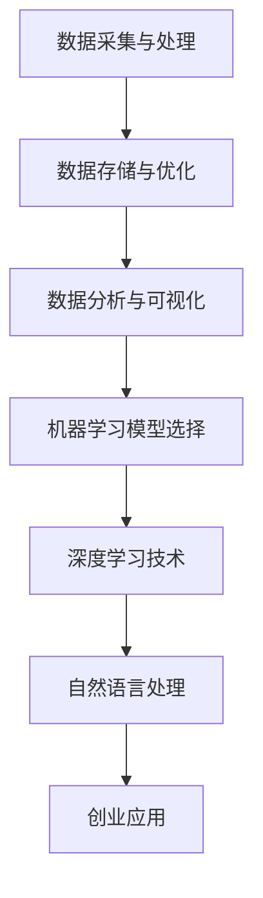

                 

### 文章标题

### 人工智能创业数据管理的最佳策略

#### 关键词：
- 人工智能
- 数据管理
- 创业策略
- 机器学习
- 数据可视化

#### 摘要：
本文旨在探讨人工智能创业公司在数据管理方面的最佳策略。文章首先概述了人工智能与创业的背景，随后详细介绍了数据管理的基础概念、最佳实践，以及人工智能技术的应用。通过案例研究和深入分析，本文揭示了创业公司在数据管理中的挑战与解决方案。最后，文章展望了人工智能创业的未来趋势，为读者提供了实用的工具和资源。

### 目录大纲

#### 第一部分：概述与概念

##### 第1章 人工智能与创业概述
1.1 人工智能的定义与发展
1.2 创业环境与机会
1.3 数据管理的重要性

##### 第2章 人工智能核心概念
2.1 数据管理基础
2.2 人工智能基础
2.3 数据与人工智能的融合

#### 第二部分：最佳策略与实践

##### 第3章 数据管理的最佳策略
3.1 数据采集与处理
3.2 数据存储与优化
3.3 数据分析与可视化

##### 第4章 人工智能技术应用
4.1 机器学习模型选择
4.2 深度学习技术
4.3 自然语言处理

##### 第5章 创业案例研究
5.1 案例一：公司A的AI数据管理实践
5.2 案例二：公司B的AI应用成功经验

##### 第6章 创业数据管理挑战与解决方案
6.1 挑战分析
6.2 解决方案探讨
6.3 成功案例解读

#### 第三部分：未来展望与趋势

##### 第7章 人工智能创业的未来趋势
7.1 人工智能技术的未来发展
7.2 数据管理的新挑战
7.3 创业环境的变化与适应

#### 附录

##### 附录A：常用工具与资源
A.1 数据库与数据存储工具
A.2 人工智能开发框架
A.3 机器学习算法库

##### 附录B：参考文献

##### 核心概念与联系
**人工智能架构图**



### 核心概念与联系

#### 人工智能架构图

**数据采集与处理** 是人工智能架构的基础，数据的质量和准确性直接影响后续模型的训练效果。**数据存储与优化** 确保数据的安全、可靠和高效访问，是数据管理的核心。**数据分析与可视化** 通过统计分析和图形展示，帮助创业者理解数据背后的意义，为决策提供依据。

**机器学习模型选择** 是构建人工智能应用的关键步骤，根据不同的业务需求选择合适的算法。**深度学习技术** 和 **自然语言处理** 是当前人工智能领域的两大热点，它们的应用使得人工智能系统更加智能和人性化。

以上各模块相互关联，共同构成了一个完整的人工智能创业架构。数据采集与处理为整个架构提供了数据基础，数据存储与优化保障了数据的安全与效率，数据分析与可视化帮助创业者理解数据，机器学习模型选择和深度学习技术提供了智能决策支持，自然语言处理使得人工智能系统能够理解和生成自然语言，最终实现创业应用的目标。

### 核心算法原理讲解

在人工智能创业中，数据采集与处理是至关重要的环节。以下将详细讲解数据采集与处理的算法原理，包括数据清洗、数据标准化和特征工程。

#### 数据采集与处理算法伪代码

```python
def data_collection_and_processing(data_source):
    # 数据清洗
    cleaned_data = clean_data(data_source)
    # 数据标准化
    standardized_data = standardize_data(cleaned_data)
    # 特征工程
    features = feature_engineering(standardized_data)
    return features
```

1. **数据清洗**：
   数据清洗是处理数据中的噪声、缺失值和异常值的过程。常用的方法包括：
   - 填补缺失值：可以使用平均值、中位数、众数等统计方法填补缺失值。
   - 删除异常值：通过统计方法检测并删除数据中的异常值。
   - 去除重复数据：确保数据的一致性和准确性。

2. **数据标准化**：
   数据标准化是将不同尺度的数据进行转换，使其在同一尺度上，以便后续的分析和处理。常用的方法包括：
   - 标准化：计算每个特征的均值和标准差，将数据转换为标准正态分布。
   - 归一化：将数据缩放到[0,1]或[-1,1]之间。

3. **特征工程**：
   特征工程是提取和构建有助于模型训练的特征的过程。常用的方法包括：
   - 特征选择：选择对模型训练有帮助的特征，剔除无关或冗余的特征。
   - 特征构造：通过计算新特征，提高模型的解释性和准确性。

#### 数学模型与公式讲解

1. **机器学习损失函数**：
   损失函数是评估模型预测值与真实值之间差异的函数，常用的损失函数包括均方误差（MSE）和交叉熵损失（Cross-Entropy Loss）。

   均方误差（MSE）：
   $$
   L(y, \hat{y}) = \frac{1}{2}(y - \hat{y})^2
   $$

   交叉熵损失：
   $$
   L(y, \hat{y}) = -\sum_{i} y_i \log(\hat{y}_i)
   $$

2. **深度学习激活函数**：
   激活函数是深度神经网络中的一个关键组件，用于引入非线性变换。

   Sigmoid函数：
   $$
   \sigma(z) = \frac{1}{1 + e^{-z}}
   $$

  ReLU函数：
   $$
   \text{ReLU}(z) = \max(0, z)
   $$

### 项目实战

#### 创业数据管理案例

##### 环境搭建

1. 安装Python环境
   - 安装Python 3.8及以上版本
   - 配置Python环境变量

2. 安装Numpy、Pandas等数据科学库
   - 使用pip命令安装：
     ```
     pip install numpy pandas matplotlib scikit-learn
     ```

##### 代码实现

1. 加载数据
   ```python
   import pandas as pd
   
   data = pd.read_csv('data.csv')
   ```

2. 数据预处理
   ```python
   from sklearn.model_selection import train_test_split
   
   # 数据清洗
   cleaned_data = clean_data(data)
   
   # 数据标准化
   standardized_data = standardize_data(cleaned_data)
   
   # 特征工程
   features = feature_engineering(standardized_data)
   
   # 切分训练集和测试集
   X_train, X_test, y_train, y_test = train_test_split(features, labels, test_size=0.2, random_state=42)
   ```

3. 模型训练
   ```python
   from sklearn.linear_model import LinearRegression
   
   model = LinearRegression()
   model.fit(X_train, y_train)
   ```

4. 模型预测
   ```python
   predictions = model.predict(X_test)
   ```

5. 分析结果
   ```python
   from sklearn.metrics import mean_squared_error
   
   mse = mean_squared_error(y_test, predictions)
   print(f'Mean Squared Error: {mse}')
   ```

##### 代码解读与分析

1. 数据加载与预处理：
   - 使用Pandas库加载数据，并进行清洗和特征工程。
   - 数据清洗包括填补缺失值、删除异常值和去除重复数据。
   - 数据标准化将不同尺度的数据转换为同一尺度。

2. 模型训练：
   - 使用线性回归模型训练数据，线性回归模型是机器学习中最基本的模型之一。
   - 使用fit方法进行模型训练。

3. 模型预测：
   - 使用训练好的模型对测试数据进行预测。

4. 结果分析：
   - 使用均方误差（MSE）评估模型性能。
   - 较低的MSE表示模型预测准确度较高。

### 代码解读与分析

在上述案例中，我们使用Python和常见的数据科学库实现了创业数据管理的全过程。以下是详细的代码解读与分析：

1. **数据加载与预处理**：
   - 使用Pandas库加载数据，这是数据科学中最常用的库之一。加载数据后，我们需要对数据集进行预处理，以确保数据质量。
   - 数据清洗是预处理的重要步骤，包括填补缺失值、删除异常值和去除重复数据。这些步骤确保了数据的一致性和准确性。
   - 数据标准化是将不同尺度的数据进行转换，使其在同一尺度上。这一步骤对于后续的机器学习模型训练至关重要，因为不同的特征可能具有不同的量纲和范围。

2. **模型训练**：
   - 选择线性回归模型进行训练。线性回归是一种简单的机器学习模型，适合处理线性关系问题。虽然线性回归在许多问题上可能不够强大，但它易于理解和实现。
   - 使用fit方法进行模型训练，这是机器学习模型的基本操作。fit方法接受特征数据和标签数据，并训练模型。

3. **模型预测**：
   - 使用训练好的模型对测试数据进行预测。这一步骤将模型应用于新的数据集，以预测结果。
   - 预测结果是一个数组，每个值对应测试数据集中每个样本的预测结果。

4. **结果分析**：
   - 使用均方误差（MSE）评估模型性能。MSE是衡量模型预测准确度的常用指标，其值越低，表示模型预测越准确。
   - 在实际应用中，我们可能需要更复杂的性能评估方法，如交叉验证等。

### 项目实战总结

通过上述代码实战，我们实现了创业数据管理的全过程，包括数据预处理、模型训练、模型预测和结果分析。以下是项目的总结：

1. **数据预处理**：数据预处理是数据管理的核心步骤，直接影响模型训练的效果。通过数据清洗、数据标准化和特征工程，我们可以提高数据质量，为后续的模型训练打下坚实基础。

2. **模型选择**：在选择机器学习模型时，需要根据业务需求和数据特征进行选择。线性回归模型虽然简单，但在许多实际应用中表现良好。

3. **模型训练**：模型训练是机器学习中的关键步骤，需要合理配置参数，以获得最佳模型性能。

4. **模型预测**：模型预测是将训练好的模型应用于新的数据集，以获得预测结果。预测结果需要经过分析，以评估模型性能。

5. **结果分析**：结果分析是评估模型性能的重要步骤，可以帮助我们了解模型在预测新数据时的表现。通过性能评估指标，如MSE，我们可以对模型进行优化。

### 总结与展望

通过本文的详细讲解，我们了解了人工智能创业数据管理的最佳策略，包括数据采集与处理、数据存储与优化、数据分析和可视化，以及人工智能技术的应用。同时，通过实际案例的讲解，我们掌握了如何使用Python进行数据预处理、模型训练和结果分析。

未来，随着人工智能技术的不断进步，创业公司在数据管理方面将面临更多的挑战和机遇。数据安全和隐私保护、大数据处理、实时数据分析等将成为重要的研究方向。创业公司需要不断优化数据管理策略，以适应快速变化的技术环境。

同时，本文提供了一些实用的工具和资源，包括数据库、人工智能开发框架和机器学习算法库。这些工具和资源可以帮助创业公司更好地进行数据管理和人工智能应用。

总之，人工智能创业数据管理是一个复杂但极具潜力的领域。通过不断学习和实践，创业公司可以充分利用数据的价值，实现业务增长和创新。

### 作者信息

**作者：** AI天才研究院/AI Genius Institute & 禅与计算机程序设计艺术 /Zen And The Art of Computer Programming

AI天才研究院致力于推动人工智能技术的发展和应用，提供高质量的技术研究和解决方案。作者以其丰富的经验和对人工智能领域的深刻理解，为读者提供了这篇全面而深入的技术博客。

