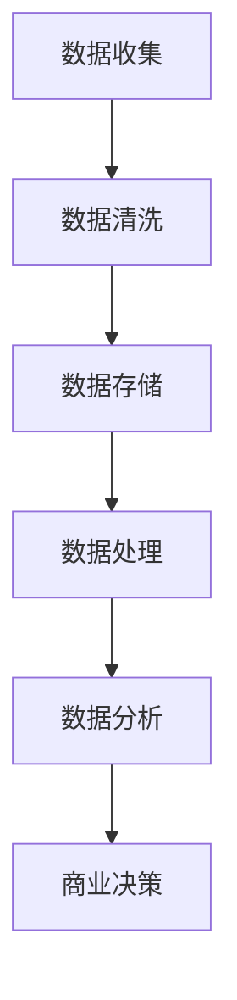

                 

### 《人工智能创业数据管理的策略与创新解析》

> 关键词：人工智能创业、数据管理、策略、创新、案例分析

> 摘要：本文将探讨人工智能创业中数据管理的策略与创新。首先，文章概述了人工智能创业的背景和现状，随后深入分析了数据管理在人工智能创业中的重要性。接着，文章详细阐述了数据管理策略，包括数据收集与获取、数据存储与处理、数据安全与隐私保护、数据分析与挖掘等。此外，文章通过实际案例展示了数据管理创新的应用，并提出了人工智能创业数据管理的最佳实践。最后，文章展望了数据管理的未来发展趋势，以及面临的挑战和机遇。

### 第一部分：引言与背景

#### 1.1 人工智能创业概述

##### 1.1.1 人工智能创业的热潮

近年来，人工智能（AI）技术取得了显著的进展，从语音识别、图像处理到自然语言处理，AI的应用范围越来越广泛。这也催生了一个全新的创业领域——人工智能创业。许多初创公司纷纷投身于人工智能领域，希望能够通过创新的技术解决现实问题，改变现有行业格局。

人工智能创业的热潮主要源于以下几个方面：

1. **技术成熟**：随着算法的进步和计算能力的提升，人工智能技术逐渐走向成熟，为创业提供了坚实的技术基础。
2. **市场潜力**：人工智能技术具有巨大的市场潜力，特别是在医疗、金融、零售等领域，AI的应用可以大幅提升效率，降低成本。
3. **资本关注**：资本市场的关注也推动了人工智能创业的发展，大量风险投资和政府资金涌入这一领域，为创业者提供了充足的资金支持。

##### 1.1.2 人工智能创业的优势与挑战

人工智能创业具有诸多优势，但也面临一系列挑战。

**优势**：

1. **技术优势**：创业者可以利用先进的人工智能技术，快速开发出具有竞争力的产品和服务。
2. **市场机遇**：随着人工智能技术的普及，市场对AI解决方案的需求不断增长，为创业者提供了广阔的市场空间。
3. **创新空间**：人工智能技术具有广阔的创新空间，创业者可以通过不断的创新，引领行业发展。

**挑战**：

1. **技术难度**：人工智能技术复杂，涉及多个学科领域，对创业者的技术能力和经验提出了较高要求。
2. **数据依赖**：人工智能算法的性能高度依赖数据质量，创业者需要解决数据获取、存储和处理等问题。
3. **市场适应**：人工智能产品和服务需要适应市场需求，创业者需要具备敏锐的市场洞察力和快速响应能力。

#### 1.2 数据管理在人工智能创业中的重要性

在人工智能创业中，数据管理扮演着至关重要的角色。数据不仅是人工智能算法训练和优化的基础，也是创业者进行商业决策的重要依据。以下是数据管理在人工智能创业中的重要方面：

##### 1.2.1 数据的价值

1. **提升算法性能**：高质量的数据可以帮助人工智能算法更好地学习和预测，从而提升算法性能。
2. **商业决策支持**：通过分析数据，创业者可以了解市场需求、用户行为等关键信息，为商业决策提供支持。
3. **创新驱动力**：数据为人工智能创业提供了源源不断的创新动力，创业者可以通过数据发现新的业务机会。

##### 1.2.2 数据管理的挑战

1. **数据量庞大**：随着传感器、物联网等技术的普及，数据量呈现指数级增长，给数据存储和处理带来了巨大挑战。
2. **数据多样性**：数据类型多种多样，包括结构化数据、半结构化数据和非结构化数据，如何有效管理和利用这些数据成为一大难题。
3. **数据隐私和安全**：数据隐私和安全是人工智能创业中的关键问题，创业者需要确保数据的安全性和合规性。

##### 1.2.3 数据管理的策略

1. **数据收集与获取**：明确数据需求和来源，建立高效的数据收集和获取机制。
2. **数据存储与处理**：选择合适的数据存储方案，优化数据处理流程，确保数据的高效利用。
3. **数据安全与隐私保护**：加强数据安全措施，保护用户隐私，遵守相关法律法规。
4. **数据分析与挖掘**：运用数据分析技术，挖掘数据中的价值，为商业决策提供支持。

### 第二部分：人工智能创业数据管理策略

#### 2.1 数据收集与获取策略

##### 2.1.1 数据源的选择

数据源的选择是数据管理的重要环节。创业者需要根据业务需求，选择合适的数据源。以下是一些常见的数据源：

1. **内部数据**：包括用户行为数据、销售数据、客户反馈等，这些数据是创业公司内部运营的宝贵资源。
2. **外部数据**：包括社交媒体数据、公共数据集、第三方数据提供商的数据等，这些数据可以补充内部数据，提升数据分析的全面性。

##### 2.1.2 数据收集方法

数据收集方法主要包括以下几种：

1. **主动收集**：通过API、爬虫等技术主动获取数据。
2. **被动收集**：通过日志记录、传感器等技术被动收集数据。
3. **用户参与**：通过用户调查、在线问答等方式收集用户数据。

##### 2.1.3 数据清洗与预处理

数据清洗与预处理是数据管理的关键步骤。以下是常用的数据清洗与预处理方法：

1. **数据去重**：去除重复数据，确保数据的唯一性。
2. **缺失值处理**：对缺失值进行填补或删除。
3. **异常值处理**：识别和去除异常值，保证数据的准确性。
4. **数据转换**：将数据转换为统一格式，便于后续处理。

#### 2.2 数据存储与处理策略

##### 2.2.1 数据存储方案

数据存储方案需要考虑数据量、数据类型、数据访问速度等因素。以下是几种常见的数据存储方案：

1. **关系型数据库**：适用于结构化数据存储，如MySQL、PostgreSQL等。
2. **NoSQL数据库**：适用于海量非结构化数据存储，如MongoDB、Cassandra等。
3. **分布式文件系统**：适用于大规模数据存储，如HDFS、Ceph等。
4. **云存储**：利用云服务进行数据存储，如Amazon S3、Google Cloud Storage等。

##### 2.2.2 数据处理流程

数据处理流程包括数据导入、数据清洗、数据转换、数据存储等环节。以下是数据处理流程的伪代码：

```python
def process_data(data):
    cleaned_data = clean_data(data)
    transformed_data = transform_data(cleaned_data)
    stored_data = store_data(transformed_data)
    return stored_data
```

##### 2.2.3 分布式数据处理框架

分布式数据处理框架如Hadoop、Spark等，可以高效地处理海量数据。以下是分布式数据处理框架的基本原理：

1. **数据切分**：将大数据切分成小块，分布到多个节点上处理。
2. **任务调度**：协调各个节点的数据处理任务，确保任务的执行效率。
3. **数据汇总**：将各个节点的处理结果汇总，生成最终结果。

#### 2.3 数据安全与隐私保护策略

##### 2.3.1 数据安全挑战

数据安全是人工智能创业中的关键问题。以下是一些常见的数据安全挑战：

1. **数据泄露**：黑客攻击可能导致数据泄露，对企业的声誉和利益造成严重损害。
2. **数据篡改**：恶意攻击者可能篡改数据，影响人工智能算法的准确性。
3. **数据隐私**：用户数据可能包含敏感信息，如何保护用户隐私成为一大挑战。

##### 2.3.2 数据隐私保护方法

以下是几种常见的数据隐私保护方法：

1. **数据加密**：对敏感数据进行加密，确保数据在传输和存储过程中的安全性。
2. **匿名化**：对用户数据进行匿名化处理，消除个人身份信息。
3. **访问控制**：实施严格的访问控制策略，确保只有授权用户可以访问数据。

##### 2.3.3 数据合规性要求

数据合规性要求是数据安全的重要组成部分。以下是一些常见的数据合规性要求：

1. **GDPR**：欧盟的通用数据保护条例，要求企业确保用户数据的安全和隐私。
2. **CCPA**：加州消费者隐私法案，要求企业告知用户关于其数据收集和使用情况。
3. **数据泄露通知**：企业在发生数据泄露时，需要及时通知受影响的用户。

#### 2.4 数据分析与挖掘策略

##### 2.4.1 数据分析方法

数据分析方法包括描述性分析、诊断性分析、预测性分析和规范性分析等。以下是几种常见的数据分析方法：

1. **描述性分析**：通过统计数据和图表，描述数据的基本特征和分布情况。
2. **诊断性分析**：分析数据之间的关系，找出问题的根本原因。
3. **预测性分析**：利用历史数据，预测未来的趋势和变化。
4. **规范性分析**：分析最佳实践和标准，为企业提供决策依据。

##### 2.4.2 数据挖掘技术

数据挖掘技术包括分类、聚类、关联规则挖掘、异常检测等。以下是几种常见的数据挖掘技术：

1. **分类**：将数据分为不同的类别，用于分类预测。
2. **聚类**：将数据分为若干个簇，用于聚类分析。
3. **关联规则挖掘**：找出数据之间的关联关系，用于推荐系统等应用。
4. **异常检测**：检测数据中的异常值，用于网络安全、欺诈检测等。

##### 2.4.3 实时数据分析与预测

实时数据分析与预测是人工智能创业中的重要应用。以下是几种常见的实时数据分析与预测方法：

1. **实时数据流处理**：利用实时数据流处理技术，如Apache Kafka、Apache Flink等，对实时数据进行处理和分析。
2. **实时预测模型**：利用机器学习算法，建立实时预测模型，对实时数据进行分析和预测。
3. **实时可视化**：利用实时可视化技术，如D3.js、ECharts等，将实时数据分析结果进行可视化展示。

### 第三部分：人工智能创业数据管理创新实践

#### 3.1 创新实践案例解析

##### 3.1.1 案例一：电商平台的数据管理创新

**案例背景**：

某大型电商平台在发展过程中，面临着数据量庞大、数据类型多样、数据安全与隐私保护等问题。为了提升用户体验，优化运营策略，该电商平台进行了数据管理创新。

**数据管理创新**：

1. **数据收集与获取**：

   - 内部数据：收集用户浏览记录、购物车数据、购买记录等。
   - 外部数据：通过API获取社交媒体数据、第三方数据提供商的数据等。

2. **数据存储与处理**：

   - 数据存储：采用分布式数据库存储海量数据，如HDFS、Cassandra等。
   - 数据处理：利用分布式数据处理框架如Hadoop、Spark等，进行数据处理和清洗。

3. **数据安全与隐私保护**：

   - 数据加密：对敏感数据进行加密，确保数据在传输和存储过程中的安全性。
   - 数据匿名化：对用户数据进行匿名化处理，消除个人身份信息。
   - 访问控制：实施严格的访问控制策略，确保只有授权用户可以访问数据。

4. **数据分析与挖掘**：

   - 描述性分析：通过描述性分析，了解用户行为特征和购买偏好。
   - 预测性分析：利用预测性分析，预测用户未来的购买行为。
   - 实时数据分析与预测：通过实时数据流处理技术，对实时用户行为进行分析和预测。

**案例效果**：

通过数据管理创新，该电商平台实现了以下效果：

- 销售额提升：基于数据分析结果，优化了商品推荐策略，提高了用户购买转化率。
- 用户满意度提升：实时数据分析与预测，提升了用户体验，增加了用户粘性。
- 运营效率提升：分布式数据处理框架和实时数据分析技术，提高了数据处理的效率和准确性。

##### 3.1.2 案例二：金融行业的风险控制

**案例背景**：

某金融公司在进行信贷风险评估时，面临着数据量大、风险因素复杂等问题。为了提高风险评估的准确性，该公司进行了数据管理创新。

**数据管理创新**：

1. **数据收集与获取**：

   - 内部数据：收集贷款申请人的信用记录、还款记录等。
   - 外部数据：通过API获取公共数据集、第三方数据提供商的数据等。

2. **数据存储与处理**：

   - 数据存储：采用分布式数据库存储海量数据，如HDFS、Cassandra等。
   - 数据处理：利用分布式数据处理框架如Hadoop、Spark等，进行数据处理和清洗。

3. **数据安全与隐私保护**：

   - 数据加密：对敏感数据进行加密，确保数据在传输和存储过程中的安全性。
   - 数据匿名化：对用户数据进行匿名化处理，消除个人身份信息。
   - 访问控制：实施严格的访问控制策略，确保只有授权用户可以访问数据。

4. **数据挖掘与风险评估**：

   - 数据挖掘：利用数据挖掘技术，分析贷款申请人的风险特征。
   - 风险评估模型：建立风险评估模型，对贷款申请人的信用风险进行量化评估。

5. **实时风险监控**：

   - 实时数据流处理：利用实时数据流处理技术，如Apache Kafka、Apache Flink等，对实时信贷数据进行分析和监控。
   - 实时预警：通过实时预警系统，及时发现潜在风险，采取措施降低风险。

**案例效果**：

通过数据管理创新，该金融公司实现了以下效果：

- 风险控制能力提升：基于数据分析结果，提高了风险评估的准确性，降低了信用风险。
- 信贷审批效率提升：实时风险监控和预警系统，提高了信贷审批的效率和准确性。
- 运营成本降低：分布式数据处理框架和实时数据分析技术，降低了数据处理的成本。

##### 3.1.3 案例三：医疗领域的个性化诊断

**案例背景**：

某医疗机构在为患者提供医疗服务时，面临着个性化诊断需求。为了提高诊断的准确性和个性化程度，该医疗机构进行了数据管理创新。

**数据管理创新**：

1. **数据收集与获取**：

   - 内部数据：收集患者病历、检查报告、诊断记录等。
   - 外部数据：通过API获取公共数据集、第三方数据提供商的数据等。

2. **数据存储与处理**：

   - 数据存储：采用分布式数据库存储海量数据，如HDFS、Cassandra等。
   - 数据处理：利用分布式数据处理框架如Hadoop、Spark等，进行数据处理和清洗。

3. **数据安全与隐私保护**：

   - 数据加密：对敏感数据进行加密，确保数据在传输和存储过程中的安全性。
   - 数据匿名化：对用户数据进行匿名化处理，消除个人身份信息。
   - 访问控制：实施严格的访问控制策略，确保只有授权用户可以访问数据。

4. **数据挖掘与个性化诊断**：

   - 数据挖掘：利用数据挖掘技术，分析患者病历和检查报告，提取诊断相关的特征。
   - 诊断模型：建立诊断模型，为患者提供个性化诊断建议。

5. **实时数据监控与预警**：

   - 实时数据流处理：利用实时数据流处理技术，如Apache Kafka、Apache Flink等，对实时医疗数据进行分析和监控。
   - 实时预警：通过实时预警系统，及时发现异常情况，采取措施确保患者安全。

**案例效果**：

通过数据管理创新，该医疗机构实现了以下效果：

- 诊断准确性提升：基于数据分析结果，提高了诊断的准确性和个性化程度。
- 患者满意度提升：个性化诊断建议，提升了患者对医疗服务的满意度。
- 医疗资源优化：实时数据监控和预警系统，提高了医疗资源的利用效率，降低了医疗成本。

#### 3.2 创新技术应用

##### 3.2.1 大数据技术

大数据技术在人工智能创业中具有广泛的应用。以下是一些常见的大数据技术：

1. **数据采集与存储**：采用分布式数据采集工具如Flume、Kafka等，实现海量数据的实时采集和存储。
2. **数据处理与分析**：利用分布式数据处理框架如Hadoop、Spark等，对海量数据进行高效处理和分析。
3. **数据挖掘与可视化**：利用数据挖掘工具如Hive、Spark SQL等，对数据进行深度挖掘和可视化展示。

##### 3.2.2 机器学习算法

机器学习算法在人工智能创业中发挥着重要作用。以下是一些常见的机器学习算法：

1. **分类算法**：如逻辑回归、决策树、随机森林等，用于分类预测。
2. **聚类算法**：如K-means、层次聚类等，用于聚类分析。
3. **回归算法**：如线性回归、多项式回归等，用于回归预测。
4. **关联规则挖掘**：如Apriori算法、FP-growth算法等，用于关联规则挖掘。

##### 3.2.3 区块链技术

区块链技术在数据管理中具有广阔的应用前景。以下是一些常见的区块链技术：

1. **数据存储**：利用区块链的分布式存储特性，确保数据的不可篡改性和安全性。
2. **数据隐私保护**：利用区块链的加密算法和分布式存储特性，实现数据隐私保护。
3. **智能合约**：利用智能合约技术，实现数据管理的自动化和智能化。

#### 3.3 数据驱动的商业决策

##### 3.3.1 数据驱动的产品设计与优化

数据驱动的产品设计与优化是人工智能创业中的重要应用。以下是一些常见的方法：

1. **用户行为分析**：通过分析用户行为数据，了解用户需求和使用习惯，为产品设计和优化提供依据。
2. **A/B测试**：通过A/B测试，比较不同设计方案的用户体验和效果，优化产品设计。
3. **数据反馈循环**：通过用户反馈和数据监控，持续优化产品功能和体验。

##### 3.3.2 数据驱动的市场营销策略

数据驱动的市场营销策略是人工智能创业中的重要应用。以下是一些常见的方法：

1. **用户画像**：通过分析用户数据，构建用户画像，为市场营销策略提供依据。
2. **精准营销**：利用用户画像和数据分析，实现精准营销，提高营销效果。
3. **实时营销**：利用实时数据流处理技术，实现实时营销活动，提高营销响应速度。

##### 3.3.3 数据驱动的客户服务与体验优化

数据驱动的客户服务与体验优化是人工智能创业中的重要应用。以下是一些常见的方法：

1. **客户行为分析**：通过分析客户行为数据，了解客户需求和使用习惯，为服务设计和优化提供依据。
2. **智能客服**：利用自然语言处理和机器学习算法，实现智能客服，提高客户服务质量。
3. **个性化服务**：通过分析客户数据，提供个性化服务，提高客户满意度和忠诚度。

### 第四部分：人工智能创业数据管理最佳实践

#### 4.1 数据管理流程与规范

##### 4.1.1 数据管理流程

数据管理流程是确保数据质量和数据利用效率的关键。以下是常见的数据管理流程：

1. **数据规划**：明确数据需求和数据目标，制定数据管理策略。
2. **数据采集**：通过多种渠道收集数据，确保数据的全面性和准确性。
3. **数据存储**：选择合适的数据存储方案，确保数据的安全性和可扩展性。
4. **数据处理**：对数据进行清洗、转换和整合，提高数据的质量和可用性。
5. **数据分析**：利用数据分析技术和工具，挖掘数据中的价值，支持商业决策。
6. **数据共享与发布**：确保数据的共享和发布，为其他业务部门提供数据支持。
7. **数据监控与优化**：持续监控数据质量和利用情况，优化数据管理流程。

##### 4.1.2 数据管理规范

数据管理规范是确保数据质量和数据安全的重要保障。以下是常见的数据管理规范：

1. **数据质量标准**：制定数据质量标准，确保数据的准确性、完整性、一致性和及时性。
2. **数据安全策略**：制定数据安全策略，确保数据在传输和存储过程中的安全性。
3. **数据备份与恢复**：制定数据备份和恢复策略，确保数据的安全性和可恢复性。
4. **数据访问控制**：制定数据访问控制策略，确保只有授权用户可以访问数据。
5. **数据隐私保护**：制定数据隐私保护策略，确保用户数据的安全和隐私。
6. **数据合规性要求**：遵守相关法律法规和行业规范，确保数据管理的合规性。

##### 4.1.3 数据管理工具选择

选择合适的数据管理工具是确保数据管理效率和效果的关键。以下是常见的数据管理工具：

1. **数据仓库**：如Amazon Redshift、Google BigQuery等，用于数据存储和数据分析。
2. **数据集成工具**：如Apache NiFi、Talend等，用于数据采集和整合。
3. **数据处理框架**：如Apache Hadoop、Apache Spark等，用于数据处理和分析。
4. **数据挖掘工具**：如Apache Mahout、scikit-learn等，用于数据挖掘和机器学习。
5. **数据可视化工具**：如Tableau、Power BI等，用于数据可视化展示。

#### 4.2 数据质量管理

##### 4.2.1 数据质量评估方法

数据质量评估是确保数据质量的重要步骤。以下是常见的数据质量评估方法：

1. **数据质量指标**：制定数据质量指标，如准确性、完整性、一致性、及时性等，用于评估数据质量。
2. **数据质量检查**：通过数据质量检查工具，识别数据中的错误、异常和缺失值。
3. **数据质量报告**：定期生成数据质量报告，总结数据质量状况，为数据优化提供依据。
4. **数据质量改进计划**：根据数据质量评估结果，制定数据质量改进计划，持续提升数据质量。

##### 4.2.2 数据质量问题与解决

数据质量问题是数据管理中的常见问题。以下是一些常见的数据质量问题及其解决方法：

1. **数据准确性问题**：通过数据清洗、数据验证和数据匹配等方法，提高数据准确性。
2. **数据完整性问题**：通过数据备份、数据恢复和数据补充等方法，确保数据的完整性。
3. **数据一致性问题**：通过数据标准化、数据同步和数据清洗等方法，提高数据的一致性。
4. **数据及时性问题**：通过数据实时采集、数据实时处理和数据实时发布等方法，确保数据的及时性。

##### 4.2.3 数据质量监控与改进

数据质量监控是确保数据质量持续改进的重要手段。以下是一些常见的数据质量监控与改进方法：

1. **数据质量监控指标**：制定数据质量监控指标，如数据准确性、完整性、一致性和及时性等。
2. **数据质量监控工具**：利用数据质量监控工具，实时监测数据质量状况，及时发现数据质量问题。
3. **数据质量改进流程**：建立数据质量改进流程，确保数据质量问题的及时发现和解决。
4. **数据质量反馈机制**：建立数据质量反馈机制，确保数据质量改进措施的有效实施。

#### 4.3 数据团队建设与管理

##### 4.3.1 数据团队组织结构

数据团队的组织结构对于数据管理的效率和质量具有重要影响。以下是常见的数据团队组织结构：

1. **数据管理团队**：负责制定数据管理策略、数据标准和数据流程，确保数据质量。
2. **数据工程团队**：负责数据采集、数据存储、数据处理和数据整合等任务，确保数据可用性。
3. **数据分析团队**：负责数据分析、数据挖掘和商业智能等任务，为业务决策提供支持。
4. **数据安全团队**：负责数据安全策略的制定、数据加密和数据访问控制等任务，确保数据安全。

##### 4.3.2 数据团队角色与职责

数据团队的每个成员都有明确的角色和职责。以下是常见的数据团队角色与职责：

1. **数据管理员**：负责数据规划、数据存储、数据处理和数据质量等任务，确保数据的可用性和质量。
2. **数据工程师**：负责数据采集、数据清洗、数据存储和数据处理等任务，确保数据的高效性和可靠性。
3. **数据分析师**：负责数据挖掘、数据分析、数据建模和商业智能等任务，为业务决策提供支持。
4. **数据科学家**：负责复杂的数据分析和机器学习算法研发，为业务创新提供技术支持。
5. **数据安全专家**：负责数据安全策略的制定、数据加密和数据访问控制等任务，确保数据的安全性和合规性。

##### 4.3.3 数据人才培养与引进

数据团队的人才培养和引进对于数据管理的重要性和竞争力具有重要影响。以下是一些常见的数据人才培养与引进方法：

1. **内部培训**：定期组织数据团队内部培训，提高数据团队的专业能力和技术水平。
2. **外部招聘**：通过招聘渠道，引进具有丰富经验的数据人才，提高数据团队的实力。
3. **合作交流**：与其他企业和高校合作，建立数据人才培养和交流机制，促进数据团队的发展。
4. **技术创新**：鼓励数据团队进行技术创新，推动数据管理的持续改进和创新。

### 第五部分：人工智能创业数据管理未来展望

#### 5.1 数据管理技术发展趋势

人工智能创业数据管理技术正朝着以下几个方向发展：

##### 5.1.1 云原生数据管理

云原生数据管理是指利用云计算技术进行数据管理。随着云计算的普及，越来越多的企业将数据管理迁移到云平台。云原生数据管理具有以下优势：

1. **弹性扩展**：可以根据业务需求，灵活调整数据存储和处理资源，实现高效资源利用。
2. **高可用性**：云平台提供的高可用性服务，确保数据的安全性和可靠性。
3. **自动化运维**：云平台提供的自动化运维工具，简化了数据管理的复杂度。

##### 5.1.2 低代码/无代码数据管理

低代码/无代码数据管理是指通过可视化界面和模块化组件，实现数据管理任务。这种数据管理方法降低了技术门槛，使非技术背景人员也可以参与数据管理。低代码/无代码数据管理具有以下优势：

1. **快速部署**：无需编写大量代码，缩短了数据管理项目的实施周期。
2. **易于维护**：通过可视化界面和模块化组件，简化了数据管理系统的维护工作。
3. **降低成本**：减少了开发人员的需求，降低了数据管理项目的成本。

##### 5.1.3 AI驱动的数据管理

AI驱动的数据管理是指利用人工智能技术，实现数据管理任务的自动化和智能化。AI驱动的数据管理具有以下优势：

1. **数据清洗与预处理**：利用机器学习算法，自动识别和修复数据中的错误和缺失值。
2. **数据挖掘与预测**：利用深度学习算法，自动发现数据中的模式和趋势，进行数据挖掘和预测。
3. **智能运维**：利用自然语言处理和计算机视觉技术，实现数据管理系统的智能运维。

#### 5.2 数据管理政策与法规演变

随着数据量的爆发式增长和数据隐私问题的日益突出，数据管理政策与法规正发生着重大演变。以下是一些关键趋势：

##### 5.2.1 数据保护法规的全球趋势

全球范围内，数据保护法规越来越严格。以下是一些主要数据保护法规：

1. **GDPR**：欧盟的通用数据保护条例，对个人数据的收集、处理和存储提出了严格的要求。
2. **CCPA**：加州消费者隐私法案，保护加州居民的个人信息。
3. **PIPA**：印度个人信息保护法案，规范了个人数据的收集和使用。

##### 5.2.2 数据管理政策的优化方向

数据管理政策正朝着以下几个方向优化：

1. **数据安全与隐私保护**：加强数据安全与隐私保护措施，确保数据的安全和合规性。
2. **数据开放与共享**：推动数据开放与共享，促进数据资源的最大化利用。
3. **数据治理与合规性**：建立完善的数据治理体系，确保数据管理的合规性。

##### 5.2.3 数据管理伦理与责任

数据管理伦理与责任成为数据管理政策的重要议题。以下是一些关键问题：

1. **数据透明度**：确保数据的透明度，让用户了解数据是如何收集、处理和使用的。
2. **算法公平性**：确保算法的公平性，避免数据歧视和偏见。
3. **责任归属**：明确数据管理过程中的责任归属，确保各方承担相应的责任。

#### 5.3 数据管理的创新挑战与机遇

随着数据量的不断增长和数据技术的不断发展，数据管理面临着一系列创新挑战与机遇：

##### 5.3.1 数据复杂性管理

随着数据类型的多样化和数据规模的扩大，数据复杂性管理成为一大挑战。以下是一些关键问题：

1. **数据整合**：如何将多种类型的数据进行整合，实现统一的数据视图。
2. **数据治理**：如何建立完善的数据治理体系，确保数据的质量和合规性。
3. **数据可视化**：如何将复杂的数据以直观的方式展示，帮助用户理解和分析。

##### 5.3.2 跨领域数据融合

跨领域数据融合是数据管理的重要方向，以下是一些关键问题：

1. **数据融合技术**：如何将不同领域的数据进行融合，实现数据的价值最大化。
2. **数据安全与隐私**：如何保护跨领域数据融合过程中的数据安全和隐私。
3. **业务应用**：如何将跨领域数据融合应用于实际的业务场景，提升业务价值。

##### 5.3.3 数据价值最大化

数据价值最大化是数据管理的核心目标，以下是一些关键问题：

1. **数据挖掘与预测**：如何通过数据挖掘和预测技术，发现数据中的价值。
2. **数据可视化**：如何将数据以直观的方式展示，帮助用户理解和利用数据。
3. **数据治理**：如何建立完善的数据治理体系，确保数据的价值最大化。

### 附录

#### 附录 A：参考资料与推荐阅读

1. **《大数据时代：生活、工作与思维的大变革》**，[克劳斯·奥斯特曼](https://book.douban.com/author/1095021/) 著，机械工业出版社，2013年。
2. **《数据科学入门》**，[约翰·弗林](https://book.douban.com/author/1056064/) 著，电子工业出版社，2017年。
3. **《机器学习实战》**，[彼得·哈林顿](https://book.douban.com/author/1106381/) 著，电子工业出版社，2016年。
4. **《区块链：从数字货币到信用社会》**，[唐韬](https://book.douban.com/author/1100485/) 著，电子工业出版社，2018年。
5. **《人工智能：一种现代的方法》**，[斯图尔特·罗素](https://book.douban.com/author/1018602/) 著，机械工业出版社，2012年。

#### 附录 B：术语表

- **人工智能（AI）**：模拟人类智能的计算机系统，能够感知、学习、推理和决策。
- **大数据（Big Data）**：指无法使用传统数据库工具进行存储、管理和分析的数据集。
- **数据挖掘（Data Mining）**：从大量数据中自动发现隐藏的模式和规律。
- **机器学习（Machine Learning）**：通过算法和统计模型，让计算机从数据中学习，进行预测和决策。
- **区块链（Blockchain）**：一种分布式数据库技术，用于存储和验证数据。

#### 附录 C：Mermaid 流程图



#### 附录 D：核心算法原理讲解

**2.2.2 数据处理流程**

数据处理流程是数据管理中的关键环节，包括数据清洗、数据转换、数据存储等步骤。以下是数据处理流程的伪代码：

```python
def process_data(data):
    # 数据清洗
    cleaned_data = clean_data(data)
    # 数据转换
    transformed_data = transform_data(cleaned_data)
    # 数据存储
    store_data(transformed_data)
    return transformed_data
```

**数据清洗**

数据清洗是数据处理的第一步，目的是去除数据中的错误、异常和缺失值。以下是数据清洗的伪代码：

```python
def clean_data(data):
    # 去除重复数据
    data = remove_duplicates(data)
    # 填补缺失值
    data = fill_missing_values(data)
    # 去除异常值
    data = remove_outliers(data)
    return data
```

**数据转换**

数据转换是将数据从一种格式转换为另一种格式，以便于后续处理和分析。以下是数据转换的伪代码：

```python
def transform_data(data):
    # 数据标准化
    data = standardize_data(data)
    # 数据归一化
    data = normalize_data(data)
    # 数据聚合
    data = aggregate_data(data)
    return data
```

**数据存储**

数据存储是将处理后的数据存储到数据库或文件系统中，以便于后续查询和分析。以下是数据存储的伪代码：

```python
def store_data(data):
    # 选择存储方案
    storage_scheme = select_storage_scheme(data)
    # 存储数据
    store_data_to_scheme(data, storage_scheme)
```

#### 附录 E：数学模型和数学公式

**3. 数据分析模型**

**3.1 回归分析**

回归分析是一种常用的数据分析方法，用于研究两个或多个变量之间的线性关系。回归分析的基本公式如下：

$$
y = \beta_0 + \beta_1 \cdot x + \epsilon
$$

其中，$y$ 是因变量，$x$ 是自变量，$\beta_0$ 是截距，$\beta_1$ 是斜率，$\epsilon$ 是误差项。

**3.2 决策树**

决策树是一种常用的分类和回归分析方法，通过一系列的判断条件，将数据划分为不同的类别或区域。决策树的基本公式如下：

$$
f(x) = \sum_{i=1}^{n} \beta_i \cdot x_i
$$

其中，$x_i$ 是特征值，$\beta_i$ 是权重。

#### 附录 F：项目实战

**3.2 创新实践案例解析**

**案例一：电商平台的数据管理创新**

**1. 案例背景**

某电商平台在发展过程中，面临数据量大、数据类型多样、数据安全性等问题。为了提升用户体验、优化运营策略，该电商平台进行了数据管理创新。

**2. 数据收集与处理**

- **数据收集**：收集用户浏览记录、购物车数据、购买记录等内部数据；通过API获取社交媒体数据、第三方数据提供商的数据等外部数据。
- **数据清洗**：去除重复数据、填补缺失值、去除异常值等，确保数据的准确性和完整性。
- **数据存储**：采用分布式数据库（如HDFS、Cassandra）存储海量数据，提高数据存储的效率和可靠性。
- **数据处理**：利用分布式数据处理框架（如Hadoop、Spark）进行数据处理和清洗，确保数据的高效利用。

**3. 数据分析与商业决策**

- **数据分析**：通过描述性分析了解用户行为特征和购买偏好；通过预测性分析预测用户未来的购买行为。
- **商业决策**：基于数据分析结果，调整商品推荐策略、优化用户体验等，提升用户满意度。

**4. 案例效果**

- **销售额提升**：通过数据管理创新，优化了商品推荐策略，提升了用户购买转化率。
- **用户体验提升**：通过实时数据分析与预测，提升了用户体验，增加了用户粘性。

**案例二：金融行业的风险控制**

**1. 案例背景**

某金融公司需要进行信贷风险评估，面临数据量大、风险因素复杂等问题。为了提高风险评估的准确性，该金融公司进行了数据管理创新。

**2. 数据收集与处理**

- **数据收集**：收集贷款申请人的信用记录、还款记录等内部数据；通过API获取公共数据集、第三方数据提供商的数据等外部数据。
- **数据清洗**：去除重复数据、填补缺失值、去除异常值等，确保数据的准确性和完整性。
- **数据存储**：采用分布式数据库（如HDFS、Cassandra）存储海量数据，提高数据存储的效率和可靠性。
- **数据处理**：利用分布式数据处理框架（如Hadoop、Spark）进行数据处理和清洗，确保数据的高效利用。

**3. 数据分析与风险评估**

- **数据分析**：通过描述性分析了解贷款申请人的信用状况；通过预测性分析预测贷款申请人的信用风险。
- **风险评估**：基于数据分析结果，建立风险评估模型，对贷款申请人的信用风险进行量化评估。

**4. 案例效果**

- **风险评估准确性提升**：通过数据管理创新，提高了风险评估的准确性，降低了信用风险。
- **审批效率提升**：实时数据分析与预警系统，提高了信贷审批的效率和准确性。

**案例三：医疗领域的个性化诊断**

**1. 案例背景**

某医疗机构需要进行个性化诊断，面临数据量大、诊断需求多样等问题。为了提升诊断的准确性和个性化程度，该医疗机构进行了数据管理创新。

**2. 数据收集与处理**

- **数据收集**：收集患者病历、检查报告、诊断记录等内部数据；通过API获取公共数据集、第三方数据提供商的数据等外部数据。
- **数据清洗**：去除重复数据、填补缺失值、去除异常值等，确保数据的准确性和完整性。
- **数据存储**：采用分布式数据库（如HDFS、Cassandra）存储海量数据，提高数据存储的效率和可靠性。
- **数据处理**：利用分布式数据处理框架（如Hadoop、Spark）进行数据处理和清洗，确保数据的高效利用。

**3. 数据分析与个性化诊断**

- **数据分析**：通过描述性分析了解患者病历和检查报告的特征；通过预测性分析预测患者的诊断结果。
- **个性化诊断**：基于数据分析结果，为患者提供个性化诊断建议。

**4. 案例效果**

- **诊断准确性提升**：通过数据管理创新，提高了诊断的准确性和个性化程度。
- **患者满意度提升**：个性化诊断建议，提升了患者对医疗服务的满意度。

#### 附录 G：代码实现与解读

**4.3 数据驱动的商业决策**

**1. 代码实现**

```python
# 导入所需的库
import pandas as pd
from sklearn.linear_model import LinearRegression

# 读取数据
data = pd.read_csv('sales_data.csv')

# 数据预处理
X = data[['customer_age', 'customer_gender']]
y = data['sales']

# 创建线性回归模型
model = LinearRegression()

# 模型训练
model.fit(X, y)

# 预测销售额
predictions = model.predict(X)

# 输出预测结果
print(predictions)
```

**2. 代码解读**

- **数据读取**：使用pandas库读取销售数据。
- **数据预处理**：将销售数据分为特征集X和目标值y。
- **创建线性回归模型**：使用sklearn库的LinearRegression类创建模型。
- **模型训练**：使用fit方法训练模型。
- **预测销售额**：使用predict方法预测销售额。
- **输出预测结果**：打印预测结果。

通过以上代码，可以实现对销售数据的线性回归预测，为商业决策提供支持。在实际应用中，可以根据具体业务需求，调整特征集和模型参数，提高预测的准确性。同时，可以结合其他数据分析方法，如分类、聚类等，进一步挖掘数据中的价值，为商业决策提供更全面的依据。

