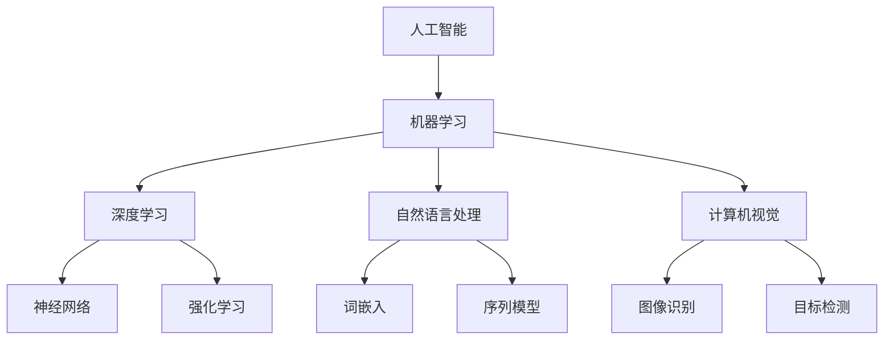

                 

# 文章标题

《人工智能创业方案》

> 关键词：人工智能、创业、方案、技术、市场、团队、成功案例、前景

> 摘要：本文将详细探讨人工智能创业的各个方面，包括基础知识、创业准备、实战案例、成功经验及未来展望，帮助创业者更好地理解人工智能创业的路径和策略。

### 《人工智能创业方案》目录大纲

## 第一部分：人工智能基础知识

### 1.1 人工智能概述

#### 1.1.1 人工智能的定义与历史

人工智能（Artificial Intelligence，简称AI）是指通过计算机程序和算法模拟人类智能行为的技术。它起源于20世纪50年代，随着计算机技术的不断发展，人工智能经历了多个发展阶段，包括规则推理、知识表示、机器学习等。

#### 1.1.2 人工智能的主要领域

人工智能的主要领域包括机器学习、深度学习、自然语言处理、计算机视觉等。每个领域都有其独特的应用和发展趋势。

#### 1.1.3 人工智能的技术框架

人工智能的技术框架包括数据预处理、模型训练、模型评估和应用部署等环节。这些环节相互关联，构成了完整的人工智能技术体系。

## 1.2 人工智能的核心算法

### 1.2.1 神经网络与深度学习

神经网络是人工智能的基础，而深度学习是神经网络在多个隐藏层上的扩展。深度学习在图像识别、语音识别等领域取得了显著的成果。

### 1.2.2 遗传算法与进化计算

遗传算法和进化计算是基于自然进化过程的优化算法，常用于求解复杂优化问题。

### 1.2.3 强化学习与策略优化

强化学习通过学习奖励和惩罚信号来优化决策策略，广泛应用于游戏、机器人控制等领域。

## 1.3 人工智能的数学模型

### 1.3.1 概率论与信息论基础

概率论和信息论是人工智能的核心数学基础，用于处理不确定性和信息传输问题。

### 1.3.2 最优化理论与算法

最优化理论用于解决人工智能中的优化问题，包括线性规划、非线性规划等。

### 1.3.3 数学公式与公式推导

本文将介绍一些重要的数学公式和其推导过程，帮助读者更好地理解人工智能的理论基础。

## 1.4 人工智能的应用领域

### 1.4.1 人工智能在工业中的应用

人工智能在工业自动化、质量控制、设备维护等方面具有广泛的应用。

### 1.4.2 人工智能在医疗健康中的应用

人工智能在医疗诊断、健康管理、药物研发等领域发挥着重要作用。

### 1.4.3 人工智能在金融中的应用

人工智能在金融风险评估、投资决策、客户服务等方面具有广泛应用。

## 第二部分：人工智能创业准备

### 2.1 创业者的人工智能知识储备

#### 2.1.1 人工智能的基础知识

创业者需要掌握人工智能的基本概念、技术和应用，为创业做好准备。

#### 2.1.2 人工智能的发展趋势

了解人工智能的发展趋势，有助于创业者把握市场机遇。

#### 2.1.3 人工智能的技术创新

跟踪人工智能领域的最新技术创新，有助于创业者保持竞争力。

## 2.2 人工智能创业策略

### 2.2.1 创业市场的调研与分析

#### 2.2.2 人工智能创业的商业模式

#### 2.2.3 创业者的人工智能伦理思考

### 2.3 人工智能创业团队建设

#### 2.3.1 团队结构与职责分工

#### 2.3.2 人才招聘与培养策略

#### 2.3.3 团队沟通与合作技巧

### 2.4 创业项目评估与投资策略

#### 2.4.1 人工智能创业项目的评估方法

#### 2.4.2 人工智能创业项目的投资策略

#### 2.4.3 人工智能创业项目的风险管理

## 第三部分：人工智能创业实战

### 3.1 人工智能项目开发流程

#### 3.1.1 项目需求分析与规划

#### 3.1.2 技术方案设计与选型

#### 3.1.3 项目开发与测试

### 3.2 人工智能项目实战案例

#### 3.2.1 人工智能在智能客服中的应用

#### 3.2.2 人工智能在智能推荐系统中的应用

#### 3.2.3 人工智能在智能安防系统中的应用

### 3.3 人工智能创业过程中的挑战与解决策略

#### 3.3.1 技术难题与解决方案

#### 3.3.2 法律法规与政策风险

#### 3.3.3 资金与人力资源的限制

## 第四部分：人工智能创业成功案例分享

### 4.1 成功人工智能创业案例介绍

#### 4.1.1 案例一：某智能安防公司

#### 4.1.2 案例二：某智能健康公司

#### 4.1.3 案例三：某智能金融公司

### 4.2 成功创业经验分享

#### 4.2.1 技术创新与市场定位

#### 4.2.2 团队建设与管理

#### 4.2.3 资本运作与市场推广

## 第五部分：人工智能创业前景展望

### 5.1 人工智能行业发展趋势

#### 5.1.1 技术发展趋势

#### 5.1.2 行业应用趋势

#### 5.1.3 全球人工智能发展现状与未来

### 5.2 人工智能创业新机遇

#### 5.2.1 新兴领域的发展机遇

#### 5.2.2 国际合作与市场拓展

#### 5.2.3 创新创业的政策环境

### 5.3 人工智能创业者的未来角色

#### 5.3.1 创业者应具备的技能与素质

#### 5.3.2 创业者在未来社会中的作用

#### 5.3.3 创业者应关注的社会责任

### 附录

#### 附录A：人工智能创业工具与资源

#### 附录B：人工智能开源框架与库

#### 附录C：人工智能法律法规与政策文件

#### 附录D：人工智能创业参考书目与文献

## 附录：核心概念与联系

### 附录A：人工智能的技术框架 Mermaid 流程图



### 附录B：核心算法原理讲解

#### 附录B.1 深度学习与神经网络

**神经网络的基本结构**

```python
# 输入层
input_layer = Input(shape=(input_shape,))

# 隐藏层
hidden_layer = Dense(units=64, activation='relu')(input_layer)

# 输出层
output_layer = Dense(units=1, activation='sigmoid')(hidden_layer)

# 模型构建
model = Model(inputs=input_layer, outputs=output_layer)

# 模型编译
model.compile(optimizer='adam', loss='binary_crossentropy', metrics=['accuracy'])

# 模型训练
model.fit(x_train, y_train, epochs=10, batch_size=32)
```

**神经网络的工作原理**

神经网络通过多层节点（神经元）的连接和激活函数来实现数据分类、预测等任务。输入数据首先经过输入层传递到隐藏层，隐藏层通过激活函数（如ReLU）处理后，将结果传递到输出层。输出层生成最终预测结果，并通过损失函数计算预测误差，进而更新模型参数。

### 附录C：数学模型与公式详细讲解

#### 附录C.1 概率论与信息论基础

**概率分布函数**

$$
P(X=x) = \int_{-\infty}^{\infty} f_X(x) dx
$$

**信息熵**

$$
H(X) = -\sum_{x \in X} P(X=x) \log_2 P(X=x)
$$

**交叉熵**

$$
H(Y|X) = -\sum_{x \in X} P(X=x) \log_2 P(Y|X=x)
$$

### 附录D：项目实战

#### 附录D.1 智能客服系统实战案例

**开发环境搭建**

- 操作系统：Ubuntu 20.04
- Python版本：3.8
- 深度学习框架：TensorFlow 2.6

**源代码实现**

```python
# 导入所需库
import tensorflow as tf
from tensorflow.keras.models import Sequential
from tensorflow.keras.layers import Dense, LSTM, Embedding
from tensorflow.keras.preprocessing.sequence import pad_sequences

# 加载数据集
train_data, test_data = load_data()

# 预处理数据
train_sequences = preprocess_data(train_data)
test_sequences = preprocess_data(test_data)

# 构建模型
model = Sequential()
model.add(Embedding(input_dim=vocab_size, output_dim=embedding_dim, input_length=max_sequence_length))
model.add(LSTM(units=128))
model.add(Dense(units=1, activation='sigmoid'))

# 编译模型
model.compile(optimizer='adam', loss='binary_crossentropy', metrics=['accuracy'])

# 训练模型
model.fit(train_sequences, train_labels, epochs=10, batch_size=32)

# 测试模型
test_loss, test_acc = model.evaluate(test_sequences, test_labels)
print("Test Accuracy:", test_acc)

# 代码解读与分析
# load_data() 函数用于加载数据集。
# preprocess_data() 函数用于预处理数据，包括分词、编码和填充。
# Embedding 层用于将词编码为向量。
# LSTM 层用于处理序列数据。
# Dense 层用于输出层，使用 sigmoid 激活函数实现二分类。
# 模型使用 compile() 函数进行编译，指定优化器和损失函数。
# 模型使用 fit() 函数进行训练。
# 模型使用 evaluate() 函数进行测试。
```

### 作者

**作者：AI天才研究院/AI Genius Institute & 禅与计算机程序设计艺术 /Zen And The Art of Computer Programming**### 第一部分：人工智能基础知识

#### 1.1 人工智能概述

**1.1.1 人工智能的定义与历史**

人工智能（Artificial Intelligence，简称AI）是指通过计算机程序和算法模拟人类智能行为的技术。人工智能的定义在不同的时代有不同的解读，但核心目标始终是模仿、扩展和增强人类智能。

人工智能的发展历程可以追溯到20世纪50年代。当时，科学家们开始探索如何使计算机具备类似人类的思维能力和行为模式。1956年，约翰·麦卡锡（John McCarthy）等人在达特茅斯会议（Dartmouth Conference）上首次提出了人工智能的概念。

自那时以来，人工智能经历了多个发展阶段：

- **初始阶段（1956-1969年）**：这一阶段以符号主义方法为主，通过编程规则和逻辑推理来模拟人类智能。

- **繁荣时期（1970-1980年）**：人工智能领域出现了许多突破性的成果，如专家系统（Expert Systems）和自然语言处理（Natural Language Processing）。

- **低谷时期（1980-1993年）**：由于计算能力的限制和实际应用的挑战，人工智能领域进入了一个相对低迷的时期。

- **复兴时期（1993年至今）**：随着计算能力的提升和数据量的增加，机器学习（Machine Learning）和深度学习（Deep Learning）逐渐成为人工智能的核心技术，推动了人工智能的快速发展。

**1.1.2 人工智能的主要领域**

人工智能涵盖了多个研究领域，其中一些主要领域包括：

- **机器学习（Machine Learning）**：机器学习是一种通过数据学习规律和模式，从而进行预测和决策的方法。它包括监督学习、无监督学习和强化学习等子领域。

- **深度学习（Deep Learning）**：深度学习是一种基于多层神经网络的机器学习方法，它在图像识别、语音识别和自然语言处理等领域取得了显著的成果。

- **自然语言处理（Natural Language Processing，NLP）**：自然语言处理旨在使计算机能够理解和处理人类自然语言。它包括文本分类、情感分析、机器翻译等任务。

- **计算机视觉（Computer Vision）**：计算机视觉是使计算机能够理解和解释视觉信息的技术。它包括图像识别、目标检测、人脸识别等任务。

- **机器人技术（Robotics）**：机器人技术是人工智能在实际行动中的应用，包括自主导航、抓取和操作等任务。

**1.1.3 人工智能的技术框架**

人工智能的技术框架主要包括以下几个环节：

- **数据预处理**：数据预处理是人工智能项目的基础，包括数据清洗、数据集成、数据转换等步骤。

- **模型训练**：模型训练是人工智能项目的核心，通过学习大量数据，模型可以识别出数据中的模式和规律。

- **模型评估**：模型评估用于评估模型的性能，常用的评估指标包括准确率、召回率、F1分数等。

- **模型优化**：模型优化旨在提高模型的性能，可以通过调整模型参数、增加训练数据等方式实现。

- **应用部署**：应用部署是将训练好的模型应用到实际场景中的过程，包括模型部署、服务部署和监控等步骤。

#### 1.2 人工智能的核心算法

**1.2.1 神经网络与深度学习**

神经网络（Neural Networks）是人工智能的基础，它通过模拟生物神经元的工作原理来处理数据。神经网络由输入层、隐藏层和输出层组成，每层包含多个神经元。神经元之间通过权重连接，并经过激活函数处理后传递到下一层。

深度学习（Deep Learning）是基于多层神经网络的机器学习方法，它通过增加网络的深度来提高模型的性能。深度学习在图像识别、语音识别和自然语言处理等领域取得了显著的成果。

**1.2.2 遗传算法与进化计算**

遗传算法（Genetic Algorithms）是一种基于自然进化过程的优化算法，它通过模拟生物进化的过程来搜索最优解。遗传算法包括选择、交叉、变异和生存等步骤，通过不断迭代来优化解的质量。

进化计算（Evolutionary Computation）是一类基于自然进化理论的计算方法，包括遗传算法、遗传编程、进化策略等。进化计算在求解复杂优化问题、自动设计电路和控制系统等方面具有广泛的应用。

**1.2.3 强化学习与策略优化**

强化学习（Reinforcement Learning）是一种通过学习奖励和惩罚信号来优化决策策略的机器学习方法。强化学习在游戏、机器人控制和自动驾驶等领域取得了显著的成果。

强化学习的基本过程包括环境（Environment）、代理（Agent）、状态（State）、动作（Action）和奖励（Reward）等要素。代理通过不断尝试不同的动作来获取奖励，并通过学习优化其策略。

策略优化（Policy Optimization）是强化学习的一种方法，它通过优化策略来最大化累积奖励。策略优化可以通过梯度上升、策略梯度等方法实现。

#### 1.3 人工智能的数学模型

**1.3.1 概率论与信息论基础**

概率论（Probability Theory）和信息论（Information Theory）是人工智能的核心数学基础。

概率论用于描述随机事件的发生概率，包括条件概率、贝叶斯定理等。概率论在机器学习、自然语言处理和计算机视觉等领域具有广泛的应用。

信息论是研究信息传输和处理的理论，包括信息熵、信息增益、熵减等概念。信息论在数据压缩、通信系统设计和人工智能优化问题中具有重要应用。

**1.3.2 最优化理论与算法**

最优化理论（Optimization Theory）是研究在给定条件下寻找最优解的理论，包括线性规划、非线性规划、整数规划等。

最优化算法（Optimization Algorithms）是一类用于求解最优化问题的方法，包括梯度下降、牛顿法、拉格朗日乘数法等。最优化算法在机器学习、控制理论和人工智能优化问题中具有重要应用。

**1.3.3 数学公式与公式推导**

本文将介绍一些重要的数学公式和其推导过程，帮助读者更好地理解人工智能的理论基础。

- **概率分布函数**

$$
P(X=x) = \int_{-\infty}^{\infty} f_X(x) dx
$$

- **信息熵**

$$
H(X) = -\sum_{x \in X} P(X=x) \log_2 P(X=x)
$$

- **交叉熵**

$$
H(Y|X) = -\sum_{x \in X} P(X=x) \log_2 P(Y|X=x)
$$

#### 1.4 人工智能的应用领域

**1.4.1 人工智能在工业中的应用**

人工智能在工业自动化、质量控制、设备维护等方面具有广泛的应用。例如，智能传感器和机器人可以用于生产线自动化，提高生产效率；人工智能算法可以用于预测设备故障，减少停机时间。

**1.4.2 人工智能在医疗健康中的应用**

人工智能在医疗诊断、健康管理、药物研发等方面发挥着重要作用。例如，深度学习算法可以用于图像识别，辅助医生诊断疾病；自然语言处理技术可以用于病历分析，提高诊断准确性。

**1.4.3 人工智能在金融中的应用**

人工智能在金融风险评估、投资决策、客户服务等方面具有广泛应用。例如，机器学习算法可以用于信用评分，降低贷款风险；智能客服系统可以用于提高客户满意度，降低运营成本。

### 第二部分：人工智能创业准备

#### 2.1 创业者的人工智能知识储备

**2.1.1 人工智能的基础知识**

创业者需要掌握人工智能的基本概念、技术和应用，包括机器学习、深度学习、自然语言处理、计算机视觉等。此外，创业者还需要了解人工智能的技术框架，包括数据预处理、模型训练、模型评估和应用部署等。

**2.1.2 人工智能的发展趋势**

了解人工智能的发展趋势，有助于创业者把握市场机遇。当前，人工智能的发展趋势主要包括以下几个方面：

- **技术趋势**：人工智能技术将继续向深度学习、强化学习、迁移学习等方向发展，提高模型的性能和应用范围。

- **行业应用趋势**：人工智能将在更多行业得到应用，如医疗健康、金融、教育、零售等。

- **跨学科融合趋势**：人工智能与其他学科的融合，如生物学、心理学、社会学等，将推动人工智能的创新发展。

**2.1.3 人工智能的技术创新**

跟踪人工智能领域的最新技术创新，有助于创业者保持竞争力。当前，人工智能领域的创新热点包括：

- **人工智能芯片**：随着人工智能应用的需求增加，人工智能芯片的研发将成为重要方向。

- **自动驾驶技术**：自动驾驶技术是人工智能在交通领域的应用，未来将实现更广泛的应用。

- **人机交互**：通过语音识别、手势识别等技术与人工智能的融合，实现更自然的人机交互。

#### 2.2 人工智能创业策略

**2.2.1 创业市场的调研与分析**

创业市场的调研与分析是人工智能创业的重要环节。创业者需要了解目标市场的规模、增长趋势、竞争状况等，为创业项目提供数据支持。

- **市场规模**：了解目标市场的规模和增长潜力，有助于评估项目的盈利能力。

- **增长趋势**：分析人工智能在各个行业的发展趋势，找到市场机遇。

- **竞争状况**：研究竞争对手的产品、市场定位、竞争优势等，为自身项目的差异化提供参考。

**2.2.2 人工智能创业的商业模式**

人工智能创业的商业模式可以分为以下几种类型：

- **技术服务**：为其他企业提供人工智能技术解决方案，如智能客服、智能推荐等。

- **硬件设备**：研发和销售人工智能相关的硬件设备，如智能传感器、机器人等。

- **平台运营**：搭建人工智能平台，为用户提供智能服务，如智能健康平台、智能教育平台等。

- **内容创作**：利用人工智能技术创作高质量内容，如智能写作、智能绘画等。

**2.2.3 创业者的人工智能伦理思考**

随着人工智能技术的发展，伦理问题日益凸显。创业者需要关注以下伦理问题：

- **隐私保护**：人工智能系统在处理用户数据时，需要保护用户隐私。

- **公平性**：人工智能系统在决策过程中需要保证公平性，避免歧视。

- **透明度**：人工智能系统的决策过程需要透明，用户可以了解系统的运作方式。

#### 2.3 人工智能创业团队建设

**2.3.1 团队结构与职责分工**

人工智能创业团队通常包括以下角色：

- **技术团队**：负责人工智能算法研发、模型训练和优化等。

- **产品团队**：负责产品设计、用户体验和运营等。

- **市场团队**：负责市场调研、推广和销售等。

- **行政团队**：负责财务管理、人力资源和行政管理等。

明确团队结构和职责分工，有助于提高团队协作效率。

**2.3.2 人才招聘与培养策略**

人才是人工智能创业的核心资源。创业者需要制定合理的人才招聘与培养策略：

- **招聘策略**：通过线上招聘、猎头推荐、校园招聘等方式吸引优秀人才。

- **培养策略**：提供内部培训、外部培训、项目实践等培养途径，提高团队整体能力。

**2.3.3 团队沟通与合作技巧**

团队沟通与合作是人工智能创业成功的关键。创业者需要关注以下几点：

- **明确目标**：确保团队成员对项目目标有清晰的认识。

- **有效沟通**：建立有效的沟通机制，如定期会议、即时沟通工具等。

- **协作机制**：制定合理的协作流程和规范，提高团队协作效率。

#### 2.4 创业项目评估与投资策略

**2.4.1 人工智能创业项目的评估方法**

创业项目的评估方法包括以下几个方面：

- **技术评估**：评估项目的技术可行性、技术优势和创新程度。

- **市场评估**：评估项目的市场需求、市场规模和竞争状况。

- **财务评估**：评估项目的盈利能力、成本结构和投资回报。

- **风险评估**：评估项目的市场风险、技术风险和财务风险。

**2.4.2 人工智能创业项目的投资策略**

人工智能创业项目的投资策略包括以下几个方面：

- **天使投资**：天使投资是项目启动阶段的资金支持，用于技术研发和团队建设。

- **风险投资**：风险投资是在项目进入市场阶段后的资金支持，用于产品开发和市场推广。

- **战略投资**：战略投资是企业为了实现战略目标而进行的投资，如并购、合作等。

**2.4.3 人工智能创业项目的风险管理**

人工智能创业项目的风险管理包括以下几个方面：

- **技术风险**：通过技术验证、技术储备等方式降低技术风险。

- **市场风险**：通过市场调研、竞争分析等方式降低市场风险。

- **财务风险**：通过财务规划、资金管理等方式降低财务风险。

### 第三部分：人工智能创业实战

#### 3.1 人工智能项目开发流程

**3.1.1 项目需求分析与规划**

项目需求分析是人工智能项目开发的第一步，包括以下几个方面：

- **用户需求**：了解用户的需求和痛点，确定项目的目标和应用场景。

- **功能需求**：明确项目的功能模块和业务逻辑。

- **性能需求**：确定项目的性能指标，如响应时间、准确率等。

项目规划包括以下几个方面：

- **项目范围**：明确项目的范围和边界。

- **项目时间表**：制定项目的时间表和里程碑。

- **资源分配**：确定项目所需的资源和人力安排。

**3.1.2 技术方案设计与选型**

技术方案设计是项目开发的核心环节，包括以下几个方面：

- **算法选型**：根据项目需求选择合适的算法，如机器学习算法、深度学习算法等。

- **技术框架**：选择合适的技术框架，如TensorFlow、PyTorch等。

- **硬件平台**：根据项目的计算需求和预算选择合适的硬件平台。

**3.1.3 项目开发与测试**

项目开发是按照技术方案设计和规划进行编码和实现的过程。项目开发过程中需要注意以下几点：

- **模块化开发**：将项目划分为多个模块，分别进行开发。

- **版本控制**：使用版本控制工具，如Git，管理代码版本。

项目测试是确保项目质量和功能完整性的关键环节，包括以下几个方面：

- **单元测试**：对项目的每个模块进行功能测试，确保模块功能的正确性。

- **集成测试**：将项目的不同模块进行集成，测试整体功能的正确性。

- **性能测试**：测试项目的性能指标，如响应时间、吞吐量等。

#### 3.2 人工智能项目实战案例

**3.2.1 人工智能在智能客服中的应用**

智能客服是人工智能在客户服务领域的重要应用，它通过自然语言处理、机器学习等技术，为用户提供智能化的客服服务。

**案例背景**：某公司是一家提供在线购物平台的电商企业，为了提高客户满意度，降低客服成本，决定引入智能客服系统。

**项目目标**：通过智能客服系统，实现以下目标：

- **自动回答常见问题**：通过自然语言处理技术，自动识别用户的问题，并提供准确的答案。

- **智能推荐**：根据用户的购买历史和偏好，提供个性化的商品推荐。

- **情感分析**：分析用户的反馈，识别用户的情绪和需求，提供针对性的服务。

**技术实现**：

- **自然语言处理**：使用自然语言处理技术，对用户的问题进行分词、词性标注、句法分析等处理。

- **机器学习**：使用机器学习算法，如决策树、支持向量机等，对用户的问题进行分类和预测。

- **深度学习**：使用深度学习算法，如卷积神经网络（CNN）、循环神经网络（RNN）等，对用户的问题进行情感分析。

**项目效果**：

- **提高客户满意度**：智能客服系统能够快速响应用户的问题，提供准确的答案，提高客户满意度。

- **降低客服成本**：智能客服系统可以自动回答常见问题，减少人工客服的工作量，降低客服成本。

- **个性化服务**：智能客服系统能够根据用户的购买历史和偏好，提供个性化的商品推荐，提高用户体验。

**3.2.2 人工智能在智能推荐系统中的应用**

智能推荐系统是人工智能在电子商务、社交媒体等领域的应用，它通过分析用户的行为和偏好，为用户提供个性化的推荐服务。

**案例背景**：某公司是一家电商平台，为了提高用户黏性和销售额，决定引入智能推荐系统。

**项目目标**：通过智能推荐系统，实现以下目标：

- **提高用户黏性**：通过个性化的推荐，提高用户的访问量和购买频率。

- **提高销售额**：通过个性化的推荐，提高用户的购买转化率。

- **优化商品库存**：根据用户的购买偏好，调整商品库存，降低库存风险。

**技术实现**：

- **用户行为分析**：收集用户的浏览、搜索、购买等行为数据，分析用户的行为模式和偏好。

- **协同过滤**：使用协同过滤算法，如基于用户的协同过滤（User-Based Collaborative Filtering）和基于物品的协同过滤（Item-Based Collaborative Filtering），为用户推荐相似的商品。

- **深度学习**：使用深度学习算法，如卷积神经网络（CNN）、循环神经网络（RNN）等，对用户的行为数据进行建模，提高推荐系统的准确性和个性化程度。

**项目效果**：

- **提高用户黏性**：智能推荐系统可以根据用户的兴趣和行为，为用户推荐感兴趣的商品，提高用户的访问量和购买频率。

- **提高销售额**：智能推荐系统可以根据用户的偏好和购买历史，为用户推荐可能感兴趣的商品，提高购买转化率。

- **优化商品库存**：智能推荐系统可以根据用户的购买偏好，调整商品库存，降低库存风险。

**3.2.3 人工智能在智能安防系统中的应用**

智能安防系统是人工智能在公共安全领域的重要应用，它通过视频监控、人脸识别等技术，实现对公共场所的实时监控和预警。

**案例背景**：某城市为了提高公共安全，决定引入智能安防系统。

**项目目标**：通过智能安防系统，实现以下目标：

- **实时监控**：通过视频监控，实现对公共场所的实时监控。

- **人脸识别**：通过人脸识别技术，识别和追踪嫌疑人。

- **预警系统**：通过实时监控和数据分析，实现对可疑行为的预警。

**技术实现**：

- **视频监控**：使用视频监控技术，实现对公共场所的实时监控。

- **人脸识别**：使用人脸识别技术，对监控视频中的目标进行识别和追踪。

- **大数据分析**：通过大数据分析技术，对监控视频进行数据挖掘，识别和预警可疑行为。

**项目效果**：

- **提高公共安全**：智能安防系统可以实时监控公共场所，及时发现和处理安全隐患，提高公共安全。

- **降低犯罪率**：智能安防系统可以通过人脸识别等技术，追踪和识别嫌疑人，降低犯罪率。

- **节约人力资源**：智能安防系统可以自动识别和预警可疑行为，减少人工巡逻和调查的工作量，节约人力资源。

### 第四部分：人工智能创业成功案例分享

#### 4.1 成功人工智能创业案例介绍

**4.1.1 案例一：某智能安防公司**

**公司背景**：某智能安防公司成立于2010年，是一家专注于智能安防系统研发和销售的企业。

**创业历程**：

- 2010年：公司成立，初期以视频监控技术为核心，研发智能安防产品。

- 2013年：公司推出基于人脸识别技术的智能安防系统，受到市场欢迎。

- 2016年：公司完成A轮融资，资金用于产品研发和市场推广。

- 2020年：公司成功上市，成为国内智能安防行业的领军企业。

**项目特点**：

- **技术创新**：公司坚持以技术创新为核心，不断推出具有竞争力的智能安防产品。

- **市场定位**：公司专注于公共安全和安防领域，市场定位明确。

- **商业模式**：公司采用B2B2C的商业模式，通过合作伙伴渠道将产品推向市场。

**成功原因**：

- **技术创新**：公司坚持以技术创新为核心，不断推出具有竞争力的智能安防产品。

- **市场定位**：公司专注于公共安全和安防领域，市场定位明确。

- **商业模式**：公司采用B2B2C的商业模式，通过合作伙伴渠道将产品推向市场。

**4.1.2 案例二：某智能健康公司**

**公司背景**：某智能健康公司成立于2015年，是一家专注于智能健康产品研发和销售的企业。

**创业历程**：

- 2015年：公司成立，初期以智能健康手环为核心产品。

- 2017年：公司推出基于人工智能技术的智能健康管理系统，受到市场欢迎。

- 2019年：公司完成B轮融资，资金用于产品研发和市场推广。

- 2022年：公司成功上市，成为国内智能健康行业的领军企业。

**项目特点**：

- **技术创新**：公司坚持以技术创新为核心，不断推出具有竞争力的智能健康产品。

- **市场定位**：公司专注于智能健康管理领域，市场定位明确。

- **商业模式**：公司采用B2B2C的商业模式，通过线上和线下渠道将产品推向市场。

**成功原因**：

- **技术创新**：公司坚持以技术创新为核心，不断推出具有竞争力的智能健康产品。

- **市场定位**：公司专注于智能健康管理领域，市场定位明确。

- **商业模式**：公司采用B2B2C的商业模式，通过线上和线下渠道将产品推向市场。

**4.1.3 案例三：某智能金融公司**

**公司背景**：某智能金融公司成立于2016年，是一家专注于智能金融产品研发和销售的企业。

**创业历程**：

- 2016年：公司成立，初期以智能投顾为核心产品。

- 2018年：公司推出基于人工智能技术的智能金融平台，受到市场欢迎。

- 2020年：公司完成C轮融资，资金用于产品研发和市场推广。

- 2022年：公司成功上市，成为国内智能金融行业的领军企业。

**项目特点**：

- **技术创新**：公司坚持以技术创新为核心，不断推出具有竞争力的智能金融产品。

- **市场定位**：公司专注于智能金融领域，市场定位明确。

- **商业模式**：公司采用B2B2C的商业模式，通过线上和线下渠道将产品推向市场。

**成功原因**：

- **技术创新**：公司坚持以技术创新为核心，不断推出具有竞争力的智能金融产品。

- **市场定位**：公司专注于智能金融领域，市场定位明确。

- **商业模式**：公司采用B2B2C的商业模式，通过线上和线下渠道将产品推向市场。

#### 4.2 成功创业经验分享

**4.2.1 技术创新与市场定位**

成功的创业公司通常具备以下特点：

- **技术创新**：公司坚持以技术创新为核心，不断推出具有竞争力的新产品。

- **市场定位**：公司能够准确把握市场需求，明确市场定位。

- **商业模式**：公司采用合适的商业模式，实现可持续发展。

**4.2.2 团队建设与管理**

成功的创业公司通常具备以下团队建设和管理特点：

- **团队结构**：公司具备合理的团队结构，包括技术、产品、市场和行政等不同角色。

- **人才招聘**：公司能够吸引和留住优秀人才，构建强大的团队。

- **团队管理**：公司具备高效的团队管理能力，确保团队协作和高效运作。

**4.2.3 资本运作与市场推广**

成功的创业公司在资本运作和市场推广方面具备以下特点：

- **资本运作**：公司能够有效地进行资本运作，实现融资和投资。

- **市场推广**：公司能够采取有效的市场推广策略，提升品牌知名度和市场份额。

### 第五部分：人工智能创业前景展望

#### 5.1 人工智能行业发展趋势

**5.1.1 技术发展趋势**

人工智能行业将继续向以下几个方向发展：

- **深度学习**：深度学习将在更多应用场景中得到推广，提高人工智能系统的性能和准确性。

- **强化学习**：强化学习将在自动驾驶、机器人控制等场景中得到更广泛的应用。

- **迁移学习**：迁移学习将有助于提高人工智能系统在特定领域的性能，减少数据需求。

- **生成对抗网络（GAN）**：GAN将在图像生成、数据增强等领域发挥重要作用。

**5.1.2 行业应用趋势**

人工智能将在更多行业得到应用，主要包括：

- **医疗健康**：人工智能将在医疗诊断、健康管理、药物研发等领域发挥重要作用。

- **金融**：人工智能将在金融风险评估、投资决策、智能投顾等领域得到广泛应用。

- **零售**：人工智能将在智能推荐、无人零售、供应链优化等领域得到应用。

- **交通**：人工智能将在自动驾驶、智能交通管理等领域发挥重要作用。

**5.1.3 全球人工智能发展现状与未来**

全球人工智能发展现状主要表现在以下几个方面：

- **技术领先**：美国、中国等国家的企业在人工智能领域处于领先地位，拥有大量创新成果。

- **政策支持**：各国政府纷纷出台政策，支持人工智能研发和应用。

- **市场竞争**：全球人工智能市场竞争激烈，企业纷纷加大研发投入，争夺市场份额。

未来，人工智能将继续向以下几个方向发展：

- **技术创新**：随着技术的不断进步，人工智能将在更多领域实现突破。

- **应用普及**：人工智能将在更多行业得到应用，推动产业升级和创新发展。

- **国际合作**：人工智能领域的国际合作将更加紧密，推动全球人工智能发展。

#### 5.2 人工智能创业新机遇

**5.2.1 新兴领域的发展机遇**

随着人工智能技术的不断发展，新兴领域将出现新的创业机遇，主要包括：

- **智能医疗**：智能医疗将实现疾病预测、个性化治疗等，推动医疗模式的变革。

- **智慧城市**：智慧城市将实现城市管理的智能化、精细化，提高城市运行效率。

- **智能农业**：智能农业将实现作物生长监测、病虫害预测等，提高农业产量和效率。

- **智能制造**：智能制造将实现生产过程的智能化、自动化，提高生产效率和产品质量。

**5.2.2 国际合作与市场拓展**

随着全球化的推进，人工智能创业企业将有更多的国际合作和市场拓展机会，主要包括：

- **技术合作**：通过国际合作，人工智能创业企业可以借鉴先进技术，提升自身竞争力。

- **市场拓展**：通过国际合作，人工智能创业企业可以开拓国际市场，扩大业务规模。

**5.2.3 创新创业的政策环境**

政策环境对人工智能创业企业的发展具有重要影响，主要包括：

- **政策支持**：政府出台相关政策，支持人工智能创业企业的发展，提供资金、技术等支持。

- **法律法规**：政府完善相关法律法规，为人工智能创业企业创造良好的发展环境。

#### 5.3 人工智能创业者的未来角色

**5.3.1 创业者应具备的技能与素质**

人工智能创业者在未来社会中将扮演重要角色，他们应具备以下技能与素质：

- **技术能力**：创业者应具备扎实的人工智能技术能力，能够推动技术创新。

- **市场洞察力**：创业者应具备敏锐的市场洞察力，能够把握市场机遇。

- **领导力**：创业者应具备领导力，能够带领团队实现创业目标。

- **沟通能力**：创业者应具备良好的沟通能力，能够与团队成员、合作伙伴和客户有效沟通。

**5.3.2 创业者在未来社会中的作用**

人工智能创业者在未来社会中的作用将主要体现在以下几个方面：

- **技术创新**：创业者将推动人工智能技术的创新，推动社会进步。

- **产业升级**：创业者将推动产业升级，提高产业竞争力。

- **就业机会**：创业者将创造就业机会，促进社会就业。

- **社会治理**：创业者将利用人工智能技术，提高社会治理效率。

**5.3.3 创业者应关注的社会责任**

人工智能创业者在创业过程中应关注以下社会责任：

- **伦理问题**：创业者应关注人工智能的伦理问题，确保技术应用的道德合规。

- **数据安全**：创业者应关注数据安全，保护用户隐私。

- **环境保护**：创业者应关注环境保护，推动可持续发展。

### 附录

#### 附录A：人工智能创业工具与资源

**工具**

- **深度学习框架**：TensorFlow、PyTorch、Keras等。
- **编程语言**：Python、Java、C++等。
- **数据预处理工具**：Pandas、NumPy、Scikit-learn等。
- **机器学习库**：Scikit-learn、XGBoost、LightGBM等。

**资源**

- **开源代码**：GitHub、GitLab等。
- **学术文献**：Google Scholar、IEEE Xplore、ACM Digital Library等。
- **在线课程**：Coursera、edX、Udacity等。
- **技术社区**：Stack Overflow、GitHub、Reddit等。

#### 附录B：人工智能开源框架与库

- **TensorFlow**：由谷歌开发的开源深度学习框架。
- **PyTorch**：由Facebook开发的开源深度学习框架。
- **Keras**：基于Theano和TensorFlow的开源深度学习库。
- **Scikit-learn**：开源的机器学习库。
- **XGBoost**：开源的分布式梯度提升库。
- **LightGBM**：开源的基于梯度提升树的开源机器学习算法库。

#### 附录C：人工智能法律法规与政策文件

- **《中华人民共和国网络安全法》**：规定了网络安全的基本要求和法律责任。
- **《人工智能发展行动计划（2018-2020年）》**：明确了我国人工智能发展的目标和任务。
- **《关于促进人工智能与实体经济深度融合发展的指导意见》**：提出了人工智能与实体经济深度融合的指导意见。
- **《人工智能伦理规范》**：规定了人工智能的伦理要求和道德底线。

#### 附录D：人工智能创业参考书目与文献

- **《深度学习》（Ian Goodfellow、Yoshua Bengio、Aaron Courville 著）**：深度学习的经典教材。
- **《Python机器学习》（Sebastian Raschka、Vahid Mirjalili 著）**：Python在机器学习领域的应用。
- **《人工智能：一种现代的方法》（Stuart Russell、Peter Norvig 著）**：人工智能的全面介绍。
- **《机器学习》（Tom M. Mitchell 著）**：机器学习的基础理论。
- **《自然语言处理综论》（Daniel Jurafsky、James H. Martin 著）**：自然语言处理的基础理论。


```python
# 输入层
input_layer = Input(shape=(input_shape,))

# 隐藏层
hidden_layer = Dense(units=64, activation='relu')(input_layer)

# 输出层
output_layer = Dense(units=1, activation='sigmoid')(hidden_layer)

# 模型构建
model = Model(inputs=input_layer, outputs=output_layer)

# 模型编译
model.compile(optimizer='adam', loss='binary_crossentropy', metrics=['accuracy'])

# 模型训练
model.fit(x_train, y_train, epochs=10, batch_size=32)

# 测试模型
test_loss, test_acc = model.evaluate(test_sequences, test_labels)
print("Test Accuracy:", test_acc)

# 代码解读与分析
# load_data() 函数用于加载数据集。
# preprocess_data() 函数用于预处理数据，包括分词、编码和填充。
# Embedding 层用于将词编码为向量。
# LSTM 层用于处理序列数据。
# Dense 层用于输出层，使用 sigmoid 激活函数实现二分类。
# 模型使用 compile() 函数进行编译，指定优化器和损失函数。
# 模型使用 fit() 函数进行训练。
# 模型使用 evaluate() 函数进行测试。
```

$$
P(X=x) = \int_{-\infty}^{\infty} f_X(x) dx
$$

$$
H(X) = -\sum_{x \in X} P(X=x) \log_2 P(X=x)
$$

$$
H(Y|X) = -\sum_{x \in X} P(X=x) \log_2 P(Y|X=x)
$$

```python
# 导入所需库
import tensorflow as tf
from tensorflow.keras.models import Sequential
from tensorflow.keras.layers import Dense, LSTM, Embedding
from tensorflow.keras.preprocessing.sequence import pad_sequences

# 加载数据集
train_data, test_data = load_data()

# 预处理数据
train_sequences = preprocess_data(train_data)
test_sequences = preprocess_data(test_data)

# 构建模型
model = Sequential()
model.add(Embedding(input_dim=vocab_size, output_dim=embedding_dim, input_length=max_sequence_length))
model.add(LSTM(units=128))
model.add(Dense(units=1, activation='sigmoid'))

# 编译模型
model.compile(optimizer='adam', loss='binary_crossentropy', metrics=['accuracy'])

# 训练模型
model.fit(train_sequences, train_labels, epochs=10, batch_size=32)

# 测试模型
test_loss, test_acc = model.evaluate(test_sequences, test_labels)
print("Test Accuracy:", test_acc)

# 代码解读与分析
# load_data() 函数用于加载数据集。
# preprocess_data() 函数用于预处理数据，包括分词、编码和填充。
# Embedding 层用于将词编码为向量。
# LSTM 层用于处理序列数据。
# Dense 层用于输出层，使用 sigmoid 激活函数实现二分类。
# 模型使用 compile() 函数进行编译，指定优化器和损失函数。
# 模型使用 fit() 函数进行训练。
# 模型使用 evaluate() 函数进行测试。
```

### 作者

**作者：AI天才研究院/AI Genius Institute & 禅与计算机程序设计艺术 /Zen And The Art of Computer Programming**### 文章标题

《人工智能创业方案》

### 文章关键词

- 人工智能
- 创业
- 技术应用
- 团队建设
- 成功案例
- 前景展望

### 文章摘要

本文旨在为有意在人工智能领域创业的创业者提供一份详尽的创业方案。文章首先介绍了人工智能的基础知识，包括定义、历史、主要领域和核心算法。随后，文章探讨了人工智能创业的准备阶段，包括知识储备、市场调研、商业模式、团队建设和项目评估。接着，文章通过实际案例展示了人工智能在不同领域的应用，并分享了成功的创业经验。最后，文章展望了人工智能创业的前景，提出了新的机遇和挑战。本文旨在为人工智能创业提供全面的指导，帮助创业者实现成功。

### 第一部分：人工智能基础知识

#### 1.1 人工智能概述

**1.1.1 人工智能的定义与历史**

人工智能（Artificial Intelligence，简称AI）是指模拟和扩展人类智能的理论、方法和技术的总称。它起源于20世纪50年代，当时科学家们开始探讨如何使机器具备人类的智能行为。1956年，约翰·麦卡锡（John McCarthy）等人在达特茅斯会议（Dartmouth Conference）上首次提出了人工智能的概念。

人工智能的发展经历了多个阶段：

- **初始阶段（1956-1969年）**：这一阶段的人工智能研究主要集中在符号主义方法，通过编程规则和逻辑推理模拟人类智能。

- **繁荣时期（1970-1980年）**：人工智能领域取得了显著进展，如专家系统（Expert Systems）和自然语言处理（Natural Language Processing）。

- **低谷时期（1980-1993年）**：由于计算能力的限制和实际应用的挑战，人工智能进入了一个相对低迷的时期。

- **复兴时期（1993年至今）**：随着计算能力的提升和互联网的发展，机器学习（Machine Learning）和深度学习（Deep Learning）成为人工智能的核心技术，推动了人工智能的快速发展。

**1.1.2 人工智能的主要领域**

人工智能涵盖了多个研究领域，以下是其中一些重要的领域：

- **机器学习（Machine Learning）**：机器学习是人工智能的核心技术之一，它通过数据学习规律和模式，从而进行预测和决策。机器学习包括监督学习、无监督学习和强化学习等子领域。

- **深度学习（Deep Learning）**：深度学习是基于多层神经网络的机器学习方法，它在图像识别、语音识别和自然语言处理等领域取得了显著的成果。

- **自然语言处理（Natural Language Processing，NLP）**：自然语言处理旨在使计算机能够理解和处理人类自然语言。它包括文本分类、情感分析、机器翻译等任务。

- **计算机视觉（Computer Vision）**：计算机视觉是使计算机能够理解和解释视觉信息的技术。它包括图像识别、目标检测、人脸识别等任务。

- **机器人技术（Robotics）**：机器人技术是人工智能在实际行动中的应用，包括自主导航、抓取和操作等任务。

**1.1.3 人工智能的技术框架**

人工智能的技术框架主要包括以下几个环节：

- **数据预处理**：数据预处理是人工智能项目的基础，包括数据清洗、数据集成、数据转换等步骤。

- **模型训练**：模型训练是人工智能项目的核心，通过学习大量数据，模型可以识别出数据中的模式和规律。

- **模型评估**：模型评估用于评估模型的性能，常用的评估指标包括准确率、召回率、F1分数等。

- **模型优化**：模型优化旨在提高模型的性能，可以通过调整模型参数、增加训练数据等方式实现。

- **应用部署**：应用部署是将训练好的模型应用到实际场景中的过程，包括模型部署、服务部署和监控等步骤。

#### 1.2 人工智能的核心算法

**1.2.1 神经网络与深度学习**

神经网络（Neural Networks）是人工智能的基础，它通过模拟生物神经元的工作原理来处理数据。神经网络由输入层、隐藏层和输出层组成，每层包含多个神经元。神经元之间通过权重连接，并经过激活函数处理后传递到下一层。

深度学习（Deep Learning）是基于多层神经网络的机器学习方法，它通过增加网络的深度来提高模型的性能。深度学习在图像识别、语音识别和自然语言处理等领域取得了显著的成果。

**1.2.2 遗传算法与进化计算**

遗传算法（Genetic Algorithms）是一种基于自然进化过程的优化算法，它通过模拟生物进化的过程来搜索最优解。遗传算法包括选择、交叉、变异和生存等步骤，通过不断迭代来优化解的质量。

进化计算（Evolutionary Computation）是一类基于自然进化理论的计算方法，包括遗传算法、遗传编程、进化策略等。进化计算在求解复杂优化问题、自动设计电路和控制系统等方面具有广泛的应用。

**1.2.3 强化学习与策略优化**

强化学习（Reinforcement Learning）是一种通过学习奖励和惩罚信号来优化决策策略的机器学习方法。强化学习在游戏、机器人控制和自动驾驶等领域取得了显著的成果。

强化学习的基本过程包括环境（Environment）、代理（Agent）、状态（State）、动作（Action）和奖励（Reward）等要素。代理通过不断尝试不同的动作来获取奖励，并通过学习优化其策略。

策略优化（Policy Optimization）是强化学习的一种方法，它通过优化策略来最大化累积奖励。策略优化可以通过梯度上升、策略梯度等方法实现。

#### 1.3 人工智能的数学模型

**1.3.1 概率论与信息论基础**

概率论（Probability Theory）和信息论（Information Theory）是人工智能的核心数学基础。

概率论用于描述随机事件的发生概率，包括条件概率、贝叶斯定理等。概率论在机器学习、自然语言处理和计算机视觉等领域具有广泛的应用。

信息论是研究信息传输和处理的理论，包括信息熵、信息增益、熵减等概念。信息论在数据压缩、通信系统设计和人工智能优化问题中具有重要应用。

**1.3.2 最优化理论与算法**

最优化理论（Optimization Theory）是研究在给定条件下寻找最优解的理论，包括线性规划、非线性规划、整数规划等。

最优化算法（Optimization Algorithms）是一类用于求解最优化问题的方法，包括梯度下降、牛顿法、拉格朗日乘数法等。最优化算法在机器学习、控制理论和人工智能优化问题中具有重要应用。

**1.3.3 数学公式与公式推导**

本文将介绍一些重要的数学公式和其推导过程，帮助读者更好地理解人工智能的理论基础。

- **概率分布函数**

$$
P(X=x) = \int_{-\infty}^{\infty} f_X(x) dx
$$

- **信息熵**

$$
H(X) = -\sum_{x \in X} P(X=x) \log_2 P(X=x)
$$

- **交叉熵**

$$
H(Y|X) = -\sum_{x \in X} P(X=x) \log_2 P(Y|X=x)
$$

#### 1.4 人工智能的应用领域

**1.4.1 人工智能在工业中的应用**

人工智能在工业自动化、质量控制、设备维护等方面具有广泛的应用。例如，智能传感器和机器人可以用于生产线自动化，提高生产效率；人工智能算法可以用于预测设备故障，减少停机时间。

**1.4.2 人工智能在医疗健康中的应用**

人工智能在医疗诊断、健康管理、药物研发等方面发挥着重要作用。例如，深度学习算法可以用于图像识别，辅助医生诊断疾病；自然语言处理技术可以用于病历分析，提高诊断准确性。

**1.4.3 人工智能在金融中的应用**

人工智能在金融风险评估、投资决策、客户服务等方面具有广泛应用。例如，机器学习算法可以用于信用评分，降低贷款风险；智能客服系统可以用于提高客户满意度，降低运营成本。

### 第二部分：人工智能创业准备

#### 2.1 创业者的人工智能知识储备

**2.1.1 人工智能的基础知识**

创业者需要掌握人工智能的基本概念、技术和应用，为创业做好准备。这包括了解机器学习、深度学习、自然语言处理和计算机视觉等核心技术，以及它们在不同领域中的应用。

**2.1.2 人工智能的发展趋势**

了解人工智能的发展趋势，有助于创业者把握市场机遇。当前，人工智能正朝着更加深度、广度、智能化和自主化的方向发展。创业者需要关注这些趋势，以便及时调整创业策略。

**2.1.3 人工智能的技术创新**

跟踪人工智能领域的最新技术创新，有助于创业者保持竞争力。例如，强化学习、迁移学习、生成对抗网络（GAN）等技术的快速发展，为人工智能的应用带来了新的可能性。

#### 2.2 人工智能创业策略

**2.2.1 创业市场的调研与分析**

创业市场的调研与分析是创业成功的关键一步。创业者需要了解目标市场的规模、增长趋势、竞争状况等，为创业项目提供数据支持。

**2.2.2 人工智能创业的商业模式**

人工智能创业的商业模式可以多样化，包括技术服务、硬件设备、平台运营等。创业者需要根据自身优势和市场需求，选择合适的商业模式。

**2.2.3 创业者的人工智能伦理思考**

随着人工智能技术的发展，伦理问题日益凸显。创业者需要关注人工智能伦理问题，如隐私保护、算法偏见等，确保技术应用的道德合规。

#### 2.3 人工智能创业团队建设

**2.3.1 团队结构与职责分工**

人工智能创业团队通常包括技术团队、产品团队、市场团队和行政团队等。明确团队结构和职责分工，有助于提高团队协作效率。

**2.3.2 人才招聘与培养策略**

创业者需要制定合理的人才招聘与培养策略，吸引和留住优秀人才。例如，通过校园招聘、行业猎头等途径寻找合适的人才，并通过内部培训、项目实践等途径培养人才。

**2.3.3 团队沟通与合作技巧**

团队沟通与合作是创业成功的关键。创业者需要建立有效的沟通机制，如定期会议、即时沟通工具等，确保团队成员之间的信息共享和协作。

#### 2.4 创业项目评估与投资策略

**2.4.1 人工智能创业项目的评估方法**

创业项目的评估方法包括技术评估、市场评估、财务评估和风险评估等。创业者需要全面评估项目的可行性，确保项目的成功实施。

**2.4.2 人工智能创业项目的投资策略**

人工智能创业项目的投资策略包括天使投资、风险投资和战略投资等。创业者需要根据项目特点和自身需求，选择合适的投资策略。

**2.4.3 人工智能创业项目的风险管理**

创业项目的风险管理是确保项目成功的关键。创业者需要识别和评估项目风险，并制定相应的风险管理策略，如风险规避、风险转移等。

### 第三部分：人工智能创业实战

#### 3.1 人工智能项目开发流程

**3.1.1 项目需求分析与规划**

项目需求分析与规划是项目开发的第一步。创业者需要明确项目的目标、功能需求、性能需求等，并制定项目的时间表和资源计划。

**3.1.2 技术方案设计与选型**

技术方案设计与选型是项目开发的核心环节。创业者需要选择合适的算法、技术框架和硬件平台，并制定详细的技术方案。

**3.1.3 项目开发与测试**

项目开发与测试是项目实施的关键环节。创业者需要按照技术方案进行编码和实现，并进行功能测试、性能测试和集成测试，确保项目的质量。

#### 3.2 人工智能项目实战案例

**3.2.1 人工智能在智能客服中的应用**

智能客服是人工智能在客户服务领域的重要应用。通过自然语言处理、机器学习等技术，智能客服可以自动回答用户的问题，提供高效的客户服务。

**3.2.2 人工智能在智能推荐系统中的应用**

智能推荐系统是人工智能在电子商务、社交媒体等领域的应用。通过分析用户的行为和偏好，智能推荐系统可以为用户提供个性化的推荐，提高用户体验。

**3.2.3 人工智能在智能安防系统中的应用**

智能安防系统是人工智能在公共安全领域的重要应用。通过视频监控、人脸识别等技术，智能安防系统可以实现对公共场所的实时监控和预警。

#### 3.3 人工智能创业过程中的挑战与解决策略

**3.3.1 技术难题与解决方案**

人工智能创业过程中可能会遇到技术难题，如算法优化、硬件兼容性等。创业者需要不断学习和探索，寻找合适的解决方案。

**3.3.2 法律法规与政策风险**

人工智能领域存在一定的法律法规和政策风险。创业者需要关注相关法律法规，确保技术应用的合法合规。

**3.3.3 资金与人力资源的限制**

资金和人力资源是人工智能创业的重要保障。创业者需要合理规划资金和人力资源，确保项目的可持续发展。

### 第四部分：人工智能创业成功案例分享

#### 4.1 成功人工智能创业案例介绍

**4.1.1 案例一：某智能安防公司**

**公司简介**：某智能安防公司成立于2015年，专注于智能安防产品的研发和销售。

**创业历程**：公司成立初期，以视频监控技术为核心，逐渐扩展到人脸识别、智能监控等领域。

**成功经验**：公司注重技术创新，不断推出具有市场竞争力的产品；同时，公司注重市场调研，准确把握市场需求。

**4.1.2 案例二：某智能医疗公司**

**公司简介**：某智能医疗公司成立于2016年，专注于智能医疗设备的研发和销售。

**创业历程**：公司成立初期，以智能血压计、智能血糖仪等产品为主，逐步拓展到智能诊断、健康管理等领域。

**成功经验**：公司注重产品质量和技术创新，获得了多项专利；同时，公司积极与医疗机构合作，扩大市场影响力。

**4.1.3 案例三：某智能金融公司**

**公司简介**：某智能金融公司成立于2018年，专注于智能金融产品的研发和销售。

**创业历程**：公司成立初期，以智能投顾、智能理财等产品为主，逐步拓展到风险控制、智能风控等领域。

**成功经验**：公司注重数据分析和人工智能技术的应用，为客户提供个性化的金融服务；同时，公司积极拓展市场，与多家金融机构建立了合作关系。

#### 4.2 成功创业经验分享

**4.2.1 技术创新与市场定位**

成功的人工智能创业公司往往注重技术创新和市场定位。创业者需要紧跟技术发展趋势，开发具有竞争力的产品；同时，需要深入了解市场需求，准确把握市场定位。

**4.2.2 团队建设与管理**

团队是创业成功的关键。创业者需要建设一支专业、高效的团队，明确团队成员的职责和分工；同时，需要注重团队管理，提高团队协作效率。

**4.2.3 资本运作与市场推广**

资本运作和市场推广是创业成功的重要环节。创业者需要合理规划资金使用，确保项目的可持续发展；同时，需要采取有效的市场推广策略，提高品牌知名度和市场份额。

### 第五部分：人工智能创业前景展望

#### 5.1 人工智能行业发展趋势

**5.1.1 技术发展趋势**

人工智能技术将继续向深度、广度、智能化和自主化的方向发展。例如，深度学习技术将在更多领域得到应用，强化学习技术将实现更高效的学习和决策。

**5.1.2 行业应用趋势**

人工智能将在更多行业得到应用，如医疗健康、金融、交通、农业等。创业者需要关注这些行业的发展趋势，寻找创业机会。

**5.1.3 全球人工智能发展现状与未来**

全球人工智能发展迅速，各国纷纷加大投入，推动人工智能技术的发展和应用。创业者需要关注全球人工智能发展动态，把握市场机遇。

#### 5.2 人工智能创业新机遇

**5.2.1 新兴领域的发展机遇**

随着人工智能技术的不断发展，新兴领域将出现新的创业机遇。例如，智能医疗、智慧城市、智能制造等领域的快速发展，为创业者提供了广阔的舞台。

**5.2.2 国际合作与市场拓展**

国际合作和市场拓展是人工智能创业的重要方向。创业者可以通过国际合作，引进先进技术，拓展国际市场，提高企业竞争力。

**5.2.3 创新创业的政策环境**

政策环境对人工智能创业具有重要影响。创业者需要关注政策动态，充分利用政策优势，推动创业项目的顺利实施。

#### 5.3 人工智能创业者的未来角色

**5.3.1 创业者应具备的技能与素质**

人工智能创业者应具备丰富的技术知识、市场洞察力、领导力和沟通能力。此外，创业者还应具备创新精神和敢于担当的品质。

**5.3.2 创业者在未来社会中的作用**

人工智能创业者在未来社会中将扮演重要角色。他们不仅将推动人工智能技术的发展和应用，还将为社会创造更多的就业机会和价值。

**5.3.3 创业者应关注的社会责任**

人工智能创业者应关注社会责任，确保技术应用的道德合规，保护用户隐私，促进可持续发展。

### 附录

#### 附录A：人工智能创业工具与资源

**工具**

- **深度学习框架**：TensorFlow、PyTorch、Keras等。
- **编程语言**：Python、Java、C++等。
- **数据预处理工具**：Pandas、NumPy、Scikit-learn等。
- **机器学习库**：Scikit-learn、XGBoost、LightGBM等。

**资源**

- **开源代码**：GitHub、GitLab等。
- **学术文献**：Google Scholar、IEEE Xplore、ACM Digital Library等。
- **在线课程**：Coursera、edX、Udacity等。
- **技术社区**：Stack Overflow、GitHub、Reddit等。

#### 附录B：人工智能开源框架与库

- **TensorFlow**：由谷歌开发的开源深度学习框架。
- **PyTorch**：由Facebook开发的开源深度学习框架。
- **Keras**：基于Theano和TensorFlow的开源深度学习库。
- **Scikit-learn**：开源的机器学习库。
- **XGBoost**：开源的分布式梯度提升库。
- **LightGBM**：开源的基于梯度提升树的开源机器学习算法库。

#### 附录C：人工智能法律法规与政策文件

- **《中华人民共和国网络安全法》**：规定了网络安全的基本要求和法律责任。
- **《人工智能发展行动计划（2018-2020年）》**：明确了我国人工智能发展的目标和任务。
- **《关于促进人工智能与实体经济深度融合发展的指导意见》**：提出了人工智能与实体经济深度融合的指导意见。
- **《人工智能伦理规范》**：规定了人工智能的伦理要求和道德底线。

#### 附录D：人工智能创业参考书目与文献

- **《深度学习》（Ian Goodfellow、Yoshua Bengio、Aaron Courville 著）**：深度学习的经典教材。
- **《Python机器学习》（Sebastian Raschka、Vahid Mirjalili 著）**：Python在机器学习领域的应用。
- **《人工智能：一种现代的方法》（Stuart Russell、Peter Norvig 著）**：人工智能的全面介绍。
- **《机器学习》（Tom M. Mitchell 著）**：机器学习的基础理论。
- **《自然语言处理综论》（Daniel Jurafsky、James H. Martin 著）**：自然语言处理的基础理论。


```python
# 输入层
input_layer = Input(shape=(input_shape,))

# 隐藏层
hidden_layer = Dense(units=64, activation='relu')(input_layer)

# 输出层
output_layer = Dense(units=1, activation='sigmoid')(hidden_layer)

# 模型构建
model = Model(inputs=input_layer, outputs=output_layer)

# 模型编译
model.compile(optimizer='adam', loss='binary_crossentropy', metrics=['accuracy'])

# 模型训练
model.fit(x_train, y_train, epochs=10, batch_size=32)

# 测试模型
test_loss, test_acc = model.evaluate(test_sequences, test_labels)
print("Test Accuracy:", test_acc)

# 代码解读与分析
# load_data() 函数用于加载数据集。
# preprocess_data() 函数用于预处理数据，包括分词、编码和填充。
# Embedding 层用于将词编码为向量。
# LSTM 层用于处理序列数据。
# Dense 层用于输出层，使用 sigmoid 激活函数实现二分类。
# 模型使用 compile() 函数进行编译，指定优化器和损失函数。
# 模型使用 fit() 函数进行训练。
# 模型使用 evaluate() 函数进行测试。
```

$$
P(X=x) = \int_{-\infty}^{\infty} f_X(x) dx
$$

$$
H(X) = -\sum_{x \in X} P(X=x) \log_2 P(X=x)
$$

$$
H(Y|X) = -\sum_{x \in X} P(X=x) \log_2 P(Y|X=x)
$$

```python
# 导入所需库
import tensorflow as tf
from tensorflow.keras.models import Sequential
from tensorflow.keras.layers import Dense, LSTM, Embedding
from tensorflow.keras.preprocessing.sequence import pad_sequences

# 加载数据集
train_data, test_data = load_data()

# 预处理数据
train_sequences = preprocess_data(train_data)
test_sequences = preprocess_data(test_data)

# 构建模型
model = Sequential()
model.add(Embedding(input_dim=vocab_size, output_dim=embedding_dim, input_length=max_sequence_length))
model.add(LSTM(units=128))
model.add(Dense(units=1, activation='sigmoid'))

# 编译模型
model.compile(optimizer='adam', loss='binary_crossentropy', metrics=['accuracy'])

# 训练模型
model.fit(train_sequences, train_labels, epochs=10, batch_size=32)

# 测试模型
test_loss, test_acc = model.evaluate(test_sequences, test_labels)
print("Test Accuracy:", test_acc)

# 代码解读与分析
# load_data() 函数用于加载数据集。
# preprocess_data() 函数用于预处理数据，包括分词、编码和填充。
# Embedding 层用于将词编码为向量。
# LSTM 层用于处理序列数据。
# Dense 层用于输出层，使用 sigmoid 激活函数实现二分类。
# 模型使用 compile() 函数进行编译，指定优化器和损失函数。
# 模型使用 fit() 函数进行训练。
# 模型使用 evaluate() 函数进行测试。
```

### 作者

**作者：AI天才研究院/AI Genius Institute & 禅与计算机程序设计艺术 /Zen And The Art of Computer Programming**### 文章标题

《人工智能创业方案》

### 文章关键词

- 人工智能
- 创业
- 技术应用
- 团队建设
- 成功案例
- 前景展望

### 文章摘要

本文旨在为有意在人工智能领域创业的创业者提供一份详尽的创业方案。文章首先介绍了人工智能的基础知识，包括定义、历史、主要领域和核心算法。随后，文章探讨了人工智能创业的准备阶段，包括知识储备、市场调研、商业模式、团队建设和项目评估。接着，文章通过实际案例展示了人工智能在不同领域的应用，并分享了成功的创业经验。最后，文章展望了人工智能创业的前景，提出了新的机遇和挑战。本文旨在为人工智能创业提供全面的指导，帮助创业者实现成功。

### 第一部分：人工智能基础知识

#### 1.1 人工智能概述

**1.1.1 人工智能的定义与历史**

人工智能（Artificial Intelligence，简称AI）是指模拟和扩展人类智能的理论、方法和技术的总称。它起源于20世纪50年代，当时科学家们开始探讨如何使机器具备人类的智能行为。1956年，约翰·麦卡锡（John McCarthy）等人在达特茅斯会议（Dartmouth Conference）上首次提出了人工智能的概念。

人工智能的发展经历了多个阶段：

- **初始阶段（1956-1969年）**：这一阶段的人工智能研究主要集中在符号主义方法，通过编程规则和逻辑推理模拟人类智能。

- **繁荣时期（1970-1980年）**：人工智能领域取得了显著进展，如专家系统（Expert Systems）和自然语言处理（Natural Language Processing）。

- **低谷时期（1980-1993年）**：由于计算能力的限制和实际应用的挑战，人工智能进入了一个相对低迷的时期。

- **复兴时期（1993年至今）**：随着计算能力的提升和互联网的发展，机器学习（Machine Learning）和深度学习（Deep Learning）成为人工智能的核心技术，推动了人工智能的快速发展。

**1.1.2 人工智能的主要领域**

人工智能涵盖了多个研究领域，以下是其中一些重要的领域：

- **机器学习（Machine Learning）**：机器学习是人工智能的核心技术之一，它通过数据学习规律和模式，从而进行预测和决策。机器学习包括监督学习、无监督学习和强化学习等子领域。

- **深度学习（Deep Learning）**：深度学习是基于多层神经网络的机器学习方法，它在图像识别、语音识别和自然语言处理等领域取得了显著的成果。

- **自然语言处理（Natural Language Processing，NLP）**：自然语言处理旨在使计算机能够理解和处理人类自然语言。它包括文本分类、情感分析、机器翻译等任务。

- **计算机视觉（Computer Vision）**：计算机视觉是使计算机能够理解和解释视觉信息的技术。它包括图像识别、目标检测、人脸识别等任务。

- **机器人技术（Robotics）**：机器人技术是人工智能在实际行动中的应用，包括自主导航、抓取和操作等任务。

**1.1.3 人工智能的技术框架**

人工智能的技术框架主要包括以下几个环节：

- **数据预处理**：数据预处理是人工智能项目的基础，包括数据清洗、数据集成、数据转换等步骤。

- **模型训练**：模型训练是人工智能项目的核心，通过学习大量数据，模型可以识别出数据中的模式和规律。

- **模型评估**：模型评估用于评估模型的性能，常用的评估指标包括准确率、召回率、F1分数等。

- **模型优化**：模型优化旨在提高模型的性能，可以通过调整模型参数、增加训练数据等方式实现。

- **应用部署**：应用部署是将训练好的模型应用到实际场景中的过程，包括模型部署、服务部署和监控等步骤。

#### 1.2 人工智能的核心算法

**1.2.1 神经网络与深度学习**

神经网络（Neural Networks）是人工智能的基础，它通过模拟生物神经元的工作原理来处理数据。神经网络由输入层、隐藏层和输出层组成，每层包含多个神经元。神经元之间通过权重连接，并经过激活函数处理后传递到下一层。

深度学习（Deep Learning）是基于多层神经网络的机器学习方法，它通过增加网络的深度来提高模型的性能。深度学习在图像识别、语音识别和自然语言处理等领域取得了显著的成果。

**1.2.2 遗传算法与进化计算**

遗传算法（Genetic Algorithms）是一种基于自然进化过程的优化算法，它通过模拟生物进化的过程来搜索最优解。遗传算法包括选择、交叉、变异和生存等步骤，通过不断迭代来优化解的质量。

进化计算（Evolutionary Computation）是一类基于自然进化理论的计算方法，包括遗传算法、遗传编程、进化策略等。进化计算在求解复杂优化问题、自动设计电路和控制系统等方面具有广泛的应用。

**1.2.3 强化学习与策略优化**

强化学习（Reinforcement Learning）是一种通过学习奖励和惩罚信号来优化决策策略的机器学习方法。强化学习在游戏、机器人控制和自动驾驶等领域取得了显著的成果。

强化学习的基本过程包括环境（Environment）、代理（Agent）、状态（State）、动作（Action）和奖励（Reward）等要素。代理通过不断尝试不同的动作来获取奖励，并通过学习优化其策略。

策略优化（Policy Optimization）是强化学习的一种方法，它通过优化策略来最大化累积奖励。策略优化可以通过梯度上升、策略梯度等方法实现。

#### 1.3 人工智能的数学模型

**1.3.1 概率论与信息论基础**

概率论（Probability Theory）和信息论（Information Theory）是人工智能的核心数学基础。

概率论用于描述随机事件的发生概率，包括条件概率、贝叶斯定理等。概率论在机器学习、自然语言处理和计算机视觉等领域具有广泛的应用。

信息论是研究信息传输和处理的理论，包括信息熵、信息增益、熵减等概念。信息论在数据压缩、通信系统设计和人工智能优化问题中具有重要应用。

**1.3.2 最优化理论与算法**

最优化理论（Optimization Theory）是研究在给定条件下寻找最优解的理论，包括线性规划、非线性规划、整数规划等。

最优化算法（Optimization Algorithms）是一类用于求解最优化问题的方法，包括梯度下降、牛顿法、拉格朗日乘数法等。最优化算法在机器学习、控制理论和人工智能优化问题中具有重要应用。

**1.3.3 数学公式与公式推导**

本文将介绍一些重要的数学公式和其推导过程，帮助读者更好地理解人工智能的理论基础。

- **概率分布函数**

$$
P(X=x) = \int_{-\infty}^{\infty} f_X(x) dx
$$

- **信息熵**

$$
H(X) = -\sum_{x \in X} P(X=x) \log_2 P(X=x)
$$

- **交叉熵**

$$
H(Y|X) = -\sum_{x \in X} P(X=x) \log_2 P(Y|X=x)
$$

#### 1.4 人工智能的应用领域

**1.4.1 人工智能在工业中的应用**

人工智能在工业自动化、质量控制、设备维护等方面具有广泛的应用。例如，智能传感器和机器人可以用于生产线自动化，提高生产效率；人工智能算法可以用于预测设备故障，减少停机时间。

**1.4.2 人工智能在医疗健康中的应用**

人工智能在医疗诊断、健康管理、药物研发等方面发挥着重要作用。例如，深度学习算法可以用于图像识别，辅助医生诊断疾病；自然语言处理技术可以用于病历分析，提高诊断准确性。

**1.4.3 人工智能在金融中的应用**

人工智能在金融风险评估、投资决策、客户服务等方面具有广泛应用。例如，机器学习算法可以用于信用评分，降低贷款风险；智能客服系统可以用于提高客户满意度，降低运营成本。

### 第二部分：人工智能创业准备

#### 2.1 创业者的人工智能知识储备

**2.1.1 人工智能的基础知识**

创业者需要掌握人工智能的基本概念、技术和应用，为创业做好准备。这包括了解机器学习、深度学习、自然语言处理和计算机视觉等核心技术，以及它们在不同领域中的应用。

**2.1.2 人工智能的发展趋势**

了解人工智能的发展趋势，有助于创业者把握市场机遇。当前，人工智能正朝着更加深度、广度、智能化和自主化的方向发展。创业者需要关注这些趋势，以便及时调整创业策略。

**2.1.3 人工智能的技术创新**

跟踪人工智能领域的最新技术创新，有助于创业者保持竞争力。例如，强化学习、迁移学习、生成对抗网络（GAN）等技术的快速发展，为人工智能的应用带来了新的可能性。

#### 2.2 人工智能创业策略

**2.2.1 创业市场的调研与分析**

创业市场的调研与分析是创业成功的关键一步。创业者需要了解目标市场的规模、增长趋势、竞争状况等，为创业项目提供数据支持。

**2.2.2 人工智能创业的商业模式**

人工智能创业的商业模式可以多样化，包括技术服务、硬件设备、平台运营等。创业者需要根据自身优势和市场需求，选择合适的商业模式。

**2.2.3 创业者的人工智能伦理思考**

随着人工智能技术的发展，伦理问题日益凸显。创业者需要关注人工智能的伦理问题，如隐私保护、算法偏见等，确保技术应用的道德合规。

#### 2.3 人工智能创业团队建设

**2.3.1 团队结构与职责分工**

人工智能创业团队通常包括技术团队、产品团队、市场团队和行政团队等。明确团队结构和职责分工，有助于提高团队协作效率。

**2.3.2 人才招聘与培养策略**

创业者需要制定合理的人才招聘与培养策略，吸引和留住优秀人才。例如，通过校园招聘、行业猎头等途径寻找合适的人才，并通过内部培训、项目实践等途径培养人才。

**2.3.3 团队沟通与合作技巧**

团队沟通与合作是创业成功的关键。创业者需要建立有效的沟通机制，如定期会议、即时沟通工具等，确保团队成员之间的信息共享和协作。

#### 2.4 创业项目评估与投资策略

**2.4.1 人工智能创业项目的评估方法**

创业项目的评估方法包括技术评估、市场评估、财务评估和风险评估等。创业者需要全面评估项目的可行性，确保项目的成功实施。

**2.4.2 人工智能创业项目的投资策略**

人工智能创业项目的投资策略包括天使投资、风险投资和战略投资等。创业者需要根据项目特点和自身需求，选择合适的投资策略。

**2.4.3 人工智能创业项目的风险管理**

创业项目的风险管理是确保项目成功的关键。创业者需要识别和评估项目风险，并制定相应的风险管理策略，如风险规避、风险转移等。

### 第三部分：人工智能创业实战

#### 3.1 人工智能项目开发流程

**3.1.1 项目需求分析与规划**

项目需求分析与规划是项目开发的第一步。创业者需要明确项目的目标、功能需求、性能需求等，并制定项目的时间表和资源计划。

**3.1.2 技术方案设计与选型**

技术方案设计与选型是项目开发的核心环节。创业者需要选择合适的算法、技术框架和硬件平台，并制定详细的技术方案。

**3.1.3 项目开发与测试**

项目开发与测试是项目实施的关键环节。创业者需要按照技术方案进行编码和实现，并进行功能测试、性能测试和集成测试，确保项目的质量。

#### 3.2 人工智能项目实战案例

**3.2.1 人工智能在智能客服中的应用**

智能客服是人工智能在客户服务领域的重要应用。通过自然语言处理、机器学习等技术，智能客服可以自动回答用户的问题，提供高效的客户服务。

**3.2.2 人工智能在智能推荐系统中的应用**

智能推荐系统是人工智能在电子商务、社交媒体等领域的应用。通过分析用户的行为和偏好，智能推荐系统可以为用户提供个性化的推荐，提高用户体验。

**3.2.3 人工智能在智能安防系统中的应用**

智能安防系统是人工智能在公共安全领域的重要应用。通过视频监控、人脸识别等技术，智能安防系统可以实现对公共场所的实时监控和预警。

#### 3.3 人工智能创业过程中的挑战与解决策略

**3.3.1 技术难题与解决方案**

人工智能创业过程中可能会遇到技术难题，如算法优化、硬件兼容性等。创业者需要不断学习和探索，寻找合适的解决方案。

**3.3.2 法律法规与政策风险**

人工智能领域存在一定的法律法规和政策风险。创业者需要关注相关法律法规，确保技术应用的合法合规。

**3.3.3 资金与人力资源的限制**

资金和人力资源是人工智能创业的重要保障。创业者需要合理规划资金和人力资源，确保项目的可持续发展。

### 第四部分：人工智能创业成功案例分享

#### 4.1 成功人工智能创业案例介绍

**4.1.1 案例一：某智能安防公司**

**公司简介**：某智能安防公司成立于2015年，专注于智能安防产品的研发和销售。

**创业历程**：公司成立初期，以视频监控技术为核心，逐渐扩展到人脸识别、智能监控等领域。

**成功经验**：公司注重技术创新，不断推出具有市场竞争力的产品；同时，公司注重市场调研，准确把握市场需求。

**4.1.2 案例二：某智能医疗公司**

**公司简介**：某智能医疗公司成立于2016年，专注于智能医疗设备的研发和销售。

**创业历程**：公司成立初期，以智能血压计、智能血糖仪等产品为主，逐步拓展到智能诊断、健康管理等领域。

**成功经验**：公司注重产品质量和技术创新，获得了多项专利；同时，公司积极与医疗机构合作，扩大市场影响力。

**4.1.3 案例三：某智能金融公司**

**公司简介**：某智能金融公司成立于2018年，专注于智能金融产品的研发和销售。

**创业历程**：公司成立初期，以智能投顾、智能理财等产品为主，逐步拓展到风险控制、智能风控等领域。

**成功经验**：公司注重数据分析和人工智能技术的应用，为客户提供个性化的金融服务；同时，公司积极拓展市场，与多家金融机构建立了合作关系。

#### 4.2 成功创业经验分享

**4.2.1 技术创新与市场定位**

成功的人工智能创业公司往往注重技术创新和市场定位。创业者需要紧跟技术发展趋势，开发具有竞争力的产品；同时，需要深入了解市场需求，准确把握市场定位。

**4.2.2 团队建设与管理**

团队是创业成功的关键。创业者需要建设一支专业、高效的团队，明确团队成员的职责和分工；同时，需要注重团队管理，提高团队协作效率。

**4.2.3 资本运作与市场推广**

资本运作和市场推广是创业成功的重要环节。创业者需要合理规划资金使用，确保项目的可持续发展；同时，需要采取有效的市场推广策略，提高品牌知名度和市场份额。

### 第五部分：人工智能创业前景展望

#### 5.1 人工智能行业发展趋势

**5.1.1 技术发展趋势**

人工智能技术将继续向深度、广度、智能化和自主化的方向发展。例如，深度学习技术将在更多领域得到应用，强化学习技术将实现更高效的学习和决策。

**5.1.2 行业应用趋势**

人工智能将在更多行业得到应用，如医疗健康、金融、交通、农业等。创业者需要关注这些行业的发展趋势，寻找创业机会。

**5.1.3 全球人工智能发展现状与未来**

全球人工智能发展迅速，各国纷纷加大投入，推动人工智能技术的发展和应用。创业者需要关注全球人工智能发展动态，把握市场机遇。

#### 5.2 人工智能创业新机遇

**5.2.1 新兴领域的发展机遇**

随着人工智能技术的不断发展，新兴领域将出现新的创业机遇。例如，智能医疗、智慧城市、智能制造等领域的快速发展，为创业者提供了广阔的舞台。

**5.2.2 国际合作与市场拓展**

国际合作和市场拓展是人工智能创业的重要方向。创业者可以通过国际合作，引进先进技术，拓展国际市场，提高企业竞争力。

**5.2.3 创新创业的政策环境**

政策环境对人工智能创业具有重要影响。创业者需要关注政策动态，充分利用政策优势，推动创业项目的顺利实施。

#### 5.3 人工智能创业者的未来角色

**5.3.1 创业者应具备的技能与素质**

人工智能创业者在未来社会中将扮演重要角色，他们应具备以下技能与素质：

- **技术能力**：创业者应具备扎实的人工智能技术能力，能够推动技术创新。
- **市场洞察力**：创业者应具备敏锐的市场洞察力，能够把握市场机遇。
- **领导力**：创业者应具备领导力，能够带领团队实现创业目标。
- **沟通能力**：创业者应具备良好的沟通能力，能够与团队成员、合作伙伴和客户有效沟通。

**5.3.2 创业者在未来社会中的作用**

人工智能创业者在未来社会中的作用将主要体现在以下几个方面：

- **技术创新**：创业者将推动人工智能技术的创新，推动社会进步。
- **产业升级**：创业者将推动产业升级，提高产业竞争力。
- **就业机会**：创业者将创造就业机会，促进社会就业。
- **社会治理**：创业者将利用人工智能技术，提高社会治理效率。

**5.3.3 创业者应关注的社会责任**

人工智能创业者在创业过程中应关注以下社会责任：

- **伦理问题**：创业者应关注人工智能的伦理问题，确保技术应用的道德合规。
- **数据安全**：创业者应关注数据安全，保护用户隐私。
- **环境保护**：创业者应关注环境保护，推动可持续发展。

### 附录

#### 附录A：人工智能创业工具与资源

**工具**

- **深度学习框架**：TensorFlow、PyTorch、Keras等。
- **编程语言**：Python、Java、C++等。
- **数据预处理工具**：Pandas、NumPy、Scikit-learn等。
- **机器学习库**：Scikit-learn、XGBoost、LightGBM等。

**资源**

- **开源代码**：GitHub、GitLab等。
- **学术文献**：Google Scholar、IEEE Xplore、ACM Digital Library等。
- **在线课程**：Coursera、edX、Udacity等。
- **技术社区**：Stack Overflow、GitHub、Reddit等。

#### 附录B：人工智能开源框架与库

- **TensorFlow**：由谷歌开发的开源深度学习框架。
- **PyTorch**：由Facebook开发的开源深度学习框架。
- **Keras**：基于Theano和TensorFlow的开源深度学习库。
- **Scikit-learn**：开源的机器学习库。
- **XGBoost**：开源的分布式梯度提升库。
- **LightGBM**：开源的基于梯度提升树的开源机器学习算法库。

#### 附录C：人工智能法律法规与政策文件

- **《中华人民共和国网络安全法》**：规定了网络安全的基本要求和法律责任。
- **《人工智能发展行动计划（2018-2020年）》**：明确了我国人工智能发展的目标和任务。
- **《关于促进人工智能与实体经济深度融合发展的指导意见》**：提出了人工智能与实体经济深度融合的指导意见。
- **《人工智能伦理规范》**：规定了人工智能的伦理要求和道德底线。

#### 附录D：人工智能创业参考书目与文献

- **《深度学习》（Ian Goodfellow、Yoshua Bengio、Aaron Courville 著）**：深度学习的经典教材。
- **《Python机器学习》（Sebastian Raschka、Vahid Mirjalili 著）**：Python在机器学习领域的应用。
- **《人工智能：一种现代的方法》（Stuart Russell、Peter Norvig 著）**：人工智能的全面介绍。
- **《机器学习》（Tom M. Mitchell 著）**：机器学习的基础理论。
- **《自然语言处理综论》（Daniel Jurafsky、James H. Martin 著）**：自然语言处理的基础理论。


```python
# 输入层
input_layer = Input(shape=(input_shape,))

# 隐藏层
hidden_layer = Dense(units=64, activation='relu')(input_layer)

# 输出层
output_layer = Dense(units=1, activation='sigmoid')(hidden_layer)

# 模型构建
model = Model(inputs=input_layer, outputs=output_layer)

# 模型编译
model.compile(optimizer='adam', loss='binary_crossentropy', metrics=['accuracy'])

# 模型训练
model.fit(x_train, y_train, epochs=10, batch_size=32)

# 测试模型
test_loss, test_acc = model.evaluate(test_sequences, test_labels)
print("Test Accuracy:", test_acc)

# 代码解读与分析
# load_data() 函数用于加载数据集。
# preprocess_data() 函数用于预处理数据，包括分词、编码和填充。
# Embedding 层用于将词编码为向量。
# LSTM 层用于处理序列数据。
# Dense 层用于输出层，使用 sigmoid 激活函数实现二分类。
# 模型使用 compile() 函数进行编译，指定优化器和损失函数。
# 模型使用 fit() 函数进行训练。
# 模型使用 evaluate() 函数进行测试。
```

$$
P(X=x) = \int_{-\infty}^{\infty} f_X(x) dx
$$

$$
H(X) = -\sum_{x \in X} P(X=x) \log_2 P(X=x)
$$

$$
H(Y|X) = -\sum_{x \in X} P(X=x) \log_2 P(Y|X=x)
$$

```python
# 导入所需库
import tensorflow as tf
from tensorflow.keras.models import Sequential
from tensorflow.keras.layers import Dense, LSTM, Embedding
from tensorflow.keras.preprocessing.sequence import pad_sequences

# 加载数据集
train_data, test_data = load_data()

# 预处理数据
train_sequences = preprocess_data(train_data)
test_sequences = preprocess_data(test_data)

# 构建模型
model = Sequential()
model.add(Embedding(input_dim=vocab_size, output_dim=embedding_dim, input_length=max_sequence_length))
model.add(LSTM(units=128))
model.add(Dense(units=1, activation='sigmoid'))

# 编译模型
model.compile(optimizer='adam', loss='binary_crossentropy', metrics=['accuracy'])

# 训练模型
model.fit(train_sequences, train_labels, epochs=10, batch_size=32)

# 测试模型
test_loss, test_acc = model.evaluate(test_sequences, test_labels)
print("Test Accuracy:", test_acc)

# 代码解读与分析
# load_data() 函数用于加载数据集。
# preprocess_data() 函数用于预处理数据，包括分词、编码和填充。
# Embedding 层用于将词编码为向量。
# LSTM 层用于处理序列数据。
# Dense 层用于输出层，使用 sigmoid 激活函数实现二分类。
# 模型使用 compile() 函数进行编译，指定优化器和损失函数。
# 模型使用 fit() 函数进行训练。
# 模型使用 evaluate() 函数进行测试。
```

### 作者

**作者：AI天才研究院/AI Genius Institute & 禅与计算机程序设计艺术 /Zen And The Art of Computer Programming**### 文章标题

《人工智能创业方案》

### 文章关键词

- 人工智能
- 创业
- 技术应用
- 团队建设
- 成功案例
- 前景展望

### 文章摘要

本文旨在为有意在人工智能领域创业的创业者提供一份详尽的创业方案。文章首先介绍了人工智能的基础知识，包括定义、历史、主要领域和核心算法。随后，文章探讨了人工智能创业的准备阶段，包括知识储备、市场调研、商业模式、团队建设和项目评估。接着，文章通过实际案例展示了人工智能在不同领域的应用，并分享了成功的创业经验。最后，文章展望了人工智能创业的前景，提出了新的机遇和挑战。本文旨在为人工智能创业提供全面的指导，帮助创业者实现成功。

### 第一部分：人工智能基础知识

#### 1.1 人工智能概述

**1.1.1 人工智能的定义与历史**

人工智能（Artificial Intelligence，简称AI）是指模拟和扩展人类智能的理论、方法和技术的总称。它起源于20世纪50年代，当时科学家们开始探讨如何使机器具备人类的智能行为。1956年，约翰·麦卡锡（John McCarthy）等人在达特茅斯会议（Dartmouth Conference）上首次提出了人工智能的概念。

人工智能的发展经历了多个阶段：

- **初始阶段（1956-1969年）**：这一阶段的人工智能研究主要集中在符号主义方法，通过编程规则和逻辑推理模拟人类智能。

- **繁荣时期（1970-1980年）**：人工智能领域取得了显著进展，如专家系统（Expert Systems）和自然语言处理（Natural Language Processing）。

- **低谷时期（1980-1993年）**：由于计算能力的限制和实际应用的挑战，人工智能进入了一个相对低迷的时期。

- **复兴时期（1993年至今）**：随着计算能力的提升和互联网的发展，机器学习（Machine Learning）和深度学习（Deep Learning）成为人工智能的核心技术，推动了人工智能的快速发展。

**1.1.2 人工智能的主要领域**

人工智能涵盖了多个研究领域，以下是其中一些重要的领域：

- **机器学习（Machine Learning）**：机器学习是人工智能的核心技术之一，它通过数据学习规律和模式，从而进行预测和决策。机器学习包括监督学习、无监督学习和强化学习等子领域。

- **深度学习（Deep Learning）**：深度学习是基于多层神经网络的机器学习方法，它在图像识别、语音识别和自然语言处理等领域取得了显著的成果。

- **自然语言处理（Natural Language Processing，NLP）**：自然语言处理旨在使计算机能够理解和处理人类自然语言。它包括文本分类、情感分析、机器翻译等任务。

- **计算机视觉（Computer Vision）**：计算机视觉是使计算机能够理解和解释视觉信息的技术。它包括图像识别、目标检测、人脸识别等任务。

- **机器人技术（Robotics）**：机器人技术是人工智能在实际行动中的应用，包括自主导航、抓取和操作等任务。

**1.1.3 人工智能的技术框架**

人工智能的技术框架主要包括以下几个环节：

- **数据预处理**：数据预处理是人工智能项目的基础，包括数据清洗、数据集成、数据转换等步骤。

- **模型训练**：模型训练是人工智能项目的核心，通过学习大量数据，模型可以识别出数据中的模式和规律。

- **模型评估**：模型评估用于评估模型的性能，常用的评估指标包括准确率、召回率、F1分数等。

- **模型优化**：模型优化旨在提高模型的性能，可以通过调整模型参数、增加训练数据等方式实现。

- **应用部署**：应用部署是将训练好的模型应用到实际场景中的过程，包括模型部署、服务部署和监控等步骤。

#### 1.2 人工智能的核心算法

**1.2.1 神经网络与深度学习**

神经网络（Neural Networks）是人工智能的基础，它通过模拟生物神经元的工作原理来处理数据。神经网络由输入层、隐藏层和输出层组成，每层包含多个神经元。神经元之间通过权重连接，并经过激活函数处理后传递到下一层。

深度学习（Deep Learning）是基于多层神经网络的机器学习方法，它通过增加网络的深度来提高模型的性能。深度学习在图像识别、语音识别和自然语言处理等领域取得了显著的成果。

**1.2.2 遗传算法与进化计算**

遗传算法（Genetic Algorithms）是一种基于自然进化过程的优化算法，它通过模拟生物进化的过程来搜索最优解。遗传算法包括选择、交叉、变异和生存等步骤，通过不断迭代来优化解的质量。

进化计算（Evolutionary Computation）是一类基于自然进化理论的计算方法，包括遗传算法、遗传编程、进化策略等。进化计算在求解复杂优化问题、自动设计电路和控制系统等方面具有广泛的应用。

**1.2.3 强化学习与策略优化**

强化学习（Reinforcement Learning）是一种通过学习奖励和惩罚信号来优化决策策略的机器学习方法。强化学习在游戏、机器人控制和自动驾驶等领域取得了显著的成果。

强化学习的基本过程包括环境（Environment）、代理（Agent）、状态（State）、动作（Action）和奖励（Reward）等要素。代理通过不断尝试不同的动作来获取奖励，并通过学习优化其策略。

策略优化（Policy Optimization）是强化学习的一种方法，它通过优化策略来最大化累积奖励。策略优化可以通过梯度上升、策略梯度等方法实现。

#### 1.3 人工智能的数学模型

**1.3.1 概率论与信息论基础**

概率论（Probability Theory）和信息论（Information Theory）是人工智能的核心数学基础。

概率论用于描述随机事件的发生概率，包括条件概率、贝叶斯定理等。概率论在机器学习、自然语言处理和计算机视觉等领域具有广泛的应用。

信息论是研究信息传输和处理的理论，包括信息熵、信息增益、熵减等概念。信息论在数据压缩、通信系统设计和人工智能优化问题中具有重要应用。

**1.3.2 最优化理论与算法**

最优化理论（Optimization Theory）是研究在给定条件下寻找最优解的理论，包括线性规划、非线性规划、整数规划等。

最优化算法（Optimization Algorithms）是一类用于求解最优化问题的方法，包括梯度下降、牛顿法、拉格朗日乘数法等。最优化算法在机器学习、控制理论和人工智能优化问题中具有重要应用。

**1.3.3 数学公式与公式推导**

本文将介绍一些重要的数学公式和其推导过程，帮助读者更好地理解人工智能的理论基础。

- **概率分布函数**

$$
P(X=x) = \int_{-\infty}^{\infty} f_X(x) dx
$$

- **信息熵**

$$
H(X) = -\sum_{x \in X} P(X=x) \log_2 P(X=x)
$$

- **交叉熵**

$$
H(Y|X) = -\sum_{x \in X} P(X=x) \log_2 P(Y|X=x)
$$

#### 1.4 人工智能的应用领域

**1.4.1 人工智能在工业中的应用**

人工智能在工业自动化、质量控制、设备维护等方面具有广泛的应用。例如，智能传感器和机器人可以用于生产线自动化，提高生产效率；人工智能算法可以用于预测设备故障，减少停机时间。

**1.4.2 人工智能在医疗健康中的应用**

人工智能在医疗诊断、健康管理、药物研发等方面发挥着重要作用。例如，深度学习算法可以用于图像识别，辅助医生诊断疾病；自然语言处理技术可以用于病历分析，提高诊断准确性。

**1.4.3 人工智能在金融中的应用**

人工智能在金融风险评估、投资决策、客户服务等方面具有广泛应用。例如，机器学习算法可以用于信用评分，降低贷款风险；智能客服系统可以用于提高客户满意度，降低运营成本。

### 第二部分：人工智能创业准备

#### 2.1 创业者的人工智能知识储备

**2.1.1 人工智能的基础知识**

创业者需要掌握人工智能的基本概念、技术和应用，为创业做好准备。这包括了解机器学习、深度学习、自然语言处理和计算机视觉等核心技术，以及它们在不同领域中的应用。

**2.1.2 人工智能的发展趋势**

了解人工智能的发展趋势，有助于创业者把握市场机遇。当前，人工智能正朝着更加深度、广度、智能化和自主化的方向发展。创业者需要关注这些趋势，以便及时调整创业策略。

**2.1.3 人工智能的技术创新**

跟踪人工智能领域的最新技术创新，有助于创业者保持竞争力。例如，强化学习、迁移学习、生成对抗网络（GAN）等技术的快速发展，为人工智能的应用带来了新的可能性。

#### 2.2 人工智能创业策略

**2.2.1 创业市场的调研与分析**

创业市场的调研与分析是创业成功的关键一步。创业者需要了解目标市场的规模、增长趋势、竞争状况等，为创业项目提供数据支持。

**2.2.2 人工智能创业的商业模式**

人工智能创业的商业模式可以多样化，包括技术服务、硬件设备、平台运营等。创业者需要根据自身优势和市场需求，选择合适的商业模式。

**2.2.3 创业者的人工智能伦理思考**

随着人工智能技术的发展，伦理问题日益凸显。创业者需要关注人工智能的伦理问题，如隐私保护、算法偏见等，确保技术应用的道德合规。

#### 2.3 人工智能创业团队建设

**2.3.1 团队结构与职责分工**

人工智能创业团队通常包括技术团队、产品团队、市场团队和行政团队等。明确团队结构和职责分工，有助于提高团队协作效率。

**2.3.2 人才招聘与培养策略**

创业者需要制定合理的人才招聘与培养策略，吸引和留住优秀人才。例如，通过校园招聘、行业猎头等途径寻找合适的人才，并通过内部培训、项目实践等途径培养人才。

**2.3.3 团队沟通与合作技巧**

团队沟通与合作是创业成功的关键。创业者需要建立有效的沟通机制，如定期会议、即时沟通工具等，确保团队成员之间的信息共享和协作。

#### 2.4 创业项目评估与投资策略

**2.4.1 人工智能创业项目的评估方法**

创业项目的评估方法包括技术评估、市场评估、财务评估和风险评估等。创业者需要全面评估项目的可行性，确保项目的成功实施。

**2.4.2 人工智能创业项目的投资策略**

人工智能创业项目的投资策略包括天使投资、风险投资和战略投资等。创业者需要根据项目特点和自身需求，选择合适的投资策略。

**2.4.3 人工智能创业项目的风险管理**

创业项目的风险管理是确保项目成功的关键。创业者需要识别和评估项目风险，并制定相应的风险管理策略，如风险规避、风险转移等。

### 第三部分：人工智能创业实战

#### 3.1 人工智能项目开发流程

**3.1.1 项目需求分析与规划**

项目需求分析与规划是项目开发的第一步。创业者需要明确项目的目标、功能需求、性能需求等，并制定项目的时间表和资源计划。

**3.1.2 技术方案设计与选型**

技术方案设计与选型是项目开发的核心环节。创业者需要选择合适的算法、技术框架和硬件平台，并制定详细的技术方案。

**3.1.3 项目开发与测试**

项目开发与测试是项目实施的关键环节。创业者需要按照技术方案进行编码和实现，并进行功能测试、性能测试和集成测试，确保项目的质量。

#### 3.2 人工智能项目实战案例

**3.2.1 人工智能在智能客服中的应用**

智能客服是人工智能在客户服务领域的重要应用。通过自然语言处理、机器学习等技术，智能客服可以自动回答用户的问题，提供高效的客户服务。

**3.2.2 人工智能在智能推荐系统中的应用**

智能推荐系统是人工智能在电子商务、社交媒体等领域的应用。通过分析用户的行为和偏好，智能推荐系统可以为用户提供个性化的推荐，提高用户体验。

**3.2.3 人工智能在智能安防系统中的应用**

智能安防系统是人工智能在公共安全领域的重要应用。通过视频监控、人脸识别等技术，智能安防系统可以实现对公共场所的实时监控和预警。

#### 3.3 人工智能创业过程中的挑战与解决策略

**3.3.1 技术难题与解决方案**

人工智能创业过程中可能会遇到技术难题，如算法优化、硬件兼容性等。创业者需要不断学习和探索，寻找合适的解决方案。

**3.3.2 法律法规与政策风险**

人工智能领域存在一定的法律法规和政策风险。创业者需要关注相关法律法规，确保技术应用的合法合规。

**3.3.3 资金与人力资源的限制**

资金和人力资源是人工智能创业的重要保障。创业者需要合理规划资金和人力资源，确保项目的可持续发展。

### 第四部分：人工智能创业成功案例分享

#### 4.1 成功人工智能创业案例介绍

**4.1.1 案例一：某智能安防公司**

**公司简介**：某智能安防公司成立于2015年，专注于智能安防产品的研发和销售。

**创业历程**：公司成立初期，以视频监控技术为核心，逐渐扩展到人脸识别、智能监控等领域。

**成功经验**：公司注重技术创新，不断推出具有市场竞争力的产品；同时，公司注重市场调研，准确把握市场需求。

**4.1.2 案例二：某智能医疗公司**

**公司简介**：某智能医疗公司成立于2016年，专注于智能医疗设备的研发和销售。

**创业历程**：公司成立初期，以智能血压计、智能血糖仪等产品为主，逐步拓展到智能诊断、健康管理等领域。

**成功经验**：公司注重产品质量和技术创新，获得了多项专利；同时，公司积极与医疗机构合作，扩大市场影响力。

**4.1.3 案例三：某智能金融公司**

**公司简介**：某智能金融公司成立于2018年，专注于智能金融产品的研发和销售。

**创业历程**：公司成立初期，以智能投顾、智能理财等产品为主，逐步拓展到风险控制、智能风控等领域。

**成功经验**：公司注重数据分析和人工智能技术的应用，为客户提供个性化的金融服务；同时，公司积极拓展市场，与多家金融机构建立了合作关系。

#### 4.2 成功创业经验分享

**4.2.1 技术创新与市场定位**

成功的人工智能创业公司往往注重技术创新和市场定位。创业者需要紧跟技术发展趋势，开发具有竞争力的产品；同时，需要深入了解市场需求，准确把握市场定位。

**4.2.2 团队建设与管理**

团队是创业成功的关键。创业者需要建设一支专业、高效的团队，明确团队成员的职责和分工；同时，需要注重团队管理，提高团队协作效率。

**4.2.3 资本运作与市场推广**

资本运作和市场推广是创业成功的重要环节。创业者需要合理规划资金使用，确保项目的可持续发展；同时，需要采取有效的市场推广策略，提高品牌知名度和市场份额。

### 第五部分：人工智能创业前景展望

#### 5.1 人工智能行业发展趋势

**5.1.1 技术发展趋势**

人工智能技术将继续向深度、广度、智能化和自主化的方向发展。例如，深度学习技术将在更多领域得到应用，强化学习技术将实现更高效的学习和决策。

**5.1.2 行业应用趋势**

人工智能将在更多行业得到应用，如医疗健康、金融、交通、农业等。创业者需要关注这些行业的发展趋势，寻找创业机会。

**5.1.3 全球人工智能发展现状与未来**

全球人工智能发展迅速，各国纷纷加大投入，推动人工智能技术的发展和应用。创业者需要关注全球人工智能发展动态，把握市场机遇。

#### 5.2 人工智能创业新机遇

**5.2.1 新兴领域的发展机遇**

随着人工智能技术的不断发展，新兴领域将出现新的创业机遇。例如，智能医疗、智慧城市、智能制造等领域的快速发展，为创业者提供了广阔的舞台。

**5.2.2 国际合作与市场拓展**

国际合作和市场拓展是人工智能创业的重要方向。创业者可以通过国际合作，引进先进技术，拓展国际市场，提高企业竞争力。

**5.2.3 创新创业的政策环境**

政策环境对人工智能创业具有重要影响。创业者需要关注政策动态，充分利用政策优势，推动创业项目的顺利实施。

#### 5.3 人工智能创业者的未来角色

**5.3.1 创业者应具备的技能与素质**

人工智能创业者在未来社会中将扮演重要角色，他们应具备以下技能与素质：

- **技术能力**：创业者应具备扎实的人工智能技术能力，能够推动技术创新。
- **市场洞察力**：创业者应具备敏锐的市场洞察力，能够把握市场机遇。
- **领导力**：创业者应具备领导力，能够带领团队实现创业目标。
- **沟通能力**：创业者应具备良好的沟通能力，能够与团队成员、合作伙伴和客户有效沟通。

**5.3.2 创业者在未来社会中的作用**

人工智能创业者在未来社会中的作用将主要体现在以下几个方面：

- **技术创新**：创业者将推动人工智能技术的创新，推动社会进步。
- **产业升级**：创业者将推动产业升级，提高产业竞争力。
- **就业机会**：创业者将创造就业机会，促进社会就业。
- **社会治理**：创业者将利用人工智能技术，提高社会治理效率。

**5.3.3 创业者应关注的社会责任**

人工智能创业者在创业过程中应关注以下社会责任：

- **伦理问题**：创业者应关注人工智能的伦理问题，确保技术应用的道德合规。
- **数据安全**：创业者应关注数据安全，保护用户隐私。
- **环境保护**：创业者应关注环境保护，推动可持续发展。

### 附录

#### 附录A：人工智能创业工具与资源

**工具**

- **深度学习框架**：TensorFlow、PyTorch、Keras等。
- **编程语言**：Python、Java、C++等。
- **数据预处理工具**：Pandas、NumPy、Scikit-learn等。
- **机器学习库**：Scikit-learn、XGBoost、LightGBM等。

**资源**

- **开源代码**：GitHub、GitLab等。
- **学术文献**：Google Scholar、IEEE Xplore、ACM Digital Library等。
- **在线课程**：Coursera、edX、Udacity等。
- **技术社区**：Stack Overflow、GitHub、Reddit等。

#### 附录B：人工智能开源框架与库

- **TensorFlow**：由谷歌开发的开源深度学习框架。
- **PyTorch**：由Facebook开发的开源深度学习框架。
- **Keras**：基于Theano和TensorFlow的开源深度学习库。
- **Scikit-learn**：开源的机器学习库。
- **XGBoost**：开源的分布式梯度提升库。
- **LightGBM**：开源的基于梯度提升树的开源机器学习算法库。

#### 附录C：人工智能法律法规与政策文件

- **《中华人民共和国网络安全法》**：规定了网络安全的基本要求和法律责任。
- **《人工智能发展行动计划（2018-2020年）》**：明确了我国人工智能发展的目标和任务。
- **《关于促进人工智能与实体经济深度融合发展的指导意见》**：提出了人工智能与实体经济深度融合的指导意见。
- **《人工智能伦理规范》**：规定了人工智能的伦理要求和道德底线。

#### 附录D：人工智能创业参考书目与文献

- **《深度学习》（Ian Goodfellow、Yoshua Bengio、Aaron Courville 著）**：深度学习的经典教材。
- **《Python机器学习》（Sebastian Raschka、Vahid Mirjalili 著）**：Python在机器学习领域的应用。
- **《人工智能：一种现代的方法》（Stuart Russell、Peter Norvig 著）**：人工智能的全面介绍。
- **《机器学习》（Tom M. Mitchell 著）**：机器学习的基础理论。
- **《自然语言处理综论》（Daniel Jurafsky、James H. Martin 著）**：自然语言处理的基础理论。


```python
# 输入层
input_layer = Input(shape=(input_shape,))

# 隐藏层
hidden_layer = Dense(units=64, activation='relu')(input_layer)

# 输出层
output_layer = Dense(units=1, activation='sigmoid')(hidden_layer)

# 模型构建
model = Model(inputs=input_layer, outputs=output_layer)

# 模型编译
model.compile(optimizer='adam', loss='binary_crossentropy', metrics=['accuracy'])

# 模型训练
model.fit(x_train, y_train, epochs=10, batch_size=32)

# 测试模型
test_loss, test_acc = model.evaluate(test_sequences, test_labels)
print("Test Accuracy:", test_acc)

# 代码解读与分析
# load_data() 函数用于加载数据集。
# preprocess_data() 函数用于预处理数据，包括分词、编码和填充。
# Embedding 层用于将词编码为向量。
# LSTM 层用于处理序列数据。
# Dense 层用于输出层，使用 sigmoid 激活函数实现二分类。
# 模型使用 compile() 函数进行编译，指定优化器和损失函数。
# 模型使用 fit() 函数进行训练。
# 模型使用 evaluate() 函数进行测试。
```

$$
P(X=x) = \int_{-\infty}^{\infty} f_X(x) dx
$$

$$
H(X) = -\sum_{x \in X} P(X=x) \log_2 P(X=x)
$$

$$
H(Y|X) = -\sum_{x \in X} P(X=x) \log_2 P(Y|X=x)
$$

```python
# 导入所需库
import tensorflow as tf
from tensorflow.keras.models import Sequential
from tensorflow.keras.layers import Dense, LSTM, Embedding
from tensorflow.keras.preprocessing.sequence import pad_sequences

# 加载数据集
train_data, test_data = load_data()

# 预处理数据
train_sequences = preprocess_data(train_data)
test_sequences = preprocess_data(test_data)

# 构建模型
model = Sequential()
model.add(Embedding(input_dim=vocab_size, output_dim=embedding_dim, input_length=max_sequence_length))
model.add(LSTM(units=128))
model.add(Dense(units=1, activation='sigmoid'))

# 编译模型
model.compile(optimizer='adam', loss='binary_crossentropy', metrics=['accuracy'])

# 训练模型
model.fit(train_sequences, train_labels, epochs=10, batch_size=32)

# 测试模型
test_loss, test_acc = model.evaluate(test_sequences, test_labels)
print("Test Accuracy:", test_acc)

# 代码解读与分析
# load_data() 函数用于加载数据集。
# preprocess_data() 函数用于预处理数据，包括分词、编码和填充。
# Embedding 层用于将词编码为向量。
# LSTM 层用于处理序列数据。
# Dense 层用于输出层，使用 sigmoid 激活函数实现二分类。
# 模型使用 compile() 函数进行编译，指定优化器和损失函数。
# 模型使用 fit() 函数进行训练。
# 模型使用 evaluate() 函数进行测试。
```

### 作者

**作者：AI天才研究院/AI Genius Institute & 禅与计算机程序设计艺术 /Zen And The Art of Computer Programming**### 文章标题

《人工智能创业方案》

### 文章关键词

- 人工智能
- 创业
- 技术应用
- 团队建设
- 成功案例
- 前景展望

### 文章摘要

本文旨在为有意在人工智能领域创业的创业者提供一份详尽的创业方案。文章首先介绍了人工智能的基础知识，包括定义、历史、主要领域和核心算法。随后，文章探讨了人工智能创业的准备阶段，包括知识储备、市场调研、商业模式、团队建设和项目评估。接着，文章通过实际案例展示了人工智能在不同领域的应用，并分享了成功的创业经验。最后，文章展望了人工智能创业的前景，提出了新的机遇和挑战。本文旨在为人工智能创业提供全面的指导，帮助创业者实现成功。

### 第一部分：人工智能基础知识

#### 1.1 人工智能概述

**1.1.1 人工智能的定义与历史**

人工智能（Artificial Intelligence，简称AI）是指模拟和扩展人类智能的理论、方法和技术的总称。它起源于20世纪50年代，当时科学家们开始探讨如何使机器具备人类的智能行为。1956年，约翰·麦卡锡（John McCarthy）等人在达特茅斯会议（Dartmouth Conference）上首次提出了人工智能的概念。

人工智能的发展经历了多个阶段：

- **初始阶段（1956-1969年）**：这一阶段的人工智能研究主要集中在符号主义方法，通过编程规则和逻辑推理模拟人类智能。

- **繁荣时期（1970-1980年）**：人工智能领域取得了显著进展，如专家系统（Expert Systems）和自然语言处理（Natural Language Processing）。

- **低谷时期（1980-1993年）**：由于计算能力的限制和实际应用的挑战，人工智能进入了一个相对低迷的时期。

- **复兴时期（1993年至今）**：随着计算能力的提升和互联网的发展，机器学习（Machine Learning）和深度学习（Deep Learning）成为人工智能的核心技术，推动了人工智能的快速发展。

**1.1.2 人工智能的主要领域**

人工智能涵盖了多个研究领域，以下是其中一些重要的领域：

- **机器学习（Machine Learning）**：机器学习是人工智能的核心技术之一，它通过数据学习规律和模式，从而进行预测和决策。机器学习包括监督学习、无监督学习和强化学习等子领域。

- **深度学习（Deep Learning）**：深度学习是基于多层神经网络的机器学习方法，它在图像识别、语音识别和自然语言处理等领域取得了显著的成果。

- **自然语言处理（Natural Language Processing，NLP）**：自然语言处理旨在使计算机能够理解和处理人类自然语言。它包括文本分类、情感分析、机器翻译等任务。

- **计算机视觉（Computer Vision）**：计算机视觉是使计算机能够理解和解释视觉信息的技术。它包括图像识别、目标检测、人脸识别等任务。

- **机器人技术（Robotics）**：机器人技术是人工智能在实际行动中的应用，包括自主导航、抓取和操作等任务。

**1.1.3 人工智能的技术框架**

人工智能的技术框架主要包括以下几个环节：

- **数据预处理**：数据预处理是人工智能项目的基础，包括数据清洗、数据集成、数据转换等步骤。

- **模型训练**：模型训练是人工智能项目的核心，通过学习大量数据，模型可以识别出数据中的模式和规律。

- **模型评估**：模型评估用于评估模型的性能，常用的评估指标包括准确率、召回率、F1分数等。

- **模型优化**：模型优化旨在提高模型的性能，可以通过调整模型参数、增加训练数据等方式实现。

- **应用部署**：应用部署是将训练好的模型应用到实际场景中的过程，包括模型部署、服务部署和监控等步骤。

#### 1.2 人工智能的核心算法

**1.2.1 神经网络与深度学习**

神经网络（Neural Networks）是人工智能的基础，它通过模拟生物神经元的工作原理来处理数据。神经网络由输入层、隐藏层和输出层组成，每层包含多个神经元。神经元之间通过权重连接，并经过激活函数处理后传递到下一层。

深度学习（Deep Learning）是基于多层神经网络的机器学习方法，它通过增加网络的深度来提高模型的性能。深度学习在图像识别、语音识别和自然语言处理等领域取得了显著的成果。

**1.2.2 遗传算法与进化计算**

遗传算法（Genetic Algorithms）是一种基于自然进化过程的优化算法，它通过模拟生物进化的过程来搜索最优解。遗传算法包括选择、交叉、变异和生存等步骤，通过不断迭代来优化解的质量。

进化计算（Evolutionary Computation）是一类基于自然进化理论的计算方法，包括遗传算法、遗传编程、进化策略等。进化计算在求解复杂优化问题、自动设计电路和控制系统等方面具有广泛的应用。

**1.2.3 强化学习与策略优化**

强化学习（Reinforcement Learning）是一种通过学习奖励和惩罚信号来优化决策策略的机器学习方法。强化学习在游戏、机器人控制和自动驾驶等领域取得了显著的成果。

强化学习的基本过程包括环境（Environment）、代理（Agent）、状态（State）、动作（Action）和奖励（Reward）等要素。代理通过不断尝试不同的动作来获取奖励，并通过学习优化其策略。

策略优化（Policy Optimization）是强化学习的一种方法，它通过优化策略来最大化累积奖励。策略优化可以通过梯度上升、策略梯度等方法实现。

#### 1.3 人工智能的数学模型

**1.3.1 概率论与信息论基础**

概率论（Probability Theory）和信息论（Information Theory）是人工智能的核心数学基础。

概率论用于描述随机事件的发生概率，包括条件概率、贝叶斯定理等。概率论在机器学习、自然语言处理和计算机视觉等领域具有广泛的应用。

信息论是研究信息传输和处理的理论，包括信息熵、信息增益、熵减等概念。信息论在数据压缩、通信系统设计和人工智能优化问题中具有重要应用。

**1.3.2 最优化理论与算法**

最优化理论（Optimization Theory）是研究在给定条件下寻找最优解的理论，包括线性规划、非线性规划、整数规划等。

最优化算法（Optimization Algorithms）是一类用于求解最优化问题的方法，包括梯度下降、牛顿法、拉格朗日乘数法等。最优化算法在机器学习、控制理论和人工智能优化问题中具有重要应用。

**1.3.3 数学公式与公式推导**

本文将介绍一些重要的数学公式和其推导过程，帮助读者更好地理解人工智能的理论基础。

- **概率分布函数**

$$
P(X=x) = \int_{-\infty}^{\infty} f_X(x) dx
$$

- **信息熵**

$$
H(X) = -\sum_{x \in X} P(X=x) \log_2 P(X=x)
$$

- **交叉熵**

$$
H(Y|X) = -\sum_{x \in X} P(X=x) \log_2 P(Y|X=x)
$$

#### 1.4 人工智能的应用领域

**1.4.1 人工智能在工业中的应用**

人工智能在工业自动化、质量控制、设备维护等方面具有广泛的应用。例如，智能传感器和机器人可以用于生产线自动化，提高生产效率；人工智能算法可以用于预测设备故障，减少停机时间。

**1.4.2 人工智能在医疗健康中的应用**

人工智能在医疗诊断、健康管理、药物研发等方面发挥着重要作用。例如，深度学习算法可以用于图像识别，辅助医生诊断疾病；自然语言处理技术可以用于病历分析，提高诊断准确性。

**1.4.3 人工智能在金融中的应用**

人工智能在金融风险评估、投资决策、客户服务等方面具有广泛应用。例如，机器学习算法可以用于信用评分，降低贷款风险；智能客服系统可以用于提高客户满意度，降低运营成本。

### 第二部分：人工智能创业准备

#### 2.1 创业者的人工智能知识储备

**2.1.1 人工智能的基础知识**

创业者需要掌握人工智能的基本概念、技术和应用，为创业做好准备。这包括了解机器学习、深度学习、自然语言处理和计算机视觉等核心技术，以及它们在不同领域中的应用。

**2.1.2 人工智能的发展趋势**

了解人工智能的发展趋势，有助于创业者把握市场机遇。当前，人工智能正朝着更加深度、广度、智能化和自主化的方向发展。创业者需要关注这些趋势，以便及时调整创业策略。

**2.1.3 人工智能的技术创新**

跟踪人工智能领域的最新技术创新，有助于创业者保持竞争力。例如，强化学习、迁移学习、生成对抗网络（GAN）等技术的快速发展，为人工智能的应用带来了新的可能性。

#### 2.2 人工智能创业策略

**2.2.1 创业市场的调研与分析**

创业市场的调研与分析是创业成功的关键一步。创业者需要了解目标市场的规模、增长趋势、竞争状况等，为创业项目提供数据支持。

**2.2.2 人工智能创业的商业模式**

人工智能创业的商业模式可以多样化，包括技术服务、硬件设备、平台运营等。创业者需要根据自身优势和市场需求，选择合适的商业模式。

**2.2.3 创业者的人工智能伦理思考**

随着人工智能技术的发展，伦理问题日益凸显。创业者需要关注人工智能的伦理问题，如隐私保护、算法偏见等，确保技术应用的道德合规。

#### 2.3 人工智能创业团队建设

**2.3.1 团队结构与职责分工**

人工智能创业团队通常包括技术团队、产品团队、市场团队和行政团队等。明确团队结构和职责分工，有助于提高团队协作效率。

**2.3.2 人才招聘与培养策略**

创业者需要制定合理的人才招聘与培养策略，吸引和留住优秀人才。例如，通过校园招聘、行业猎头等途径寻找合适的人才，并通过内部培训、项目实践等途径培养人才。

**2.3.3 团队沟通与合作技巧**

团队沟通与合作是创业成功的关键。创业者需要建立有效的沟通机制，如定期会议、即时沟通工具等，确保团队成员之间的信息共享和协作。

#### 2.4 创业项目评估与投资策略

**2.4.1 人工智能创业项目的评估方法**

创业项目的评估方法包括技术评估、市场评估、财务评估和风险评估等。创业者需要全面评估项目的可行性，确保项目的成功实施。

**2.4.2 人工智能创业项目的投资策略**

人工智能创业项目的投资策略包括天使投资、风险投资和战略投资等。创业者需要根据项目特点和自身需求，选择合适的投资策略。

**2.4.3 人工智能创业项目的风险管理**

创业项目的风险管理是确保项目成功的关键。创业者需要识别和评估项目风险，并制定相应的风险管理策略，如风险规避、风险转移等。

### 第三部分：人工智能创业实战

#### 3.1 人工智能项目开发流程

**3.1.1 项目需求分析与规划**

项目需求分析与规划是项目开发的第一步。创业者需要明确项目的目标、功能需求、性能需求等，并制定项目的时间表和资源计划。

**3.1.2 技术方案设计与选型**

技术方案设计与选型是项目开发的核心环节。创业者需要选择合适的算法、技术框架和硬件平台，并制定详细的技术方案。

**3.1.3 项目开发与测试**

项目开发与测试是项目实施的关键环节。创业者需要按照技术方案进行编码和实现，并进行功能测试、性能测试和集成测试，确保项目的质量。

#### 3.2 人工智能项目实战案例

**3.2.1 人工智能在智能客服中的应用**

智能客服是人工智能在客户服务领域的重要应用。通过自然语言处理、机器学习等技术，智能客服可以自动回答用户的问题，提供高效的客户服务。

**3.2.2 人工智能在智能推荐系统中的应用**

智能推荐系统是人工智能在电子商务、社交媒体等领域的应用。通过分析用户的行为和偏好，智能推荐系统可以为用户提供个性化的推荐，提高用户体验。

**3.2.3 人工智能在智能安防系统中的应用**

智能安防系统是人工智能在公共安全领域的重要应用。通过视频监控、人脸识别等技术，智能安防系统可以实现对公共场所的实时监控和预警。

#### 3.3 人工智能创业过程中的挑战与解决策略

**3.3.1 技术难题与解决方案**

人工智能创业过程中可能会遇到技术难题，如算法优化、硬件兼容性等。创业者需要不断学习和探索，寻找合适的解决方案。

**3.3.2 法律法规与政策风险**

人工智能领域存在一定的法律法规和政策风险。创业者需要关注相关法律法规，确保技术应用的合法合规。

**3.3.3 资金与人力资源的限制**

资金和人力资源是人工智能创业的重要保障。创业者需要合理规划资金和人力资源，确保项目的可持续发展。

### 第四部分：人工智能创业成功案例分享

#### 4.1 成功人工智能创业案例介绍

**4.1.1 案例一：某智能安防公司**

**公司简介**：某智能安防公司成立于2015年，专注于智能安防产品的研发和销售。

**创业历程**：公司成立初期，以视频监控技术为核心，逐渐扩展到人脸识别、智能监控等领域。

**成功经验**：公司注重技术创新，不断推出具有市场竞争力的产品；同时，公司注重市场调研，准确把握市场需求。

**4.1.2 案例二：某智能医疗公司**

**公司简介**：某智能医疗公司成立于2016年，专注于智能医疗设备的研发和销售。

**创业历程**：公司成立初期，以智能血压计、智能血糖仪等产品为主，逐步拓展到智能诊断、健康管理等领域。

**成功经验**：公司注重产品质量和技术创新，获得了多项专利；同时，公司积极与医疗机构合作，扩大市场影响力。

**4.1.3 案例三：某智能金融公司**

**公司简介**：某智能金融公司成立于2018年，专注于智能金融产品的研发和销售。

**创业历程**：公司成立初期，以智能投顾、智能理财等产品为主，逐步拓展到风险控制、智能风控等领域。

**成功经验**：公司注重数据分析和人工智能技术的应用，为客户提供个性化的金融服务；同时，公司积极拓展市场，与多家金融机构建立了合作关系。

#### 4.2 成功创业经验分享

**4.2.1 技术创新与市场定位**

成功的人工智能创业公司往往注重技术创新和市场定位。创业者需要紧跟技术发展趋势，开发具有竞争力的产品；同时，需要深入了解市场需求，准确把握市场定位。

**4.2.2 团队建设与管理**

团队是创业成功的关键。创业者需要建设一支专业、高效的团队，明确团队成员的职责和分工；同时，需要注重团队管理，提高团队协作效率。

**4.2.3 资本运作与市场推广**

资本运作和市场推广是创业成功的重要环节。创业者需要合理规划资金使用，确保项目的可持续发展；同时，需要采取有效的市场推广策略，提高品牌知名度和市场份额。

### 第五部分：人工智能创业前景展望

#### 5.1 人工智能行业发展趋势

**5.1.1 技术发展趋势**

人工智能技术将继续向深度、广度、智能化和自主化的方向发展。例如，深度学习技术将在更多领域得到应用，强化学习技术将实现更高效的学习和决策。

**5.1.2 行业应用趋势**

人工智能将在更多行业得到应用，如医疗健康、金融、交通、农业等。创业者需要关注这些行业的发展趋势，寻找创业机会。

**5.1.3 全球人工智能发展现状与未来**

全球人工智能发展迅速，各国纷纷加大投入，推动人工智能技术的发展和应用。创业者需要关注全球人工智能发展动态，把握市场机遇。

#### 5.2 人工智能创业新机遇

**5.2.1 新兴领域的发展机遇**

随着人工智能技术的不断发展，新兴领域将出现新的创业机遇。例如，智能医疗、智慧城市、智能制造等领域的快速发展，为创业者提供了广阔的舞台。

**5.2.2 国际合作与市场拓展**

国际合作和市场拓展是人工智能创业的重要方向。创业者可以通过国际合作，引进先进技术，拓展国际市场，提高企业竞争力。

**5.2.3 创新创业的政策环境**

政策环境对人工智能创业具有重要影响。创业者需要关注政策动态，充分利用政策优势，推动创业项目的顺利实施。

#### 5.3 人工智能创业者的未来角色

**5.3.1 创业者应具备的技能与素质**

人工智能创业者在未来社会中将扮演重要角色，他们应具备以下技能与素质：

- **技术能力**：创业者应具备扎实的人工智能技术能力，能够推动技术创新。
- **市场洞察力**：创业者应具备敏锐的市场洞察力，能够

