                 

# 文章标题：人工智能创业策略书

## 关键词：
- 人工智能创业
- 市场分析
- 商业模式
- 团队建设
- 融资与投资

## 摘要：
本文旨在为有意在人工智能领域创业的创业者提供一份全面的策略指南。文章首先概述了人工智能的基础概念、技术框架和分类，接着深入探讨了机器学习的理论基础和实践应用。然后，文章转向创业策略，分析了人工智能市场的趋势、创业者面临的挑战和机会识别。通过案例研究，详细介绍了成功的创业经验和策略。此外，文章还阐述了人工智能商业模式的创新、团队建设和管理、以及创业过程中的融资与投资策略。最后，文章总结了创新思维、设计思维和创业方法论，探讨了创业中的风险管理，并提供了一系列实用的资源与工具。

## 目录

### 第一部分: 人工智能基础

#### 第1章: 人工智能概述

##### 1.1 人工智能的概念与历史

###### 1.1.1 人工智能的定义

人工智能（Artificial Intelligence, AI）是计算机科学的一个分支，旨在使计算机模拟人类智能行为，包括学习、推理、感知和解决问题。自1956年达特茅斯会议以来，人工智能经历了多个阶段的发展。

$$
\text{定义}:\quad \text{人工智能是一种模拟、延伸和扩展人类智能的技术体系。}
$$

###### 1.1.2 人工智能的发展历程

人工智能的发展可以分为以下几个阶段：

1. **初始阶段（1956-1974）**：理论奠基，以符号主义和逻辑推理为核心。
2. **繁荣阶段（1974-1980）**：基于规则的系统得到广泛应用。
3. **衰退阶段（1980-1990）**：由于“人工智能冬天”，研究重心转向应用领域。
4. **复兴阶段（1990至今）**：机器学习和深度学习的兴起，人工智能进入新的繁荣期。

###### 1.1.3 人工智能的应用领域

人工智能广泛应用于以下几个领域：

- **工业自动化**：机器人、自动化生产线等。
- **医疗健康**：疾病诊断、医学图像分析等。
- **金融**：智能投顾、风险管理等。
- **交通**：自动驾驶、智能交通系统等。
- **智能家居**：语音助手、智能家电等。

##### 1.2 人工智能的分类

人工智能可以按照不同的标准进行分类：

###### 1.2.1 狭义人工智能与广义人工智能

- **狭义人工智能（Narrow AI）**：特定任务上表现超越人类的人工智能。
- **广义人工智能（General AI）**：具有广泛认知能力，能像人类一样适应各种环境。

###### 1.2.2 强人工智能与弱人工智能

- **强人工智能（Strong AI）**：具有自我意识和自主决策能力的智能。
- **弱人工智能（Weak AI）**：专注于特定领域的应用，不具有自我意识。

###### 1.2.3 应用型人工智能与通用型人工智能

- **应用型人工智能**：解决特定问题的智能系统。
- **通用型人工智能**：具备跨领域、跨任务的通用智能能力。

##### 1.3 人工智能的技术框架

人工智能的技术框架包括以下几个核心部分：

###### 1.3.1 机器学习基础

机器学习是人工智能的核心技术，通过数据驱动的方式进行学习。

- **监督学习**：有明确的目标和标签。
- **无监督学习**：没有明确的目标和标签。
- **半监督学习和强化学习**：介于监督学习和无监督学习之间。

###### 1.3.2 深度学习框架

深度学习是机器学习的一种方法，通过多层神经网络进行学习。

- **TensorFlow**：Google开发的开源深度学习框架。
- **PyTorch**：Facebook开发的开源深度学习框架。

###### 1.3.3 自然语言处理

自然语言处理旨在使计算机理解和生成自然语言。

- **词嵌入**：将词汇映射到高维空间。
- **序列模型**：处理自然语言的序列数据。
- **对话系统**：实现人机交互。

###### 1.3.4 计算机视觉

计算机视觉旨在使计算机理解和解释图像和视频。

- **卷积神经网络**：用于图像识别。
- **目标检测**：识别图像中的目标位置。
- **视频处理**：处理视频序列，进行动作识别和视频分割。

### 第一部分总结

人工智能作为一门前沿技术，已广泛应用于各个领域。通过了解人工智能的基础知识，创业者可以为未来的创业项目奠定坚实的基础。在接下来的章节中，我们将深入探讨机器学习、深度学习等具体技术，以及创业过程中的策略和实践。

#### 第1章：人工智能概述

##### 1.1 人工智能的概念与历史

###### 1.1.1 人工智能的定义

人工智能（Artificial Intelligence, AI）是指模拟、延伸和扩展人类智能的技术体系。它涉及到计算机科学、认知科学、心理学、神经科学等多个学科领域。人工智能的目标是使计算机具有自主决策、学习、推理和解决问题等能力。

定义：人工智能是一种通过模拟人类思维和行为，使计算机能够执行特定任务的技术。

$$
\text{定义}:\quad \text{人工智能是一种模拟、延伸和扩展人类智能的技术体系。}
$$

###### 1.1.2 人工智能的发展历程

人工智能的发展历程可以分为以下几个阶段：

1. **初始阶段（1956-1974）**：1956年，达特茅斯会议提出了人工智能的概念，标志着人工智能学科的诞生。此阶段主要集中在理论研究和符号主义方法。
2. **繁荣阶段（1974-1980）**：基于规则的系统得到广泛应用，例如专家系统。此阶段人工智能在理论和应用上都有显著进展。
3. **衰退阶段（1980-1990）**：由于实际应用中的困难，人工智能研究陷入低潮，被称为“人工智能冬天”。
4. **复兴阶段（1990至今）**：机器学习和深度学习的兴起，使得人工智能在各个领域取得了突破性的进展。

发展历程：

$$
\text{发展历程}:\quad \text{初始阶段} \rightarrow \text{繁荣阶段} \rightarrow \text{衰退阶段} \rightarrow \text{复兴阶段}
$$

###### 1.1.3 人工智能的应用领域

人工智能在多个领域取得了显著的应用成果：

1. **工业自动化**：机器人、自动化生产线等。
2. **医疗健康**：疾病诊断、医学图像分析等。
3. **金融**：智能投顾、风险管理等。
4. **交通**：自动驾驶、智能交通系统等。
5. **智能家居**：语音助手、智能家电等。

应用领域：

$$
\text{应用领域}:\quad \text{工业自动化} \quad \text{医疗健康} \quad \text{金融} \quad \text{交通} \quad \text{智能家居}
$$

##### 1.2 人工智能的分类

人工智能可以根据不同的标准进行分类：

###### 1.2.1 狭义人工智能与广义人工智能

- **狭义人工智能（Narrow AI）**：专注于特定任务的智能，如语音识别、图像识别等。
- **广义人工智能（General AI）**：具有广泛认知能力，能像人类一样适应各种环境。

分类：

$$
\text{分类}:\quad \text{狭义人工智能} \quad \text{广义人工智能}
$$

###### 1.2.2 强人工智能与弱人工智能

- **强人工智能（Strong AI）**：具有自我意识和自主决策能力。
- **弱人工智能（Weak AI）**：专注于特定领域的应用。

分类：

$$
\text{分类}:\quad \text{强人工智能} \quad \text{弱人工智能}
$$

###### 1.2.3 应用型人工智能与通用型人工智能

- **应用型人工智能**：解决特定问题的智能系统。
- **通用型人工智能**：具备跨领域、跨任务的通用智能能力。

分类：

$$
\text{分类}:\quad \text{应用型人工智能} \quad \text{通用型人工智能}
$$

##### 1.3 人工智能的技术框架

人工智能的技术框架包括以下几个核心部分：

###### 1.3.1 机器学习基础

机器学习是人工智能的核心技术，通过数据驱动的方式进行学习。

- **监督学习**：有明确的目标和标签。
- **无监督学习**：没有明确的目标和标签。
- **半监督学习和强化学习**：介于监督学习和无监督学习之间。

框架：

$$
\text{框架}:\quad \text{监督学习} \quad \text{无监督学习} \quad \text{半监督学习} \quad \text{强化学习}
$$

###### 1.3.2 深度学习框架

深度学习是机器学习的一种方法，通过多层神经网络进行学习。

- **TensorFlow**：Google开发的开源深度学习框架。
- **PyTorch**：Facebook开发的开源深度学习框架。

框架：

$$
\text{框架}:\quad \text{TensorFlow} \quad \text{PyTorch}
$$

###### 1.3.3 自然语言处理

自然语言处理旨在使计算机理解和生成自然语言。

- **词嵌入**：将词汇映射到高维空间。
- **序列模型**：处理自然语言的序列数据。
- **对话系统**：实现人机交互。

框架：

$$
\text{框架}:\quad \text{词嵌入} \quad \text{序列模型} \quad \text{对话系统}
$$

###### 1.3.4 计算机视觉

计算机视觉旨在使计算机理解和解释图像和视频。

- **卷积神经网络**：用于图像识别。
- **目标检测**：识别图像中的目标位置。
- **视频处理**：处理视频序列，进行动作识别和视频分割。

框架：

$$
\text{框架}:\quad \text{卷积神经网络} \quad \text{目标检测} \quad \text{视频处理}
$$

### 第一部分总结

人工智能作为一门前沿技术，已广泛应用于各个领域。通过了解人工智能的基础知识，创业者可以为未来的创业项目奠定坚实的基础。在接下来的章节中，我们将深入探讨机器学习、深度学习等具体技术，以及创业过程中的策略和实践。

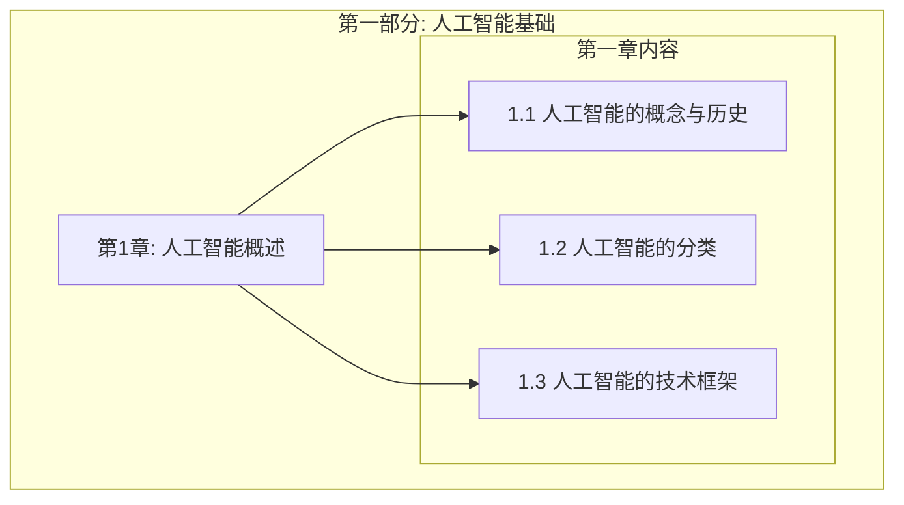

#### 第2章: 机器学习基础

##### 2.1 数据准备

数据准备是机器学习过程的重要环节，它直接影响到模型的质量和性能。数据准备包括数据采集、数据清洗和特征工程。

###### 2.1.1 数据采集

数据采集是指从各种来源获取数据的过程。这些来源可以是公开的数据集、企业内部数据、第三方数据服务或通过爬虫获取的网络数据。

- **公开数据集**：如Kaggle、UCI机器学习库等。
- **企业内部数据**：企业运营过程中产生的数据，如销售数据、客户数据等。
- **第三方数据服务**：如DataXu、Infochimps等。
- **网络数据**：通过爬虫从互联网上获取的数据。

数据采集：

$$
\text{数据采集}:\quad \text{公开数据集} \quad \text{企业内部数据} \quad \text{第三方数据服务} \quad \text{网络数据}
$$

###### 2.1.2 数据清洗

数据清洗是指对原始数据进行预处理，去除错误、缺失、重复和无用的数据，以提高数据的质量。

- **错误处理**：识别和修正数据中的错误。
- **缺失处理**：填充缺失值或删除缺失数据。
- **重复处理**：识别和删除重复数据。
- **异常处理**：识别和处理异常值。

数据清洗：

$$
\text{数据清洗}:\quad \text{错误处理} \quad \text{缺失处理} \quad \text{重复处理} \quad \text{异常处理}
$$

###### 2.1.3 特征工程

特征工程是指通过选择、构造和变换原始数据，提取出对模型有用的特征，以提高模型的性能。

- **特征选择**：从原始数据中选择最重要的特征。
- **特征构造**：通过组合原始特征或计算新的特征，提高模型的性能。
- **特征标准化**：将不同量纲的特征转换为相同量纲，以消除量纲影响。

特征工程：

$$
\text{特征工程}:\quad \text{特征选择} \quad \text{特征构造} \quad \text{特征标准化}
$$

##### 2.2 机器学习算法

机器学习算法可以分为监督学习、无监督学习、半监督学习和强化学习。

###### 2.2.1 监督学习

监督学习是机器学习中的一种方法，其目标是通过已知的输入和输出数据，学习出一个能够预测新输入的输出。

- **线性回归**：通过拟合一条直线来预测输出。
- **逻辑回归**：通过拟合一个逻辑函数来预测输出。
- **支持向量机（SVM）**：通过找到最佳分割超平面来分类数据。

监督学习算法：

$$
\text{监督学习算法}:\quad \text{线性回归} \quad \text{逻辑回归} \quad \text{支持向量机（SVM）}
$$

###### 2.2.2 无监督学习

无监督学习是机器学习中的另一种方法，其目标是从未标记的数据中学习出数据分布或结构。

- **聚类**：将相似的数据点分组到同一簇中。
- **降维**：通过降低数据的维度，简化数据分析。
- **生成模型**：通过学习数据的生成过程，生成新的数据。

无监督学习算法：

$$
\text{无监督学习算法}:\quad \text{聚类} \quad \text{降维} \quad \text{生成模型}
$$

###### 2.2.3 半监督学习和强化学习

半监督学习和强化学习是介于监督学习和无监督学习之间的方法。

- **半监督学习**：使用少量标记数据和大量未标记数据来训练模型。
- **强化学习**：通过试错和反馈来学习如何在特定环境中做出最佳决策。

半监督学习和强化学习算法：

$$
\text{半监督学习和强化学习算法}:\quad \text{半监督学习} \quad \text{强化学习}
$$

##### 2.3 评估与优化

评估与优化是机器学习模型的重要环节，通过评估模型性能，调整模型参数，以提高模型的性能。

###### 2.3.1 模型评估指标

常用的模型评估指标包括准确率、召回率、F1分数和ROC曲线。

- **准确率**：正确预测的样本数占总样本数的比例。
- **召回率**：正确预测的正样本数占总正样本数的比例。
- **F1分数**：准确率和召回率的调和平均值。
- **ROC曲线**：表示分类器性能的曲线。

模型评估指标：

$$
\text{模型评估指标}:\quad \text{准确率} \quad \text{召回率} \quad \text{F1分数} \quad \text{ROC曲线}
$$

###### 2.3.2 超参数调优

超参数是模型中需要手动设置的参数，如学习率、正则化参数等。超参数调优是通过调整超参数，提高模型性能的过程。

- **网格搜索**：通过遍历一组预定义的超参数值，找到最优超参数组合。
- **贝叶斯优化**：基于贝叶斯统计模型，自动搜索最优超参数组合。

超参数调优：

$$
\text{超参数调优}:\quad \text{网格搜索} \quad \text{贝叶斯优化}
$$

###### 2.3.3 模型集成与优化

模型集成是将多个模型组合起来，提高预测性能的方法。

- **投票法**：将多个模型的结果进行投票，选择多数模型预测的结果。
- **堆叠法**：将多个模型作为基础模型，构建一个新的模型。

模型集成与优化：

$$
\text{模型集成与优化}:\quad \text{投票法} \quad \text{堆叠法}
$$

### 第二部分：机器学习基础总结

通过了解机器学习的基础知识，创业者可以更好地理解和应用机器学习技术，为创业项目提供强大的技术支持。在接下来的章节中，我们将深入探讨深度学习框架，以及它们在具体应用中的实践案例。

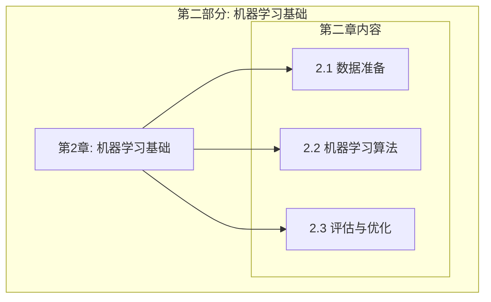

#### 第3章: 深度学习框架

##### 3.1 TensorFlow基础

TensorFlow是由Google开发的一款开源深度学习框架，它提供了丰富的API和工具，使得深度学习模型的构建、训练和部署变得更加便捷。

###### 3.1.1 安装与配置

安装TensorFlow前，需要确保安装了Python和Numpy等依赖库。以下是安装TensorFlow的基本步骤：

1. 安装Python：确保Python环境已正确安装。
2. 安装Numpy：运行命令`pip install numpy`。
3. 安装TensorFlow：运行命令`pip install tensorflow`。

安装步骤：

```
pip install python
pip install numpy
pip install tensorflow
```

###### 3.1.2 神经网络构建

在TensorFlow中，神经网络可以通过构建计算图（compute graph）来实现。以下是一个简单的神经网络构建示例：

```python
import tensorflow as tf

# 定义输入层
inputs = tf.keras.layers.Input(shape=(784,))

# 添加隐藏层
x = tf.keras.layers.Dense(512, activation='relu')(inputs)
x = tf.keras.layers.Dense(256, activation='relu')(x)

# 添加输出层
outputs = tf.keras.layers.Dense(10, activation='softmax')(x)

# 构建模型
model = tf.keras.Model(inputs=inputs, outputs=outputs)

# 打印模型结构
model.summary()
```

代码示例：

```python
import tensorflow as tf

inputs = tf.keras.layers.Input(shape=(784,))
x = tf.keras.layers.Dense(512, activation='relu')(inputs)
x = tf.keras.layers.Dense(256, activation='relu')(x)
outputs = tf.keras.layers.Dense(10, activation='softmax')(x)
model = tf.keras.Model(inputs=inputs, outputs=outputs)
model.summary()
```

###### 3.1.3 数据流图操作

TensorFlow的核心是数据流图（data flow graph），它描述了计算操作的执行顺序和依赖关系。以下是一个简单的数据流图示例：

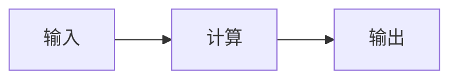

数据流图示例：


##### 3.2 PyTorch基础

PyTorch是由Facebook开发的一款开源深度学习框架，它以动态计算图（dynamic computation graph）为特点，使得模型构建和调试更加灵活。

###### 3.2.1 安装与配置

安装PyTorch前，需要确保安装了Python和Numpy等依赖库。以下是安装PyTorch的基本步骤：

1. 安装Python：确保Python环境已正确安装。
2. 安装Numpy：运行命令`pip install numpy`。
3. 安装PyTorch：运行命令`pip install torch`。

安装步骤：

```
pip install python
pip install numpy
pip install torch
```

###### 3.2.2 神经网络构建

在PyTorch中，神经网络可以通过定义前向传播（forward propagation）和反向传播（backward propagation）来实现。以下是一个简单的神经网络构建示例：

```python
import torch
import torch.nn as nn

# 定义神经网络结构
class NeuralNetwork(nn.Module):
    def __init__(self):
        super(NeuralNetwork, self).__init__()
        self.fc1 = nn.Linear(784, 512)
        self.fc2 = nn.Linear(512, 256)
        self.fc3 = nn.Linear(256, 10)

    def forward(self, x):
        x = torch.relu(self.fc1(x))
        x = torch.relu(self.fc2(x))
        x = self.fc3(x)
        return x

# 创建神经网络实例
model = NeuralNetwork()

# 打印模型结构
print(model)
```

代码示例：

```python
import torch
import torch.nn as nn

class NeuralNetwork(nn.Module):
    def __init__(self):
        super(NeuralNetwork, self).__init__()
        self.fc1 = nn.Linear(784, 512)
        self.fc2 = nn.Linear(512, 256)
        self.fc3 = nn.Linear(256, 10)

    def forward(self, x):
        x = torch.relu(self.fc1(x))
        x = torch.relu(self.fc2(x))
        x = self.fc3(x)
        return x

model = NeuralNetwork()
print(model)
```

###### 3.2.3 自动微分机制

PyTorch的核心特点是动态计算图和自动微分机制。自动微分机制可以自动计算梯度，使得优化过程更加高效。以下是一个简单的自动微分示例：

```python
import torch

# 创建随机数据
x = torch.randn(1, 784)
y = torch.randn(1, 10)

# 定义损失函数
criterion = nn.CrossEntropyLoss()

# 前向传播
outputs = model(x)

# 计算损失
loss = criterion(outputs, y)

# 反向传播
loss.backward()

# 更新权重
with torch.no_grad():
    model.fc1.weight -= 0.01 * model.fc1.weight.grad

# 打印梯度
print(model.fc1.weight.grad)
```

代码示例：

```python
import torch

x = torch.randn(1, 784)
y = torch.randn(1, 10)
criterion = nn.CrossEntropyLoss()
outputs = model(x)
loss = criterion(outputs, y)
loss.backward()
with torch.no_grad():
    model.fc1.weight -= 0.01 * model.fc1.weight.grad
print(model.fc1.weight.grad)
```

### 第3章总结

深度学习框架如TensorFlow和PyTorch为创业者提供了强大的工具，使得深度学习模型的构建、训练和部署变得更加便捷。通过本章的学习，创业者可以掌握深度学习框架的基本原理和应用方法，为创业项目提供技术支持。在接下来的章节中，我们将探讨深度学习在图像识别、自然语言处理和强化学习等领域的具体应用。

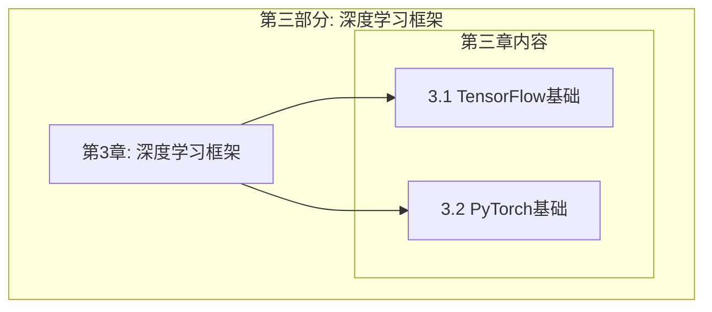

#### 第4章：人工智能市场分析

##### 4.1 人工智能行业趋势

人工智能（AI）作为21世纪最具变革性的技术之一，正在全球范围内快速发展。以下是当前人工智能行业的几个主要趋势：

###### 4.1.1 行业规模与发展预测

根据市场研究机构的预测，全球人工智能市场规模预计将在未来几年内持续增长。以下是几个关键数据：

- **全球人工智能市场规模**：预计将从2020年的369亿美元增长到2025年的1908亿美元，年均复合增长率（CAGR）达到29.7%。
- **中国市场**：预计到2025年，中国人工智能市场规模将达到1300亿元人民币。

行业规模与发展预测：

$$
\text{全球人工智能市场规模}: \quad \$369 \text{亿美元（2020年）} \rightarrow \$1908 \text{亿美元（2025年）}
$$

$$
\text{中国市场规模}: \quad ¥1300 \text{亿元（2025年）}
$$

###### 4.1.2 投资者关注点

投资者在人工智能领域的投资关注点主要集中在以下几个方面：

- **技术创新**：投资者关注具有创新性的技术，如深度学习、自然语言处理、计算机视觉等。
- **应用场景**：投资者关注技术应用的具体场景，如医疗、金融、交通、零售等。
- **市场前景**：投资者关注项目的市场前景和商业潜力。

投资者关注点：

$$
\text{投资者关注点}: \quad \text{技术创新} \quad \text{应用场景} \quad \text{市场前景}
$$

###### 4.1.3 竞争态势分析

人工智能领域的竞争态势日益激烈，以下是当前的主要竞争格局：

- **国际竞争**：美国、中国、欧盟等地区在人工智能领域处于领先地位，各大科技公司如Google、Facebook、Microsoft等在全球范围内展开竞争。
- **国内竞争**：国内人工智能企业如百度、阿里、腾讯、华为等在各个细分领域展开竞争。
- **初创企业**：初创企业在技术创新和快速迭代方面具有优势，但面临资金、人才和市场的挑战。

竞争态势分析：

$$
\text{竞争态势分析}: \quad \text{国际竞争} \quad \text{国内竞争} \quad \text{初创企业}
$$

##### 4.2 创业者面临的挑战

在人工智能领域创业，创业者需要面对一系列挑战：

###### 4.2.1 技术创新风险

技术创新风险是指创业者可能面临的技术突破困难、技术落后或技术无法实现预期效果的风险。以下是几个具体方面：

- **技术突破难度**：人工智能技术尤其是深度学习、自然语言处理等领域的突破难度较高，需要大量科研投入和时间。
- **技术更新速度**：人工智能领域更新速度极快，创业者需要不断跟进最新技术，否则可能导致技术落后。
- **技术实现难度**：部分人工智能技术，如强人工智能，目前尚未实现，创业者需要面对技术实现的挑战。

技术创新风险：

$$
\text{技术创新风险}: \quad \text{技术突破难度} \quad \text{技术更新速度} \quad \text{技术实现难度}
$$

###### 4.2.2 法律法规与伦理问题

随着人工智能技术的发展，法律法规和伦理问题也日益凸显。以下是几个关键方面：

- **数据隐私**：人工智能依赖于大量数据，如何保护用户隐私成为关键问题。
- **算法透明性**：算法决策的透明性受到质疑，如何保证算法的公平、公正成为挑战。
- **人工智能武器化**：人工智能武器化可能引发国际安全和道德问题。

法律法规与伦理问题：

$$
\text{法律法规与伦理问题}: \quad \text{数据隐私} \quad \text{算法透明性} \quad \text{人工智能武器化}
$$

###### 4.2.3 市场推广与竞争

在人工智能领域，创业者需要面对激烈的市场竞争和推广挑战：

- **市场竞争**：人工智能领域竞争激烈，创业者需要具备强大的技术优势和创新能力，以在市场中脱颖而出。
- **市场推广**：人工智能产品和服务通常具有较高的技术门槛，如何向潜在客户推广成为挑战。
- **用户接受度**：用户对人工智能技术的接受度和信任度可能影响产品的市场推广效果。

市场推广与竞争：

$$
\text{市场推广与竞争}: \quad \text{市场竞争} \quad \text{市场推广} \quad \text{用户接受度}
$$

##### 4.3 创业机会识别

在人工智能领域，创业者可以通过以下方式识别和把握创业机会：

###### 4.3.1 创业热点领域

以下是一些当前人工智能领域的热点领域：

- **医疗健康**：利用人工智能进行疾病诊断、药物研发、个性化治疗等。
- **金融科技**：利用人工智能进行风险管理、智能投顾、信用评估等。
- **智能制造**：利用人工智能进行生产优化、质量检测、设备维护等。
- **自动驾驶**：利用人工智能实现无人驾驶、智能交通管理等。

创业热点领域：

$$
\text{创业热点领域}: \quad \text{医疗健康} \quad \text{金融科技} \quad \text{智能制造} \quad \text{自动驾驶}
$$

###### 4.3.2 市场需求分析

创业者需要深入了解市场需求，以下是一些关键方面：

- **用户需求**：用户对人工智能技术的实际需求，如提高效率、降低成本、提供个性化服务等。
- **行业需求**：不同行业对人工智能技术的应用需求，如医疗、金融、制造等。
- **政策支持**：政府政策对人工智能产业的支持和引导，如税收优惠、研发资助等。

市场需求分析：

$$
\text{市场需求分析}: \quad \text{用户需求} \quad \text{行业需求} \quad \text{政策支持}
$$

###### 4.3.3 创新点与差异化策略

创业者需要寻找创新点和差异化策略，以下是一些建议：

- **技术创新**：在算法、模型、架构等方面进行创新，提高技术竞争力。
- **应用创新**：在应用场景和业务模式上进行创新，满足特定市场需求。
- **用户体验**：关注用户体验，提供简洁、高效、易用的产品和服务。

创新点与差异化策略：

$$
\text{创新点与差异化策略}: \quad \text{技术创新} \quad \text{应用创新} \quad \text{用户体验}
$$

### 第4章总结

通过对人工智能市场趋势、创业者面临的挑战和创业机会的深入分析，创业者可以更好地把握人工智能领域的机遇，制定有效的创业策略。在接下来的章节中，我们将探讨人工智能商业模式的设计、团队建设和项目管理等方面的内容。

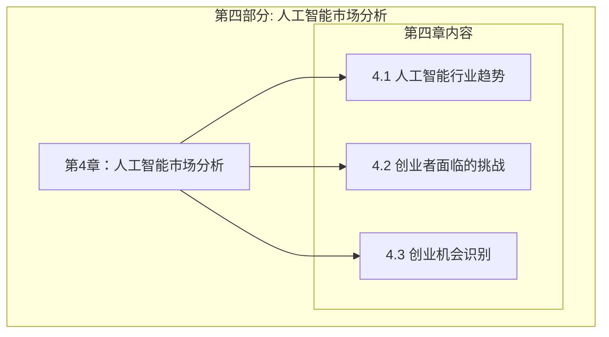

#### 第5章：人工智能商业模式

##### 5.1 商业模式设计原则

设计人工智能商业模式时，需要遵循以下几个原则：

###### 5.1.1 客户价值主张

客户价值主张是商业模式的核心，明确了企业为顾客提供的独特价值。以下是一些建议：

- **明确价值**：清晰地描述产品或服务如何满足客户需求，提高效率或降低成本。
- **差异化**：通过技术创新或应用场景创新，提供与众不同的价值。
- **可持续性**：确保客户价值主张具有长期可持续性，能够持续为客户创造价值。

客户价值主张：

$$
\text{客户价值主张}: \quad \text{明确价值} \quad \text{差异化} \quad \text{可持续性}
$$

###### 5.1.2 收入模式

设计合理的收入模式是商业模式的关键。以下是一些常见的收入模式：

- **一次性销售**：客户一次性购买产品或服务。
- **订阅模式**：客户定期支付订阅费用，享受持续服务。
- **服务费**：客户根据使用量或服务质量支付费用。
- **广告收入**：通过展示广告获取收入。

收入模式：

$$
\text{收入模式}: \quad \text{一次性销售} \quad \text{订阅模式} \quad \text{服务费} \quad \text{广告收入}
$$

###### 5.1.3 成本结构

了解成本结构有助于制定合理的价格策略和利润预期。以下是一些建议：

- **固定成本**：与生产规模无关的成本，如研发、租金、员工工资等。
- **可变成本**：与生产规模成正比的成本，如原材料、能耗、运输等。
- **成本优化**：通过技术创新或流程优化，降低成本。

成本结构：

$$
\text{成本结构}: \quad \text{固定成本} \quad \text{可变成本} \quad \text{成本优化}
$$

##### 5.2 案例分析

以下是对几个成功的人工智能商业模式的案例分析：

###### 5.2.1 创业公司A的案例

**公司简介**：创业公司A专注于利用人工智能技术进行医学图像分析，帮助医生更准确地诊断疾病。

**客户价值主张**：通过提供准确、高效的医学图像分析工具，提高医生的诊断准确性和工作效率。

**收入模式**：公司采用订阅模式，客户按年支付订阅费用。

**成本结构**：公司的固定成本包括研发、服务器租赁和员工工资等，可变成本包括数据采购和图像处理等。

**案例分析**：创业公司A通过技术创新和优秀的市场推广，迅速获得了客户的认可，实现了收入的快速增长。

###### 5.2.2 创业公司B的案例

**公司简介**：创业公司B致力于开发智能客服系统，为企业提供高效的客户服务解决方案。

**客户价值主张**：通过提供智能、高效的客服系统，帮助企业降低客服成本，提高客户满意度。

**收入模式**：公司采用服务费模式，根据客户的客服需求和使用量收取费用。

**成本结构**：公司的固定成本包括研发、服务器租赁和客户支持等，可变成本包括客户数据存储和处理等。

**案例分析**：创业公司B通过深入了解客户需求，不断创新和优化产品，获得了广泛的客户认可，实现了稳定的发展。

###### 5.2.3 创业公司C的案例

**公司简介**：创业公司C专注于自动驾驶技术的研发和应用，致力于打造智能交通解决方案。

**客户价值主张**：通过提供安全、高效的自动驾驶技术，提高交通效率和减少交通事故。

**收入模式**：公司采用一次性销售和订阅模式，客户可以购买整套自动驾驶系统，也可以按年订阅服务。

**成本结构**：公司的固定成本包括研发、车辆采购和测试等，可变成本包括道路测试和数据采集等。

**案例分析**：创业公司C通过与多家汽车制造商和交通管理部门合作，成功推出了自动驾驶解决方案，获得了市场的广泛认可。

##### 5.3 商业模式创新

在人工智能领域，商业模式创新是一个持续的过程。以下是一些常见的商业模式创新方法：

###### 5.3.1 平台化商业模式

平台化商业模式是指通过构建生态系统，连接供需双方，实现资源共享和互利共赢。

- **平台优势**：提高效率、降低成本、扩大市场份额。
- **案例**：如Uber、Airbnb等，通过构建平台，连接司机和乘客、房东和房客。

###### 5.3.2 集成式商业模式

集成式商业模式是指将多种技术和服务整合到一个平台，为客户提供全方位的解决方案。

- **集成优势**：提高服务质量、降低客户成本、增强客户黏性。
- **案例**：如谷歌的G Suite，将办公软件、云存储和通信工具整合到一个平台。

###### 5.3.3 社区驱动的商业模式

社区驱动的商业模式是指通过建立用户社区，鼓励用户参与产品开发、测试和推广，实现产品的持续迭代和优化。

- **社区优势**：提高用户参与度、增加产品创新性、降低推广成本。
- **案例**：如Linux操作系统，通过开源社区，吸引了大量开发者参与。

##### 5.4 商业模式设计的注意事项

在商业模式设计过程中，创业者需要关注以下几个问题：

- **市场需求**：确保商业模式能够满足市场需求，为客户提供真正的价值。
- **竞争环境**：分析竞争对手的商业模式，找到自身的竞争优势和差异化策略。
- **可持续性**：确保商业模式具有长期可持续性，能够持续为客户创造价值。

### 第5章总结

通过设计合理的商业模式，人工智能创业者可以更好地实现商业价值，推动企业持续发展。在接下来的章节中，我们将探讨创业团队建设与管理、项目管理、人力资源策略和创业融资与投资等方面的内容。

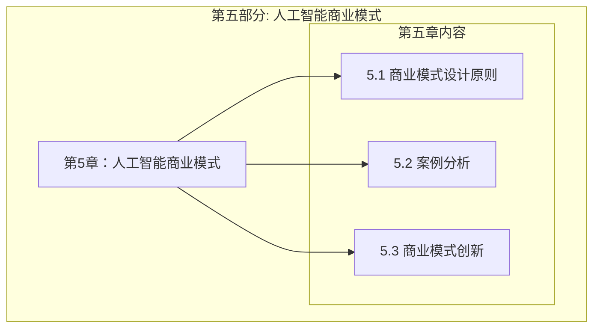

#### 第6章：创业团队建设与管理

##### 6.1 团队组建策略

构建一支高效的创业团队是实现创业目标的关键。以下是团队组建的几个关键策略：

###### 6.1.1 核心团队成员选择

核心团队成员的选择直接影响团队的整体能力和公司的发展方向。以下是几个关键点：

- **技能匹配**：根据项目需求，选择具备相应技能和经验的团队成员。
- **多元化**：多元化团队可以带来不同的视角和思路，有助于提高创新能力和解决问题的能力。
- **互补性**：团队成员之间应具备互补性，能够互相支持和补充。

核心团队成员选择：

$$
\text{核心团队成员选择}: \quad \text{技能匹配} \quad \text{多元化} \quad \text{互补性}
$$

###### 6.1.2 职责分配与协作

明确团队成员的职责和任务，确保团队成员之间能够高效协作。以下是几个关键点：

- **明确职责**：为每个团队成员分配明确的职责和任务，确保每个人都知道自己的工作内容和目标。
- **协作机制**：建立有效的协作机制，如定期的团队会议、信息共享平台等，促进团队成员之间的沟通和协作。
- **激励机制**：设立激励机制，鼓励团队成员积极协作，共同实现团队目标。

职责分配与协作：

$$
\text{职责分配与协作}: \quad \text{明确职责} \quad \text{协作机制} \quad \text{激励机制}
$$

###### 6.1.3 团队文化建设

团队文化是团队凝聚力和协作精神的重要基础。以下是几个关键点：

- **共同目标**：明确团队的目标和愿景，使团队成员对团队的目标有清晰的认识和认同。
- **价值观**：建立团队的共同价值观，如创新、协作、客户至上等，作为团队成员的行为准则。
- **团队氛围**：营造积极、开放和包容的团队氛围，鼓励团队成员分享想法和意见，促进团队的沟通和协作。

团队文化建设：

$$
\text{团队文化建设}: \quad \text{共同目标} \quad \text{价值观} \quad \text{团队氛围}
$$

##### 6.2 项目管理

项目管理是确保创业项目顺利进行和达成目标的关键。以下是几个关键点：

###### 6.2.1 项目计划与进度管理

项目计划是项目管理的基础，需要明确项目目标、任务和进度安排。以下是几个关键点：

- **项目目标**：明确项目的最终目标，确保团队成员对项目的目标有清晰的认识。
- **任务分解**：将项目任务分解为具体的子任务，为每个子任务分配资源和时间。
- **进度监控**：定期监控项目进度，及时发现和解决问题，确保项目按计划进行。

项目计划与进度管理：

$$
\text{项目计划与进度管理}: \quad \text{项目目标} \quad \text{任务分解} \quad \text{进度监控}
$$

###### 6.2.2 风险管理

风险管理是项目管理中的重要环节，需要识别和应对项目中的各种风险。以下是几个关键点：

- **风险识别**：识别项目中的潜在风险，如技术风险、市场风险、人力资源风险等。
- **风险评估**：评估风险的可能性和影响，确定风险的优先级。
- **风险应对**：制定风险应对策略，如风险规避、风险转移、风险缓解等。

风险管理：

$$
\text{风险管理}: \quad \text{风险识别} \quad \text{风险评估} \quad \text{风险应对}
$$

###### 6.2.3 项目评估与优化

项目评估与优化是确保项目质量和效果的重要环节。以下是几个关键点：

- **项目评估**：对项目完成情况进行评估，包括项目目标达成情况、任务完成质量等。
- **问题分析**：分析项目过程中出现的问题，找出原因和改进措施。
- **优化改进**：根据项目评估和问题分析，对项目进行优化和改进，提高项目质量和效果。

项目评估与优化：

$$
\text{项目评估与优化}: \quad \text{项目评估} \quad \text{问题分析} \quad \text{优化改进}
$$

##### 6.3 人力资源策略

人力资源策略是确保创业团队高效运作和持续发展的重要保障。以下是几个关键点：

###### 6.3.1 招聘与培训

招聘和培训是人力资源策略的核心。以下是几个关键点：

- **招聘策略**：制定有效的招聘策略，吸引优秀人才加入团队。
- **招聘渠道**：利用多种招聘渠道，如招聘网站、社交媒体、专业人才市场等，拓宽招聘范围。
- **培训体系**：建立系统的培训体系，提高团队成员的技能和知识水平。

招聘与培训：

$$
\text{招聘与培训}: \quad \text{招聘策略} \quad \text{招聘渠道} \quad \text{培训体系}
$$

###### 6.3.2 绩效评估与激励

绩效评估和激励是激发团队成员积极性和创造力的重要手段。以下是几个关键点：

- **绩效评估**：建立科学的绩效评估体系，客观、公正地评估团队成员的工作表现。
- **激励机制**：设立激励机制，如奖金、股权激励等，激发团队成员的工作热情和积极性。

绩效评估与激励：

$$
\text{绩效评估与激励}: \quad \text{绩效评估} \quad \text{激励机制}
$$

###### 6.3.3 薪酬与福利

薪酬与福利是吸引和留住人才的关键因素。以下是几个关键点：

- **薪酬体系**：建立公平、合理的薪酬体系，确保团队成员的薪酬与其工作贡献相匹配。
- **福利待遇**：提供丰富的福利待遇，如健康保险、带薪休假、培训机会等，提高员工满意度和忠诚度。

薪酬与福利：

$$
\text{薪酬与福利}: \quad \text{薪酬体系} \quad \text{福利待遇}
$$

### 第6章总结

通过有效的团队建设与管理策略，创业者可以构建一支高效的团队，实现创业项目的成功。在接下来的章节中，我们将探讨创业融资与投资策略，以及创业过程中的风险管理。

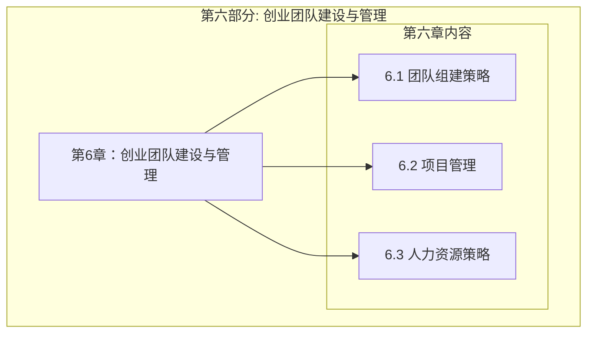

#### 第7章：创业融资与投资

##### 7.1 融资策略

创业企业在成长过程中，需要不断获取资金支持以维持运营和发展。以下是几种常见的融资策略：

###### 7.1.1 股权融资

股权融资是指创业企业通过出让股份来获得资金。以下是一些关键点：

- **投资者类型**：包括风险投资、天使投资、私募股权等。
- **融资流程**：包括项目筛选、商业计划书撰写、谈判和签约等。
- **股权分配**：合理分配股权，确保创始人和投资者的利益。

股权融资：

$$
\text{股权融资}: \quad \text{投资者类型} \quad \text{融资流程} \quad \text{股权分配}
$$

###### 7.1.2 债务融资

债务融资是指创业企业通过借款来获得资金。以下是一些关键点：

- **借款来源**：包括银行贷款、发行债券、信用贷款等。
- **还款方式**：包括定期还款、一次性还款等。
- **风险与收益**：债务融资具有固定的还款压力，但成本相对较低。

债务融资：

$$
\text{债务融资}: \quad \text{借款来源} \quad \text{还款方式} \quad \text{风险与收益}
$$

###### 7.1.3 政府补助与奖励

政府补助与奖励是创业企业获取资金的一种重要途径。以下是一些关键点：

- **补助类型**：包括创新基金、科技补贴、税收优惠等。
- **申请条件**：需要符合政府相关政策和规定。
- **申请流程**：包括项目申报、审核和发放等。

政府补助与奖励：

$$
\text{政府补助与奖励}: \quad \text{补助类型} \quad \text{申请条件} \quad \text{申请流程}
$$

##### 7.2 投资者关系

投资者关系是创业企业成功融资的关键。以下是几个关键点：

###### 7.2.1 投资者筛选与定位

投资者筛选与定位是确保找到合适投资者的关键。以下是一些关键点：

- **投资者类型**：根据企业需求和阶段，选择合适的投资者类型。
- **投资者需求**：了解投资者对行业、技术和市场的偏好。

投资者筛选与定位：

$$
\text{投资者筛选与定位}: \quad \text{投资者类型} \quad \text{投资者需求}
$$

###### 7.2.2 投资谈判与条款

投资谈判与条款是确保融资成功的重要环节。以下是一些关键点：

- **估值**：合理确定企业估值，确保双方利益。
- **投资条款**：包括股权比例、投资额度、投资周期等。
- **条款谈判**：通过谈判争取对企业有利的条款。

投资谈判与条款：

$$
\text{投资谈判与条款}: \quad \text{估值} \quad \text{投资条款} \quad \text{条款谈判}
$$

###### 7.2.3 投后管理与退出策略

投后管理与退出策略是确保投资者利益和企业持续发展的关键。以下是一些关键点：

- **投后管理**：关注投资项目的进展和风险，提供必要的支持和建议。
- **退出策略**：包括上市、并购、回购等，根据企业实际情况和市场需求选择合适的退出方式。

投后管理与退出策略：

$$
\text{投后管理与退出策略}: \quad \text{投后管理} \quad \text{退出策略}
$$

##### 7.3 资金运用与财务管理

合理的资金运用和财务管理是创业企业成功的关键。以下是几个关键点：

###### 7.3.1 预算编制与控制

预算编制与控制是确保企业资金合理使用的关键。以下是一些关键点：

- **预算编制**：根据企业发展规划和实际需求，编制合理的预算。
- **预算控制**：通过监控预算执行情况，及时发现和解决预算偏差。

预算编制与控制：

$$
\text{预算编制与控制}: \quad \text{预算编制} \quad \text{预算控制}
$$

###### 7.3.2 成本分析与控制

成本分析与管理是确保企业盈利能力的关键。以下是一些关键点：

- **成本分析**：对企业的各项成本进行分析，找出成本控制的关键点。
- **成本控制**：通过合理的成本控制措施，降低成本，提高企业盈利能力。

成本分析与控制：

$$
\text{成本分析与控制}: \quad \text{成本分析} \quad \text{成本控制}
$$

###### 7.3.3 现金流管理

现金流管理是确保企业资金流转顺畅的关键。以下是一些关键点：

- **现金流预测**：根据企业业务发展和资金需求，预测现金流。
- **现金流监控**：通过定期监控现金流，确保企业资金流转顺畅。

现金流管理：

$$
\text{现金流管理}: \quad \text{现金流预测} \quad \text{现金流监控}
$$

### 第7章总结

通过合理的融资策略和投资者关系管理，创业企业可以获取充足的资金支持，推动企业持续发展。在接下来的章节中，我们将探讨成功的创业案例，分析其创业过程中的成功要素。

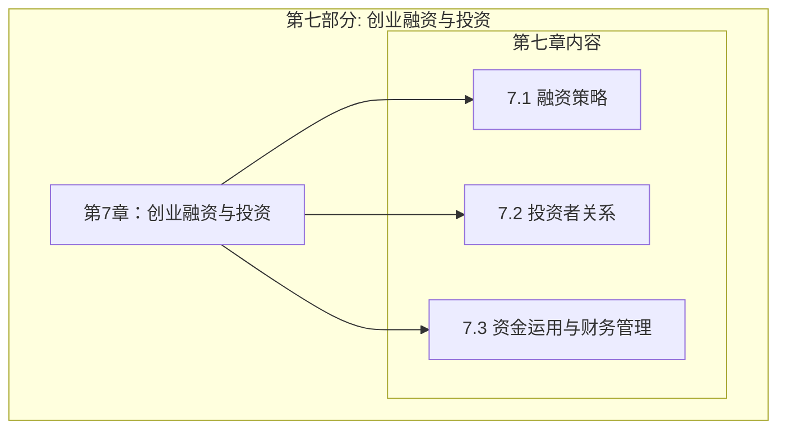

#### 第8章：成功的人工智能创业案例

##### 8.1 案例背景

**公司名称**：DeepMind Technologies Ltd.

**创立时间**：2010年

**创始人**：戴密斯·哈萨比斯（Demis Hassabis）、谢恩·莱格利（Shane Legg）和大卫·席尔伯姆（David Silver）

**总部地点**：英国伦敦

**业务领域**：人工智能算法研究、开发和商业化

DeepMind成立于2010年，由三位人工智能专家戴密斯·哈萨比斯、谢恩·莱格利和大卫·席尔伯姆共同创立。公司总部位于英国伦敦，是一家专注于人工智能算法研究、开发和商业化的科技公司。DeepMind的目标是通过创新的人工智能技术，解决复杂的问题，提升人类的生活质量。

##### 8.2 创业过程

###### 8.2.1 产品开发与迭代

DeepMind的创业过程始于对人工智能算法的研究。公司在初期专注于强化学习领域的研究，开发了多种先进的算法，如深度Q网络（DQN）和策略梯度（PG）等。这些算法在多个领域取得了显著的成果，包括电子游戏、围棋和国际象棋等。

随着技术的不断成熟，DeepMind开始将研究成果转化为商业产品。2012年，公司推出了DeepMind Lab，一款基于虚拟环境的人工智能研究工具。2016年，DeepMind发布了AlphaGo，一款基于深度强化学习算法的围棋程序，击败了世界围棋冠军李世石。AlphaGo的成功引发了全球对人工智能的关注，进一步推动了DeepMind的商业化进程。

在产品开发过程中，DeepMind注重持续迭代和优化。公司不断改进算法，提高程序的性能和稳定性，以满足客户的需求。此外，DeepMind还积极与其他企业合作，将人工智能技术应用于实际场景，如医疗健康、能源管理和智能制造等。

###### 8.2.2 市场推广与销售策略

DeepMind的市场推广策略主要包括以下几个方面：

- **技术创新**：通过发布领先的科研成果，吸引行业关注，提升品牌影响力。
- **合作伙伴关系**：与全球知名企业建立合作关系，共同开发人工智能解决方案。
- **客户体验**：提供免费试用和咨询服务，让客户亲身体验产品价值。

DeepMind在市场推广过程中，注重与客户的沟通和互动。公司通过定期举办技术研讨会、参加行业展会等方式，与客户建立紧密联系，了解客户需求，提供定制化解决方案。此外，DeepMind还通过社交媒体、博客和论坛等渠道，与客户分享技术成果和应用案例，增强客户对公司的信任和认可。

在销售策略上，DeepMind采用多元化销售模式，包括直销、分销和合作销售等。公司针对不同客户群体，提供个性化的销售服务，确保产品能够满足客户需求。

###### 8.2.3 团队成长与管理

DeepMind的团队成长与管理策略主要包括以下几个方面：

- **人才招聘**：通过全球招聘，吸引顶尖的人工智能专家和研究人员加入团队。
- **培训与培养**：提供系统的培训和培养计划，提高员工的专业能力和创新能力。
- **激励机制**：设立激励机制，如股权激励和绩效奖金等，激发员工的积极性和创造力。

DeepMind重视团队文化建设，倡导开放、创新和协作的工作氛围。公司鼓励员工分享观点和经验，促进知识交流和创新。此外，DeepMind还注重员工福利，提供良好的工作环境和灵活的工作制度，提高员工的工作满意度和忠诚度。

##### 8.3 成功要素分析

DeepMind的成功可以归因于以下几个关键要素：

###### 8.3.1 技术创新

DeepMind凭借在人工智能领域的技术创新，不断推出领先的算法和产品。公司注重基础研究，不断推动人工智能技术的发展。这种技术创新优势使DeepMind在竞争激烈的市场中脱颖而出，赢得了广泛的认可和赞誉。

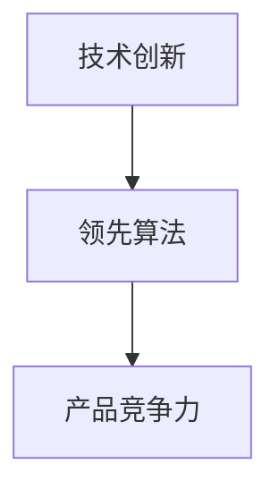

技术创新：

$$
\text{技术创新}: \quad \text{领先算法} \quad \text{产品竞争力}
$$

###### 8.3.2 商业模式

DeepMind的商业模式具有独特的优势。公司通过将先进的人工智能技术应用于实际场景，为客户提供定制化解决方案。这种商业模式不仅提高了客户的满意度，还为公司带来了稳定的收入来源。

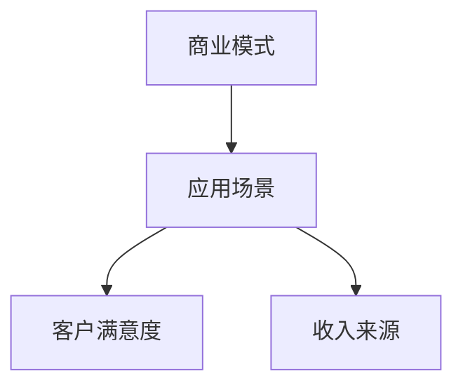

商业模式：

$$
\text{商业模式}: \quad \text{应用场景} \quad \text{客户满意度} \quad \text{收入来源}
$$

###### 8.3.3 团队建设

DeepMind的团队建设策略是成功的关键。公司通过全球招聘和培养计划，吸引顶尖人才加入。此外，公司注重团队文化建设，营造开放、创新和协作的工作氛围。这种团队优势使DeepMind在技术研究和产品开发方面始终保持领先地位。

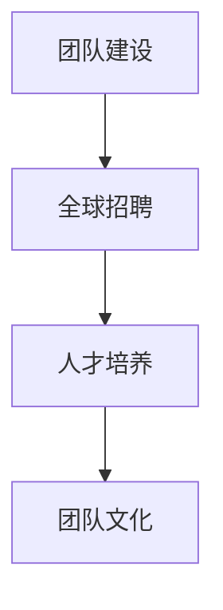

团队建设：

$$
\text{团队建设}: \quad \text{全球招聘} \quad \text{人才培养} \quad \text{团队文化}
$$

###### 8.3.4 融资策略

DeepMind在创业过程中，通过股权融资和政府补助等多种融资策略，获得了充足的资金支持。公司注重与投资者的关系管理，确保资金运用的有效性和透明度。这种融资策略为DeepMind的持续发展和创新提供了坚实的资金保障。

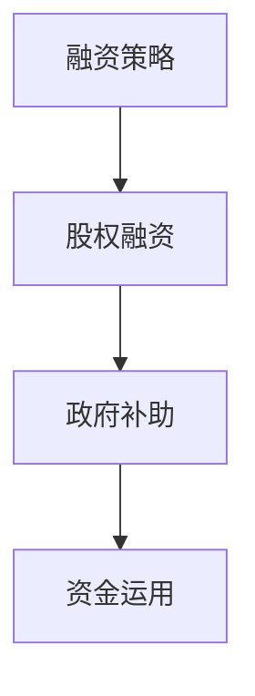

融资策略：

$$
\text{融资策略}: \quad \text{股权融资} \quad \text{政府补助} \quad \text{资金运用}
$$

##### 8.4 启示与借鉴

DeepMind的成功为其他人工智能创业者提供了宝贵的经验和启示。以下是几个值得借鉴的方面：

- **技术创新**：持续关注技术创新，推动人工智能技术的发展。
- **商业模式**：将先进的技术应用于实际场景，为客户提供定制化解决方案。
- **团队建设**：重视团队建设和文化建设，吸引和培养顶尖人才。
- **融资策略**：合理运用融资策略，确保资金运用的有效性和透明度。

通过借鉴DeepMind的成功经验，人工智能创业者可以更好地把握市场机遇，推动企业持续发展。

### 第8章总结

通过分析DeepMind的成功案例，我们可以看到技术创新、商业模式、团队建设和融资策略是人工智能创业成功的关键要素。在接下来的章节中，我们将探讨创新创业思维与方法，以及创业中的风险管理。

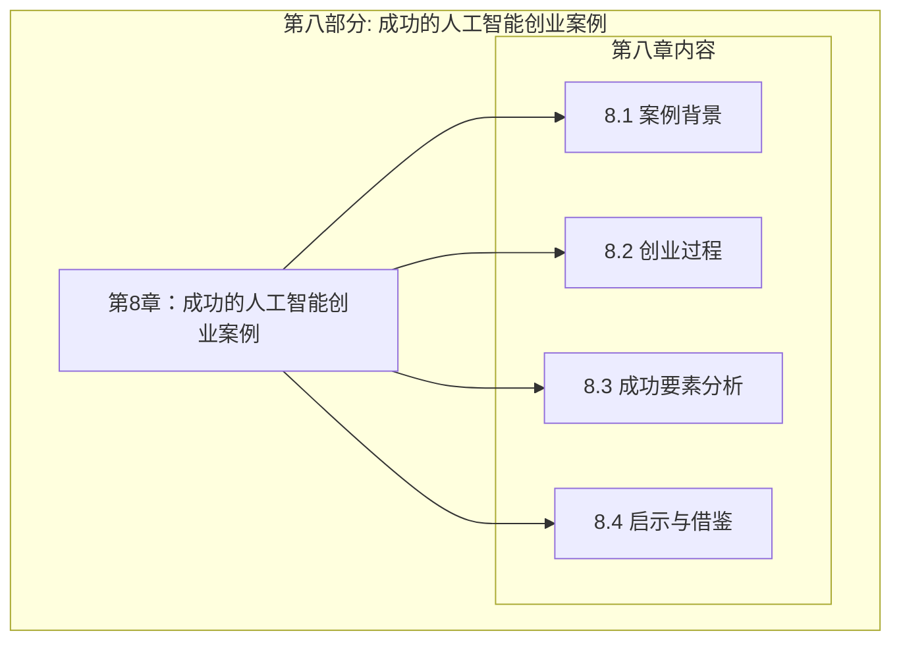

#### 第9章：创新创业思维与方法

##### 9.1 创新思维

创新思维是一种能够产生新想法、新方案和新成果的思维方式。它是推动创业成功的关键因素之一。

###### 9.1.1 概念定义与类型

创新思维是指运用创造性思维方法，对已有知识和信息进行整合、重构和创造，形成新的知识、方案或成果的过程。根据创新思维的不同表现形式，可以分为以下几种类型：

- **发散思维**：从不同的角度和维度出发，寻找多种可能的解决方案。
- **收敛思维**：在确定的方向上，通过分析和筛选，找到最优的解决方案。
- **联想思维**：通过不同事物之间的联系和类比，产生新的想法和方案。
- **逆向思维**：从相反的方向出发，思考问题的解决方案。

概念定义与类型：

$$
\text{创新思维}: \quad \text{发散思维} \quad \text{收敛思维} \quad \text{联想思维} \quad \text{逆向思维}
$$

###### 9.1.2 创新思维的培养

培养创新思维需要系统的训练和实践。以下是一些建议：

- **多读书**：广泛阅读各类书籍，增加知识储备，激发创造力。
- **多交流**：与他人进行深入的交流和讨论，开阔视野，发现新的思路。
- **多思考**：对遇到的问题进行深入思考，尝试从不同的角度和维度寻找解决方案。
- **多实践**：将创新思维应用到实际项目中，通过实践检验和优化。

创新思维的培养：

$$
\text{创新思维的培养}: \quad \text{多读书} \quad \text{多交流} \quad \text{多思考} \quad \text{多实践}
$$

###### 9.1.3 创新思维的应用场景

创新思维在创业过程中具有广泛的应用。以下是一些典型的应用场景：

- **产品创新**：通过创新思维，寻找新的产品功能、设计或商业模式，满足客户需求。
- **市场创新**：通过创新思维，发现新的市场机会，开拓新的市场领域。
- **管理创新**：通过创新思维，改进企业管理模式，提高组织效率和创新能力。
- **商业模式创新**：通过创新思维，设计新的商业模式，实现企业的持续增长和盈利。

创新思维的应用场景：

$$
\text{创新思维的应用场景}: \quad \text{产品创新} \quad \text{市场创新} \quad \text{管理创新} \quad \text{商业模式创新}
$$

##### 9.2 设计思维

设计思维是一种以用户需求为导向，通过迭代和迭代的方式，寻找解决方案的创新方法。它是近年来在创业和创新领域广泛应用的一种思维方式。

###### 9.2.1 设计思维概述

设计思维是一种以人为本的创新方法，强调以用户需求为中心，通过探索、定义、构思、原型设计和测试等步骤，寻找符合用户需求的解决方案。设计思维具有以下特点：

- **用户导向**：始终关注用户需求，以用户为中心进行设计。
- **迭代性**：通过不断迭代和改进，优化解决方案。
- **多元化**：鼓励多元化和跨学科合作，发挥集体智慧。
- **实验性**：通过实验和测试，验证和优化解决方案。

设计思维概述：

$$
\text{设计思维}: \quad \text{用户导向} \quad \text{迭代性} \quad \text{多元化} \quad \text{实验性}
$$

###### 9.2.2 设计思维流程

设计思维通常包括以下几个步骤：

1. **探索**：深入了解用户需求和市场环境，收集相关信息。
2. **定义**：明确项目目标和用户需求，形成明确的设计方向。
3. **构思**：通过头脑风暴和创意生成，提出多种可能的解决方案。
4. **原型设计**：构建原型，测试和验证解决方案的有效性和可行性。
5. **测试**：对原型进行用户测试，收集反馈，优化和改进解决方案。

设计思维流程：

$$
\text{设计思维流程}: \quad \text{探索} \quad \text{定义} \quad \text{构思} \quad \text{原型设计} \quad \text{测试}
$$

###### 9.2.3 设计思维案例分析

以下是一个设计思维案例：

**项目背景**：一家初创公司希望通过设计一款智能家居产品，满足用户对智能化的需求。

**设计思维应用**：

1. **探索**：团队通过访谈和观察，发现用户对智能家居的需求主要集中在便捷性、安全性和个性化定制方面。
2. **定义**：明确项目目标是设计一款功能丰富、操作简便、安全可靠的智能家居产品。
3. **构思**：团队通过头脑风暴，提出了多种可能的解决方案，如智能音响、智能摄像头、智能门锁等。
4. **原型设计**：团队构建了智能音响的原型，包括语音控制、音乐播放、信息查询等功能。
5. **测试**：团队邀请用户进行测试，收集了关于功能、操作和用户体验的反馈，并根据反馈进行了多次优化和改进。

设计思维案例分析：

$$
\text{设计思维案例分析}: \quad \text{探索} \quad \text{定义} \quad \text{构思} \quad \text{原型设计} \quad \text{测试}
$$

##### 9.3 创业方法论

创业方法论是指创业者在创业过程中遵循的一套方法和原则。它可以帮助创业者更好地应对创业过程中的各种挑战，实现创业目标。

###### 9.3.1 商业画布分析

商业画布（Business Model Canvas）是一种用于分析和设计商业模式的工具。它包括九个关键要素：客户段、价值主张、渠道、客户关系、收入来源、关键资源、关键活动、合作伙伴和成本结构。通过商业画布分析，创业者可以清晰地了解自己的商业模式，找到优化和改进的方向。

商业画布分析：

$$
\text{商业画布分析}: \quad \text{客户段} \quad \text{价值主张} \quad \text{渠道} \quad \text{客户关系} \quad \text{收入来源} \quad \text{关键资源} \quad \text{关键活动} \quad \text{合作伙伴} \quad \text{成本结构}
$$

###### 9.3.2 业务模型创新

业务模型创新是指通过创新思维和方法，对现有业务模式进行改进和优化，提高企业的竞争力。以下是一些建议：

- **平台化**：构建生态系统，连接供需双方，实现资源共享和互利共赢。
- **集成化**：将多种技术和服务整合到一个平台，为客户提供全方位的解决方案。
- **社区化**：建立用户社区，鼓励用户参与产品开发、测试和推广，实现产品的持续迭代和优化。

业务模型创新：

$$
\text{业务模型创新}: \quad \text{平台化} \quad \text{集成化} \quad \text{社区化}
$$

###### 9.3.3 创业实践与反思

创业实践是创业者将理论付诸实践的过程。通过不断实践和反思，创业者可以积累经验，提高创业能力。以下是一些建议：

- **小步快跑**：通过快速迭代和试错，不断优化产品和服务。
- **用户反馈**：重视用户反馈，根据用户需求调整和优化产品。
- **团队协作**：建立高效的团队协作机制，提高创业效率。
- **持续学习**：不断学习和更新知识，保持创业的动力和激情。

创业实践与反思：

$$
\text{创业实践与反思}: \quad \text{小步快跑} \quad \text{用户反馈} \quad \text{团队协作} \quad \text{持续学习}
$$

### 第9章总结

通过了解和掌握创新创业思维与方法，创业者可以更好地应对创业过程中的各种挑战，提高创业成功率。在接下来的章节中，我们将探讨创业过程中的风险管理。

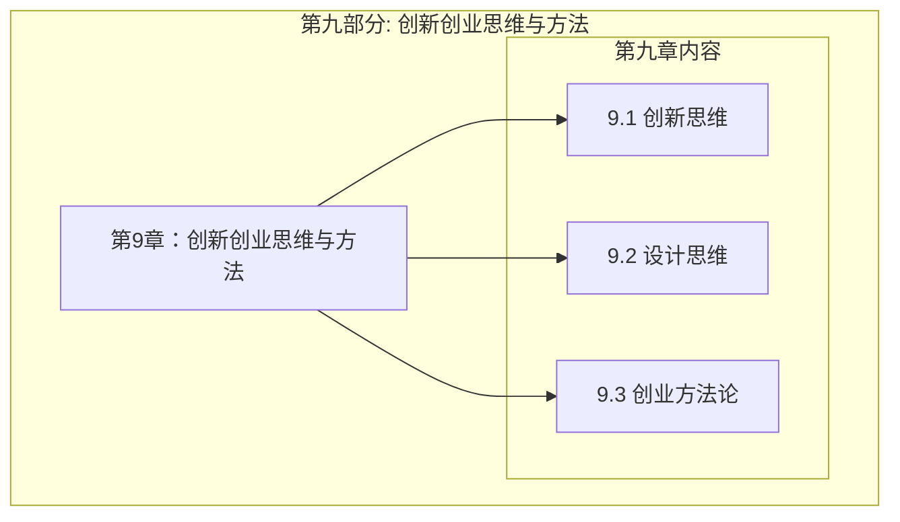

#### 第10章：创业风险管理

##### 10.1 风险管理概述

风险管理是创业过程中不可忽视的重要环节。有效的风险管理能够帮助创业者识别、评估和应对各种潜在风险，从而提高创业项目的成功率和稳定性。

###### 10.1.1 风险管理的重要性

风险管理在创业中的重要性体现在以下几个方面：

- **保障企业生存**：通过识别和应对风险，确保企业能够在各种不利环境中生存和发展。
- **提高决策质量**：通过风险评估，帮助创业者做出更明智的决策，降低错误决策带来的损失。
- **增强企业竞争力**：通过有效的风险管理，提高企业的应对能力，增强市场竞争力。
- **提高投资者信心**：通过透明和规范的风险管理，增强投资者对企业的信任和信心。

风险管理的重要性：

$$
\text{风险管理的重要性}: \quad \text{保障企业生存} \quad \text{提高决策质量} \quad \text{增强企业竞争力} \quad \text{提高投资者信心}
$$

###### 10.1.2 风险识别与分类

风险识别是风险管理的第一步，旨在识别企业可能面临的各种风险。以下是几种常见的风险识别方法：

- **头脑风暴**：通过集体讨论，识别潜在的风险。
- **专家访谈**：与行业专家进行深入交流，获取专业的风险识别意见。
- **历史数据分析**：通过分析企业历史数据，识别曾经出现过的风险。

风险识别与分类：

$$
\text{风险识别与分类}: \quad \text{头脑风暴} \quad \text{专家访谈} \quad \text{历史数据分析}
$$

常见风险分类包括以下几种：

- **技术风险**：包括技术研发难度、技术更新速度等。
- **市场风险**：包括市场需求、市场竞争等。
- **财务风险**：包括资金流动、财务状况等。
- **法律与伦理风险**：包括法律法规、伦理问题等。
- **运营风险**：包括供应链管理、生产运营等。

常见风险分类：

$$
\text{常见风险分类}: \quad \text{技术风险} \quad \text{市场风险} \quad \text{财务风险} \quad \text{法律与伦理风险} \quad \text{运营风险}
$$

###### 10.1.3 风险评估与量化

风险评估是对识别出的风险进行评估和量化，以便确定风险的重要性和应对策略。以下是几种常见的风险评估方法：

- **概率-影响分析**：通过评估风险发生的概率和影响，确定风险的重要性。
- **风险矩阵**：通过风险矩阵，对风险进行定量和定性评估。
- **敏感性分析**：通过分析不同风险因素对项目目标的影响程度，确定关键风险因素。

风险评估与量化：

$$
\text{风险评估与量化}: \quad \text{概率-影响分析} \quad \text{风险矩阵} \quad \text{敏感性分析}
$$

##### 10.2 风险管理策略

有效的风险管理策略可以帮助创业者应对各种潜在风险，确保企业稳健发展。以下是几种常见的管理策略：

###### 10.2.1 风险规避策略

风险规避策略是指通过调整企业战略或业务模式，避免风险的发生。以下是一些具体措施：

- **业务多元化**：通过开展多元化的业务，降低单一业务风险。
- **外包**：将部分高风险业务外包，减少企业直接面临的风险。
- **退出策略**：在风险发生前，制定退出策略，避免进一步损失。

风险规避策略：

$$
\text{风险规避策略}: \quad \text{业务多元化} \quad \text{外包} \quad \text{退出策略}
$$

###### 10.2.2 风险转移策略

风险转移策略是指将风险转移到第三方，以减少企业直接承担的风险。以下是一些常见的方法：

- **保险**：购买保险，将风险转移给保险公司。
- **合同**：通过签订合同，将部分风险转移到合作伙伴或客户。
- **担保**：提供担保，将风险转移给担保机构。

风险转移策略：

$$
\text{风险转移策略}: \quad \text{保险} \quad \text{合同} \quad \text{担保}
$$

###### 10.2.3 风险缓解策略

风险缓解策略是指通过采取一定的措施，降低风险发生的概率和影响。以下是一些具体措施：

- **风险监控**：建立风险监控系统，实时监测风险动态。
- **应急预案**：制定应急预案，确保在风险发生时能够迅速应对。
- **技术改进**：通过技术创新，降低技术风险。
- **培训与教育**：提高员工的风险意识和应对能力。

风险缓解策略：

$$
\text{风险缓解策略}: \quad \text{风险监控} \quad \text{应急预案} \quad \text{技术改进} \quad \text{培训与教育}
$$

###### 10.2.4 风险接受策略

风险接受策略是指企业选择承担风险，并在风险发生时采取相应的应对措施。以下是一些具体措施：

- **风险预留**：在预算中预留一定的风险资金，用于风险发生时的应急处理。
- **风险共享**：与合作伙伴或客户共同承担风险，分散风险。
- **风险分析**：对风险进行全面分析，评估其影响和应对措施。

风险接受策略：

$$
\text{风险接受策略}: \quad \text{风险预留} \quad \text{风险共享} \quad \text{风险分析}
$$

##### 10.3 风险管理实践

有效的风险管理需要结合企业的实际情况进行实践。以下是几种常见的管理实践：

###### 10.3.1 创业项目的风险评估

在创业项目中，风险评估是关键步骤。以下是一些建议：

- **制定风险评估计划**：明确评估目标、范围和方法。
- **识别项目风险**：通过头脑风暴、专家访谈等方法，识别项目可能面临的风险。
- **评估风险概率和影响**：通过概率-影响分析等工具，评估风险的重要性和紧急性。
- **制定风险应对策略**：根据风险评估结果，制定相应的风险应对策略。

创业项目的风险评估：

$$
\text{创业项目的风险评估}: \quad \text{制定风险评估计划} \quad \text{识别项目风险} \quad \text{评估风险概率和影响} \quad \text{制定风险应对策略}
$$

###### 10.3.2 风险应对计划制定

风险应对计划是风险管理的关键文件，用于指导企业在风险发生时的应对行动。以下是一些建议：

- **明确风险应对目标**：确保风险应对计划能够实现预期的效果。
- **制定具体应对措施**：根据风险评估结果，制定具体的应对措施，如风险规避、风险转移、风险缓解等。
- **分配责任和资源**：明确责任人和所需资源，确保风险应对计划能够顺利执行。
- **定期更新和审查**：定期更新和审查风险应对计划，确保其适应企业发展的变化。

风险应对计划制定：

$$
\text{风险应对计划制定}: \quad \text{明确风险应对目标} \quad \text{制定具体应对措施} \quad \text{分配责任和资源} \quad \text{定期更新和审查}
$$

###### 10.3.3 风险监控与应对

风险监控与应对是确保风险管理计划执行的重要环节。以下是一些建议：

- **建立风险监控机制**：通过定期检查和报告，监控风险的发展动态。
- **及时应对风险**：在风险发生时，迅速采取应对措施，避免风险扩大。
- **评估风险应对效果**：对风险应对措施的效果进行评估，为后续风险管理提供参考。
- **持续改进**：根据风险监控和评估结果，不断改进风险管理策略和措施。

风险监控与应对：

$$
\text{风险监控与应对}: \quad \text{建立风险监控机制} \quad \text{及时应对风险} \quad \text{评估风险应对效果} \quad \text{持续改进}
$$

### 第10章总结

通过有效的风险管理和实践，创业者可以降低创业过程中的不确定性，提高企业的生存能力和竞争力。在接下来的章节中，我们将提供一些实用的资源与工具，帮助创业者更好地开展人工智能创业项目。

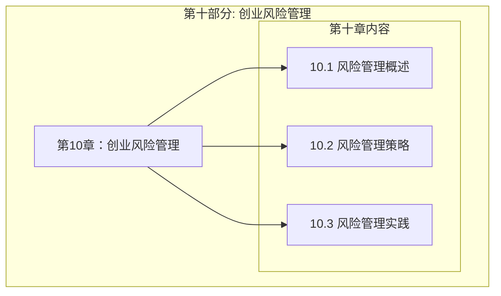

#### 附录 A: 资源与工具

##### A.1 人工智能开源资源

在人工智能领域，开源资源和工具为开发者提供了丰富的学习资源和开发平台。以下是一些常用的人工智能开源资源和工具：

###### A.1.1 机器学习框架

- **TensorFlow**：由Google开发的开源机器学习框架，支持各种深度学习模型。
- **PyTorch**：由Facebook开发的开源深度学习框架，具有动态计算图和灵活的API。
- **Keras**：基于TensorFlow和Theano的高层神经网络API，易于使用和扩展。
- **Scikit-learn**：Python开源机器学习库，提供多种机器学习算法和工具。

###### A.1.2 自然语言处理工具

- **NLTK**：Python自然语言处理库，提供多种自然语言处理工具和算法。
- **spaCy**：快速和易于使用的自然语言处理库，支持多种语言。
- **Gensim**：用于主题建模和文本相似性的Python库。

###### A.1.3 计算机视觉库

- **OpenCV**：开源计算机视觉库，支持多种图像处理和计算机视觉算法。
- **PyTorch Vision**：PyTorch的计算机视觉模块，提供丰富的预训练模型和工具。
- **TensorFlow Object Detection API**：用于对象检测和图像分类的TensorFlow工具包。

##### A.2 创业相关资源

在创业过程中，创业者可以利用各种资源和支持，提高创业成功率。以下是一些创业相关资源：

###### A.2.1 创业平台与论坛

- **创业邦**：中国领先的创业服务平台，提供创业资讯、活动、投融资等服务。
- **创业家**：创业者和投资人的交流平台，提供创业经验分享、项目投融资等。
- **知乎**：知识分享社区，创业者可以在这里找到行业专家和同行的经验分享。

###### A.2.2 创业政策与支持

- **国家科技部**：提供科技型中小企业创业支持政策，包括资金支持、技术创新服务等。
- **地方政府**：各地政府提供各种创业扶持政策，包括创业补贴、人才引进等。
- **创新创业基地**：各类创新创业基地提供办公空间、导师指导、投融资服务等。

###### A.2.3 创业书籍与课程

- **《创业维艰》**：由硅谷创业者本·霍洛维茨撰写的创业经验总结，对创业者有很高的指导意义。
- **《精益创业》**：埃里克·莱斯撰写的创业方法论书籍，介绍如何通过迭代和验证降低创业风险。
- **在线课程平台**：如Coursera、edX等，提供各种创业相关课程，包括商业模式设计、市场营销等。

##### A.3 行业报告与数据

了解行业趋势和市场数据对创业者具有重要意义。以下是一些行业报告与数据来源：

###### A.3.1 人工智能行业报告

- **IDC**：国际数据公司发布的人工智能市场报告，提供全球和各地区的人工智能市场规模、增长趋势等。
- **Gartner**：国际知名研究机构发布的人工智能市场报告，包括技术趋势、市场份额等。
- **麦肯锡**：麦肯锡全球研究院发布的人工智能行业报告，分析人工智能在各行业中的应用和影响。

###### A.3.2 市场调研报告

- **艾瑞咨询**：提供中国市场调研报告，涵盖互联网、金融、零售等多个行业。
- **企鹅智酷**：腾讯公司旗下的市场调研机构，发布多个领域的市场调研报告。
- **阿里研究院**：阿里巴巴集团旗下的研究院，发布电子商务、数字金融等领域的市场调研报告。

###### A.3.3 投资分析报告

- **CB Insights**：提供全球创业投资市场分析报告，包括融资趋势、热门领域等。
- **PitchBook**：提供全球创业投资市场数据，包括融资总额、投资案例等。
- **普华永道**：提供全球和各地区经济状况及投资分析报告，对创业投资有较高的参考价值。

### 附录总结

通过附录中的资源与工具，创业者可以获取到丰富的人工智能技术知识和创业支持，为创业项目的成功奠定坚实的基础。在实际应用中，创业者可以根据自身需求，选择合适的资源和工具，以实现创业目标。

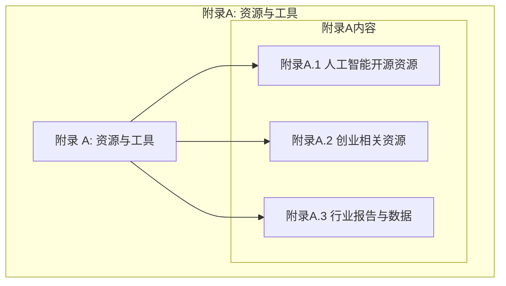

### 作者信息

作者：AI天才研究院/AI Genius Institute & 禅与计算机程序设计艺术 /Zen And The Art of Computer Programming

AI天才研究院是一家专注于人工智能研究和应用的高科技研究院，致力于推动人工智能技术的发展和实际应用。研究院由一群世界顶尖的人工智能专家、程序员和软件架构师组成，他们具有丰富的理论知识和实践经验。

《禅与计算机程序设计艺术》是作者在计算机科学领域的代表作之一，该书深入探讨了编程艺术的哲学和技巧，对全球计算机科学领域产生了深远的影响。作者以其独特的视角和深刻的思考，为读者提供了丰富的编程哲学和实用技巧，使读者在编程过程中能够达到一种“禅”的境界。

本文旨在为人工智能创业者提供一份全面的策略指南，帮助他们在激烈的市场竞争中脱颖而出，实现创业成功。通过本文的详细分析和案例研究，创业者可以更好地理解人工智能创业的关键要素和实战经验，为未来的创业之路打下坚实的基础。作者希望读者能够从中获得启发和指导，将理论与实践相结合，创造出具有社会价值和商业成功的人工智能产品和服务。

