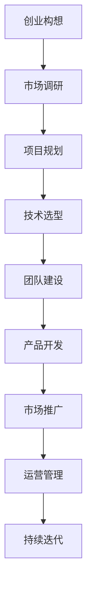

                 

## 文章标题：人工智能创业：选择合适工具的方法

### 关键词：人工智能创业，工具选择，深度学习，机器学习，开源工具，商业平台

> 摘要：本文旨在帮助创业者了解人工智能技术，学会如何选择合适的人工智能工具，进行有效的创业实践。文章首先介绍了人工智能的基础概念和主要领域，然后探讨了创业所需的基本技能和项目规划方法，接着详细分析了人工智能工具选择的原则与方法，最后通过成功与失败案例的分享，总结了人工智能创业的策略和团队建设方法。

---

### 第一部分：人工智能基础与创业准备

#### 第1章：人工智能概述

##### 1.1 人工智能的定义与历史发展

#### 1.1.1 人工智能的基本概念

人工智能（Artificial Intelligence，简称AI）是计算机科学的一个分支，旨在使计算机具有类似于人类的智能，能够感知、理解、学习、推理和自主决策。人工智能的研究可以追溯到20世纪50年代，当时的研究主要集中在符号推理和逻辑推理上。

#### 1.1.2 人工智能的发展历程

- **1950年代**：图灵测试首次提出，人工智能概念逐渐被接受。
- **1960年代**：人工智能研究进入黄金时期，出现了许多符号推理和专家系统。
- **1970年代**：人工智能研究遭遇低谷，由于实际应用困难，许多项目被取消。
- **1980年代**：机器学习和神经网络研究取得突破，人工智能开始应用于实际问题。
- **1990年代**：互联网的兴起使得人工智能应用更加广泛。
- **2000年代**：深度学习成为人工智能研究的主流方向，AI技术在图像识别、语音识别等领域取得了显著进展。
- **2010年代至今**：人工智能技术不断发展，应用场景不断扩大，从智能家居、自动驾驶到医疗诊断、金融分析，人工智能正在深刻改变我们的生活。

##### 1.2 人工智能的主要领域与应用

#### 1.2.1 机器学习

机器学习是人工智能的核心技术之一，通过训练模型，使计算机具备自主学习和适应新数据的能力。机器学习包括监督学习、无监督学习和强化学习等不同的学习方式。

#### 1.2.2 深度学习

深度学习是机器学习的一个分支，通过多层神经网络对数据进行处理，具有强大的特征提取和建模能力。深度学习在图像识别、自然语言处理等领域取得了显著成果。

#### 1.2.3 自然语言处理

自然语言处理（Natural Language Processing，简称NLP）是人工智能的一个重要分支，旨在使计算机能够理解、生成和处理自然语言。NLP在机器翻译、情感分析、问答系统等领域有广泛应用。

##### 1.3 人工智能在创业中的应用

#### 1.3.1 创业者如何利用人工智能

人工智能技术可以帮助创业者提高效率、降低成本、创新产品。例如，通过机器学习算法优化业务流程，通过深度学习技术提升产品用户体验，通过自然语言处理技术改善客户服务。

#### 1.3.2 人工智能对创业的影响

人工智能的发展对创业产生了深远的影响，一方面，人工智能技术降低了创业门槛，使得更多人有机会参与到创业活动中；另一方面，人工智能的应用场景不断扩大，创业者需要不断学习新技术，以保持竞争优势。

---

#### 第2章：创业准备

##### 2.1 创业者必备的技能

#### 2.1.1 技术技能

创业者需要具备一定的技术背景，能够理解并运用人工智能技术。例如，了解机器学习、深度学习和自然语言处理的基本原理和算法，熟悉常见的开源工具和平台。

#### 2.1.2 商业技能

创业者还需要具备商业技能，能够进行市场调研、产品定位、商业模式设计和营销策略规划。商业技能对于创业项目的成功至关重要。

#### 2.1.3 团队建设与管理

创业者需要具备团队建设和管理能力，能够组建一支高效的团队，明确团队成员的角色和职责，激发团队成员的创造力，确保团队协作顺畅。

##### 2.2 创业项目规划

#### 2.2.1 项目构思与定位

创业项目规划的第一步是进行项目构思与定位，明确创业项目的目标、愿景和使命。项目构思需要结合市场需求、技术趋势和自身优势进行。

#### 2.2.2 市场调研与分析

市场调研与分析是创业项目规划的重要环节，通过市场调研，了解市场需求、竞争态势和潜在客户，为项目定位和产品规划提供依据。

#### 2.2.3 商业模式设计

商业模式设计是创业项目规划的关键环节，需要明确项目的收入来源、成本结构、利润模式等。一个好的商业模式能够为创业项目提供稳定的盈利能力。

---

### 第二部分：人工智能工具选择

#### 第3章：常见的人工智能工具与平台

##### 3.1 开源工具

#### 3.1.1 TensorFlow

TensorFlow是谷歌开发的开源机器学习框架，支持多种深度学习模型，具有灵活的架构和丰富的API，适用于研究、开发和部署各种机器学习应用。

#### 3.1.2 PyTorch

PyTorch是Facebook开发的开源深度学习框架，具有动态计算图特性，易于调试和实验，适用于快速原型设计和研究。

#### 3.1.3 Keras

Keras是基于TensorFlow和Theano的开源深度学习库，提供简化的模型构建和训练流程，适用于快速开发深度学习应用。

#### 3.1.4 Scikit-learn

Scikit-learn是开源机器学习库，提供多种机器学习算法的实现，适用于数据预处理、模型训练和评估。

##### 3.2 商业平台

#### 3.2.1 AWS

AWS是亚马逊云服务，提供丰富的云计算资源和人工智能服务，包括深度学习框架、数据处理工具和AI模型库，适用于企业级人工智能应用。

#### 3.2.2 Google Cloud

Google Cloud是谷歌云服务，提供深度学习框架和云计算资源，适用于快速开发和部署人工智能应用。

#### 3.2.3 Microsoft Azure

Microsoft Azure是微软云服务，提供云计算资源和人工智能服务，适用于企业级人工智能应用。

##### 3.3 云计算平台

#### 3.3.1 GPU云服务器

GPU云服务器适用于进行深度学习和大数据处理，提供强大的计算能力和灵活性。

#### 3.3.2 虚拟机实例

虚拟机实例适用于不同的计算需求，可以根据需求灵活配置资源，适用于研究、开发和部署人工智能应用。

#### 3.3.3 容器服务

容器服务适用于微服务架构和持续集成/持续部署（CI/CD），提供灵活的部署和管理方式，适用于快速开发和部署人工智能应用。

---

#### 第4章：工具选择的原则与方法

##### 4.1 技术需求分析

技术需求分析是工具选择的基础，需要明确项目的技术需求，包括数据类型、模型复杂度、计算性能等。根据技术需求，选择合适的工具和平台。

##### 4.2 成本效益分析

成本效益分析是工具选择的重要原则，需要综合考虑工具和平台的价格、性能和适用性。选择成本效益最高的工具和平台，确保项目的经济效益。

##### 4.3 资源配置与优化

资源配置与优化是工具选择的关键环节，需要根据项目需求合理配置资源，优化计算性能和资源利用率。通过资源配置与优化，提高项目的运行效率。

---

### 第三部分：人工智能创业案例分析

#### 第5章：人工智能创业案例分析

##### 5.1 成功案例分享

##### 5.1.1 案例一：OpenAI

OpenAI是一家总部位于美国的人工智能研究公司，致力于实现安全的通用人工智能并让其造福全人类。OpenAI通过不断推出具有创新性的研究成果，成功实现了从初创公司到全球领先人工智能研究机构的转变。

##### 5.1.2 案例二：从零到一搭建AI团队

某创业公司在人工智能领域从零开始搭建团队，通过引入专业人才、建立研发团队和合作伙伴关系，逐步形成了具有核心竞争力的AI技术团队。公司凭借先进的人工智能技术，在市场上获得了竞争优势，取得了显著的业务增长。

##### 5.2 失败案例分析

##### 5.2.1 案例一：市场调研不足

某创业公司在开展自动驾驶技术研发时，由于对市场调研不足，未能准确把握市场需求，导致产品无法满足市场需求，最终导致项目失败。

##### 5.2.2 案例二：技术风险

某创业公司在进行人工智能医疗诊断技术研发时，由于技术风险较高，研发过程中遇到了诸多困难，导致项目进展缓慢，最终陷入困境。

---

#### 第6章：人工智能创业策略

##### 6.1 创业路径规划

##### 6.1.1 市场定位

市场定位是创业成功的关键，需要明确目标市场和目标客户，了解市场需求和竞争态势，制定合适的市场进入策略。

##### 6.1.2 产品定位

产品定位是创业项目的核心，需要根据市场需求和自身优势，明确产品的功能、性能和特点，打造具有竞争力的产品。

##### 6.1.3 营销策略

营销策略是创业成功的重要保障，需要根据市场定位和产品特点，制定合适的营销计划，提高品牌知名度和市场份额。

##### 6.2 融资策略

##### 6.2.1 融资渠道

融资渠道是创业公司获取资金的重要途径，需要了解不同融资渠道的特点和适用性，选择合适的融资方式。

##### 6.2.2 融资策略与技巧

融资策略与技巧是创业公司成功融资的关键，需要根据自身情况，制定合理的融资计划，掌握融资技巧，提高融资成功率。

##### 6.2.3 融资风险与应对

融资风险是创业公司面临的重要风险，需要了解不同融资方式的风险特点，制定相应的风险应对措施，降低融资风险。

---

#### 第7章：人工智能创业团队建设

##### 6.1 团队结构设计

##### 6.1.1 技术团队建设

技术团队建设是创业成功的关键，需要根据项目需求，组建一支专业、高效的技术团队，明确团队成员的角色和职责。

##### 6.1.2 产品团队建设

产品团队建设是创业项目的核心，需要根据产品特点，组建一支具备产品思维和执行能力的团队，确保产品顺利推进。

##### 6.1.3 运营团队建设

运营团队建设是创业项目的重要环节，需要根据市场需求和产品特点，组建一支具备市场运营能力的团队，推动项目落地。

##### 6.2 团队管理策略

##### 6.2.1 团队沟通与协作

团队沟通与协作是团队高效运作的关键，需要建立有效的沟通机制，促进团队成员之间的协作和交流。

##### 6.2.2 团队激励与绩效管理

团队激励与绩效管理是团队稳定发展的关键，需要制定合理的激励政策和绩效评估体系，激发团队成员的积极性和创造力。

##### 6.2.3 团队文化建设

团队文化建设是团队长期稳定发展的基础，需要营造积极向上、团结协作的团队氛围，增强团队的凝聚力和归属感。

---

### 第四部分：人工智能创业中的法律与伦理问题

#### 第8章：人工智能创业中的法律与伦理问题

##### 8.1 法律法规解读

##### 8.1.1 数据保护法律

数据保护法律是创业公司必须遵守的重要法律法规，需要了解数据保护的基本原则和要求，确保数据安全。

##### 8.1.2 知识产权保护

知识产权保护是创业公司保护自身权益的重要手段，需要了解知识产权的基本知识和保护措施，防范侵权风险。

##### 8.1.3 商业秘密保护

商业秘密保护是创业公司保护商业利益的重要措施，需要制定合理的保密制度，防止商业秘密泄露。

##### 8.2 伦理道德问题

##### 8.2.1 人工智能伦理原则

人工智能伦理原则是创业公司遵循的重要道德准则，需要了解并遵循伦理原则，确保人工智能的发展符合道德要求。

##### 8.2.2 人工智能道德风险

人工智能道德风险是创业公司面临的重要伦理问题，需要了解人工智能道德风险的特点和表现，制定相应的风险应对措施。

##### 8.2.3 伦理问题应对策略

伦理问题应对策略是创业公司解决伦理问题的关键，需要制定合理的应对策略，确保人工智能的发展符合伦理要求。

---

#### 附录 A：人工智能工具与资源指南

##### A.1 开源工具推荐

- TensorFlow：深度学习框架
- PyTorch：深度学习框架
- Keras：深度学习库
- Scikit-learn：机器学习库

##### A.2 商业平台简介

- AWS：云计算平台
- Google Cloud：云计算平台
- Microsoft Azure：云计算平台

##### A.3 云计算资源推荐

- GPU云服务器：适用于深度学习和大数据处理
- 虚拟机实例：适用于不同的计算需求
- 容器服务：适用于微服务架构和持续集成/持续部署

##### A.4 相关书籍与论文推荐

- 《深度学习》（Goodfellow, Bengio, Courville）
- 《Python机器学习》（Sebastian Raschka）
- 《人工智能：一种现代方法》（Stuart Russell & Peter Norvig）
- 《自然语言处理综合教程》（Daniel Jurafsky & James H. Martin）

---

### 总结

本书通过详细的人工智能创业工具选择方法、成功与失败案例分析、以及丰富的工具与资源指南，旨在帮助创业者更好地理解和运用人工智能技术，进行有效的创业实践。读者可以：

- 理解人工智能的基本概念与历史发展
- 掌握创业所需的基本技能和项目规划方法
- 学会根据技术需求和成本效益选择合适的人工智能工具
- 学习成功与失败案例，借鉴经验教训
- 了解人工智能创业中的法律与伦理问题
- 获得丰富的人工智能工具与资源指南

通过阅读本书，创业者可以更好地把握人工智能创业的机会，实现创新创业的目标。同时，本书也适合对人工智能有兴趣的读者作为参考和学习资料。希望本书能为读者在人工智能创业道路上提供有价值的指导和帮助。

---

### Mermaid 流程图：人工智能创业流程



---

### 人工智能核心算法原理讲解：决策树

决策树是一种常用的分类和回归算法，通过一系列的判断条件，将数据集划分为不同的区域，并在每个区域上应用一个预测模型。以下是一个简单的决策树算法的伪代码：

```python
def DecisionTree(data, attributes, target_attribute):
    if data is empty:
        return majority_value_of_target_attribute(data, target_attribute)
    elif all examples in data have the same target value:
        return this target value
    else:
        a = BestAttributeToSplit(data, attributes)
        tree = {}
        for value in unique values of attribute a:
            sub_data = examples with attribute a = value
            sub_attribute = attributes without attribute a
            tree[value] = DecisionTree(sub_data, sub_attribute, target_attribute)
        return tree
```

其中，`majority_value_of_target_attribute`表示多数值函数，用于在数据集中选择目标属性的多数值。`BestAttributeToSplit`函数用于选择具有最高信息增益的属性进行分割。

### 决策树模型中的信息增益

信息增益是决策树算法中的一个重要概念，用于评估属性分割的有效性。信息增益的计算公式如下：

$$
IG(D, A) = Info(D) - \sum_{v \in V} p(v) \cdot Info(D_v)
$$`

其中，$D$ 是数据集，$A$ 是特征集合，$V$ 是特征 $A$ 的所有可能值，$p(v)$ 是特征 $A$ 取值 $v$ 的概率，$Info(D)$ 是数据集 $D$ 的熵，$Info(D_v)$ 是特征 $A$ 取值 $v$ 的条件熵。

### 项目实战：基于TensorFlow的简单神经网络实现

以下是一个使用TensorFlow实现的简单神经网络的案例，包括环境搭建、源代码实现和代码解读与分析。

#### 1. 环境搭建

首先，我们需要安装TensorFlow库。在命令行中运行以下命令：

```bash
pip install tensorflow
```

#### 2. 源代码实现

```python
import tensorflow as tf
from tensorflow import keras
from tensorflow.keras import layers

# 定义模型
model = keras.Sequential([
    layers.Dense(64, activation='relu', input_shape=[784]),
    layers.Dense(10, activation='softmax')
])

# 编译模型
model.compile(optimizer='adam',
              loss='categorical_crossentropy',
              metrics=['accuracy'])

# 加载数据集
mnist = keras.datasets.mnist
(train_images, train_labels), (test_images, test_labels) = mnist.load_data()

# 预处理数据
train_images = train_images.reshape((60000, 784))
test_images = test_images.reshape((10000, 784))

train_images = train_images / 255.0
test_images = test_images / 255.0

# 转换标签
train_labels = keras.utils.to_categorical(train_labels)
test_labels = keras.utils.to_categorical(test_labels)

# 训练模型
model.fit(train_images, train_labels, epochs=5, batch_size=64)

# 评估模型
test_loss, test_acc = model.evaluate(test_images, test_labels)
print(f"Test accuracy: {test_acc}")
```

#### 3. 代码解读与分析

- **环境搭建**：安装TensorFlow库。
- **模型定义**：定义一个简单的神经网络，包括一个输入层、一个隐藏层和一个输出层。隐藏层使用ReLU激活函数，输出层使用softmax激活函数。
- **模型编译**：配置模型使用的优化器、损失函数和评价指标。
- **数据加载与预处理**：加载数字手写体数据集，并将图像数据缩放到0-1之间。将标签转换为one-hot编码。
- **模型训练**：使用训练数据训练模型，设置训练轮数和批量大小。
- **模型评估**：使用测试数据评估模型的准确性。

---

### 人工智能创业案例分析

#### 1. 成功案例：OpenAI

**1.1 案例背景**

OpenAI成立于2015年，是一家总部位于美国的人工智能研究公司，致力于实现安全的通用人工智能并让其造福全人类。OpenAI的创始人包括山姆·阿尔特曼（Sam Altman）、耶利米·凯宁汉（Elon Musk）等人。

**1.2 创业路径**

- **初期阶段**：OpenAI在初期主要通过个人捐赠和投资筹集资金，致力于开展人工智能研究，特别是在机器学习和深度学习领域。
- **发展阶段**：OpenAI逐渐获得了更多投资者的关注，并成功完成了多轮融资，资金规模逐渐扩大。
- **成熟阶段**：OpenAI在2022年推出了GPT-3模型，这是当时最大的自然语言处理模型之一，引起了全球的关注。

**1.3 经验教训**

- **持续创新**：OpenAI始终致力于推进人工智能技术的发展，不断推出具有创新性的研究成果。
- **合作与开放**：OpenAI鼓励科学家之间的合作，同时也开放了部分研究成果，促进了人工智能领域的共同进步。
- **安全与伦理**：OpenAI高度重视人工智能的安全与伦理问题，致力于确保人工智能的发展不会对人类造成威胁。

#### 2. 失败案例：AISeed

**2.1 案例背景**

AISeed是一家成立于2018年的中国人工智能创业公司，专注于自动驾驶技术的研发。公司创始人包括曾在百度、华为等公司工作的资深技术专家。

**2.2 创业路径**

- **初期阶段**：AISeed在初期主要通过天使投资和风险投资筹集资金，致力于研发自动驾驶技术。
- **发展阶段**：AISeed在自动驾驶领域取得了一些成果，包括自动驾驶测试车辆的落地和多项专利的申请。
- **成熟阶段**：由于市场竞争激烈，AISeed在2019年遭遇了资金链断裂，最终宣布破产。

**2.3 经验教训**

- **市场调研不足**：AISeed在初期缺乏对自动驾驶市场需求的深入调研，导致产品无法满足市场需求。
- **技术风险**：自动驾驶技术存在较高的技术风险，AISeed在技术研发过程中遇到了诸多困难。
- **资金管理不善**：AISeed在资金管理方面存在一定问题，导致资金链断裂，最终导致破产。

---

### 总结

通过对OpenAI和AISeed两个案例的分析，我们可以得出以下结论：

- **成功的关键因素**：持续创新、合作与开放、安全与伦理。
- **失败的主要原因**：市场调研不足、技术风险、资金管理不善。

对于人工智能创业公司，了解成功与失败的原因，吸取经验教训，有助于更好地规划创业路径，降低失败风险。同时，创业者还应该密切关注市场动态和技术发展趋势，以便及时调整战略方向。

---

### 附录 A：人工智能工具与资源指南

**A.1 开源工具推荐**

- **TensorFlow**：由谷歌开发的开源机器学习框架，支持多种深度学习模型。
- **PyTorch**：由Facebook开发的开源深度学习框架，具有动态计算图特性。
- **Keras**：基于TensorFlow和Theano的开源深度学习库，提供简化的模型构建和训练流程。
- **Scikit-learn**：开源机器学习库，提供多种机器学习算法的实现。

**A.2 商业平台简介**

- **AWS**：亚马逊云服务，提供丰富的云计算资源和人工智能服务。
- **Google Cloud**：谷歌云服务，提供深度学习框架和云计算资源。
- **Microsoft Azure**：微软云服务，提供云计算资源和人工智能服务。

**A.3 云计算资源推荐**

- **GPU云服务器**：适用于进行深度学习和大数据处理。
- **虚拟机实例**：适用于不同的计算需求，可以根据需求灵活配置资源。
- **容器服务**：适用于微服务架构和持续集成/持续部署（CI/CD）。

**A.4 相关书籍与论文推荐**

- **《深度学习》（Goodfellow, Bengio, Courville）**：深度学习领域的经典教材。
- **《Python机器学习》（Sebastian Raschka）**：介绍使用Python进行机器学习的方法和实践。
- **《人工智能：一种现代方法》（Stuart Russell & Peter Norvig）**：全面介绍人工智能的理论和实践。
- **《自然语言处理综合教程》（Daniel Jurafsky & James H. Martin）**：介绍自然语言处理的基础理论和实践。

---

### 总结

本书通过详细的人工智能创业工具选择方法、成功与失败案例分析、以及丰富的工具与资源指南，旨在帮助创业者更好地理解和运用人工智能技术，进行有效的创业实践。读者可以：

- **理解人工智能的基本概念与历史发展**：掌握人工智能的核心技术和应用领域。
- **掌握创业所需的基本技能和项目规划方法**：为创业项目奠定坚实基础。
- **学会根据技术需求和成本效益选择合适的人工智能工具**：提高创业项目的成功率。
- **学习成功与失败案例，借鉴经验教训**：降低创业风险，提高创业成功率。
- **了解人工智能创业中的法律与伦理问题**：确保创业活动合法合规，符合伦理道德。
- **获得丰富的人工智能工具与资源指南**：为创业项目提供有力支持。

通过阅读本书，创业者可以更好地把握人工智能创业的机会，实现创新创业的目标。同时，本书也适合对人工智能有兴趣的读者作为参考和学习资料。希望本书能为读者在人工智能创业道路上提供有价值的指导和帮助。

---

### 作者

作者：AI天才研究院/AI Genius Institute & 禅与计算机程序设计艺术 /Zen And The Art of Computer Programming

