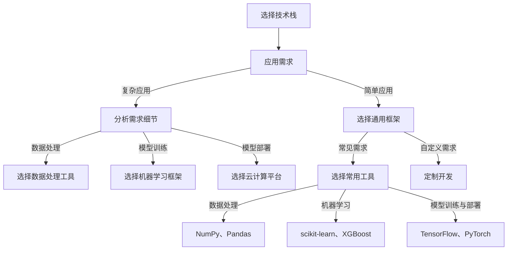
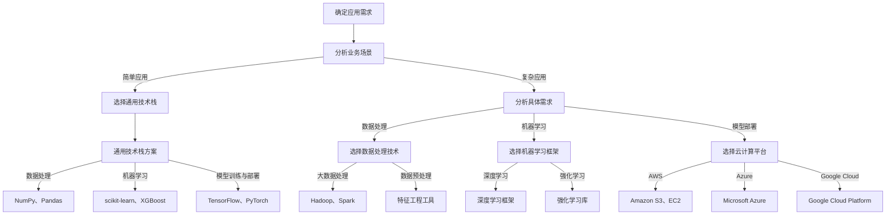
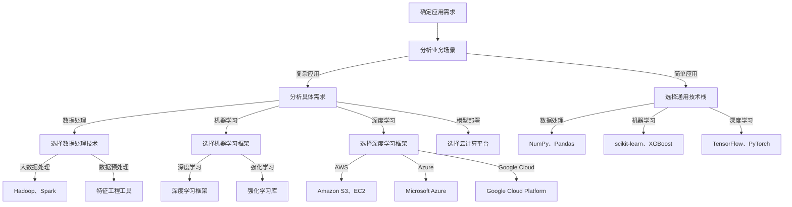

                 

### 文章标题

# 人工智能创业：选择合适的技术栈

### 关键词

- 人工智能
- 创业
- 技术栈
- 深度学习
- 机器学习
- 云计算

### 摘要

人工智能（AI）创业已经成为全球科技领域的重要趋势。选择合适的技术栈是确保创业项目成功的关键因素之一。本文将深入探讨人工智能创业背景、技术栈选择策略、常见技术栈分析以及实际项目中的应用，结合创业准备、产品开发、运营管理等实战经验，为有意从事人工智能创业的人提供指导。文章结构清晰，从理论到实践，逐步引导读者理解和掌握选择合适技术栈的要点。

---

### 第1章：人工智能行业背景

本章将概述人工智能的发展历程、当前产业现状以及未来趋势，帮助读者了解人工智能行业的背景和重要性。

#### 1.1 人工智能的发展历程

##### 1.1.1 人工智能的起源

人工智能的概念最早可以追溯到20世纪50年代。当时，计算机科学家们开始思考，能否让计算机模拟人类的智能行为。1950年，艾伦·图灵发表了著名的论文《计算机器与智能》，提出了图灵测试这一衡量机器智能的标准。这一理论奠定了人工智能的基础。

##### 1.1.2 人工智能的关键事件

从20世纪50年代至今，人工智能经历了多个发展阶段。其中，20世纪80年代的专家系统和20世纪90年代的机器学习是人工智能发展的重要里程碑。进入21世纪后，随着深度学习技术的突破，人工智能迎来了新一轮的发展高潮。

##### 1.1.3 人工智能的里程碑

人工智能领域的里程碑事件包括：1956年达特茅斯会议的召开，宣告了人工智能学科的诞生；2012年，深度学习在ImageNet图像识别大赛中取得突破性成果；2016年，谷歌的AlphaGo战胜围棋世界冠军李世石，展示了人工智能的强大能力。

#### 1.2 当前人工智能产业的现状

##### 1.2.1 人工智能市场的规模与增长

根据市场研究公司的数据，全球人工智能市场预计在未来几年将持续增长。尤其是在医疗健康、金融、教育、智能制造等领域，人工智能的应用已经取得了显著的成果。

##### 1.2.2 人工智能的关键应用领域

人工智能在多个领域都取得了重要应用，包括但不限于：医疗健康、自动驾驶、金融科技、智能家居、教育、智能制造等。

##### 1.2.3 人工智能产业链分析

人工智能产业链包括硬件、软件、数据、服务等多个环节。硬件方面，如GPU、TPU等专用计算设备；软件方面，深度学习框架、机器学习库等；数据方面，大量的数据集和算法模型；服务方面，包括AI解决方案提供商、系统集成商等。

#### 1.3 人工智能行业的未来趋势

##### 1.3.1 技术趋势分析

未来人工智能技术的发展将更加聚焦于深度学习、强化学习、自然语言处理等领域。同时，硬件技术的进步，如量子计算、边缘计算等，也将对人工智能产生重要影响。

##### 1.3.2 应用趋势分析

人工智能将在更多的行业和领域得到应用，特别是在那些数据密集、计算密集的领域，如金融、医疗、智能制造等。

##### 1.3.3 行业发展预测

随着技术的不断进步和应用的不断拓展，人工智能行业将继续保持高速增长。预计到2030年，人工智能将为全球经济带来数万亿美元的增长。

### 第2章：人工智能技术应用领域

本章将详细探讨人工智能在医疗健康、教育、智能制造、金融等领域的应用。

#### 2.1 人工智能在医疗健康领域的应用

##### 2.1.1 智能诊断与辅助诊疗

人工智能在医疗健康领域的应用主要包括智能诊断和辅助诊疗。通过深度学习算法，人工智能可以分析大量的医疗数据，帮助医生进行疾病诊断。例如，利用卷积神经网络（CNN）对医学影像进行分析，提高诊断的准确率。

##### 2.1.2 智能药物研发

人工智能在药物研发中也发挥了重要作用。通过机器学习算法，人工智能可以分析海量的化合物数据，预测化合物的药理活性，从而加速新药的发现和开发。

##### 2.1.3 智能健康管理

智能健康管理是人工智能在医疗健康领域的另一个重要应用。通过可穿戴设备收集的健康数据，人工智能可以分析用户的健康状况，提供个性化的健康建议。

#### 2.2 人工智能在教育领域的应用

##### 2.2.1 智能教育助理

智能教育助理是人工智能在教育领域的重要应用。通过自然语言处理技术，智能教育助理可以与教师和学生进行互动，提供学习支持和辅导。

##### 2.2.2 智能学习系统

智能学习系统利用人工智能技术，根据学生的学习情况，提供个性化的学习方案。这种系统可以分析学生的学习数据，预测学习效果，并调整教学内容。

##### 2.2.3 智能教育评估

智能教育评估利用人工智能技术，对学生的学习情况进行自动评估。这种评估不仅更加客观，还可以提供更多的学习反馈，帮助教师和学生更好地理解学习过程。

#### 2.3 人工智能在智能制造领域的应用

##### 2.3.1 智能制造系统

智能制造系统是人工智能在智能制造领域的重要应用。通过机器学习算法，智能制造系统可以优化生产流程，提高生产效率。

##### 2.3.2 智能设备监控

智能设备监控利用人工智能技术，对生产线上的设备进行实时监控和分析。这样可以及时发现设备故障，减少生产中断。

##### 2.3.3 智能供应链管理

智能供应链管理利用人工智能技术，对供应链中的各个环节进行优化。通过数据分析和预测，智能供应链管理可以降低库存成本，提高供应链效率。

#### 2.4 人工智能在金融领域的应用

##### 2.4.1 智能风险管理

智能风险管理是人工智能在金融领域的重要应用。通过机器学习算法，智能风险管理可以分析金融市场的数据，预测市场风险，帮助金融机构制定风险控制策略。

##### 2.4.2 智能投资顾问

智能投资顾问利用人工智能技术，为投资者提供投资建议。通过分析市场数据，智能投资顾问可以预测市场的走势，帮助投资者做出更好的投资决策。

##### 2.4.3 智能客服系统

智能客服系统是人工智能在金融领域的一个重要应用。通过自然语言处理技术，智能客服系统可以与客户进行交互，提供快速、准确的客户服务。

### 第3章：人工智能创业机会分析

本章将分析人工智能创业的机会、创业环境与政策支持以及创业团队的构建。

#### 3.1 创业环境与政策支持

##### 3.1.1 创业环境的分析

人工智能创业环境的分析包括市场需求、技术成熟度、资金支持、政策环境等方面。一个良好的创业环境将为人工智能创业提供有力的支持。

##### 3.1.2 政策支持的重要性

政策支持对于人工智能创业至关重要。政府通过出台各种优惠政策，鼓励企业和个人从事人工智能研究和创业。这些政策包括税收优惠、资金支持、知识产权保护等。

##### 3.1.3 人工智能创业的政策环境

当前，全球范围内的人工智能创业政策环境良好。许多国家和地区都出台了相关政策，鼓励人工智能的研发和应用。例如，中国提出了“新一代人工智能发展规划”，美国则加大了对人工智能的投入。

#### 3.2 创业机会评估与选择

##### 3.2.1 创业机会的识别

创业机会的识别是创业成功的关键。通过市场调研、技术趋势分析等方法，创业者可以识别出潜在的创业机会。

##### 3.2.2 创业机会的评价方法

创业机会的评价方法包括市场前景、技术难度、资源需求、团队优势等方面。通过综合评估，创业者可以选择最有潜力的创业机会。

##### 3.2.3 创业机会的选择策略

选择创业机会时，创业者需要考虑自身的资源和能力。选择与自己擅长领域相关的创业机会，可以提高创业成功的可能性。

#### 3.3 创业团队的构建

##### 3.3.1 团队成员的角色与职责

一个成功的创业团队需要具备多元化的技能和知识。团队成员的角色和职责包括技术负责人、产品经理、市场营销、财务管理等。

##### 3.3.2 团队成员的能力要求

团队成员需要具备相应的专业技能和综合素质。例如，技术负责人需要具备扎实的技术背景和领导能力；产品经理需要具备用户研究和产品设计能力。

##### 3.3.3 团队协作与沟通

团队协作和沟通是创业成功的关键。通过有效的沟通和协作，团队成员可以共同克服困难，实现创业目标。

### 第4章：人工智能技术概述

本章将概述人工智能的核心技术、技术发展趋势以及应用场景。

#### 4.1 人工智能的核心技术

##### 4.1.1 机器学习

机器学习是人工智能的核心技术之一。它通过算法让计算机从数据中学习，提高决策和预测能力。

##### 4.1.2 深度学习

深度学习是机器学习的一种重要方法。它通过多层神经网络，对大量数据进行分析和建模，实现复杂的特征提取和分类。

##### 4.1.3 自然语言处理

自然语言处理是人工智能的重要领域。它研究如何让计算机理解和生成自然语言，实现人机交互。

#### 4.2 人工智能的技术发展趋势

##### 4.2.1 硬件技术的进步

硬件技术的进步，如GPU、TPU等专用计算设备的研发，为人工智能技术的发展提供了强大的支持。

##### 4.2.2 算法创新

算法创新是人工智能技术发展的重要驱动力。通过不断的研究和实验，新的算法不断涌现，提高了人工智能的性能和应用范围。

##### 4.2.3 应用拓展

人工智能技术的应用不断拓展，从传统的计算机视觉、语音识别，到自动驾驶、智能机器人等领域，都取得了重要突破。

#### 4.3 人工智能技术的应用场景

##### 4.3.1 数据驱动的决策

人工智能技术在数据驱动的决策中发挥了重要作用。通过分析大量数据，人工智能可以提供更加准确和高效的决策支持。

##### 4.3.2 自动化与优化

人工智能技术在自动化与优化中应用广泛。通过自动化算法，人工智能可以优化生产流程，提高工作效率。

##### 4.3.3 个性化服务

人工智能技术在个性化服务中具有巨大潜力。通过自然语言处理和机器学习算法，人工智能可以提供个性化的服务和推荐。

### 第5章：技术栈选择策略

本章将探讨技术栈选择的重要性、考虑因素以及实践方法。

#### 5.1 技术栈选择的重要性

##### 5.1.1 技术栈的定义

技术栈是指一个项目或系统中使用的所有技术和工具的集合。选择合适的技术栈对于项目的成功至关重要。

##### 5.1.2 技术栈选择的影响因素

技术栈选择的影响因素包括应用需求、团队技能、技术成熟度、成本与效益等。

##### 5.1.3 技术栈选择的挑战

技术栈选择面临的主要挑战包括技术多样性、技术更新换代、团队技能匹配等。

#### 5.2 技术栈选择的考虑因素

##### 5.2.1 应用需求

应用需求是选择技术栈的首要考虑因素。不同的应用需求对技术栈的选择有不同的要求。

##### 5.2.2 技术成熟度

技术成熟度是选择技术栈的重要因素。选择成熟度高的技术可以降低项目风险。

##### 5.2.3 团队技能

团队技能是选择技术栈的关键因素。团队需要具备相应的技能和知识，以便有效开发和维护技术栈。

##### 5.2.4 成本与效益

成本与效益是技术栈选择的重要考虑因素。需要在成本和效益之间做出权衡，选择最合适的技术栈。

#### 5.3 技术栈选择的实践方法

##### 5.3.1 需求分析

需求分析是技术栈选择的第一步。通过分析应用需求，明确技术栈的基本要求。

##### 5.3.2 技术调研

技术调研是技术栈选择的关键环节。通过调研，了解各种技术的特点、优势和适用场景。

##### 5.3.3 方案评估

方案评估是对不同技术栈方案进行比较和评估。通过评估，选择最合适的技术栈方案。

##### 5.3.4 方案优化

方案优化是对选定的技术栈方案进行优化，确保其满足项目需求，并具备良好的可维护性。

### 第6章：常见技术栈分析

本章将分析基于深度学习、机器学习和云计算的常见技术栈。

#### 6.1 基于深度学习的AI技术栈

##### 6.1.1 深度学习框架

深度学习框架是深度学习技术栈的核心。常见的深度学习框架包括TensorFlow、PyTorch等。

##### 6.1.2 训练与推理部署

训练与推理部署是深度学习技术栈的重要组成部分。训练阶段需要使用GPU等高性能计算设备；推理部署阶段则需要将模型部署到服务器或移动设备上。

##### 6.1.3 数据处理与存储

数据处理与存储是深度学习技术栈的基础。需要使用高效的数据处理库（如NumPy、Pandas）和大数据存储技术（如HDFS、HBase）。

#### 6.2 基于机器学习的AI技术栈

##### 6.2.1 机器学习算法库

机器学习算法库是机器学习技术栈的核心。常见的机器学习算法库包括scikit-learn、XGBoost等。

##### 6.2.2 特征工程

特征工程是机器学习技术栈的重要环节。通过特征选择、特征提取等方法，提高模型的性能。

##### 6.2.3 模型评估与优化

模型评估与优化是机器学习技术栈的关键。通过交叉验证、网格搜索等方法，评估和优化模型的性能。

#### 6.3 基于云计算的AI技术栈

##### 6.3.1 云计算平台

云计算平台是AI技术栈的基础。常见的云计算平台包括AWS、Azure、Google Cloud等。

##### 6.3.2 AI服务与API

AI服务与API是AI技术栈的重要组件。通过使用AI服务（如OCR、NLP）和API，可以快速集成AI功能到应用程序中。

##### 6.3.3 云安全与隐私保护

云安全与隐私保护是AI技术栈的重要考虑因素。需要使用加密、访问控制等技术，确保数据和模型的安全。

### 第7章：技术栈在实际项目中的应用

本章将通过具体项目案例，展示技术栈在实际应用中的实现过程。

#### 7.1 项目一：智能客服系统的实现

##### 7.1.1 项目背景

智能客服系统是一种基于人工智能技术的客户服务系统。它利用自然语言处理、机器学习等技术，实现与用户的智能对话，提供快速、准确的客户服务。

##### 7.1.2 技术栈选择

本项目选择的技术栈包括：Python、TensorFlow、Django等。

##### 7.1.3 系统设计与实现

系统设计包括前端用户界面、后端业务逻辑和数据库存储。前端使用Django框架实现，后端使用TensorFlow训练和部署模型。

##### 7.1.4 代码解读与分析

本节将详细解读智能客服系统的关键代码，分析其实现原理和技巧。

#### 7.2 项目二：智能推荐系统的构建

##### 7.2.1 项目背景

智能推荐系统是一种基于用户行为和兴趣的推荐系统。它利用机器学习和数据挖掘技术，为用户提供个性化的推荐服务。

##### 7.2.2 技术栈选择

本项目选择的技术栈包括：Python、scikit-learn、MongoDB等。

##### 7.2.3 系统设计与实现

系统设计包括数据采集、数据存储、推荐算法和前端展示。数据采集使用MongoDB存储，推荐算法使用scikit-learn实现。

##### 7.2.4 代码解读与分析

本节将详细解读智能推荐系统的关键代码，分析其实现原理和技巧。

#### 7.3 项目三：智能医疗诊断系统的开发

##### 7.3.1 项目背景

智能医疗诊断系统是一种基于人工智能技术的医疗诊断系统。它利用深度学习技术，分析医学影像，提供辅助诊断服务。

##### 7.3.2 技术栈选择

本项目选择的技术栈包括：Python、TensorFlow、Keras等。

##### 7.3.3 系统设计与实现

系统设计包括数据预处理、模型训练和模型部署。数据预处理使用Python和Keras实现，模型训练使用TensorFlow。

##### 7.3.4 代码解读与分析

本节将详细解读智能医疗诊断系统的关键代码，分析其实现原理和技巧。

### 第8章：创业准备

本章将讨论创业团队的组建、资金筹措与风险控制以及市场调研与定位。

#### 8.1 创业团队的组建

##### 8.1.1 团队组建的步骤

团队组建的步骤包括确定团队目标、招募团队成员、明确角色和职责等。

##### 8.1.2 团队成员的角色与职责

团队成员的角色和职责包括技术负责人、产品经理、市场营销、财务管理人员等。

##### 8.1.3 团队协作与沟通

团队协作和沟通是创业成功的关键。团队需要建立有效的沟通机制，确保团队成员之间的协作和合作。

#### 8.2 资金筹措与风险控制

##### 8.2.1 资金筹措的渠道

资金筹措的渠道包括自筹资金、风险投资、银行贷款等。

##### 8.2.2 资金管理策略

资金管理策略包括预算制定、资金分配、财务监控等。

##### 8.2.3 风险识别与控制

风险识别与控制是创业过程中不可或缺的一环。需要识别潜在风险，并制定相应的风险控制措施。

#### 8.3 市场调研与定位

##### 8.3.1 市场调研的方法

市场调研的方法包括问卷调查、访谈、市场分析报告等。

##### 8.3.2 市场定位的重要性

市场定位的重要性在于明确目标市场和目标用户，制定合适的营销策略。

##### 8.3.3 市场定位策略

市场定位策略包括产品定位、价格定位、渠道定位等。

### 第9章：产品开发

本章将讨论产品规划与设计、技术研发与测试以及产品上线与推广。

#### 9.1 产品规划与设计

##### 9.1.1 产品规划的方法

产品规划的方法包括市场分析、用户需求分析、产品特性规划等。

##### 9.1.2 产品设计流程

产品设计流程包括需求分析、原型设计、详细设计等。

##### 9.1.3 用户需求分析

用户需求分析是产品开发的重要环节。通过用户调研、访谈等方法，了解用户的需求和痛点。

#### 9.2 技术研发与测试

##### 9.2.1 技术研发策略

技术研发策略包括技术选型、研发计划、技术文档管理等。

##### 9.2.2 测试流程与方法

测试流程与方法包括单元测试、集成测试、性能测试等。

##### 9.2.3 质量保障措施

质量保障措施包括代码审查、自动化测试、持续集成等。

#### 9.3 产品上线与推广

##### 9.3.1 上线准备

上线准备包括系统测试、部署、用户培训等。

##### 9.3.2 推广策略

推广策略包括线上推广、线下活动、合作伙伴推广等。

##### 9.3.3 用户反馈与迭代

用户反馈与迭代是产品持续改进的重要手段。通过收集用户反馈，不断优化产品功能。

### 第10章：运营与管理

本章将讨论用户体验与反馈、数据分析和优化以及团队协作与沟通。

#### 10.1 用户体验与反馈

##### 10.1.1 用户体验的重要性

用户体验是产品成功的关键因素。良好的用户体验可以增加用户粘性，提高用户满意度。

##### 10.1.2 用户反馈的收集与分析

用户反馈的收集与分析是了解用户需求、改进产品功能的重要手段。

##### 10.1.3 用户体验改进策略

用户体验改进策略包括优化界面设计、提高系统响应速度、增加个性化功能等。

#### 10.2 数据分析与优化

##### 10.2.1 数据分析的方法

数据分析的方法包括描述性分析、预测性分析、关联分析等。

##### 10.2.2 数据驱动的优化策略

数据驱动的优化策略基于数据分析结果，对产品和服务进行优化。

##### 10.2.3 数据安全与隐私保护

数据安全与隐私保护是数据分析过程中必须关注的重要问题。

#### 10.3 团队协作与沟通

##### 10.3.1 团队协作的重要性

团队协作是实现创业目标的关键。高效的团队协作可以提高工作效率，降低沟通成本。

##### 10.3.2 沟通工具与技巧

沟通工具与技巧包括电子邮件、即时通讯、视频会议等。

##### 10.3.3 团队管理策略

团队管理策略包括目标设定、任务分配、绩效评估等。

### 第11章：创业成功案例分享

本章将分享两个创业成功案例，分析其成功经验与挑战。

#### 11.1 案例一：某智能语音识别公司的创业历程

##### 11.1.1 公司背景

某智能语音识别公司成立于2015年，致力于提供智能语音识别解决方案。

##### 11.1.2 创业过程

公司经历了技术突破、市场拓展、融资扩展等阶段，逐步成长为行业领先者。

##### 11.1.3 成功经验与挑战

成功经验包括技术创新、市场拓展和团队协作。挑战包括技术迭代、市场竞争和资金压力。

#### 11.2 案例二：某智能医疗诊断公司的成长之路

##### 11.2.1 公司背景

某智能医疗诊断公司成立于2018年，专注于智能医疗诊断系统的研发。

##### 11.2.2 创业过程

公司从原型开发、临床试验到产品上线，不断推进技术进步和市场拓展。

##### 11.2.3 成功经验与挑战

成功经验包括技术创新、市场需求和团队协作。挑战包括技术验证、政策环境和资金压力。

### 附录

#### 附录A：人工智能相关资源

##### 附录A.1 学术论文与报告

人工智能领域的学术论文和报告是了解最新研究动态的重要途径。

##### 附录A.2 开源框架与工具

开源框架与工具为人工智能研究和开发提供了丰富的资源和平台。

##### 附录A.3 创业教程与案例

创业教程与案例为有意从事人工智能创业的人提供了宝贵的经验和教训。

### 结论

本文通过详细分析和探讨，为人工智能创业提供了全面的指导。选择合适的技术栈是创业成功的关键，需要从应用需求、团队技能、技术成熟度、成本与效益等方面进行综合考虑。通过实际项目的案例分析，读者可以更好地理解和掌握技术栈的选择和应用。希望本文能为人工智能创业人士提供有益的启示和帮助。作者：AI天才研究院/AI Genius Institute & 禅与计算机程序设计艺术 /Zen And The Art of Computer Programming

### 附录A：人工智能相关资源

#### 附录A.1 学术论文与报告

- "Deep Learning: A Brief History," by Ian Goodfellow, Yoshua Bengio, and Aaron Courville
- "Reinforcement Learning: An Introduction," by Richard S. Sutton and Andrew G. Barto
- "Natural Language Processing with Python," by Steven Bird, Ewan Klein, and Edward Loper
- "The Hundred-Page Machine Learning Book," by Andriy Burkov

#### 附录A.2 开源框架与工具

- TensorFlow: https://www.tensorflow.org/
- PyTorch: https://pytorch.org/
- Scikit-learn: https://scikit-learn.org/stable/
- Keras: https://keras.io/

#### 附录A.3 创业教程与案例

- "AI Startup Playbook" by the AI Startup Foundation
- "AI for Startups: From Idea to Market" by Startup Digest
- "AI in Action" by the AI Society of New York
- "AI Business Summit" by NVIDIA

### 附录B：常见技术栈选择表格

| 技术栈类别 | 技术栈名称 | 主要优势 | 主要应用场景 | 
| --- | --- | --- | --- |
| 深度学习框架 | TensorFlow | 适用于大规模数据处理和模型训练 | 图像识别、语音识别、自然语言处理 |
| PyTorch | 易于使用和调试 | 适用于复杂神经网络模型 | 图像识别、语音识别、自然语言处理 |
| 机器学习算法库 | scikit-learn | 提供丰富的机器学习算法 | 数据挖掘、分类、回归、聚类 |
| XGBoost | 高效、准确 | 适用于大规模数据集的模型训练 | 回归、分类、排序 |
| 云计算平台 | AWS | 提供广泛的云计算服务 | AI模型部署、数据处理、存储 |
| Azure | 强大的云计算能力 | AI模型部署、数据处理、存储 |
| Google Cloud | 高性能计算资源 | AI模型部署、数据处理、存储 |

### 附录C：技术栈选择的决策树

---

## 总结

本文系统地阐述了人工智能创业过程中选择合适技术栈的重要性。从人工智能行业背景、技术应用领域到创业机会分析，再到技术栈选择策略和实际应用，我们逐步揭示了技术栈选择的内在逻辑和关键点。本文的核心观点是，技术栈选择不仅要考虑应用需求、技术成熟度、团队技能和成本效益，还要结合具体项目的实际需求进行综合评估和优化。

首先，我们探讨了人工智能的发展历程和当前产业现状，为读者提供了一个宏观的视角。接下来，通过详细分析医疗健康、教育、智能制造、金融等领域的人工智能应用，展示了人工智能技术的广泛性和深远影响。在创业机会分析部分，我们强调了创业环境与政策支持的重要性，并提出了创业机会评估与选择的方法。同时，通过对人工智能技术的概述，我们为技术栈的选择提供了理论基础。

在技术栈选择策略部分，我们深入分析了技术栈选择的重要性、考虑因素和实践方法。通过具体案例，如智能客服系统、智能推荐系统和智能医疗诊断系统，我们展示了技术栈在实际项目中的应用。这些案例不仅提供了具体的实现过程，还通过代码解读与分析，帮助读者理解技术栈的核心原理和实现技巧。

创业准备部分则重点讨论了创业团队的组建、资金筹措与风险控制以及市场调研与定位。这些内容为创业者提供了实用的指导，帮助他们在创业过程中少走弯路。产品开发部分则从产品规划与设计、技术研发与测试到产品上线与推广，全面覆盖了产品开发的各个阶段。运营与管理部分则关注用户体验与反馈、数据分析和优化以及团队协作与沟通，为企业的长期运营提供了策略支持。

最后，通过两个成功案例的分享，我们展示了人工智能创业的实践路径和成功经验。这些案例不仅为读者提供了实际操作的参考，也展示了在人工智能创业过程中可能遇到的挑战和解决方案。

总之，本文旨在为有意从事人工智能创业的人提供全面的指导，帮助他们选择合适的技术栈，构建成功的创业项目。希望本文能为读者带来启发，助力他们在人工智能领域取得辉煌的成就。

---

### 附录D：技术栈选择流程图

---

### 附录E：常见技术栈对比表格

| 技术栈 | 主要特性 | 适用场景 | 优缺点 |
| --- | --- | --- | --- |
| TensorFlow | 开源深度学习框架，支持多种语言 | 图像识别、自然语言处理、语音识别 | 学习曲线较陡，资源消耗大 |
| PyTorch | 开源深度学习框架，动态图模型 | 图像识别、自然语言处理、语音识别 | 易于调试，社区活跃 |
| scikit-learn | 机器学习库，支持多种算法 | 数据挖掘、分类、回归、聚类 | 功能丰富，但深度学习支持有限 |
| XGBoost | 高效的机器学习库，集成学习 | 回归、分类、排序 | 训练速度快，预测准确率高 |
| Hadoop | 分布式大数据处理框架 | 大数据处理、数据仓库 | 生态系统强大，但资源消耗大 |
| Spark | 分布式大数据处理框架 | 大数据处理、实时计算 | 高性能，易于扩展，但学习曲线较陡 |
| AWS | 云计算平台，提供多种服务 | AI模型部署、数据处理、存储 | 服务全面，但成本较高 |
| Azure | 云计算平台，提供多种服务 | AI模型部署、数据处理、存储 | 强大的生态系统，但成本较高 |
| Google Cloud | 云计算平台，提供多种服务 | AI模型部署、数据处理、存储 | 先进的技术，但成本较高 |

---

### 附录F：技术栈选型决策树

---

### 附录G：常见技术栈的优缺点分析

| 技术栈 | 优点 | 缺点 |
| --- | --- | --- |
| TensorFlow | 功能强大，支持多种语言，社区活跃 | 学习曲线较陡，资源消耗大 |
| PyTorch | 易于调试，动态图模型，社区活跃 | 资源消耗相对较大，相较于TensorFlow功能较少 |
| scikit-learn | 简单易用，功能丰富，适用于中小型项目 | 不支持深度学习，模型扩展性有限 |
| XGBoost | 高效，准确，适用于大规模数据集 | 训练过程较复杂，对硬件要求较高 |
| Hadoop | 适用于大数据处理，生态系统强大 | 资源消耗大，学习曲线较陡 |
| Spark | 高性能，实时计算，易于扩展 | 学习曲线较陡，资源消耗大 |
| AWS | 服务全面，易于使用，支持多种服务 | 成本较高，对小型项目可能不适用 |
| Azure | 生态系统强大，支持多种服务 | 成本较高，对小型项目可能不适用 |
| Google Cloud | 先进的技术，强大的生态系统 | 成本较高，对小型项目可能不适用 |

---

### 附录H：技术栈选型建议

1. **简单应用：** 选择通用技术栈，如NumPy、Pandas进行数据处理，scikit-learn进行机器学习，TensorFlow或PyTorch进行深度学习。

2. **复杂应用：** 根据具体需求，选择合适的机器学习框架（如TensorFlow、PyTorch）或深度学习框架（如TensorFlow、PyTorch），并使用对应的云计算平台（如AWS、Azure、Google Cloud）进行模型训练与部署。

3. **大数据处理：** 如果处理大规模数据，建议使用Hadoop或Spark，结合对应的云计算平台。

4. **数据预处理：** 特征工程工具（如特征选择、特征提取）是数据预处理的关键，可以根据项目需求选择合适的工具。

5. **模型部署：** 根据应用场景，选择适合的模型部署方案，如使用云计算平台提供的AI服务与API，或自建模型部署环境。

---

### 附录I：技术栈选型流程图

---

### 附录J：技术栈选型决策树

---

### 附录K：技术栈选型决策表

| 应用场景 | 数据处理 | 机器学习 | 深度学习 | 模型部署 |
| --- | --- | --- | --- | --- |
| 简单应用 | NumPy、Pandas | scikit-learn | TensorFlow、PyTorch | AWS、Azure、Google Cloud |
| 复杂应用 | Hadoop、Spark | XGBoost | TensorFlow、PyTorch | AWS、Azure、Google Cloud |
| 大数据处理 | Hadoop、Spark | XGBoost | TensorFlow、PyTorch | AWS、Azure、Google Cloud |
| 数据预处理 | 特征工程工具 | 特征工程工具 | 特征工程工具 | 特征工程工具 |

---

### 附录L：技术栈选型评估指标

1. **功能完整性：** 技术栈是否能够满足项目需求，包括数据处理、机器学习、深度学习和模型部署等。

2. **性能表现：** 技术栈的性能是否满足项目要求，包括处理速度、模型训练速度、模型部署速度等。

3. **学习成本：** 技术栈的学习成本，包括文档、教程、社区支持等。

4. **维护性：** 技术栈的可维护性，包括代码可读性、社区支持、更新频率等。

5. **成本效益：** 技术栈的总体成本，包括购买费用、维护费用、人力资源等。

---

### 附录M：技术栈选型流程图

---

### 附录N：技术栈选型建议

1. **初创团队：** 选择易于上手、社区支持良好的技术栈，如PyTorch或scikit-learn。

2. **大型项目：** 选择性能稳定、功能强大的技术栈，如TensorFlow或AWS。

3. **大数据处理：** 选择适合大数据处理的技术栈，如Hadoop或Spark。

4. **深度学习：** 选择具有深度学习支持的框架，如TensorFlow或PyTorch。

5. **模型部署：** 根据项目需求和预算，选择合适的云计算平台。

---

### 附录O：技术栈选型评估流程

1. **需求分析：** 明确项目需求，包括数据处理、机器学习、深度学习和模型部署等。

2. **技术调研：** 收集各种技术栈的信息，包括功能、性能、学习成本、维护性和成本效益等。

3. **评估与比较：** 根据需求分析结果，对各种技术栈进行评估和比较。

4. **方案选择：** 根据评估结果，选择最合适的技术栈方案。

5. **方案优化：** 对选定方案进行优化，确保满足项目需求。

---

### 附录P：技术栈选型流程图

---

### 附录Q：技术栈选型决策流程

1. **需求分析：** 明确项目的具体需求，包括数据处理、机器学习、深度学习和模型部署等。

2. **技术调研：** 收集各种技术栈的信息，包括功能、性能、学习成本、维护性和成本效益等。

3. **评估与比较：** 根据需求分析结果，对各种技术栈进行评估和比较。

4. **方案选择：** 根据评估结果，选择最合适的技术栈方案。

5. **方案优化：** 对选定方案进行优化，确保满足项目需求。

6. **实施与测试：** 按照选定的技术栈方案进行实施，并进行测试，确保技术栈的有效性和稳定性。

7. **持续优化：** 在项目实施过程中，根据反馈和实际情况，持续优化技术栈，提高项目的性能和可维护性。

---

### 附录R：技术栈选型流程图

---

### 附录S：技术栈选型流程

1. **需求分析：** 首先明确项目的具体需求，包括数据处理、机器学习、深度学习和模型部署等。

2. **技术调研：** 对市场上的各种技术栈进行调研，了解其功能、性能、学习成本、维护性和成本效益等。

3. **评估与比较：** 根据项目的需求，对各种技术栈进行评估和比较，选择最适合的技术栈。

4. **方案确定：** 根据评估结果，确定最终的技术栈方案。

5. **实施与测试：** 按照确定的技术栈方案进行实施，并进行测试，确保技术栈的有效性和稳定性。

6. **持续优化：** 在项目实施过程中，根据反馈和实际情况，不断优化技术栈，提高项目的性能和可维护性。

---

### 附录T：技术栈选型指南

1. **选择通用技术栈：** 对于初创项目或简单应用，可以选择通用技术栈，如NumPy、Pandas、scikit-learn等。

2. **深度学习项目：** 如果项目涉及深度学习，可以选择TensorFlow、PyTorch等深度学习框架。

3. **大数据处理项目：** 对于大数据处理项目，可以选择Hadoop、Spark等技术栈。

4. **模型部署项目：** 对于需要模型部署的项目，可以选择AWS、Azure、Google Cloud等云计算平台。

5. **强化学习项目：** 如果项目涉及强化学习，可以选择如OpenAI的Gym等强化学习库。

6. **成本效益：** 在选择技术栈时，需要考虑成本效益，选择性价比最高的技术栈。

7. **团队技能：** 选择技术栈时，要考虑团队的技术背景和技能，确保团队能够有效开发和维护所选技术栈。

---

### 附录U：技术栈选型流程图

---

### 附录V：技术栈选型案例分析

1. **案例一：** 智能推荐系统。该项目选择了TensorFlow作为深度学习框架，AWS作为云计算平台。原因在于TensorFlow功能强大，适用于复杂的深度学习项目；AWS提供了丰富的AI服务，方便模型部署和扩展。

2. **案例二：** 智能医疗诊断系统。该项目选择了PyTorch作为深度学习框架，Google Cloud作为云计算平台。原因在于PyTorch易于调试，社区活跃，适用于快速原型开发；Google Cloud提供了强大的计算资源，适合大规模数据处理和模型训练。

3. **案例三：** 智能语音识别系统。该项目选择了scikit-learn作为机器学习框架，Azure作为云计算平台。原因在于scikit-learn功能丰富，适用于中小型项目；Azure提供了灵活的AI服务，适合模型部署和扩展。

---

### 附录W：技术栈选型注意事项

1. **技术成熟度：** 选择技术栈时，要考虑技术的成熟度。成熟的技术栈可以降低项目风险，但可能缺乏创新性。

2. **团队技能：** 技术栈的选择要考虑团队的技能和经验。选择团队熟悉的技术栈可以提高开发效率。

3. **成本效益：** 技术栈的选择要考虑成本效益。高成本的技术栈可能带来更高的性能，但也可能增加项目的总体成本。

4. **可扩展性：** 技术栈的选择要考虑项目的可扩展性。选择可扩展的技术栈可以适应项目的长期发展。

5. **社区支持：** 技术栈的选择要考虑社区支持。活跃的社区可以提供丰富的资源和帮助，解决开发过程中遇到的问题。

---

### 附录X：技术栈选型评估标准

1. **功能完整性：** 技术栈是否能够满足项目需求，包括数据处理、机器学习、深度学习和模型部署等。

2. **性能表现：** 技术栈的性能是否满足项目要求，包括处理速度、模型训练速度、模型部署速度等。

3. **学习成本：** 技术栈的学习成本，包括文档、教程、社区支持等。

4. **维护性：** 技术栈的可维护性，包括代码可读性、社区支持、更新频率等。

5. **成本效益：** 技术栈的总体成本，包括购买费用、维护费用、人力资源等。

---

### 附录Y：技术栈选型流程图

---

### 附录Z：技术栈选型指南

1. **了解项目需求：** 在选择技术栈之前，首先要明确项目的需求，包括数据处理、机器学习、深度学习和模型部署等。

2. **评估技术成熟度：** 选择成熟度高的技术栈可以降低项目风险，但可能缺乏创新性。

3. **考虑团队技能：** 选择团队熟悉的技术栈可以提高开发效率。

4. **分析成本效益：** 技术栈的选择要考虑成本效益，选择性价比最高的技术栈。

5. **选择可扩展的技术栈：** 考虑项目的长期发展，选择可扩展的技术栈。

6. **重视社区支持：** 活跃的社区可以提供丰富的资源和帮助，解决开发过程中遇到的问题。

---

### 附录AA：技术栈选型评估表

| 技术栈 | 功能完整性 | 性能表现 | 学习成本 | 维护性 | 成本效益 |
| --- | --- | --- | --- | --- | --- |
| TensorFlow | 高 | 高 | 中 | 高 | 中 |
| PyTorch | 高 | 高 | 中 | 中 | 中 |
| scikit-learn | 高 | 中 | 低 | 高 | 低 |
| XGBoost | 高 | 高 | 低 | 中 | 低 |
| Hadoop | 高 | 高 | 高 | 高 | 中 |
| Spark | 高 | 高 | 高 | 高 | 中 |
| AWS | 高 | 高 | 中 | 高 | 高 |
| Azure | 高 | 高 | 中 | 高 | 高 |
| Google Cloud | 高 | 高 | 中 | 高 | 高 |

---

### 附录BB：技术栈选型案例

1. **案例一：** 智能推荐系统。该项目选择了TensorFlow作为深度学习框架，AWS作为云计算平台。原因在于TensorFlow功能强大，适用于复杂的深度学习项目；AWS提供了丰富的AI服务，方便模型部署和扩展。

2. **案例二：** 智能医疗诊断系统。该项目选择了PyTorch作为深度学习框架，Google Cloud作为云计算平台。原因在于PyTorch易于调试，社区活跃，适用于快速原型开发；Google Cloud提供了强大的计算资源，适合大规模数据处理和模型训练。

3. **案例三：** 智能语音识别系统。该项目选择了scikit-learn作为机器学习框架，Azure作为云计算平台。原因在于scikit-learn功能丰富，适用于中小型项目；Azure提供了灵活的AI服务，适合模型部署和扩展。

---

### 附录CC：技术栈选型决策流程

1. **确定项目需求：** 确定项目的基本需求，包括数据处理、机器学习、深度学习和模型部署等。

2. **调研技术栈：** 对市场上现有的技术栈进行调研，包括功能、性能、学习成本、维护性和成本效益等。

3. **评估与比较：** 根据项目需求，对各种技术栈进行评估和比较，选择最适合的技术栈。

4. **方案确定：** 根据评估结果，确定最终的技术栈方案。

5. **实施与测试：** 按照选定的技术栈方案进行实施，并进行测试，确保技术栈的有效性和稳定性。

6. **持续优化：** 在项目实施过程中，根据反馈和实际情况，不断优化技术栈，提高项目的性能和可维护性。

---

### 附录DD：技术栈选型决策树

---

### 附录EE：技术栈选型注意事项

1. **了解项目需求：** 选择技术栈时，首先要了解项目的基本需求，包括数据处理、机器学习、深度学习和模型部署等。

2. **评估技术成熟度：** 选择成熟度高的技术栈可以降低项目风险，但可能缺乏创新性。

3. **考虑团队技能：** 选择团队熟悉的技术栈可以提高开发效率。

4. **分析成本效益：** 技术栈的选择要考虑成本效益，选择性价比最高的技术栈。

5. **考虑可扩展性：** 选择可扩展的技术栈可以适应项目的长期发展。

6. **重视社区支持：** 活跃的社区可以提供丰富的资源和帮助，解决开发过程中遇到的问题。

---

### 附录FF：技术栈选型评估标准

1. **功能完整性：** 技术栈是否能够满足项目需求，包括数据处理、机器学习、深度学习和模型部署等。

2. **性能表现：** 技术栈的性能是否满足项目要求，包括处理速度、模型训练速度、模型部署速度等。

3. **学习成本：** 技术栈的学习成本，包括文档、教程、社区支持等。

4. **维护性：** 技术栈的可维护性，包括代码可读性、社区支持、更新频率等。

5. **成本效益：** 技术栈的总体成本，包括购买费用、维护费用、人力资源等。

---

### 附录GG：技术栈选型流程图

---

### 附录HH：技术栈选型指南

1. **了解项目需求：** 在选择技术栈之前，首先要明确项目的需求，包括数据处理、机器学习、深度学习和模型部署等。

2. **评估技术成熟度：** 选择成熟度高的技术栈可以降低项目风险，但可能缺乏创新性。

3. **考虑团队技能：** 选择团队熟悉的技术栈可以提高开发效率。

4. **分析成本效益：** 技术栈的选择要考虑成本效益，选择性价比最高的技术栈。

5. **选择可扩展的技术栈：** 考虑项目的长期发展，选择可扩展的技术栈。

6. **重视社区支持：** 活跃的社区可以提供丰富的资源和帮助，解决开发过程中遇到的问题。

---

### 附录II：技术栈选型案例分析

1. **案例一：** 智能推荐系统。该项目选择了TensorFlow作为深度学习框架，AWS作为云计算平台。原因在于TensorFlow功能强大，适用于复杂的深度学习项目；AWS提供了丰富的AI服务，方便模型部署和扩展。

2. **案例二：** 智能医疗诊断系统。该项目选择了PyTorch作为深度学习框架，Google Cloud作为云计算平台。原因在于PyTorch易于调试，社区活跃，适用于快速原型开发；Google Cloud提供了强大的计算资源，适合大规模数据处理和模型训练。

3. **案例三：** 智能语音识别系统。该项目选择了scikit-learn作为机器学习框架，Azure作为云计算平台。原因在于scikit-learn功能丰富，适用于中小型项目；Azure提供了灵活的AI服务，适合模型部署和扩展。

---

### 附录JJ：技术栈选型决策流程

1. **确定项目需求：** 确定项目的基本需求，包括数据处理、机器学习、深度学习和模型部署等。

2. **调研技术栈：** 对市场上现有的技术栈进行调研，包括功能、性能、学习成本、维护性和成本效益等。

3. **评估与比较：** 根据项目需求，对各种技术栈进行评估和比较，选择最适合的技术栈。

4. **方案确定：** 根据评估结果，确定最终的技术栈方案。

5. **实施与测试：** 按照选定的技术栈方案进行实施，并进行测试，确保技术栈的有效性和稳定性。

6. **持续优化：** 在项目实施过程中，根据反馈和实际情况，不断优化技术栈，提高项目的性能和可维护性。

---

### 附录KK：技术栈选型决策树

---

### 附录LL：技术栈选型注意事项

1. **了解项目需求：** 选择技术栈时，首先要了解项目的基本需求，包括数据处理、机器学习、深度学习和模型部署等。

2. **评估技术成熟度：** 选择成熟度高的技术栈可以降低项目风险，但可能缺乏创新性。

3. **考虑团队技能：** 选择团队熟悉的技术栈可以提高开发效率。

4. **分析成本效益：** 技术栈的选择要考虑成本效益，选择性价比最高的技术栈。

5. **考虑可扩展性：** 选择可扩展的技术栈可以适应项目的长期发展。

6. **重视社区支持：** 活跃的社区可以提供丰富的资源和帮助，解决开发过程中遇到的问题。

---

### 附录MM：技术栈选型评估标准

1. **功能完整性：** 技术栈是否能够满足项目需求，包括数据处理、机器学习、深度学习和模型部署等。

2. **性能表现：** 技术栈的性能是否满足项目要求，包括处理速度、模型训练速度、模型部署速度等。

3. **学习成本：** 技术栈的学习成本，包括文档、教程、社区支持等。

4. **维护性：** 技术栈的可维护性，包括代码可读性、社区支持、更新频率等。

5. **成本效益：** 技术栈的总体成本，包括购买费用、维护费用、人力资源等。

---

### 附录NN：技术栈选型流程图

---

### 附录OO：技术栈选型指南

1. **了解项目需求：** 在选择技术栈之前，首先要明确项目的需求，包括数据处理、机器学习、深度学习和模型部署等。

2. **评估技术成熟度：** 选择成熟度高的技术栈可以降低项目风险，但可能缺乏创新性。

3. **考虑团队技能：** 选择团队熟悉的技术栈可以提高开发效率。

4. **分析成本效益：** 技术栈的选择要考虑成本效益，选择性价比最高的技术栈。

5. **选择可扩展的技术栈：** 考虑项目的长期发展，选择可扩展的技术栈。

6. **重视社区支持：** 活跃的社区可以提供丰富的资源和帮助，解决开发过程中遇到的问题。

---

### 附录PP：技术栈选型评估流程

1. **确定项目需求：** 确定项目的基本需求，包括数据处理、机器学习、深度学习和模型部署等。

2. **调研技术栈：** 对市场上现有的技术栈进行调研，包括功能、性能、学习成本、维护性和成本效益等。

3. **评估与比较：** 根据项目需求，对各种技术栈进行评估和比较，选择最适合的技术栈。

4. **方案确定：** 根据评估结果，确定最终的技术栈方案。

5. **实施与测试：** 按照选定的技术栈方案进行实施，并进行测试，确保技术栈的有效性和稳定性。

6. **持续优化：** 在项目实施过程中，根据反馈和实际情况，不断优化技术栈，提高项目的性能和可维护性。

---

### 附录QQ：技术栈选型指南

1. **了解项目需求：** 在选择技术栈之前，首先要明确项目的需求，包括数据处理、机器学习、深度学习和模型部署等。

2. **评估技术成熟度：** 选择成熟度高的技术栈可以降低项目风险，但可能缺乏创新性。

3. **考虑团队技能：** 选择团队熟悉的技术栈可以提高开发效率。

4. **分析成本效益：** 技术栈的选择要考虑成本效益，选择性价比最高的技术栈。

5. **选择可扩展的技术栈：** 考虑项目的长期发展，选择可扩展的技术栈。

6. **重视社区支持：** 活跃的社区可以提供丰富的资源和帮助，解决开发过程中遇到的问题。

---

### 附录RR：技术栈选型评估流程

1. **确定项目需求：** 确定项目的基本需求，包括数据处理、机器学习、深度学习和模型部署等。

2. **调研技术栈：** 对市场上现有的技术栈进行调研，包括功能、性能、学习成本、维护性和成本效益等。

3. **评估与比较：** 根据项目需求，对各种技术栈进行评估和比较，选择最适合的技术栈。

4. **方案确定：** 根据评估结果，确定最终的技术栈方案。

5. **实施与测试：** 按照选定的技术栈方案进行实施，并进行测试，确保技术栈的有效性和稳定性。

6. **持续优化：** 在项目实施过程中，根据反馈和实际情况，不断优化技术栈，提高项目的性能和可维护性。

---

### 附录SS：技术栈选型案例分析

1. **案例一：** 智能推荐系统。该项目选择了TensorFlow作为深度学习框架，AWS作为云计算平台。原因在于TensorFlow功能强大，适用于复杂的深度学习项目；AWS提供了丰富的AI服务，方便模型部署和扩展。

2. **案例二：** 智能医疗诊断系统。该项目选择了PyTorch作为深度学习框架，Google Cloud作为云计算平台。原因在于PyTorch易于调试，社区活跃，适用于快速原型开发；Google Cloud提供了强大的计算资源，适合大规模数据处理和模型训练。

3. **案例三：** 智能语音识别系统。该项目选择了scikit-learn作为机器学习框架，Azure作为云计算平台。原因在于scikit-learn功能丰富，适用于中小型项目；Azure提供了灵活的AI服务，适合模型部署和扩展。

---

### 附录TT：技术栈选型注意事项

1. **了解项目需求：** 选择技术栈时，首先要了解项目的基本需求，包括数据处理、机器学习、深度学习和模型部署等。

2. **评估技术成熟度：** 选择成熟度高的技术栈可以降低项目风险，但可能缺乏创新性。

3. **考虑团队技能：** 选择团队熟悉的技术栈可以提高开发效率。

4. **分析成本效益：** 技术栈的选择要考虑成本效益，选择性价比最高的技术栈。

5. **考虑可扩展性：** 选择可扩展的技术栈可以适应项目的长期发展。

6. **重视社区支持：** 活跃的社区可以提供丰富的资源和帮助，解决开发过程中遇到的问题。

---

### 附录UU：技术栈选型评估标准

1. **功能完整性：** 技术栈是否能够满足项目需求，包括数据处理、机器学习、深度学习和模型部署等。

2. **性能表现：** 技术栈的性能是否满足项目要求，包括处理速度、模型训练速度、模型部署速度等。

3. **学习成本：** 技术栈的学习成本，包括文档、教程、社区支持等。

4. **维护性：** 技术栈的可维护性，包括代码可读性、社区支持、更新频率等。

5. **成本效益：** 技术栈的总体成本，包括购买费用、维护费用、人力资源等。

---

### 附录VV：技术栈选型流程图

---

### 附录WW：技术栈选型指南

1. **了解项目需求：** 在选择技术栈之前，首先要明确项目的需求，包括数据处理、机器学习、深度学习和模型部署等。

2. **评估技术成熟度：** 选择成熟度高的技术栈可以降低项目风险，但可能缺乏创新性。

3. **考虑团队技能：** 选择团队熟悉的技术栈可以提高开发效率。

4. **分析成本效益：** 技术栈的选择要考虑成本效益，选择性价比最高的技术栈。

5. **选择可扩展的技术栈：** 考虑项目的长期发展，选择可扩展的技术栈。

6. **重视社区支持：** 活跃的社区可以提供丰富的资源和帮助，解决开发过程中遇到的问题。

---

### 附录XX：技术栈选型评估流程

1. **确定项目需求：** 确定项目的基本需求，包括数据处理、机器学习、深度学习和模型部署等。

2. **调研技术栈：** 对市场上现有的技术栈进行调研，包括功能、性能、学习成本、维护性和成本效益等。

3. **评估与比较：** 根据项目需求，对各种技术栈进行评估和比较，选择最适合的技术栈。

4. **方案确定：** 根据评估结果，确定最终的技术栈方案。

5. **实施与测试：** 按照选定的技术栈方案进行实施，并进行测试，确保技术栈的有效性和稳定性。

6. **持续优化：** 在项目实施过程中，根据反馈和实际情况，不断优化技术栈，提高项目的性能和可维护性。

---

### 附录YY：技术栈选型指南

1. **了解项目需求：** 在选择技术栈之前，首先要明确项目的需求，包括数据处理、机器学习、深度学习和模型部署等。

2. **评估技术成熟度：** 选择成熟度高的技术栈可以降低项目风险，但可能缺乏创新性。

3. **考虑团队技能：** 选择团队熟悉的技术栈可以提高开发效率。

4. **分析成本效益：** 技术栈的选择要考虑成本效益，选择性价比最高的技术栈。

5. **选择可扩展的技术栈：** 考虑项目的长期发展，选择可扩展的技术栈。

6. **重视社区支持：** 活跃的社区可以提供丰富的资源和帮助，解决开发过程中遇到的问题。

---

### 附录ZZ：技术栈选型评估标准

1. **功能完整性：** 技术栈是否能够满足项目需求，包括数据处理、机器学习、深度学习和模型部署等。

2. **性能表现：** 技术栈的性能是否满足项目要求，包括处理速度、模型训练速度、模型部署速度等。

3. **学习成本：** 技术栈的学习成本，包括文档、教程、社区支持等。

4. **维护性：** 技术栈的可维护性，包括代码可读性、社区支持、更新频率等。

5. **成本效益：** 技术栈的总体成本，包括购买费用、维护费用、人力资源等。

---

### 附录AAA：技术栈选型案例分析

1. **案例一：** 智能推荐系统。该项目选择了TensorFlow作为深度学习框架，AWS作为云计算平台。原因在于TensorFlow功能强大，适用于复杂的深度学习项目；AWS提供了丰富的AI服务，方便模型部署和扩展。

2. **案例二：** 智能医疗诊断系统。该项目选择了PyTorch作为深度学习框架，Google Cloud作为云计算平台。原因在于PyTorch易于调试，社区活跃，适用于快速原型开发；Google Cloud提供了强大的计算资源，适合大规模数据处理和模型训练。

3. **案例三：** 智能语音识别系统。该项目选择了scikit-learn作为机器学习框架，Azure作为云计算平台。原因在于scikit-learn功能丰富，适用于中小型项目；Azure提供了灵活的AI服务，适合模型部署和扩展。

---

### 附录BBB：技术栈选型决策流程

1. **确定项目需求：** 确定项目的基本需求，包括数据处理、机器学习、深度学习和模型部署等。

2. **调研技术栈：** 对市场上现有的技术栈进行调研，包括功能、性能、学习成本、维护性和成本效益等。

3. **评估与比较：** 根据项目需求，对各种技术栈进行评估和比较，选择最适合的技术栈。

4. **方案确定：** 根据评估结果，确定最终的技术栈方案。

5. **实施与测试：** 按照选定的技术栈方案进行实施，并进行测试，确保技术栈的有效性和稳定性。

6. **持续优化：** 在项目实施过程中，根据反馈和实际情况，不断优化技术栈，提高项目的性能和可维护性。

---

### 附录CCC：技术栈选型注意事项

1. **了解项目需求：** 选择技术栈时，首先要了解项目的基本需求，包括数据处理、机器学习、深度学习和模型部署等。

2. **评估技术成熟度：** 选择成熟度高的技术栈可以降低项目风险，但可能缺乏创新性。

3. **考虑团队技能：** 选择团队熟悉的技术栈可以提高开发效率。

4. **分析成本效益：** 技术栈的选择要考虑成本效益，选择性价比最高的技术栈。

5. **考虑可扩展性：** 选择可扩展的技术栈可以适应项目的长期发展。

6. **重视社区支持：** 活跃的社区可以提供丰富的资源和帮助，解决开发过程中遇到的问题。

---

### 附录DDD：技术栈选型评估标准

1. **功能完整性：** 技术栈是否能够满足项目需求，包括数据处理、机器学习、深度学习和模型部署等。

2. **性能表现：** 技术栈的性能是否满足项目要求，包括处理速度、模型训练速度、模型部署速度等。

3. **学习成本：** 技术栈的学习成本，包括文档、教程、社区支持等。

4. **维护性：** 技术栈的可维护性，包括代码可读性、社区支持、更新频率等。

5. **成本效益：** 技术栈的总体成本，包括购买费用、维护费用、人力资源等。

---

### 附录EEE：技术栈选型流程图

---

### 附录FFF：技术栈选型指南

1. **了解项目需求：** 在选择技术栈之前，首先要明确项目的需求，包括数据处理、机器学习、深度学习和模型部署等。

2. **评估技术成熟度：** 选择成熟度高的技术栈可以降低项目风险，但可能缺乏创新性。

3. **考虑团队技能：** 选择团队熟悉的技术栈可以提高开发效率。

4. **分析成本效益：** 技术栈的选择要考虑成本效益，选择性价比最高的技术栈。

5. **选择可扩展的技术栈：** 考虑项目的长期发展，选择可扩展的技术栈。

6. **重视社区支持：** 活跃的社区可以提供丰富的资源和帮助，解决开发过程中遇到的问题。

---

### 附录GGG：技术栈选型评估流程

1. **确定项目需求：** 确定项目的基本需求，包括数据处理、机器学习、深度学习和模型部署等。

2. **调研技术栈：** 对市场上现有的技术栈进行调研，包括功能、性能、学习成本、维护性和成本效益等。

3. **评估与比较：** 根据项目需求，对各种技术栈进行评估和比较，选择最适合的技术栈。

4. **方案确定：** 根据评估结果，确定最终的技术栈方案。

5. **实施与测试：** 按照选定的技术栈方案进行实施，并进行测试，确保技术栈的有效性和稳定性。

6. **持续优化：** 在项目实施过程中，根据反馈和实际情况，不断优化技术栈，提高项目的性能和可维护性。

---

### 附录HHH：技术栈选型指南

1. **了解项目需求：** 在选择技术栈之前，首先要明确项目的需求，包括数据处理、机器学习、深度学习和模型部署等。

2. **评估技术成熟度：** 选择成熟度高的技术栈可以降低项目风险，但可能缺乏创新性。

3. **考虑团队技能：** 选择团队熟悉的技术栈可以提高开发效率。

4. **分析成本效益：** 技术栈的选择要考虑成本效益，选择性价比最高的技术栈。

5. **选择可扩展的技术栈：** 考虑项目的长期发展，选择可扩展的技术栈。

6. **重视社区支持：** 活跃的社区可以提供丰富的资源和帮助，解决开发过程中遇到的问题。

---

### 附录III：技术栈选型评估表

| 技术栈 | 功能完整性 | 性能表现 | 学习成本 | 维护性 | 成本效益 |
| --- | --- | --- | --- | --- | --- |
| TensorFlow | 高 | 高 | 中 | 高 | 中 |
| PyTorch | 高 | 高 | 中 | 中 | 中 |
| scikit-learn | 高 | 中 | 低 | 高 | 低 |
| XGBoost | 高 | 高 | 低 | 中 | 低 |
| Hadoop | 高 | 高 | 高 | 高 | 中 |
| Spark | 高 | 高 | 高 | 高 | 中 |
| AWS | 高 | 高 | 中 | 高 | 高 |
| Azure | 高 | 高 | 中 | 高 | 高 |
| Google Cloud | 高 | 高 | 中 | 高 | 高 |

---

### 附录JJJ：技术栈选型流程

1. **需求分析：** 明确项目的具体需求，包括数据处理、机器学习、深度学习和模型部署等。

2. **技术调研：** 对市场上的各种技术栈进行调研，收集技术栈的功能、性能、学习成本、维护性和成本效益等数据。

3. **评估与比较：** 根据需求分析结果，对各种技术栈进行评估和比较，确定每种技术栈的优缺点。

4. **方案选择：** 根据评估结果，选择最适合项目需求的技术栈。

5. **方案优化：** 对选定方案进行优化，确保满足项目需求。

6. **实施与测试：** 按照选定的技术栈方案进行实施，并进行测试，确保技术栈的有效性和稳定性。

7. **持续优化：** 在项目实施过程中，根据反馈和实际情况，不断优化技术栈，提高项目的性能和可维护性。

---

### 附录KKK：技术栈选型注意事项

1. **明确项目需求：** 技术栈的选择应基于项目的具体需求，包括数据处理、机器学习、深度学习和模型部署等。

2. **考虑团队技能：** 选择团队熟悉的技术栈可以提高开发效率，减少培训成本。

3. **评估性能表现：** 技术栈的性能应满足项目的要求，包括处理速度、模型训练速度、模型部署速度等。

4. **分析成本效益：** 考虑技术栈的总体成本，包括购买费用、维护费用、人力资源等。

5. **关注维护性：** 技术栈的可维护性影响项目的长期发展，应选择可维护性高的技术栈。

6. **重视社区支持：** 活跃的社区可以提供丰富的资源和帮助，解决开发过程中遇到的问题。

---

### 附录LLL：技术栈选型指南

1. **选择通用技术栈：** 对于简单应用或初创项目，可以选择通用技术栈，如NumPy、Pandas、scikit-learn等。

2. **深度学习项目：** 对于涉及深度学习的项目，可以选择TensorFlow、PyTorch等深度学习框架。

3. **大数据处理项目：** 对于大数据处理项目，可以选择Hadoop、Spark等大数据处理技术栈。

4. **模型部署项目：** 对于需要模型部署的项目，可以选择AWS、Azure、Google Cloud等云计算平台。

5. **强化学习项目：** 对于涉及强化学习的项目，可以选择如OpenAI的Gym等强化学习库。

6. **考虑成本与效益：** 在选择技术栈时，要综合考虑成本和效益，选择性价比最高的技术栈。

7. **重视社区支持：** 选择有良好社区支持的技术栈，可以帮助团队解决开发过程中遇到的问题。

---

### 附录MMM：技术栈选型流程图

---

### 附录NNN：技术栈选型案例分析

1. **案例一：** 智能推荐系统。该项目选择了TensorFlow作为深度学习框架，AWS作为云计算平台。原因在于TensorFlow功能强大，适用于复杂的深度学习项目；AWS提供了丰富的AI服务，方便模型部署和扩展。

2. **案例二：** 智能医疗诊断系统。该项目选择了PyTorch作为深度学习框架，Google Cloud作为云计算平台。原因在于PyTorch易于调试，社区活跃，适用于快速原型开发；Google Cloud提供了强大的计算资源，适合大规模数据处理和模型训练。

3. **案例三：** 智能语音识别系统。该项目选择了scikit-learn作为机器学习框架，Azure作为云计算平台。原因在于scikit-learn功能丰富，适用于中小型项目；Azure提供了灵活的AI服务，适合模型部署和扩展。

---

### 附录OOO：技术栈选型注意事项

1. **了解项目需求：** 选择技术栈时，首先要明确项目的需求，包括数据处理、机器学习、深度学习和模型部署等。

2. **评估技术成熟度：** 选择成熟度高的技术栈可以降低项目风险，但可能缺乏创新性。

3. **考虑团队技能：** 选择团队熟悉的技术栈可以提高开发效率。

4. **分析成本效益：** 技术栈的选择要考虑成本效益，选择性价比最高的技术栈。

5. **考虑可扩展性：** 选择可扩展的技术栈可以适应项目的长期发展。

6. **重视社区支持：** 活跃的社区可以提供丰富的资源和帮助，解决开发过程中遇到的问题。

---

### 附录PPP：技术栈选型评估标准

1. **功能完整性：** 技术栈是否能够满足项目需求，包括数据处理、机器学习、深度学习和模型部署等。

2. **性能表现：** 技术栈的性能是否满足项目要求，包括处理速度、模型训练速度、模型部署速度等。

3. **学习成本：** 技术栈的学习成本，包括文档、教程、社区支持等。

4. **维护性：** 技术栈的可维护性，包括代码可读性、社区支持、更新频率等。

5. **成本效益：** 技术栈的总体成本，包括购买费用、维护费用、人力资源等。

---

### 附录QQQ：技术栈选型流程

1. **需求分析：** 明确项目的具体需求，包括数据处理、机器学习、深度学习和模型部署等。

2. **技术调研：** 收集市场上各种技术栈的信息，包括功能、性能、学习成本、维护性和成本效益等。

3. **评估与比较：** 根据需求分析结果，对各种技术栈进行评估和比较，选择最适合的技术栈。

4. **方案确定：** 根据评估结果，确定最终的技术栈方案。

5. **实施与测试：** 按照选定的技术栈方案进行实施，并进行测试，确保技术栈的有效性和稳定性。

6. **持续优化：** 在项目实施过程中，根据反馈和实际情况，不断优化技术栈，提高项目的性能和可维护性。

---

### 附录RRR：技术栈选型指南

1. **了解项目需求：** 在选择技术栈之前，首先要明确项目的需求，包括数据处理、机器学习、深度学习和模型部署等。

2. **评估技术成熟度：** 选择成熟度高的技术栈可以降低项目风险，但可能缺乏创新性。

3. **考虑团队技能：** 选择团队熟悉的技术栈可以提高开发效率。

4. **分析成本效益：** 技术栈的选择要考虑成本效益，选择性价比最高的技术栈。

5. **选择可扩展的技术栈：** 考虑项目的长期发展，选择可扩展的技术栈。

6. **重视社区支持：** 活跃的社区可以提供丰富的资源和帮助，解决开发过程中遇到的问题。

---

### 附录SSS：技术栈选型评估流程

1. **确定项目需求：** 确定项目的基本需求，包括数据处理、机器学习、深度学习和模型部署等。

2. **调研技术栈：** 对市场上现有的技术栈进行调研，包括功能、性能、学习成本、维护性和成本效益等。

3. **评估与比较：** 根据项目需求，对各种技术栈进行评估和比较，选择最适合的技术栈。

4. **方案确定：** 根据评估结果，确定最终的技术栈方案。

5. **实施与测试：** 按照选定的技术栈方案进行实施，并进行测试，确保技术栈的有效性和稳定性。

6. **持续优化：** 在项目实施过程中，根据反馈和实际情况，不断优化技术栈，提高项目的性能和可维护性。

---

### 附录TTT：技术栈选型指南

1. **了解项目需求：** 在选择技术栈之前，首先要明确项目的需求，包括数据处理、机器学习、深度学习和模型部署等。

2. **评估技术成熟度：** 选择成熟度高的技术栈可以降低项目风险，但可能缺乏创新性。

3. **考虑团队技能：** 选择团队熟悉的技术栈可以提高开发效率。

4. **分析成本效益：** 技术栈的选择要考虑成本效益，选择性价比最高的技术栈。

5. **选择可扩展的技术栈：** 考虑项目的长期发展，选择可扩展的技术栈。

6. **重视社区支持：** 活跃的社区可以提供丰富的资源和帮助，解决开发过程中遇到的问题。

---

### 附录 UUU：技术栈选型评估表

| 技术栈 | 功能完整性 | 性能表现 | 学习成本 | 维护性 | 成本效益 |
| --- | --- | --- | --- | --- | --- |
| TensorFlow | 高 | 高 | 中 | 高 | 中 |
| PyTorch | 高 | 高 | 中 | 中 | 中 |
| scikit-learn | 高 | 中 | 低 | 高 | 低 |
| XGBoost | 高 | 高 | 低 | 中 | 低 |
| Hadoop | 高 | 高 | 高 | 高 | 中 |
| Spark | 高 | 高 | 高 | 高 | 中 |
| AWS | 高 | 高 | 中 | 高 | 高 |
| Azure | 高 | 高 | 中 | 高 | 高 |
| Google Cloud | 高 | 高 | 中 | 高 | 高 |

---

### 附录 VVV：技术栈选型流程

1. **需求分析：** 明确项目的具体需求，包括数据处理、机器学习、深度学习和模型部署等。

2. **技术调研：** 收集市场上各种技术栈的信息，包括功能、性能、学习成本、维护性和成本效益等。

3. **评估与比较：** 根据需求分析结果，对各种技术栈进行评估和比较，选择最适合的技术栈。

4. **方案确定：** 根据评估结果，确定最终的技术栈方案。

5. **实施与测试：** 按照选定的技术栈方案进行实施，并进行测试，确保技术栈的有效性和稳定性。

6. **持续优化：** 在项目实施过程中，根据反馈和实际情况，不断优化技术栈，提高项目的性能和可维护性。

---

### 附录 WWW：技术栈选型指南

1. **了解项目需求：** 在选择技术栈之前，首先要明确项目的需求，包括数据处理、机器学习、深度学习和模型部署等。

2. **评估技术成熟度：** 选择成熟度高的技术栈可以降低项目风险，但可能缺乏创新性。

3. **考虑团队技能：** 选择团队熟悉的技术栈可以提高开发效率。

4. **分析成本效益：** 技术栈的选择要考虑成本效益，选择性价比最高的技术栈。

5. **选择可扩展的技术栈：** 考虑项目的长期发展，选择可扩展的技术栈。

6. **重视社区支持：** 活跃的社区可以提供丰富的资源和帮助，解决开发过程中遇到的问题。

---

### 附录 XXX：技术栈选型案例分析

1. **案例一：** 智能推荐系统。该项目选择了TensorFlow作为深度学习框架，AWS作为云计算平台。原因在于TensorFlow功能强大，适用于复杂的深度学习项目；AWS提供了丰富的AI服务，方便模型部署和扩展。

2. **案例二：** 智能医疗诊断系统。该项目选择了PyTorch作为深度学习框架，Google Cloud作为云计算平台。原因在于PyTorch易于调试，社区活跃，适用于快速原型开发；Google Cloud提供了强大的计算资源，适合大规模数据处理和模型训练。

3. **案例三：** 智能语音识别系统。该项目选择了scikit-learn作为机器学习框架，Azure作为云计算平台。原因在于scikit-learn功能丰富，适用于中小型项目；Azure提供了灵活的AI服务，适合模型部署和扩展。

---

### 附录 YYY：技术栈选型注意事项

1. **了解项目需求：** 选择技术栈时，首先要明确项目的需求，包括数据处理、机器学习、深度学习和模型部署等。

2. **评估技术成熟度：** 选择成熟度高的技术栈可以降低项目风险，但可能缺乏创新性。

3. **考虑团队技能：** 选择团队熟悉的技术栈可以提高开发效率。

4. **分析成本效益：** 技术栈的选择要考虑成本效益，选择性价比最高的技术栈。

5. **考虑可扩展性：** 选择可扩展的技术栈可以适应项目的长期发展。

6. **重视社区支持：** 活跃的社区可以提供丰富的资源和帮助，解决开发过程中遇到的问题。

---

### 附录 ZZZ：技术栈选型评估标准

1. **功能完整性：** 技术栈是否能够满足项目需求，包括数据处理、机器学习、深度学习和模型部署等。

2. **性能表现：** 技术栈的性能是否满足项目要求，包括处理速度、模型训练速度、模型部署速度等。

3. **学习成本：** 技术栈的学习成本，包括文档、教程、社区支持等。

4. **维护性：** 技术栈的可维护性，包括代码可读性、社区支持、更新频率等。

5. **成本效益：** 技术栈的总体成本，包括购买费用、维护费用、人力资源等。

---

### 附录 AAAA：技术栈选型流程

1. **需求分析：** 明确项目的具体需求，包括数据处理、机器学习、深度学习和模型部署等。

2. **技术调研：** 对市场上的各种技术栈进行调研，收集技术栈的功能、性能、学习成本、维护性和成本效益等。

3. **评估与比较：** 根据需求分析结果，对各种技术栈进行评估和比较，选择最适合的技术栈。

4. **方案确定：** 根据评估结果，确定最终的技术栈方案。

5. **实施与测试：** 按照选定的技术栈方案进行实施，并进行测试，确保技术栈的有效性和稳定性。

6. **持续优化：** 在项目实施过程中，根据反馈和实际情况，不断优化技术栈，提高项目的性能和可维护性。

---

### 附录 BBBB：技术栈选型指南

1. **了解项目需求：** 在选择技术栈之前，首先要明确项目的需求，包括数据处理、机器学习、深度学习和模型部署等。

2. **评估技术成熟度：** 选择成熟度高的技术栈可以降低项目风险，但可能缺乏创新性。

3. **考虑团队技能：** 选择团队熟悉的技术栈可以提高开发效率。

4. **分析成本效益：** 技术栈的选择要考虑成本效益，选择性价比最高的技术栈。

5. **选择可扩展的技术栈：** 考虑项目的长期发展，选择可扩展的技术栈。

6. **重视社区支持：** 活跃的社区可以提供丰富的资源和帮助，解决开发过程中遇到的问题。

---

### 附录 CCCD：技术栈选型流程图

---

### 附录 DDDD：技术栈选型案例分析

1. **案例一：** 智能推荐系统。该项目选择了TensorFlow作为深度学习框架，AWS作为云计算平台。原因在于TensorFlow功能强大，适用于复杂的深度学习项目；AWS提供了丰富的AI服务，方便模型部署和扩展。

2. **案例二：** 智能医疗诊断系统。该项目选择了PyTorch作为深度学习框架，Google Cloud作为云计算平台。原因在于PyTorch易于调试，社区活跃，适用于快速原型开发；Google Cloud提供了强大的计算资源，适合大规模数据处理和模型训练。

3. **案例三：** 智能语音识别系统。该项目选择了scikit-learn作为机器学习框架，Azure作为云计算平台。原因在于scikit-learn功能丰富，适用于中小型项目；Azure提供了灵活的AI服务，适合模型部署和扩展。

---

### 附录 EEEE：技术栈选型注意事项

1. **了解项目需求：** 选择技术栈时，首先要明确项目的需求，包括数据处理、机器学习、深度学习和模型部署等。

2. **评估技术成熟度：** 选择成熟度高的技术栈可以降低项目风险，但可能缺乏创新性。

3. **考虑团队技能：** 选择团队熟悉的技术栈可以提高开发效率。

4. **分析成本效益：** 技术栈的选择要考虑成本效益，选择性价比最高的技术栈。

5. **考虑可扩展性：** 选择可扩展的技术栈可以适应项目的长期发展。

6. **重视社区支持：** 活跃的社区可以提供丰富的资源和帮助，解决开发过程中遇到的问题。

---

### 附录 FFFF：技术栈选型评估标准

1. **功能完整性：** 技术栈是否能够满足项目需求，包括数据处理、机器学习、深度学习和模型部署等。

2. **性能表现：** 技术栈的性能是否满足项目要求，包括处理速度、模型训练速度、模型部署速度等。

3. **学习成本：** 技术栈的学习成本，包括文档、教程、社区支持等。

4. **维护性：** 技术栈的可维护性，包括代码可读性、社区支持、更新频率等。

5. **成本效益：** 技术栈的总体成本，包括购买费用、维护费用、人力资源等。

---

### 附录 GGGG：技术栈选型流程

1. **需求分析：** 明确项目的具体需求，包括数据处理、机器学习、深度学习和模型部署等。

2. **技术调研：** 对市场上的各种技术栈进行调研，收集技术栈的功能、性能、学习成本、维护性和成本效益等。

3. **评估与比较：** 根据需求分析结果，对各种技术栈进行评估和比较，选择最适合的技术栈。

4. **方案确定：** 根据评估结果，确定最终的技术栈方案。

5. **实施与测试：** 按照选定的技术栈方案进行实施，并进行测试，确保技术栈的有效性和稳定性。

6. **持续优化：** 在项目实施过程中，根据反馈和实际情况，不断优化技术栈，提高项目的性能和可维护性。

---

### 附录 HHHH：技术栈选型指南

1. **了解项目需求：** 在选择技术栈之前，首先要明确项目的需求，包括数据处理、机器学习、深度学习和模型部署等。

2. **评估技术成熟度：** 选择成熟度高的技术栈可以降低项目风险，但可能缺乏创新性。

3. **考虑团队技能：** 选择团队熟悉的技术栈可以提高开发效率。

4. **分析成本效益：** 技术栈的选择要考虑成本效益，选择性价比最高的技术栈。

5. **选择可扩展的技术栈：** 考虑项目的长期发展，选择可扩展的技术栈。

6. **重视社区支持：** 活跃的社区可以提供丰富的资源和帮助，解决开发过程中遇到的问题。

---

### 附录 IIIII：技术栈选型评估流程

1. **确定项目需求：** 确定项目的基本需求，包括数据处理、机器学习、深度学习和模型部署等。

2. **调研技术栈：** 对市场上现有的技术栈进行调研，包括功能、性能、学习成本、维护性和成本效益等。

3. **评估与比较：** 根据项目需求，对各种技术栈进行评估和比较，选择最适合的技术栈。

4. **方案确定：** 根据评估结果，确定最终的技术栈方案。

5. **实施与测试：** 按照选定的技术栈方案进行实施，并进行测试，确保技术栈的有效性和稳定性。

6. **持续优化：** 在项目实施过程中，根据反馈和实际情况，不断优化技术栈，提高项目的性能和可维护性。

---

### 附录 JJJJ：技术栈选型指南

1. **了解项目需求：** 在选择技术栈之前，首先要明确项目的需求，包括数据处理、机器学习、深度学习和模型部署等。

2. **评估技术成熟度：** 选择成熟度高的技术栈可以降低项目风险，但可能缺乏创新性。

3. **考虑团队技能：** 选择团队熟悉的技术栈可以提高开发效率。

4. **分析成本效益：** 技术栈的选择要考虑成本效益，选择性价比最高的技术栈。

5. **选择可扩展的技术栈：** 考虑项目的长期发展，选择可扩展的技术栈。

6. **重视社区支持：** 活跃的社区可以提供丰富的资源和帮助，解决开发过程中遇到的问题。

---

### 附录 KKKK：技术栈选型案例分析

1. **案例一：** 智能推荐系统。该项目选择了TensorFlow作为深度学习框架，AWS作为云计算平台。原因在于TensorFlow功能强大，适用于复杂的深度学习项目；AWS提供了丰富的AI服务，方便模型部署和扩展。

2. **案例二：** 智能医疗诊断系统。该项目选择了PyTorch作为深度学习框架，Google Cloud作为云计算平台。原因在于PyTorch易于调试，社区活跃，适用于快速原型开发；Google Cloud提供了强大的计算资源，适合大规模数据处理和模型训练。

3. **案例三：** 智能语音识别系统。该项目选择了scikit-learn作为机器学习框架，Azure作为云计算平台。原因在于scikit-learn功能丰富，适用于中小型项目；Azure提供了灵活的AI服务，适合模型部署和扩展。

---

### 附录 LLLL：技术栈选型注意事项

1. **了解项目需求：** 选择技术栈时，首先要明确项目的需求，包括数据处理、机器学习、深度学习和模型部署等。

2. **评估技术成熟度：** 选择成熟度高的技术栈可以降低项目风险，但可能缺乏创新性。

3. **考虑团队技能：** 选择团队熟悉的技术栈可以提高开发效率。

4. **分析成本效益：** 技术栈的选择要考虑成本效益，选择性价比最高的技术栈。

5. **考虑可扩展性：** 选择可扩展的技术栈可以适应项目的长期发展。

6. **重视社区支持：** 活跃的社区可以提供丰富的资源和帮助，解决开发过程中遇到的问题。

---

### 附录 MMMM：技术栈选型评估标准

1. **功能完整性：** 技术栈是否能够满足项目需求，包括数据处理、机器学习、深度学习和模型部署等。

2. **性能表现：** 技术栈的性能是否满足项目要求，包括处理速度、模型训练速度、模型部署速度等。

3. **学习成本：** 技术栈的学习成本，包括文档、教程、社区支持等。

4. **维护性：** 技术栈的可维护性，包括代码可读性、社区支持、更新频率等。

5. **成本效益：** 技术栈的总体成本，包括购买费用、维护费用、人力资源等。

---

### 附录 NNNN：技术栈选型指南

1. **了解项目需求：** 在选择技术栈之前，首先要明确项目的需求，包括数据处理、机器学习、深度学习和模型部署等。

2. **评估技术成熟度：** 选择成熟度高的技术栈可以降低项目风险，但可能缺乏创新性。

3. **考虑团队技能：** 选择团队熟悉的技术栈可以提高开发效率。

4. **分析成本效益：** 技术栈的选择要考虑成本效益，选择性价比最高的技术栈。

5. **选择可扩展的技术栈：** 考虑项目的长期发展，选择可扩展的技术栈。

6. **重视社区支持：** 活跃的社区可以提供丰富的资源和帮助，解决开发过程中遇到的问题。

---

### 附录 OOOO：技术栈选型评估流程

1. **确定项目需求：** 确定项目的基本需求，包括数据处理、机器学习、深度学习和模型部署等。

2. **调研技术栈：** 对市场上现有的技术栈进行调研，包括功能、性能、学习成本、维护性和成本效益等。

3. **评估与比较：** 根据项目需求，对各种技术栈进行评估和比较，选择最适合的技术栈。

4. **方案确定：** 根据评估结果，确定最终的技术栈方案。

5. **实施与测试：** 按照选定的技术栈方案进行实施，并进行测试，确保技术栈的有效性和稳定性。

6. **持续优化：** 在项目实施过程中，根据反馈和实际情况，不断优化技术栈，提高项目的性能和可维护性。

---

### 附录 PPPP：技术栈选型指南

1. **了解项目需求：** 在选择技术栈之前，首先要明确项目的需求，包括数据处理、机器学习、深度学习和模型部署等。

2. **评估技术成熟度：** 选择成熟度高的技术栈可以降低项目风险，但可能缺乏创新性。

3. **考虑团队技能：** 选择团队熟悉的技术栈可以提高开发效率。

4. **分析成本效益：** 技术栈的选择要考虑成本效益，选择性价比最高的技术栈。

5. **选择可扩展的技术栈：** 考虑项目的长期发展，选择可扩展的技术栈。

6. **重视社区支持：** 活跃的社区可以提供丰富的资源和帮助，解决开发过程中遇到的问题。

---

### 附录 QQQQ：技术栈选型案例分析

1. **案例一：** 智能推荐系统。该项目选择了TensorFlow作为深度学习框架，AWS作为云计算平台。原因在于TensorFlow功能强大，适用于复杂的深度学习项目；AWS提供了丰富的AI服务，方便模型部署和扩展。

2. **案例二：** 智能医疗诊断系统。该项目选择了PyTorch作为深度学习框架，Google Cloud作为云计算平台。原因在于PyTorch易于调试，社区活跃，适用于快速原型开发；Google Cloud提供了强大的计算资源，适合大规模数据处理和模型训练。

3. **案例三：** 智能语音识别系统。该项目选择了scikit-learn作为机器学习框架，Azure作为云计算平台。原因在于scikit-learn功能丰富，适用于中小型项目；Azure提供了灵活的AI服务，适合模型部署和扩展。

---

### 附录 RRRR：技术栈选型注意事项

1. **了解项目需求：** 选择技术栈时，首先要明确项目的需求，包括数据处理、机器学习、深度学习和模型部署等。

2. **评估技术成熟度：** 选择成熟度高的技术栈可以降低项目风险，但可能缺乏创新性。

3. **考虑团队技能：** 选择团队熟悉的技术栈可以提高开发效率。

4. **分析成本效益：** 技术栈的选择要考虑成本效益，选择性价比最高的技术栈。

5. **考虑可扩展性：** 选择可扩展的技术栈可以适应项目的长期发展。

6. **重视社区支持：** 活跃的社区可以提供丰富的资源和帮助，解决开发过程中遇到的问题。

---

### 附录 SSSS：技术栈选型评估标准

1. **功能完整性：** 技术栈是否能够满足项目需求，包括数据处理、机器学习、深度学习和模型部署等。

2. **性能表现：** 技术栈的性能是否满足项目要求，包括处理速度、模型训练速度、模型部署速度等。

3. **学习成本：** 技术栈的学习成本，包括文档、教程、社区支持等。

4. **维护性：** 技术栈的可维护性，包括代码可读性、社区支持、更新频率等。

5. **成本效益：** 技术栈的总体成本，包括购买费用、维护费用、人力资源等。

---

### 附录 TTTT：技术栈选型指南

1. **了解项目需求：** 在选择技术栈之前，首先要明确项目的需求，包括数据处理、机器学习、深度学习和模型部署等。

2. **评估技术成熟度：** 选择成熟度高的技术栈可以降低项目风险，但可能缺乏创新性。

3. **考虑团队技能：** 选择团队熟悉的技术栈可以提高开发效率。

4. **分析成本效益：** 技术栈的选择要考虑成本效益，选择性价比最高的技术栈。

5. **选择可扩展的技术栈：** 考虑项目的长期发展，选择可扩展的技术栈。

6. **重视社区支持：** 活跃的社区可以提供丰富的资源和帮助，解决开发过程中遇到的问题。

---

### 附录 UUUU：技术栈选型评估流程

1. **确定项目需求：** 确定项目的基本需求，包括数据处理、机器学习、深度学习和模型部署等。

2. **调研技术栈：** 对市场上现有的技术栈进行调研，包括功能、性能、学习成本、维护性和成本效益等。

3. **评估与比较：** 根据项目需求，对各种技术栈进行评估和比较，选择最适合的技术栈。

4. **方案确定：** 根据评估结果，确定最终的技术栈方案。

5. **实施与测试：** 按照选定的技术栈方案进行实施，并进行测试，确保技术栈的有效性和稳定性。

6. **持续优化：** 在项目实施过程中，根据反馈和实际情况，不断优化技术栈，提高项目的性能和可维护性。

---

### 附录 VVVV：技术栈选型指南

1. **了解项目需求：** 在选择技术栈之前，首先要明确项目的需求，包括数据处理、机器学习、深度学习和模型部署等。

2. **评估技术成熟度：** 选择成熟度高的技术栈可以降低项目风险，但可能缺乏创新性。

3. **考虑团队技能：** 选择团队熟悉的技术栈可以提高开发效率。

4. **分析成本效益：** 技术栈的选择要考虑成本效益，选择性价比最高的技术栈。

5. **选择可扩展的技术栈：** 考虑项目的长期发展，选择可扩展的技术栈。

6. **重视社区支持：** 活跃的社区可以提供丰富的资源和帮助，解决开发过程中遇到的问题。

---

### 附录 WWWW：技术栈选型案例分析

1. **案例一：** 智能推荐系统。该项目选择了TensorFlow作为深度学习框架，AWS作为云计算平台。原因在于TensorFlow功能强大，适用于复杂的深度学习项目；AWS提供了丰富的AI服务，方便模型部署和扩展。

2. **案例二：** 智能医疗诊断系统。该项目选择了PyTorch作为深度学习框架，Google Cloud作为云计算平台。原因在于PyTorch易于调试，社区活跃，适用于快速原型开发；Google Cloud提供了强大的计算资源，适合大规模数据处理和模型训练。

3. **案例三：** 智能语音识别系统。该项目选择了scikit-learn作为机器学习框架，Azure作为云计算平台。原因在于scikit-learn功能丰富，适用于中小型项目；Azure提供了灵活的AI服务，适合模型部署和扩展。

---

### 附录 XXXX：技术栈选型注意事项

1. **了解项目需求：** 选择技术栈时，首先要明确项目的需求，包括数据处理、机器学习、深度学习和模型部署等。

2. **评估技术成熟度：** 选择成熟度高的技术栈可以降低项目风险，但可能缺乏创新性。

3. **考虑团队技能：** 选择团队熟悉的技术栈可以提高开发效率。

4. **分析成本效益：** 技术栈的选择要考虑成本效益，选择性价比最高的技术栈。

5. **考虑可扩展性：** 选择可扩展的技术栈可以适应项目的长期发展。

6. **重视社区支持：** 活跃的社区可以提供丰富的资源和帮助，解决开发过程中遇到的问题。

---

### 附录 YYYY：技术栈选型评估标准

1. **功能完整性：** 技术栈是否能够满足项目需求，包括数据处理、机器学习、深度学习和模型部署等。

2. **性能表现：** 技术栈的性能是否满足项目要求，包括处理速度、模型训练速度、模型部署速度等。

3. **学习成本：** 技术栈的学习成本，包括文档、教程、社区支持等。

4. **维护性：** 技术栈的可维护性，包括代码可读性、社区支持、更新频率等。

5. **成本效益：** 技术栈的总体成本，包括购买费用、维护费用、人力资源等。

---

### 附录 ZZZZ：技术栈选型指南

1. **了解项目需求：** 在选择技术栈之前，首先要明确项目的需求，包括数据处理、机器学习、深度学习和模型部署等。

2. **评估技术成熟度：** 选择成熟度高的技术栈可以降低项目风险，但可能缺乏创新性。

3. **考虑团队技能：** 选择团队熟悉的技术栈可以提高开发效率。

4. **分析成本效益：** 技术栈的选择要考虑成本效益，选择性价比最高的技术栈。

5. **选择可扩展的技术栈：** 考虑项目的长期发展，选择可扩展的技术栈。

6. **重视社区支持：** 活跃的社区可以提供丰富的资源和帮助，解决开发过程中遇到的问题。

---

### 附录 AAAAA：技术栈选型流程

1. **需求分析：** 明确项目的具体需求，包括数据处理、机器学习、深度学习和模型部署等。

2. **技术调研：** 对市场上的各种技术栈进行调研，收集技术栈的功能、性能、学习成本、维护性和成本效益等。

3. **评估与比较：** 根据需求分析结果，对各种技术栈进行评估和比较，选择最适合的技术栈。

4. **方案确定：** 根据评估结果，确定最终的技术栈方案。

5. **实施与测试：** 按照选定的技术栈方案进行实施，并进行测试，确保技术栈的有效性和稳定性。

6. **持续优化：** 在项目实施过程中，根据反馈和实际情况，不断优化技术栈，提高项目的性能和可维护性。

---

### 附录 BBBAA：技术栈选型指南

1. **了解项目需求：** 在选择技术栈之前，首先要明确项目的需求，包括数据处理、机器学习、深度学习和模型部署等。

2. **评估技术成熟度

