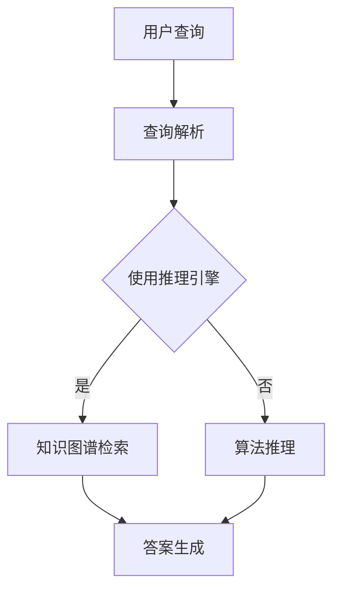

                 

### 文章标题：从RAG到Agent的转变：记忆：维护用户交互的历史，以提供个性化服务

> 关键词：RAG架构、Agent、记忆系统、用户交互历史、个性化服务、知识图谱、算法与推理引擎、问答系统

> 摘要：本文将深入探讨从RAG（知识图谱、算法与推理引擎、问答系统）架构到智能Agent的转变过程，重点分析记忆系统在维护用户交互历史中的作用，以及如何利用这些历史数据来提供个性化服务。文章将分为三个主要部分：首先介绍RAG架构的概念与原理；其次阐述记忆系统的构建与用户交互历史的维护方法；最后讨论个性化服务的实现策略及其优化与评估。通过本文的阅读，读者将了解到如何构建一个具备个性化服务能力的智能Agent，并在实际项目中应用这些技术。

### 目录大纲

1. **第一部分：RAG架构与Agent基础**
   - **第1章：RAG架构的概念与原理**
     - **1.1 RAG架构的引入**
     - **1.2 RAG架构的核心组件**
     - **1.3 RAG架构的优势与应用场景**
   - **第2章：RAG架构的组件详解**
     - **2.1 知识图谱的构建**
       - **2.1.1 知识图谱的基本概念**
       - **2.1.2 知识图谱的构建方法**
       - **2.1.3 知识图谱的应用**
     - **2.2 算法与推理引擎**
       - **2.2.1 推理引擎的基本概念**
       - **2.2.2 推理算法的分类**
       - **2.2.3 推理算法的实现方法**
     - **2.3 问答系统**
       - **2.3.1 问答系统的基本概念**
       - **2.3.2 问答系统的实现方法**
       - **2.3.3 问答系统的优化**
   - **第3章：从RAG到Agent的转变**
     - **3.1 RAG架构与Agent的联系**
     - **3.2 Agent的核心能力**
     - **3.3 Agent的技术架构**

2. **第二部分：记忆与用户交互历史**

   - **第4章：记忆系统的构建**
     - **4.1 记忆系统的基础概念**
     - **4.2 记忆系统的实现方法**
     - **4.3 记忆系统的应用**
   - **第5章：用户交互历史的维护**
     - **5.1 用户交互历史的数据收集**
     - **5.2 用户交互历史的存储与管理**
     - **5.3 用户交互历史的分析与利用**
   - **第6章：记忆与用户交互历史在Agent中的应用**
     - **6.1 记忆与用户交互历史对Agent能力的影响**
     - **6.2 记忆与用户交互历史在问答系统中的应用**
     - **6.3 记忆与用户交互历史在任务执行中的应用**

3. **第三部分：个性化服务实现**

   - **第7章：个性化服务的概念与原理**
     - **7.1 个性化服务的定义**
     - **7.2 个性化服务的技术框架**
     - **7.3 个性化服务的设计原则**
   - **第8章：个性化服务的构建方法**
     - **8.1 基于记忆的个性化推荐系统**
       - **8.1.1 推荐系统的基本概念**
       - **8.1.2 推荐系统的实现方法**
       - **8.1.3 推荐系统的优化**
     - **8.2 基于交互历史的个性化对话系统**
       - **8.2.1 对话系统的基本概念**
       - **8.2.2 对话系统的实现方法**
       - **8.2.3 对话系统的优化**
   - **第9章：个性化服务的评估与优化**
     - **9.1 个性化服务的评估指标**
     - **9.2 个性化服务的优化策略**
     - **9.3 个性化服务的实战案例**

4. **附录**
   - **附录 A：RAG与Agent开发工具与资源**
     - **A.1 RAG开发工具介绍**
     - **A.2 Agent开发工具介绍**
     - **A.3 相关资源与学习路径**

---

### 第1章：RAG架构的概念与原理

#### 1.1 RAG架构的引入

在人工智能（AI）领域，RAG（Knowledge Graph, Algorithm and Reasoning Engine, Question Answering System）架构是一种广泛应用于智能对话系统、推荐系统和知识管理系统的架构。RAG架构由三部分组成：知识图谱、算法与推理引擎以及问答系统。这个架构的出现，使得系统不仅能够提供准确的信息查询服务，还能够进行推理和智能对话，从而更好地满足用户的需求。

RAG架构的发展历程可以追溯到知识图谱和问答系统的早期研究。知识图谱是一种结构化的知识表示方法，通过节点、边和属性来描述实体之间的关系和属性，使得系统在处理问题时能够更直观地理解和利用这些关系。而问答系统则是基于自然语言处理（NLP）技术，通过解析用户的自然语言查询，从知识库中找到匹配的答案。随着算法和推理技术的发展，RAG架构逐渐完善，并成为构建智能系统的重要基础。

RAG架构的重要性在于它不仅能够实现知识的有效组织和存储，还能够利用算法和推理技术，对知识进行深度挖掘和应用。这使得RAG架构在多个领域都得到了广泛应用，如智能客服、智能推荐、智能问答等。通过RAG架构，系统可以更好地理解和满足用户需求，提供高质量的个性化服务。

#### 1.2 RAG架构的核心组件

RAG架构的核心组件包括知识图谱、算法与推理引擎和问答系统，每个组件都在智能系统中扮演着重要的角色。

##### 1.2.1 知识图谱

知识图谱是一种用于表示实体、概念及其之间关系的图形结构。在知识图谱中，实体通常表示为节点，而实体之间的关系和属性则通过边来表示。知识图谱的构建方法主要包括数据采集、数据清洗、实体识别、关系抽取和知识融合等步骤。

知识图谱在智能系统中的应用非常广泛。例如，在智能客服中，知识图谱可以用于构建对话的上下文信息，使得系统能够更好地理解用户的意图。在智能推荐中，知识图谱可以用于表示物品之间的关系，从而提高推荐的准确性。在知识管理系统中，知识图谱可以用于组织和展示企业的知识资产，帮助员工更高效地获取所需信息。

##### 1.2.2 算法与推理引擎

算法与推理引擎是RAG架构中的核心组件，用于对知识图谱进行深度挖掘和应用。推理引擎是一种基于逻辑和数学算法的智能系统，它可以通过推理规则和推理算法，对知识图谱中的信息进行推理和推理。

常见的推理算法包括：

1. **规则推理**：基于预定义的规则，通过匹配和推理，得到新的结论。
2. **模型推理**：基于机器学习模型，对知识图谱中的实体和关系进行预测和推理。
3. **本体推理**：基于本体（Ontology）理论，对知识图谱中的概念和关系进行推理。

算法与推理引擎在智能系统中的应用非常广泛，例如在智能客服中，可以通过推理算法，自动识别用户的意图和需求，并提供相应的建议或解决方案。在智能推荐中，可以通过算法和推理，发现用户和物品之间的潜在关联，从而提供更个性化的推荐。

##### 1.2.3 问答系统

问答系统是RAG架构中的另一个核心组件，用于处理用户的自然语言查询，并从知识库中找到匹配的答案。问答系统通常包括查询解析、答案检索和答案生成三个主要步骤。

查询解析：将用户的自然语言查询转换为系统可以理解和处理的形式。
答案检索：从知识库中找到与查询相关的信息。
答案生成：将检索到的信息转换为自然语言形式，以回答用户的问题。

问答系统在智能系统中的应用非常广泛，例如在智能客服中，可以通过问答系统，自动解答用户的问题，提高客服的效率和用户体验。在智能推荐中，可以通过问答系统，理解用户的偏好和需求，从而提供更个性化的推荐。

#### 1.3 RAG架构的优势与应用场景

RAG架构具有多个优势，使其成为构建智能系统的重要选择：

1. **适应性强**：RAG架构可以应用于多种场景，如智能客服、智能推荐、知识管理、智能问答等，具有很强的适应性。
2. **可扩展性高**：RAG架构中的各个组件可以独立扩展和优化，例如知识图谱可以随着数据的增加而不断更新，算法和推理引擎可以随着技术的发展而优化。
3. **灵活性**：RAG架构允许开发者根据具体需求，选择合适的组件和算法，灵活地构建智能系统。

RAG架构的主要应用场景包括：

1. **企业级应用**：在企业中，RAG架构可以用于构建企业知识管理系统，帮助员工快速获取所需信息，提高工作效率。
2. **人工智能助手**：在智能助手应用中，RAG架构可以用于理解用户的意图和需求，提供智能化的建议和服务。
3. **智能客服系统**：在智能客服系统中，RAG架构可以用于自动解答用户问题，提高客服效率和用户体验。

### Mermaid 流程图

下面是一个简单的Mermaid流程图，展示了RAG架构的核心组件及其相互关系：

### 第2章：RAG架构的组件详解

#### 2.1 知识图谱的构建

##### 2.1.1 知识图谱的基本概念

知识图谱（Knowledge Graph）是一种用于表示实体、概念及其之间关系的图形结构。在知识图谱中，实体通常表示为节点（Node），而实体之间的关系和属性则通过边（Edge）来表示。知识图谱的核心目标是建立实体之间的关系，从而使得信息更加结构化和可查询。

知识图谱的特点包括：

1. **多维度表示**：知识图谱可以同时表示实体、属性、关系和事件，使得信息更加丰富和多样化。
2. **语义理解**：通过实体和关系之间的关联，知识图谱可以提供更深入的理解和语义分析。
3. **高效查询**：知识图谱的结构化表示使得查询更加高效，可以快速找到所需信息。
4. **动态更新**：知识图谱可以根据新数据和事件进行动态更新，保持信息的实时性。

##### 2.1.2 知识图谱的构建方法

构建知识图谱通常包括以下几个步骤：

1. **数据源选择**：选择合适的数据源，包括结构化数据（如数据库）和非结构化数据（如文本、图片等）。
2. **数据预处理**：对采集到的数据进行分析和清洗，去除重复、错误和不相关的数据。
3. **实体识别**：识别数据中的实体，并将它们转换为节点。
4. **关系抽取**：从数据中提取实体之间的关系，并将其表示为边。
5. **知识融合**：将多个数据源中的信息进行融合，构建出一个完整的知识图谱。

常见的知识图谱构建方法包括：

1. **基于规则的方法**：通过预定义的规则，将实体和关系自动抽取到知识图谱中。
2. **基于机器学习的方法**：使用机器学习算法，从数据中自动学习实体和关系，构建知识图谱。
3. **基于知识库的方法**：结合已有的知识库，对数据进行分析和扩展，构建知识图谱。

##### 2.1.3 知识图谱的应用

知识图谱在多个领域都有广泛的应用，以下是一些典型的应用场景：

1. **智能推荐**：通过知识图谱，可以挖掘出物品之间的关联关系，提供个性化的推荐。
2. **智能问答**：利用知识图谱，可以快速回答用户的问题，提供准确的答案。
3. **自然语言处理**：知识图谱可以用于实体识别、关系抽取和语义分析，提高NLP系统的性能。
4. **知识管理**：知识图谱可以帮助组织和管理企业内部的知识资产，提高知识共享和复用。
5. **智能搜索**：知识图谱可以用于构建智能搜索引擎，提供更加精准和相关的搜索结果。

#### 2.2 算法与推理引擎

##### 2.2.1 推理引擎的基本概念

推理引擎（Reasoning Engine）是一种用于处理逻辑推理和知识的系统，它可以利用预定义的规则或学习到的模型，对已知信息进行推理，以生成新的结论。推理引擎是智能系统中的重要组成部分，它能够使系统具有自主学习和决策的能力。

推理引擎的基本功能包括：

1. **规则推理**：基于预定义的规则，对已知信息进行推理，生成新的结论。
2. **模型推理**：基于机器学习模型，对已知信息进行推理，预测新的结果。
3. **本体推理**：基于本体（Ontology）理论，对概念和关系进行推理，以实现知识的自动化推理。

##### 2.2.2 推理算法的分类

推理算法可以根据其原理和应用场景进行分类，以下是一些常见的推理算法：

1. **基于规则的推理**：通过预定义的规则，对已知信息进行推理。常见的算法包括前向推理和反向推理。
2. **基于模型的推理**：通过机器学习模型，对已知信息进行推理。常见的算法包括决策树、支持向量机、神经网络等。
3. **基于本体的推理**：通过本体（Ontology）理论，对概念和关系进行推理。常见的算法包括框架推理、角色推理等。

##### 2.2.3 推理算法的实现方法

实现推理算法通常包括以下几个步骤：

1. **定义规则或模型**：根据应用需求，定义相应的推理规则或机器学习模型。
2. **数据预处理**：对输入数据进行预处理，使其符合推理算法的要求。
3. **推理过程**：根据定义的规则或模型，对输入数据进行分析和推理，生成推理结果。
4. **结果验证**：对推理结果进行验证，确保其准确性和可靠性。

在实际应用中，可以选择合适的推理算法，根据具体需求进行定制化开发。例如，在智能客服中，可以结合规则推理和模型推理，实现高效的智能对话；在知识图谱中，可以结合本体推理，实现知识的自动推理和扩展。

#### 2.3 问答系统

##### 2.3.1 问答系统的基本概念

问答系统（Question Answering System）是一种能够自动处理用户自然语言查询，并返回准确答案的智能系统。问答系统的核心任务是理解用户的查询意图，从知识库中检索相关信息，并生成自然的回答。

问答系统的基本组成部分包括：

1. **查询解析**：将用户的自然语言查询转换为系统可以理解和处理的形式。
2. **答案检索**：从知识库中检索与查询相关的信息。
3. **答案生成**：将检索到的信息转换为自然语言形式，以回答用户的问题。

##### 2.3.2 问答系统的实现方法

实现问答系统通常包括以下几个步骤：

1. **查询解析**：
   - **自然语言理解**：使用自然语言处理技术，对用户查询进行分词、词性标注、句法分析等，提取关键信息。
   - **查询意图识别**：根据提取的关键信息，识别用户的查询意图，如询问信息、请求操作等。

2. **答案检索**：
   - **知识库构建**：构建包含大量知识和信息的知识库，如问答对、事实数据、关系图谱等。
   - **答案匹配**：根据用户的查询意图和知识库中的信息，进行匹配和筛选，找到最相关的答案。

3. **答案生成**：
   - **信息抽取**：从匹配到的答案中，提取关键信息，形成回答的骨架。
   - **文本生成**：使用自然语言生成技术，将提取的信息转换为自然语言形式的回答。

##### 2.3.3 问答系统的优化方法

为了提高问答系统的性能和用户体验，可以采用以下优化方法：

1. **查询解析优化**：
   - **实体识别**：使用实体识别技术，准确识别用户查询中的实体，如人名、地点、组织等。
   - **关系抽取**：使用关系抽取技术，准确识别用户查询中的实体关系，如属于、位于、工作于等。

2. **答案检索优化**：
   - **语义匹配**：使用语义匹配技术，提高答案检索的准确性，如通过词义相似度、语义角色相似度等。
   - **查询重写**：对用户的查询进行语义转换，以适应知识库中的信息表示方式。

3. **答案生成优化**：
   - **模板生成**：使用模板生成技术，快速生成结构化回答，如FAQ列表、流程图等。
   - **自然语言生成**：使用自然语言生成技术，提高回答的自然性和流畅性，如采用生成对抗网络（GAN）等。

通过以上优化方法，问答系统可以更好地理解用户查询，提供更准确和自然的答案，从而提高用户体验和系统的实用性。

### 第3章：从RAG到Agent的转变

#### 3.1 RAG架构与Agent的联系

RAG架构与Agent（智能代理）之间存在紧密的联系，两者共同构成了智能系统的基础框架。RAG架构为Agent提供了核心功能模块，包括知识图谱、算法与推理引擎、问答系统等。通过这些模块，Agent能够实现对知识的获取、理解和应用，从而实现智能化的交互和服务。

在RAG架构中，知识图谱负责存储和表示知识，算法与推理引擎负责对知识进行深度挖掘和应用，问答系统负责处理用户查询并返回答案。这些功能模块共同构成了RAG架构的核心能力，为Agent提供了强大的知识处理和智能交互能力。

Agent则在这些功能模块的基础上，进一步扩展了自主决策和任务执行能力。通过结合知识图谱中的知识，算法与推理引擎的推理能力，以及问答系统的交互能力，Agent能够自主地理解和应对复杂场景，执行特定任务，并提供个性化的服务。

#### 3.2 Agent的核心能力

Agent的核心能力主要体现在以下几个方面：

1. **交互能力**：Agent能够与用户进行自然语言交互，理解用户的意图和需求，并返回相应的答案或建议。通过结合问答系统中的自然语言处理技术和知识图谱中的知识，Agent可以提供高质量的交互体验。

2. **学习能力**：Agent能够通过不断学习和适应用户的行为和需求，提高自身的智能水平。通过机器学习和深度学习等技术，Agent可以自动学习和优化自身的算法和策略，以更好地满足用户需求。

3. **决策能力**：Agent能够根据知识和用户交互历史，进行自主决策，选择最合适的行动方案。通过算法与推理引擎的支持，Agent可以在复杂的环境中做出明智的决策，实现智能化的任务执行。

4. **问题解决能力**：Agent能够处理各种问题，提供解决方案。通过结合知识图谱中的知识和推理能力，Agent可以识别问题、分析原因，并提供相应的解决方案。

#### 3.3 Agent的技术架构

Agent的技术架构通常包括以下几个核心组成部分：

1. **感知模块**：感知模块负责接收外部环境的信息，包括文本、图像、语音等。通过自然语言处理、图像识别、语音识别等技术，感知模块可以将外部信息转化为内部表示。

2. **知识模块**：知识模块负责存储和管理知识，包括知识图谱、本体、规则库等。通过知识图谱的构建和维护，知识模块可以为Agent提供丰富的知识支持。

3. **推理模块**：推理模块负责对知识进行推理和分析，以生成新的结论或解决方案。通过算法与推理引擎的支持，推理模块可以实现复杂的推理任务，提高Agent的智能水平。

4. **决策模块**：决策模块负责根据知识库和推理结果，进行自主决策和任务执行。通过结合机器学习和深度学习等技术，决策模块可以优化策略，提高决策效果。

5. **交互模块**：交互模块负责与用户进行交互，理解用户的意图和需求，并返回相应的答案或建议。通过自然语言生成、对话管理等技术，交互模块可以为用户提供高质量的交互体验。

6. **执行模块**：执行模块负责将决策结果付诸实施，执行具体的任务。通过自动化流程和机器人技术，执行模块可以高效地完成任务，提高生产效率。

通过以上核心组成部分的协同工作，Agent可以实现智能化的交互和服务，满足用户的多样化需求。在实际应用中，可以根据具体场景和需求，灵活调整和优化Agent的技术架构，以实现最佳效果。

### 第4章：记忆系统的构建

#### 4.1 记忆系统的基础概念

记忆系统在人工智能系统中扮演着至关重要的角色，它能够存储、管理和利用历史数据，以提供更加智能和个性化的服务。记忆系统的核心目的是通过学习和推理，从过去的信息中提取有价值的信息，并将其应用于当前或未来的任务中。

记忆系统的基础概念包括以下几个方面：

1. **数据存储**：记忆系统需要高效地存储大量的历史数据，这些数据可以是用户行为、交互记录、偏好信息等。存储方式包括关系数据库、NoSQL数据库、分布式文件系统等。

2. **数据管理**：记忆系统需要对存储的数据进行有效的管理和组织，以便快速检索和利用。数据管理包括数据的索引、分类、缓存等。

3. **数据提取**：记忆系统需要能够从存储的数据中提取有价值的信息，这些信息可以用于训练模型、推理过程或直接作为服务输出。数据提取方法包括关键词提取、模式识别、聚类分析等。

4. **数据更新**：记忆系统需要能够实时更新数据，以反映用户最新的行为和偏好。数据更新可以通过增量学习、实时同步等方式实现。

5. **数据隐私**：在构建记忆系统时，需要考虑到数据隐私和安全问题。数据隐私保护措施包括数据加密、访问控制、数据去识别化等。

#### 4.2 记忆系统的实现方法

记忆系统的实现方法多种多样，下面介绍几种常见的实现方法：

1. **基于数据库的内存系统**：
   - **数据库选择**：选择适合的数据存储解决方案，如关系数据库（如MySQL）或NoSQL数据库（如MongoDB）。
   - **数据模型设计**：设计合适的数据模型，以存储用户交互历史和偏好信息。数据模型应具备良好的扩展性和查询性能。
   - **数据索引**：为了提高查询效率，需要对关键数据字段建立索引。
   - **数据同步**：实现数据同步机制，以保证内存系统和数据库之间的数据一致性。

2. **基于机器学习的记忆系统**：
   - **特征工程**：从用户交互历史中提取特征，如用户的行为模式、偏好、历史交互等。
   - **模型训练**：使用机器学习算法，如决策树、神经网络等，训练记忆模型，以预测用户未来的行为和需求。
   - **模型评估**：通过评估指标（如准确率、召回率等）评估模型的性能，并调整模型参数以优化性能。

3. **基于知识图谱的记忆系统**：
   - **知识图谱构建**：构建包含用户交互历史和偏好信息的知识图谱，以表示用户和物品之间的关系。
   - **推理算法**：使用推理算法，如规则推理、图推理等，从知识图谱中提取有价值的信息，为用户提供个性化服务。

4. **基于区块链的记忆系统**：
   - **数据存储**：利用区块链技术，实现去中心化的数据存储和管理。
   - **数据加密**：使用加密算法，保护用户数据的隐私和安全。
   - **智能合约**：通过智能合约，实现自动化的数据更新和验证，提高系统的可扩展性和安全性。

#### 4.3 记忆系统的应用

记忆系统在多个领域都有广泛的应用，下面介绍几个典型的应用场景：

1. **个性化推荐**：
   - **用户行为分析**：通过分析用户的历史行为，如浏览记录、购买记录等，提取用户兴趣和偏好。
   - **推荐算法**：利用记忆系统存储的用户行为数据，结合机器学习算法，为用户推荐感兴趣的内容或产品。
   - **实时更新**：根据用户最新的行为和反馈，实时更新推荐列表，提高推荐的准确性和用户体验。

2. **智能客服**：
   - **交互历史记录**：记录用户与客服的交互历史，包括提问、回答、操作等。
   - **智能回复**：利用记忆系统，从历史交互数据中提取相关信息，为用户提供智能化的回复。
   - **上下文保持**：通过记忆系统，保持与用户的交互上下文，提高对话的连贯性和用户满意度。

3. **智能助理**：
   - **任务记录**：记录用户的任务请求和执行历史，如日程安排、任务提醒等。
   - **自动执行**：利用记忆系统，根据用户的历史任务和偏好，自动执行相关任务，如发送提醒、预约会议等。
   - **个性化服务**：通过分析用户的历史数据和偏好，为用户提供定制化的服务和建议。

通过以上应用场景，可以看出记忆系统在人工智能系统中扮演着关键角色，它不仅能够提高系统的智能水平，还能够提供个性化、高效的服务，从而提升用户体验。

### 第5章：用户交互历史的维护

#### 5.1 用户交互历史的数据收集

用户交互历史的数据收集是构建记忆系统的重要步骤，它涉及到数据的来源、类型和收集方法。以下是关于用户交互历史数据收集的详细介绍：

##### 5.1.1 用户交互数据的类型

用户交互历史数据可以分为以下几类：

1. **行为数据**：包括用户的点击行为、浏览路径、搜索关键词等。这些数据反映了用户在平台上的活动轨迹，是构建用户画像的重要基础。
2. **交互数据**：包括用户与系统的交互记录，如提问、留言、评价等。这些数据可以帮助了解用户的反馈和需求，为改进产品和服务提供依据。
3. **偏好数据**：包括用户的兴趣偏好、购买记录、浏览记录等。这些数据反映了用户的个性化需求，是提供个性化推荐和服务的关键。
4. **环境数据**：包括用户的地理位置、设备类型、操作系统等信息。这些数据可以帮助系统更好地适应用户的环境，提供定制化的服务。

##### 5.1.2 用户交互数据的收集方法

收集用户交互历史数据的方法主要包括以下几种：

1. **日志采集**：通过在系统中嵌入日志采集器，实时记录用户的行为和交互数据。日志采集器可以捕获用户的每一次操作，如点击、浏览、搜索等。
2. **前端埋点**：在网页或客户端应用程序中，通过设置埋点标记，记录用户的行为数据。前端埋点是一种非侵入性的数据采集方法，不会影响用户的正常使用。
3. **用户反馈**：通过用户调查、用户访谈等方式，收集用户的反馈和需求。这种方式可以获取更加深入的用户信息和真实感受。
4. **第三方数据源**：通过第三方数据平台，获取用户的公开数据，如社交媒体、地理位置等。这种方式可以补充系统的数据来源，提高数据完整性。

##### 5.1.3 用户交互数据的处理方法

收集到用户交互历史数据后，需要对数据进行处理，以提高数据的质量和应用效果。以下是几种常见的用户交互数据处理方法：

1. **数据清洗**：数据清洗是数据预处理的重要步骤，用于去除数据中的噪声和错误，提高数据的准确性。常见的数据清洗方法包括去重、缺失值填补、异常值检测等。
2. **数据转换**：数据转换是将数据从一种格式转换为另一种格式的过程，以提高数据的兼容性和易用性。常见的数据转换方法包括数据类型转换、数据格式转换等。
3. **数据集成**：数据集成是将来自不同来源的数据进行整合，形成一个统一的数据视图。数据集成可以提高数据的一致性和可用性，为分析和应用提供便利。
4. **数据存储**：将处理后的数据存储到合适的数据库或数据仓库中，以便后续的分析和应用。常见的数据存储解决方案包括关系数据库、NoSQL数据库、分布式文件系统等。

通过以上数据收集和处理方法，用户交互历史数据可以更加准确地反映用户的真实行为和需求，为构建记忆系统和提供个性化服务提供可靠的数据支持。

#### 5.2 用户交互历史的存储与管理

用户交互历史数据的存储与管理是构建记忆系统的关键环节，它关系到数据的安全性、完整性和可访问性。以下是关于用户交互历史数据存储与管理的详细介绍：

##### 5.2.1 用户交互历史的数据结构

用户交互历史的数据结构需要能够灵活地存储不同类型的数据，并支持高效的数据查询和操作。常见的数据结构包括以下几种：

1. **关系数据库**：关系数据库适用于存储结构化数据，通过表与表之间的关联，可以构建复杂的数据关系。常见的数据库管理系统（DBMS）包括MySQL、PostgreSQL等。
2. **NoSQL数据库**：NoSQL数据库适用于存储半结构化或非结构化数据，如文档、图形、键值对等。常见的NoSQL数据库包括MongoDB、Cassandra、Neo4j等。
3. **时间序列数据库**：时间序列数据库适用于存储和查询时间戳相关的数据，如用户行为日志、系统性能指标等。常见的时间序列数据库包括InfluxDB、TimescaleDB等。
4. **分布式文件系统**：分布式文件系统适用于存储大规模数据，通过分布式架构实现数据的高可用性和高性能。常见的分布式文件系统包括HDFS、Ceph等。

##### 5.2.2 用户交互历史的存储方法

用户交互历史的存储方法需要考虑数据的安全性、完整性和高性能。以下是几种常见的用户交互历史存储方法：

1. **关系数据库存储**：
   - **表结构设计**：根据用户交互历史数据的类型和关系，设计合适的表结构。例如，用户行为数据可以存储在行为日志表中，用户偏好数据可以存储在偏好表中。
   - **索引策略**：为频繁查询的字段建立索引，以提高查询效率。例如，为用户ID、时间戳等字段建立主索引，为查询条件建立辅助索引。
   - **事务管理**：使用事务管理机制，确保数据的一致性和完整性。例如，使用事务隔离级别、回滚机制等。

2. **NoSQL数据库存储**：
   - **文档存储**：使用文档存储模型，存储用户交互历史数据，如行为记录、偏好设置等。文档模型可以灵活调整字段和结构，适应不同类型的数据。
   - **图形存储**：使用图形存储模型，存储用户交互历史中的复杂关系，如社交网络、商品关系等。图形模型可以高效地表示和查询多对多关系。
   - **键值存储**：使用键值存储模型，存储简单的用户交互数据，如用户ID、行为ID等。键值模型具有高性能的读写能力，适用于高并发场景。

3. **时间序列数据库存储**：
   - **数据分区**：将时间序列数据按时间范围分区，以提高查询效率。例如，将用户行为数据按月份或年份分区，减少查询范围。
   - **压缩存储**：使用数据压缩技术，减少存储空间占用。例如，使用LZ4、Snappy等压缩算法，提高数据存储密度。
   - **高可用性**：使用分布式架构，确保数据的高可用性和高性能。例如，使用主从复制、分片集群等机制，实现数据的负载均衡和高可用性。

4. **分布式文件系统存储**：
   - **数据分布**：将用户交互历史数据分布存储到多个节点上，以提高数据存储和访问的性能。例如，使用HDFS，将数据分布存储到集群中的各个节点。
   - **数据冗余**：使用数据冗余策略，确保数据的高可靠性和容错能力。例如，使用RAID技术，提高数据的读写性能和容错能力。
   - **数据备份**：定期备份数据，以防数据丢失或损坏。例如，使用增量备份、全量备份等技术，实现数据的定期备份和恢复。

##### 5.2.3 用户交互历史的查询方法

用户交互历史的查询方法需要考虑查询效率和数据一致性。以下是几种常见的用户交互历史查询方法：

1. **关系数据库查询**：
   - **SQL查询**：使用SQL语言，编写复杂的查询语句，从关系数据库中检索用户交互历史数据。SQL查询支持多种查询操作，如选择、连接、分组等。
   - **索引优化**：通过优化索引策略，提高查询效率。例如，为查询条件建立合适的索引，减少查询扫描范围。
   - **缓存机制**：使用缓存机制，减少数据库的查询压力。例如，使用Redis等缓存系统，缓存常用查询结果，减少数据库访问。

2. **NoSQL数据库查询**：
   - **查询语言**：使用NoSQL数据库提供的查询语言，检索用户交互历史数据。例如，使用MongoDB的Find方法，检索文档数据。
   - **索引策略**：通过优化索引策略，提高查询效率。例如，为查询字段建立索引，减少查询时间。
   - **聚合查询**：使用聚合查询，对用户交互历史数据进行汇总和分析。例如，使用MongoDB的聚合框架，对文档数据进行分组、计算等操作。

3. **时间序列数据库查询**：
   - **时间范围查询**：使用时间范围查询，检索特定时间范围内的用户交互历史数据。例如，使用InfluxDB的时间范围查询，检索特定时间段的日志数据。
   - **数据分区查询**：通过查询数据分区，提高查询效率。例如，根据时间分区，快速定位到特定时间范围内的数据。
   - **批量查询**：使用批量查询，提高数据检索效率。例如，使用批处理技术，一次性查询多个时间序列数据。

4. **分布式文件系统查询**：
   - **分布式查询**：通过分布式查询，实现并行查询和负载均衡。例如，使用HDFS的MapReduce框架，对分布式文件系统中的数据进行并行处理。
   - **索引服务**：使用索引服务，提高查询效率。例如，使用HBase等索引系统，对分布式文件系统中的数据进行索引和查询。
   - **数据聚合**：使用数据聚合技术，对分布式文件系统中的数据进行汇总和分析。例如，使用Hadoop的MapReduce框架，对分布式文件系统中的数据进行聚合计算。

通过以上存储与管理方法，用户交互历史数据可以高效、安全地存储和管理，为构建记忆系统和提供个性化服务提供可靠的数据支持。

### 第6章：记忆与用户交互历史在Agent中的应用

#### 6.1 记忆与用户交互历史对Agent能力的影响

记忆系统和用户交互历史对于智能Agent的能力提升具有重要意义。记忆系统通过存储和利用用户历史数据，使Agent能够更好地理解用户需求和偏好，从而提供更个性化的服务。而用户交互历史则为记忆系统提供了丰富的数据来源，使记忆系统能够不断学习和优化，提高Agent的智能水平。

首先，记忆系统使Agent具备持续学习的能力。通过存储用户的交互历史数据，Agent可以不断更新和扩展其知识库，从而在未来的交互中能够更好地理解用户的意图和需求。例如，在智能客服应用中，记忆系统可以帮助Agent记住用户的购买历史、偏好设置等信息，从而在后续的交互中提供更加个性化的推荐和服务。

其次，用户交互历史为Agent提供了丰富的上下文信息。用户在每次交互中都会产生大量的行为和反馈数据，这些数据反映了用户的当前状态和需求。通过分析这些历史数据，Agent可以更好地理解用户的意图和背景，从而提供更加精准的服务。例如，在智能助理应用中，Agent可以通过用户的历史日程安排、工作内容等信息，合理安排任务和时间，提高工作效率。

此外，记忆系统和用户交互历史还提高了Agent的响应速度和准确性。通过记忆系统，Agent可以快速访问用户的历史数据，避免重复询问和查询，提高交互效率。同时，用户交互历史可以帮助Agent识别用户的潜在需求和问题，提前准备相应的解决方案，提高服务的准确性。

#### 6.2 记忆与用户交互历史在问答系统中的应用

记忆系统和用户交互历史在问答系统中发挥着重要作用，能够显著提高问答系统的性能和用户体验。

首先，记忆系统可以用于快速检索和推荐答案。通过存储大量的用户交互历史数据，问答系统可以在处理用户查询时，快速访问相关的历史记录，从而找到最相关和最准确的答案。例如，在一个基于知识图谱的问答系统中，记忆系统可以帮助快速定位到与用户查询相关的实体和关系，从而提供准确的答案。

其次，用户交互历史可以用于改进问答系统的意图识别和上下文理解。通过分析用户的历史交互数据，问答系统可以更好地理解用户的意图和需求，从而提供更准确的回答。例如，在处理一个复杂的查询时，问答系统可以通过用户的历史交互记录，识别出用户的关键意图和上下文信息，从而提供更加精准的回答。

此外，记忆系统和用户交互历史还可以用于优化问答系统的推荐算法。通过分析用户的历史交互数据，问答系统可以了解用户的偏好和兴趣，从而在回答问题之外，为用户提供相关的推荐内容。例如，在一个基于电商平台的问答系统中，记忆系统可以根据用户的历史购买记录和浏览记录，为用户提供相关的商品推荐，从而提高用户的购物体验。

#### 6.3 记忆与用户交互历史在任务执行中的应用

记忆系统和用户交互历史在智能Agent的任务执行中同样发挥着重要作用，能够显著提高任务执行的效果和效率。

首先，记忆系统可以帮助智能Agent更好地理解任务目标和用户需求。通过存储用户的历史交互数据和任务执行记录，智能Agent可以了解用户在执行任务过程中的偏好和期望，从而在执行任务时提供更加个性化的服务。例如，在一个智能助手应用中，记忆系统可以帮助智能Agent记住用户的日程安排、任务提醒等信息，从而在执行任务时提供更加周到的服务。

其次，用户交互历史可以用于优化任务执行的策略和流程。通过分析用户的历史交互记录，智能Agent可以了解用户在执行任务时的行为模式和心理预期，从而优化任务执行的策略和流程。例如，在一个智能客服应用中，智能Agent可以通过用户的历史交互数据，调整对话策略和响应方式，以提高用户的满意度和任务完成率。

此外，记忆系统和用户交互历史还可以用于预测和预防潜在问题。通过分析用户的历史交互数据和任务执行记录，智能Agent可以预测用户可能遇到的问题，并提前准备相应的解决方案。例如，在一个智能家居系统中，智能Agent可以通过用户的历史使用数据和天气信息，提前预测用户可能需要的设备调节，从而提高用户的舒适度和满意度。

### 第7章：个性化服务的概念与原理

#### 7.1 个性化服务的定义

个性化服务（Personalized Service）是指根据用户的需求、偏好和行为，提供定制化的服务内容和服务方式。个性化服务的核心目标是通过满足用户的个性化需求，提高用户体验和服务满意度。

个性化服务的定义可以从以下几个方面理解：

1. **用户中心**：个性化服务以用户为中心，关注用户的需求和体验，而不是单一的产品或服务。
2. **数据驱动**：个性化服务依赖于大数据和用户行为分析，通过数据挖掘和分析，了解用户的偏好和需求。
3. **定制化**：个性化服务提供的内容和方式根据用户的个性化需求进行定制，以满足用户的个性化需求。
4. **智能化**：个性化服务利用人工智能、机器学习等技术，实现自动化、智能化的个性化推荐和服务。

#### 7.2 个性化服务的技术框架

个性化服务的技术框架主要包括以下几个关键组成部分：

1. **数据采集与存储**：通过数据采集工具，收集用户的行为数据、偏好数据等，并将这些数据存储在数据仓库或数据湖中，以便后续分析和处理。
2. **用户画像**：基于数据采集与存储，对用户进行画像，包括用户的兴趣、行为、需求等。用户画像有助于了解用户的个性化特征，为后续的个性化推荐和服务提供依据。
3. **推荐算法**：利用用户画像和推荐算法，为用户提供个性化的推荐内容。推荐算法包括协同过滤、基于内容的推荐、混合推荐等。
4. **服务引擎**：基于推荐结果，通过服务引擎实现个性化服务的生成和分发。服务引擎可以根据用户的需求，动态生成和调整服务内容和服务方式。
5. **用户反馈**：通过用户反馈机制，收集用户对个性化服务的反馈，用于优化和改进服务。用户反馈有助于提高个性化服务的质量和用户满意度。

#### 7.3 个性化服务的设计原则

设计个性化服务时，应遵循以下原则，以确保服务的质量和用户体验：

1. **用户体验导向**：以用户为中心，关注用户的感受和需求，提供简单易用、直观的服务界面和交互方式。
2. **数据驱动**：依赖数据分析和用户行为分析，不断优化和调整服务内容和服务方式，以提高个性化服务的准确性和效果。
3. **灵活可扩展**：设计具有良好扩展性的技术架构和业务流程，以适应不断变化的市场需求和用户需求。
4. **个性化定制**：提供多样化的服务内容和方式，满足不同用户的个性化需求，提高用户满意度和忠诚度。
5. **智能化**：利用人工智能和机器学习技术，实现自动化、智能化的个性化推荐和服务，提高服务效率和质量。

通过遵循以上设计原则，个性化服务能够更好地满足用户需求，提高用户满意度和市场竞争力。

### 第8章：个性化服务的构建方法

#### 8.1 基于记忆的个性化推荐系统

个性化推荐系统是构建个性化服务的重要模块，通过分析用户的历史行为和偏好，为用户提供个性化的推荐内容。记忆系统在这一过程中发挥着关键作用，能够提高推荐系统的效果和用户体验。

##### 8.1.1 推荐系统的基本概念

推荐系统（Recommender System）是一种基于用户行为和偏好数据，为用户推荐相关物品或内容的系统。推荐系统的目标是通过分析用户的历史行为和偏好，预测用户对哪些物品或内容可能感兴趣，从而提高用户满意度和活跃度。

推荐系统的主要组成部分包括：

1. **用户数据**：包括用户的行为数据、偏好数据、社交数据等，用于构建用户画像。
2. **物品数据**：包括物品的特征数据、标签数据等，用于描述物品属性。
3. **推荐算法**：根据用户数据和物品数据，通过算法计算推荐结果。
4. **推荐引擎**：负责将推荐算法生成的推荐结果呈现给用户。

##### 8.1.2 推荐系统的实现方法

构建个性化推荐系统通常包括以下几个步骤：

1. **数据采集**：通过日志采集、API接口等方式，收集用户的行为数据（如点击、浏览、购买等）和物品数据（如商品信息、内容标签等）。
2. **数据预处理**：对采集到的数据进行分析和清洗，去除重复、错误和不相关的数据，并进行特征提取和转换，如用户特征向量和物品特征向量。
3. **用户画像构建**：根据用户行为和偏好数据，构建用户画像，包括用户兴趣、行为模式等。
4. **物品画像构建**：根据物品特征数据，构建物品画像，包括物品属性、标签等。
5. **推荐算法选择与实现**：选择合适的推荐算法，如协同过滤、基于内容的推荐、混合推荐等，实现推荐算法，生成推荐结果。
6. **推荐结果呈现**：通过推荐引擎，将推荐结果呈现给用户，如推荐列表、推荐页面等。

##### 8.1.3 推荐系统的优化方法

为了提高推荐系统的效果和用户体验，可以采用以下优化方法：

1. **特征工程**：通过特征提取和转换，提高数据的质量和表达能力。例如，使用TF-IDF、词袋模型等方法，对文本数据进行特征提取。
2. **模型优化**：选择合适的推荐算法，并通过模型调参、交叉验证等方法，优化模型性能。例如，使用矩阵分解、神经网络等方法，提高推荐准确性。
3. **冷启动问题**：解决新用户和新物品的推荐问题，如基于内容的方法、基于协同过滤的方法等。
4. **实时推荐**：实现实时推荐，提高推荐响应速度和用户体验。例如，使用流计算、增量计算等方法，实现实时数据分析和推荐。
5. **用户反馈**：收集用户对推荐内容的反馈，用于优化推荐算法和推荐结果。例如，使用反馈信号、交互日志等方法，调整推荐策略。

通过以上优化方法，个性化推荐系统可以更好地满足用户需求，提高用户满意度和系统效果。

#### 8.2 基于交互历史的个性化对话系统

个性化对话系统是构建个性化服务的重要模块，通过分析用户的交互历史和偏好，为用户提供个性化的对话内容和互动体验。交互历史在这一过程中起着关键作用，能够提高对话系统的效果和用户体验。

##### 8.2.1 对话系统的基本概念

对话系统（Dialogue System）是一种能够与用户进行自然语言交互，理解用户意图，并生成自然语言回复的智能系统。对话系统的目标是通过与用户的对话，提供有用的信息、完成任务或解决问题。

对话系统的主要组成部分包括：

1. **对话管理**：负责管理对话流程，包括对话状态跟踪、对话策略制定等。
2. **自然语言理解**：负责解析用户输入的自然语言，提取意图和实体信息。
3. **自然语言生成**：负责生成自然语言回复，包括回答问题、提出建议等。
4. **对话界面**：负责展示对话内容，提供用户输入和系统回复的交互界面。

##### 8.2.2 对话系统的实现方法

构建个性化对话系统通常包括以下几个步骤：

1. **对话管理**：
   - **状态跟踪**：记录对话过程中的状态信息，如当前对话阶段、用户意图等。
   - **策略制定**：根据对话状态和用户意图，制定对话策略，如问题引导、信息搜索等。
2. **自然语言理解**：
   - **意图识别**：使用自然语言处理技术，解析用户输入的自然语言，识别用户意图。
   - **实体提取**：从用户输入中提取关键信息，如名词、动词、时间等，作为对话的实体。
3. **自然语言生成**：
   - **回复生成**：根据用户意图和对话状态，生成合适的自然语言回复。
   - **模板匹配**：使用预定义的回复模板，快速生成自然语言回复。
   - **文本生成**：使用自然语言生成技术，生成更加自然和流畅的回复。
4. **对话界面**：
   - **输入处理**：接收用户输入，进行自然语言处理和对话管理。
   - **回复展示**：将系统生成的回复展示给用户，提供交互界面。

##### 8.2.3 对话系统的优化方法

为了提高对话系统的效果和用户体验，可以采用以下优化方法：

1. **意图识别优化**：
   - **实体识别**：使用实体识别技术，提高意图识别的准确性。
   - **上下文理解**：考虑对话上下文，提高意图识别的准确性。
2. **对话生成优化**：
   - **回复流畅性**：使用自然语言生成技术，生成更加自然和流畅的回复。
   - **回复多样性**：使用多种回复模板和策略，提高回复的多样性和个性化。
3. **对话管理优化**：
   - **状态跟踪**：使用更加精确的状态跟踪方法，提高对话管理的效果。
   - **策略优化**：根据用户反馈和对话效果，不断优化对话策略。
4. **用户反馈**：
   - **反馈机制**：建立用户反馈机制，收集用户对对话系统的评价和反馈。
   - **反馈学习**：使用用户反馈，优化对话系统和对话策略。

通过以上优化方法，个性化对话系统可以更好地理解用户需求，提供更加自然和个性化的对话体验。

### 第9章：个性化服务的评估与优化

#### 9.1 个性化服务的评估指标

个性化服务的评估指标是衡量服务质量和用户满意度的重要工具。以下是一些常用的个性化服务评估指标：

1. **准确率**（Accuracy）：准确率表示个性化服务推荐或预测的正确率。它通过比较推荐结果与用户实际偏好或行为的匹配程度来评估服务的准确性。计算公式为：准确率 = （正确推荐数量 / 总推荐数量）× 100%。

2. **召回率**（Recall）：召回率表示个性化服务能够从所有可能的推荐中召回与用户偏好最相关的推荐的比例。它关注于评估服务能否全面覆盖用户的潜在兴趣点。计算公式为：召回率 = （正确召回的数量 / 总相关推荐数量）× 100%。

3. **覆盖率**（Coverage）：覆盖率表示个性化服务推荐的结果中，与用户实际兴趣相关的推荐所占的比例。它用于评估服务推荐内容的多样性。计算公式为：覆盖率 = （与用户实际兴趣相关的推荐数量 / 总推荐数量）× 100%。

4. **平均绝对误差**（Mean Absolute Error, MAE）：平均绝对误差用于评估个性化服务预测的准确性。它计算预测值与实际值之间的平均绝对差值。计算公式为：MAE = （Σ|预测值 - 实际值|）/ n，其中n为样本数量。

5. **均方根误差**（Root Mean Square Error, RMSE）：均方根误差是平均绝对误差的平方根，用于评估预测的稳定性和准确性。计算公式为：RMSE = √（Σ（预测值 - 实际值）²）/ n。

6. **用户满意度**（Customer Satisfaction）：用户满意度是直接从用户角度评估个性化服务的满意度。通常通过问卷调查或用户评分来获取。用户满意度越高，表示个性化服务越成功。

7. **点击率**（Click-Through Rate, CTR）：点击率用于评估个性化推荐内容的吸引力。它表示用户点击推荐内容的比例。计算公式为：点击率 = （点击次数 / 展示次数）× 100%。

8. **转化率**（Conversion Rate）：转化率表示用户在个性化推荐作用下完成特定动作（如购买、注册等）的比例。它用于评估个性化服务对用户行为的实际影响。

#### 9.2 个性化服务的优化策略

为了提高个性化服务的质量和用户体验，可以采用以下优化策略：

1. **数据质量提升**：
   - **数据清洗**：对用户数据和行为数据进行清洗，去除噪声和异常值，提高数据质量。
   - **数据补充**：通过第三方数据源或用户反馈，补充用户缺失的数据，丰富用户画像。

2. **特征工程**：
   - **特征选择**：通过特征选择方法，选择与用户偏好和兴趣密切相关的特征，提高推荐效果。
   - **特征转换**：对原始数据进行特征转换，如文本分类、归一化、离散化等，提高数据的表达能力和计算效率。

3. **算法优化**：
   - **模型选择**：选择合适的推荐算法和预测模型，如协同过滤、基于内容的推荐、神经网络等，根据实际场景和需求进行调整。
   - **模型调参**：通过交叉验证和模型调参，优化模型的参数设置，提高预测准确性和鲁棒性。

4. **冷启动处理**：
   - **基于内容的推荐**：对于新用户或新物品，可以使用基于内容的推荐方法，根据物品的属性和标签进行推荐。
   - **基于用户相似度**：通过计算用户之间的相似度，为新用户推荐与其兴趣相似的物品。

5. **实时推荐**：
   - **流处理技术**：采用流处理技术，如Apache Kafka、Apache Flink等，实现实时数据分析和推荐。
   - **增量计算**：对用户行为进行增量计算，快速更新推荐结果，提高推荐实时性。

6. **用户反馈机制**：
   - **反馈收集**：建立用户反馈机制，通过问卷调查、用户评分等方式收集用户对推荐内容的反馈。
   - **反馈学习**：利用用户反馈，调整推荐策略和模型参数，优化推荐效果。

7. **个性化体验**：
   - **界面优化**：设计简洁、直观的界面，提高用户的操作体验。
   - **个性化展示**：根据用户偏好和兴趣，个性化展示推荐内容，提高用户的点击率和满意度。

通过以上优化策略，个性化服务可以在满足用户个性化需求的同时，提高服务质量，增强用户体验。

### 9.3 个性化服务的实战案例

在实际应用中，个性化服务在多个领域都取得了显著成效，以下是一些具体的实战案例：

#### 案例一：电子商务平台个性化推荐

某大型电子商务平台通过构建个性化推荐系统，为用户提供个性化的商品推荐。平台首先通过用户行为数据（如浏览、购买、收藏等）构建用户画像，然后使用协同过滤算法和基于内容的推荐算法，生成个性化的商品推荐。通过实时数据分析和用户反馈，平台不断优化推荐算法和推荐策略，提高了用户满意度和转化率。

#### 案例二：智能语音助手个性化交互

某智能语音助手通过分析用户的交互历史和偏好，为用户提供个性化的对话体验。助手利用自然语言处理技术，理解用户的意图和需求，并通过记忆系统，记住用户的偏好和对话历史，提供个性化的回复和建议。用户可以通过反馈机制，对助手的服务进行评价和反馈，助手根据用户反馈不断优化对话策略和回复内容。

#### 案例三：金融行业个性化理财服务

某金融公司通过构建个性化理财服务系统，为用户提供个性化的理财建议。系统通过用户财务数据、投资偏好和历史交易记录，构建用户画像，并使用机器学习算法，预测用户的投资风险承受能力和预期收益。根据用户画像和预测结果，系统为用户推荐个性化的理财产品，并实时跟踪用户的投资表现，提供个性化的投资建议和调整策略。

这些案例展示了个性化服务在不同领域的应用效果，通过数据分析、算法优化和用户反馈，个性化服务不仅提高了用户满意度和忠诚度，还为公司创造了商业价值。

### 附录 A：RAG与Agent开发工具与资源

#### A.1 RAG开发工具介绍

1. **知识图谱开发工具**：
   - **Neo4j**：一款高性能的图形数据库，适用于构建和管理大规模知识图谱。
   - **OpenKG**：一款开源的中文知识图谱构建工具，提供了丰富的API和插件。

2. **推理引擎开发工具**：
   - **RDF4J**：一款开源的RDF（Resource Description Framework）存储和推理引擎。
   - **OWLAPI**：一款开源的OWL（Web Ontology Language）编辑和推理工具。

3. **问答系统开发工具**：
   - **ALPACA**：一款开源的问答系统框架，支持多种问答算法和对话管理策略。
   - **ChatGLM**：一款基于预训练语言模型的对话系统，提供了简单的API接口。

#### A.2 Agent开发工具介绍

1. **Agent开发框架**：
   - **Muse**：一款基于Java的智能代理开发框架，提供了代理生命周期管理、对话管理等功能。
   - **Jade**：一款基于Agent的分布式模拟平台，适用于构建分布式智能系统。

2. **自然语言处理工具**：
   - **NLTK**：一款流行的自然语言处理库，提供了丰富的文本处理和语言模型功能。
   - **spaCy**：一款高效的自然语言处理库，适用于文本解析、实体识别和关系抽取。

3. **机器学习平台**：
   - **TensorFlow**：一款开源的机器学习框架，适用于构建和训练大规模机器学习模型。
   - **PyTorch**：一款流行的深度学习框架，提供了简洁的API和强大的功能。

#### A.3 相关资源与学习路径

1. **在线课程**：
   - **《知识图谱：概念、构建与应用》**：提供了知识图谱的全面介绍和实战案例。
   - **《人工智能助手开发实战》**：介绍了智能代理和对话系统的构建方法。

2. **书籍推荐**：
   - **《图数据库实战》**：详细介绍了Neo4j的使用方法和知识图谱构建技巧。
   - **《Python自然语言处理》**：提供了丰富的NLP技术和应用案例。

3. **技术社区**：
   - **CSDN**：提供了大量的技术文章和教程，适合初学者和进阶者。
   - **GitHub**：有许多开源项目和技术社区，可以学习和贡献代码。

通过以上工具和资源，开发者可以更高效地构建RAG架构和智能Agent，掌握相关技术和方法，为实际项目提供有力支持。

