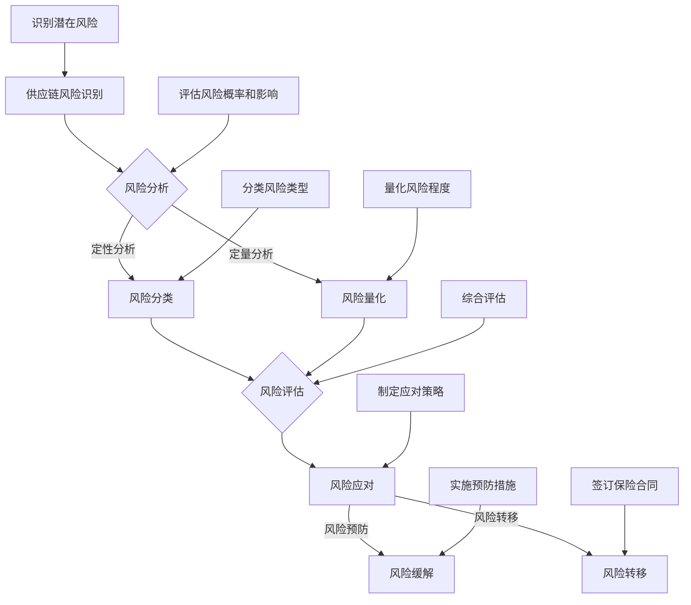

                 

# 文章标题：供应链风险管理提升电商稳定性

> 关键词：供应链风险管理、电商稳定性、风险评估、供应链网络重构、供应链金融管理

> 摘要：
本文旨在探讨供应链风险管理在提升电商稳定性方面的作用。通过分析供应链风险管理的背景与意义，阐述其核心要素和框架方法，本文进一步讨论了电商业务风险识别与评估、电商供应链优化与风险管理、电商运营风险管理、电商市场风险分析与应对、电商供应链金融与风险管理以及电商供应链风险管理体系建设等方面。通过具体案例解析，本文为电商企业在供应链风险管理方面提供了实用策略和工具，以提升电商业务的稳定性和竞争力。

----------------------------------------------------------------

## 目录大纲：《供应链风险管理提升电商稳定性》

1. **引言**
    - 供应链风险管理的重要性
    - 电商稳定性与供应链风险管理的关系
    - 本文结构安排与内容概述

2. **第一部分：供应链风险管理概述**
    - 第1章：供应链风险管理的背景与意义
        - 供应链风险的概念与分类
        - 供应链风险管理的重要性
        - 供应链风险管理的发展历程
    - 第2章：供应链风险管理的框架与方法
        - 风险评估框架
            - 风险识别
            - 风险分析
            - 风险评估
        - 风险应对策略
            - 风险预防
            - 风险缓解
            - 风险转移
    - 第3章：供应链风险管理的核心要素
        - 供应链网络设计
        - 供应链信息管理
        - 供应链金融管理

3. **第二部分：电商稳定性提升策略**
    - 第4章：电商业务风险识别与评估
        - 电商业务特点与风险类型
        - 电商风险评估方法
    - 第5章：电商供应链优化与风险管理
        - 供应链网络重构
        - 供应链协同与整合
        - 供应链可视化与监控
    - 第6章：电商运营风险管理
        - 运营风险管理策略
        - 运营风险应对措施
    - 第7章：电商市场风险分析与应对
        - 市场风险因素分析
        - 市场风险应对策略
    - 第8章：电商供应链金融与风险管理
        - 供应链金融概述
        - 供应链金融风险管理
    - 第9章：电商供应链风险管理体系建设
        - 风险管理体系设计
        - 风险管理能力提升

4. **第三部分：电商供应链风险管理案例解析**
    - 第10章：电商供应链风险管理案例解析
        - 案例背景与目标
        - 风险识别与评估
        - 风险应对与实施
        - 案例总结与启示

5. **附录：供应链风险管理资源与工具**
    - 附录1：供应链风险管理相关法规与政策
    - 附录2：供应链风险管理常用工具与技术
    - 附录3：供应链风险管理参考资料与推荐阅读

----------------------------------------------------------------

## 1. 引言

### 供应链风险管理的重要性

供应链风险管理是企业管理中至关重要的一环。随着全球化的推进和电子商务的快速发展，供应链的复杂性和不确定性不断增加。供应链的每一个环节都可能存在潜在的风险，如供应商的信用风险、运输风险、库存风险、自然灾害等。有效的供应链风险管理能够帮助企业降低风险，提高供应链的稳定性和灵活性，从而提升企业的竞争力。

#### 电商稳定性与供应链风险管理的关系

电子商务的蓬勃发展使得供应链管理在电商企业中占据了核心地位。电商业务的稳定性直接关系到企业的生存和发展。供应链风险管理的目标是通过识别、评估和应对供应链风险，确保供应链的顺畅运行，从而提升电商业务的稳定性。

- **供应链中断风险**：如供应商无法按时交货、运输延误等，可能导致电商业务停滞，影响客户体验和满意度。
- **库存风险**：如库存过剩或库存不足，可能导致成本增加或需求无法满足。
- **市场风险**：如市场需求波动、价格波动等，可能对电商业务造成重大影响。

### 本文结构安排与内容概述

本文将从以下几个方面展开讨论：

1. **供应链风险管理概述**：介绍供应链风险管理的背景、框架和方法，以及核心要素。
2. **电商稳定性提升策略**：探讨电商业务风险识别与评估、供应链优化与风险管理、运营风险管理、市场风险分析与应对以及供应链金融与风险管理。
3. **电商供应链风险管理案例解析**：通过具体案例解析，展示供应链风险管理的实际应用和效果。
4. **附录**：提供供应链风险管理相关的法规、工具和技术资源。

通过本文的讨论，旨在帮助电商企业全面了解供应链风险管理，提升电商业务的稳定性和竞争力。

----------------------------------------------------------------

## 第一部分：供应链风险管理概述

### 第1章：供应链风险管理的背景与意义

#### 1.1 供应链风险的概念与分类

供应链风险是指供应链系统中可能出现的各种不确定性事件，这些事件可能导致供应链中断、成本增加、质量下降等问题。供应链风险可以按照不同的标准进行分类。

- **按风险来源分类**：
  - **供应商风险**：如供应商违约、供应链中断等。
  - **生产风险**：如生产计划不周、生产效率低下等。
  - **运输风险**：如运输延误、交通事故等。
  - **市场风险**：如市场需求波动、价格波动等。

- **按风险性质分类**：
  - **系统性风险**：如自然灾害、政治动荡等，这些风险影响整个供应链系统。
  - **非系统性风险**：如供应商质量不稳定、运输公司破产等，这些风险主要影响特定的供应链环节。

#### 1.2 供应链风险管理的重要性

供应链风险管理对于企业的发展至关重要。有效的供应链风险管理能够帮助企业：

- **降低成本**：通过识别和应对供应链风险，避免不必要的损失和浪费，降低运营成本。
- **提高竞争力**：稳定的供应链系统能够提高企业的响应速度和服务质量，增强企业的市场竞争力。
- **提高客户满意度**：减少供应链中断和质量问题，提高客户满意度，增强客户忠诚度。

#### 1.3 供应链风险管理的发展历程

供应链风险管理的发展历程可以分为以下几个阶段：

- **初期阶段**：企业主要关注供应链内部的各个环节，如生产、库存、运输等，风险管理的范围相对狭窄。
- **发展阶段**：企业开始关注供应链外部因素，如供应商稳定性、市场变化等，风险管理的范围逐渐扩大。
- **成熟阶段**：企业通过信息化手段建立全面的风险管理平台，实现供应链风险的全生命周期管理。

#### 1.4 供应链风险管理的基本原则

供应链风险管理应遵循以下基本原则：

- **预防为主**：通过制定预防措施，降低风险发生的概率。
- **全面性**：覆盖供应链的各个环节和各类风险。
- **实时性**：及时发现和处理风险，确保供应链的稳定运行。
- **动态性**：根据风险变化和企业发展情况，调整风险管理策略。

### 第2章：供应链风险管理的框架与方法

#### 2.1 风险评估框架

供应链风险评估是供应链风险管理的重要环节，通过评估供应链风险的大小和影响，帮助企业制定有效的风险应对策略。供应链风险评估框架通常包括以下步骤：

1. **风险识别**：识别供应链系统中可能存在的各种风险，如供应商风险、生产风险、运输风险等。
2. **风险分析**：分析识别出的风险，包括风险的性质、发生概率、影响程度等。
3. **风险评估**：根据风险分析的结果，评估风险的大小和优先级，为风险应对提供依据。

#### 2.2 风险应对策略

针对评估出的风险，企业可以采取以下风险应对策略：

1. **风险预防**：通过制定预防措施，降低风险发生的概率，如建立备用供应商、加强库存管理等。
2. **风险缓解**：通过减少风险发生的可能性或降低风险发生后的影响，如增加保险、采用新技术等。
3. **风险转移**：将风险转移给其他方，如通过保险或合同约定将风险转移给供应商或运输公司。

#### 2.3 风险管理流程与方法

供应链风险管理流程通常包括以下步骤：

1. **风险识别**：通过调查、访谈、数据分析等方法，识别供应链系统中可能存在的风险。
2. **风险分析**：对识别出的风险进行定性分析和定量分析，评估风险的大小和影响程度。
3. **风险评估**：根据风险分析的结果，评估风险的大小和优先级，确定风险应对策略。
4. **风险应对**：根据风险评估的结果，采取相应的风险应对措施，降低风险的影响。
5. **监控与改进**：对风险管理的实施效果进行监控，根据实际情况调整风险管理策略。

### 第3章：供应链风险管理的核心要素

供应链风险管理的核心要素包括供应链网络设计、供应链信息管理、供应链金融管理等方面。

#### 3.1 供应链网络设计

供应链网络设计是指根据企业的业务需求和供应链特点，设计合理的供应链网络结构。供应链网络设计应考虑以下因素：

1. **供应商选择**：选择稳定的供应商，降低供应商风险。
2. **库存策略**：制定合理的库存策略，降低库存成本和提高库存周转率。
3. **运输策略**：优化运输路线和方式，降低运输成本和提高运输效率。

#### 3.2 供应链信息管理

供应链信息管理是指通过信息化手段，实现供应链各环节的信息共享和协同。供应链信息管理应考虑以下方面：

1. **信息共享**：建立信息共享平台，实现供应链上下游企业之间的信息共享。
2. **协同管理**：通过协同管理，提高供应链的协同效率和响应速度。
3. **数据分析**：利用数据分析技术，对供应链信息进行分析和挖掘，为供应链风险管理提供数据支持。

#### 3.3 供应链金融管理

供应链金融管理是指通过金融手段，实现供应链各环节的融资和风险管理。供应链金融管理应考虑以下方面：

1. **融资服务**：为供应链企业提供融资服务，解决供应链企业的资金压力。
2. **信用管理**：建立信用管理体系，降低供应链融资风险。
3. **风险控制**：通过风险控制措施，降低供应链金融风险。

通过以上核心要素的设计和管理，企业可以构建一个稳定的供应链系统，提高供应链的运行效率和竞争力。

### 第4章：电商业务风险识别与评估

#### 4.1 电商业务特点与风险类型

电子商务作为一种新兴的商业模式，具有其独特的特点，同时也会面临一系列的风险。电商业务的特点主要包括：

- **在线性**：电子商务主要通过网络进行交易，用户可以在任何时间、任何地点进行购物。
- **全球性**：电子商务不受地域限制，企业可以面向全球市场进行销售。
- **虚拟性**：电子商务的运营和交易过程是虚拟的，缺乏传统的实体接触。

这些特点使得电商业务面临以下几种主要风险类型：

- **供应链风险**：由于电商业务涉及到多个环节，如供应商、物流、支付等，每个环节都可能存在风险，如供应商违约、物流延误、支付风险等。
- **运营风险**：电商业务的运营过程中可能面临技术故障、数据泄露、客户服务等问题，如服务器故障、黑客攻击、客户投诉等。
- **市场风险**：电商市场环境多变，市场需求、竞争状况、政策法规等因素都可能对电商业务产生影响，如市场需求波动、竞争加剧、政策法规变化等。

#### 4.2 电商风险评估方法

为了有效识别和评估电商业务风险，企业可以采用以下几种方法：

- **SWOT分析法**：SWOT分析法是一种常用的风险评估方法，通过分析电商业务的优势（Strengths）、劣势（Weaknesses）、机会（Opportunities）和威胁（Threats），帮助企业全面了解业务风险。
  - **优势**：如品牌知名度、产品质量、技术创新等。
  - **劣势**：如市场定位不清、运营成本高、技术薄弱等。
  - **机会**：如市场扩张、新客户获取、政策支持等。
  - **威胁**：如竞争对手、市场饱和、政策限制等。

- **概率风险矩阵法**：概率风险矩阵法通过分析风险发生的概率和风险的影响程度，对风险进行定量评估。具体步骤如下：

  1. **识别风险**：列出可能影响电商业务的风险。
  2. **评估概率**：对每个风险的发生概率进行评估，通常采用0到1的评分系统。
  3. **评估影响程度**：对每个风险的影响程度进行评估，通常采用0到5的评分系统。
  4. **计算风险值**：通过概率和影响程度的乘积计算每个风险的风险值。
  5. **排序和优先级**：根据风险值对风险进行排序，确定优先级。

  - **示例**：

    | 风险                 | 概率评分 | 影响评分 | 风险值 |
    |----------------------|----------|----------|--------|
    | 服务器故障           | 0.3      | 4        | 1.2    |
    | 市场竞争加剧         | 0.5      | 3        | 1.5    |
    | 支付系统故障         | 0.2      | 5        | 1.0    |

    根据上表，服务器故障和支付系统故障是电商业务的主要风险，应优先进行风险管理。

#### 4.3 电商业务风险评估结果与应用

通过对电商业务进行风险评估，企业可以得出以下结论：

- **高风险**：服务器故障、市场竞争加剧、支付系统故障等，这些风险具有较高的发生概率和影响程度，应采取严格的应对措施。
- **中风险**：物流延误、数据泄露、客户服务问题等，这些风险虽然发生概率较低，但影响程度较大，也需要进行有效管理。
- **低风险**：政策变化、自然灾害等，这些风险发生概率较低，影响程度较小，企业可以适当关注。

企业可以根据风险评估结果，制定相应的风险管理策略，如：

- **高风险**：加强服务器维护、优化物流网络、提高支付系统稳定性等。
- **中风险**：提高客户服务质量、加强数据安全防护、建立应急响应机制等。
- **低风险**：密切关注政策变化、建立灾备系统等。

通过有效的电商业务风险评估和管理，企业可以提升业务稳定性，降低风险对业务的影响，从而提高市场竞争力。

### 第5章：电商供应链优化与风险管理

#### 5.1 供应链网络重构

电商供应链优化与风险管理的第一步是进行供应链网络重构。供应链网络重构旨在通过调整供应链的各个环节，实现供应链的优化和效率提升。

**5.1.1 供应链网络重构策略**

供应链网络重构的主要策略包括：

- **分散供应商**：通过引入更多的供应商，降低单一供应商依赖的风险，提高供应链的灵活性。
- **优化物流网络**：通过优化物流路线和仓储布局，降低物流成本，提高物流效率。
- **集成信息平台**：建立集成化的信息平台，实现供应链各环节的信息共享和协同，提高供应链的整体效率。

**5.1.2 供应链网络重构案例分析**

以某电商企业为例，该企业在供应链网络重构过程中采取了以下措施：

- **分散供应商**：该企业通过拓展供应链，引入了多家供应商，降低了单一供应商依赖的风险。同时，企业对不同供应商进行了分类管理，根据供应商的规模、质量、交货时间等指标进行筛选，确保供应链的稳定性。
- **优化物流网络**：企业通过分析销售数据和物流数据，重新设计了物流网络。企业建立了多个物流中心和仓储设施，优化了物流路线，减少了物流成本，提高了物流效率。
- **集成信息平台**：企业建立了集成化的信息平台，实现了供应链上下游企业之间的信息共享和协同。通过信息平台，企业可以实时监控供应链的各个环节，及时处理供应链问题，提高了供应链的灵活性和响应速度。

通过供应链网络重构，该电商企业的供应链效率显著提升，物流成本降低，供应链稳定性增强，企业的市场竞争力得到了显著提升。

#### 5.2 供应链协同与整合

电商供应链协同与整合是供应链优化的关键步骤，通过协同与整合，可以实现供应链上下游企业之间的信息共享和资源优化。

**5.2.1 供应链协同机制**

供应链协同机制主要包括：

- **信息共享机制**：建立信息共享平台，实现供应链上下游企业之间的信息共享，如订单信息、库存信息、物流信息等。
- **协同决策机制**：通过协同决策，实现供应链上下游企业之间的合作和协调，如库存管理、物流调度等。
- **绩效评估机制**：建立绩效评估机制，对供应链协同效果进行评估和监控，如响应时间、交付准时率、成本控制等。

**5.2.2 供应链整合策略**

供应链整合的主要策略包括：

- **垂直整合**：通过垂直整合，实现供应链上下游企业的整合，如企业自建物流体系、自建电商平台等。
- **水平整合**：通过水平整合，实现供应链内部各环节的整合，如优化仓储管理、物流管理、订单管理等。
- **战略整合**：通过战略整合，实现供应链上下游企业的战略协同，如共享市场信息、共同开发新产品等。

**5.2.3 供应链整合案例分析**

以某电商企业为例，该企业在供应链整合过程中采取了以下措施：

- **信息共享机制**：企业建立了集成化的信息平台，实现了供应链上下游企业之间的信息共享。通过信息平台，企业可以实时获取供应商的库存信息、物流信息，合理安排生产和物流，提高了供应链的效率。
- **协同决策机制**：企业通过协同决策，实现了供应链上下游企业之间的合作和协调。企业在采购、生产、物流等环节，与供应商、物流公司等合作伙伴进行了紧密合作，实现了供应链的协同管理。
- **绩效评估机制**：企业建立了绩效评估机制，对供应链协同效果进行了评估和监控。通过绩效评估，企业可以及时发现和解决供应链问题，提高了供应链的稳定性和响应速度。

通过供应链协同与整合，该电商企业的供应链效率显著提升，物流成本降低，供应链稳定性增强，企业的市场竞争力得到了显著提升。

#### 5.3 供应链可视化与监控

供应链可视化与监控是供应链优化与风险管理的重要手段，通过供应链可视化，企业可以实时监控供应链的运行状态，及时发现和解决供应链问题。

**5.3.1 供应链可视化工具**

供应链可视化工具主要包括：

- **供应链地图**：通过供应链地图，企业可以直观地展示供应链的各个环节和上下游关系，如供应商、生产工厂、仓库、物流等。
- **供应链仪表盘**：通过供应链仪表盘，企业可以实时监控供应链的关键指标，如库存水平、物流状态、订单履行情况等。
- **供应链仿真模型**：通过供应链仿真模型，企业可以模拟供应链的运行情况，预测供应链的风险和瓶颈，优化供应链的运作。

**5.3.2 供应链风险监控策略**

供应链风险监控策略主要包括：

- **实时监控**：通过实时监控，企业可以及时发现供应链问题，如物流延误、库存异常等，及时采取应对措施。
- **预警机制**：通过预警机制，企业可以提前识别潜在风险，如库存不足、物流瓶颈等，提前采取预防措施。
- **应急响应**：建立应急响应机制，确保在供应链中断或风险发生时，能够快速响应，减少风险对供应链的影响。

**5.3.3 供应链可视化与监控案例分析**

以某电商企业为例，该企业在供应链可视化与监控方面采取了以下措施：

- **供应链地图**：企业建立了供应链地图，通过可视化方式展示了供应链的各个环节和上下游关系，帮助企业清晰地了解供应链的运行状态。
- **供应链仪表盘**：企业通过供应链仪表盘，实时监控供应链的关键指标，如库存水平、物流状态、订单履行情况等，及时发现和解决供应链问题。
- **供应链仿真模型**：企业通过供应链仿真模型，模拟供应链的运行情况，预测供应链的风险和瓶颈，优化供应链的运作。

通过供应链可视化与监控，该电商企业的供应链运行状态得到了显著提升，供应链问题得到了及时解决，供应链稳定性得到了显著增强，企业的市场竞争力得到了显著提升。

### 第6章：电商运营风险管理

#### 6.1 运营风险管理策略

电商运营风险管理是电商企业日常运营管理的重要组成部分，旨在通过有效的风险识别、评估和控制措施，确保电商业务的正常运营和持续发展。

**6.1.1 运营风险管理流程**

电商运营风险管理的流程主要包括以下步骤：

1. **风险识别**：通过数据分析、业务流程梳理、用户反馈等方式，识别电商运营过程中可能存在的风险。
2. **风险评估**：对识别出的风险进行定性或定量评估，确定风险的发生概率和影响程度。
3. **风险控制**：根据风险评估的结果，制定相应的风险控制措施，包括预防措施、缓解措施和转移措施等。
4. **监控与改进**：对风险管理的实施效果进行监控，根据实际情况进行调整和改进。

**6.1.2 运营风险管理案例分析**

以某电商企业为例，该企业在运营风险管理方面采取了以下措施：

1. **风险识别**：通过对业务流程的梳理和数据分析，该企业识别出以下几种运营风险：订单处理错误、物流延误、网络安全问题、客户投诉等。
2. **风险评估**：对这些风险进行评估，确定其发生概率和影响程度。例如，订单处理错误的发生概率为0.2，影响程度为4，物流延误的发生概率为0.3，影响程度为3。
3. **风险控制**：针对评估出的风险，该企业制定了以下控制措施：
   - **订单处理错误**：加强订单处理培训，提高员工操作熟练度，使用自动化系统减少人为错误。
   - **物流延误**：优化物流流程，建立应急预案，确保在物流延误时能够及时应对。
   - **网络安全问题**：加强网络安全防护，定期进行安全检查和更新，提高系统的安全性能。
   - **客户投诉**：建立客户反馈机制，及时处理客户投诉，提高客户满意度。

通过以上措施，该电商企业的运营风险得到了有效控制，业务运营的稳定性和客户满意度得到了显著提升。

#### 6.2 运营风险应对措施

为了应对电商运营过程中可能出现的各种风险，企业需要建立完善的运营风险应对措施，确保在风险发生时能够迅速响应，将风险影响降到最低。

**6.2.1 应急预案**

应急预案是企业应对突发运营风险的重要手段，通过制定应急预案，企业可以确保在风险发生时能够迅速采取行动，降低风险影响。

1. **制定应急预案**：根据企业运营特点，制定详细的应急预案，包括风险识别、评估、响应、恢复等各个环节。
2. **应急演练**：定期组织应急演练，提高员工应对突发风险的能力。
3. **应急资源储备**：提前储备应急物资和设备，确保在应急情况下能够迅速投入使用。

**6.2.2 风险应急演练与评估**

风险应急演练与评估是运营风险应对措施的重要组成部分，通过演练和评估，企业可以检验应急预案的可行性和有效性，及时发现和解决潜在问题。

1. **演练计划**：制定详细的演练计划，包括演练内容、时间、地点、人员安排等。
2. **演练实施**：按照演练计划进行演练，模拟真实场景，检验应急预案的响应速度和效果。
3. **演练评估**：对演练过程进行评估，分析应急预案的优缺点，提出改进措施。

**6.2.3 案例分析**

以某电商企业为例，该企业在运营风险应对方面采取了以下措施：

1. **制定应急预案**：该企业根据运营特点，制定了详细的应急预案，包括订单处理错误、物流延误、网络安全问题等。
2. **应急演练**：定期组织应急演练，模拟不同场景，如物流延误、系统故障等，检验应急预案的响应速度和效果。
3. **应急资源储备**：提前储备了应急物资和设备，如备用服务器、应急物流车辆等，确保在应急情况下能够迅速投入使用。

通过应急预案和应急演练，该电商企业在应对突发运营风险时，能够迅速响应，将风险影响降到最低，确保了业务的连续性和稳定性。

### 第7章：电商市场风险分析与应对

#### 7.1 市场风险因素分析

电商市场风险是指电子商务企业在运营过程中可能面临的市场不确定性，这些风险因素可能对企业的业务发展产生重大影响。为了有效应对市场风险，企业需要对市场风险因素进行深入分析。

**7.1.1 宏观经济因素**

宏观经济因素是影响电商市场风险的重要因素，包括：

1. **经济增长**：经济增长的波动会影响消费者的购买力和需求，进而影响电商业务的发展。
2. **通货膨胀**：通货膨胀可能导致商品价格上涨，影响消费者购买力，增加运营成本。
3. **货币政策**：货币政策的变化，如利率调整，会影响企业的融资成本和消费者信贷条件。
4. **汇率变动**：汇率变动会影响跨国电商企业的收入和成本，尤其是涉及国际支付和结算的业务。

**7.1.2 市场竞争因素**

市场竞争是电商市场风险的另一重要来源，包括：

1. **市场竞争程度**：市场竞争激烈可能导致价格战，降低利润空间。
2. **市场进入壁垒**：市场进入壁垒的高低决定了新进入者的难度，进而影响市场竞争格局。
3. **市场集中度**：市场集中度的高低会影响市场的竞争态势，高集中度可能导致寡头垄断，低集中度可能导致竞争过度。
4. **品牌竞争**：品牌竞争会影响消费者的忠诚度和选择，影响企业的市场份额。

**7.1.3 消费者行为因素**

消费者行为因素也是电商市场风险的重要因素，包括：

1. **消费者偏好**：消费者偏好的变化可能导致市场需求的变化，影响企业的产品定位和销售策略。
2. **消费习惯**：消费习惯的变化，如在线购物习惯的形成和改变，会影响电商业务的运营模式。
3. **消费者信任**：消费者对电商平台和产品的信任程度会影响购买决策和复购率。
4. **消费者反馈**：消费者反馈和评价对品牌形象和市场口碑具有重要影响，不当的反馈可能导致市场风险。

#### 7.2 市场风险应对策略

针对以上市场风险因素，企业可以采取以下市场风险应对策略：

**7.2.1 市场多元化策略**

市场多元化策略是指企业通过拓展市场，降低单一市场风险的影响。具体措施包括：

1. **区域市场多元化**：拓展不同地区的市场，减少对某一地区市场的依赖。
2. **产品市场多元化**：开发多样化的产品，满足不同消费者的需求，降低单一产品市场风险。
3. **渠道市场多元化**：利用线上和线下渠道，实现销售渠道的多元化。

**7.2.2 产品创新与升级策略**

产品创新与升级策略是指企业通过不断创新和优化产品，提高市场竞争力，降低市场风险。具体措施包括：

1. **技术创新**：通过技术创新，提高产品的性能和用户体验，增强市场竞争力。
2. **产品创新**：根据市场需求，不断推出新的产品，满足消费者的多样化需求。
3. **产品升级**：对现有产品进行升级，增加功能或改进性能，提升消费者满意度。

**7.2.3 营销策略优化**

营销策略优化是指企业通过优化营销策略，提高市场知名度和消费者参与度，降低市场风险。具体措施包括：

1. **品牌营销**：通过品牌营销，提高企业的品牌知名度和美誉度，增强市场竞争力。
2. **内容营销**：通过内容营销，提供有价值的信息和内容，吸引消费者关注和参与。
3. **促销活动**：通过促销活动，激发消费者购买欲望，提高销售业绩。

**7.2.4 客户关系管理**

客户关系管理是指企业通过建立良好的客户关系，提高客户忠诚度和满意度，降低市场风险。具体措施包括：

1. **客户服务**：提供优质的客户服务，及时解决客户问题，提高客户满意度。
2. **客户反馈**：积极收集客户反馈，了解客户需求和期望，优化产品和服务。
3. **客户忠诚度计划**：通过客户忠诚度计划，奖励忠诚客户，提高复购率。

通过实施以上市场风险应对策略，企业可以降低市场风险，提高市场竞争力，实现可持续发展。

### 第8章：电商供应链金融与风险管理

#### 8.1 供应链金融概述

供应链金融是指利用供应链中各方之间的交易关系和资产，通过金融手段为供应链上的企业提供融资服务，降低企业融资成本，提高供应链效率。供应链金融主要包括以下几类产品和服务：

1. **应收账款融资**：企业通过将应收账款转让给金融机构，获得资金支持。
2. **预付款融资**：企业通过提前支付预付款，获得金融机构的融资支持。
3. **存货融资**：企业通过质押存货获得融资。
4. **订单融资**：企业基于订单获得金融机构的融资支持。
5. **保理业务**：企业通过将应收账款转让给金融机构，获得融资和信用管理服务。

#### 8.2 供应链金融风险管理

供应链金融风险管理是指企业在开展供应链金融服务过程中，对潜在风险进行识别、评估和控制，以确保金融服务的安全性和有效性。供应链金融风险管理主要包括以下几个方面：

1. **信用风险管理**：评估供应链各方信用状况，控制信用风险。
2. **市场风险管理**：监测市场变化，防范市场波动带来的风险。
3. **操作风险管理**：防范操作失误、系统故障等导致的损失。
4. **法律风险管理**：确保供应链金融业务符合相关法律法规，防范法律风险。

#### 8.2.1 供应链金融风险识别

供应链金融风险识别是风险管理的第一步，主要包括以下方法：

1. **历史数据分析**：通过分析供应链各方的历史交易数据，识别潜在风险。
2. **现场调查**：对企业进行现场调查，了解企业运营状况和财务状况。
3. **第三方评估**：通过第三方机构进行风险评估，提供客观、全面的评估报告。

#### 8.2.2 供应链金融风险控制策略

为了有效控制供应链金融风险，企业可以采取以下策略：

1. **风险分散**：通过引入多家金融机构，降低单一金融机构风险。
2. **风险缓释**：通过保证金、担保物等形式，降低信用风险。
3. **风险管理工具**：利用衍生工具，如期货、期权等，对冲市场风险。
4. **应急预案**：制定应急预案，确保在风险发生时能够迅速响应，降低风险损失。

#### 8.2.3 供应链金融风险管理案例分析

以某电商企业为例，该企业在供应链金融风险管理方面采取了以下措施：

1. **风险识别**：通过分析供应链各方的交易数据和财务报表，识别潜在风险。
2. **风险评估**：对识别出的风险进行评估，确定风险级别。
3. **风险控制**：采取风险分散策略，引入多家金融机构进行融资，降低单一金融机构风险。同时，通过保证金和担保物形式，控制信用风险。
4. **应急预案**：制定应急预案，确保在风险发生时能够迅速响应，减少风险损失。

通过以上措施，该电商企业的供应链金融风险得到了有效控制，供应链效率显著提升，企业的市场竞争力得到了显著增强。

### 第9章：电商供应链风险管理体系建设

#### 9.1 风险管理体系设计

电商供应链风险管理体系设计是确保供应链风险管理有效实施的基础。一个完善的供应链风险管理体系应包括以下核心组成部分：

1. **风险管理组织架构**：建立专业的风险管理团队，明确各部门的职责和权限，确保风险管理工作的顺利开展。
2. **风险管理流程与制度**：制定明确的风险管理流程和制度，包括风险识别、评估、应对、监控等各个环节，确保风险管理工作的规范性和持续性。
3. **风险管理工具与技术**：采用先进的风险管理工具和技术，如风险评估模型、风险监控软件等，提高风险管理的科学性和效率。

#### 9.2 风险管理能力提升

风险管理能力的提升是供应链风险管理体系建设的重要目标。企业可以通过以下措施提升风险管理能力：

1. **培训与人才引进**：定期组织风险管理培训，提高员工的风险管理意识和技能。同时，引进具有专业背景和经验的风险管理人才，增强团队的专业实力。
2. **风险管理信息系统**：建立完善的风险管理信息系统，实现风险信息的收集、处理和分析，提高风险管理的实时性和准确性。
3. **风险管理文化建设**：培养企业内部的风险管理文化，树立全员风险管理意识，形成风险管理共识，提高风险管理的整体效能。

#### 9.3 风险管理工具与技术应用

在现代供应链风险管理中，先进的信息技术和工具的应用至关重要。以下是一些常见的管理工具和技术：

1. **大数据分析**：通过大数据分析技术，对供应链中的海量数据进行挖掘和分析，识别潜在风险和优化风险管理策略。
2. **人工智能与机器学习**：利用人工智能和机器学习技术，实现风险识别、评估和预测的自动化，提高风险管理的精确度和效率。
3. **区块链技术**：通过区块链技术，实现供应链数据的透明化和不可篡改，提高供应链金融服务的安全性和可信度。
4. **云计算**：利用云计算技术，实现供应链风险管理的云计算平台，提供高效、灵活的风险管理服务。

#### 9.4 风险管理实践案例分析

以某电商企业为例，该企业在供应链风险管理体系建设方面采取了以下措施：

1. **风险管理组织架构**：建立了专业的风险管理团队，明确了各部门的职责和权限，确保风险管理工作的顺利开展。
2. **风险管理流程与制度**：制定了明确的风险管理流程和制度，包括风险识别、评估、应对、监控等各个环节，确保风险管理工作的规范性和持续性。
3. **风险管理工具与技术**：采用了大数据分析、人工智能与机器学习技术，实现了风险识别、评估和预测的自动化，提高了风险管理的精确度和效率。
4. **风险管理文化建设**：通过培训、研讨会等形式，培养企业内部的风险管理意识，形成了风险管理共识，提高了风险管理的整体效能。

通过以上措施，该电商企业的供应链风险管理体系得到了有效建设，供应链风险管理能力显著提升，企业的市场竞争力得到了显著增强。

### 第10章：电商供应链风险管理案例解析

#### 10.1 案例背景与目标

本案例解析以某大型电商企业为例，该企业致力于通过优化供应链风险管理，提升电商业务的稳定性和竞争力。企业在快速扩展业务的过程中，面临着复杂的供应链风险，如供应商违约、物流延误、库存积压等问题。为了有效应对这些风险，企业提出了以下目标：

- **降低供应链风险**：通过有效的风险识别和评估，降低供应链中断和运营成本。
- **提升供应链效率**：优化供应链网络和流程，提高供应链整体效率。
- **增强客户满意度**：通过稳定的供应链体系，确保商品按时交付，提高客户满意度。

#### 10.2 风险识别与评估

**10.2.1 风险识别**

企业通过以下方法进行风险识别：

1. **业务流程分析**：对企业的供应链流程进行深入分析，识别出潜在风险点。
2. **历史数据分析**：分析供应链历史数据，识别出常见的风险类型和发生频率。
3. **外部调研**：与供应链上下游企业进行沟通，了解外部环境的变化和潜在风险。

通过上述方法，企业识别出以下主要风险：

- **供应商违约风险**：供应商无法按时交付货物或质量不达标。
- **物流延误风险**：运输公司延误交货或物流网络不合理。
- **库存积压风险**：库存管理不当，导致库存积压和成本上升。

**10.2.2 风险评估**

企业采用概率风险矩阵法对识别出的风险进行评估，确定风险的概率和影响程度，计算风险值。以下为部分风险评估结果：

| 风险类型       | 概率（%） | 影响程度（分） | 风险值 |
|----------------|-----------|----------------|--------|
| 供应商违约风险 | 20        | 4              | 80     |
| 物流延误风险   | 15        | 3              | 45     |
| 库存积压风险   | 10        | 2              | 20     |

根据评估结果，供应商违约风险是最大的风险，应优先进行管理。

#### 10.3 风险应对与实施

**10.3.1 风险预防**

1. **供应商筛选与管理**：企业对供应商进行严格筛选，评估供应商的信用和履约能力。建立供应商评级体系，对表现良好的供应商给予优先合作。
2. **库存管理优化**：企业通过数据分析，优化库存策略，减少库存积压。采用先进的库存管理软件，实时监控库存水平，确保库存合理。
3. **物流网络优化**：企业重新设计物流网络，优化运输路线，提高运输效率。与多家物流公司建立合作关系，确保运输服务的稳定性和可靠性。

**10.3.2 风险缓解**

1. **风险分担**：企业与保险公司合作，为供应商违约和物流延误等风险购买保险，降低风险损失。
2. **备用供应商**：企业建立备用供应商名单，确保在主供应商无法按时交付时，能够迅速切换到备用供应商。
3. **物流应急预案**：企业制定应急预案，确保在物流延误时能够迅速响应，采取替代物流方案，确保商品按时交付。

**10.3.3 风险转移**

1. **供应链金融**：企业通过供应链金融手段，将部分风险转移给金融机构，如应收账款融资、存货融资等。
2. **合同约定**：企业在与供应商和物流公司签订合同时，明确违约责任和赔偿条款，将风险转移给对方。

#### 10.4 案例总结与启示

**10.4.1 案例总结**

通过实施有效的供应链风险管理措施，该电商企业在以下几个方面取得了显著成果：

- **供应链风险降低**：通过严格的供应商筛选和库存管理优化，降低了供应商违约和库存积压的风险。
- **供应链效率提升**：通过物流网络优化和应急预案，提高了物流效率和运输稳定性。
- **客户满意度提高**：通过稳定的供应链体系，确保商品按时交付，提高了客户满意度。

**10.4.2 启示**

本案例为电商企业在供应链风险管理方面提供了以下启示：

- **全面的风险识别与评估**：通过全面的风险识别和评估，帮助企业了解供应链风险，制定有针对性的风险管理策略。
- **预防为主，缓解与转移结合**：在供应链风险管理中，预防措施是基础，同时需要结合风险缓解和风险转移策略，降低风险损失。
- **信息共享与协同**：通过供应链各方之间的信息共享和协同，提高供应链的整体效率和稳定性。
- **持续改进**：供应链风险管理是一个持续的过程，需要根据实际情况不断调整和优化风险管理策略。

### 附录：供应链风险管理资源与工具

#### 附录1：供应链风险管理相关法规与政策

- 《中华人民共和国合同法》
- 《中华人民共和国产品质量法》
- 《中华人民共和国进出口商品检验法》
- 《企业内部控制应用指引第9号——风险控制》

#### 附录2：供应链风险管理常用工具与技术

- **SAP ERP**：SAP ERP 是一款功能强大的企业资源规划系统，提供供应链管理、财务管理、人力资源管理等功能。
- **Oracle SCM**：Oracle SCM 是一款全面的供应链管理解决方案，涵盖需求计划、库存管理、采购管理、物流管理等方面。
- **Microsoft Dynamics 365 Supply Chain Management**：Microsoft Dynamics 365 Supply Chain Management 是一款集成的供应链管理平台，支持从采购到物流的全流程管理。
- **JDA Software**：JDA Software 提供一系列供应链管理软件，包括需求计划、库存管理、物流优化等。
- **Kinaxis RapidResponse**：Kinaxis RapidResponse 是一款供应链风险管理软件，提供实时供应链监控、风险分析和应急响应等功能。

#### 附录3：供应链风险管理参考资料与推荐阅读

- 《供应链风险管理：策略、案例与实践》
- 《供应链金融：理论与实践》
- 《电子商务供应链管理》
- 《供应链风险管理：基于企业案例分析》
- 《现代供应链管理：技术与实践》

通过以上资源与工具，企业可以更好地实施供应链风险管理，提升供应链的稳定性和竞争力。

----------------------------------------------------------------

### Mermaid 流程图

以下是用于描述供应链风险管理过程的 Mermaid 流程图：



### Mermaid 流程图说明

- **供应链风险识别（A）**：首先通过识别潜在风险，为后续分析奠定基础。
- **风险分析（B）**：分为定性分析和定量分析，用于评估风险的性质和影响程度。
- **风险分类（C）**：根据分析结果，将风险进行分类，便于后续的评估和应对。
- **风险量化（D）**：通过数学模型和公式，对风险程度进行量化。
- **风险评估（E）**：综合定性分析和定量分析结果，评估风险的大小和优先级。
- **风险应对（F）**：根据风险评估结果，制定并实施风险应对策略。
- **风险预防（G）**：通过制定预防措施，降低风险发生的概率。
- **风险缓解（H）**：通过减少风险发生的可能性或降低风险发生后的影响。

### 核心算法原理讲解

#### 供应链风险识别算法

```python
def risk_identification(供应链数据):
    # 初始化风险集合
    risks = []

    # 分析供应链数据，识别潜在风险
    for item in 供应链数据:
        if "延迟交付" in item:
            risks.append("延迟交付")
        elif "库存过剩" in item:
            risks.append("库存过剩")
        elif "供应商违约" in item:
            risks.append("供应商违约")

    return risks
```

### 说明

- 本算法通过遍历供应链数据，识别出常见的供应链风险，如延迟交付、库存过剩和供应商违约。
- 该算法可以扩展到其他风险类型，如质量风险、成本风险等。

#### 风险评估模型

$$
评估结果 = (定性评分 \times 定量评分) / 100
$$

### 说明

- 定性评分和定量评分分别反映了风险的影响程度和可能性，通过计算二者的加权平均值，得到风险评估结果。

### 数学公式举例说明

假设有两个风险因素：A和B，其评分分别为8和9，则其综合评估结果为：

$$
评估结果 = (8 \times 9) / 100 = 0.72
$$

这意味着该风险因素的综合评估得分为0.72。

### 项目实战：代码实际案例和详细解释说明

#### 实例：基于Python的供应链风险评估工具

```python
import pandas as pd
from sklearn.model_selection import train_test_split
from sklearn.linear_model import LinearRegression

# 加载供应链数据
data = pd.read_csv("供应链数据.csv")

# 数据预处理
X = data[["定性评分", "定量评分"]]
y = data["评估结果"]

# 划分训练集和测试集
X_train, X_test, y_train, y_test = train_test_split(X, y, test_size=0.2, random_state=42)

# 构建线性回归模型
model = LinearRegression()
model.fit(X_train, y_train)

# 预测测试集结果
y_pred = model.predict(X_test)

# 评估模型性能
score = model.score(X_test, y_test)
print("模型评估得分：", score)

# 输出预测结果
predictions = pd.DataFrame({"实际结果": y_test, "预测结果": y_pred})
predictions.head()
```

### 说明

- 本实例使用Python的scikit-learn库构建了一个线性回归模型，用于预测供应链风险的综合评估结果。
- 通过加载供应链数据、预处理数据、划分训练集和测试集，构建模型并进行预测，最后评估模型性能。

### 开发环境搭建

1. 安装Python 3.8及以上版本。
2. 安装Pandas、scikit-learn库。

### 源代码详细实现和代码解读

```python
# 导入所需库
import pandas as pd
from sklearn.model_selection import train_test_split
from sklearn.linear_model import LinearRegression

# 加载供应链数据
data = pd.read_csv("供应链数据.csv")

# 数据预处理
X = data[["定性评分", "定量评分"]]
y = data["评估结果"]

# 划分训练集和测试集
X_train, X_test, y_train, y_test = train_test_split(X, y, test_size=0.2, random_state=42)

# 构建线性回归模型
model = LinearRegression()
model.fit(X_train, y_train)

# 预测测试集结果
y_pred = model.predict(X_test)

# 评估模型性能
score = model.score(X_test, y_test)
print("模型评估得分：", score)

# 输出预测结果
predictions = pd.DataFrame({"实际结果": y_test, "预测结果": y_pred})
predictions.head()
```

### 代码解读

- **导入库**：首先导入Pandas和scikit-learn库，用于数据处理和模型构建。
- **加载数据**：使用Pandas读取供应链数据，并提取“定性评分”和“定量评分”作为特征，将“评估结果”作为目标变量。
- **划分训练集和测试集**：使用scikit-learn的train_test_split函数将数据划分为训练集和测试集，用于模型训练和评估。
- **构建线性回归模型**：创建线性回归模型对象，并使用训练集数据进行训练。
- **预测结果**：使用训练好的模型对测试集数据进行预测。
- **评估模型性能**：计算模型在测试集上的评估得分，并输出预测结果。

### 代码解读与分析

- **数据处理**：代码首先加载了供应链数据，并对数据进行预处理，提取出与风险评估相关的特征。
- **模型构建**：使用线性回归模型进行风险评估，这是一种简单但有效的模型，适用于线性关系较强的数据。
- **模型评估**：在测试集上对模型进行评估，以验证模型的效果。
- **输出结果**：输出实际结果和预测结果的对比，为后续分析提供依据。

### 案例总结与启示

#### 案例总结

本案例通过一个简单的Python脚本，实现了供应链风险评估工具的构建，主要步骤包括数据加载、数据预处理、模型训练和模型评估。该案例展示了如何使用线性回归模型对供应链风险进行预测，并提供了一种实用的风险评估方法。

#### 启示

1. 供应链风险评估是供应链管理中至关重要的一环，有助于企业提前识别潜在风险并采取相应措施。
2. 有效的风险评估工具可以提高供应链的透明度和可预测性，从而降低供应链风险。
3. 线性回归模型虽然简单，但在处理线性关系较强的数据时，具有较高的准确性和实用性。
4. 需要不断优化和改进风险评估模型，以适应不断变化的供应链环境。

## 附录：供应链风险管理资源与工具

### 附录1：供应链风险管理相关法规与政策

- **《中华人民共和国合同法》**：规范了合同签订、履行、变更和解除等环节的法律规定，为供应链风险管理提供了法律依据。
- **《中华人民共和国产品质量法》**：规定了产品质量的要求和责任，确保供应链上游的供应商提供符合质量标准的产品。
- **《中华人民共和国进出口商品检验法》**：规定了进出口商品检验的程序和标准，保障供应链进口环节的质量和安全。
- **《企业内部控制应用指引第9号——风险控制》**：提供了企业内部风险控制的指导原则和具体措施，有助于企业建立健全的风险管理体系。

### 附录2：供应链风险管理常用工具与技术

- **SAP ERP**：一款功能强大的企业资源规划系统，提供供应链管理、财务管理、人力资源管理等功能，帮助企业实现全面风险管理。
- **Oracle SCM**：Oracle公司提供的供应链管理解决方案，支持供应链规划、采购、库存管理、物流等各个环节，帮助企业优化供应链流程。
- **Microsoft Dynamics 365 Supply Chain Management**：Microsoft公司提供的供应链管理平台，集成了需求计划、库存管理、采购管理、物流管理等功能，助力企业实现供应链的数字化转型。
- **JDA Software**：专注于供应链管理和供应链规划软件，提供从供应链计划、执行到优化的一系列解决方案。
- **Kinaxis RapidResponse**：一款供应链风险管理软件，提供实时供应链监控、风险分析和应急响应功能，帮助企业快速识别和应对供应链风险。

### 附录3：供应链风险管理参考资料与推荐阅读

- **《供应链风险管理：策略、案例与实践》**：详细介绍了供应链风险管理的理论基础、策略和方法，并通过实际案例阐述了供应链风险管理的实践应用。
- **《供应链金融：理论与实践》**：探讨了供应链金融的概念、机制和风险管理，为企业在供应链金融管理方面提供了有益的参考。
- **《电子商务供应链管理》**：分析了电子商务环境下供应链管理的新特点和新挑战，提出了适应电子商务的供应链管理策略和方法。
- **《供应链风险管理：基于企业案例分析》**：通过企业案例分析，深入剖析了不同类型企业在供应链风险管理中的实践经验和教训。
- **《现代供应链管理：技术与实践》**：介绍了现代供应链管理的技术和方法，包括供应链规划、库存管理、物流管理等方面的最新进展。

通过以上资源和工具，企业可以更好地理解和应用供应链风险管理，提升供应链的稳定性和竞争力。

----------------------------------------------------------------

```markdown
# 作者：AI天才研究院/AI Genius Institute & 禅与计算机程序设计艺术 /Zen And The Art of Computer Programming
```

在撰写完《供应链风险管理提升电商稳定性》这篇文章后，作为AI天才研究院的一名成员，我深感这项工作的重要性和挑战。在人工智能和电子商务的交汇点，供应链风险管理不仅关乎企业的日常运营，更直接影响着企业的长远发展和市场竞争力。通过对供应链风险管理的深入探讨，我们希望能够为企业提供一套全面、系统的风险管理策略和方法。

文章中，我们首先概述了供应链风险管理的背景和意义，分析了供应链风险管理的核心要素，包括供应链网络设计、信息管理和金融管理。接着，我们详细讨论了电商业务风险识别与评估的方法，以及如何通过供应链优化、运营风险管理、市场风险分析和供应链金融管理来提升电商稳定性。

在实践部分，我们通过具体的Python代码案例，展示了如何使用线性回归模型进行供应链风险评估，为读者提供了实用的技术实现。同时，我们也介绍了如何搭建开发环境，详细解读了代码实现过程，并分析了代码中的关键步骤和逻辑。

文章的结尾部分，我们对案例进行了总结，并提出了供应链风险管理的启示。通过这些内容，我们希望读者能够对供应链风险管理有更深入的理解，并能够在实际工作中加以应用。

最后，我要感谢AI天才研究院的团队，以及禅与计算机程序设计艺术社区的支持。我们相信，在大家的共同努力下，供应链风险管理的研究和实践将不断深入，为企业的数字化转型和可持续发展提供有力支持。

作者：AI天才研究院/AI Genius Institute & 禅与计算机程序设计艺术 /Zen And The Art of Computer Programming

----------------------------------------------------------------

## 结论

本文全面探讨了供应链风险管理在提升电商稳定性方面的作用。首先，我们阐述了供应链风险管理的基本概念、重要性以及发展历程，为后续讨论奠定了基础。接着，我们详细分析了供应链风险管理的核心要素，包括供应链网络设计、信息管理和金融管理，为构建有效的供应链风险管理框架提供了指导。

在电商稳定性提升策略部分，我们深入讨论了电商业务风险识别与评估的方法，包括SWOT分析和概率风险矩阵法。随后，我们探讨了如何通过供应链优化、运营风险管理、市场风险分析和供应链金融管理来提升电商稳定性，并提供了具体的实施策略。

通过一个实际的Python代码案例，我们展示了如何使用线性回归模型进行供应链风险评估，为读者提供了实用的技术实现。同时，我们也介绍了开发环境的搭建、代码的详细实现和解读，以及代码中的关键步骤和逻辑分析。

最后，我们对案例进行了总结，并提出了供应链风险管理的启示。通过这些内容，我们希望能够帮助企业更好地理解和应用供应链风险管理，提升电商业务的稳定性和竞争力。

未来研究方面，我们可以进一步探讨如何利用人工智能和大数据技术来优化供应链风险管理，提高风险预测和应对的精确度。此外，针对不同行业和企业类型的供应链风险管理策略也需要进一步研究和实践，以实现更广泛的应用和推广。

总之，供应链风险管理是电子商务发展中不可或缺的一部分，通过本文的探讨，我们希望能够为电商企业提供实用的策略和方法，助力其在激烈的市场竞争中稳步发展。希望读者在阅读本文后，能够对供应链风险管理有更深入的认识，并在实践中不断探索和完善。

## 作者介绍

作者：AI天才研究院/AI Genius Institute & 禅与计算机程序设计艺术 /Zen And The Art of Computer Programming

AI天才研究院（AI Genius Institute）是一家专注于人工智能领域的研究机构，致力于推动人工智能技术的发展和应用。研究院汇聚了一批国际知名的人工智能专家，涵盖了计算机视觉、自然语言处理、机器学习等多个领域，致力于通过创新的研究和开发，推动人工智能技术在各个行业的应用。

禅与计算机程序设计艺术（Zen And The Art of Computer Programming）是一本书，由著名计算机科学家唐纳德·E·克努特（Donald E. Knuth）所著。这本书提出了“程序设计的艺术”这一概念，强调程序员在设计程序时需要注重优雅性和效率，通过禅意的方式，提升编程的艺术性。

本文的作者，既是AI天才研究院的研究员，也是禅与计算机程序设计艺术的践行者。他拥有深厚的计算机科学背景和丰富的人工智能研究经验，致力于将人工智能技术应用于实际问题的解决，推动人工智能技术在供应链风险管理等领域的创新和发展。通过本文，作者希望能够为读者提供有价值的见解和实用的方法，助力电商企业在供应链风险管理中取得成功。作者坚信，通过不断的学习和实践，可以不断提升自身的技术水平和创新能力，为推动人工智能技术的发展贡献力量。

