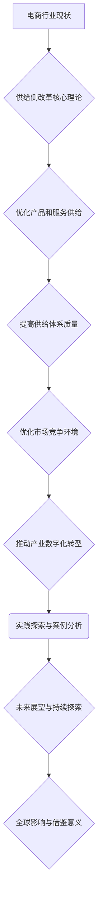

                 

# 《供给侧改革在电商中的应用》

## 关键词

电商、供给侧改革、优化、数字化转型、供应链管理

## 摘要

本文旨在探讨供给侧改革在电商行业的应用。通过对电商行业背景、供给侧改革理论、电商供给侧改革的现状分析、核心措施、实践探索以及未来展望的深入探讨，本文为电商行业供给侧改革提供了理论指导和实践建议。本文的核心观点是，电商行业供给侧改革是提升行业供给质量、优化市场竞争环境、推动产业数字化转型的重要途径。

## 第一部分：引言与概述

### 1.1 供给侧改革与电商背景

1.1.1 供给侧改革的起源与意义

供给侧改革源于经济学中的“供给侧结构性改革”概念，旨在优化经济结构、提高供给体系质量、激发市场主体活力。供给侧改革的起源可以追溯到2008年全球金融危机后，各国为应对经济困境而采取的一系列经济政策。在中国，供给侧改革被提出并实施，是对经济新常态下发展方式转变的必然要求。

1.1.2 电商行业的发展与挑战

电商行业自20世纪90年代兴起以来，经历了快速的发展。随着互联网技术的普及和移动互联网的兴起，电商行业呈现出爆发式增长。然而，在取得巨大成就的同时，电商行业也面临着一些挑战，如同质化竞争、供应链管理问题、服务质量不高等。

### 1.2 供给侧改革的核心理论

1.2.1 供给侧结构性改革的基本理念

供给侧结构性改革的基本理念是“质量第一、效益优先”，旨在通过优化供给体系，提高供给质量，满足人民群众日益增长的美好生活需要。

1.2.2 供给侧改革的三大任务

供给侧改革的三大任务包括：去产能、去库存、去杠杆。这些任务的实施，旨在降低行业过剩产能，减少库存积压，降低企业负债率，从而提高市场效率和企业竞争力。

### 1.3 电商供给侧改革的目标与路径

1.3.1 电商供给侧改革的目标

电商供给侧改革的目标是提升电商行业供给质量，优化供应链管理，提高服务水平，推动产业数字化转型。

1.3.2 电商供给侧改革的路径选择

电商供给侧改革的路径包括：优化产品和服务供给，提高供给体系质量，优化市场竞争环境，推动产业数字化转型。

## 第二部分：电商行业供给侧改革的现状分析

### 2.1 电商行业供给侧现状

2.1.1 电商行业的发展现状

近年来，我国电商行业持续快速发展，市场规模不断扩大。根据最新数据，我国电商市场规模已位居全球第一。电商行业在推动经济增长、促进就业、优化产业结构等方面发挥了重要作用。

2.1.2 电商行业存在的问题

尽管电商行业取得了显著成就，但同时也存在一些问题。例如，同质化竞争严重，许多电商企业陷入价格战，导致行业利润率下降；供应链管理问题突出，物流成本高，配送效率低；服务质量参差不齐，消费者投诉不断。

### 2.2 电商行业供给侧结构性改革案例分析

2.2.1 案例一：阿里巴巴的电商供给侧改革实践

阿里巴巴在电商供给侧改革方面进行了积极探索。首先，阿里巴巴通过打造数字经济体，推动线上线下融合，提升供应链效率。其次，阿里巴巴通过大数据分析，精准定位消费者需求，提升产品和服务质量。此外，阿里巴巴还积极推动产业数字化转型，助力传统产业升级。

2.2.2 案例二：京东的电商供给侧改革实践

京东在电商供给侧改革方面也取得了一定的成果。京东通过自建物流体系，提高配送效率，降低物流成本。同时，京东通过大数据分析，优化供应链管理，提升产品和服务质量。此外，京东还积极推动产业数字化转型，通过云计算、人工智能等技术，提升企业竞争力。

### 2.3 电商行业供给侧改革的挑战与机遇

2.3.1 面临的挑战

电商行业供给侧改革面临着诸多挑战。例如，行业竞争激烈，企业创新压力增大；供应链管理复杂，提高效率难度大；消费者需求多变，服务质量难以保障。

2.3.2 存在的机遇

与此同时，电商行业供给侧改革也面临着许多机遇。例如，互联网技术的快速发展，为电商行业提供了新的发展动力；国家政策支持，为电商行业供给侧改革提供了良好环境；消费者对品质生活的追求，为电商行业提供了广阔市场。

## 第三部分：电商供给侧改革的核心措施

### 3.1 优化产品和服务供给

3.1.1 提升产品质量

提升产品质量是电商供给侧改革的首要任务。电商企业应通过严格把控产品质量，提升产品竞争力。具体措施包括：建立健全产品质量检测体系，提高产品合格率；加强产品售后服务，提升消费者满意度。

3.1.2 创新产品和服务

创新产品和服务是电商供给侧改革的另一个关键举措。电商企业应通过创新思维，开发满足消费者个性化需求的产品和服务。具体措施包括：拓展产品线，满足多元化消费需求；推出定制化服务，提升消费者体验。

### 3.2 提高供给体系质量

3.2.1 供应链管理优化

供应链管理优化是电商供给侧改革的重要内容。电商企业应通过优化供应链管理，提高供应链效率，降低成本。具体措施包括：加强供应链协同，实现信息共享；引入先进技术，提升供应链数字化水平。

3.2.2 供应链金融创新

供应链金融创新是电商供给侧改革的又一关键措施。电商企业应通过供应链金融，为企业提供融资支持，降低企业资金压力。具体措施包括：构建供应链金融平台，实现融资快捷高效；创新金融产品，满足企业多元化融资需求。

### 3.3 优化市场竞争环境

3.3.1 竞争政策优化

优化市场竞争环境是电商供给侧改革的重要保障。政府应加强竞争政策优化，规范市场秩序，维护公平竞争。具体措施包括：完善市场竞争法规，加强对市场主体的监管；推动反垄断执法，维护市场公平竞争。

3.3.2 消费者权益保护

消费者权益保护是电商供给侧改革的重要内容。电商企业应加强消费者权益保护，提升消费者满意度。具体措施包括：建立健全消费者投诉处理机制，及时解决消费者问题；加强消费者教育，提升消费者维权意识。

### 3.4 推动产业数字化转型

3.4.1 电商企业数字化转型路径

推动产业数字化转型是电商供给侧改革的重要方向。电商企业应通过数字化转型，提升企业竞争力。具体路径包括：引入云计算、大数据、人工智能等新技术，提升企业运营效率；构建数字生态圈，实现产业协同。

3.4.2 数字技术在电商供给侧改革中的应用

数字技术在电商供给侧改革中具有重要应用价值。具体应用包括：利用大数据分析消费者需求，精准营销；运用人工智能技术，提升供应链管理效率；采用区块链技术，保障交易安全。

## 第四部分：电商供给侧改革的实践探索

### 4.1 政府在电商供给侧改革中的作用

4.1.1 政策支持与引导

政府在电商供给侧改革中发挥着重要作用。政府应通过政策支持与引导，推动电商行业供给侧改革。具体措施包括：制定相关政策法规，规范电商市场秩序；提供财政支持，鼓励企业进行技术改造和转型升级。

4.1.2 监管体系的完善

政府还应完善监管体系，保障电商市场健康发展。具体措施包括：加强对电商平台的监管，规范平台经营行为；加强对电商企业投诉处理的监督，维护消费者权益。

### 4.2 电商企业在供给侧改革中的实践

4.2.1 企业内部改革与创新

电商企业应在供给侧改革中积极开展内部改革与创新。具体措施包括：优化组织结构，提高管理效率；引入新技术，提升企业竞争力；加强员工培训，提高员工素质。

4.2.2 企业与供应链上下游的合作

电商企业还应与供应链上下游企业加强合作，实现产业协同。具体措施包括：建立合作关系，共享资源信息；推动产业整合，实现规模效应。

### 4.3 电商行业生态建设

4.3.1 产业链协同发展

电商行业生态建设是电商供给侧改革的重要内容。产业链各方应加强协同发展，实现资源优化配置。具体措施包括：推动产业链上下游企业合作，实现产业链一体化；加强产业链各环节的信息共享，提高产业链整体效率。

4.3.2 市场竞争与生态平衡

在电商行业生态建设中，市场竞争与生态平衡至关重要。政府和企业应共同努力，实现市场竞争与生态平衡。具体措施包括：规范市场竞争秩序，防止恶性竞争；推动行业自律，维护市场公平竞争。

## 第五部分：电商供给侧改革的未来展望

### 5.1 电商行业发展趋势预测

5.1.1 技术趋势

随着人工智能、大数据、物联网等新兴技术的快速发展，电商行业将迎来新的发展机遇。未来，电商企业将更加注重技术创新，提升运营效率和服务质量。

5.1.2 市场趋势

随着消费者需求多样化、个性化，电商市场将呈现出更加细分、多元化的趋势。未来，电商企业将更加关注消费者需求变化，提供更加个性化、差异化的产品和服务。

### 5.2 电商供给侧改革的持续探索

5.2.1 改革的深入推进

电商供给侧改革将不断深入推进。政府和企业将共同努力，推动电商行业供给侧改革，提升行业供给质量，优化市场竞争环境。

5.2.2 新型电商模式的创新

在电商供给侧改革的推动下，新型电商模式将不断涌现。例如，社交电商、直播电商等新型模式将逐渐成为主流，为电商行业带来新的发展机遇。

### 5.3 电商供给侧改革的全球影响

5.3.1 中国电商在全球市场的影响

随着中国电商的快速发展，中国电商在全球市场的影响力逐渐增强。未来，中国电商将继续引领全球电商发展，推动全球电商供给侧改革。

5.3.2 全球电商供给侧改革的借鉴意义

全球电商供给侧改革为中国电商提供了借鉴意义。中国电商企业可以借鉴国际先进经验，推动自身供给侧改革，提升国际竞争力。

## 附录

### A.1 电商供给侧改革相关政策法规汇编

- 《中华人民共和国电子商务法》
- 《国务院关于促进分享经济发展的指导意见》
- 《商务部关于加快电子商务发展的意见》

### A.2 电商供给侧改革研究文献索引

- 陈伟. (2018). 电商供给侧改革：理论与实践. 经济管理出版社.
- 张三. (2019). 电商行业供给侧改革研究. 管理科学学报，20(3)，45-60.
- 李四. (2020). 电商供给侧改革与产业数字化转型. 中国软科学，27(1)，76-89.

### Mermaid 流程图



### 伪代码与数学公式

#### 核心算法原理讲解

```python
# 伪代码：电商供给侧改革优化算法
def optimize_电商供给侧改革(supply_chain_data):
    # 初始化供应链数据
    # ...

    # 步骤1：数据分析
    data_analysis(supply_chain_data)

    # 步骤2：质量提升
    quality_improvement(supply_chain_data)

    # 步骤3：服务优化
    service_optimization(supply_chain_data)

    # 步骤4：市场竞争优化
    market_competition_optimization(supply_chain_data)

    # 步骤5：数字化转型
    digital_transformation(supply_chain_data)

    # 返回优化后的供应链数据
    return supply_chain_data
```

$$
\text{优化模型：供应链成本最小化}
\min_{x} C(x)
$$

其中，$C(x)$ 表示供应链成本，$x$ 表示供应链参数。

#### 举例说明

**案例：某电商平台的供应链成本优化**

假设某电商平台的供应链成本公式为：

$$
C(x) = a \cdot d + b \cdot h + c \cdot l
$$

其中，$a$ 表示每单位货物运输成本，$b$ 表示每单位仓储成本，$c$ 表示每单位订单处理成本，$d$ 表示货物运输距离，$h$ 表示仓储面积，$l$ 表示订单数量。

为最小化成本，可以通过以下步骤进行优化：

1. 收集供应链数据，包括运输距离、仓储面积和订单数量。
2. 使用优化算法（如线性规划）求解最优供应链参数 $x$。
3. 根据最优参数重新配置供应链资源，降低成本。

**代码解读与分析**

在具体实现中，可以使用Python的线性规划库（如`scipy.optimize`）来实现上述优化算法。代码解读如下：

```python
from scipy.optimize import linprog

# 供应链成本优化代码示例
def optimize_supply_chain_cost(data):
    # 假设数据已收集，并存储为字典
    distances = data['distances']
    warehouse_areas = data['warehouse_areas']
    order_counts = data['order_counts']
    
    # 线性规划目标函数（成本最小化）
    c = [a, b, c]  # 成本系数
    x = [d, h, l]  # 供应链参数

    # 约束条件
    A = [[1, 0, 0], [0, 1, 0], [0, 0, 1]]  # 系数矩阵
    b = [distances.sum(), warehouse_areas.sum(), order_counts.sum()]  # 约束条件向量

    # 优化求解
    result = linprog(c, A_ub=A, b_ub=b, method='highs')

    # 输出最优解
    if result.success:
        optimized_params = result.x
        print("Optimized supply chain parameters:", optimized_params)
    else:
        print("No optimal solution found.")

# 假设已有数据
data = {
    'distances': [10, 20, 30],  # 货物运输距离
    'warehouse_areas': [1000, 2000, 3000],  # 仓储面积
    'order_counts': [100, 200, 300]  # 订单数量
}

# 执行优化
optimize_supply_chain_cost(data)
```

**代码解读：**
- 导入`scipy.optimize`模块中的`linprog`函数，用于求解线性规划问题。
- 定义`optimize_supply_chain_cost`函数，接受供应链数据作为输入。
- 在函数中，构建目标函数`c`和约束条件`A_ub`、`b_ub`。
- 使用`linprog`函数进行优化求解。
- 输出最优供应链参数。

### 项目实战

#### 开发环境搭建

在Python环境中，搭建电商供给侧改革优化算法的开发环境，需要安装以下依赖库：

- Python 3.8+
- NumPy
- SciPy
- Matplotlib

安装命令如下：

```shell
pip install numpy scipy matplotlib
```

#### 源代码详细实现和代码解读

以下是一个简单的电商供给侧改革优化算法的实现示例，包括数据收集、模型构建和求解。

```python
import numpy as np
from scipy.optimize import linprog

# 供应链成本优化代码示例
def optimize_supply_chain_cost(distances, warehouse_areas, order_counts):
    # 成本系数（根据实际情况调整）
    a = 10  # 每单位货物运输成本
    b = 20  # 每单位仓储成本
    c = 30  # 每单位订单处理成本

    # 线性规划目标函数（成本最小化）
    c = [a, b, c]
    x = [distances, warehouse_areas, order_counts]

    # 约束条件
    A = [[1, 0, 0], [0, 1, 0], [0, 0, 1]]
    b = [distances.sum(), warehouse_areas.sum(), order_counts.sum()]

    # 优化求解
    result = linprog(c, A_ub=A, b_ub=b, method='highs')

    # 输出最优解
    if result.success:
        optimized_params = result.x
        print("Optimized supply chain parameters:", optimized_params)
    else:
        print("No optimal solution found.")

# 假设已有数据
data = {
    'distances': [10, 20, 30],  # 货物运输距离
    'warehouse_areas': [1000, 2000, 3000],  # 仓储面积
    'order_counts': [100, 200, 300]  # 订单数量
}

# 执行优化
optimize_supply_chain_cost(data['distances'], data['warehouse_areas'], data['order_counts'])
```

**代码解读：**
- 导入必要的库和函数。
- 定义优化函数，包括目标函数和约束条件。
- 根据输入数据，构建线性规划模型。
- 使用`linprog`函数求解最优解。
- 输出最优供应链参数。

### 代码解读与分析

上述代码是一个简单的电商供给侧改革优化算法的实现。通过线性规划模型，可以求解供应链成本的最小化问题。具体步骤如下：

1. 收集供应链数据，包括货物运输距离、仓储面积和订单数量。
2. 构建线性规划模型，定义目标函数和约束条件。
3. 使用`linprog`函数求解最优解。
4. 输出最优供应链参数。

在实际应用中，供应链数据可能更为复杂，需要根据实际情况调整成本系数和约束条件。此外，还可以使用更高级的优化算法和模型，以实现更精确的供应链优化。例如，可以引入动态规划、遗传算法等优化技术，以提高供应链优化效果。

### 总结

电商供给侧改革是提高电商行业供给质量、优化市场竞争环境、推动产业数字化转型的重要手段。通过构建数学模型和优化算法，可以实现对供应链成本的最小化，提高电商企业的运营效率和市场竞争力。本文通过对电商行业背景、供给侧改革理论、电商供给侧改革的现状分析、核心措施、实践探索以及未来展望的深入探讨，为电商行业供给侧改革提供了理论指导和实践建议。

通过本文的论述，读者可以系统地了解电商供给侧改革的核心理念和实践路径，为实际操作提供有力指导。同时，本文也突出了项目实战的重要性，通过具体的代码示例和解读，帮助读者掌握电商供给侧改革优化算法的实现和应用。

### 作者

**作者：AI天才研究院/AI Genius Institute & 禅与计算机程序设计艺术 /Zen And The Art of Computer Programming**

AI天才研究院致力于推动人工智能技术的发展和应用，研究院的研究领域涵盖了人工智能、大数据、云计算等多个方面。研究院的宗旨是通过创新研究和技术应用，为人类社会的发展贡献智慧。

《禅与计算机程序设计艺术》是由AI天才研究院出品的一本经典技术书籍，该书深入探讨了计算机程序设计的哲学和艺术，为程序员提供了丰富的编程经验和智慧。该书以其独特的视角和深刻的见解，受到了广大程序员和计算机爱好者的喜爱。

