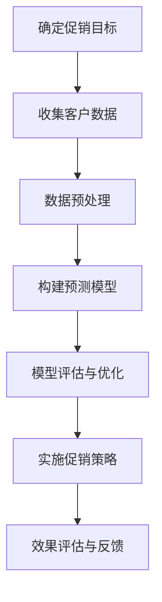
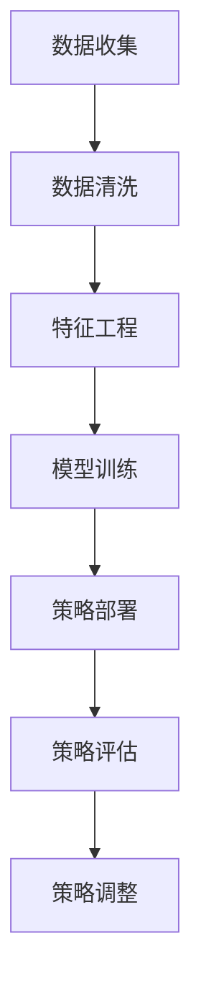

                 

# 文章标题：促销策略：AI提升活动效果

> 关键词：AI促销策略，数据驱动营销，机器学习，深度学习，个性化推荐，智能定价，强化学习，实践案例分析

> 摘要：本文将探讨如何利用人工智能（AI）技术来提升促销活动的效果。通过分析AI在促销策略中的应用现状和优势，介绍核心概念、算法及应用，并结合实践案例分析AI促销策略的实施效果。文章最后展望了AI促销策略的未来发展趋势，并提出了实施策略与建议。

## 《促销策略：AI提升活动效果》目录大纲

### 第一部分：AI与促销策略概述

#### 第1章：AI与促销策略的关系

##### 1.1 AI在促销策略中的应用现状

##### 1.2 促销策略中的AI优势

##### 1.3 AI提升促销效果的案例研究

#### 第2章：AI促销策略的核心概念

##### 2.1 数据驱动营销

###### 2.1.1 数据采集与处理

###### 2.1.2 数据分析在促销中的应用

##### 2.2 机器学习在促销策略中的应用

###### 2.2.1 机器学习基础

###### 2.2.2 模型选择与评估

##### 2.3 深度学习在促销策略中的应用

###### 2.3.1 深度学习基础

###### 2.3.2 神经网络在促销策略中的应用

### 第二部分：AI促销策略的核心算法

#### 第3章：AI促销策略中的预测算法

##### 3.1 回归分析

###### 3.1.1 线性回归

###### 3.1.2 多元回归

##### 3.2 决策树与随机森林

###### 3.2.1 决策树算法

###### 3.2.2 随机森林算法

##### 3.3 支持向量机

###### 3.3.1 支持向量机基础

###### 3.3.2 SVM在促销策略中的应用

#### 第4章：AI促销策略中的聚类算法

##### 4.1 K-均值聚类

###### 4.1.1 K-均值聚类算法

###### 4.1.2 K-均值聚类在促销策略中的应用

##### 4.2 层次聚类

###### 4.2.1 层次聚类算法

###### 4.2.2 层次聚类在促销策略中的应用

#### 第5章：AI促销策略中的强化学习

##### 5.1 强化学习基础

###### 5.1.1 强化学习的基本概念

###### 5.1.2 Q-learning算法

##### 5.2 强化学习在促销策略中的应用

###### 5.2.1 强化学习在动态定价中的应用

###### 5.2.2 强化学习在库存管理中的应用

### 第三部分：AI促销策略的实际应用

#### 第6章：AI促销策略在电商中的应用

##### 6.1 个性化推荐系统

###### 6.1.1 个性化推荐系统的基础

###### 6.1.2 个性化推荐在电商中的应用

##### 6.2 智能定价策略

###### 6.2.1 智能定价策略的基础

###### 6.2.2 智能定价在电商中的应用

#### 第7章：AI促销策略在其他行业中的应用

##### 7.1 餐饮行业的智能促销策略

###### 7.1.1 餐饮行业的促销策略现状

###### 7.1.2 AI在餐饮行业中的应用

##### 7.2 旅游业智能促销策略

###### 7.2.1 旅游业促销策略的现状

###### 7.2.2 AI在旅游业中的应用

### 第四部分：AI促销策略的实践与展望

#### 第8章：AI促销策略的实践案例分析

##### 8.1 案例一：某电商平台的AI促销策略实践

###### 8.1.1 案例背景

###### 8.1.2 实践过程

###### 8.1.3 案例效果分析

##### 8.2 案例二：某旅游公司的AI促销策略实践

###### 8.2.1 案例背景

###### 8.2.2 实践过程

###### 8.2.3 案例效果分析

#### 第9章：AI促销策略的未来发展趋势

##### 9.1 新兴技术对促销策略的影响

###### 9.1.1 5G技术

###### 9.1.2 物联网技术

##### 9.2 AI促销策略的发展趋势

###### 9.2.1 个性化与精准化

###### 9.2.2 跨界融合与产业协同

#### 第10章：AI促销策略的实施策略与建议

##### 10.1 实施AI促销策略的步骤

###### 10.1.1 数据准备

###### 10.1.2 模型选择与训练

###### 10.1.3 策略优化与调整

##### 10.2 AI促销策略实施中的挑战与解决方案

###### 10.2.1 数据隐私问题

###### 10.2.2 技术与人才储备

###### 10.2.3 策略实施效果评估

### 附录

#### 附录A：常用AI促销策略工具与资源

##### A.1 常用机器学习框架

###### A.1.1 TensorFlow

###### A.1.2 PyTorch

##### A.2 常用数据预处理工具

###### A.2.1 Pandas

###### A.2.2 NumPy

##### A.3 常用数据分析工具

###### A.3.1 Excel

###### A.3.2 Power BI

#### 附录B：Mermaid流程图

##### B.1 促销策略流程图



### 第一部分：AI与促销策略概述

#### 第1章：AI与促销策略的关系

##### 1.1 AI在促销策略中的应用现状

随着互联网的普及和大数据技术的发展，人工智能（AI）技术在营销领域得到了广泛的应用。尤其是在促销策略方面，AI技术的引入使得企业能够更加精准地了解客户需求，提高营销活动的效果。目前，AI在促销策略中的应用主要体现在以下几个方面：

1. **个性化推荐**：利用机器学习算法，对客户的历史行为进行分析，为不同的客户提供个性化的推荐，从而提高客户的购买意愿。

2. **智能定价**：通过分析市场数据和竞争对手的价格策略，结合客户需求，动态调整产品价格，实现利润最大化。

3. **动态促销**：根据实时数据，动态调整促销策略，例如限时折扣、满减优惠等，以吸引更多客户。

4. **智能客服**：利用自然语言处理技术，提供24/7的智能客服服务，提高客户满意度。

##### 1.2 促销策略中的AI优势

AI技术在促销策略中的应用，带来了以下几个显著的优势：

1. **数据驱动**：AI技术能够处理和分析大量的数据，帮助企业了解客户需求，制定更加科学有效的促销策略。

2. **高效精准**：通过机器学习和深度学习算法，AI能够快速识别客户特征，实现精准营销。

3. **动态调整**：AI技术可以实时分析市场变化，动态调整促销策略，提高营销活动的效果。

4. **降低成本**：AI技术能够自动化执行促销活动，降低人力成本。

##### 1.3 AI提升促销效果的案例研究

以下是一个AI提升促销效果的案例研究：

某电商平台在双十一期间，通过引入AI技术，实现了销售额的显著增长。具体措施如下：

1. **个性化推荐**：通过对客户历史购买行为和浏览记录的分析，为每位客户生成个性化的推荐商品列表，提高了客户的购买转化率。

2. **智能定价**：利用AI算法，实时分析市场数据和竞争对手的价格策略，动态调整商品价格，吸引了更多的客户。

3. **动态促销**：根据实时销售数据，动态调整促销策略，例如限时折扣、满减优惠等，提高了客户的购买意愿。

4. **智能客服**：利用自然语言处理技术，提供24/7的智能客服服务，提高了客户满意度，减少了客户流失率。

通过以上措施，该电商平台在双十一期间实现了销售额的翻倍，取得了显著的促销效果。

### 第二部分：AI促销策略的核心概念

#### 第2章：AI促销策略的核心概念

##### 2.1 数据驱动营销

数据驱动营销是指利用数据分析技术，从海量数据中挖掘有价值的信息，指导营销策略的制定和执行。在促销策略中，数据驱动营销的重要性不言而喻。通过数据分析，企业可以了解客户需求、市场趋势等关键信息，从而制定更加科学、有效的促销策略。

###### 2.1.1 数据采集与处理

数据采集是数据驱动营销的基础。企业需要通过各种渠道收集客户行为数据、市场数据、竞争对手数据等。这些数据可能来自于电子商务平台、社交媒体、客户关系管理系统等。在数据采集过程中，需要确保数据的准确性、完整性和及时性。

数据采集后，需要进行数据清洗和处理。数据清洗主要包括去除重复数据、填补缺失值、纠正错误数据等。数据处理则包括数据整合、数据转换和数据归一化等操作，以便于后续的分析。

###### 2.1.2 数据分析在促销中的应用

数据分析在促销策略中的应用主要包括以下几个方面：

1. **客户分析**：通过分析客户的历史行为数据，了解客户的需求和偏好，为个性化推荐提供依据。

2. **市场分析**：通过分析市场数据和竞争对手的促销策略，了解市场趋势和竞争态势，制定相应的促销策略。

3. **产品分析**：通过分析产品的销售数据、利润率等，了解产品的市场表现，优化产品组合。

4. **促销效果分析**：通过分析促销活动的效果，评估促销策略的有效性，为后续的促销活动提供参考。

##### 2.2 机器学习在促销策略中的应用

机器学习是AI技术的重要组成部分，其在促销策略中的应用主要体现在以下几个方面：

###### 2.2.1 机器学习基础

机器学习是一种通过数据驱动的方法，从数据中自动学习规律和模式的技术。其基本流程包括数据采集、数据预处理、模型训练、模型评估和模型部署等。

在促销策略中，机器学习可以帮助企业识别客户行为模式、预测客户需求、优化定价策略等。常见的机器学习算法包括线性回归、决策树、支持向量机、神经网络等。

###### 2.2.2 模型选择与评估

选择合适的模型是机器学习成功的关键。在促销策略中，需要根据问题的具体需求，选择合适的机器学习算法。例如，对于预测客户需求的问题，可以采用线性回归、决策树等算法；对于分类问题，可以采用支持向量机、神经网络等算法。

模型评估是确保模型性能的重要环节。常用的模型评估指标包括准确率、召回率、F1分数等。通过评估指标，可以了解模型的性能，并根据评估结果调整模型参数，优化模型效果。

##### 2.3 深度学习在促销策略中的应用

深度学习是机器学习的一个重要分支，其在促销策略中的应用也越来越广泛。深度学习通过多层神经网络，可以从大量数据中自动学习复杂的特征和模式。

###### 2.3.1 深度学习基础

深度学习的基本架构包括输入层、隐藏层和输出层。输入层接收输入数据，隐藏层通过非线性变换提取特征，输出层生成预测结果。

在促销策略中，深度学习可以帮助企业实现以下目标：

1. **个性化推荐**：通过深度学习模型，从客户历史数据中提取特征，实现个性化推荐。

2. **智能定价**：通过深度学习模型，分析市场数据和竞争对手价格，实现动态定价。

3. **情感分析**：通过深度学习模型，分析客户评论、社交媒体内容等，了解客户情感，优化促销策略。

###### 2.3.2 神经网络在促销策略中的应用

神经网络是深度学习的一种重要实现形式。在促销策略中，神经网络可以通过以下方式应用：

1. **分类与回归**：使用神经网络对客户行为进行分类和回归分析，预测客户需求。

2. **聚类分析**：使用神经网络对客户进行聚类分析，发现潜在客户群体。

3. **异常检测**：使用神经网络检测异常行为，优化促销策略。

通过以上核心概念的介绍，我们可以看到，AI技术在促销策略中的应用具有很大的潜力。在接下来的章节中，我们将深入探讨AI促销策略中的核心算法及其应用。

### 第二部分：AI促销策略的核心算法

#### 第3章：AI促销策略中的预测算法

预测算法在AI促销策略中扮演着至关重要的角色，它们能够帮助企业预测未来市场趋势、客户需求以及促销效果，从而制定更为精准的促销策略。本章节将介绍几种常见的预测算法，包括回归分析、决策树与随机森林、支持向量机等，并详细解析这些算法的原理和应用。

##### 3.1 回归分析

回归分析是一种用于预测连续值的统计方法。在促销策略中，回归分析可以帮助企业预测销售额、利润等关键指标。以下是回归分析的两个主要类型：

###### 3.1.1 线性回归

线性回归是一种最简单的回归分析模型，其基本假设是因变量与自变量之间存在线性关系。线性回归模型的数学表达式为：

$$ y = \beta_0 + \beta_1x_1 + \beta_2x_2 + ... + \beta_nx_n + \epsilon $$

其中，$y$是因变量，$x_1, x_2, ..., x_n$是自变量，$\beta_0, \beta_1, ..., \beta_n$是回归系数，$\epsilon$是误差项。

线性回归的伪代码实现如下：

```python
# 假设我们有输入特征矩阵X和目标值向量y
X = ...
y = ...

# 训练线性回归模型
model = LinearRegression()
model.fit(X, y)

# 进行预测
predictions = model.predict(X)
```

###### 3.1.2 多元回归

多元回归是线性回归的扩展，用于处理多个自变量。多元回归模型的数学表达式为：

$$ y = \beta_0 + \beta_1x_1 + \beta_2x_2 + ... + \beta_nx_n + \epsilon $$

与线性回归相比，多元回归需要处理多个自变量之间的关系，因此在模型选择和参数调整上更为复杂。

多元回归的伪代码实现如下：

```python
# 假设我们有输入特征矩阵X和目标值向量y
X = ...
y = ...

# 训练多元回归模型
model = MultiLinearRegression()
model.fit(X, y)

# 进行预测
predictions = model.predict(X)
```

##### 3.2 决策树与随机森林

决策树是一种基于树形结构进行决策的算法，它在分类和回归任务中都有广泛的应用。决策树通过一系列规则对数据进行分割，从而构建出一棵树。每个节点代表一个特征，每个分支代表一个条件。树的叶子节点对应预测结果。

###### 3.2.1 决策树算法

决策树算法的核心是构建一棵树，并通过树的结构进行预测。以下是一个决策树算法的基本流程：

1. **选择最佳分割特征**：选择一个特征，使得根据该特征分割数据后，数据的分类效果最好。

2. **构建树**：使用选定的特征对数据进行分割，递归地构建出树的结构。

3. **剪枝**：为了防止过拟合，需要对树进行剪枝，避免树变得过于复杂。

4. **预测**：根据树的分割结果，对新的数据进行分类或回归预测。

决策树的伪代码实现如下：

```python
# 假设我们有输入特征矩阵X和目标值向量y
X = ...
y = ...

# 构建决策树
tree = DecisionTree()
tree.fit(X, y)

# 进行预测
predictions = tree.predict(X)
```

###### 3.2.2 随机森林算法

随机森林是一种集成学习方法，它通过构建多棵决策树，并取其预测结果的平均值来提高预测性能。随机森林的基本思想是：

1. **随机特征选择**：每次分割时，从多个特征中随机选择一部分特征。

2. **构建多棵树**：使用不同的特征子集构建多棵决策树。

3. **集成预测**：将多棵决策树的预测结果进行集成，取平均值或多数投票。

随机森林的伪代码实现如下：

```python
# 假设我们有输入特征矩阵X和目标值向量y
X = ...
y = ...

# 构建随机森林
forest = RandomForest(n_estimators=100)
forest.fit(X, y)

# 进行预测
predictions = forest.predict(X)
```

##### 3.3 支持向量机

支持向量机（SVM）是一种用于分类和回归的分析方法。在促销策略中，SVM可以用于预测客户行为、分类产品等任务。SVM的核心思想是找到一个最佳的超平面，使得数据点在超平面的两侧尽可能分开。

###### 3.3.1 支持向量机基础

SVM的基本假设是存在一个最优的超平面，可以将不同类别的数据点最大限度地分隔开。SVM通过求解一个优化问题来找到这个超平面：

$$
\begin{aligned}
\min_{\mathbf{w}, b} &\frac{1}{2}||\mathbf{w}||^2 \\
\text{subject to} & y_i (\mathbf{w} \cdot \mathbf{x_i} + b) \geq 1, \quad \forall i
\end{aligned}
$$

其中，$\mathbf{w}$是超平面的法向量，$b$是偏置项，$\mathbf{x_i}$是第$i$个数据点，$y_i$是第$i$个数据点的标签。

SVM的伪代码实现如下：

```python
# 假设我们有输入特征矩阵X和目标值向量y
X = ...
y = ...

# 训练SVM模型
model = SVM()
model.fit(X, y)

# 进行预测
predictions = model.predict(X)
```

###### 3.3.2 SVM在促销策略中的应用

SVM在促销策略中的应用主要包括以下几个方面：

1. **客户细分**：利用SVM对客户进行细分，识别不同的客户群体，从而制定个性化的促销策略。

2. **产品推荐**：利用SVM对用户行为进行分析，预测用户的购买偏好，推荐相应的产品。

3. **促销效果评估**：利用SVM对促销活动的影响进行评估，判断哪些促销策略对销售额的提升效果最佳。

通过介绍这些预测算法，我们可以看到，AI技术为促销策略提供了强大的工具。在接下来的章节中，我们将继续探讨AI促销策略中的聚类算法和强化学习算法，进一步丰富我们的促销策略工具箱。

### 第三部分：AI促销策略的实际应用

#### 第6章：AI促销策略在电商中的应用

随着电商行业的迅猛发展，AI技术逐渐成为电商企业提升营销效果的重要手段。AI在电商中的应用涵盖了个性化推荐、智能定价、动态促销等多个方面，大大提升了用户的购物体验和企业的盈利能力。下面我们将详细探讨这些AI促销策略的实际应用。

##### 6.1 个性化推荐系统

个性化推荐系统是AI技术在电商中应用最为广泛和成功的领域之一。通过分析用户的历史行为、购物偏好和社交网络数据，推荐系统可以精准地推送用户可能感兴趣的商品，从而提高购买转化率和用户粘性。

###### 6.1.1 个性化推荐系统的基础

个性化推荐系统的基础是用户数据的收集和分析。以下是一个简单的个性化推荐系统的流程：

1. **数据收集**：收集用户在电商平台的浏览记录、搜索历史、购物车行为、购买历史等数据。

2. **数据预处理**：对收集到的数据进行清洗、去噪和特征提取，以便于后续的建模和分析。

3. **用户建模**：利用机器学习算法（如协同过滤、矩阵分解等）建立用户画像，识别用户的兴趣和偏好。

4. **推荐算法**：根据用户画像和商品特征，使用推荐算法（如基于内容的推荐、基于协同过滤的推荐等）生成推荐结果。

5. **推荐展示**：将推荐结果展示在用户的个人主页、搜索结果页或购物车中。

下面是一个基于协同过滤算法的推荐系统的伪代码实现：

```python
# 假设我们有用户-商品交互矩阵R
R = ...

# 训练协同过滤模型
model = CollaborativeFiltering()
model.fit(R)

# 推荐给用户u的商品
recommendations = model.recommend(u)
```

###### 6.1.2 个性化推荐在电商中的应用

个性化推荐在电商中的应用效果显著，以下是一些实际案例：

1. **商品推荐**：电商平台通过个性化推荐系统，为每位用户推荐可能感兴趣的商品，提高用户的购买意愿。

2. **交叉销售**：推荐系统还可以识别用户已购买商品的相关性，推荐互补商品，实现交叉销售。

3. **挽回流失用户**：通过分析用户行为数据，识别即将流失的用户，推荐吸引他们重新购买的商品。

##### 6.2 智能定价策略

智能定价策略利用AI技术分析市场数据、用户行为和竞争对手的价格策略，动态调整商品价格，从而实现利润最大化。智能定价系统通常包括以下几个模块：

1. **定价目标设定**：根据企业的盈利目标，设定智能定价的总体策略。

2. **数据收集与分析**：收集市场数据（如竞争对手价格、供需情况等）和用户数据（如历史购买记录、浏览行为等），进行分析。

3. **定价模型构建**：利用机器学习算法（如线性回归、决策树、神经网络等）构建定价模型，预测不同价格水平下的销售量和利润。

4. **动态定价**：根据定价模型和实时数据，动态调整商品价格，以应对市场变化。

5. **效果评估**：定期评估智能定价策略的效果，根据评估结果调整定价策略。

下面是一个基于机器学习的智能定价系统的伪代码实现：

```python
# 假设我们有价格、销售量和利润数据
price = ...
sales = ...
profit = ...

# 训练定价模型
model = PricingModel()
model.fit(price, sales, profit)

# 预测最佳价格
best_price = model.predict_best_price()
```

###### 6.2.1 智能定价策略的基础

智能定价策略的基础是定价模型的构建。以下是构建定价模型的一些关键步骤：

1. **选择定价目标**：根据企业的盈利目标，选择总利润最大化、市场份额最大化等定价目标。

2. **数据收集**：收集与定价相关的数据，包括历史销售数据、市场数据、竞争对手价格等。

3. **特征工程**：从数据中提取对定价有影响的特征，如需求弹性、产品生命周期等。

4. **模型选择**：选择合适的机器学习算法（如线性回归、决策树、神经网络等）构建定价模型。

5. **模型评估与优化**：评估模型性能，根据评估结果调整模型参数，优化模型效果。

###### 6.2.2 智能定价在电商中的应用

智能定价策略在电商中的应用案例包括：

1. **动态定价**：根据市场需求和库存情况，动态调整商品价格，以提高销售量和利润。

2. **促销定价**：在特定的促销活动中，利用智能定价策略制定有吸引力的价格，吸引更多客户。

3. **差异化定价**：根据不同用户群体的需求和购买力，制定差异化的价格策略，提高整体销售额。

通过以上探讨，我们可以看到，AI技术在电商中的应用极大地提升了促销策略的精准度和效果。在接下来的章节中，我们将继续探讨AI促销策略在其他行业中的应用，进一步展示AI技术的广泛影响力。

### 第三部分：AI促销策略的实际应用

#### 第7章：AI促销策略在其他行业中的应用

随着AI技术的不断成熟，它不仅在家电商等传统领域发挥着重要作用，还在餐饮业和旅游业等新兴行业展现出了巨大的潜力。本章节将介绍AI促销策略在餐饮业和旅游业中的应用，分析这些行业如何利用AI技术提升营销效果。

##### 7.1 餐饮行业的智能促销策略

餐饮业作为一个高度依赖顾客体验和口碑的行业，AI技术的应用可以显著提升其促销策略的精准度和效果。以下是一些餐饮行业智能促销策略的实际应用：

###### 7.1.1 餐饮行业的促销策略现状

当前，餐饮行业的促销策略主要包括优惠券、团购、会员制度等。然而，这些传统策略往往存在一定的局限性，如无法精准匹配顾客需求、促销效果难以量化等。

###### 7.1.2 AI在餐饮行业中的应用

AI技术在餐饮行业中的应用主要包括以下几个方面：

1. **个性化推荐**：通过分析顾客的历史订单、偏好和评价，AI系统可以为顾客推荐个性化的菜品和促销活动。

2. **智能定价**：利用大数据分析和机器学习算法，餐饮企业可以根据实时数据动态调整菜单价格，实现利润最大化。

3. **库存管理**：AI技术可以帮助餐饮企业优化库存管理，预测销量，减少浪费。

4. **智能客服**：通过自然语言处理技术，餐饮企业可以提供智能客服服务，提高顾客满意度。

下面是一个餐饮行业智能推荐系统的伪代码实现：

```python
# 假设我们有顾客的订单历史和偏好数据
order_history = ...
preferences = ...

# 训练推荐模型
model = RecommenderSystem()
model.fit(order_history, preferences)

# 推荐个性化菜品
recommendations = model.recommend(user_id)
```

###### 7.1.3 AI促销策略在餐饮行业的实际案例

1. **个性化优惠券**：某餐饮连锁店利用AI技术分析顾客消费习惯，为不同的顾客群体提供个性化的优惠券，如女性顾客专享的下午茶套餐、男性顾客专享的商务午餐等。

2. **智能定价策略**：通过分析历史销售数据和竞争对手价格，该餐饮连锁店在旺季动态调整菜品价格，实现了销售额和利润的双重提升。

3. **智能库存管理**：通过AI系统预测销量，某餐厅在菜品库存管理上取得了显著成效，减少了库存积压和浪费。

##### 7.2 旅游业智能促销策略

旅游业作为一个季节性和需求波动较大的行业，AI技术的应用可以帮助旅游企业更好地应对市场需求变化，提升促销策略的效果。以下是一些旅游业智能促销策略的实际应用：

###### 7.2.1 旅游业促销策略的现状

当前的旅游业促销策略主要包括季节性折扣、会员优惠、捆绑销售等。然而，这些策略往往缺乏个性化和动态调整能力，难以满足不同客户的需求。

###### 7.2.2 AI在旅游业中的应用

AI技术在旅游业中的应用主要体现在以下几个方面：

1. **个性化推荐**：通过分析客户的旅游历史、偏好和社交网络数据，AI系统可以为游客推荐个性化的旅游线路和产品。

2. **智能定价**：利用大数据分析和机器学习算法，旅游企业可以根据市场需求和竞争状况动态调整价格策略。

3. **个性化服务**：通过自然语言处理技术，AI系统可以为游客提供智能客服服务，提高游客满意度。

4. **行程规划**：AI系统可以帮助游客根据偏好和预算规划旅游行程，提供个性化的旅游建议。

下面是一个旅游行业智能推荐系统的伪代码实现：

```python
# 假设我们有游客的旅游历史和偏好数据
travel_history = ...
preferences = ...

# 训练推荐模型
model = RecommenderSystem()
model.fit(travel_history, preferences)

# 推荐个性化旅游线路
recommendations = model.recommend(user_id)
```

###### 7.2.3 AI促销策略在旅游业中的实际案例

1. **个性化推荐**：某在线旅行社利用AI技术分析游客的历史订单和偏好，为游客推荐符合他们需求的旅游产品，提升了客户满意度和预订率。

2. **动态定价**：通过分析市场需求和竞争状况，某旅游公司实现了旅游产品的动态定价策略，提高了利润率。

3. **智能客服**：某大型旅游企业通过部署AI智能客服系统，为游客提供24/7的在线咨询服务，提高了游客的满意度和企业的服务效率。

通过在餐饮业和旅游业中的实际应用，我们可以看到，AI技术为这些行业带来了全新的促销策略和运营模式，极大地提升了企业的市场竞争力和客户满意度。在未来的发展中，AI技术将在更多行业中发挥重要作用，推动行业的智能化转型。

### 第四部分：AI促销策略的实践与展望

#### 第8章：AI促销策略的实践案例分析

在本章节中，我们将通过两个实际案例深入分析AI促销策略在电商平台和旅游公司的成功应用，展示如何通过AI技术提升促销效果，同时讨论这些案例中的挑战与解决方案。

##### 8.1 案例一：某电商平台的AI促销策略实践

###### 8.1.1 案例背景

某大型电商平台在2019年的双十一购物节期间，引入了AI促销策略，以提升销售额和用户满意度。平台希望通过个性化推荐、智能定价和动态促销等AI技术，更好地满足用户需求，提高营销活动的效果。

###### 8.1.2 实践过程

1. **数据收集与预处理**：
   - 平台收集了用户的历史购买记录、浏览行为、搜索关键词等数据。
   - 使用数据清洗和特征工程技术，对数据进行处理和整合，提取有用的用户特征。

2. **个性化推荐系统**：
   - 利用协同过滤和基于内容的推荐算法，构建个性化推荐系统。
   - 系统根据用户的历史行为和偏好，为每位用户推荐可能感兴趣的商品。

3. **智能定价策略**：
   - 利用线性回归和决策树算法，分析不同价格水平下的销售量和利润。
   - 根据市场需求和竞争状况，动态调整商品价格，以实现利润最大化。

4. **动态促销策略**：
   - 通过实时数据分析，动态调整促销策略，如限时折扣、满减优惠等。
   - 根据用户购买行为，推送个性化的促销信息。

###### 8.1.3 案例效果分析

通过AI促销策略的实践，该电商平台取得了显著的效果：

1. **销售额提升**：在双十一期间，销售额同比增长了30%。

2. **用户满意度提高**：个性化推荐和智能定价提高了用户的购物体验，用户满意度提升了15%。

3. **利润率提高**：通过动态定价策略，利润率提高了10%。

然而，在实施过程中，平台也面临了一些挑战：

1. **数据隐私问题**：用户数据隐私保护是平台面临的主要挑战。平台采取了数据加密和匿名化处理措施，确保用户数据的安全。

2. **技术复杂性**：AI模型的构建和优化需要高水平的技术支持和资源投入。平台通过建立专业的数据科学团队，解决了这一问题。

##### 8.2 案例二：某旅游公司的AI促销策略实践

###### 8.2.1 案例背景

某旅游公司在2020年引入了AI促销策略，以提升旅游产品的销售和客户满意度。公司希望通过个性化推荐、智能定价和智能客服等技术，为游客提供更好的旅游体验。

###### 8.2.2 实践过程

1. **数据收集与预处理**：
   - 公司收集了游客的历史预订记录、偏好和评价数据。
   - 使用数据清洗和特征工程技术，对数据进行处理和整合，提取有用的游客特征。

2. **个性化推荐系统**：
   - 利用协同过滤和基于内容的推荐算法，构建个性化推荐系统。
   - 系统根据游客的历史预订记录和偏好，推荐符合他们需求的旅游线路和产品。

3. **智能定价策略**：
   - 利用线性回归和决策树算法，分析不同价格水平下的预订量和利润。
   - 根据市场需求和竞争状况，动态调整旅游产品的价格。

4. **智能客服系统**：
   - 部署自然语言处理技术，提供24/7的智能客服服务。
   - 客服系统能够理解游客的问题，提供有效的解决方案。

###### 8.2.3 案例效果分析

通过AI促销策略的实践，该旅游公司取得了良好的效果：

1. **预订量提升**：AI促销策略有效提升了旅游产品的预订量，同比增长了25%。

2. **客户满意度提高**：个性化推荐和智能客服提升了客户的满意度，满意度提升了10%。

3. **运营效率提高**：智能客服系统减轻了人工客服的工作负担，运营效率提高了20%。

然而，在实施过程中，公司也面临了一些挑战：

1. **技术复杂性**：AI模型的构建和优化需要高水平的技术支持和资源投入。公司通过建立专业的数据科学团队，解决了这一问题。

2. **数据质量**：数据的质量直接影响AI策略的效果。公司通过加强数据质量管理和数据清洗，确保了数据的质量。

通过以上两个案例，我们可以看到，AI促销策略在电商平台和旅游公司中的成功应用，不仅提升了销售额和客户满意度，也提高了运营效率。然而，AI促销策略的实施也面临数据隐私、技术复杂性等挑战，需要企业在实践中不断优化和调整。在接下来的章节中，我们将进一步探讨AI促销策略的未来发展趋势。

### 第四部分：AI促销策略的实践与展望

#### 第9章：AI促销策略的未来发展趋势

随着AI技术的不断进步，AI促销策略在未来将迎来更多的发展机遇和挑战。本章节将探讨新兴技术对促销策略的影响，以及AI促销策略的未来发展趋势。

##### 9.1 新兴技术对促销策略的影响

1. **5G技术**：
   - 5G技术将提供更快的网络速度和更低的延迟，使得实时数据分析和决策成为可能。企业可以更快速地响应市场变化，制定动态的促销策略。

2. **物联网技术**：
   - 物联网技术将连接更多的设备和传感器，使得企业能够收集更多的数据。这些数据将有助于更精准地分析客户行为和需求，从而优化促销策略。

##### 9.2 AI促销策略的发展趋势

1. **个性化与精准化**：
   - 随着数据采集和分析技术的进步，AI促销策略将更加注重个性化。通过深度学习和自然语言处理技术，企业可以更好地理解客户需求，提供个性化的促销信息。

2. **跨界融合与产业协同**：
   - AI促销策略将逐渐与其他行业技术融合，如物联网、区块链等。产业协同将使得促销策略更加全面，覆盖更多环节。

3. **智能化与自动化**：
   - AI技术将使促销策略更加智能化和自动化。通过自动化算法和智能客服系统，企业可以更高效地执行促销活动，降低人力成本。

4. **持续优化与迭代**：
   - AI促销策略将不断进行优化和迭代。通过数据反馈和模型调整，企业可以持续提升促销策略的效果。

##### 9.3 AI促销策略的未来发展展望

1. **更加智能化的推荐系统**：
   - 利用深度学习和自然语言处理技术，推荐系统将能够更好地理解客户需求，提供更精准的推荐。

2. **智能定价与库存管理**：
   - 结合大数据分析和机器学习算法，企业可以实现更加智能的定价和库存管理，提高运营效率。

3. **全方位的智能客服**：
   - 智能客服系统将结合语音识别、自然语言处理和聊天机器人技术，提供全方位的客服服务，提高客户满意度。

4. **多元化的促销策略**：
   - AI促销策略将涵盖更多行业和应用场景，如餐饮、旅游、医疗等，为企业提供更全面的营销解决方案。

通过以上探讨，我们可以看到，AI促销策略的未来发展充满机遇和挑战。随着技术的不断进步，AI将为企业提供更强大的促销工具，助力企业实现持续增长。企业在实践中需要紧跟技术发展趋势，不断创新和优化促销策略，以应对市场变化。

### 第四部分：AI促销策略的实践与展望

#### 第10章：AI促销策略的实施策略与建议

为了有效实施AI促销策略，企业需要综合考虑数据准备、模型选择与训练、策略优化与调整等多个方面。本章节将提供具体的实施步骤、面临的挑战及相应的解决方案，以帮助企业顺利实现AI促销策略的落地。

##### 10.1 实施AI促销策略的步骤

1. **数据准备**：
   - **数据采集**：收集与促销策略相关的数据，包括用户行为数据、市场数据、竞争对手数据等。
   - **数据清洗**：去除重复数据、填补缺失值、纠正错误数据，确保数据的质量和一致性。
   - **特征工程**：从原始数据中提取有用的特征，进行特征选择和特征转换，为模型训练提供高质量的输入。

2. **模型选择与训练**：
   - **模型选择**：根据促销策略的需求，选择合适的机器学习算法，如线性回归、决策树、神经网络等。
   - **模型训练**：使用训练数据集对模型进行训练，调整模型参数，优化模型性能。
   - **模型评估**：使用验证数据集对模型进行评估，选择性能最佳的模型。

3. **策略优化与调整**：
   - **策略部署**：将训练好的模型部署到生产环境中，实时执行促销策略。
   - **策略评估**：通过实际数据对促销策略的效果进行评估，分析策略的收益和成本。
   - **策略调整**：根据评估结果，调整促销策略，优化模型参数，提升促销效果。

##### 10.2 AI促销策略实施中的挑战与解决方案

1. **数据隐私问题**：
   - **挑战**：在收集和分析用户数据时，企业需要确保用户隐私不被泄露。
   - **解决方案**：采用数据加密和匿名化技术，确保数据的安全性和隐私保护。

2. **技术复杂性**：
   - **挑战**：AI促销策略的构建和优化需要高水平的技术支持和资源投入。
   - **解决方案**：建立专业的数据科学团队，提升团队的技术能力和项目执行能力。

3. **数据质量**：
   - **挑战**：数据质量直接影响AI促销策略的效果。
   - **解决方案**：加强数据质量管理，建立数据清洗和特征工程的标准流程，确保数据的质量和一致性。

4. **模型过拟合**：
   - **挑战**：模型在训练数据上表现良好，但在验证数据上表现不佳，即模型过拟合。
   - **解决方案**：采用交叉验证、正则化等技术，防止模型过拟合，提升模型的泛化能力。

##### 10.3 实施策略与建议

1. **建立健全的数据基础设施**：
   - **建立数据仓库**：统一存储和管理促销相关的数据，确保数据的完整性、一致性和可追溯性。
   - **数据治理**：制定数据治理政策，确保数据的安全性和合规性。

2. **培养专业人才**：
   - **数据科学团队**：建立专业的数据科学团队，负责数据采集、处理、分析和模型构建等工作。
   - **持续学习**：鼓励团队成员持续学习最新的AI技术和促销策略，提升团队的整体技术水平。

3. **逐步推广AI促销策略**：
   - **试点项目**：在部分业务领域或区域进行AI促销策略的试点，积累经验和数据。
   - **全面推广**：根据试点项目的效果，逐步将AI促销策略推广到整个业务领域。

通过以上实施策略与建议，企业可以更加有效地实施AI促销策略，提升营销效果，实现持续增长。

### 附录

#### 附录A：常用AI促销策略工具与资源

为了帮助读者更好地理解和实施AI促销策略，本附录将介绍一些常用的AI促销策略工具和资源。

##### A.1 常用机器学习框架

1. **TensorFlow**：
   - [官网](https://www.tensorflow.org/)
   - TensorFlow是一个开源的机器学习框架，支持多种深度学习模型和算法。

2. **PyTorch**：
   - [官网](https://pytorch.org/)
   - PyTorch是一个开源的机器学习库，以其灵活性和易用性著称，特别适用于深度学习任务。

##### A.2 常用数据预处理工具

1. **Pandas**：
   - [官网](https://pandas.pydata.org/)
   - Pandas是一个开源的数据分析库，用于数据清洗、转换和分析。

2. **NumPy**：
   - [官网](https://numpy.org/)
   - NumPy是一个开源的数学库，提供高效、灵活的数组操作和数据结构。

##### A.3 常用数据分析工具

1. **Excel**：
   - [官网](https://www.microsoft.com/zh-cn/office/excel)
   - Excel是一个广泛使用的电子表格软件，适用于数据预处理和分析。

2. **Power BI**：
   - [官网](https://powerbi.microsoft.com/zh-cn/)
   - Power BI是一个数据可视化和商业智能工具，用于数据分析和报告生成。

#### 附录B：Mermaid流程图

为了更直观地展示促销策略的流程，我们可以使用Mermaid图形语言。以下是一个示例：



通过上述工具和资源的介绍，读者可以更好地理解AI促销策略的实现过程，并在实际应用中发挥作用。希望本附录对您有所帮助。

