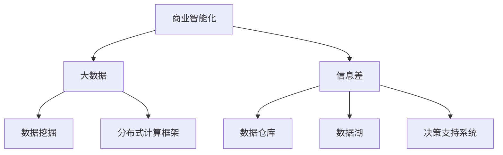

                 

# 信息差的商业智能化：大数据如何推动商业智能化

> 关键词：商业智能化，大数据，信息差，数据挖掘，市场预测，客户关系管理，供应链优化

> 摘要：本文深入探讨了商业智能化的概念及其发展背景，分析了大数据在商业智能化中的核心作用。通过详细阐述信息差与商业智能化的关系，本文揭示了大数据如何帮助企业利用信息优势实现智能化决策。文章涵盖了大数据基础、商业智能化的应用场景以及实践指南，并通过案例研究展示了大数据在商业智能化中的实际应用效果。

## 第一部分：引言

### 第1章：商业智能化的背景与现状

#### 1.1 商业智能化的定义与发展历程

商业智能化（Business Intelligence, BI）是指利用先进的信息技术，对大量业务数据进行采集、处理、分析和可视化，从而帮助企业做出更加科学和准确的决策。商业智能化的概念最早可以追溯到20世纪80年代，当时的数据仓库技术和数据分析工具开始兴起。随着互联网、大数据和人工智能技术的快速发展，商业智能化经历了从单一的数据分析到多维度的数据挖掘、从静态的数据报告到动态的数据可视化、从局部的业务优化到全面的业务洞察的演变。

商业智能化的目标是通过数据驱动的决策支持，提高企业的运营效率和市场竞争力。具体来说，商业智能化包括以下几个关键步骤：

1. 数据采集：从各种业务系统中提取结构化、半结构化和非结构化的数据。
2. 数据存储：利用数据仓库和数据湖技术，对数据进行存储和管理。
3. 数据分析：运用数据挖掘、统计分析、机器学习等方法，对数据进行分析和挖掘。
4. 决策支持：通过数据分析和可视化，为决策者提供直观、准确的决策支持。

#### 1.2 信息差与商业智能化的关系

信息差是指不同个体或组织在获取、处理和利用信息方面存在的差异。在商业环境中，信息差往往意味着竞争优势。企业通过获取并利用比竞争对手更准确、更全面的信息，可以更有效地预测市场趋势、优化运营流程、提高产品服务质量，从而在市场中占据有利位置。

商业智能化正是利用大数据技术来消除信息差，实现智能化决策。具体来说，大数据技术可以为企业带来以下几个方面的优势：

1. **市场洞察力**：通过大数据分析，企业可以深入挖掘市场数据，发现潜在的市场机会和风险。
2. **客户理解**：通过分析客户行为数据，企业可以更好地理解客户需求，实现精准营销和个性化服务。
3. **运营优化**：通过数据驱动的决策支持，企业可以优化供应链、库存管理和采购策略，提高运营效率。
4. **风险管理**：通过预测和预警机制，企业可以提前识别潜在风险，制定有效的风险管理策略。

#### 1.3 大数据在商业智能化中的作用

大数据（Big Data）是指数据量巨大、类型多样、生成速度快的海量数据。大数据技术在商业智能化中发挥着至关重要的作用。以下是大数据在商业智能化中的几个关键作用：

1. **数据采集与整合**：大数据技术可以帮助企业从多个数据源中采集数据，包括内部业务数据、社交媒体数据、市场数据等，并将这些数据整合到一个统一的数据平台中。
2. **数据存储与管理**：大数据存储技术（如Hadoop、NoSQL数据库等）可以高效地存储和管理海量数据，确保数据的安全性和可靠性。
3. **数据挖掘与分析**：大数据分析技术（如数据挖掘、机器学习、深度学习等）可以对海量数据进行深入挖掘和分析，发现数据中的隐藏模式和关联。
4. **数据可视化**：大数据可视化技术可以帮助企业将复杂的数据分析结果以直观的图表和报告形式呈现，提高决策者的理解能力和决策效率。

#### 1.4 商业智能化面临的挑战与机遇

尽管商业智能化带来了巨大的机遇，但同时也面临着一些挑战：

1. **数据质量**：高质量的数据是商业智能化的基础。企业需要确保数据来源的可靠性、数据的完整性和一致性。
2. **数据安全**：随着数据量的增加，数据安全风险也相应增加。企业需要建立完善的数据安全机制，防止数据泄露和滥用。
3. **技术复杂性**：大数据技术和商业智能化的实现涉及多个技术领域，如数据存储、数据处理、数据分析、数据可视化等。企业需要具备相应的技术能力和人才储备。
4. **决策者意识**：商业智能化的成功离不开决策者的支持和参与。企业需要提高决策者的数据素养，使他们能够充分利用数据分析结果做出明智的决策。

然而，随着技术的不断进步和大数据分析的成熟，商业智能化正逐步克服这些挑战，为企业带来更多机遇。

## 第二部分：大数据基础

### 第2章：大数据概述

#### 2.1 大数据的特点与分类

大数据具有以下几个主要特点：

1. **海量**：大数据的数据量非常庞大，通常达到PB（皮字节）级别甚至更高。
2. **多样性**：大数据不仅包括传统的结构化数据，还包括半结构化和非结构化数据，如文本、图像、音频、视频等。
3. **高速**：大数据的生成速度非常快，需要实时或近实时处理。
4. **真实性**：大数据往往是真实的业务数据，反映了实际业务情况。

根据数据来源和数据类型，大数据可以分为以下几种类型：

1. **企业内部数据**：包括交易记录、客户关系管理数据、人力资源数据等。
2. **社交媒体数据**：包括用户评论、社交媒体帖子、用户行为数据等。
3. **公共数据**：包括政府公开数据、地理信息数据等。
4. **机器数据**：包括网络日志、传感器数据、设备运行数据等。

#### 2.2 数据源的获取与处理

大数据的获取和处理涉及多个环节：

1. **数据采集**：通过数据采集工具，从各种数据源（如数据库、文件系统、Web服务等）中获取数据。
2. **数据清洗**：对采集到的数据进行清洗，去除重复、无效、错误的数据，确保数据的质量。
3. **数据集成**：将来自不同数据源的数据进行整合，建立统一的数据视图。
4. **数据存储**：利用大数据存储技术（如Hadoop、NoSQL数据库等）对数据进行存储和管理。
5. **数据归档**：对于长时间不改变的数据，进行归档处理，以节省存储空间。

#### 2.3 数据仓库与数据湖

数据仓库（Data Warehouse）是一种用于存储和管理企业数据的系统，通常包含大量历史数据。数据仓库的设计目标是支持复杂的查询和分析操作，提供决策支持。

数据湖（Data Lake）是一种用于存储大量原始数据的系统，它不像数据仓库那样预先定义数据结构。数据湖的设计目标是存储各种类型的数据，包括结构化、半结构化和非结构化数据，以便于后续的数据处理和分析。

数据仓库与数据湖的主要区别在于：

1. **数据结构**：数据仓库中的数据通常是结构化的，而数据湖中的数据可以是结构化、半结构化和非结构化的。
2. **用途**：数据仓库主要用于支持决策分析，而数据湖主要用于数据存储和大数据处理。
3. **灵活性**：数据湖具有更高的灵活性，可以存储不同类型的数据，而数据仓库通常只存储与特定业务相关的数据。

## 第三部分：数据挖掘与分析

### 第3章：数据挖掘与分析

#### 3.1 数据挖掘的基本概念与流程

数据挖掘（Data Mining）是指从大量数据中自动发现隐藏的、有价值的模式和知识的过程。数据挖掘的目标是揭示数据中的隐藏关系和规律，为决策提供支持。

数据挖掘的基本流程包括：

1. **问题定义**：明确数据挖掘的目标和问题。
2. **数据准备**：包括数据采集、数据清洗、数据集成等。
3. **数据探索**：通过可视化、统计方法等对数据进行初步分析，发现数据中的异常和趋势。
4. **模型建立**：选择合适的数据挖掘算法，建立预测模型或分类模型。
5. **模型评估**：对建立的模型进行评估，包括模型准确度、召回率、F1值等。
6. **模型部署**：将数据挖掘模型应用到实际业务场景中。

#### 3.2 关联规则挖掘

关联规则挖掘（Association Rule Learning）是一种常见的数据挖掘技术，用于发现数据集中的项之间的关联关系。关联规则通常表示为“如果A则B”，其中A和B是数据集中的项。

关联规则挖掘的基本流程包括：

1. **支持度计算**：计算每个关联规则的支持度，即包含关联规则项的数据集比例。
2. **置信度计算**：计算每个关联规则的置信度，即关联规则发生的条件概率。
3. **规则生成**：根据支持度和置信度阈值，生成满足条件的关联规则。

一个典型的关联规则挖掘示例是市场篮子分析，通过分析顾客的购物记录，发现哪些商品经常一起购买。例如，如果一个商店发现80%购买牛奶的顾客也购买了面包，那么可以得出牛奶和面包之间的高支持度关联规则。

#### 3.3 聚类分析与分类算法

聚类分析（Cluster Analysis）是一种无监督学习技术，用于将数据集划分为多个群组，使得同一群组内的数据对象彼此相似，不同群组的数据对象彼此不同。

常见的聚类算法包括：

1. **K-means算法**：K-means算法通过迭代过程将数据点分为K个簇，目标是使得每个簇内的数据点到簇中心（均值）的距离最小。
2. **层次聚类算法**：层次聚类算法通过逐步合并或分解数据点，形成一棵层次聚类树。
3. **密度聚类算法**：密度聚类算法基于数据点的密度分布，将高密度区域划分为簇。

分类算法（Classification）是一种有监督学习技术，用于将数据集划分为预定义的类别。常见的分类算法包括：

1. **决策树算法**：决策树算法通过构建一棵决策树，根据特征值选择分支，最终达到分类的目的。
2. **随机森林算法**：随机森林算法是基于决策树构建的集成学习模型，通过多棵决策树进行投票，提高分类准确度。
3. **支持向量机算法**：支持向量机算法通过寻找最优超平面，将数据集划分为不同的类别。

#### 3.4 回归分析与预测

回归分析（Regression Analysis）是一种用于预测连续值的统计方法。回归分析的基本思想是通过建立自变量和因变量之间的关系模型，利用已知自变量的值预测因变量的值。

常见的回归分析方法包括：

1. **线性回归**：线性回归假设自变量和因变量之间存在线性关系，通过建立线性模型进行预测。
2. **多项式回归**：多项式回归扩展了线性回归，允许自变量和因变量之间存在多项式关系。
3. **逻辑回归**：逻辑回归是一种用于分类问题的回归方法，通过建立逻辑函数将自变量映射到概率值。

回归分析在商业智能化中广泛应用于需求预测、价格预测、风险评估等方面。例如，一家零售企业可以通过回归分析预测某种商品的销售量，从而制定合理的库存策略。

## 第四部分：大数据技术与应用

### 第4章：大数据技术与应用

#### 4.1 分布式计算框架（如Hadoop、Spark）

分布式计算框架是大数据处理的核心技术，可以高效地处理海量数据。常见的分布式计算框架包括Hadoop和Spark。

Hadoop是一种基于分布式文件系统（HDFS）和分布式计算模型（MapReduce）的开源框架。Hadoop的核心组件包括：

1. **HDFS**：Hadoop分布式文件系统，用于存储海量数据。
2. **MapReduce**：MapReduce编程模型，用于分布式数据处理。
3. **YARN**：Yet Another Resource Negotiator，用于资源管理和调度。

Spark是一种基于内存的分布式计算框架，可以显著提高数据处理速度。Spark的核心组件包括：

1. **Spark Core**：提供基本的分布式计算功能和任务调度。
2. **Spark SQL**：提供数据处理和分析功能。
3. **Spark Streaming**：提供实时数据处理和分析功能。
4. **MLlib**：提供机器学习算法和库。

#### 4.2 大数据存储技术（如HDFS、NoSQL数据库）

大数据存储技术是大数据处理的基础，需要具备高吞吐量、高可靠性和高可扩展性的特点。常见的大数据存储技术包括HDFS和NoSQL数据库。

HDFS（Hadoop Distributed File System）是Hadoop的分布式文件系统，具有以下特点：

1. **高吞吐量**：HDFS可以高效地处理大数据存储和读取操作。
2. **高可靠性**：HDFS采用数据冗余和副本机制，确保数据的安全性和可靠性。
3. **高可扩展性**：HDFS可以轻松扩展，以适应不断增长的数据量。

NoSQL数据库是一种非关系型数据库，适用于大数据存储和处理。常见的NoSQL数据库包括：

1. **MongoDB**：一种文档型数据库，支持海量数据的存储和高效查询。
2. **Cassandra**：一种分布式宽列数据库，适用于高并发和大数据量的场景。
3. **Redis**：一种基于内存的键值数据库，适用于高速缓存和实时数据处理。

#### 4.3 大数据可视化技术

大数据可视化技术是将复杂的数据分析结果以图形化的形式呈现，帮助用户直观地理解数据。常见的大数据可视化工具包括：

1. **Tableau**：一种强大的可视化工具，支持多种数据源和丰富的图表类型。
2. **Power BI**：一种商业智能工具，提供数据可视化、报表和仪表盘功能。
3. **D3.js**：一种基于JavaScript的可视化库，可以创建交互式和高度自定义的视觉图表。

大数据可视化技术可以应用于多个领域，如市场分析、客户关系管理、供应链优化等，帮助用户从海量数据中发现有价值的信息和洞察。

## 第五部分：商业智能化的应用

### 第5章：市场分析与预测

#### 5.1 市场需求分析

市场需求分析是商业智能化的重要应用之一，通过分析市场数据，企业可以了解消费者的需求趋势，制定合适的市场策略。市场需求分析的基本步骤包括：

1. **数据采集**：收集与市场需求相关的数据，如市场调查数据、销售数据、竞争者数据等。
2. **数据清洗**：清洗和整理数据，确保数据质量。
3. **数据可视化**：通过图表和报告，展示市场需求的数据趋势和特点。
4. **需求预测**：利用回归分析、时间序列分析等方法，预测未来的市场需求。

#### 5.2 市场趋势预测

市场趋势预测是商业智能化的另一重要应用，通过分析市场数据，企业可以预测未来的市场变化，提前制定应对策略。市场趋势预测的基本步骤包括：

1. **数据采集**：收集与市场趋势相关的数据，如市场报告、行业数据、社交媒体数据等。
2. **数据清洗**：清洗和整理数据，确保数据质量。
3. **趋势分析**：利用统计分析、时间序列分析等方法，分析市场数据的变化趋势。
4. **预测建模**：建立预测模型，预测未来的市场趋势。

#### 5.3 竞争对手分析

竞争对手分析是商业智能化在市场营销中的又一重要应用，通过分析竞争对手的数据，企业可以了解竞争对手的市场策略、产品特点、客户评价等，制定相应的市场策略。竞争对手分析的基本步骤包括：

1. **数据采集**：收集与竞争对手相关的数据，如竞争对手的网站、社交媒体、市场报告等。
2. **数据清洗**：清洗和整理数据，确保数据质量。
3. **竞争对手分析**：通过对比分析，了解竞争对手的市场策略、产品特点、客户评价等。
4. **市场策略制定**：根据竞争对手分析的结果，制定相应的市场策略。

### 第6章：客户关系管理

#### 6.1 客户细分与定位

客户细分与定位是客户关系管理的重要环节，通过分析客户数据，企业可以将客户分为不同的细分市场，并根据客户特征制定个性化的营销策略。客户细分与定位的基本步骤包括：

1. **数据采集**：收集与客户相关的数据，如购买记录、行为数据、社交媒体数据等。
2. **数据清洗**：清洗和整理数据，确保数据质量。
3. **客户细分**：利用聚类分析、关联规则挖掘等方法，将客户分为不同的细分市场。
4. **客户定位**：根据客户细分结果，为每个细分市场制定相应的营销策略。

#### 6.2 客户行为分析

客户行为分析是商业智能化在客户关系管理中的又一重要应用，通过分析客户行为数据，企业可以了解客户购买行为、偏好等，优化客户体验和提升客户满意度。客户行为分析的基本步骤包括：

1. **数据采集**：收集与客户行为相关的数据，如购买记录、浏览行为、社交媒体行为等。
2. **数据清洗**：清洗和整理数据，确保数据质量。
3. **行为分析**：利用统计分析、时间序列分析等方法，分析客户行为数据。
4. **客户体验优化**：根据客户行为分析结果，优化客户体验和提升客户满意度。

#### 6.3 客户忠诚度管理

客户忠诚度管理是商业智能化在客户关系管理中的又一重要应用，通过分析客户忠诚度数据，企业可以识别高价值客户，制定相应的忠诚度管理策略。客户忠诚度管理的基本步骤包括：

1. **数据采集**：收集与客户忠诚度相关的数据，如客户购买记录、客户评价、客户满意度等。
2. **数据清洗**：清洗和整理数据，确保数据质量。
3. **忠诚度分析**：利用统计分析、机器学习等方法，分析客户忠诚度数据。
4. **忠诚度管理策略制定**：根据客户忠诚度分析结果，制定相应的忠诚度管理策略。

### 第7章：供应链管理优化

#### 7.1 供应链数据管理

供应链数据管理是商业智能化在供应链管理中的基础，通过有效的数据管理，企业可以实现供应链数据的集成、存储、处理和分析。供应链数据管理的基本步骤包括：

1. **数据采集**：收集与供应链相关的数据，如供应商数据、生产数据、库存数据等。
2. **数据清洗**：清洗和整理数据，确保数据质量。
3. **数据存储**：利用大数据存储技术，存储和管理供应链数据。
4. **数据处理**：利用数据挖掘、机器学习等技术，处理和分析供应链数据。

#### 7.2 库存优化

库存优化是商业智能化在供应链管理中的重要应用，通过分析库存数据，企业可以优化库存水平，减少库存成本，提高库存周转率。库存优化的基本步骤包括：

1. **数据采集**：收集与库存相关的数据，如库存水平、库存周转率、库存成本等。
2. **数据清洗**：清洗和整理数据，确保数据质量。
3. **库存分析**：利用回归分析、时间序列分析等方法，分析库存数据。
4. **库存优化策略制定**：根据库存分析结果，制定相应的库存优化策略。

#### 7.3 采购策略优化

采购策略优化是商业智能化在供应链管理中的又一重要应用，通过分析采购数据，企业可以优化采购策略，降低采购成本，提高采购效率。采购策略优化的基本步骤包括：

1. **数据采集**：收集与采购相关的数据，如采购订单、采购价格、供应商评价等。
2. **数据清洗**：清洗和整理数据，确保数据质量。
3. **采购分析**：利用回归分析、时间序列分析等方法，分析采购数据。
4. **采购策略制定**：根据采购分析结果，制定相应的采购策略。

### 第8章：产品与定价策略

#### 8.1 产品定位与研发

产品定位与研发是商业智能化在产品管理中的重要应用，通过分析市场数据和客户需求，企业可以确定合适的产品定位，优化产品研发流程。产品定位与研发的基本步骤包括：

1. **市场数据分析**：收集与市场相关的数据，如市场趋势、竞争对手数据等。
2. **客户需求分析**：收集与客户需求相关的数据，如客户评论、问卷调查等。
3. **产品定位**：根据市场数据和客户需求，确定合适的产品定位。
4. **研发流程优化**：根据产品定位，优化产品研发流程，提高研发效率。

#### 8.2 产品定价策略

产品定价策略是商业智能化在产品管理中的重要应用，通过分析市场数据和成本数据，企业可以制定合适的产品定价策略，提高产品竞争力。产品定价策略的基本步骤包括：

1. **成本分析**：收集与成本相关的数据，如生产成本、运营成本等。
2. **市场分析**：收集与市场相关的数据，如市场需求、竞争对手定价等。
3. **定价模型建立**：建立定价模型，确定产品的定价策略。
4. **定价策略优化**：根据定价模型和市场数据，优化产品定价策略。

#### 8.3 产品优化与迭代

产品优化与迭代是商业智能化在产品管理中的重要应用，通过分析用户反馈和产品数据，企业可以不断优化产品，提高用户满意度。产品优化与迭代的基本步骤包括：

1. **用户反馈收集**：收集与用户反馈相关的数据，如用户评论、调查问卷等。
2. **产品数据分析**：收集与产品数据相关的数据，如产品性能数据、用户行为数据等。
3. **产品优化**：根据用户反馈和产品数据分析，优化产品功能、性能等。
4. **迭代发布**：根据产品优化结果，发布新的产品版本。

### 第9章：风险管理与决策

#### 9.1 风险识别与评估

风险识别与评估是商业智能化在风险管理中的重要应用，通过分析市场数据和业务数据，企业可以识别潜在风险，评估风险的影响和可能性。风险识别与评估的基本步骤包括：

1. **市场数据分析**：收集与市场相关的数据，如市场趋势、竞争对手数据等。
2. **业务数据分析**：收集与业务相关的数据，如业务流程数据、运营数据等。
3. **风险识别**：通过分析数据，识别潜在的风险因素。
4. **风险评估**：评估风险的影响和可能性，确定风险等级。

#### 9.2 决策支持系统

决策支持系统（Decision Support System, DSS）是商业智能化在决策过程中的重要工具，通过提供数据分析和可视化，帮助决策者做出明智的决策。决策支持系统的基本步骤包括：

1. **数据收集**：收集与决策相关的数据，如市场数据、业务数据、风险数据等。
2. **数据分析**：利用数据挖掘、统计分析等方法，对数据进行分析。
3. **可视化展示**：通过图表、报告等形式，将数据分析结果展示给决策者。
4. **决策支持**：根据数据分析结果，提供决策建议和优化方案。

#### 9.3 风险管理策略

风险管理策略是商业智能化在风险管理中的重要应用，通过分析风险数据和业务数据，企业可以制定有效的风险管理策略，降低风险的影响。风险管理策略的基本步骤包括：

1. **风险分析**：分析风险数据和业务数据，了解风险的来源和影响。
2. **风险控制**：制定风险控制措施，降低风险的影响和可能性。
3. **风险监控**：建立风险监控机制，实时监测风险的变化。
4. **风险报告**：定期报告风险状况，评估风险管理策略的效果。

## 第六部分：案例与实践

### 第10章：案例研究

#### 10.1 案例选择与描述

案例研究是验证商业智能化应用效果的重要手段。本文选择了一家零售企业作为案例研究对象，该企业通过大数据分析和商业智能化技术，实现了市场预测、客户关系管理和供应链优化的目标。

#### 10.2 案例分析与评估

通过对该零售企业的数据进行分析，可以发现以下结果：

1. **市场预测**：利用大数据分析，该企业成功预测了市场需求趋势，提前制定了产品促销和库存策略，提高了销售额和库存周转率。
2. **客户关系管理**：通过分析客户行为数据，该企业实现了精准营销和个性化服务，提高了客户满意度和忠诚度。
3. **供应链优化**：通过优化库存管理和采购策略，该企业降低了库存成本，提高了供应链的响应速度和灵活性。

#### 10.3 案例实施与效果

该零售企业的商业智能化实施过程包括以下几个步骤：

1. **数据采集与整合**：从各个业务系统中提取数据，建立统一的数据平台。
2. **数据挖掘与分析**：利用大数据分析技术，对市场数据、客户数据和供应链数据进行挖掘和分析。
3. **决策支持**：根据分析结果，制定市场策略、客户关系管理和供应链优化的策略。
4. **效果评估**：定期评估商业智能化应用的效果，不断优化和改进。

通过实施商业智能化，该零售企业在市场预测、客户关系管理和供应链优化等方面取得了显著的效果，提高了企业的运营效率和市场竞争力。

### 第11章：实践指南

#### 11.1 实践步骤与要点

为了成功实施商业智能化，企业需要遵循以下实践步骤和要点：

1. **明确目标与需求**：明确商业智能化的目标和应用场景，确定需要解决的业务问题。
2. **数据采集与整合**：建立统一的数据平台，收集并整合来自各个业务系统的数据。
3. **数据预处理**：对数据进行清洗、去噪、标准化等预处理操作，确保数据质量。
4. **数据挖掘与分析**：利用大数据分析技术，对数据进行挖掘和分析，提取有价值的信息。
5. **决策支持**：根据分析结果，制定相应的市场策略、客户关系管理和供应链优化策略。
6. **效果评估**：定期评估商业智能化应用的效果，不断优化和改进。

#### 11.2 实践工具与资源

为了实施商业智能化，企业需要以下工具和资源：

1. **大数据技术栈**：包括Hadoop、Spark、HDFS、NoSQL数据库等。
2. **数据可视化工具**：包括Tableau、Power BI、D3.js等。
3. **机器学习与数据挖掘工具**：包括scikit-learn、TensorFlow、PyTorch等。
4. **云计算平台**：如Amazon Web Services、Microsoft Azure、Google Cloud等。
5. **专业团队**：包括数据科学家、数据分析师、业务分析师等。

#### 11.3 实践案例分享与讨论

在本节中，我们将分享一些实际案例，讨论商业智能化在各个行业中的应用效果和经验教训。通过这些案例，读者可以深入了解商业智能化的实践过程和关键成功因素。

## 附录

### 附录A：相关术语解释

#### A.1 术语定义

- 商业智能化（Business Intelligence, BI）：利用先进的信息技术，对大量业务数据进行采集、处理、分析和可视化，从而帮助企业做出更加科学和准确的决策。
- 大数据（Big Data）：数据量巨大、类型多样、生成速度快的海量数据。
- 信息差（Information Gap）：不同个体或组织在获取、处理和利用信息方面存在的差异。
- 数据挖掘（Data Mining）：从大量数据中自动发现隐藏的、有价值的模式和知识的过程。
- 分布式计算框架（Distributed Computing Framework）：用于高效地处理海量数据的计算框架，如Hadoop、Spark等。
- 数据仓库（Data Warehouse）：一种用于存储和管理企业数据的系统，通常包含大量历史数据。
- 数据湖（Data Lake）：一种用于存储大量原始数据的系统，可以存储结构化、半结构化和非结构化数据。
- 决策支持系统（Decision Support System, DSS）：提供数据分析和可视化，帮助决策者做出明智的决策的系统。

#### A.2 术语关联图

### 附录B：参考文献

#### B.1 书籍推荐

1. 《大数据时代：生活、工作与思维的大变革》作者：克里斯·安德森
2. 《数据挖掘：实用工具和技术》作者：潘洁、陈宇飞
3. 《商业智能：从数据到决策》作者：戴夫·瓦达拉
4. 《数据挖掘：概念与技术》作者：约瑟夫·汉密尔顿、杰里·哈里斯

#### B.2 文章与报告

1. "Big Data: A Revolution That Will Transform How We Live, Work, and Think" by Viktor Mayer-Schoenberger and Kenneth Cukier
2. "The Age of Big Data: Business Model Innovation for the Information Revolution" by Geoffrey A. Moore
3. "The Data-Driven Organization: How to Build It and How to Run It" by Thomas H. Davenport and Jeanne G. Harris

#### B.3 数据源与工具推荐

1. **数据源**：
   - Kaggle（https://www.kaggle.com/）
   - Data.gov（https://www.data.gov/）
   - UCI Machine Learning Repository（https://archive.ics.uci.edu/ml/index.php）

2. **工具**：
   - Tableau（https://www.tableau.com/）
   - Power BI（https://powerbi.microsoft.com/）
   - D3.js（https://d3js.org/）
   - Hadoop（https://hadoop.apache.org/）
   - Spark（https://spark.apache.org/）

### 附录C：数学模型与公式

为了深入理解商业智能化的数据挖掘与分析，以下是一些常用的数学模型与公式，包括回归分析、聚类分析等。

#### A.1. 线性回归模型

线性回归模型的基本公式为：

\[ Y = \beta_0 + \beta_1X + \epsilon \]

其中，\( Y \) 是因变量，\( X \) 是自变量，\( \beta_0 \) 和 \( \beta_1 \) 是模型的参数，\( \epsilon \) 是误差项。

#### A.2. 逻辑回归模型

逻辑回归模型用于分类问题，其公式为：

\[ P(Y=1) = \frac{1}{1 + e^{-(\beta_0 + \beta_1X)}} \]

其中，\( P(Y=1) \) 是目标变量为1的概率，\( \beta_0 \) 和 \( \beta_1 \) 是模型的参数。

#### A.3. K-means聚类算法

K-means聚类算法的目标是找到 \( k \) 个簇，使得每个簇内的数据点彼此相似，不同簇的数据点彼此不同。其公式为：

\[ \min \sum_{i=1}^{k} \sum_{x \in S_i} \|x - \mu_i\|^2 \]

其中，\( S_i \) 是第 \( i \) 个簇，\( \mu_i \) 是第 \( i \) 个簇的中心点。

#### A.4. 聚类分析中的距离度量

常用的距离度量方法包括欧几里得距离和曼哈顿距离：

- 欧几里得距离：

\[ d(x, y) = \sqrt{\sum_{i=1}^{n} (x_i - y_i)^2} \]

- 曼哈顿距离：

\[ d(x, y) = \sum_{i=1}^{n} |x_i - y_i| \]

通过以上数学模型与公式的理解和应用，可以帮助我们在商业智能化的实践中更加准确地分析和预测数据，为企业决策提供有力支持。

