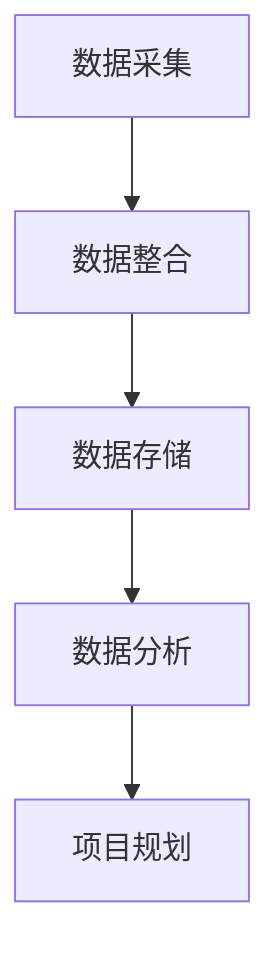
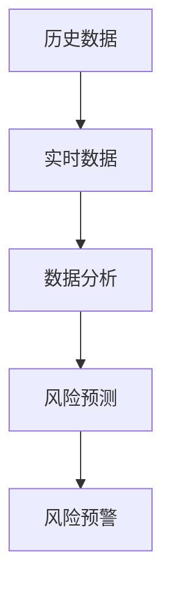
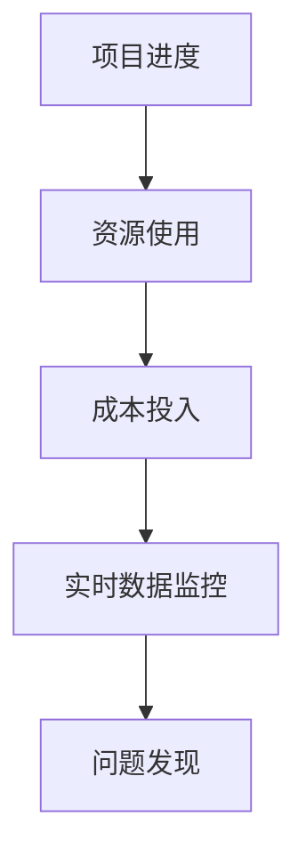
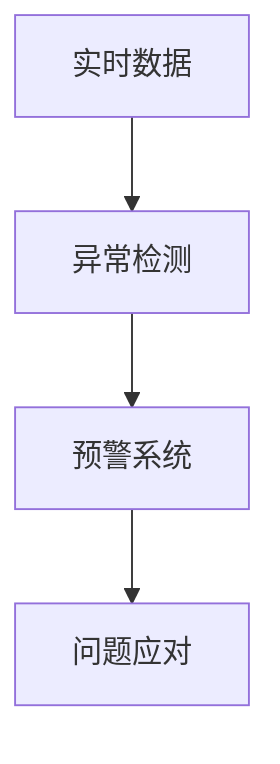
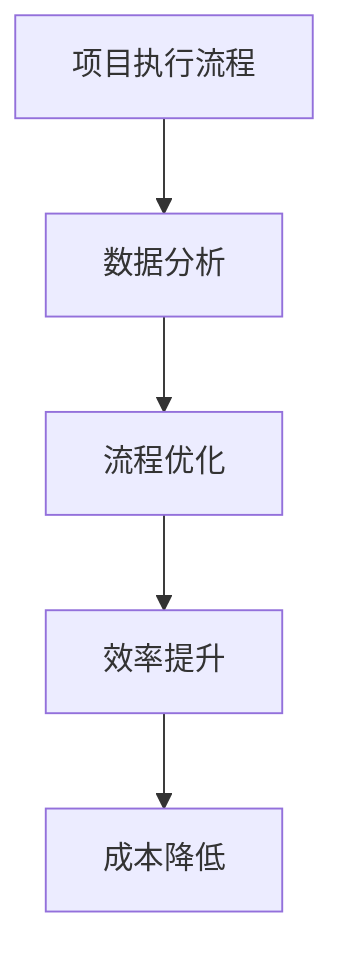
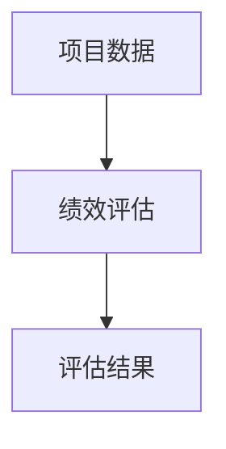
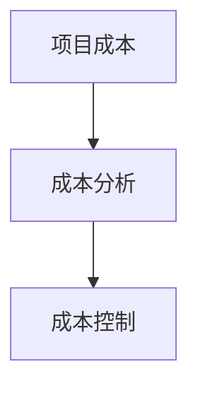
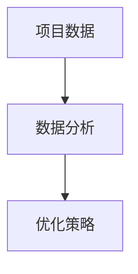

                 

# 《信息差的商业项目管理：大数据如何提升项目管理》

> 关键词：大数据、商业项目管理、信息差、项目风险预测、项目监控、项目优化、案例分析

> 摘要：本文将探讨大数据在商业项目管理中的应用，如何通过利用信息差来提升项目的管理效率和质量。我们将从大数据的定义、商业项目管理的挑战以及大数据与商业项目管理的融合等方面进行深入分析，并通过实际案例展示大数据在商业项目管理中的具体应用和价值。

----------------------------------------------------------------

### 第一部分：引言

#### 1.1 背景与意义

在当今这个信息爆炸的时代，大数据已经成为了企业竞争的重要资产。商业项目管理作为企业运营的核心环节，如何有效地利用大数据技术来提升项目管理水平，成为了当前企业关注的热点。信息差，即信息的不对称性，是商业项目中普遍存在的现象，利用大数据技术来缩小信息差，从而提高项目管理的效率和效果，具有重要的现实意义。

#### 1.1.1 信息差的定义

信息差，是指在不同主体之间，由于信息获取和处理能力的差异，导致对同一信息掌握程度的不同。在商业项目中，信息差可能表现为项目需求的理解、项目风险的认知、项目进度的监控等方面的差异。这些信息差的积累，往往会导致项目管理的失误和效率的低下。

#### 1.1.2 商业项目中的信息差现象

在商业项目管理中，信息差现象主要体现在以下几个方面：

- **需求信息差**：项目经理与客户之间可能存在对项目需求理解上的差异，导致项目目标不一致。
- **风险信息差**：项目团队对潜在风险的认识和预测能力存在差异，可能导致风险应对不足。
- **进度信息差**：项目进度监控的不透明，导致项目进展与预期存在偏差。
- **资源信息差**：项目资源的分配和使用存在信息不对称，可能导致资源浪费。

#### 1.1.3 大数据在商业项目管理中的应用价值

大数据技术的应用，可以有效缩小商业项目管理中的信息差，提升项目管理水平。其应用价值主要体现在以下几个方面：

- **数据采集与整合**：大数据技术可以全面收集和整合各类项目数据，为项目决策提供全面的信息支持。
- **数据分析与预测**：通过对项目数据的深度分析，可以准确预测项目风险，提前采取应对措施。
- **实时监控与预警**：大数据技术可以实现项目进度的实时监控，及时发现问题并预警，确保项目按计划进行。
- **项目优化与调整**：基于大数据分析结果，可以对项目计划进行实时调整，优化项目执行过程，提高项目成功率。

#### 1.2 大数据技术概述

大数据技术是指从海量数据中提取有价值信息的一系列技术手段。其核心包括数据采集、数据存储、数据处理、数据分析和数据可视化等环节。

##### 1.2.1 大数据的来源

大数据的来源非常广泛，包括社交媒体、物联网设备、企业内部系统、公共数据资源等。在商业项目中，大数据的来源主要包括客户行为数据、市场数据、销售数据、供应链数据等。

##### 1.2.2 大数据的特征

大数据具有4V特征，即：

- **Volume（体量）**：数据量大，需要处理和存储的能力强。
- **Velocity（速度）**：数据处理速度快，需要实时响应。
- **Variety（多样性）**：数据类型多样，包括结构化数据、半结构化数据和非结构化数据。
- **Veracity（真实性）**：数据真实性难以保证，需要数据清洗和去噪。

##### 1.2.3 大数据技术架构

大数据技术架构主要包括以下几个层次：

- **数据采集层**：负责收集各类数据，包括结构化数据、半结构化数据和非结构化数据。
- **数据存储层**：使用分布式存储技术，如Hadoop HDFS，存储海量数据。
- **数据处理层**：使用分布式计算技术，如MapReduce、Spark，对数据进行处理和分析。
- **数据仓库层**：将处理后的数据存储到数据仓库，以便进行数据分析和报表生成。
- **数据可视化层**：使用数据可视化工具，将数据转化为图表和报告，便于理解和决策。

#### 1.3 商业项目管理概述

商业项目管理是指通过系统的方法和工具，对商业项目进行规划、执行、监控和收尾的过程。其核心流程包括：

- **项目规划**：明确项目目标、范围、时间表和资源需求。
- **项目执行**：按照项目计划，组织项目团队，执行项目任务。
- **项目监控**：对项目进展进行监控，及时发现和解决问题。
- **项目收尾**：完成项目任务，进行项目验收和总结。

在商业项目管理中，面临的挑战主要包括：

- **需求变化**：项目需求可能随着市场环境变化而发生变化，需要灵活调整项目计划。
- **资源约束**：项目资源有限，需要合理分配和利用。
- **风险管理**：项目风险不可预测，需要提前识别和应对。
- **团队协作**：项目团队成员来自不同部门，需要有效沟通和协作。

### 第二部分：大数据与商业项目管理的融合

#### 2.1 大数据技术在商业项目规划中的应用

在商业项目规划阶段，大数据技术可以发挥重要作用，帮助项目团队做出更准确的决策。

##### 2.1.1 数据采集与整合

项目规划的第一步是数据采集与整合。大数据技术可以全面收集和整合各类数据，包括客户数据、市场数据、行业数据、企业内部数据等。这些数据的整合，可以为项目规划提供全面的信息支持。

##### 2.1.2 数据分析在项目规划中的作用

通过对整合后的数据进行分析，项目团队可以深入理解市场需求、客户行为和行业趋势。数据分析的结果，可以为项目规划提供以下支持：

- **市场需求分析**：了解目标客户的需求和偏好，为产品设计和功能规划提供依据。
- **竞争分析**：分析竞争对手的产品和服务，为项目策略制定提供参考。
- **趋势预测**：预测市场趋势，为项目长期规划提供方向。

##### 2.1.3 基于大数据的项目风险预测

项目规划阶段，项目团队还需要对潜在风险进行预测和评估。大数据技术可以通过对历史数据和实时数据的分析，识别项目风险并提前预警。

通过大数据分析，项目团队可以提前识别以下风险：

- **需求风险**：客户需求变化可能导致项目目标无法实现。
- **资源风险**：项目资源不足或资源调配不当，可能导致项目进度延误。
- **技术风险**：项目技术实现困难，可能导致项目失败。

#### 2.2 大数据在项目执行监控中的价值

项目执行监控是商业项目管理的核心环节，大数据技术可以提供实时、全面的数据支持，帮助项目团队及时发现问题并采取相应措施。

##### 2.2.1 实时数据监控

通过大数据技术，项目团队可以实时收集和监控项目执行过程中的各项数据，包括项目进度、资源使用、成本投入等。实时数据监控可以帮助项目团队：

- **了解项目进展**：实时掌握项目执行情况，与项目计划进行比对。
- **发现问题**：及时发现项目执行过程中的异常情况，如进度延误、成本超支等。

##### 2.2.2 异常检测与预警

通过大数据分析，项目团队可以实现对项目执行过程中异常情况的检测和预警。异常检测和预警可以帮助项目团队：

- **提前识别问题**：通过数据异常检测，提前发现潜在问题。
- **快速响应**：及时采取应对措施，防止问题扩大。

##### 2.2.3 优化项目执行流程

通过大数据分析，项目团队可以深入了解项目执行过程中的问题和瓶颈，从而优化项目执行流程。优化项目执行流程可以帮助项目团队：

- **提高效率**：通过流程优化，减少不必要的环节，提高项目执行效率。
- **降低成本**：通过流程优化，减少资源浪费，降低项目成本。

#### 2.3 大数据在项目评估与优化中的应用

项目评估与优化是商业项目管理的最后一步，通过大数据分析，项目团队可以全面评估项目执行效果，并优化项目管理和执行策略。

##### 2.3.1 项目绩效评估

通过大数据分析，项目团队可以全面评估项目绩效，包括项目完成情况、成本效益、客户满意度等。项目绩效评估可以帮助项目团队：

- **了解项目执行效果**：评估项目目标是否实现，项目质量是否达标。
- **总结经验教训**：总结项目执行过程中的成功经验和教训，为未来项目提供参考。

##### 2.3.2 项目成本控制

通过大数据分析，项目团队可以全面掌握项目成本投入情况，及时发现成本超支问题，并采取相应措施进行控制。项目成本控制可以帮助项目团队：

- **降低项目成本**：通过成本控制，减少项目成本浪费，提高项目投资回报率。
- **优化成本结构**：通过成本分析，优化项目成本结构，提高项目资源利用效率。

##### 2.3.3 项目优化策略

通过大数据分析，项目团队可以深入理解项目执行过程中的问题和瓶颈，从而制定针对性的优化策略。项目优化策略可以帮助项目团队：

- **优化项目流程**：通过流程优化，提高项目执行效率。
- **提升项目管理水平**：通过数据分析，提升项目管理的科学性和有效性。

#### 2.4 大数据与商业项目管理的整合框架

为了更好地利用大数据技术提升商业项目管理水平，需要构建一个完整的大数据与商业项目管理的整合框架。该框架包括以下关键组成部分：

##### 2.4.1 整合框架的构建

整合框架的构建主要包括以下几个方面：

- **数据采集与整合**：构建完善的数据采集系统，整合各类项目数据，为数据分析提供基础。
- **数据处理与存储**：采用分布式计算和存储技术，对数据进行处理和存储，确保数据的高效利用。
- **数据分析与应用**：构建数据分析平台，对项目数据进行深度分析，为项目决策提供支持。
- **数据可视化与展示**：使用数据可视化工具，将分析结果转化为图表和报告，便于理解和决策。

##### 2.4.2 整合框架的运行机制

整合框架的运行机制主要包括以下几个方面：

- **实时数据采集与处理**：实时采集项目数据，并利用分布式计算技术进行处理。
- **数据存储与管理**：将处理后的数据存储到数据仓库，并进行统一管理。
- **数据分析与决策**：基于数据分析结果，为项目团队提供决策支持。
- **数据反馈与调整**：将数据分析结果应用于项目执行和优化，形成闭环管理。

##### 2.4.3 整合框架的实施步骤

整合框架的实施步骤主要包括以下几个方面：

- **需求分析与规划**：明确项目需求，制定整合框架的规划和设计。
- **系统建设与集成**：构建数据采集、处理、分析和展示系统，并进行集成测试。
- **数据采集与整合**：开展数据采集工作，确保数据质量和完整性。
- **数据分析与优化**：对项目数据进行分析，为项目决策提供支持，并根据分析结果进行项目优化。
- **持续改进与优化**：根据项目执行情况，持续优化整合框架，提高项目管理水平。

### 第三部分：大数据在商业项目管理中的实践案例

在本部分，我们将通过三个实际案例，展示大数据技术在商业项目管理中的应用和价值。

#### 3.1 案例一：某大型电商平台项目

某大型电商平台在一次年度促销活动中，利用大数据技术进行了全面的项目管理和优化，取得了显著的效果。

##### 3.1.1 项目背景

该电商平台年度促销活动，是平台年度最重要的营销活动之一，涉及大量商品、数百万用户和庞大的促销资源。活动期间，平台需要实时监控促销效果，确保促销活动的顺利进行。

##### 3.1.2 数据采集与整合

在活动前期，平台通过数据分析系统，整合了以下数据：

- **用户数据**：包括用户行为数据、用户画像数据等。
- **商品数据**：包括商品销售数据、库存数据等。
- **促销数据**：包括促销方案、促销效果数据等。
- **市场数据**：包括行业竞争对手促销活动数据、市场趋势数据等。

这些数据的整合，为平台提供了全面的信息支持。

##### 3.1.3 数据分析与应用

在活动期间，平台通过大数据分析系统，对以下方面进行了实时分析：

- **用户行为分析**：分析用户购物行为，优化商品推荐策略，提高用户购物体验。
- **促销效果分析**：分析促销活动的效果，及时调整促销策略，提高促销效果。
- **库存管理分析**：分析商品库存情况，优化库存策略，避免库存积压。

通过数据分析，平台能够实时掌握促销活动的动态，及时调整策略，确保活动顺利进行。

##### 3.1.4 项目执行与监控

在项目执行过程中，平台利用大数据技术，实现了以下监控功能：

- **实时监控**：实时监控促销活动的各项数据，包括用户访问量、订单量、促销效果等。
- **异常检测**：通过大数据分析，实时检测异常情况，如用户访问高峰、订单异常等，及时采取应对措施。
- **预警系统**：通过大数据分析，提前预警可能出现的问题，如库存不足、服务器负载高等，确保活动期间平台的稳定运行。

##### 3.1.5 项目评估与优化

活动结束后，平台通过大数据分析，对促销活动进行了全面评估：

- **促销效果评估**：评估促销活动的整体效果，包括用户参与度、销售额、客户满意度等。
- **成本效益评估**：评估促销活动的成本效益，分析投入产出比。
- **经验总结**：总结促销活动中的成功经验和不足之处，为未来活动提供参考。

通过大数据分析，平台能够对促销活动进行全面评估，为未来活动提供决策支持。

#### 3.2 案例二：某金融项目风险管理

某金融机构在一次大型项目实施过程中，利用大数据技术进行了全面的风险管理，有效降低了项目风险。

##### 3.2.1 项目背景

该金融机构在一次大型项目实施过程中，面临诸多风险，如技术风险、市场风险、法律风险等。为了确保项目成功，金融机构决定利用大数据技术进行风险管理。

##### 3.2.2 数据采集与整合

在项目实施过程中，金融机构通过数据分析系统，整合了以下数据：

- **客户数据**：包括客户行为数据、客户信用评级数据等。
- **市场数据**：包括市场趋势数据、行业竞争对手数据等。
- **项目数据**：包括项目进度数据、项目成本数据等。
- **法律法规数据**：包括相关法律法规数据、政策调整数据等。

这些数据的整合，为金融机构提供了全面的信息支持。

##### 3.2.3 数据分析在风险管理中的应用

在项目实施过程中，金融机构通过大数据分析系统，对以下方面进行了实时分析：

- **风险识别**：通过客户数据和市场数据，识别项目潜在风险，如客户信用风险、市场波动风险等。
- **风险预测**：通过历史数据和实时数据分析，预测项目风险发生的可能性，提前采取应对措施。
- **风险监控**：通过项目数据监控，实时掌握项目进展情况，及时发现和预警风险。

##### 3.2.4 风险监控与预警

在项目实施过程中，金融机构通过大数据分析，实现了以下风险监控与预警功能：

- **实时监控**：实时监控项目进展情况，包括项目进度、成本、质量等，及时发现异常情况。
- **预警系统**：通过大数据分析，提前预警可能出现的风险，如项目延期、成本超支等，确保项目顺利实施。

##### 3.2.5 风险管理策略优化

通过大数据分析，金融机构对风险管理策略进行了优化：

- **风险控制策略**：根据数据分析结果，优化风险控制策略，如调整客户信用评级标准、优化项目进度安排等。
- **应急响应策略**：制定应急响应策略，如项目延期应对策略、成本超支应对策略等，确保项目在面临风险时能够迅速应对。

#### 3.3 案例三：某制造业供应链优化项目

某制造业企业利用大数据技术进行供应链优化，提高了供应链效率，降低了运营成本。

##### 3.3.1 项目背景

该制造业企业在供应链管理中，面临诸多问题，如库存积压、供应链延迟、成本高等。为了提高供应链效率，企业决定利用大数据技术进行供应链优化。

##### 3.3.2 数据采集与整合

在供应链优化过程中，企业通过数据分析系统，整合了以下数据：

- **供应链数据**：包括供应商数据、库存数据、运输数据等。
- **市场数据**：包括市场需求数据、行业竞争对手数据等。
- **成本数据**：包括采购成本、运输成本、库存成本等。
- **订单数据**：包括订单量、订单完成时间等。

这些数据的整合，为企业的供应链优化提供了全面的信息支持。

##### 3.3.3 供应链数据分析与应用

在供应链优化过程中，企业通过大数据分析系统，对以下方面进行了实时分析：

- **库存管理分析**：通过供应链数据和市场需求数据，分析库存水平，优化库存策略，避免库存积压。
- **运输管理分析**：通过运输数据和市场需求数据，优化运输路线和运输方式，提高运输效率。
- **成本管理分析**：通过成本数据和订单数据，优化成本结构，降低运营成本。

##### 3.3.4 项目执行与监控

在供应链优化过程中，企业通过大数据技术，实现了以下监控功能：

- **实时监控**：实时监控供应链各项数据，包括库存水平、运输进度、订单完成情况等。
- **异常检测**：通过大数据分析，实时检测供应链中的异常情况，如库存预警、运输延误等，及时采取应对措施。
- **预警系统**：通过大数据分析，提前预警可能出现的供应链问题，如库存积压、供应链延迟等。

##### 3.3.5 项目评估与优化

通过大数据分析，企业对供应链优化项目进行了全面评估：

- **效率评估**：评估供应链优化后的效率提升情况，包括库存周转率、运输时间、订单完成率等。
- **成本评估**：评估供应链优化后的成本降低情况，包括采购成本、运输成本、库存成本等。
- **经验总结**：总结供应链优化过程中的成功经验和不足之处，为未来供应链优化提供参考。

### 第四部分：大数据在商业项目管理中的挑战与未来发展

#### 4.1 大数据在商业项目管理中的挑战

尽管大数据技术在商业项目管理中具有巨大的潜力，但在实际应用过程中，仍面临诸多挑战。

##### 4.1.1 数据质量与数据安全

数据质量是大数据应用的基础，数据安全是大数据应用的前提。在实际应用过程中，数据质量差和数据安全问题可能对项目产生严重影响。

- **数据质量**：大数据来源广泛，数据质量参差不齐。若数据质量差，将影响数据分析结果的准确性和可靠性。
- **数据安全**：大数据涉及企业核心商业秘密和客户隐私，数据泄露可能导致严重后果。

##### 4.1.2 数据隐私与伦理问题

大数据应用涉及大量个人和企业隐私信息，如何保护这些隐私信息，避免隐私泄露，是大数据应用面临的重要伦理问题。

- **隐私保护**：如何确保用户隐私不被泄露，是大数据应用面临的重要挑战。
- **伦理问题**：大数据应用可能引发伦理争议，如数据歧视、隐私侵犯等。

##### 4.1.3 技术与人才的短缺

大数据技术的发展需要高水平的技术人才，但目前大数据人才供需失衡，许多企业面临技术人才短缺的问题。

- **技术挑战**：大数据技术不断发展，企业需要不断更新技术，以应对技术挑战。
- **人才短缺**：大数据人才短缺，企业难以招聘到足够的高水平人才。

#### 4.2 大数据在商业项目管理的未来发展趋势

尽管面临诸多挑战，大数据在商业项目管理中的应用前景仍然广阔。未来，大数据在商业项目管理中将呈现以下发展趋势。

##### 4.2.1 大数据技术的创新发展

大数据技术将继续创新发展，包括：

- **人工智能与大数据的融合**：人工智能技术将进一步提升大数据分析能力，实现智能决策。
- **区块链技术的应用**：区块链技术将提升数据安全性和隐私保护能力，为大数据应用提供保障。
- **边缘计算的发展**：边缘计算将降低数据传输延迟，提高数据处理效率。

##### 4.2.2 商业项目管理的智能化趋势

随着大数据技术的不断发展，商业项目管理将向智能化方向发展，包括：

- **智能项目规划**：利用大数据和人工智能技术，实现项目规划的智能化，提高项目规划的科学性和准确性。
- **智能项目执行**：利用大数据和人工智能技术，实现项目执行的智能化，提高项目执行的效率和质量。
- **智能项目评估**：利用大数据和人工智能技术，实现项目评估的智能化，提高项目评估的全面性和准确性。

##### 4.2.3 大数据与人工智能的融合

大数据与人工智能技术的融合，将进一步提升大数据在商业项目管理中的应用价值，包括：

- **智能数据挖掘**：利用人工智能技术，实现数据挖掘的智能化，提高数据分析的效率和准确性。
- **智能预测与优化**：利用人工智能技术，实现项目风险预测和项目优化的智能化，提高项目管理的科学性和有效性。
- **智能决策支持**：利用人工智能技术，实现项目决策的智能化，提高项目决策的准确性和及时性。

#### 4.3 未来展望

未来，大数据技术将在商业项目管理中发挥越来越重要的作用。通过大数据技术，企业可以更好地掌握市场动态、优化供应链、提升客户满意度，从而在激烈的市场竞争中脱颖而出。

同时，随着大数据技术的不断发展，商业项目管理将向智能化、自动化方向发展，为企业带来更高的管理效率和更优质的项目成果。我们期待，在大数据技术的助力下，商业项目管理将迎来更加美好的未来。

### 附录

#### 附录一：常用大数据工具与技术简介

1. **Hadoop**
   - **简介**：Hadoop是一个开源的大数据计算框架，用于处理和存储海量数据。
   - **特点**：分布式计算、高容错性、可扩展性强。
   - **应用**：数据存储、数据处理、数据分析。

2. **Spark**
   - **简介**：Spark是一个开源的大数据计算引擎，提供快速、通用的大数据处理能力。
   - **特点**：内存计算、实时处理、易用性强。
   - **应用**：数据挖掘、机器学习、实时流处理。

3. **数据库技术简介**
   - **关系型数据库**：如MySQL、Oracle，适用于结构化数据存储和处理。
   - **非关系型数据库**：如MongoDB、Cassandra，适用于非结构化数据存储和处理。
   - **分布式数据库**：如HBase、Hive，适用于大数据存储和处理。

#### 附录二：参考文献

1. **相关书籍推荐**
   - 《大数据之路：阿里巴巴大数据实践》
   - 《深入理解大数据技术》
   - 《大数据分析：理论与实践》

2. **学术论文推荐**
   - 《大数据技术与应用》
   - 《大数据处理中的随机算法》
   - 《大数据时代的数据挖掘技术》

3. **在线课程推荐**
   - 中国大学MOOC（慕课）- 大数据技术与应用
   - Udacity - Big Data Engineer Nanodegree
   - Coursera - Data Science Specialization

### 作者信息

**作者：** AI天才研究院/AI Genius Institute & 禅与计算机程序设计艺术 /Zen And The Art of Computer Programming

