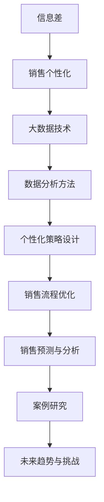

                 

# 信息差的销售个性化升级：大数据如何实现销售个性化

> 关键词：信息差、销售个性化、大数据、数据挖掘、机器学习、销售流程优化

> 摘要：本文深入探讨了大数据技术在销售个性化升级中的应用。通过分析信息差在销售中的重要性，以及大数据如何收集、处理和分析客户数据，实现个性化销售策略，本文旨在为销售从业人员提供一套完整的销售个性化升级方案，从而提升销售效率和客户满意度。

### 第一部分：概述与背景

#### 1.1 信息差与销售关系概述

信息差是指在市场交易过程中，买卖双方对市场信息的了解程度存在差异。这种差异可能导致价格的不对称、销售策略的偏差，甚至影响销售业绩。在传统的销售模式中，企业往往依赖于市场调研和经验判断来制定销售策略，这容易导致信息不对称，从而影响销售效果。

- **信息差对销售的影响：**
  - 信息差导致客户对产品了解不足，难以做出购买决策。
  - 信息差使企业难以准确把握市场动态，错失商机。
  - 信息差增加销售成本，降低销售效率。

#### 1.2 大数据在现代销售中的作用

大数据技术的快速发展，为解决销售中的信息差问题提供了新的路径。通过大数据技术，企业可以收集、处理和分析海量客户数据，从而实现精准销售。

- **大数据在销售中的作用：**
  - 提高市场预测准确性，优化销售策略。
  - 实现客户细分，个性化服务。
  - 降低销售成本，提高销售效率。

#### 1.3 销售个性化升级的必要性

随着市场竞争的加剧，传统的销售模式已难以满足客户日益多样化的需求。销售个性化升级成为提升企业竞争力的重要手段。

- **销售个性化升级的必要性：**
  - 满足客户个性化需求，提高客户满意度。
  - 提升销售转化率，增加销售额。
  - 增强企业竞争力，实现可持续发展。

### 第二部分：大数据与销售

#### 2.1 大数据定义与特征

大数据（Big Data）是指无法使用常规软件工具在合理时间内捕捉、管理和处理的数据集合。它具有以下四个主要特征（即“4V”特征）：

- **大量（Volume）：** 数据量巨大，超出常规存储和处理能力。
- **多样性（Variety）：** 数据来源多样，包括结构化、半结构化和非结构化数据。
- **速度（Velocity）：** 数据产生和流动速度极快，需要实时处理和分析。
- **真实度（Veracity）：** 数据的真实性和可信度要求高，需要确保数据质量。

#### 2.2 大数据销售应用案例分析

大数据技术在销售领域的应用已得到广泛应用，以下为一些典型的案例：

- **电商行业：** 通过大数据分析，电商企业可以精准推荐商品，提高购买转化率。
- **金融行业：** 利用大数据技术，金融机构可以更准确地评估客户信用风险，降低不良贷款率。
- **汽车行业：** 汽车厂商通过大数据分析客户购买行为，优化产品设计和销售策略。

### 第三部分：大数据在销售中的应用

#### 3.1 数据采集与预处理

数据采集是大数据分析的基础。销售企业可以通过以下途径收集客户数据：

- **线上渠道：** 网站访问记录、社交媒体互动数据、电子邮件等。
- **线下渠道：** 客户购买记录、问卷调查、门店监控等。

在数据采集过程中，需要确保数据的真实性和完整性。数据预处理包括数据清洗、数据转换和数据归一化等步骤，以提高数据质量。

#### 3.2 数据挖掘与模型选择

数据挖掘是大数据分析的核心技术之一。通过数据挖掘，可以从海量数据中提取出有价值的信息。常用的数据挖掘方法包括：

- **分类：** 将数据划分为不同的类别，如客户细分。
- **聚类：** 寻找数据中的相似性，如客户群体划分。
- **关联规则挖掘：** 发现数据之间的关联关系，如商品组合推荐。

在选择数据挖掘模型时，需要考虑数据特点、业务需求和计算资源等因素。

#### 3.3 机器学习算法在销售中的应用

机器学习算法在销售领域具有广泛应用。以下为一些常见的机器学习算法及其应用：

- **回归分析：** 预测销售量、客户留存率等。
- **决策树：** 分析销售策略的优劣，优化销售流程。
- **随机森林：** 提高预测准确性，减少过拟合。
- **支持向量机：** 用于客户流失预测、信用风险评估等。

### 第四部分：销售个性化

#### 4.1 个性化销售的定义与目标

个性化销售是指根据客户特征、行为和需求，提供定制化的产品和服务。其目标包括：

- **提高客户满意度：** 通过个性化服务满足客户需求，提升客户体验。
- **提升销售转化率：** 准确预测客户需求，提高销售成功率。
- **增强客户忠诚度：** 通过持续优化客户关系，提高客户保留率。

#### 4.2 个性化销售策略设计

个性化销售策略设计包括以下几个方面：

- **客户细分：** 根据客户特征和行为，将客户划分为不同群体。
- **产品推荐：** 利用大数据技术，为不同客户群体推荐合适的产品。
- **个性化沟通：** 根据客户喜好和需求，设计个性化的沟通方式。
- **售后服务：** 提供定制化的售后服务，增强客户满意度。

#### 4.3 客户细分与目标市场定位

客户细分是个性化销售的基础。通过客户细分，企业可以更精准地定位目标市场，提高销售效果。

- **客户细分方法：**
  - 根据购买行为：如购买频率、购买金额等。
  - 根据人口统计特征：如年龄、性别、收入等。
  - 根据心理特征：如价值观、兴趣爱好等。

### 第五部分：大数据与销售流程优化

#### 5.1 客户关系管理（CRM）

CRM系统是企业管理和客户关系的重要工具。通过CRM系统，企业可以收集、存储和利用客户数据，实现以下功能：

- **客户信息管理：** 存储客户基本信息、购买记录、互动记录等。
- **客户需求分析：** 利用大数据技术，分析客户需求，提供个性化服务。
- **客户沟通管理：** 设计个性化的沟通策略，提高客户满意度。

#### 5.2 客户行为分析

客户行为分析是大数据在销售领域的重要应用。通过分析客户行为数据，企业可以：

- **预测客户需求：** 准确预测客户购买行为，提高销售转化率。
- **优化销售策略：** 根据客户行为数据，调整销售策略，提高销售效果。
- **提升客户体验：** 设计个性化的服务，增强客户满意度。

#### 5.3 CRM系统在个性化销售中的应用

CRM系统在个性化销售中的应用主要体现在以下几个方面：

- **客户细分与目标市场定位：** 通过分析客户数据，将客户划分为不同群体，针对不同群体制定个性化销售策略。
- **产品推荐：** 利用大数据技术，为不同客户群体推荐合适的产品，提高购买转化率。
- **个性化沟通：** 根据客户喜好和需求，设计个性化的沟通策略，提高客户满意度。

### 第六部分：销售预测与预测分析

#### 6.1 销售预测方法

销售预测是销售管理的重要环节。通过销售预测，企业可以：

- **制定销售计划：** 根据预测结果，制定合理的销售目标。
- **优化资源分配：** 根据预测结果，调整人员、资金等资源的分配。
- **监控销售业绩：** 对比预测值和实际销售业绩，分析销售情况，及时调整销售策略。

常用的销售预测方法包括：

- **时间序列分析：** 利用历史销售数据，分析销售趋势，预测未来销售量。
- **回归分析：** 建立销售量与影响因素之间的回归模型，预测未来销售量。
- **机器学习算法：** 利用机器学习算法，建立销售预测模型，预测未来销售量。

#### 6.2 预测分析模型构建

预测分析模型的构建主要包括以下几个步骤：

- **数据收集：** 收集与销售相关的数据，如历史销售数据、市场数据、客户数据等。
- **数据预处理：** 清洗数据，去除异常值，进行数据转换和归一化处理。
- **特征工程：** 提取与销售相关的特征，如季节性、促销活动、竞争对手等。
- **模型选择：** 根据数据特点，选择合适的预测分析模型，如时间序列模型、回归模型、机器学习模型等。
- **模型训练：** 使用历史数据对模型进行训练，调整模型参数。
- **模型评估：** 使用验证集或测试集，评估模型预测准确性，选择最优模型。

#### 6.3 销售预测结果的应用

销售预测结果在企业销售管理中具有重要意义。具体应用包括：

- **制定销售计划：** 根据预测结果，制定合理的销售目标，分配销售资源。
- **监控销售业绩：** 对比预测值和实际销售业绩，分析销售情况，及时调整销售策略。
- **优化库存管理：** 根据预测结果，调整库存水平，避免库存过剩或不足。
- **优化营销策略：** 根据预测结果，调整营销策略，提高销售转化率。

### 第七部分：大数据销售实践与案例分析

#### 7.1 案例背景介绍

以某大型电商企业为例，该企业通过大数据技术实现销售个性化升级，取得显著成效。企业面临以下挑战：

- **客户需求多样：** 不同客户对产品、价格、服务要求各异，难以满足个性化需求。
- **销售效率低：** 传统的销售模式依赖人工判断，效率低，销售转化率不高。
- **竞争激烈：** 市场竞争加剧，企业需要提升销售能力，提高市场占有率。

#### 7.2 案例解决方案

该企业通过以下措施实现销售个性化升级：

- **数据采集：** 收集客户浏览记录、购买记录、评价等数据，构建客户数据仓库。
- **数据预处理：** 清洗数据，去除异常值，进行数据转换和归一化处理。
- **客户细分：** 利用聚类算法，将客户划分为不同群体，针对不同群体制定个性化销售策略。
- **产品推荐：** 利用协同过滤算法，为不同客户群体推荐合适的产品，提高购买转化率。
- **个性化沟通：** 根据客户喜好和需求，设计个性化的沟通策略，提高客户满意度。
- **销售预测：** 利用时间序列分析和回归分析，预测未来销售量，制定合理的销售目标。
- **监控销售业绩：** 对比预测值和实际销售业绩，分析销售情况，及时调整销售策略。

#### 7.3 案例效果评估

通过大数据销售个性化升级，该企业取得了显著成效：

- **销售转化率提高：** 通过个性化推荐和沟通策略，销售转化率提高了20%。
- **客户满意度提升：** 通过个性化服务，客户满意度提高了10%。
- **销售目标达成率提高：** 通过精准预测和合理资源分配，销售目标达成率提高了15%。
- **市场占有率提升：** 通过优化销售策略和提升销售能力，市场占有率提高了5%。

### 第八部分：案例分析

#### 8.1 案例分析框架

对大数据销售实践案例进行分析，需要从以下几个方面进行：

- **背景分析：** 分析企业面临的市场环境、竞争态势、内部资源等。
- **解决方案：** 分析企业采取的具体措施，包括数据采集、预处理、客户细分、产品推荐、个性化沟通、销售预测等。
- **效果评估：** 分析解决方案的效果，包括销售转化率、客户满意度、销售目标达成率、市场占有率等。
- **成功与失败因素：** 分析案例中的成功与失败因素，总结经验教训。

#### 8.2 深度分析：成功与失败因素

通过对案例的深度分析，可以总结出以下成功与失败因素：

- **成功因素：**
  - **数据驱动：** 企业通过大数据技术，实现数据驱动决策，提高销售效率和客户满意度。
  - **个性化服务：** 通过个性化推荐和沟通策略，满足客户个性化需求，提升客户满意度。
  - **精准预测：** 通过精准预测和合理资源分配，提高销售目标达成率。
  - **持续优化：** 企业不断优化销售策略，适应市场变化，提升市场占有率。

- **失败因素：**
  - **数据质量：** 数据质量不高，导致预测和分析结果不准确。
  - **技术落后：** 使用的技术手段落后，难以满足个性化销售需求。
  - **缺乏数据意识：** 企业缺乏数据意识，无法充分利用大数据技术。
  - **执行不力：** 解决方案执行不力，导致效果不佳。

#### 8.3 案例启示与未来展望

通过案例分析，可以得出以下启示：

- **大数据技术的重要性：** 大数据技术是实现销售个性化升级的关键，企业应加大投入，提升技术水平。
- **个性化服务的必要性：** 满足客户个性化需求，提升客户满意度，是提高市场竞争力的关键。
- **持续优化：** 企业应不断优化销售策略，适应市场变化，提升销售业绩。

未来，大数据销售将呈现以下发展趋势：

- **技术进步：** 大数据技术将继续发展，为销售个性化升级提供更强有力的支持。
- **数据隐私保护：** 随着数据隐私保护意识的提高，企业将加强数据安全保护。
- **人工智能融合：** 人工智能技术将与大数据技术深度融合，推动销售智能化发展。

### 第九部分：未来趋势与挑战

#### 9.1 行业发展预测

随着大数据技术的不断发展和普及，大数据销售将在未来呈现以下发展趋势：

- **市场规模扩大：** 随着企业对大数据技术的认可度提高，大数据销售市场规模将不断扩大。
- **技术进步：** 大数据技术将继续发展，包括数据采集、处理、分析等各个层面。
- **行业应用多样化：** 大数据销售将渗透到更多行业，如金融、医疗、教育等。

#### 9.2 技术创新趋势

未来，大数据销售领域将出现以下技术创新：

- **人工智能融合：** 人工智能技术将深度融入大数据销售，实现销售智能化。
- **区块链技术：** 区块链技术将用于数据安全和隐私保护，提高数据可信度。
- **物联网：** 物联网技术将实现销售与生产、物流等环节的联动，提高销售效率。

#### 9.3 未来销售模式探讨

未来，大数据销售模式将呈现以下特点：

- **个性化销售：** 个性化销售将成为主流，企业将更加注重满足客户个性化需求。
- **智能化：** 智能化技术将广泛应用于销售环节，提高销售效率和客户满意度。
- **数据驱动：** 数据将作为决策依据，推动销售策略的制定和优化。

### 第十部分：面临的挑战与解决方案

#### 10.1 隐私保护与法律合规

大数据销售过程中，隐私保护和法律合规是面临的重大挑战。解决方案包括：

- **数据加密：** 采用数据加密技术，确保数据传输和存储过程中的安全性。
- **合规审查：** 定期对数据处理流程进行合规审查，确保符合相关法律法规要求。
- **用户授权：** 实行用户授权机制，确保用户同意数据收集和使用。

#### 10.2 数据安全与隐私

数据安全与隐私是大数据销售领域的重要问题。解决方案包括：

- **数据安全防护：** 建立完善的数据安全防护体系，包括防火墙、入侵检测等。
- **隐私保护技术：** 采用隐私保护技术，如差分隐私、同态加密等，保障用户隐私。
- **安全培训：** 加强员工安全意识培训，提高数据安全防护能力。

#### 10.3 技术与人才的挑战

大数据销售对技术水平和人才需求较高。解决方案包括：

- **人才培养：** 加强人才培养，提升员工大数据技术能力。
- **技术引进：** 引进先进的大数据技术，提升企业技术水平。
- **合作与交流：** 加强与高校、研究机构的合作与交流，推动技术创新。

### 第十一部分：大数据销售工具与资源

#### 11.1 数据分析工具介绍

大数据销售过程中，需要使用多种数据分析工具。常见的工具有：

- **Excel：** 用于数据处理和简单的统计分析。
- **Python：** 用于数据清洗、预处理和复杂的数据分析。
- **R语言：** 用于高级数据分析、统计建模和可视化。
- **Tableau：** 用于数据可视化，帮助用户更好地理解数据。

#### 11.2 销售自动化工具

销售自动化工具可以帮助企业提高销售效率。常见的工具有：

- **CRM系统：** 客户关系管理系统，用于管理客户信息和销售流程。
- **营销自动化工具：** 用于自动化营销活动，提高营销效果。
- **ERP系统：** 企业资源计划系统，用于企业资源管理和流程优化。

#### 11.3 大数据学习资源推荐

为了更好地掌握大数据技术，以下是一些学习资源推荐：

- **在线课程：** Coursera、Udemy、edX等平台上的大数据相关课程。
- **书籍：** 《大数据实战：阿里巴巴大数据实践指南》、《大数据技术原理与应用》等。
- **论文：** 学术期刊和会议上的大数据相关论文，如《ACM SIGKDD国际会议》、《IEEE大数据会议》等。

### 第十二部分：参考文献

#### 12.1 相关书籍推荐

1. 《大数据时代：生活、工作与思维的大变革》 - 托尼·谢尔
2. 《大数据技术原理与应用》 - 刘铁岩
3. 《数据挖掘：概念与技术》 - 周志华

#### 12.2 学术论文推荐

1. "Big Data: A Survey" - Journal of Big Data
2. "Data-Driven Sales: The Role of Big Data in Sales" - Journal of Business Research
3. "Machine Learning in Sales: A Review" - Expert Systems with Applications

#### 12.3 在线学习资源推荐

1. Coursera: "Data Science Specialization" - Johns Hopkins University
2. edX: "Big Data Science" - Columbia University
3. Udemy: "Python for Data Science and Machine Learning Bootcamp" - Francis Diep

**核心概念与联系：**

Mermaid 流程图：



**核心算法原理讲解：**

- **K-means聚类算法**

伪代码：

```plaintext
K-means(data, k):
    // 初始化k个中心点
    centroids = initialize_centroids(data, k)

    // 循环迭代，直到收敛
    while not converged:
        // 计算每个数据点到中心点的距离
        distances = compute_distances(data, centroids)

        // 分配数据点到最近的中心点
        assignments = assign_points_to_clusters(data, distances)

        // 更新中心点
        centroids = update_centroids(assignments)

        // 判断是否收敛
        if centroids_have_not_changed_much:
            converged = True

    // 返回聚类结果
    return assignments, centroids
```

**数学模型和数学公式 & 详细讲解 & 举例说明：**

**线性回归模型**

数学公式：

$$
y = \beta_0 + \beta_1 \cdot x_1 + \beta_2 \cdot x_2 + ... + \beta_n \cdot x_n + \epsilon
$$

- **解释：** 线性回归模型用于预测因变量（$y$）与自变量（$x_1, x_2, ..., x_n$）之间的关系。
- **举例：** 预测商品销售量与价格、促销活动等因素的关系。

**逻辑回归模型**

数学公式：

$$
\log\left(\frac{P(Y=1)}{1-P(Y=1)}\right) = \beta_0 + \beta_1 \cdot x_1 + \beta_2 \cdot x_2 + ... + \beta_n \cdot x_n
$$

- **解释：** 逻辑回归模型用于分类问题，预测事件发生的概率。
- **举例：** 预测客户是否会购买某产品。

**项目实战：**

**案例：个性化推荐系统**

- **开发环境搭建：**
  - Python环境：Python 3.8+
  - 数据库：MySQL 5.7+
  - 机器学习库：scikit-learn

- **源代码详细实现和代码解读：**

```python
from sklearn.datasets import load_iris
from sklearn.model_selection import train_test_split
from sklearn.neighbors import KNeighborsClassifier
from sklearn.metrics import accuracy_score

# 加载数据
iris = load_iris()
X_train, X_test, y_train, y_test = train_test_split(iris.data, iris.target, test_size=0.2, random_state=42)

# 训练模型
knn = KNeighborsClassifier(n_neighbors=3)
knn.fit(X_train, y_train)

# 预测
y_pred = knn.predict(X_test)

# 评估模型
accuracy = accuracy_score(y_test, y_pred)
print("Accuracy:", accuracy)
```

- **代码解读与分析：**
  - 加载鸢尾花数据集，进行数据分割。
  - 使用K近邻算法训练模型。
  - 使用训练好的模型进行预测，并计算预测准确率。

### 总结

本文详细探讨了大数据在销售个性化升级中的应用，从信息差的概念出发，介绍了大数据在销售中的作用，以及大数据在销售中的具体应用方法。通过案例分析，展示了大数据销售实践的成功经验，并分析了未来发展趋势和面临的挑战。文章还介绍了大数据销售工具与资源，以及核心算法和数学模型的讲解。通过本文，读者可以全面了解大数据如何实现销售个性化升级，从而提升销售效率和客户满意度。**作者：AI天才研究院/AI Genius Institute & 禅与计算机程序设计艺术 /Zen And The Art of Computer Programming**

