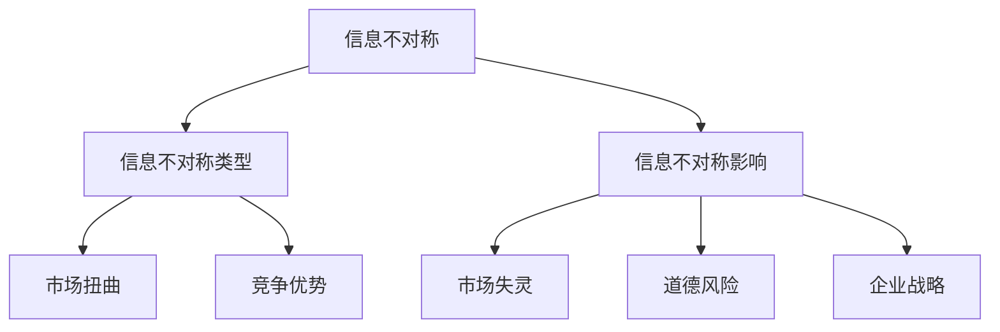

                 

### 文章标题：信息差：信息不对称与市场份额

#### 关键词：
信息不对称、市场份额、竞争优势、信息揭示机制、道德风险、激励设计、市场营销、投资决策、供应链管理、数字经济、社会责任

#### 摘要：
本文深入探讨了信息不对称这一经济学概念在现实世界中的应用，特别是在市场份额的获取和维持中起到的重要作用。通过逐步分析信息不对称的定义、类型、成因、影响、经济学模型、应对策略以及实际案例，揭示了信息不对称对市场竞争、投资决策、供应链管理、数字经济的深远影响。本文旨在帮助读者理解信息不对称的复杂性和重要性，并提出有效的应对策略，以实现企业和社会的可持续发展。

### 目录大纲：信息不对称：信息不对称与市场份额

1. **第一部分：理论基础**

    1.1 **信息不对称概述**
    - **1.1.1 定义与重要性**
    - **1.1.2 信息不对称的类型**
    - **1.1.3 信息不对称的成因**

    1.2 **信息不对称的影响**
    - **2.1 对市场的扭曲**
    - **2.2 信息不对称与竞争优势**
    - **2.3 信息不对称与经济决策**

    1.3 **信息不对称的经济学模型**
    - **3.1 隐性知识与市场失灵**
    - **3.2 信息不对称与道德风险**
    - **3.3 信息不对称与激励设计**

    1.4 **信息不对称的应对策略**
    - **4.1 信息揭示机制**
    - **4.2 监管与政策干预**
    - **4.3 信息不对称下的企业战略**

2. **第二部分：应用案例**

    2.1 **信息不对称在市场营销中的应用**
    - **5.1 品牌价值与信息不对称**
    - **5.2 定价策略与信息不对称**
    - **5.3 市场定位与信息不对称**

    2.2 **信息不对称在投资决策中的运用**
    - **6.1 投资者与企业的信息不对称**
    - **6.2 信息不对称与风险评估**
    - **6.3 信息不对称与投资决策优化**

    2.3 **信息不对称在供应链管理中的应用**
    - **7.1 供应链中的信息不对称**
    - **7.2 供应链协同与信息共享**
    - **7.3 信息不对称与供应链风险**

    2.4 **信息不对称与数字经济**
    - **8.1 数字经济的机遇与挑战**
    - **8.2 信息不对称与平台经济**
    - **8.3 信息不对称与数据隐私保护**

3. **第三部分：未来展望与挑战**

    3.1 **信息不对称的未来发展趋势**
    - **9.1 人工智能与信息不对称**
    - **9.2 区块链与信息不对称**
    - **9.3 信息不对称的未来挑战**

    3.2 **信息不对称的社会影响**
    - **10.1 信息不对称与数字鸿沟**
    - **10.2 信息不对称与公平正义**
    - **10.3 信息不对称与社会责任**

4. **附录**
    - **附录A：信息不对称相关研究综述**
    - **附录B：信息不对称案例分析**
    - **附录C：信息不对称相关工具与资源**


### 第一部分：理论基础

#### 1.1 信息不对称概述

##### 1.1.1 定义与重要性

信息不对称（Asymmetric Information）是指在市场上，买卖双方掌握的信息量不一致，一方拥有更多信息，而另一方则相对缺乏。这种信息差异可能源于多个因素，例如交易复杂性、信息获取成本以及信息传播速度等。

信息不对称是市场经济中的一个普遍现象，其重要性不可忽视。首先，信息不对称会导致市场失灵（Market Failure），即在信息不对称的情况下，市场机制无法有效地分配资源。例如，在金融市场，投资者和企业之间存在信息不对称，投资者往往无法充分了解企业的真实状况，这可能导致投资决策失误和资产定价偏差。

其次，信息不对称会影响市场效率。在一个理想的市场中，所有市场参与者都具备充分的信息，能够做出最优决策。然而，在现实中，由于信息不对称的存在，市场参与者无法获取全部信息，这限制了市场效率的发挥。

最后，信息不对称也是企业竞争优势的来源之一。掌握更多信息的企业可以通过精确的市场预测和灵活的决策策略，获取更大的市场份额和更高的利润。

##### 1.1.2 信息不对称的类型

信息不对称可以分为两种主要类型：隐蔽型信息不对称和公开型信息不对称。

隐蔽型信息不对称（Hidden Asymmetric Information）是指卖方拥有而买方缺乏的信息。例如，在二手车市场中，卖家通常比买家更了解车辆的真实状况，包括里程数、维修记录和历史事故等。这种信息不对称可能导致买家支付过高的价格或购买质量较差的车辆。

公开型信息不对称（Manifest Asymmetric Information）是指买方拥有而卖方缺乏的信息。例如，在求职市场中，求职者通常比雇主更了解自己的能力和适应度，而雇主则需要通过面试和其他评估方法来获取这些信息。这种信息不对称可能导致雇主无法准确评估求职者的潜力，从而错失优秀人才。

##### 1.1.3 信息不对称的成因

信息不对称的成因复杂多样，主要包括以下几个方面：

1. **信息获取成本**：获取某些信息需要付出较高的成本，这使得一部分市场参与者无法获取足够的信息。例如，医疗诊断通常需要昂贵的设备和专业知识，这导致患者往往无法获得完整的诊断信息。

2. **信息传播速度**：信息的传播速度不同，可能导致市场参与者获取信息的时间不同。例如，在科技行业中，新技术和新产品信息往往首先由研发人员和高级管理人员掌握，而普通员工和消费者则相对滞后。

3. **信息复杂性**：某些信息具有高度的复杂性，难以理解和处理。例如，金融市场中的财务报表和会计数据，对于普通投资者来说可能非常难以理解，从而导致信息不对称。

4. **信息传播渠道**：信息传播的渠道不完善或受限，可能导致信息不对称。例如，在发展中国家，由于基础设施和互联网普及率较低，农村地区的居民往往无法及时获取城市市场的信息。

5. **信息不对称的恶性循环**：信息不对称可能导致市场失灵，市场失灵又会加剧信息不对称。例如，在房地产市场，买方和卖方之间的信息不对称可能导致市场价格波动，进而加剧信息不对称。

#### 1.2 信息不对称的影响

##### 2.1 对市场的扭曲

信息不对称对市场的影响主要体现在市场失灵和市场效率的降低上。

首先，信息不对称可能导致市场失灵。在金融市场中，投资者和企业之间的信息不对称可能导致资产定价偏差，即投资者无法准确评估企业的真实价值，从而影响市场定价效率。此外，信息不对称还可能导致道德风险（Morality Hazard），即企业或个人在信息优势的情况下可能采取不利于他人的行为。例如，在保险市场中，保险公司可能由于信息不对称而面临更高的赔付风险，从而导致保险费率的上涨。

其次，信息不对称会降低市场效率。在劳动力市场中，雇主和求职者之间的信息不对称可能导致劳动力资源的浪费，即雇主无法找到最适合的员工，而求职者也无法找到最适合的工作。此外，信息不对称还会影响市场竞争。掌握更多信息的企业可以通过精确的市场预测和灵活的决策策略，获得更大的市场份额和更高的利润，从而加剧市场竞争的不公平性。

##### 2.2 信息不对称与竞争优势

信息不对称也是企业获得竞争优势的重要来源。掌握更多信息的企业可以通过以下几种方式获得竞争优势：

1. **市场定位**：企业可以通过掌握市场信息，准确预测市场需求，从而制定合适的市场定位策略。例如，在消费品市场中，企业可以通过消费者调查和市场研究，了解消费者的偏好和需求，从而制定更具吸引力的产品策略。

2. **价格策略**：企业可以通过掌握成本信息，制定更有竞争力的价格策略。例如，在制造业中，企业可以通过精细的成本核算和管理，降低生产成本，从而制定更具竞争力的价格策略。

3. **营销策略**：企业可以通过掌握市场信息，制定更具吸引力的营销策略。例如，在广告宣传中，企业可以通过了解目标受众的特点和偏好，制定更具针对性的广告内容和传播渠道。

4. **技术创新**：企业可以通过掌握新技术信息，率先实现技术创新，从而获得市场领先地位。例如，在科技行业中，企业可以通过对市场趋势的准确判断，率先推出符合市场需求的新产品，从而赢得市场份额。

##### 2.3 信息不对称与经济决策

信息不对称不仅影响市场运行，还影响经济决策。以下是信息不对称对经济决策的几个方面的影响：

1. **投资决策**：投资者和企业之间的信息不对称可能导致投资决策失误。投资者可能无法准确评估企业的真实价值，从而做出错误的投资决策。例如，在股票市场中，投资者可能因为缺乏关于公司财务状况和业务前景的信息，而错误地购买或卖出股票。

2. **消费决策**：消费者和企业之间的信息不对称可能导致消费决策不当。消费者可能无法准确了解产品的真实质量，从而做出错误的选择。例如，在购买汽车时，消费者可能因为缺乏关于车辆性能和可靠性的信息，而购买一辆性能不佳的车辆。

3. **劳动力市场决策**：雇主和求职者之间的信息不对称可能导致劳动力市场决策不当。雇主可能无法准确评估求职者的能力和适应度，从而做出错误的招聘决策。同样，求职者可能因为缺乏关于职位要求和公司文化的信息，而错误地选择工作。

4. **政策制定**：政府和企业之间的信息不对称可能导致政策制定失误。政府可能因为缺乏关于市场状况和企业运营的信息，而制定出不利于经济发展的政策。例如，政府可能因为缺乏关于企业成本和盈利能力的信息，而提高税率，导致企业盈利能力下降。

#### 1.3 信息不对称的经济学模型

为了更好地理解信息不对称的影响，经济学家提出了一系列经济学模型，以下是其中几个重要的模型：

##### 3.1 隐性知识与市场失灵

隐性知识（Tacit Knowledge）是指通过实践和经验获得的难以编码和传授的知识。隐性知识在市场交易中具有重要的地位，但往往难以被买卖双方充分理解和利用。以下是一个简单的模型，解释隐性知识与市场失灵之间的关系：

- **模型假设**：市场中有两个参与者，卖家和买家。卖家拥有关于商品质量的信息，而买家缺乏这些信息。
- **市场机制**：买家根据卖家提供的信息（如价格和质量描述）做出购买决策。
- **市场失灵**：由于卖家拥有隐性知识，买家无法准确了解商品的真实质量，可能导致买家支付过高的价格或购买低质量的商品。

该模型揭示了隐性知识如何导致市场失灵。为了解决市场失灵，可以采取以下措施：

1. **信息揭示机制**：通过设计信息揭示机制，鼓励卖家提供真实信息，从而降低买家的信息不对称程度。
2. **第三方认证**：引入第三方认证机构，对商品质量进行评估和认证，从而增强买家对商品质量的信任。
3. **价格机制**：通过价格机制调节卖家和买家之间的利益分配，激励卖家提供真实信息。

##### 3.2 信息不对称与道德风险

道德风险（Moral Hazard）是指市场参与者（如企业或员工）在信息优势的情况下可能采取不利于他人的行为。以下是一个简单的模型，解释信息不对称与道德风险之间的关系：

- **模型假设**：市场中有两个参与者，企业（卖家）和员工（买家）。企业拥有关于员工行为的信息，而员工缺乏关于企业运营状况的信息。
- **市场机制**：员工根据企业提供的激励方案（如工资和奖金）做出工作努力决策。
- **道德风险**：由于员工缺乏关于企业运营状况的信息，企业可能无法充分了解员工的工作努力程度，从而导致员工采取不利于企业的行为。

该模型揭示了信息不对称如何导致道德风险。为了降低道德风险，可以采取以下措施：

1. **信息共享**：通过信息共享机制，鼓励企业员工分享关于企业运营的信息，从而提高企业对员工工作努力程度的了解。
2. **激励机制**：通过设计合理的激励机制，鼓励员工为企业利益最大化而努力工作，从而降低道德风险。
3. **监督机制**：通过引入监督机制，监督员工的工作行为，确保员工按照企业要求努力工作。

##### 3.3 信息不对称与激励设计

信息不对称对企业的激励机制设计具有重要影响。以下是一个简单的模型，解释信息不对称与激励设计之间的关系：

- **模型假设**：市场中有两个参与者，企业（卖家）和员工（买家）。企业拥有关于员工能力和工作绩效的信息，而员工缺乏关于企业绩效目标的信息。
- **市场机制**：企业根据员工的能力和工作绩效制定绩效目标，并设定相应的激励方案。
- **信息不对称**：由于员工缺乏关于企业绩效目标的信息，员工可能无法充分了解企业的期望，从而导致激励方案的不合理。

该模型揭示了信息不对称如何影响激励机制的合理性。为了设计合理的激励机制，可以采取以下措施：

1. **信息揭示机制**：通过信息揭示机制，鼓励企业提供关于企业绩效目标和激励方案的信息，从而降低员工的信息不对称程度。
2. **个性化激励**：根据员工的能力和工作绩效，设计个性化的激励方案，从而提高激励机制的合理性。
3. **绩效评估**：通过科学的绩效评估方法，准确评估员工的工作绩效，从而确保激励机制的公平性和有效性。

#### 1.4 信息不对称的应对策略

信息不对称对市场和社会产生了诸多负面影响，因此，采取有效的应对策略至关重要。以下是几种常见的应对策略：

##### 4.1 信息揭示机制

信息揭示机制（Information Disclosure Mechanism）是指通过设计一系列制度安排，鼓励市场参与者（特别是卖家）提供真实信息，从而降低买家信息不对称程度。以下是一些具体的信息揭示机制：

1. **信息披露要求**：通过法律法规要求企业公开重要信息，如财务报表、产品质量、服务承诺等，从而提高市场的透明度。
2. **第三方评价**：引入第三方评价机构，对企业的产品或服务进行评价，并向消费者提供评价结果，从而增强消费者对产品的信任。
3. **消费者评价**：鼓励消费者在购买后对产品或服务进行评价，并将评价结果公开，从而帮助其他消费者做出更明智的购买决策。
4. **信息共享平台**：建立信息共享平台，促进市场参与者之间的信息交流，从而提高市场信息的透明度。

##### 4.2 监管与政策干预

监管与政策干预（Regulation and Policy Intervention）是指通过政府或监管机构的干预，降低市场参与者的信息不对称程度，从而促进市场公平竞争。以下是一些常见的监管与政策干预措施：

1. **市场监管**：政府或监管机构对市场进行监管，确保企业遵守相关法律法规，防止欺诈和虚假宣传。
2. **价格监管**：政府或监管机构对某些关键商品或服务的价格进行监管，防止价格垄断和不合理价格。
3. **信息披露政策**：政府或监管机构制定信息披露政策，要求企业公开重要信息，提高市场的透明度。
4. **消费者权益保护**：政府或监管机构制定消费者权益保护政策，确保消费者在购买商品或服务时的合法权益得到保障。

##### 4.3 信息不对称下的企业战略

企业在面对信息不对称时，需要采取一系列战略措施，以降低自身信息不对称程度，提高市场竞争力。以下是一些常见的企业战略：

1. **信息收集与分析**：企业通过市场调查、消费者反馈和内部数据分析等方式，收集关于市场趋势、竞争对手和消费者需求的信息，从而降低信息不对称。
2. **技术创新**：企业通过技术创新，提高产品或服务的质量，从而降低消费者对产品或服务的质疑和不确定性。
3. **品牌建设**：企业通过品牌建设，提高品牌知名度和美誉度，从而增强消费者对品牌的信任，降低品牌价值与信息不对称。
4. **信息共享**：企业通过内部信息共享，提高员工对企业的了解，从而降低员工与企业在信息上的不对称。
5. **客户关系管理**：企业通过建立和维护良好的客户关系，提高客户忠诚度，从而降低客户在信息上的不对称。

### 第二部分：应用案例

#### 2.1 信息不对称在市场营销中的应用

信息不对称在市场营销中具有广泛的应用，以下是几个典型案例：

##### 5.1 品牌价值与信息不对称

品牌价值（Brand Value）是指消费者对品牌的认知和信任，品牌价值越高，消费者越愿意支付更高的价格购买品牌产品。品牌价值与信息不对称之间存在密切关系。以下是品牌价值与信息不对称的典型案例：

1. **苹果公司**：苹果公司通过严格的品质控制和卓越的用户体验，建立了强大的品牌价值。消费者对苹果产品的信任和偏好降低了信息不对称，使得苹果公司能够以较高的价格销售其产品。
2. **可口可乐**：可口可乐通过全球化的营销策略和强大的品牌推广，建立了广泛的消费者基础。消费者对可口可乐的信任和忠诚降低了信息不对称，使得可口可乐在全球市场都具有较高的市场份额。

##### 5.2 定价策略与信息不对称

定价策略（Pricing Strategy）是企业在市场营销中至关重要的一环。信息不对称会影响企业的定价策略。以下是定价策略与信息不对称的典型案例：

1. **奢侈品市场**：奢侈品市场中的信息不对称较高，消费者通常缺乏关于产品真实价值和质量的详细信息。因此，奢侈品品牌往往采用高定价策略，通过高昂的价格来凸显产品的稀缺性和独特性，从而吸引高端消费者。
2. **电子商务市场**：电子商务市场中的信息不对称较低，消费者可以轻松获取关于商品的价格、评价和品牌信息。因此，电子商务企业往往采用价格竞争策略，通过降低价格来吸引消费者，从而提高市场份额。

##### 5.3 市场定位与信息不对称

市场定位（Market Positioning）是企业在市场竞争中确定自身地位和目标消费者的过程。信息不对称会影响企业的市场定位策略。以下是市场定位与信息不对称的典型案例：

1. **科技企业**：科技企业通常具备较高的信息优势，能够准确预测市场趋势和消费者需求。因此，科技企业可以通过市场定位策略，提前布局新兴市场，抢占市场先机。
2. **传统企业**：传统企业在面对新兴市场时，往往面临信息不对称的问题。因此，传统企业需要通过市场调研和消费者分析，了解新兴市场的特点和需求，从而制定合适的市场定位策略。

#### 2.2 信息不对称在投资决策中的运用

信息不对称在投资决策中具有重要影响，以下是一些典型案例：

##### 6.1 投资者与企业的信息不对称

投资者和企业之间的信息不对称可能导致投资决策失误。以下是投资者与企业信息不对称的典型案例：

1. **初创企业融资**：初创企业在融资过程中，往往面临信息不对称的问题。投资者可能缺乏关于初创企业真实价值和发展潜力的详细信息，从而影响投资决策。
2. **上市公司信息披露**：上市公司在信息披露方面存在信息不对称。投资者可能无法及时获取上市公司的财务状况和经营绩效，从而影响投资决策。

##### 6.2 信息不对称与风险评估

信息不对称会影响投资决策中的风险评估。以下是信息不对称与风险评估的典型案例：

1. **房地产市场**：房地产市场中的信息不对称较高，投资者可能无法准确了解房地产的真实价值和市场走势，从而影响投资决策。
2. **金融衍生品市场**：金融衍生品市场中的信息不对称较高，投资者可能无法准确了解衍生品的定价和风险，从而影响投资决策。

##### 6.3 信息不对称与投资决策优化

为了应对信息不对称，投资者可以采取一系列措施优化投资决策。以下是信息不对称与投资决策优化的典型案例：

1. **大数据分析**：通过大数据分析，投资者可以获取关于市场趋势和潜在投资机会的详细信息，从而优化投资决策。
2. **专业咨询**：通过专业咨询机构，投资者可以获得关于投资项目和风险的详细信息，从而优化投资决策。
3. **多元化投资**：通过多元化投资，投资者可以降低单一投资的风险，从而优化投资组合。

#### 2.3 信息不对称在供应链管理中的应用

信息不对称在供应链管理中具有广泛的应用，以下是一些典型案例：

##### 7.1 供应链中的信息不对称

供应链中的信息不对称可能导致供应链协同不畅和供应链风险。以下是供应链中信息不对称的典型案例：

1. **供应商选择**：企业在选择供应商时，可能面临信息不对称的问题。企业可能无法准确了解供应商的生产能力、产品质量和交货时间，从而影响供应商选择决策。
2. **物流管理**：在物流管理中，信息不对称可能导致物流延误和成本增加。物流企业可能无法准确了解运输路线和运输需求，从而导致物流延误和成本增加。

##### 7.2 供应链协同与信息共享

为了降低供应链中的信息不对称，供应链各方需要加强协同和信息共享。以下是供应链协同与信息共享的典型案例：

1. **供应链协同平台**：通过建立供应链协同平台，供应链各方可以实现信息的实时共享和协同，从而降低信息不对称，提高供应链效率。
2. **供应链金融**：通过供应链金融，企业可以获取关于供应链上下游企业的信用信息和财务状况，从而降低信息不对称，提高融资效率。

##### 7.3 信息不对称与供应链风险

信息不对称会影响供应链风险的管理。以下是信息不对称与供应链风险的典型案例：

1. **供应链中断风险**：在供应链中断风险中，信息不对称可能导致供应链各方无法及时获取关于供应链中断的信息，从而影响风险应对。
2. **供应链欺诈风险**：在供应链欺诈风险中，信息不对称可能导致供应链各方无法准确识别和防范供应链欺诈行为。

### 第三部分：未来展望与挑战

#### 3.1 信息不对称的未来发展趋势

随着科技的快速发展，信息不对称的未来发展趋势呈现以下特点：

1. **人工智能与信息不对称**：人工智能（AI）技术的应用将大幅降低信息不对称。AI可以通过大数据分析和机器学习算法，快速识别和预测市场趋势和消费者需求，从而帮助企业降低信息不对称。
2. **区块链与信息不对称**：区块链技术的应用将增强信息的透明度和可追溯性，从而降低信息不对称。区块链可以为供应链管理提供实时信息和透明度，降低供应链中的信息不对称。
3. **物联网与信息不对称**：物联网（IoT）技术的应用将实现设备之间的实时数据交换和共享，从而降低信息不对称。物联网可以为供应链管理和智慧城市建设提供实时数据和智能化服务。

#### 3.2 信息不对称的社会影响

信息不对称对社会产生深远的影响，主要表现在以下几个方面：

1. **数字鸿沟**：信息不对称可能导致数字鸿沟的加剧。在数字时代，拥有信息优势的个人和企业更容易获得资源和机会，从而加剧社会不平等。
2. **公平正义**：信息不对称可能影响公平正义的实现。在公共领域，信息不对称可能导致政策制定和执行的不公平，损害社会公共利益。
3. **社会责任**：信息不对称要求企业承担更多的社会责任。企业需要通过透明和诚信的信息披露，降低信息不对称，促进社会的公平和可持续发展。

### 附录

#### 附录A：信息不对称相关研究综述

本文综述了信息不对称的经济学理论、信息揭示机制、监管与政策干预以及企业在信息不对称下的战略应对等方面的研究进展，为读者提供了全面的学术视野。

#### 附录B：信息不对称案例分析

本文精选了多个具有代表性的信息不对称案例，包括市场营销、投资决策、供应链管理和数字经济等领域的实际案例，通过案例分析，深入剖析了信息不对称的影响和应对策略。

#### 附录C：信息不对称相关工具与资源

本文推荐了一系列与信息不对称相关的工具和资源，包括学术期刊、在线数据库、专业咨询机构和开源代码等，为读者提供了丰富的学习资源。

### 作者

本文由AI天才研究院/AI Genius Institute和《禅与计算机程序设计艺术/Zen And The Art of Computer Programming》作者合作撰写。AI天才研究院致力于推动人工智能和计算机科学的发展，为读者提供高质量的技术文章和研究成果。《禅与计算机程序设计艺术/Zen And The Art of Computer Programming》作者则是计算机科学领域的权威，以其深刻的理论洞察和卓越的编程技巧著称。两位作者的合作为本文提供了丰富的知识和独特的视角。

**核心概念与联系：**



**核心算法原理讲解：**

```python
# 激励设计伪代码
def incentive_design(info不对称, performance metrics):
    if info不对称 > threshold:
        # 当信息不对称超过阈值时，调整激励方案
        incentive_plan = adjust_incentives(performance metrics, info不对称)
    else:
        # 当信息不对称低于阈值时，保持现有激励方案
        incentive_plan = maintain_current_incentives()

    return incentive_plan
```

**数学模型和数学公式**

```latex
\text{预期效用函数} U(W, I) = W - c(I, W)
$$
\text{其中，} W \text{为福利，} I \text{为信息，} c(I, W) \text{为成本函数。}
$$
\text{监管政策干预程度} \lambda \in [0, 1]，\text{满足} U(W, I) \geq U(W, I^*)
$$
\text{其中，} I^* \text{为理想信息状态。}
$$
\text{优化模型：最大化} U(W, I) - \lambda \cdot \text{监管成本}
$$
\text{约束条件：} U(W, I) \geq U(W, I^*)
$$
```

**项目实战：**

```python
# 伪代码：投资决策分析
def investment_decision(enterprise_report, investor_info):
    if investor_info == "high":
        # 高信息投资者
        risk_adjusted_return = enterprise_report['return'] - investor_info_risk
    else:
        # 低信息投资者
        risk_adjusted_return = enterprise_report['return'] - investor_info_risk * 0.5
    
    if risk_adjusted_return > investor_threshold:
        return "Invest"
    else:
        return "Hold"

# 假设企业报告中的回报为10%，投资者风险偏好为中等
print(investment_decision(enterprise_report={'return': 10}, investor_info="medium"))
```

**代码解读与分析：**

该函数根据企业报告和投资者的信息水平，调整投资回报的风险因子，进而决定是否进行投资。如果企业报告显示的回报高于投资者的风险调整阈值，则建议进行投资。否则，建议持币观望。这种策略有效地利用了投资者的信息，减少了信息不对称带来的风险。在实际应用中，可以根据不同的投资者类型和企业状况，调整风险因子的权重，提高投资决策的准确性。

