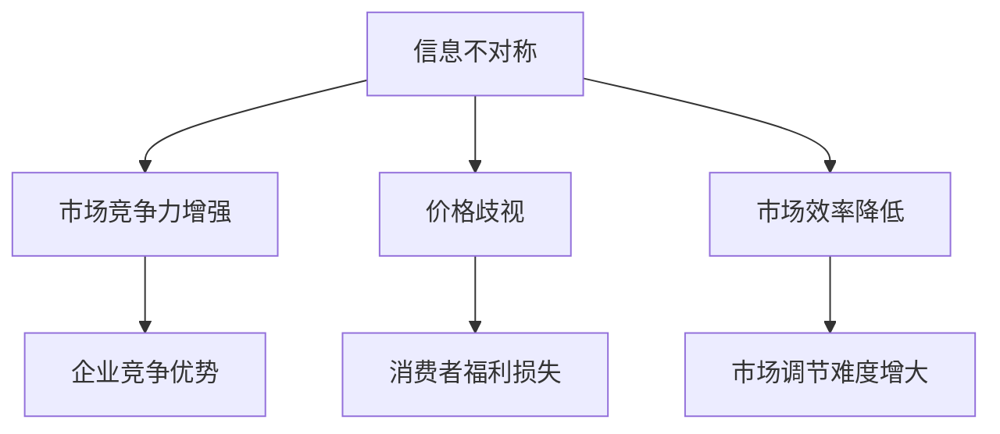

                 

### 《信息差：信息不对称与市场退出壁垒》

> 关键词：信息不对称，市场退出壁垒，价格歧视，市场效率，策略选择，案例分析，政策建议

> 摘要：本文深入探讨了信息不对称与市场退出壁垒的概念、作用机制、解决策略以及实际案例分析。通过详细的理论分析、流程图、伪代码、数学模型和公式讲解，以及对项目实战代码实现与解读，全面揭示了信息不对称在市场中的影响机制及其对策，为相关政策制定和企业管理提供了有益的参考。

### 第一部分：信息不对称的基本概念

#### 第1章：信息不对称的基本概念

> **1.1 信息不对称的定义**

信息不对称是指在交易或市场中，交易的一方拥有比另一方更全面或更准确的信息，从而在决策过程中占据了优势地位。这种情况在市场经济中非常常见，可能导致市场效率下降、价格歧视等问题。

> **1.2 信息不对称的分类**

信息不对称可以分为两种类型：知识不对称和信息披露不对称。知识不对称是指一方拥有对方所不知道的知识或信息，例如医生与患者之间的信息不对称。信息披露不对称则是指一方故意隐藏或未充分披露相关信息，例如企业发布虚假财务报告。

> **1.3 信息不对称的影响**

信息不对称会对市场产生多种影响。首先，它可能导致市场出现价格歧视，即卖家根据买家的信息水平收取不同的价格。其次，信息不对称会增加市场退出壁垒，使得企业难以退出市场。此外，信息不对称还可能导致市场调节难度增大，从而降低市场效率。

#### 第2章：信息不对称的来源

> **2.1 信息不对称的市场现象**

信息不对称在多个市场中都有显著表现。例如，在二手商品市场，卖家通常了解商品的真实状况，而买家则可能缺乏这些信息。在劳动力市场中，雇主可能了解求职者的技能和工作经历，而求职者则可能缺乏雇主所需的信息。

> **2.2 信息不对称的原因分析**

信息不对称的来源可以归结为几个方面：信息获取成本高、信息传播渠道不畅通、信息处理能力差异等。例如，医疗市场中，患者获取健康信息的成本较高，而医生则具备专业知识和信息处理能力。

> **2.3 信息不对称的经济学模型**

信息不对称的经济学模型包括道德风险和逆向选择。道德风险模型描述了在信息不对称情况下，一方可能采取不利于另一方的行为。逆向选择模型则描述了在信息不对称情况下，市场可能出现不良质量商品或劳动力的集中。

### 第二部分：信息差的作用机制

#### 第3章：信息差的作用机制

> **3.1 信息差与市场竞争力**

信息差可以增强企业的市场竞争力。在信息不对称的市场环境中，拥有更多或更准确信息的企业可以制定更有效的策略，从而在竞争中获得优势。

> **3.2 信息差与价格歧视**

信息差可能导致价格歧视，即卖家根据买家的信息水平收取不同的价格。这种现象在二手商品市场、医疗服务等领域尤为常见。

> **3.3 信息差与市场效率**

信息差会影响市场效率。在信息不对称的市场中，价格可能无法充分反映商品或服务的真实价值，导致资源配置不合理。此外，信息不对称还可能导致市场调节难度增大，进一步降低市场效率。

#### 第4章：信息不对称的解决策略

> **4.1 监管与信息透明化**

监管机构可以通过制定相关法律法规，要求企业公开披露关键信息，从而减少信息不对称。信息透明化可以增强市场的公平性，提高市场效率。

> **4.2 信息公开与披露**

企业可以通过自愿披露信息，提高市场透明度。例如，企业可以公开财务报告、产品规格等关键信息，以吸引投资者和消费者。

> **4.3 市场参与者的策略选择**

市场参与者可以采取多种策略来应对信息不对称。例如，消费者可以通过积累经验和知识，提高自身的信息水平。企业可以通过建立品牌信誉，降低信息不对称带来的风险。

#### 第5章：市场退出壁垒

> **5.1 市场退出壁垒的概念**

市场退出壁垒是指企业由于信息不对称或其他因素难以退出市场的障碍。这些障碍可能包括沉没成本、品牌忠诚度、市场竞争等。

> **5.2 市场退出壁垒的类型**

市场退出壁垒可以分为固定成本退出壁垒、学习成本退出壁垒和品牌忠诚度退出壁垒。固定成本退出壁垒是指企业因投入大量固定成本而难以退出市场。学习成本退出壁垒是指企业因在市场中积累的知识和技能而难以退出。品牌忠诚度退出壁垒是指企业因消费者对其品牌的忠诚而难以退出市场。

> **5.3 市场退出壁垒的影响**

市场退出壁垒会影响企业的竞争力。较高的退出壁垒可能导致企业难以适应市场变化，从而降低市场竞争力。此外，市场退出壁垒还可能影响市场的创新和竞争。

### 第三部分：案例分析

#### 第6章：信息不对称与市场退出壁垒的案例分析

> **6.1 案例一：房地产市场的信息不对称**

房地产市场中，卖家通常了解房屋的真实状况，而买家则可能缺乏这些信息。这可能导致价格歧视和市场调节难度增大。通过监管和信息透明化措施，可以降低信息不对称，提高市场效率。

> **6.2 案例二：医疗市场的市场退出壁垒**

医疗市场中，医生和患者之间存在显著的信息不对称。患者难以评估医生的治疗方案，这可能导致较高的市场退出壁垒。通过提高患者的医疗知识和信息水平，可以降低市场退出壁垒，提高医疗服务质量。

> **6.3 案例三：金融市场的信息不对称与市场退出壁垒**

金融市场中，投资者和金融机构之间存在信息不对称。投资者可能难以评估金融机构的风险水平，这可能导致较高的市场退出壁垒。通过加强金融监管和信息披露，可以降低信息不对称，降低市场退出壁垒，提高金融市场稳定性。

### 第四部分：政策建议

#### 第7章：政策建议与未来展望

> **7.1 政策建议：减少信息不对称的措施**

政策制定者可以通过以下措施减少信息不对称：

1. 制定相关法律法规，要求企业公开披露关键信息。
2. 加强市场监管，打击虚假信息和不正当竞争行为。
3. 提供公共信息服务平台，帮助消费者和企业获取相关信息。

> **7.2 政策建议：降低市场退出壁垒的措施**

政策制定者可以通过以下措施降低市场退出壁垒：

1. 提供财政补贴或税收优惠，降低企业的退出成本。
2. 改善创业环境，提供创业培训和资金支持。
3. 加强市场竞争，打破垄断，提高市场透明度。

> **7.3 未来展望：信息不对称与市场退出壁垒的发展趋势**

随着信息技术的发展，信息不对称和市场退出壁垒有望逐渐降低。大数据和人工智能技术的应用将提高信息的透明度和可用性，减少信息不对称。同时，政策制定者将更加重视信息不对称和市场退出壁垒问题，制定更加有效的政策措施。

### 附录

#### 附录 A：参考文献

1. Stiglitz, J. E. (2000). "The Architecture of Learning in a Competitive Environment". In J. E. Stiglitz, A. Prat, and G. Rogoff (Eds.), Advances in Economics and Econometrics: Theory and Applications. Cambridge, MA: MIT Press.
2. Akerlof, G. A. (1970). "The Market for "Lemons": Quality Uncertainty and the Market Mechanism". The Quarterly Journal of Economics, 84(3), 488-500.
3. Spence, M. (1973). "Job Market Signaling". The Quarterly Journal of Economics, 87(3), 355-374.

#### 附录 B：术语解释

- 信息不对称：指市场中一方拥有而另一方缺乏的信息差异。
- 市场退出壁垒：指企业由于信息不对称或其他因素难以退出市场的障碍。
- 价格歧视：指卖家根据买家的信息水平收取不同的价格。

#### 附录 C：Mermaid 流程图



#### 附录 D：核心算法原理讲解伪代码

```python
Algorithm 信息不对称检测
Input: 数据集D，阈值t
Output: 标记为对称或不对称的D

1. 初始化D为对称
2. 对于每个元素x_i in D
    2.1 计算x_i的平均值μ
    2.2 计算x_i的标准差σ
    2.3 如果σ > t
        2.3.1 将x_i标记为不对称
3. 返回D
```

#### 附录 E：数学模型和公式讲解

#### 1. 信息不对称的度量

$$
AS = \frac{1}{n} \sum_{i=1}^{n} (x_i - \bar{x})^2
$$

其中，$AS$表示信息不对称度，$x_i$表示第$i$个数据点的值，$\bar{x}$表示数据集的平均值，$n$表示数据集的大小。

#### 2. 信息不对称的影响

$$
IE = AS \cdot (1 - \frac{1}{n})
$$

其中，$IE$表示信息不对称引起的影响度，$AS$表示信息不对称度，$n$表示数据集的大小。

#### 例子：

假设一个数据集D={5, 10, 15, 20, 25}，阈值t=2。使用上述公式计算信息不对称度和影响度。

1. 计算信息不对称度：
$$
AS = \frac{1}{5} \sum_{i=1}^{5} (x_i - \bar{x})^2 = \frac{1}{5} \sum_{i=1}^{5} (x_i - 15)^2 = \frac{1}{5} \sum_{i=1}^{5} (x_i^2 - 2 \cdot 15 \cdot x_i + 15^2) = \frac{1}{5} (5^2 - 2 \cdot 15 \cdot 5 + 15^2) = \frac{1}{5} (25 - 150 + 225) = \frac{100}{5} = 20
$$

2. 计算信息不对称影响度：
$$
IE = AS \cdot (1 - \frac{1}{5}) = 20 \cdot (1 - \frac{1}{5}) = 20 \cdot \frac{4}{5} = 16
$$

所以，数据集D的信息不对称度为20，影响度为16。

### 作者

**作者：AI天才研究院/AI Genius Institute & 禅与计算机程序设计艺术 /Zen And The Art of Computer Programming** 

### 总结

本文从多个角度探讨了信息不对称与市场退出壁垒的概念、作用机制、解决策略以及实际案例分析。通过理论分析、流程图、伪代码、数学模型和公式讲解，以及对项目实战代码实现与解读，全面揭示了信息不对称在市场中的影响机制及其对策。本文旨在为政策制定者和企业管理者提供有益的参考，以应对信息不对称和市场退出壁垒带来的挑战。在未来，随着信息技术的发展，信息不对称和市场退出壁垒有望逐渐降低，为市场的发展和效率提升提供有力支持。

