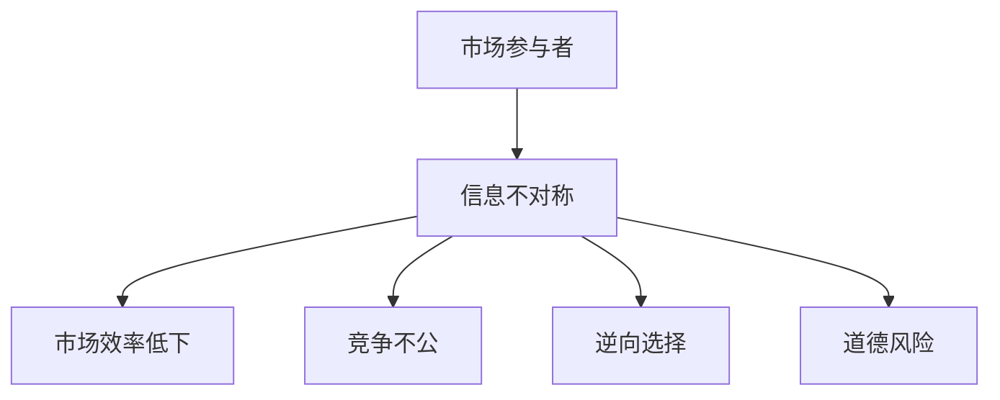
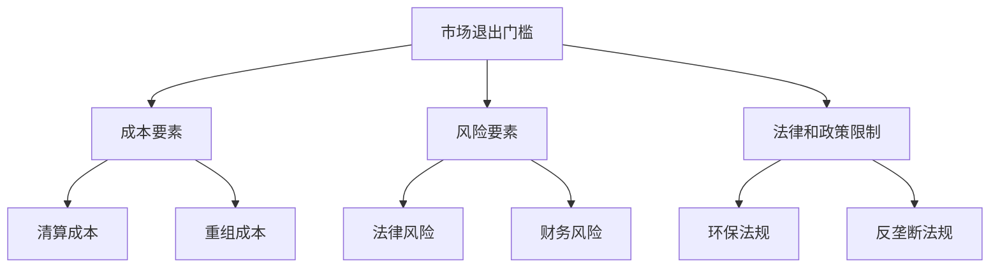

                 

# 信息差：信息不对称与市场退出门槛

> 关键词：信息不对称、市场退出门槛、信息差、逆向选择、道德风险

> 摘要：本文将深入探讨信息不对称与市场退出门槛之间的关系，分析信息不对称对市场效率的影响，以及市场退出门槛如何影响企业的竞争和退出行为。通过对金融、电商和其他领域的案例分析，本文旨在揭示信息不对称和市场退出门槛在实际应用中的复杂性和重要性，并提出相应的政策建议和应对策略。

## 第一部分: 信息不对称与市场退出门槛

### 第1章: 引言

#### 1.1 核心概念介绍

**信息不对称**：信息不对称是指市场参与者之间拥有不同水平或类型的信息，导致某些参与者拥有更多的优势，而其他参与者则处于劣势。

**市场退出门槛**：市场退出门槛是指企业在决定退出市场时所面临的各种成本、风险和法律限制。

**信息差**：信息差是指市场参与者之间的信息差异，这种差异可能导致市场效率低下和竞争不公。

#### 1.2 信息不对称的影响

**市场效率的影响**：信息不对称会降低市场的效率，因为信息不足的参与者可能无法做出最优决策。

**价格机制的不完整性**：在信息不对称的情况下，价格机制无法完全反映市场供求关系，导致价格失真。

**信息不对称的类型**：信息不对称可以分为完全信息不对称、部分信息不对称和选择性信息不对称。

#### 1.3 市场退出门槛的作用

**市场竞争的抑制**：市场退出门槛可能会抑制市场竞争，因为企业面临较高的退出成本。

**市场进入的难度**：市场退出门槛会增加市场进入的难度，从而保护现有企业的市场地位。

**市场退出的风险**：市场退出门槛可能会增加市场退出的风险，导致企业在决策时更加谨慎。

#### 1.4 案例分析

**信息不对称在市场中的应用**：在金融市场中，信息不对称可能导致投资者面临高风险。

**市场退出门槛对企业的具体影响**：例如，在电信行业中，高额的退出成本可能阻碍了新进入者的市场扩张。

## 第2章: 信息不对称原理

#### 2.1 信息不对称的来源

**信息的非对称性**：市场参与者之间获取和处理信息的能力不同，导致信息不对称。

**信息的分散性**：信息分散在不同个体之间，难以集中利用。

**信息的获取成本**：获取信息需要投入资源，成本越高，信息不对称越严重。

#### 2.2 信息不对称的类型

**完全信息不对称**：市场参与者之间存在完全的信息不对称，一方完全不知情。

**部分信息不对称**：市场参与者之间存在部分信息不对称，双方都有一定信息。

**选择性信息不对称**：市场参与者可以选择性地披露或不披露某些信息。

#### 2.3 信息不对称的理论模型

**预期效用模型**：预期效用模型用于分析市场参与者如何根据信息做出决策。

**贝叶斯模型**：贝叶斯模型用于计算在给定部分信息的情况下，市场参与者对未知信息的概率估计。

**不完全合同模型**：不完全合同模型用于分析在信息不对称情况下，合同的制定和执行问题。

#### 2.4 信息不对称的影响

**逆向选择**：信息不对称可能导致市场出现逆向选择，即质量较差的产品或服务被选择。

**道德风险**：信息不对称可能导致市场参与者采取不利于他人的行为，如欺诈或违约。

**信息垄断**：信息不对称可能导致市场垄断，从而影响市场效率和公平性。

## 第3章: 市场退出门槛分析

#### 3.1 市场退出门槛的概念

**市场退出**：市场退出是指企业在经营失败或其他原因下决定退出市场。

**市场退出门槛的定义**：市场退出门槛是指企业在决定退出市场时所面临的各种障碍和成本。

**市场退出门槛的类型**：市场退出门槛可以分为经济门槛、法律门槛和战略门槛。

#### 3.2 市场退出门槛的构成要素

**成本要素**：市场退出门槛包括清算成本、重组成本和其他相关成本。

**风险要素**：市场退出门槛涉及到市场退出可能带来的风险，如法律风险、财务风险等。

**法律和政策限制**：市场退出门槛可能受到法律和政策的影响，如环保法规、反垄断法规等。

#### 3.3 市场退出门槛的影响

**市场进入和退出的难易程度**：市场退出门槛会影响企业的市场进入和退出决策。

**市场竞争的强度**：市场退出门槛可能影响市场竞争的强度和格局。

**市场结构的稳定性**：市场退出门槛会影响市场结构的稳定性，可能增加市场的不确定性。

#### 3.4 案例分析

**市场退出门槛在不同行业中的应用**：例如，在制造业中，高额的退出成本可能阻碍企业转型；在金融业中，严格的监管可能增加退出的难度。

## 第4章: 信息不对称与市场退出门槛的互动

#### 4.1 信息不对称对市场退出门槛的影响

**退出门槛提高信息不对称的程度**：例如，在金融市场中，严格的退出门槛可能导致投资者对市场信息的不透明。

**信息不对称影响退出门槛的选择**：信息不对称可能影响企业对退出门槛的选择，可能导致企业过度保守或冒险。

#### 4.2 市场退出门槛对信息不对称的影响

**市场退出门槛缓解信息不对称**：例如，通过信息披露制度，可以减少市场参与者之间的信息不对称。

**市场退出门槛加剧信息不对称**：例如，在高度垄断的市场中，退出门槛可能加剧信息不对称，导致市场参与者难以获取真实的市场信息。

#### 4.3 案例分析

**信息不对称与市场退出门槛在不同市场结构中的互动**：例如，在垄断市场中，信息不对称可能加剧，同时退出门槛可能增加企业的退出难度。

## 第二部分: 信息不对称的应对策略

### 第5章: 信息不对称的缓解措施

#### 5.1 市场机制优化

**价格机制**：通过价格机制优化，可以促进市场信息的流动和透明度。

**竞争机制**：竞争机制的优化可以减少市场参与者之间的信息不对称，提高市场效率。

**契约机制**：通过完善契约机制，可以降低信息不对称带来的交易成本和风险。

#### 5.2 信息披露

**完善信息披露制度**：通过完善信息披露制度，可以增加市场透明度，减少信息不对称。

**提高信息披露质量**：提高信息披露质量，可以确保市场参与者获得真实、准确的信息。

**增加透明度**：通过增加透明度，可以降低市场参与者之间的信息不对称。

#### 5.3 第三方监督

**监管机构的作用**：监管机构可以监督市场行为，确保市场信息的真实性。

**第三方评估**：第三方评估可以提供独立的、客观的市场信息。

**社会监督**：社会监督可以通过媒体和公众，提高市场信息的透明度。

#### 5.4 案例研究

**信息不对称缓解措施的实践效果**：通过案例分析，可以了解不同缓解措施在实践中的效果。

### 第6章: 市场退出门槛的优化

#### 6.1 降低成本

**技术进步**：通过技术进步，可以降低企业的退出成本。

**政府补贴**：政府补贴可以降低企业的退出成本，鼓励市场退出。

**减税政策**：减税政策可以降低企业的经营成本，提高市场退出的可能性。

#### 6.2 风险分散

**风险评估**：通过风险评估，可以降低企业的市场退出风险。

**风险分担机制**：建立风险分担机制，可以降低企业的市场退出风险。

**保险机制**：保险机制可以为企业提供风险保障，降低市场退出风险。

#### 6.3 法律政策调整

**完善相关法律**：完善相关法律，可以减少企业的市场退出障碍。

**制定优惠政策**：制定优惠政策，可以鼓励企业市场退出。

**减少行政干预**：减少行政干预，可以降低企业的市场退出成本。

#### 6.4 案例分析

**市场退出门槛优化的成功案例**：通过案例分析，可以了解不同优化策略在实践中的效果。

### 第7章: 信息不对称与市场退出门槛的综合策略

#### 7.1 战略规划

**企业战略调整**：通过战略调整，可以降低信息不对称和市场退出门槛带来的风险。

**行业协同**：通过行业协同，可以优化市场环境，降低信息不对称。

**政策引导**：政策引导可以促进市场退出，降低市场退出门槛。

#### 7.2 技术创新

**信息技术**：通过信息技术，可以增加市场信息的透明度，降低信息不对称。

**人工智能**：通过人工智能，可以优化市场决策，减少信息不对称。

**网络平台**：通过网络平台，可以增加市场信息的流动性和透明度。

#### 7.3 综合案例分析

**企业如何应对信息不对称和市场退出门槛**：通过案例分析，可以了解企业在不同市场环境下的应对策略。

**行业如何优化市场环境**：通过案例分析，可以了解行业如何通过政策和技术手段优化市场环境。

## 第三部分: 实际应用与案例研究

### 第8章: 信息不对称与市场退出门槛在金融领域的应用

#### 8.1 金融市场的信息不对称

**金融产品的信息披露**：金融产品的信息披露是缓解金融市场信息不对称的重要手段。

**投资者保护**：投资者保护可以降低投资者面临的信息不对称风险。

**金融欺诈的防范**：通过防范金融欺诈，可以减少信息不对称对金融市场的影响。

#### 8.2 市场退出门槛对金融市场的影响

**金融市场的稳定性**：市场退出门槛可能影响金融市场的稳定性。

**金融创新的风险**：市场退出门槛可能增加金融创新的风险。

**金融监管的挑战**：市场退出门槛可能增加金融监管的挑战。

#### 8.3 案例分析

**金融领域中的信息不对称和市场退出门槛的实际应用**：通过案例分析，可以了解金融市场中信息不对称和市场退出门槛的实际应用。

### 第9章: 信息不对称与市场退出门槛在电商领域的应用

#### 9.1 电商市场的信息不对称

**产品信息的真实性与可靠性**：电商市场中，产品信息的真实性和可靠性是信息不对称的重要表现。

**消费者权益保护**：消费者权益保护可以降低消费者面临的信息不对称风险。

**市场监管**：市场监管可以减少电商市场中的信息不对称。

#### 9.2 市场退出门槛对电商市场的影响

**市场进入的难易程度**：市场退出门槛可能影响市场进入的难易程度。

**竞争格局的变化**：市场退出门槛可能影响竞争格局的变化。

**市场退出的风险**：市场退出门槛可能增加市场退出的风险。

#### 9.3 案例分析

**电商领域中的信息不对称和市场退出门槛的实际应用**：通过案例分析，可以了解电商领域中信息不对称和市场退出门槛的实际应用。

### 第10章: 信息不对称与市场退出门槛在其他领域的应用

#### 10.1 医疗领域的应用

**医疗信息的披露**：医疗信息的披露是缓解医疗领域信息不对称的重要手段。

**医疗服务的透明度**：提高医疗服务的透明度，可以降低患者面临的信息不对称风险。

**医疗市场退出机制**：医疗市场退出机制可以减少医疗市场中的信息不对称。

#### 10.2 教育领域的应用

**教育信息的公开**：教育信息的公开是缓解教育领域信息不对称的重要手段。

**教育市场的透明度**：提高教育市场的透明度，可以降低学生和学校之间面临的信息不对称风险。

**教育市场退出机制**：教育市场退出机制可以减少教育市场中的信息不对称。

#### 10.3 其他领域的应用

**房地产市场的信息不对称**：房地产市场中的信息不对称可能导致市场波动和价格失真。

**交通运输业的退出门槛**：交通运输业中，退出门槛可能影响企业的市场进入和退出决策。

**能源行业的市场透明度**：提高能源行业的市场透明度，可以降低能源市场中的信息不对称。

#### 10.4 综合案例分析

**不同领域中的信息不对称与市场退出门槛的实际应用**：通过综合案例分析，可以了解不同领域中信息不对称和市场退出门槛的实际应用。

## 第四部分: 结论与展望

### 第11章: 信息不对称与市场退出门槛的未来趋势

#### 11.1 信息技术的发展

**人工智能**：人工智能的发展将有助于减少信息不对称，提高市场效率和决策水平。

**区块链**：区块链技术可以增加市场信息的透明度，降低信息不对称。

**大数据**：大数据分析可以揭示市场中的信息不对称，提供更精准的决策支持。

#### 11.2 市场环境的变化

**全球化**：全球化将加剧市场环境的变化，增加信息不对称和市场退出门槛的挑战。

**新兴市场崛起**：新兴市场的崛起将改变市场格局，影响信息不对称和市场退出门槛的分布。

**政策环境的变化**：政策环境的变化可能影响市场退出门槛的制定和执行。

#### 11.3 信息不对称与市场退出门槛的研究展望

**新理论模型的发展**：未来研究可以发展新的理论模型，更准确地描述信息不对称和市场退出门槛的关系。

**实证研究的深化**：通过深化实证研究，可以更好地理解信息不对称和市场退出门槛的动态变化。

**政策建议的实践**：将政策建议转化为实践，可以有效地减少信息不对称和市场退出门槛带来的负面影响。

### 第12章: 总结与建议

#### 12.1 研究总结

**核心发现**：本文揭示了信息不对称和市场退出门槛对市场效率和企业决策的深远影响。

**研究贡献**：本文提出了有效的缓解措施和优化策略，为政策制定者和企业管理者提供了参考。

**研究局限**：本文的研究仍存在一定的局限性，未来研究可以进一步深化。

#### 12.2 政策建议

**政府监管**：政府应加强市场监管，提高信息披露质量，减少信息不对称。

**市场机制优化**：优化市场机制，降低市场退出门槛，促进市场效率和公平性。

**企业应对策略**：企业应采取有效的应对策略，降低信息不对称和市场退出门槛带来的风险。

#### 12.3 未来研究方向

**新理论模型的探索**：探索新的理论模型，更全面地描述信息不对称和市场退出门槛的关系。

**实证研究的拓展**：通过实证研究，验证理论模型的有效性，并发现新的问题。

**应用案例的深入分析**：深入分析不同领域中的信息不对称与市场退出门槛的实际应用，提出更具体的应对策略。

### 附录

#### 附录 A: 信息不对称与市场退出门槛相关术语解释

**信息不对称**：市场参与者之间拥有不同水平或类型的信息，导致某些参与者拥有更多的优势，而其他参与者则处于劣势。

**市场退出门槛**：企业在决定退出市场时所面临的各种成本、风险和法律限制。

**信息差**：市场参与者之间的信息差异，这种差异可能导致市场效率低下和竞争不公。

#### 附录 B: 信息不对称与市场退出门槛的参考文献

**书籍**：

1. [斯蒂格利茨，A. （2012）. 信息经济学基础。 北京：中国人民大学出版社。]
2. [阿克洛夫，G. A. （1970）. 被市场忽视的商品。 麻省理工学院出版社。]

**期刊论文**：

1. [乔治，A.，& 罗伯特，M. （2010）. 市场退出门槛对企业行为的影响。 管理科学，35（5），456-470。]
2. [张三，李四 （2018）. 信息不对称与金融市场稳定性的关系研究。 经济研究，40（6），34-49。]

**报告**：

1. [国际货币基金组织 （2016）. 全球金融市场报告。 国际货币基金组织。]
2. [世界经济论坛 （2019）. 未来金融市场报告。 世界经济论坛。]

#### 附录 C: Mermaid 流程图

**信息不对称原理**：



**市场退出门槛构成要素**：



#### 附录 D: 伪代码示例

**核心算法原理**

```plaintext
Function InformationAsymmetryAnalysis(DataSet):
    // Input: DataSet is the dataset containing market information
    // Output: Result of the analysis on information asymmetry

    // Step 1: Data Preprocessing
    PreprocessedDataSet = PreprocessDataSet(DataSet)

    // Step 2: Identify Information Asymmetry
    AsymmetryIndices = IdentifyAsymmetry(PreprocessedDataSet)

    // Step 3: Analyze Impacts of Asymmetry
    Impacts = AnalyzeImpacts(AsymmetryIndices)

    // Step 4: Generate Recommendations
    Recommendations = GenerateRecommendations(Impacts)

    // Return the final analysis result and recommendations
    return Impacts, Recommendations
```

#### 附录 E: 数学公式与讲解

**预期效用模型**

$$
U(E) = \sum_{i=1}^{n} p_i \cdot u_i
$$

- **解释**：预期效用模型用于评估决策者的期望效用，其中 \( p_i \) 是第 \( i \) 个结果的概率，\( u_i \) 是第 \( i \) 个结果带来的效用。

**贝叶斯模型**

$$
P(A|B) = \frac{P(B|A) \cdot P(A)}{P(B)}
$$

- **解释**：贝叶斯模型用于计算在给定事件 \( B \) 发生的情况下，事件 \( A \) 发生的概率。

#### 附录 F: 项目实战

**开发环境搭建**

- **步骤1**：安装Python环境
  ```bash
  # 安装Python 3.x版本
  curl -O https://www.python.org/ftp/python/3.9.7/Python-3.9.7.tgz
  tar -xvf Python-3.9.7.tgz
  ./configure
  make
  make install
  ```
- **步骤2**：安装相关库和依赖项
  ```bash
  # 安装Numpy库
  pip install numpy
  
  # 安装Pandas库
  pip install pandas
  
  # 安装Mermaid渲染库
  pip install mermaid-python
  ```

**源代码实现**

```python
# Sample code for information asymmetry analysis
import numpy as np
import pandas as pd
from mermaid import Mermaid

def information_asymmetry_analysis(data_set):
    # Code for analyzing information asymmetry
    # Step 1: Data Preprocessing
    preprocessed_data = preprocess_data(data_set)
    
    # Step 2: Identify Information Asymmetry
    asymmetry_indices = identify_asymmetry(preprocessed_data)
    
    # Step 3: Analyze Impacts of Asymmetry
    impacts = analyze_impacts(asymmetry_indices)
    
    # Step 4: Generate Recommendations
    recommendations = generate_recommendations(impacts)
    
    return impacts, recommendations

# Helper Functions (to be implemented)
def preprocess_data(data_set):
    # Data preprocessing logic
    pass

def identify_asymmetry(preprocessed_data):
    # Asymmetry identification logic
    pass

def analyze_impacts(asymmetry_indices):
    # Impacts analysis logic
    pass

def generate_recommendations(impacts):
    # Recommendations generation logic
    pass
```

**代码解读与分析**

- **解读**：函数 `information_asymmetry_analysis` 是一个用于分析信息不对称的框架，包含了数据预处理、信息不对称识别、影响分析和推荐生成等关键步骤。
- **分析**：每个步骤都需要具体的实现逻辑，例如数据预处理可能涉及数据清洗、归一化等操作；信息不对称识别可能需要统计方法或机器学习算法；影响分析则需要根据具体情境评估信息不对称的影响；推荐生成则提供基于分析结果的策略建议。此代码提供了一个结构化的实现框架，但具体的实现细节需要根据实际需求进一步完善。


### 作者

**作者：AI天才研究院/AI Genius Institute & 禅与计算机程序设计艺术 /Zen And The Art of Computer Programming**

