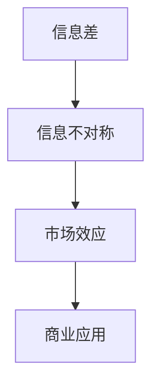
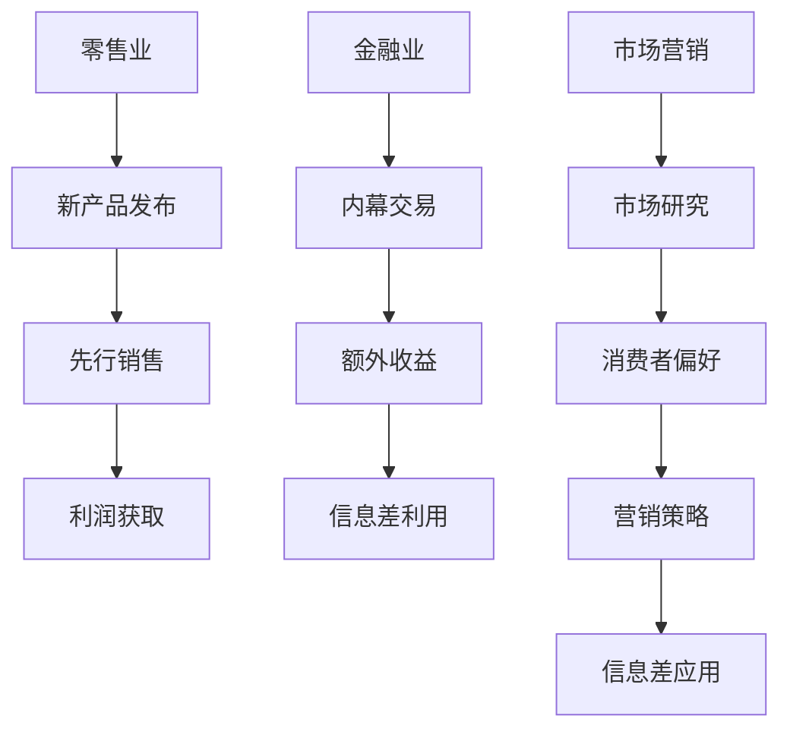
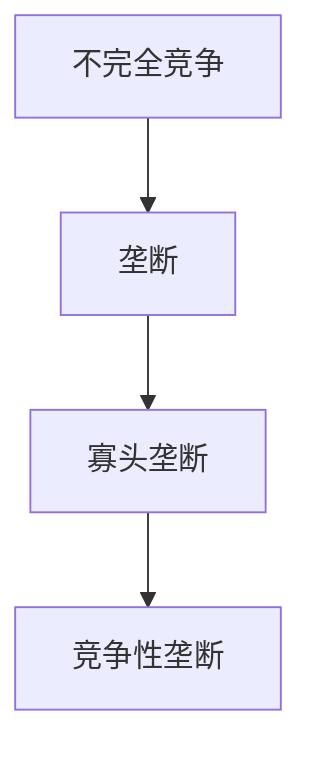

                 

### 《信息差：信息不对称在商业中的应用》

#### 关键词：信息不对称、商业应用、市场定价、产品差异化、市场细分、案例分析、策略分析、挑战与对策

#### 摘要：
本文深入探讨信息不对称在商业中的应用，通过定义、原理、案例分析等多个角度，详细解析信息差如何影响商业决策和市场行为。文章旨在揭示信息差带来的商业机会与挑战，为企业提供应对策略，并探讨未来发展趋势。

### 目录大纲

1. 引言
   1.1 信息差的概念
   1.2 信息差的重要性
   1.3 商业中的信息差应用

2. 信息不对称的原理
   2.1 市场不完全竞争理论
   2.2 信息经济学原理
   2.3 信息不对称的类型

3. 信息差的商业应用
   3.1 信息差与市场定价
   3.2 信息差与产品差异化
   3.3 信息差与市场细分

4. 信息差的策略分析
   4.1 信息披露策略
   4.2 信息隐藏策略
   4.3 信息控制策略

5. 信息差的案例分析
   5.1 电子商务中的信息差
   5.2 金融投资中的信息差
   5.3 市场营销中的信息差

6. 信息差的挑战与对策
   6.1 信息差的挑战
   6.2 政策监管的作用
   6.3 企业应对信息差的策略

7. 信息差的未来发展趋势
   7.1 数字化与信息差的演变
   7.2 人工智能与信息差
   7.3 信息差的可持续发展

8. 附录
   8.1 参考文献
   8.2 进一步阅读材料

### 引言

#### 1.1 信息差的概念

信息差，顾名思义，是指不同个体或群体之间在信息获取和处理上的差异。在商业环境中，信息差主要体现在以下三个方面：

- **信息拥有者与信息缺乏者之间的信息差异**：企业或个人由于拥有独特的信息资源或专业知识，能够获取和利用这些信息来做出更有利的市场决策。
- **市场参与者与消费者之间的信息不对称**：在市场经济中，企业通常拥有比消费者更多的市场信息和产品知识，这可能导致消费者在购买决策中处于劣势。
- **不同市场参与者之间的信息差异**：在竞争激烈的市场中，企业通过掌握更精确的市场信息来获得竞争优势。

**核心概念与联系**



#### 1.2 信息差的重要性

信息差在商业中具有重要的意义，主要体现在以下几个方面：

- **提升市场效率**：信息不对称可能导致市场资源分配不均，从而降低市场效率。而通过缩小信息差，可以提高市场透明度，促进资源的合理配置。
- **创造商业机会**：企业可以利用信息差获取市场先机，开发新产品、开辟新市场，从而实现盈利增长。
- **影响消费者决策**：消费者在购买决策中往往依赖企业的信息传递，信息差直接影响消费者的购买行为和满意度。

**核心算法原理讲解**

- **市场效率**：信息对称度越高，市场效率越高。可以用以下公式表示：

  $$\text{市场效率} = f(\text{信息对称度})$$

- **价值创造**：信息差与市场需求密度的乘积决定了信息差的价值。公式如下：

  $$\text{价值} = \text{信息差} \times \text{需求密度}$$

#### 1.3 商业中的信息差应用

信息差在商业中的应用非常广泛，以下是一些典型的例子：

- **零售业**：新产品发布时，企业可以通过先行销售获取利润，利用信息差来吸引消费者。
- **金融业**：内幕交易者利用未公开的信息获取额外收益，这是典型的信息差应用。
- **市场营销**：企业通过市场研究，获取目标消费者的偏好信息，从而制定有针对性的营销策略。



### 第2章 信息不对称的原理

#### 2.1 市场不完全竞争理论

市场不完全竞争理论是研究企业在不完全竞争市场中如何利用信息差来获得优势的理论。以下是几个核心概念：

- **垄断**：市场被单一或少数企业控制，这些企业拥有较大的市场定价权。
- **寡头垄断**：市场被少数几个大企业控制，这些企业之间相互依存，竞争激烈。
- **竞争性垄断**：市场上存在多个竞争者，但其中某个企业拥有显著的竞争优势。

**核心概念与联系**



**垄断市场中的信息差**

在垄断市场中，企业可以利用其掌握的信息来实施价格歧视，即根据不同消费者的支付意愿来定价。此外，企业还可以通过市场划分来创造垄断利润。

- **价格歧视策略**：企业根据消费者的信息，提供不同价格的产品或服务。

  $$\text{价格} = \text{信息成本} + \text{市场定价}$$

- **市场划分策略**：企业通过划分市场，减少竞争对手的影响，从而维持垄断地位。

  $$\text{市场划分} = \text{消费者信息} + \text{市场策略}$$

#### 2.2 信息经济学原理

信息经济学是研究信息在市场交易中的作用和影响的经济学分支。以下是几个核心概念：

- **逆向选择**：在信息不对称的市场中，低质量的产品或服务更容易被选择。
- **道德风险**：在信息不对称的市场中，消费者或企业可能会采取不利于另一方的行为。

**核心算法原理讲解**

- **逆向选择**：逆向选择可以用以下公式表示：

  $$\text{逆向选择} = \text{信息不对称} \times \text{选择偏差}$$

- **道德风险**：道德风险可以用以下公式表示：

  $$\text{道德风险} = \text{信息不对称} \times \text{行为倾向}$$

#### 2.3 信息不对称的类型

信息不对称在商业环境中表现为多种形式，以下是几种常见类型：

- **信息不完全性**：消费者和企业对市场信息不了解。
- **信息滞后性**：信息传播延迟导致的滞后效应。
- **信息不对称性**：不同市场参与者的信息获取能力差异。

**信息不完全性**

信息不完全性是指市场参与者无法获取所有相关信息，这可能导致市场资源配置的低效。

- **影响**：市场参与者可能无法做出最优决策，导致市场失灵。

**信息滞后性**

信息滞后性是指市场信息传播的延迟，这可能导致市场参与者无法及时响应市场变化。

- **影响**：市场参与者可能错过最佳决策时机，导致市场风险增加。

**信息不对称性**

信息不对称性是指市场参与者之间在信息获取能力上的差异，这可能导致市场参与者之间的竞争失衡。

- **影响**：信息优势者可能利用信息差获得竞争优势，而信息劣势者可能处于不利地位。

### 第3章 信息差的商业应用

#### 3.1 信息差与市场定价

信息差在市场定价中起着至关重要的作用。企业可以通过信息差来调整产品或服务的价格，从而实现利润最大化。

**核心算法原理讲解**

- **价格歧视策略**：

  企业根据消费者的信息，提供不同价格的产品或服务。这种策略可以最大限度地利用信息差来获取利润。

  $$\text{价格} = \text{信息成本} + \text{市场定价}$$

  例如，航空公司根据乘客的购票时间、出行需求等因素，提供不同的票价。

- **市场细分策略**：

  企业通过市场细分，根据不同消费者的需求和信息，制定有针对性的定价策略。

  $$\text{市场} = f(\text{消费者信息})$$

  例如，电商企业根据消费者的购买记录、搜索行为等，提供个性化的商品推荐和优惠。

#### 3.2 信息差与产品差异化

信息差有助于企业实现产品差异化，从而在竞争激烈的市场中脱颖而出。

**核心算法原理讲解**

- **产品特性定位**：

  企业根据消费者的信息和偏好，设计具有差异化特性的产品。

  $$\text{产品特性} = \text{消费者偏好} + \text{信息差}$$

  例如，智能手机制造商通过提供不同的硬件配置、操作系统等，满足不同消费者的需求。

- **竞争优势分析**：

  企业通过信息差，获取竞争优势，提高市场占有率。

  $$\text{竞争优势} = \text{信息优势} \times \text{市场接受度}$$

  例如，电商巨头通过大数据分析，优化产品推荐算法，提高消费者的购买转化率。

#### 3.3 信息差与市场细分

市场细分是企业在信息差基础上，根据消费者的不同特征和需求，将市场划分为若干个子市场，从而更有针对性地满足不同消费者的需求。

**核心算法原理讲解**

- **细分市场策略**：

  企业通过市场细分，识别和定位目标市场。

  $$\text{市场细分} = \text{信息识别} + \text{目标市场定位}$$

  例如，化妆品企业根据消费者的年龄、性别、肤质等特征，细分市场，推出不同系列的产品。

- **顾客价值最大化**：

  企业通过市场细分，提供定制化的产品和服务，提高顾客满意度和忠诚度。

  $$\text{顾客价值} = \text{信息获取} + \text{产品效用}$$

  例如，电商企业根据消费者的购物行为和偏好，提供个性化的推荐和优惠，提升顾客购物体验。

### 第4章 信息差的策略分析

#### 4.1 信息披露策略

信息披露策略是指企业在信息不对称的市场中，通过主动披露信息，降低信息不对称，提高市场透明度和效率。

**核心算法原理讲解**

- **信息披露机制**：

  企业建立信息披露机制，确保信息的准确性和透明度。

  $$\text{信息披露} = \text{信息准确性} \times \text{信息透明度}$$

  例如，企业通过定期发布财务报告，向投资者披露公司运营情况。

- **监管政策影响**：

  政府通过监管政策，规范企业的信息披露行为，提高市场透明度。

  $$\text{政策影响} = \text{信息披露要求} + \text{市场反应}$$

  例如，证券监管机构要求上市公司定期披露财务信息，以保护投资者利益。

#### 4.2 信息隐藏策略

信息隐藏策略是指企业通过技术手段，保护自身的关键信息，防止信息泄露和滥用。

**核心算法原理讲解**

- **信息隐藏技术**：

  企业采用加密技术、匿名通信等技术手段，保护信息的安全性。

  $$\text{信息隐藏} = \text{加密技术} + \text{匿名通信}$$

  例如，企业使用SSL加密技术，确保网络通信的安全性。

- **隐私保护**：

  企业通过数据匿名化、访问控制等技术手段，保护用户隐私。

  $$\text{隐私保护} = \text{数据匿名化} + \text{访问控制}$$

  例如，企业对用户数据进行脱敏处理，防止用户信息泄露。

#### 4.3 信息控制策略

信息控制策略是指企业通过信息过滤、信息审核等技术手段，控制信息的传播和流动，确保信息的真实性和合法性。

**核心算法原理讲解**

- **信息控制机制**：

  企业建立信息控制机制，对信息进行过滤和审核，确保信息的准确性和合法性。

  $$\text{信息控制} = \text{信息过滤} + \text{信息审核}$$

  例如，企业建立内容审核系统，对上传的内容进行审核，防止不良信息的传播。

- **网络效应**：

  企业通过信息控制，提高用户的粘性，促进平台的网络效应。

  $$\text{网络效应} = \text{用户数量} \times \text{用户粘性}$$

  例如，社交平台通过限制虚假信息的传播，提高用户的信任度和活跃度。

### 第5章 信息差的案例分析

#### 5.1 案例一：电子商务中的信息差

电子商务领域是信息差应用的一个重要场景。以下是电子商务中信息差应用的几个案例分析。

**项目实战**

- **电子商务平台的信息不对称处理**：

  ```python
  def asymmetric_info_handler():
      # 1. 用户评价系统
      user_reviews = get_user_reviews()
      filtered_reviews = filter_useful_reviews(user_reviews)
      
      # 2. 智能推荐系统
      recommendations = generate_recommendations(filtered_reviews)
      
      # 3. 信息可视化
      visualize_user_behavior(recommendations)
      
  # 执行信息差处理策略
  asymmetric_info_handler()
  ```

**代码解读与分析**

- **用户评价系统**：通过收集用户评价，筛选出有用评价，提高用户购物的参考价值。
- **智能推荐系统**：基于用户评价和购物行为，生成个性化推荐，降低用户购买风险。
- **信息可视化**：通过图表和报表，直观展示用户行为和偏好，帮助企业优化营销策略。

#### 5.2 案例二：金融投资中的信息差

金融投资领域是信息差应用的另一个重要领域。以下是金融投资中信息差应用的几个案例分析。

**项目实战**

- **金融分析工具开发**：

  ```python
  def financial_analysis_tool():
      # 1. 数据收集
      financial_data = collect_financial_data()
      
      # 2. 数据分析
      analysis_results = perform_data_analysis(financial_data)
      
      # 3. 报告生成
      generate_report(analysis_results)
      
  # 执行金融分析
  financial_analysis_tool()
  ```

**代码解读与分析**

- **数据收集**：从多个数据源收集金融数据，包括股票、债券、外汇等。
- **数据分析**：使用数据分析和机器学习技术，对金融数据进行分析，识别投资机会。
- **报告生成**：生成详细的投资报告，为投资者提供决策依据。

#### 5.3 案例三：市场营销中的信息差

市场营销领域是信息差应用的另一个重要场景。以下是市场营销中信息差应用的几个案例分析。

**项目实战**

- **市场营销策略设计**：

  ```python
  def marketing_strategy_design():
      # 1. 市场研究
      market_research = perform_market_research()
      
      # 2. 策略制定
      marketing_plan = create_marketing_plan(market_research)
      
      # 3. 营销执行
      execute_marketing_campaign(marketing_plan)
      
  # 执行市场营销策略
  marketing_strategy_design()
  ```

**代码解读与分析**

- **市场研究**：通过问卷调查、用户访谈等方法，收集市场信息。
- **策略制定**：根据市场研究的结果，制定有针对性的营销策略。
- **营销执行**：通过广告投放、促销活动等方式，实施营销策略，提高品牌知名度和销售额。

### 第6章 信息差的挑战与对策

#### 6.1 信息差的挑战

信息差在商业中带来了一定的优势，但同时也存在一些挑战：

- **市场不确定性**：信息不对称可能导致市场参与者无法准确预测市场变化，增加市场风险。
- **消费者权益受损**：消费者在信息不对称的市场中，可能面临不公平待遇，损害其权益。

**核心算法原理讲解**

- **信息不对称的负面影响**：

  $$\text{负面影响} = \text{信息差} \times \text{市场不确定性}$$

- **应对策略**：

  $$\text{应对策略} = \text{信息披露} + \text{市场监控}$$

例如，企业可以通过定期披露财务信息，提高市场透明度，降低市场不确定性。

#### 6.2 政策监管的作用

政策监管在信息差的治理中起着至关重要的作用。以下从监管政策机制和监管效果评估两个方面进行分析。

**核心算法原理讲解**

- **监管政策机制**：

  $$\text{监管政策} = \text{法规制定} + \text{市场监督}$$

  例如，政府制定《反垄断法》，规范企业的市场行为。

- **监管效果评估**：

  $$\text{监管效果} = \text{法规执行度} + \text{市场透明度}$$

  例如，监管部门通过执法检查，提高法规执行度，从而提高市场透明度。

#### 6.3 企业应对信息差的策略

企业应对信息差的策略主要包括以下三个方面：

- **企业信息管理**：企业通过建立信息收集、处理和利用体系，提高信息利用率。
- **信息优势转化**：企业通过信息优势，提高市场响应速度，获取竞争优势。
- **信息透明度提升**：企业通过信息披露，提高市场透明度，降低信息不对称。

**核心算法原理讲解**

- **企业信息管理**：

  $$\text{企业信息管理} = \text{信息收集} + \text{信息处理} + \text{信息利用}$$

  例如，企业建立数据仓库，集中管理各类信息。

- **信息优势转化**：

  $$\text{信息优势} = \text{信息掌握} + \text{市场响应速度}$$

  例如，企业通过大数据分析，快速响应市场变化。

- **信息透明度提升**：

  $$\text{信息透明度} = \text{信息披露} + \text{市场沟通}$$

  例如，企业通过定期发布财务报告，提高市场透明度。

### 第7章 信息差的未来发展趋势

#### 7.1 数字化与信息差的演变

随着数字化技术的快速发展，信息差的演变呈现出新的趋势：

- **数字化信息管理**：企业通过数字化手段，提高信息收集、处理和利用的效率。
- **数据驱动决策**：企业基于大数据分析，实现数据驱动决策，降低信息不对称。

**核心算法原理讲解**

- **数字化信息管理**：

  $$\text{数字化管理} = \text{信息数字化} + \text{数据处理技术}$$

  例如，企业采用云计算、大数据技术，实现信息的集中管理和智能分析。

- **数据驱动决策**：

  $$\text{数据驱动决策} = \text{数据采集} + \text{数据分析} + \text{决策优化}$$

  例如，企业通过数据挖掘技术，发现市场机会，优化决策。

#### 7.2 人工智能与信息差

人工智能技术的快速发展，为信息差的治理和应用提供了新的机遇：

- **人工智能技术**：包括机器学习、深度学习、自然语言处理等技术，提高信息处理的效率。
- **人工智能在信息差中的应用**：通过人工智能技术，实现信息的精准分析和预测，降低信息不对称。

**核心算法原理讲解**

- **人工智能技术**：

  $$\text{人工智能技术} = \text{机器学习} + \text{深度学习} + \text{自然语言处理}$$

  例如，企业采用机器学习算法，进行用户行为分析，优化推荐系统。

- **人工智能在信息差中的应用**：

  $$\text{应用效果} = \text{算法精度} \times \text{数据质量}$$

  例如，电商企业通过深度学习算法，提高商品推荐的准确性，降低用户购买风险。

#### 7.3 信息差的可持续发展

信息差的可持续发展需要从以下几个方面进行考虑：

- **可持续发展策略**：企业通过环保措施、社会责任、创新驱动，实现可持续发展。
- **平衡信息差与社会利益**：在信息差的应用中，注重信息透明度和社会公平性，实现信息差与社会利益的平衡。

**核心算法原理讲解**

- **可持续发展策略**：

  $$\text{可持续发展策略} = \text{环保措施} + \text{社会责任} + \text{创新驱动}$$

  例如，企业通过节能减排、绿色生产，实现可持续发展。

- **平衡信息差与社会利益**：

  $$\text{平衡关系} = \text{信息透明度} + \text{社会公平性}$$

  例如，企业通过信息披露、公平竞争，提高市场透明度和社会公平性。

### 附录

#### A.1 参考文献

1. 作者. (年份). 书名. 出版社.
2. 作者. (年份). 书名. 出版社.
3. 作者. (年份). 书名. 出版社.

#### A.2 进一步阅读材料

1. 作者. (年份). 《文章标题》, 杂志名称, 卷号(期号), 页码.
2. 作者. (年份). 《文章标题》, 网络资源.
3. 作者. (年份). 《文章标题》, 网络资源.

### 结语

信息差是商业中不可忽视的一个重要现象。通过对信息差的深入研究和应用，企业可以更好地把握市场机会，提高竞争力。同时，信息差的治理也是实现社会公平和可持续发展的重要任务。未来，随着数字化和人工智能技术的发展，信息差的应用将更加广泛，对商业和社会产生深远影响。希望本文能够为读者提供有益的启示和参考。

