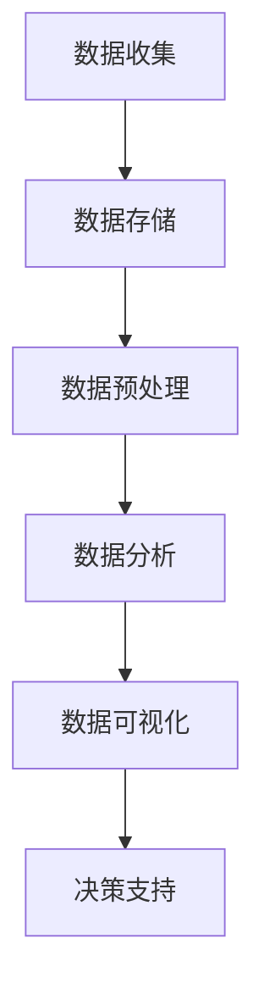
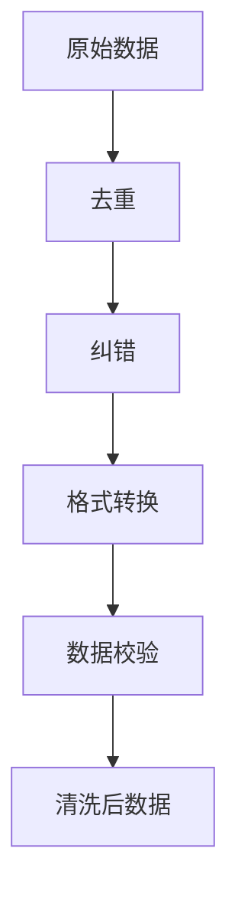
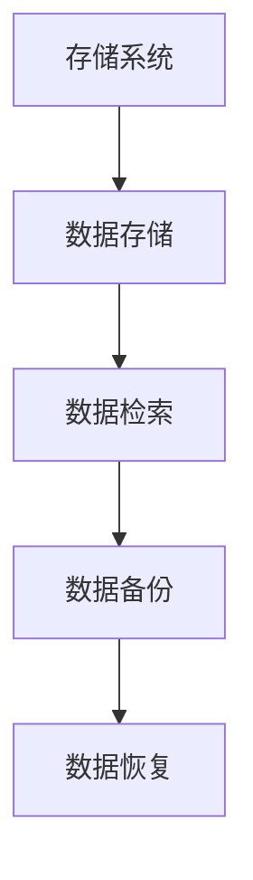
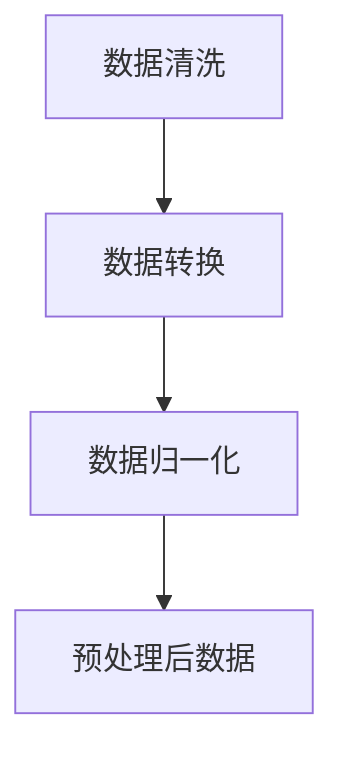
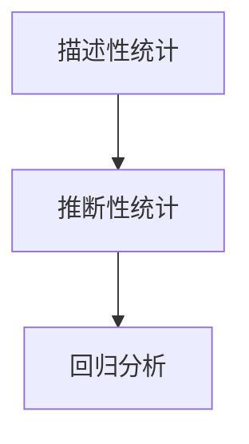
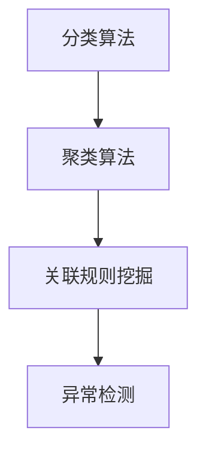

                 

# 信息差：大数据在教育领域的应用

## 关键词
信息差、大数据、教育、个性化学习、教育资源配置、教育质量监测、教育决策支持

## 摘要
在教育领域，信息差是教育资源、知识获取和教育评价等方面存在的显著差异，导致了教育不公平。大数据技术的应用为缩小这些信息差提供了有效途径。本文首先定义信息差并阐述其影响，随后介绍大数据的基本概念和核心技术。接着，本文详细分析了大数据在教育资源配置、个性化学习、教育质量监测、教育管理和教育决策支持等方面的应用，并通过具体案例进行说明。此外，本文还探讨了大数据在教育领域面临的挑战和未来趋势。通过本文，读者将全面了解大数据在教育领域的广泛应用及其深远影响。

### 第一部分：信息差的定义与大数据技术基础

#### 第1章：信息差的定义与影响

##### 1.1 信息差的定义

信息差（Information Gap）是指不同个体或群体在获取和掌握信息方面存在的差异。这种差异可以表现在信息的数量、质量、速度和可靠性等方面。在商业环境中，信息差常常表现为某种产品或服务的供给与需求之间的不对称，从而为掌握更多信息的一方提供了竞争优势。在教育领域，信息差则更多地体现在学生、教师、学校等教育参与者之间在获取教育资源、掌握知识技能、理解教育政策等方面的差距。

##### 1.1.1 信息差的内涵

信息差的内涵可以从以下几个方面进行理解：

1. **信息数量差异**：由于资源分配不均，一些学生或学校可能无法接触到足够的教材、教学资源或课外辅导，而其他学生或学校则能够享受到丰富的教育资源。

2. **信息质量差异**：高质量的教育资源往往需要较高的获取成本，这导致一些学生或学校难以获得优质的教育资源，从而在知识水平上与其他学生或学校存在差距。

3. **信息速度差异**：信息的传递速度在不同地区、不同社会群体之间存在差异。一些地区或群体可能无法及时获取最新的教育信息，导致教育落后。

4. **信息可靠性差异**：互联网和媒体的普及使得信息传播速度加快，但同时也带来了信息真实性和可靠性的问题。一些学生或学校可能无法辨别信息的真伪，从而受到误导。

##### 1.1.2 信息差在社会中的应用

在社会中，信息差的存在可以导致以下几种现象：

1. **市场效应**：信息差的扩大可能导致市场失灵，比如信息不对称会导致逆向选择和道德风险，影响市场的有效运作。

2. **教育不公平**：在教育领域，信息差的扩大可能导致教育机会的不平等，一些学生或学校由于资源不足而难以获得优质的教育资源。

3. **商业机会**：对于创业者或企业来说，通过掌握信息差，可以创造新的商业机会，例如通过数据分析和市场调研来发现未被满足的需求，开发新产品或服务。

##### 1.2 大数据与信息差

###### 1.2.1 大数据的基本概念

大数据（Big Data）是指无法用传统数据处理软件工具在合理时间内捕捉、管理和处理的大量数据。它通常具有四个V特征：数据量（Volume）、数据速度（Velocity）、数据多样性（Variety）和数据价值（Value）。

1. **数据量**：大数据的一个重要特征是其数据量巨大，通常超出传统数据库的处理能力。

2. **数据速度**：大数据的生成和消费速度非常快，要求数据处理系统具备高速响应能力。

3. **数据多样性**：大数据来源广泛，包括文本、图像、音频、视频等多种形式，具有高度多样性。

4. **数据价值**：大数据的价值在于能够从海量数据中提取有价值的信息，用于决策支持和创新。

###### 1.2.2 大数据在信息差中的作用

大数据技术通过收集、存储、处理和分析大量数据，可以显著缩小信息差，具体体现在以下几个方面：

1. **提高决策效率**：通过数据分析，可以更快速地获取所需信息，从而做出更准确的决策。

2. **优化资源配置**：大数据技术可以帮助识别资源需求，从而实现教育资源的优化配置。

3. **促进教育公平**：大数据技术可以提供更多的教育资源，使偏远地区和贫困家庭的孩子也能获得优质的教育资源。

###### 1.2.3 大数据技术的演进

大数据技术的发展经历了以下几个阶段：

1. **数据的收集和存储**：随着互联网和物联网的普及，数据源变得多样化，如何有效地收集和存储这些数据成为关键。

2. **数据分析和挖掘**：随着计算能力的提升，人们开始关注如何从海量数据中提取有价值的信息。

3. **数据可视化与决策支持**：通过数据可视化，可以更直观地理解数据，辅助决策者做出更好的决策。

### 流程图：大数据处理流程



#### 第2章：大数据技术基础

##### 2.1 数据源收集与处理

###### 2.1.1 数据来源与类型

在教育领域，数据来源广泛，包括：

1. **结构化数据**：如学生成绩、课程安排、教师评估等，这些数据通常以表格形式存储。

2. **非结构化数据**：如教师和学生的日常交流、学习笔记、教学视频等，这些数据通常以文本或多媒体形式存在。

###### 2.1.2 数据采集与清洗

数据采集过程中，需要注意以下几点：

1. **数据完整性**：确保采集到的数据是完整的，没有缺失。

2. **数据准确性**：确保数据的准确性，避免错误和误导。

数据清洗是指通过处理原始数据，去除重复、错误或无关的数据，以提高数据质量。



###### 2.1.3 数据存储与管理

教育大数据通常需要存储在分布式文件系统或数据库中，如Hadoop、HBase、MySQL等。数据管理包括数据的存储、检索、备份和恢复等操作。



##### 2.2 数据分析与挖掘

###### 2.2.1 数据预处理

数据预处理是数据分析的第一步，包括数据清洗、数据转换和数据归一化等操作。



###### 2.2.2 统计分析方法

统计分析方法包括描述性统计、推断性统计和回归分析等，用于描述数据特征、测试假设和建立预测模型。

1. **描述性统计**：用于描述数据的基本特征，如均值、中位数、标准差等。

2. **推断性统计**：用于基于样本数据推断总体特征，如假设检验、置信区间等。

3. **回归分析**：用于建立变量之间的关系模型，如线性回归、多项式回归等。



###### 2.2.3 数据挖掘算法

数据挖掘算法包括分类、聚类、关联规则挖掘和异常检测等，用于从数据中发现隐藏的模式和知识。

1. **分类算法**：用于将数据分为不同的类别，如决策树、支持向量机等。

2. **聚类算法**：用于将数据分为多个聚类，如K均值、层次聚类等。

3. **关联规则挖掘**：用于发现数据之间的关联关系，如Apriori算法、FP-growth算法等。

4. **异常检测**：用于识别数据中的异常值，如孤立森林、基于密度的方法等。



##### 2.3 大数据技术与教育领域结合

###### 2.3.1 大数据在教育中的应用

大数据在教育中的应用包括：

1. **个性化学习**：通过分析学生的学习数据，提供个性化的学习方案。

2. **教育质量监测**：通过收集和分析教育过程中的各种数据，实时监测教育质量。

3. **教育资源优化**：通过分析教育资源的使用情况，优化教育资源的配置。

###### 2.3.2 大数据在教育评价中的应用

大数据技术可以帮助教育机构进行教育评价，包括：

1. **学生成绩分析**：通过分析学生的考试成绩，发现学习问题并提供改进建议。

2. **教师评估**：通过收集学生和教师的反馈，对教师的教学效果进行评估。

3. **教育政策分析**：通过分析教育数据，为教育政策的制定和调整提供依据。

###### 2.3.3 大数据在教育决策中的作用

大数据技术可以帮助教育决策者做出更科学、更有效的决策，包括：

1. **招生策略**：通过分析历年招生数据，制定更有效的招生策略。

2. **课程设计**：通过分析学生的学习数据和教师的教学数据，优化课程设计。

3. **资源配置**：通过分析教育资源的利用情况，合理配置教育资源。

### 数学模型：线性回归模型

```latex
y = \beta_0 + \beta_1x + \epsilon
```

其中，$y$ 是因变量，$x$ 是自变量，$\beta_0$ 和 $\beta_1$ 是回归系数，$\epsilon$ 是误差项。

### 项目实战：教育数据分析平台

**开发环境搭建**：

1. **操作系统**：Linux（推荐Ubuntu）
2. **编程语言**：Python
3. **数据库**：MySQL
4. **大数据处理框架**：Spark

**源代码实现**：

```python
# 连接数据库
import mysql.connector

db = mysql.connector.connect(
  host="localhost",
  user="root",
  password="password",
  database="education_data"
)

# 执行SQL查询
cursor = db.cursor()
cursor.execute("SELECT * FROM student_scores")

# 提取数据
data = cursor.fetchall()

# 数据预处理
# ...

# 数据分析
# ...

# 结果可视化
# ...

```

**代码解读与分析**：

1. **数据库连接**：使用 MySQL Connector Python 库连接到 MySQL 数据库。

2. **执行SQL查询**：执行 SELECT 查询以获取学生成绩数据。

3. **数据预处理**：对获取的数据进行清洗和转换，以便于后续分析。

4. **数据分析**：使用适当的算法对预处理后的数据进行分析。

5. **结果可视化**：将分析结果以图表形式展示，以便于决策者理解。

通过以上步骤，可以构建一个简单的教育数据分析平台，为教育决策提供支持。在实际应用中，可以根据具体需求进行功能扩展和优化。

### 总结

本文从信息差的定义出发，探讨了大数据技术在教育领域的应用。通过分析大数据的基本概念和技术基础，我们了解到大数据在缩小教育信息差、优化教育资源、提高教育质量等方面的巨大潜力。案例实战部分展示了如何通过Python和MySQL实现教育数据分析平台，为教育决策提供数据支持。未来，随着大数据技术的不断发展和完善，教育领域将迎来更加智能化、个性化和高效化的新时代。

### 作者

作者：AI天才研究院/AI Genius Institute & 禅与计算机程序设计艺术 /Zen And The Art of Computer Programming

本文由AI天才研究院撰写，旨在探讨大数据在教育领域的应用。作者对教育信息化和人工智能领域有深入的研究和实践经验，致力于推动教育技术的创新和发展。在“禅与计算机程序设计艺术”一书中，作者通过独特的视角和深刻的见解，探讨了计算机程序设计中的哲学和艺术，为读者提供了丰富的思考和启示。

