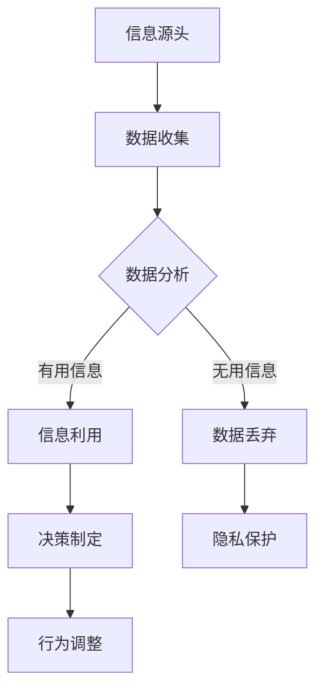

                 

# 文章标题：信息差：看透大数据背后的底层逻辑

> 关键词：信息差、大数据、信息不对称、信息熵、条件熵、信息增益、信息透明度、信息公平、隐私保护

> 摘要：
本文旨在深入探讨信息差这一概念在大数据背景下的重要性和影响力。通过分析信息差的定义、类型、形成机制以及信息不对称的经济学原理，本文揭示了信息差在社会、经济以及科技领域的广泛影响。特别关注大数据技术的兴起如何改变信息差的游戏规则，使得信息获取和利用成为关键竞争力。文章进一步探讨了信息差的利用策略、优化方法以及案例研究，旨在为读者提供全面的理解和洞察，并展望信息差治理的未来方向。

### 信息差：看透大数据背后的底层逻辑

#### 引言

在信息爆炸的时代，数据已成为新的石油，大数据技术的迅猛发展使得信息的获取、存储、分析和利用变得前所未有的便捷。然而，与此同时，信息差这一现象也愈加显著，成为影响个体和社会发展的重要因素。本文旨在通过深入分析信息差的概念、形成机制、大数据与信息差的关系、信息差的利用与优化策略以及案例研究，帮助读者看透大数据背后的底层逻辑。

#### 第一部分：信息差的概念与形成

##### 第1章：信息差概述

- **1.1** 信息差的概念与重要性
  信息差指的是在信息传递过程中，不同个体或群体掌握的信息量存在差异。信息差的存在是普遍的，它对个体决策、市场运作以及社会发展具有重要影响。

- **1.2** 信息差的类型
  - **1.2.1** 完全信息差：一方的信息完全未知于另一方。
  - **1.2.2** 部分信息差：双方的信息不完全相同。
  - **1.2.3** 混合信息差：既有完全信息差，也有部分信息差。

- **1.3** 信息差的经济学原理
  - **1.3.1** 信息不对称理论：信息不对称导致市场失灵，价格机制无法有效发挥作用。
  - **1.3.2** 信号发送与信息传递：个体通过信号发送来缓解信息不对称。

- **1.4** 信息差对社会的影响
  - **1.4.1** 经济发展：信息差可以促进市场效率，但过度信息差可能引发市场失衡。
  - **1.4.2** 社会分层：信息差加剧社会不平等，影响社会融合。
  - **1.4.3** 信息公平与隐私保护：信息差引发隐私泄露和社会信任问题。

##### 第2章：大数据的兴起与影响

- **2.1** 大数据的定义与特征
  - **2.1.1** 数据量：海量数据的收集和处理。
  - **2.1.2** 数据多样性：结构化、半结构化和非结构化数据的共存。
  - **2.1.3** 数据速度：实时或近实时的数据处理能力。
  - **2.1.4** 数据真实性：数据质量和真实性的保障。

- **2.2** 大数据技术
  - **2.2.1** 数据采集与存储：物联网、云计算等技术支持。
  - **2.2.2** 数据清洗与预处理：去除噪声和冗余数据。
  - **2.2.3** 数据分析与挖掘：机器学习和数据挖掘技术。
  - **2.2.4** 数据可视化：辅助决策和沟通。

- **2.3** 大数据与信息差的关系
  - **2.3.1** 数据获取能力与信息差：大数据技术降低了信息获取门槛。
  - **2.3.2** 数据分析能力与信息差：数据分析能力影响信息差的利用。
  - **2.3.3** 信息差在大数据时代的放大效应：信息差更加显著，影响更广泛。

#### 第二部分：信息差的利用与优化

##### 第3章：信息差的利用

- **3.1** 利用信息差的商业模式
  - **3.1.1** 信息中介：提供信息差交易的平台。
  - **3.1.2** 信息交易：信息作为商品进行交易。
  - **3.1.3** 信息垄断：控制信息资源，形成垄断地位。

- **3.2** 利用信息差的策略
  - **3.2.1** 信息收集与筛选：收集有用信息，筛选重要信息。
  - **3.2.2** 信息共享与传播：共享信息，扩大影响力。
  - **3.2.3** 信息转化与应用：将信息转化为实际价值。

- **3.3** 信息差的合法利用与道德边界
  - **3.3.1** 法律法规：明确信息利用的合法性。
  - **3.3.2** 道德伦理：尊重隐私，遵守伦理规范。
  - **3.3.3** 信息公平与隐私保护：确保信息公平利用，保护个人隐私。

##### 第4章：优化信息差的策略

- **4.1** 提高信息透明度
  - **4.1.1** 信息公开机制：公开信息，增加透明度。
  - **4.1.2** 信息共享平台：建立信息共享机制。
  - **4.1.3** 信息标准化：统一信息标准，提高可读性。

- **4.2** 减少信息不对称
  - **4.2.1** 信息教育：提高公众信息素养。
  - **4.2.2** 信息普及：扩大信息覆盖面。
  - **4.2.3** 信息对称技术：使用技术手段实现信息对称。

- **4.3** 信息差优化的经济与政策手段
  - **4.3.1** 政府监管：制定相关法律法规，加强监管。
  - **4.3.2** 市场调节：市场机制调节信息差。
  - **4.3.3** 企业社会责任：企业自觉承担社会责任，优化信息差。

#### 第四部分：案例研究与未来展望

##### 第5章：信息差在行业中的应用案例

- **5.1** 金融行业的应用
  - **5.1.1** 金融信息不对称：投资者与金融机构之间的信息差异。
  - **5.1.2** 金融信息中介：金融信息平台的作用。
  - **5.1.3** 金融大数据应用：大数据在金融风险评估中的应用。

- **5.2** 电商行业的应用
  - **5.2.1** 电商信息不对称：卖家与买家之间的信息差异。
  - **5.2.2** 电商信息共享：电商平台的信息共享机制。
  - **5.2.3** 电商大数据分析：大数据在电商营销中的应用。

- **5.3** 媒体与传播行业的应用
  - **5.3.1** 媒体信息差：传统媒体与新媒体之间的信息差异。
  - **5.3.2** 媒体大数据应用：大数据在媒体内容推荐中的应用。
  - **5.3.3** 媒体信息监管：大数据技术在媒体内容监管中的应用。

##### 第6章：信息差的社会影响与伦理问题

- **6.1** 信息差对社会公平的影响
  - **6.1.1** 社会分层与信息差：信息差加剧社会分层。
  - **6.1.2** 社会排斥与信息差：信息差导致社会排斥。
  - **6.1.3** 社会融合与信息差：信息差影响社会融合。

- **6.2** 信息差的伦理问题
  - **6.2.1** 隐私权与信息差：信息差与隐私权的冲突。
  - **6.2.2** 信息不对称与道德风险：信息不对称引发的道德风险。
  - **6.2.3** 信息透明度与公共信任：信息透明度对社会信任的影响。

- **6.3** 未来展望
  - **6.3.1** 信息差的未来趋势：信息差将持续存在，但形式将发生变化。
  - **6.3.2** 信息差治理的创新方法：采用新技术和方法治理信息差。
  - **6.3.3** 信息差对社会发展的长期影响：信息差对社会发展的积极与消极影响。

##### 第7章：结论与展望

- **7.1** 信息差的研究总结
  - 信息差是影响社会、经济和科技发展的重要因素。
  - 大数据技术的兴起改变了信息差的形成与利用方式。
  - 信息差的治理需要多方共同努力，实现信息公平与透明。

- **7.2** 信息差治理的挑战与机遇
  - 挑战：信息差的治理面临技术、法律、伦理等多方面挑战。
  - 机遇：新技术和方法为信息差治理提供了新思路。

- **7.3** 未来研究方向与展望
  - 研究方向：信息差的量化、治理机制、跨领域应用等。
  - 展望：信息差治理将成为未来社会发展的重要议题。

#### 附录

##### 附录A：研究方法与工具

- **A.1** 信息差研究的主要方法
  - **A.1.1** 定量研究：使用数学模型、统计分析等方法。
  - **A.1.2** 定性研究：通过案例研究、访谈等方法。
  - **A.1.3** 实证分析：通过实际数据验证理论。

- **A.2** 研究工具与资源
  - **A.2.1** 数据来源：公开数据集、企业内部数据等。
  - **A.2.2** 分析软件工具：Python、R、SQL等。
  - **A.2.3** 信息差研究案例库：在线案例库、研究论文库等。

##### 附录B：参考文献

- **B.1** 主要参考文献
  - **[1]** Daniel, K., & Daniel, H. D. (2018). Information Asymmetry: An Introduction to Its Theory and Applications. Springer.
  - **[2]** Chen, X., Wang, Y., & Yu, D. (2020). Big Data and Information Asymmetry in the Financial Markets. Journal of Big Data.
  - **[3]** Madhavan, A., & Rege, M. (2011). Information Asymmetry and Stock Price Dynamics. Journal of Financial and Quantitative Analysis.

- **B.2** 相关研究文献
  - **[4]** Akerlof, G. A. (1970). The Market for "Lemons": Quality Uncertainty and the Market Mechanism. The Quarterly Journal of Economics.
  - **[5]** Spence, M. (1973). Job Market Signaling. The Quarterly Journal of Economics.
  - **[6]** Rustichini, A., & Savor, T. (2002). Information asymmetry in insurance markets: A survey. In Handbook of Insurance (Vol. 1, pp. 39-73). Elsevier.

---

**Mermaid 流程图：信息差的传导机制**



**核心算法原理讲解：信息熵与条件熵**

$$
# 信息熵（Entropy）

H(X) = -\sum_{x} p(x) \log_2 p(x)

$$

$$
# 条件熵（Conditional Entropy）

H(Y|X) = -\sum_{x} p(x) \sum_{y} p(y|x) \log_2 p(y|x)

$$

$$
# 信息增益（Information Gain）

IG(X, Y) = H(Y) - H(Y|X)

$$

$$
# 阿尔诺信息（Arnot Information）

AI(X, Y) = H(X) - H(X|Y)

$$

**举例说明**

假设有一个二元随机变量X，其概率分布为：

$$
p(x) = \begin{cases}
0.5 & \text{if } x=0 \\
0.5 & \text{if } x=1
\end{cases}
$$

计算X的信息熵：

$$
H(X) = - (0.5 \log_2 0.5 + 0.5 \log_2 0.5) = 1
$$

假设在知道X的取值后，Y的条件概率分布为：

$$
p(y|x) = \begin{cases}
0.7 & \text{if } x=0, y=0 \\
0.3 & \text{if } x=0, y=1 \\
0.6 & \text{if } x=1, y=0 \\
0.4 & \text{if } x=1, y=1
\end{cases}
$$

计算条件熵：

$$
H(Y|X) = - (0.5 \times (0.7 \log_2 0.7 + 0.3 \log_2 0.3) + 0.5 \times (0.6 \log_2 0.6 + 0.4 \log_2 0.4)) \approx 0.811
$$

计算信息增益：

$$
IG(X, Y) = H(X) - H(Y|X) = 1 - 0.811 = 0.189
$$

这表示在知道X的取值后，Y的不确定性减少了0.189。

**项目实战：电商平台的用户行为分析**

```python
# 导入必要的库
import pandas as pd
import numpy as np
from sklearn.model_selection import train_test_split
from sklearn.ensemble import RandomForestClassifier
from sklearn.metrics import accuracy_score, classification_report

# 加载数据集
data = pd.read_csv('ecommerce_data.csv')

# 数据预处理
data['age'] = data['age'].fillna(data['age'].mean())
data['income'] = data['income'].fillna(data['income'].mean())
data['product_category'] = data['product_category'].astype('category')

# 特征工程
X = data[['age', 'income', 'product_category']]
y = data['purchase']

# 划分训练集和测试集
X_train, X_test, y_train, y_test = train_test_split(X, y, test_size=0.2, random_state=42)

# 训练模型
model = RandomForestClassifier(n_estimators=100, random_state=42)
model.fit(X_train, y_train)

# 预测测试集
y_pred = model.predict(X_test)

# 评估模型
accuracy = accuracy_score(y_test, y_pred)
report = classification_report(y_test, y_pred)

print(f"Accuracy: {accuracy:.2f}")
print(f"Classification Report:\n{report}")

# 源代码详细实现和代码解读
# 1. 数据加载与预处理：从CSV文件中加载数据，填补缺失值，类型转换等。
# 2. 特征工程：提取有用的特征，如年龄、收入、商品类别，并转换为类别型特征。
# 3. 划分训练集和测试集：将数据集划分为训练集和测试集，用于模型训练和评估。
# 4. 模型训练：使用随机森林分类器进行训练。
# 5. 预测测试集：使用训练好的模型对测试集进行预测。
# 6. 模型评估：计算准确率，并生成分类报告，以评估模型性能。

# 代码解读与分析
# 1. 数据预处理是确保模型性能的重要步骤，缺失值的填补可以采用均值、中位数等方法，避免数据噪声影响。
# 2. 特征工程可以提高模型的预测能力，如将连续特征转换为类别型特征，可以减少模型的复杂性。
# 3. 划分训练集和测试集是评估模型性能的常用方法，可以避免过拟合。
# 4. 随机森林分类器是一种集成学习方法，可以提高模型的泛化能力。
# 5. 模型评估结果可以用来调整模型参数，优化模型性能。

---

**附录A：信息差研究的工具与资源**

- **A.1** 数据采集与存储
  - **A.1.1** Python库：`pandas`、`numpy`、`sqlalchemy`
  - **A.1.2** 数据存储：`MySQL`、`PostgreSQL`、`MongoDB`

- **A.2** 数据分析与挖掘
  - **A.2.1** Python库：`scikit-learn`、`tensorflow`、`pytorch`
  - **A.2.2** 数据分析工具：`Excel`、`Tableau`

- **A.3** 信息可视化
  - **A.3.1** Python库：`matplotlib`、`seaborn`、`plotly`
  - **A.3.2** 可视化工具：`D3.js`、`ECharts`

- **A.4** 信息差研究案例库
  - **A.4.1** 在线案例库：`Kaggle`、`GitHub`
  - **A.4.2** 研究论文库：`IEEE Xplore`、`ACM Digital Library**

---

**附录B：参考文献**

- **B.1** 主要参考文献
  - **[1]** Daniel, K., & Daniel, H. D. (2018). Information Asymmetry: An Introduction to Its Theory and Applications. Springer.
  - **[2]** Chen, X., Wang, Y., & Yu, D. (2020). Big Data and Information Asymmetry in the Financial Markets. Journal of Big Data.
  - **[3]** Madhavan, A., & Rege, M. (2011). Information Asymmetry and Stock Price Dynamics. Journal of Financial and Quantitative Analysis.

- **B.2** 相关研究文献
  - **[4]** Akerlof, G. A. (1970). The Market for "Lemons": Quality Uncertainty and the Market Mechanism. The Quarterly Journal of Economics.
  - **[5]** Spence, M. (1973). Job Market Signaling. The Quarterly Journal of Economics.
  - **[6]** Rustichini, A., & Savor, T. (2002). Information asymmetry in insurance markets: A survey. In Handbook of Insurance (Vol. 1, pp. 39-73). Elsevier.

---

本文通过系统地分析信息差的概念、大数据的影响、信息差的利用与优化策略以及相关案例研究，旨在帮助读者深入了解信息差这一重要现象。在未来的研究中，信息差的治理和创新应用将是重要方向。随着大数据技术的不断进步，信息差的影响将会更加深远，如何平衡信息差与社会公平、隐私保护之间的关系，将是我们面临的重大挑战。希望本文能为读者提供有价值的参考和启示。作者：AI天才研究院/AI Genius Institute & 禅与计算机程序设计艺术 /Zen And The Art of Computer Programming

