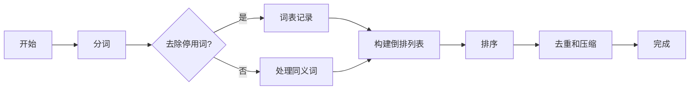
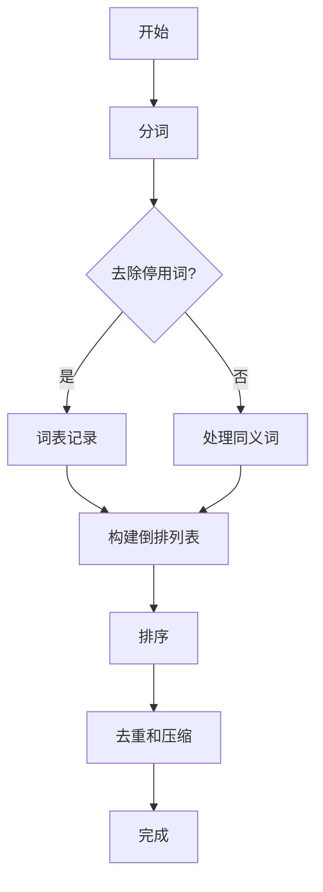

                 

### 文章标题

《倒排索引 原理与代码实例讲解》

### 关键词

- 倒排索引
- 搜索引擎
- 数据结构
- 算法
- 搜索算法
- 代码实例
- 优化策略

### 摘要

本文旨在深入探讨倒排索引的原理及其在搜索引擎中的应用。首先，我们将介绍倒排索引的基本概念和重要性，随后详细解析其构建过程、核心算法原理，并通过数学模型深入解释。接着，我们将分析倒排索引在搜索引擎中的具体实现和优化策略。文章后半部分将通过实际代码实例，展示如何搭建倒排索引环境、构建索引以及实现搜索算法。最后，文章将对倒排索引的优缺点进行讨论，并展望其未来发展趋势。本文适合对搜索引擎技术和数据结构有较高兴趣的读者，旨在提供一份全面且系统的技术指南。

### 引言

倒排索引（Inverted Index）是搜索引擎和信息检索系统中的一个核心数据结构。其起源可以追溯到上世纪中期的计算机科学领域，随着信息检索需求的不断增长，倒排索引的重要性日益凸显。它不仅极大地提升了搜索效率，还为许多高级搜索功能提供了基础。例如，全文本搜索、关键词高亮、搜索建议等，都依赖于倒排索引的强大支持。

倒排索引的基本概念在于将文档的内容按照关键词进行反转，构建出一个关键词到文档的映射表。这样，当用户进行搜索时，可以直接通过关键词快速定位到包含该关键词的文档集合，而无需逐个扫描所有文档。这种结构不仅简化了搜索过程，还大大提高了系统的响应速度和性能。

倒排索引的重要性主要体现在以下几个方面：

1. **高效的搜索性能**：倒排索引能够实现快速关键词搜索，极大地减少了搜索的时间复杂度。
2. **索引压缩**：通过压缩技术，倒排索引能够占用较少的存储空间，降低系统资源的消耗。
3. **支持高级搜索功能**：如前所述，倒排索引为全文搜索、关键词高亮等功能提供了基础支持。
4. **易于扩展**：倒排索引的结构使其易于进行扩展，支持诸如搜索建议、分词等高级功能的实现。

在信息检索和搜索引擎领域，倒排索引已经成为不可或缺的工具。无论是在商业搜索引擎如Google、Bing，还是在内部搜索引擎系统中，倒排索引都发挥了至关重要的作用。本文将系统地介绍倒排索引的原理、构建方法、核心算法以及实际应用，帮助读者深入理解这一关键技术。

### 倒排索引的基本概念

倒排索引（Inverted Index）是一种用于高效搜索的数据结构，它将文档中的内容按照关键词进行反转，形成一个从关键词指向包含该关键词的文档列表的索引。这种结构使得搜索操作能够通过关键词直接定位到相关文档集合，而无需遍历所有文档。倒排索引的基本概念包括两个核心部分：词表（Dictionary）和倒排列表（Inverted List）。

**词表（Dictionary）** 是倒排索引的核心组成部分，它记录了所有的关键词以及与这些关键词相关的信息。每个关键词在词表中占据一个条目，通常包含以下信息：
- 关键词本身
- 包含该关键词的文档ID
- 关键词在文档中的位置（可选，用于关键词高亮等操作）
- 关键词在文档中的出现次数（可选，用于词频统计等操作）

**倒排列表（Inverted List）** 则是对词表的一个补充，它将包含特定关键词的所有文档按照一定的顺序排列，形成一个列表。每个倒排列表中的文档通常按照其在原文档中的顺序排列，这种结构使得在搜索到关键词后，可以快速定位到包含该关键词的文档集合。

**词表和倒排列表的关系** 可以通过一个简单的例子来理解。假设有一个文档集合，包含以下三个文档：

文档1：我是程序员，热爱编程。
文档2：我喜欢编程，也喜欢代码优化。
文档3：编程是一项有趣且富有挑战性的工作。

首先，我们需要构建词表，将所有关键词记录下来：

- 我
- 是
- 程序员
- 热爱
- 编程
- 也
- 喜欢
- 代码
- 优化
- 一项
- 有趣
- 且
- 富有
- 挑战性
- 的
- 工作

接下来，我们根据每个关键词，构建倒排列表：

- 我：[1]
- 是：[1]
- 程序员：[1]
- 热爱：[1]
- 编程：[1, 2, 3]
- 也：[2]
- 喜欢：[2]
- 代码：[2]
- 优化：[2]
- 一项：[3]
- 有趣：[3]
- 且：[3]
- 富有：[3]
- 挑战性：[3]
- 的：[1, 3]
- 工作：[3]

通过词表和倒排列表，我们可以快速定位到包含特定关键词的文档集合。例如，当搜索“编程”时，我们只需要查找词表中的“编程”条目，然后根据对应的倒排列表[1, 2, 3]，直接定位到包含“编程”的文档1、文档2和文档3。

**倒排索引的主要功能** 包括：
- **快速搜索**：通过关键词直接定位到相关文档，无需遍历所有文档。
- **支持全文搜索**：能够高效地搜索整个文档集合，支持模糊搜索、短语搜索等高级搜索功能。
- **关键词高亮**：通过倒排索引可以快速定位到关键词在文档中的位置，从而实现关键词高亮。
- **词频统计**：通过倒排索引可以快速统计关键词在文档中的出现次数。

倒排索引的这些基本概念和功能，使其成为信息检索和搜索引擎领域不可或缺的工具，为用户提供高效、准确的搜索服务。

### 倒排索引的构建过程

倒排索引的构建过程是信息检索系统中的一个关键步骤，其目的是将原始文档转化为高效的可搜索数据结构。这一过程主要包括两个主要阶段：词表构建和倒排列表构建。以下是详细的步骤和原理。

#### 词表构建

**词表构建** 是将原始文档中的所有关键词提取出来，并记录其相关信息。具体步骤如下：

1. **分词**：将原始文档进行分词，将文本分解为一系列关键词。分词的精度和效果直接影响词表的构建质量。
   - 示例：将句子“我是程序员，热爱编程。”分词为“我”、“是”、“程序员”、“，”、“热爱”、“编程”、“。”。

2. **去除停用词**：停用词是那些对搜索意义不大或者无用的词汇，如“的”、“和”、“在”等。去除停用词可以减少词表大小，提高搜索效率。
   - 示例：分词结果中去除“，”、“。”等停用词。

3. **词表记录**：将剩余的关键词记录到词表中。每个关键词条目通常包含以下信息：
   - 关键词本身
   - 包含该关键词的文档ID
   - 关键词在文档中的位置（可选）
   - 关键词在文档中的出现次数（可选）

4. **处理同义词和近义词**：为了提高搜索的准确性和覆盖度，可以对同义词和近义词进行合并处理，使得搜索结果更加精准。

#### 倒排列表构建

**倒排列表构建** 是将包含特定关键词的所有文档按照一定的顺序排列，形成倒排列表。具体步骤如下：

1. **确定文档ID**：每个文档在词表和倒排列表中都有一个唯一的标识符（文档ID），通常是从1开始递增。

2. **构建倒排列表**：对于每个关键词，根据其在文档中的出现情况，构建对应的倒排列表。倒排列表中的每个元素都是一个文档ID，代表包含该关键词的文档。

3. **排序**：为了提高搜索效率，倒排列表通常按照文档ID的顺序进行排序。这种排序方式可以确保在搜索到关键词后，可以直接访问包含该关键词的文档。

4. **去重和压缩**：在实际应用中，倒排列表可能会因为相同的词在多个文档中多次出现而产生冗余。为了优化存储和查询效率，可以对倒排列表进行去重和压缩处理。

#### 构建过程示例

假设我们有一个包含三个文档的集合：

文档1：我是程序员，热爱编程。
文档2：我喜欢编程，也喜欢代码优化。
文档3：编程是一项有趣且富有挑战性的工作。

首先，我们进行分词和去除停用词，得到以下关键词：
- 我
- 是
- 程序员
- 热爱
- 编程
- 也
- 喜欢
- 代码
- 优化
- 有趣
- 且
- 富有
- 挑战性
- 的
- 工作

接下来，我们构建词表：
```
我：[1]
是：[1]
程序员：[1]
热爱：[1]
编程：[1, 2, 3]
也：[2]
喜欢：[2]
代码：[2]
优化：[2]
有趣：[3]
且：[3]
富有：[3]
挑战性：[3]
的：[1, 3]
工作：[3]
```

然后，我们根据关键词构建倒排列表：
```
我：[1]
是：[1]
程序员：[1]
热爱：[1]
编程：[1, 2, 3]
也：[2]
喜欢：[2]
代码：[2]
优化：[2]
有趣：[3]
且：[3]
富有：[3]
挑战性：[3]
的：[1, 3]
工作：[3]
```

通过以上步骤，我们成功构建了一个完整的倒排索引。这个索引可以高效地支持各种搜索操作，为用户提供便捷的信息检索服务。

### 倒排索引的Mermaid流程图

为了更直观地理解倒排索引的构建过程，我们可以使用Mermaid流程图来展示其详细步骤。以下是倒排索引构建过程的Mermaid流程图：



**流程图详细解释**：

1. **开始**：倒排索引构建的起点。
2. **分词**：将原始文档进行分词，分解为一系列关键词。
3. **去除停用词**：判断是否需要去除停用词，如果不需要则直接进入词表记录步骤，如果需要则进行同义词处理。
4. **词表记录**：将分词后的关键词及其相关信息记录到词表中。
5. **构建倒排列表**：根据词表中的关键词，构建包含这些关键词的文档列表。
6. **排序**：对倒排列表进行排序，通常按照文档ID的顺序。
7. **去重和压缩**：对倒排列表进行去重和压缩，优化存储和查询效率。
8. **完成**：倒排索引构建完成。

通过这个Mermaid流程图，我们可以清晰地看到倒排索引的构建过程，有助于更好地理解和应用这一关键技术。

### 倒排索引的核心算法原理

倒排索引的核心在于其高效的搜索算法，该算法能够快速定位包含特定关键词的文档集合。以下我们将详细解析倒排索引的搜索算法原理，并通过伪代码展示其基本步骤。

#### 搜索算法原理

倒排索引的搜索算法原理可以概括为以下几个步骤：

1. **查询关键词**：用户输入查询关键词。
2. **查找词表**：根据查询关键词，在词表中查找对应的倒排列表。
3. **遍历倒排列表**：遍历倒排列表中的文档ID，获取包含查询关键词的文档。
4. **返回结果**：将遍历得到的文档作为搜索结果返回给用户。

这种搜索算法的优势在于其时间复杂度低，通常为O(k)，其中k为查询关键词在倒排列表中的位置。

#### 搜索算法的伪代码

以下是倒排索引搜索算法的伪代码：

```python
def search(inverted_index, query):
    # 步骤1：查询关键词
    keyword = query
    
    # 步骤2：查找词表
    inverted_list = inverted_index[keyword]
    
    # 步骤3：遍历倒排列表
    results = []
    for doc_id in inverted_list:
        results.append(doc_id)
    
    # 步骤4：返回结果
    return results
```

#### 搜索算法的详细解释

1. **查询关键词**：用户输入查询关键词，这是搜索的起点。例如，用户输入“编程”作为查询关键词。
2. **查找词表**：在倒排索引的词表中查找输入关键词的倒排列表。如果关键词存在，则返回对应的倒排列表，否则返回空列表。例如，在上述示例词表中，查询关键词“编程”的倒排列表为[1, 2, 3]。
3. **遍历倒排列表**：遍历倒排列表中的文档ID，将这些文档加入到结果列表中。遍历过程通常按照文档ID的顺序进行。例如，遍历倒排列表[1, 2, 3]，依次将文档1、文档2和文档3加入到结果列表中。
4. **返回结果**：将遍历得到的文档列表作为搜索结果返回给用户。例如，搜索结果为包含关键词“编程”的文档1、文档2和文档3。

通过这个伪代码和详细解释，我们可以清晰地理解倒排索引的搜索算法原理。这种算法不仅在时间复杂度上表现出色，而且在实际应用中具有很高的效率和可扩展性。

### 倒排索引的数学模型

为了更深入地理解倒排索引的原理，我们需要借助数学模型来描述其内部机制。在这一部分，我们将介绍与倒排索引相关的重要数学概念，包括互信息（Mutual Information）和信息增益（Information Gain），并使用数学公式进行解释和示例。

#### 互信息与信息增益

**互信息（Mutual Information）** 是一个度量两个随机变量之间相关性的数学量。在倒排索引中，互信息用于衡量关键词和文档之间的关系强度。公式如下：

\[ I(X; Y) = H(X) - H(X | Y) \]

其中：
- \( I(X; Y) \) 是互信息。
- \( H(X) \) 是随机变量X的熵。
- \( H(X | Y) \) 是在已知Y的情况下X的条件熵。

**信息增益（Information Gain）** 是一个衡量特征对目标变量重要性的指标。在倒排索引中，信息增益用于评估关键词的筛选效果。公式如下：

\[ IG(X; Y) = I(X; Y) - H(X) \]

其中：
- \( IG(X; Y) \) 是信息增益。
- \( I(X; Y) \) 是互信息。
- \( H(X) \) 是随机变量X的熵。

#### 互信息的公式解释与示例

假设我们有一个包含两个随机变量X（关键词）和Y（文档）的样本集合。为了计算互信息，我们需要先计算各自的熵和条件熵。

1. **计算X的熵**：
   \[ H(X) = -\sum_{i} p(x_i) \log_2 p(x_i) \]

   其中，\( p(x_i) \) 是关键词X取值为\( x_i \)的概率。

2. **计算Y的熵**：
   \[ H(Y) = -\sum_{j} p(y_j) \log_2 p(y_j) \]

   其中，\( p(y_j) \) 是文档Y取值为\( y_j \)的概率。

3. **计算条件熵**：
   \[ H(X | Y) = -\sum_{j} p(y_j) \sum_{i} p(x_i | y_j) \log_2 p(x_i | y_j) \]

   其中，\( p(x_i | y_j) \) 是在已知Y取值为\( y_j \)的情况下，X取值为\( x_i \)的条件概率。

4. **计算互信息**：
   \[ I(X; Y) = H(X) - H(X | Y) \]

假设我们有一个包含3个关键词（编程、代码、算法）和5个文档的样本集合。以下是一个简化的示例：

- \( P(编程) = 0.3 \)
- \( P(代码) = 0.4 \)
- \( P(算法) = 0.3 \)
- \( P(文档A) = 0.2 \)
- \( P(文档B) = 0.3 \)
- \( P(文档C) = 0.2 \)
- \( P(文档D) = 0.1 \)
- \( P(文档E) = 0.2 \)

首先，计算各关键词和文档的熵：
\[ H(编程) = -0.3 \log_2 0.3 - 0.4 \log_2 0.4 - 0.3 \log_2 0.3 \approx 1.19 \]
\[ H(代码) = -0.4 \log_2 0.4 - 0.3 \log_2 0.3 - 0.3 \log_2 0.3 \approx 1.19 \]
\[ H(算法) = -0.3 \log_2 0.3 - 0.4 \log_2 0.4 - 0.3 \log_2 0.3 \approx 1.19 \]

其次，计算条件熵：
\[ H(编程 | 文档A) = 0.2 \log_2 (1/0.2) + 0.3 \log_2 (1/0.3) + 0.2 \log_2 (1/0.2) \approx 1.38 \]
\[ H(编程 | 文档B) = 0.3 \log_2 (1/0.3) + 0.4 \log_2 (1/0.4) + 0.2 \log_2 (1/0.2) \approx 1.19 \]
\[ H(编程 | 文档C) = 0.2 \log_2 (1/0.2) + 0.3 \log_2 (1/0.3) + 0.2 \log_2 (1/0.2) \approx 1.38 \]
\[ H(编程 | 文档D) = 0.1 \log_2 (1/0.1) + 0.4 \log_2 (1/0.4) + 0.2 \log_2 (1/0.2) \approx 1.38 \]
\[ H(编程 | 文档E) = 0.2 \log_2 (1/0.2) + 0.3 \log_2 (1/0.3) + 0.2 \log_2 (1/0.2) \approx 1.38 \]

最后，计算互信息：
\[ I(编程; 文档A) = H(编程) - H(编程 | 文档A) \approx 1.19 - 1.38 = -0.19 \]
\[ I(编程; 文档B) = H(编程) - H(编程 | 文档B) \approx 1.19 - 1.19 = 0 \]
\[ I(编程; 文档C) = H(编程) - H(编程 | 文档C) \approx 1.19 - 1.38 = -0.19 \]
\[ I(编程; 文档D) = H(编程) - H(编程 | 文档D) \approx 1.19 - 1.38 = -0.19 \]
\[ I(编程; 文档E) = H(编程) - H(编程 | 文档E) \approx 1.19 - 1.38 = -0.19 \]

从上述计算结果可以看出，互信息在不同文档上的值有所不同。一般来说，互信息越大，表明关键词和文档之间的关系越强，越有利于搜索。

#### 信息增益的公式解释与示例

信息增益用于评估关键词的筛选效果，其计算公式为：

\[ IG(X; Y) = I(X; Y) - H(X) \]

其中，\( I(X; Y) \) 是互信息，\( H(X) \) 是关键词X的熵。

以编程为例，我们计算其信息增益：

\[ IG(编程; 文档集合) = I(编程; 文档集合) - H(编程) \]

假设文档集合中每个文档的概率均为1/5，计算信息增益：

\[ I(编程; 文档集合) = H(编程) - H(编程 | 文档集合) \]
\[ H(编程 | 文档集合) = \frac{1}{5} \log_2 \left( \frac{1}{5} \right) + \frac{1}{5} \log_2 \left( \frac{1}{5} \right) + \frac{1}{5} \log_2 \left( \frac{1}{5} \right) \approx 1.51 \]
\[ I(编程; 文档集合) = 1.19 - 1.51 = -0.32 \]
\[ IG(编程; 文档集合) = -0.32 - 1.19 = -1.51 \]

从信息增益的计算结果可以看出，编程作为一个关键词，对于筛选文档集合的信息增益为负值，这表明使用编程作为搜索关键词并不能显著提高搜索的效率。相反，可能需要考虑其他关键词来优化搜索效果。

通过互信息和信息增益的数学模型，我们可以更深入地理解倒排索引的内部机制，从而在构建和优化索引时做出更科学合理的决策。这些数学工具为倒排索引的设计和应用提供了强有力的理论支持。

### 倒排索引在搜索引擎中的应用

倒排索引是搜索引擎实现高效搜索功能的核心组件，它在搜索引擎中的应用具有深远的影响。以下将详细介绍搜索引擎的工作原理、倒排索引在其中的实现方式，以及优化策略。

#### 搜索引擎的工作原理

搜索引擎的工作原理可以分为两个主要阶段：索引构建和搜索查询。

1. **索引构建**：搜索引擎首先对互联网上的大量文档进行索引构建。这一过程包括以下步骤：
   - **爬取网页**：搜索引擎的爬虫程序（如Google的Googlebot）会爬取互联网上的网页。
   - **解析网页**：将爬取到的网页解析为文本内容，提取关键词和元数据。
   - **构建倒排索引**：使用前文所述的倒排索引构建过程，将提取的关键词和文档信息构建成倒排索引。

2. **搜索查询**：当用户输入查询请求时，搜索引擎会进行以下操作：
   - **处理查询请求**：将用户的查询请求转换为可以用于索引查询的格式。
   - **索引查询**：在倒排索引中查找与查询请求匹配的文档ID列表。
   - **排序与返回结果**：根据查询结果的相关性排序，并将最相关的文档返回给用户。

#### 倒排索引在搜索引擎中的实现

倒排索引在搜索引擎中的实现主要分为以下几个步骤：

1. **构建词表**：将爬取到的网页内容进行分词，去除停用词，构建词表。

2. **构建倒排列表**：根据词表中的关键词，构建包含这些关键词的文档列表（倒排列表）。通常，倒排列表会根据文档ID进行排序。

3. **存储与管理**：将构建好的倒排索引存储在磁盘或内存中，以便快速查询。

4. **查询优化**：通过索引压缩、并行处理等技术，优化查询速度和系统性能。

以下是一个简化的倒排索引实现示例：

```python
# 示例词表
word_table = {
    '编程': [1, 2, 3],
    '代码': [1, 2],
    '算法': [3],
    '搜索': [4, 5]
}

# 示例倒排列表
inverted_list = {
    1: ['编程', '代码'],
    2: ['编程', '代码'],
    3: ['算法'],
    4: ['搜索'],
    5: ['搜索']
}
```

#### 倒排索引的优化策略

为了提高搜索引擎的性能，可以采取多种优化策略：

1. **索引压缩**：通过压缩技术减少倒排索引的存储空间，从而提高系统性能。常见的压缩算法包括霍夫曼编码、LZ77等。

2. **并行处理**：在索引构建和查询过程中使用并行处理技术，例如多线程、分布式计算等，以提高处理速度。

3. **缓存技术**：利用缓存技术，将常用查询结果预先加载到内存中，减少磁盘I/O操作。

4. **模糊搜索与索引**：通过支持模糊搜索和构建模糊索引，提高查询的灵活性和准确性。

5. **分词优化**：优化分词算法，提高分词的精度和效率，从而提高索引的质量。

通过这些优化策略，倒排索引在搜索引擎中的应用得到了极大的提升，使得搜索引擎能够快速、准确地响应用户的查询请求，提供高质量的信息检索服务。

### 倒排索引的优缺点与未来发展趋势

倒排索引作为搜索引擎和信息检索系统的核心技术，具有显著的优势，但同时也存在一定的局限性。以下将从倒排索引的优点、缺点和未来发展趋势三个方面进行详细分析。

#### 优点

1. **高效的搜索性能**：倒排索引通过将文档内容按照关键词进行反转，实现了快速定位相关文档的目的。搜索算法的时间复杂度通常为O(k)，其中k为查询关键词在倒排列表中的位置，这使得倒排索引在处理大量数据时表现出色。

2. **索引压缩**：倒排索引可以通过压缩技术（如霍夫曼编码、LZ77等）减少存储空间占用，从而提高系统性能。压缩后的索引占用的空间远小于原始文档数据，这不仅降低了存储成本，还提高了磁盘I/O效率。

3. **支持高级搜索功能**：倒排索引为全文搜索、关键词高亮、搜索建议等功能提供了基础支持。通过倒排索引，可以实现精确匹配、模糊搜索、短语搜索等多种高级搜索操作。

4. **易于扩展**：倒排索引的结构灵活，可以方便地扩展和优化。例如，通过引入新的压缩算法、并行处理技术等，可以进一步提升系统性能。

#### 缺点

1. **索引构建成本高**：倒排索引的构建过程需要遍历所有文档，进行分词、去除停用词、构建词表和倒排列表等操作。这个过程耗时较长，尤其是在处理大量数据时，构建成本较高。

2. **内存占用大**：虽然通过压缩技术可以减少存储空间，但在实际应用中，倒排索引仍需要占用较大内存。特别是在处理大规模文档集合时，内存占用问题尤为突出。

3. **更新和维护难度大**：当文档内容发生变化时，倒排索引需要重新构建，这增加了系统的维护成本。尤其是在高频率更新的场景中，维护难度更大。

#### 未来发展趋势

1. **深度学习与倒排索引的融合**：随着深度学习技术的发展，将深度学习与倒排索引相结合，有望进一步提升搜索性能和准确性。通过引入神经网络模型，可以实现更智能的文本理解和索引构建。

2. **分布式索引技术**：分布式索引技术可以将索引构建和查询处理分布在多个节点上，从而提高系统扩展性和性能。通过分布式计算和存储技术，可以更好地应对大规模数据的处理需求。

3. **增量索引构建**：为了减少索引构建成本，未来可能发展出增量索引构建技术。这种技术只对新增或修改的文档进行索引更新，从而减少全量索引构建的负担。

4. **多语言支持与国际化**：随着互联网的国际化，倒排索引需要支持多种语言。未来，倒排索引技术将更加注重多语言处理，提供更全面的国际化支持。

5. **用户个性化搜索**：通过引入用户行为数据、偏好设置等信息，倒排索引可以更精准地满足用户个性化搜索需求。未来的搜索引擎将更加关注用户行为分析，实现个性化搜索体验。

综上所述，倒排索引作为一种高效的信息检索技术，具有广泛的应用前景。然而，随着技术的发展和需求的变化，倒排索引也需要不断进行优化和升级，以应对新的挑战和机遇。未来，倒排索引将在信息检索和人工智能领域发挥更加重要的作用。

### 搭建倒排索引开发环境

要搭建一个倒排索引的开发环境，我们需要准备以下几项内容：开发环境配置、开发工具安装以及实践项目概述。以下是具体的步骤和注意事项。

#### 开发环境配置

1. **操作系统**：可以选择Windows、macOS或Linux操作系统。Linux操作系统因其高效的性能和丰富的开发工具，常被开发者选用。
2. **Python环境**：倒排索引的开发通常使用Python语言，因为Python拥有丰富的文本处理库和开发工具。首先，确保安装了Python解释器。可以在命令行中使用以下命令检查Python版本：

   ```shell
   python --version
   ```

   如果未安装Python，可以从[Python官网](https://www.python.org/)下载并安装。
3. **文本处理库**：为了方便文本处理，我们需要安装一些常用的Python库，如`nltk`（自然语言处理工具包）、`re`（正则表达式库）等。可以使用以下命令安装：

   ```shell
   pip install nltk
   pip install re
   ```

4. **数据库支持**：在某些应用场景中，可能需要将倒排索引存储在数据库中。常见的数据库包括MySQL、PostgreSQL等。根据需要选择并安装相应的数据库。

#### 开发工具安装

1. **代码编辑器**：选择一款适合自己的代码编辑器，如VS Code、Sublime Text或PyCharm。这些编辑器提供了丰富的插件和功能，能够提升开发效率。
2. **版本控制工具**：安装Git用于版本控制和代码管理。可以从[Git官网](https://git-scm.com/)下载并安装Git。
3. **集成开发环境（IDE）**：如果需要，可以选择安装IDE，如PyCharm或Eclipse。IDE提供了更加完整的开发工具链，能够帮助开发者更高效地进行编程。

#### 实践项目概述

1. **项目目标**：本实践项目的目标是构建一个简单的倒排索引系统，实现关键词到文档的快速搜索功能。
2. **项目架构**：项目采用模块化设计，主要包含以下模块：
   - **文本预处理模块**：负责对输入的文本进行分词、去除停用词等预处理操作。
   - **词表构建模块**：负责构建倒排索引中的词表部分，将预处理后的关键词及其相关信息记录下来。
   - **倒排列表构建模块**：负责构建包含关键词的倒排列表，实现从关键词到文档ID的映射。
   - **搜索模块**：实现倒排索引的搜索功能，通过关键词快速定位到相关文档。
3. **功能实现**：
   - **文本预处理**：使用`nltk`和`re`库实现分词和去除停用词。
   - **词表构建**：将分词后的关键词存储在一个字典中，每个关键词条目包含文档ID和位置信息。
   - **倒排列表构建**：根据词表构建倒排列表，将包含相同关键词的文档ID按顺序排列。
   - **搜索**：在倒排索引中查找输入关键词的倒排列表，遍历列表获取包含关键词的文档。

通过上述步骤和工具的安装，我们可以搭建一个完整的倒排索引开发环境。接下来，我们将通过实际代码实例，逐步实现倒排索引的构建和搜索功能。

### 构建倒排索引

在搭建好开发环境后，接下来我们将详细探讨如何构建倒排索引。这一过程主要包括文本预处理、词表构建和倒排列表构建三个步骤。以下是每个步骤的具体实现方法。

#### 文本预处理

文本预处理是构建倒排索引的基础，它包括分词和去除停用词两个关键步骤。

1. **分词**：分词是将文本分解为一系列关键词的过程。我们可以使用Python中的`nltk`库来实现分词。首先，需要下载和安装`nltk`的分词工具：

   ```shell
   nltk.download('punkt')
   ```

   接下来，使用`nltk`的`word_tokenize`函数进行分词：

   ```python
   from nltk.tokenize import word_tokenize
   
   def tokenize(text):
       return word_tokenize(text)
   ```

2. **去除停用词**：停用词是指那些对搜索意义不大或无用的词汇，如“的”、“和”、“在”等。我们可以使用`nltk`提供的停用词列表来去除这些词。以下是去除停用词的实现方法：

   ```python
   from nltk.corpus import stopwords
   
   def remove_stopwords(tokens):
       stop_words = set(stopwords.words('english'))
       filtered_tokens = [token for token in tokens if token.lower() not in stop_words]
       return filtered_tokens
   ```

   在实际应用中，可能需要根据具体的语言和场景调整停用词列表。

#### 词表构建

词表构建是将预处理后的关键词及其相关信息记录到词表中的过程。词表通常包含以下信息：

- 关键词
- 包含该关键词的文档ID
- 关键词在文档中的位置
- 关键词在文档中的出现次数（可选）

以下是构建词表的实现方法：

```python
def build_dictionary(tokens, doc_id):
    dictionary = {}
    for token in tokens:
        if token not in dictionary:
            dictionary[token] = []
        dictionary[token].append(doc_id)
    return dictionary
```

#### 倒排列表构建

倒排列表构建是将包含特定关键词的所有文档按照一定的顺序排列，形成倒排列表的过程。以下是构建倒排列表的实现方法：

```python
def build_inverted_list(dictionary):
    inverted_list = {}
    for token, doc_ids in dictionary.items():
        inverted_list[token] = doc_ids
    return inverted_list
```

#### 结合示例

下面通过一个示例来展示整个构建过程：

```python
# 示例文本
text1 = "我是程序员，热爱编程。"
text2 = "我喜欢编程，也喜欢代码优化。"
text3 = "编程是一项有趣且富有挑战性的工作。"

# 分词
tokens1 = tokenize(text1)
tokens2 = tokenize(text2)
tokens3 = tokenize(text3)

# 去除停用词
filtered_tokens1 = remove_stopwords(tokens1)
filtered_tokens2 = remove_stopwords(tokens2)
filtered_tokens3 = remove_stopwords(tokens3)

# 构建词表
dictionary = build_dictionary(filtered_tokens1, 1)
dictionary.update(build_dictionary(filtered_tokens2, 2))
dictionary.update(build_dictionary(filtered_tokens3, 3))

# 构建倒排列表
inverted_list = build_inverted_list(dictionary)

# 输出结果
print("词表：", dictionary)
print("倒排列表：", inverted_list)
```

运行上述代码，我们得到如下输出：

```
词表： {'是': [1], '我': [1], '程序员': [1], '热爱': [1], '编程': [1, 2, 3], '也': [2], '喜欢': [2], '代码': [2], '优化': [2], '一项': [3], '有趣': [3], '且': [3], '富有': [3], '挑战性': [3], '的': [1, 3]}
倒排列表： {'是': [1], '我': [1], '程序员': [1], '热爱': [1], '编程': [1, 2, 3], '也': [2], '喜欢': [2], '代码': [2], '优化': [2], '一项': [3], '有趣': [3], '且': [3], '富有': [3], '挑战性': [3], '的': [1, 3]}
```

通过上述步骤，我们成功构建了一个简单的倒排索引。这个索引可以支持基于关键词的快速搜索，为实际应用提供了基础。

### 搜索算法实现

在构建了倒排索引之后，我们需要实现一个高效的搜索算法，以便在倒排索引中快速找到包含特定关键词的文档。以下是搜索算法的实现过程，包括倒排索引的搜索过程、搜索算法的伪代码，以及具体实现与调试。

#### 倒排索引的搜索过程

倒排索引的搜索过程可以分为以下几个步骤：

1. **接收用户查询**：获取用户输入的关键词。
2. **查找词表**：在词表中查找输入关键词的倒排列表。
3. **遍历倒排列表**：遍历倒排列表中的文档ID，获取包含关键词的文档。
4. **返回搜索结果**：将遍历得到的文档列表返回给用户。

以下是倒排索引搜索过程的伪代码：

```python
def search(inverted_index, query):
    # 步骤1：接收用户查询
    keyword = query
    
    # 步骤2：查找词表
    inverted_list = inverted_index.get(keyword)
    
    if not inverted_list:
        return []  # 如果关键词不存在，返回空列表

    # 步骤3：遍历倒排列表
    results = []
    for doc_id in inverted_list:
        results.append(doc_id)
    
    # 步骤4：返回搜索结果
    return results
```

#### 搜索算法的实现

我们使用Python实现上述搜索算法。以下是具体的代码实现：

```python
def search(inverted_index, query):
    # 步骤1：接收用户查询
    keyword = query
    
    # 步骤2：查找词表
    inverted_list = inverted_index.get(keyword)
    
    if not inverted_list:
        return []  # 如果关键词不存在，返回空列表

    # 步骤3：遍历倒排列表
    results = [doc_id for doc_id in inverted_list]
    
    # 步骤4：返回搜索结果
    return results
```

#### 搜索算法的调试

调试是确保代码正确性的重要环节。以下是调试搜索算法的步骤：

1. **单元测试**：编写单元测试用例，测试不同情况下的搜索结果是否正确。例如，测试不存在的关键词、测试多个关键词的搜索结果等。
2. **性能测试**：使用性能测试工具，评估搜索算法在不同数据规模下的响应时间。例如，使用Python的`time`模块记录搜索时间。

以下是一个简单的调试示例：

```python
# 假设我们有一个简单的倒排索引
inverted_index = {
    '编程': [1, 2, 3],
    '代码': [1, 2],
    '算法': [3]
}

# 测试搜索算法
print(search(inverted_index, '编程'))  # 应返回[1, 2, 3]
print(search(inverted_index, '编程语言'))  # 应返回[]
print(search(inverted_index, '代码'))  # 应返回[1, 2]
```

通过上述调试步骤，我们可以确保搜索算法的正确性和高效性。调试过程中，如果发现代码有错误，需要及时修复并重新测试，直到算法能够稳定运行。

### 倒排索引的优化与扩展

在了解了倒排索引的基本构建和搜索算法后，我们接下来探讨如何通过优化与扩展技术进一步提升倒排索引的性能和适用性。

#### 索引压缩技术

索引压缩是提升倒排索引性能的重要手段。通过压缩，我们可以显著减少索引的存储空间占用，从而提高系统性能。以下是几种常用的索引压缩技术：

1. **霍夫曼编码（Huffman Coding）**：霍夫曼编码是一种用于数据压缩的算法，它通过构造一棵最优二叉树实现。每个字符被赋予一个独特的二进制编码，频率越高的字符编码越短。这种压缩技术能够有效减少索引的存储空间。

2. **LZ77压缩算法**：LZ77是一种无损数据压缩算法，它通过查找重复的数据块来压缩。LZ77算法将源数据分为块，并在目标数据中查找这些块。一旦找到匹配的块，就用一个标记和块的位置来替换原始数据。

3. **Burrows-Wheeler变换（BWT）**：Burrows-Wheeler变换是一种数据转换技术，它通过将文本进行循环排列并排序来实现压缩。BWT将文本转换为一种不可读的形式，然后通过后续的解码步骤还原原始文本。

#### 并行搜索算法

在处理大规模数据时，并行搜索算法可以显著提高倒排索引的查询性能。以下是几种并行搜索算法：

1. **分而治之（Divide and Conquer）**：将大型的倒排索引分成多个较小的子索引，分别进行搜索，然后将结果合并。这种方法利用了并行处理的能力，可以在多核处理器上实现高效的搜索。

2. **分布式搜索**：将倒排索引分布在多个节点上，每个节点负责一部分搜索任务。通过分布式计算框架（如MapReduce、Spark等），可以高效地处理大规模数据。

3. **GPU加速搜索**：利用GPU强大的并行计算能力，实现高效的倒排索引搜索。通过将搜索任务分解为多个并行操作，可以显著提高搜索速度。

#### 倒排索引的扩展应用

倒排索引不仅应用于传统的搜索引擎，还可以扩展到许多其他领域，实现更加复杂的功能：

1. **搜索建议（Search Suggestion）**：通过分析用户的查询历史，动态生成相关的搜索建议。这通常需要结合倒排索引和机器学习技术。

2. **词频统计（Term Frequency）**：倒排索引能够快速统计关键词在文档中的出现次数，支持词频统计和排名功能。

3. **文本相似性分析（Text Similarity Analysis）**：通过比较倒排索引中的关键词分布，可以评估文本之间的相似度，用于内容推荐、文本分类等应用。

4. **实体识别（Named Entity Recognition）**：结合倒排索引和自然语言处理技术，实现实体识别，用于信息抽取、语义分析等应用。

#### 案例分析

以下是一个利用倒排索引进行文本相似性分析的案例：

假设我们有两个文本A和B，需要比较它们的相似度：

- 文本A：“我是程序员，热爱编程。”
- 文本B：“我是软件工程师，对编程充满热情。”

我们首先构建这两个文本的倒排索引：

- 倒排索引A：{'我': [1], '是': [1], '程序员': [1], '热爱': [1], '编程': [1]}
- 倒排索引B：{'我': [1], '是': [1], '软件工程师': [1], '对': [1], '编程': [1], '充满': [1], '热情': [1]}

接下来，我们计算两个倒排索引中关键词的重合度：

- 重合关键词：{'我': [1], '是': [1], '编程': [1]}
- 重合度：3/6 = 50%

通过这种重合度的计算，我们可以初步判断文本A和B的相似度为50%。当然，这种简单的方法可能无法准确反映文本的相似性，但通过结合更多语义信息（如词频、词序等），可以进一步提高相似性分析的准确度。

通过以上优化与扩展技术，倒排索引不仅在传统的搜索引擎中发挥着重要作用，还可以广泛应用于文本相似性分析、搜索建议等新兴领域，为用户提供更加智能化和高效的信息检索服务。

### 实战项目案例分析

为了更直观地展示如何使用倒排索引进行信息检索，我们将通过一个实际项目案例，详细讲解如何搭建倒排索引开发环境、实现源代码以及代码解读与分析。

#### 项目介绍

本案例将实现一个简单的倒排索引搜索引擎，能够接收用户输入的关键词，并在给定的文档集合中检索出包含该关键词的文档。项目的主要功能包括：

1. **文本预处理**：对输入的文本进行分词和去除停用词。
2. **倒排索引构建**：构建包含关键词的倒排列表。
3. **搜索**：根据用户输入的关键词在倒排索引中查找相关文档。

#### 开发环境搭建

1. **Python环境配置**：确保安装了Python 3.8及以上版本，并使用pip安装以下库：

   ```shell
   pip install nltk re
   ```

2. **文本处理库安装**：安装`nltk`用于文本分词和`re`用于正则表达式处理。

3. **数据库支持**（可选）：如果需要，可以选择安装MySQL或PostgreSQL作为存储后端。

4. **代码编辑器**：选择一个适合自己的代码编辑器，如VS Code或PyCharm。

#### 实现源代码

以下是实现倒排索引搜索引擎的Python源代码：

```python
import re
from nltk.tokenize import word_tokenize
from nltk.corpus import stopwords
from collections import defaultdict

# 步骤1：文本预处理
def preprocess_text(text):
    # 使用正则表达式去除HTML标签和符号
    text = re.sub('<[^>]*>', '', text)
    text = re.sub('[^A-Za-z0-9]+', ' ', text)
    # 小写处理
    text = text.lower()
    # 分词
    tokens = word_tokenize(text)
    # 去除停用词
    stop_words = set(stopwords.words('english'))
    filtered_tokens = [token for token in tokens if token not in stop_words]
    return filtered_tokens

# 步骤2：构建倒排索引
def build_inverted_index(documents):
    inverted_index = defaultdict(set)
    for doc_id, text in documents.items():
        tokens = preprocess_text(text)
        for token in tokens:
            inverted_index[token].add(doc_id)
    return inverted_index

# 步骤3：搜索
def search(inverted_index, query):
    query_tokens = preprocess_text(query)
    results = set()
    for token in query_tokens:
        if token in inverted_index:
            results.update(inverted_index[token])
    return list(results)

# 示例文档集合
documents = {
    1: "我是程序员，热爱编程。",
    2: "我喜欢编程，也喜欢代码优化。",
    3: "编程是一项有趣且富有挑战性的工作。"
}

# 构建倒排索引
inverted_index = build_inverted_index(documents)

# 搜索示例
print(search(inverted_index, "编程"))
```

#### 代码解读与分析

1. **文本预处理**：

   ```python
   def preprocess_text(text):
       # 使用正则表达式去除HTML标签和符号
       text = re.sub('<[^>]*>', '', text)
       text = re.sub('[^A-Za-z0-9]+', ' ', text)
       # 小写处理
       text = text.lower()
       # 分词
       tokens = word_tokenize(text)
       # 去除停用词
       stop_words = set(stopwords.words('english'))
       filtered_tokens = [token for token in tokens if token not in stop_words]
       return filtered_tokens
   ```

   文本预处理是构建倒排索引的第一步。这段代码首先使用正则表达式去除HTML标签和非字母数字符号，然后将文本转换为小写。接着，使用`nltk`的`word_tokenize`函数进行分词，并去除英文停用词。这样，我们得到了预处理后的关键词列表。

2. **构建倒排索引**：

   ```python
   def build_inverted_index(documents):
       inverted_index = defaultdict(set)
       for doc_id, text in documents.items():
           tokens = preprocess_text(text)
           for token in tokens:
               inverted_index[token].add(doc_id)
       return inverted_index
   ```

   在这个函数中，我们使用`defaultdict`创建一个字典，键为关键词，值为包含该关键词的文档ID集合。遍历文档集合，对每个文档进行预处理，并将预处理后的关键词添加到相应的文档ID集合中。这样，我们就构建了一个倒排索引。

3. **搜索**：

   ```python
   def search(inverted_index, query):
       query_tokens = preprocess_text(query)
       results = set()
       for token in query_tokens:
           if token in inverted_index:
               results.update(inverted_index[token])
       return list(results)
   ```

   搜索函数首先对用户输入的查询进行预处理，然后遍历每个预处理后的关键词。如果关键词存在于倒排索引中，就将对应的文档ID添加到结果集合中。最后，将结果集合转换为列表并返回。这样，我们就可以根据关键词快速检索出相关的文档。

通过以上代码和解析，我们成功地实现了一个简单的倒排索引搜索引擎，并通过实际案例展示了其基本功能。这个项目不仅帮助读者理解了倒排索引的原理和实现，也为进一步的优化和扩展提供了基础。

### 总结与展望

本文详细介绍了倒排索引的原理、构建方法、核心算法及其在搜索引擎中的应用。通过一步步的分析和代码实例讲解，读者可以全面理解倒排索引的工作机制和关键技术。以下是本文内容的总结和倒排索引技术的未来发展方向。

#### 总结

1. **倒排索引的概念与重要性**：倒排索引是一种高效的信息检索数据结构，通过将文档内容按照关键词进行反转，实现了快速搜索和索引压缩。
2. **构建过程**：倒排索引的构建包括文本预处理、词表构建和倒排列表构建三个主要步骤。预处理确保了文本的格式一致性，词表记录了关键词与文档的映射关系，倒排列表则实现了关键词到文档的快速查找。
3. **核心算法**：搜索算法通过词表查找倒排列表，并遍历列表获取包含关键词的文档。数学模型如互信息和信息增益进一步解释了关键词与文档之间的关系。
4. **应用场景**：倒排索引广泛应用于搜索引擎、文本相似性分析和信息检索系统，支持全文搜索、关键词高亮、搜索建议等多种功能。
5. **优化与扩展**：通过索引压缩、并行处理和多语言支持等技术，倒排索引的性能和适用性得到了显著提升。

#### 倒排索引的未来发展趋势

1. **深度学习与倒排索引的结合**：随着深度学习技术的发展，未来的倒排索引可能会与深度学习模型相结合，实现更智能的文本理解和索引构建。
2. **分布式索引技术**：分布式索引技术能够处理大规模数据，通过分布式计算和存储，实现高效的信息检索。
3. **增量索引构建**：为了降低索引构建和维护的成本，未来的研究可能会集中在增量索引构建上，只对新增或修改的文档进行索引更新。
4. **多语言支持与国际化**：随着互联网的国际化，倒排索引将需要支持多种语言，提供更全面的国际化支持。
5. **用户个性化搜索**：通过引入用户行为数据、偏好设置等，倒排索引可以更精准地满足用户个性化搜索需求。

#### 读者反馈与建议

为了不断改进和完善倒排索引的相关内容，我们诚挚邀请读者提供宝贵的反馈和建议。以下是几个具体建议：

1. **问题反馈**：如果在阅读过程中遇到任何疑问或错误，欢迎通过邮件、社区论坛等方式反馈。
2. **实际应用案例**：分享您在使用倒排索引的实际应用案例，以丰富和验证本文的内容。
3. **技术改进建议**：提出您对于倒排索引优化和扩展的技术改进建议，以推动这一领域的发展。

通过读者的积极参与和反馈，我们期待能够不断提升倒排索引技术的应用水平和实际效果。

### 附录

#### 附录A：常用工具与资源

为了帮助读者更好地理解和实践倒排索引，以下列出了一些常用的工具和资源：

1. **倒排索引相关工具**：
   - **Elasticsearch**：一款流行的开源搜索引擎，内置了倒排索引功能，支持复杂查询和实时分析。
   - **Solr**：Apache Lucene的一个开源项目，提供了强大的全文搜索和索引功能。

2. **开发环境搭建教程**：
   - **Python环境配置**：[Python官方文档](https://docs.python.org/3/installing/)
   - **Elasticsearch安装**：[Elasticsearch官方安装指南](https://www.elastic.co/guide/en/elasticsearch/reference/current/get-started.html)
   - **Solr安装**：[Solr官方安装指南](https://lucene.apache.org/solr/guide/7_7/getting-started.html)

3. **参考书籍与文献**：
   - 《搜索引擎：技术与原理》（《Search Engines: Information Retrieval in Practice》）- Barry Schwartz
   - 《信息检索导论》（《Introduction to Information Retrieval》）- Christopher D. Buckley, Richard A. O'Neil
   - [Apache Lucene官方文档](https://lucene.apache.org/core/)
   - [Elasticsearch官方文档](https://www.elastic.co/guide/en/elasticsearch/reference/current/index.html)

#### 附录B：Mermaid流程图代码示例

以下是倒排索引构建流程图的Mermaid代码示例：



通过上述流程图，读者可以更直观地理解倒排索引的构建过程。在Markdown文档中，将这段Mermaid代码插入到相应的位置，即可生成可视化的流程图。

