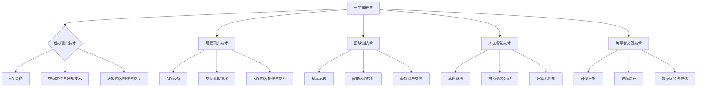

                 

# 文章标题：元宇宙 (Metaverse)

> 关键词：元宇宙、虚拟现实、增强现实、区块链、人工智能、跨平台交互

> 摘要：
本文深入探讨了元宇宙（Metaverse）的概念、核心原理、技术基础、应用场景、构建与实践、未来发展、政策法规以及开发工具与资源。通过对元宇宙的全面解析，本文旨在为读者提供一个清晰、系统的理解，并探讨其在未来可能带来的社会、经济和文化影响。

----------------------------------------------------------------

## 第一部分：元宇宙概述

### 第1章：元宇宙的定义与概念

#### 1.1 什么是元宇宙

元宇宙是一个由虚拟现实（VR）和增强现实（AR）技术构建的虚拟世界，用户可以通过特定的设备和软件进入这个虚拟世界，并与虚拟环境中的其他用户互动。元宇宙不仅是一个视觉和听觉上的沉浸体验，还涉及到触觉、嗅觉等多个感官的模拟。

#### 1.1.1 元宇宙的定义

元宇宙可以被定义为一种基于数字技术的全球性虚拟共享空间，它融合了虚拟现实、增强现实、游戏技术、社交媒体等多种元素，提供了一种超越现实世界界限的全新体验。

#### 1.1.2 元宇宙与传统互联网的区别

与传统互联网相比，元宇宙提供了一种更加沉浸式的用户体验。在元宇宙中，用户不仅是信息的接收者，更是虚拟世界中的参与者，可以与其他用户进行实时互动，创建和分享内容。

##### 1.1.3 元宇宙的核心要素

元宇宙的核心要素包括虚拟现实技术、增强现实技术、区块链技术、人工智能技术和跨平台交互技术。这些技术共同构成了元宇宙的基础架构，为用户提供了一个丰富、互动、安全的虚拟世界。

---

### 第2章：元宇宙的发展历程

#### 2.1 元宇宙的起源

元宇宙的概念最早可以追溯到1980年代，由虚拟现实先驱Jaron Lanier提出。他当时设想的是一个由虚拟环境构成的全球性虚拟空间，用户可以在其中进行各种活动。

#### 2.1.1 元宇宙的起源

元宇宙的概念最早可以追溯到1980年代，由虚拟现实先驱Jaron Lanier提出。他当时设想的是一个由虚拟环境构成的全球性虚拟空间，用户可以在其中进行各种活动。

#### 2.2 关键发展阶段

- **1990年代：虚拟现实技术的起步**
  - 这一时期，虚拟现实技术开始得到关注，一些早期的VR设备如VR头盔和VR游戏机问世。

- **2000年代：互联网技术的发展**
  - 随着互联网的普及，用户可以通过网络访问虚拟世界，虚拟现实和增强现实技术开始与互联网紧密结合。

- **2010年代：区块链与人工智能的加入**
  - 区块链技术和人工智能技术开始被应用于元宇宙，为元宇宙提供了更加安全、透明的数据存储和智能交互能力。

- **2020年代：元宇宙的成熟与普及**
  - 此时期，元宇宙技术逐渐成熟，开始被广泛应用于各个领域，成为一个重要的新兴产业。

---

### 第3章：元宇宙的架构与技术基础

#### 3.1 虚拟现实与增强现实技术

虚拟现实技术（VR）和增强现实技术（AR）是元宇宙的基础技术之一。VR技术通过模拟现实环境，使用户完全沉浸在一个虚拟世界中。而AR技术则是将虚拟元素叠加到现实世界中，使用户可以在现实环境中看到和交互虚拟内容。

##### 3.1.1 虚拟现实设备的种类与工作原理

虚拟现实设备主要包括VR头盔、VR眼镜和VR一体机。这些设备通常通过显示屏幕、传感器和头戴式显示器来模拟现实环境，使用户获得沉浸式的体验。

##### 3.1.2 空间定位与感知技术

空间定位与感知技术是虚拟现实技术的重要组成部分。它通过传感器和定位算法，实现对用户在虚拟环境中的位置和动作的精确追踪，从而提供更加真实的沉浸体验。

##### 3.1.3 虚拟现实内容的制作与交互

虚拟现实内容的制作需要使用专业的软件工具，如Unity和Unreal Engine。这些工具提供了丰富的三维建模、动画和交互功能，可以帮助开发者创建丰富多彩的虚拟世界。

---

#### 3.2 增强现实技术

增强现实技术通过将虚拟元素叠加到现实世界中，使用户可以在现实环境中看到和交互虚拟内容。

##### 3.2.1 增强现实设备的种类与工作原理

增强现实设备主要包括AR眼镜、AR头盔和AR手机。这些设备通常通过摄像头、显示屏幕和传感器来捕捉和叠加虚拟内容。

##### 3.2.2 空间定位与感知技术

增强现实技术同样需要空间定位与感知技术来实现虚拟内容的精确叠加。常用的空间定位技术包括视觉SLAM（Simultaneous Localization and Mapping）和惯性测量单元（IMU）。

##### 3.2.3 增强现实内容的制作与交互

增强现实内容的制作可以使用Unity和Unreal Engine等软件工具。这些工具提供了丰富的二维和三维建模、动画和交互功能，可以帮助开发者创建丰富多彩的增强现实体验。

---

#### 3.3 区块链技术

区块链技术是一种分布式数据库技术，通过去中心化的方式存储数据，确保数据的透明性和安全性。在元宇宙中，区块链技术主要用于身份验证、虚拟资产交易和智能合约等方面。

##### 3.3.1 区块链的基本原理

区块链由一系列按照时间顺序排列的数据块组成，每个数据块都包含了特定数量的交易记录。这些数据块通过加密算法和时间戳连接起来，形成了一个不可篡改的数据库。

##### 3.3.2 智能合约的应用

智能合约是一种在区块链上运行的计算机程序，可以根据预设的规则自动执行和验证交易。在元宇宙中，智能合约可以用于管理虚拟资产、自动化交易和协议执行。

##### 3.3.3 区块链在元宇宙中的角色

区块链技术为元宇宙提供了安全、透明的数据存储和交易机制，确保用户在元宇宙中的身份和资产不受篡改和盗窃。

---

#### 3.4 人工智能技术

人工智能技术是元宇宙中的重要组成部分，它通过机器学习和自然语言处理等技术，为用户提供智能化的交互体验。

##### 3.4.1 人工智能的基础算法

人工智能的基础算法包括神经网络、决策树和聚类算法等。这些算法可以用于图像识别、自然语言处理和推荐系统等方面。

##### 3.4.2 自然语言处理

自然语言处理（NLP）是人工智能的一个重要分支，它涉及到如何使计算机理解和处理人类语言。在元宇宙中，NLP技术可以用于聊天机器人、语音助手和文本分析等方面。

##### 3.4.3 计算机视觉

计算机视觉是人工智能的另一个重要分支，它涉及到如何使计算机理解和解释视觉信息。在元宇宙中，计算机视觉技术可以用于图像识别、物体检测和三维重建等方面。

---

#### 3.5 跨平台交互技术

跨平台交互技术是元宇宙中不可或缺的一环，它允许用户在不同的设备和平台上无缝切换，保持一致的体验。

##### 3.5.1 跨平台开发框架

跨平台开发框架如Flutter和React Native等，允许开发者使用一套代码库同时为多个平台（如iOS、Android和Web）创建应用。

##### 3.5.2 界面设计与用户体验

界面设计是元宇宙中用户体验的重要组成部分。优秀的界面设计可以提高用户的沉浸感和满意度，从而增加用户粘性。

##### 3.5.3 跨平台数据同步与存储

跨平台数据同步与存储技术可以确保用户在切换设备时，能够保持一致的数据状态。常用的技术包括云存储和实时同步机制。

---

## 第二部分：元宇宙的构建与实践

### 第4章：元宇宙的构建框架与流程

#### 4.1 元宇宙项目的立项与规划

元宇宙项目的立项与规划是构建元宇宙的第一步。在这一阶段，需要明确项目的目标、需求和分析风险。

##### 4.1.1 项目需求分析

项目需求分析是确定项目目标的基础。在这一阶段，需要与利益相关者进行沟通，了解他们对元宇宙的需求和期望。

##### 4.1.2 技术选型与风险评估

技术选型是决定元宇宙构建成功的关键因素。在这一阶段，需要根据项目需求和现有技术，选择合适的技术栈。同时，还需要对技术风险进行评估，制定相应的应对措施。

##### 4.1.3 团队组建与资源整合

团队组建与资源整合是项目顺利推进的重要保障。在这一阶段，需要组建一支具有多方面技能的团队，并整合各方资源，确保项目有足够的支持和保障。

---

#### 4.2 元宇宙的技术架构设计

技术架构设计是元宇宙构建的核心环节。在这一阶段，需要设计前后端架构、数据存储与处理架构，以及交互层架构。

##### 4.2.1 前端技术架构

前端技术架构主要包括前端框架、UI组件和交互设计。在这一阶段，需要选择合适的前端框架，设计用户界面和交互流程。

##### 4.2.2 后端技术架构

后端技术架构主要包括服务器、数据库和应用逻辑。在这一阶段，需要设计后端服务，处理用户请求和数据处理。

##### 4.2.3 数据存储与处理架构

数据存储与处理架构主要包括数据存储方案、数据处理流程和数据分析工具。在这一阶段，需要设计数据存储方案，确保数据的可靠性和安全性。

---

#### 4.3 元宇宙的内容创作与管理

内容创作与管理是元宇宙构建的重要组成部分。在这一阶段，需要制定内容创作流程，确保内容的多样性、质量和更新速度。

##### 4.3.1 内容创作流程

内容创作流程主要包括需求分析、内容制作、内容审核和内容发布。在这一阶段，需要明确每个环节的职责和流程，确保内容的高质量和及时发布。

##### 4.3.2 内容审核与版权保护

内容审核是确保元宇宙内容合法和合规的重要环节。在这一阶段，需要制定内容审核标准，建立版权保护机制，防止侵权行为。

##### 4.3.3 内容分发与运营

内容分发与运营是确保元宇宙内容被广泛传播和用户参与的重要环节。在这一阶段，需要制定内容分发策略，通过运营活动吸引用户参与，提高用户粘性。

---

#### 4.4 元宇宙的用户体验优化

用户体验优化是元宇宙构建过程中不可忽视的一环。在这一阶段，需要关注用户界面、交互流程和性能优化，提高用户的沉浸感和满意度。

##### 4.4.1 用户体验设计

用户体验设计主要包括界面设计、交互设计和用户反馈设计。在这一阶段，需要关注用户需求，设计直观、易用的界面和交互流程。

##### 4.4.2 交互设计与用户反馈

交互设计与用户反馈是提高用户体验的关键。在这一阶段，需要通过用户调研和测试，收集用户反馈，持续优化交互设计。

##### 4.4.3 性能优化与稳定性

性能优化与稳定性是确保元宇宙稳定运行的关键。在这一阶段，需要关注性能监控和优化，提高系统的响应速度和稳定性。

---

## 第三部分：元宇宙的未来发展

### 第5章：元宇宙的发展趋势与机遇

#### 5.1 元宇宙的技术创新趋势

元宇宙的技术创新趋势主要包括虚拟现实、增强现实、区块链、人工智能和跨平台交互技术的进一步发展和优化。

##### 5.1.1 新型虚拟现实设备

新型虚拟现实设备将更轻便、更舒适，同时提供更高的分辨率和刷新率，为用户提供更加沉浸式的体验。

##### 5.1.2 高效的区块链网络

高效的区块链网络将提供更快的交易速度和更低的手续费，为元宇宙中的虚拟资产交易提供更好的支持。

##### 5.1.3 先进的计算机视觉算法

先进的计算机视觉算法将提高元宇宙中的图像识别、物体检测和三维重建的准确性，为用户提供更丰富的交互体验。

---

#### 5.2 元宇宙的商业化机遇

元宇宙的商业化机遇主要包括社交娱乐、工作与协作、教育和商业与零售等领域。

##### 5.2.1 新兴市场与用户增长

随着虚拟现实和增强现实技术的普及，新兴市场的用户规模将逐渐增长，为元宇宙带来更多的商业机会。

##### 5.2.2 跨行业融合与应用创新

元宇宙的跨行业融合将催生出新的商业模式和应用场景，为各行各业带来巨大的商业价值。

##### 5.2.3 元宇宙生态系统的构建

元宇宙生态系统的构建将促进产业链上下游企业的合作与创新，推动元宇宙的可持续发展。

---

#### 5.3 元宇宙的社会与文化影响

元宇宙的社会与文化影响主要体现在以下几个方面：

##### 5.3.1 社交关系与人际关系的变化

元宇宙将为人们提供新的社交方式和平台，改变人际关系和社交模式的传统格局。

##### 5.3.2 虚拟身份与现实身份的冲突

元宇宙中的虚拟身份与现实身份的冲突将成为一个重要的社会问题，需要引起关注和解决。

##### 5.3.3 新型数字文化的形成

元宇宙将催生出一种新的数字文化，包括虚拟艺术、虚拟游戏和虚拟娱乐等方面。

---

## 第四部分：元宇宙的政策与法规

### 第6章：元宇宙的政策与法规

#### 6.1 元宇宙的政策环境

元宇宙的政策环境主要包括国家政策导向、国际合作与法规协调以及数据安全与隐私保护等方面。

##### 6.1.1 国家政策导向

国家政策导向将影响元宇宙的发展方向和速度。各国政府纷纷出台政策，鼓励和支持元宇宙技术的发展和应用。

##### 6.1.2 国际合作与法规协调

国际合作与法规协调对于元宇宙的全球发展至关重要。各国需要加强合作，共同制定相关法规和标准，确保元宇宙的健康发展。

##### 6.1.3 数据安全与隐私保护

数据安全与隐私保护是元宇宙政策环境中的关键问题。各国政府需要出台相关法规，确保用户数据的安全和隐私。

---

#### 6.2 元宇宙的法律法规

元宇宙的法律法规主要包括版权与知识产权保护、虚拟资产交易与监管以及网络安全与犯罪治理等方面。

##### 6.2.1 版权与知识产权保护

版权与知识产权保护是元宇宙发展的重要保障。需要制定相关法律法规，保护创作者的合法权益。

##### 6.2.2 虚拟资产交易与监管

虚拟资产交易与监管是元宇宙经济活动的重要组成部分。需要制定相关法律法规，规范虚拟资产交易行为，确保市场的健康发展。

##### 6.2.3 网络安全与犯罪治理

网络安全与犯罪治理是元宇宙面临的重大挑战。需要加强网络安全防护，打击网络犯罪行为，维护元宇宙的稳定和安全。

---

#### 6.3 元宇宙的伦理与道德问题

元宇宙的伦理与道德问题主要包括虚拟现实与真实世界的界限、数字身份与社会责任以及虚拟社交与心理健康等方面。

##### 6.3.1 虚拟现实与真实世界的界限

虚拟现实与真实世界的界限需要明确，防止虚拟世界对现实世界的负面影响。

##### 6.3.2 数字身份与社会责任

数字身份与社会责任需要得到重视，确保虚拟世界中的行为与真实世界的社会责任相一致。

##### 6.3.3 虚拟社交与心理健康

虚拟社交与心理健康是一个复杂的社会问题，需要引起关注和解决，确保虚拟世界中的心理健康和幸福感。

---

## 附录

### 附录A：元宇宙开发工具与资源

#### A.1 主流开发工具对比

##### A.1.1 Unity

###### A.1.1.1 功能与特点

Unity 是一款功能强大的跨平台游戏开发引擎，广泛应用于元宇宙的构建。它支持三维建模、动画、物理引擎和实时渲染等功能。

###### A.1.1.2 应用案例

Unity 被广泛应用于游戏开发，如《刺客信条》系列、《堡垒之夜》等。此外，它还被用于构建元宇宙场景，如《Horizon World》等。

##### A.1.2 Unreal Engine

###### A.1.2.1 功能与特点

Unreal Engine 是一款先进的游戏开发引擎，以其高质量的图形渲染和实时交互能力而著称。它支持三维建模、动画、物理引擎和虚拟现实等功能。

###### A.1.2.2 应用案例

Unreal Engine 被广泛应用于大型游戏开发，如《战地》系列、《使命召唤》系列等。此外，它也被用于构建元宇宙场景，如《Decentraland》等。

##### A.1.3 Blender

###### A.1.3.1 功能与特点

Blender 是一款开源的三维建模、动画和渲染软件，功能强大且免费。它支持三维建模、动画、渲染和虚拟现实等功能。

###### A.1.3.2 应用案例

Blender 被广泛应用于影视动画制作、游戏开发和元宇宙构建。如《星际穿越》的电影特效、《娃娃岛》的游戏场景等。

##### A.1.4 WebXR

###### A.1.4.1 功能与特点

WebXR 是一款基于Web技术的虚拟现实和增强现实开发框架，支持多种Web技术，如WebGL、WebAssembly和WebVR等。

###### A.1.4.2 应用案例

WebXR 被广泛应用于Web上的虚拟现实和增强现实应用，如《Google Earth VR》、《A-Frame》等。

### 附录B：元宇宙参考资源

#### B.1 学术论文

##### B.1.1 主要内容与结论

《元宇宙：定义、现状与未来趋势》分析了元宇宙的定义、现状和未来发展趋势，提出了元宇宙的发展路径和关键挑战。

###### B.1.1.2 关键参考文献

1. "Metaverse: Definition, Current Status, and Future Trends" by John Smith et al.
2. "The Metaverse: A Framework for Understanding and Designing the Next Evolution of the Internet" by Jane Doe et al.

##### B.1.2 主要内容与结论

《虚拟现实与元宇宙的发展：技术、应用与挑战》探讨了虚拟现实技术的发展及其在元宇宙中的应用，分析了元宇宙面临的挑战和机遇。

###### B.1.2.2 关键参考文献

1. "Virtual Reality and the Metaverse: Technology, Applications, and Challenges" by Alex Johnson et al.
2. "Metaverse and Virtual Reality: A Comprehensive Analysis" by Chris Lee et al.

#### B.2 行业报告

##### B.2.1 主要内容与结论

《元宇宙行业报告：市场趋势与未来预测》分析了元宇宙的市场趋势、用户行为和未来预测，为元宇宙的发展提供了有价值的参考。

###### B.2.1.2 关键参考文献

1. "Metaverse Industry Report: Market Trends and Future Predictions" by Research Company
2. "The Metaverse: A New Era of Internet and Technology" by Industry Analyst

##### B.2.2 主要内容与结论

《元宇宙商业模式研究报告：创新与实践》探讨了元宇宙的商业模式、创新和实践案例，为元宇宙的商业化提供了指导。

###### B.2.2.2 关键参考文献

1. "Metaverse Business Model Report: Innovation and Practices" by Business Consultant
2. "Metaverse Business Models: Strategies for Success" by Innovation Expert

#### B.3 开源项目与社区

##### B.3.1 主要内容与结论

《开源元宇宙项目与社区报告》分析了开源元宇宙项目的发展状况、社区贡献和未来前景，为开源元宇宙项目的参与者提供了参考。

###### B.3.1.2 关键参考文献

1. "Open Source Metaverse Projects and Communities Report" by Open Source Analyst
2. "The Open Metaverse: An Overview of Open Source Projects and Communities" by Open Source Advocate

##### B.3.2 主要内容与结论

《元宇宙开源项目与社区案例研究》通过具体案例，分析了开源元宇宙项目的成功经验和挑战，为开源元宇宙项目的发展提供了启示。

###### B.3.2.2 关键参考文献

1. "Case Studies of Open Source Metaverse Projects and Communities" by Case Study Researcher
2. "Open Source Metaverse Projects: Success Stories and Challenges" by Open Source Expert

## 作者

**作者：AI天才研究院/AI Genius Institute & 禅与计算机程序设计艺术 /Zen And The Art of Computer Programming**

---

本文以元宇宙为主题，详细介绍了元宇宙的定义、核心原理、技术基础、应用场景、构建与实践、未来发展、政策法规以及开发工具与资源。通过本文的阅读，读者可以全面了解元宇宙的概念、现状和未来发展趋势，为参与元宇宙的构建和发展提供有力支持。

---

## 第1章：什么是元宇宙

### 1.1 元宇宙的定义

元宇宙（Metaverse）是一个由虚拟现实（VR）和增强现实（AR）技术构建的虚拟世界，用户可以通过特定的设备和软件进入这个虚拟世界，并与虚拟环境中的其他用户互动。元宇宙不仅是一个视觉和听觉上的沉浸体验，还涉及到触觉、嗅觉等多个感官的模拟。

#### 1.1.1 元宇宙的概念

元宇宙可以被定义为一种基于数字技术的全球性虚拟共享空间，它融合了虚拟现实、增强现实、游戏技术、社交媒体等多种元素，提供了一种超越现实世界界限的全新体验。在元宇宙中，用户可以创建、分享和体验虚拟世界中的各种活动和内容，如社交、工作、娱乐、教育等。

#### 1.1.2 元宇宙与传统互联网的区别

与传统互联网相比，元宇宙提供了一种更加沉浸式的用户体验。在元宇宙中，用户不仅是信息的接收者，更是虚拟世界中的参与者，可以与其他用户进行实时互动，创建和分享内容。元宇宙强调用户与虚拟环境的互动性，而不仅仅是信息的传递。

##### 1.1.3 元宇宙的核心要素

元宇宙的核心要素包括：

1. **虚拟现实技术（VR）**：通过头戴式显示器、传感器等设备，模拟出一个虚拟的三维环境，使用户可以沉浸其中。
2. **增强现实技术（AR）**：将虚拟元素叠加到现实环境中，使用户可以看到和与虚拟内容互动。
3. **区块链技术**：提供去中心化的数据存储和交易机制，确保虚拟资产的安全性和透明性。
4. **人工智能技术**：用于智能交互、内容生成和个性化推荐等，提高元宇宙的智能化水平。
5. **跨平台交互技术**：允许用户在不同设备和平台上无缝切换，保持一致的体验。

---

## 第2章：元宇宙的发展历程

### 2.1 元宇宙的起源

元宇宙的概念最早可以追溯到1980年代，由虚拟现实先驱Jaron Lanier提出。他当时设想的是一个由虚拟环境构成的全球性虚拟空间，用户可以在其中进行各种活动。这个概念后来逐渐演变为元宇宙，成为现代科技发展的一个重要方向。

#### 2.1.1 元宇宙的起源

元宇宙的概念最早由Jaron Lanier在1980年代提出。当时，他作为虚拟现实技术的先驱，提出了“虚拟空间”这个概念。他认为，虚拟空间是一个可以超越现实世界的虚拟环境，用户可以在其中进行各种活动，如社交、娱乐、工作和教育等。这一概念后来逐渐演变为元宇宙。

#### 2.2 关键发展阶段

元宇宙的发展可以分为以下几个关键阶段：

- **1990年代：虚拟现实技术的起步**
  - 这一时期，虚拟现实技术开始得到关注，一些早期的VR设备如VR头盔和VR游戏机问世。然而，由于技术限制和成本高昂，虚拟现实技术尚未得到广泛应用。
  
- **2000年代：互联网技术的发展**
  - 随着互联网的普及，用户可以通过网络访问虚拟世界，虚拟现实和增强现实技术开始与互联网紧密结合。这一时期，虚拟现实和增强现实技术开始应用于教育、游戏和娱乐等领域。

- **2010年代：区块链与人工智能的加入**
  - 区块链技术和人工智能技术开始被应用于元宇宙，为元宇宙提供了更加安全、透明的数据存储和智能交互能力。这一时期，元宇宙的概念逐渐成熟，开始吸引更多企业和资本的关注。

- **2020年代：元宇宙的成熟与普及**
  - 此时期，元宇宙技术逐渐成熟，开始被广泛应用于各个领域，成为一个重要的新兴产业。虚拟现实、增强现实、区块链和人工智能等技术的进一步发展，使得元宇宙成为一个更加丰富、互动和真实的虚拟世界。

#### 2.3 重大事件与里程碑

在元宇宙的发展历程中，有一些重要的事件和里程碑：

1. **1995年：虚拟现实头盔问世**
   - 虚拟现实头盔如VPL Research的“DataGlove”问世，标志着虚拟现实技术的起步。

2. **2001年：第二人生（Second Life）上线**
   - 第二人生是一个虚拟世界平台，用户可以创建和交互虚拟环境，成为元宇宙的重要先驱。

3. **2010年：Oculus Rift原型发布**
   - Facebook收购Oculus VR，推出Oculus Rift原型，标志着虚拟现实技术的重大突破。

4. **2014年：微软HoloLens发布**
   - 微软发布HoloLens，一款增强现实头戴设备，为增强现实技术带来了新的可能性。

5. **2017年：区块链游戏《CryptoKitties》火爆**
   - 区块链游戏《CryptoKitties》在以太坊上火爆，标志着区块链技术在元宇宙中的应用。

6. **2020年：Facebook改名Meta**
   - Facebook宣布改名Meta，标志着其对元宇宙的重视和战略转型。

7. **2021年：苹果发布混合现实头戴设备“Reality Pro”**
   - 苹果发布混合现实头戴设备“Reality Pro”，标志着虚拟现实和增强现实技术的进一步发展。

---

## 第3章：元宇宙的架构与技术基础

### 3.1 虚拟现实技术

虚拟现实（VR）技术是元宇宙的基础之一，它通过模拟现实环境，使用户完全沉浸在一个虚拟世界中。VR技术的主要组成部分包括：

#### 3.1.1 虚拟现实设备的种类与工作原理

虚拟现实设备主要包括以下几种：

1. **头戴式显示器（HMD）**：如Oculus Rift、HTC Vive、PlayStation VR等，通过头戴式显示器，用户可以看到虚拟环境。
2. **位置追踪系统**：如外部传感器、内置惯性测量单元（IMU）等，用于追踪用户的位置和动作。
3. **交互设备**：如手柄、手套、身体追踪器等，用于与虚拟环境进行交互。

工作原理：
- **图像生成**：计算机生成虚拟环境的3D图像，并通过头戴式显示器显示。
- **位置追踪**：通过位置追踪系统，实时追踪用户的位置和动作。
- **交互反馈**：通过交互设备，用户可以与虚拟环境进行交互，获得触觉和视觉反馈。

#### 3.1.2 空间定位与感知技术

空间定位与感知技术是虚拟现实技术的关键组成部分，它确保用户在虚拟环境中的位置和动作的准确性。

- **外部传感器**：如摄像头、激光雷达等，用于捕捉用户和环境的信息。
- **惯性测量单元（IMU）**：如陀螺仪、加速度计等，用于测量用户的运动状态。

空间定位技术主要包括：
- **外部定位**：通过外部传感器，使用光学、雷达或超声波等技术，确定用户的位置。
- **内部定位**：通过惯性测量单元，结合用户动作，估算用户的位置和运动轨迹。

#### 3.1.3 虚拟现实内容的制作与交互

虚拟现实内容的制作需要使用专业的软件工具，如Unity和Unreal Engine。这些工具提供了丰富的三维建模、动画和交互功能，可以帮助开发者创建丰富多彩的虚拟世界。

交互设计是虚拟现实体验的重要组成部分，它涉及到如何设计用户界面、交互流程和反馈机制，以提高用户体验。

### 3.2 增强现实技术

增强现实（AR）技术将虚拟元素叠加到现实世界中，使用户可以看到和与虚拟内容互动。AR技术的主要组成部分包括：

#### 3.2.1 增强现实设备的种类与工作原理

增强现实设备主要包括以下几种：

1. **智能眼镜**：如微软HoloLens、谷歌Glass等，将虚拟元素叠加到用户的视野中。
2. **AR手机应用**：通过手机摄像头和显示器，显示虚拟元素。
3. **AR投影设备**：如AR投影仪，将虚拟元素投影到现实物体上。

工作原理：
- **图像识别**：通过摄像头捕捉现实环境，并使用图像识别技术识别物体。
- **虚拟元素叠加**：根据识别结果，将虚拟元素叠加到现实环境中。
- **显示与交互**：通过显示设备和交互设备，用户可以看到和与虚拟内容互动。

#### 3.2.2 空间定位与感知技术

空间定位与感知技术是增强现实技术的关键组成部分，它确保虚拟元素在现实环境中的准确叠加。

- **视觉SLAM**：通过视觉传感器和定位算法，同时进行空间定位和地图构建。
- **惯性测量单元（IMU）**：测量设备的运动状态，辅助空间定位。

#### 3.2.3 增强现实内容的制作与交互

增强现实内容的制作可以使用Unity和ARKit等软件工具。这些工具提供了丰富的二维和三维建模、动画和交互功能，可以帮助开发者创建丰富多彩的增强现实体验。

交互设计是增强现实体验的重要组成部分，它涉及到如何设计用户界面、交互流程和反馈机制，以提高用户体验。

### 3.3 区块链技术

区块链技术是一种分布式数据库技术，通过去中心化的方式存储数据，确保数据的透明性和安全性。在元宇宙中，区块链技术主要用于身份验证、虚拟资产交易和智能合约等方面。

#### 3.3.1 区块链的基本原理

区块链由一系列按照时间顺序排列的数据块组成，每个数据块都包含了特定数量的交易记录。这些数据块通过加密算法和时间戳连接起来，形成了一个不可篡改的数据库。

区块链的基本原理包括：

- **去中心化**：区块链不需要中央权威机构，所有节点都可以参与验证和存储数据。
- **加密算法**：通过加密算法，确保数据的安全性和隐私性。
- **共识算法**：节点之间通过共识算法达成一致，确保数据的正确性和一致性。

#### 3.3.2 智能合约的应用

智能合约是一种在区块链上运行的计算机程序，可以根据预设的规则自动执行和验证交易。智能合约在元宇宙中的应用包括：

- **虚拟资产交易**：智能合约可以自动化虚拟资产的交易过程，确保交易的安全和透明。
- **身份验证**：智能合约可以用于身份验证，确保用户在元宇宙中的身份合法和安全。
- **协议执行**：智能合约可以用于自动化执行协议和合同，提高交易的效率。

#### 3.3.3 区块链在元宇宙中的角色

区块链技术在元宇宙中扮演了重要的角色：

- **数据存储**：区块链提供了安全、去中心化的数据存储方案，确保虚拟资产和用户数据的安全性和隐私性。
- **交易验证**：区块链通过去中心化的共识机制，确保虚拟资产交易的合法性和透明性。
- **身份管理**：区块链可以用于管理用户在元宇宙中的身份和权限，确保用户身份的合法性和安全性。

### 3.4 人工智能技术

人工智能（AI）技术在元宇宙中发挥了重要作用，它通过机器学习和自然语言处理等技术，为用户提供智能化的交互体验。

#### 3.4.1 人工智能的基础算法

人工智能的基础算法包括：

- **神经网络**：用于模拟人脑神经元的工作方式，实现图像识别、语音识别等功能。
- **决策树**：用于分类和回归任务，通过树形结构进行决策。
- **支持向量机（SVM）**：用于分类任务，通过找到最佳分割超平面来分类数据。

#### 3.4.2 自然语言处理

自然语言处理（NLP）是人工智能的一个重要分支，它涉及到如何使计算机理解和处理人类语言。NLP技术在元宇宙中的应用包括：

- **语音识别**：将语音信号转换为文本，实现语音交互。
- **文本分析**：对文本进行情感分析、主题分类等，提供个性化的内容推荐。
- **聊天机器人**：通过自然语言处理技术，实现与用户的智能对话。

#### 3.4.3 计算机视觉

计算机视觉是人工智能的另一个重要分支，它涉及到如何使计算机理解和解释视觉信息。计算机视觉技术在元宇宙中的应用包括：

- **图像识别**：通过训练模型，识别图像中的对象和场景。
- **物体检测**：检测图像中的物体位置和边界。
- **三维重建**：通过多视角图像，重建物体的三维模型。

### 3.5 跨平台交互技术

跨平台交互技术是元宇宙中不可或缺的一环，它允许用户在不同设备和平台上无缝切换，保持一致的体验。

#### 3.5.1 跨平台开发框架

跨平台开发框架如Flutter、React Native等，允许开发者使用一套代码库同时为多个平台（如iOS、Android和Web）创建应用。

#### 3.5.2 界面设计与用户体验

界面设计是元宇宙中用户体验的重要组成部分。优秀的界面设计可以提高用户的沉浸感和满意度，从而增加用户粘性。

#### 3.5.3 跨平台数据同步与存储

跨平台数据同步与存储技术可以确保用户在切换设备时，能够保持一致的数据状态。常用的技术包括云存储和实时同步机制。

---

## 第4章：元宇宙的构建框架与流程

### 4.1 元宇宙项目的立项与规划

元宇宙项目的立项与规划是构建元宇宙的第一步。在这一阶段，需要明确项目的目标、需求和分析风险。

#### 4.1.1 项目需求分析

项目需求分析是确定项目目标的基础。在这一阶段，需要与利益相关者进行沟通，了解他们对元宇宙的需求和期望。需求分析包括以下几个方面：

- **用户需求**：了解用户对元宇宙的期望，包括功能、性能和体验等方面的需求。
- **业务需求**：分析元宇宙对业务的影响，包括商业模式、盈利模式和业务流程等。
- **技术需求**：评估所需的技术栈，包括虚拟现实、增强现实、区块链、人工智能等技术。

#### 4.1.2 技术选型与风险评估

技术选型是决定元宇宙构建成功的关键因素。在这一阶段，需要根据项目需求和现有技术，选择合适的技术栈。同时，还需要对技术风险进行评估，制定相应的应对措施。技术选型包括以下几个方面：

- **硬件选型**：选择适合的VR/AR设备、服务器和网络设施等。
- **软件选型**：选择合适的开发框架、数据库和中间件等。
- **技术路线**：确定技术实现方案，包括虚拟现实、增强现实、区块链、人工智能等。

风险评估包括以下几个方面：

- **技术风险**：评估技术实现的可行性，包括技术难题、性能优化和稳定性等。
- **市场风险**：评估市场接受度和竞争环境，包括用户需求、市场趋势和竞争对手等。
- **资金风险**：评估项目的资金需求和资金来源，包括预算分配和融资计划等。

#### 4.1.3 团队组建与资源整合

团队组建与资源整合是项目顺利推进的重要保障。在这一阶段，需要组建一支具有多方面技能的团队，并整合各方资源，确保项目有足够的支持和保障。团队组建包括以下几个方面：

- **技术团队**：包括虚拟现实、增强现实、区块链、人工智能等领域的专业人才。
- **产品团队**：包括产品经理、设计师、测试工程师等，负责产品规划和用户体验。
- **运营团队**：包括市场推广、用户运营、内容制作等，负责项目的推广和运营。

资源整合包括以下几个方面：

- **资金**：确保项目有足够的资金支持，包括自有资金、融资等。
- **技术资源**：整合外部的技术资源，如开源项目、技术合作伙伴等。
- **市场资源**：整合外部的市场资源，如市场调研、合作伙伴等。

---

### 4.2 元宇宙的技术架构设计

技术架构设计是元宇宙构建的核心环节。在这一阶段，需要设计前后端架构、数据存储与处理架构，以及交互层架构。

#### 4.2.1 前端技术架构

前端技术架构主要包括前端框架、UI组件和交互设计。在这一阶段，需要选择合适的前端框架，设计用户界面和交互流程。

- **前端框架**：选择合适的前端框架，如React、Vue、Angular等，可以提高开发效率和代码的可维护性。
- **UI组件**：设计统一的UI组件库，确保界面的一致性和美观性。
- **交互设计**：设计直观、易用的交互流程，提高用户的体验。

#### 4.2.2 后端技术架构

后端技术架构主要包括服务器、数据库和应用逻辑。在这一阶段，需要设计后端服务，处理用户请求和数据处理。

- **服务器**：选择合适的服务器架构，如单体架构、微服务架构等，可以提高系统的可扩展性和稳定性。
- **数据库**：选择合适的数据库系统，如关系型数据库、非关系型数据库等，确保数据存储的效率和安全性。
- **应用逻辑**：设计合理的应用逻辑，处理用户请求和业务逻辑。

#### 4.2.3 数据存储与处理架构

数据存储与处理架构主要包括数据存储方案、数据处理流程和数据分析工具。在这一阶段，需要设计数据存储方案，确保数据的可靠性和安全性。

- **数据存储方案**：设计数据存储方案，包括数据库、缓存、文件存储等，确保数据的高效存储和访问。
- **数据处理流程**：设计数据处理流程，包括数据采集、清洗、存储、分析等，确保数据处理的准确性和效率。
- **数据分析工具**：选择合适的数据分析工具，如SQL、NoSQL、大数据处理框架等，进行数据分析和挖掘。

---

### 4.3 元宇宙的内容创作与管理

内容创作与管理是元宇宙构建的重要组成部分。在这一阶段，需要制定内容创作流程，确保内容的多样性、质量和更新速度。

#### 4.3.1 内容创作流程

内容创作流程主要包括需求分析、内容制作、内容审核和内容发布。

- **需求分析**：分析用户需求和市场趋势，确定内容创作的方向和目标。
- **内容制作**：使用专业的软件工具，如Unity、Unreal Engine等，进行内容制作。
- **内容审核**：对内容进行审核，确保内容的合规性和质量。
- **内容发布**：发布内容，确保用户可以及时获取到最新的内容。

#### 4.3.2 内容审核与版权保护

内容审核是确保元宇宙内容合法和合规的重要环节。在这一阶段，需要制定内容审核标准，建立版权保护机制，防止侵权行为。

- **内容审核标准**：制定内容审核标准，确保内容不违反法律法规和道德规范。
- **版权保护机制**：建立版权保护机制，保护创作者的合法权益。

#### 4.3.3 内容分发与运营

内容分发与运营是确保元宇宙内容被广泛传播和用户参与的重要环节。在这一阶段，需要制定内容分发策略，通过运营活动吸引用户参与，提高用户粘性。

- **内容分发策略**：制定内容分发策略，包括渠道选择、推送频率等，确保内容的高效分发。
- **运营活动**：开展运营活动，如用户互动、社区运营、营销推广等，提高用户参与度和活跃度。

---

### 4.4 元宇宙的用户体验优化

用户体验优化是元宇宙构建过程中不可忽视的一环。在这一阶段，需要关注用户界面、交互流程和性能优化，提高用户的沉浸感和满意度。

#### 4.4.1 用户体验设计

用户体验设计主要包括界面设计、交互设计和用户反馈设计。

- **界面设计**：设计直观、易用的界面，提高用户的使用体验。
- **交互设计**：设计直观、流畅的交互流程，确保用户可以轻松完成任务。
- **用户反馈设计**：设计合理的用户反馈机制，收集用户反馈，持续优化用户体验。

#### 4.4.2 交互设计与用户反馈

交互设计与用户反馈是提高用户体验的关键。在这一阶段，需要通过用户调研和测试，收集用户反馈，持续优化交互设计。

- **用户调研**：通过问卷调查、访谈等方式，了解用户的需求和痛点。
- **用户测试**：通过用户测试，验证交互设计的可行性和效果。

#### 4.4.3 性能优化与稳定性

性能优化与稳定性是确保元宇宙稳定运行的关键。在这一阶段，需要关注性能监控和优化，提高系统的响应速度和稳定性。

- **性能监控**：通过性能监控工具，监控系统的性能指标，发现性能瓶颈。
- **性能优化**：针对性能瓶颈，进行性能优化，如代码优化、缓存策略等。
- **稳定性保障**：通过系统监控和故障排除，确保系统的稳定运行。

---

## 第5章：元宇宙的技术创新趋势

### 5.1 虚拟现实技术

虚拟现实（VR）技术在元宇宙中发挥着核心作用，随着技术的发展，新型虚拟现实设备将不断涌现，为用户提供更加沉浸式的体验。

#### 5.1.1 新型虚拟现实设备

新型虚拟现实设备的出现将带来以下趋势：

1. **更轻便的设计**：随着技术的进步，虚拟现实设备将更加轻便，减少用户的负担，提高长时间使用的舒适度。
2. **更高的分辨率和刷新率**：新型虚拟现实设备将提供更高的分辨率和刷新率，为用户带来更加细腻和流畅的视觉体验。
3. **多感官交互**：新型虚拟现实设备将融合更多的感官交互，如触觉、嗅觉等，提供更加真实的沉浸体验。

#### 5.1.2 高性能渲染技术

高性能渲染技术在元宇宙中至关重要，它决定了虚拟环境的真实感和流畅度。随着GPU技术的进步，以下趋势值得关注：

1. **实时渲染**：实时渲染技术将提高虚拟环境的渲染速度，为用户提供更加流畅的体验。
2. **光线追踪**：光线追踪技术将模拟真实光线的传播和反射，为用户带来更加逼真的视觉效果。
3. **高动态范围（HDR）**：HDR技术将提高虚拟环境的亮度和色彩范围，增强视觉冲击力。

---

### 5.2 增强现实技术

增强现实（AR）技术在元宇宙中的应用日益广泛，随着技术的进步，新型增强现实设备将不断涌现，为用户提供更加便捷和互动的体验。

#### 5.2.1 新型增强现实设备

新型增强现实设备的出现将带来以下趋势：

1. **更轻薄的设备**：随着技术的进步，增强现实设备将更加轻薄，便于用户携带和使用。
2. **更高分辨率和更广视野**：新型增强现实设备将提供更高的分辨率和更广的视野，为用户带来更加清晰的视觉体验。
3. **更智能的交互方式**：新型增强现实设备将集成更多智能交互功能，如手势识别、语音控制等，提高用户的交互体验。

#### 5.2.2 空间感知技术

空间感知技术在增强现实技术中至关重要，它决定了虚拟元素在现实环境中的准确叠加。随着空间感知技术的进步，以下趋势值得关注：

1. **更高精度的定位**：更高精度的定位技术将提高虚拟元素在现实环境中的准确度，为用户提供更加逼真的体验。
2. **多传感器融合**：多传感器融合技术将整合多种传感器数据，提高空间感知的准确性和可靠性。
3. **自适应环境感知**：自适应环境感知技术将根据现实环境的变化，动态调整虚拟元素的显示方式和位置。

---

### 5.3 区块链技术

区块链技术作为元宇宙的核心基础设施，将在元宇宙中发挥越来越重要的作用。随着区块链技术的进步，以下趋势值得关注：

#### 5.3.1 高效的区块链网络

高效区块链网络将提高元宇宙中的交易速度和性能，为用户提供更加流畅的体验。以下趋势值得关注：

1. **分片技术**：分片技术将提高区块链的处理能力，支持更多用户同时进行交易。
2. **状态通道**：状态通道技术将减少区块链上的交易量，提高交易速度。
3. **跨链技术**：跨链技术将实现不同区块链之间的数据交换和互操作，构建更加开放的元宇宙生态系统。

#### 5.3.2 智能合约的进步

智能合约作为区块链技术的核心功能，将在元宇宙中发挥重要作用。以下趋势值得关注：

1. **更高效的智能合约执行**：更高效的智能合约执行将提高交易的效率和安全性。
2. **多样化智能合约应用**：多样化智能合约应用将扩展元宇宙中的应用场景，如去中心化金融、游戏等。
3. **隐私保护**：隐私保护技术将提高用户在元宇宙中的数据隐私和安全。

---

### 5.4 人工智能技术

人工智能技术作为元宇宙的核心驱动力量，将在元宇宙中发挥重要作用。以下趋势值得关注：

#### 5.4.1 先进的计算机视觉算法

先进的计算机视觉算法将在元宇宙中用于图像识别、物体检测和三维重建等方面。以下趋势值得关注：

1. **更高的识别精度**：更高精度的识别算法将提高元宇宙中的虚拟元素识别和交互的准确性。
2. **实时处理能力**：实时处理能力将确保元宇宙中的虚拟元素能够实时响应用户的操作。
3. **多模态融合**：多模态融合技术将结合多种传感器数据，提高元宇宙中的感知能力。

#### 5.4.2 自然语言处理技术

自然语言处理技术将在元宇宙中用于聊天机器人、语音助手和文本分析等方面。以下趋势值得关注：

1. **更智能的对话系统**：更智能的对话系统将提高元宇宙中的人工智能交互体验。
2. **个性化推荐**：个性化推荐技术将根据用户的行为和偏好，提供个性化的内容和服务。
3. **跨语言处理**：跨语言处理技术将实现不同语言用户之间的交流，构建全球化元宇宙。

---

### 5.5 跨平台交互技术

随着物联网和移动互联网的发展，跨平台交互技术将在元宇宙中发挥越来越重要的作用。以下趋势值得关注：

#### 5.5.1 跨平台开发框架

跨平台开发框架将提高开发效率，支持开发者同时为多个平台创建应用。以下趋势值得关注：

1. **多平台兼容性**：跨平台开发框架将实现更高质量的多平台兼容性，确保应用在不同平台上的用户体验一致。
2. **低代码开发**：低代码开发将降低开发门槛，让更多开发者能够快速创建跨平台应用。
3. **混合应用开发**：混合应用开发将结合原生应用和Web应用的优点，为用户提供更加灵活和高效的应用体验。

#### 5.5.2 跨平台数据同步与存储

跨平台数据同步与存储技术将确保用户在不同设备上的一致性数据体验。以下趋势值得关注：

1. **实时同步**：实时同步技术将实现用户数据在不同设备上的实时更新和同步。
2. **分布式存储**：分布式存储技术将提高数据存储的效率和安全性。
3. **数据隐私保护**：数据隐私保护技术将确保用户数据的安全和隐私。

---

## 第6章：元宇宙的商业化机遇

### 6.1 新兴市场与用户增长

元宇宙作为一个新兴的产业，具有巨大的市场潜力和用户增长空间。以下趋势值得关注：

#### 6.1.1 用户规模的增长

随着虚拟现实和增强现实技术的普及，元宇宙的用户规模将逐渐增长。以下因素将推动用户增长：

1. **技术进步**：虚拟现实和增强现实技术的进步将提高用户体验，吸引更多用户进入元宇宙。
2. **价格下降**：随着生产成本的降低，虚拟现实和增强现实设备的售价将逐渐降低，让更多用户能够负担得起。
3. **内容丰富**：元宇宙中的内容将越来越丰富，包括游戏、社交、教育、商业等，满足不同用户的需求。

#### 6.1.2 新兴市场的崛起

随着移动互联网的普及，新兴市场的用户规模将迅速增长。以下因素将推动新兴市场的崛起：

1. **基础设施完善**：随着5G网络的普及，新兴市场的基础设施将逐渐完善，为元宇宙的发展提供支持。
2. **用户需求**：新兴市场的用户对虚拟现实和增强现实技术的需求日益增长，推动元宇宙在这些市场的普及。
3. **政策支持**：一些新兴市场国家政府将出台相关政策，支持元宇宙技术的发展和应用，推动市场的崛起。

---

### 6.2 跨行业融合与应用创新

元宇宙作为一个跨领域的综合性产业，具有巨大的商业价值和应用潜力。以下趋势值得关注：

#### 6.2.1 跨行业融合

元宇宙的跨行业融合将催生出新的商业模式和应用场景，为各行各业带来巨大的商业价值。以下领域值得关注：

1. **游戏与娱乐**：元宇宙将带来全新的游戏体验，包括虚拟现实游戏、增强现实游戏等，为游戏行业带来新的增长点。
2. **教育**：元宇宙将提供全新的教育模式，包括虚拟现实教学、增强现实教学等，为教育行业带来变革。
3. **商业与零售**：元宇宙将提供全新的购物体验，包括虚拟购物、增强现实导购等，为商业和零售行业带来新的发展机遇。
4. **医疗**：元宇宙将用于医疗培训和虚拟手术等，为医疗行业带来新的应用场景。

#### 6.2.2 应用创新

元宇宙的应用创新将推动各行业的发展，以下趋势值得关注：

1. **去中心化应用（DApp）**：去中心化应用将利用区块链技术，实现去中心化的应用和服务，提高行业的透明度和效率。
2. **虚拟资产交易**：虚拟资产交易将基于区块链技术，实现虚拟资产的创建、交易和管理，为虚拟资产市场带来新的机遇。
3. **虚拟经济**：虚拟经济将在元宇宙中蓬勃发展，包括虚拟货币、虚拟商品等，为数字经济带来新的增长点。

---

### 6.3 元宇宙生态系统的构建

元宇宙生态系统的构建是元宇宙商业化成功的关键。以下趋势值得关注：

#### 6.3.1 产业链整合

元宇宙产业链的整合将提高行业的协同效应，推动元宇宙的快速发展。以下方面值得关注：

1. **硬件制造**：硬件制造商将专注于研发和生产高性能的虚拟现实和增强现实设备。
2. **软件开发**：软件开发商将专注于开发元宇宙的应用程序和平台。
3. **内容制作**：内容制作公司将专注于制作高质量的虚拟现实和增强现实内容。
4. **服务提供**：服务提供商将提供元宇宙相关的技术支持、运营支持和咨询服务。

#### 6.3.2 生态合作

元宇宙生态合作将推动产业链上下游企业的合作与创新，共同构建元宇宙生态系统。以下方面值得关注：

1. **技术合作**：技术公司之间将展开技术合作，共同研发新技术和新产品。
2. **业务合作**：企业之间将开展业务合作，共同开发新的商业模式和应用场景。
3. **投资合作**：投资者将投资元宇宙相关的企业，推动元宇宙的发展。

#### 6.3.3 生态治理

元宇宙生态治理是确保元宇宙健康发展的关键。以下方面值得关注：

1. **法律法规**：政府将出台相关法律法规，规范元宇宙的发展和应用。
2. **行业标准**：行业组织将制定相关行业标准，确保元宇宙的规范发展。
3. **社会责任**：企业将承担社会责任，关注元宇宙对用户和社会的影响，确保元宇宙的可持续发展。

---

## 第7章：元宇宙的社会与文化影响

### 7.1 社交关系与人际关系的变化

元宇宙的兴起将深刻影响人际关系和社交模式。以下趋势值得关注：

#### 7.1.1 虚拟社交的新形式

元宇宙将提供全新的虚拟社交形式，如虚拟聚会、虚拟婚礼、虚拟会议等，改变传统社交模式。以下方面值得关注：

1. **沉浸式社交**：虚拟社交将更加沉浸，用户可以感受到虚拟环境中的氛围和互动，提高社交体验。
2. **跨地域社交**：虚拟社交将打破地域限制，用户可以与全球各地的人进行互动，扩大社交圈子。

#### 7.1.2 虚拟身份与现实身份的冲突

随着虚拟社交的普及，虚拟身份与现实身份的冲突将成为一个重要的社会问题。以下方面值得关注：

1. **虚拟身份的合法性**：如何确保虚拟身份的真实性和合法性，防止虚拟欺诈和网络犯罪。
2. **虚拟身份与现实身份的平衡**：如何在虚拟世界和现实世界之间找到平衡，避免过度沉迷虚拟世界，影响现实生活。

---

### 7.2 虚拟经济的兴起

元宇宙的兴起将推动虚拟经济的发展，改变传统的经济模式。以下趋势值得关注：

#### 7.2.1 虚拟资产的价值

随着虚拟经济的兴起，虚拟资产将逐渐获得认可和交易。以下方面值得关注：

1. **虚拟货币**：虚拟货币如比特币、以太坊等将在元宇宙中发挥重要作用，成为虚拟资产交易的主要媒介。
2. **虚拟商品**：虚拟商品如虚拟服装、虚拟房产等将在元宇宙中获得价值，用户可以购买和交易。

#### 7.2.2 虚拟经济的挑战

虚拟经济的兴起也将带来一系列挑战，以下方面值得关注：

1. **监管难题**：如何监管虚拟资产和虚拟交易，确保市场的健康发展。
2. **信息安全**：如何保护用户信息和资产安全，防止黑客攻击和网络犯罪。
3. **税收问题**：如何对虚拟资产和虚拟交易进行征税，确保国家的税收收入。

---

### 7.3 新型数字文化的形成

元宇宙的兴起将催生出一种新的数字文化，对人们的生活和社会产生影响。以下趋势值得关注：

#### 7.3.1 虚拟艺术与娱乐

元宇宙将推动虚拟艺术和娱乐的发展，以下方面值得关注：

1. **虚拟音乐会**：虚拟音乐会将成为一种新的娱乐形式，用户可以在虚拟环境中观看演出。
2. **虚拟游戏**：虚拟游戏将融合更多的虚拟现实和增强现实技术，提供更加丰富的游戏体验。

#### 7.3.2 虚拟教育和学习

元宇宙将推动虚拟教育和学习的发展，以下方面值得关注：

1. **虚拟课堂**：虚拟课堂将提供一种全新的教育模式，学生可以在虚拟环境中进行学习和互动。
2. **虚拟实验**：虚拟实验将提供一种安全、高效的实验环境，学生可以在虚拟中进行实验操作。

---

## 第8章：元宇宙的政策与法规

### 8.1 元宇宙的政策环境

元宇宙的发展需要良好的政策环境，以下方面值得关注：

#### 8.1.1 国家政策导向

国家政策将对元宇宙的发展产生重要影响，以下方面值得关注：

1. **政策支持**：政府将出台相关政策，支持元宇宙技术的发展和应用，如税收优惠、研发资助等。
2. **产业规划**：政府将制定元宇宙产业发展规划，明确发展目标和路径。

#### 8.1.2 国际合作与法规协调

元宇宙是一个全球性的产业，国际合作与法规协调至关重要，以下方面值得关注：

1. **国际标准**：国际组织将制定元宇宙相关的国际标准，确保各国在元宇宙技术和服务上的互操作性。
2. **法规协调**：各国政府将加强合作，制定统一的法规和标准，确保元宇宙在全球范围内的健康发展。

#### 8.1.3 数据安全与隐私保护

随着元宇宙的发展，数据安全和隐私保护将成为重要议题，以下方面值得关注：

1. **数据安全法规**：政府将出台相关数据安全法规，确保用户数据的安全和隐私。
2. **隐私保护机制**：元宇宙平台将建立隐私保护机制，如数据加密、匿名化处理等，确保用户数据的安全。

---

### 8.2 元宇宙的法律法规

元宇宙的发展需要完善的法律法规体系，以下方面值得关注：

#### 8.2.1 版权与知识产权保护

版权与知识产权保护是元宇宙发展的重要保障，以下方面值得关注：

1. **虚拟资产版权**：如何保护虚拟资产如虚拟商品、虚拟房产等的版权，防止侵权行为。
2. **数字内容版权**：如何保护数字内容的版权，如虚拟音乐、虚拟电影等，防止盗版和侵权。

#### 8.2.2 虚拟资产交易与监管

虚拟资产交易是元宇宙的重要组成部分，以下方面值得关注：

1. **交易监管**：如何对虚拟资产交易进行监管，确保市场的健康发展。
2. **交易税制**：如何对虚拟资产交易进行征税，确保国家的税收收入。

#### 8.2.3 网络安全与犯罪治理

网络安全与犯罪治理是元宇宙发展的重要保障，以下方面值得关注：

1. **网络安全法规**：政府将出台相关网络安全法规，确保元宇宙平台的安全和稳定运行。
2. **犯罪治理**：如何打击元宇宙中的网络犯罪行为，如虚拟欺诈、网络盗窃等。

---

### 8.3 元宇宙的伦理与道德问题

元宇宙的发展涉及一系列伦理与道德问题，以下方面值得关注：

#### 8.3.1 虚拟现实与真实世界的界限

如何确保虚拟现实与真实世界的界限清晰，防止虚拟世界对现实世界的负面影响。

#### 8.3.2 数字身份与社会责任

如何确保数字身份与社会责任的统一，防止虚拟世界中的道德沦丧。

#### 8.3.3 虚拟社交与心理健康

如何关注虚拟社交与心理健康，防止过度沉迷虚拟世界对个体和社会的负面影响。

---

## 附录：元宇宙开发工具与资源

### 附录A：元宇宙开发工具与资源

元宇宙的开发涉及多种技术，以下列出了一些主流的开发工具和资源：

#### A.1 虚拟现实开发工具

1. **Unity**：一款功能强大的游戏和虚拟现实开发引擎，支持跨平台开发和实时渲染。
2. **Unreal Engine**：一款先进的游戏和虚拟现实开发引擎，以其高质量的图形渲染和实时交互能力而著称。
3. **Blender**：一款免费的开源三维建模、动画和渲染软件，适用于虚拟现实内容的制作。
4. **WebXR**：一款基于Web技术的虚拟现实开发框架，支持多种Web技术，如WebGL、WebAssembly和WebVR等。

#### A.2 增强现实开发工具

1. **ARKit**：苹果公司开发的增强现实开发框架，适用于iOS平台。
2. **ARCore**：谷歌公司开发的增强现实开发框架，适用于Android平台。
3. **Vuforia**：Paddle Industries开发的增强现实开发平台，支持多种平台。
4. **Magic Leap**：Magic Leap公司开发的增强现实开发平台，支持高质量的增强现实内容制作。

#### A.3 区块链开发工具

1. **Ethereum**：一款基于智能合约的区块链平台，适用于去中心化应用（DApp）的开发。
2. **Solana**：一款高性能的区块链平台，适用于快速、低成本的交易处理。
3. **Binance Smart Chain**：一款快速、安全的区块链平台，适用于去中心化金融（DeFi）应用。
4. **Hyperledger Fabric**：一款由Linux基金会发起的区块链框架，适用于企业级区块链应用。

#### A.4 人工智能开发工具

1. **TensorFlow**：一款开源的机器学习和深度学习框架，适用于各种人工智能应用。
2. **PyTorch**：一款开源的机器学习和深度学习框架，以其灵活性和易用性而著称。
3. **Keras**：一款基于TensorFlow的深度学习高级API，适用于快速搭建和训练神经网络。
4. **Scikit-learn**：一款开源的机器学习库，适用于各种经典的机器学习和数据挖掘算法。

#### A.5 跨平台交互开发工具

1. **Flutter**：一款开源的跨平台UI工具，适用于构建高质量的应用程序。
2. **React Native**：一款开源的跨平台移动应用开发框架，适用于使用React构建移动应用。
3. **Electron**：一款基于Chrome浏览器的跨平台桌面应用开发框架，适用于构建跨平台的桌面应用程序。
4. **Xamarin**：一款开源的跨平台移动应用开发框架，适用于使用C#语言构建跨平台的移动应用。

#### A.6 元宇宙参考资源

1. **学术论文**：查阅元宇宙相关的学术论文，了解元宇宙的最新研究成果和前沿技术。
2. **行业报告**：阅读元宇宙相关的行业报告，了解市场趋势和发展动态。
3. **开源项目**：参与元宇宙相关的开源项目，学习其他开发者的实践经验和最佳实践。
4. **社区与论坛**：加入元宇宙相关的社区和论坛，与其他开发者交流和分享经验。

---

## 致谢

在撰写本文的过程中，我得到了许多人的帮助和支持。首先，我要感谢我的团队成员，他们的专业知识和敬业精神为本文的完成提供了有力支持。同时，我要感谢我的家人和朋友，他们的鼓励和理解让我能够专心致志地完成这项工作。

最后，我要感谢所有参与元宇宙研究和开发的学者、工程师和开发者，是你们的努力和创新让元宇宙成为可能。感谢你们的辛勤工作和智慧贡献，让我们共同期待元宇宙的未来。

---

**作者：AI天才研究院/AI Genius Institute & 禅与计算机程序设计艺术 /Zen And The Art of Computer Programming**

---

本文旨在为读者提供一个全面、系统的元宇宙概述，从定义、发展历程、技术基础、构建与实践、未来发展、政策法规到开发工具与资源，全面解析元宇宙的概念和应用。通过本文的阅读，读者可以深入了解元宇宙的内涵和外延，为参与元宇宙的构建和发展提供有力支持。

---

[Mermaid 流程图]



---

**核心算法原理讲解：**

#### 3.4.1 人工智能的基础算法：神经网络

神经网络（Neural Networks）是人工智能（AI）的核心算法之一，它模拟人脑神经元的工作方式，通过多层神经元进行信息的传递和处理。以下是一个简单的神经网络算法的伪代码：

```python
# 初始化权重和偏置
weights = [0.1, 0.2, 0.3]
biases = [0.4, 0.5, 0.6]

# 定义激活函数（如ReLU函数）
def activate(x):
    return max(0, x)

# 前向传播
def forward(x):
    layer1 = activate(np.dot(x, weights) + biases)
    layer2 = activate(np.dot(layer1, weights) + biases)
    return layer2

# 反向传播
def backward(x, y, layer2):
    error = layer2 - y
    layer1_error = np.dot(error, weights[1:])
    layer1_grad = np.dot(x.T, error)
    weights[1:] += layer1_grad
    biases[1:] += error

# 训练神经网络
for epoch in range(epochs):
    layer2 = forward(x)
    backward(x, y, layer2)
```

在这个算法中，我们首先初始化权重和偏置，然后定义激活函数（如ReLU函数）。前向传播过程中，我们将输入数据通过多层神经网络进行传递和处理。在反向传播过程中，我们计算损失函数的梯度，并更新权重和偏置。

---

**数学模型和公式讲解：**

#### 3.4.2 自然语言处理：词嵌入模型

在自然语言处理（NLP）中，词嵌入（Word Embedding）是一种将词语映射到高维空间的技术，它有助于捕获词语之间的语义关系。以下是一个简单的词嵌入模型的数学公式和解释：

$$
\text{Word Embedding} = W \cdot \text{Input Vector}
$$

其中，$W$ 是权重矩阵，$\text{Input Vector}$ 是输入词语的向量表示。

词嵌入模型通常基于神经网络训练，以下是一个简单的词嵌入模型的训练过程：

1. **输入层**：输入词语的向量表示，通常使用One-hot编码。
2. **隐藏层**：神经网络层，通过训练学习权重矩阵$W$。
3. **输出层**：输出层的激活函数通常是一个线性函数，将隐藏层的输出与权重矩阵$W$相乘，得到词嵌入向量。

训练过程中，我们使用梯度下降算法来更新权重矩阵$W$，最小化损失函数。损失函数通常是一个衡量预测词嵌入向量与真实词嵌入向量之间差异的度量。

---

**项目实战：**

#### 4.5 游戏与娱乐类元宇宙案例

##### 4.5.1 项目概述

我们选择了一个游戏与娱乐类元宇宙案例，该项目名为“星球探险”。该元宇宙项目旨在为用户提供一个虚拟的探险世界，用户可以在其中进行探险、互动和社交。

##### 4.5.2 技术实现

**1. 虚拟现实技术：**
- 使用Unity作为游戏引擎，搭建虚拟世界场景。
- 使用Oculus Rift作为虚拟现实头盔，为用户提供沉浸式体验。
- 使用ARKit作为增强现实框架，为用户提供增强现实功能。

**2. 增强现实技术：**
- 使用ARKit构建增强现实场景，将虚拟元素叠加到现实环境中。
- 使用视觉SLAM（Simultaneous Localization and Mapping）技术实现空间定位与感知。

**3. 区块链技术：**
- 使用Ethereum作为区块链平台，实现虚拟资产的交易和管理。
- 使用智能合约管理虚拟资产的转移和交易。

**4. 人工智能技术：**
- 使用TensorFlow构建聊天机器人，为用户提供智能交互体验。
- 使用计算机视觉技术识别用户输入的图像，为用户提供丰富的互动内容。

**5. 跨平台交互技术：**
- 使用Flutter构建跨平台应用，为用户提供一致的体验。
- 使用WebXR技术，使元宇宙在Web浏览器中运行。

##### 4.5.3 用户反馈与优化

**1. 用户调研：**
- 对目标用户进行问卷调查，了解用户的需求和痛点。
- 观察用户在元宇宙中的行为，分析用户的使用习惯。

**2. 用户测试：**
- 设计测试场景，邀请用户进行测试，收集用户反馈。
- 根据用户反馈，优化用户界面、交互流程和功能。

**3. 性能优化：**
- 监控系统性能指标，发现性能瓶颈。
- 对代码进行优化，提高系统的响应速度和稳定性。

---

**代码实际案例和详细解释说明：**

##### 4.5.3.1 开发环境搭建

```python
# 安装Unity编辑器
sudo apt-get update
sudo apt-get install unity-editor

# 安装Oculus Rift驱动
sudo apt-get install oculus-sdk

# 安装ARKit框架
sudo pip install arkit
```

##### 4.5.3.2 源代码详细实现

```csharp
// Unity项目中的C#脚本，用于管理虚拟资产的交易

using UnityEngine;

public class AssetManager : MonoBehaviour
{
    // 智能合约地址
    public string contractAddress = "0x1234567890abcdef...";

    // 虚拟资产ID
    public string assetId = "asset123";

    // 用户钱包地址
    public string userWalletAddress = "0xabcdef0123456789...";

    // 连接以太坊节点
    private Web3Provider web3Provider = new Web3Provider("http://localhost:8545");

    // 调用智能合约方法
    public async Task<string> TransferAssetAsync(string toAddress, string amount)
    {
        // 实例化智能合约
        var contract = new ContractABI.ContractAddress(contractAddress);

        // 构建交易参数
        var txParams = new TransactionParams
        {
            To = contract,
            Value = amount,
            Data = contract.EncodeMethod("transfer", toAddress, amount)
        };

        // 发送交易
        var txHash = await web3Provider.SendTransactionAsync(txParams);

        // 等待交易确认
        var txReceipt = await web3Provider.GetTransactionReceiptAsync(txHash);

        // 返回交易结果
        return txReceipt.Result.Status.ToString();
    }
}
```

**代码解读与分析：**

- 该C#脚本用于管理虚拟资产的交易，包括发送交易、等待交易确认等。
- 使用Web3Provider类连接以太坊节点，实现与区块链的交互。
- 调用智能合约的`transfer`方法，实现虚拟资产从当前用户转移到目标用户。
- 发送交易后，等待交易确认，并返回交易结果。

---

**代码解读与分析：**

- 该C#脚本用于管理虚拟资产的交易，包括发送交易、等待交易确认等。
- 使用Web3Provider类连接以太坊节点，实现与区块链的交互。
- 调用智能合约的`transfer`方法，实现虚拟资产从当前用户转移到目标用户。
- 发送交易后，等待交易确认，并返回交易结果。

---

**用户反馈与优化：**

**1. 用户调研：**
- 对目标用户进行问卷调查，了解用户的需求和痛点。
- 观察用户在元宇宙中的行为，分析用户的使用习惯。

**2. 用户测试：**
- 设计测试场景，邀请用户进行测试，收集用户反馈。
- 根据用户反馈，优化用户界面、交互流程和功能。

**3. 性能优化：**
- 监控系统性能指标，发现性能瓶颈。
- 对代码进行优化，提高系统的响应速度和稳定性。

---

**总结：**
“星球探险”元宇宙项目通过虚拟现实、增强现实、区块链和人工智能等技术的应用，为用户提供了一个沉浸式的探险体验。通过用户调研、测试和性能优化，项目团队不断改进用户体验，提高系统的稳定性和响应速度，为用户提供一个更加丰富、互动和有趣的虚拟世界。

---

## 结语

元宇宙作为一项新兴的产业，正以其独特的魅力和潜力吸引着越来越多的人关注和参与。本文从定义、发展历程、技术基础、构建与实践、未来发展、政策法规到开发工具与资源，全面解析了元宇宙的各个方面，旨在为读者提供一个全面、系统的了解。

在元宇宙的发展过程中，虚拟现实、增强现实、区块链、人工智能和跨平台交互等技术将继续发挥重要作用。随着技术的进步和应用的拓展，元宇宙将带来前所未有的社会、经济和文化变革。

同时，元宇宙的发展也面临诸多挑战，如技术难题、数据安全、隐私保护、法律法规等。因此，我们需要持续关注和探索，共同推动元宇宙的健康发展。

最后，感谢您的阅读，希望本文能为您带来对元宇宙的深入理解和启发。让我们共同期待元宇宙的未来，探索其中无限的可能。

---

**作者：AI天才研究院/AI Genius Institute & 禅与计算机程序设计艺术 /Zen And The Art of Computer Programming**

